# 20201111 Miercoles

## :computer: `14_gestion_candidatos_persistencia` Continuación...<br/>&nbsp;&nbsp;&nbsp;&nbsp;&nbsp;&nbsp;&nbsp;&nbsp;&nbsp;Primer Ejemplo JPA

### Acceso a la Capa de Persistencia con consultas JPA

Para hacer operaciones más personalizadas debemos recurrir a las Consultas JPA


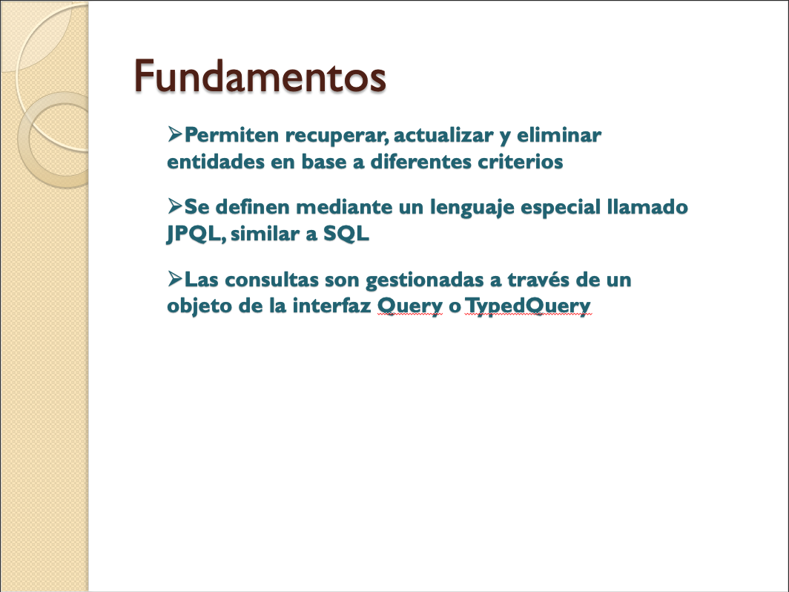
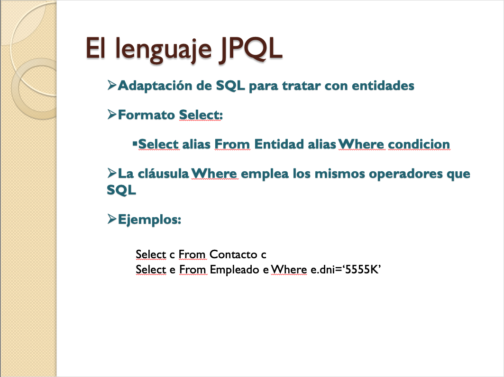
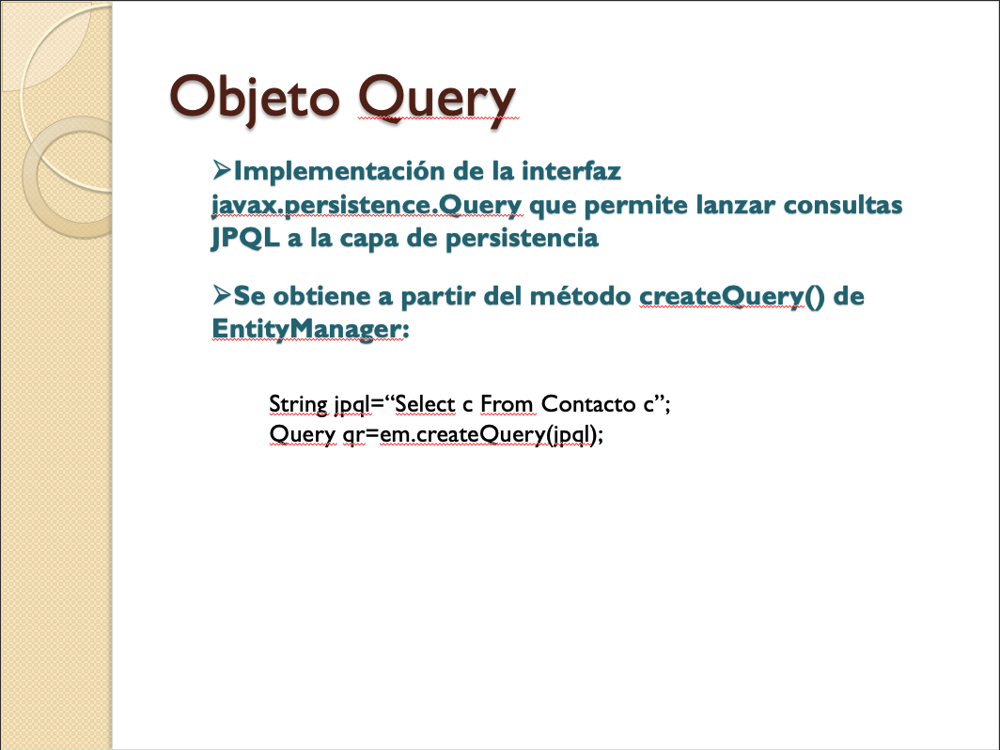
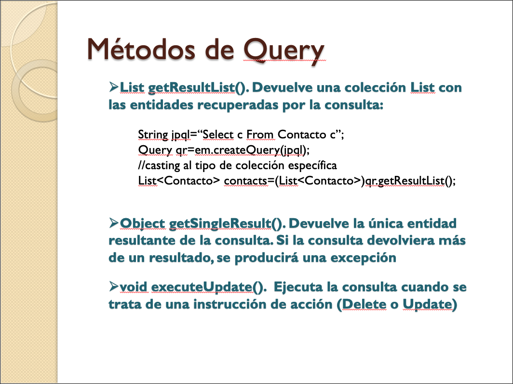
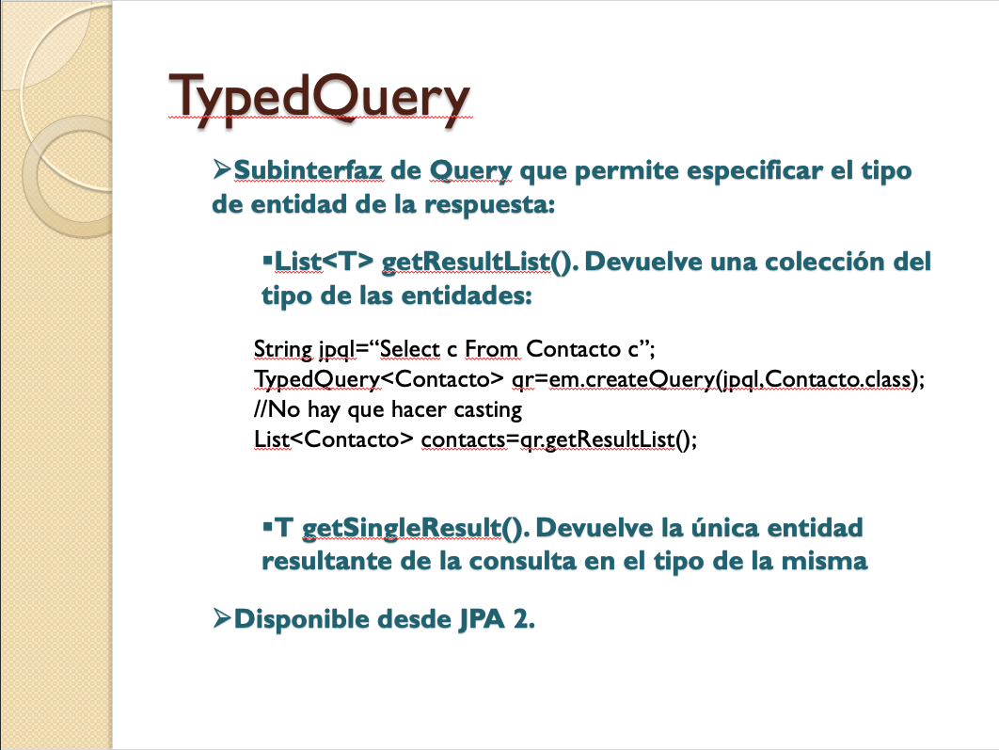

En las Consultas JPA ya no usamos el Objeto `EntityManager` usamos los objetos `Query` y `TypeQuery` los cuales usan el el lenguaje JPQL que es parecido al SQL, pero aplicado a Entidades en lugar de Tablas.

Con la información previa ya podemos realizar el método `recuperarCandidatos()`.

Vamos a hacer una primera versión usando `Query`

```java
public List<Candidato> recuperarCandidatos(){
   String jpql = "Select c From Candidato c";
   Query query = em.createQuery(jpql);
   return (List<Candidato>)query.getResultList();
}
```

Debemos definir un `String` con la sentencia JPQL, donde no seleccionamos atributos especificos sino que ponemos un alias `Select c `, en el `From Candidato c` hacemos referencia a la Entidad **NO A LA TABLA** usando el alias al final. Usando el `EntityManager` creamos un Objeto `Query` usando el método `createQuery` al que le pasamos la sentencia JPQL `Query query = em.createQuery(jpql)` el resultado se almacena en `query`. Con el método `getResultList()` retorna el resultado en una `List` sin tipo, necesitamos por lo tanto hacer un casting a `(List<Candidato>)` que es lo que necesitamos retornar.

Si hasta aquí probamos nuestra aplicación, comprobamos que todo funciona correctamente.

Alternativamente al uso de `Query` podemos usar `TypeQuery`, vamos a ver como queda el mismo método con su uso:

```java
public List<Candidato> recuperarCandidatos(){
   String jpql = "Select c From Candidato c";
   //Query query = em.createQuery(jpql);
   //return (List<Candidato>)query.getResultList();
   TypedQuery<Candidato> query = em.createQuery(jpql, Candidato.class);
   return query.getResultList();
}
```

La principal diferencia entre `Query` y `TypeQuery` como su nombre lo indica es es un Query tipado, por un lado ponemos el generico en el `TypeQuery` y por otro lado incluimos como parámetro la Clase en el método `createQuery`. El resultado ya es del tipo indicado por lo cual ya no es necesario hacer el Casting.

Vamos a ver algunos otros ejemplos para familiarizarnos con las Consultas JPA, pero antes vamos a ver que son las Consultas Parametrizadas.

### Consultas Parametrizadas


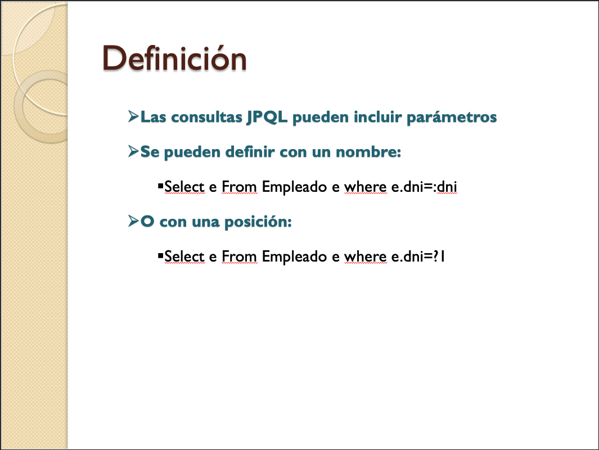
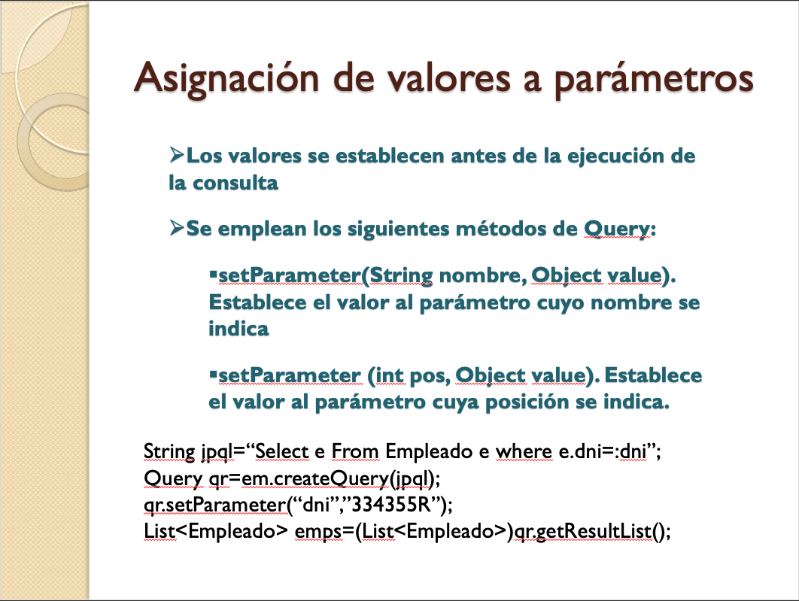

### Consultas de Acción


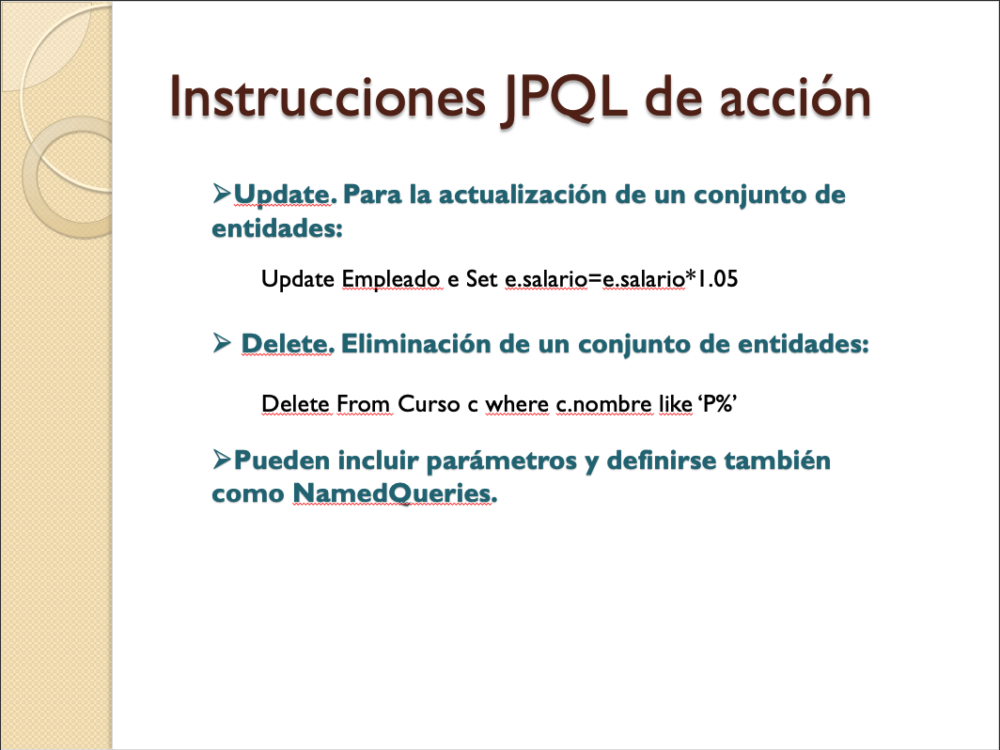
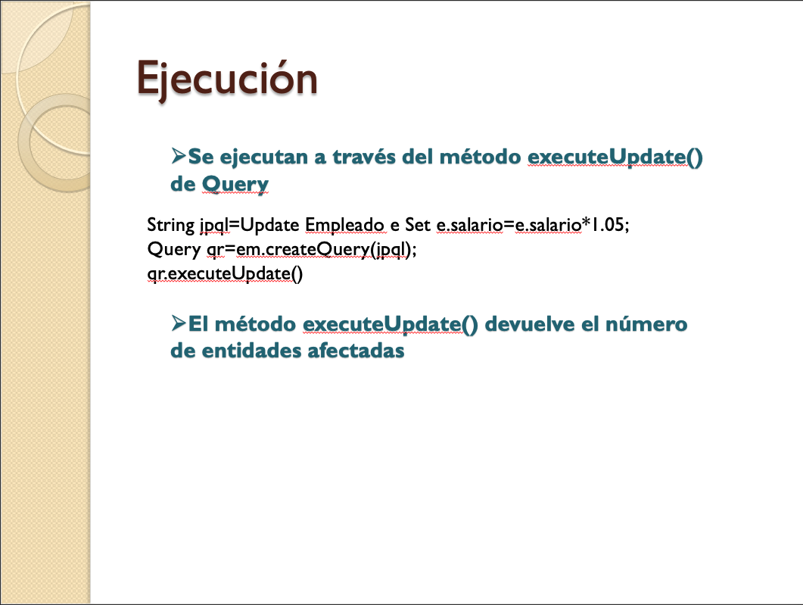

¿Cómo recuperariamos los Candidatos de un Puesto determinado?

```java
public List<Candidato> recuperarCandidatosPuesto(String puesto){
   String jpql = "Select c From Candidato c Where c.puesto = ?1";
   TypedQuery<Candidato> query = em.createQuery(jpql, Candidato.class);
   query.setParameter(1, puesto);
   return query.getResultList();
}
```

¿Cómo buscar un Candidato por su Email?

```java
public Candidato buscarCandidatoPorEmail(String email){
   String jpql = "Select c From Candidato c Where c.email = ?1";
   TypedQuery<Candidato> query = em.createQuery(jpql, Candidato.class);
   query.setParameter(1, email);
		
   // 1er Forma de hacerlo
   /*
   List<Candidato> candidatos = query.getResultList();
   return candidatos.size()>0  ? candidatos.get(0):null;
   */
		
   //2da Forma //Si no encuentra o encuentra más de 1 devuelve excepcion
   try {
      return query.getSingleResult();
   }catch(NoResultException | NonUniqueResultException ex) {
      return null;
   }	
}
```

Aquí planteamos dos soluciones, en la primer recuperamos una lista de Candidatos por su email y si exiten datos en la lista retornamos el primer elemento y si no retornamos `null`.

En la segunda solución de igual manera recuperamos una lista de Candidatos por su email, ***esperando que nos va a retornar solo un valor***, por lo cual usamos el método `getSingleResult()` que retorna un único valor del tipo declarado. Pero en el caso que no exista ningún resultado se dispara la excepción `NoResultException` y si se tiene más de 1 resultado se dispara la excepción `NonUniqueResultException` por lo cual se retorna `null`.

**NOTA:** ***En JPA todas las excepciones son unchecked, por lo que hay que tener sus precauciones para implentarlas cuando sean necesarias.****

¿Cómo eliminamos un Candidato por su Email?

```java
public void eliminarCandidatoPorEmail(String email){	
   EntityTransaction tx=em.getTransaction();
   tx.begin(); //inicio tx siempre que sea consulta de acción
   String jpql = "Delete From Candidato c Where c.email = ?1";
   Query query = em.createQuery(jpql);
   query.setParameter(1, email);
   query.executeUpdate();
   tx.commit();
}
```

En este método como estamos trabajando con una operación de acción necesitamos usar una transacción. Por otro lado como no vamos a retornar nigún resultado podemos usar simplemente `Query`. Para ejecutar la sentencia usamos em método `query.executeUpdate();`
 
El código completo de la Clase `CandidatosService` es:
 
```java
package service;

import java.util.List;

import javax.persistence.EntityManager;
import javax.persistence.EntityManagerFactory;
import javax.persistence.EntityTransaction;
import javax.persistence.NoResultException;
import javax.persistence.Persistence;
import javax.persistence.Query;
import javax.persistence.TypedQuery;

import org.hibernate.NonUniqueResultException;

import model.Candidato;

public class CandidatosService {
	
   private static EntityManager em;
   static {
      EntityManagerFactory factory=Persistence.createEntityManagerFactory("empresaPU");
      em=factory.createEntityManager();
   }
	
   public void altaCandidato(Candidato candidato) {
      EntityTransaction tx = em.getTransaction();
      tx.begin();
      em.persist(candidato);
      tx.commit();
   }
	
   public void eliminarCandidato(int idCandidato) {
      Candidato candidato=em.find(Candidato.class, idCandidato);
		
      EntityTransaction tx = em.getTransaction();
      tx.begin();
      if(candidato!=null) {
         em.remove(candidato);
      }
      tx.commit();
   }
	
   public List<Candidato> recuperarCandidatos(){
      String jpql = "Select c From Candidato c";
      //Query query = em.createQuery(jpql);
      //return (List<Candidato>)query.getResultList();
      TypedQuery<Candidato> query = em.createQuery(jpql, Candidato.class);
      return query.getResultList();
   }
	
   public List<Candidato> recuperarCandidatosPuesto(String puesto){
      String jpql = "Select c From Candidato c Where c.puesto = ?1";
      TypedQuery<Candidato> query = em.createQuery(jpql, Candidato.class);
      query.setParameter(1, puesto);
      return query.getResultList();
   }
	
   public Candidato buscarCandidatoPorEmail(String email){
      String jpql = "Select c From Candidato c Where c.email = ?1";
      TypedQuery<Candidato> query = em.createQuery(jpql, Candidato.class);
      query.setParameter(1, email);
		
      // 1er Forma de hacerlo
      /*
      List<Candidato> candidatos = query.getResultList();
      return candidatos.size()>0  ? candidatos.get(0):null;
      */
		
      //2da Forma //Si no encuentra o encuentra más de 1 devuelve excepcion
      try {
         return query.getSingleResult();
      }catch(NoResultException | NonUniqueResultException ex) {
         return null;
      }
		
   }
	
   public void eliminarCandidatoPorEmail(String email){	
      EntityTransaction tx=em.getTransaction();
      tx.begin(); //inicio tx siempre que sea consulta de acción
      String jpql = "Delete From Candidato c Where c.email = ?1";
      Query query = em.createQuery(jpql);
      query.setParameter(1, email);
      query.executeUpdate();
      tx.commit();
	}
}
```

### La Capa de Vista 

Esta capa no ha sufrido ningun cambio.

### Probar la Aplicación

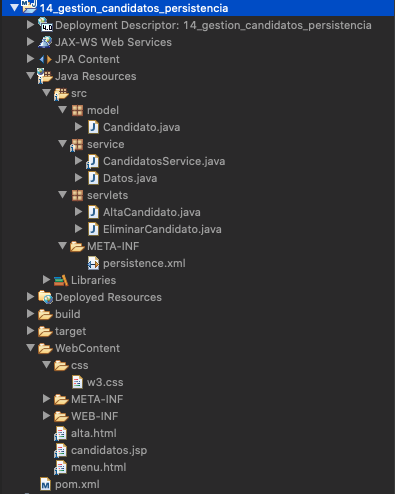

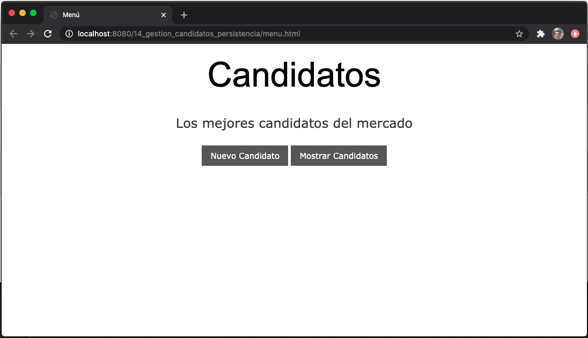
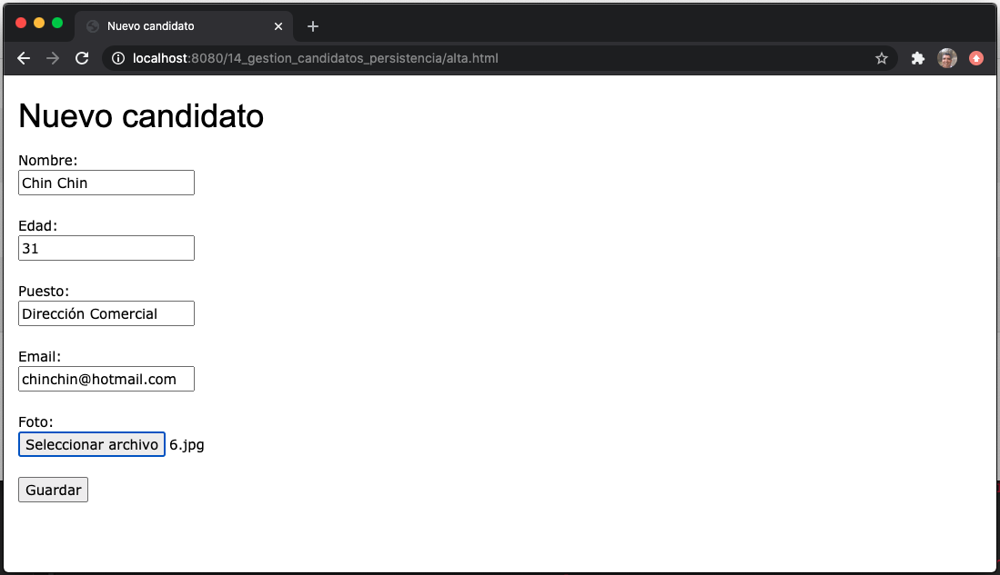
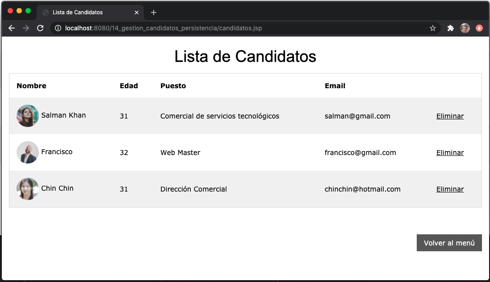
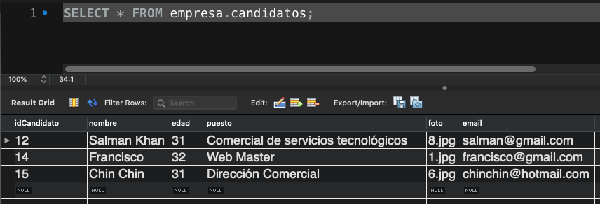

## :computer: `15_gestion_candidatos_persistencia_eliminacion`<br/>&nbsp;&nbsp;&nbsp;&nbsp;&nbsp;&nbsp;&nbsp;&nbsp;&nbsp;Segundo Ejemplo JPA

Partiendo del proyecto `14_gestion_candidatos_persistencia` vamos a crear el proyecto `15_gestion_candidatos_persistencia_eliminacion` en el cual vamos a implementar la funcionalidad de eliminar el Contacto por Email.


Nuestra pantalla de Menú debe incluir la nueva opción de Eliminar por Email.

`menu.html`

```html
<!DOCTYPE html>
<html>
<head>
<meta charset="ISO-8859-1">
<title>Menú</title>
<link rel="stylesheet" type="text/css" href="css/w3.css">
</head>
<body>
   <div align="center">
      <h1 class="w3-jumbo">Candidatos</h1>
      <p class="w3-xlarge w3-text-dark-grey">Los mejores candidatos del mercado</p>
  	  <a href="alta.html" class="w3-button w3-dark-grey">Nuevo Candidato</a>
      <a href="candidatos.jsp" class="w3-button w3-dark-grey">Mostrar Candidatos</a>
      <a href="eliminarcandidatoxemail.html" class="w3-button w3-dark-grey">Eliminar Candidatos por Email</a>
   </div>
</body>
</html>
```

Tenemos una nueva página HTML para capturar el Email del contacto que queremos eliminar.

`eliminarcandidatoxemail.html`

```html
<!DOCTYPE html>
<html>
<head>
<meta charset="ISO-8859-1">
<title>Nuevo candidato</title>
<link rel="stylesheet" type="text/css" href="css/w3.css">
</head>
<body>
   <div class="w3-padding">
      <h1>Eliminar Candidato por email</h1>
      <form action="EliminarCandidatoPorEmail" method="post">	
         <label for="email">Email:</label><br>
         <input type="email" name="email" placeholder="Introduce tu email" required="required"><br/><br/>
			
         <input type="submit" value="Eliminar">	
      </form>
   </div>
</body>
</html>
```

En caso de que el email no exista vamos a mostrar una nueva pantalla indicando que ese email no existe.

`noexisteemail.html`

```html
<!DOCTYPE html>
<html>
<head>
<meta charset="UTF-8">
<title>No existe el Email</title>
<link rel="stylesheet" type="text/css" href="css/w3.css">
</head>
<body>
   <div align="center" class="w3-padding">
      <h1>No existe el Email.</h1>
   </div>
   <br><br>
   <div align="right" class="w3-padding">
      <a href="menu.html" class="w3-button w3-dark-grey">Volver al menú</a>
   </div>
</body>
</html>
```

Para eliminar el Contacto por Email necesitamos un nuevo Servlet `EliminarCandidatoPorEmail` con el siguiente código.

`EliminarCandidatoPorEmail`

```java
package servlets;

import java.io.IOException;

import javax.servlet.ServletException;
import javax.servlet.annotation.WebServlet;
import javax.servlet.http.HttpServlet;
import javax.servlet.http.HttpServletRequest;
import javax.servlet.http.HttpServletResponse;

import model.Candidato;
import service.CandidatosService;

@WebServlet("/EliminarCandidatoPorEmail")
public class EliminarCandidatoPorEmail extends HttpServlet {
   private static final long serialVersionUID = 1L;

   protected void service(HttpServletRequest request, HttpServletResponse response) throws ServletException, IOException {
      CandidatosService service = new CandidatosService();
      String email=request.getParameter("email");
      Candidato candidato = service.buscarCandidatoPorEmail(email);
      if (candidato != null ) {
         service.eliminarCandidatoPorEmail(email);
         request.getRequestDispatcher("menu.html").forward(request, response);
      }else {
         request.getRequestDispatcher("noexisteemail.html").forward(request, response);
      }	
   }
}
```

En este nuevo Servlet usamos dos de los métodos implementados en `CandidatosService` con consultas JPA, primero recuperamos el Candidato por Email si existe lo eliminamos y nos vamos a la pantalla de menú, si no existe mostramos una pantalla indicandolo.

Básicamente eso es todo lo que teniamos que hacer para implementar la funcionalidad de Eliminar Contacto por Email.

### Probar la Aplicación.

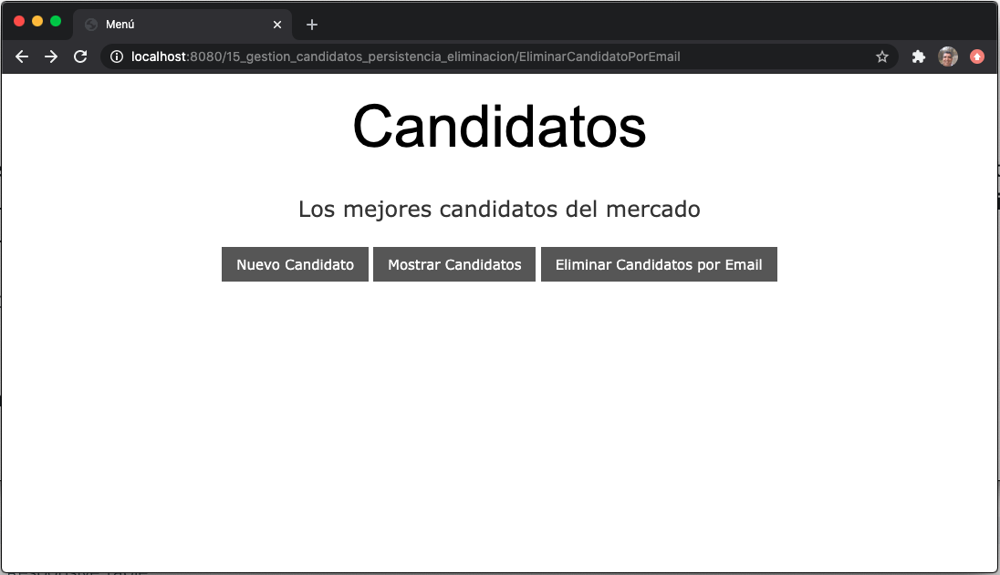
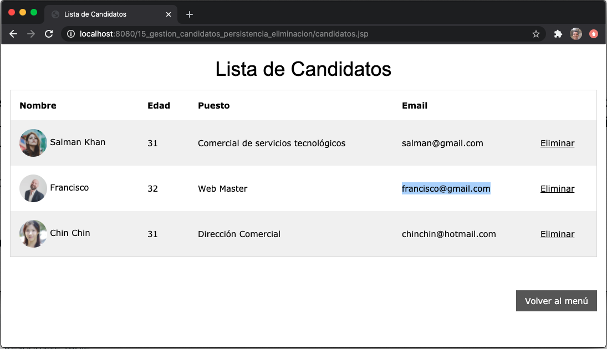
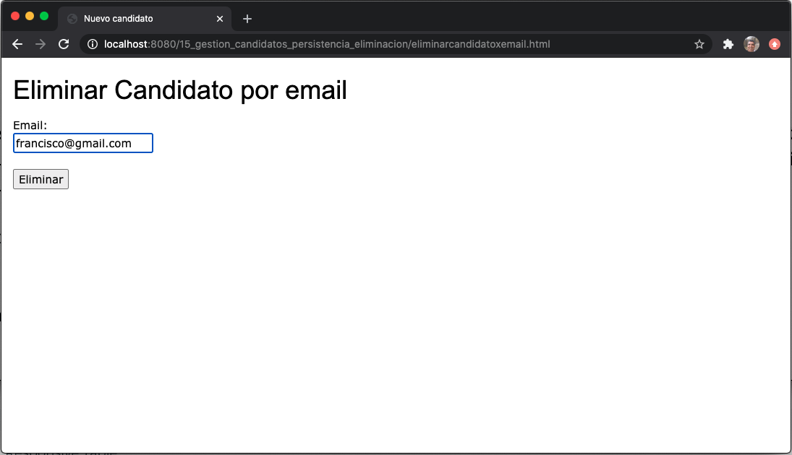
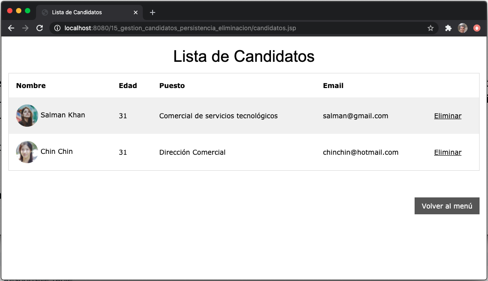
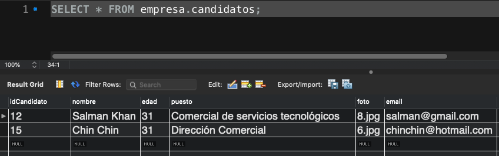

### Named Queries o Consultas Nominadas


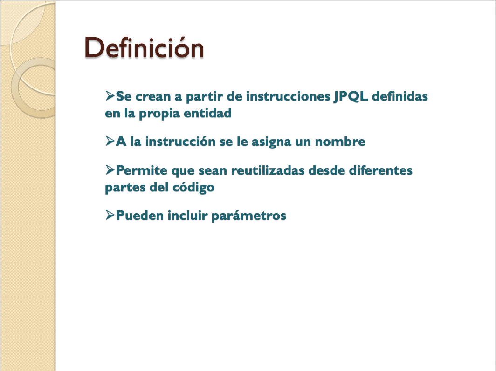
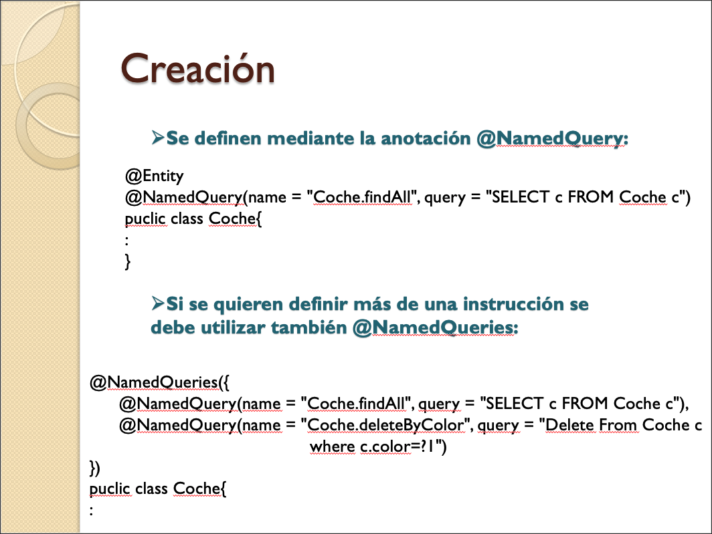
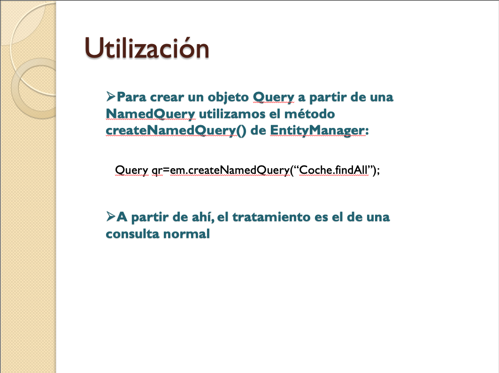

Las Named Queries nos permiten limpiar nuestras consultas JPA de la capa de Servicio y a la vez siverve para la reutilización de código ya que las sentencias estan en las Entidades y cualquier otra clase que use esas entidades ya puede usar esas sentencias. Como desventaja no se ve exactamente lo que se ejecuta desde las Clases que usen las Entidades siempre habría que consultar la Entidad para visualizar la consulta.

## :computer: `16_gestion_candidatos_persistencia_namedquery`<br/>&nbsp;&nbsp;&nbsp;&nbsp;&nbsp;&nbsp;&nbsp;&nbsp;&nbsp;Tercer Ejemplo JPA con Named Query

Partiendo del proyecto `15_gestion_candidatos_persistencia_eliminacion` vamos a crear el proyecto `16_gestion_candidatos_persistencia_namedquery` en el cual vamos a pasar todas las sentencias JPQL desde la clase  `CandidatosService` al la Entidad `Contacto`.

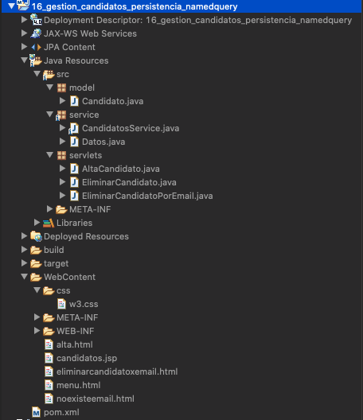

Nuestra Entidad `Candidato` modificada nos queda así:

`Candidato`

```java
package model;

import java.io.Serializable;
import javax.persistence.*;


/**
 * The persistent class for the candidatos database table.
 * 
 */
@Entity
@Table(name="candidatos")
@NamedQuery(name="Candidato.findAll", query="SELECT c FROM Candidato c")
@NamedQuery(name="Candidato.findByPuesto", query="Select c From Candidato c Where c.puesto = ?1")
@NamedQuery(name="Candidato.findByEmail", query="Select c From Candidato c Where c.email = ?1")
@NamedQuery(name="Candidato.deleteByEmail", query="Delete From Candidato c Where c.email = ?1")
public class Candidato implements Serializable {
   private static final long serialVersionUID = 1L;

   @Id
   @GeneratedValue(strategy=GenerationType.IDENTITY)
   private int idCandidato;

   @Column(name="edad")
   private int edad;

   private String email;
   private String foto;
   private String nombre;
   private String puesto;

   public Candidato() {
   }

   public Candidato(int idCandidato, int edad, String email, String foto, String nombre, String puesto) {
      super();
      this.idCandidato = idCandidato;
      this.edad = edad;
      this.email = email;
      this.foto = foto;
      this.nombre = nombre;
      this.puesto = puesto;
   }

   public int getIdCandidato() {
      return this.idCandidato;
   }

   public void setIdCandidato(int idCandidato) {
      this.idCandidato = idCandidato;
   }

   public int getEdad() {
      return this.edad;
   }

   public void setEdad(int edad) {
      this.edad = edad;
   }

   public String getEmail() {
      return this.email;
   }

   public void setEmail(String email) {
      this.email = email;
   }

   public String getFoto() {
      return this.foto;
   }

   public void setFoto(String foto) {
      this.foto = foto;
   }

   public String getNombre() {
      return this.nombre;
   }

   public void setNombre(String nombre) {
      this.nombre = nombre;
   }

   public String getPuesto() {
      return this.puesto;
   }

   public void setPuesto(String puesto) {
      this.puesto = puesto;
   }

}
```

Lo que hemos hecho en la Entidad es añadir las siguientes anotaciones:

```java
@NamedQuery(name="Candidato.findAll", query="SELECT c FROM Candidato c")
@NamedQuery(name="Candidato.findByPuesto", query="Select c From Candidato c Where c.puesto = ?1")
@NamedQuery(name="Candidato.findByEmail", query="Select c From Candidato c Where c.email = ?1")
@NamedQuery(name="Candidato.deleteByEmail", query="Delete From Candidato c Where c.email = ?1")
```

Son las sentencias JPQL que teniamos en la Clase `CandidatosService` y las hemos colocandolas aquí asignandoles un nombre.

La Clase `CandidatosService` obviamente se ha modificado quedando así:

```java
package service;

import java.util.List;

import javax.persistence.EntityManager;
import javax.persistence.EntityManagerFactory;
import javax.persistence.EntityTransaction;
import javax.persistence.NoResultException;
import javax.persistence.Persistence;
import javax.persistence.Query;
import javax.persistence.TypedQuery;

import org.hibernate.NonUniqueResultException;

import model.Candidato;

public class CandidatosService {
	
   private static EntityManager em;
   static {
      EntityManagerFactory factory=Persistence.createEntityManagerFactory("empresaPU");
      em=factory.createEntityManager();
   }
   
   public void altaCandidato(Candidato candidato) {
      EntityTransaction tx = em.getTransaction();
      tx.begin();
      em.persist(candidato);
      tx.commit();
   }
	
   public void eliminarCandidato(int idCandidato) {
      Candidato candidato=em.find(Candidato.class, idCandidato);
		
      EntityTransaction tx = em.getTransaction();
      tx.begin();
      if(candidato!=null) {
         em.remove(candidato);
      }
      tx.commit();
   }
	
   public List<Candidato> recuperarCandidatos(){	
      //Query query = em.createQuery(jpql);
      //return (List<Candidato>)query.getResultList();
      TypedQuery<Candidato> query = em.createNamedQuery("Candidato.findAll", Candidato.class);
      return query.getResultList();
   }
	
   public List<Candidato> recuperarCandidatosPuesto(String puesto){
      TypedQuery<Candidato> query = em.createNamedQuery("Candidato.findByPuesto", Candidato.class);
      query.setParameter(1, puesto);
      return query.getResultList();
   }
	
   public Candidato buscarPorCandidato(String email){
      TypedQuery<Candidato> query = em.createNamedQuery("Candidato.findByEmail", Candidato.class);
      query.setParameter(1, email);
		
      // 1er Forma de hacerlo
      /*
      List<Candidato> candidatos = query.getResultList();
      return candidatos.size()>0  ? candidatos.get(0):null;
      */
		
      //2da Forma //Si no encuentra o encuentra más de 1 devuelve excepcion
      try {
         return query.getSingleResult();
      }catch(NoResultException | NonUniqueResultException ex) {
         return null;
      }	
   }
	
   public void eliminarCandidatoPorEmail(String email){	
      EntityTransaction tx=em.getTransaction();
      tx.begin(); //inicio tx siempre que sea consulta de acción
      Query query = em.createNamedQuery("Candidato.deleteByEmail");
      query.setParameter(1, email);
      query.executeUpdate();
      tx.commit();	
   }
}
```

En esta clase hemos quitado todas las sentencias JPQL y donde se se utilizaba colocamos el nombre que le asignamos en la Entidad.

### Probar la Aplicación


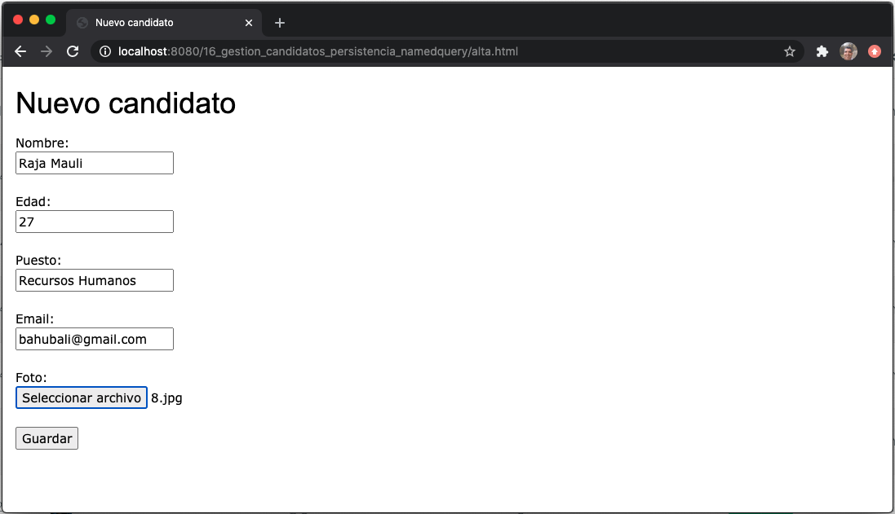
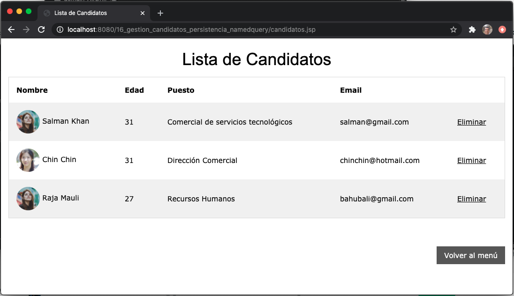
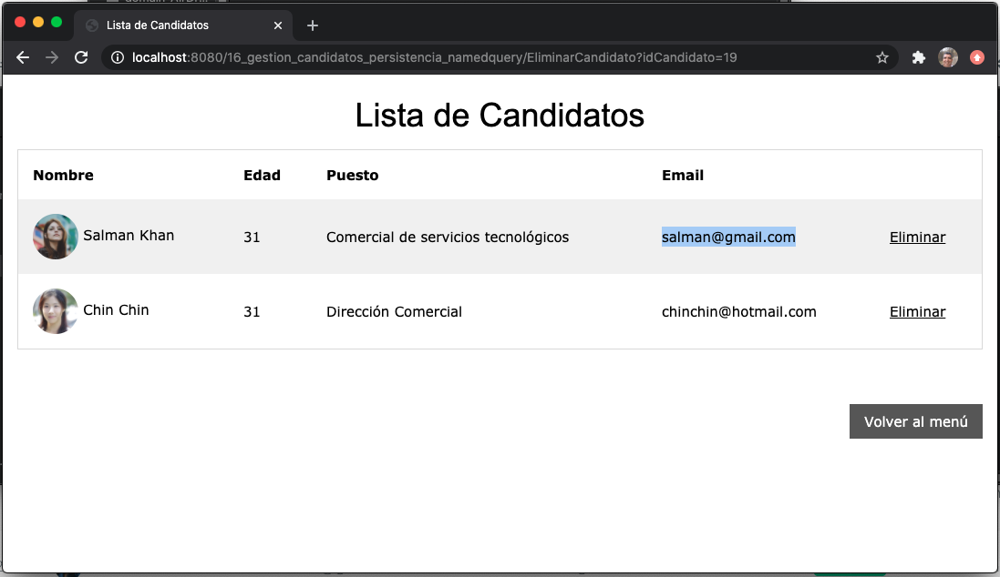
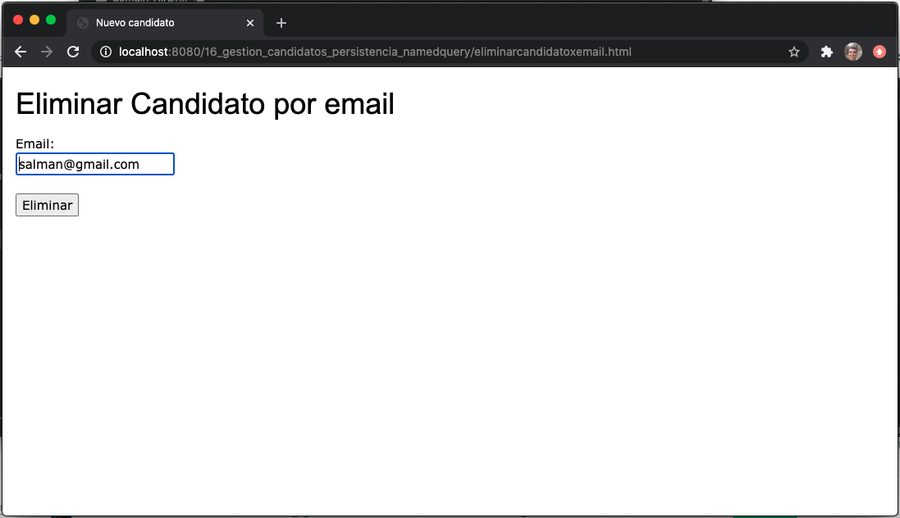
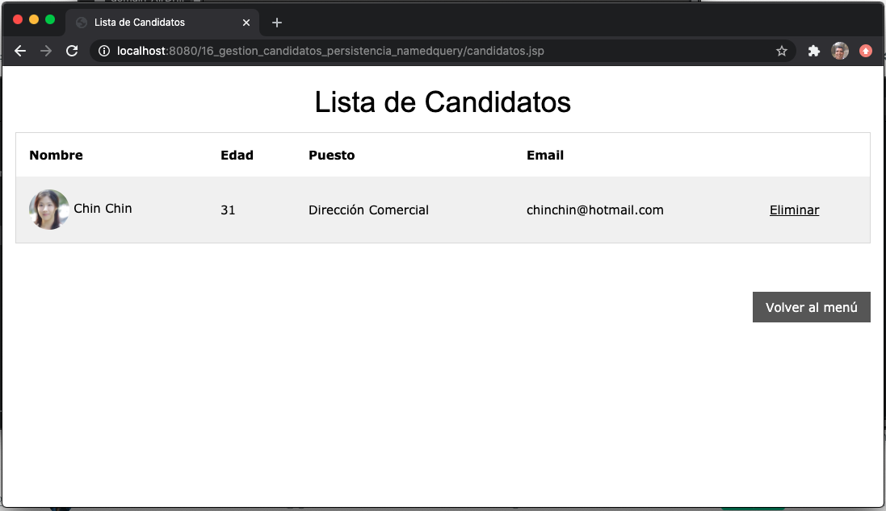
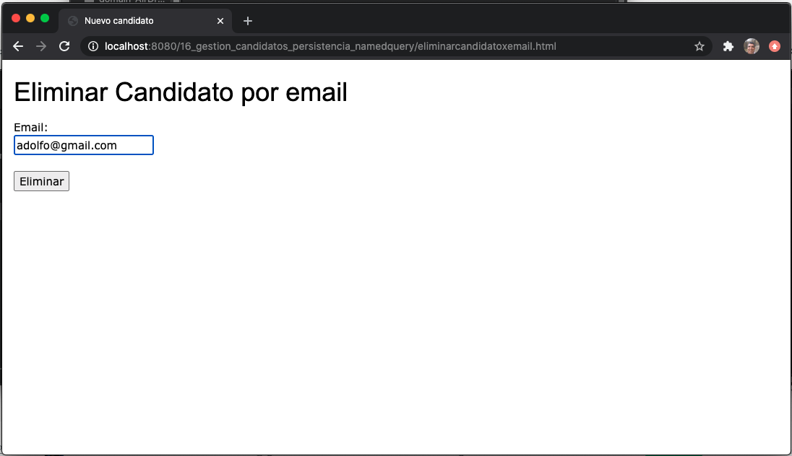
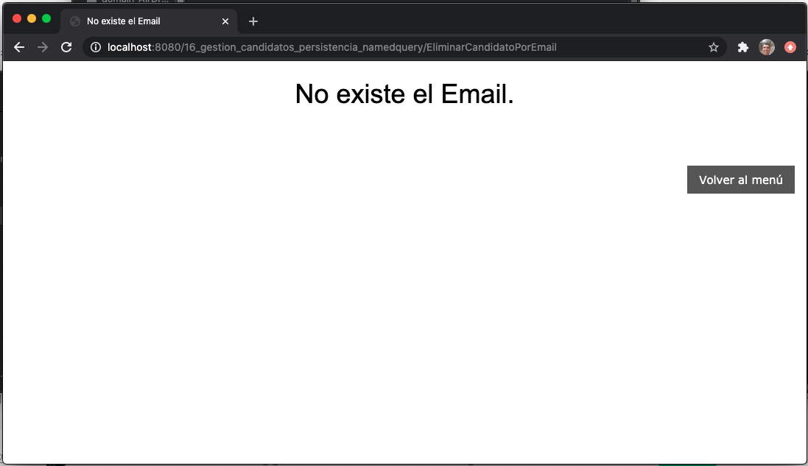

## MVC


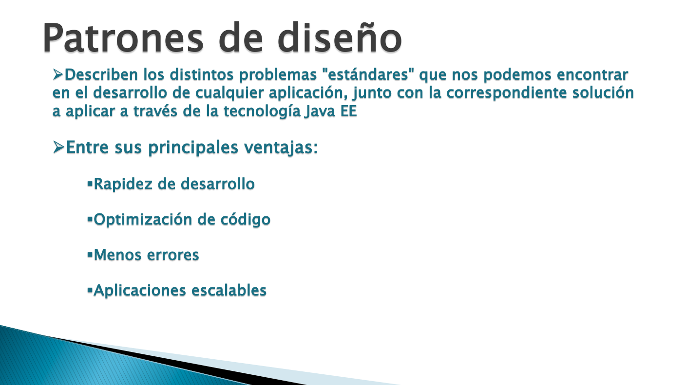
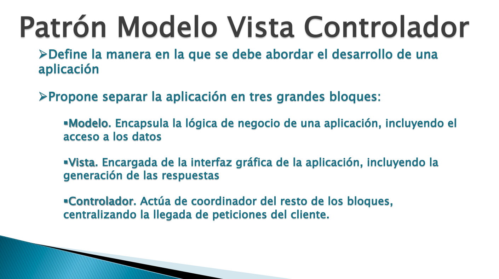
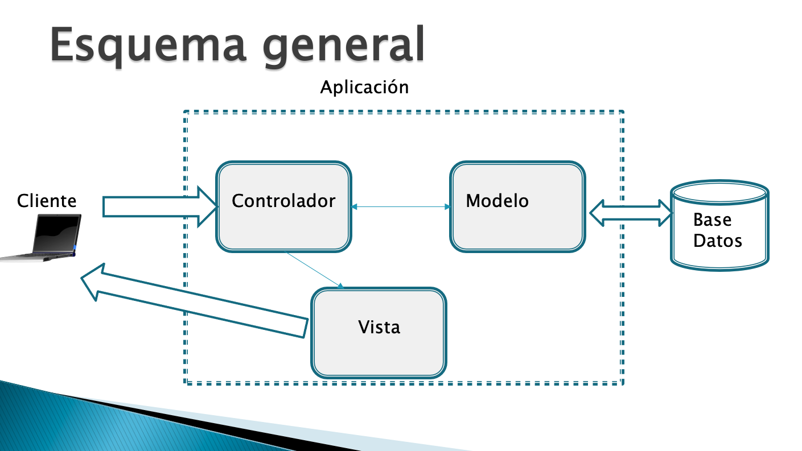
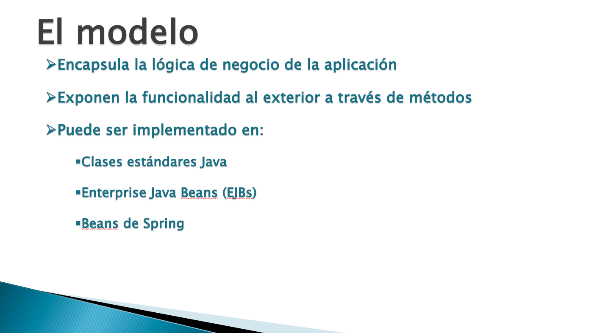
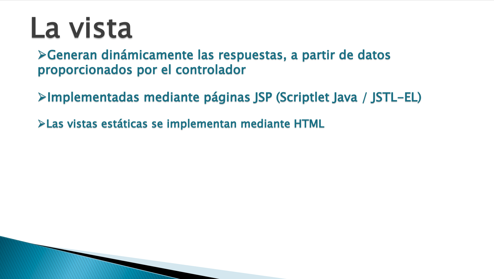
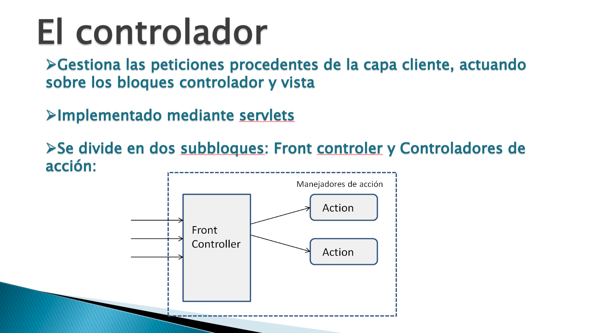


## :computer: `17_gestion_candidatos_persistencia_mvc`<br/>&nbsp;&nbsp;&nbsp;&nbsp;&nbsp;&nbsp;&nbsp;&nbsp;&nbsp;Primer Ejemplo MVC y JPA

Partiendo de la aplicación `16_gestion_candidatos_persistencia_namedquery` vamos a crear la versión MVC de nuestro proyecto `17_gestion_candidatos_persistencia_mvc`.

IMAGEN PIZARRA


Este cambio principalmente afecta a los Servlets y la Capa de Vista.

A los Servlets existentes los vamos a Renombrar para que terminen con `Action` para saber que son Controladores Actions y desde ningún Controladores Actions debemos invocar a ninguna vista que es una de las cosas que debemos cambiar en estos Servlets.

* En el Servlet `AltaCandidatoAction` los cambios son:

`AltaCandidatoAction`

```java
package servlets;

import java.io.IOException;

import javax.servlet.ServletException;
import javax.servlet.annotation.MultipartConfig;
import javax.servlet.annotation.WebServlet;
import javax.servlet.http.HttpServlet;
import javax.servlet.http.HttpServletRequest;
import javax.servlet.http.HttpServletResponse;
import javax.servlet.http.Part;

import model.Candidato;
import service.CandidatosService;

@MultipartConfig //permite al servlet procesar objetos Part (objetos binarios)
@WebServlet("/AltaCandidatoAction")
public class AltaCandidatoAction extends HttpServlet {
	
   private static final long serialVersionUID = 1L;

   protected void service(HttpServletRequest request, HttpServletResponse response) throws ServletException, IOException {
      CandidatosService service = new CandidatosService();
		
      String nombre=request.getParameter("nombre");
      int edad=Integer.parseInt(request.getParameter("edad"));
      String puesto=request.getParameter("puesto");
      String email=request.getParameter("email");
      Part foto=request.getPart("foto");
		
      String nombreFichero=obtenerNombreFichero(foto);
      guardarFicheroEnServidor(request,foto,nombreFichero);
		
      Candidato cand = new Candidato(0,edad,email,nombreFichero,nombre,puesto);
      service.altaCandidato(cand);
		
      //request.getRequestDispatcher("menu.html").forward(request, response);

   }
	
   private String obtenerNombreFichero(Part part) {
      for (String cd : part.getHeader("content-disposition").split(";")) { 
         if (cd.trim().startsWith("filename")) { 
            String fileName = cd.substring(cd.indexOf('=') + 1).trim().replace("\"", ""); 
            return fileName.substring(fileName.lastIndexOf('/') + 1).substring(fileName.lastIndexOf('\\') + 1); // MSIE fix. 
         } 
      } 
      return null; 
   }
	
   private void guardarFicheroEnServidor(HttpServletRequest request, Part part, String nombreFichero) {
      String url=request.getServletContext().getRealPath("/");
      try {
         //part.write(url+"\\"+nombreFichero);		//Windows
         part.write(url+"/"+nombreFichero);		//Mac
      } catch (IOException e) {
         e.printStackTrace();
      }
   }
	
}
```

Comentamos la llamada a la página `menu.html` ya que esto va a ser tarea del FrontController.

* En el Servlet `EliminarCandidatoPorEmailAction` los cambios son los siguientes:

`EliminarCandidatoPorEmailAction`

```java
package servlets;

import java.io.IOException;

import javax.servlet.ServletException;
import javax.servlet.annotation.WebServlet;
import javax.servlet.http.HttpServlet;
import javax.servlet.http.HttpServletRequest;
import javax.servlet.http.HttpServletResponse;

import service.CandidatosService;


@WebServlet("/EliminarCandidatoPorEmailAction")
public class EliminarCandidatoPorEmailAction extends HttpServlet {
   private static final long serialVersionUID = 1L;

   protected void service(HttpServletRequest request, HttpServletResponse response) throws ServletException, IOException {
      CandidatosService service = new CandidatosService();
      String email=request.getParameter("email");
      if (service.buscarCandidatoPorEmail(email) != null ) {
         service.eliminarCandidatoPorEmail(email);
         request.setAttribute("resultado", true);
         //request.getRequestDispatcher("menu.html").forward(request, response);
      }else {
         request.setAttribute("resultado", false);
         //request.getRequestDispatcher("noexisteemail.html").forward(request, response);
      }	
   }
}
```

Comentamos la llamada a las dos páginas que llamamos pero hemos tenido que meter un atributo de solicitud para que el FronController sepa a que página debe redirigirse.

* En el Servlet `EliminarCandidatoPorIdAction` los cambios son:

`EliminarCandidatoPorIdAction`

```java
package servlets;

import java.io.IOException;

import javax.servlet.ServletException;
import javax.servlet.annotation.WebServlet;
import javax.servlet.http.HttpServlet;
import javax.servlet.http.HttpServletRequest;
import javax.servlet.http.HttpServletResponse;

import service.CandidatosService;

@WebServlet("/EliminarCandidatoPorIdAction")
public class EliminarCandidatoPorIdAction extends HttpServlet {
   private static final long serialVersionUID = 1L;
   
   protected void service(HttpServletRequest request, HttpServletResponse response) throws ServletException, IOException {
      CandidatosService service = new CandidatosService();
      int idCandidato=Integer.parseInt(request.getParameter("idCandidato"));
      service.eliminarCandidato(idCandidato);
      //request.getRequestDispatcher("candidatos.jsp").forward(request, response);
   }
}
```

Simplemente comentamos la llamada a la página `candidatos.jsp`.

* Debemos Crear un Nuevo Servlet `RecupeperarCandidatosAction` que nos ca a poner la lista de Candidatos en un atributo de solicitud, en el proyecto anterior la página JSP lo consultaba directamente del Servicio. El código es el siguiente:

`RecupeperarCandidatosAction`

```java
package servlets;

import java.io.IOException;
import java.util.List;

import javax.servlet.ServletException;
import javax.servlet.annotation.WebServlet;
import javax.servlet.http.HttpServlet;
import javax.servlet.http.HttpServletRequest;
import javax.servlet.http.HttpServletResponse;

import model.Candidato;
import service.CandidatosService;

@WebServlet("/RecuperarCandidatosAction")
public class RecuperarCandidatosAction extends HttpServlet {
   private static final long serialVersionUID = 1L;

   protected void service(HttpServletRequest request, HttpServletResponse response) throws ServletException, IOException {
      CandidatosService service = new CandidatosService();
      List<Candidato> candidatos = service.recuperarCandidatos();
      // guardar los candidatos en un atributo de petición
      // para la página a la que nos enviará el Front Controller
      request.setAttribute("candidatos", candidatos);
   }
}
```

* Debemos crear el Servlet para el `FrontController`, el cual va a ser el encargado todo el flujo de nuestra aplicación. Recibira el parámetro `option` para distingir que petición se esta solicitando y de acuerdo a ella redirigira a una nueva vista o realizará una tarea y posteriormente redirigira a una nueva vista. El código es el siguiente.

`FrontController`

```java
package servlets;

import java.io.IOException;

import javax.servlet.ServletException;
import javax.servlet.annotation.MultipartConfig;
import javax.servlet.annotation.WebServlet;
import javax.servlet.http.HttpServlet;
import javax.servlet.http.HttpServletRequest;
import javax.servlet.http.HttpServletResponse;

@MultipartConfig //permite al servlet procesar objetos Part (objetos binarios)
@WebServlet("/FrontController")
public class FrontController extends HttpServlet {
   private static final long serialVersionUID = 1L;

   protected void service(HttpServletRequest request, HttpServletResponse response) throws ServletException, IOException {
      String option = request.getParameter("option");
      String url = "";
      //en función del valor del parámetro option, decidimos que acción realizar y a que vista
      //hay que pasar la petición
      switch(option) {
         case "toAlta":
            url = "alta.html";
            break;
         case "toEliminarPorEmail":
            url = "eliminarcandidatoxemail.html";
            break;
         case "doRecuperar":
            request.getRequestDispatcher("RecuperarCandidatosAction").include(request, response);
            url = "candidatos.jsp";
            break;
         case "doAlta":
            request.getRequestDispatcher("AltaCandidatoAction").include(request, response);
            url = "menu.html";
            break;
         case "doEliminarPorId":
            request.getRequestDispatcher("EliminarCandidatoPorIdAction").include(request, response);
            //esto se hace para poder recuperar de nuevo la lista de candidatos
            //y que esté a disposición de la página candidatos.jsp
            request.getRequestDispatcher("RecuperarCandidatosAction").include(request, response);
            url="candidatos.jsp";
            break;
         case "toMenu":
            url = "menu.html";
            break;
         case "doEliminarPorEmail":
            request.getRequestDispatcher("EliminarCandidatoPorEmailAction").include(request, response);
            boolean resultado=(boolean)request.getAttribute("resultado");
            url=resultado?"menu.html":"noexisteemail.html";
            break;
      }	
      request.getRequestDispatcher(url).forward(request, response);
   }
}
```

En los archivos HTML y JSP principalmente vamos a cambiar los enlaces a otros HTML, JSP o Servlets los cambiaremos por llamadas al FrontController pasandole el parámetro `option` para que sepa que tarea necesita realizar.

* Página `menu.html`

`menu.html`

```html
<!DOCTYPE html>
<html>
<head>
<meta charset="ISO-8859-1">
<title>Menú</title>
<link rel="stylesheet" type="text/css" href="css/w3.css">
</head>
<body>
   <div align="center">
      <h1 class="w3-jumbo">Candidatos</h1>
      <p class="w3-xlarge w3-text-dark-grey">Los mejores candidatos del mercado</p>
      <a href="FrontController?option=toAlta" class="w3-button w3-dark-grey">Nuevo Candidato</a>
      <a href="FrontController?option=doRecuperar" class="w3-button w3-dark-grey">Mostrar Candidatos</a>
      <a href="FrontController?option=toEliminarPorEmail" class="w3-button w3-dark-grey">Eliminar Candidatos por Email</a>
   </div>
</body>
</html>
```

* Página `alta.html`

`alta.html`

```html
<!DOCTYPE html>
<html>
<head>
<meta charset="ISO-8859-1">
<title>Nuevo candidato</title>
<link rel="stylesheet" type="text/css" href="css/w3.css">
</head>
<body>
   <div class="w3-padding">
      <h1>Nuevo candidato</h1>
      <form action="FrontController?option=doAlta" method="post" enctype="multipart/form-data">	
         <label for="nombre">Nombre:</label><br>
         <input type="text" name="nombre" placeholder="Introduce tu nombre" required="required"><br/><br/>
         <label for="edad">Edad:</label><br>
         <input type="number" name="edad" placeholder="Introduce tu edad" required="required"><br/><br/>
         <label for="puesto">Puesto:</label><br>
         <input type="text" name="puesto" placeholder="Introduce tu puesto" required="required"><br/><br/>
         <label for="email">Email:</label><br>
         <input type="email" name="email" placeholder="Introduce tu email" required="required"><br/><br/>
         <label for="foto">Foto:</label><br>
         <input type="file" name="foto" value="Buscar" accept="image/*"/><br/><br/>
			
         <input type="submit" value="Guardar">	
      </form>
   </div>
</body>
</html>
```

* Página `candidatos.jsp`

`candidatos.jsp`

```html
<%@ page language="java" contentType="text/html; charset=ISO-8859-1"
    pageEncoding="ISO-8859-1" import="java.util.List, model.Candidato, service.CandidatosService"%>
<!DOCTYPE html>
<html>
<head>
<meta charset="ISO-8859-1">
<title>Lista de Candidatos</title>
<link rel="stylesheet" type="text/css" href="css/w3.css">
</head>
<body>
   <% List<Candidato> empleados = (List<Candidato>)request.getAttribute("candidatos");
      if (empleados.size() > 0){%>
         <div align="center" class="w3-padding">
            <h1>Lista de Candidatos</h1>
            <table>
               <tr>
                  <th>Nombre</th>
                  <th>Edad</th>
                  <th>Puesto</th>
                  <th>Email</th>
                  <th></th>
               </tr>
                  <%for(int i=0;i<empleados.size();i++){ %>
                     <tr>
                        <td>"> <span style=""><%=empleados.get(i).getNombre()%></span></td>
                        <td><%=empleados.get(i).getEdad()%></td>	
                        <td><%=empleados.get(i).getPuesto()%></td>
                        <td><%=empleados.get(i).getEmail()%></td>
                        <td><a href="FrontController?option=doEliminarPorId&idCandidato=<%=empleados.get(i).getIdCandidato()%>">Eliminar</a></td>
                     </tr>
                  <%}%>
               </table>
            </div>
      <%}else%>
      <br><br>
      <div align="right" class="w3-padding">
         <a href="FrontController?option=toMenu" class="w3-button w3-dark-grey">Volver al menú</a>
      </div>
</body>
</html>
```

La Lista de Candidatos la recuperamos del atributo de solicitud en lugar del Service.

* Página `eliminarcandidatoxemail.html`

`eliminarcandidatoxemail.html`

```html
<!DOCTYPE html>
<html>
<head>
<meta charset="ISO-8859-1">
<title>Nuevo candidato</title>
<link rel="stylesheet" type="text/css" href="css/w3.css">
</head>
<body>
   <div class="w3-padding">
      <h1>Eliminar Candidato por email</h1>
      <form action="FrontController?option=doEliminarPorEmail" method="post">	
         <label for="email">Email:</label><br>
         <input type="email" name="email" placeholder="Introduce tu email" required="required"><br/><br/>
			
         <input type="submit" value="Eliminar">	
      </form>
   </div>
</body>
</html>
```

* Página `noexisteemail.html`

`noexisteemail.html`

```html
<!DOCTYPE html>
<html>
<head>
<meta charset="UTF-8">
<title>No existe el Email</title>
<link rel="stylesheet" type="text/css" href="css/w3.css">
</head>
<body>
   <div align="center" class="w3-padding">
      <h1>No existe el Email.</h1>
   </div>
   <br><br>
   <div align="right" class="w3-padding">
      <a href="FrontController?option=toMenu" class="w3-button w3-dark-grey">Volver al menú</a>
   </div>
</body>
</html>
```

### Probando la Aplicación


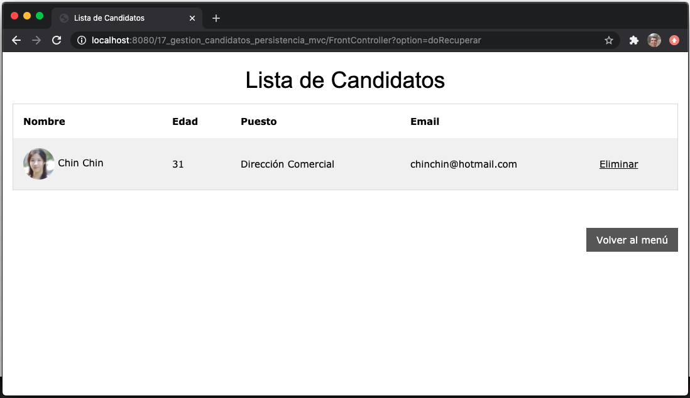

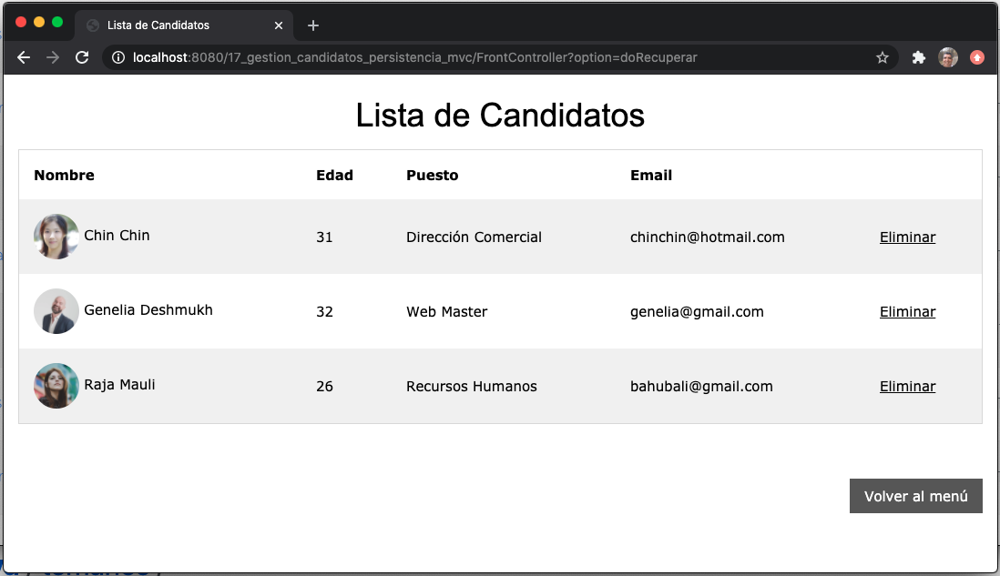

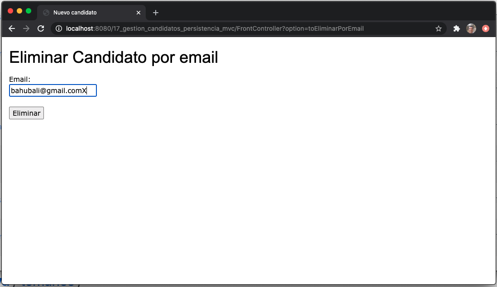
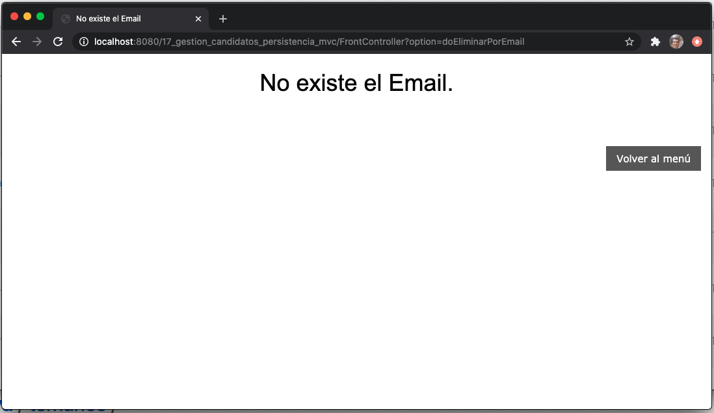


