# 20201112 Jueves

## :computer: `18_formacion_v1`

Vamos a crear un nuevo proyecto partiendo de cero y con una base de datos diferente usando persistencia y el patrón MVC. Vamos a ir poniendo el código de cada sección el proyecto final tiene la siguiente estructura:

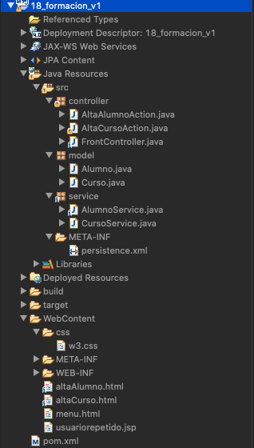

### 01. Base de Datos

En este proyecto usaremos la BD **Formacion** la cual tiene las siguientes tablas:

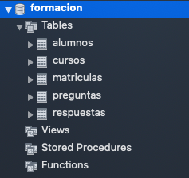

Las tablas que ocuparemos en este proyecto son las de `alumnos` y `cursos` cuyas estructuras son las siguientes:

```sql
CREATE TABLE `cursos` (
  `idCurso` int unsigned NOT NULL AUTO_INCREMENT,
  `nombre` varchar(45) NOT NULL,
  `duracion` int unsigned NOT NULL,
  `fechaInicio` date DEFAULT NULL,
  PRIMARY KEY (`idCurso`)
) ENGINE=InnoDB AUTO_INCREMENT=6 DEFAULT CHARSET=latin1
```

```sql
CREATE TABLE `cursos` (
  `idCurso` int unsigned NOT NULL AUTO_INCREMENT,
  `nombre` varchar(45) NOT NULL,
  `duracion` int unsigned NOT NULL,
  `fechaInicio` date DEFAULT NULL,
  PRIMARY KEY (`idCurso`)
) ENGINE=InnoDB AUTO_INCREMENT=6 DEFAULT CHARSET=latin1
```

### 02. Crear el Proyecto en Eclipse

Creamos el proyecto `18_formacion_v1`.

### 03. Mavenizar el Proyecto y añadir dependencias.

El Archivo `pom.xml` nos queda así:

```html
<project xmlns="http://maven.apache.org/POM/4.0.0" xmlns:xsi="http://www.w3.org/2001/XMLSchema-instance" xsi:schemaLocation="http://maven.apache.org/POM/4.0.0 https://maven.apache.org/xsd/maven-4.0.0.xsd">
  <modelVersion>4.0.0</modelVersion>
  <groupId>18_formacion_v1</groupId>
  <artifactId>18_formacion_v1</artifactId>
  <version>0.0.1-SNAPSHOT</version>
  <packaging>war</packaging>
  <build>
    <sourceDirectory>src</sourceDirectory>
    <plugins>
      <plugin>
        <artifactId>maven-war-plugin</artifactId>
        <version>3.2.3</version>
        <configuration>
          <warSourceDirectory>WebContent</warSourceDirectory>
        </configuration>
      </plugin>
      <plugin>
        <artifactId>maven-compiler-plugin</artifactId>
        <version>3.8.1</version>
        <configuration>
          <release>14</release>
        </configuration>
      </plugin>
    </plugins>
  </build>
  <dependencies>
  	<!-- https://mvnrepository.com/artifact/mysql/mysql-connector-java -->
	<dependency>
	    <groupId>mysql</groupId>
	    <artifactId>mysql-connector-java</artifactId>
	    <version>8.0.19</version>
	</dependency>
	<!-- https://mvnrepository.com/artifact/org.hibernate/hibernate-core -->
	<dependency>
	    <groupId>org.hibernate</groupId>
	    <artifactId>hibernate-core</artifactId>
	    <version>5.4.18.Final</version>
	</dependency>
  </dependencies>
</project>
```

### 04. Añadir la Característica JPA al Proyecto

En las propiedades de la proyecto seleccionar **Project Facets** y marcamos la opción JPA con la versión 2.2

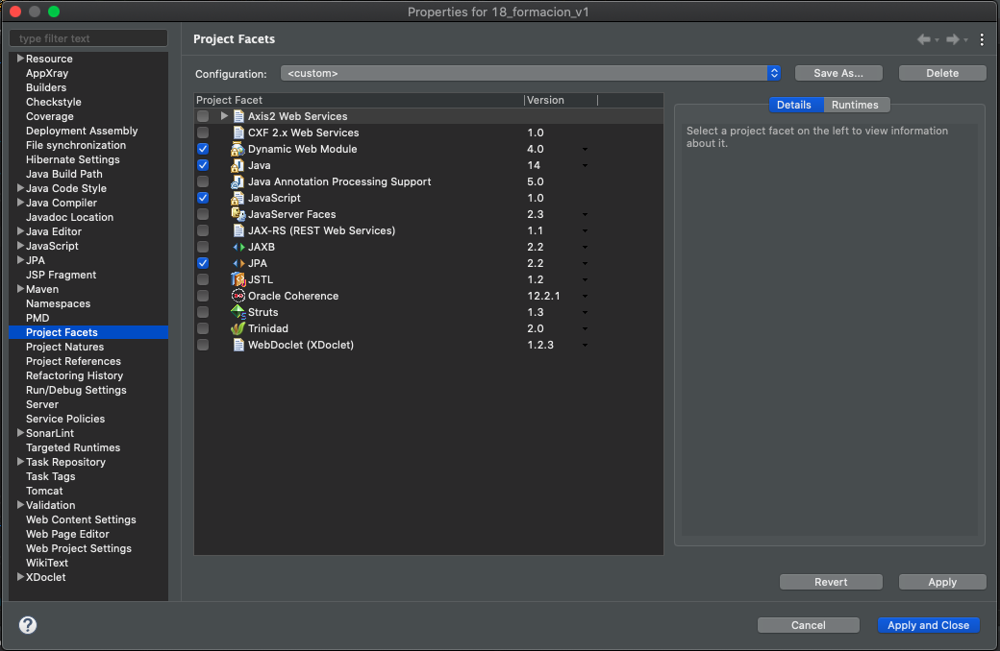

Al hacer esto se incluye el archivo `persistence.xml` con la información más básica.

### 05. Generer las Entidades desde las Tablas...

Vamos a generar las Entidades desde las tablas usando la siguiente opción:

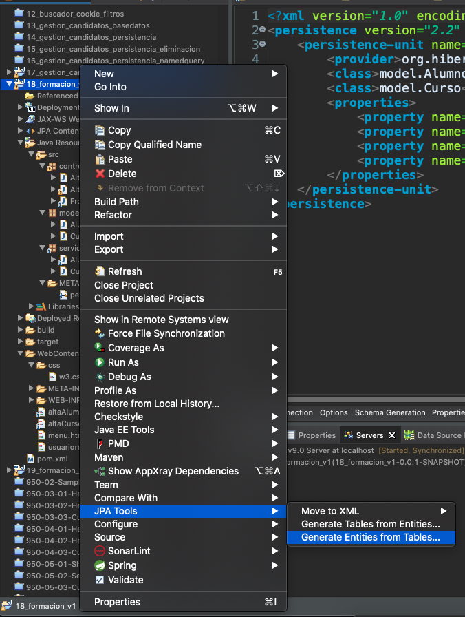

Vamos a crear una nueva conexión para la BD `formacion` pulsando en el botón de creación de Conexión

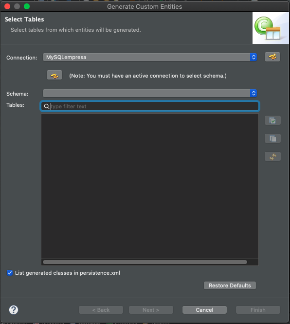

Indicamos el tipo de BD y le damos el nombre `MySQLFormacion`

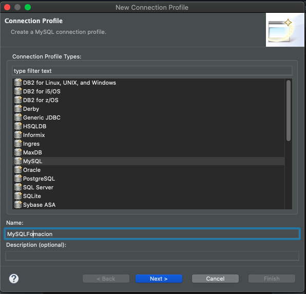

Como en el proyecto pasado ya habíamos creado la conexión `MySQL JDBC Driver` solo completamos los datos de la BD a usar.

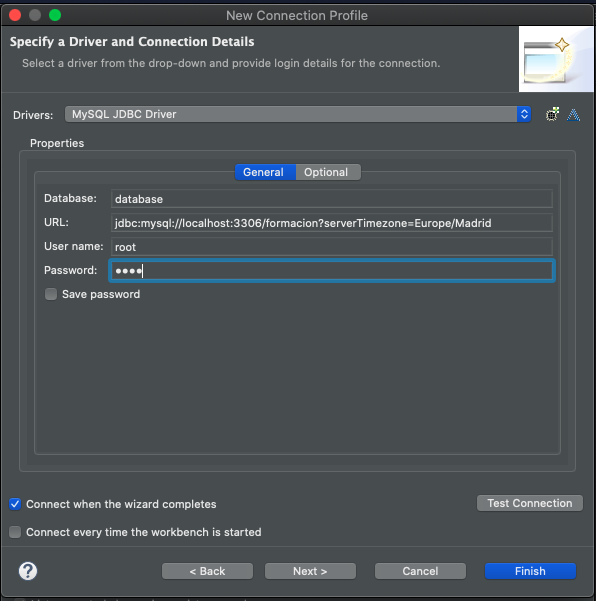

Hacemos un Test para comprobar que la conexión es correcta.


En el último paso simplemente nos muestra un resumen para comprobar que todo es correcto, pulsamos en Finish.

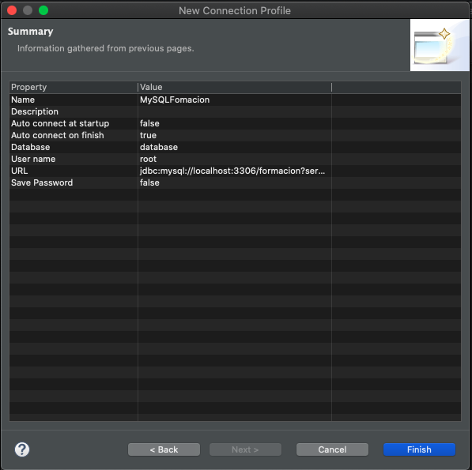

Nos retorna a la pantalla previa, ya tenemos nuestra conexión en Schema marcamos ***database*** y aparecen las tablas de la BD formación, vamos a seleccionar las dos que nos interesan por el momento `alumnos` y `cursos` 

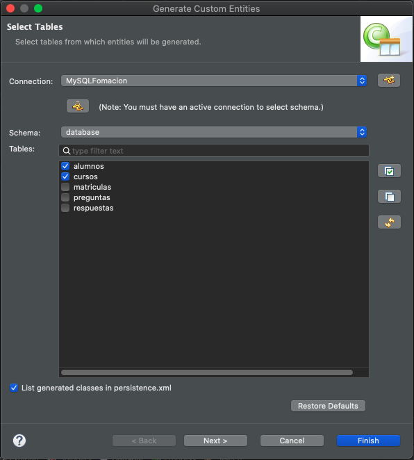

La siguiente pantalla sirve para asociaciones de tablas pero no es nuestro caso, presionamos en siguiente

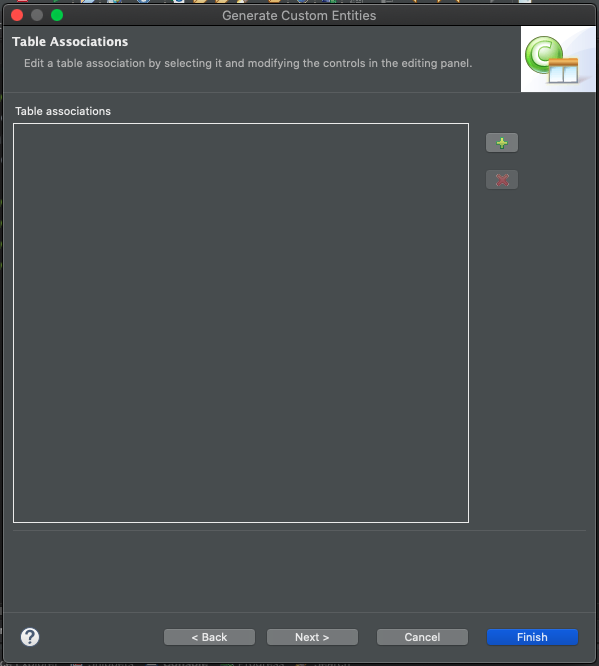

En la siguiente pantalla confirmamos que el paquete donde genere esas entidades sea `model` presinamos en siguiente:

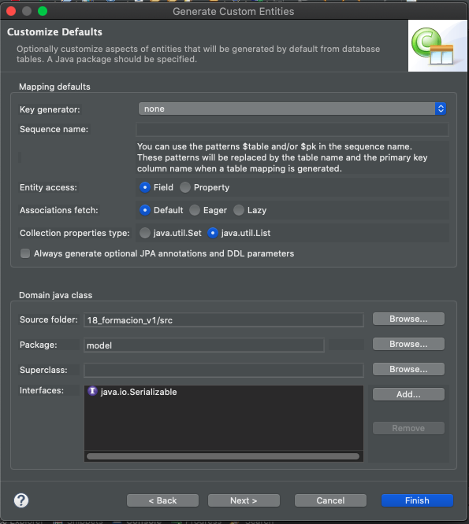

En la siguiente pantalla nos muestra las dos tablas seleccionadas para las cuales debemos indicar la estrategia de generación de la primary key. En el caso de `alumnos` no existe ninguna ya que su clave es el campo `usuario`, por lo que ponemos `none`:

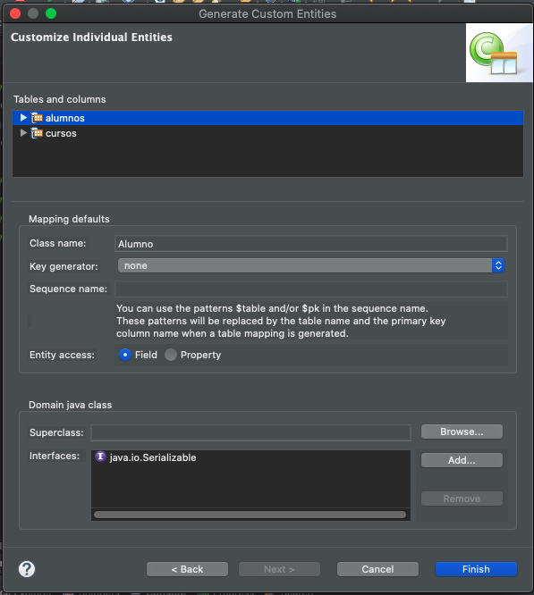

En el caso de `cursos` colocamos `identity` para que genere el campo `idCurso`.

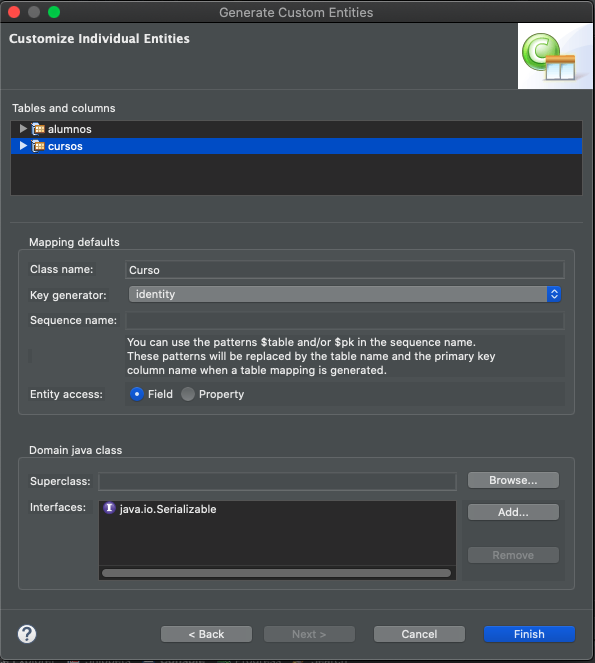

Pulsamos Finish.

Con esto se generan las dos entidades `Alumno` y `Curso` pero detectamos que existe algún error en su creación.

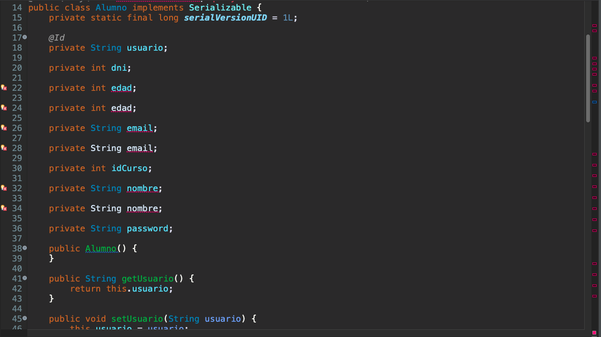

Por un problema con el conector de MySQL 8 si existe otra BD que contenga campos con esos nombres de campos, los duplica o inclusive mete otros campos que no pertenecen a nuestra tabla, ***por lo que no nos va a quedar de otra más que borrar manualmente los errores***.

Las Entidades creadas y corregidas son las siguientes:

`Alumno`

```java
package model;

import java.io.Serializable;
import javax.persistence.*;


/**
 * The persistent class for the alumnos database table.
 * 
 */
@Entity
@Table(name="alumnos")
@NamedQuery(name="Alumno.findAll", query="SELECT a FROM Alumno a")
public class Alumno implements Serializable {
	private static final long serialVersionUID = 1L;

	@Id
	private String usuario;
	private int edad;
	private String email;
	private String nombre;
	private String password;

	public Alumno() {
	}

	public Alumno(String usuario, int edad, String email, String nombre, String password) {
		super();
		this.usuario = usuario;
		this.edad = edad;
		this.email = email;
		this.nombre = nombre;
		this.password = password;
	}


	public String getUsuario() {
		return this.usuario;
	}

	public void setUsuario(String usuario) {
		this.usuario = usuario;
	}

	public int getEdad() {
		return this.edad;
	}

	public void setEdad(int edad) {
		this.edad = edad;
	}

	public String getEmail() {
		return this.email;
	}

	public void setEmail(String email) {
		this.email = email;
	}

	public String getNombre() {
		return this.nombre;
	}

	public void setNombre(String nombre) {
		this.nombre = nombre;
	}

	public String getPassword() {
		return this.password;
	}

	public void setPassword(String password) {
		this.password = password;
	}

}
```

`Curso`

```java
package model;

import java.io.Serializable;
import javax.persistence.*;
import java.util.Date;

/**
 * The persistent class for the cursos database table.
 * 
 */
@Entity
@Table(name="cursos")
@NamedQuery(name="Curso.findAll", query="SELECT c FROM Curso c")
public class Curso implements Serializable {
	private static final long serialVersionUID = 1L;

	@Id
	@GeneratedValue(strategy=GenerationType.IDENTITY)
	private int idCurso;
	
	@Temporal(TemporalType.DATE)
	private Date fechaInicio;
	private int duracion;
	private String nombre;

	public Curso() {
	}

	public Curso(int idCurso, Date fechaInicio, int duracion, String nombre) {
		super();
		this.idCurso = idCurso;
		this.fechaInicio = fechaInicio;
		this.duracion = duracion;
		this.nombre = nombre;
	}

	public Date getFechaInicio() {
		return fechaInicio;
	}

	public void setFechaInicio(Date fechaInicio) {
		this.fechaInicio = fechaInicio;
	}
	
	public int getDuracion() {
		return this.duracion;
	}

	public void setDuracion(int duracion) {
		this.duracion = duracion;
	}
  
	public int getIdCurso() {
		return this.idCurso;
	}

	public void setIdCurso(int idCurso) {
		this.idCurso = idCurso;
	}

	public String getNombre() {
		return this.nombre;
	}

	public void setNombre(String nombre) {
		this.nombre = nombre;
	}

}
```

Notese la anotación que se asigna para los campos de tipo fecha `@Temporal(TemporalType.DATE)`.

**NOTA** ***Se ha añadido en ambas Entidades un Construtor con toods los campos.***

### 06. Completar el archivo `persistence.xml`

Con el paso anterior en nuestro archivo `persistence.xml` se han insertado las etiquetas `<class>` para las Entidades `Alumno` y `Curso`, pero falta añadir:

* El motor de persistencia que vamos a usar
* La conexión a la BD.

Una vez incluido lo anterior el archivo `persistence.xml` final nos queda asi:

`persistence.xml`

```java
<?xml version="1.0" encoding="UTF-8"?>
<persistence version="2.2" xmlns="http://xmlns.jcp.org/xml/ns/persistence" xmlns:xsi="http://www.w3.org/2001/XMLSchema-instance" xsi:schemaLocation="http://xmlns.jcp.org/xml/ns/persistence http://xmlns.jcp.org/xml/ns/persistence/persistence_2_2.xsd">
	<persistence-unit name="formacionPU" transaction-type="RESOURCE_LOCAL">
		<provider>org.hibernate.jpa.HibernatePersistenceProvider</provider>
		<class>model.Alumno</class>
		<class>model.Curso</class>
		<properties>
			<property name="javax.persistence.jdbc.url" value="jdbc:mysql://localhost:3306/formacion?serverTimezone=Europe/Madrid"/>
			<property name="javax.persistence.jdbc.user" value="root"/>
			<property name="javax.persistence.jdbc.password" value="root"/>
			<property name="javax.persistence.jdbc.driver" value="com.mysql.jdbc.Driver"/>
		</properties>
	</persistence-unit>
</persistence>
```

### 07. Crear el Service

En este caso vamos a tener dos clases de Servicio una para Alumnos y otra para Cursos.

* En el caso de `AlumnoService` necesitamos crear dos métodos uno para darlo de alta y otro para comprobar que no exista en base a su usuario para poder dar la alta solo si no existe. ¿Cómo serían esos métodos?

`AlumnoService`

```java
package service;

import javax.persistence.EntityManager;
import javax.persistence.EntityManagerFactory;
import javax.persistence.EntityTransaction;
import javax.persistence.Persistence;

import model.Alumno;

public class AlumnoService {
	
	private static EntityManager em;
	static {
		EntityManagerFactory factory=Persistence.createEntityManagerFactory("formacionPU");
		em=factory.createEntityManager();
	}
	public void altaAlumno(Alumno alumno) {
		EntityTransaction tx = em.getTransaction();
		tx.begin();
		em.persist(alumno);
		tx.commit();
	}
	
	public Alumno buscarAlumnoPorUsuario(String usuario){
		return em.find(Alumno.class,usuario);
		
		/* NO SON NECESARIOS LOS QUERIES EN ESTE CASO
		TypedQuery<Alumno> query = em.createNamedQuery("Candidato.findByEmail", Alumno.class);
		query.setParameter(1, usuario);
		
		// 1er Forma de hacerlo
		List<Alumno> alumnos = query.getResultList();
		return alumnos.size()>0  ? alumnos.get(0):null;
		
		*/
		//2da Forma //Si no encuentra o encuentra más de 1 devuelve excepcion
		/*
		try {
		   return query.getSingleResult();
		}catch(NoResultException | NonUniqueResultException ex) {
			return null;
		}*/
		
	}

}
```

* En el caso de `CursoService` simplemente necesitamos un método para darlo de alta sin comprobación alguna.

`CursoService`

```java
package service;

import javax.persistence.EntityManager;
import javax.persistence.EntityManagerFactory;
import javax.persistence.EntityTransaction;
import javax.persistence.Persistence;

import model.Curso;

public class CursoService {
	private static EntityManager em;
	static {
		EntityManagerFactory factory=Persistence.createEntityManagerFactory("formacionPU");
		em=factory.createEntityManager();
	}
	public void altaCurso(Curso curso) {
		EntityTransaction tx = em.getTransaction();
		tx.begin();
		em.persist(curso);
		tx.commit();
	}
}
```

### 08. Crear los Controladores de Acción

Vamos a tener un controlador de acción para dar de alta el alumno y otro para dar de alta el curso.

* Contralador de Acción `AltaAlumnoAction`

```java
package controller;

import java.io.IOException;

import javax.servlet.ServletException;
import javax.servlet.annotation.WebServlet;
import javax.servlet.http.HttpServlet;
import javax.servlet.http.HttpServletRequest;
import javax.servlet.http.HttpServletResponse;

import model.Alumno;
import service.AlumnoService;

@WebServlet("/AltaAlumnoAction")
public class AltaAlumnoAction extends HttpServlet {
	private static final long serialVersionUID = 1L;

	protected void service(HttpServletRequest request, HttpServletResponse response) throws ServletException, IOException {
		AlumnoService service = new AlumnoService();
		String usuario = request.getParameter("usuario");
		String password = request.getParameter("password");
		String nombre = request.getParameter("nombre");
		String email = request.getParameter("email");
		int  edad = Integer.parseInt(request.getParameter("edad"));
		
		if( service.buscarAlumnoPorUsuario(usuario) == null ) {
			service.altaAlumno(new Alumno(usuario,edad,email,nombre,password));
			request.setAttribute("resultado", true);
		}else {
			request.setAttribute("resultado", false);
		}
	}

}
```

Simplente recuperamos los parámetros, comprobamos mediante el servicio si existe algún alumno con el `usuario` que nos envían, sino existe creamos un `Alumno` en base a los parámetros y nuevamente mediante el servicio damos de alta ese nuevo alunmo. Si se dio de alta o no se almacena un atributo booleano de solicitud según sea el caso para que el Controlador se entere y pueda tomar la decisión de a que pantalla nos envía.


``
```java
```

``
```java
```

``
```java
```


``
```java
```

``
```java
```


IMAGEN PIZARRA


