# 20201113 Viernes

## Instalación de Web Logic

Lo primero que debemos hace es descargar Web Logic de https://www.oracle.com/middleware/technologies/weblogic-server-installers-downloads.html vamos a descargar la versión Oracle WebLogic Server 12.2.1.3

Nos descarga un Zip que desempaqueteamos en alguna carpeta.

Con la Consola nos colocamos en la carpeta donde lo desempaquetamos e intentamos instalar el JAR.

Nos marca un error por la versión de Java.

**LA VERSIÓN DE WEB LOGIC 12.2.1.3 SOLO SE PUEDE INSTALAR CON JAVA 8** 

Bajamos a la versión de Java 8 e intentamos instalar de nuevo.

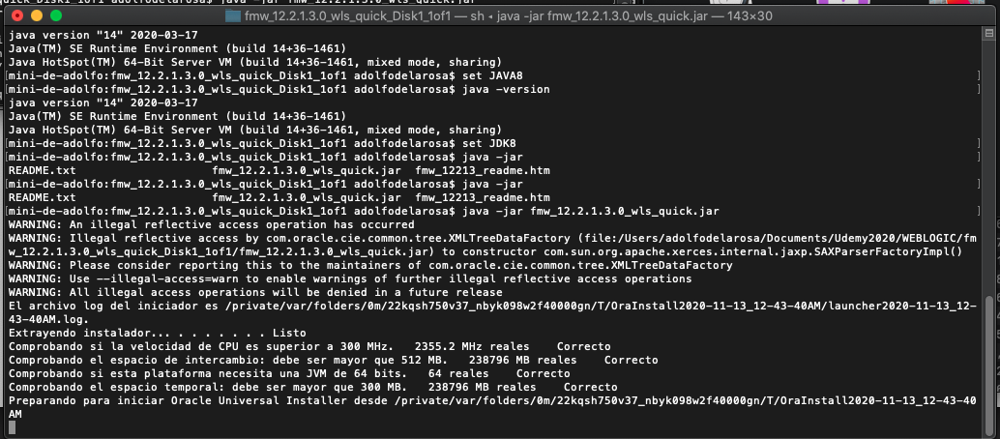

En mi caso bajamos a la versión de Java 7 e intentamos instalar de nuevo.

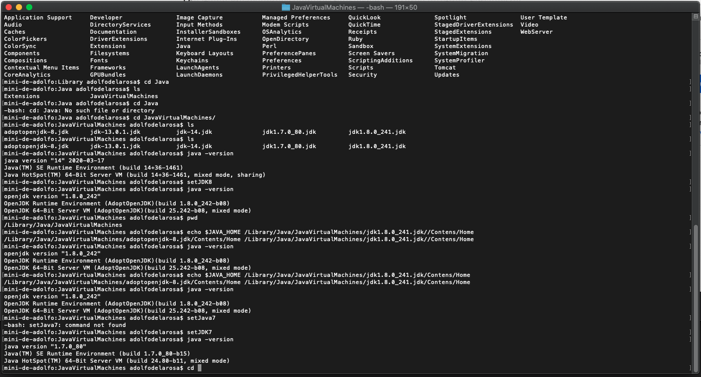

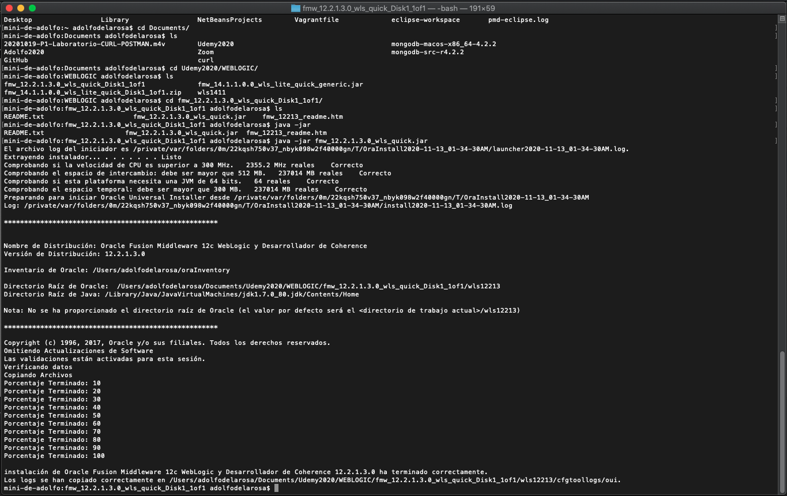

Si en Eclipse intentamos instalar un nuevo server y nos vamos a Oracle nos presnta la siguiente pantalla:

Como es la primera vez que entramos a estra opción debemos Instalar **Oracle WebLogic Server Tools*** al dar siguiente nos pedira que aceptemos los terminos y empezara a instalar las Tools, al finalizar reiniciará Eclipse.

Si volvemos a entrar a la misma opción tendremos 

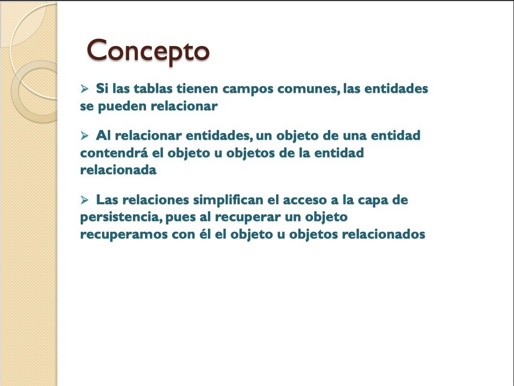

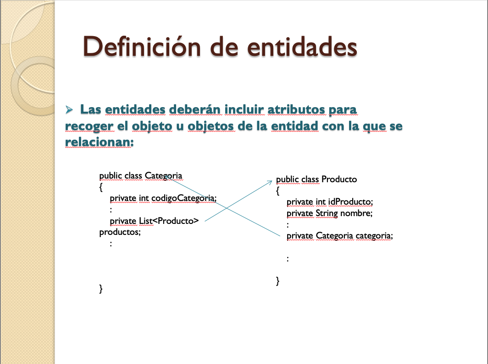
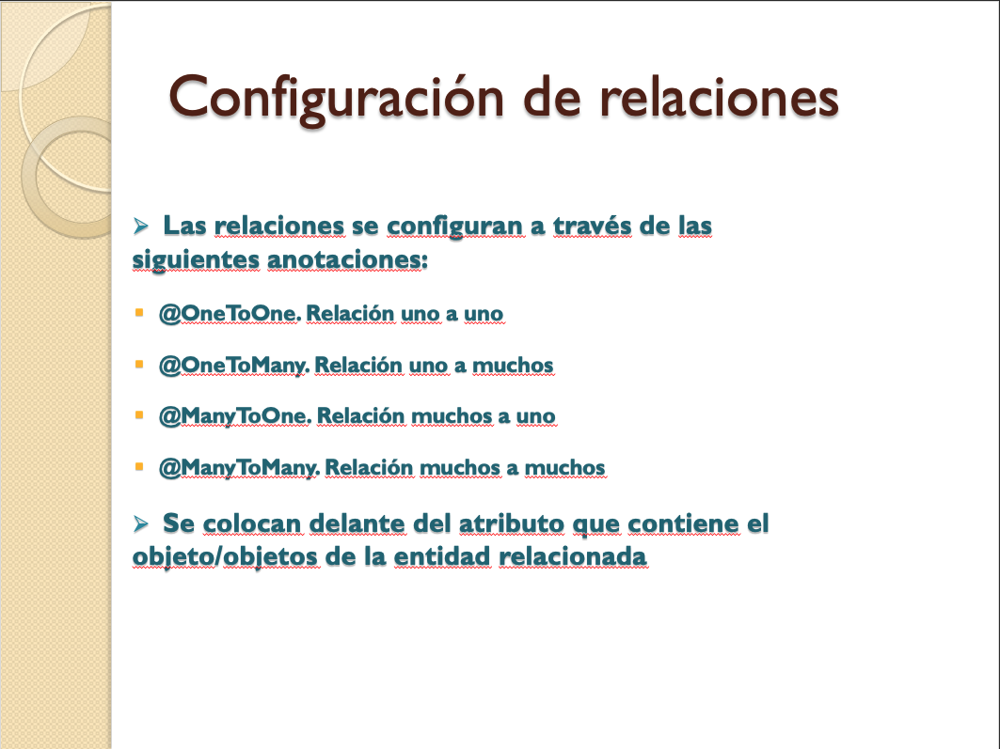
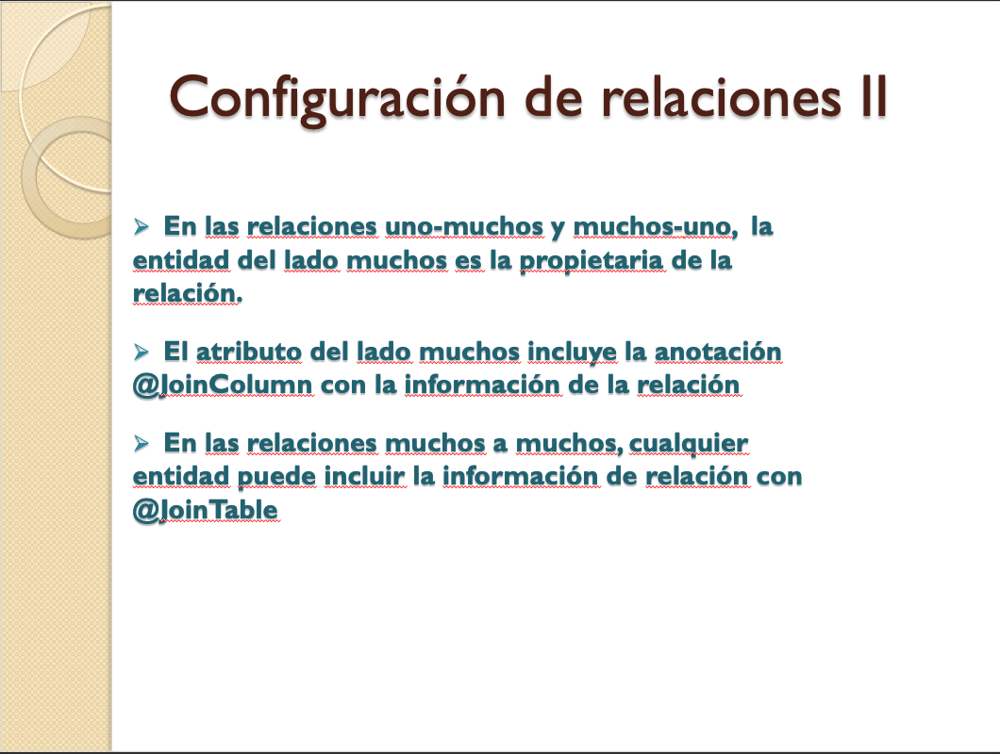
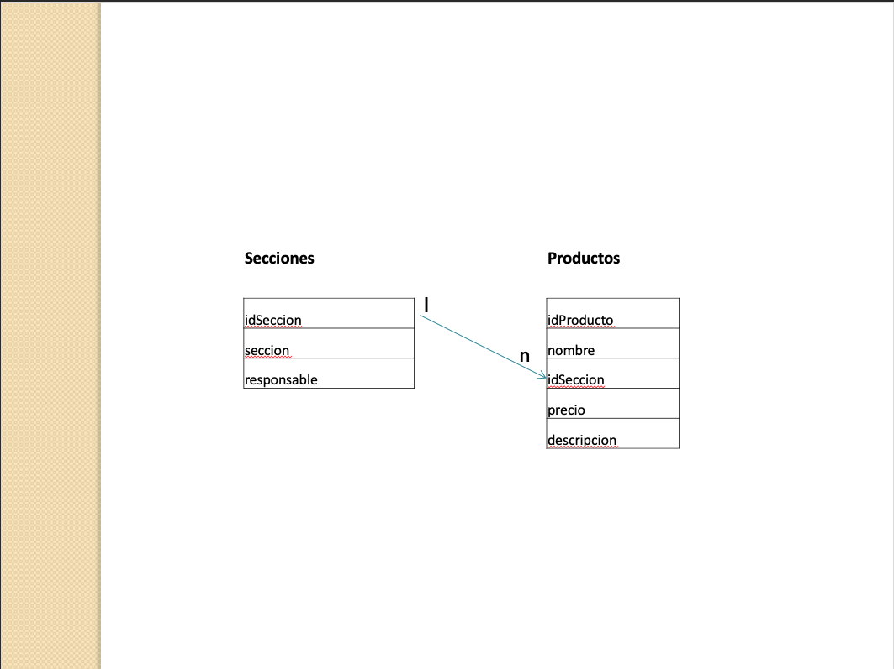
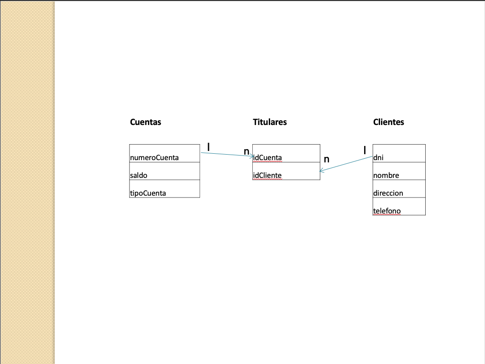

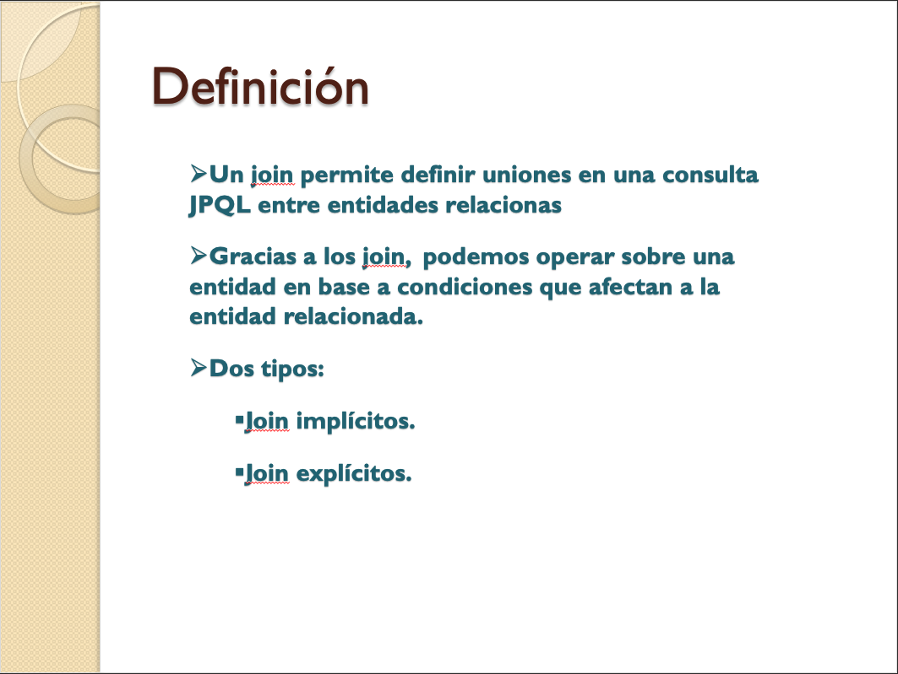
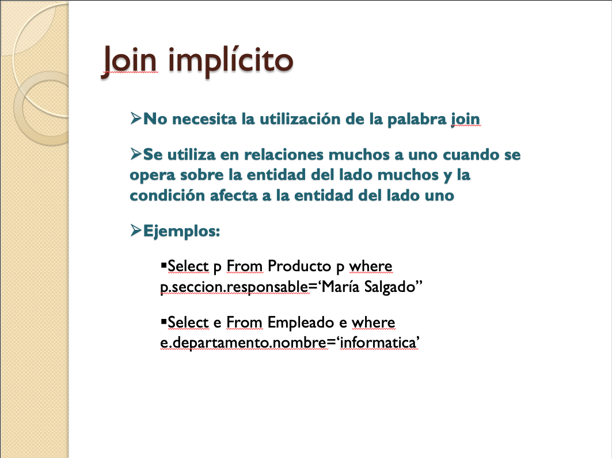
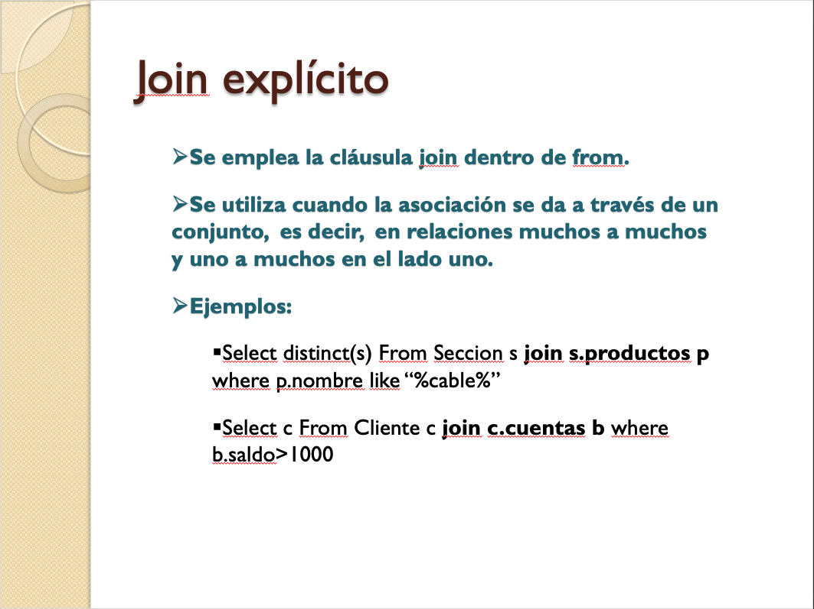

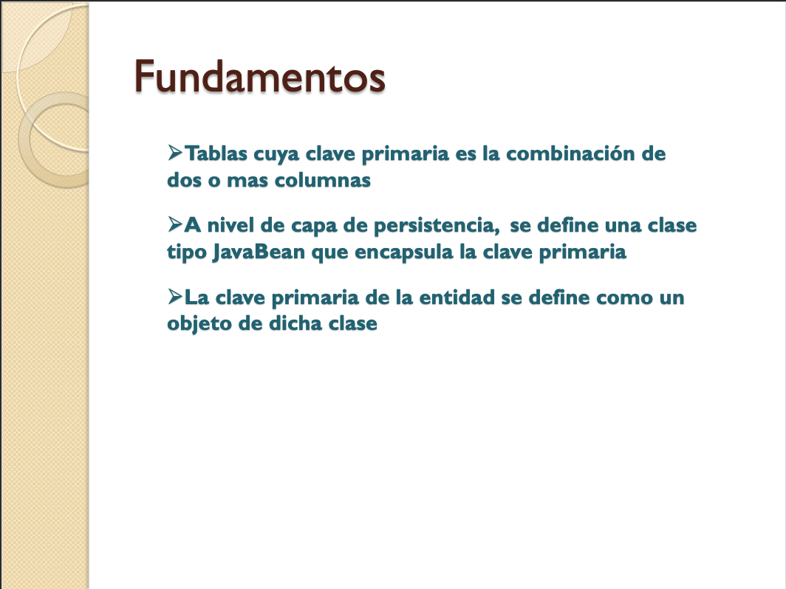
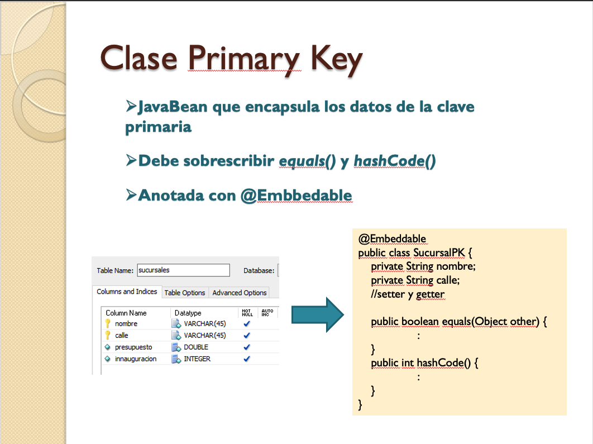
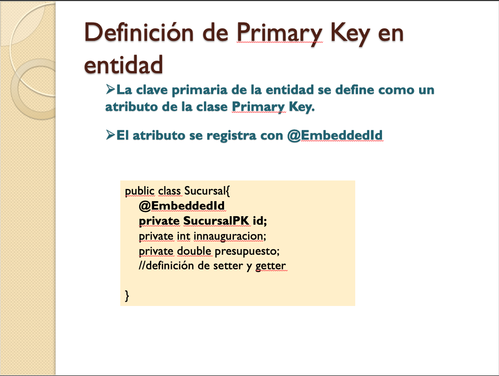
