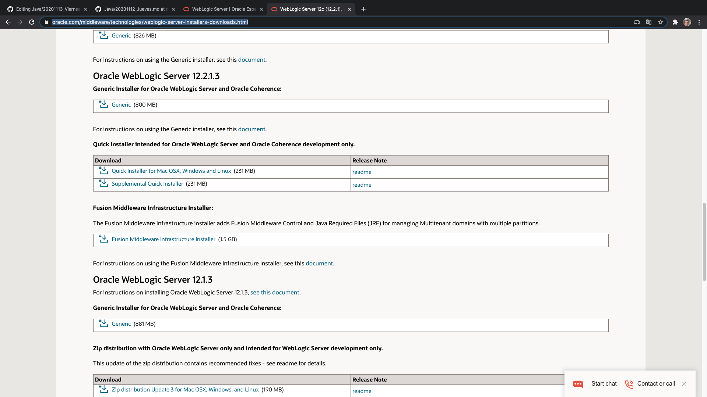
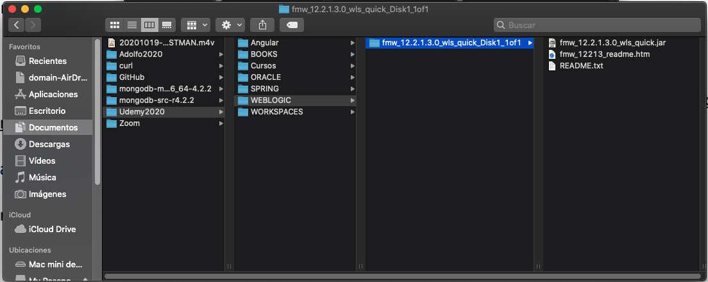
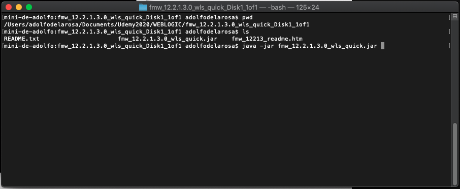
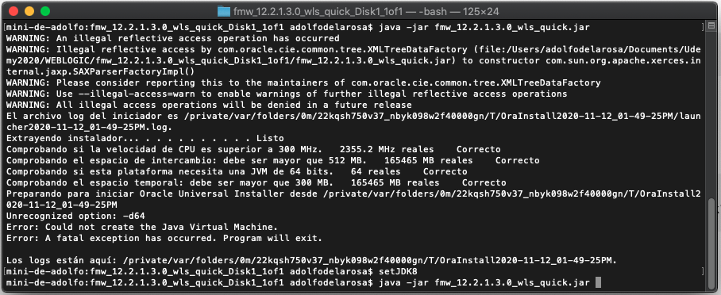
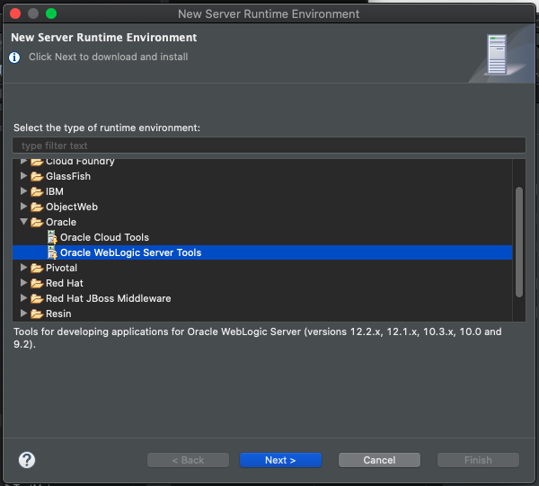
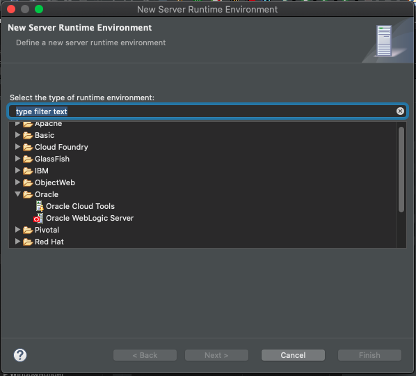
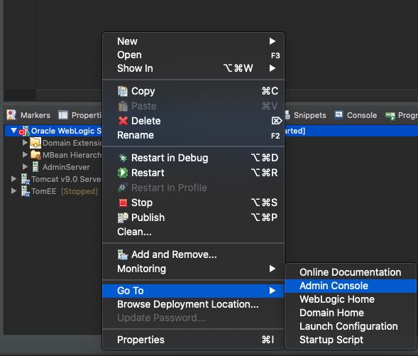

# 20201113 Viernes

## Instalación de Web Logic

Lo primero que debemos hace es descargar Web Logic de https://www.oracle.com/middleware/technologies/weblogic-server-installers-downloads.html vamos a descargar la versión Oracle WebLogic Server 12.2.1.3



Nos descarga un Zip que desempaqueteamos en alguna carpeta.



Con la Consola nos colocamos en la carpeta donde lo desempaquetamos e intentamos instalar el JAR.



Nos marca un error por la versión de Java.



**LA VERSIÓN DE WEB LOGIC 12.2.1.3 SOLO SE PUEDE INSTALAR CON JAVA 8** 

Bajamos a la versión de Java 8 e intentamos instalar de nuevo.


Si en Eclipse intentamos instalar un nuevo server y nos vamos a Oracle nos presnta la siguiente pantalla:



Como es la primera vez que entramos a estra opción debemos Instalar **Oracle WebLogic Server Tools*** al dar siguiente nos pedira que aceptemos los terminos y empezara a instalar las Tools, al finalizar reiniciará Eclipse.

Si volvemos a entrar a la misma opción tendremos 



Seleccionamos Oracle WebLogic Server y continuamos con el proceso de instalación.


Una vez que ya he añadido un nuevo Server en Eclipse lo añado en la Pestaña Servers.


## :computer: 

Vamos a crear un nuevo proyecto pero con servidor WebLogic.


### 01. Mavenizar el Proyecto y poner las dependencias

En este caso como vamos a usar un DataSource que se encuentra en el servidor de aplicaciones WebLogig no necesitamos añadir la dependendia de MySQL y a que esto lo va a gestionar WebLogic.

`pom.xml`

```html
<dependencies>
  	<!-- https://mvnrepository.com/artifact/org.hibernate/hibernate-core --> 
	<dependency>
	    <groupId>org.hibernate</groupId>
	    <artifactId>hibernate-core</artifactId>
	    <version>5.4.18.Final</version>
	</dependency>
</dependencies>
```

### 02. Dar Características JPA




