# 20201116 Lunes

## :computer: `21_formacion_ejb_weblogic`

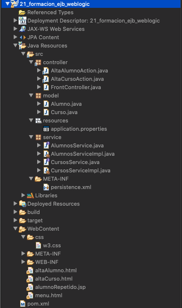

Partiendo del proyecto `19_formacion_factoria` vamos a realizar una versión usando EJB.

### Creación del Data Source en WebLogic

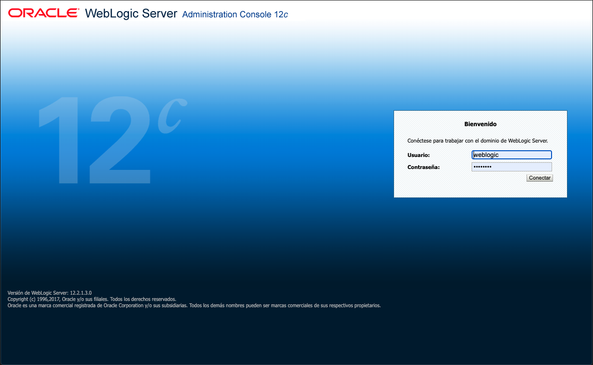
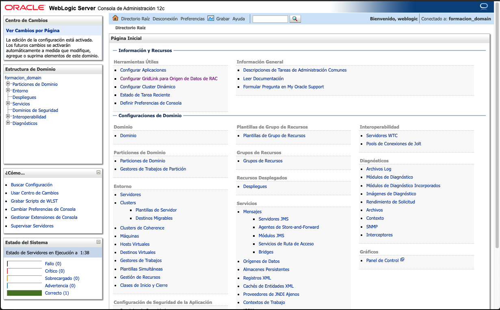
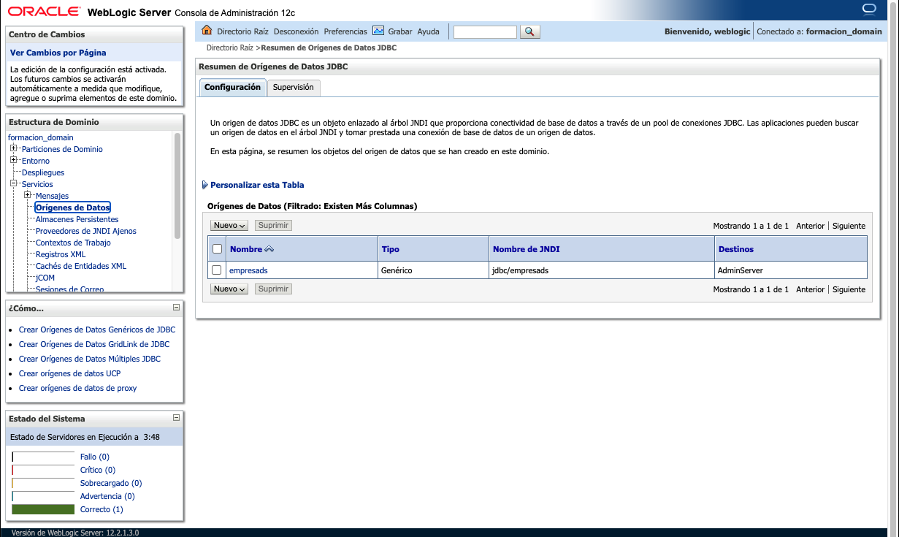
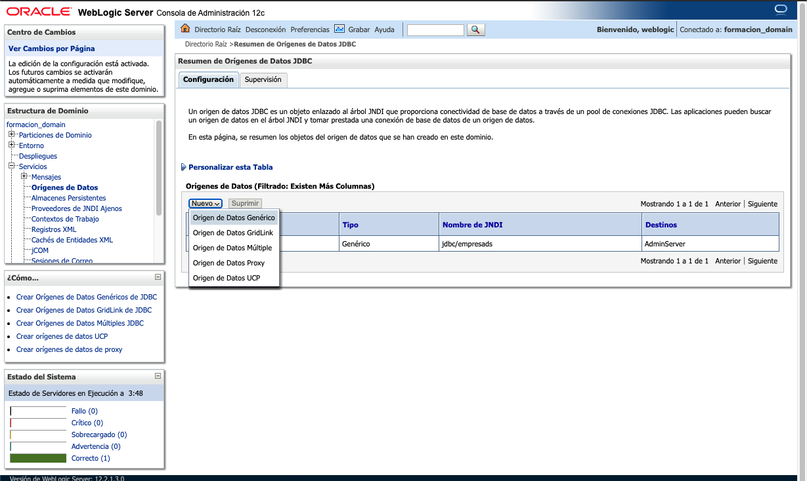
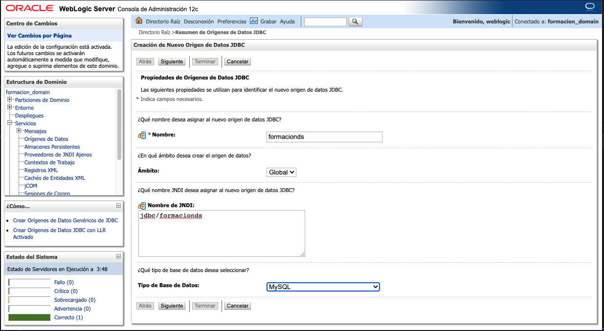
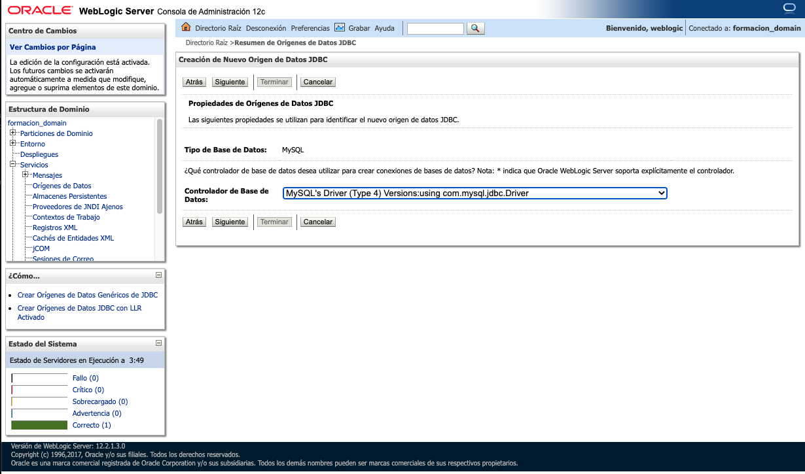
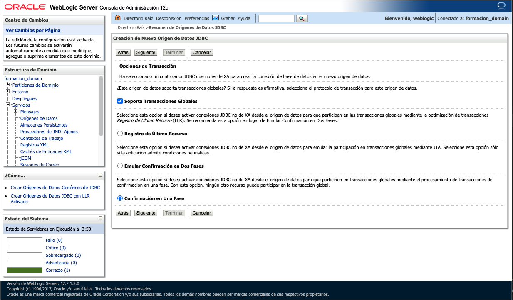
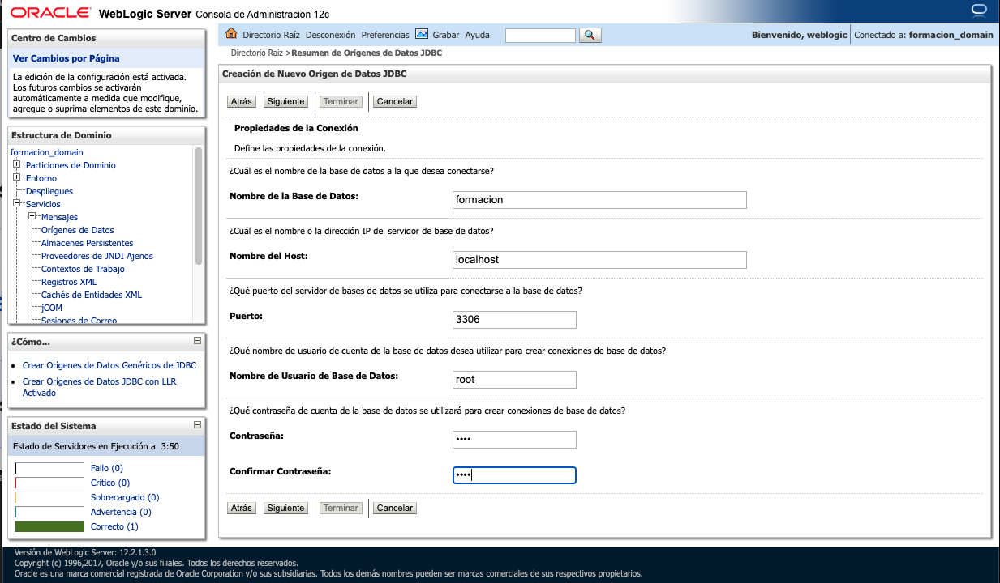

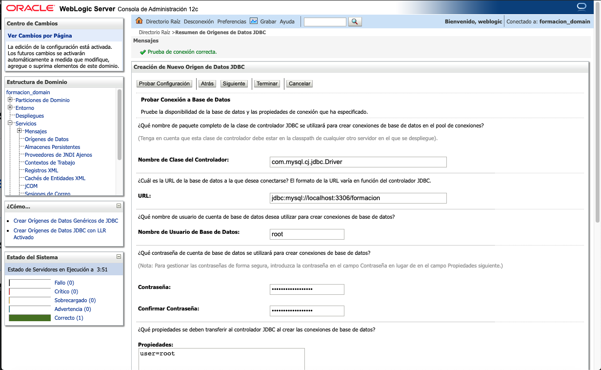
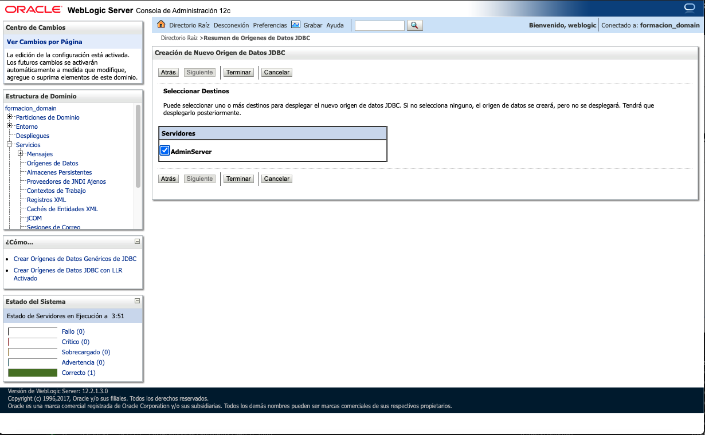
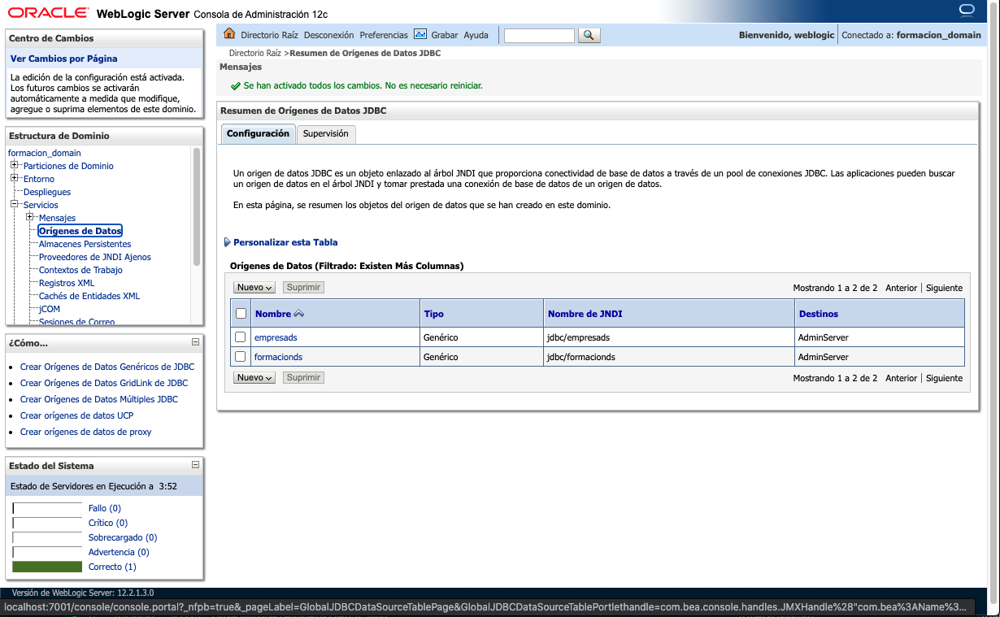

### Creación Proyecto en Eclipse

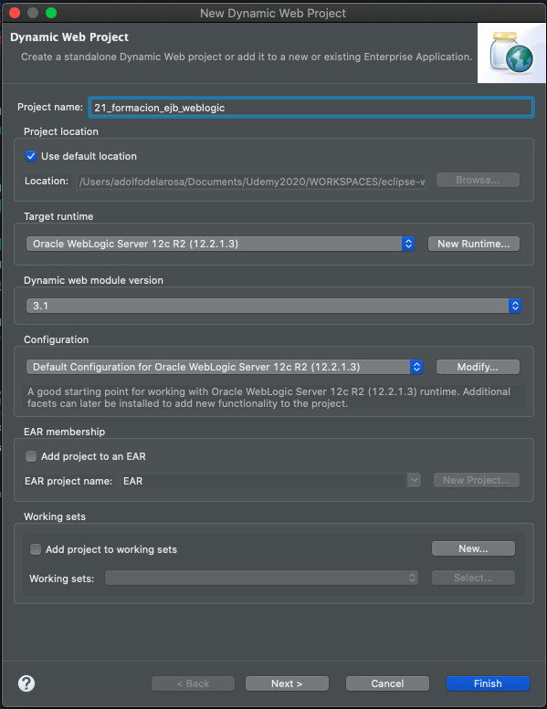

### Mavenizar Proyecto

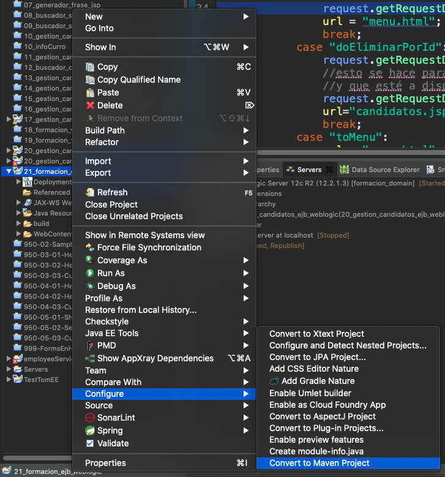

### Dar Características JPA

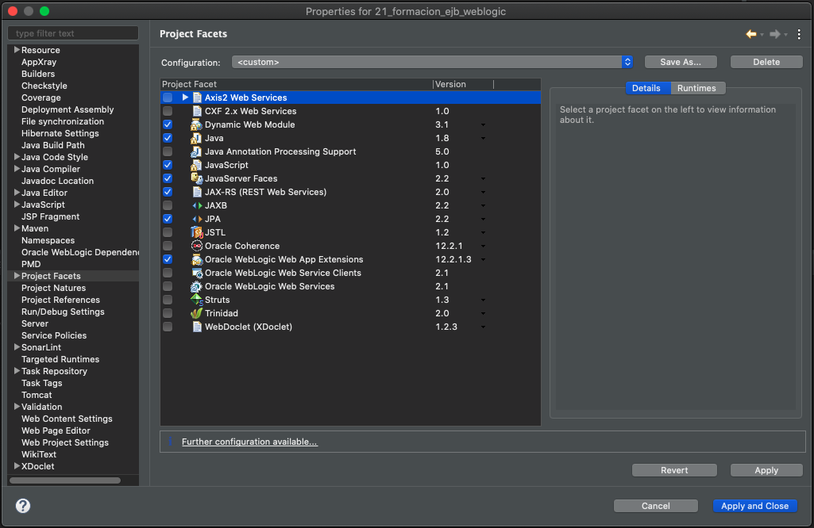

### Modificación del Archivo `persistence.xml`

Copiamos el archivo `persistence.xml` del proyecto `19_formacion_factoria` al actual pero tenemos que realizar algunos cambios, en el proyecto anterior la conexión a la BD la haciamos directamente pero con el uso de WebLogic ya vamos a usar el DataSource creado en el primer paso. Por lo que entramos en la pestaña Conexión y cambiamos los valores como se muestra en las siguientes imagenes.

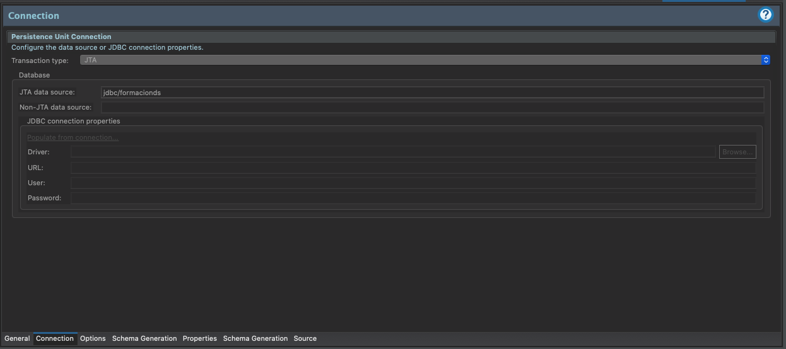

Mientras que en la pestaña de General tenemos

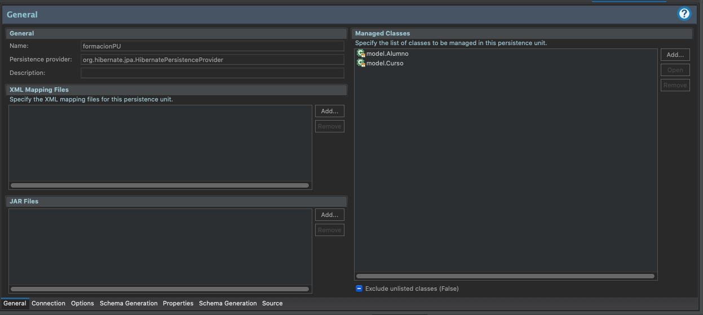

El archivo `persistence.xml` nos queda así:

```html
<?xml version="1.0" encoding="UTF-8"?>
<persistence version="2.2" xmlns="http://xmlns.jcp.org/xml/ns/persistence" xmlns:xsi="http://www.w3.org/2001/XMLSchema-instance" xsi:schemaLocation="http://xmlns.jcp.org/xml/ns/persistence http://xmlns.jcp.org/xml/ns/persistence/persistence_2_2.xsd">
   <persistence-unit name="formacionPU" transaction-type="JTA">
      <provider>org.hibernate.jpa.HibernatePersistenceProvider</provider>
      <jta-data-source>jdbc/formacionds</jta-data-source>
         <class>model.Alumno</class>
         <class>model.Curso</class>
      <properties>			
         <property name="hibernate.transaction.jta.platform" value="org.hibernate.engine.transaction.jta.platform.internal.WeblogicJtaPlatform"/>				
      </properties>
   </persistence-unit>
</persistence>
```

Como descubrimos que existe un pequeño conflicto entre Hibernate y EJB se tuvo que poner la etiqueta `<properties>` para que trabajen correctamente.

Existe otra alternativa para no trabajar con Hibernate y usar el Motor de Persistencia que viene integrado en WebLogic que en este caso es **EclipseLink** para lo cual nuestro `persistence.xml` quedaría así:

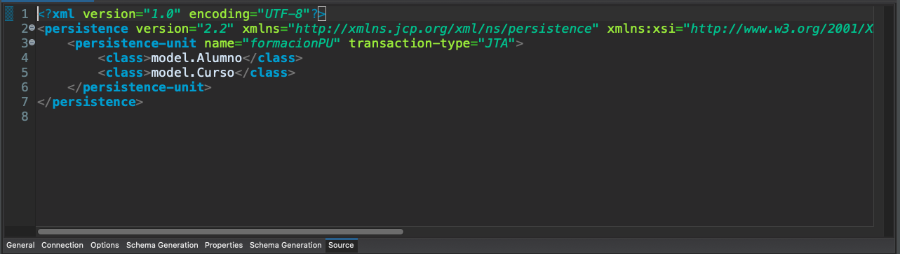

**NOTA** *Las Entidades las copiamos directamente del proyecto `19_formacion_factoria`, no usamos el asistente para crear las Entidades.*

### Creación del EJB.

La lógica del Servicio del proyecto `19_formacion_factoria` es la siguiente:

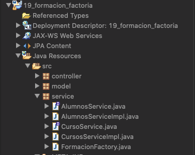

Dos Clases con sus respectivas Interfaces y la clase de Factoria.

Todo este Servicio lo debemos implementar usando EJBs. 

Vamos a necesitar un EJB para `Alumnos` y otro para `Cursos` y el Factory ya no va a ser necesario ya que EJB nos lo proporciona implícitamente.

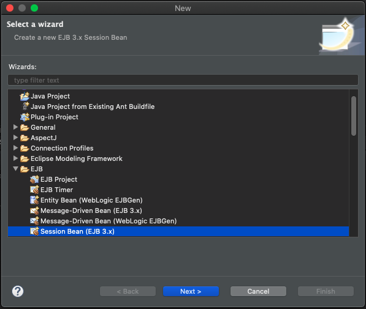

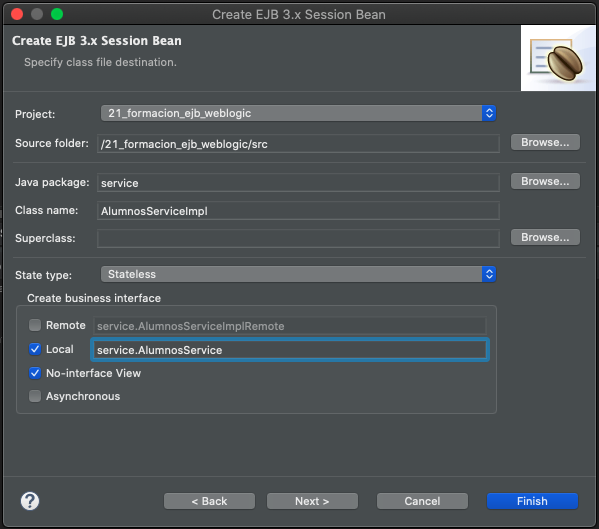

Como estamos partiendo de código ya desarrollado en otra aplicación vamos a copiar los métodos ya desarrollados en el servicio y lo vamos a meter en las Clases del EJB y lo vamos a adaptar.

Partimos de `AlumnosServiceImpl` del proyecto `19_formacion_factoria`:

`AlumnosServiceImpl`

```java
...

public class AlumnosServiceImpl implements AlumnosService {
	
   private static EntityManager em;
   static {
      EntityManagerFactory factory=Persistence.createEntityManagerFactory("formacionPU");
      em=factory.createEntityManager();
   }
   
   @Override
   public void altaAlumno(Alumno alumno) {
      EntityTransaction tx = em.getTransaction();
      tx.begin();
      em.persist(alumno);
      tx.commit();
   }
	
   @Override
   public Alumno buscarAlumnoPorUsuario(String usuario){
      return em.find(Alumno.class,usuario);
   }

}
```

Y adaptandola a EJBs nos queda así:

`AlumnosServiceImpl`

```java
...

@Stateless
@LocalBean
public class AlumnosServiceImpl implements AlumnosService {

   @PersistenceContext(unitName = "formacionPU")
   private EntityManager em;
	
   @Override
   public void altaAlumno(Alumno alumno) {
      em.persist(alumno);
   }
	
   @Override
   public Alumno buscarAlumnoPorUsuario(String usuario){
      return em.find(Alumno.class,usuario);
   }

}
```

Observaciones del EJB:

* La clase esta anotada con `@Stateless` lo que indica que es un EJB, también anotada con `@LocalBean`
* Eliminamos la Factoria y en su lugar Inyectamos directamente el `EntityManager` usando la anotación `@PersistenceContext(unitName = "formacionPU")`.
* Eliminamos todo lo referente a las transacciones.

Con todos estos cambios la clase reduce en gran medida su código.

Normalmente primero códificamos la Interface y luego la Clase pero en este caso hemos iniciado coiando el código en la Clase, para generar la Interface a partir de la Clase podemos usar la opción:

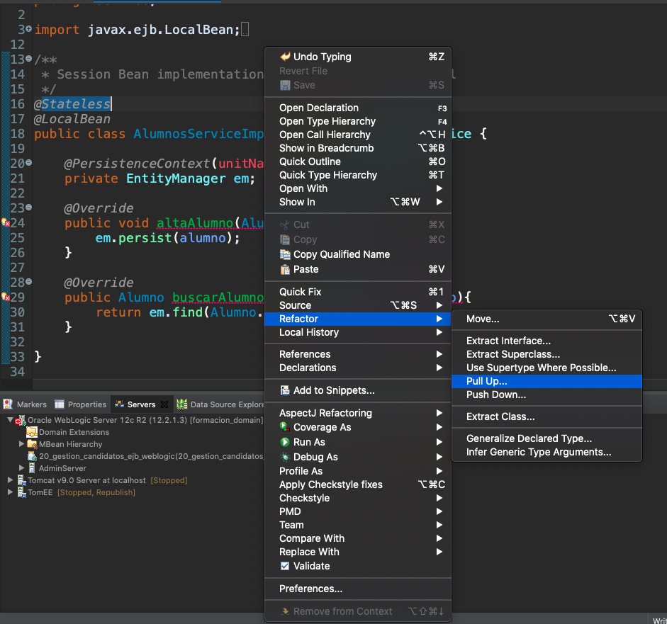

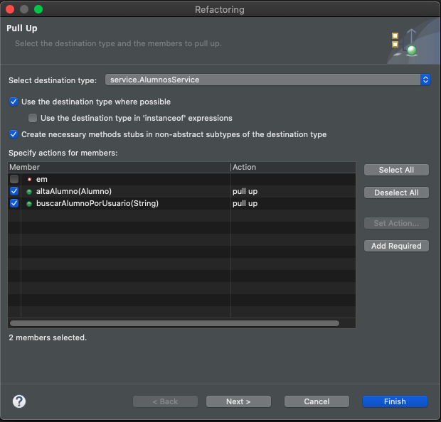

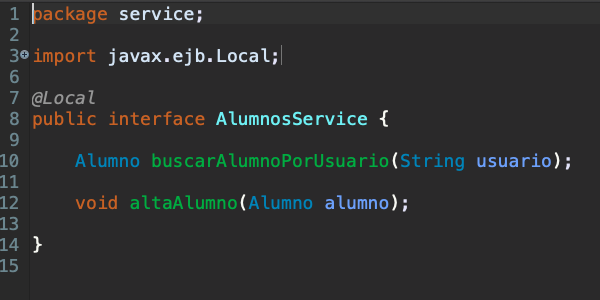

Realizamos los mismos pasos para el EJB de `Cursos`.

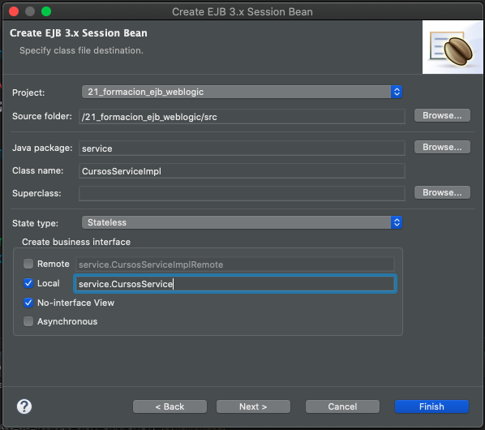

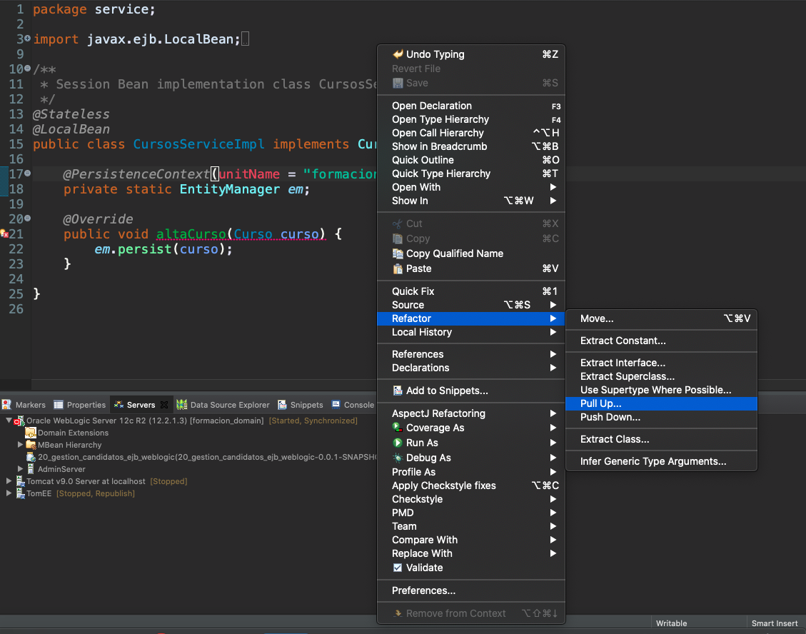

En este último paso no se debería haber usado el atributo `em`, solo se seleccionan los métodos.

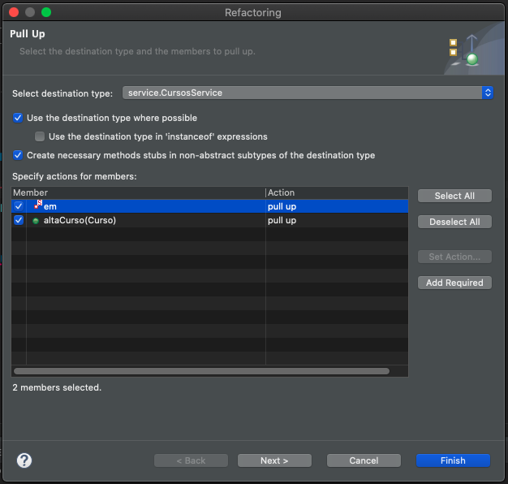

Las Clases e Interfaces finales de los EJBs son:

Interface `AlumnosService`

```java
package service;

import javax.ejb.Local;

import model.Alumno;

@Local
public interface AlumnosService {
   Alumno buscarAlumnoPorUsuario(String usuario);
   void altaAlumno(Alumno alumno);
}
```

Clase `AlumnosServiceImpl`

```java
package service;

import javax.ejb.LocalBean;
import javax.ejb.Stateless;
import javax.persistence.EntityManager;
import javax.persistence.PersistenceContext;

import model.Alumno;

/**
 * Session Bean implementation class AlumnosServiceImpl
 */
@Stateless
@LocalBean
public class AlumnosServiceImpl implements AlumnosService {

   @PersistenceContext(unitName = "formacionPU")
   private EntityManager em;
	
   @Override
   public void altaAlumno(Alumno alumno) {
      em.persist(alumno);
   }
	
   @Override
   public Alumno buscarAlumnoPorUsuario(String usuario){
      return em.find(Alumno.class,usuario);
   }

}
```

Interface `CursosService`

```java
package service;

import javax.ejb.Local;
import model.Curso;

@Local
public interface CursosService {
   void altaCurso(Curso curso);
}
```

Clase `CursosServiceImpl`

```java
package service;

import javax.ejb.LocalBean;
import javax.ejb.Stateless;
import javax.persistence.EntityManager;
import javax.persistence.PersistenceContext;

import model.Curso;

/**
 * Session Bean implementation class CursosServiceImpl
 */
@Stateless
@LocalBean
public class CursosServiceImpl implements CursosService {

   @PersistenceContext(unitName = "formacionPU")
   private EntityManager em;
	
   @Override
   public void altaCurso(Curso curso) {
      em.persist(curso);
   }
   
}
```

### Modificar Controllers

Como hemos visto, con estos cambios el Factory a sido eliminado por lo que debemos hacer algunos cambios en nuestros Controladores que lo usaban así:

Originalmente teniamos:

```java
AlumnosService service =  FormacionFactory.getAlumnosService();
```

o

```java
CursoService service = FormacionFactory.getCursosService();
```

En lugar de Instanciar el Servicio con la Factoria, vamos a inyectar los EJBs dentro de los Action de la siguiente forma.

```java
...

@EJB
AlumnosService service;
protected void service(HttpServletRequest request, HttpServletResponse response) throws ServletException, IOException {
   ...
```
o

```java
...

@EJB
CursosService service;
protected void service(HttpServletRequest request, HttpServletResponse response) throws ServletException, IOException {
	
   ...
```

Simplemente usamos la anotación `@EJB` para inyectar el EJB.

### Vistas

Las Vistas no sufren ningún cambio.

### Probar la aplicación.

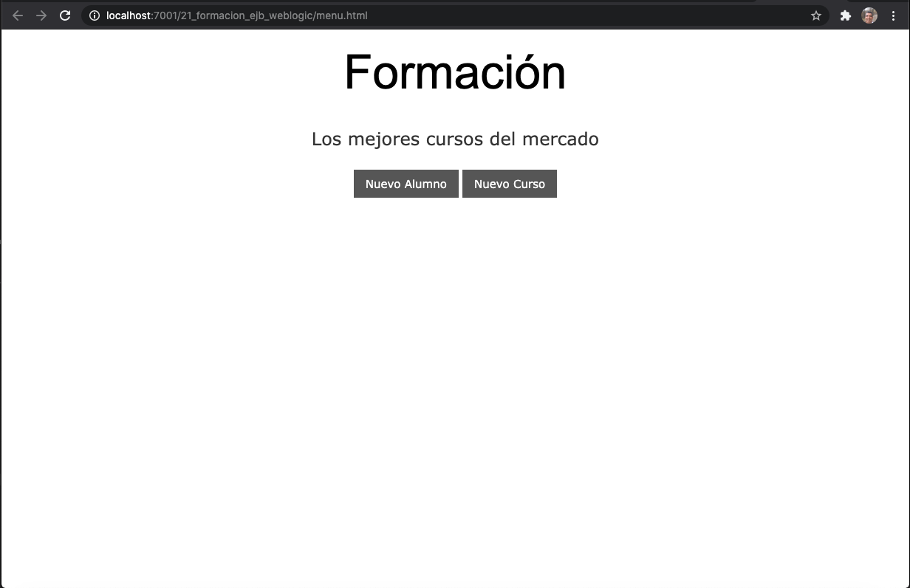
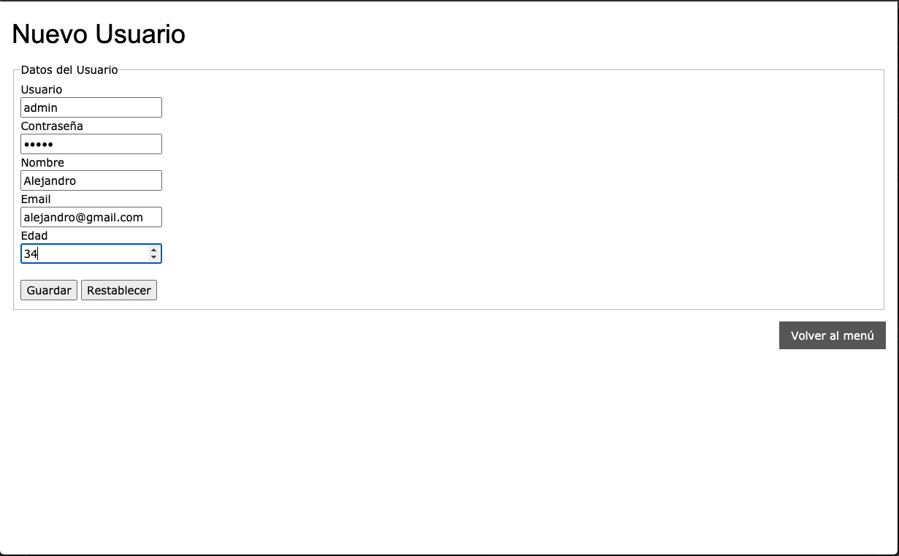
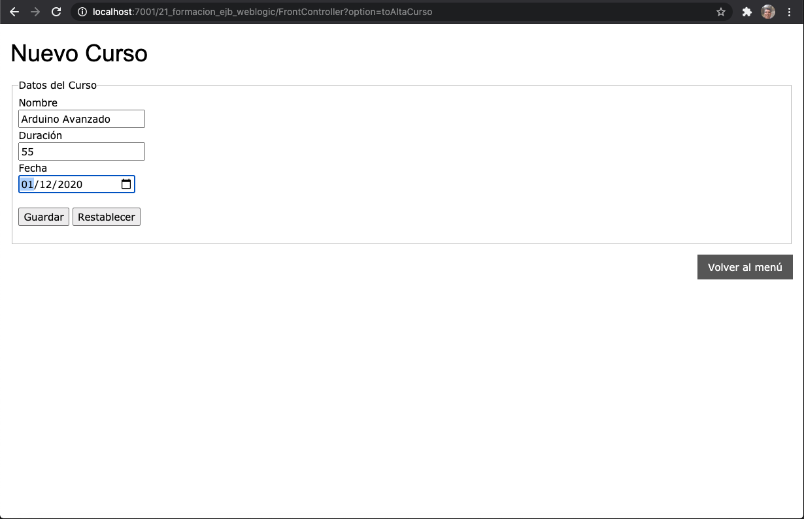
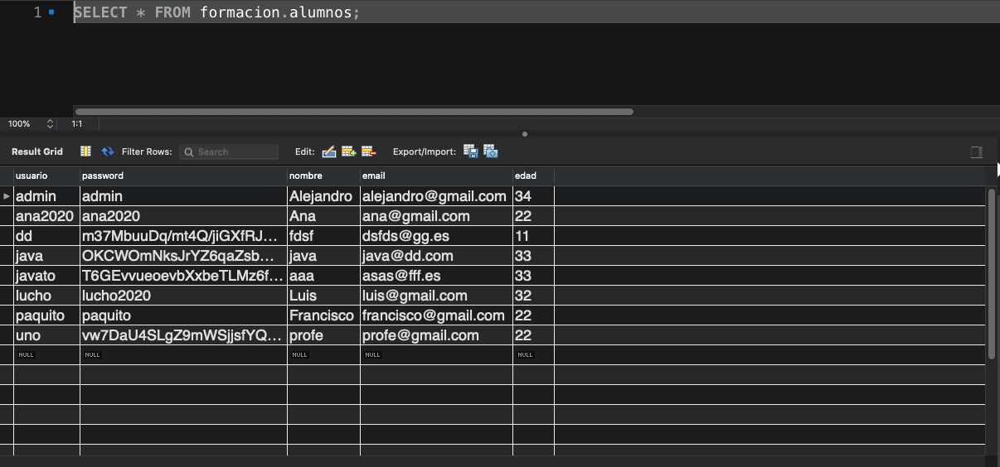
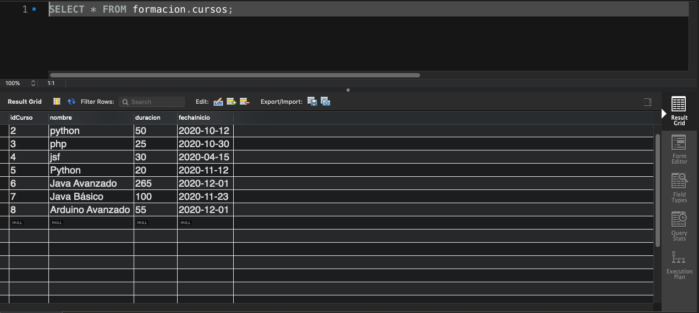

## Relación Entre Entidades


## :computer: `22_ejemplo_relaciones`

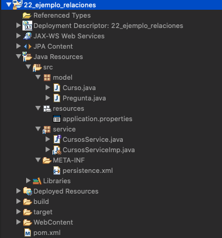

Este proyecto nuevo nos va a servir para ver algunos ejemplos de **Relación Entre Entidades**. Este proyecto no tiene ninguna parte visual solo nos va a servir para ver las relaciones existentes entre las Tablas `Cursos` y `Preguntas`.
de la BD `formacion`.

### BD `formacion`

Tablas `Cursos` y `Preguntas`

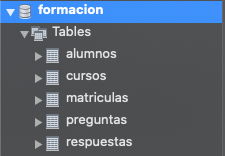
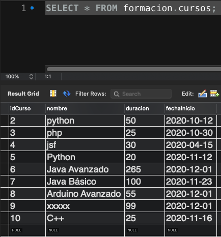
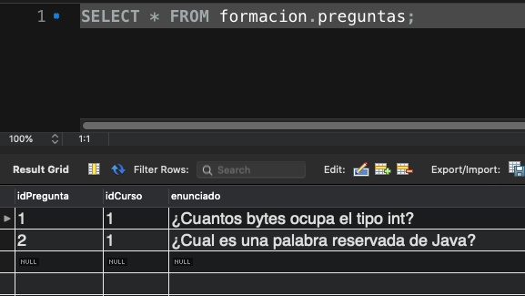

### Creación del Proyecto Eclipse

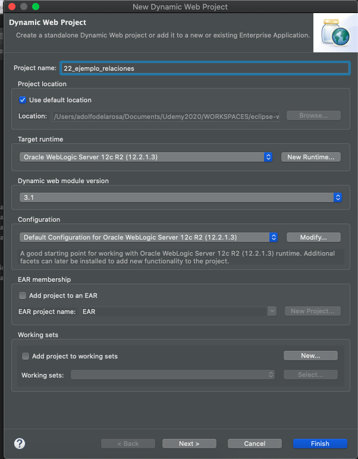

### Mavenizar el Proyecto e incluir las dependencias de Hibernate.

`pom.xml`

```html
<!-- https://mvnrepository.com/artifact/org.hibernate/hibernate-core --> 
<dependency>
   <groupId>org.hibernate</groupId>
   <artifactId>hibernate-core</artifactId>
   <version>5.4.18.Final</version>
</dependency>
```

### Creación de una Nueva Conexión

El siguiente paso sería usar el asistente para crear las Entidades de `Cursos` y `Preguntas` **pero en ejemplos anteriores vimos que al  hacer este paso teniamos el problema de duplicación de campos por usar el conector de MySQL 8, para evitar estos problemas vamos a usar el conector de MySQL 5**.

Entramos en la opción **JPA Tools -> Generate Entities Tables...** y vamos a crear una nueva conexión para poder usar el Driver de MySQL 5.

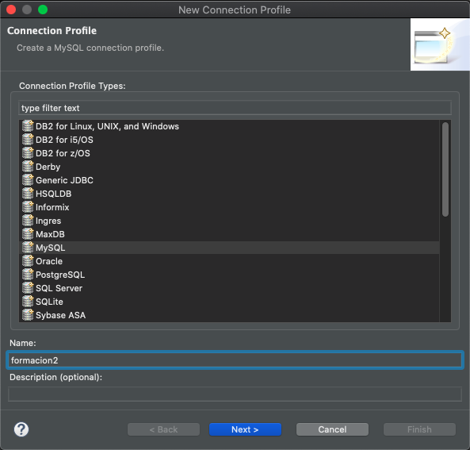
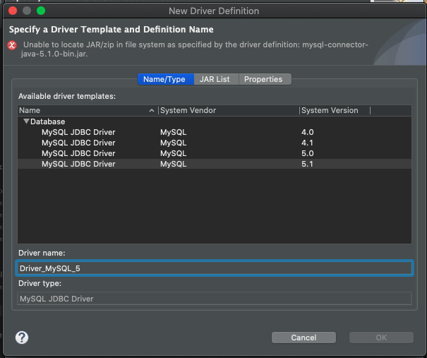
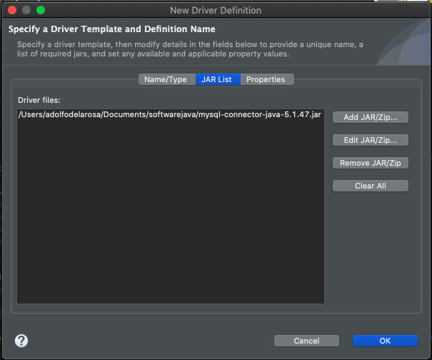
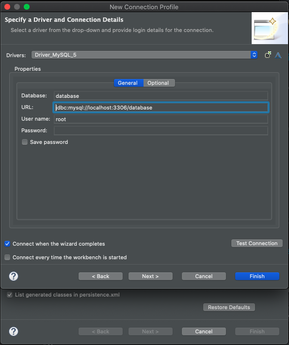
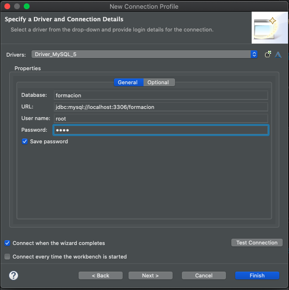
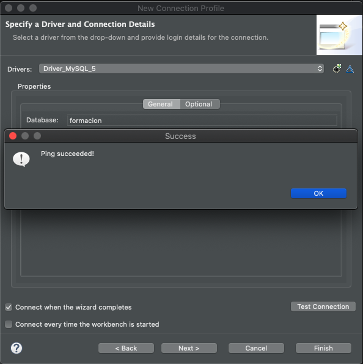

Una vez que ya tenemos la conección con MySQL 5 vamos a generar las Entidades.

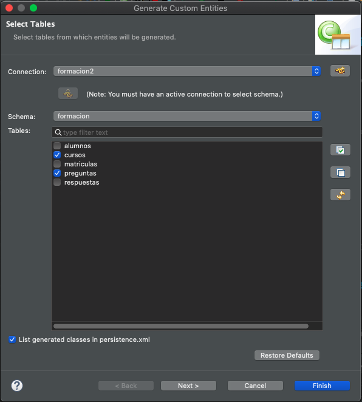
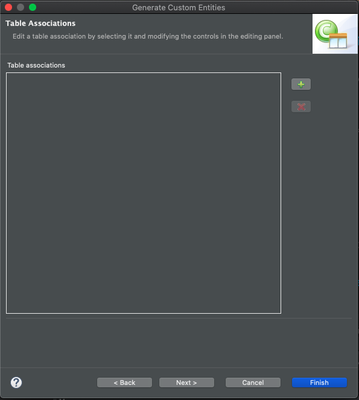

En este caso si tenemos una relación entre las tablas las cuales se relacionan por medio del campo `idCurso`, presionamos en `+` para añadir la relación.


Vamos a indicar que es una *Asociación Simple* entre las tablas `Cursos` y `Preguntas`.

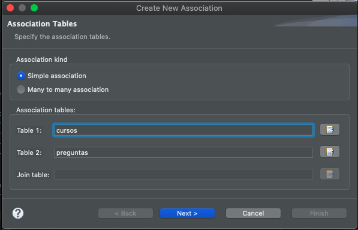

En la siguiente pantalla

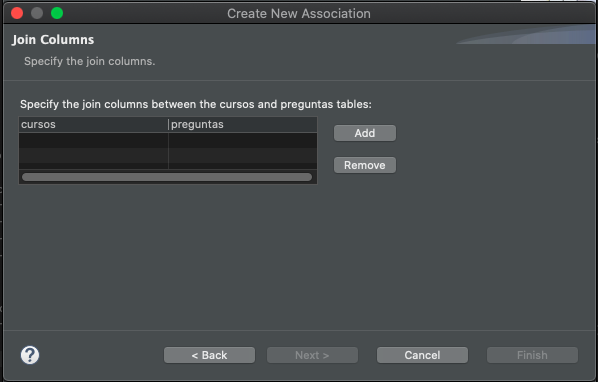

Debemos indicar a través de que campo se relacionan las tablas, al presionar en `Add` pone cualquier campo dde las tablas.

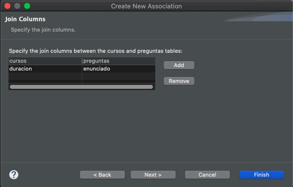

Debemos modificarlo para poner exactamente el que nosotros necesitemos.


En la siguiente pantalla debemos indicar la relación existente entre `Cursos` y `Preguntas` y en este caso corresponde a una relación **One to many** *Cada Curso tiene muchas Preguntas.*

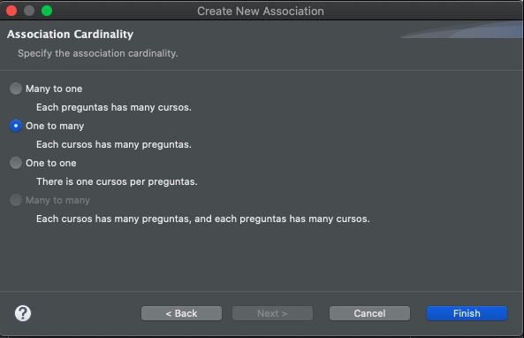

Se nos muestra gráficamente la relación y si la seleccionamos muestra más detalles.

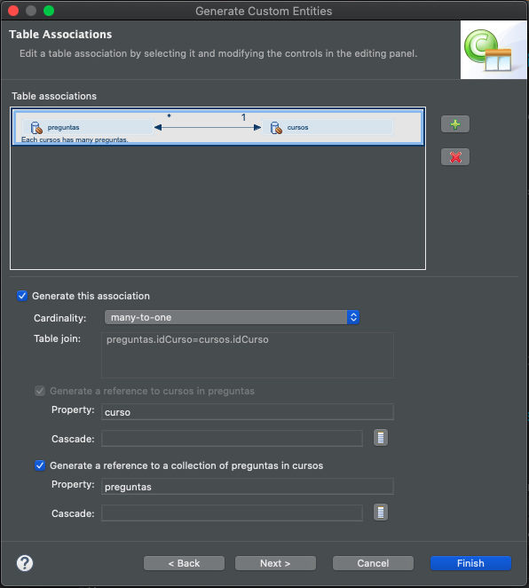

En la siguiente pantalla.

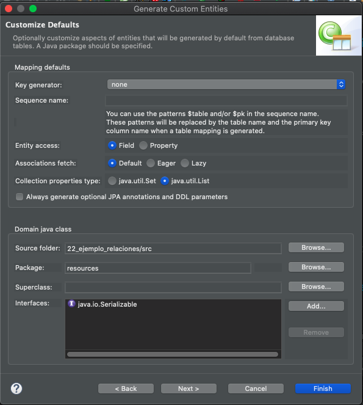

Solo vamos a cambiar el paquete donde vamos a almacenar las Entidades `model`.

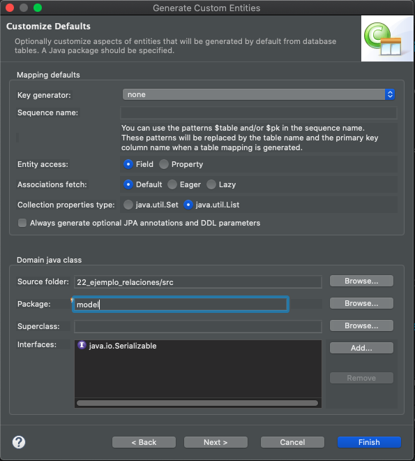

En la siguiente pantalla vamos a definir para cada Entidad como se van a generar las llaves.

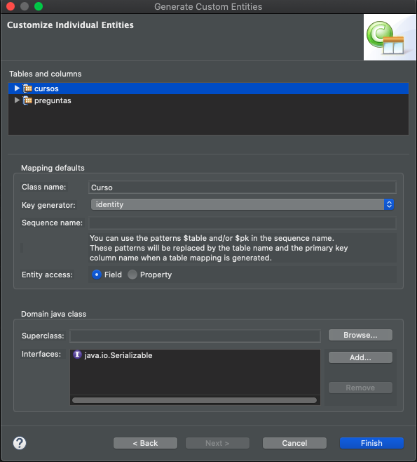


Al presionar Finish se generan las dos Entidades.

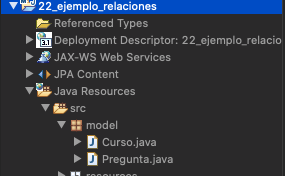

### Creación de los EJBs.

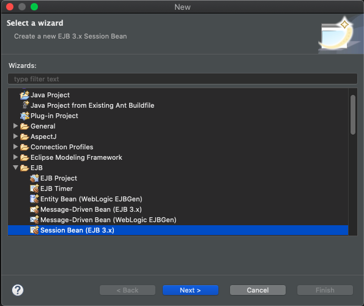

Vamos a crear algunos métodos de ejemplos de las relaciones entre Entidades. En la Interface tenemos:

`CursosService`

```java
package service;

import java.util.Date;
import java.util.List;

import javax.ejb.Local;

import model.Curso;
import model.Pregunta;

@Local
public interface CursosService {
	
   List<Pregunta> preguntasCurso(String curso);
   List<Pregunta> preguntasCursoDuracion(Date fechaInicio);
   List<Curso> cursosPorPregunta(String texto);
   
}
```

La implementación de la Interface es la siguiente:

`CursosServiceImp`

```java
package service;

import java.util.Date;
import java.util.List;

import javax.ejb.LocalBean;
import javax.ejb.Stateless;
import javax.persistence.EntityManager;
import javax.persistence.PersistenceContext;
import javax.persistence.TemporalType;
import javax.persistence.TypedQuery;

import model.Curso;
import model.Pregunta;

/**
 * Session Bean implementation class CursosService
 */
@Stateless
@LocalBean
public class CursosServiceImp implements CursosService {

   @PersistenceContext
   EntityManager em;
   @Override
   public List<Pregunta> preguntasCurso(String curso){
    	
      /* 1er Forma
      String jpql = "select c FROM Curso c WHERE c.nombre=?1";
      TypedQuery<Curso> query = em.createQuery(jpql, Curso.class);
      query.setParameter(1, curso);
      List<Curso> cursos=query.getResultList();
    	
      if(cursos.size() > 0) {
         Curso cr =cursos.get(0);
         return cr.getPreguntas();
      }
    	
      return null;
      */
		
      //2da Forma Con JOINs Implicitos //Mejor solucion que la anterior carga menos recursos
      String jpql = "select p FROM Pregunta p WHERE p.curso.nombre=?1";
      TypedQuery<Pregunta> query = em.createQuery(jpql, Pregunta.class);
      query.setParameter(1, curso);
      return query.getResultList();
   }
   
   @Override
   public List<Pregunta> preguntasCursoDuracion(Date fechaInicio) {
      String jpql = "select p FROM Pregunta p WHERE p.curso.fechaInicio>?1";
      TypedQuery<Pregunta> query = em.createQuery(jpql, Pregunta.class);
      query.setParameter(1, fechaInicio, TemporalType.DATE);
      return query.getResultList();
   }
	
   @Override
   public List<Curso> cursosPorPregunta(String texto) {
      String jpql="select c from Curso c join c.preguntas p where p.enunciado like ?1";
      TypedQuery<Curso> query=em.createQuery(jpql,Curso.class);
      query.setParameter(1, "%"+texto+"%");
      return query.getResultList();
   }

}
```


## JOINS


## Claves Primarias Compuestas


