# 20201116 Lunes

## :computer: `21_formacion_ejb_weblogic`

Partiendo del proyecto `19_formacion_factoria` vamos a realizar una versión usando EJB.


### Creación del Data Source en WebLogic


### Creación Proyecto en Eclipse


### Mavenizar Proyecto


### Dar Características JPA


### Modificación del Archivo `persistence.xml`

Copiamos el archivo `persistence.xml` del proyecto `19_formacion_factoria` al actual pero tenemos que realizar algunos cambios, en el proyecto anterior la conexión a la BD la haciamos directamente pero con el uso de WebLogic ya vamos a usar el DataSource creado en el primer paso. Por lo que entramos en la pestaña Conexión y cambiamos los valores como se muestra en las siguientes imagenes.


Mientras que en la pestaña de General tenemos


El archivo `persistence.xml` nos queda así:

```html
<?xml version="1.0" encoding="UTF-8"?>
<persistence version="2.2" xmlns="http://xmlns.jcp.org/xml/ns/persistence" xmlns:xsi="http://www.w3.org/2001/XMLSchema-instance" xsi:schemaLocation="http://xmlns.jcp.org/xml/ns/persistence http://xmlns.jcp.org/xml/ns/persistence/persistence_2_2.xsd">
   <persistence-unit name="formacionPU" transaction-type="JTA">
      <provider>org.hibernate.jpa.HibernatePersistenceProvider</provider>
      <jta-data-source>jdbc/formacionds</jta-data-source>
         <class>model.Alumno</class>
         <class>model.Curso</class>
      <properties>			
         <property name="hibernate.transaction.jta.platform" value="org.hibernate.engine.transaction.jta.platform.internal.WeblogicJtaPlatform"/>				
      </properties>
   </persistence-unit>
</persistence>
```

Como descubrimos que existe un pequeño conflicto entre Hibernate y EJB se tuvo que poner la etiqueta `<properties>` para que trabajen correctamente.

Existe otra alternativa para no trabajar con Hibernate y usar el Motor de Persistencia que viene integrado en WebLogic que en este caso es **EclipseLink** para lo cual nuestro `persistence.xml` quedaría así:


**NOTA** *Las Entidades las copiamos directamente del proyecto `19_formacion_factoria`, no usamos el asistente para crear las Entidades.*

### Creación del EJB.

La lógica del Servicio del proyecto `19_formacion_factoria` es la siguiente:


Dos Clases con sus respectivas Interfaces y la clase de Factoria.

Todo este Servicio lo debemos implementar usando EJBs. 

Vamos a necesitar un EJB para `Alumnos` y otro para `Cursos` y el Factory ya no va a ser necesario ya que EJB nos lo proporciona implícitamente.


Como estamos partiendo de código ya desarrollado en otra aplicación vamos a copiar los métodos ya desarrollados en el servicio y lo vamos a meter en las Clases del EJB y lo vamos a adaptar.

Partimos de `AlumnosServiceImpl` del proyecto `19_formacion_factoria`:

`AlumnosServiceImpl`

```java
...

public class AlumnosServiceImpl implements AlumnosService {
	
   private static EntityManager em;
   static {
      EntityManagerFactory factory=Persistence.createEntityManagerFactory("formacionPU");
      em=factory.createEntityManager();
   }
   
   @Override
   public void altaAlumno(Alumno alumno) {
      EntityTransaction tx = em.getTransaction();
      tx.begin();
      em.persist(alumno);
      tx.commit();
   }
	
   @Override
   public Alumno buscarAlumnoPorUsuario(String usuario){
      return em.find(Alumno.class,usuario);
   }

}
```

Y adaptandola a EJBs nos queda así:

`AlumnosServiceImpl`

```java
...

@Stateless
@LocalBean
public class AlumnosServiceImpl implements AlumnosService {

   @PersistenceContext(unitName = "formacionPU")
   private EntityManager em;
	
   @Override
   public void altaAlumno(Alumno alumno) {
      em.persist(alumno);
   }
	
   @Override
   public Alumno buscarAlumnoPorUsuario(String usuario){
      return em.find(Alumno.class,usuario);
   }

}
```

Observaciones del EJB:

* La clase esta anotada con `@Stateless` lo que indica que es un EJB, también anotada con `@LocalBean`
* Eliminamos la Factoria y en su lugar Inyectamos directamente el `EntityManager` usando la anotación `@PersistenceContext(unitName = "formacionPU")`.
* Eliminamos todo lo referente a las transacciones.

Con todos estos cambios la clase reduce en gran medida su código.

Normalmente primero códificamos la Interface y luego la Clase pero en este caso hemos iniciado coiando el código en la Clase, para generar la Interface a partir de la Clase podemos usar la opción:


Realizamos los mismos pasos para el EJB de `Cursos`.


En este último paso no se debería haber usado el atributo `em`, solo se seleccionan los métodos.


Las Clases e Interfaces finales de los EJBs son:

Interface `AlumnosService`

```java
package service;

import javax.ejb.Local;

import model.Alumno;

@Local
public interface AlumnosService {
   Alumno buscarAlumnoPorUsuario(String usuario);
   void altaAlumno(Alumno alumno);
}
```

Clase `AlumnosServiceImpl`

```java
package service;

import javax.ejb.LocalBean;
import javax.ejb.Stateless;
import javax.persistence.EntityManager;
import javax.persistence.PersistenceContext;

import model.Alumno;

/**
 * Session Bean implementation class AlumnosServiceImpl
 */
@Stateless
@LocalBean
public class AlumnosServiceImpl implements AlumnosService {

   @PersistenceContext(unitName = "formacionPU")
   private EntityManager em;
	
   @Override
   public void altaAlumno(Alumno alumno) {
      em.persist(alumno);
   }
	
   @Override
   public Alumno buscarAlumnoPorUsuario(String usuario){
      return em.find(Alumno.class,usuario);
   }

}
```

Interface `CursosService`

```java
package service;

import javax.ejb.Local;
import model.Curso;

@Local
public interface CursosService {
   void altaCurso(Curso curso);
}
```

Clase `CursosServiceImpl`

```java
package service;

import javax.ejb.LocalBean;
import javax.ejb.Stateless;
import javax.persistence.EntityManager;
import javax.persistence.PersistenceContext;

import model.Curso;

/**
 * Session Bean implementation class CursosServiceImpl
 */
@Stateless
@LocalBean
public class CursosServiceImpl implements CursosService {

   @PersistenceContext(unitName = "formacionPU")
   private EntityManager em;
	
   @Override
   public void altaCurso(Curso curso) {
      em.persist(curso);
   }
   
}
```

### Modificar Controllers

Como hemos visto, con estos cambios el Factory a sido eliminado por lo que debemos hacer algunos cambios en nuestros Controladores que lo usaban así:

Originalmente teniamos:

```java
AlumnosService service =  FormacionFactory.getAlumnosService();
```

o

```java
CursoService service = FormacionFactory.getCursosService();
```

En lugar de Instanciar el Servicio con la Factoria, vamos a inyectar los EJBs dentro de los Action de la siguiente forma.

```java
...

@EJB
AlumnosService service;
protected void service(HttpServletRequest request, HttpServletResponse response) throws ServletException, IOException {
   ...
```
o

```java
...

@EJB
CursosService service;
protected void service(HttpServletRequest request, HttpServletResponse response) throws ServletException, IOException {
	
   ...
```

Simplemente usamos la anotación `@EJB` para inyectar el EJB.

### Vistas

Las Vistas no sufren ningún cambio.

### Probar la aplicación.


## Relación Entre Entidades


## :computer: `22_ejemplo_relaciones`

Este proyecto nuevo nos va a servir para ver algunos ejemplos de **Relación Entre Entidades**. Este proyecto no tiene ninguna parte visual solo nos va a servir para ver las relaciones existentes entre las Tablas `Cursos` y `Preguntas`.
de la BD `formacion`.


### BD `formacion`

Tablas `Cursos` y `Preguntas`


### Creación del Proyecto Eclipse


### Mavenizar el Proyecto e incluir las dependencias de Hibernate.

`pom.xml`

```html
<!-- https://mvnrepository.com/artifact/org.hibernate/hibernate-core --> 
<dependency>
   <groupId>org.hibernate</groupId>
   <artifactId>hibernate-core</artifactId>
   <version>5.4.18.Final</version>
</dependency>
```

### Creación de una Nueva Conexión

El siguiente paso sería usar el asistente para crear las Entidades de `Cursos` y `Preguntas` **pero en ejemplos anteriores vimos que al  hacer este paso teniamos el problema de duplicación de campos por usar el conector de MySQL 8, para evitar estos problemas vamos a usar el conector de MySQL 5**.

Entramos en la opción **JPA Tools -> Generate Entities Tables...** y vamos a crear una nueva conexión para poder usar el Driver de MySQL 5.


Una vez que ya tenemos la conección con MySQL 5 vamos a generar las Entidades.


En este caso si tenemos una relación entre las tablas las cuales se relacionan por medio del campo `idCurso`, presionamos en `+` para añadir la relación.


Vamos a indicar que es una *Asociación Simple* entre las tablas `Cursos` y `Preguntas`.


En la siguiente pantalla


Debemos indicar a través de que campo se relacionan las tablas, al presionar en `Add` pone cualquier campo dde las tablas.


Debemos modificarlo para poner exactamente el que nosotros necesitemos.


En la siguiente pantalla debemos indicar la relación existente entre `Cursos` y `Preguntas` y en este caso corresponde a una relación **One to many** *Cada Curso tiene muchas Preguntas.*


Se nos muestra gráficamente la relación y si la seleccionamos muestra más detalles.


En la siguiente pantalla.


Solo vamos a cambiar el paquete donde vamos a almacenar las Entidades `model`.


En la siguiente pantalla vamos a definir para cada Entidad como se van a generar las llaves.


Al presionar Finish se generan las dos Entidades.


Vamos a ver cada una de las Entidades.

Entidad `Curso` (UNO)

```java
package model;

import java.io.Serializable;
import javax.persistence.*;
import java.util.Date;
import java.util.List;

/**
 * The persistent class for the cursos database table.
 * 
 */
@Entity
@Table(name="cursos")
@NamedQuery(name="Curso.findAll", query="SELECT c FROM Curso c")
public class Curso implements Serializable {
   private static final long serialVersionUID = 1L;

   @Id
   @GeneratedValue(strategy=GenerationType.IDENTITY)
   private int idCurso;

   private int duracion;

   @Temporal(TemporalType.DATE)
   private Date fechaInicio;

   private String nombre;

   //bi-directional many-to-one association to Pregunta
   @OneToMany(mappedBy="curso")
   private List<Pregunta> preguntas;

   public Curso() {
   }

   public int getIdCurso() {
      return this.idCurso;
   }

   public void setIdCurso(int idCurso) {
      this.idCurso = idCurso;
   }

   public int getDuracion() {
      return this.duracion;
   }

   public void setDuracion(int duracion) {
      this.duracion = duracion;
   }

   public Date getFechaInicio() {
      return this.fechaInicio;
   }

   public void setFechaInicio(Date fechaInicio) {
      this.fechaInicio = fechaInicio;
   }

   public String getNombre() {
      return this.nombre;
   }

   public void setNombre(String nombre) {
      this.nombre = nombre;
   }

   public List<Pregunta> getPreguntas() {
      return this.preguntas;
   }

   public void setPreguntas(List<Pregunta> preguntas) {
      this.preguntas = preguntas;
   }

   public Pregunta addPregunta(Pregunta pregunta) {
      getPreguntas().add(pregunta);
      pregunta.setCurso(this);

      return pregunta;
   }

   public Pregunta removePregunta(Pregunta pregunta) {
      getPreguntas().remove(pregunta);
      pregunta.setCurso(null);

      return pregunta;
   }

}
```

Observaciones sobre la Entidad `Curso` (Entidad "UNO"):

* Anotada con `@Entity`
* Anotada con `@Table(name="cursos")`
* Anotada con `@NamedQuery(name="Curso.findAll", query="SELECT c FROM Curso c")`
* Implementa `Serializable`
* El atributo que representa la clave principal esta anotada con `@Id` y `  @GeneratedValue(strategy=GenerationType.IDENTITY)` para la estrategía de generación de la clave.
* Los campos de tipo `Date` se anotan con `@Temporal(TemporalType.DATE)`
* **Los campos de la Tabla `cursos` son: `idCurso`, `nombre`, `duracion`, `fechaInicio`** y el asistente en la Entidad a añadido los atributos `idCurso`, `nombre`, `duracion`, `fechaInicio` pero añade un atributo más.
* **SE AÑADE EL ATRIBUTO `private List<Pregunta> preguntas;` CON LA ANOTACIÓN `@OneToMany(mappedBy="curso")`**, esto lo hace por que establecimos una relación ONE-TO-MANY entre la tabla `cursos` con respecto a la tabla `preguntas` *Un Curso puede tener Muchas Preguntas* por lo que lo representa con este atributo.
* Añade los métodos `getters` y `setters` para todos los atributos.
* Añade dos métodos especiales para añadir y remover preguntas en la colección de preguntas.

Entidad `Pregunta` (MUCHOS)

```java
package model;

import java.io.Serializable;
import javax.persistence.*;


/**
 * The persistent class for the preguntas database table.
 * 
 */
@Entity
@Table(name="preguntas")
@NamedQuery(name="Pregunta.findAll", query="SELECT p FROM Pregunta p")
public class Pregunta implements Serializable {
   private static final long serialVersionUID = 1L;

   @Id
   @GeneratedValue(strategy=GenerationType.IDENTITY)
   private int idPregunta;

   private String enunciado;

   //bi-directional many-to-one association to Curso
   @ManyToOne
   //name es el nombre de la Foreing Key, es decir, el nombre de la columna de relación 
   // en el lado muchos
   // es el nombre de la primary key en el lado uno
   @JoinColumn(name="idCurso", referencedColumnName = "idCurso")
   private Curso curso;

   public Pregunta() {
   }

   public int getIdPregunta() {
      return this.idPregunta;
   }

   public void setIdPregunta(int idPregunta) {
      this.idPregunta = idPregunta;
   }

   public String getEnunciado() {
      return this.enunciado;
   }

   public void setEnunciado(String enunciado) {
      this.enunciado = enunciado;
   }

   public Curso getCurso() {
      return this.curso;
   }

   public void setCurso(Curso curso) {
      this.curso = curso;
   }

}
```

Observaciones sobre la Entidad `Pregunta` (Entidad MUCHOS):

* Anotada con `@Entity`
* Anotada con `@Table(name="preguntas")`
* Anotada con `@NamedQuery(name="Pregunta.findAll", query="SELECT p FROM Pregunta p")`
* Implementa `Serializable`
* El atributo que representa la clave principal esta anotada con `@Id` y `  @GeneratedValue(strategy=GenerationType.IDENTITY)` para la estrategía de generación de la clave.
* **Los campos de la Tabla `preguntas` son: `idPregunta`, `idCurso`, `enunciado`** y el asistente en la Entidad a añadido los atributos `idPregunta`, `enunciado`, **pero para `idCurso` a insertado un atributo `curso` INCLUYE TODO EL CURSO NO SOLAMENTE el `idCurso`**.
* El atributo `curso` esta anotado con `@ManyToOne` y con `@JoinColumn(name="idCurso")` esto lo que permite es relacionar la Entidad `Pregunta` con `Curso`, dado que `Pregunta` representa la Entidad MUCHOS es anotada con `@ManyToOne` y con `@JoinColumn(name="idCurso")` le decimos cual es la columna de Curso que sirve para relacionarse en este caso es `idCurso`. **LO ÚNICO QUE EL ASISTENTE NO PONE Y QUE LO DEBEMOS HACER MANUALMENTE ES INDICAR LA COLUMNA REFERENCIADA DE LA OTRA TABLA CON LA QUE SE VA A RELACIONAR** Por lo que la Anotación final nos queda así **@JoinColumn(name="idCurso", referencedColumnName = "idCurso")**

### Creación de los EJBs.


Vamos a crear algunos métodos de ejemplos de las relaciones entre Entidades. En la Interface tenemos:

`CursosService`

```java
package service;

import java.util.Date;
import java.util.List;

import javax.ejb.Local;

import model.Curso;
import model.Pregunta;

@Local
public interface CursosService {
	
   List<Pregunta> preguntasCurso(String curso);
   List<Pregunta> preguntasCursoDuracion(Date fechaInicio);
   List<Curso> cursosPorPregunta(String texto);
   
}
```

La implementación de la Interface es la siguiente:

`CursosServiceImp`

```java
package service;

import java.util.Date;
import java.util.List;

import javax.ejb.LocalBean;
import javax.ejb.Stateless;
import javax.persistence.EntityManager;
import javax.persistence.PersistenceContext;
import javax.persistence.TemporalType;
import javax.persistence.TypedQuery;

import model.Curso;
import model.Pregunta;

/**
 * Session Bean implementation class CursosService
 */
@Stateless
@LocalBean
public class CursosServiceImp implements CursosService {

   @PersistenceContext
   EntityManager em;
   @Override
   public List<Pregunta> preguntasCurso(String curso){
    	
      /* 1er Forma
      String jpql = "SELECT c FROM Curso c WHERE c.nombre=?1";
      TypedQuery<Curso> query = em.createQuery(jpql, Curso.class);
      query.setParameter(1, curso);
      List<Curso> cursos=query.getResultList();
    	
      if(cursos.size() > 0) {
         Curso cr =cursos.get(0);
         return cr.getPreguntas();
      }
    	
      return null;
      */
		
      //2da Forma Con JOINs Implícitos //Mejor solucion que la anterior carga menos recursos
      String jpql = "SELECT p FROM Pregunta p WHERE p.curso.nombre=?1";
      TypedQuery<Pregunta> query = em.createQuery(jpql, Pregunta.class);
      query.setParameter(1, curso);
      return query.getResultList();
   }
   
   @Override
   public List<Pregunta> preguntasCursoDuracion(Date fechaInicio) {
      String jpql = "SELECT p FROM Pregunta p WHERE p.curso.fechaInicio>?1";
      TypedQuery<Pregunta> query = em.createQuery(jpql, Pregunta.class);
      query.setParameter(1, fechaInicio, TemporalType.DATE);
      return query.getResultList();
   }
	
   @Override
   public List<Curso> cursosPorPregunta(String texto) {
      String jpql="SELECT c FROM Curso c JOIN c.preguntas p WHERE p.enunciado LIKE ?1";
      TypedQuery<Curso> query=em.createQuery(jpql,Curso.class);
      query.setParameter(1, "%"+texto+"%");
      return query.getResultList();
   }

}
```

Vamos a explicar cada uno de los métodos.

1. `List<Pregunta> preguntasCurso(String curso)` 

   En este método, dado el nombre de un curso, vamos a recuperar una lista de preguntas para ese curso. 
   
   En la primera solución, lo primero que hacemos es recuperar el Curso que cumple la condición, si existe retornamos el valor de su atributo `preguntas`. Esta solución es válida pero no es la mejor.
   
   Una segunda solución es usar los **JOINs IMPLÍCITOS** (Vea Diapositivas). Consiste en atacar directamente la Entidad que contiene los datos en este caso `Pregunta` y usar su atributo `curso` de tipo `Curso` el cual a su vez contiene el atributo `nombre` que es el que queremos comparar. La sentencia JPQL exacta es: `jpql = "SELECT p FROM Pregunta p WHERE p.curso.nombre=?1"` y basta ejecutar directamente esta sentencia para obtener los resultados. **Esta es una mejor solución que la anterior ya que requiere menos recursos**.
   
2. `List<Pregunta> preguntasCursoDuracion(Date fechaInicio)`   

   En este método, dada una fecha de inicio vamos a recuperar una lista de cursos que inician después de esta fecha.
   
   Para solucionarlo lo hacemos con **JOINs IMPLÍCITOS** la sentencia JPQL es:
   
   `jpql = "SELECT p FROM Pregunta p WHERE p.curso.fechaInicio>?1";`
   
3. `List<Curso> cursosPorPregunta(String texto)`  

   Con este método queremos recuperar los cursos que en sus preguntas contengan un texto que pasamos como parámetros.
   
   Para solucionarlo lo hacemos con **JOINs IMPLÍCITOS** la sentencia JPQL es 
   
   `jpql="SELECT c FROM Curso c JOIN c.preguntas p WHERE p.enunciado LIKE ?1";`
   
   Observe que para asignar el parámetro usamos:
   
   `query.setParameter(1, "%"+texto+"%");`
   

HASTA AQUÍ EL EJEMPLO QUE COMO DIJIMOS NO TIENE PARTE VISUAL NI SE TERMINO DE CONFIGURAR DEL TODO PERO NOS SIRVIO PARA VER LA RELACIÓN ENTRE ENTIDADES Y EL USO DE **JOINs IMPLÍCITOS**.

## JOINS


## Claves Primarias Compuestas


## :computer: `23_formacion_ejb_weblogic_v2`

Partiendo del proyecto `21_formacion_ejb_weblogic` vamos a realizar una versión.

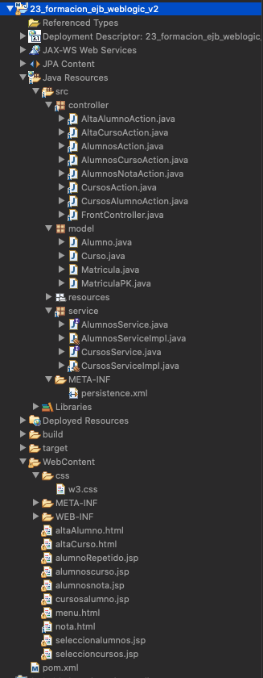

En esta nueva versión vamos a involucrar tres tablas de la BD de `Formacion` entre las cuales existe la siguiente relación.

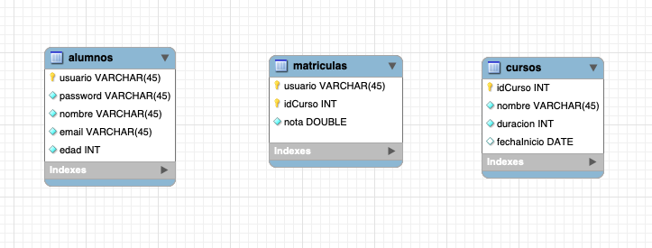

*Un alumno puede estar matriculado en uno o más cursos y un curso puede pertenecer a varias matriculas*

Se pide añadir las siguientes a las ya existentes:

* Añadir una opción para buscar alumnos que tengan como mínima una nota que se pasa como parámetro.
* Añadir una opción para buscar alumnos de un cierto curso.
* Añadir una opción para buscar cursos de un alumno con su clave de usuario.
* Listado de todos los cursos.

Partimos de un proyecto ya Mavenizado con las dependencias existentes, que usa JPA y EJBs, pero actualmente solo cuenta con dos Entidades `Alumno` y `Curso` las cuales no tienen ninguna relación entre ellas, nosotros ademas de estas dos Entidades necesitamos la Entidad de `Matricula` y todas ellas con sus respectivas relaciones. ***Lo mejor es borrar las Entidades actuales y generarlas nuevamente con el asistente***.

### Generación de Entidades.

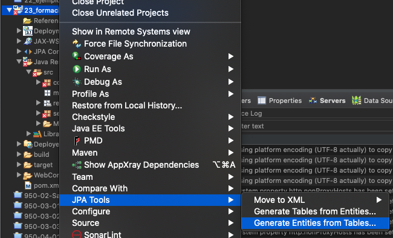

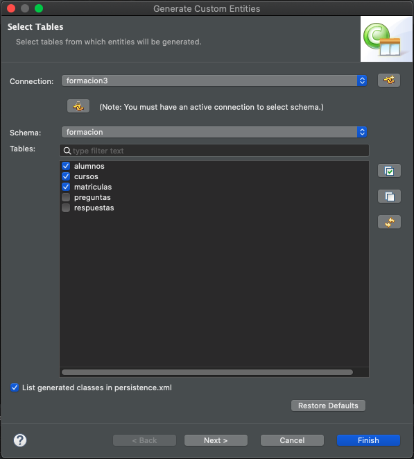

En este caso seleccionamos 3 tablas y en la siguiente pantalla vamos a relacionar las tablas, en este caso va a ver dos relaciones, la primera entre `Alumno` y `Matricula`.

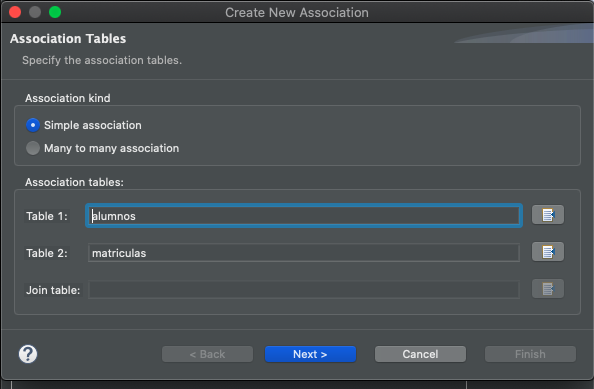

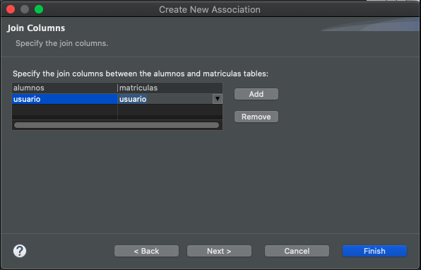

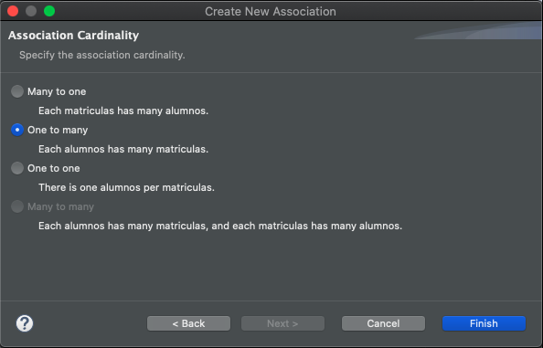

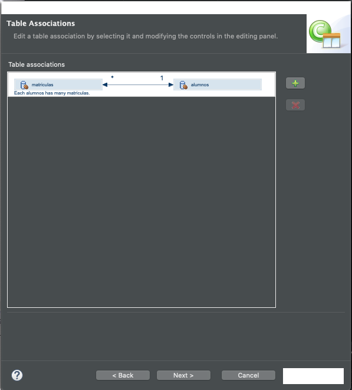

 La segunda relación es entre `Curso` y `Matricula`.
 
 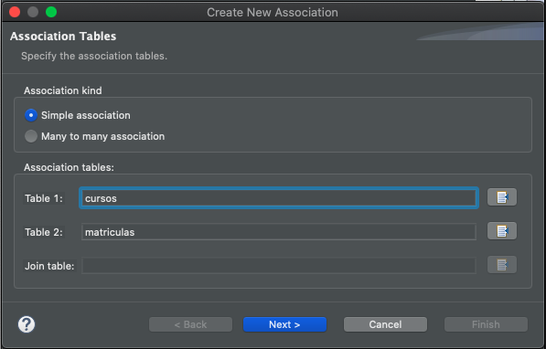

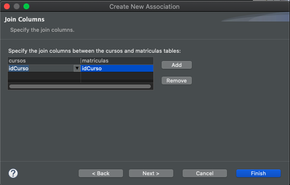

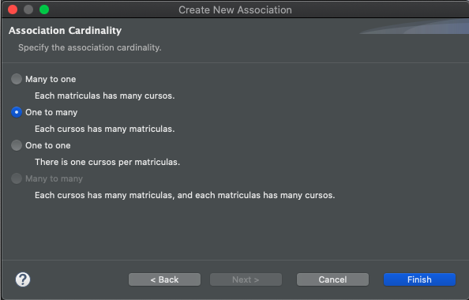

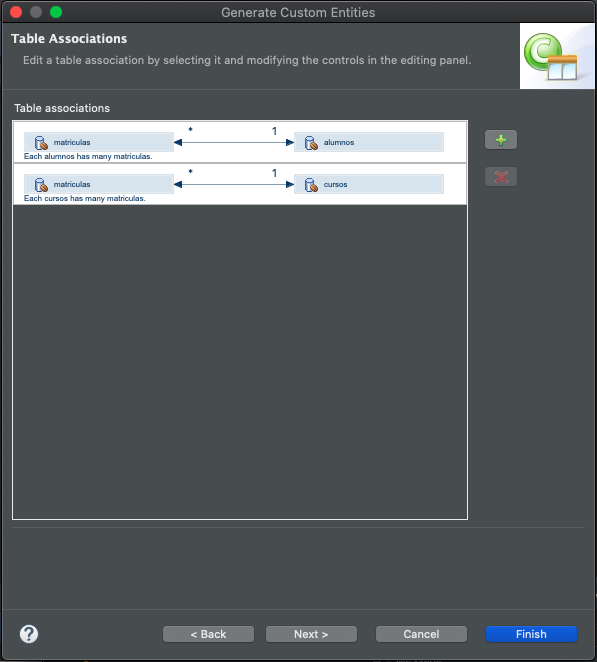

Continuamos en la siguiente pantalla.

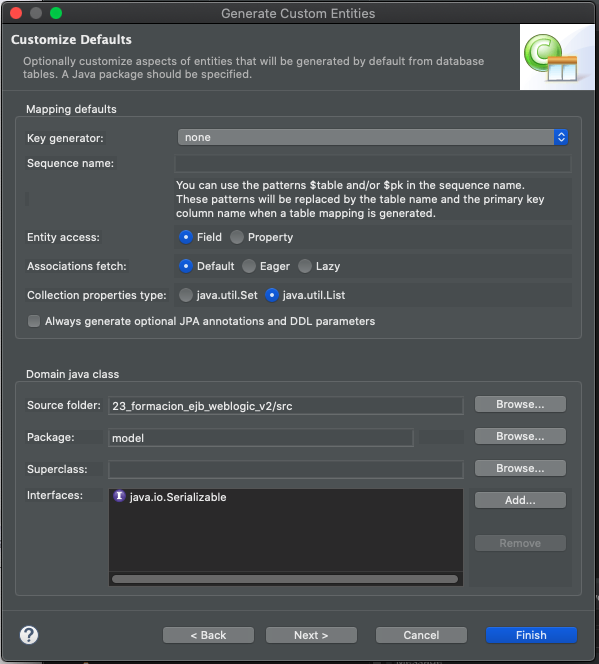

Establecemos las estrategias de generación de Claves.

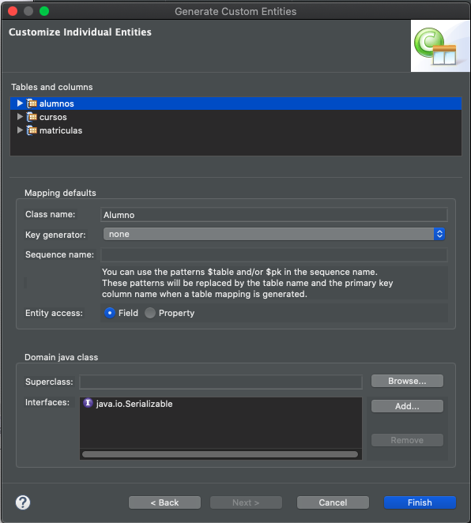


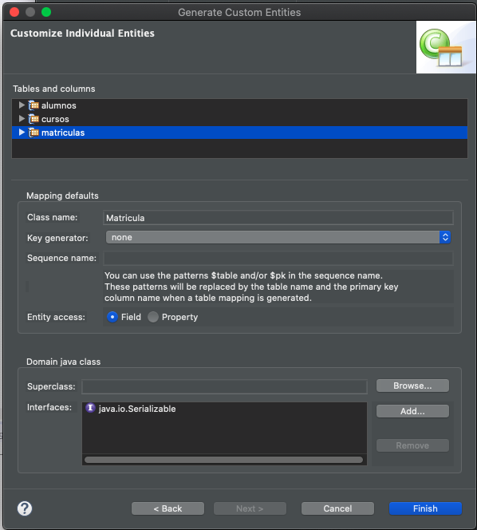

### Entidades

Se han generan 4 Entidades.


Vamos a analizar cada una de ellas:

Entidad `Alumno` (Entidad UNO):

```java
package model;

import java.io.Serializable;
import javax.persistence.*;
import java.util.List;


/**
 * The persistent class for the alumnos database table.
 * 
 */
@Entity
@Table(name="alumnos")
@NamedQuery(name="Alumno.findAll", query="SELECT a FROM Alumno a")
public class Alumno implements Serializable {
   private static final long serialVersionUID = 1L;

   @Id
   private String usuario;

   private int edad;

   private String email;

   private String nombre;

   private String password;

   //bi-directional many-to-one association to Matricula
   @OneToMany(mappedBy="alumno")
   private List<Matricula> matriculas;

   public Alumno() {
   }
   
   public Alumno(String usuario, int edad, String email, String nombre, String password) {
      super();
      this.usuario = usuario;
      this.edad = edad;
      this.email = email;
      this.nombre = nombre;
      this.password = password;
   }

   public String getUsuario() {
      return this.usuario;
   }

   public void setUsuario(String usuario) {
      this.usuario = usuario;
   }

   public int getEdad() {
      return this.edad;
   }

   public void setEdad(int edad) {
      this.edad = edad;
   }

   public String getEmail() {
      return this.email;
   }

   public void setEmail(String email) {
      this.email = email;
   }

   public String getNombre() {
      return this.nombre;
   }

   public void setNombre(String nombre) {
      this.nombre = nombre;
   }

   public String getPassword() {
      return this.password;
   }

   public void setPassword(String password) {
      this.password = password;
   }

   public List<Matricula> getMatriculas() {
      return this.matriculas;
   }

   public void setMatriculas(List<Matricula> matriculas) {
      this.matriculas = matriculas;
   }

   public Matricula addMatricula(Matricula matricula) {
      getMatriculas().add(matricula);
      matricula.setAlumno(this);

      return matricula;
   }

   public Matricula removeMatricula(Matricula matricula) {
      getMatriculas().remove(matricula);
      matricula.setAlumno(null);

      return matricula;
   }

}
```

Observaciones de Entidad `Alumno`:

* Como Entidad UNO se relaciona con la Entidad MUCHOS con el atributo `private List<Matricula> matriculas;` anotado con `@OneToMany(mappedBy="alumno")`   
* Hemos añadido manualmente un Constructor con los campos sin incluir el atriburo de relación `matriculas`, solo los propios de la Entidad.

Entidad `Cursos` (Entidad UNO)

```java
package model;

import java.io.Serializable;
import javax.persistence.*;
import java.util.Date;
import java.util.List;


/**
 * The persistent class for the cursos database table.
 * 
 */
@Entity
@Table(name="cursos")
@NamedQuery(name="Curso.findAll", query="SELECT c FROM Curso c")
public class Curso implements Serializable {
   private static final long serialVersionUID = 1L;

   @Id
   @GeneratedValue(strategy=GenerationType.IDENTITY)
   private int idCurso;

   private int duracion;

   @Temporal(TemporalType.DATE)
   private Date fechaInicio;

   private String nombre;

   //bi-directional many-to-one association to Matricula
   @OneToMany(mappedBy="curso")
   private List<Matricula> matriculas;

   public Curso() {
   }
	
   public Curso(int idCurso, int duracion, Date fechaInicio, String nombre) {
      super();
      this.idCurso = idCurso;
      this.duracion = duracion;
      this.fechaInicio = fechaInicio;
      this.nombre = nombre;
   }

   public int getIdCurso() {
      return this.idCurso;
   }

   public void setIdCurso(int idCurso) {
      this.idCurso = idCurso;
   }

   public int getDuracion() {
      return this.duracion;
   }

   public void setDuracion(int duracion) {
      this.duracion = duracion;
   }

   public Date getFechaInicio() {
      return this.fechaInicio;
   }

   public void setFechaInicio(Date fechaInicio) {
      this.fechaInicio = fechaInicio;
   }

   public String getNombre() {
      return this.nombre;
   }

   public void setNombre(String nombre) {
      this.nombre = nombre;
   }

   public List<Matricula> getMatriculas() {
      return this.matriculas;
   }

   public void setMatriculas(List<Matricula> matriculas) {
      this.matriculas = matriculas;
   }

   public Matricula addMatricula(Matricula matricula) {
      getMatriculas().add(matricula);
      matricula.setCurso(this);

      return matricula;
   }

   public Matricula removeMatricula(Matricula matricula) {
      getMatriculas().remove(matricula);
      matricula.setCurso(null);

      return matricula;
   }

}
```

Observaciones de Entidad `Curso`:

* Como Entidad UNO se relaciona con la Entidad MUCHOS con el atributo `private List<Matricula> matriculas;` anotado con `@OneToMany(mappedBy="curso")`   
* Hemos añadido manualmente un Constructor con los campos sin incluir el atriburo de relación `matriculas`, solo los propios de la Entidad.

En el Caso de la Entidad `Matriculas` que abarca la Entidad MUCHOS para ambas relaciones y como puede observarse tiene una llave compuesta nos genera dos Entidades:


Entidad `MatriculaPK`:

```java
package model;

import java.io.Serializable;
import javax.persistence.*;

/**
 * The primary key class for the matriculas database table.
 * 
 */
@Embeddable
public class MatriculaPK implements Serializable {
   //default serial version id, required for serializable classes.
   private static final long serialVersionUID = 1L;

   private String usuario;

   private int idCurso;

   public MatriculaPK() {
   }

   public MatriculaPK(String usuario, int idCurso) {
      super();
      this.usuario = usuario;
      this.idCurso = idCurso;
   }

   public String getUsuario() {
      return this.usuario;
   }
   public void setUsuario(String usuario) {
      this.usuario = usuario;
   }
   public int getIdCurso() {
      return this.idCurso;
   }
   public void setIdCurso(int idCurso) {
      this.idCurso = idCurso;
   }

   public boolean equals(Object other) {
      if (this == other) {
         return true;
      }
      if (!(other instanceof MatriculaPK)) {
         return false;
      }
      MatriculaPK castOther = (MatriculaPK)other;
      return 
      	this.usuario.equals(castOther.usuario)
         	&& (this.idCurso == castOther.idCurso);
   }

   public int hashCode() {
      final int prime = 31;
      int hash = 17;
      hash = hash * prime + this.usuario.hashCode();
      hash = hash * prime + this.idCurso;
		
      return hash;
   }
}
```

Observaciones de Entidad `MatriculaPK`:

* Entidad que contiene solo atributos que representan la clave compuesta.
* Hemos añadido un Constructor para estos dos atributos.
* Tiene sobreescrito el `equals` y `hashCode`.


Entidad `Matricula`

```java
package model;

import java.io.Serializable;
import javax.persistence.*;

/**
 * The persistent class for the matriculas database table.
 * 
 */
@Entity
@Table(name="matriculas")
@NamedQuery(name="Matricula.findAll", query="SELECT m FROM Matricula m")
public class Matricula implements Serializable {
   private static final long serialVersionUID = 1L;

   @EmbeddedId
   private MatriculaPK id;

   private double nota;

   //bi-directional many-to-one association to Alumno
   @ManyToOne
   @JoinColumn(name="usuario",  referencedColumnName="usuario")
   private Alumno alumno;
   
   //bi-directional many-to-one association to Curso
   @ManyToOne
   @JoinColumn(name="idCurso", referencedColumnName="idCurso")
   private Curso curso;

   public Matricula() {
   }
	
   public Matricula(MatriculaPK id, double nota) {
      super();
      this.id = id;
      this.nota = nota;
   }

   public MatriculaPK getId() {
      return this.id;
   }

   public void setId(MatriculaPK id) {
      this.id = id;
   }
   
   public double getNota() {
      return this.nota;
   }

   public void setNota(double nota) {
      this.nota = nota;
   }

   public Alumno getAlumno() {
      return this.alumno;
   }

   public void setAlumno(Alumno alumno) {
      this.alumno = alumno;
   }

   public Curso getCurso() {
      return this.curso;
   }

   public void setCurso(Curso curso) {
      this.curso = curso;
   }

}
```

Observaciones de Entidad `Matricula`:

* Esta es la segunda parte de la Entidad `Matricula` por lo que incluye un atributo `id` `MatriculaPK` anotado con `@EmbeddedId` de esta manera incluimos la llave compuesta dentro de esta Entidad. 
* Incluye el atributo de relación `alumno` para realizar la relación con la Entidad `Alumno` anotado con 
`@ManyToOne` y `@JoinColumn(name="usuario",  referencedColumnName="usuario")` (añadida manualmente la referencia.
* Incluye el atributo de relación `curso` para realizar la relación con la Entidad `Curso` anotado con 
`@ManyToOne` y `@JoinColumn(name="idCurso", referencedColumnName="idCurso")` (añadida manualmente la referencia.

### Añadir Métodos en los EJBs.

### Añadir Actions

### Añadir Vistas


 


