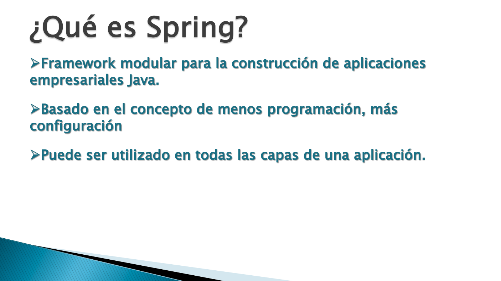
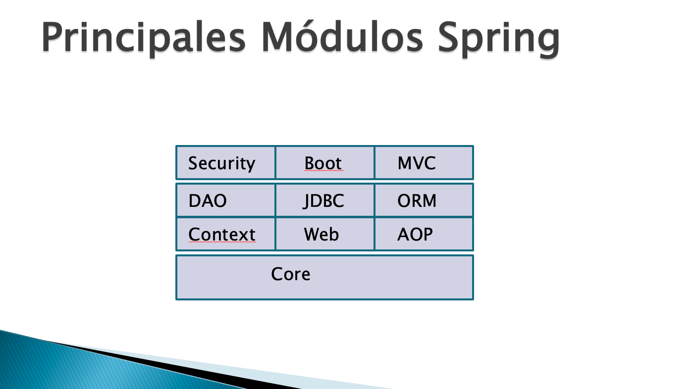
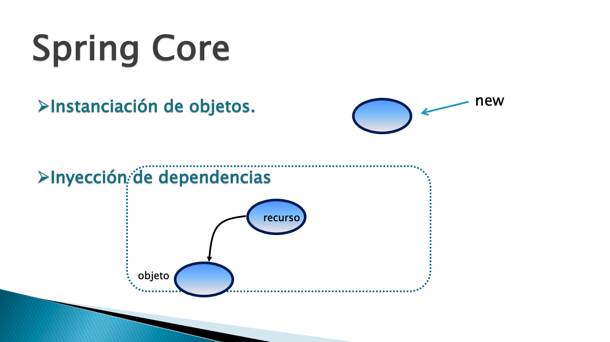
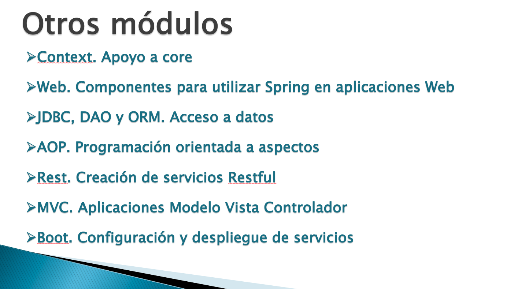
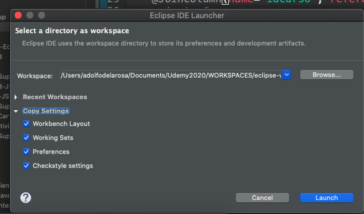
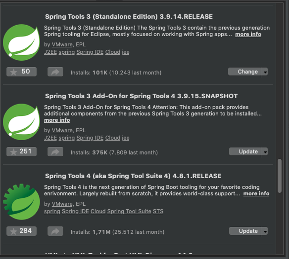
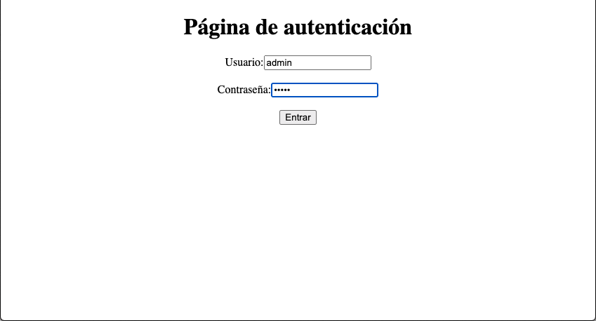
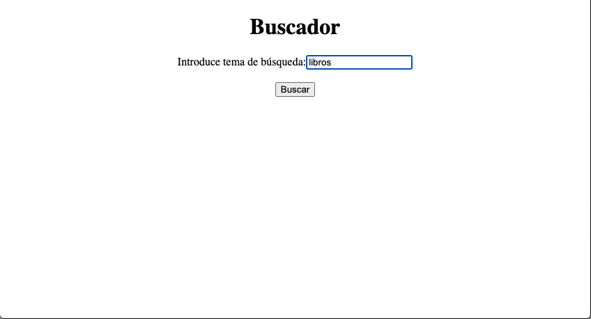
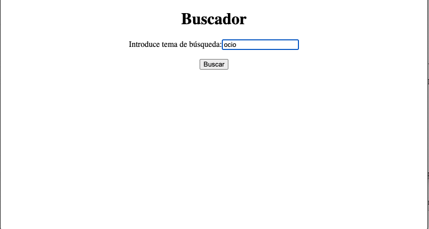
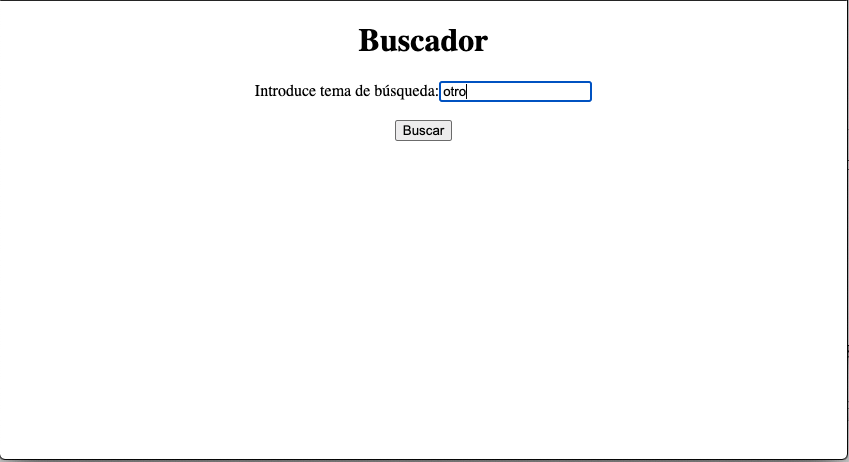

# 20201117 Martes

# SPRING

## Introducción a Spring.

## Aplicaciones Web con Spring.

### Generación de un Nuevo Workspace.

Vamos a generar un nuevo Workspace pero vamos a copiar las características del Actual para que no partemos de cero y podamos usar todo lo instalado hasta ahora.

Una vez que tenemos nuestro nuevo workspace lo que tenemos que hacer es Instalar el Servidor que vayamos a usar, en nuestro caso Tomcat, aunque podemos usar también WebLogic que tiene la limitación de que solo trabaja con Java 8.

Lo siguiente que debemos instalar es el Pluging **Spring Tools 3(Standalone Edition) 3.9.14.RELEASE**

**Nota** ***Puede existir algún conflicto si se tenia instalado WebLogic y luego se quiere que instalar este pluging, pero si se hace a la inversa no hay error***

### Ejecutando la Aplicación

