# 20201117 Martes

# SPRING

## Introducción a Spring.


## Aplicaciones Web con Spring.


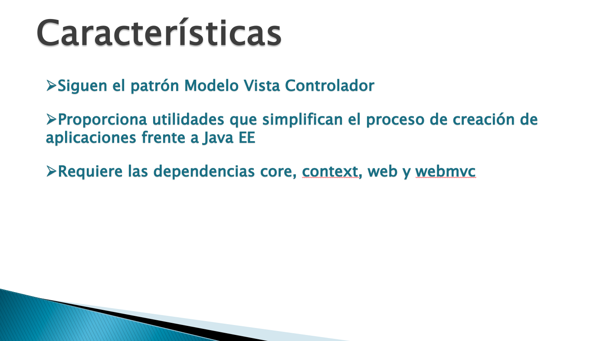
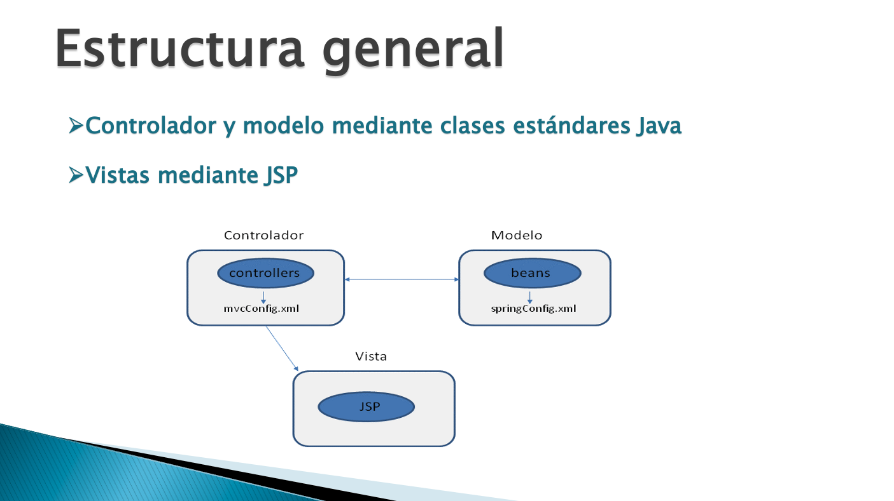
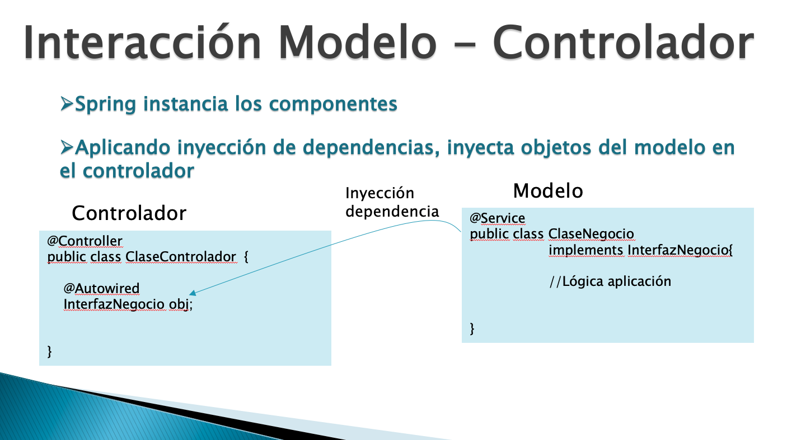
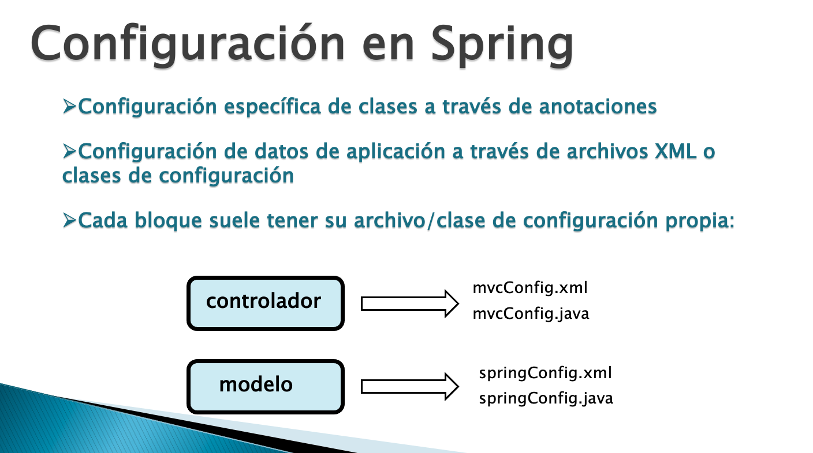

### Generación de un Nuevo Workspace.

Vamos a generar un nuevo Workspace pero vamos a copiar las características del Actual para que no partemos de cero y podamos usar todo lo instalado hasta ahora.


Una vez que tenemos nuestro nuevo workspace lo que tenemos que hacer es Instalar el Servidor que vayamos a usar, en nuestro caso Tomcat, aunque podemos usar también WebLogic que tiene la limitación de que solo trabaja con Java 8.

Lo siguiente que debemos instalar es el Pluging **Spring Tools 3(Standalone Edition) 3.9.14.RELEASE**


**Nota** ***Puede existir algún conflicto si se tenia instalado WebLogic y luego se quiere que instalar este pluging, pero si se hace a la inversa no hay error***

## :computer: `01_buscador_base`

Antes de realizar nuestra primer aplicación Spring vamos a partir de este ejemplo que es muy básico, para ver como va evolucionando cuando empecemos a usar Spring.

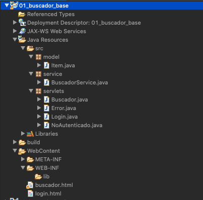

Como vemos es una aplicación que tiene una capa de Lógica de Negocios muy básica, solo es una simple Clase que no usa BD, EJBs, Factoria, Interfaces.

### Capa de Servicio

Servicio `BuscadorService`

```java
package service;

import java.util.ArrayList;
import java.util.List;

import model.Item;

public class BuscadorService {
   List<Item> items=List.of(
     new Item("Casa del libro","http://casadellibro.es", new String[]{"libros","lectura","ocio"},"Libros y más cosas"),
		 new Item("La web del gamer","http://gamers.es", new String[]{"juegos","ordenadores","ocio"},"Todo sobre video juegos"),
		 new Item("My computer","http://computerall.es", new String[]{"informática","ordenadores"},"Ordenadores al mejor precio"),
		 new Item("Fnac","http://fnac.es", new String[]{"juegos","ordenadores","libros"},"Bienvenido al mundo del ocio y la cultura"),
		 new Item("Todo pelis","http://filmers.es", new String[]{"cine","peliculas","ocio"},"Entra en el mundo del cine"));
	
   public List<Item> buscarItems(String tema){
      List<Item> resultado = new ArrayList<>();
      if(comprobar(tema)) {
         //recorremos todos los item de la lista
         for(Item item:items) {
            //para cada item, recorremos su array de temas
            //y miramos si alguno coincide con el tema recibido
            for(String dato:item.getSeo()) {
               if(dato.equals(tema)) {
                  resultado.add(item);
               }
            }
         }
         return resultado;
      }
      return null;
   }
	
   private boolean comprobar(String palabra) {
      for(Item item:items) {
         for(String dato:item.getSeo()) {
            if(dato.equals(palabra)) {
               return true;
            }
         }
      }
      return false;
   }
}
```

### Capa Controlador

La Capa de Servicios es usada en el siguiente Action del Controlador.

`Buscador`

```java
package servlets;

import java.io.IOException;
import java.io.PrintWriter;
import java.util.List;

import javax.servlet.RequestDispatcher;
import javax.servlet.ServletException;
import javax.servlet.annotation.WebServlet;
import javax.servlet.http.HttpServlet;
import javax.servlet.http.HttpServletRequest;
import javax.servlet.http.HttpServletResponse;

import model.Item;
import service.BuscadorService;

@WebServlet("/Buscador")
public class Buscador extends HttpServlet {
	
   private static final long serialVersionUID = 1L;
	
   protected void service(HttpServletRequest request, HttpServletResponse response) throws ServletException, IOException {
      response.setContentType("text/html");
      PrintWriter out=response.getWriter();
      out.println("<html><body>");
      String tema=request.getParameter("tema");
		
      BuscadorService service= new BuscadorService();
		
      List<Item> items = service.buscarItems(tema);
      if(items != null) {
         //recorremos todos los item de la lista
         for(Item item:items) {
            out.println("<h2><a href='"+item.getUrl()+"'>"+item.getTitulo()+"</a><br/>");
         }
         out.println("</body></html>");
      } else {
         //transferimos el control a otro servlet 
         //encargado de generar una página de error
         RequestDispatcher dispatcher=request.getRequestDispatcher("Error");
         dispatcher.forward(request, response);
      }
   }
}
```

**CON LO QUE TENEMOS QUE QUEDAR QUE ESTE ACTION ESTA TOTALMENTE ACOPLADO CON LA CAPA DE SERVICIO YA QUE DENTRO ESTAMOS INSTANCIANDO LA CLASE DEL SERVICIO CON  BuscadorService service= new BuscadorService();**

Hemos visto que para desacoplar las capas podemos usar:

* El Patrón de Factoria
* EJBs
* Spring

### Ejecutando la Aplicación

La aplicación realiza lo siguiente:


## :computer: `02_buscador_spring`

Vamos a copiar la aplicación `01_buscador_base` y generamos `02_buscador_spring` inicialmente vamos a usar Spring dentro de la Capa de Negocios. 

Spring va a crear el objeto de Servicio y lo vamos a poder inyectar en la Capa de Controller. 

**Con el uso de Spring tenemos menos código y más configuración**

Realizamos los siguientes pasos:

### Mavenizar la Aplicación

Mavenizamos la aplicación para poder usar las dependencias básicas de Spring que necesitamos que son **Spring-Core** y **Spring-Context**, las dependencias son:

```html
<dependencies>
   <!-- https://mvnrepository.com/artifact/org.springframework/spring-core -->
   <dependency>
      <groupId>org.springframework</groupId>
      <artifactId>spring-core</artifactId>
      <version>5.2.9.RELEASE</version>
   </dependency>
   <!-- https://mvnrepository.com/artifact/org.springframework/spring-context -->
   <dependency>
      <groupId>org.springframework</groupId>
      <artifactId>spring-context</artifactId>
      <version>5.2.9.RELEASE</version>
   </dependency>
</dependencies>
```

Al añadir estas dependencias en mi proyecto se agrgan varios JARs.

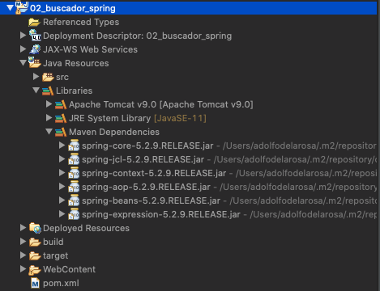

### Modificaciones a Nivel de Código

Como vimos nuestro proyecto base solo cuenta con la Clase de Servicio `BuscadorService` para trabajar con Spring y poder inyectar lo que necesitemos TODA CLASE DEBE TENER SU INTERFACE, por lo que la clase `BuscadorService` la renombraremos como `BuscadorServiceImpl` y a partir de ella vamos a generar la Interfaz `BuscadorService`.

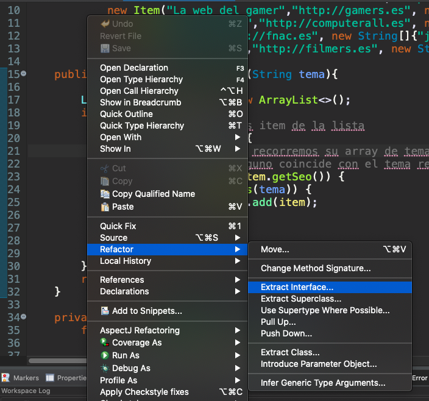
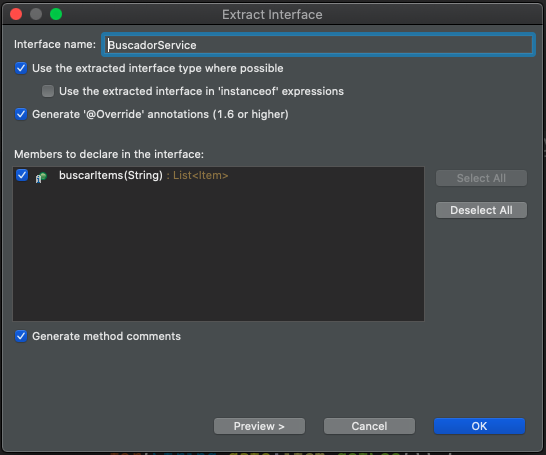

Con esto ya tengo mi Interface y mi Clase

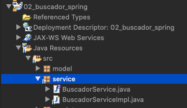

> Lo que queremos lograr son dos cosas:

> 1. Que sea Spring el que instancie los Objetos.
> 2. Y que los Inyecte donde yo los necesite.

#### 01. Para lograr que Spring me instancie una Clase, debe estar anotada con la Anotación `@Service` por ser un Servicio.

   Hay otras Anotaciones para que Spring las instancie:
   
   * `@Component` Generica
   * `@Service` Para la capa de Servicios
   * `@Repository` Para la capa de Acceso a Datos
   * `@Controller` Para los Controladores
   * `@RestController` Para los Controladores Rest
   
   Todas estas anotaciones sirven para indicarle a Spring qie nos cree una Instancia de la Clase.
 
`BuscadorService`
 
```java
...
public interface BuscadorService {
   List<Item> buscarItems(String tema);
}
```
 
`BuscadorServiceImpl`

```java
...
@Service
public class BuscadorServiceImpl implements BuscadorService {
...
```
 
#### 02. En el Servlet `Buscador` queremos usar la Clase de Servicio, actualmente usamos el operador `new` para instanciarla, pero ahora le vamos a decir a Spring que la inyecte.

Vamos a eliminar 
   
```java
BuscadorService service= new BuscadorServiceImpl();
```
Ya no vamos a trabajar con la Clase sino con la Interface y le vamos a decir a Spring que la Inyecte usando algo muy similar a lo que hemos utilizado en los EJBs, declarando la variable del tipo de la Interfaz y anotada con `@Autowired` que es la anotación universal de Spring para pedirle que nos inyecte un Objeto:
   
```java
@Autowired
BuscadorService service;
```
   
A nivel de código con estos dos pasos ya hemos logrado desacoplar las Capas, pero se requiere bastante configuración.

### Añadiendo las Configuraciones XML

Imaginemos que el Servidor de Aplicaciones recibe una petición al Servlet `Buscador` y al ejecutarlo se encuentra con la anotación `@Autowired` no va a saber interpretarla, es Spring el que tiene que interpretarla. El Servidor de Aplicaciones es un contenedor y Spring es otro diferente, pero quien arranca el "contenedor de Spring" ¿cuando se pone en marcha? NECESITAMOS DECIRLE AL SERVIDOR DE APLICACIONES QUE ARRANQUE SPRING EN EL MOMENTO QUE SE INICIA LA APLICACIÓN, sino lo hacemos así Spring no estará listo y no va a saber interpretar las anotaciones de Spring, no instaciará los objetos y nos los inyectará, lo que nos va a llevar a errores. 

***Si yo quiero hacer algo cuando comience la aplicación*** ¿Suena de algo? Un LISTENER!!! Efectivamente necesitamos tener un Listener que escuche el *Evento Inicio de aplicación* y que en ese momento *Arranque Spring*

Afortunadamente ese Listener ya existe con toda esa funcionalidad, es un Listener que lo proporciona el propio Spring, ese Listener esta en el modulo Spring Web, por lo que tenemos que añadir la dependencia de `spring-web`.

```html
<dependency>
   <groupId>org.springframework</groupId>
   <artifactId>spring-web</artifactId>
   <version>5.2.9.RELEASE</version>
</dependency>
```

Aun que por el momento no vamos a usar las caracteristicas Web de Spring, solo pretendemos usar el Core de Spring, pero como es necesario indicar que arranque Spring utilizando el Listener y queremos evitar esta tarea manualmente incluimos este modulo Spring Web a través de la dependencia `spring-web`.

El Lisener debe registrarse en la aplicación en el archivo `web.xml` (En las aplicaciones realizadas nunca registramos los Listener, pero como este Listener es de un tercero, Spring, es necesario hacerlo)

#### Archivo `web.xml`

Para añadir el `web.xml` al proyecto usamos:

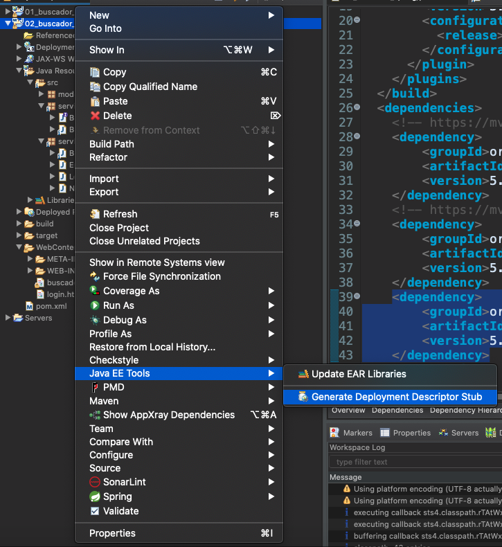

Y le añadimos el siguiente código:

```html
<context-param>
   <param-name>contextConfigLocation</param-name>
   <param-value>/WEB-INF/springConfig.xml</param-value>
</context-param>
<listener>
   <listener-class>org.springframework.web.context.ContextLoaderListener</listener-class>
</listener>
```

Al Listener le pasamos un parámetro `contextConfigLocation` con la localización del archivo de configuración de Spring.

Al registrar este Listener nos despreocupamos de cuando se arranca Spring, con esto se arrancara solo. 

Por lo que nuestro archivo `web.xml` final nos queda así:

`web.xml`

```html
<?xml version="1.0" encoding="UTF-8"?>
<web-app xmlns:xsi="http://www.w3.org/2001/XMLSchema-instance" xmlns="http://xmlns.jcp.org/xml/ns/javaee" xsi:schemaLocation="http://xmlns.jcp.org/xml/ns/javaee http://xmlns.jcp.org/xml/ns/javaee/web-app_4_0.xsd" version="4.0">
   <display-name>02_buscador_spring</display-name>
   <welcome-file-list>
      <welcome-file>login.html</welcome-file>
   </welcome-file-list>
   <context-param>
      <param-name>contextConfigLocation</param-name>
      <param-value>/WEB-INF/springConfig.xml</param-value>
   </context-param>
   <listener>
      <listener-class>org.springframework.web.context.ContextLoaderListener</listener-class>
   </listener>
</web-app>
```

#### Archivo `springConfig.xml`

Una vez que tenemos el archivo `web.xml` debemos generar a `springConfig.xml`, lo vamos a usar auxiliandonos del Plugin que instalamos. En la carpeta `WEB-INF` vamos a generar a `springConfig.xml` usando la siguiente opción: 

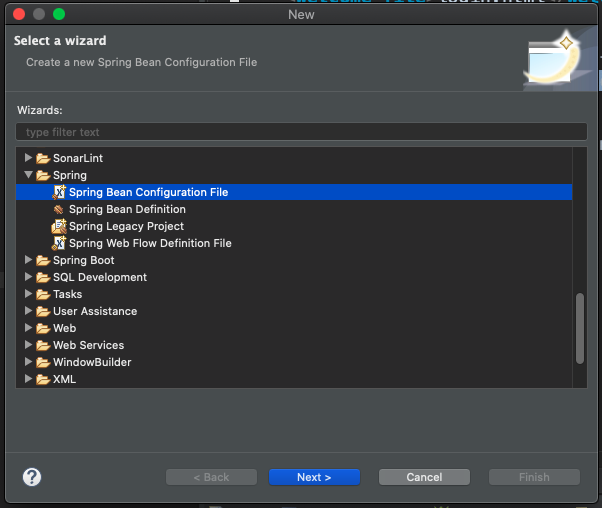
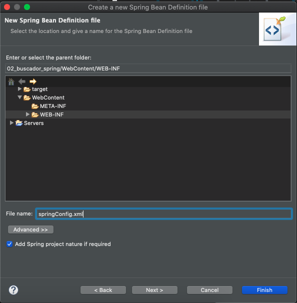

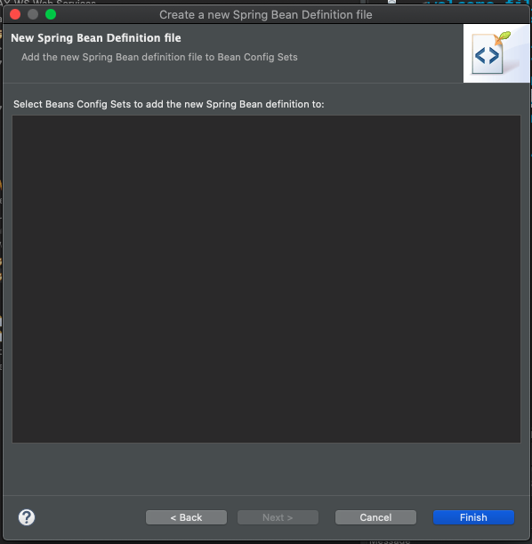
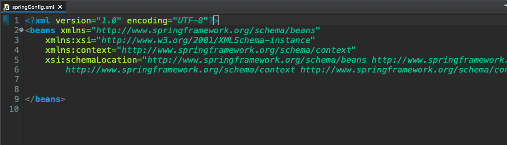

Editamos el archivo `springConfig.xml` para que nos quede así:

`springConfig.xml`

```html
<?xml version="1.0" encoding="UTF-8"?>
<beans xmlns="http://www.springframework.org/schema/beans"
	xmlns:xsi="http://www.w3.org/2001/XMLSchema-instance"
	xmlns:context="http://www.springframework.org/schema/context"
	xsi:schemaLocation="http://www.springframework.org/schema/beans http://www.springframework.org/schema/beans/spring-beans.xsd
		http://www.springframework.org/schema/context http://www.springframework.org/schema/context/spring-context-4.3.xsd">

   <!-- 1. Hailite la configuración mediante anotaciones -->
   <context:annotation-config />
	
   <!-- 2. Escanee los paquetes en los que se encuentran las clases que debe instanciar -->
   <context:component-scan base-package="service" />
</beans>
```

1. Con la primera etiqueta Spring sabe que hemos habilitado la configuración mediante anotaciones.

2. Escanee los paquetes en los que se encuentran las clases que debe instanciar.

**En teoría con la modificación de código y la configuración de los XML ya debería funcionar la aplicación.**

### Probar la Aplicación

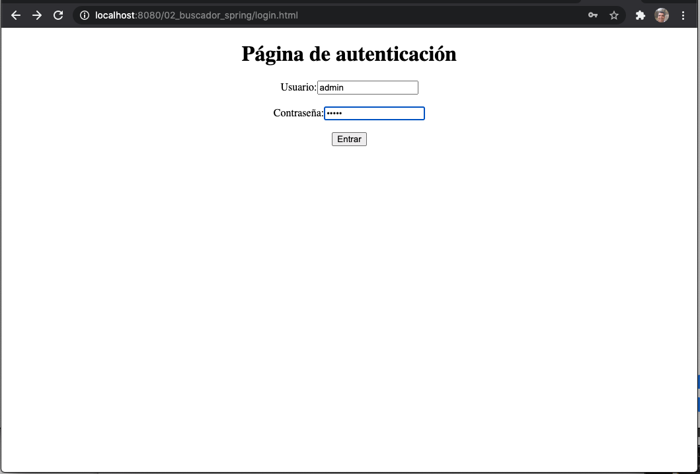


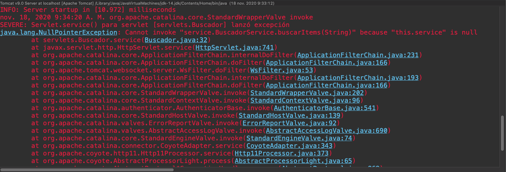

Como podemos ver al probar la aplicación y al intentar ejecutar el Servicio `BuscadorService` nos devuelve un `null`. Justo en la instrucción donde quiero usar el `service` que se supone que Spring ya me ha Inyectado y por lo tanto no debería tener ningún problema.

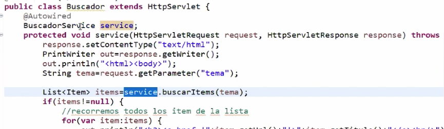

### Dandole Acceso a Spring desde el Servidor de Aplicaciones

Spring realmente no me lo ha Inyectado, no ha hecho su trabajo por eso la variable esta `null`. 

¿Por qué Spring no esta inyectando el Objeto?

El dueño del Servlet `Buscador` es el Servidor de aplicaciones, y por otro lado Spring gestiona sus componentes. Como cada quien va por su lado nos sucede el error ya que Spring no esta pudiendo Inyectar el Objeto en el Servlet. Le tenemos que decir al Servidor de Aplicaciones que habilite el acceso a Spring y esto lo debemos hacer dentro del Servlet. Vamos a tener que sobreecribir el método `init` del Servlet con:

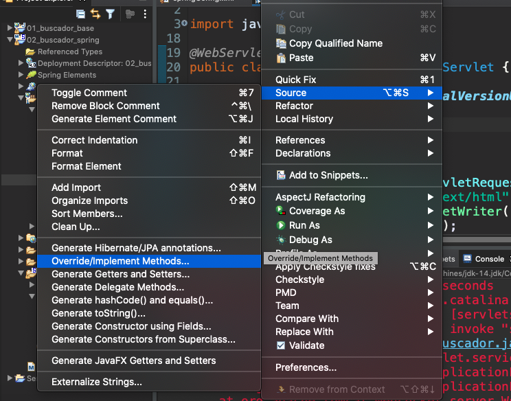
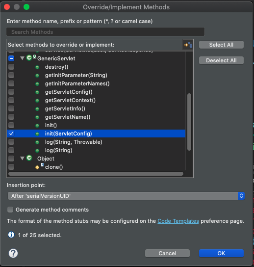

El método `init` de `Buscador` nos queda así:


```java
@Override
public void init(ServletConfig config) throws ServletException {
   //le informa al servidor de aplicaciones que Spring va a realizar inyección
   //de objetos en este servlet
   SpringBeanAutowiringSupport.processInjectionBasedOnCurrentContext(this);
   super.init(config);
}
```

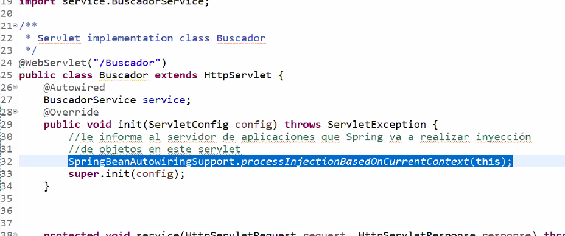

Solo añadimos una sentencia y con eso ya le informa al servidor de aplicaciones que Spring va a realizar inyección de objetos en este servlet.

Si vuelvo a probar la aplicación esta ya va a funcionar.

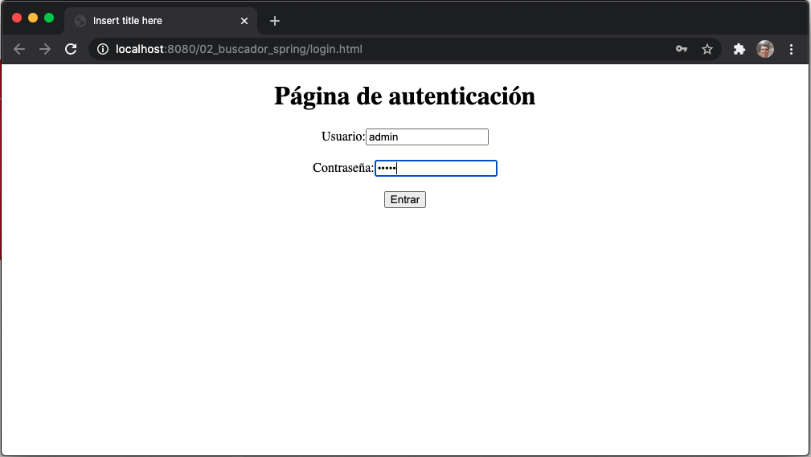
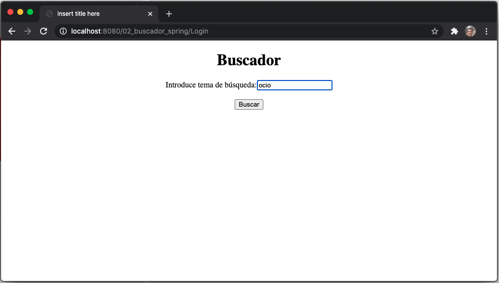
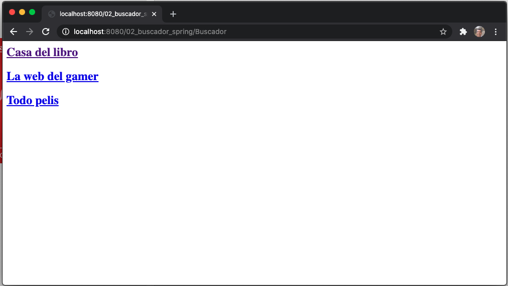

### Conclusiones de Usar Spring en la Capa de Negocio

* Con la anotación `@Service` sobre una clase le indicamos a Spring que intancie. 
* Con la anotación `@Autowired` le indicamos a Spring que inyecte el Objeto.

Para hacer uso de lo anterior tuvimos que realizar un grupo de tareas previas.

* Registrar en el `web.xml` un `Listener` que nos permita arrancar Spring.
* Indicarle en el archivo de configuración `springConfig.xml` lo que tiene que hacer Spring
   1. Que habilite la configuración por anotaciones
   2. Que escane en ciertos paquetes las clases que tiene que instanciar
   
Pero si deseamos usar la Inyección de Dependencia en un servlet el cual no pertenece a Spring debemos:

* Sobrescribir el método `init` para dar acceso a Spring y pueda inyectar Objetos.

### El Proyecto Final 

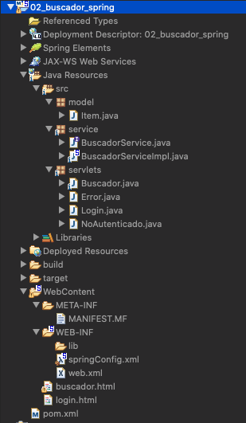

`pom.xml`

```html
<project xmlns="http://maven.apache.org/POM/4.0.0" xmlns:xsi="http://www.w3.org/2001/XMLSchema-instance" xsi:schemaLocation="http://maven.apache.org/POM/4.0.0 https://maven.apache.org/xsd/maven-4.0.0.xsd">
  <modelVersion>4.0.0</modelVersion>
  <groupId>02_buscador_spring</groupId>
  <artifactId>02_buscador_spring</artifactId>
  <version>0.0.1-SNAPSHOT</version>
  <packaging>war</packaging>
  <build>
    <sourceDirectory>src</sourceDirectory>
    <plugins>
      <plugin>
        <artifactId>maven-war-plugin</artifactId>
        <version>3.2.3</version>
        <configuration>
          <warSourceDirectory>WebContent</warSourceDirectory>
        </configuration>
      </plugin>
      <plugin>
        <artifactId>maven-compiler-plugin</artifactId>
        <version>3.8.1</version>
        <configuration>
          <release>11</release>
        </configuration>
      </plugin>
    </plugins>
  </build>
  <dependencies>
     <!-- https://mvnrepository.com/artifact/org.springframework/spring-core -->
     <dependency>
        <groupId>org.springframework</groupId>
        <artifactId>spring-core</artifactId>
        <version>5.2.9.RELEASE</version>
     </dependency>
     <!-- https://mvnrepository.com/artifact/org.springframework/spring-context -->
     <dependency>
        <groupId>org.springframework</groupId>
        <artifactId>spring-context</artifactId>
        <version>5.2.9.RELEASE</version>
     </dependency>
     <dependency>
        <groupId>org.springframework</groupId>
        <artifactId>spring-web</artifactId>
        <version>5.2.9.RELEASE</version>
     </dependency>
  </dependencies>
</project>
```

`web.xml`

```html
<?xml version="1.0" encoding="UTF-8"?>
<web-app xmlns:xsi="http://www.w3.org/2001/XMLSchema-instance" xmlns="http://xmlns.jcp.org/xml/ns/javaee" xsi:schemaLocation="http://xmlns.jcp.org/xml/ns/javaee http://xmlns.jcp.org/xml/ns/javaee/web-app_4_0.xsd" version="4.0">
   <display-name>02_buscador_spring</display-name>
   <welcome-file-list>
      <welcome-file>login.html</welcome-file>
   </welcome-file-list>
   <context-param>
      <param-name>contextConfigLocation</param-name>
      <param-value>/WEB-INF/springConfig.xml</param-value>
   </context-param>
   <listener>
      <listener-class>org.springframework.web.context.ContextLoaderListener</listener-class>
   </listener>
</web-app>
```

`springConfig.xml`

```java
<?xml version="1.0" encoding="UTF-8"?>
<beans xmlns="http://www.springframework.org/schema/beans"
	xmlns:xsi="http://www.w3.org/2001/XMLSchema-instance"
	xmlns:context="http://www.springframework.org/schema/context"
	xsi:schemaLocation="http://www.springframework.org/schema/beans http://www.springframework.org/schema/beans/spring-beans.xsd
		http://www.springframework.org/schema/context http://www.springframework.org/schema/context/spring-context-4.3.xsd">

   <!-- 1. Hailite la configuración mediante anotaciones -->
   <context:annotation-config />
	
   <!-- 2. Escanee los paquetes en los que se encuentran las clases que debe instanciar -->
   <context:component-scan base-package="service" />
</beans>
```

#### Model

`Item`

```java
package model;

public class Item {
   private String titulo;
   private String url;
   private String[] seo;
   private String descripcion;
   public Item(String titulo, String url, String[] seo, String descripcion) {
      super();
      this.titulo = titulo;
      this.url = url;
      this.seo = seo;
      this.descripcion = descripcion;
   }
   public String getTitulo() {
      return titulo;
   }
   public void setTitulo(String titulo) {
      this.titulo = titulo;
   }
   public String getUrl() {
      return url;
   }
   public void setUrl(String url) {
      this.url = url;
   }
   public String[] getSeo() {
      return seo;
   }
   public void setSeo(String[] seo) {
      this.seo = seo;
   }
   public String getDescripcion() {
      return descripcion;
   }
   public void setDescripcion(String descripcion) {
      this.descripcion = descripcion;
   }	
}
```

#### Service

`BuscadorService`

```java
package service;

import java.util.List;
import model.Item;

public interface BuscadorService {
   List<Item> buscarItems(String tema);
}
```

`BuscadorServiceImpl`

```java
package service;

import java.util.ArrayList;
import java.util.List;

import org.springframework.stereotype.Service;

import model.Item;

@Service
public class BuscadorServiceImpl implements BuscadorService {
   List<Item> items=List.of(new Item("Casa del libro","http://casadellibro.es", new String[]{"libros","lectura","ocio"},"Libros y más cosas"),
      new Item("La web del gamer","http://gamers.es", new String[]{"juegos","ordenadores","ocio"},"Todo sobre video juegos"),
      new Item("My computer","http://computerall.es", new String[]{"informática","ordenadores"},"Ordenadores al mejor precio"),
      new Item("Fnac","http://fnac.es", new String[]{"juegos","ordenadores","libros"},"Bienvenido al mundo del ocio y la cultura"),
      new Item("Todo pelis","http://filmers.es", new String[]{"cine","peliculas","ocio"},"Entra en el mundo del cine"));
	
   @Override
   public List<Item> buscarItems(String tema){
		
      List<Item> resultado = new ArrayList<>();
      if(comprobar(tema)) {
         //recorremos todos los item de la lista
         for(Item item:items) {
            //para cada item, recorremos su array de temas
            //y miramos si alguno coincide con el tema recibido
            for(String dato:item.getSeo()) {
               if(dato.equals(tema)) {
                  resultado.add(item);
               }
            }
         }
         return resultado;
      }
      return null;
   }
	
   private boolean comprobar(String palabra) {
      for(Item item:items) {
         for(String dato:item.getSeo()) {
            if(dato.equals(palabra)) {
               return true;
            }
         }
      }
      return false;
   }
}
```

#### Servlets

`Login`

```java
package servlets;

import java.io.IOException;

import javax.servlet.RequestDispatcher;
import javax.servlet.ServletException;
import javax.servlet.annotation.WebServlet;
import javax.servlet.http.HttpServlet;
import javax.servlet.http.HttpServletRequest;
import javax.servlet.http.HttpServletResponse;

@WebServlet("/Login")
public class Login extends HttpServlet {
	
   private static final long serialVersionUID = 1L;
   private static final String user="admin";
   private static final String pass="admin";
	
   protected void service(HttpServletRequest request, HttpServletResponse response) throws ServletException, IOException {
      String usuario=request.getParameter("usuario");
      String password=request.getParameter("password");
		
      RequestDispatcher dispatcher;
		
      if(usuario.equals(user)&&password.equals(pass)) {
         dispatcher=request.getRequestDispatcher("buscador.html");
      } else {
         dispatcher=request.getRequestDispatcher("NoAutenticado");
      }
      dispatcher.forward(request, response);
   }
}
```

`Buscador`

```java
package servlets;

import java.io.IOException;
import java.io.PrintWriter;
import java.util.List;

import javax.servlet.RequestDispatcher;
import javax.servlet.ServletConfig;
import javax.servlet.ServletException;
import javax.servlet.annotation.WebServlet;
import javax.servlet.http.HttpServlet;
import javax.servlet.http.HttpServletRequest;
import javax.servlet.http.HttpServletResponse;

import org.springframework.beans.factory.annotation.Autowired;
import org.springframework.web.context.support.SpringBeanAutowiringSupport;

import model.Item;
import service.BuscadorService;

@WebServlet("/Buscador")
public class Buscador extends HttpServlet {
	
   private static final long serialVersionUID = 1L;
	
   @Autowired
   BuscadorService service;
	
   @Override
   public void init(ServletConfig config) throws ServletException {
      //le informa al servidor de aplicaciones que Spring va a realizar inyección
      //de objetos en este servlet
      SpringBeanAutowiringSupport.processInjectionBasedOnCurrentContext(this);
      super.init(config);
   }
	
   protected void service(HttpServletRequest request, HttpServletResponse response) throws ServletException, IOException {
      response.setContentType("text/html");
      PrintWriter out=response.getWriter();
      out.println("<html><body>");
      String tema=request.getParameter("tema");
		
      List<Item> items = service.buscarItems(tema);
      if(items != null) {
         //recorremos todos los item de la lista
         for(Item item:items) {
            out.println("<h2><a href='"+item.getUrl()+"'>"+item.getTitulo()+"</a><br/>");
         }
         out.println("</body></html>");
      }
      else {
         //transferimos el control a otro servlet 
         //encargado de generar una página de error
         RequestDispatcher dispatcher=request.getRequestDispatcher("Error");
         dispatcher.forward(request, response);
      }
   }	
}
```

`NoAutenticado`

```java
package servlets;

import java.io.IOException;
import java.io.PrintWriter;

import javax.servlet.ServletException;
import javax.servlet.annotation.WebServlet;
import javax.servlet.http.HttpServlet;
import javax.servlet.http.HttpServletRequest;
import javax.servlet.http.HttpServletResponse;

@WebServlet("/NoAutenticado")
public class NoAutenticado extends HttpServlet {
   private static final long serialVersionUID = 1L;

   protected void service(HttpServletRequest request, HttpServletResponse response) throws ServletException, IOException {
		
      //los parámetros que le llegaron al servlet de origen
      //están disponibles tambián en el destino
      String user=request.getParameter("usuario");
		
      response.setContentType("text/html");
      response.setCharacterEncoding("UTF-8");
		
      PrintWriter out=response.getWriter();
		
      out.println("<html><body>");
      out.println("<h2>El usuario " + user + " no está autenticado</h2>");
      out.println("<a href='login.html'>Volver</a>");
      out.println("</body></html>");
   }
}
```

`Error`

```java
package servlets;

import java.io.IOException;
import java.io.PrintWriter;

import javax.servlet.ServletException;
import javax.servlet.annotation.WebServlet;
import javax.servlet.http.HttpServlet;
import javax.servlet.http.HttpServletRequest;
import javax.servlet.http.HttpServletResponse;

/**
 * Servlet implementation class Error
 */
@WebServlet("/Error")
public class Error extends HttpServlet {
   private static final long serialVersionUID = 1L;

	
   protected void service(HttpServletRequest request, HttpServletResponse response) throws ServletException, IOException {
      response.setContentType("text/html");
      PrintWriter out=response.getWriter();
      out.println("<html><body>");
      //los parámetros que le llegaron al servlet de origen
      //están disponibles también en el destino
      String tema=request.getParameter("tema");
      out.println("<h2>No hay entradas para el tema "+tema+"</h2>");
      out.println("<a href='buscador.html'>Volver</a>");
      out.println("</body></html>");
   }
}
```

#### Vistas

`login.html`

```html
<!DOCTYPE html>
<html>
<head>
<meta charset="ISO-8859-1">
<title>Insert title here</title>
</head>
<body>
   <div align="center">
      <h1>Página de autenticación</h1>
      <form action="Login" method="post">
         Usuario:<input type="text" name="usuario"/><br/><br/>
         Contraseña:<input type="password" name="password"/><br/><br/>
         <input type="submit" value="Entrar"/>
      </form>
   </div>
</body>
</html>
```

`buscador.html`

```html
<!DOCTYPE html>
<html>
<head>
<meta charset="ISO-8859-1">
<title>Insert title here</title>
</head>
<body>
   <div align="center">
      <h1>Buscador</h1>
      <form action="Buscador" method="post">
         Introduce tema de búsqueda:<input type="text" name="tema"/><br/><br/>
         <input type="submit" value="Buscar"/>
      </form>
   </div>
</body>
</html>
```
