# 20201118 Miercoles

## :computer: `03_gestion_candidatos_basedatos`

   Vamos a partir del proyecto `13_gestion_candidatos_basedatos` el cual tiene una Clase Datos para realizar la conexión a la BD `empresa` y usa JDBC. Vamos a ver que nos aporta Spring para evolucionar esta aplicación.
   
### 01. Incorporar las Dependencias de Spring en el archivo `pom.xml`

`pom.xml`

```html
<dependencies>
   <!-- https://mvnrepository.com/artifact/mysql/mysql-connector-java -->
   <dependency>
      <groupId>mysql</groupId>
      <artifactId>mysql-connector-java</artifactId>
      <version>8.0.19</version>
   </dependency>
   <!-- https://mvnrepository.com/artifact/org.springframework/spring-core -->
   <dependency>
      <groupId>org.springframework</groupId>
      <artifactId>spring-core</artifactId>
      <version>5.2.9.RELEASE</version>
   </dependency>
   <!-- https://mvnrepository.com/artifact/org.springframework/spring-context -->
   <dependency>
      <groupId>org.springframework</groupId>
      <artifactId>spring-context</artifactId>
      <version>5.2.9.RELEASE</version>
   </dependency>
   <dependency>
      <groupId>org.springframework</groupId>
      <artifactId>spring-web</artifactId>
      <version>5.2.9.RELEASE</version>
   </dependency>
</dependencies>
```

### 02. Adaptar nuestra Capa de Servicio para que tenga Clase e Interfaz.

`CandidatosService`

```java
...
public interface CandidatosService {
   void altaCandidato(Candidato candidato);
   void eliminarCandidato(int idCandidato);
   List<Candidato> recuperarCandidatos();
}
```

`CandidatosServiceImpl`

```java
...
@Service
public class CandidatosServiceImpl implements CandidatosService {
	
   @Override
   public void altaCandidato(Candidato candidato) {

   ...
```

**Como esta Clase la debe instanciar Spring la anotamos con `@Service`**.

### 03. Modificar los Servlets

* En lugar de Instanciar la Clase de Servicio que teniamos antes inyectamos la Interfaz creada con: 

   ```java
   @Autowired
   CandidatosService service;
   ```

   Esto lo hacemos en nuestros dos Servlets `AltaCandidato` y `EliminarCandidato`.

* Además debemos sobreescribir el método `init` en ambos Servlets.

   ```java
   @Override
   public void init(ServletConfig config) throws ServletException {
      //le informa al servidor de aplicaciones que Spring va a realizar inyección
      //de objetos en este servlet
      SpringBeanAutowiringSupport.processInjectionBasedOnCurrentContext(this);
      super.init(config);
   }
   ```

### 04. Añadir la Configuración XML

* Añadir el archivo `web.xml` y añadir el registro del Listener.

   ```html
   <context-param>
      <param-name>contextConfigLocation</param-name>
      <param-value>/WEB-INF/springConfig.xml</param-value>
   </context-param>
   <listener>
      <listener-class>org.springframework.web.context.ContextLoaderListener</listener-class>
   </listener>
   ```

* Añadir el `springConfig.xml` (Usando el Pluging) o copiar de otro proyecto.

   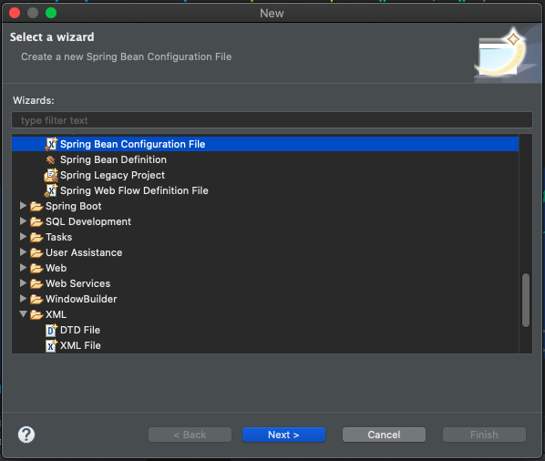
   
   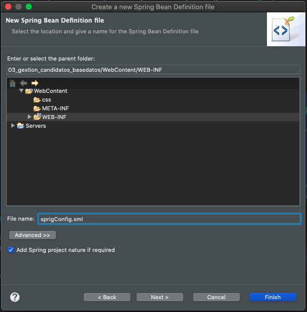
   
   Añadimos los NameSpaces que vayamos a utilizar en la pestaña `NameSpaces`
   
   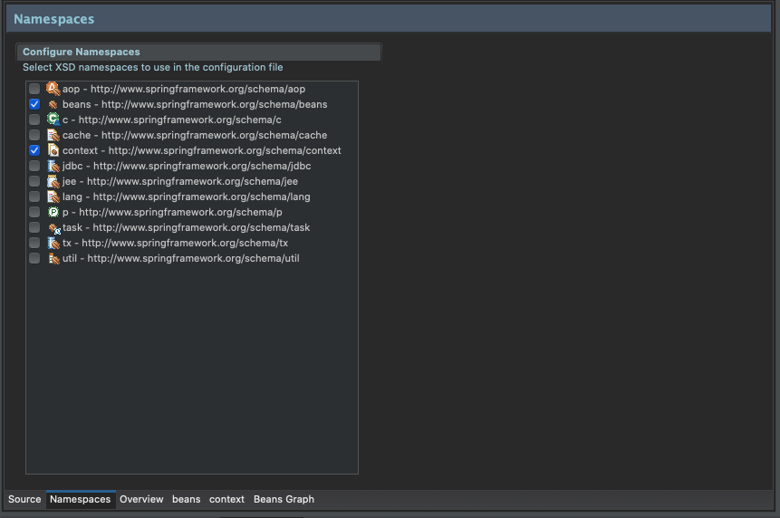
   
   Añadimos las siguientes anotaciones.

   ```html
   <!-- 1. Hailite la configuración mediante anotaciones -->
   <context:annotation-config />
	
   <!-- 2. Escanee los paquetes en los que se encuentran las clases que debe instanciar -->
   <context:component-scan base-package="service" />
   ```

### 05. Probar la Aplicación

Hasta aquí la Aplicación debe funcionar como lo hacia antes pero usando Spring.

**Hasta aquí el aporte de Spring es el mismo que en el proyecto anterior.**
**Spring instancia las Clases (anotadas con `@Service`) y las Inyecta donde las necesitemos**

## DataSources con Spring


### 06. DataSources con Spring

**UNA DE LAS COSAS QUE NOS APORTA SPRING Y QUE SIN ESTE FRAMEWORK NO SE PUEDE HACER ES QUE CON SPRING LA PROPIA APLICACIÓN PUEDE CREAR UN DATASOURCE, SIN NECESIDAD DE DEPENDER DEL SERVIDOR DE APLICACIONES.** Pero si se prefiere usar el del Servidor de Aplicaciones se puede hacer.

Spring tiene una Clase para crear un DataSource con la misma eficiencia que el Servidor de Aplicaciones. 

Por lo tanto en nuestro proyecto importado podemos eliminar la Clase `Datos` y usar el DataSource de Spring.

Si se quiere usar una Clase de Spring no se crea con el `new` en ningún sitio. Las clases de Spring se crean en el archivo `springConfig.xml`. 

Pero primero que nada necesitamos añadir una nueva dependencia que es la que nos va a permitir usar los DataSources, esa **dependencia es `spring-jdbc`**:

```html
<dependency>
   <groupId>org.springframework</groupId>
   <artifactId>spring-jdbc</artifactId>
   <version>5.2.9.RELEASE</version>
</dependency>
```

Una vez añadida la dependencia en `pom.xml`, en el archivo `springConfig.xml` podemos auxiliarnos de la pestaña `beans` para añadir los Objetos de Spring que necesitemos.

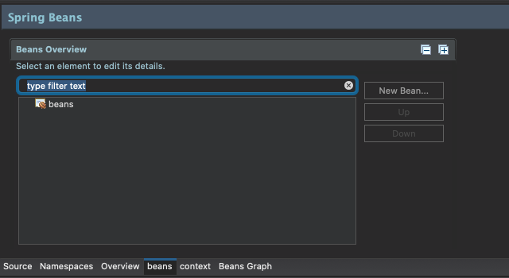

Presionamos `New Bean...` para crear un Objeto o Bean de Spring, le asignamos un `Id` y un `Name`.

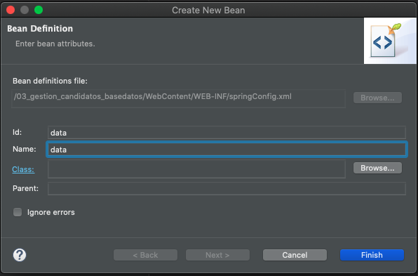

En `Class` debemos indicar la Clase de Spring que queremos crear que en este caso es un `DriverManagerDataSource`

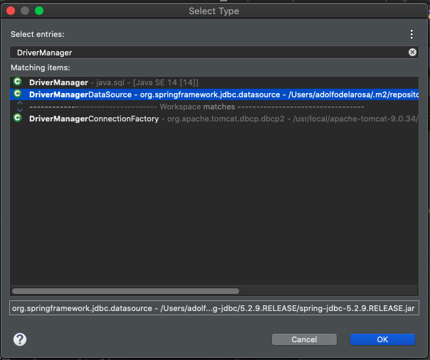

Aun que nos muestre error un error damos en Siguiente.

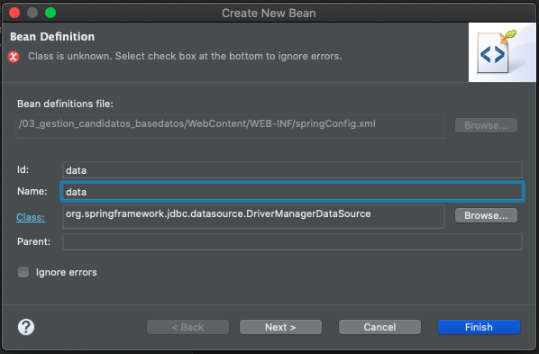

El Objeto `DriverManagerDataSource` necesita unas propiedades para que pueda trabajar y que nos van a ser familiares.


Debemos presionar `Add` para poder añadir las propiedades.

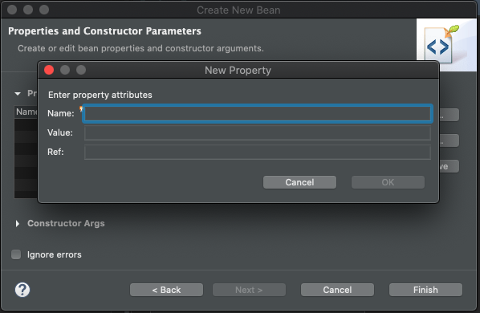

Gracias a que añadimos la dependencia `spring-jdbc` al insertar los nombres de las propiedades ya me las reconoce.

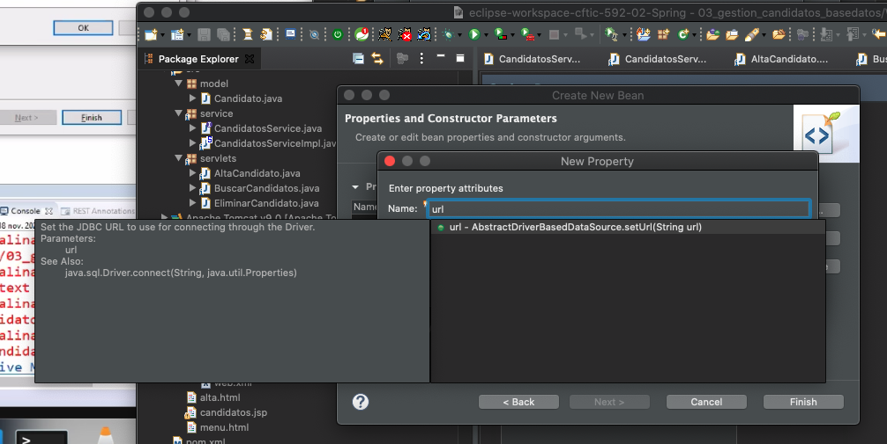

Ingreso el valor de la propiedad `url`.

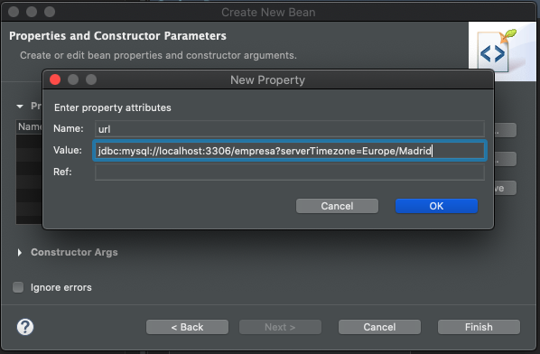
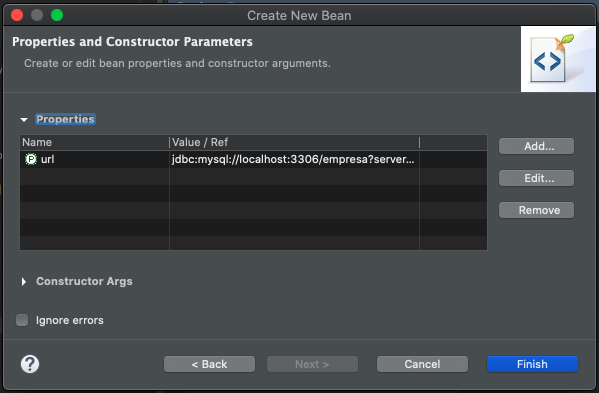

Repito el proceso para `DriverManager`.


Repito el proceso para `username`.

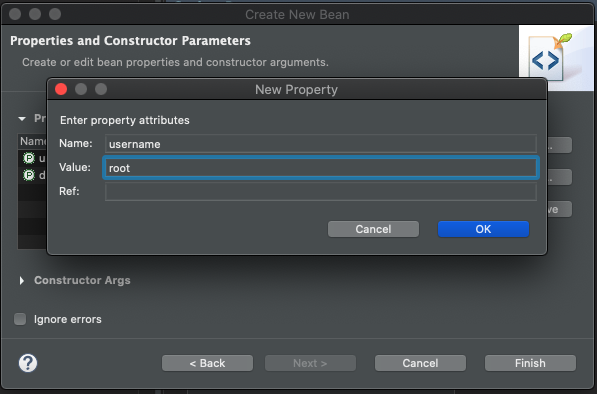
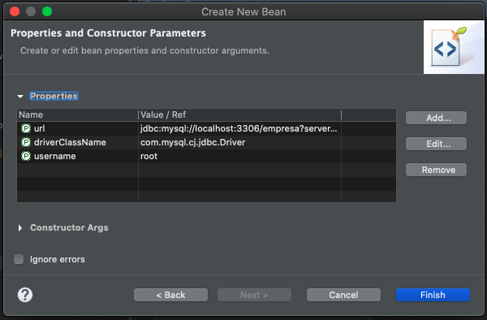

Y finalmente para `password`


Al presionar Finish se crea mi Bean `data` que me representa un Objeto DataSource de Spring.

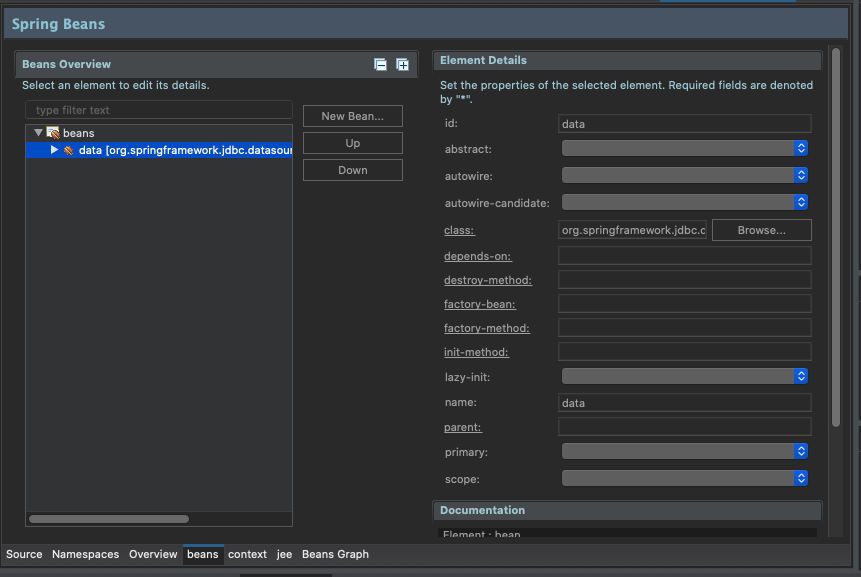

Lo que se ha generado en el archivo `springConfig.xml` es:

```html
<bean id="data" name="data" class="org.springframework.jdbc.datasource.DriverManagerDataSource">
   <property name="url" 
      value="jdbc:mysql://localhost:3306/empresa?serverTimezone=Europe/Madrid">
   </property>
   <property name="driverClassName"
      value="com.mysql.cj.jdbc.Driver">
   </property>
   <property name="username" value="root"></property>
   <property name="password" value="root"></property>
</bean>
```

**NOTA:** ***Parece ser que el Pool de Conexiones que se crea es de una conexión y habría que añadir otras propiedades para poder modificarlo.***

ESTA ES LA FORMA EN QUE SPRING CREA LOS OBJETOS DE SU PROPIEDAD. PERO DE IGUAL MANERA PODRÍMAOS USAR LA ETIQUETA `<bean` PARA QUE SPRING INSTANCIE LOS OBJETOS QUE NOSOTROS HEMOS CÓDIFICADO EN LUGAR DE USAR LA ANOTACIÓN `@Service`, REGISTRARIAMOS EN `springConfig.xml` UN NUEVO BEAN CON LA INFORMACIÓN DE MI CLASE. A ESTO ES LO QUE LLAMAN CONFIGURACIÓN XML, PERO ACTUALMENTE ESTA SIENDO SUSTITUIDO CON LAS ANOTACIONES. **CON LAS CLASES DEL PROPIO SPRING NO TENGO OTRA ALTERNATIVA QUE INSTANCIARLAS EN EL `springConfig.xml`**. 

Con esto podemo eliminar la clase `Datos.java` que habíamos arrastrado del proyecto anterior. Ya no le vamos a pedir las conexiones directamente a la BD sino que lo vamos a solicitar directamente a nuestro DataSource que hemos incluido.

### 07. Modificar el Servicio para que llame al DataSource 

En nuestra Clase de Servicio actualmente usamos

`CandidatosServiceImpl`

```java
try(Connection con=Datos.getConnection()){
   ...
```

Pero ya no contamos con `Datos` queremos usar el `DriverManagerDataSource` que esta instanciando Spring por lo que en nuestra clase de Servicio debo inyectar la Interface `DataSource` cuyo objeto instanciado en `springConfig.xml` me la implementa.

Por lo que nuestro Servicio cambiado nos queda así:

`CandidatosServiceImpl`

```java
...
@Autowired
DataSource datasource;
	
@Override
public void altaCandidato(Candidato candidato) {
   try(Connection con = datasource.getConnection()){
   
   ...
   
@Override
public void eliminarCandidato(int idCandidato) {
   try(Connection con = datasource.getConnection()){
   
   ...
   
@Override
public List<Candidato> recuperarCandidatos(){
   List<Candidato> candidatos = new ArrayList<>();
		
   try(Connection con = datasource.getConnection()){   
   
   ... 
```

**Lo debemos cambiar en nuestros tres métodos**

### Conclusiones.

* La clase `DriverManagerDataSource` de Spring nos permite crear un DataSource dentro de la propia aplicación.
* La clase `DriverManagerDataSource` la incluyo en `springConfig.xml` para que Spring la pueda instanciar.
* Uso la Inyección de Dependencias para poder usar un Objeto `DataSource`

### 08. Ajustes en la JSP

Debemos realizar unos pequeños ajustes en la JSP por que en la aplicación copiada accediamos directamente a la Capa de Servicio cosa que no debe ser.

`candidatos.jsp`

```html
...
<%CandidatosService service=new CandidatosService();
  List<Candidato> empleados= service.recuperarCandidatos();
  for(int i=0;i<empleados.size();i++){ %>
     <tr><td> 
     ...   	    
```

Lo cambiamos por esto

```html
<%List<Candidato> empleados = (List<Candidato>)request.getAttribute("candidatos");
  if (empleados.size() > 0){
     for(int i=0;i<empleados.size();i++){%>
	<tr><td> 
     ...   	
```

**EN LOS JSP NO HAY INYECCIÓN DE DEPENDENCIA. SERÍA UN PLATEAMENTO ERRONEO**

Esto implica cambios en los Servlets para enviarle ese atributo `"candidatos"`.

### 09. Ajustes en los Servlets.

`BuscarCandidatos`

```java
@WebServlet("/BuscarCandidatos")
public class BuscarCandidatos extends HttpServlet {
   private static final long serialVersionUID = 1L;

   @Autowired
   CandidatosService service;
	
   @Override
   public void init(ServletConfig config) throws ServletException {
      //le informa al servidor de aplicaciones que Spring va a realizar inyección
      //de objetos en este servlet
      SpringBeanAutowiringSupport.processInjectionBasedOnCurrentContext(this);
      super.init(config);
   }
	
   protected void service(HttpServletRequest request, HttpServletResponse response) throws ServletException, IOException {
      request.setAttribute("candidatos", service.recuperarCandidatos());
         request.getRequestDispatcher("candidatos.jsp").forward(request, response);
   }
}
```

`EliminarCandidato`

```java
@WebServlet("/EliminarCandidato")
public class EliminarCandidato extends HttpServlet {
   private static final long serialVersionUID = 1L;

   @Autowired
   CandidatosService service;
	
   @Override
   public void init(ServletConfig config) throws ServletException {
      //le informa al servidor de aplicaciones que Spring va a realizar inyección
      //de objetos en este servlet
      SpringBeanAutowiringSupport.processInjectionBasedOnCurrentContext(this);
      super.init(config);
   }
	
   protected void service(HttpServletRequest request, HttpServletResponse response) throws ServletException, IOException {
		
      int idCandidato=Integer.parseInt(request.getParameter("idCandidato"));
      service.eliminarCandidato(idCandidato);
      request.getRequestDispatcher("BuscarCandidatos").forward(request, response);
   }
}
```

### 10. Probar la Aplicación

Si probamos aquí la aplicación FUNCIONA correctamente pero usando un DataSource Spring dentro de la aplicación.

### 11. Anotación `@Qualifier("data")`

Una vez que ya hemos creado nuestra aplicación Spring con un DataSource vamos a observar algunas cosas, es posible que tengamos dos DataSources apuntando a diferentes BDs, por ejemplo en nuestro archivo `springConfig.xml` tendríamos:

```html
<bean id="data" name="data" class="org.springframework.jdbc.datasource.DriverManagerDataSource">
   <property name="url" 
      value="jdbc:mysql://localhost:3306/empresa?serverTimezone=Europe/Madrid">
   </property>
   <property name="driverClassName"
      value="com.mysql.cj.jdbc.Driver">
   </property>
   <property name="username" value="root"></property>
   <property name="password" value="root"></property>
</bean>
<bean id="data2" name="data2" 	class="org.springframework.jdbc.datasource.DriverManagerDataSource">
   <property name="url"
      value="jdbc:mysql://localhost:3306/formacion?serverTimezone=Europe/Madrid">
   </property>
   <property name="driverClassName"
      value="com.mysql.cj.jdbc.Driver">
   </property>
   <property name="username" value="root"></property>
   <property name="password" value="root"></property>
</bean>
```

Con esto tenemos dos objetos el `data` y el `data2` que implementan la misma Interface `DataSource`. 
¿Qué va a pasar cuando ejecutemos nuestra aplicación?

Apenas ejecutamos la aplicación y ya nos manda el siguiente error.

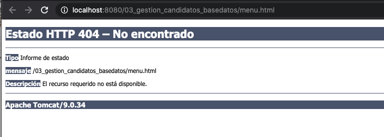
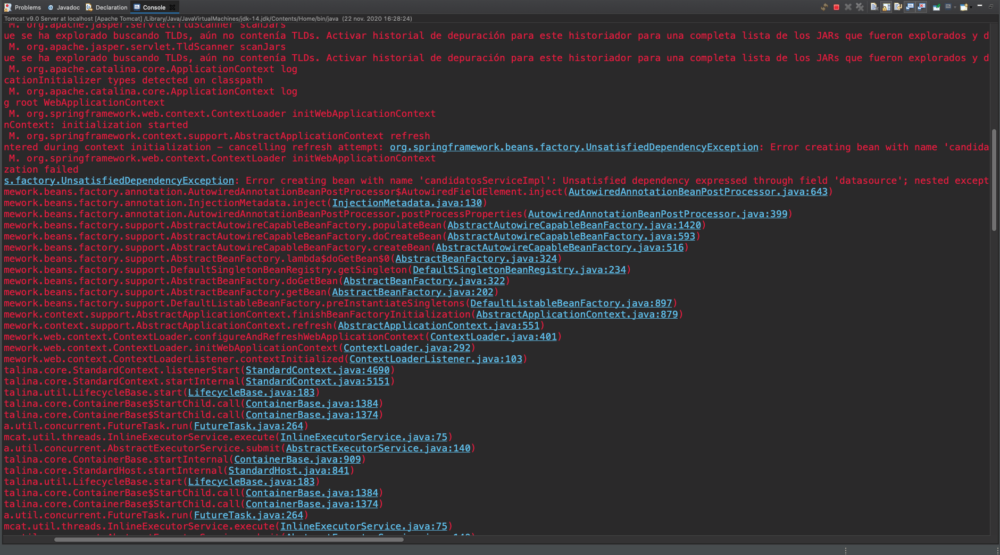

`'javax.sql.DataSource' available: expected single matching bean but found 2: data,data2`

Nos esta indicando que existen dos objetos que implementan la Interface `DataSource` y no sabe cual seleccionar. Cuando exista más de un Objeto que implemente una Interface que estemos Inyectando estamos en la obligación de indicarle cual de ellos queremos usar eso lo hacemos con la Anotación `@Qualifier("data")` e indicando cual de los dos objetos queremos usar.

Al probar nuevamente nuestra aplicación esta ya FUNCIONA.

### 12. Usar DataSource del Servidor

También se le puede decir a Spring vía configuración que use el DataSource del Servidor en lugar del definido en la Aplicación.

Esto lo podemos hacer configurandolo en nuestro archivo `springConfig.xml` usando una etiqueta que se encuentra en un NameSpace diferente de los que hemos utilizado es el NameSpace `jee`.

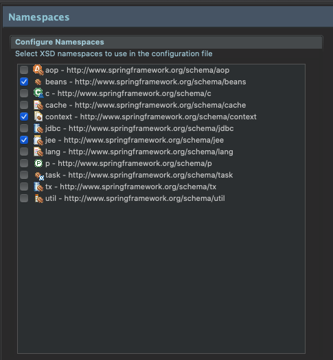

y en incluimos lo siguiente:

```html
<!-- DataSources del Servidor -->
<jee:jndi-lookup jndi-name="refempresa" id="data3" />
```

Lo que pongamos en `jndi-name` va a depender que Servidor usamos si Tomcat o Web-Logic, en este caso estamos usando Tomcat.

### 13. Configurar Archivos de Tomcat

En `context.xml` incluimos lo siguiente:

```html
 <ResourceLink global="jdbc/empresads" name="refempresa" type="javax.sql.DataSource"/>
```

En `server.xml` incluimos lo siguiente:

```html
 <GlobalNamingResources>
    <Resource driverClassName="com.mysql.cj.jdbc.Driver" 
	      name="jdbc/empresads" 
	      password="root" 
	      type="javax.sql.DataSource" 
	      url="jdbc:mysql://localhost:3306/empresa?serverTimezone=Europe/Madrid" 
	      username="root"/>
  </GlobalNamingResources>
```

### 14. Usar el DataSource del Servidor

Por lo que si queremos usar el DataSource del servidor en nuestro Servicio se lo indicamos.

```java
@Service
public class CandidatosServiceImpl implements CandidatosService {
	
   @Autowired
   @Qualifier("data3")
   DataSource datasource;	
```

### 15. Probar la Aplicación

Si probamos aquí la aplicación FUNCIONA correctamente pero usando un DataSource Spring del Servidor de Aplicación.

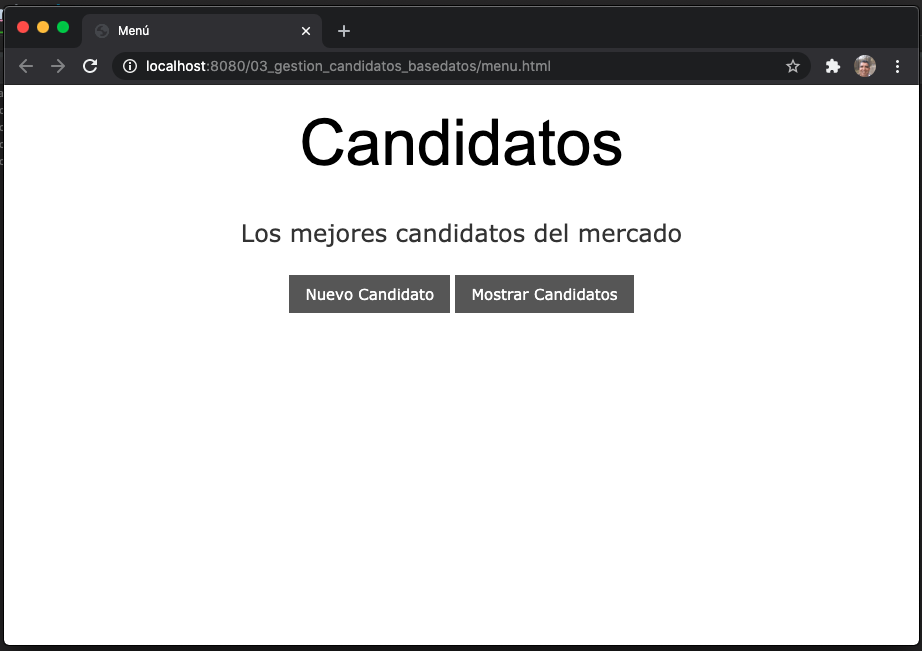

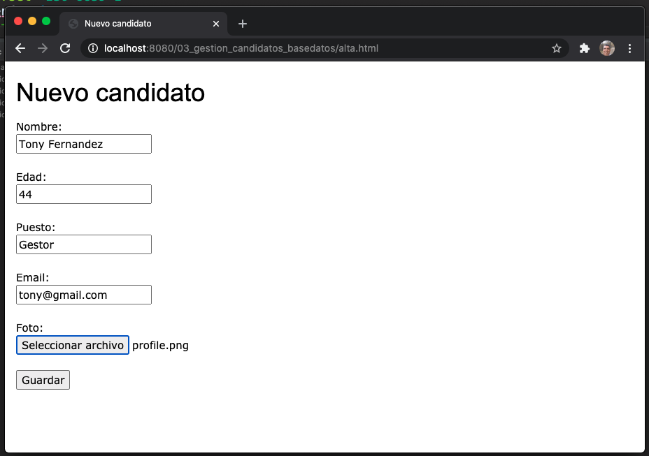
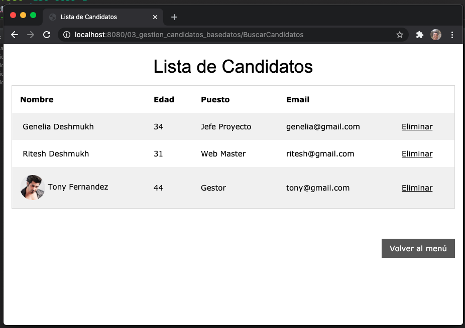
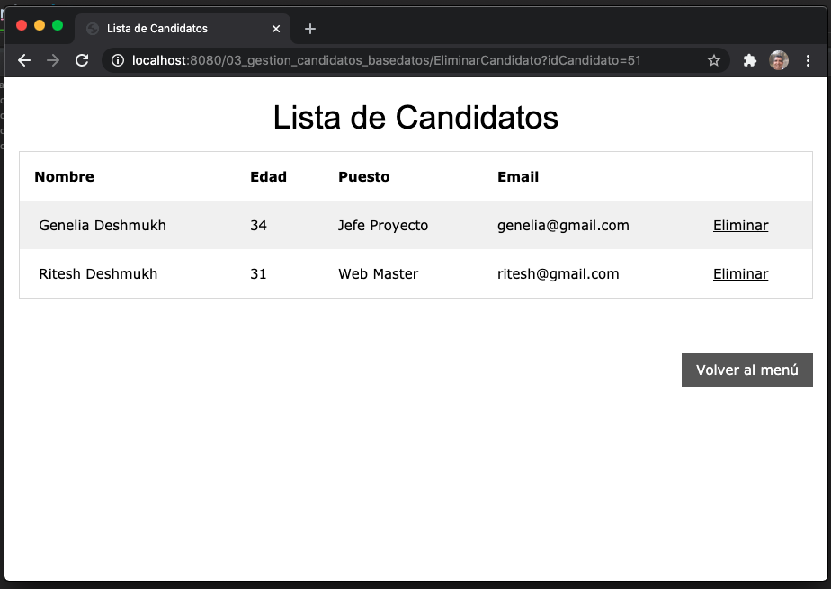

## Acceso a Datos con Spring-JDBC

Spring nos aporta simplificar el acceso a datos con JDBC con el módulo `Spring-JDBC`. Con esta simplificación practicamente el programador solo se preocupa de la instrucción SQL olvidandose de la conexión, los ResulSet, las Statment, etc. que se usan en el JDBC de JavaEE, todo eso lo simplifica Spring.


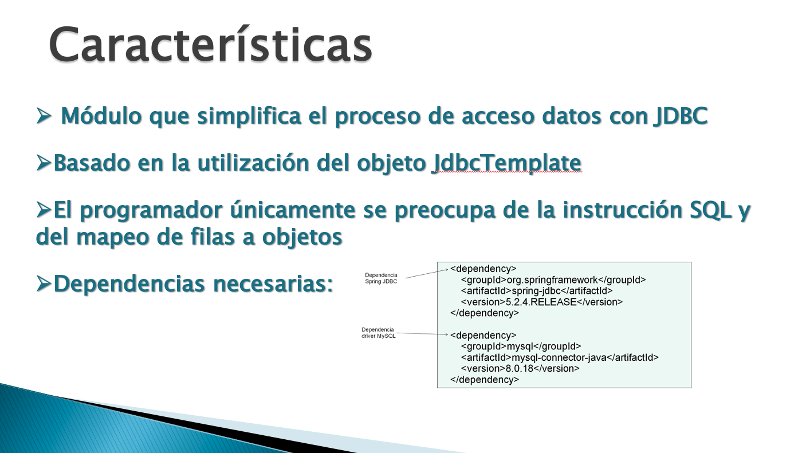

### Objeto `jdbcTemplate`

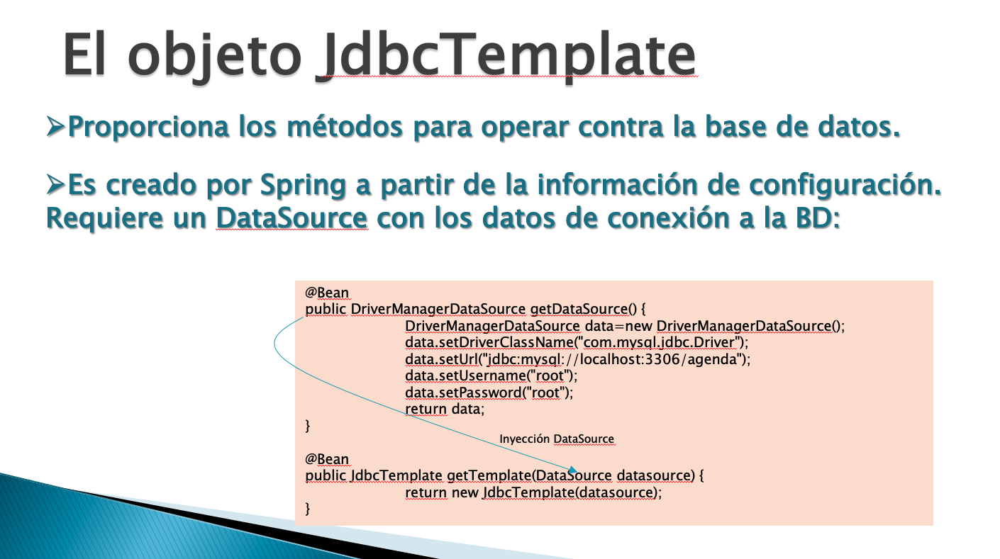

### Métodos de `jdbcTemplate`

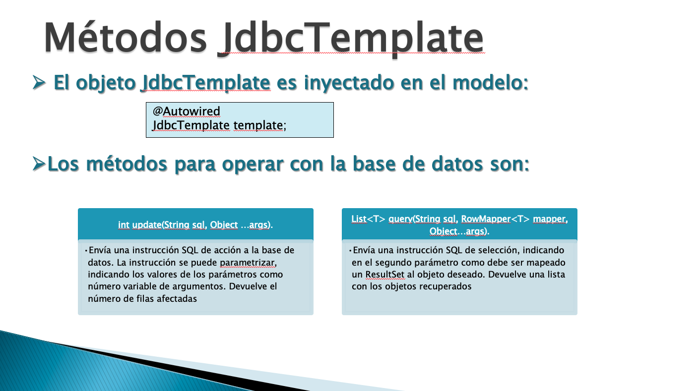

### La Capa de Repositorio

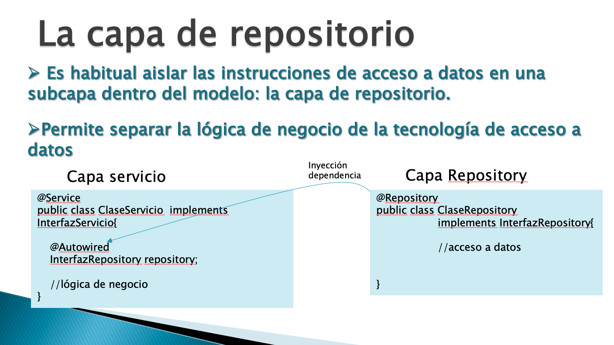

## :computer: `04_gestion_candidatos_spring-jdbc`

Vamos a partir del proyecto `03_gestion_candidatos_basedatos` para simplificar instrucciones JDBC. No necesitamos más dependencias ya en el proyecto anterior ya habíamos incluido todas las necesarias entre ellas `Spring-JDBC`.

### 01. Crear la Clase `jdbcTemplate`

En nuestro archivo `springConfig.xml` vamos a configurar ese objeto `jdbcTemplate`, nos vamos a apoyar en la pestaña `beans` para crearlo.

Indicamos el identificado y nombre del nuevo bean `jdbcTemplate`.

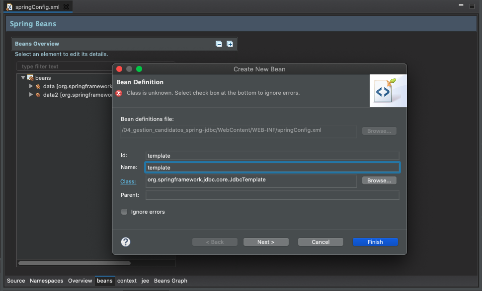

Para que `jdbcTemplate` trabaje necesitamos indicarle una propiedad donde le indiquemos que DataSource va a usar para poder conectarse. En este caso el `dataSource` queremos hacer referencia al Objeto DataSource que ya habíamos configurado por lo que en este caso una referencia se indica en `Ref` y no en `Value` como habíamos visto hasta el momento. 

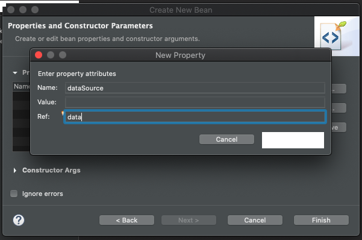


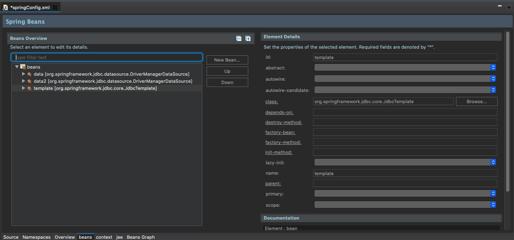

Esto nos agrega el siguiente código:

`springConfig.xml`

```html
...
<bean id="template" name="template" 
      class="org.springframework.jdbc.core.JdbcTemplate">
   <property name="dataSource" ref="data"></property>
</bean>
```

El atributo `ref="data"` hace referencia al `id` del objeto.

### 02. Cambios en la Capa de Servicio

Para usar el objeto `jdbcTemplate` configurado en `springConfig.xml` tenemos que Inyectarlo en nuestra capa de Servicio. Actualmente estamos inyectando el Objeto `DataSource`:

`CandidatosServiceImpl`

```java
@Service
public class CandidatosServiceImpl implements CandidatosService {
	
   @Autowired
   @Qualifier("data3")
   DataSource datasource;
	
   @Override
   public void altaCandidato(Candidato candidato) {
      try(Connection con = datasource.getConnection()){
         String sql = "INSERT INTO candidatos(nombre, edad, puesto, foto, email)"
		   + " VALUES(?,?,?,?,?)";
````

**Ya no vamos a necesitar el `DataSource` por que eso ya lo usa internamente `jdbcTemplate`, por lo que basta simplemente Inyectar el `jdbcTemplate` por lo que el código nos va a quedar así**:

`CandidatosServiceImpl`

```java
@Service
public class CandidatosServiceImpl implements CandidatosService {
	
   @Autowired
   JdbcTemplate template;
   
   ...
```

Como solo tenemos un `JdbcTemplate` no usamos `@Qualifier`.

`JdbcTemplate` tiene dos métodos:

* `int update(String sql, Object...args)` para operaciones de acción.
* `List<T> query(String sql, RowMapper<T> mapper, Object...args)` para operaciones de selección.

Vamos a transformar cada uno de los métodos que tenemos.

El método `altaCandidato` actual es:

```java
@Override
public void altaCandidato(Candidato candidato) {
   try(Connection con = datasource.getConnection()){
      String sql = "INSERT INTO candidatos(nombre, edad, puesto, foto, email)"
		 + " VALUES(?,?,?,?,?)";
			
      PreparedStatement st = con.prepareStatement(sql);
      st.setString(1, candidato.getNombre());
      st.setInt(2, candidato.getEdad());
      st.setString(3, candidato.getPuesto());
      st.setString(4, candidato.getFoto());
			st.setString(5, candidato.getEmail());
			st.execute();
					  
		}catch(SQLException ex) {
			ex.printStackTrace();
		}
	}
```

Usando `Spring-JDBC` nos queda así:

```java
@Override
public void altaCandidato(Candidato candidato) {
   
   String sql = "INSERT INTO candidatos(nombre, edad, puesto, foto, email)"
				   + " VALUES(?,?,?,?,?)";
   template.update(sql, candidato.getNombre(),
                        candidato.getEdad(),
                        candidato.getPuesto(),
                        candidato.getFoto(),
                        candidato.getEmail() );
}
```

No estamos obligados a capturar ninguna excepción, se puede producir alguna pero es el tipo `RunTimeException`.

El método `eliminarCandidato` actual es:

```java
@Override
public void eliminarCandidato(int idCandidato) {
   try(Connection con = datasource.getConnection()){
      String sql = "DELETE FROM candidatos"
                 + " WHERE idCandidato = ?";
			
      PreparedStatement st = con.prepareStatement(sql);
      st.setInt(1, idCandidato);
      st.execute();
					  
   }catch(SQLException ex) {
      ex.printStackTrace();
   }
}
```

Usando `Spring-JDBC` nos queda así:

```java
@Override
public void eliminarCandidato(int idCandidato) {
   String sql = "DELETE FROM candidatos"
              + " WHERE idCandidato = ?";
   template.update(sql,idCandidato);
}
```

El método `eliminarCandidato` actual es:

```java
@Override
public List<Candidato> recuperarCandidatos(){
   List<Candidato> candidatos = new ArrayList<>();
		
   try(Connection con = datasource.getConnection()){
      String sql = "SELECT * FROM candidatos";
			
      PreparedStatement st = con.prepareStatement(sql);
      ResultSet rs = st.executeQuery();
      while(rs.next()) {
         Candidato candidato = new Candidato(rs.getInt("idCandidato"),
                                             rs.getString("nombre"),
                                             rs.getInt("edad"),
                                             rs.getString("puesto"),
                                             rs.getString("foto"),
                                             rs.getString("email"));
         candidatos.add(candidato);
   }
      return candidatos;	  
   }catch(SQLException ex) {
      ex.printStackTrace();
      return null;
   }
}
```

En este caso no es una operación de acción sino de recuperación de datos, para transformarla usaremos el método `query`.

Usando `Spring-JDBC` nos queda así:

```java
@Override
public List<Candidato> recuperarCandidatos(){
		
   String sql = "SELECT * FROM candidatos";
   return template.query(sql, (rs,f) -> new Candidato(rs.getInt("idCandidato"),
                                                      rs.getString("nombre"),
                                                      rs.getInt("edad"),
                                                      rs.getString("puesto"),
                                                      rs.getString("foto"),
                                                      rs.getString("email")));
}
```

El método `query` ejecuta la instruccón SQL y devuelve una lista de objetos. 
¿Cómo hace las transformaciones de las filas de las tablas en Objetos? 
Eso lo hacemos a través del `RowMapper` que es una Interfaz Funcional con un método `mapRow` que tenemos que implementar con una clase o con una expresión lambda, para indicar como debe hacer la transormación de las filas de las tablas en objetos Java. `mapRow` usa dos parámetros pero en este caso `f` que representa el número de fila no lo estamos usando.

### 03. Probar la Aplicación

Funciona Correctamente.

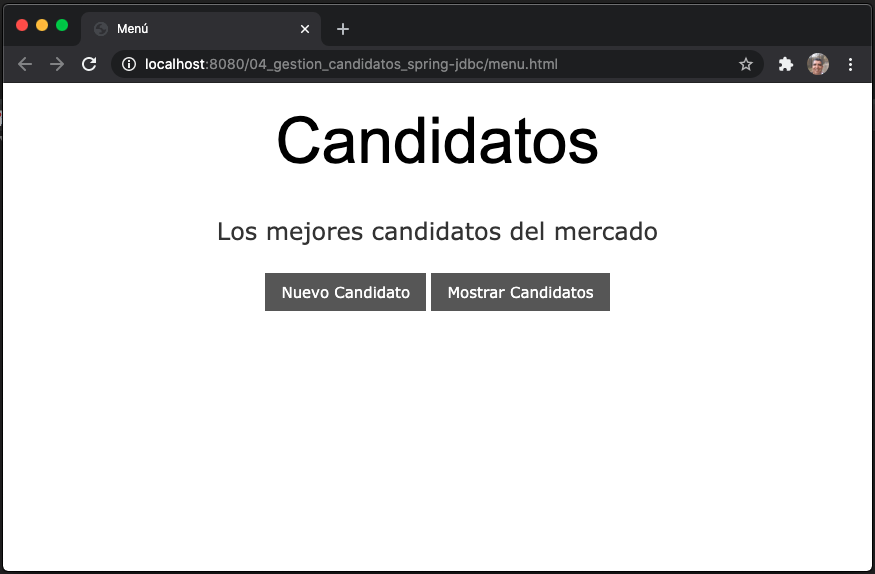
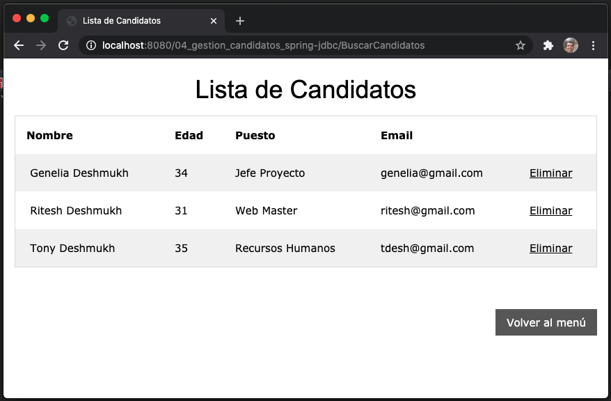
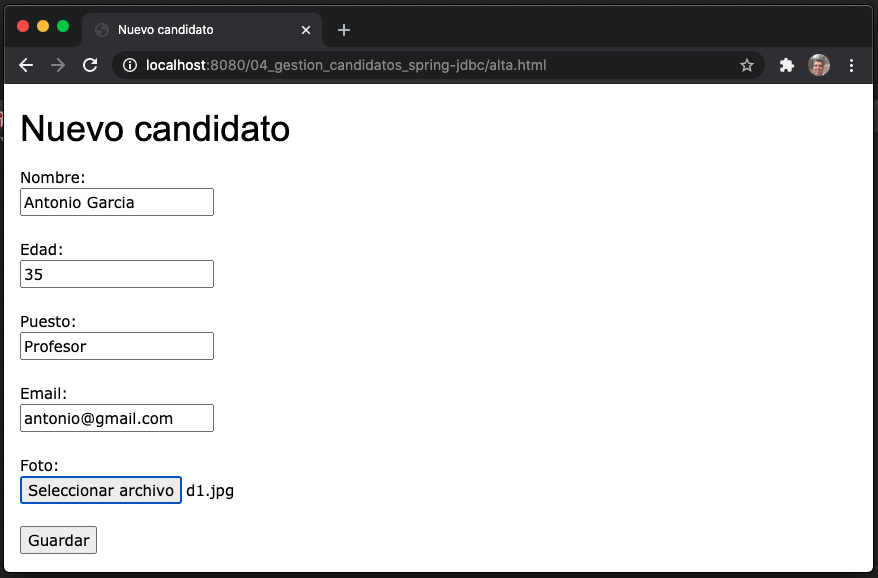
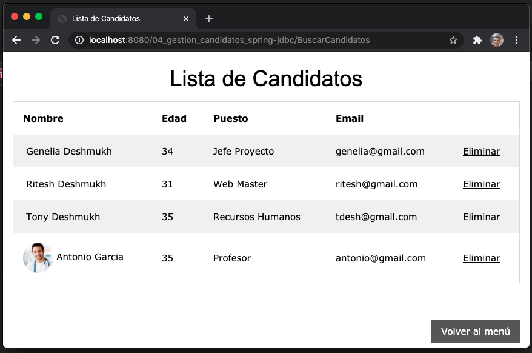
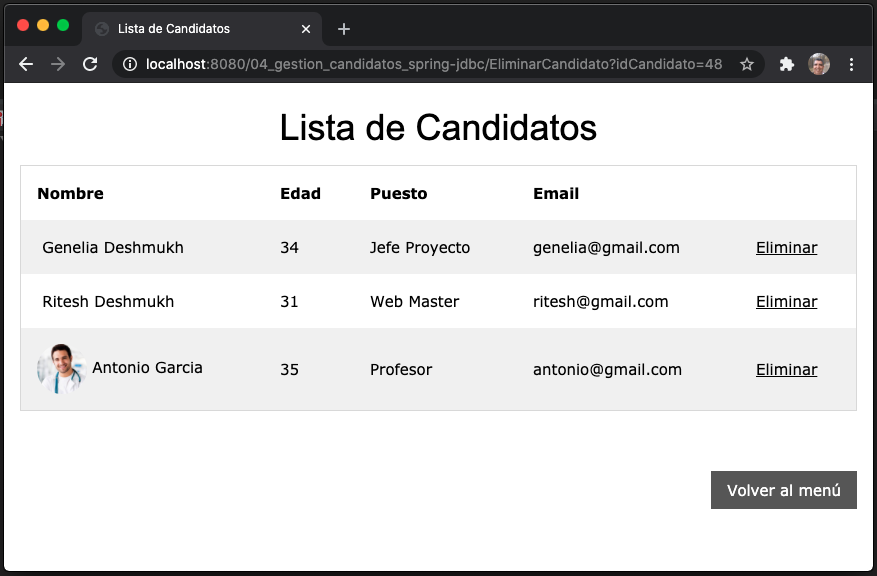

## :computer: `05_gestion_candidatos_ofertas`

Vamos a partir del proyecto `04_gestion_candidatos_spring-jdbc` para añadir una nueva funcionalidad a la aplicación. Nos va a permitir Inscribir Ofertas y Consultar las Inscripciones. Usaremos Spring para la Lógica de Negocio, Acceso a datos con JDBCTemplate, y añadir el MVC. 

### 01. Añadir Tabla `inscripciones` a la BD `empresa`.

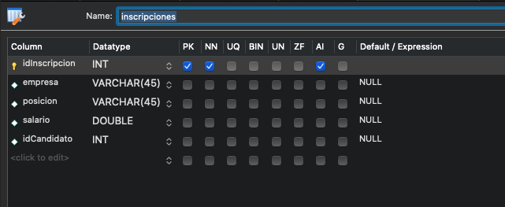

### 02. Añadir el JavaBean `Inscripción`

```java
package model;

public class Inscripcion {
	
   private int idInscripcion;
   private String empresa;
   private String  posicion;
   private double salario;
   //private int idCandidato;
   private Candidato candidato;
	
   public Inscripcion() {
      super();
   }

   public Inscripcion(int idInscripcion, String empresa, String posicion, double salario, Candidato candidato) {
      super();
      this.idInscripcion = idInscripcion;
      this.empresa = empresa;
      this.posicion = posicion;
      this.salario = salario;
      this.candidato = candidato;
   }
   
   ...	
}
```

Pudimos solo meter el `idCandidato` pero de cara a la presentación de los datos es mejor meter todo el objeto `Candidato` esto obviamente complica modelar lo que tenemos en la Tabla con el uso de Clases, ya lo veremos cuando implementemos el SQL. Con persistencia esto se simplifica.

### 03. Capa de Servicio

`InscripcionesService`

```java
...
public interface InscripcionesService {
   void altaInscripcion(Inscripcion inscripcion);
   List<Inscripcion> recuperarInscripciones();
}
```

`InscripcionesServiceImpl`

```java
@Service
public class InscripcionesServiceImpl implements InscripcionesService {

   @Autowired
   JdbcTemplate template;
	
   @Override
   public void altaInscripcion(Inscripcion inscripcion) {
      String sql = "INSERT INTO inscripciones(empresa, posicion, salario, idCandidato)"
                 + " VALUES(?,?,?,?)";
      template.update(sql, inscripcion.getEmpresa(),
                           inscripcion.getPosicion(),
                           inscripcion.getSalario(),
                           inscripcion.getCandidato().getIdCandidato());
   }

   @Override
   public List<Inscripcion> recuperarInscripciones() {
      String sql = "SELECT * "
                 + "  FROM inscripciones i, candidatos c "
                 + " WHERE i.idCandidato = c.idCandidato ";
      return template.query(sql, 
                            (rs,f) -> new Inscripcion(rs.getInt("i.idInscripcion"),
                                                      rs.getString("i.empresa"),
                                                      rs.getString("i.posicion"),
                                                      rs.getDouble("i.salario"),
                                                      new Candidato(rs.getInt("c.idCandidato"),
                                                                    rs.getString("c.nombre"),
                                                                    rs.getInt("c.edad"),
                                                                    rs.getString("c.puesto"),
                                                                    rs.getString("c.foto"),
                                                                    rs.getString("c.email"))));
   }

}
```

Observese como se recupera en un mismo Query los datos de la Inscripción y del Candidato y como se hace la implementación del `RowMapper` para devolver los Objetos `Incripcion` que contiene un Objeto `Candidato`.


### 04. Actions

`AltaInscripcionAction`

```java
@WebServlet("/AltaInscripcionAction")
public class AltaInscripcionAction extends HttpServlet {
   private static final long serialVersionUID = 1L;
	
   @Autowired
   InscripcionesService service;
   @Autowired
   CandidatosService candiatoService;
	
   @Override
   public void init(ServletConfig config) throws ServletException {
      //le informa al servidor de aplicaciones que Spring va a realizar inyección
      //de objetos en este servlet
      SpringBeanAutowiringSupport.processInjectionBasedOnCurrentContext(this);
      super.init(config);
   }
      
   protected void service(HttpServletRequest request, HttpServletResponse response) throws ServletException, IOException {
		 
      String empresa  = request.getParameter("empresa");
      String posicion = request.getParameter("posicion");
      double salario  = Double.parseDouble(request.getParameter("salario"));
      int idCandidato = Integer.parseInt(request.getParameter("idCandidato"));
		
      //Candidato candidato = candiatoService.
      Inscripcion inscripcion = new Inscripcion(0,empresa,posicion, salario,
      			                        new Candidato(idCandidato, null, 0, null, null, null)); 
				//OJO Con el ID Candidato recupero el candidato y es el que mando	
				
      service.altaInscripcion(inscripcion);
	
   }
}
```

`BuscarInscripcionesAction`

```java
@WebServlet("/BuscarInscripcionesAction")
public class BuscarInscripcionesAction extends HttpServlet {
   private static final long serialVersionUID = 1L;
	
   @Autowired
   InscripcionesService service;
	
   @Override
   public void init(ServletConfig config) throws ServletException {
      //le informa al servidor de aplicaciones que Spring va a realizar inyección
      //de objetos en este servlet
      SpringBeanAutowiringSupport.processInjectionBasedOnCurrentContext(this);
      super.init(config);
   }
	
   protected void service(HttpServletRequest request, HttpServletResponse response) throws ServletException, IOException {
      request.setAttribute("inscripciones", service.recuperarInscripciones());
   }
}
```

### 05. FrontController

`FrontController`

```java
@MultipartConfig //permite al servlet procesar objetos Part (objetos binarios)
@WebServlet("/FrontController")
public class FrontController extends HttpServlet {
   private static final long serialVersionUID = 1L;

   protected void service(HttpServletRequest request, HttpServletResponse response) throws ServletException, IOException {
      String url = "";
      String option = request.getParameter("option");
      switch(option) {
         case "doAltaCandidato":
            request.getRequestDispatcher("AltaCandidatoAction").include(request, response);
            url = "menu.html";
            break;
         case "doBuscarCandidatos":
            request.getRequestDispatcher("BuscarCandidatosAction").include(request, response);
            url = "candidatos.jsp";
            break;
         case "doEliminarCandidato":
            request.getRequestDispatcher("EliminarCandidatoAction").include(request, response);
            request.getRequestDispatcher("BuscarCandidatosAction").include(request, response);
            url = "candidatos.jsp";
            break;
         case "doAFormularioAltaInscripcion":
            request.getRequestDispatcher("BuscarCandidatosAction").include(request, response);
            url = "altainscripcion.jsp";
            break;
         case "doAltaInscripcion":
            request.getRequestDispatcher("AltaInscripcionAction").include(request, response);
            url = "menu.html";
            break;
         case "doBuscarInscripciones":
            request.getRequestDispatcher("BuscarInscripcionesAction").include(request, response);
            url = "inscripciones.jsp";
            break;
         case "toMenu":
            url="menu.html";
            break;
         case "toAltaCandidato":
            url="altacandidato.html";
            break;
         default:
            url="error.html";
            break;		
      }
      request.getRequestDispatcher(url).forward(request, response);
   }
}
```

### 06. Vistas

`menu.html`

```html
...
<body>
   <div align="center">
      <h1 class="w3-jumbo">InfoCurro</h1>
      <p class="w3-xlarge w3-text-dark-grey">Los mejores candidatos - Las mejores ofertas</p>
      <p>
         <a href="FrontController?option=toAltaCandidato" class="w3-button w3-dark-grey">Alta Candidato</a>
         <a href="FrontController?option=doBuscarCandidatos" class="w3-button w3-dark-grey">Mostrar Candidatos</a>
      </p>
      <p>
         <a href="FrontController?option=doAFormularioAltaInscripcion" class="w3-button w3-dark-grey">Inscribir a Oferta</a>
         <a href="FrontController?option=doBuscarInscripciones" class="w3-button w3-dark-grey">Consultar Inscrpciones</a>
      </p>
   </div>
</body>
</html>
```

`altacandidato.jsp`

```html
...
<body>
   <%List<Candidato> candidatos=(List<Candidato>)request.getAttribute("candidatos"); %>
   <div class="w3-padding">
      <h1>Datos de la Inscripcion</h1>
      <form action="FrontController?option=doAltaInscripcion" method="post">	
         <label for="empresa">Empresa:</label><br>
         <input type="text" name="empresa" placeholder="Introduce la empresa" required><br/><br/>
         <label for="posicion">Posicion:</label><br>
         <input type="text" name="posicion" placeholder="Introduce la posición" required><br/><br/>
         <label for="salario">Salario:</label><br>
         <input type="number" name="salario" placeholder="Introduce el salario" required><br/><br/>
         Candidato: <select name="idCandidato" required>
                       <option value="">Selecciona un candidato</option>
                       <%for(Candidato candidato:candidatos){ %>
                          <option value="<%=candidato.getIdCandidato() %>"><%=candidato.getNombre()%></option>
	               <%} %>
         </select>
         <br/><br/>
         <input type="submit" value="Guardar">	
      </form>
   </div>
</body>
</html>
```

`inscripciones.jsp`

```html
<body>
   <%
     List<Inscripcion> inscripciones = (List<Inscripcion>)request.getAttribute("inscripciones");
     if (inscripciones.size() > 0){
   %>
   <div align="center" class="w3-padding">
      <h1>Lista de Inscripciones</h1>
      <table>
         <tr>
            <th>Empresa</th>
            <th>Posición</th>
            <th>Salario</th>
            <th>Candidato</th>
         </tr>
         <%
            for(Inscripcion inscripcion: inscripciones){ %>
               <tr>
                  <td><%=inscripcion.getEmpresa()%></td>	
                  <td><%=inscripcion.getPosicion()%></td>
                  <td><%=inscripcion.getSalario()%></td>
                  <td>"><%=inscripcion.getCandidato().getNombre()%></td>
               </tr>
         <%}%>
      </table>
   </div>
   <%}else%>
   <br><br>
   <div align="right" class="w3-padding">
      <a href="menu.html" class="w3-button w3-dark-grey">Volver al menú</a>
   </div>
</body>
</html>
```

### 07. Probar la Aplicación

Si probamos la aplicación FUNCIONA. PERO NUESTRA APLICACIÓN TAL COMO ESTA PUEDE PROBOCAR ALGUNAS INCONSISTENCIAS EN EL CASO DE QUE BORREMOS UN CANDIDATO QUE ESTE ASOCIADO A UNA OFERTA. EL CANDIDATO SE ELIMINA PERO LA OFERTA SE SIGUE MANTENIENDO ALMACENADA CON UN CANDIDATO QUE YA NO EXISTE.

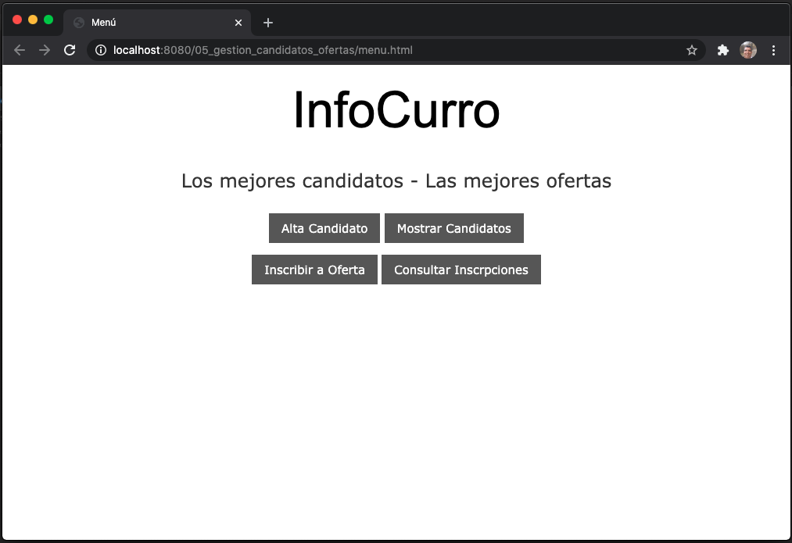
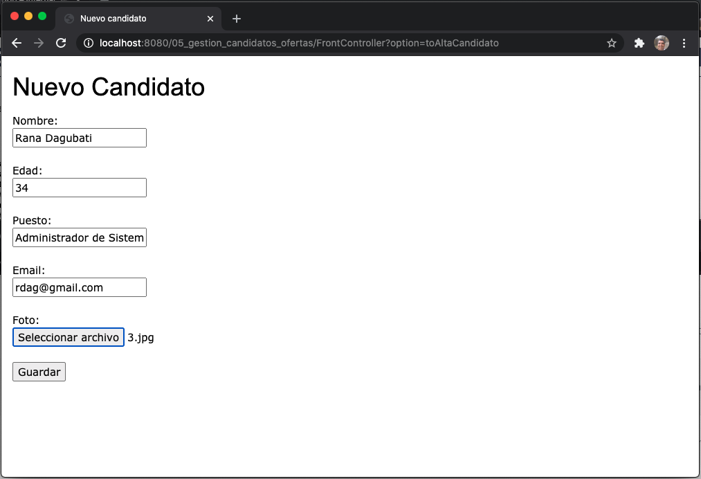
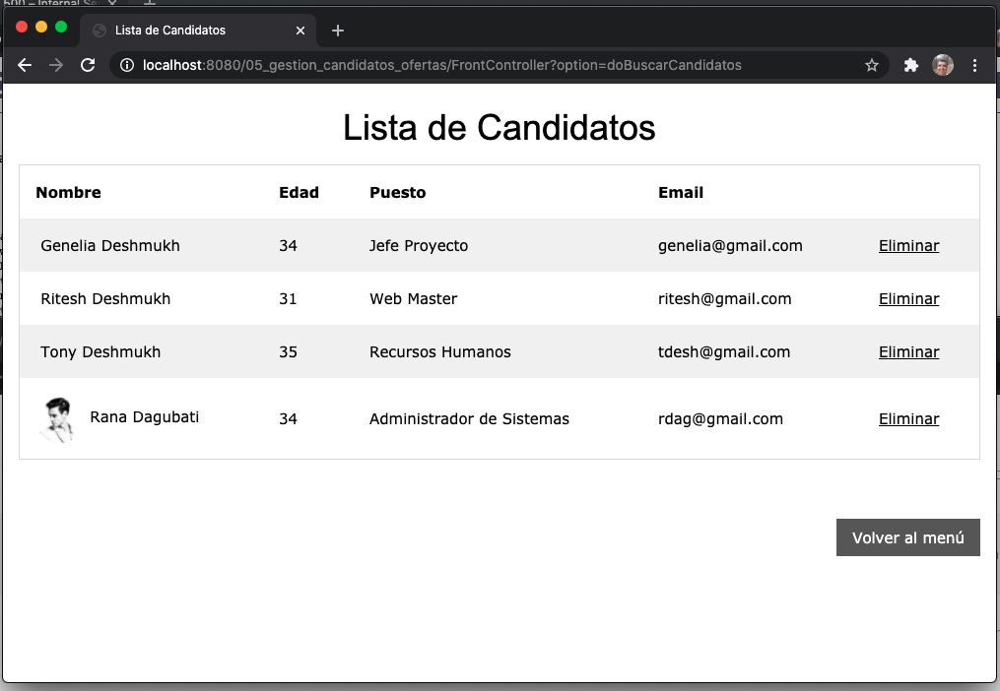
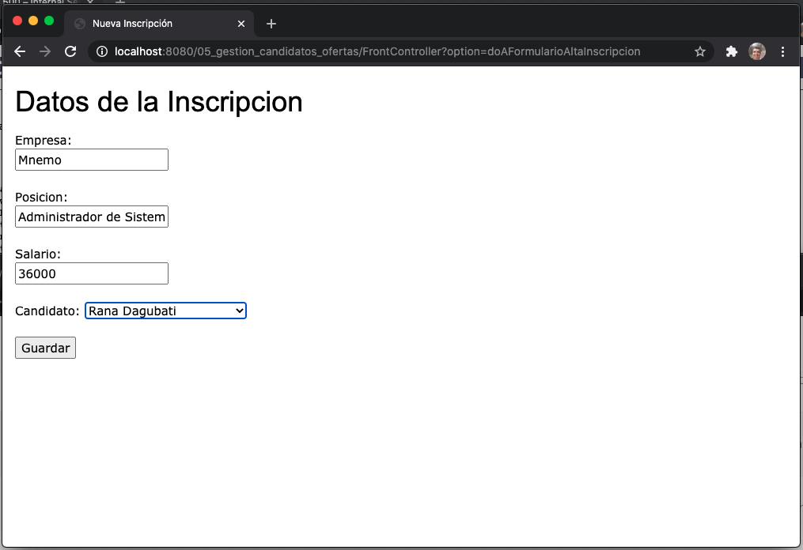
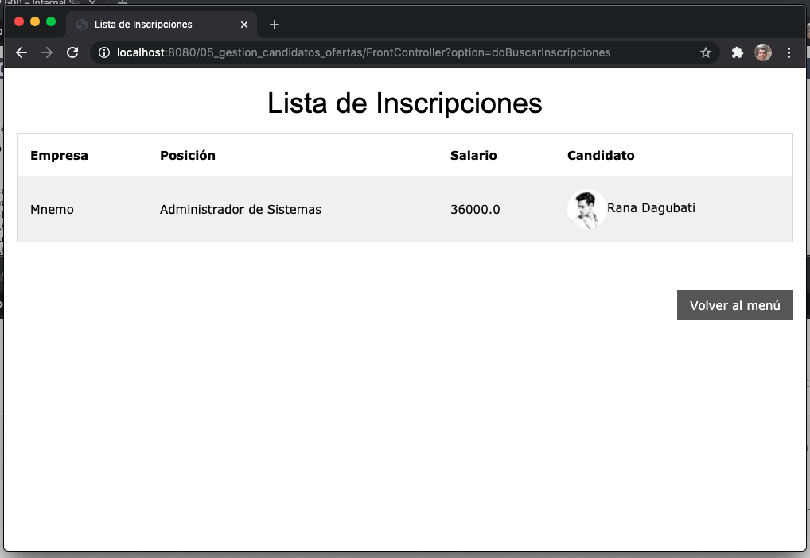
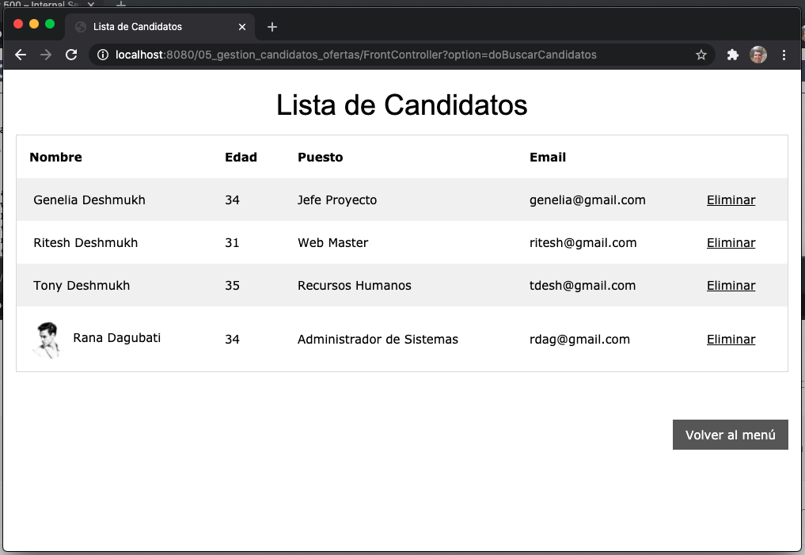
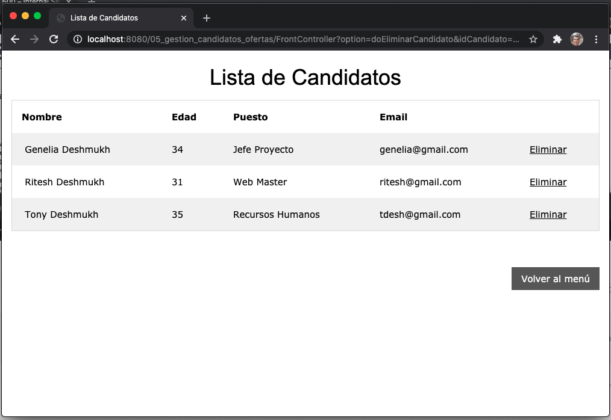
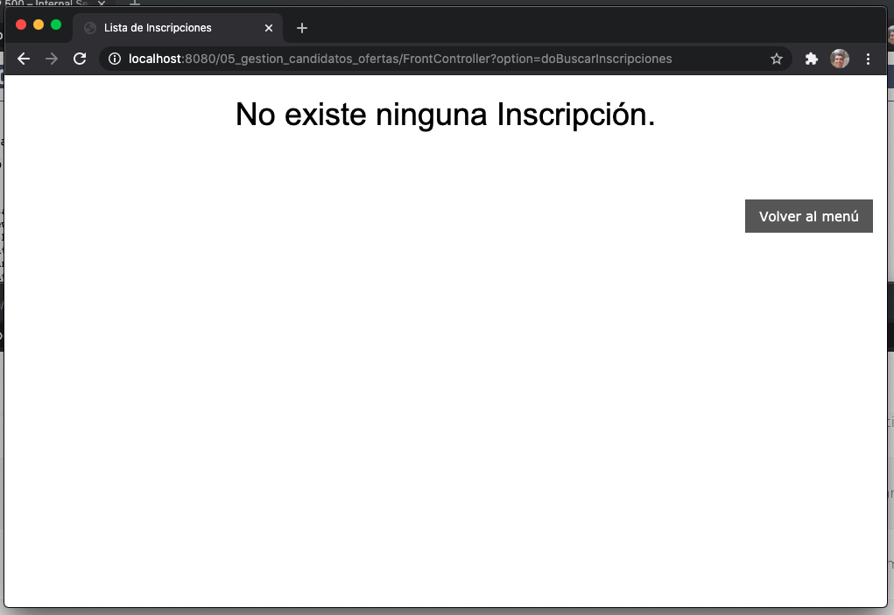
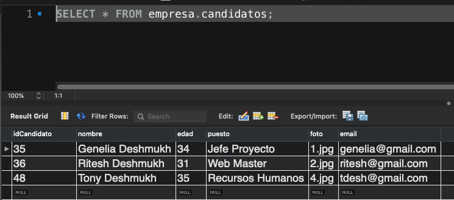
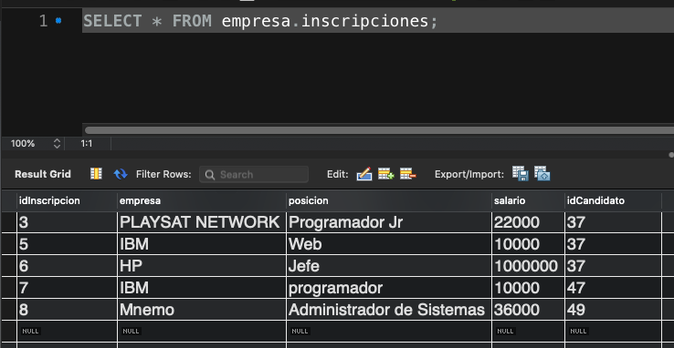
