# 20201120 Viernes

## Documento Relaciones Entre Entidades.

[Documento Relaciones Entre Entidades](https://github.com/adolfodelarosades/Java/blob/master/temarios/000_592_DESARROLLADOR_JAVA_EE_FRONT_END_MULTIPLATAFORMA/pdfs/relacion_entre_Entidades.pdf)

## Relaciones Muchos a Muchos

Esta relación se da cuando una Entidad esta asociados a muchos objetos de otra Entidad y viceversa. Por ejemplo una Cuenta puede pertenecer a varios Clientes y un Cliente puede tener varias Cuentas.


A nivel de BD una relación Muchos a Muchos necesita una tabla intermedia para crear esta relación en este caso le llamamos Titulares. No hay una relación directa entre Cuentas y Clientes se necesita una tabla intermedia que tenga la combinación de las Foreing Keys. Realmente en la BD tenemos una Relación Uno a Muchos entre Cuentas y Titutulares y otra Relación Uno a Muchos entre Clientes y titulares.

Normalmente la tabla de Join (Titulares) no contiene más que los campos de las Foreing Keys. La existencia de la tabla de Join permite modelar una relación Muchos a Muchos sin tener encuenta la tabla Join, es decir la tabla existe pero al generar las Entidades la de esta tabla se omite solo las dos principales contaran con su Entidad.

Si la tabla de Join cuenta con más campos además de las Foreing Keys más vale tener una Relación Uno a Muchos y Muchos a Uno.

En este caso cuando generemos las Entidades Cuentas va a contra con sus atributos y además una  lista de Clientes y en el caso de la Entidad Clientes va a contar con sus atributos y además un atributo con la lista de Cuentas, anotados con `@ManytoMany`.

Como ambas tablas van a ser Muchos en alguna de ellas la debemos denotar como propietaria, una vez elegida una de las dos la vamos a anotar con `@JoinTable` donde vamos a informar sobre la tabla intermedia (Titulares) para ver como se relaciona con las otras dos tablas. `@JoinTable` tiene los siguientes atributos:

* `name`: Indicamos el nombre de la tabla intermedia
* `joinColumns` e `inverseJoinColumns` Con estos atributos indicamos los campos
de relación entre la tabla de join las tablas propietarias e inversa, respectivamente. El valor de cada uno de estos atributos es una anotación `@JoinColumn` con dos atributos:
   * `name`. Nombre de la columna en la tabla de join
   * `referencedColumnName`. Nombre de la columna en la tabla principal.

La que no es propietaria va a llevar el `@ManytoMany(mapperBy="cuentas")` que indica en que campo de la otra Entidad va a tener la información de la relación.

En nuestro ejemplo, el atributo cuentas de la entidad Cliente debería estar definido de la siguiente manera:

```java
@ManyToMany @JoinTable(name="Titulares",
     joinColumns=@JoinColumn(name="idCliente",referencedColumnName="dni"),
     inverseJoinColumns=@JoinColumn(name="idCuenta",
     referencedColumnName="numeroCuenta"))
private List<Cuenta> cuentas;
```

***EL ASISTENTE NO NOS LLENA ESTA PARTE HAY QUE HACERLO MANUALMENTE***

Los JOINs Explícitos nos van a servir para recuprar la información en las Relaciones Muchos a Muchos.

```java
SELECT c FROM Cliente c JOIN c.cuentas b WHERE b.saldo > 1000
```

La tabla intermedia no pinta nada a nivel de Entidades por lo que en JPQL es como si no existiera.

## Base de Datos `bancabd`

Contamos con la BD `bancabd` con las siguientes tablas.


Tenemos una relación entre Clientes a Titutulares, de Titulares a Cuentas y Otra de Cuentas a Movimimientos.

Si queremos generar un Modelo Muchos a Muchos de esta BD 
¿Cuántas Entidades se Generarian? 3 Clientes, Cuentas y Movimientos.
¿Cuantas Relaciones? 2. Una Muchos a Muchos y otra Uno a Muchos.

***A nivel de código es mejor plantearse una relación Muchos a Muchos en lugar de una Uno a Muchos - Muchos a Uno*** Salvo que titulares tuviera más información que las Foreing Keys, como la tabla de Matriculas de los ejemplos anteriores.

## :computer: `09_cajero_virtual` Relación Muchos A Muchos

Va a realizar la funcionalidad de BackEnd donde a un Cliente le vamos a asignar una cuenta, si previamente ya tenia asignada esa cuenta no se debe presentar en el combo.

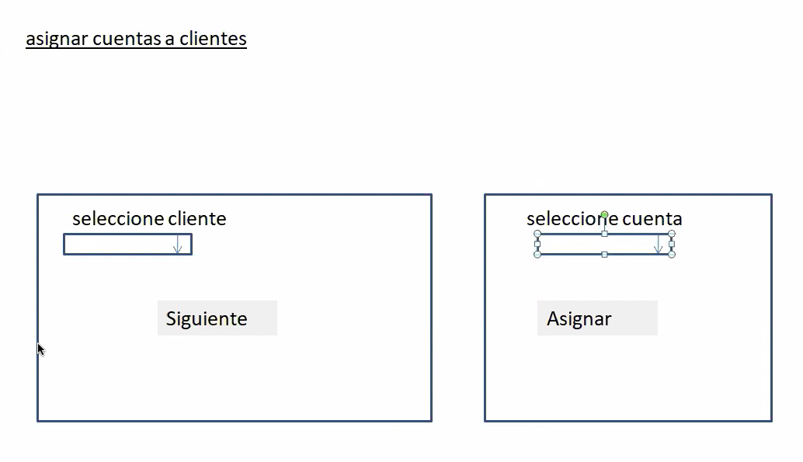

### 01. Mavenizar el Proyecto y Meter las Dependencias 

`pom.xml`

```html
<dependencies>
  	<!-- https://mvnrepository.com/artifact/mysql/mysql-connector-java -->
	<dependency>
	    <groupId>mysql</groupId>
	    <artifactId>mysql-connector-java</artifactId>
	    <version>8.0.19</version>
	</dependency>
  	<!-- https://mvnrepository.com/artifact/org.springframework/spring-core -->
	<dependency>
	    <groupId>org.springframework</groupId>
	    <artifactId>spring-core</artifactId>
	    <version>5.2.9.RELEASE</version>
	</dependency>
	<!-- https://mvnrepository.com/artifact/org.springframework/spring-context -->
	<dependency>
	    <groupId>org.springframework</groupId>
	    <artifactId>spring-context</artifactId>
	    <version>5.2.9.RELEASE</version>
	</dependency>
	<dependency>
	    <groupId>org.springframework</groupId>
	    <artifactId>spring-web</artifactId>
	    <version>5.2.9.RELEASE</version>
	</dependency> 
  	<dependency>
	    <groupId>org.springframework</groupId>
	    <artifactId>spring-orm</artifactId>
	    <version>5.2.9.RELEASE</version>
	</dependency>
	<dependency>
	    <groupId>org.hibernate</groupId>
	    <artifactId>hibernate-core</artifactId>
	    <version>5.4.18.Final</version>
	</dependency>
  </dependencies>
```

### 02. Poner Características JPA para poder usar el Asistente

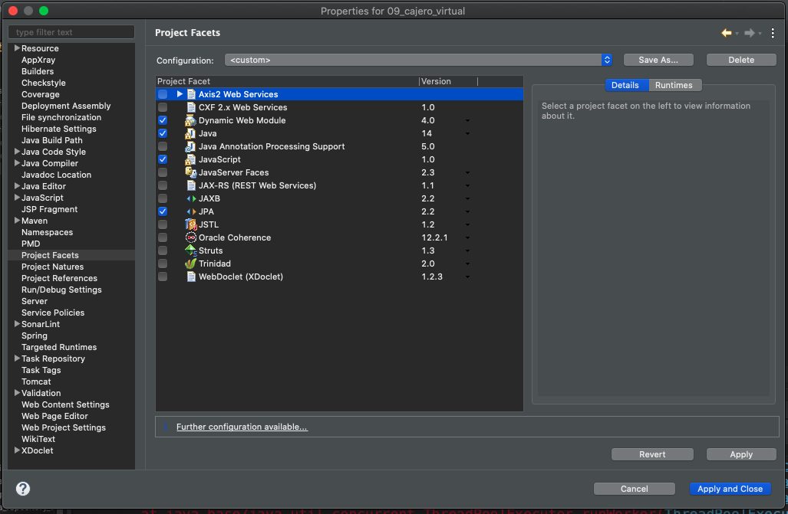
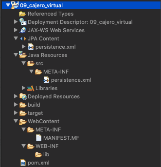

### 03. Generar Entidades con el Asistente.

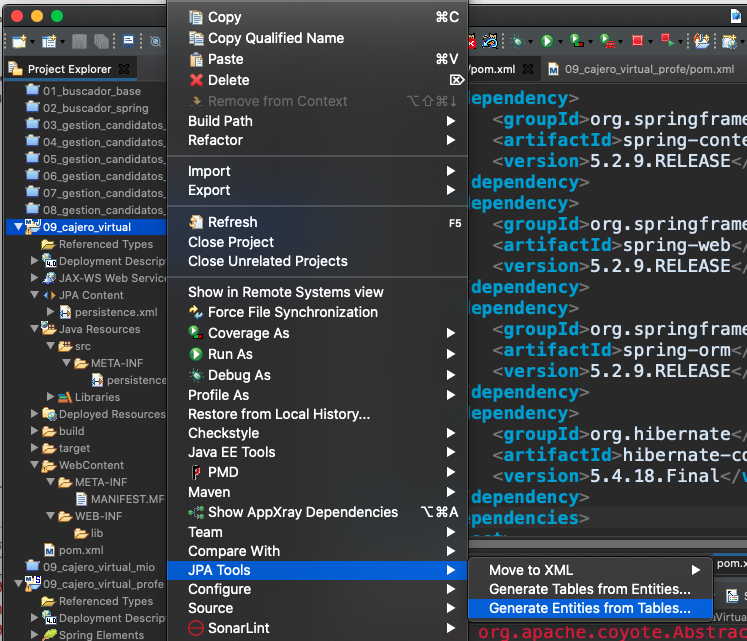

Debemos hacer una conexión para esta BD que no habíamos usado, usando el Driver de MySql 5.

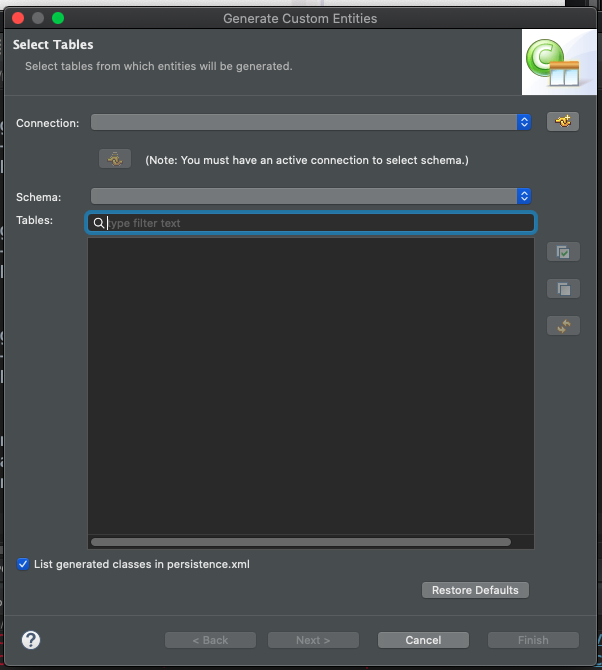
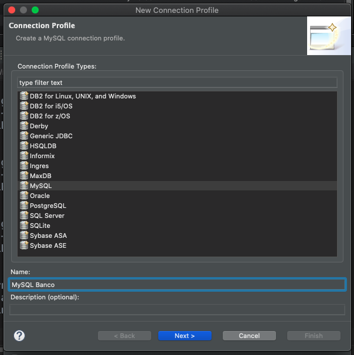
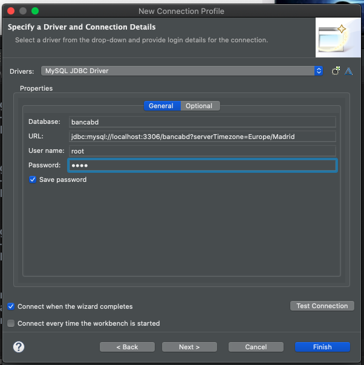
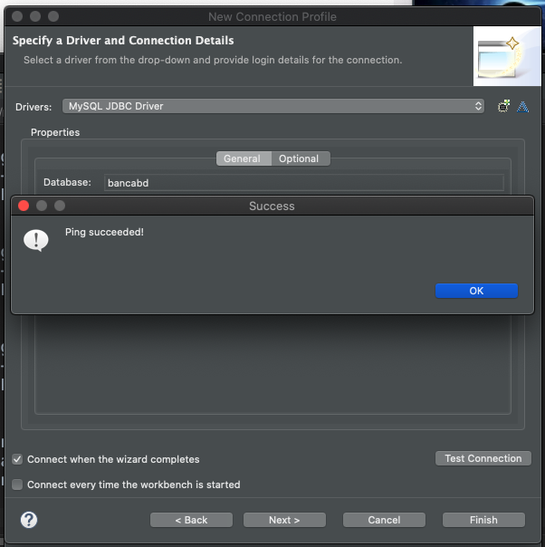

Una vez realizada la conexión a la BD ya la podemos seleccionar y nos salen sus tablas.

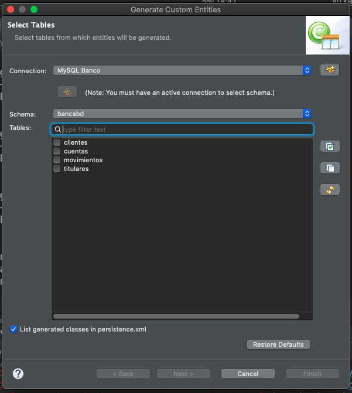

Selecciono las Tablas de las que queremos generar Entidades.

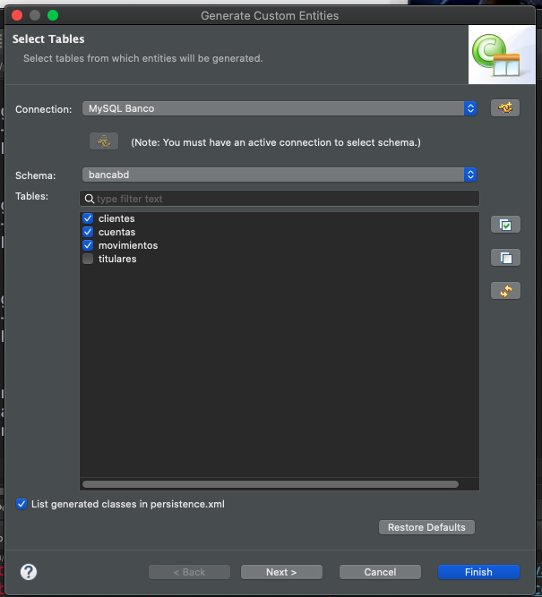

En la siguiente pantalla vamos a meter las Relaciones que como hemos visto son dos.

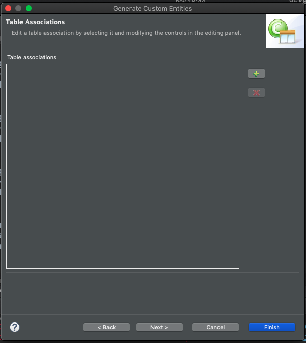

Empezamos con la relación Uno a Muchos entre Cuentas y Movimientos.

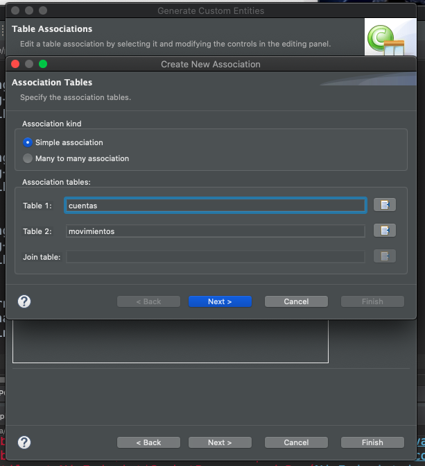

En la Siguiente pantalla indicamos los campos de la Relación

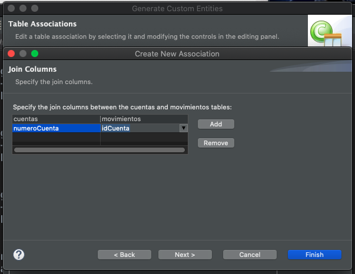

Cada Cuenta va a tener muchos Movimientos

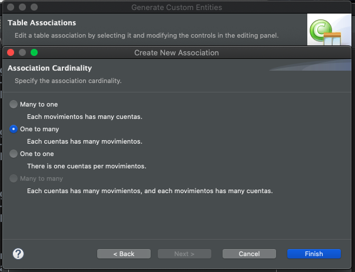

Ya tenemos nuestra primer Relación

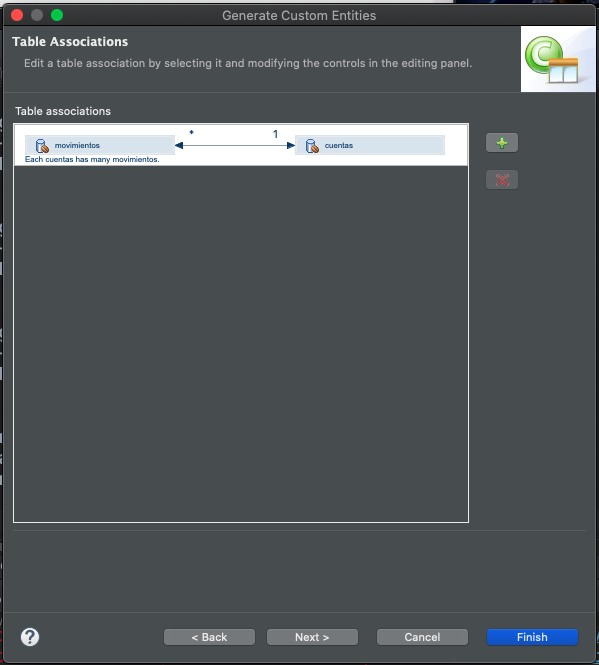

Vamos a Generar la Relación **Muchos A Muchos**.


En este caso hemos marcado la opción `Many to many association` se nos activa el campo de Join Table donde debemos indicar la Tabla de Join entre las dos Tablas.

En la siguiente pantalla debemos dar la información de relación entre las tabla.

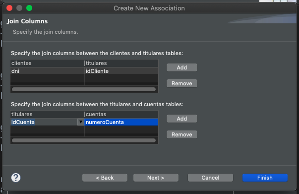

En la siguiente pantalla no cambiamos nada

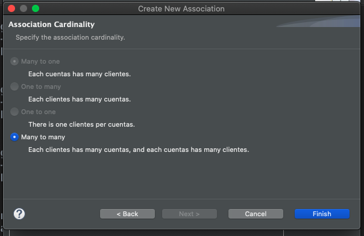

Finalmente ya tenemos nuestras dos relaciones.

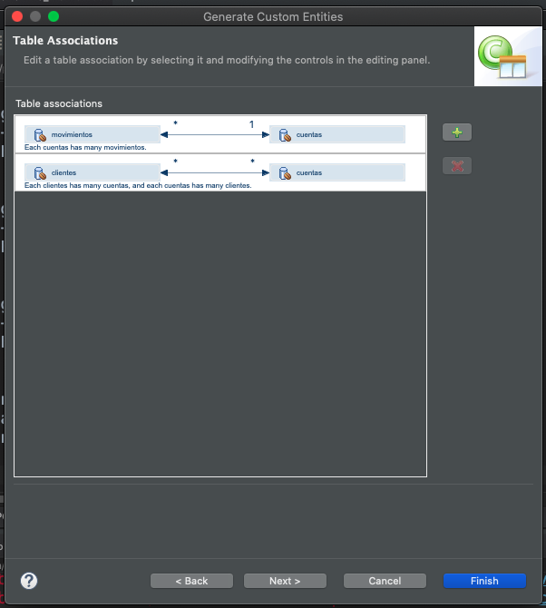

Indicamos algunas caracteristicas más como el paquete donde se van a generar las Entidades, el fetch, etc.

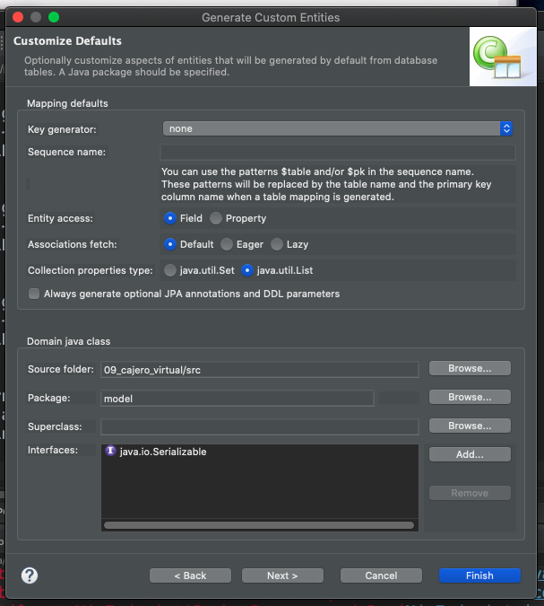

En la siguiente pantalla debemos indicar las estrategias para generar las claves de cada tabla.

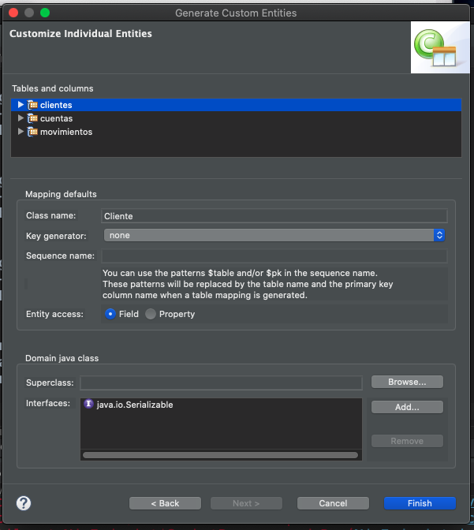
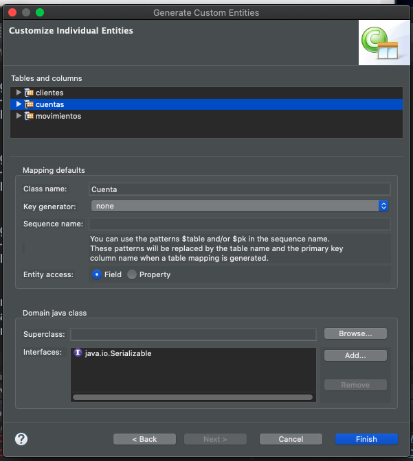
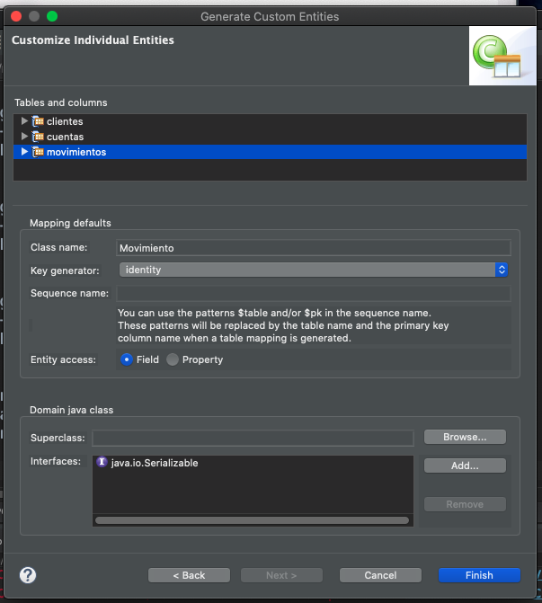

Se generan las Entidades aun que con algunos errores ya que falta información que el Asistente no incluyo.

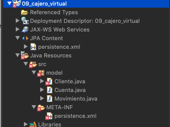

Vamos a ver las Entidades que nos genero. Empezamos por `Movimientos` la cual es el lado Muchos, la propietaría de la Relación entre `Movimientos` y `Cuentas`.

`Movimientos`

```java
//bi-directional many-to-one association to Cuenta
@ManyToOne
@JoinColumn(name="idCuenta")
private Cuenta cuenta;
```

Como ya hemos visto en otros ejemplos falta meter `referencedColumnName = "numeroCuenta"` la referencia del nombre de columna de la Otra Entidad. Por el código nos queda así:


`Movimientos`

```java
//bi-directional many-to-one association to Cuenta
@ManyToOne
@JoinColumn(name="idCuenta", referencedColumnName = "numeroCuenta")
private Cuenta cuenta;
```

Vamos a ver a `Cuentas`.

```java
//bi-directional many-to-one association to Movimiento
@OneToMany(mappedBy="cuenta")
private List<Movimiento> movimientos;

//bi-directional many-to-many association to Cliente
@ManyToMany(mappedBy="cuentas")
private List<Cliente> clientes;
```

Como vemos aquí esta poniendo la relación `@OneToMany(mappedBy="cuenta")` para indicar que en el atributo `cuenta` de la Entidad `Movimiento` esta la información de la relación.

Por otro lado me esta poniendo `@ManyToMany(mappedBy="cuentas")` lo que me indica que el asistennte ha decidido que la propietaria de la Relación va ser `Cliente` y que en su atributo `cuentas` estará la información de la relación.

Si vemos la Entidad `Cliente` tenemos:

```java
//bi-directional many-to-many association to Cuenta
@ManyToMany
@JoinColumn(name="dni")
private List<Cuenta> cuentas;
```

Como esta información es incompleta nos esta marcando error. La vamos a cambiar por la siguiente:

```java
//bi-directional many-to-many association to Cuenta
@ManyToMany
@JoinTable(name="titulares",
           joinColumns = @JoinColumn(name="idCliente", referencedColumnName ="dni"),
           inverseJoinColumns = @JoinColumn(name="idCuenta", referencedColumnName = "numeroCuenta"))
private List<Cuenta> cuentas;
```
* TODA ESTA INFORMACIÓN DE LA BD.
* Indicamos el nombre de la Tabla de Join `titulares`
* Con `joinColumns` indicamos la relación de los campos entre la tabla `titulares` y `clientes`
* Con `inverseJoinColumns` indicamos la relación de los campos entre la tabla `titulares` y `cuentas`
* En `name` siempre va la Foreng Key de `titulares`.

Al meter esto el error desaparece.

### 04. Quitar Características JPA y Eliminar `persistence.xml`

El asistente ya hizo su trabajo vamos a eliminar esa característica y borrar el `persistence.xml`.

### 05. Configuración XML

`web.xml`

```html
<?xml version="1.0" encoding="UTF-8"?>
<web-app xmlns:xsi="http://www.w3.org/2001/XMLSchema-instance" xmlns="http://xmlns.jcp.org/xml/ns/javaee" xsi:schemaLocation="http://xmlns.jcp.org/xml/ns/javaee http://xmlns.jcp.org/xml/ns/javaee/web-app_4_0.xsd" version="4.0">
  <display-name>09_cajero_virtual</display-name>
  <welcome-file-list>
    <welcome-file>menu.html</welcome-file>
  </welcome-file-list>
  <context-param>
  	<param-name>contextConfigLocation</param-name>
  	<param-value>/WEB-INF/springConfig.xml</param-value>
  </context-param>
  <listener>
  	<listener-class>org.springframework.web.context.ContextLoaderListener</listener-class>
  </listener>
</web-app>
```

`springConfig.xml`

```html
<?xml version="1.0" encoding="UTF-8"?>
<beans xmlns="http://www.springframework.org/schema/beans"
	xmlns:xsi="http://www.w3.org/2001/XMLSchema-instance"
	xmlns:context="http://www.springframework.org/schema/context"
	xmlns:jee="http://www.springframework.org/schema/jee"
	xmlns:tx="http://www.springframework.org/schema/tx"
	xsi:schemaLocation="http://www.springframework.org/schema/jee http://www.springframework.org/schema/jee/spring-jee-4.3.xsd
		http://www.springframework.org/schema/beans http://www.springframework.org/schema/beans/spring-beans.xsd
		http://www.springframework.org/schema/context http://www.springframework.org/schema/context/spring-context-4.3.xsd
		http://www.springframework.org/schema/tx http://www.springframework.org/schema/tx/spring-tx-4.3.xsd">
	<!-- 1. Habilite configuración mediante anotaciones -->
	<context:annotation-config/>
	<!-- 2. Escanee los paquetes en los que se encuentran las clases que debe instanciar -->
	<context:component-scan base-package="service"/>
	<!-- datasources propios de Spring -->
	<bean id="data" 
		class="org.springframework.jdbc.datasource.DriverManagerDataSource">
		<property name="url"
			value="jdbc:mysql://localhost:3306/bancabd?serverTimezone=UTC">
		</property>
		<property name="driverClassName"
			value="com.mysql.cj.jdbc.Driver">
		</property>
		<property name="username" value="root"></property>
		<property name="password" value="root"></property>
	</bean>
	
	<!-- configuración integración Spring-JPA-Hibernate -->
	<!-- creación adaptador JPA-Hibernate -->
	<bean id="adapter"
		class="org.springframework.orm.jpa.vendor.HibernateJpaVendorAdapter">
		<property name="databasePlatform"
			value="org.hibernate.dialect.MySQLDialect">
		</property>
	</bean>
	
	<!-- configuración JPA -->
	<bean id="factory"
		class="org.springframework.orm.jpa.LocalContainerEntityManagerFactoryBean">
		<property name="persistenceUnitName" value="bancaPU"></property>
		<property name="dataSource" ref="data"></property>
		<property name="jpaVendorAdapter" ref="adapter"></property>
		<property name="packagesToScan" value="model"></property>
	</bean>	
	<!-- transaccionalidad -->
	<!-- crea el objeto encargado de la transacción -->
	<bean id="txManager"
		class="org.springframework.orm.jpa.JpaTransactionManager">
		<property name="entityManagerFactory" ref="factory"></property>
	</bean>
	<!-- habilita la transaccionalidad mediante anotaciones -->
	<tx:annotation-driven transaction-manager="txManager"/>	
	
</beans>
```

### 06. Capa de Servicio

Vamos a tener dos Servicios el `ClientesService` y `CuentasService`.

`ClientesServiceImpl`

```java
@Service
public class ClientesServiceImpl implements ClientesService {

   @PersistenceContext(name="bancoPU")
   EntityManager em;
	
   @Override
   public List<Cliente> obtenerClientes() {
      TypedQuery<Cliente> query=em.createNamedQuery("Cliente.findAll", Cliente.class);
      return query.getResultList();
   }
	
   @Transactional
   @Override
   public void actualizarCliente(Cliente cliente) {
      em.merge(cliente);
   }
}
```

Observaciones de `ClientesServiceImpl`

* Recuperamos los Clientes usando un NamedQuery.
* TENEMOS que actualizar el `Cliente` que es lo que se registre la información en `titulares`.
* Aun que tenemos una relación bilateral entre Clientes y Cuentas podría pensarse que se puede actualizar un Cliente o una Cuenta pero realmente se debe realizar la actualización en la Entidad Propietaria.

`CuentasServiceImpl`

```java
@Service
public class CuentasServiceImpl implements CuentasService {

   @PersistenceContext(name="bancoPU")
   EntityManager em;

   @Override
   public List<Cuenta> obtenerCuentasNoCliente(int dni) {
		
      //String jpql="SELECT c FROM Cuenta c JOIN c.clientes cli WHERE cli.dni <> ?1";
      String jpql= "SELECT c "
                 + "  FROM Cuenta c "
                 + " WHERE c NOT IN ( "
                 + "                  SELECT c "
                 + "                    FROM Cuenta c "
                 + "                    JOIN c.clientes t WHERE t.dni = ?1 "
                 + "                )";

      TypedQuery<Cuenta> query = em.createQuery(jpql, Cuenta.class);
      query.setParameter(1, dni);
      return query.getResultList();
   }

   @Transactional
   @Override
   public void actualizarCuenta(int numeroCuenta, int dni) {
      Cuenta cuenta=em.find(Cuenta.class, numeroCuenta);
      Cliente cliente=em.find(Cliente.class, dni);
      cuenta.getClientes().add(cliente);
      em.merge(cuenta);
      /*cliente.getCuentas().add(cuenta);
      em.merge(cliente);*/
   }
}
```

Observaciones de `CuentasServiceImpl`

### 07. Actions

```java
@WebServlet("/ListaClientesAction")
public class ListaClientesAction extends HttpServlet {
   private static final long serialVersionUID = 1L;
	
   @Autowired
   ClientesService service;
   @Override
   public void init(ServletConfig config) throws ServletException {
      //le informa al servidor de aplicaciones que Spring va a realizar inyecci�n
      //de objetos en este servlet
      SpringBeanAutowiringSupport.processInjectionBasedOnCurrentContext(this);
      super.init(config);
   }
   protected void service(HttpServletRequest request, HttpServletResponse response) throws ServletException, IOException {
      request.setAttribute("clientes", service.obtenerClientes());
   }
}
```

```java
@WebServlet("/ListaCuentasClienteAction")
public class ListaCuentasClienteAction extends HttpServlet {
   private static final long serialVersionUID = 1L;
	
   @Autowired
   CuentasService service;
	
   @Override
   public void init(ServletConfig config) throws ServletException {
      //le informa al servidor de aplicaciones que Spring va a realizar inyecci�n
      //de objetos en este servlet
      SpringBeanAutowiringSupport.processInjectionBasedOnCurrentContext(this);
      super.init(config);
   }
   protected void service(HttpServletRequest request, HttpServletResponse response) throws ServletException, IOException {
      int dni=Integer.parseInt(request.getParameter("dni"));
      request.getSession().setAttribute("dni", dni);
      request.setAttribute("cuentas", service.obtenerCuentasNoCliente(dni));
   }
}
```

```java
@WebServlet("/RegistrarCuentaAction")
public class RegistrarCuentaAction extends HttpServlet {
   private static final long serialVersionUID = 1L;
	
   @Autowired
   CuentasService service;
	
   @Override
   public void init(ServletConfig config) throws ServletException {
      //le informa al servidor de aplicaciones que Spring va a realizar inyecci�n
      //de objetos en este servlet
      SpringBeanAutowiringSupport.processInjectionBasedOnCurrentContext(this);
      super.init(config);
   }

   protected void service(HttpServletRequest request, HttpServletResponse response) throws ServletException, IOException {
      int numeroCuenta=Integer.parseInt(request.getParameter("numeroCuenta"));
      int dni=(Integer)(request.getSession().getAttribute("dni"));
      service.actualizarCuenta(numeroCuenta, dni);
   }
}
```

### 08. FrontController

```java
@WebServlet("/FrontController")
public class FrontController extends HttpServlet {
   private static final long serialVersionUID = 1L;

   protected void service(HttpServletRequest request, HttpServletResponse response) throws ServletException, IOException {
      String url="";
      String option=request.getParameter("option");
      switch(option) {
         case "doListaClientes":
            request.getRequestDispatcher("ListaClientesAction").include(request, response);
            url="seleccioncliente.jsp";
            break;
         case "doListaCuentas":
            request.getRequestDispatcher("ListaCuentasClienteAction").include(request, response);
            url="seleccioncuenta.jsp";
            break;
         case "doRegistrarCuenta":
            request.getRequestDispatcher("RegistrarCuentaAction").include(request, response);
            url="menu.html";
            break;
      }
      request.getRequestDispatcher(url).forward(request, response);
   }
}
```

### 09. Vistas

`menu.html`

```html
<body>
<a href="FrontController?option=doListaClientes">Asignar cuenta a cliente</a></br>

</body>
</html>
```

`seleccionecliente.jsp`

```html
<body>
   <form action="FrontController?option=doListaCuentas" method="post" >		
      Elige Cliente:<select name="dni">
                       <%List<Cliente> clientes=(List<Cliente>)request.getAttribute("clientes");
		       for(Cliente cliente:clientes){%>
		         <option value="<%=cliente.getDni()%>"><%=cliente.getNombre()%></option>
		       <%} %>
		    </select>
      <input type="submit" value="Siguiente">	
   </form>
</body>
</html>
```

`seleccioncuenta.jsp`

```html
<body>
   <form action="FrontController?option=doRegistrarCuenta" method="post" >	
      Elige Cuenta:<select name="numeroCuenta">
                      <%List<Cuenta> cuentas=(List<Cuenta>)request.getAttribute("cuentas");
		      for(Cuenta cuenta:cuentas){%>
                         <option value="<%=cuenta.getNumeroCuenta()%>">            
			    <%=cuenta.getNumeroCuenta()%>
			 </option>
		      <%} %>
		   </select>
      <input type="submit" value="Asignar">	
   </form>
</body>
</html>
```

### 10. Probar la Aplicación

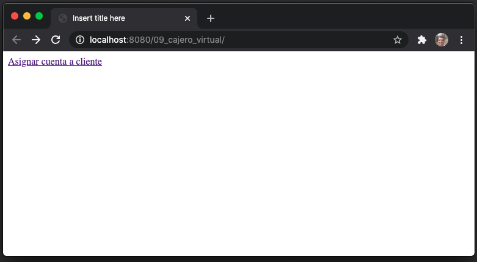
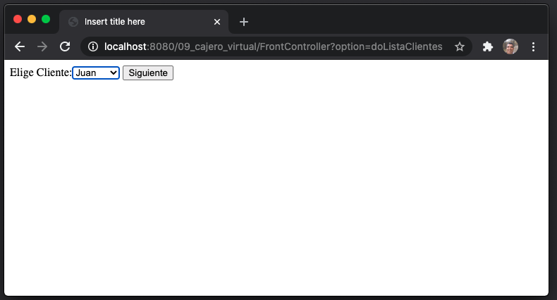
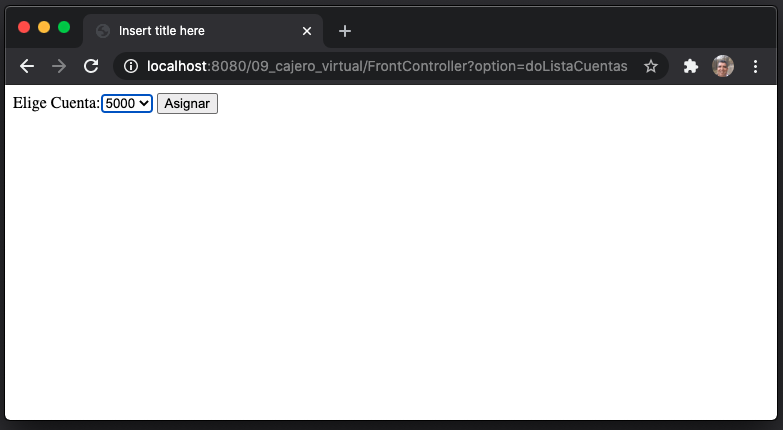
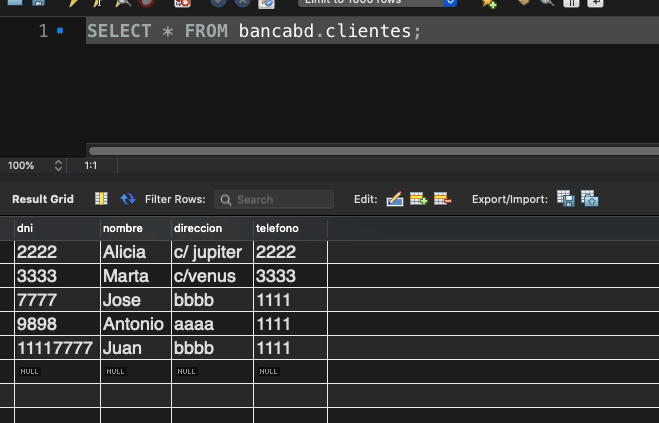
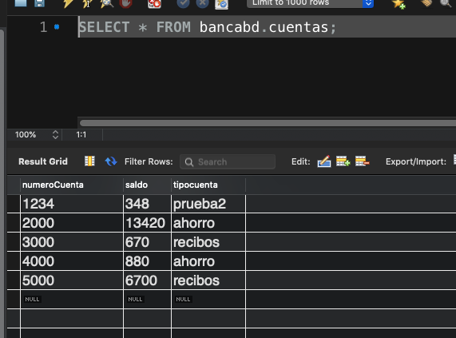


