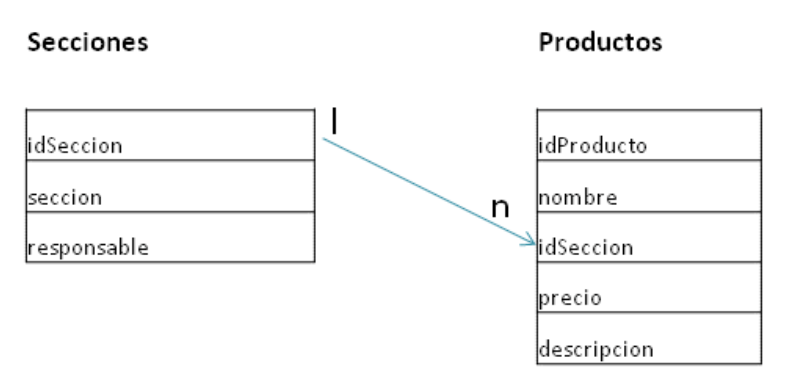

# 20201120 Viernes

## Documento Relaciones Entre Entidades.

[Documento Relaciones Entre Entidades](https://github.com/adolfodelarosades/Java/blob/master/temarios/000_592_DESARROLLADOR_JAVA_EE_FRONT_END_MULTIPLATAFORMA/pdfs/relacion_entre_Entidades.pdf)

## Relaciones Muchos a Muchos

Esta relación se da cuando una Entidad esta asociados a muchos objetos de otra Entidad y viceversa. Por ejemplo una Cuenta puede pertenecer a varios Clientes y un Cliente puede tener varias Cuentas.

A nivel de BD una relación Muchos a Muchos necesita una tabla intermedia para crear esta relación en este caso le llamamos Titulares. No hay una relación directa entre Cuentas y Clientes se necesita una tabla intermedia que tenga la combinación de las Foreing Keys. Realmente en la BD tenemos una Relación Uno a Muchos entre Cuentas y Titutulares y otra Relación Uno a Muchos entre Clientes y titulares.

Normalmente la tabla de Join (Titulares) no contiene más que los campos de las Foreing Keys. La existencia de la tabla de Join permite modelar una relación Muchos a Muchos sin tener encuenta la tabla Join, es decir la tabla existe pero al generar las Entidades la de esta tabla se omite solo las dos principales contaran con su Entidad.

Si la tabla de Join cuenta con más campos además de las Foreing Keys más vale tener una Relación Uno a Muchos y Muchos a Uno.

En este caso cuando generemos las Entidades Cuentas va a contra con sus atributos y además una  lista de Clientes y en el caso de la Entidad Clientes va a contar con sus atributos y además un atributo con la lista de Cuentas, anotados con `@ManytoMany`.

Como ambas tablas van a ser Muchos en alguna de ellas la debemos denotar como propietaria, una vez elegida una lleva la antotación `@JoinTable`. La que no es propietaria va a llevar el `@ManytoMany(mapperBy="cuentas")` que indica en que campo de la otra Entidad va a tener la información de la relación.

