# 20201123 Lunes.

## :computer: `10_formacion_springjpa`<br/>&nbsp;&nbsp;&nbsp;&nbsp;&nbsp;&nbsp;&nbsp;&nbsp;&nbsp;**Segundo Ejemplo Relación Muchos A Muchos**

Partiendo del ejemplo `23_formacion_ejb_weblogic_v2` el cual estaba realizado con EJBs y tenia tres entidades `alumnos`, `matriculas` y `cursos` con RELACIÓN UNO A MUCHOS y RELACIÓN MUCHOS A UNO, lo vamos a transformar para que en lugar de usar EJBs use Spring y en lugar de tres entidades solo maneje dos `alumnos` y `cursos` con una RELACIÓN MUCHOS A MUCHOS.

### 01. Mavenizar Proyecto y poner Dependencias

Necesitamos poner las dependencias que se listan a continuación. Con EJBs solo necesitabamos `hibernate-core`, con Spring necesitamos ademas de `hibernate-core` necesitamos `mysql-connector-java` por que no la tenemos en el Tomcat, y las dependencias de Spring `spring-core`, `spring-context`, `spring-web`, `spring-orm`.

`pom.xml`

```html
<dependencies>
   <!-- https://mvnrepository.com/artifact/mysql/mysql-connector-java -->
   <dependency>
      <groupId>mysql</groupId>
      <artifactId>mysql-connector-java</artifactId>
      <version>8.0.19</version>
   </dependency>
   <!-- https://mvnrepository.com/artifact/org.springframework/spring-core -->
   <dependency>
      <groupId>org.springframework</groupId>
      <artifactId>spring-core</artifactId>
      <version>5.2.9.RELEASE</version>
   </dependency>
   <!-- https://mvnrepository.com/artifact/org.springframework/spring-context -->
   <dependency>
      <groupId>org.springframework</groupId>
      <artifactId>spring-context</artifactId>
      <version>5.2.9.RELEASE</version>
   </dependency>
   <dependency>
      <groupId>org.springframework</groupId>
      <artifactId>spring-web</artifactId>
      <version>5.2.9.RELEASE</version>
   </dependency> 
   <dependency>
      <groupId>org.springframework</groupId>
      <artifactId>spring-orm</artifactId>
      <version>5.2.9.RELEASE</version>
   </dependency>
   <!-- https://mvnrepository.com/artifact/org.hibernate/hibernate-core -->
   <dependency>
      <groupId>org.hibernate</groupId>
      <artifactId>hibernate-core</artifactId>
      <version>5.4.18.Final</version>
   </dependency>	
</dependencies>
```

### 02. Generación de Entidades `Alumnos` y `Cursos`

Las tablas que tenemos son las siguientes:

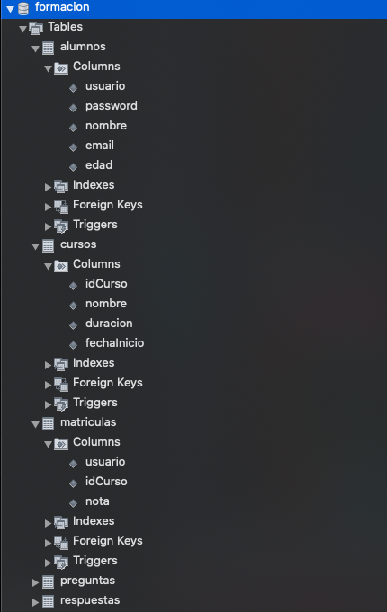

Podemos elimianr las entidades del proyecto anterior y generar las entidades con el asistente. El resultado es el siguiente:

`Alumno` **Entidad Propietaria**

```java
package model;

import java.io.Serializable;
import javax.persistence.*;
import java.util.List;

@Entity
@Table(name="alumnos")
@NamedQuery(name="Alumno.findAll", query="SELECT a FROM Alumno a")
public class Alumno implements Serializable {
   private static final long serialVersionUID = 1L;
   @Id
   private String usuario;

   private int edad;
   private String email;
   private String nombre;
   private String password;

   //bi-directional many-to-many association to Curso
   @ManyToMany
   @JoinTable(name = "matriculas",  //Tabla de union 
      joinColumns = @JoinColumn(name="usuario",referencedColumnName = "usuario"), //Join-prop: Alumnos
      inverseJoinColumns = @JoinColumn(name="idCurso",referencedColumnName ="idCurso")) //Join-inv: Cursos	 
   private List<Curso> cursos;

   public Alumno() {
   }
	
   public Alumno(String usuario, int edad, String email, String nombre, String password) {
      super();
      this.usuario = usuario;
      this.edad = edad;
      this.email = email;
      this.nombre = nombre;
      this.password = password;
   }

   public String getUsuario() {
      return this.usuario;
   }

   public void setUsuario(String usuario) {
      this.usuario = usuario;
   }

   public int getEdad() {
      return this.edad;
   }

   public void setEdad(int edad) {
      this.edad = edad;
   }

   public String getEmail() {
      return this.email;
   }

   public void setEmail(String email) {
      this.email = email;
   }

   public String getNombre() {
      return this.nombre;
   }

   public void setNombre(String nombre) {
      this.nombre = nombre;
   }

   public String getPassword() {
      return this.password;
   }

   public void setPassword(String password) {
      this.password = password;
   }

   public List<Curso> getCursos() {
      return this.cursos;
   }

   public void setCursos(List<Curso> cursos) {
      this.cursos = cursos;
   }

}
```

Observaciones de `Alumno` **Entidad Propietaria**

* Por ser la Entidad propietaria tiene la anotación `@JoinTable(name = "matriculas",` la cual hace referecia a la JoinTable que es "matriculas". 
* Dentro de `@JoinTable` tenemos los atributos
   * `joinColumns` para indicar la relación entre la tabla "matriculas" con la tabla "alumnos"
   * `inverseJoinColumns` para indicar la relación entre la tabla "matriculas" con la tabla "cursos"

`Curso`

```java
package model;

import java.io.Serializable;
import javax.persistence.*;
import java.util.Date;
import java.util.List;

@Entity
@Table(name="cursos")
@NamedQuery(name="Curso.findAll", query="SELECT c FROM Curso c")
public class Curso implements Serializable {
   private static final long serialVersionUID = 1L;

   @Id
   @GeneratedValue(strategy=GenerationType.IDENTITY)
   private int idCurso;

   private int duracion;

   @Temporal(TemporalType.DATE)
   private Date fechaInicio;

   private String nombre;

   //bi-directional many-to-many association to Alumno
   @ManyToMany(mappedBy="cursos")
   private List<Alumno> alumnos;

   public Curso() {
   }
	
   public Curso(int idCurso, int duracion, Date fechaInicio, String nombre) {
      super();
      this.idCurso = idCurso;
      this.duracion = duracion;
      this.fechaInicio = fechaInicio;
      this.nombre = nombre;
   }

   public int getIdCurso() {
      return this.idCurso;
   }

   public void setIdCurso(int idCurso) {
      this.idCurso = idCurso;
   }

   public int getDuracion() {
      return this.duracion;
   }

   public void setDuracion(int duracion) {
      this.duracion = duracion;
   }

   public Date getFechaInicio() {
      return this.fechaInicio;
   }

   public void setFechaInicio(Date fechaInicio) {
      this.fechaInicio = fechaInicio;
   }

   public String getNombre() {
      return this.nombre;
   }

   public void setNombre(String nombre) {
      this.nombre = nombre;
   }

   public List<Alumno> getAlumnos() {
      return this.alumnos;
   }

   public void setAlumnos(List<Alumno> alumnos) {
      this.alumnos = alumnos;
   }

}
```

### 03. Capa de Servicio

Aquí hemos cambiado los EJBs por Clases Spring con sus respectivas Interfaces.

`AlumnosService`

```java
package service;

import java.util.List;

import model.Alumno;

public interface AlumnosService {

   void altaAlumno(Alumno alumno);

   Alumno buscarAlumnoPorUsuario(String usuario);
   List<Alumno> alumnosCurso(int idCurso);
   List<Alumno> alumnos();
}
```

`AlumnosServiceImpl`

```java
package service;

import java.util.List;

import javax.persistence.EntityManager;
import javax.persistence.PersistenceContext;
import javax.persistence.TypedQuery;

import org.springframework.beans.factory.annotation.Autowired;
import org.springframework.stereotype.Service;
import org.springframework.transaction.annotation.Transactional;

import model.Alumno;
import model.Curso;

@Service
public class AlumnosServiceImpl implements AlumnosService {

   @PersistenceContext(unitName = "formacionPU")
   private  EntityManager em;
	
   @Transactional
   @Override
   public void altaAlumno(Alumno alumno) {
      em.persist(alumno);
   }
   @Override
   public Alumno buscarAlumnoPorUsuario(String usuario) {
      return em.find(Alumno.class, usuario);
   }
	
   @Override
   public List<Alumno> alumnosCurso(int idCurso) {
      //String jpql="Select a From Alumno a join a.matriculas m where m.curso.idCurso=?1";
      String jpql="Select a From Alumno a join a.cursos c where c.idCurso=?1";
      TypedQuery<Alumno> query=em.createQuery(jpql,Alumno.class);
      query.setParameter(1, idCurso);
      return query.getResultList();
   }
   @Override
   public List<Alumno> alumnos() {
      TypedQuery<Alumno> query=em.createNamedQuery("Alumno.findAll",Alumno.class);
      return query.getResultList();
   }
}
```

Observaciones de `AlumnosServiceImpl`
* Anotadas con `@Service` para que Spring las pueda instanciar
* Usamos la anotación `@PersistenceContext(unitName = "formacionPU")` para poder inyectar el `EntityManager`
* Las operación de acción deben anotarse con `@Transactional`

`CursosService`

```java
package service;

import java.util.List;
import model.Curso;

public interface CursosService {

   void altaCurso(Curso curso);
   List<Curso> obtenerCursos();
   List<Curso> cursosAlumno(String usuario);
}
```

`CursosServiceImpl`

```java
package service;

import java.util.List;

import javax.persistence.EntityManager;
import javax.persistence.PersistenceContext;
import javax.persistence.TypedQuery;

import org.springframework.stereotype.Service;
import org.springframework.transaction.annotation.Transactional;

import model.Curso;
@Service
public class CursosServiceImpl implements CursosService {
   @PersistenceContext(unitName = "formacionPU")
   private  EntityManager em;
	
   @Transactional
   @Override
   public void altaCurso(Curso curso) {
      em.persist(curso);
   }
	
   @Override
   public List<Curso> obtenerCursos() {
      String jpql="Select c From Curso c";
      TypedQuery<Curso> query=em.createQuery(jpql,Curso.class);
      return query.getResultList();
   }
   
   @Override
   public List<Curso> cursosAlumno(String usuario) {
      //String jpql="Select c From Curso c join c.matriculas m where m.alumno.usuario=?1";
      //String jpql="Select c From Curso c join c.alumnos a where a.alumno.usuario=?1"; // error no existe curso
      String jpql="Select c From Curso c join c.alumnos a where a.usuario=?1";
      TypedQuery<Curso> query=em.createQuery(jpql,Curso.class);
      query.setParameter(1, usuario);
      return query.getResultList();
      /*alternativa que permite obtener los datos directamente a partir de
       * la entidad principal
      Alumno alumno=em.find(Alumno.class, usuario);
      return alumno.getCursos();*/	
   }
}
```

Observaciones de `CursosServiceImpl`
* Anotadas con `@Service` para que Spring las pueda instanciar
* Usamos la anotación `@PersistenceContext(unitName = "formacionPU")` para poder inyectar el `EntityManager`
* Las operación de acción deben anotarse con `@Transactional`
* En el caso del método `cursosAlumno` hay dos formas de solucionarlo pero existe un pero en la opción comentada que la veremos cuando probemos la aplicación.


### 04. Configuración de Archivos XMl

`web.xml`

```html
<?xml version="1.0" encoding="UTF-8"?>
<web-app xmlns:xsi="http://www.w3.org/2001/XMLSchema-instance" xmlns="http://xmlns.jcp.org/xml/ns/javaee" xsi:schemaLocation="http://xmlns.jcp.org/xml/ns/javaee http://xmlns.jcp.org/xml/ns/javaee/web-app_4_0.xsd" version="4.0">
   <display-name>09_cajero:virtual_ana</display-name>
   <welcome-file-list>
      <welcome-file>menu.html</welcome-file>
   </welcome-file-list>
   <context-param>
      <param-name>contextConfigLocation</param-name>
      <param-value>/WEB-INF/springConfig.xml</param-value>
   </context-param>
   <listener>
      <listener-class>org.springframework.web.context.ContextLoaderListener</listener-class>
   </listener>
</web-app>
```

`springConfig.xml`

```html
<?xml version="1.0" encoding="UTF-8"?>
<beans xmlns="http://www.springframework.org/schema/beans"
	xmlns:xsi="http://www.w3.org/2001/XMLSchema-instance"
	xmlns:context="http://www.springframework.org/schema/context"
	xmlns:jee="http://www.springframework.org/schema/jee"
	xmlns:tx="http://www.springframework.org/schema/tx"
	xsi:schemaLocation="http://www.springframework.org/schema/jee http://www.springframework.org/schema/jee/spring-jee-4.3.xsd
		http://www.springframework.org/schema/beans http://www.springframework.org/schema/beans/spring-beans.xsd
		http://www.springframework.org/schema/context http://www.springframework.org/schema/context/spring-context-4.3.xsd
		http://www.springframework.org/schema/tx http://www.springframework.org/schema/tx/spring-tx-4.3.xsd">
   <!-- 1. Habilite configuración mediante anotaciones -->
   <context:annotation-config/>
   <!-- 2. Escanee los paquetes en los que se encuentran las clases que debe instanciar -->
   <context:component-scan base-package="service"/>
   <!-- datasource del servidor -->
   <jee:jndi-lookup jndi-name="refformacion" id="dataServidor"/>
	
   <!-- configuración integración Spring-JPA-Hibernate -->
   <!-- creación adaptador JPA-Hibernate -->
   <bean id="adapter"
         class="org.springframework.orm.jpa.vendor.HibernateJpaVendorAdapter">
         <property name="databasePlatform"
            value="org.hibernate.dialect.MySQLDialect">
         </property>
   </bean>
	
   <!-- configuración JPA -->
   <bean id="factory" class="org.springframework.orm.jpa.LocalContainerEntityManagerFactoryBean">
      <property name="persistenceUnitName" value="formacionPU"></property>
      <property name="dataSource" ref="dataServidor"></property>
      <property name="jpaVendorAdapter" ref="adapter"></property>
      <property name="packagesToScan" value="model"></property>
      <!--
      <property name="jpaProperties">
         <props>
            <prop key="hibernate.enable_lazy_load_no_trans">true</prop>
         </props>
      </property>
      -->
   </bean>	
   <!-- transaccionalidad -->
   <!-- crea el objeto encargado de la transacción -->
   <bean id="txManager"
         class="org.springframework.orm.jpa.JpaTransactionManager">
      <property name="entityManagerFactory" ref="factory"></property>
   </bean>
   <!-- habilita la transaccionalidad mediante anotaciones -->
   <tx:annotation-driven transaction-manager="txManager"/>				
</beans>
```

### 05. Cambios en los Actions

En los Actions antes inyectabamos los EJBs de la siguiente forma:

```java
@EJB
AlumnosService service;
protected void service(HttpServletRequest request, HttpServletResponse response) throws ServletException, IOException {	
...
```

Al ya no usar EJBs esto lo debemos campiar para inyectar nuestra capa de Servicio realizada con Spring, además debemos sobreescribir el método `init` de los Servlets para informar al servidor de aplicaciones que Spring va a realizar inyección de objetos en este servlet

```java
@Autowired
AlumnosService service;

@Override
public void init(ServletConfig config) throws ServletException {
   //le informa al servidor de aplicaciones que Spring va a realizar inyección
	 //de objetos en este servlet
	 SpringBeanAutowiringSupport.processInjectionBasedOnCurrentContext(this);
   super.init(config);
}

protected void service(HttpServletRequest request, HttpServletResponse response) throws ServletException, IOException {
...		
```

Este cambio lo hacemos en todos los Actions que nos marcan error. En el caso del Action `AlumnosNotaAction` este lo vamos a elimanar por que en este ejemplo no estamos usando las notas.

### 06. Cambios en el Controller

Como hemos eliminado el Action `AlumnosNotaAction` eliminamos la opción `doAlumnosNota` y `toNota`.

```java
...
case "doAlumnosNota":
   request.getRequestDispatcher("AlumnosNotaAction").include(request, response);
   url="alumnosnota.jsp";
   break;
...      
case "toNota":
   url="nota.html";
   break;
...
```

### 07. Cambios enlas Vistas.

Eliminamos las vistas `alumnosnota.jsp` y `nota.html` y de `menu.html` eliminamos la opción `Buscar Alumnos Nota`.

### 08. Probar la Aplicación.

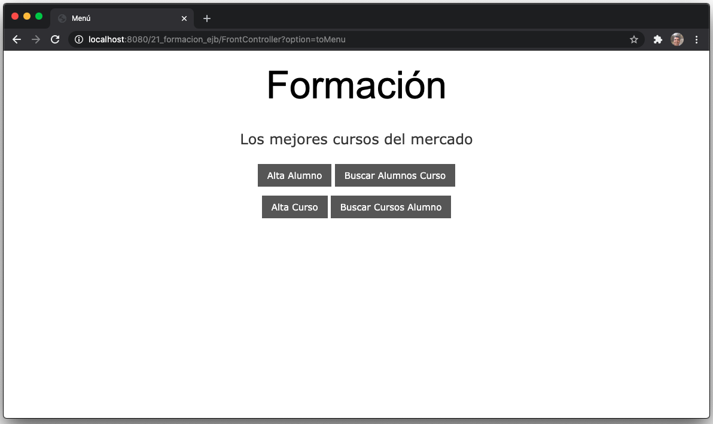
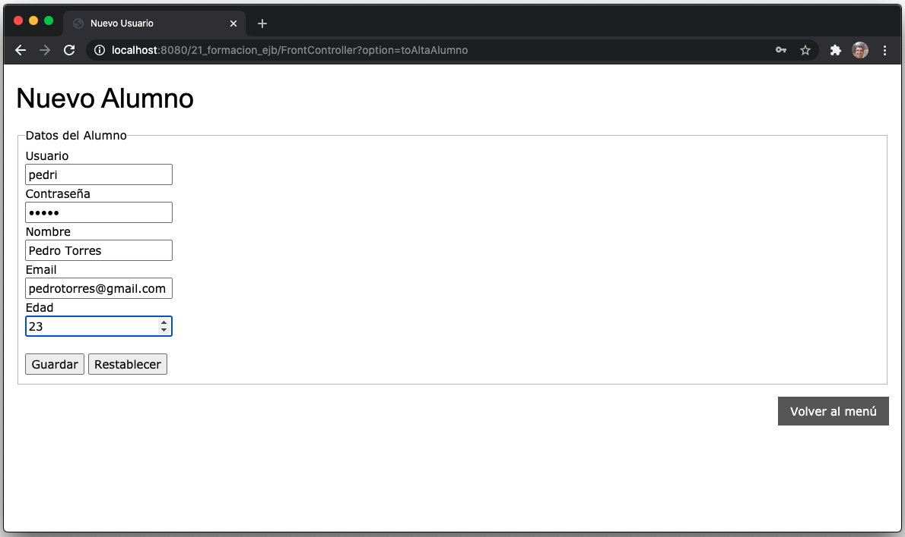
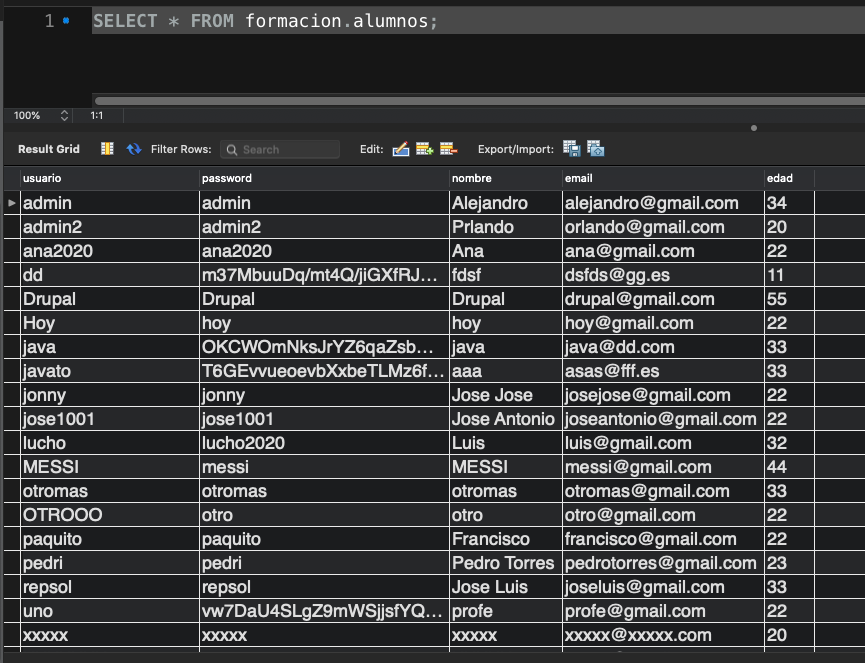

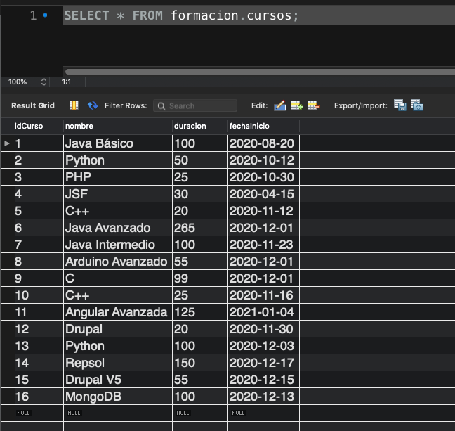
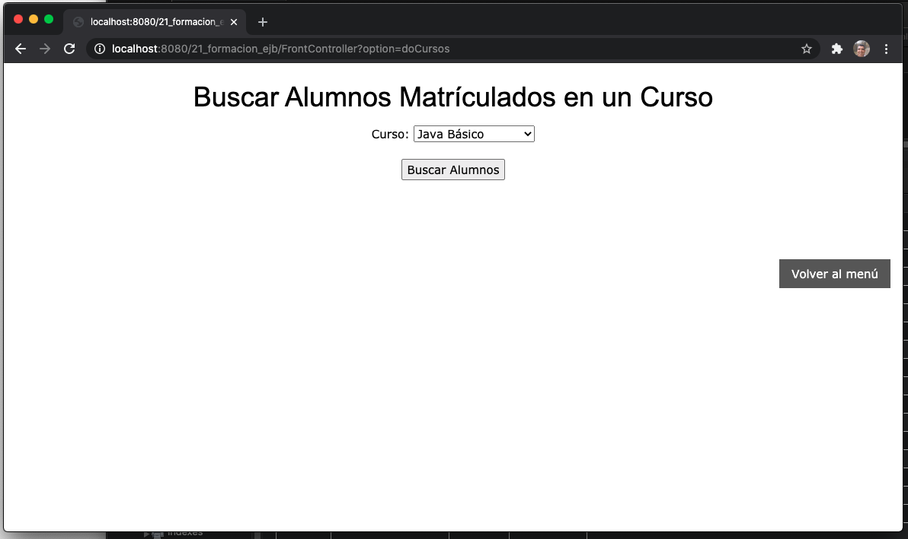
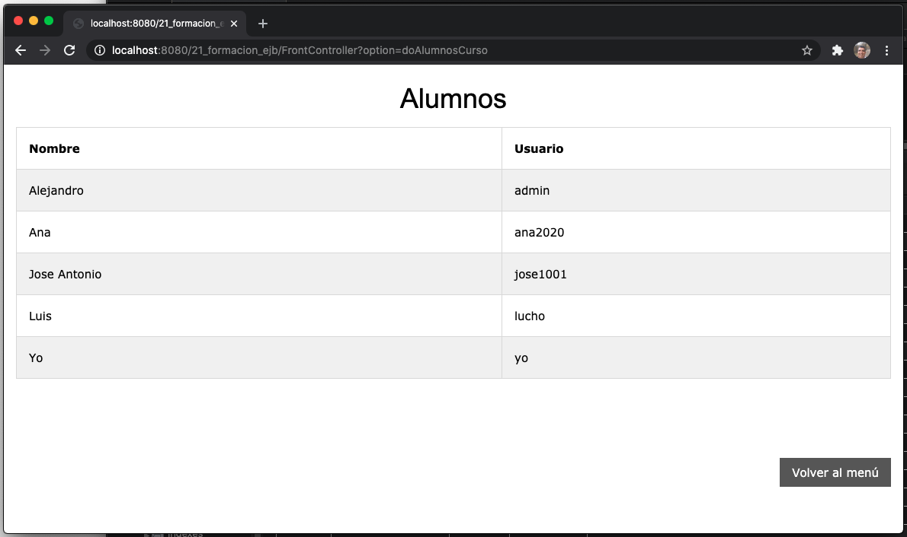
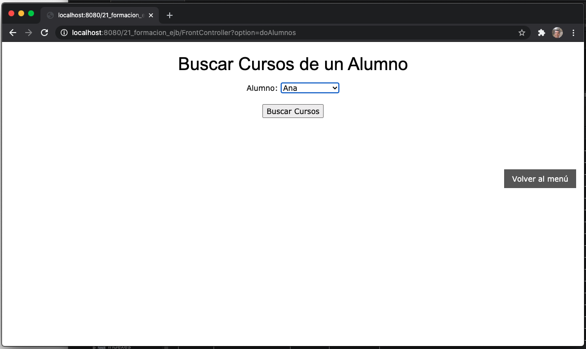
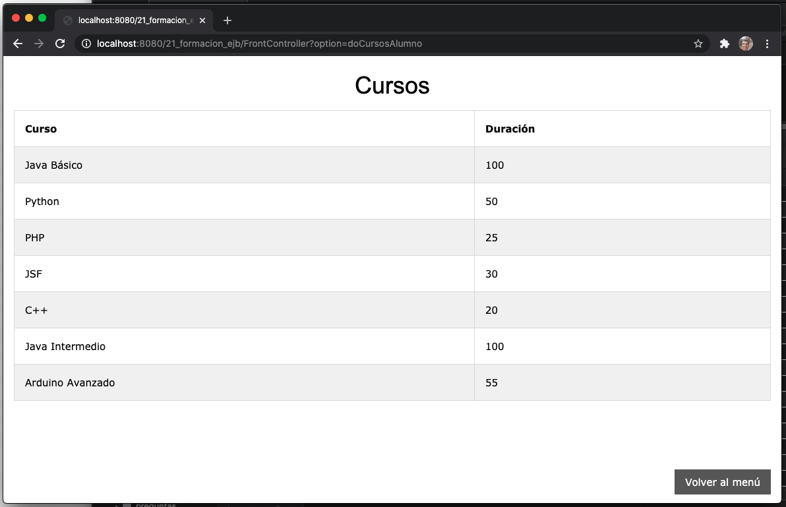

Probar la Aplicación con la otra opción del método `cursosAlumno`

```java
Alumno alumno=em.find(Alumno.class, usuario);
return alumno.getCursos();
```

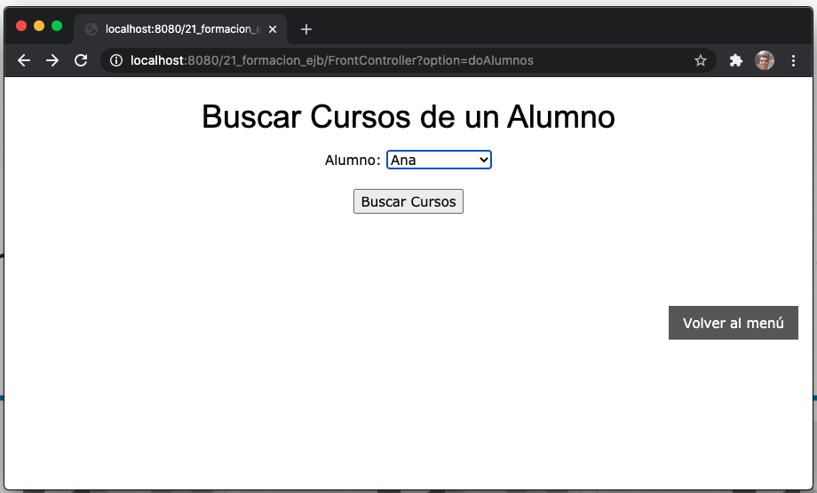
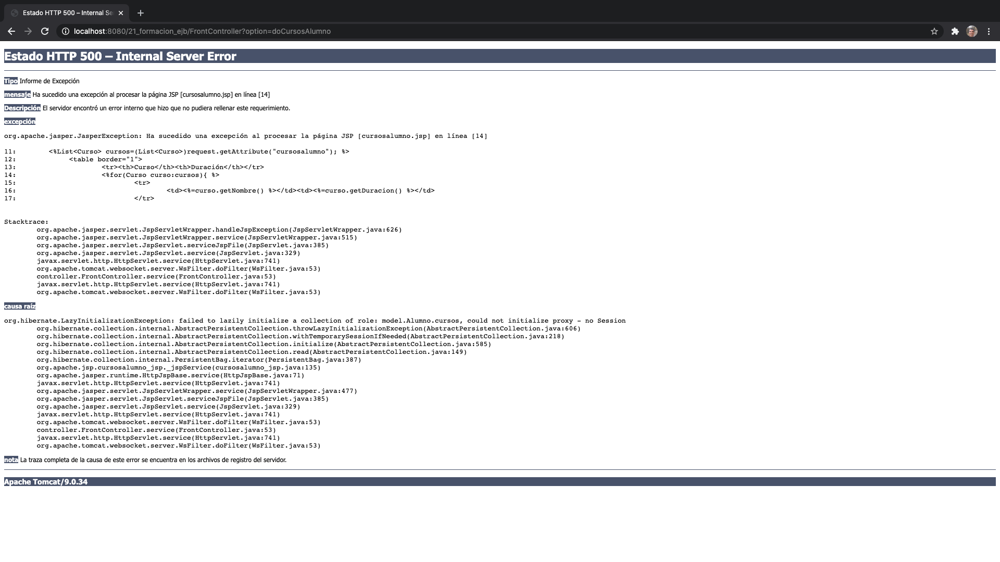
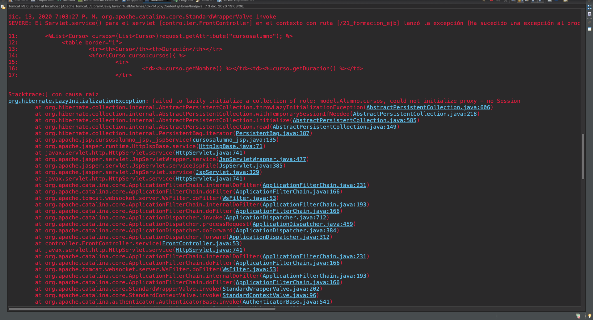

Nos marca el error:

```sh
failed to lazily initialize a collection of role: model.Alumno.cursos, could not initialize proxy - no Session
```

Este fallo se debe a la carga Lazy de los datos, Hibernate hace una carga Lazy de los datos relacionados, eso significa que cuando busco un alumno me trae el alumno pero no sus cursos hasta que invoco `alumno.getCursos()` va a la BD por los cursos, pero que ocurre, por unas cosas internas de Hibernate la conexión es cerrada después de traer al alumno, por eso cuando busca los cursos en la BD ya no hay conexión y es cuando nos marca ese error. La solución aun que podría ser es poner una carga Eager, pero no es lo más adecuado hay una mejor alternativa, es configurar una propiedad para el motor de persistencia dentro de la configuración JPA en nuestro archivo `springConfig.xml` que es la siguiente:

```html
<!-- configuración JPA -->
...
   <property name="jpaProperties">
      <props>
	 <prop key="hibernate.enable_lazy_load_no_trans">true</prop>
      </props>
   </property>
</bean>	
```

Nos queda así:

```html
<!-- configuración JPA -->
<bean id="factory"
      class="org.springframework.orm.jpa.LocalContainerEntityManagerFactoryBean">
   <property name="persistenceUnitName" value="formacionPU"></property>
   <property name="dataSource" ref="dataServidor"></property>
   <property name="jpaVendorAdapter" ref="adapter"></property>
   <property name="packagesToScan" value="model"></property>
   <property name="jpaProperties">
      <props>
	 <prop key="hibernate.enable_lazy_load_no_trans">true</prop>
      </props>
   </property>
</bean>	
```

Esta es una manera de decirle a Hibernate que no cierre la conexión una vez que trae la conexión.

Con esto ya Hibernate no va a desconectar si volvemos a probar ya nos funcionara:

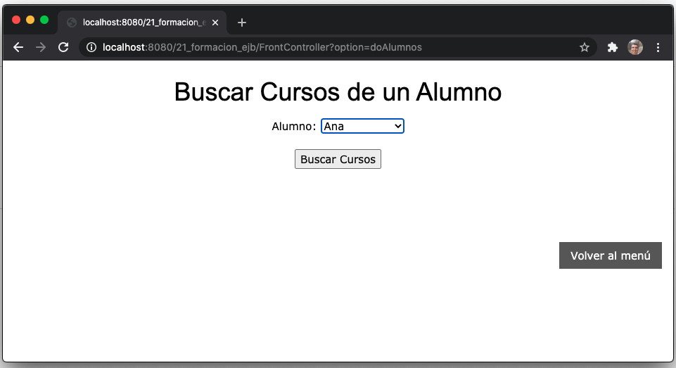
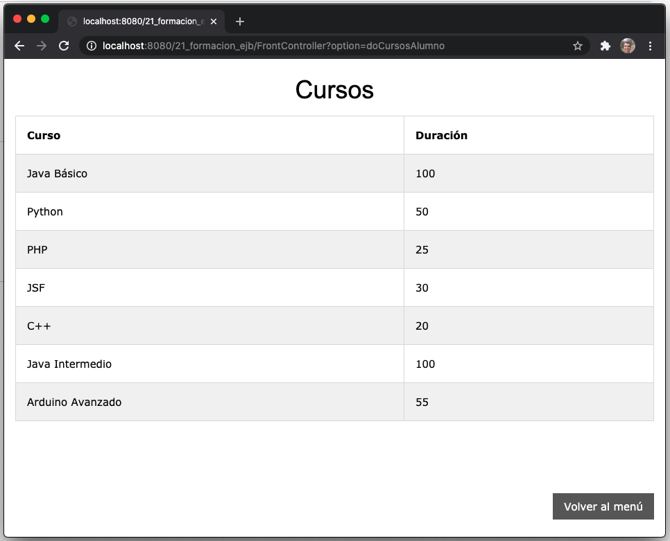


**Pero sin duda la mejor solución es usar la opción inicial del método con un Join Explícito para traer los datos con un solo paso, es menos costoso en terminos de rendimiento.**


## :computer: `11_formacion_springjpa_matricular` <br/>&nbsp;&nbsp;&nbsp;&nbsp;&nbsp;&nbsp;&nbsp;&nbsp;&nbsp;**Segundo Ejemplo Relación Muchos A Muchos - Añadir Funcionalidad Matricular**

Partiendo de una copia del proyecto `10_formacion_springjpa` vamos a añadir la funcionalidad de matrícular un alumno en un curso. Debemos añadir esa nueva opción de matrícular al menú nos desplegará la lista de los Alumnos para seleccionar uno y en otra página la lista de Cursos en los que no esta inscrito y al seleccionarlo ya lo podrémos matricular.

### 01. Capa de Servicio

Vamos a añadir algunos métodos en la capa de servicio.

En `CursosService` necesitamos dos funcionalidades extras `List<Curso> cursosDisponibles(String usuario);` y `Curso recuperarCurso(int idCurso);`

`CursosService`

```java
public interface CursosService {
   ...
   List<Curso> cursosDisponibles(String usuario);
   Curso recuperarCurso(int idCurso);
}
```

`CursosServiceImpl`

```java
...
@Service
public class CursosServiceImpl implements CursosService {
   ...
   @Override
   public List<Curso> cursosDisponibles(String usuario) {
      String jpql = "SELECT c "
                  + "  FROM Curso c "
                  + " WHERE c NOT IN (SELECT c "
                  + "                   FROM Curso c JOIN c.alumnos a "
                  + "                  WHERE a.usuario = ?1)";
      TypedQuery<Curso> query=em.createQuery(jpql,Curso.class);
      query.setParameter(1, usuario);		
      return query.getResultList();
   }

   @Override
   public Curso recuperarCurso(int idCurso) {
      return em.find(Curso.class, idCurso);
   }
}
```

Observaciones de `CursosServiceImpl`
* Para `cursosDisponibles` excluimos los cursos en los cuales ya esta inscrito y recuperomos todos los demás.

En el caso de `AlumnosService` solo necesitamos `matricularAlumno` por lo que añadimos este método

`AlumnosService`

```java
public interface AlumnosService {

   ...
   void matricularAlumno(String usuario,int idCurso);
}
```

`AlumnosServiceImpl`

```java
...
@Service
public class AlumnosServiceImpl implements AlumnosService {
   @Autowired
   CursosService service;
	
   @PersistenceContext(unitName = "formacionPU")
   private  EntityManager em;
	
   ...
   @Transactional
   @Override
   public void matricularAlumno(String usuario, int idCurso) {
      Alumno alumno=buscarAlumnoPorUsuario(usuario);
      Curso curso=service.recuperarCurso(idCurso);
      alumno.getCursos().add(curso);
      em.merge(alumno);	
   }
}
```

Observaciones de `AlumnosServiceImpl`
* Recibimos los dos parámetros que necesitamos para matricular y actualizamos sobre la Entidad Propietaria para que se registre el cambio.
* Como usamos una funcinalidad que esta en en `CursosService` lo inyectamos para poder usarla. Desde una clase de la capa de servicio usamos otra clase de servicio solo es necesario inyectalo.

### 02. Actions

A nivel de Actions podría pensarse que necesitamos 3 nuevos uno para listar los alumnos, que ya lo tenemos, otro para listar los cursos disponibles donde matricularse y el de maticularse, por lo que vamos a crear dos nuevos Actions.

`CursosMatricularAction`

```java
package controller;

import java.io.IOException;

import javax.servlet.ServletConfig;
import javax.servlet.ServletException;
import javax.servlet.annotation.WebServlet;
import javax.servlet.http.HttpServlet;
import javax.servlet.http.HttpServletRequest;
import javax.servlet.http.HttpServletResponse;

import org.springframework.beans.factory.annotation.Autowired;
import org.springframework.web.context.support.SpringBeanAutowiringSupport;

import service.CursosService;

@WebServlet("/CursosMatricularAction")
public class CursosMatricularAction extends HttpServlet {
   private static final long serialVersionUID = 1L;
	
   @Autowired
   CursosService service;
   
   @Override
   public void init(ServletConfig config) throws ServletException {
      //le informa al servidor de aplicaciones que Spring va a realizar inyecci�n
      //de objetos en este servlet
      SpringBeanAutowiringSupport.processInjectionBasedOnCurrentContext(this);
      super.init(config);
   }
	
   protected void service(HttpServletRequest request, HttpServletResponse response) throws ServletException, IOException {
      String usuario =request.getParameter("usuario");
      request.getSession().setAttribute("usuario", usuario);//se recuerde a la hora de matricular
      request.setAttribute("cursosmatricular", service.cursosDisponibles(usuario));
   }

}
```

`MatricularAction`

```java
package controller;

import java.io.IOException;

import javax.servlet.ServletConfig;
import javax.servlet.ServletException;
import javax.servlet.annotation.WebServlet;
import javax.servlet.http.HttpServlet;
import javax.servlet.http.HttpServletRequest;
import javax.servlet.http.HttpServletResponse;

import org.springframework.beans.factory.annotation.Autowired;
import org.springframework.web.context.support.SpringBeanAutowiringSupport;

import service.AlumnosService;

@WebServlet("/MatricularAction")
public class MatricularAction extends HttpServlet {
   private static final long serialVersionUID = 1L;
	
   @Autowired
   AlumnosService service;
   
   @Override
   public void init(ServletConfig config) throws ServletException {
      //le informa al servidor de aplicaciones que Spring va a realizar inyecci�n
      //de objetos en este servlet
      SpringBeanAutowiringSupport.processInjectionBasedOnCurrentContext(this);
      super.init(config);
   }
	
   protected void service(HttpServletRequest request, HttpServletResponse response) throws ServletException, IOException {
      int idCurso=Integer.parseInt(request.getParameter("idCurso"));
      String usuario=(String)request.getSession().getAttribute("usuario");
      service.matricularAlumno(usuario, idCurso);
   }

}
```

### 03. FrontController

Debemos añadir las 3 nuevas opciones dentro del FrontController.

`FrontController`

```java
...
case "doSeleccionAlumnoMatricular":
   request.getRequestDispatcher("AlumnosAction").include(request, response);
   url="alumnosmatricular.jsp";
   break;
case "doSeleccionCursoMatricular":
   request.getRequestDispatcher("CursosMatricularAction").include(request, response);
   url="cursosmatricular.jsp";
   break;
case "doMatricular":
   request.getRequestDispatcher("MatricularAction").include(request, response);
   url="menu.html";
   break;
...
```

### 04. Vistas

Necesitamos crear las dos vistas nuevas `alumnosmatricular.jsp` y `cursosmatricular.jsp` y añadir la nueva opción en `menu.html`.

`menu.html`

```html
<!DOCTYPE html>
<html>
<head>
<meta charset="ISO-8859-1">
<title>Menú</title>
<link rel="stylesheet" type="text/css" href="css/w3.css">
</head>
<body>
   <div align="center">
      <h1 class="w3-jumbo">Formación</h1>
      <p class="w3-xlarge w3-text-dark-grey">Los mejores cursos del mercado</p>
         <p>
            <a href="FrontController?option=toAltaAlumno" class="w3-button w3-dark-grey">Alta Alumno</a>
            <a href="FrontController?option=doCursos"class="w3-button w3-dark-grey">Buscar Alumnos Curso</a>
         </p>
      <p>
         <a href="FrontController?option=toAltaCurso" class="w3-button w3-dark-grey">Alta Curso</a>
         <a href="FrontController?option=doAlumnos" class="w3-button w3-dark-grey">Buscar Cursos Alumno</a>
      </p>
      <p>
         <a href="FrontController?option=doSeleccionAlumnoMatricular" class="w3-button w3-dark-grey">Matricular</a>
      </p>
   </div>
</body>
</html>
```

`alumnosmatricular.jsp`

```html
<%@ page language="java" contentType="text/html; charset=ISO-8859-1"
    pageEncoding="ISO-8859-1" import ="java.util.*,model.*"%>
<!DOCTYPE html>
<html>
<head>
<meta charset="ISO-8859-1">
<title>Alumnos Matricular</title>
</head>
<body>
   <div align="center">
      <h1>Alumnos</h1>
      <form action="FrontController?option=doSeleccionCursoMatricular" method="Post">
         <%List<Alumno> alumnos=(List<Alumno>)request.getAttribute("alumnos"); %>
         Alumno: <select name="usuario">
			
         <%for(Alumno alumno:alumnos){ %>
				<option value="<%=alumno.getUsuario() %>">
					<%=alumno.getNombre() %>
				</option>
			<%} %>
			</select>
		   <br/><br/>
		   <input type="submit" value="Siguiente"/>	
		</form>
		<br/><br/>
		
	</div>
</body>
</html>
```

`cursosmatricular.jsp`

```html
```


### 05. Probar la Aplicación

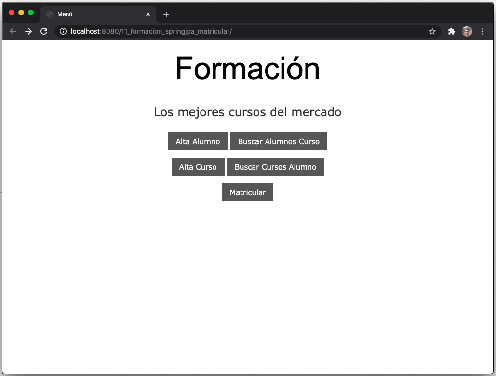
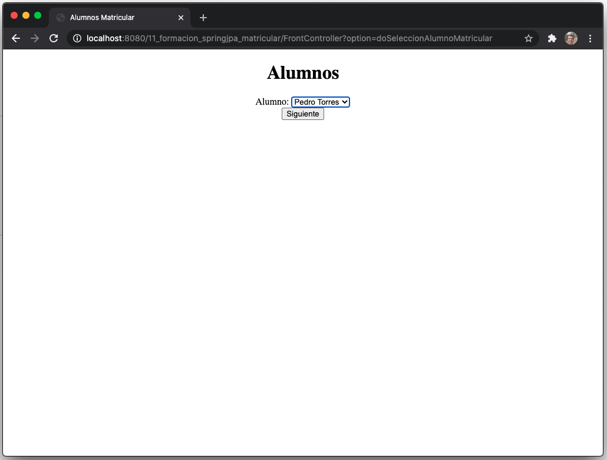
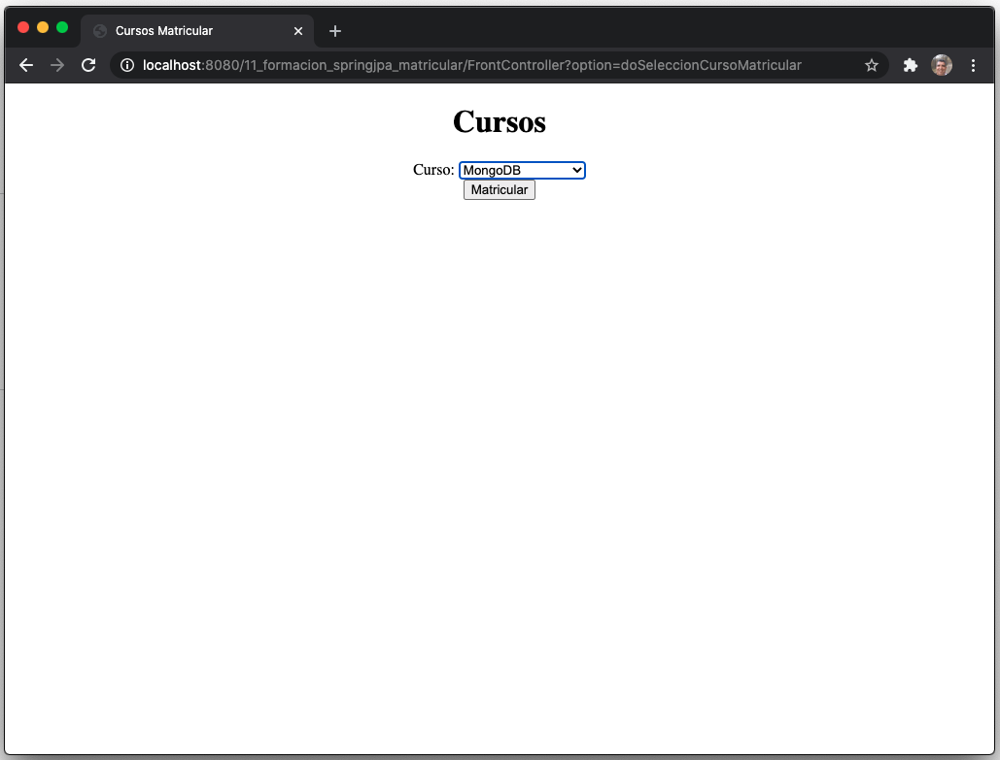
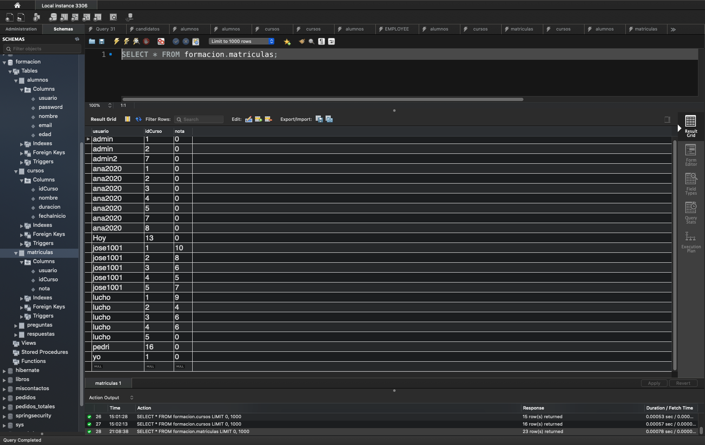
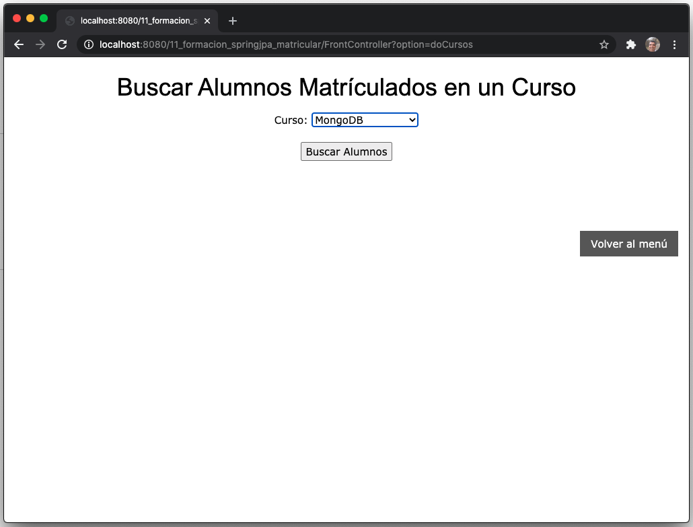


``
```java
```


``
```java
```


``
```java
```


``
```java
```


