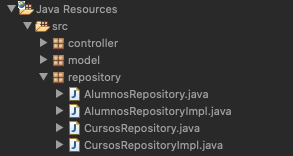

# 20201124 Martes

## Spring Data JPA

Hasta ahora hemos visto las siguientes maneras de acceder a los Datos con Spring.

* **Spring-JDBC** que con el **Objeto `JdbcTemplate`** nos permite acceder a los Datos de una forma más amigable que con JDBC tradicional.
* Integramos la Persistencia con Spring

Spring tiene una librería probia basada en JPA que mete un nivel más de simplificación en el acceso a datos.


Spring Data JPA es una librería de Spring, no es un módulo como tal, no sigue las misma númeraciones que `Spring-Core`, etc. La idea es que el programador use esta librería para ahorrarse el código que tendría que escribir con JPA.


La base de Spring Data JPA es una subinterfaz llamada `JpaRepository`, esta subinterfaz contiene muchos métodos que Spring automaticamente implementa, persistir una Entidad, buscar una Entidad por su clave primaría, eliminar una Entidad, buscar todas las Entidades, etc. 

[Ayuda de `JpaRepository`](https://docs.spring.io/spring-data/data-jpa/docs/current/api/)


`JpaRepository` Es una interfaz generica que define muchos métodos:


Los cuales puedo utilizar simplemente creando una Interfaz que extienda `JpaRepository`. 

Los más destacados son los heredados del `CrudRepository` como `save`, `findById`, etc.


Adicionales a todos los métodos heredados podemos decirle a Spring que nos cree un método que no cuenta por ejemplo que busque una Entidad por su Email podmes crar ese método y Spring se las ingenia para devolver el dato buscado.


Cuando lo que quiera realizar sea sumamente personalizado simplemente le paso el Query a Spring y el recupera la información. Si es una operación de acción la debo anotar con `@Transactional` y `@Modifying`.

Si usamos Spring Data JPA nuestra capa de Repository básicamente va a tener llamadas a métodos implementados por Spring, las JPQL practicamente desaparecen.

## :computer: `13_gestion_candidatos_spring_data_jpa` Primer Proyecto Spring-Data-JPA

Vamos a copiar el proyecto `06_gestion_candidatos_spring_jpa` y lo vamos a realizar con Spring Data JPA. 
Este proyecto no tiene separada la Capa de Servicio y la Capa de Repositorio, todo esta en la Capa de Servicio.

### 01. Añadir Dependencia Spring Data JPA.

`pom.xml`

```html
<dependency>
   <groupId>org.springframework.data</groupId>
   <artifactId>spring-data-jpa</artifactId>
   <version>2.2.5.RELEASE</version>
</dependency>
```

Debemos tener cuidado con la versión de `spring-data-jpa` por que no todas funcionan para las versiones de `spring-core` que estemos usando.

### 02. Implementar Interface que extienda `JpaRepository`.


Esta acción nos genera la siguiente Interface:

`CandidatosJpaRepository`

```java
public interface CandidatosJpaRepository extends JpaRepository<T, ID> {

}
```

Debemos poner los valores adecuados en la parte de los genericos.

`CandidatosJpaRepository`

```java
public interface CandidatosJpaRepository extends JpaRepository<Candidato, Integer> {

}
```

LA INTERFACE NO LLEVA NINGUNA ANOTACIÓN.

Uno es la Entidad y otro el tipo de la Foreng Key. Por ahora basta con en la interface ya veremos si necesitamos aladir algo más.

### 03. En la Capa de Servicio.

En este caso como no hay una separación entre la Capa de Servicio y Capa de Repository vamos a cambiar directamente sobre la Capa de Servicio.

Actualmente tenemos lo siguiente:

`CandidatosServiceImpl`

```java
@Service
public class CandidatosServiceImpl implements CandidatosService {
	
   @PersistenceContext(name="empresaPU")
   EntityManager em;

   @Transactional
   @Override
   public void altaCandidato(Candidato candidato) {
      em.persist(candidato);
   }
   
   @Override
   public void eliminarCandidato(int idCandidato) {
      Candidato candidato = em.find(Candidato.class, idCandidato);
      if(candidato != null) {
         em.remove(candidato);
      }
   }
	
   @Override
   public List<Candidato> recuperarCandidatos(){
      String jpql = "Select c FROM Candidato c";
      TypedQuery<Candidato> query = em.createQuery(jpql, Candidato.class);
      return query.getResultList();
   }
}
```

Lo primero que vamos a hacer es:

1. Nos vamos a olvidar del `EntityManager`, lo gestiona Spring y en su lugar vamos a inyectar `CandidatosJpaRepository`
2. Olvidarnos de las anotaciones `@Transactional`, lo gestiona Spring.
3. Cambiar `em.persist(candidato);` por `repository.save(candidato);`.
4. Cambiar `em.find(Candidato.class, idCandidato);` por `repository.findById(idCandidato).orElse(null);`, el método `findById(...)` nos devuelve un Optional.
5. Cambiar `em.remove(candidato);` por `repository.deleteById(idCandidato);`.
6. La simplificación la vemos claramente en el siguiente bloque de código:
   ```java
   String jpql = "Select c FROM Candidato c";
   TypedQuery<Candidato> query = em.createQuery(jpql, Candidato.class);
   return query.getResultList();
   ```
   Lo cambiamos por:
   
   ```java
   return repository.findAll();
   ```

La Clase modificada completa es la siguiente:

```java
@Service
public class CandidatosServiceImpl implements CandidatosService {
	
   @Autowired
   CandidatosJpaRepository repository;

   @Transactional
   @Override
   public void altaCandidato(Candidato candidato) {
      repository.save(candidato);
   }
	
   @Transactional
   @Override
   public void eliminarCandidato(int idCandidato) {
      Candidato candidato = repository.findById(idCandidato).orElse(null);
      if(candidato != null) {
         repository.deleteById(idCandidato);
      }
   }
	
   @Override
   public List<Candidato> recuperarCandidatos(){
      return repository.findAll();
   }

}
```

### 04. Configuración en `springConfig.xml`.


```html
<!-- configuración de spring data jpa -->
<jpa:repositories base-package="repository" 
                  entity-manager-factory-ref="factory" 
                  transaction-manager-ref="txManager"/>
```

Spring va a hacer el trabajo de JPA por nosotros pero hay que indicarle ciertos datos:

1. Indicar el paquete donde implementamos el objeto `JpaRepository`. 
2. El Factory que hace referencia a todo lo configurado anteriormente el DataSource.
3. Y el gestor de transferencia.


Con esto ya hemos realizado todos los cambios.

### 05. Probar la Aplicación


TODO FUNCIONA CORRECTAMENTE CON Spring Data JPA.

### 06 Añadir Otros Métodos

Los métodos que ya teniamos fueron muy sencillos de implementar, vamos a pensar en otros métodos más personalizados que realicen ciertas tareas.

Los métodos a desarrollar los añadimos en la Interface `CandidatosService` son:

`CandidatosService`

```java
Candidato buscarCandidatoEmail(String email);
List<Candidato> buscarCandidatosMayoresEdad(int edad);
void eliminarCandidatoEmail(String email);
```

Estos métodos ya no los podemos obtener directamente de `JpaRepository` debemos códificarlos dentro de la Interface.

`CandidatosJpaRepository`

```java
public interface CandidatosJpaRepository extends JpaRepository<Candidato, Integer> {
	
   Candidato findByEmail(String x); //select c from Candidato c where c.email=?1
	
   @Query(name = "Candidato.buscarEdadMayor")
   List<Candidato> findByEdadMayor(int edad);

   @Modifying
   @Transactional
   @Query("Delete from Candidato c where c.email=?1")
   void deleteCandidato(String email);
}
```

1. El primero busca por Email, basta con escribir la Firma del método y Spring se encargara de implementarlo. (Aun que no es necesario del todo)
2. En el segundo estamos usando una NamedQuery que tuvimos que insertar en la Entidad `Candidato`:
   ```java
   @NamedQuery(name="Candidato.buscarEdadMayor",query = "select c from Candidato c where c.edad>=?1")
   ```
   Con la anotación `@Query` ejecutamos el NamedQuery y ponemos la firma del método, los parámetros del método son los parámetros que se le mandan al NamedQuery.

3. El tercer método usa un Query de Acción que directamente lo hemos insertado dentro de `@Query` sin usar NamedQuery. Como es una query de acción usamos las anotaciones `@Modifying` y `@Transactional`, aunque parece que con `@Modifying` ya va implicita la `@Transactional`, VER DOCUMENTACION. 

Cuando ya definimos los métodos los podemos usar en nuestra clase tal como sigue:

`CandidatosServiceImpl`

```java
@Override
public Candidato buscarCandidatoEmail(String email) {
   return repository.findByEmail(email);
}

@Override
public List<Candidato> buscarCandidatosMayoresEdad(int edad) {
   return repository.findByEdadMayor(edad);
}

@Override
public void eliminarCandidatoEmail(String email) {
   repository.deleteCandidato(email);
}
```

ESTO NO TIENE NINGUNA IMPLEMENTACIÓN A NIVEL DE VISTAS,SOLO SE A QUEDADO A NIVEL DE LÓGICA DE NEGOCIOS.

## :computer: `14_formacion_spring_data_jpa` Segundo Proyecto Spring-Data-JPA

Vamos a copiar el proyecto `12_formacion_springjpa_repository_v2` y lo vamos a realizar con Spring Data JPA. 
Este proyecto SI tiene separada la Capa de Servicio y la Capa de Repositorio.

### 01. Capa de Repository

En la Capa de Repository tenemos las siguientes clases:



Actualmente tenemos estas dos clases que trabajan con JPA:


`AlumnosRepositoryImpl`

```java
@Repository("alumnosJpaEstandar")
public class AlumnosRepositoryImpl implements AlumnosRepository {
   
   @PersistenceContext(unitName = "formacionPU")
   EntityManager em;
   
   @Transactional
   @Override
   public void guardarAlumno(Alumno alumno) {
      em.persist(alumno);
   }

   @Override
   public Alumno buscarAlumnoPorUsuario(String usuario) {
      return em.find(Alumno.class, usuario);
   }
   
   @Transactional
   @Override
   public void actualizarAlumno(Alumno alumno) {
      em.merge(alumno);
   }

   @Override
   public List<Alumno> alumnosCurso(int idCurso) {
      String jpql="Select a From Alumno a join a.cursos c where c.idCurso=?1";
      TypedQuery<Alumno> query=em.createQuery(jpql,Alumno.class);
      query.setParameter(1, idCurso);
      return query.getResultList();
   }
      
   @Override
   public List<Alumno> todosAlumnos() {
      TypedQuery<Alumno> query=em.createNamedQuery("Alumno.findAll",Alumno.class);
      return query.getResultList();
   }
}
```

`CursosRepositoryImpl`

```java
@Repository("cursosJpaEstandar")
public class CursosRepositoryImpl implements CursosRepository {
   
   @PersistenceContext(unitName = "formacionPU")
   EntityManager em;
   
   @Transactional()
   @Override
   public void altaCurso(Curso curso) {
      em.persist(curso);	
   }

   @Override
   public Curso cursoPorId(int idCurso) {
      return em.find(Curso.class, idCurso);
   }

   @Override
   public List<Curso> todosCursos() {
      TypedQuery<Curso> query=em.createNamedQuery("Curso.findAll",Curso.class);
      return query.getResultList();
   }

   @Override
   public List<Curso> cursosAlumno(String usuario) {
      String jpql="Select c From Curso c join c.alumnos a where a.usuario=?1";
      TypedQuery<Curso> query=em.createQuery(jpql,Curso.class);
      query.setParameter(1, usuario);
      return query.getResultList();
   }

   @Override
   public List<Curso> cursosDisponiblesAlumno(String usuario) {
      String jpql="select c from Curso c where c not in ";
      jpql+="(select c from Curso c join c.alumnos a where a.usuario=?1)";
      TypedQuery<Curso> query=em.createQuery(jpql,Curso.class);
      query.setParameter(1, usuario);		
      return query.getResultList();
   }

   @Override
   public List<Curso> cursosEntreFechas(Date f1, Date f2) {
      String jpql="select c from Curso c where c.fechaInicio>=?1 and c.fechaInicio<=?2";
      //String jpql="select c from Curso c where c.fechaInicio> between ?1 and ?2";
      TypedQuery<Curso> query=em.createQuery(jpql,Curso.class);
      query.setParameter(1, f1,TemporalType.DATE);
      query.setParameter(2, f2,TemporalType.DATE);
		
      return query.getResultList();
   }
}
```

Como vamos a realizar una Implementación con Spring-Data-JPA pero vamos a mantener esta de JPA hemos puesto un nombre a cada Clase dentro de la anotación `@Repository` es decir `@Repository("alumnosJpaEstandar")` y `@Repository("cursosJpaEstandar")`

### 02. Crear la Implementacíon con Spring Data JPA. Interfaces que extiendan de `JpaRepository` y Clases que usan Spring Data -JPA 

`AlumnosJpaRepository`

```java
public interface AlumnosJpaRepository extends JpaRepository<Alumno, String> {
	
   @Query("Select a From Alumno a join a.cursos c where c.idCurso=?1")
   List<Alumno> findByIdCurso(int idCurso);
}
```

La Interface de la Soguiente Clase ya esta definida solo la Implementamos con spring Data JPA.

`AlumnosRepositorySpringDataJpaImpl`

```java
@Repository("alumnosSpringDataJpa")
public class AlumnosRepositorySpringDataJpaImpl implements AlumnosRepository {
   
   @Autowired
   AlumnosJpaRepository repository;
		
   @Override
   public void guardarAlumno(Alumno alumno) {
      repository.save(alumno);
   }

   @Override
   public Alumno buscarAlumnoPorUsuario(String usuario) {
      return repository.findById(usuario).orElse(null);
   }
   
   @Override
   public void actualizarAlumno(Alumno alumno) {
      repository.save(alumno);
   }

   @Override
   public List<Alumno> alumnosCurso(int idCurso) {	
      return repository.findByIdCurso(idCurso);
   }

   @Override
   public List<Alumno> todosAlumnos() {
      return repository.findAll();
   }
}
```


`CursosJpaRepository`

```java
public interface CursosJpaRepository extends JpaRepository<Curso, Integer> {
   @Query("Select c From Curso c join c.alumnos a where a.usuario=?1")
   List<Curso> findByUsuarioAlumno(String usuario);
	
   @Query("Select c From Curso c Where c Not In (Select c From Curso c join c.alumnos a Where a.usuario=?1)")
   List<Curso> findCursosNoAlumno(String usuario);
	
   List<Curso> findByFechaInicioBetween(Date desde, Date hasta);
}
```

La Interface de la Siguiente Clase ya esta definida solo la Implementamos con spring Data JPA.

`CursosRepositorySpringDataJpaImpl`

```java
@Repository("cursosSpringDataJpa")
public class CursosRepositorySpringDataJpaImpl implements CursosRepository {
	
   @Autowired
   CursosJpaRepository repository;
	
   @Override
   public void altaCurso(Curso curso) {
      repository.save(curso);	
   }

   @Override
   public Curso cursoPorId(int idCurso) {
      return repository.findById(idCurso).orElse(null);
   }

   @Override
   public List<Curso> todosCursos() {
      return repository.findAll();
   }

   @Override
   public List<Curso> cursosAlumno(String usuario) {
      return repository.findByUsuarioAlumno(usuario);
   }

   @Override
   public List<Curso> cursosDisponiblesAlumno(String usuario) {
      return repository.findCursosNoAlumno(usuario);
   }

   @Override
   public List<Curso> cursosEntreFechas(Date f1, Date f2) {
      return repository.findByFechaInicioBetween(f1, f2);
   }
}
```

### 03. Cambios en la Capa de Servicio.

Aquí solo debemos indicar cual de las dos implementaciones vamos a usar usando la anotación `@Qualifier`.

`AlumnosServiceImpl`

```java
@Service
public class AlumnosServiceImpl implements AlumnosService {
   
   @Autowired
   @Qualifier("alumnosSpringDataJpa")
   AlumnosRepository repository;

   @Autowired
   @Qualifier("cursosJpaEstandar")
   CursosRepository crepository;
   
   ...
```

`CursosServiceImpl`

```java
@Service
public class CursosServiceImpl implements CursosService {
   
   @Autowired
   @Qualifier("cursosSpringDataJpa")	
   CursosRepository cursosRepository;

   @Autowired
   @Qualifier("alumnosSpringDataJpa")
   AlumnosRepository alumnosRepository;
   
   ...
```

`MatriculasServiceImpl`

```java
@Service
public class MatriculasServiceImpl implements MatriculasService {
   
   @Autowired
   @Qualifier("cursosSpringDataJpa")
   CursosRepository cursosRepository;
   
   @Autowired
   @Qualifier("alumnosSpringDataJpa")
   AlumnosRepository alumnosRepository;
   
   ...
```

### 04. Configuración 

En `pom.xml` añadimos la siguiente dependencia:

```html
<!-- https://mvnrepository.com/artifact/org.springframework.data/spring-data-jpa -->
<dependency>
   <groupId>org.springframework.data</groupId>
   <artifactId>spring-data-jpa</artifactId>
   <version>${spring.data.jpa}</version>
</dependency>
```

En `springConfig.xml` añadimos la siguiente anotación:

`<jpa:repositories base-package="repository" 
                   entity-manager-factory-ref="factory" 
		   transaction-manager-ref="txManager"/>`

### 05. Probar la Aplicación

La aplicación debe funcionar igual que antes.


## Spring MVC


``

```java
```


``

```java
```

``

```java
```


