# 20201124 Martes

## Spring Data JPA

Hasta ahora hemos visto las siguientes maneras de acceder a los Datos con Spring.

* **Spring-JDBC** que con el **Objeto `JdbcTemplate`** nos permite acceder a los Datos de una forma más amigable que con JDBC tradicional.
* Integramos la Persistencia con Spring

Spring tiene una librería probia basada en JPA que mete un nivel más de simplificación en el acceso a datos.


Spring Data JPA es una librería de Spring, no es un módulo como tal, no sigue las misma númeraciones que `Spring-Core`, etc. La idea es que el programador use esta librería para ahorrarse el código que tendría que escribir con JPA.

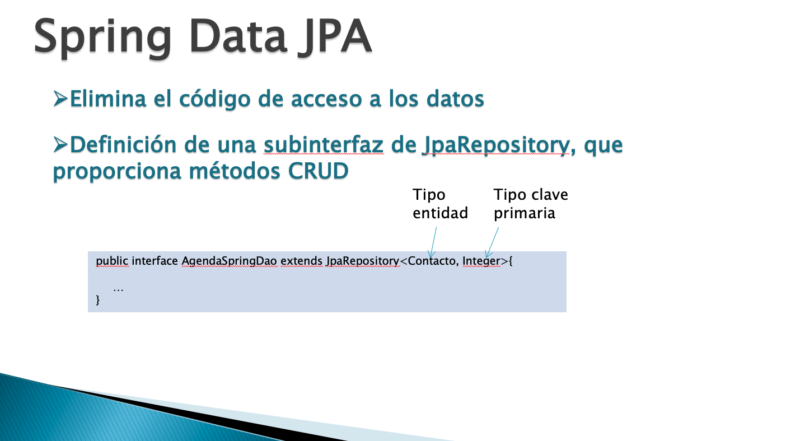

La base de Spring Data JPA es una subinterfaz llamada `JpaRepository`, esta subinterfaz contiene muchos métodos que Spring automaticamente implementa, persistir una Entidad, buscar una Entidad por su clave primaría, eliminar una Entidad, buscar todas las Entidades, etc. 

[Ayuda de `JpaRepository`](https://docs.spring.io/spring-data/data-jpa/docs/current/api/)

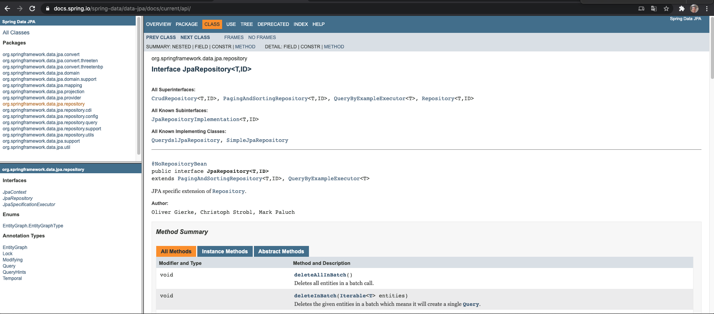

`JpaRepository` Es una interfaz generica que define muchos métodos:

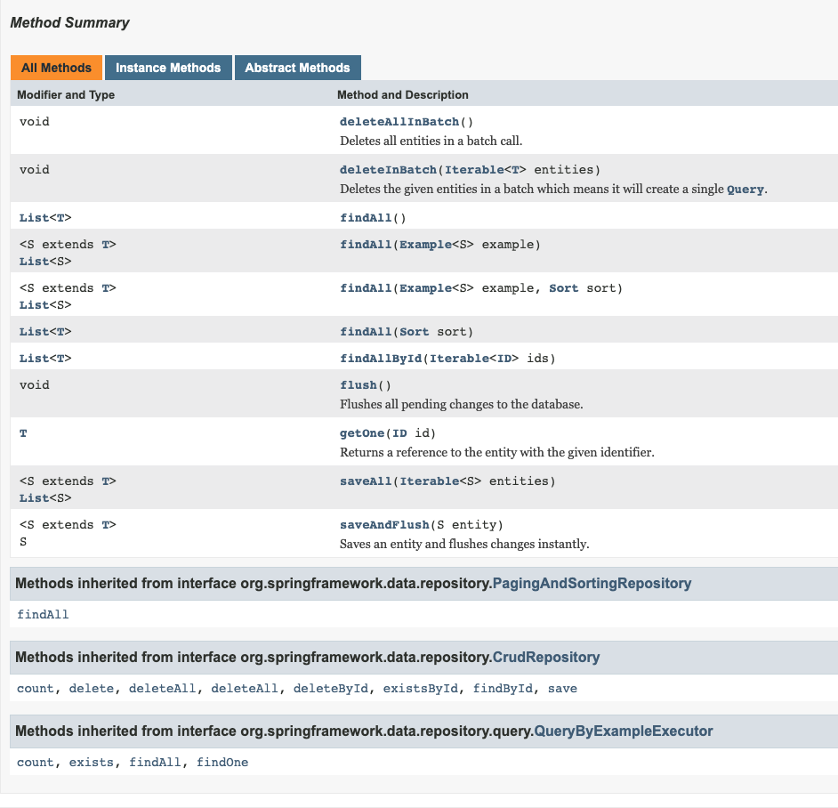

Los cuales puedo utilizar simplemente creando una Interfaz que extienda `JpaRepository`. 

Los más destacados son los heredados del `CrudRepository` como `save`, `findById`, etc.

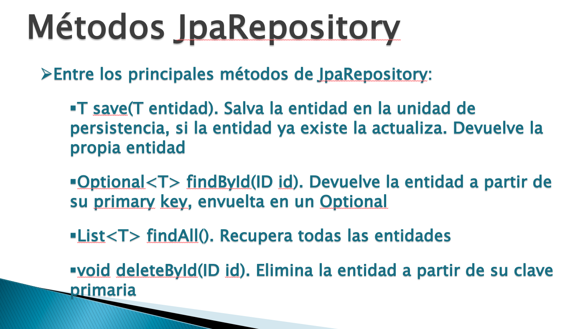

Adicionales a todos los métodos heredados podemos decirle a Spring que nos cree un método que no cuenta por ejemplo que busque una Entidad por su Email podmes crar ese método y Spring se las ingenia para devolver el dato buscado.

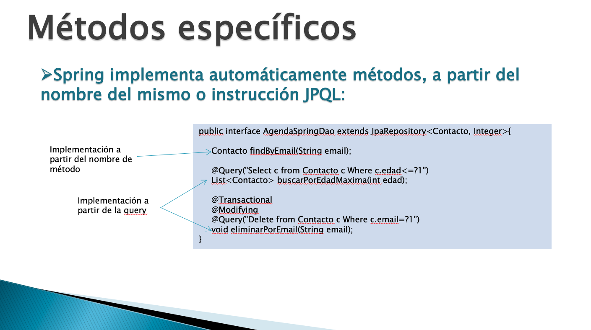

Cuando lo que quiera realizar sea sumamente personalizado simplemente le paso el Query a Spring y el recupera la información. Si es una operación de acción la debo anotar con `@Transactional` y `@Modifying`.

Si usamos Spring Data JPA nuestra capa de Repository básicamente va a tener llamadas a métodos implementados por Spring, las JPQL practicamente desaparecen.

## :computer: `13_gestion_candidatos_spring_data_jpa` Primer Proyecto Spring-Data-JPA

Vamos a copiar el proyecto `06_gestion_candidatos_spring_jpa` y lo vamos a realizar con Spring Data JPA. 
Este proyecto no tiene separada la Capa de Servicio y la Capa de Repositorio, todo esta en la Capa de Servicio.

### 01. Añadir Dependencia Spring Data JPA.

`pom.xml`

```html
<dependency>
   <groupId>org.springframework.data</groupId>
   <artifactId>spring-data-jpa</artifactId>
   <version>2.2.5.RELEASE</version>
</dependency>
```

Debemos tener cuidado con la versión de `spring-data-jpa` por que no todas funcionan para las versiones de `spring-core` que estemos usando.

### 02. Implementar Interface que extienda `JpaRepository`.

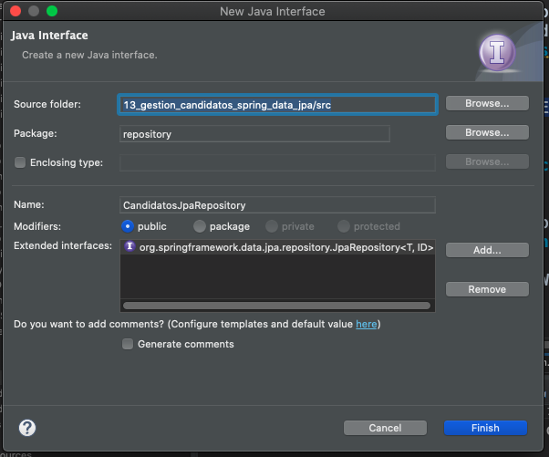

Esta acción nos genera la siguiente Interface:

`CandidatosJpaRepository`

```java
public interface CandidatosJpaRepository extends JpaRepository<T, ID> {

}
```

Debemos poner los valores adecuados en la parte de los genericos.

`CandidatosJpaRepository`

```java
public interface CandidatosJpaRepository extends JpaRepository<Candidato, Integer> {

}
```

LA INTERFACE NO LLEVA NINGUNA ANOTACIÓN.

Uno es la Entidad y otro el tipo de la Foreng Key. Por ahora basta con en la interface ya veremos si necesitamos aladir algo más.

### 03. En la Capa de Servicio.

En este caso como no hay una separación entre la Capa de Servicio y Capa de Repository vamos a cambiar directamente sobre la Capa de Servicio.

Actualmente tenemos lo siguiente:

`CandidatosServiceImpl`

```java
@Service
public class CandidatosServiceImpl implements CandidatosService {
	
   @PersistenceContext(name="empresaPU")
   EntityManager em;

   @Transactional
   @Override
   public void altaCandidato(Candidato candidato) {
      em.persist(candidato);
   }
   
   @Override
   public void eliminarCandidato(int idCandidato) {
      Candidato candidato = em.find(Candidato.class, idCandidato);
      if(candidato != null) {
         em.remove(candidato);
      }
   }
	
   @Override
   public List<Candidato> recuperarCandidatos(){
      String jpql = "Select c FROM Candidato c";
      TypedQuery<Candidato> query = em.createQuery(jpql, Candidato.class);
      return query.getResultList();
   }
}
```

Lo primero que vamos a hacer es:

1. Nos vamos a olvidar del `EntityManager`, lo gestiona Spring y en su lugar vamos a inyectar `CandidatosJpaRepository`
2. Olvidarnos de las anotaciones `@Transactional`, lo gestiona Spring.
3. Cambiar `em.persist(candidato);` por `repository.save(candidato);`.
4. Cambiar `em.find(Candidato.class, idCandidato);` por `repository.findById(idCandidato).orElse(null);`, el método `findById(...)` nos devuelve un Optional.
5. Cambiar `em.remove(candidato);` por `repository.deleteById(idCandidato);`.
6. La simplificación la vemos claramente en el siguiente bloque de código:
   ```java
   String jpql = "Select c FROM Candidato c";
   TypedQuery<Candidato> query = em.createQuery(jpql, Candidato.class);
   return query.getResultList();
   ```
   Lo cambiamos por:
   
   ```java
   return repository.findAll();
   ```

La Clase modificada completa es la siguiente:

```java
@Service
public class CandidatosServiceImpl implements CandidatosService {
	
   @Autowired
   CandidatosJpaRepository repository;

   @Transactional
   @Override
   public void altaCandidato(Candidato candidato) {
      repository.save(candidato);
   }
	
   @Transactional
   @Override
   public void eliminarCandidato(int idCandidato) {
      Candidato candidato = repository.findById(idCandidato).orElse(null);
      if(candidato != null) {
         repository.deleteById(idCandidato);
      }
   }
	
   @Override
   public List<Candidato> recuperarCandidatos(){
      return repository.findAll();
   }

}
```

### 04. Configuración en `springConfig.xml`.

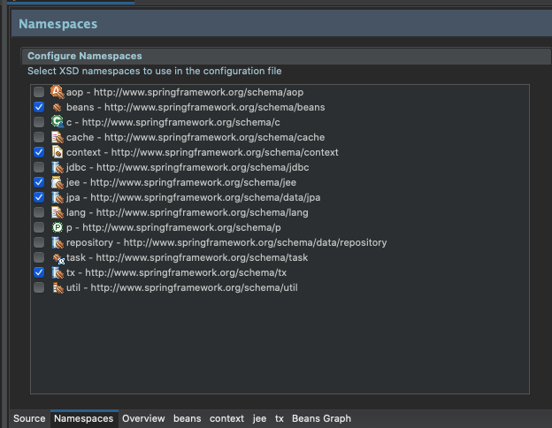

```html
<!-- configuración de spring data jpa -->
<jpa:repositories base-package="repository" 
                  entity-manager-factory-ref="factory" 
                  transaction-manager-ref="txManager"/>
```

Spring va a hacer el trabajo de JPA por nosotros pero hay que indicarle ciertos datos:

1. Indicar el paquete donde implementamos el objeto `JpaRepository`. 
2. El Factory que hace referencia a todo lo configurado anteriormente el DataSource.
3. Y el gestor de transferencia.


Con esto ya hemos realizado todos los cambios.

### 05. Probar la Aplicación

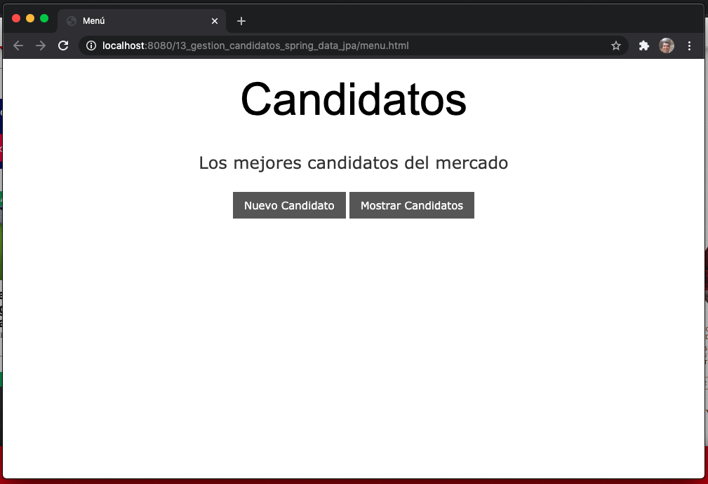

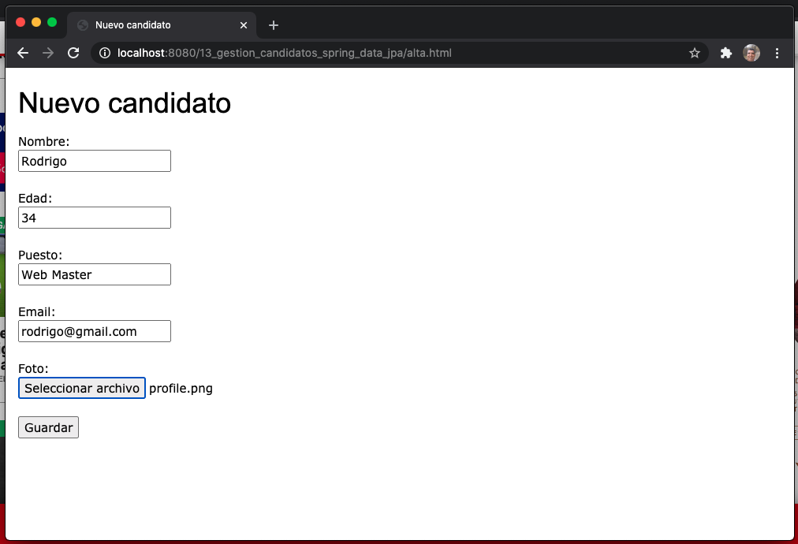
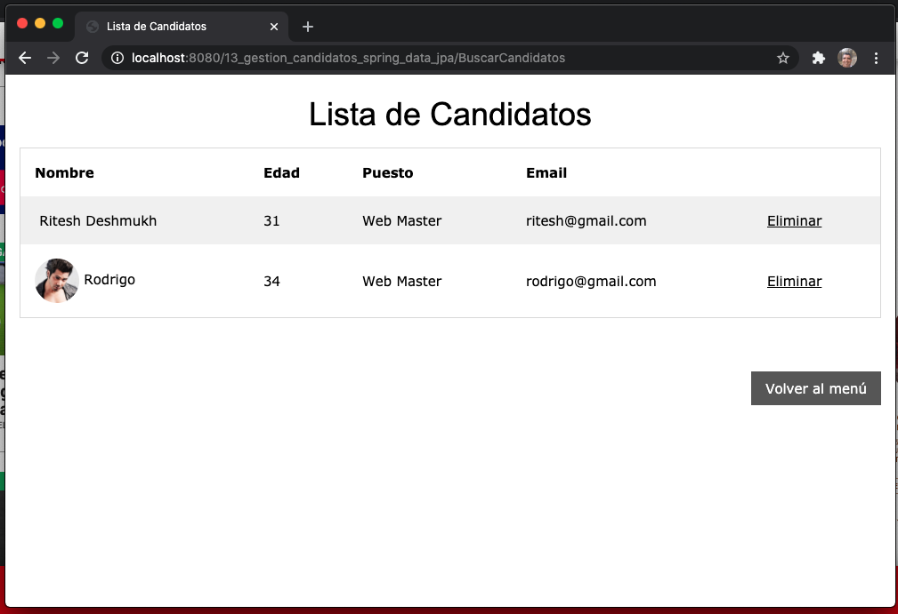
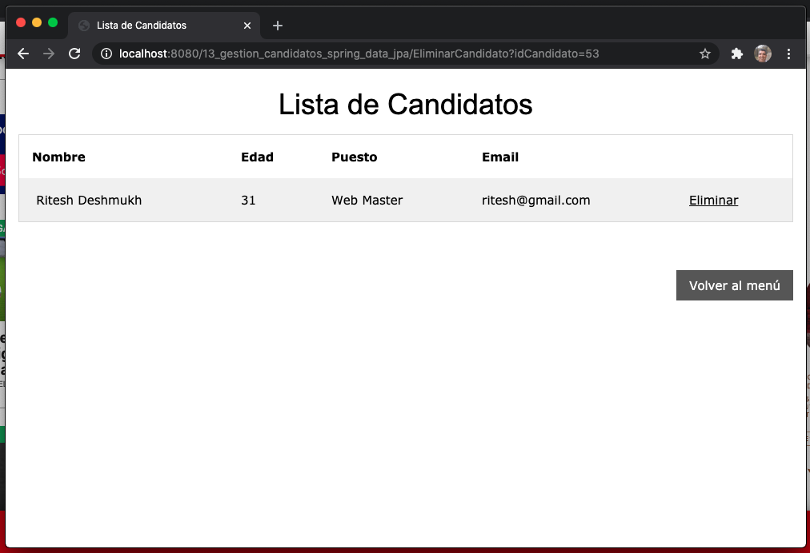


