# 20201125 Miercoles

## Spring MVC

Hasta ahora la parte del Controlador la hemos estado haciendo con JEE, pero graciás a Spring MVC vamos apoder usar Spring en la parte del controller.


La Estructura General del Front Controller se ve en la siguiente imagen. 

1- El Servlet que representa el FronController en Java EE en Spring MVC ya esta desarrollado y se llama `DispatcherServlet` ya no va a ser necesario que nosotros lo códifiquemos. Pero si nos va a tocar configurarlo.

2. En el caso de los Controladores de Acción de JavaEE que eran Servlets, en Spring los vamos a implementar con Clases normales los llamados POJOs. 

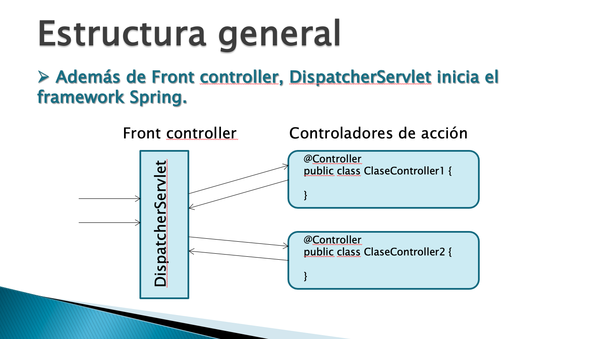

Los métodos Controladores de Acción que van dentro de los POJOs los nombramos como deseemos que recibe los parámetros que tengamos que recibir. Tienen un tipo de devolución `String` donde le devolveremos la página a donde se debe redirigir. 

Los métodos deben estar anotados con `@GetMapping(value="direccion") o @GetMapping(value="direccion") o @RequestMapping(value="direccion")` donde `direccion` es el la dirección asociada al controlador. En el mismo Controlador podemos tener varios métodos diferentes.

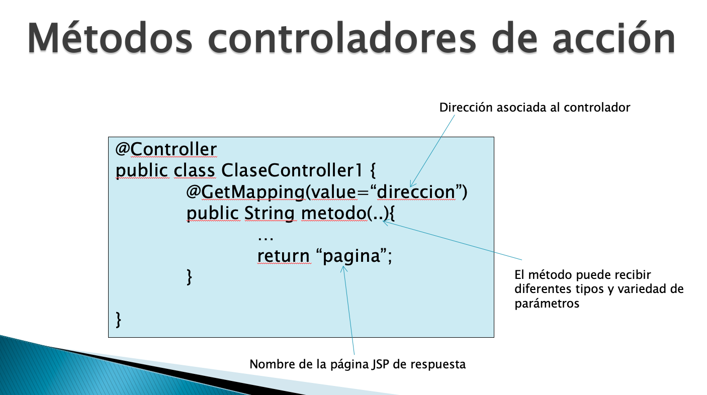


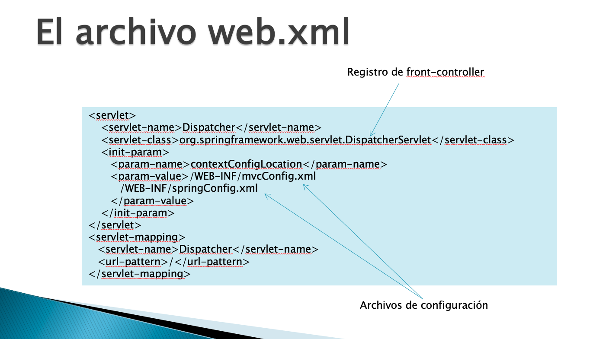

El controlador tiene su propio archivo de configuración llamado `mvcConfig.xml` se le indican varias cosas por ejemplo:

1. Que permita anotaciones
2. Paquete donde estan las clases a instanciar
3. Donde estan las páginas donde se tiene que navegar.
4. Rutas de las páginas estatícas. 

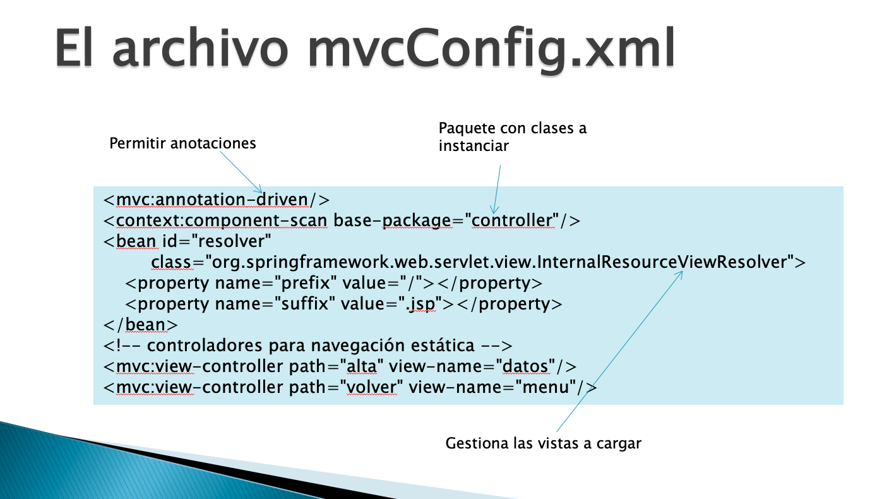

El FrontControler que en Spring es el `DispatcherServlet` recibe todas las peticiones de la aplicación las distribuye al Controlador adecuado y en este debe estar inyectado el objeto de Servicio con `@Autowired` para que se pueda comunicar con esa capa, **PERO SIN SOBREESCRIBIR EL MÉTODO INIT DEL SERVLET EN Java EE, esa parte aquí ya no es necesaria, ya sobra, por esta Clase no es un Servlet**.

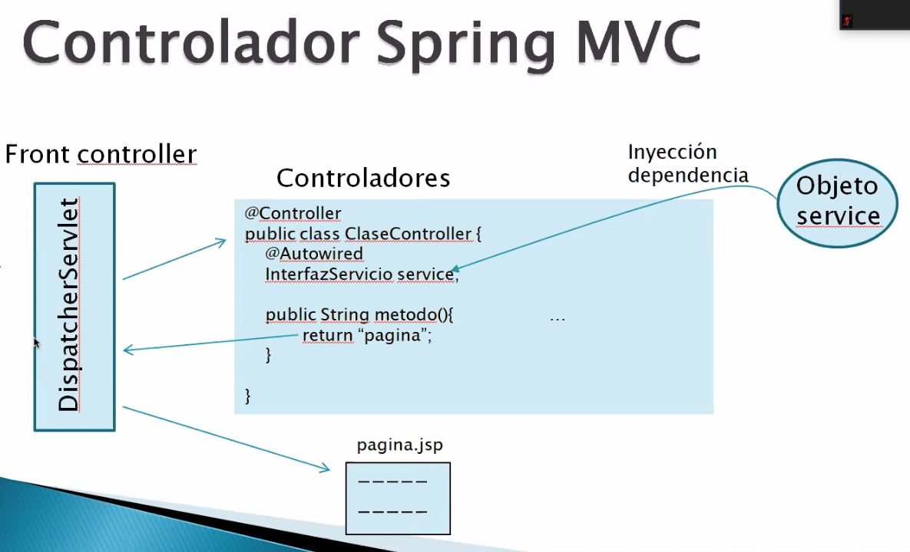

## :computer: `15_ejemplo_spring_mvc` Primer Ejemplo de Spring MVC.

Esta aplicación la comenzamos desde cero y es una página de Login, si la clave es válida nos lleva a una página de bienvenida y si no a una página de error. En este ejemplo no vamos a tener Lógica de Negocio, solo vamos atener Controlador y Vista.

### 01. Mavenizar el Proyecto y meter las dependencias necesarias.

`pom.xml`

```java
<dependencies>
 	<!-- https://mvnrepository.com/artifact/org.springframework/spring-core -->
	<dependency>
	    <groupId>org.springframework</groupId>
	    <artifactId>spring-core</artifactId>
	    <version>5.2.9.RELEASE</version>
	</dependency>
	<!-- https://mvnrepository.com/artifact/org.springframework/spring-context -->
	<dependency>
	    <groupId>org.springframework</groupId>
	    <artifactId>spring-context</artifactId>
	    <version>5.2.9.RELEASE</version>
	</dependency>
	<dependency>
	    <groupId>org.springframework</groupId>
	    <artifactId>spring-web</artifactId>
	    <version>5.2.9.RELEASE</version>
	</dependency> 
	<dependency>
	    <groupId>org.springframework</groupId>
	    <artifactId>spring-webmvc</artifactId>
	    <version>5.2.9.RELEASE</version>
	</dependency>
  </dependencies>
```

La dependencia nueva es `spring-webmvc` para poder usar el módulo Spring MVC.

### 02. Controladores

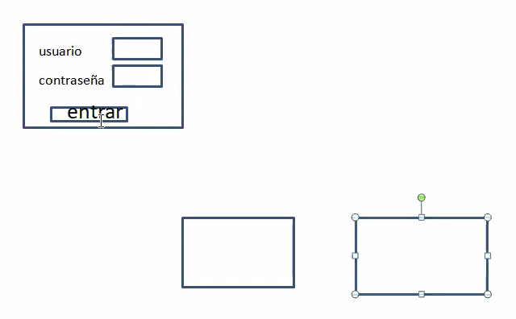

Compo podemos ver en la imagen necesitamos un Controlador que recibe dos párametros y si el acceso es válido nos lleva a una páginaa y sino nos lleva a otra.

`LoginController`

```java
@Controller
public class LoginController {
   @PostMapping("login")
   public String login(@RequestParam("usuario") String usuario, 
      @RequestParam("password") String pwd) {
      if(usuario.equals("admin")&&pwd.equals("admin")) {
         return "bienvenida";
      }else {
         return "error";
      }
   }
}
```

Observaciones de `LoginController`:

* Es una Clase normal un Pojo.
* Anotada con `@Controller` para que Spring la pueda instanciar
* El método retorna un `String`
* El método recibe dos parámetros los cuales se anotan con `@RequestParam("nombre")` con su respectivo nombre y serán asignados en la variable que se define delante de la anotación, son tantos parámetros como se necesiten.
* Dependiendo de la validación se retorna el nombre de una página u otra, no se pone ninguna extensión.
* El método esta anotada con `@PostMapping("login")`, donde lógin es el nombre que debemos usar cuando queramos invocar ese método.

### 03. Las Vistas.

Las vistas deben ser JSPs.

`login.jsp`

```html
<body>
   <div align="center">
      <h1>Página de autenticación</h1>
      <form action="login" method="post">
         Usuario:<input type="text" name="usuario"/><br/><br/>
         Contraseña:<input type="password" name="password"/><br/><br/>
         <input type="submit" value="Entrar"/>
      </form>
   </div>
</body>
```

Los `name` que ponemos aquí deben coincidir con los que pusimos en el Controlador.

Las otras páginas las vamos a meter dentro del `WEB-INF` para que esten protegidas.

`bienvenida.jsp`

```html
<body>
   <h1>Bienvenido sr./a ${param.usuario}</h1>
   <a href="volver">Volver</a>
</body>
```

`error.jsp`

```html
<body>
   <h1>Lo siento, el usuario ${param.usuario} con contraseña ${param.password} no es válido</h1>
   <a href="volver">Volver</a>
</body>
```

### 04. Configuración `web.xml`

Como esta es una aplicación Web necesitamos el `web.xml`. En las aplicaciones anteriores que no usaban Spring MVC usabamos un Listener en este caso que ya usamos Spring MVC esto va a cambiar.

`web.xml`

```html
<?xml version="1.0" encoding="UTF-8"?>
<web-app xmlns:xsi="http://www.w3.org/2001/XMLSchema-instance" xmlns="http://xmlns.jcp.org/xml/ns/javaee" xsi:schemaLocation="http://xmlns.jcp.org/xml/ns/javaee http://xmlns.jcp.org/xml/ns/javaee/web-app_4_0.xsd" version="4.0">
  <display-name>15_ejemplo_spring_mvc</display-name>
  <welcome-file-list>
    <welcome-file>login.jsp</welcome-file>
  </welcome-file-list>
  <servlet>
  	<servlet-name>Dispatcher</servlet-name>
  	<servlet-class>org.springframework.web.servlet.DispatcherServlet</servlet-class>
  	<init-param>
  		<param-name>contextConfigLocation</param-name>
  		<param-value>/WEB-INF/mvcConfig.xml</param-value>
  	</init-param>
  </servlet>
  <servlet-mapping>
  	<servlet-name>Dispatcher</servlet-name>
  	<url-pattern>/</url-pattern>
  </servlet-mapping>
</web-app>
```

Observaciones del `web.xml`:

* Establecemos la página de inicio.
* Lo que haciamos antes del Lisener con Spring MVC nos lo ahorramos.
* En Spring MVC tenemos que registrar el Servlet `DispacherServlet` que como mencionamos anteriormente es el que representa al FronController que ya implementa Spring, pero aquí lo configuramos.
* Una de las funciones del `DispacherServlet` es arrancar Spring por eso ya esta demas el Listener que era el que tenia esa función antes.
* Tiene un parámetro `contextConfigLocation` donde indicamos la ubicación y nombre de los archivos de configuración, en este caso como no tenemos parte de Lógica de Negocios solo vamos a configurar la parte del Controlador.
* `mvcConfig.xml` Define la configuración del Controlador.
* `springConfig.xml` Define la configuración de la Lógica de Negocio.
* El `servlet-mapping` nos permite mapear cualquier petición `/` la va a gestionar el `Dispacher`.

### 04. Configuración `mvcConfig.xml`

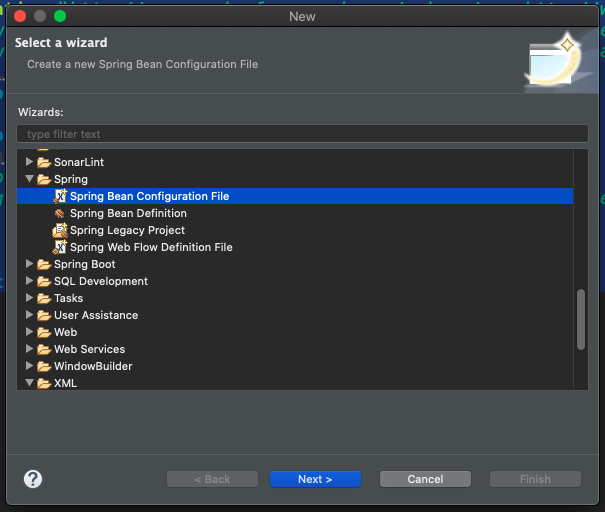
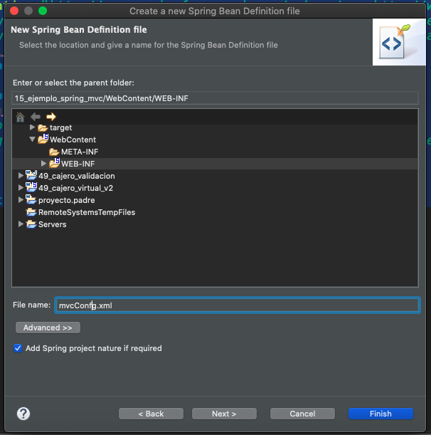
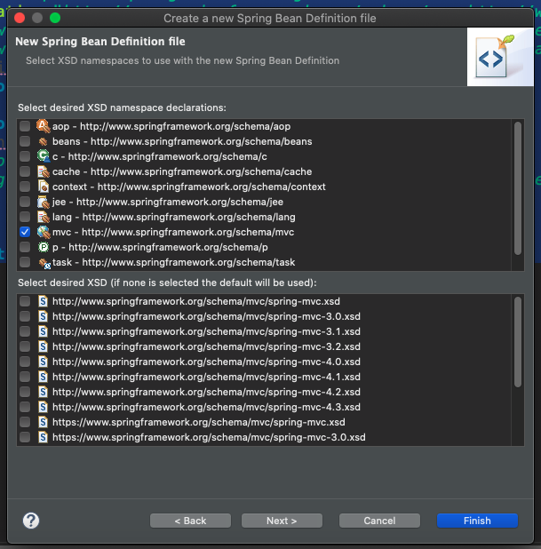


Nuestro archivo nos va a quedar así:

`mvcConfig.xml`

```html
<?xml version="1.0" encoding="UTF-8"?>
<beans xmlns="http://www.springframework.org/schema/beans"
	xmlns:xsi="http://www.w3.org/2001/XMLSchema-instance"
	xmlns:mvc="http://www.springframework.org/schema/mvc"
	xmlns:context="http://www.springframework.org/schema/context"
	xsi:schemaLocation="http://www.springframework.org/schema/mvc http://www.springframework.org/schema/mvc/spring-mvc-4.3.xsd
		http://www.springframework.org/schema/beans http://www.springframework.org/schema/beans/spring-beans.xsd
		http://www.springframework.org/schema/context http://www.springframework.org/schema/context/spring-context-4.3.xsd">
   <!-- 1. Habilite configuración mediante anotaciones -->
   <mvc:annotation-driven/>
	
   <context:component-scan base-package="controller"/>
   <!-- objeto encargado de resolver la navegación -->	
   <bean id="resolver"
	class="org.springframework.web.servlet.view.InternalResourceViewResolver">
	<property name="prefix" value="/WEB-INF/"></property>
	<property name="suffix" value=".jsp"></property>
   </bean>
   <mvc:view-controller path="volver" view-name="../login"/>
</beans>
```

Observaciones de `mvcConfig.xml`

1. Habilite configuración mediante anotaciones
2. Indicar el paquete donde se van a escanear las Clases para el controler.
3. Objeto encargado de resolver la navegación
4. Navegación de páginas estatícas.

### 05. Probar la Aplicación

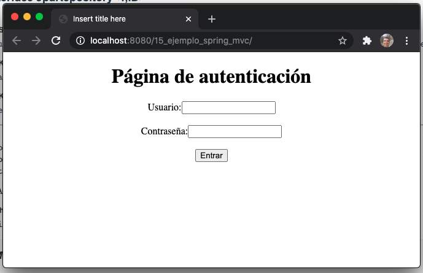
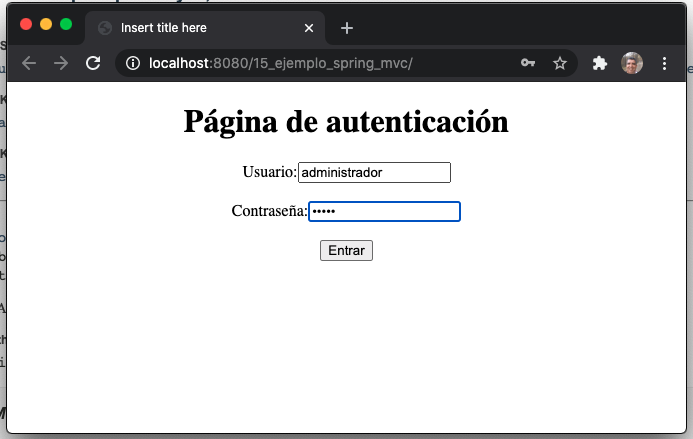
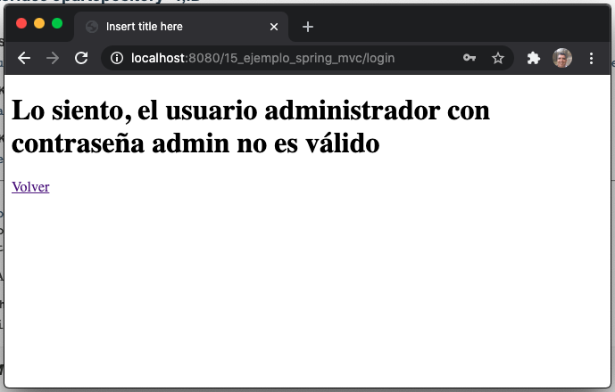
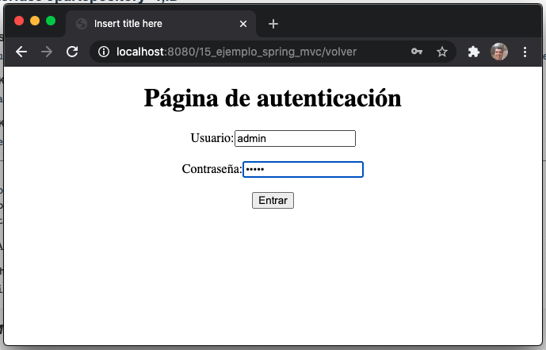
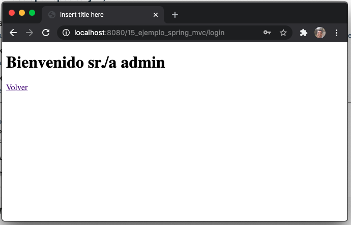

## :computer: `16_buscador_spring_mvc` Segundo Ejemplo de Spring MVC.

Partiendo de `02_buscador_spring` vamos a generar una nueva versión con Spring MVC. Aquí ya tenemos una Capa de Negocio.

### 01. Añadir la Dependencia `spring-webmvc` en el `pom.xml`

`pom.xml`

```html
<dependency>
   <groupId>org.springframework</groupId>
   <artifactId>spring-webmvc</artifactId>
   <version>5.2.9.RELEASE</version>
</dependency>
<dependency>
   <groupId>javax.servlet</groupId>
   <artifactId>jstl</artifactId>
   <version>1.2</version>
</dependency>
```

### 02. Borrar el Paquete Servlets y Remplazarlo por un Paquete Controller con los Controladores.

`LoginController`

```java
@Controller
public class LoginController {
   
   @PostMapping("doLogin")
   //@RequestMapping("doLogin") Valida para Post o Get
   public String login(@RequestParam("usuario") String usuario, 
      		@RequestParam("password") String pwd,
		HttpSession sesion) {
      if(usuario.equals("admin")&&pwd.equals("admin")) {
         sesion.setAttribute("usuario", usuario);
	 return "buscador";
      }else {
         return "error";
      }
   }
}
```

Esta Clase `LoginController` es muy parecida al controlador del ejercicio anterior. Con los siguientes cambios:

1. Hemos añadido un parámetro `HttpSession sesion` que nos va a permitir poner en un atributo de sesión al usuario para poderlo pintar en las siguientes páginas.
2. Hemos cambiado la página de `bienvenida` por la de `buscar`.

`BuscadorController`

```java
@Controller
public class BuscadorController {
   @Autowired
   BuscadorService service;
   
   @PostMapping("doBuscar")
   public String buscar(@RequestParam("tema") String palabra,HttpServletRequest request) {
      List<Item> items=service.buscarItems(palabra);
      request.setAttribute("items", items);
      return "resultados";
		
      //return "forward:/doLogin"; Indica a  a Dispacher que transfiera a otra petición
   }
}
````

Observaciones de la Clase `BuscadorController`:

* En esta Clase ya inyectamos la capa de Servicio con `@Autowired BuscadorService service;`.


