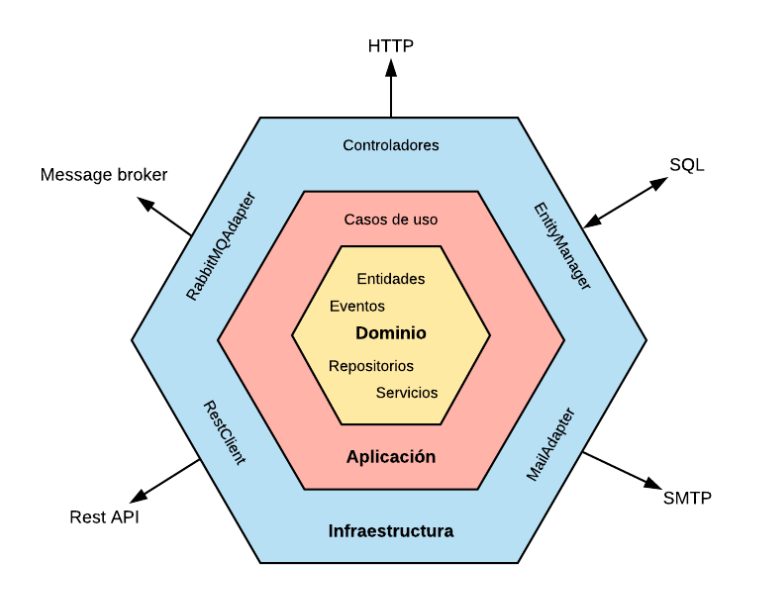
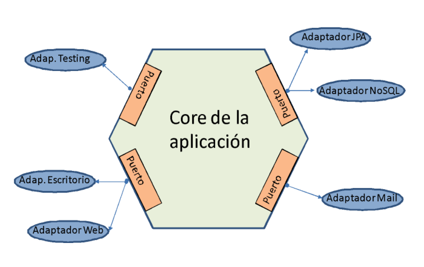
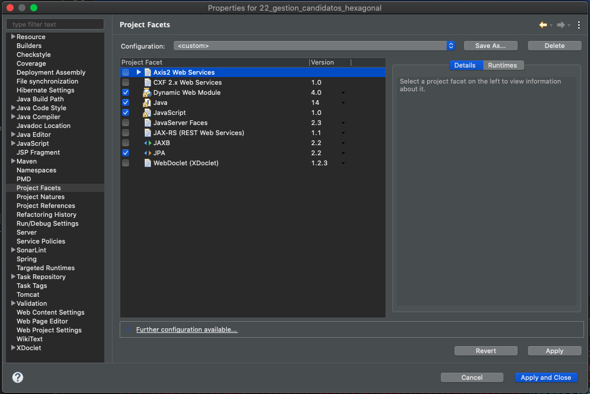
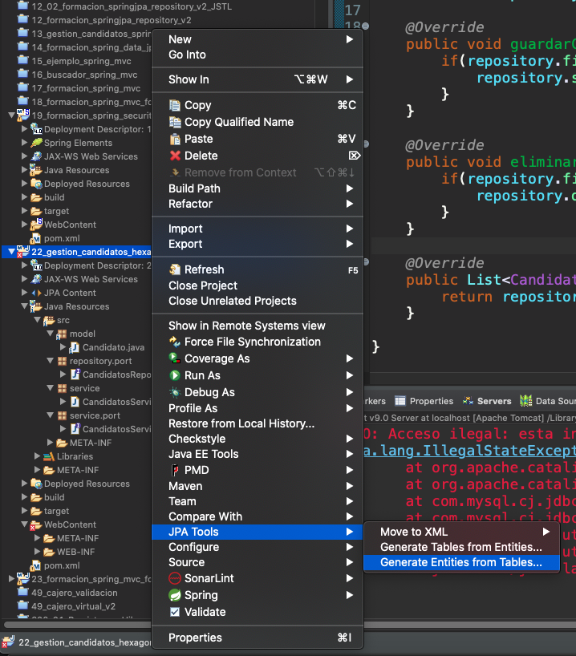
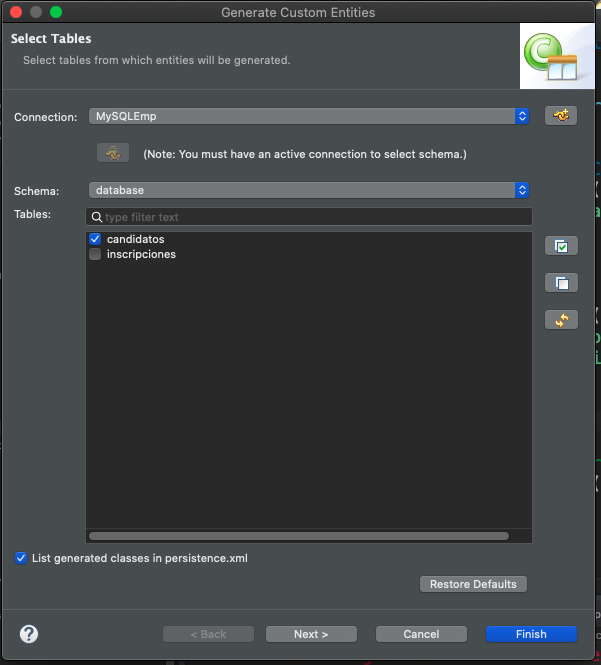
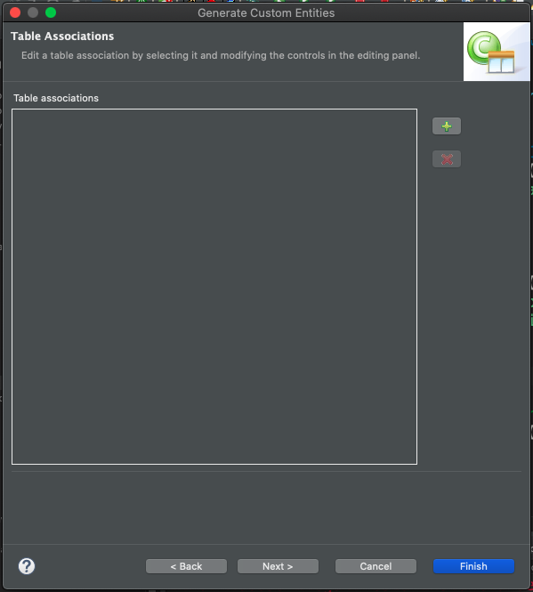
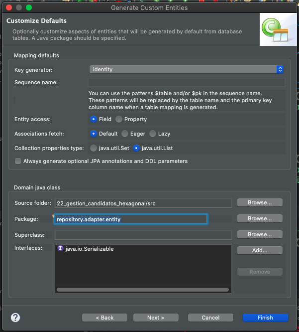
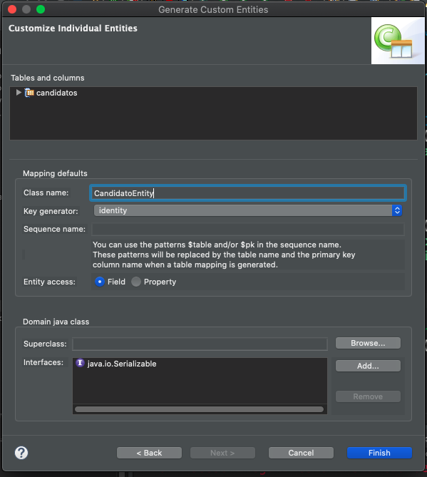

# 20201130 Lunes

## Arquitectura Hexagonal

La arquitectura hexagonal, también conocida como arquitectura de puertos y adaptadores, tiene como objetivo aislar toda la lógica de aplicación del exterior, haciendo independiente de mecanismos de entrada y salida, sistemas de almacenamiento de datos, políticas de seguridad, etc. 

### El Hexágono

El esquema de esta arquitectura se representa en forma de hexágono, no porque tenga que tener seis lados exactamente, sino porque es una forma de marcar la frontera entre el interior (la lógica de negocio) y el exterior.

En el centro del hexágono encontramos el dominio, formado por las entidades que representan nuestro modelo de datos y la definición de los repositorio de datos y funcionalidades de la aplicación (interfaces de servicio).

Por encima del dominio están los **casos de uso o lógica de aplicación**, que no son más que implementaciones de las interfaces de servicio con la lógica de aplicación. Todo ello, independizado de los mecanismos utilziados para el acceso a los datos, así como de la interacción con los usuarios.

Por encima de los casos de uso encontramos los adaptadores, que ya contienen detalles específicos de la infraestructura. Estos elementos se consideran ya fuera del hexagono al ser dependientes del exterior.



### Puertos y Adaptadores

A la arquitectura hexagonal se le conoce también como **puertos y adaptadores** porque esta basada en dicho concepto.

Un puerto no es más que la especificación sobre como el exterior intereactúa con la aplicación. A nivel de código, los puertos se definen mediante interfaces. En este sentido distinguimos dos tipos de puertos:

* **Primarios**. Se trata de las interfaces que definen  la funcionalidad del sistema, podriamos decir que son las interfaces de servicio y son implementadas en el interior del hexágono. Estas interfaces son **usadas por los adaptadores primarios**. 

* **Secundarios**. Sirven de interfaz de salida para comunicarse con sistemas externos, como bases de datos. Estas interfaces son **implementadas por los adaptadores secundarios**.

Un adaptador es una **implementación de la interfaz del puerto** para una infraestructura específica. Por ejemplo, un ejemplo de adaptador sería una clase que implementase la interfaz secundaria de datos para proporcionar acceso a una capa de persistencia JPA. Otro ejemplo sería un controlador REST, que utilizase el puerto de la interfaz de servicio para exponer la funcionalidad al exterior en forma de recursos Web.

Un puerto puede ser implementado por múltiples adaptadores.

La siguiente imagen muestra otra visión de la arquitectura hexagonal, más orientada al concepto de puertos y adaptadores:



### Otras Arquitecturas

Existen otras variantes de la arquitectura hexagonal, como son:

* **Aquitectura de capas o de cebolla**. Consiste en definir la aplicación en forma de capas, de dentro hacia afuera, donde las capas más externas dependen de las más internas, pero nunca al revés, siguiendo el principio de inversión de dependencias.
En la capa central se encuentra el dominio o core, por encima de este el repositorio y en una tercera capa superior la lógica de negocio. En la capa más externa tendríamos la parte de la aplicación que se comunica con el exterior (base de datos, usuario, ...)

* **Arquitectura limpia**. No es más que una unión de la arquitectura de capas y la hexagonal que se basa en el mismo principio de abstraer la aplicación de los detalles de comunicación con el exterior.

## :computer: `22_gestion_candidatos_hexagonal`

Vamos a crear un proyecto desde el inicio pero tiene que hacerla funcionalidad que teniamos en el proyecto `06_gestion_candidatos_spring_jpa`.

### 01. Mavenizar el proyecto y poner las Dependencias.

```html
<parent>
   <groupId>proyectos.padre.grupo</groupId>
   <artifactId>proyecto.padre</artifactId>
   <version>0.0.1-SNAPSHOT</version>
</parent>
```

### 02. Modelo de Datos

La creación de nuestro Modelo de Datos va a ser un poco diferente ya que antes estaba basado en nuestra Base de Datos y en base a ello realizabamos las Entidades. Sabemos que hay una BD pero no nos vamos a condicionar a ella. Sabemos que vamos a trabajar con candidatos entonces debo pensar que atributos tiene que tener un `Candidato`, por ejemplo el campo `idCandidato` no es revelante representalo como un atributo de la clase `Candidato`.

Vamos a crear la **Clase Candidato**.

`Candidato.java`

```java
package model;

public class Candidato {
	
   public int codigoCandidato;
   private String nombre;
   private String puesto;
   private String foto;
   private String email;
   private int edad;
	
   public Candidato() {
      super();
   }

   public Candidato(int codigoCandidato, String nombre, String puesto, String foto, String email, int edad) {
      super();
      this.codigoCandidato= codigoCandidato;
      this.nombre = nombre;
      this.puesto = puesto;
      this.foto = foto;
      this.email = email;
      this.edad = edad;	
   }
  
   public int getCodigoCandidato() {
      return codigoCandidato;
   }

   public void setCodigoCandidato(int codigoCandidato) {
      this.codigoCandidato = codigoCandidato;
   }
	
   public String getNombre() {
      return nombre;
   }
   public void setNombre(String nombre) {
      this.nombre = nombre;
   }
   public String getPuesto() {
      return puesto;
   }
   public void setPuesto(String puesto) {
      this.puesto = puesto;
   }
   public String getFoto() {
      return foto;
   }
   public void setFoto(String foto) {
      this.foto = foto;
   }
   public String getEmail() {
      return email;
   }
   public void setEmail(String email) {
      this.email = email;
   }
   public int getEdad() {
      return edad;
   }
   public void setEdad(int edad) {
      this.edad = edad;
   }
}
```

Ya tengo el Modelo de Datos, no es una Entidad es una clase común y corriente Java.

### 03. Repository

En la capa de Repository lo que vamos a tener es una Interface. El repository no se implementa como parte del Nucleo de la aplicaión. El Repository aquí lo que ofrece es un ***Puerto***, implementado con una Interface. 

Aquí debo pensar a nivel de datos sin pensar en la BD que debe tener mi aplicación.

* Alta de Candidato
* Eliminar Candidato por códigoCandidato
* Recuperar todos los Candidatos
* Buscar Candidato por Código.

`CandidatoRepository.java`

```java
package repository.port;

import java.util.List;

import model.Candidato;

public interface CandidatosRepository {
   void saveCandidato(Candidato candidato);
   void deleteCandidatoByCodigo(int codigo);
   List<Candidato> findAll();
   Candidato findByCodigo(int codigo);
   Candidato findByEmail(String email);
}
```

### 04. Capa de Servicio

En la Capa de Servicio ya puedo contar con los métodos desde el Repository aun que no hayan sido implementados pero con lo que tengo me basta para crear la Capa de Servicio.

Empezamos por desarrollar la Interface, lo que conoceremos como un ***Puerto***. 
Esta es una ***Interface primaria***, la que se va a utilizar en el Controller  

`CandidatosService`

```java
package service.port;

import java.util.List;

import model.Candidato;

public interface CandidatosService {
   void guardarCandidato(Candidato candidato);
   void eliminarCandidato(int codigoCandidato);
   List<Candidato> obtenerCandidatos();
}
```

Ahora vamos a implementar esta Interface con la siguiente Clase, que será instancia por Spring y donde inyectaremos el Repository. **Esta Implementación no la hacemos como parte del NUCLEO sino como parte de los ADAPTADORES**. En esta clase no se maneja la Transaccionalidad de JPA por que nos estariamos vinculando a ella.

`CandidatosServiceImpl`

```java
package service;

import java.util.List;

import org.springframework.beans.factory.annotation.Autowired;
import org.springframework.stereotype.Service;

import model.Candidato;
import repository.port.CandidatosRepository;
import service.port.CandidatosService;

@Service
public class CandidatosServiceImpl implements CandidatosService {

   @Autowired
   CandidatosRepository repository;
	
   @Override
   public void guardarCandidato(Candidato candidato) {
      if(repository.findByEmail(candidato.getEmail())!=null) {
         repository.saveCandidato(candidato);
      }
   }

   @Override
   public void eliminarCandidato(int codigoCandidato) {
      if(repository.findByCodigo(codigoCandidato)!=null) {
         repository.deleteCandidatoByCodigo(codigoCandidato);
      }
   }

   @Override
   public List<Candidato> obtenerCandidatos() {
      return repository.findAll();
   }

}
```

**HASTA AQUÍ HEMOS TERMINADO EL NUCLEO O CORE DE LA APLICACIÓN**

### 05. Adaptadores

Aquí ya nos toca pensar en el acceso a datos. ***Lo que antes haciamos al principio lo vamos a realizar en esta etapa***.
Hay que crear las Entidades y la Clase que implemente la Capa Repository, donde podemos usar por ejemplo JPA o Spring Data JPA.

Como vamos a usar el asistente para crear la Entidad incluimos la característica JPA. 



Vamos a Generar las Entidades



Seleccionamos la tabla de la cual vamos a generar la Entidad.



No tenemos asociaciones en esta app.





Es importante pensar en que paquete vamos a meter esta Entidad, antes siempre lo haciamos en `model` pero la entidad ya no va a pertencecer al Modelo de Datos, la propuesta es `repository.adapter.entity` por que forma parte del adaptador del repositirio, la ponemos dentro del subpaquete `entity` 

Antes simplemente llamabamos a la Entidad `Candidato` pero ya tenemos una clase del modelo con ese nombre por lo que será mejor llamar a las Entidades como `CandidatoEntity`



Al dar Finish se me genera la Entidad.

`CandidatoEntity.java`

```java
package repository.adapter.entity;

import java.io.Serializable;
import javax.persistence.*;


/**
 * The persistent class for the candidatos database table.
 * 
 */
@Entity
@Table(name="candidatos")
@NamedQuery(name="CandidatoEntity.findAll", query="SELECT c FROM CandidatoEntity c")
public class CandidatoEntity implements Serializable {
   private static final long serialVersionUID = 1L;

   @Id
   @GeneratedValue(strategy=GenerationType.IDENTITY)
   private int idCandidato;

   private int edad;

   private String email;

   private String foto;

   private String nombre;

   private String puesto;

   public CandidatoEntity() {
   }

   public int getIdCandidato() {
      return this.idCandidato;
   }

   public void setIdCandidato(int idCandidato) {
      this.idCandidato = idCandidato;
   }

   public int getEdad() {
      return this.edad;
   }

   public void setEdad(int edad) {
      this.edad = edad;
   }

   public String getEmail() {
      return this.email;
   }

   public void setEmail(String email) {
      this.email = email;
   }

   public String getFoto() {
      return this.foto;
   }

   public void setFoto(String foto) {
      this.foto = foto;
   }

   public String getNombre() {
      return this.nombre;
   }

   public void setNombre(String nombre) {
      this.nombre = nombre;
   }

   public String getPuesto() {
      return this.puesto;
   }

   public void setPuesto(String puesto) {
      this.puesto = puesto;
   }

}
```

**QUITAR LAS CARACTERISTICAS JPA Y EL ARCHIVO `persistence.xml`**.

### 06. Adaptador JPA

Vamos a implementación de la Interface `CandidatosRepository` La Clase `CandidatosRepositoryJpaImp` la vamos a meter en el paquete `repository.adapter.jpa` va a estar anotada con `@Repository`. Aquí nos vamos a encontrar con un inconveniente por un lado se trabaja con la Clase del Modelo `Candidato`, pero la persistencia la tenemos que hacer sobre la Entidad `CandidatoEntity`. Por lo que vamos a necesitar una clase de Utilidades para que convierta de `Candidato` a `CandidatoEntity` y de `CandidatoEntity` a `Candidato`, lo vamos a crear en el mismo paquete donde esta la Entidad.

`Utilidades`

```java
package repository.adapter.entity;

import model.Candidato;

public class Utilidades {
   public static Candidato candidatoBuilder(CandidatoEntity entity) {
      return new Candidato(entity.getIdCandidato(),
                           entity.getNombre(),
                           entity.getPuesto(),
                           entity.getFoto(),
                           entity.getEmail(),
                           entity.getEdad());
   }
	
   public static CandidatoEntity candidatoEntityBuilder(Candidato candidato) {
      CandidatoEntity entity=new CandidatoEntity();
      //Esto por no tener Constructor con parámetros
      entity.setIdCandidato(candidato.getCodigoCandidato());
      entity.setNombre(candidato.getNombre());
      entity.setPuesto(candidato.getPuesto());
      entity.setFoto(candidato.getFoto());
      entity.setEmail(candidato.getEmail());
      entity.setEdad(candidato.getEdad());
      return entity;
   }
}
```

Una vez que ya tenemos esta clase de Utilidades ya podemos implementar nuestra Clase `CandidatosRepositoryJpaImpl`.

`CandidatosRepositoryJpaImpl`

```java
package repository.adapter.jpa;

import java.util.List;
import java.util.stream.Collectors;

import javax.persistence.EntityManager;
import javax.persistence.PersistenceContext;
import javax.persistence.TypedQuery;

import org.springframework.stereotype.Repository;
import org.springframework.transaction.annotation.Transactional;

import model.Candidato;
import repository.adapter.entity.CandidatoEntity;
import repository.adapter.entity.Utilidades;
import repository.port.CandidatosRepository;

@Repository
public class CandidatosRepositoryJpaImpl implements CandidatosRepository {

   @PersistenceContext(unitName = "empresaPU")
   EntityManager em;
	
   @Transactional
   @Override
   public void saveCandidato(Candidato candidato) {
      //transformamos el objeto Candiato en una entidad para hacer la persistencia
      em.persist(Utilidades.candidatoEntityBuilder(candidato));	
   }
   @Transactional
   @Override
   public void deleteCandidatoByCodigo(int codigo) {
      CandidatoEntity entity=em.find(CandidatoEntity.class, codigo);
      if(entity!=null) {
         em.remove(entity);
      }
		
   }

   @Override
   public List<Candidato> findAll() {
      TypedQuery<CandidatoEntity> query=em.createNamedQuery("CandidatoEntity.findAll",CandidatoEntity.class);
      List<CandidatoEntity> entidades=query.getResultList();
      return entidades
               .stream()
               .map(entity->Utilidades.candidatoBuilder(entity))
               .collect(Collectors.toList());
   }

   @Override
   public Candidato findByCodigo(int codigo) {
      CandidatoEntity entity=em.find(CandidatoEntity.class, codigo);
      if(entity!=null) {
         return Utilidades.candidatoBuilder(entity);
      }
      return null;
   }

   @Override
   public Candidato findByEmail(String email) {
      String jpql="select c from CandidatoEntity c where c.email=?1";
      TypedQuery<CandidatoEntity> query=em.createQuery(jpql,CandidatoEntity.class);
      query.setParameter(1, email);
      List<CandidatoEntity> entities=query.getResultList();
      return entities.size()>0?Utilidades.candidatoBuilder(entities.get(0)):null;
   }
}
```

### 07. Adaptador Web

Esto es implementado con nuestros Controladores o Servlets. Lo vamos a meter todo dentro del paquete `adapter.web.controller`. (Los copiamos del Proyecto `13_gestion_candidatos_spring_data_jpa`)

`AltaCandidato`

```java
package adapter.web.controller;

import java.io.IOException;

import javax.servlet.ServletConfig;
import javax.servlet.ServletException;
import javax.servlet.annotation.MultipartConfig;
import javax.servlet.annotation.WebServlet;
import javax.servlet.http.HttpServlet;
import javax.servlet.http.HttpServletRequest;
import javax.servlet.http.HttpServletResponse;
import javax.servlet.http.Part;

import org.springframework.beans.factory.annotation.Autowired;
import org.springframework.web.context.support.SpringBeanAutowiringSupport;

import model.Candidato;
import service.port.CandidatosService;

@MultipartConfig //permite al servlet procesar objetos Part (objetos binarios)
@WebServlet("/AltaCandidato")
public class AltaCandidato extends HttpServlet {
	
	private static final long serialVersionUID = 1L;

	@Autowired
	CandidatosService service;
	
	
	@Override
	public void init(ServletConfig config) throws ServletException {
		//le informa al servidor de aplicaciones que Spring va a realizar inyección
		//de objetos en este servlet
		SpringBeanAutowiringSupport.processInjectionBasedOnCurrentContext(this);
		super.init(config);
	}
	
	protected void service(HttpServletRequest request, HttpServletResponse response) throws ServletException, IOException {
		
		
		String nombre=request.getParameter("nombre");
		int edad=Integer.parseInt(request.getParameter("edad"));
		String puesto=request.getParameter("puesto");
		String email=request.getParameter("email");
		Part foto=request.getPart("foto");
		
		
		String nombreFichero=obtenerNombreFichero(foto);
		guardarFicheroEnServidor(request,foto,nombreFichero);
		Candidato cand = new Candidato(0,nombre,puesto,nombreFichero,email,edad);
		service.guardarCandidato(cand);
		
		request.getRequestDispatcher("menu.html").forward(request, response);

	}
	
	private String obtenerNombreFichero(Part part) {
		for (String cd : part.getHeader("content-disposition").split(";")) { 
			if (cd.trim().startsWith("filename")) { 
				String fileName = cd.substring(cd.indexOf('=') + 1).trim().replace("\"", ""); 
				return fileName.substring(fileName.lastIndexOf('/') + 1).substring(fileName.lastIndexOf('\\') + 1); // MSIE fix. 
			} 
		} 
		return null; 
	}
	
	private void guardarFicheroEnServidor(HttpServletRequest request, Part part, String nombreFichero) {
		String url=request.getServletContext().getRealPath("/");
		try {
			//part.write(url+"\\"+nombreFichero);		//Windows
			part.write(url+"/"+nombreFichero);			//Mac
		} catch (IOException e) {
			e.printStackTrace();
		}
	}
	
}
```

`BuscarCandidatos`

```java
package adapter.web.controller;

import java.io.IOException;

import javax.servlet.ServletConfig;
import javax.servlet.ServletException;
import javax.servlet.annotation.WebServlet;
import javax.servlet.http.HttpServlet;
import javax.servlet.http.HttpServletRequest;
import javax.servlet.http.HttpServletResponse;

import org.springframework.beans.factory.annotation.Autowired;
import org.springframework.web.context.support.SpringBeanAutowiringSupport;

import service.port.CandidatosService;


@WebServlet("/BuscarCandidatos")
public class BuscarCandidatos extends HttpServlet {
	private static final long serialVersionUID = 1L;

	@Autowired
	CandidatosService service;
	
	@Override
	public void init(ServletConfig config) throws ServletException {
		//le informa al servidor de aplicaciones que Spring va a realizar inyección
		//de objetos en este servlet
		SpringBeanAutowiringSupport.processInjectionBasedOnCurrentContext(this);
		super.init(config);
	}
	
	protected void service(HttpServletRequest request, HttpServletResponse response) throws ServletException, IOException {
		request.setAttribute("candidatos", service.obtenerCandidatos());
		request.getRequestDispatcher("candidatos.jsp").forward(request, response);
	}

}
```

`EliminarCandidato`

```java
package adapter.web.controller;

import java.io.IOException;

import javax.servlet.ServletConfig;
import javax.servlet.ServletException;
import javax.servlet.annotation.WebServlet;
import javax.servlet.http.HttpServlet;
import javax.servlet.http.HttpServletRequest;
import javax.servlet.http.HttpServletResponse;

import org.springframework.beans.factory.annotation.Autowired;
import org.springframework.web.context.support.SpringBeanAutowiringSupport;

import service.port.CandidatosService;

@WebServlet("/EliminarCandidato")
public class EliminarCandidato extends HttpServlet {
	private static final long serialVersionUID = 1L;

	@Autowired
	CandidatosService service;
	
	@Override
	public void init(ServletConfig config) throws ServletException {
		//le informa al servidor de aplicaciones que Spring va a realizar inyección
		//de objetos en este servlet
		SpringBeanAutowiringSupport.processInjectionBasedOnCurrentContext(this);
		super.init(config);
	}
	
	protected void service(HttpServletRequest request, HttpServletResponse response) throws ServletException, IOException {
		
		int idCandidato=Integer.parseInt(request.getParameter("idCandidato"));
		service.eliminarCandidato(idCandidato);
		request.getRequestDispatcher("BuscarCandidatos").forward(request, response);
	}
}

```

### 08. Vistas

(Los copiamos del Proyecto `13_gestion_candidatos_spring_data_jpa`)

`menu.html`

```html
<!DOCTYPE html>
<html>
<head>
<meta charset="ISO-8859-1">
<title>Menú</title>
<link rel="stylesheet" type="text/css" href="css/w3.css">
</head>
<body>
   <div align="center">
      <h1 class="w3-jumbo">Candidatos</h1>
      <p class="w3-xlarge w3-text-dark-grey">Los mejores candidatos del mercado</p>
  	  <a href="alta.html" class="w3-button w3-dark-grey">Nuevo Candidato</a>
      <a href="BuscarCandidatos" class="w3-button w3-dark-grey">Mostrar Candidatos</a>
   </div>
</body>
</html>
```

`alta.html`

```html
<!DOCTYPE html>
<html>
<head>
<meta charset="ISO-8859-1">
<title>Nuevo candidato</title>
<link rel="stylesheet" type="text/css" href="css/w3.css">
</head>
<body>
    <div class="w3-padding">
		<h1>Nuevo candidato</h1>
		<form action="AltaCandidato" method="post" enctype="multipart/form-data">	
			<label for="nombre">Nombre:</label><br>
			<input type="text" name="nombre" placeholder="Introduce tu nombre" required="required"><br/><br/>
			<label for="edad">Edad:</label><br>
			<input type="number" name="edad" placeholder="Introduce tu edad" required="required"><br/><br/>
			<label for="puesto">Puesto:</label><br>
			<input type="text" name="puesto" placeholder="Introduce tu puesto" required="required"><br/><br/>
			<label for="email">Email:</label><br>
			<input type="email" name="email" placeholder="Introduce tu email" required="required"><br/><br/>
			<label for="foto">Foto:</label><br>
			<input type="file" name="foto" value="Buscar" accept="image/*"/><br/><br/>
			
			<input type="submit" value="Guardar">	
		</form>
	</div>
</body>
</html>
```

`candidatos.jsp`

```html
<%@ page language="java" contentType="text/html; charset=ISO-8859-1"
    pageEncoding="ISO-8859-1" import="java.util.List, model.Candidato"%>
<!DOCTYPE html>
<html>
<head>
<meta charset="ISO-8859-1">
<title>Lista de Candidatos</title>
<link rel="stylesheet" type="text/css" href="css/w3.css">
</head>
<body>
	<%
		
		  List<Candidato> empleados = (List<Candidato>)request.getAttribute("candidatos");
		  if (empleados.size() > 0){
	%>
	    <div align="center" class="w3-padding">
	    	<h1>Lista de Candidatos</h1>
			<table>
				<tr>
					<th>Nombre</th>
					<th>Edad</th>
					<th>Puesto</th>
					<th>Email</th>
					<th></th>
				</tr>
				<%
				for(int i=0;i<empleados.size();i++){ %>
				   <tr>
				      <td>"> <span style=""><%=empleados.get(i).getNombre()%></span></td>
					  <td><%=empleados.get(i).getEdad()%></td>	
					  <td><%=empleados.get(i).getPuesto()%></td>
					  <td><%=empleados.get(i).getEmail()%></td>
					  <td><a href="EliminarCandidato?idCandidato=<%=empleados.get(i).getCodigoCandidato()%>">Eliminar</a></td>
				   </tr>
				<%}%>
			</table>
		</div>
	  <%}else%>
	<br><br>
	<div align="right" class="w3-padding">
		<a href="menu.html" class="w3-button w3-dark-grey">Volver al menú</a>
	</div>
</body>
</html>
```

### 09. Configuración

Los copiamos del Proyecto `13_gestion_candidatos_spring_data_jpa` tanto el `web.xml` y el `springConfig.xml`

`web.xml`

```html
<?xml version="1.0" encoding="UTF-8"?>
<web-app xmlns:xsi="http://www.w3.org/2001/XMLSchema-instance" xmlns="http://xmlns.jcp.org/xml/ns/javaee" xsi:schemaLocation="http://xmlns.jcp.org/xml/ns/javaee http://xmlns.jcp.org/xml/ns/javaee/web-app_4_0.xsd" version="4.0">
  <display-name>03_gestion_candidatos_basedatos</display-name>
  <welcome-file-list>
    <welcome-file>menu.html</welcome-file>
  </welcome-file-list>
  <context-param>
  	<param-name>contextConfigLocation</param-name>
  	<param-value>/WEB-INF/springConfig.xml</param-value>
  </context-param>
  <listener>
  	<listener-class>org.springframework.web.context.ContextLoaderListener</listener-class>
  </listener>
</web-app>
```

`springConfig.xml`

```html
<?xml version="1.0" encoding="UTF-8"?>
<beans xmlns="http://www.springframework.org/schema/beans"
	xmlns:xsi="http://www.w3.org/2001/XMLSchema-instance"
	xmlns:context="http://www.springframework.org/schema/context"
	xmlns:jee="http://www.springframework.org/schema/jee"
	xmlns:tx="http://www.springframework.org/schema/tx"
	xmlns:jpa="http://www.springframework.org/schema/data/jpa"
	xsi:schemaLocation="http://www.springframework.org/schema/jee http://www.springframework.org/schema/jee/spring-jee-4.3.xsd
		http://www.springframework.org/schema/beans http://www.springframework.org/schema/beans/spring-beans.xsd
		http://www.springframework.org/schema/context http://www.springframework.org/schema/context/spring-context-4.3.xsd
		http://www.springframework.org/schema/data/jpa http://www.springframework.org/schema/data/jpa/spring-jpa-1.11.xsd
		http://www.springframework.org/schema/tx http://www.springframework.org/schema/tx/spring-tx-4.3.xsd">

	<!-- 1. Hailite la configuración mediante anotaciones -->
	<context:annotation-config />
	
	<!-- 2. Escanee los paquetes en los que se encuentran las clases que debe instanciar -->
	<context:component-scan base-package="service,repository.adapter.jpa" />

	<!-- DataSources propios de Spring -->
	<bean id="data" name="data"
		class="org.springframework.jdbc.datasource.DriverManagerDataSource">
		<property name="url"
			value="jdbc:mysql://localhost:3306/empresa?serverTimezone=UTC">
		</property>
		<property name="driverClassName"
			value="com.mysql.cj.jdbc.Driver">
		</property>
		<property name="username" value="root"></property>
		<property name="password" value="root"></property>
	</bean>
	
	<!-- DataSources del Servidor -->
	<jee:jndi-lookup jndi-name="refempresa" id="data3" />

	<!-- configuración integración Spring-JPA-Hibernate -->
	<!-- creación adaptador JPA-Hibernate -->
	<bean id="adapter"
		class="org.springframework.orm.jpa.vendor.HibernateJpaVendorAdapter">
		<property name="databasePlatform"
			value="org.hibernate.dialect.MySQLDialect">
		</property>
	</bean>	

	<!-- configuración JPA -->
	<bean id="factory"
		class="org.springframework.orm.jpa.LocalContainerEntityManagerFactoryBean">
		<property name="persistenceUnitName" value="empresaPU"></property>
		<property name="dataSource" ref="data3"></property>
		<property name="jpaVendorAdapter" ref="adapter"></property>
		<property name="packagesToScan" value="repository.adapter.entity"></property>
		<property name="jpaProperties">
			<props>
				<prop key="hibernate.enable_lazy_load_no_trans">true</prop>
			</props>
		</property>
	</bean>
	
	<!-- transaccionalidad -->
	<!-- crea el objeto encargado de la transacción -->
	<bean id="txManager"
		class="org.springframework.orm.jpa.JpaTransactionManager">
		<property name="entityManagerFactory" ref="factory"></property>
	</bean>
	
	<!-- habilita la transaccionalidad mediante anotaciones -->
	<tx:annotation-driven transaction-manager="txManager"/>
</beans>
```

Básicamente aquí lo que hemos modificado son los paquetes donde se escanean las clases ya que han cambiado  y se quita la configuración de spring data jpa que veniamos arrastrando del ejercicio 13.

### 10. Probar la Aplicación

NO GUARDA REVISAR

