# 20201211 Viernes

## Angular JS

Angular JS tiene las siguientes características:

* Orientado a MVC
* Extensión HTML: Nos proporciona un juego de atributos que se aplican a las etiquetas HTML para dotarlas de dinamismo.

## :computer: `01_ejemplos_angularjs` **Primer Proyecto AngulaJS**

Vamos a crear un nuevo proyecto Static Web Proyect donde vamos a crear varios ejemplos AngularJS. Estos ejemplos solo contienen la capa de vistas.

`01_paginasimple.html`

En este ejemplo según vamos escribiendo en las cajas de texto en otra parte de la pantalla se va mostrando esa información.

```html
<!DOCTYPE html>
<html>
<head>
<meta charset="ISO-8859-1">
<title>01_paginasimple</title>
<script src="https://ajax.googleapis.com/ajax/libs/angularjs/1.6.9/angular.min.js"></script>
</head>
<body>
   <div ng-app="">
      Introduce Nombre:<input type="text" ng-model="nombre"/><br/><br/>
      Introduce Edad:<input type="text" ng-model="edad"/><br/><br/>
      <div>
         Te llamas: {{nombre}} y tienes: {{edad}}  años
      </div>
   </div>
</body>
</html>
```

Observaciones de `01_paginasimple.html`

* La vista tiene que estar bajo el dominio de AngularJS esto se hace con el atributo `ng-app=""` que normalmente tiene un nombre pero como no tiene "controlador" (código JS) no es necesario darle ese nombre.

Probar el ejemplo:

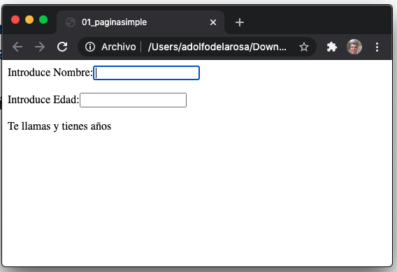
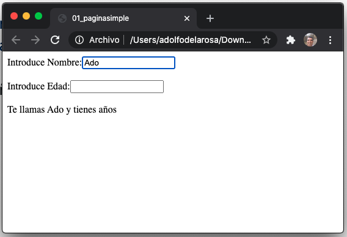
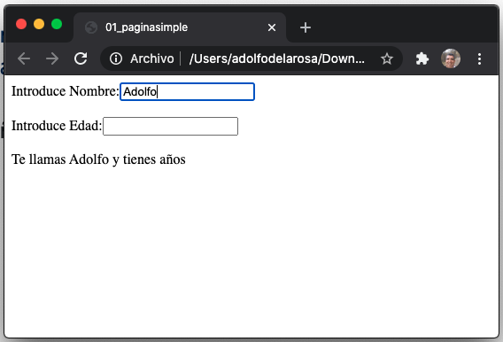
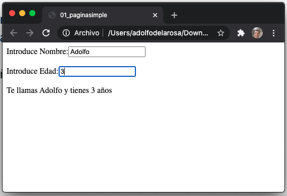
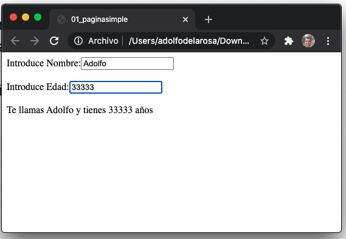

`02_nuevapagina.html`

```html
<!DOCTYPE html>
<html>
<head>
<meta charset="ISO-8859-1">
<title>02_nuevapagina</title>
<script src="https://ajax.googleapis.com/ajax/libs/angularjs/1.6.9/angular.min.js"></script>
</head>
<body>
   <div ng-app="app1" ng-controller="controller1">
      <select ng-model="seleccionado">
         <option ng-repeat="p in personas" value="{{p.edad}}">{{p.nombre}}</option>
      </select>
      <br/><br/>
      Edad seleccionada:{{seleccionado}}
      <br/><br/>
      <button type="button" ng-click="imprimir()">Pulsar</button>
   </div>
	
   <script type="text/javascript">
      var app=angular.module("app1",[]);
      app.controller("controller1",function($scope){
         $scope.seleccionado="";
			
         $scope.personas=[{"nombre":"test1","edad":30},{"nombre":"test2","edad":45}];

         $scope.imprimir=function(){
            alert("pulsado");
         }
      });
   </script>
</body>
</html>
```

En este ejemplo ya contamos con un Controller AngularJS que es el código JS que tenemos en el bloque JS.
* Le damos el nombre `app1` a la aplicación
* Al controlador le damos el nombre `controller1`
* Dentro del control definimos la variable `seleccionado` con ambito `$scope`
* Definimos un array `personas` con ambito `$scope`
* Definimos la función `imprimir` con ambito `$scope`

Para el código HTML hacemos lo siguiente:

* Definimos una división bajo el control de `controller1` con el atributo `ng-controller`
* Con el atributo `ng-model="seleccionado"` relacionamos el tag `<select` con la variable definda en el controller
* Con el atributo `ng-repeat="` usamos `personas` para llenar el combo.
* Con `{{seleccionado}}` vamos a ir pintando el valor seleccionado del combo.
* Dentro del botón usamos `ng-click="imprimir()"` para invocar a la función `imprimir` definida en el controller.


Probar el ejemplo:

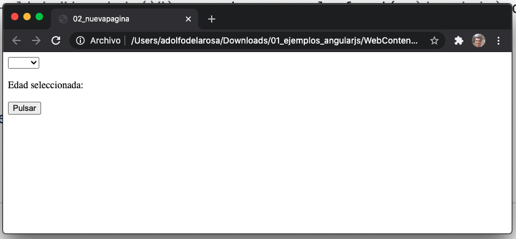
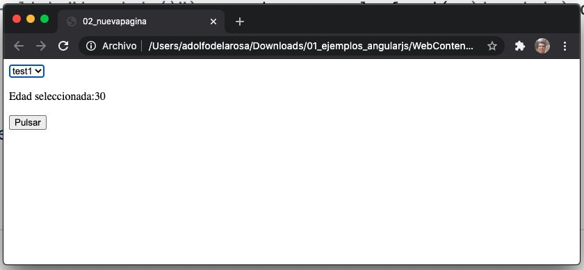
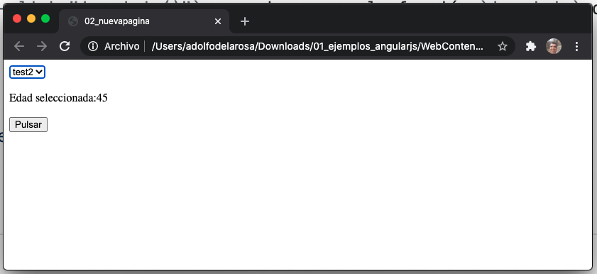
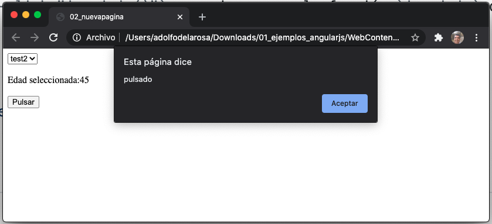

`03_selecciondenombres.html`

```html
<!DOCTYPE html>
<html>
<head>
<meta charset="ISO-8859-1">
<title>03_selecciondenombres</title>

<script src="https://ajax.googleapis.com/ajax/libs/angularjs/1.6.9/angular.min.js"></script>
</head>
<body>
   <div ng-app="seleccionApp" ng-controller="seleccionController">
      Seleccione Nombre: <select ng-model="seleccion">
         <option ng-repeat="p in listado" value="{{p.edad}}">{{p.nombre}}</option>
      </select>
      <br/><br/>
      La edad de la persona seleccionada es: {{seleccion}}
      <br/><br/>
      <input type="button" value="Mostrar" ng-click="imprimir()"/>
   </div>
	
   <script type="text/javascript">
      var app=angular.module("seleccionApp",[]);
      app.controller("seleccionController",function($scope){
     
         $scope.listado=[{"nombre":"persona1","edad":25},
            {"nombre":"persona2","edad":37},
            {"nombre":"persona3","edad":19}];
     
        $scope.imprimir=function(){
            alert($scope.seleccion);
         }
     
      });
   </script>
</body>
</html>
```

* Defino el modelo de datos `listado` al definirlo en el `$scope` puedo accederlo desde HTML que este bajo el dominio del controlador `seleccionController`

Probar el ejemplo:

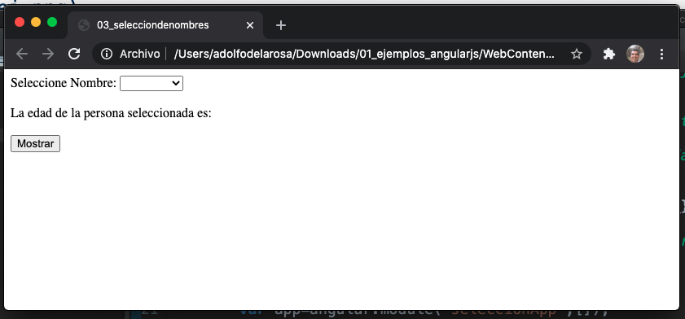
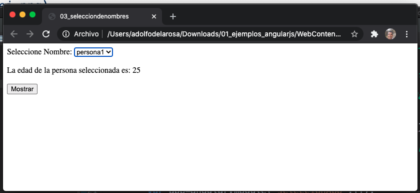
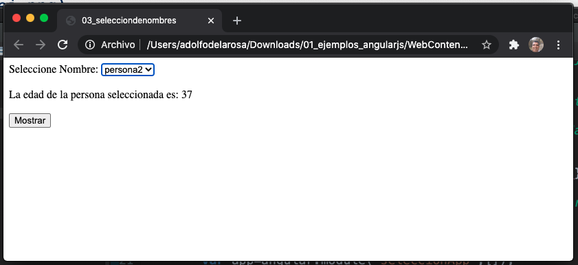
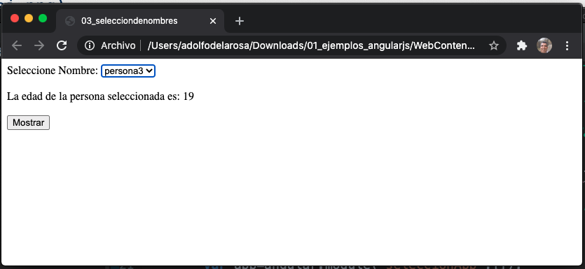
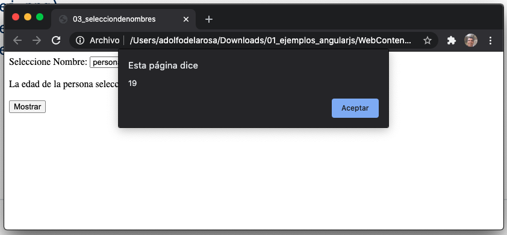

`04_calculadora.html`

```html
<!DOCTYPE html>
<html>
<head>
<meta charset="UTF-8">
<title>04_calculadora</title>
<script src="https://ajax.googleapis.com/ajax/libs/angularjs/1.6.9/angular.min.js"></script>
</head>
<body>
   <div ng-app="calculadoraApp" ng-controller="calculadoraController">
      Número 1:<input type="text" ng-model="num1"/><br/><br/>
      Número 2:<input type="text" ng-model="num2"/><br/><br/>
      <br/><br/>
      <input type="button" value="Sumar" ng-click="sumar()"/>
      <input type="button" value="Restar" ng-click="restar()"/>
      <input type="button" value="Multiplicar" ng-click="multiplicar()"/>
      <input type="button" value="Dividir" ng-click="dividir()"/>
      <br/><br/>
      <div >
         Resultado: {{resultado}}
      </div>
      <br/><br/>
   </div>

   <script type="text/javascript">
		
      var app=angular.module("calculadoraApp",[]);
      app.controller("calculadoraController",function($scope){
         $scope.num1 = 0;
         $scope.num2 = 0;
			
         $scope.sumar=function(){
            $scope.resultado = parseInt($scope.num1) + parseInt($scope.num2);
         }
         $scope.restar=function(){
            $scope.resultado = parseInt($scope.num1) - parseInt($scope.num2);
         }
         $scope.multiplicar=function(){
            $scope.resultado = parseInt($scope.num1) * parseInt($scope.num2);
         }
         $scope.dividir=function(){
            $scope.resultado = parseInt($scope.num1) / parseInt($scope.num2);
         }
      });
   </script>
</body>
</html>
```

Probar el ejemplo:

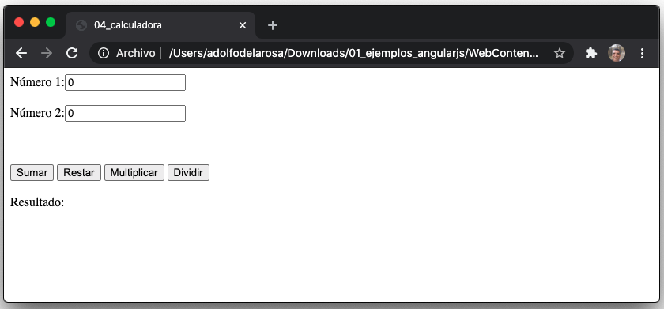
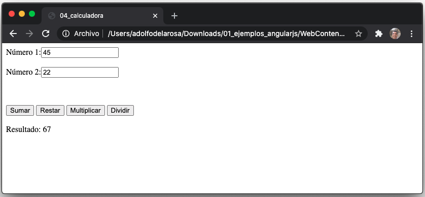

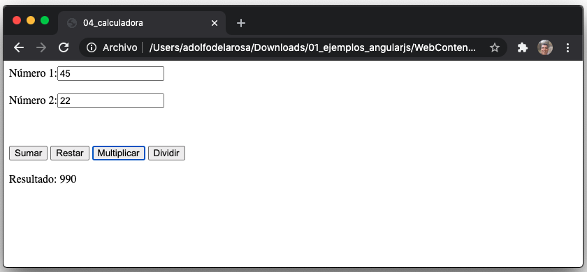
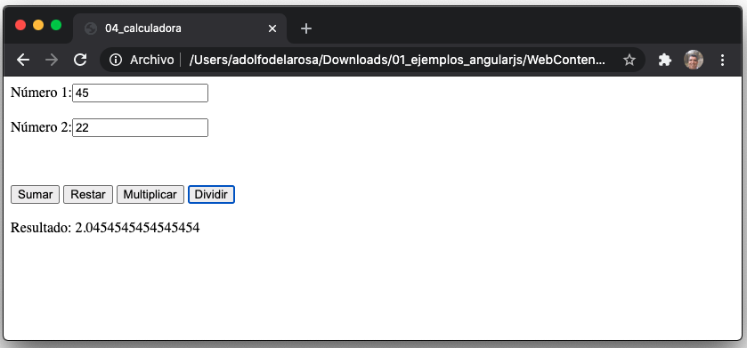


`.html`

```html
```
`.html`

```html
```
