# 20210107 Jueves

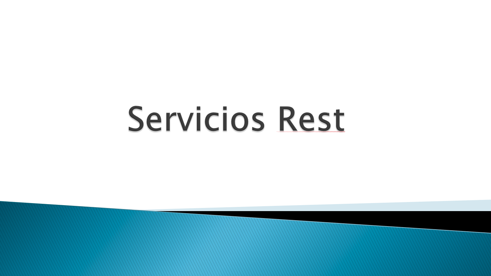

Un **Servicio Rest** es un servicio web tiene como objetivo dar un servicio a otras aplicaciones, cada servicio implementa una funcionalidad particular y todos ellos juntos pueden usarse para crear una aplicación Web como una Agencia de Viajes.

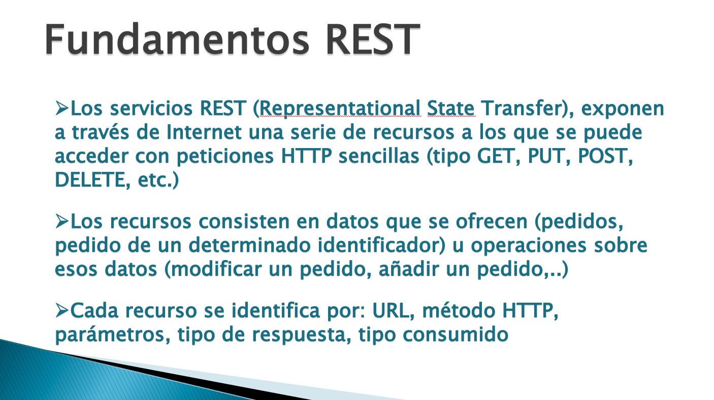

REST (Representational State Transfer) exponen al exterior una serie de recursos (funcionalidades) a los que se puede acceder con peticiones HTTP sencillas como GET, POST, PUT, DELETE y el servicio regresa al cliente información en un formato Text, XML, JSON, etc. lo que sea necesario.

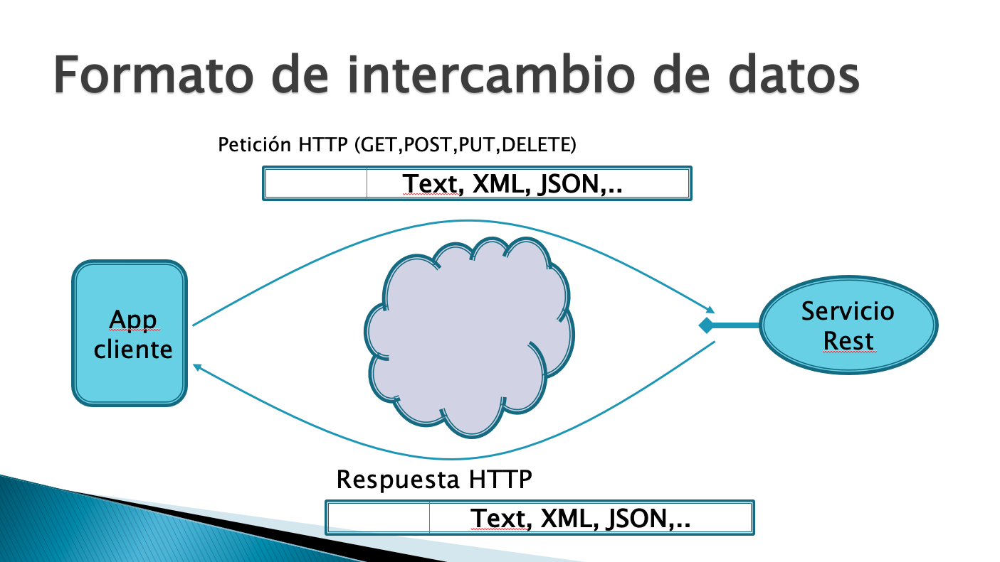

REST es muy flexible ya que acepta diferentes tipos de peticiones HTTP y las respuestas pueden ser en diferentes formatos, habitualmente será JSON.

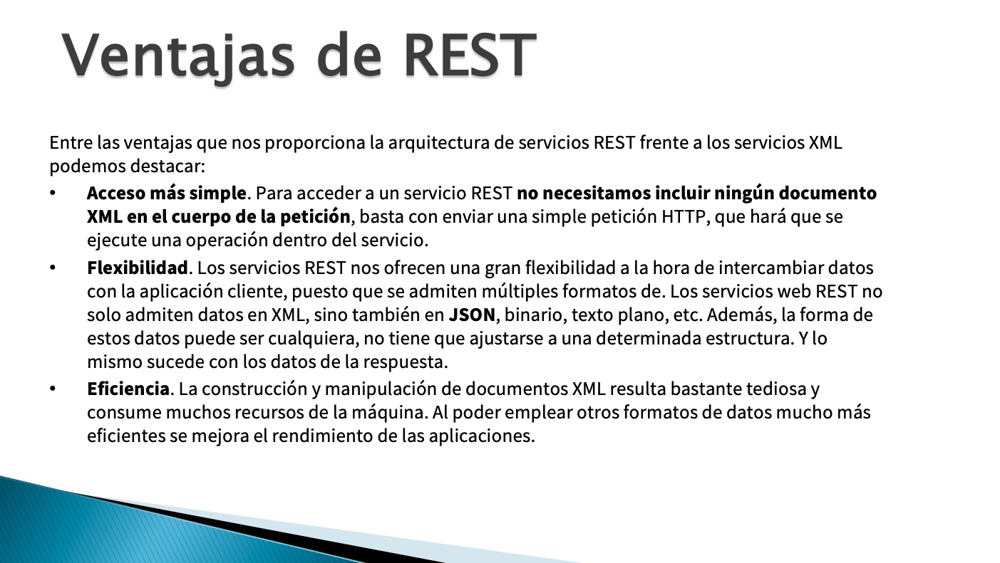

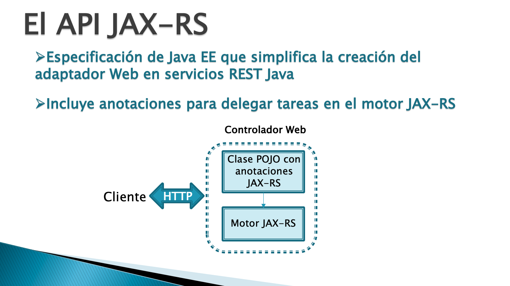

Los servicios REST manejan el estandar JAX-RS, que simplifica la creación de servicios REST, ya que un servicio se creará con una clase Java normal, un POJO con algunas anotaciones y el encargado de gestionar todo el funcionamiento será el Motor JAX-RS.

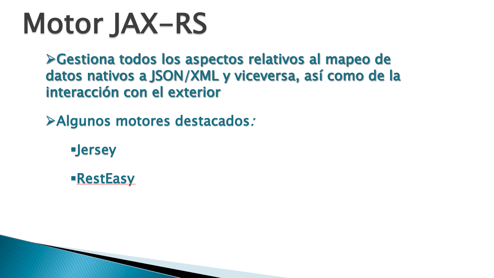

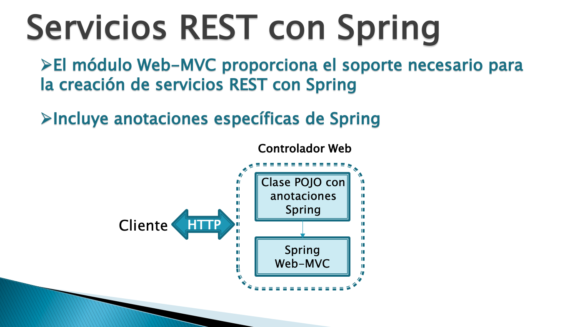

Como nosotros estamos trabajando con Spring no vamos a necesitar un Motor de los mencionados anteriormente, con el módulo **Spring Web-MVC** tendremos el soporte necesario para la creación de servicios REST con Spring. Será muy parecido a crear un Controlador de una aplicación Spring Web MVC.

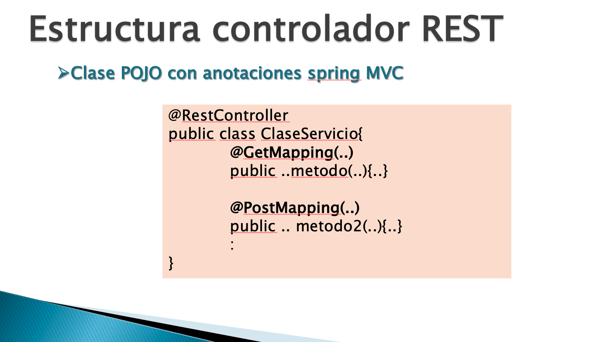

Como vemos la estructura de un servicio REST es muy sencilla, como mencionamos una clase POJO con anotaciones de Spring.

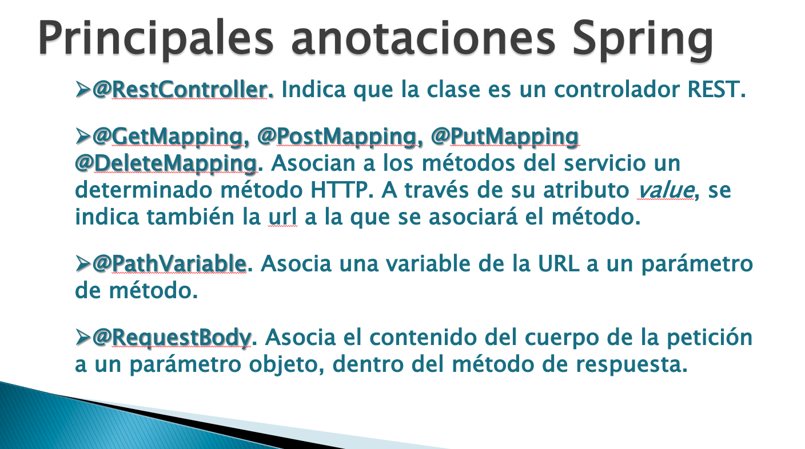

Las principales anotaciones de Spring son:

* `@RestController`
* `@GetMapping`, `@PostMapping`, `@PutMapping`, `@DeleteMapping`
* `@RequestParam`
* `@PathVariable`
* `@RequestBody`

Para facilitar el desarrollo de nuestros proyectos en nuestro Workspace del Módulo 4 vamos a importar el proyecto `proyectos.padre` el cual contiene una gran cantidad de dependencia que podemos llegar a usar en nuestros proyectos.


`pom.xml`

```html
<project xmlns="http://maven.apache.org/POM/4.0.0" xmlns:xsi="http://www.w3.org/2001/XMLSchema-instance" xsi:schemaLocation="http://maven.apache.org/POM/4.0.0 https://maven.apache.org/xsd/maven-4.0.0.xsd">
  <modelVersion>4.0.0</modelVersion>
  <groupId>proyectos.padre.grupo</groupId>
  <artifactId>proyectos.padre</artifactId>
  <version>0.0.1-SNAPSHOT</version>
  <packaging>pom</packaging>
  <name>proyecto_maven_padre</name>
  <properties>
  	<spring.version>5.2.9.RELEASE</spring.version>
  	<hibernate.version>5.4.18.Final</hibernate.version>
  	<mysql.version>8.0.19</mysql.version>
  </properties>
  <dependencies>
  <!-- https://mvnrepository.com/artifact/mysql/mysql-connector-java -->
	<dependency>
	    <groupId>mysql</groupId>
	    <artifactId>mysql-connector-java</artifactId>
	    <version>${mysql.version}</version>
	</dependency>
  	<!-- https://mvnrepository.com/artifact/org.springframework/spring-core -->
	<dependency>
	    <groupId>org.springframework</groupId>
	    <artifactId>spring-core</artifactId>
	    <version>${spring.version}</version>
	</dependency>
	<!-- https://mvnrepository.com/artifact/org.springframework/spring-context -->
	<dependency>
	    <groupId>org.springframework</groupId>
	    <artifactId>spring-context</artifactId>
	    <version>${spring.version}</version>
	</dependency>
	<dependency>
	    <groupId>org.springframework</groupId>
	    <artifactId>spring-web</artifactId>
	    <version>${spring.version}</version>
	</dependency> 
  	<dependency>
	    <groupId>org.springframework</groupId>
	    <artifactId>spring-orm</artifactId>
	    <version>${spring.version}</version>
	</dependency>
	<dependency>
	    <groupId>org.springframework</groupId>
	    <artifactId>spring-webmvc</artifactId>
	    <version>${spring.version}</version>
	</dependency>
  	<!-- https://mvnrepository.com/artifact/org.hibernate/hibernate-core -->
	<dependency>
	    <groupId>org.hibernate</groupId>
	    <artifactId>hibernate-core</artifactId>
	    <version>${hibernate.version}</version>
	</dependency>
	<dependency>
	    <groupId>com.fasterxml.jackson.core</groupId>
	    <artifactId>jackson-core</artifactId>
	    <version>2.9.8</version>
	</dependency>
	<dependency>
	    <groupId>com.fasterxml.jackson.core</groupId>
	    <artifactId>jackson-databind</artifactId>
	    <version>2.9.8</version>
	</dependency>
	<dependency>
      <groupId>junit</groupId>
      <artifactId>junit</artifactId>
      <version>4.13</version>      
    </dependency>
    <!-- https://mvnrepository.com/artifact/org.springframework/spring-test -->
    <dependency>
      <groupId>org.springframework</groupId>
      <artifactId>spring-test</artifactId>
      <version>5.2.9.RELEASE</version>     
    </dependency>	
  </dependencies>
</project>
```

### :computer: `04_ejemplo_rest`
#### Ejemplo de nuestro Primer Servicio REST

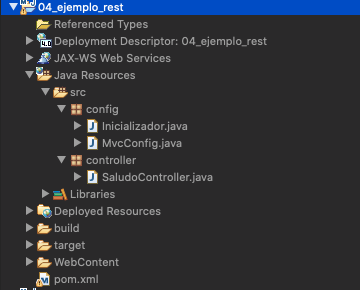

Creamos un proyecto Dinamic Web Proyect 


Lo mavenizamos y añadimos la referencia al proyecto padre.

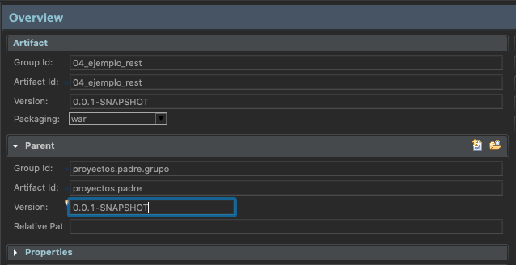

Con esto se insertan todas las dependencias en nuestro proyecto.

#### Creación de un RestController

Este primer servicio no va a contar con capa de datos, ni de lógica de negocios es básicamente un controlador que nos regresa un saludo, por lo que creamos la clase `SaludoController`

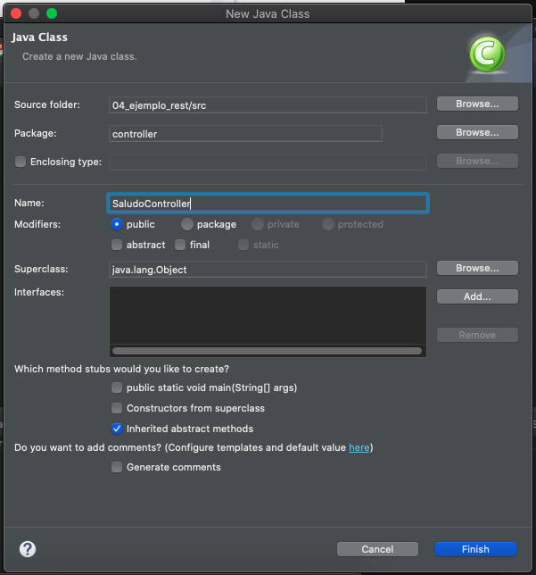

* Vamos empezado por anotar la clase con `@RestController`.
* Vamos a crear un primer método que va a regresar un saludo.

```java
public String saludo() {
  return "Bienvenido a REST";
}
```

Nos faltaría configurarlo por que tengo que asociar este método con una petición HTTP para lo cual vamos a usar las anotaciones de Spring.

```java
@GetMapping(value="saludo", produces=MediaType.TEXT_PLAIN_VALUE)
public String saludo() {
  return "Bienvenido a REST";
}
```

* Usa una petición `GET`
* Tiene asociada la URL `saludo`
* La respuesta que va a regresar es de tipo Texto Plano a traves del atributo `produces` igualada a la constante `TEXT_PLAIN_VALUE` de la enumeración `MediaType`.

Lo que estoy indicando es que este método será ejecutado cuando se haga una petición `GET` con la URL `saludo` y la respuesta será un texto plano `Bienvenido a REST`.

#### Configurar la Aplicación.

Como esta es una aplicación Spring nos falta la parte de configuración en este caso solo del Controlador ya que no tiene Modelo ni lógica de negocio. Vamos a copiarnos de algún otro proyecto el paquete `config` donde solo vamos a tener el `Inicializador.java` y el `MvcConfig.java`.

`Inicializador.java`

```java
package config;

import javax.servlet.ServletContext;
import javax.servlet.ServletException;
import javax.servlet.ServletRegistration;

import org.springframework.web.WebApplicationInitializer;
import org.springframework.web.context.ContextLoaderListener;
import org.springframework.web.context.support.AnnotationConfigWebApplicationContext;
import org.springframework.web.servlet.DispatcherServlet;

public class Inicializador implements WebApplicationInitializer {

   @Override
   public void onStartup(ServletContext servletContext) throws ServletException {
      // Crea el contexto raíz de la aplicación Web
      AnnotationConfigWebApplicationContext rootContext =
            new AnnotationConfigWebApplicationContext();
	      
      // Gestiona el ciclo de vida del contexto de aplicación
      servletContext.addListener(new ContextLoaderListener(rootContext));
	      
      // Registra el archivo de configuración para MVC
      AnnotationConfigWebApplicationContext dispatcherContext =
            new AnnotationConfigWebApplicationContext();
      dispatcherContext.register(MvcConfig.class);

      // Crea y Registra el DispatcherServlet
      ServletRegistration.Dynamic dispatcher =
      servletContext.addServlet("dispatcher", new DispatcherServlet(dispatcherContext));
      dispatcher.setLoadOnStartup(1);
      dispatcher.addMapping("/");
	      
	}

}
```
* Solo estamos registrando el `MvcConfig`

`MvcConfig.java`

```java
package config;

import org.springframework.context.annotation.ComponentScan;
import org.springframework.context.annotation.Configuration;
import org.springframework.web.servlet.config.annotation.EnableWebMvc;

@EnableWebMvc
@ComponentScan(basePackages = {"controller"})
@Configuration
public class MvcConfig {
	
}
```
* Esta clase es una clase vacia ya que como no manejamos vistas se simplifica mucho, básicamente lo más importante s la anotación `@ComponentScan(basePackages = {"controller"})` para que Spring pueda instanciar las clases de este paquete.

#### Probar la Aplicación

Con esto ya podemos probar la aplicación, ¿pero en donde? podemos usar el navegador ya que puede hacer peticiones GET pero no es lo más adecuado. Si ejecutamos la aplicación tenemos:

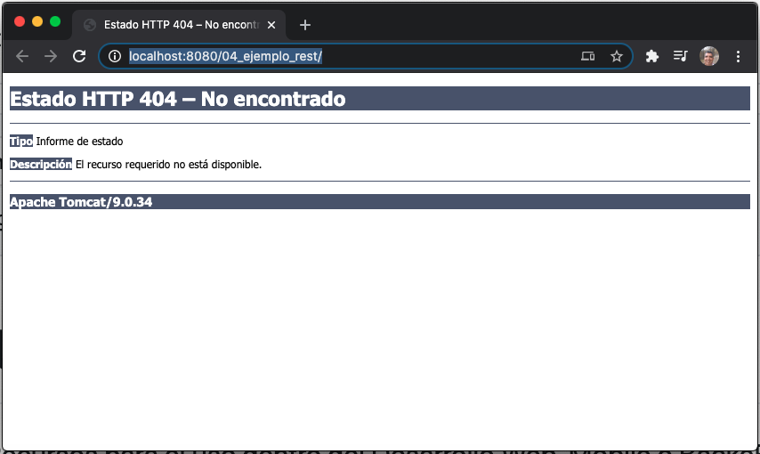

El navegador lógicamente lanzado la aplicación con el contesto raíz de la aplicación `http://localhost:8080/04_ejemplo_rest/` como no tenemos página de bienvenida por que ese concepto no existe, debemos añadir la dirección del recurso que queremos ejecutar, es decir `http://localhost:8080/04_ejemplo_rest/saludo`


Obtenemos la respuesta en formato texto plano.


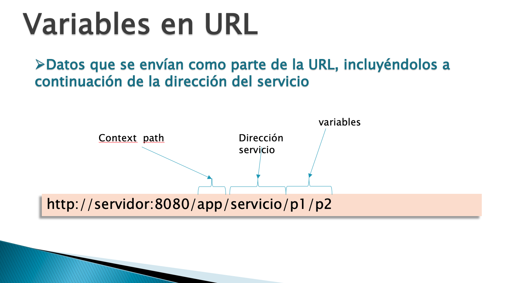
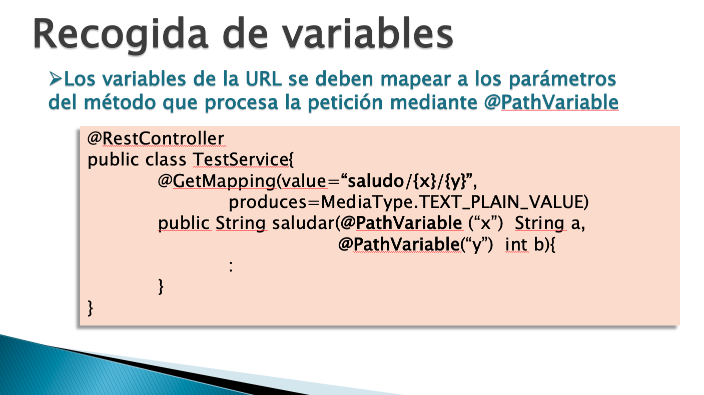
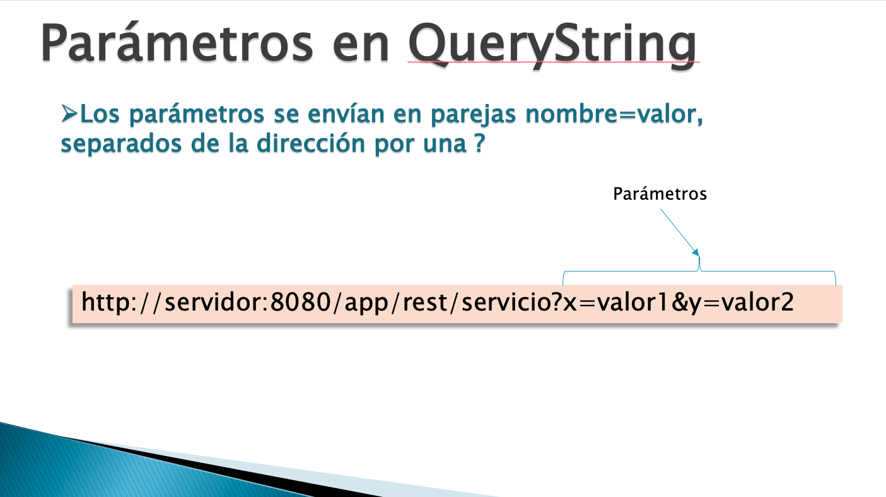
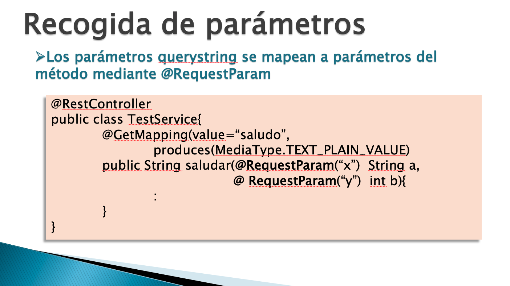

Vamos a realizar un método(recurso) más que reciba un parámetro usando los `PathVariable`:
 
```java
@GetMapping(value="saludo/{name}", produces=MediaType.TEXT_PLAIN_VALUE)
public String saludar(@PathVariable("name") String nombre) {
   return "Bienvenido a REST Sr/a :" + nombre;
}
```

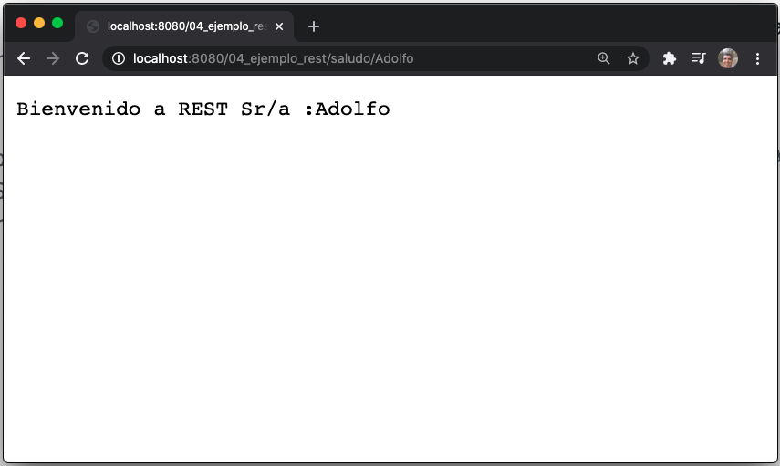

Como podemos ver ya tenemos dos métodos o recursos a la misma dirección `saludo` ¿cómo sabe a donde dirigirse? va a depender si la dirección esta sola o lleva algo más.

La otra forma de mandarle parámetros al recurso es a través de los `QueryParam` que los recojemos con `@RequestParam`

```java
@GetMapping(value="saludo", produces=MediaType.TEXT_PLAIN_VALUE)
public String saludar(@RequestParam("name") String nombre, @RequestParam("age") int edad) {
   return "Bienvenido a REST Sr/a :" + nombre + " tienes " + edad + " años.";
}
```

Si ejecutamos la aplicación nos manda un error.

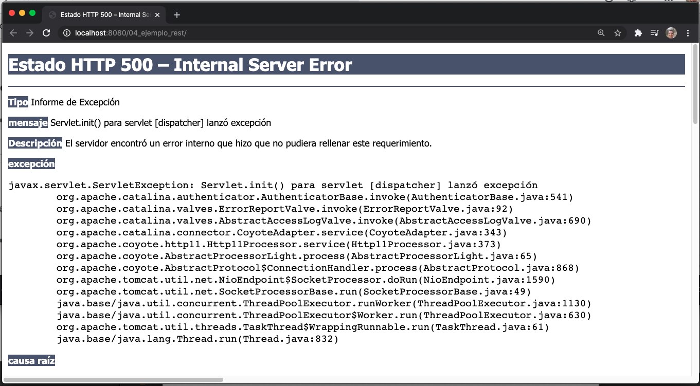

Tenemos un error 500 y ni siquiera lo hemos podido probar, el error nos marca:

```sh
to {GET /saludo, produces [text/plain]}: There is already 'saludoController' bean method
controller.SaludoController#saludo() mapped.
```

El problema es por que tenemos dos métodos con una misma URL, mismo método HTTP y mismo método de devolución y como habiamos visto en las primeras diapositivas cada recurso se identifica por: ***URL, método HTTP, parámetros variables, tipo de respuesta, tipo consumo*** por lo cual tenemos una ambiguedad, basta con solo cambiarle la URL.

```java
@GetMapping(value="saludopersonal", produces=MediaType.TEXT_PLAIN_VALUE)
public String saludar(@RequestParam("name") String nombre, @RequestParam("age") int edad) {
   return "Bienvenido a REST Sr/a :" + nombre + " tienes " + edad + " años.";
}
```

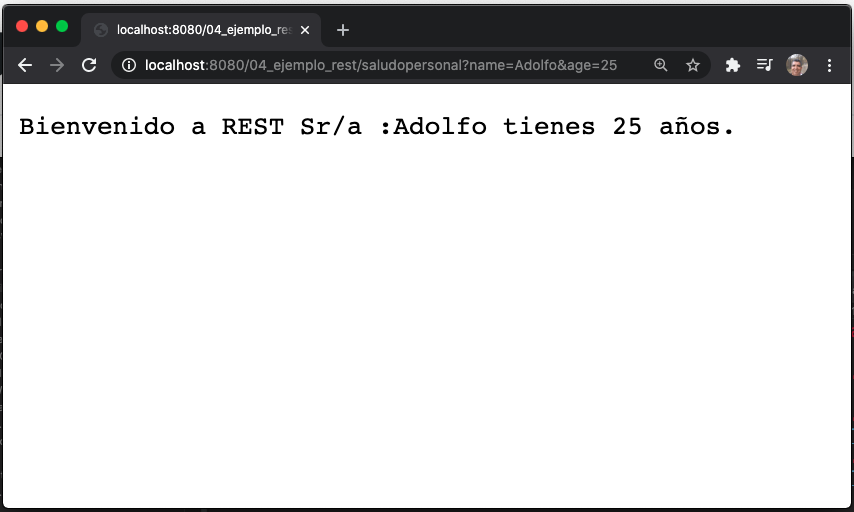

Hasta ahora hemos probado con el navegador pero ahora lo vamos a hacer con Postman.

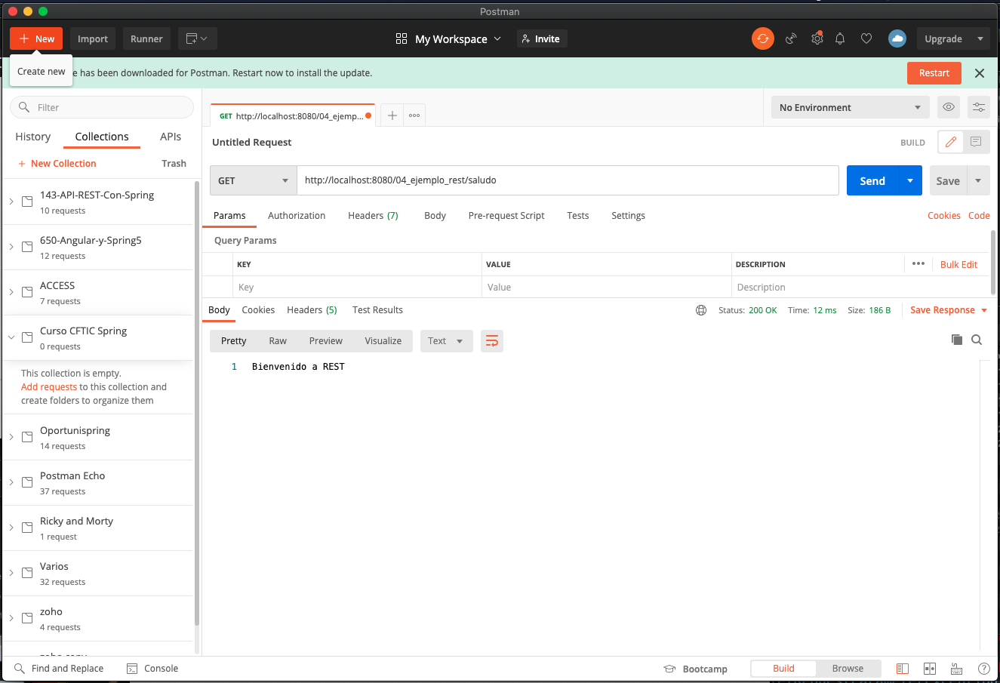

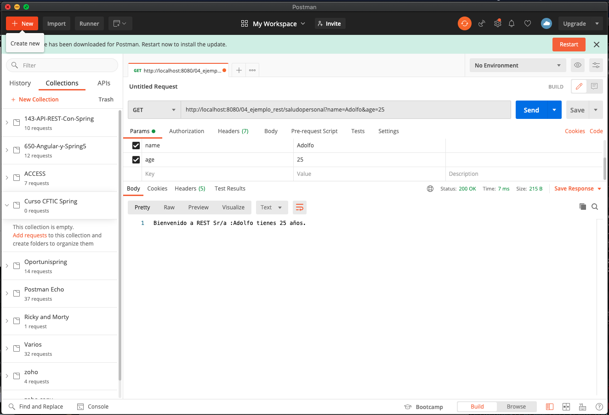

La clase completa `SaludoController` es:

```java
package controller;

import org.springframework.http.MediaType;
import org.springframework.web.bind.annotation.GetMapping;
import org.springframework.web.bind.annotation.PathVariable;
import org.springframework.web.bind.annotation.RequestParam;
import org.springframework.web.bind.annotation.RestController;

@RestController
public class SaludoController {
	
   @GetMapping(value="saludo", produces=MediaType.TEXT_PLAIN_VALUE)
   public String saludo() {
      return "Bienvenido a REST";
   }
	
   @GetMapping(value="saludo/{name}", produces=MediaType.TEXT_PLAIN_VALUE)
   public String saludar(@PathVariable("name") String nombre) {
      return "Bienvenido a REST Sr/a :" + nombre;
   }
   
   @GetMapping(value="saludopersonal", produces=MediaType.TEXT_PLAIN_VALUE)
   public String saludar(@RequestParam("name") String nombre, @RequestParam("age") int edad) {
      return "Bienvenido a REST Sr/a :" + nombre + " tienes " + edad + " años.";
   }
}
```

### :computer: `05_calculadora_rest`
#### Ejemplo de nuestro Segundo Servicio REST Calculadora

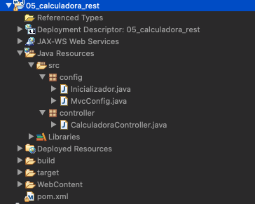

Es esencialmente igual al anterior lo que cambia es el Controllador.

`CalculadoraController`

```java
package controller;

import org.springframework.http.MediaType;
import org.springframework.web.bind.annotation.GetMapping;
import org.springframework.web.bind.annotation.PathVariable;
import org.springframework.web.bind.annotation.RestController;

@RestController
public class CalculadoraController {
   @GetMapping(value="sumar/{n1}/{n2}",produces=MediaType.TEXT_PLAIN_VALUE)
   public String suma(@PathVariable("n1") int a, @PathVariable("n2") int b) {
      return String.valueOf(a+b);
   }
   @GetMapping(value="multiplicar/{n1}/{n2}",produces=MediaType.TEXT_PLAIN_VALUE)
   public String multiplica(@PathVariable("n1") int a, @PathVariable("n2") int b) {
      return String.valueOf(a*b);
   }
   @GetMapping(value="cuadrado/{n1}",produces=MediaType.TEXT_PLAIN_VALUE)
   public String cuadrado(@PathVariable("n1") int x) {
      return String.valueOf(x*x);
   }
}
```


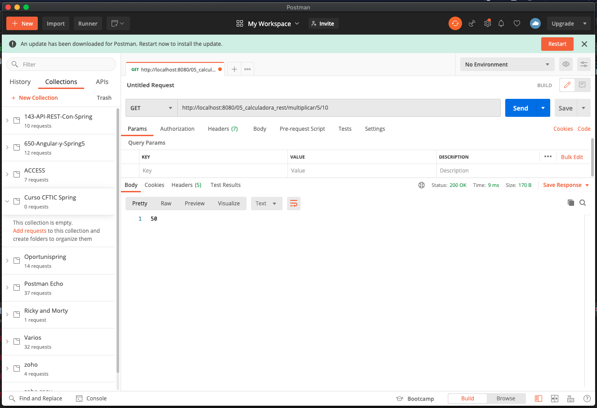
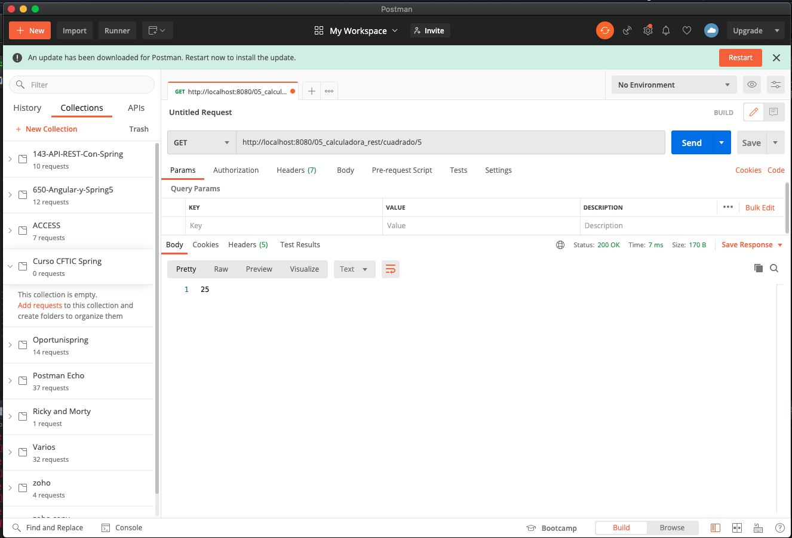

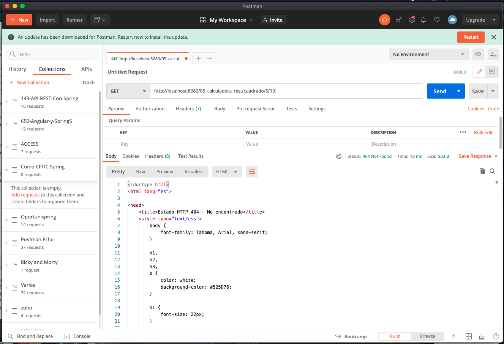

Si hacemos una petición a una URL que no coincide con un método nos va a marcar un error 404 por ambiguedad, en este caso estoy pasando dos variables en la URL y no hay ningún método llamado `http://localhost:8080/05_calculadora_rest/cuadrado/5/10` con dos variables.

### :computer: `06_ficha_rest`
#### Ejemplo de un Servicio Rest que nos va a retornar un Modelo de Datos.

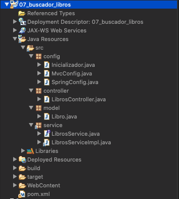

Al igual que los proyectos anteriores es un proyecto Dimamic Web Proyect que mavemizamos, asignamos el proyecto padre y copiamos la misma configuración.

#### Crear el Modelo `Ficha`

El paso siguienete es crear el Modelo.

`Ficha`

```java
package model;

public class Ficha {
	
   private String nombre;
   private String dni;
   private int edad;
	
   public Ficha() {
      super();
   }
   public Ficha(String nombre, String dni, int edad) {
      super();
      this.nombre = nombre;
      this.dni = dni;
      this.edad = edad;
   }
   public String getNombre() {
      return nombre;
   }
   public void setNombre(String nombre) {
      this.nombre = nombre;
   }
   public String getDni() {
      return dni;
   }
   public void setDni(String dni) {
      this.dni = dni;
   }
   public int getEdad() {
      return edad;
   }
   public void setEdad(int edad) {
      this.edad = edad;
   }
}
```

#### Crear el Controlador `FichaController`

`FichaController`

```java
package controller;

import org.springframework.http.MediaType;
import org.springframework.web.bind.annotation.GetMapping;
import org.springframework.web.bind.annotation.PathVariable;
import org.springframework.web.bind.annotation.RestController;

import model.Ficha;

@RestController
public class FichaController {

   @GetMapping(value="datos/{dni}", produces=MediaType.APPLICATION_JSON_VALUE)
   public Ficha datosPersona(@PathVariable("dni") String dni) {
      return new Ficha("prueba ficha", dni, 20);
   }
	
}
```
* Contiene un método que va a "devolver una ficha a partir de un DNI".
* Asociado a un método `GET` llamado `datos` que recibe una variable.
* Estamos devolviendo un JSON con `produces=MediaType.APPLICATION_JSON_VALUE`
* Devolvemos un objeto `Ficha` que gracias que se convertora a JSON gracias a la anotación y a la librería JACKSON. 

#### Probar la Aplicación

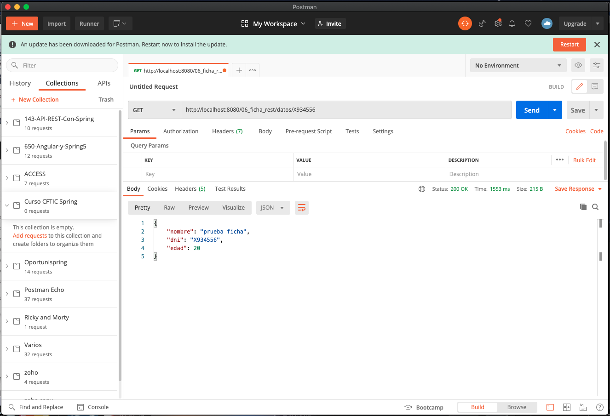
