# 20210112 Martes

## Spring Boots


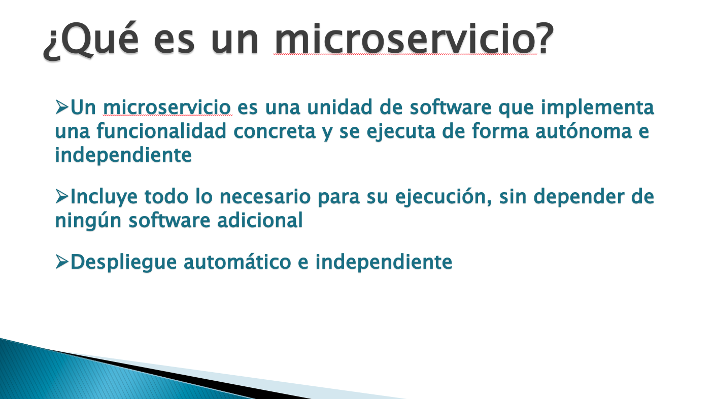

A diferencia de un Servicio Rest un Microservicio se ejecuta de forma autónoma e independiente, incluye todo lo necesesario para su ejecución. 

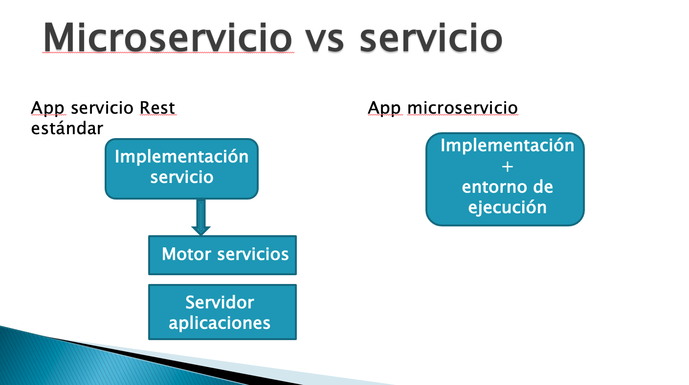
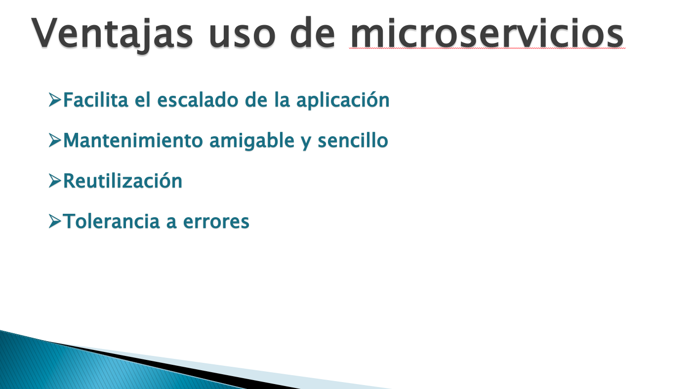
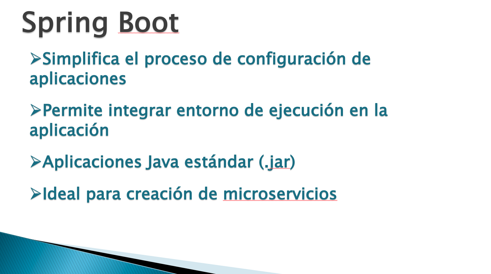

Simplifica la gestión de dependencias.
Con Spring Boot nos ahorramos mucha configuración que haciamos con Spring.
Te permite generar aplicaciones web como aplicaciones Java Standar, como Jar.

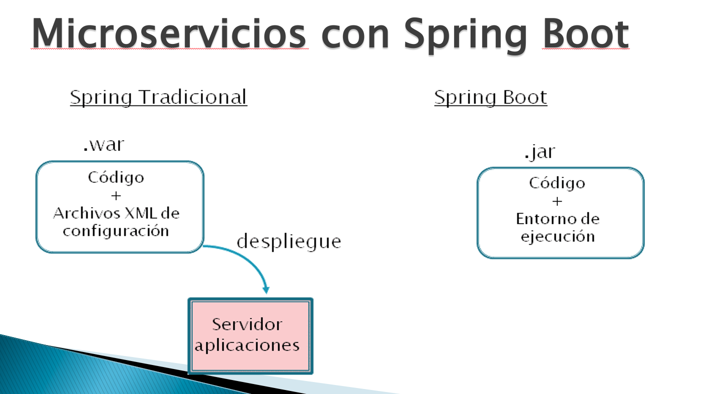
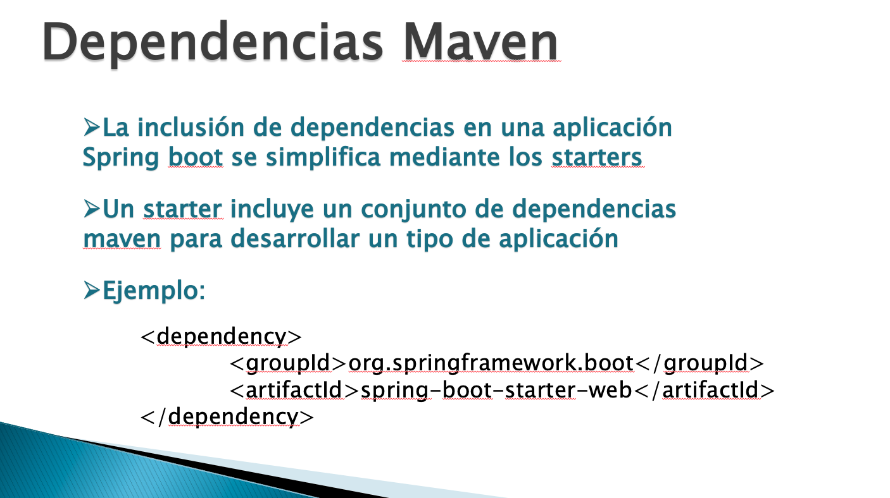

Usamos los ***starter*** de Spring Boot.

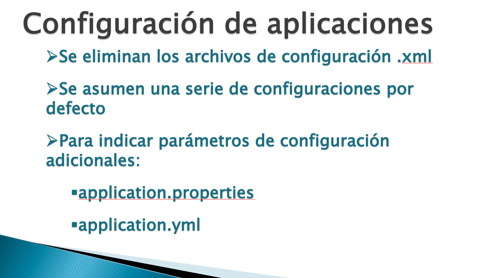

Muchas de las configuraciones manuales que se hacen en Spring con Spring Boot se asumen por defecto.

## Estructura de un MicroServicio con Spring Boots


La estructura de un Microservicio es básicamente la misma que la que teniamos con Spring, solo que sin Vistas.

Toda aplicación Spring Boot que se vaya a distribuir como un `.jar` dispone de una clase a la que llamamos Lanzador, la clase principal (una clase main)  que da inicio a la aplicación 

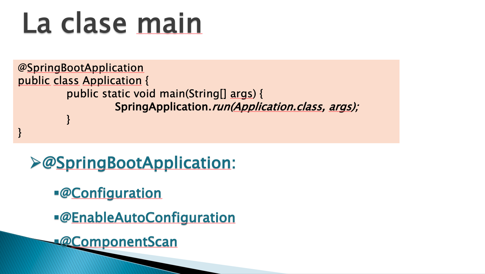

La instrucción `SpringApplication.run(...)` inicia todo el proceso Spring Boot, ejecuta la aplicación, por detrás arranca Tomcat, desplegar el servicio, arrancar las configuraciones por defecto etc. que es transparente para nosotros. Todo esto lo puede hacer gracias a que esta anotada con `@SpringBootApplication`.

`@SpringBootApplication` equivale a tres anotaciones:

* `@Configuration` Indica que es una clase de configuración.
* `@EnableAutoConfiguration` Anotación que habilita las configuraciones por defecto.
* `@ComponentScan` Escanear el paquete. 

Toda aplicación de Spring Boot lleva uns configuaciones por defecto que se aplican cuando se arranca la aplicación.

La clase Lanzadera `Application` también me podría servir como clase de configuración donde podría indicar la creacione de algunos Beans por ejemplo, entre otras cosas de configuración.

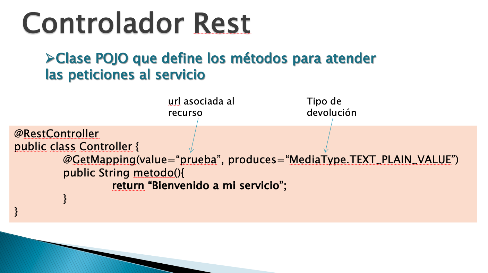

## :computer: `12_microservicio_calculadora`
### Ejemplo de la primera aplicación Spring Boot.

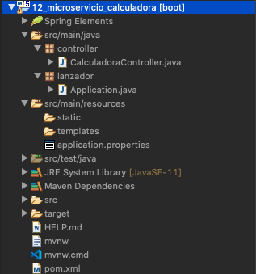

Para crear una aplicación Spring Boot ya no usamos la clasica aplicación Dynamic Web Project sino que utilizaremos la opción de Spring Starter Project.

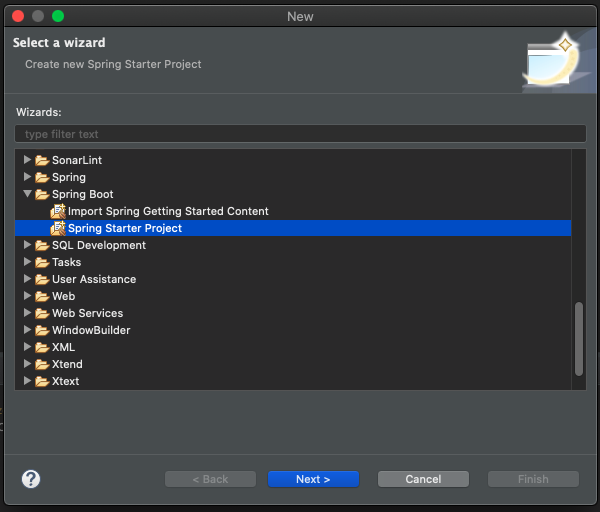
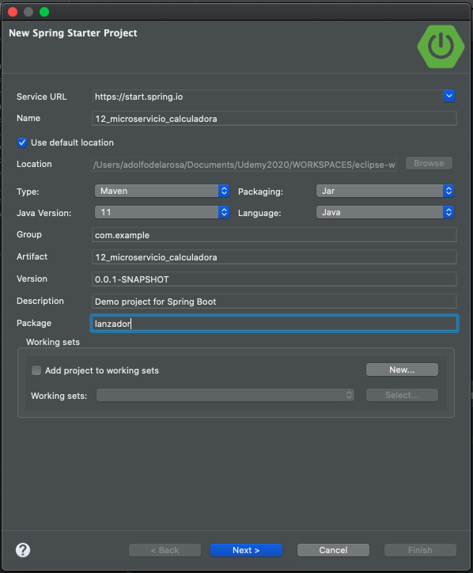
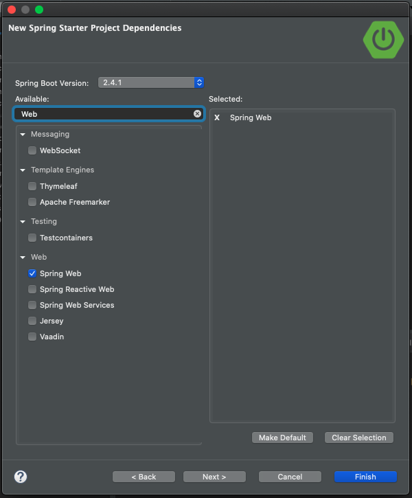

En este último paso es donde vamos a seleccionar las dependencias de nuestro proyecto, los **"starter"** los cuales incorporan un grupo de dependencias para hacer varias cosas. Como este es un servicio básico nos va a bastar con incluir solo *Spring Web*. 

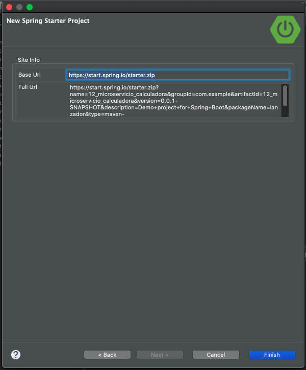

En el último paso tenemos un reumen.

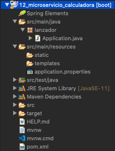

Esta es la estructura de nuestro primer Proyecto Spring Boot el cual tiene algunas diferencias con respecto a un proyecto Spring normal, no tenenos un Java Resources si no más bien tenemos un `src/main/resources`

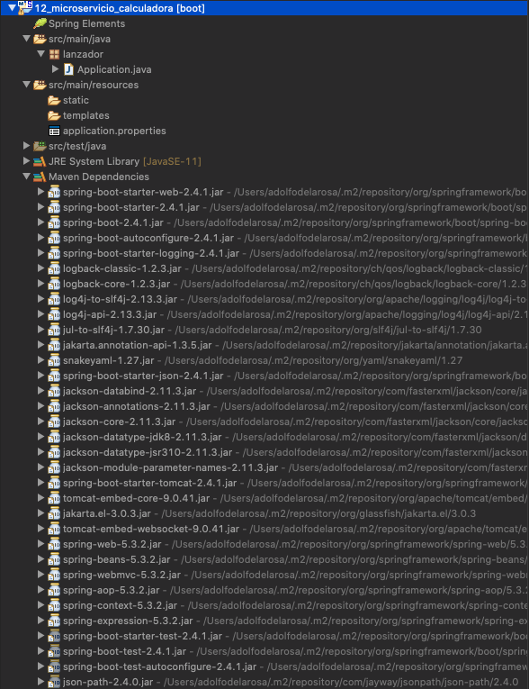

Una cosa que nos puede llamar la atención son todas las Maven Dependencies, aun que nosotros solo metimos el *starter Spring Web* el número de dependencias que se han metido son bastantes más, hay muchos `.jar`, entrellos Tomcat, JUnit, Spring Core, etc.

Una aplicación Boot ya viene preparada para temas de Testing, de echo en la estructuta del proecto creado tenemos la carpeta `src/test/java` donde ya se ha creado una clase de testing que podemos usar para probar nuestra aplicación.

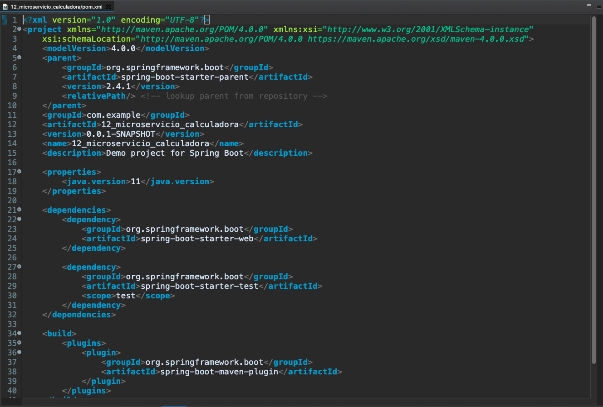

Si hechamos un vistazo al `pom.xml` esperariamos ver un monton de dependencias pero realmente no es así, solo tenemos el *starter Spring Web* y *starter Spring Test* que lo metio automaticamente ya que nosotros no lo indicamos, ademas tiene un Padre definido. Así que nuestro `pom.xml` nos queda muy limpio.


En el paquete lanzador tenemos la clase `Application` que es lo que se explico antes en las diapositivas. 

Como nuestro servicio va a ser muy sencillo no tiene Modelo, no tiene Servicio solo tiene el Controlador.

### Crear la Clase `CalculadoraController`

Vamos a crear esta clase en el mismo paquete `lanzador` donde se ubica la clase `Application`.

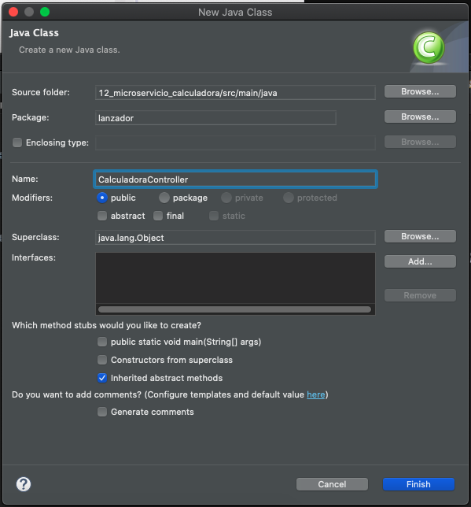

Como la lógica de este Servicio ya la teniamos implementada en el proyecto `05_calculadora_rest` la copiamos así que nuestra clase nos queda así:

`CalculadoraController`

```java
...
@RestController
public class CalculadoraController {
   @GetMapping(value="sumar/{n1}/{n2}",produces=MediaType.TEXT_PLAIN_VALUE)
   public String suma(@PathVariable("n1") int a, @PathVariable("n2") int b) {
      return String.valueOf(a+b);
   }
   @GetMapping(value="multiplicar/{n1}/{n2}",produces=MediaType.TEXT_PLAIN_VALUE)
   public String multiplica(@PathVariable("n1") int a, @PathVariable("n2") int b) {
      return String.valueOf(a*b);
   }
   @GetMapping(value="cuadrado/{n1}",produces=MediaType.TEXT_PLAIN_VALUE)
   public String cuadrado(@PathVariable("n1") int x) {
      return String.valueOf(x*x);
   }
}
```

Ya con esto sería suficiente para ejecutar nuestra aplicación, la cual no vamos a ejecutar en el Servidor Tomcat normal como lo hemos hecho hasta ahora, por que esta aplicación Spring Boot ya trae embebido su propio Tomcat, lo unico es que no podemos tener arrancados los dos Tomcats, ya que el Tomcat embebido va a usar el puerto 8080 que es el mismo que usa el Tomcat normal, así que antes de arrancar nuestra aplicación Spring Boot parar el Tomcat tradicional.

La manera de ejecutar la aplicación Spring Boot es como una aplicación normal **Java Application** o con **Spring Boot App**.

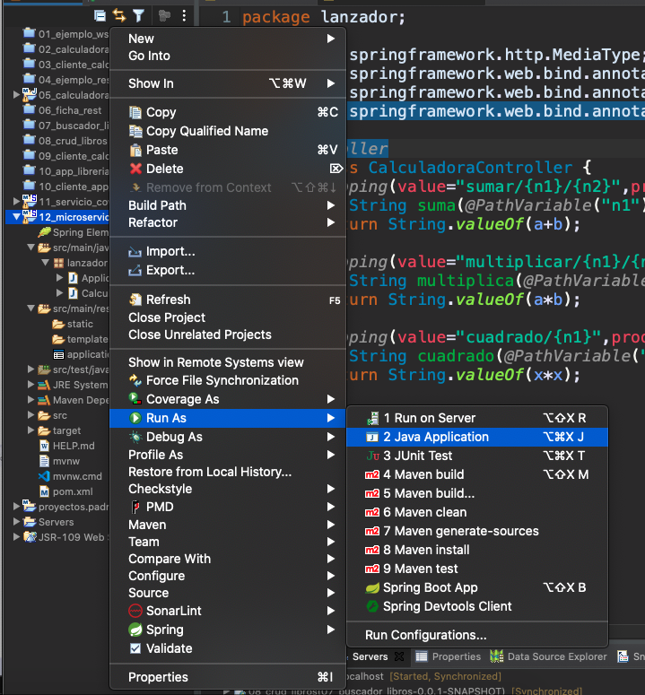
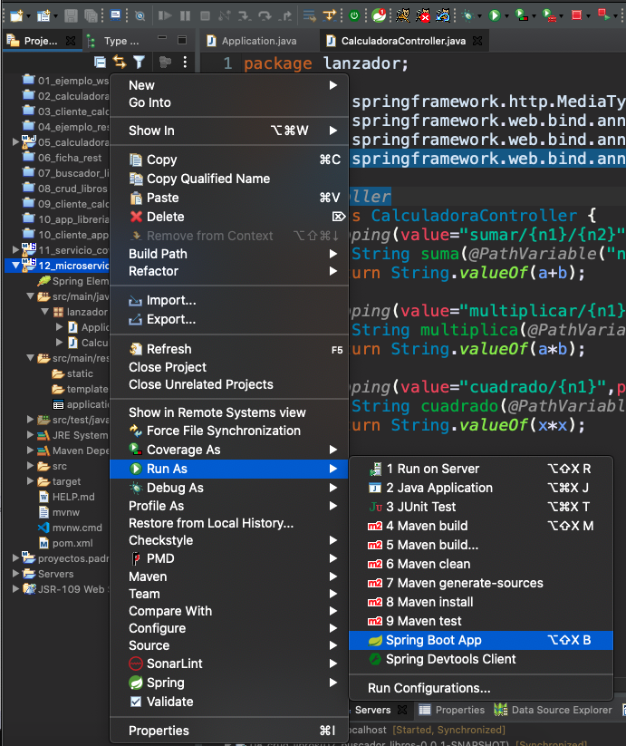

Ambas opciones hacen exactamente lo mismo lo único es que si elegimos **Spring Boot App** en la ventana de la consola da más detalles de la aplicación, al arrancar la aplicación tenemos:

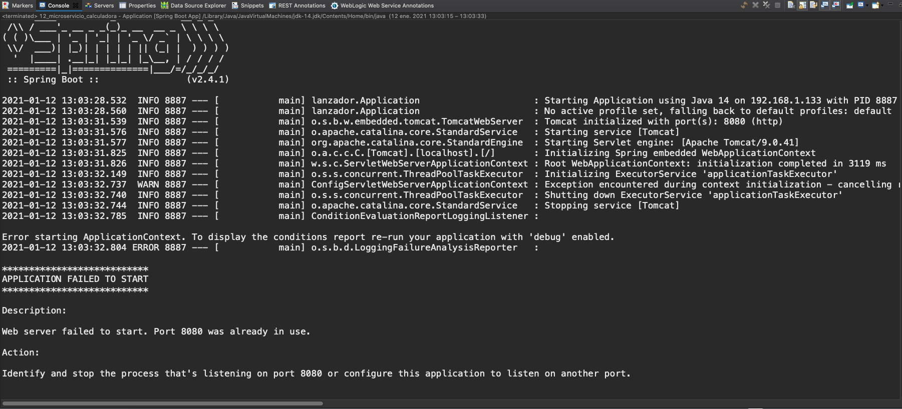

Se nos indica que la aplicación ha sido arrancada en el puerto 8080 y otra cosa que llama la atención es que no tiene un ***context path*** por defecto así que nuestra URL será http://localhost:8080/ más el servicio que queramos probar.

¿Cómo pobamos la aplicación para saber si la calculadora funciona? Lo hacemos con Postman.

http://localhost:8080/sumar/5/10


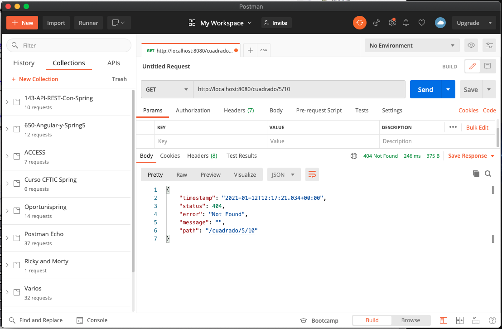
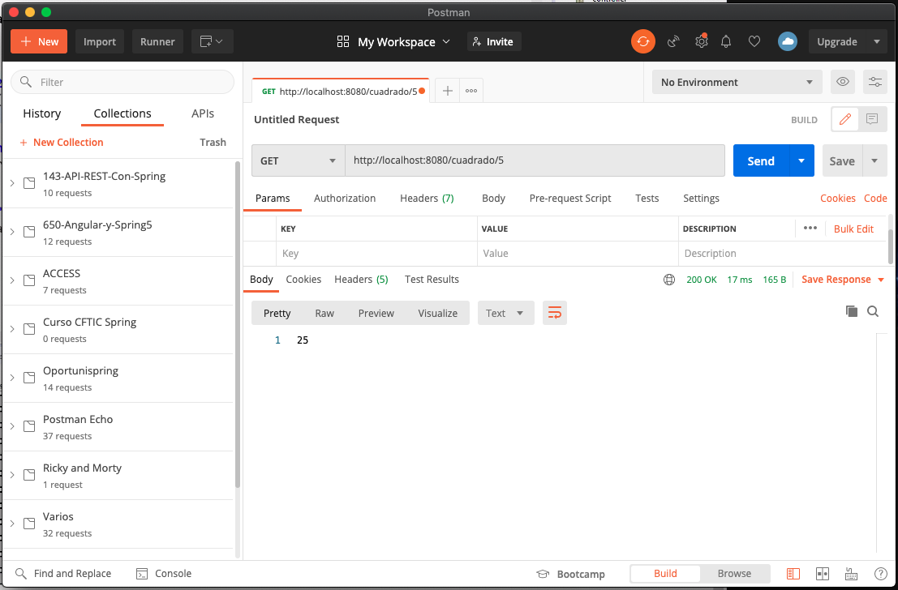

Como vemos el Servicio funciona, solo que hay un detalle el tener el `CalculadoraController` junto con `Application` no es muy elegante, deberíamos tenerlo en su propio paquete `controller`, al hacer este cambio y volver a probar tenemos:

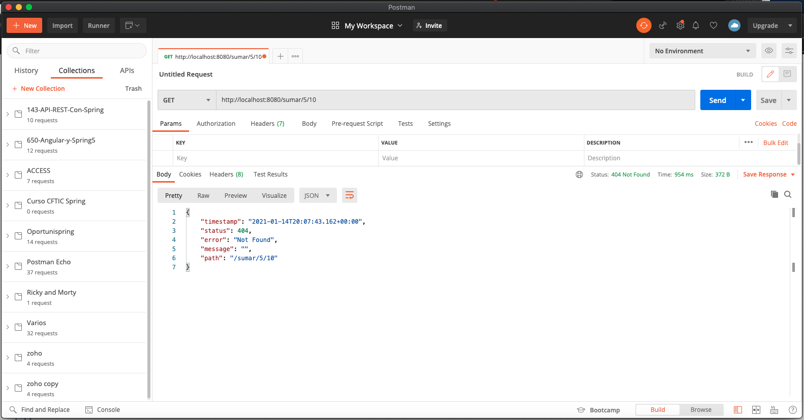

¡NO FUNCIONA! ¿a qué se puede deber?
Nos indica que la URL no existe. Lo que esta pasando que la clase `CalculadoraController` no la reconoce como una clase Controladora.

El problema es que la como ya habíamos visto antes la clase `Application` que tiene la anotación `Application` tiene la anotación `@SpringBootApplication` la cual equivale a tres anotaciones entre ellas la `@ComponentScan`, que por default toma el paquete `lanzador` como default, en el momento que hemos creado el paquete `controller` y metido allí nuestro Controller, este paquete no lo escanea y por lo tanto no lo reconoce, por lo que explicitamente tenemos que indicar en `Application` el `@ComponentScan` que necesitemos en este caso:

`Application`

```java
package lanzador;

import org.springframework.boot.SpringApplication;
import org.springframework.boot.autoconfigure.SpringBootApplication;
import org.springframework.context.annotation.ComponentScan;

@ComponentScan(basePackages = {"controller"})
@SpringBootApplication
public class Application {

   public static void main(String[] args) {
      SpringApplication.run(Application.class, args);
   }

}
```

Ahora si volvemos a probar todo funciona correctamente.


El desarrollo con Spring Boot se simplifica enormente.

## :computer: `113_microservicio_ficha`
### Ejemplo de la segunda aplicación Spring Boot.

Partiendo del proyecto `06_ficha_rest` vamos a hacer la versión con Spring Boot.

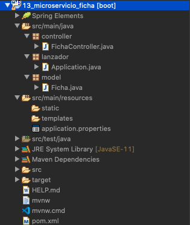

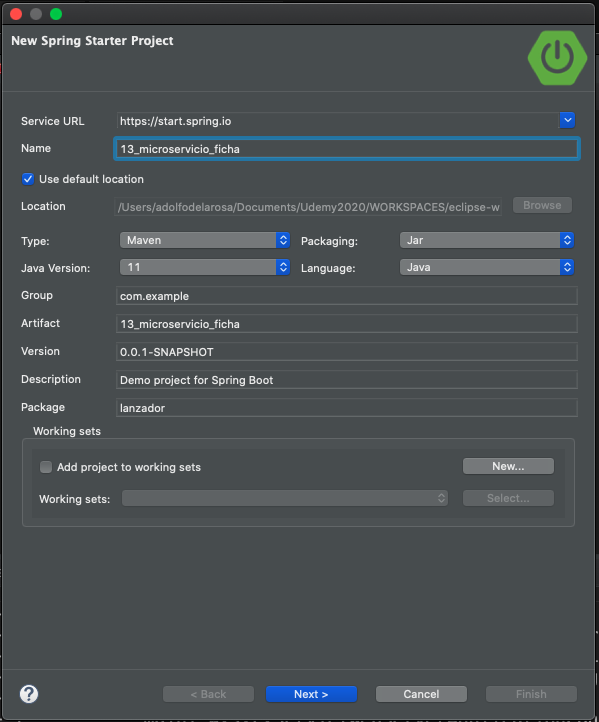
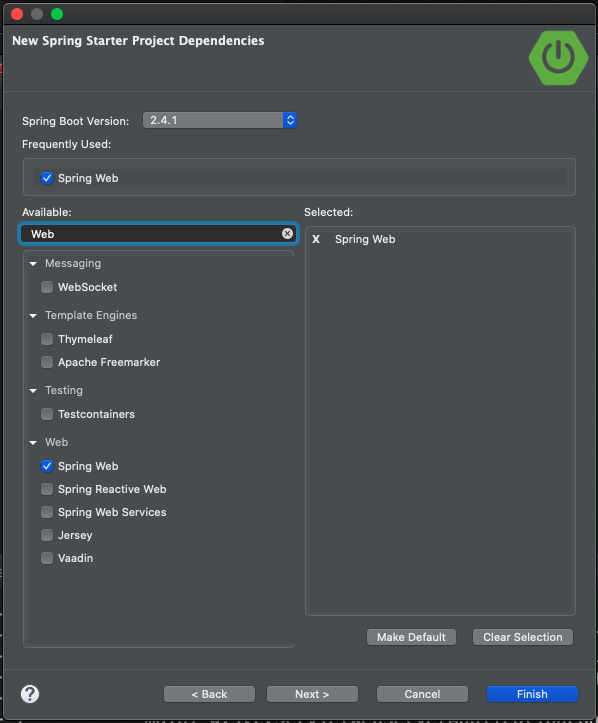

Creamos la estructura del proyecto y copiamos todo lo que teniamos del proyecto `06_ficha_rest`.

Es decir el Modelo y el Controller.

`Ficha`

```java
package model;

public class Ficha {
	
   private String nombre;
   private String dni;
   private int edad;
	
   public Ficha() {
      super();
   }
   public Ficha(String nombre, String dni, int edad) {
      super();
      this.nombre = nombre;
      this.dni = dni;
      this.edad = edad;
   }
   public String getNombre() {
      return nombre;
   }
   public void setNombre(String nombre) {
      this.nombre = nombre;
   }
   public String getDni() {
      return dni;
   }
   public void setDni(String dni) {
      this.dni = dni;
   }
   public int getEdad() {
      return edad;
   }
   public void setEdad(int edad) {
      this.edad = edad;
   }
}
```

`FichaController`

```java
package controller;

import org.springframework.http.MediaType;
import org.springframework.web.bind.annotation.GetMapping;
import org.springframework.web.bind.annotation.PathVariable;
import org.springframework.web.bind.annotation.RestController;

import model.Ficha;

@RestController
public class FichaController {

   @GetMapping(value="datos/{dni}", produces=MediaType.APPLICATION_JSON_VALUE)
   public Ficha datosPersona(@PathVariable("dni") String dni) {
      return new Ficha("prueba ficha", dni, 20);
   }
	
}
```

Una vez copiado estos paquetes lo unico que tengo que hacer es indicar en la clase `Application` que me escanee el paquete `controller`

`Application`

```java
package lanzador;

import org.springframework.boot.SpringApplication;
import org.springframework.boot.autoconfigure.SpringBootApplication;
import org.springframework.context.annotation.ComponentScan;

@ComponentScan(basePackages = {"controller"})
@SpringBootApplication
public class Application {

   public static void main(String[] args) {
      SpringApplication.run(Application.class, args);
   }

}
```

Como en el **starter Spring Web** ya esta incluido Jackson no debos incorporar ninguna dependencia adicional.

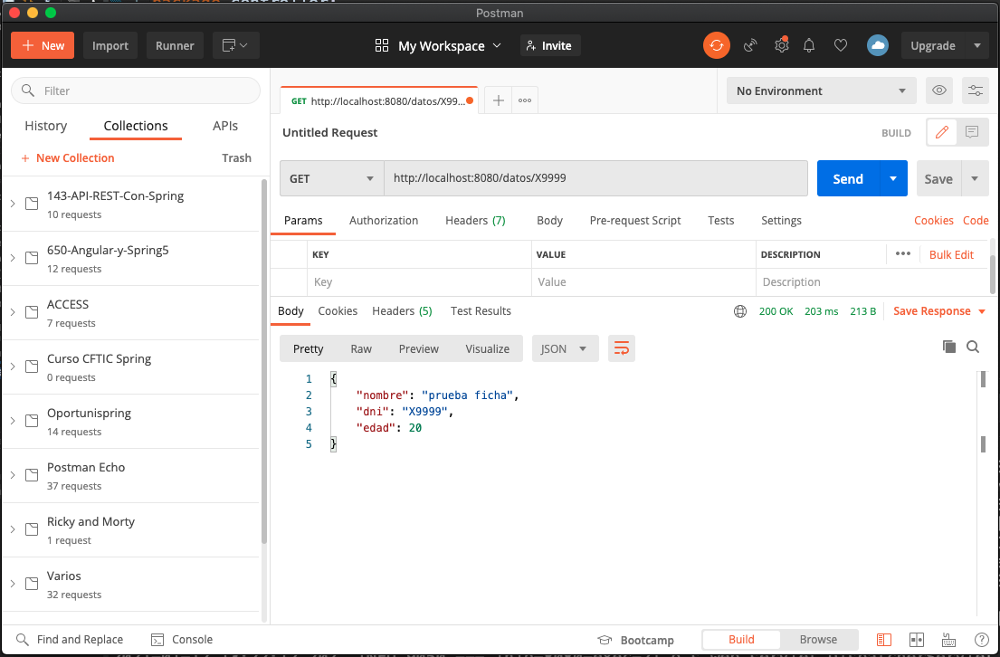

Al probar la aplicación esta nos funciona perfectamente.

#### Cambiar Puerto y Contexto

En el archivo `application.properties` podemos configurar multiples propiedades de la aplicación, hay miles de propiedades que podemos configurar desde el puerto, el contexto, acceso a datos, etc, para cambiar los valores por defecto.

Existe una página [Common Application properties](https://docs.spring.io/spring-boot/docs/current/reference/html/appendix-application-properties.html) donde podemos ver varias de las propiedades que podemos modificar dentro de Spring Boots clasificas por categoria.

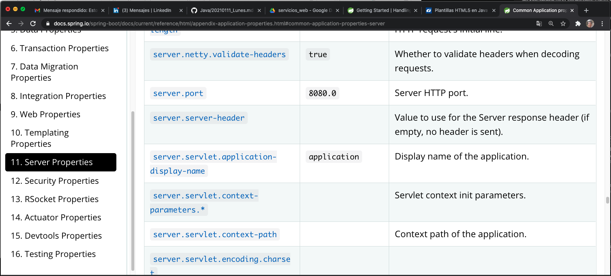

Hay más que no estan aquí. En la categoría Server Properties estan las propiedades para modificar el puerto por defecto o el contexto, lo que tendría que hacer para cambiarla es lo siguiente:

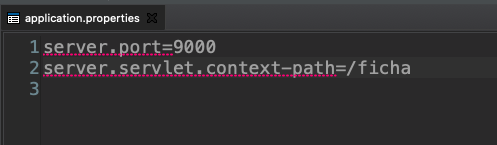

Entonces para probar otra vez nuestra aplicación con estos cambios de puerto y contexto tendríamos que meter la URL:

http://localhost:9000/ficha/datos/X9999

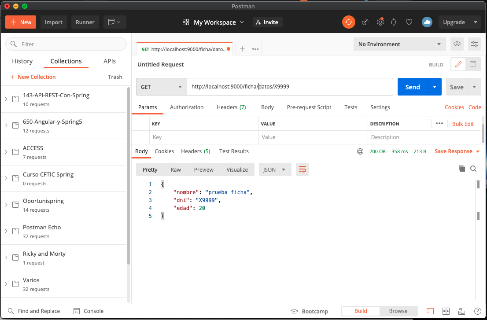

## :computer: `14_microservicio_crud_libros`
### Ejemplo de aplicación Spring Boot con Acceso a BD

Partiendo del proyecto `08_crud_libros` vamos a hacer la versión con Spring Boot, los cambios básicamente se tendrá en la configuración simplificandose mucho.


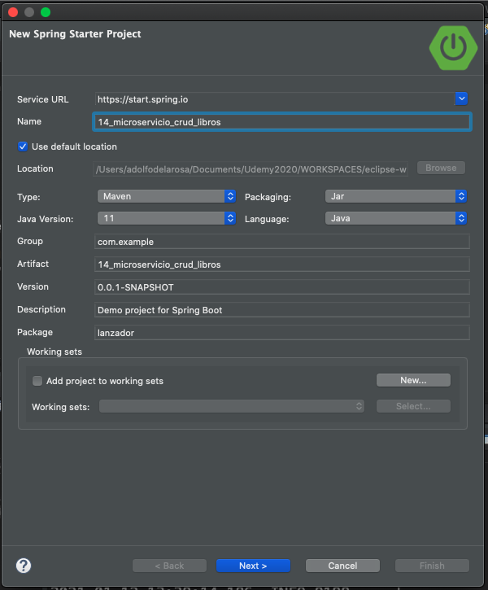
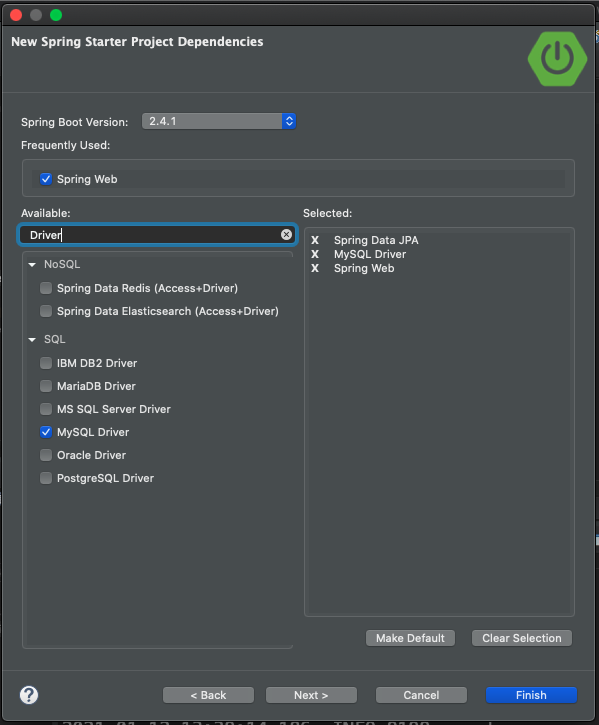

Los starter que se deben incluir son *Spring Web*, *Spring Data JPA* para el manejo de BD y ademá 
s necesitamos el Driver para MySQL es decir el starter que necesitamos es *MySQL Driver*. Esto en las Maven Dependencias incluira muchos JARs.

Copiamos los paquetes Model, Repository, Service y Controller del proyecto anterior, no cambia nada, como este código ya funcionaba no hay nii revisarlo.

Lo que si va a cambiar es la configuración vamos a empezar por la clase `Application`, donde debemos indicar que se deben escanear los paquetes controller y service

```java
@ComponentScan(basePackages = {"controller", "service"})
```

En este caso el paquete repository no lo hemos puesto por que si vemos lo que tenemos, vemos que es una Interface que no esta anotada con nada por eso no debemos scanear ese paquete.

```java
package repository;

import java.util.List;

public interface LibrosJpaRepository extends JpaRepository<Libro,Integer>{
   List<Libro> findByTematica(String tema);
}
```

Esto se debe a que estamos usando Spring Data JPA, en el caso de que solo usaramos JPA si que tendríamos que poner el paquete para ser escaneado por que en ese caso si existirián clases anotadas como `@Repository` pero en este ejemplo no es el caso.

Pero si revisamos lo que haciamos en la configuración dentro del `SpringConfig` del proyecto anterior,

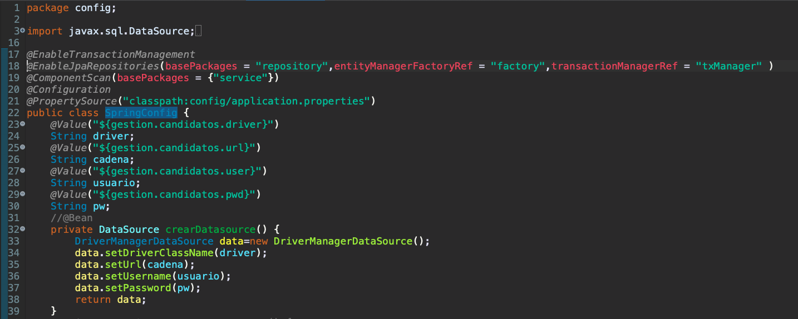

cuando se le tenia que decir el paquete donde se encontraba la interface Spring Data JPA se le indicaba con la anotación `@EnableJpaRepositories`, pues esa anotación tambien la debemos incluir en `Application` para decirle en que paquete se encuenta la Interface que hereda `JPARepository`

```java
@ComponentScan(basePackages = {"controller", "service"})
@EnableJpaRepositories(basePackages={"repository"})
```

Aun que como veimas en `SpringConfig` la anotación `@EnableJpaRepositories` llevaba más cosas pero en Spring Boots toda la configuración de Spring Data JPA e Hibernate esta predefinida, se configura por defecto, aun que lo del Drive, lo del DataSource eso no lo hace por defecto por que no vamos a usar el DataSource del servidor de aplicaciones ya que lo vamos a llevar embebido, debemos crearnos un DataSource propio por que llevamos embebido un servidor de aplicaciones, NO HAY UN SERVIDOR DE APLICACIONES COMUN EN EL QUE DESPLEGAMOS LAS COSAS. Pero todo lo referente al adaptador de Hibernate, lo de la unidad de persistencia, la transaccionalidad, se configura por defecto.


Otra anotación necesaria que debemos incluir en `Application` es `@EntityScan` que es una anotación propia de Spring Boot para indicarle en que paquete estan las Entidades

```java
@ComponentScan(basePackages = {"controller", "service"})
@EnableJpaRepositories(basePackages={"repository"})
@EntityScan(basePackages={"model"})
```

Asi que nuestra `Application` completa es:

`Application`

```java
package lanzador;

import org.springframework.boot.SpringApplication;
import org.springframework.boot.autoconfigure.SpringBootApplication;
import org.springframework.boot.autoconfigure.domain.EntityScan;
import org.springframework.context.annotation.ComponentScan;
import org.springframework.data.jpa.repository.config.EnableJpaRepositories;

@ComponentScan(basePackages = {"controller", "service"})
@EnableJpaRepositories(basePackages={"repository"})
@EntityScan(basePackages={"model"})
@SpringBootApplication
public class Application {
   public static void main(String[] args) {
      SpringApplication.run(Application.class, args);
   }

}
```

Con esto toda la configuración de Spring Data + Hibernate se sume por defecto, es decir que todos esos objetos que creabamos con el `SpringConfig` estuvieran ya creados y configurados de forma predeterminada.

Falta el DataSource que también se configura pero habría que indicale los datos de conexión a la BD, todo esto se debe proporcionar en el archivo `application.properties`


`application.properties`

```js
spring.datasource.driver-class-name=com.mysql.cj.jdbc.Driver
spring.datasource.url=jdbc:mysql://localhost:3306/libreria?serverTimezone=Europe/Madrid
spring.datasource.username=root
spring.datasource.password=root
#propiedades para que hibernate cree adecuadamente las instrucciones SQL
spring.jpa.hibernate.naming.implicit-strategy=org.hibernate.boot.model.naming.ImplicitNamingStrategyLegacyJpaImpl
spring.jpa.hibernate.naming.physical-strategy=org.hibernate.boot.model.naming.PhysicalNamingStrategyStandardImpl
server.port=8000
```


 
