# 20210120 Miercoles

## Spring Cloud


Spring Cloud son una serie de soluciones basadas en Spring para el despliegue y utilización de MicroServicios en la nube, tener servicios en la nube tiene entre otros inconvenientes que el cliente que interactue com los MicroServicios tenga que conocer donde estan, eso es inviable, entonces para resolver ese problema hay una serie de tecnologías que forman parte de Spring Cloud que nos van a ayudar a solucionar los problemas que se nos presenten en los MicroServicios.

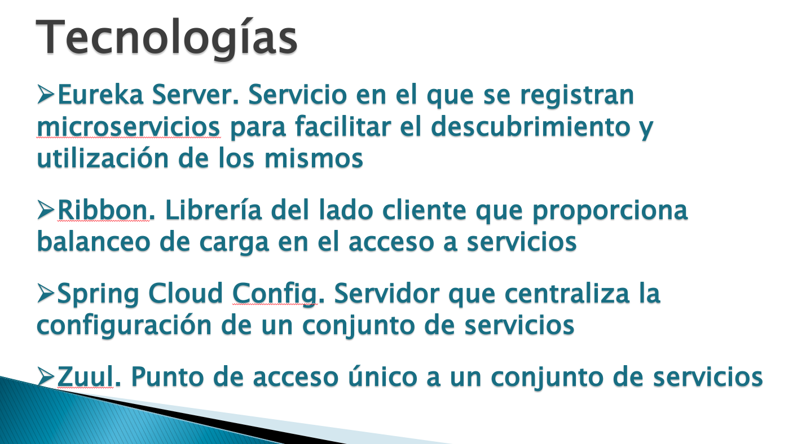

Las tecnologías que vamos a utilizar son:

* Eureka Server
* Ribbon
* Spring Cloud Config
* Zuul

Aunque en las ultimas versiones de Spring Cloud una de estas tecnologías se ha quedado como obsoleta y se tiene que sustituir por otra.

Tanto Eureka Server, Spring Cloud Config y Zuul son un tipo especial de MicroServicios y Ribbon es una librería.

Eureka Server va a ser un MicroServicio en el que se van a registrar los demas MicroServicios, para facilitar la visibilidad de los MicroServicios.

Ribbon proporciona balance de carga.

Spring Cloud Config centraliza la configuración de un conjunto de servicios.

Zuul nos proporciona un punto de acceso único a un conjunto de servicios, una solución para el cliente final.

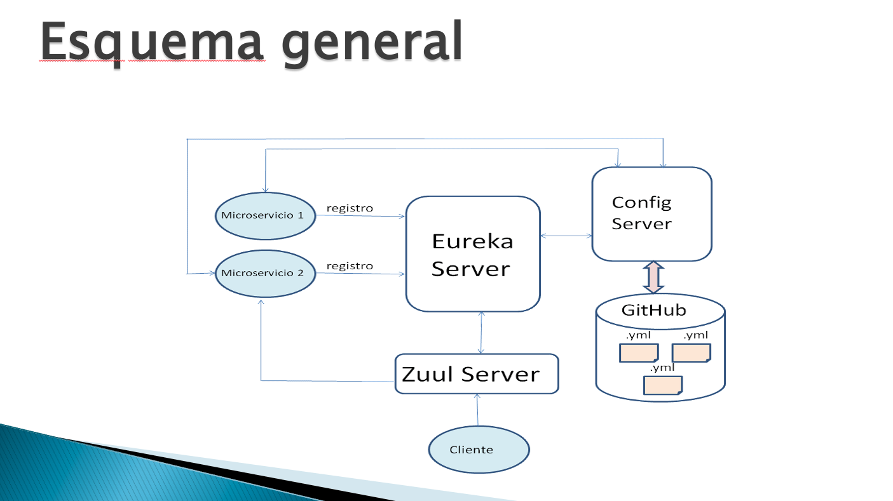

Este es un esquema general de todos los elementos.

## Servidor Eureka


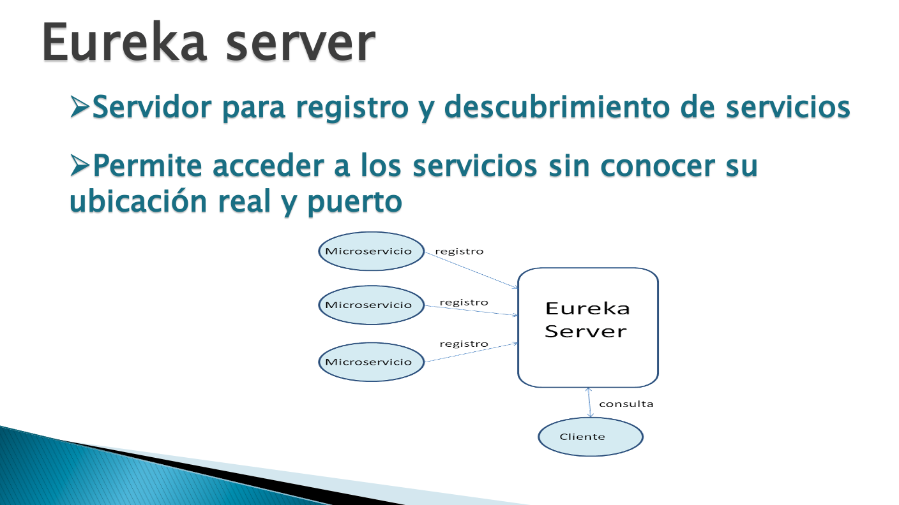

Inventado por Netflix integrado por Spring en el proyecto Spring Cloud Netflix. La idea es que si tenemos un grupo de MicroServicios que tienen que interactuar entre si en lugar que lo hagan directamente entre ellos, lo hagan a través del Servidor Eureka. En la imagen tenemos 4 MicroServicios, uno es el Cliente que tiene que interactuar entre los otros 3, para evitar que este llamando a cada uno de ellos se hace a traves de Eureka Server, que por un lado permite a los MicroServicios que van a ser llamados por otros, registrarse, en ese registro lo que se guarda es una especie de tabla donde se indica donde esta cada MicroServicio fisicamente, y entonces cuando otro MicroServicio quiere llamar a otro MicroServicio se consulta a través de Eureka a través de un nombre, si algún servicio se despliega en otro sitio se lo indica a Eureka para que cuando el Cliente quiera usarlo lo pueda encontrar, por lo que en el código del MicroServicio que consulte a otro ya no tendremos que incluir la dirección física para que lo encuentre escribiremos el nombre que se registra en Eureka.

La consulta que hace el Cliente a Eureka lo hace utilizando la librería RIBBON que tendremos que integrar en el MicroServicio Cliente, para que haga las consultas a Eureka y les diga donde esta el MicroServicio solicitado.

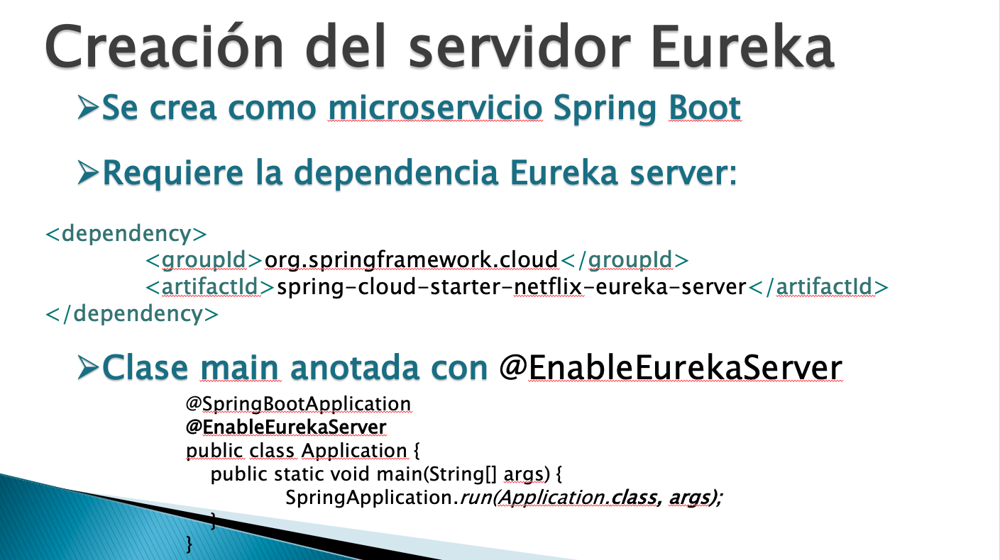

¿Cómo se crea un Servidor Eureka?

Es otro MicroServicio pero especial, así que lo vamos a crear como hemos creado los MicroServicios de Spring Boot y para crearlo lo único que va a necesitar es incluir el Starter `spring-cloud-starter-netflix-eureka-server` solamente se necesitara meter una anotación y hacer una configuración en su `application.properties` para este tipo de servicios, en este servidor NO VA A HABER CÓDIGO, lo único que tendrá es el Lanzador que tendra la anotación `@EnableEurekaServer` y por otro lado vamos a tener su configuración en un archivo `application.properties` o en un archivo `application.yml` que es la tendencia.

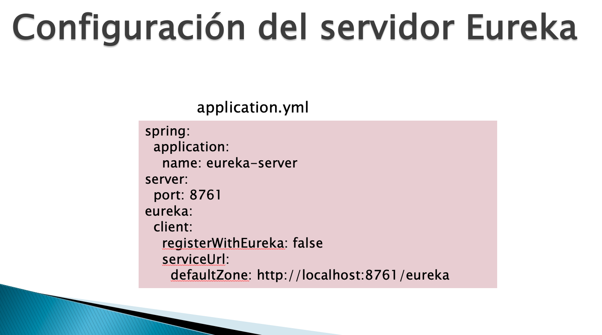

Esta es una configuración básica de ejemplo, pero en el momento que usamos Spring Cloud todos los servicios implicados deben tener un nombre es decir una propiedad `spring.application.name`, el puerto por convención para el Servidor Eureka es 8761, con la propiedad `registerWithEureka:false` le estamos indicando que este servicio no se registre en Eureka, por ser el mismo Eureka como se va a registrar en si mismo, la ultima propiedad no se necesita en el Servidor Eureka, no debe estar en la diapositiva.

## :computer: `26_servidor_eureka`
### Servidor Eureka

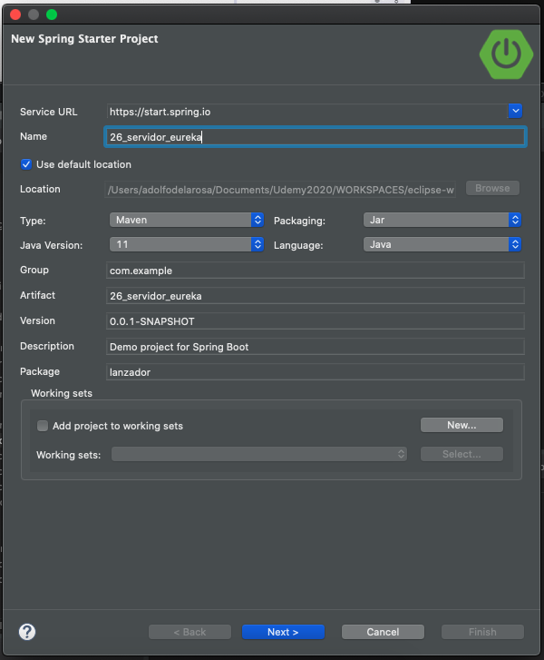
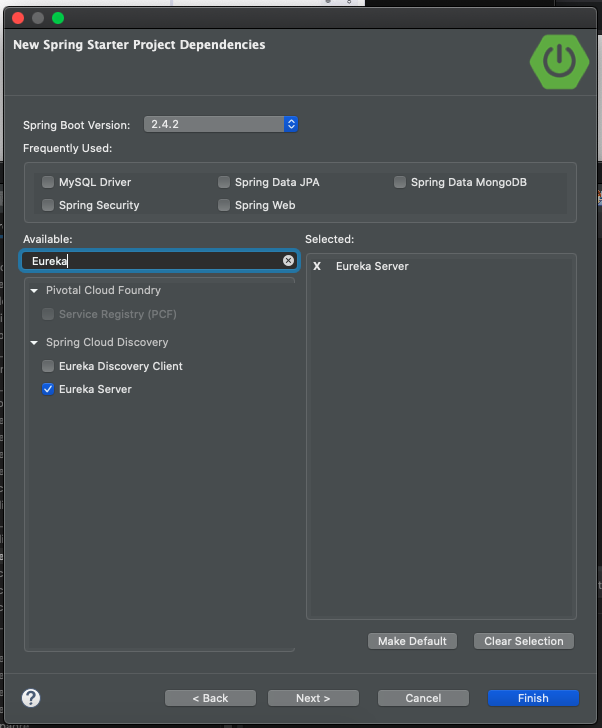

Este proyecto solo necesita la dependencia Eureka Server. 

Si vemos las dependencias Maven que se descargan al crear el proyecto veremos que tiene muchas.

En el lanzador metemos la anotación `@EnableEurekaServer`.

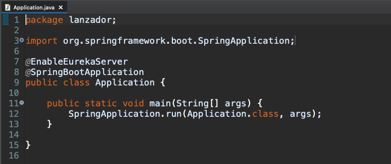

Para la configuración no vamos a usar el `application.properties` que podríamos pero lo vamos a borrar y vamos a crear el archivo `application.yml` de la siguiente manera:


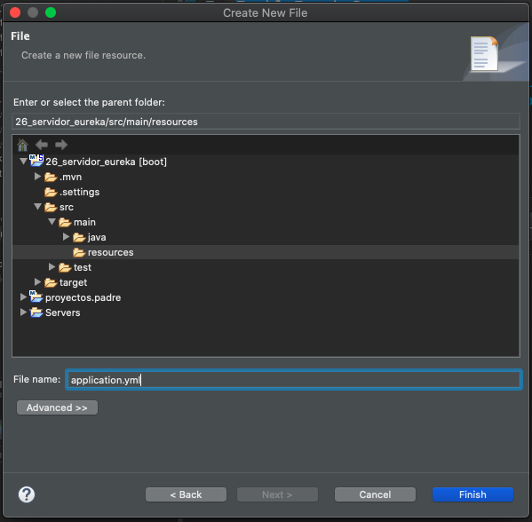

En este archivo `application.yml` vamos a meter la configuración:

```txt
server:
  port: 8761
spring:
  application:
    name: eureka-server
eureka:
  client:
    register-with-eureka: false
   
```

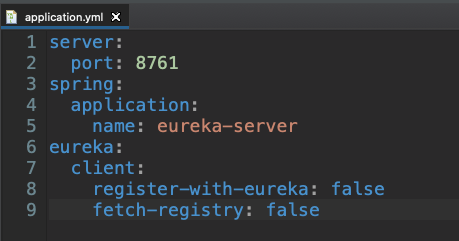

Lo primero que hacemos es asignar el puerto, darle un nombre a este servicio, indicarle que que no se se registre Eureka en si mismo, por defecto es `true` por eso hay que ponerla explicitamente.

Si arrancamos el servidor vemos en el Log lo siguiente:


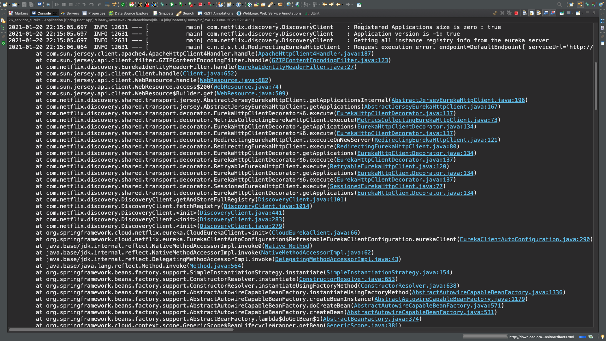

Vemos una serie de exepciones que tienen que ver con el `register-with-eureka: false`, al decirle que no se registre así mismo el intenta comprobar cosas y y algo allí que falla por eso vemos esas excepciones, esto se resuelve añadiendo otra propiedad, `fetch-registry: false`.


```txt
server:
  port: 8761
spring:
  application:
    name: eureka-server
eureka:
  client:
    register-with-eureka: false
    fetch-registry: false
```

Si arrancamos nuevamente ya no vemos las excepciones.

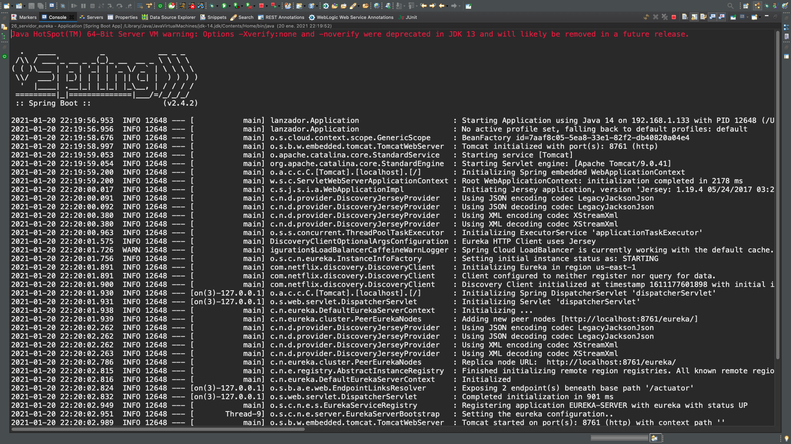
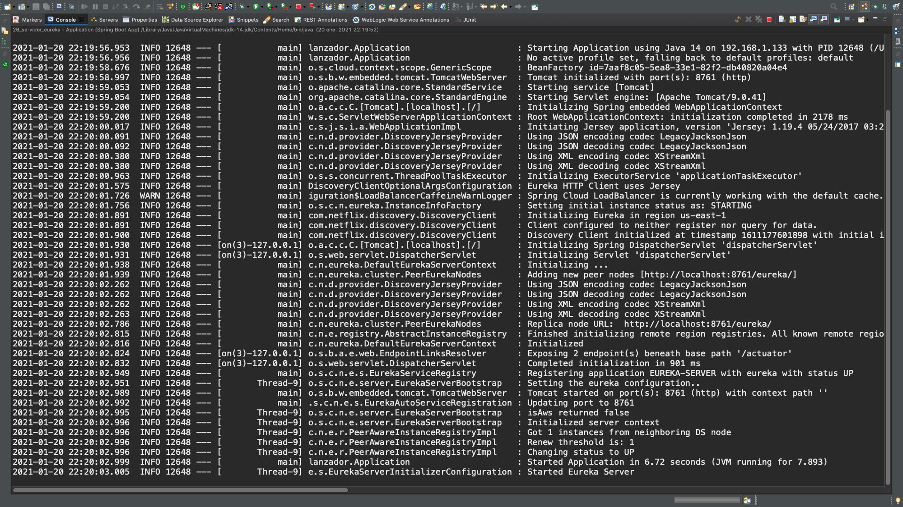

Vamos a aarancar la aplicación y en el navegador vamos a poner la URL http://localhost:8761/

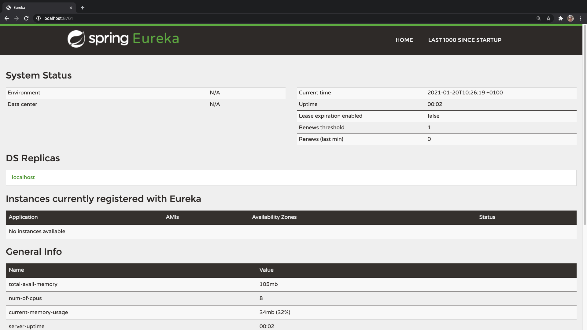
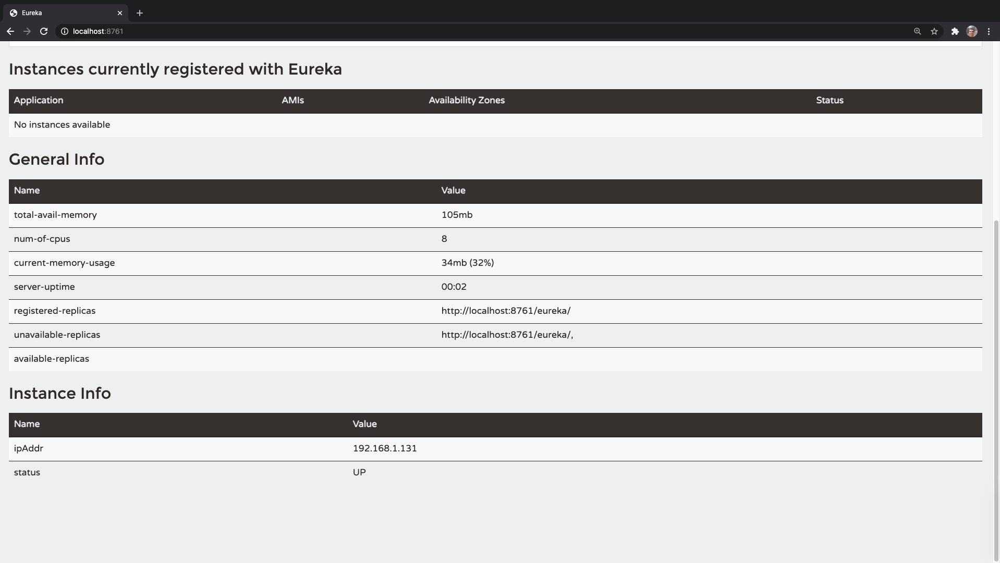

Eureka nos ofrece un Dashboard en la que podemos ver varias cosas como los servicios que hay registrados, que por el momento no tenemos nada registrado, entre más información que nos proporciona como la Dirección IP.

Una vez que ya tenemos configurado nuestro Servidor Eureka, el siguiente paso es registrar los Servicios en el, pero para poder hacer eso necesitamos añadir alguna dependencia a los MicroServicios.


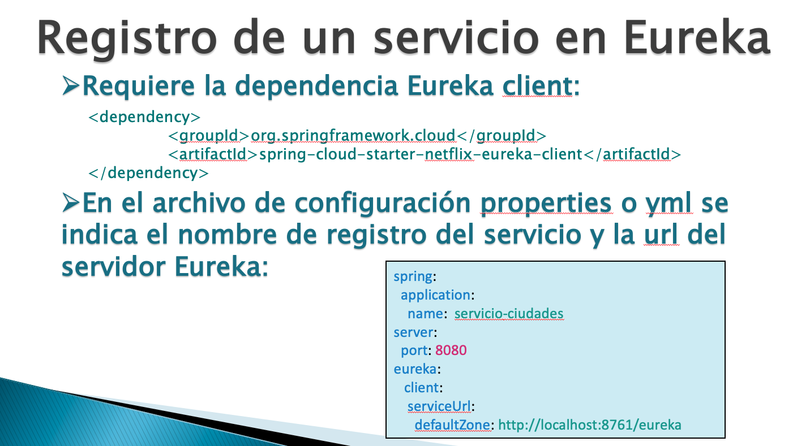

A cada servicio que queramos incorporamos incorporar en el Servidor Eureka debemos añadir la dependencia *Eureka Client* `spring-cloud-starter-netflix-eureka-client` y en el archivo de configuración de ese archivo que queramos registrar es muy importarle ademas de lo que tiene es un nombre de servicio que es el con el que se va a registrar en la tabla, con el identificador que le asociemos a esa propiedad y otra cosa importa es indicarle donde esta Eureka, si esta ultima propiedad parece ser que se busca por defecto en esta ruta. Euroka es necesario saber donde está, este no se descubre, que es un sitio unico que no se va a mover. Los que se mueven y no se sabe donde estan son los propios MicroServicios. ***En resumen es lo único que hay que hacer la dependencia y estas dos propiedades***.

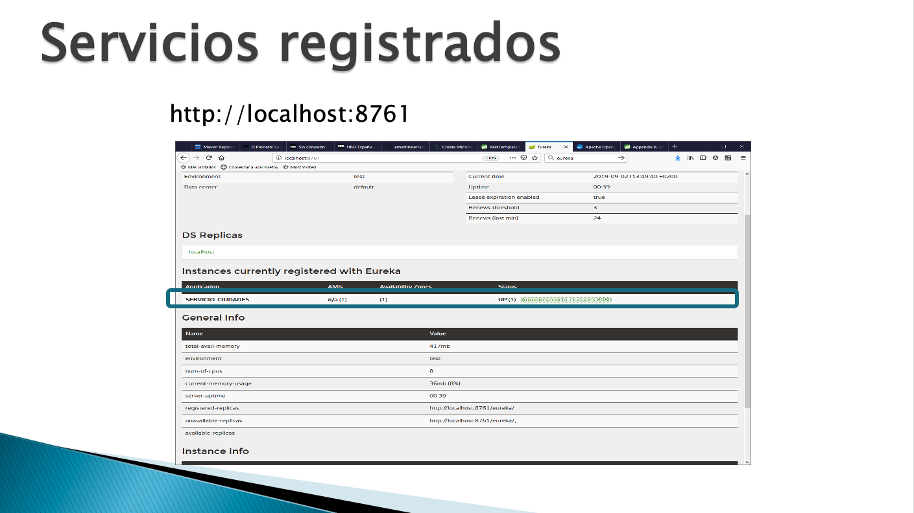

Una vez ya registrado el MicroServicio lo veremos registrado en Eureka.

Vamos a hacerlo.

## :computer: `27_microservicio_formacion_en_eureka`
### MicroServicio que se va a registrar en Eureka.

Vamos a hacer una copia del proyecto `15_microservicio_crud_formacion` y lo vamos a llamar `27_microservicio_formacion_en_eureka`, una vez hecho eso vamos a incluir la dependencia **Eureka Discovery Client**

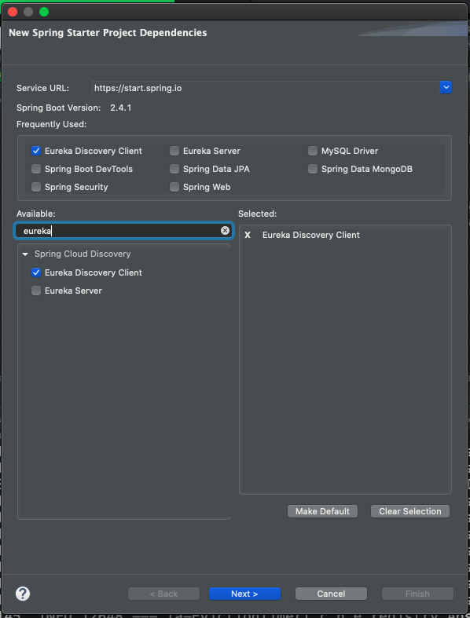

Con esto se añade en el `pom.xml` el starter `spring-cloud-starter-netflix-eureka-client`, hacerlo con el ADD Dependencias y no manualmente que da problemas.

Actualmente en este proyecto ya tenemos un `application.properties` con propiedades como el puerto, acceso a datos y propiedades Hibernate. Vamos a conservar el archivo `application.properties` y vamos a añadir el `application.yml` con las propiedades que comentabamos antes el ***Nombre de la Aplicación*** y ***Ubicación de Eureka***.

```txt
spring:
 application:
  name: servicio-formacion
eureka:
 client:
  service-url:
   defaultZone: http://localhost:8761/eureka 
```

Teniendo arrancado el Servidor Eureka, vamos a arrancar este servicio y vamos a recargar la URL http://localhost:8761/ tenemos:

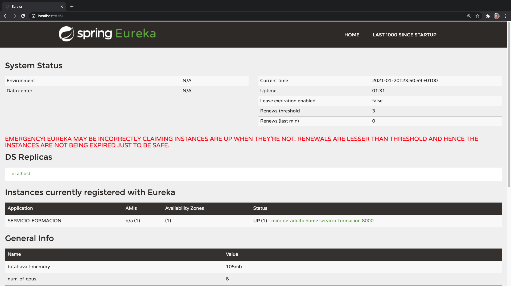
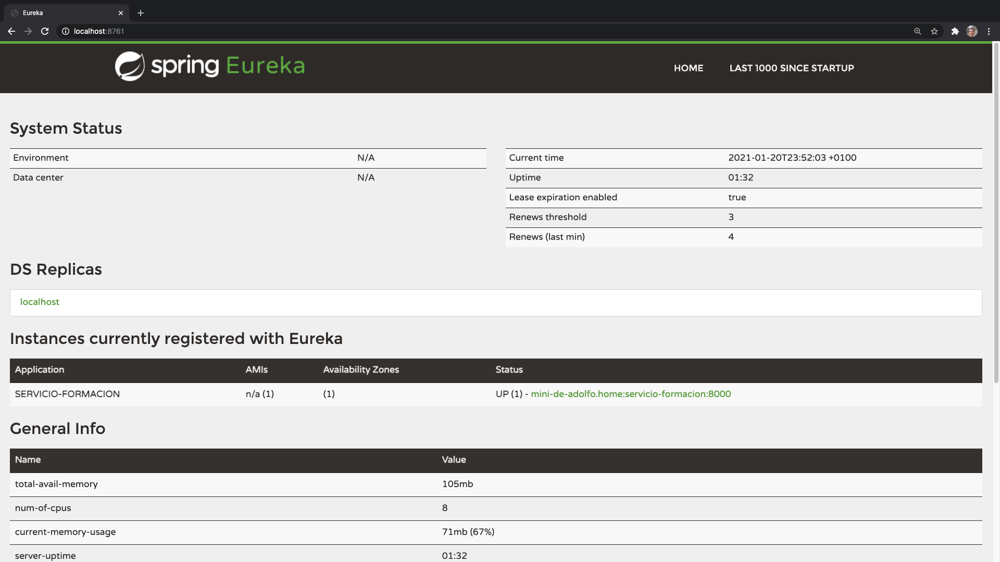

Como vemos ya nos aparece el nombre del servicio registrado.

Si le damos al enlace abre el URL http://mini-de-adolfo.home:8000/actuator/info


Bueno con esto ya tenemos un Servicio para ser descubierto por otros MicroServicios que lo quieran usar, que es la otra pata.

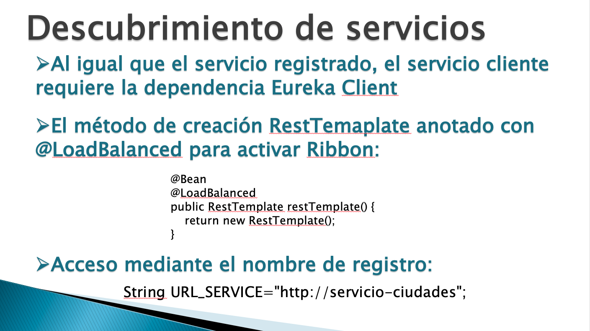

¿Cómo hago para que un servicio que esta usando otro servicio ahora lo pueda usar a través de Eureka?

Ese servicio Cliente de este MicroServicio debe acceder por Eureka, va a necesitar también la dependencia **Eureka Client** por lo que necesitamos añadirla en los Starter. Además ahora el acceso se debe hacer a través de esa librería llamada RIBBON,  

No es que el MicroServicio Cliente acceda directamente a Eureka, es RIBBON la que consulta esa tabla en Eureka y obtiene la dirección real que tenga en ese momento el MicroServicio al que se quiera acceder por parte del Servicio Cliente, con esa dirección ya el MicroServicio Cliente se lanza al otro MicroServicio.

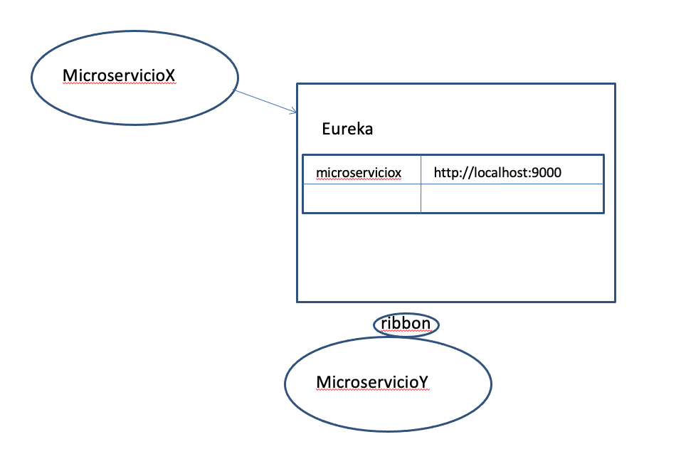

Para activar RIBBON es necesario que nuestro `RestTemplate` que es el objeto que usamos para acceder a un Servicio se genere mediante la anotación `@LoadBalanced` y ademas ese Cliente que antes usaba la  URL http://localhost:8080 ahora va a utilizar http://nombre-servicio la dirección digamos virtual, el nombre virtual con que esta registrado en Eureka, en la tabla que tenemos en el DashBoard de Eureka, y ya no vamos a tener que meter la dirección real de ese código que va a estar cambiando constantemente, gracias a que se ha activado RIBBON puede consultar a Eureka para que le diga donde esta ubicado fisicamente el MicroServicio que se quiere acceder.

***En resumen en el MicroServicio Cliente debemos anotar con `@LoadBalanced` nuestro `RestTemplate` y además cambiar la dirección fisica por una dirección virtual del Servicio que necesitemos acceder***.

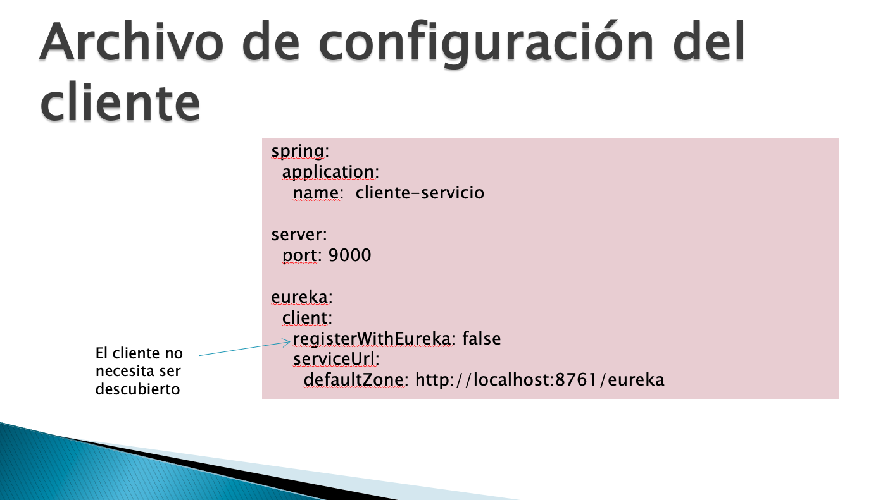

A nivel de Configuración lo que debemos hacer es darle un nombre al MicroServicio, la configuración de Eureka donde le decimos si el MicroServicio cliete queremos que se registre o no con la propiedad `registerWithEureka: false` si queremos que se descubra no se pone esta propiedad que es la determinada, (El puero no me queda claro).

## :computer: `28_micro_cliente_formacion_por_eureka` 
### MicroServicio Cliente

Vamos a copiar el proyecto `16_micro_cliente_formacion` que es el MicroServicio Cliente y lo vamos a llamar `28_micro_cliente_formacion_por_eureka`.

Lo primero que vamos a hacer es añadir el Starter de Eureka Client

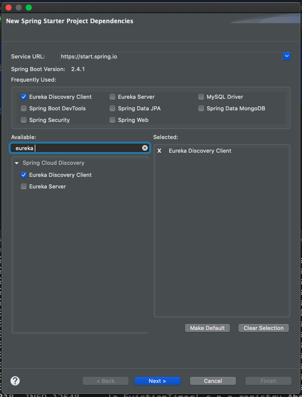

Cambios que debemos hacer en el código, en nuestra capa de Servicio tenemos la URL apuntando a la dirección física del MicroServicio que queremos consultar, 

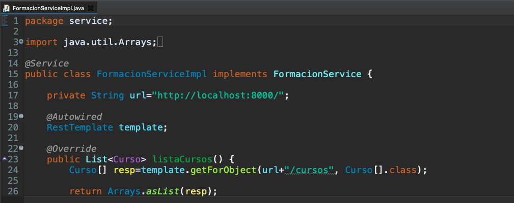

la idea es que si lo vamos a consultar por Eureka no debemos conocer ni la dirección ni el puerto, solo el identificador del servicio es decir vamos a cambiar `http://localhost:8000/` por  `http://servicio-formacion/cursos`, sustituimos la combinación IP-puerto por el nombre del servicio que eso no va a cambiar. Gracias a que esto va a ser un servicio que se va a lanzar con Eureka cuando se haga una petición `getForObject` se activa RIBBON ve `http://servicio-formacion/cursos` y va a consultar en Eureka que le dice la dirección real y ya se puede ir al MicroServicio a consultar, pero para que se active ese RIBBON es necesario que el método que crea el `RestTemplate`  incluya `@LoadBalance` para activar la libreria RIBBON en el momento que cree los `RestTemplate` y pueda ese identificador y saber que se tiene que ir a Eureka a buscar.

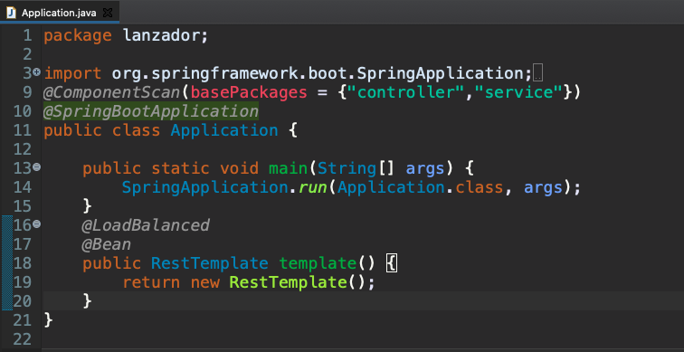

En cuanto a la configuración necesitamos incluir el Nombre del Servicio y la ubicación del Servidor Eureka.

```txt
spring:
  application:
    name: servicio-cliente-formacion
eureka:
  client:
    register-with-eureka: false
    service-url:
      defaultZone: http://localhost:8761/eureka 
```
En este caso no estamos registrando al Cliente con Eureka ya que estamos poniendo la propiedad `register-with-eureka: false` sino lo tuviera se registraría y podría ser descubierto por otros MicroServicios.

Teniendo ya arrancados el Servidor de Eureka y el MicroServicio de Formación, arrancamos el Cliente de Formación, como no le pusimos puerto se arranca en el 8080.

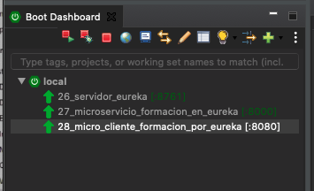

Para probar el MicroServicio Cliente nos vamos a Postman y metémos las URLs:

* http://localhost:8080/cursos
* http://localhost:8080/alumnos/1

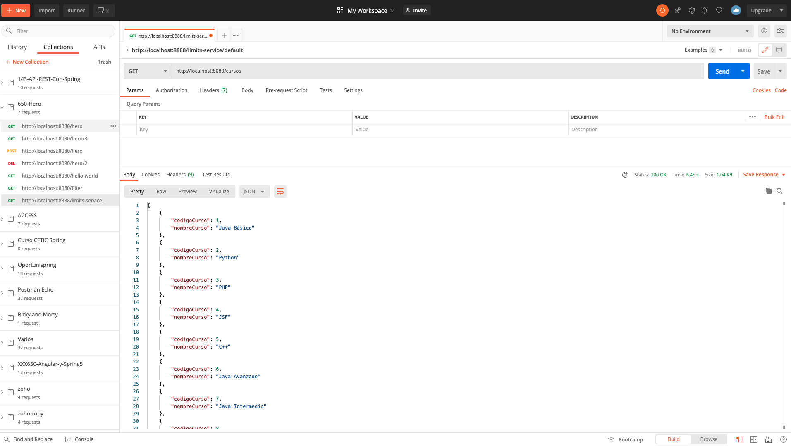
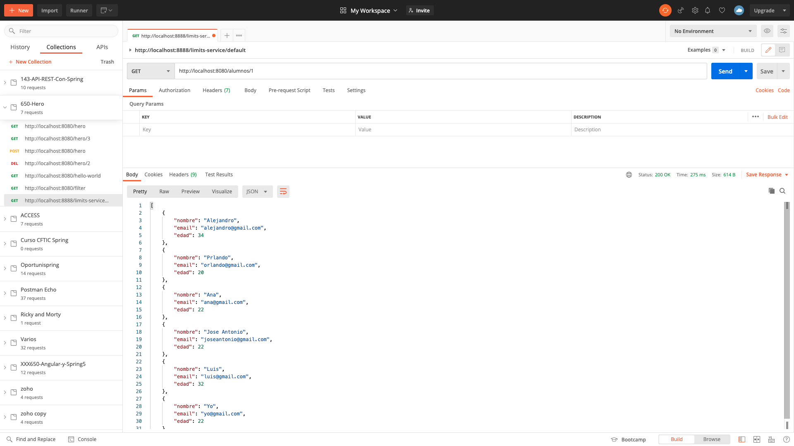

Que son los métodos en el Controlador del MicroServicio Cliente.

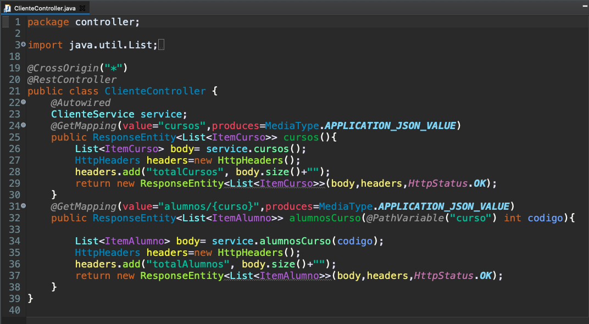

Como este MicroServicio Cliente no lo registramos en Eureka no cuenta con un Nombre en el Registro de Eureka 

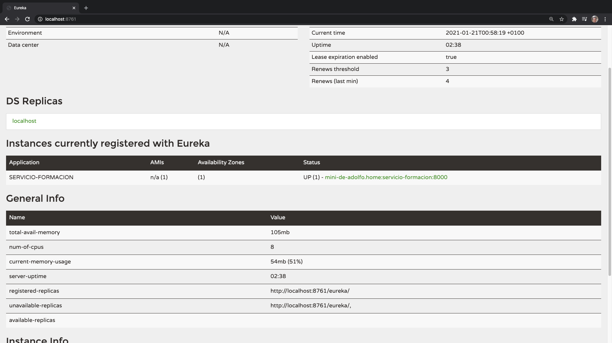

Y aun que lo tuviera la forma de probar los MicroServicios en Postman se hace por medio de la dirección física por que Postman no tiene RIBBON integrado para usar la dirección virtual.

**NOTA**: Podemos parar los tres servicios a la vez pero para arrancalos el primero que debe arrancar es Eureka y después los demas.

## :computer: Ejercicio MicroServicios Tienda Virtual

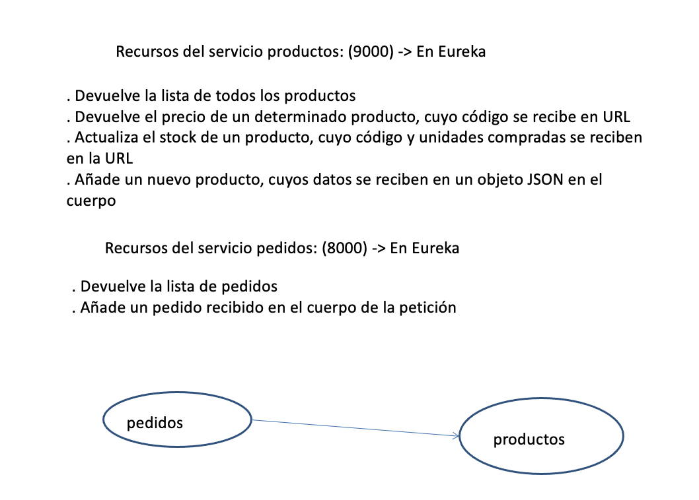
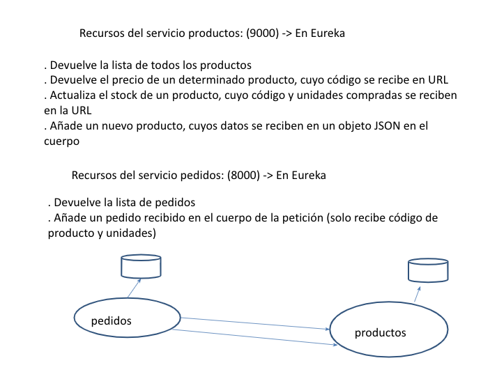

Realizar los MicroServicios que se mencionan anterior.

Tenemos la BD `tiendavirtual` con dos tablas `productos` y `pedidos`.
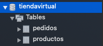

Actualmente las tablas contienen los siguientes dataos.
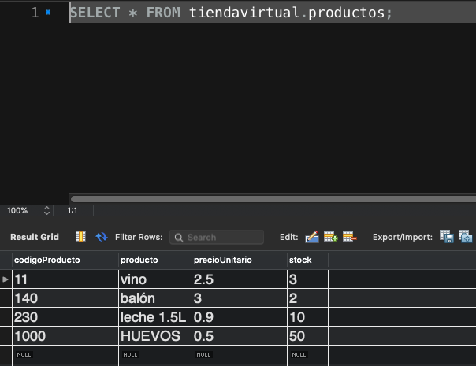

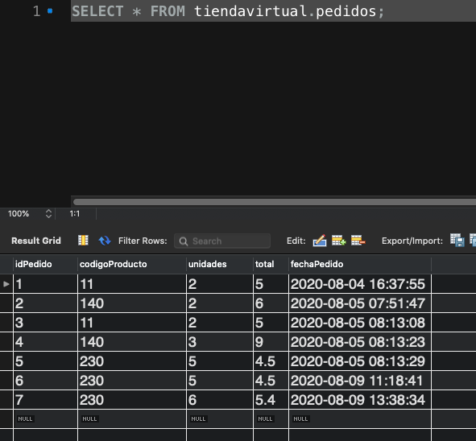

Este proyecto va a contener varios proyectos con diferentes MicroServicios, vamos a ir creando uno a uno.

### :computer: `29_microservicio_productos_en_eureka`
#### MicroServicio encargado de Gestionar la Tabla Productos de la BD.

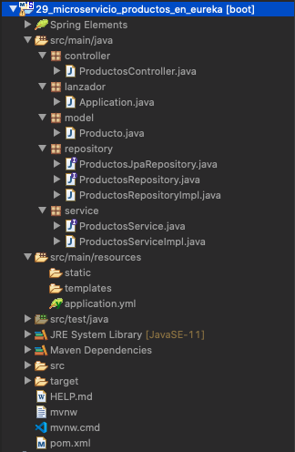

Vamos a crear el proyecto `29_microservicio_productos_en_eureka` como un proyecto Spring Boot con las siguientes dependencias:

* Spring Web
* Spring Data JPA
* MySQL Driver.

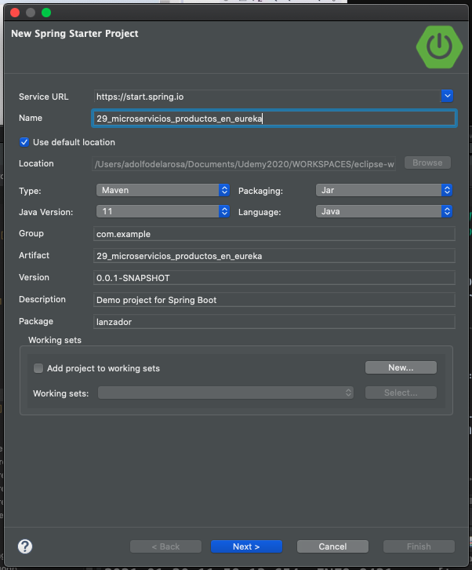
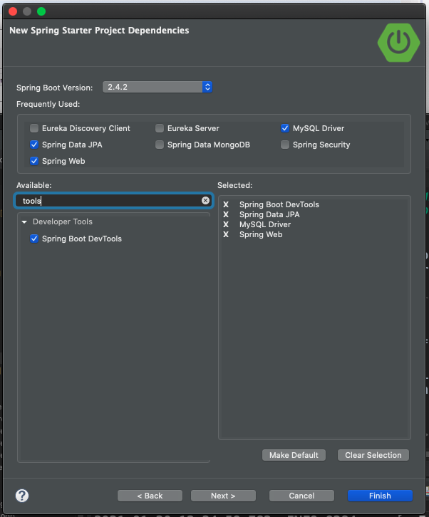

Este MicroServicio debe quedar registrado en el Servidor Eureka creado en el proyecto 26, por lo que también debemos incluir la dependencia:

* Eureka Discovery Client

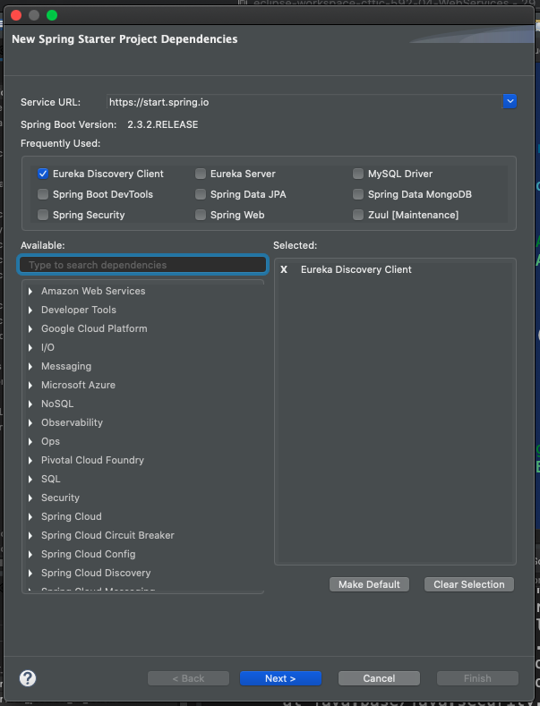

#### Crear el Modelo

Vamos a crear la Entidad `Producto` con los atributos exactamente con los nombres que tenemos en la Tabla `productos` de la BD.

`Producto`

```java
package model;

import javax.persistence.Entity;
import javax.persistence.Id;
import javax.persistence.Table;

@Entity
@Table(name = "productos")
public class Producto {
   @Id
   private int codigoProducto;
   private String producto;
   private double precioUnitario;
   private int stock;
	
   public Producto() {
      super();
   }
	
   public Producto(int codigoProducto, String producto, double precioUnitario, int stock) {
      super();
      this.codigoProducto = codigoProducto;
      this.producto = producto;
      this.precioUnitario = precioUnitario;
      this.stock = stock;
   }
	
   public int getCodigoProducto() {
      return codigoProducto;
   }
   public void setCodigoProducto(int codigoProducto) {
      this.codigoProducto = codigoProducto;
   }
   public String getProducto() {
      return producto;
   }
   public void setProducto(String producto) {
      this.producto = producto;
   }
   public double getPrecioUnitario() {
      return precioUnitario;
   }
   public void setPrecioUnitario(double precioUnitario) {
      this.precioUnitario = precioUnitario;
   }
   public int getStock() {
      return stock;
   }
   public void setStock(int stock) {
      this.stock = stock;
   }
	
}
```

#### Crear el Repositorio

En el Repositorio vamos a comenzar creando la interface que `ProductosJpaRepository` que extiende a `JpaRepository`.

`ProductosJpaRepository`
```java
package repository;

import org.springframework.data.jpa.repository.JpaRepository;

import model.Producto;

public interface ProductosJpaRepository extends JpaRepository<Producto, Integer> {

}
```

Lo siguiente que vamos a hacer es crear la Interface y Clase que vamos a usar en la Capa de Servicio. 
> DE ESTA MANERA NO HACEMOS DEPENDIENTE A LA CAPA DE SERVICIO PARA QUE SIEMPRE UTILICE SPRING DATA JPA(ya que inyectamos la Interface). Lo suyo es que cada capa de Repositorio tenga una Interface Neutra que tenga los métodos necesarios de modo que la Capa de Servicio llame a estos métodos que no dan a entender que estoy usando Spring Data JPA, que si que lo hago inyectando directamente la Interface de SPRING DATA JPA en el Servicio. La implementación ya es la que va a determinar que tecnología estoy usando, si JDBC, JPA, Spring Data JPA, Spring Data Mongo, etc. incluso puedo tener todas a la vez. TENGO UNA INTERFACE NEUTRA y VARIAS IMPLEMEN¨TACIONES. 

En la Interface vamos a colocar el Contrato de todos los métodos que vamos a usar en nuestro proyecto.

`ProductosRepository`

```java
package repository;

import java.util.List;

import model.Producto;

public interface ProductosRepository {
   List<Producto> findAll();
   void updateProducto(Producto prod);
   Producto findByCodigo(int codigoProducto);
   void saveProducto(Producto producto);
}
```

Con la Clase `ProductosRepositoryImpl` vamos a implementar la Interface `ProductosRepository` apoyandonos de la Interface `ProductosJpaRepository` que tendremos que inyectar.

`ProductosRepositoryImpl`

```java
package repository;

import java.util.List;

import org.springframework.beans.factory.annotation.Autowired;
import org.springframework.stereotype.Repository;

import model.Producto;
@Repository
public class ProductosRepositoryImpl implements ProductosRepository {
   
   @Autowired
   ProductosJpaRepository repository;
	
   @Override
   public List<Producto> findAll() {
      return repository.findAll();
   }

   @Override
   public void updateProducto(Producto prod) {
      repository.save(prod);
   }
   
   @Override
   public Producto findByCodigo(int codigoProducto) {
      return repository.findById(codigoProducto).orElse(null);  
   }

   @Override
   public void saveProducto(Producto producto) {
      repository.save(producto);
   }

}
```

#### Crear el Servicio

Vamos a crear la interface y clase para el Servicio.

`ProductosService`

```java
package service;

import java.util.List;

import model.Producto;

public interface ProductosService {
   List<Producto> allProductos();
   void updateStock(int codigoProducto, int unidades);
   void guardarProducto(Producto producto);
}
```

`ProductosServiceImpl`

```java
package service;

import java.util.List;

import org.springframework.beans.factory.annotation.Autowired;
import org.springframework.stereotype.Service;

import model.Producto;
import repository.ProductosRepository;
@Service
public class ProductosServiceImpl implements ProductosService {
   @Autowired
   ProductosRepository repository;
	
   @Override
   public List<Producto> allProductos() {
      return repository.findAll();
   }

   @Override
   public void updateStock(int codigoProducto, int unidades) {
      Producto prod=repository.findByCodigo(codigoProducto);
      if(prod!=null&&prod.getStock()>=unidades) {
         prod.setStock(prod.getStock()-unidades);
         repository.updateProducto(prod);
      }
   }

   @Override
   public void guardarProducto(Producto producto) {
      if(producto!=null) {
         repository.saveProducto(producto);
      }
   }

}
```

#### Crear el Controlador

`ProductosController`

```java
package controller;

import java.util.List;

import org.springframework.beans.factory.annotation.Autowired;
import org.springframework.http.MediaType;
import org.springframework.web.bind.annotation.CrossOrigin;
import org.springframework.web.bind.annotation.GetMapping;
import org.springframework.web.bind.annotation.PathVariable;
import org.springframework.web.bind.annotation.PostMapping;
import org.springframework.web.bind.annotation.PutMapping;
import org.springframework.web.bind.annotation.RequestBody;
import org.springframework.web.bind.annotation.RestController;

import model.Producto;
import service.ProductosService;

@CrossOrigin(origins = "*")
@RestController
public class ProductosController {

   @Autowired
   ProductosService service;
   
   @GetMapping(value="productos", produces=MediaType.APPLICATION_JSON_VALUE)
   public List<Producto> productos(){
      return service.allProductos();
   }
	
   @PutMapping(value="producto/{codigo}/{unidades}")
   public void actualizarProducto(@PathVariable("codigo") int codigo, @PathVariable("unidades") int unidades) {
      service.updateStock(codigo, unidades);
   }
	
   @GetMapping(value="precio/{codigo}",produces=MediaType.TEXT_PLAIN_VALUE)
   public String consultarPrecio(@PathVariable("codigo") int codigo) {
      return productos()
            .stream()
            .filter(p->p.getCodigoProducto()==codigo)
            .findFirst()
            .get()
            .getPrecioUnitario()+"";
   }
   
   @PostMapping(value="producto", consumes=MediaType.APPLICATION_JSON_VALUE)
   public void guardarProducto(@RequestBody Producto producto) {
      service.guardarProducto(producto);
   }
}
```

* Para el método `consultarPrecio` sería mejor tener un método en el servicio que nos regrese directamente el precio.

#### Configuración en el Lanzador

`Application`

```java
package lanzador;

import org.springframework.boot.SpringApplication;
import org.springframework.boot.autoconfigure.SpringBootApplication;
import org.springframework.boot.autoconfigure.domain.EntityScan;
import org.springframework.context.annotation.ComponentScan;
import org.springframework.data.jpa.repository.config.EnableJpaRepositories;

@ComponentScan(basePackages = {"controller","service","repository"})
@EntityScan(basePackages= {"model"})
@EnableJpaRepositories(basePackages = {"repository"})
@SpringBootApplication
public class Application {

   public static void main(String[] args) {
      SpringApplication.run(Application.class, args);
   }

}
```

#### Configuración en el `application.yml`

`application.yml`

```txt
spring:
  application:
    name: servicio-productos
  datasource:
    driver-class-name: com.mysql.cj.jdbc.Driver
    url: jdbc:mysql://localhost:3306/tiendavirtual?serverTimezone=Europe/Madrid
    username: root
    password: root   
  jpa:
    hibernate:
      naming.implicit-strategy: org.hibernate.boot.model.naming.ImplicitNamingStrategyLegacyJpaImpl
      naming.physical-strategy: org.hibernate.boot.model.naming.PhysicalNamingStrategyStandardImpl
eureka:
  client:
    serviceUrl:
      defaultZone: http://localhost:8761/eureka
server:
  port: 9000  
```
* Configuramos nombre del servicio, conexión a BD, propiedades Hibernate, dirección de Eureka y el Puerto.

#### Probar el MicroServicio

Vamos a arrancar nuestro Servidor Eureka y posteriormente vamos a arrancar nuestro MicroServicio de Gestión de Productos.

Vamos a probarlo usando Postman, recordemos que aun que le hemos asignado un nombre a nuestro servicio que se registra en Eureka como vemos en el Dashboard de Eureka.

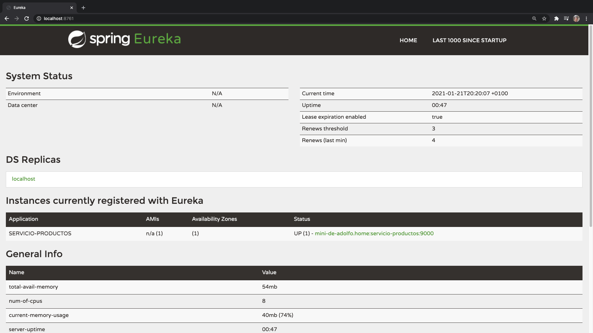

En Postman debemos seguir usando la ruta real del servicio para poderlo probar por que Postman no incluye a Eureka, asi que probemos las siguientes URLs:

* GET http://localhost:9000/productos/
* POST http://localhost:9000/producto/ (Necesita BODY)
* GET http://localhost:9000/precio/2000
* PUT http://localhost:9000/producto/2000/20

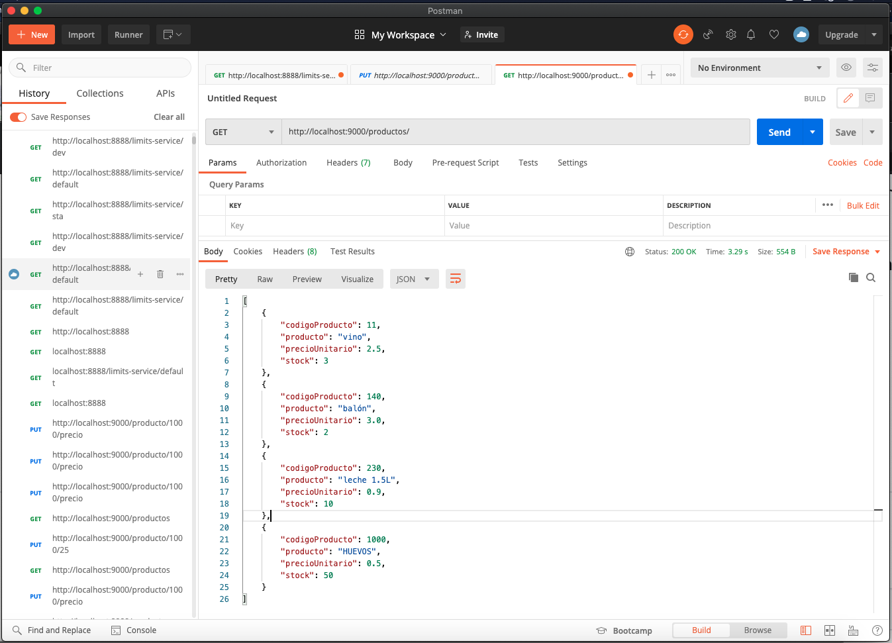
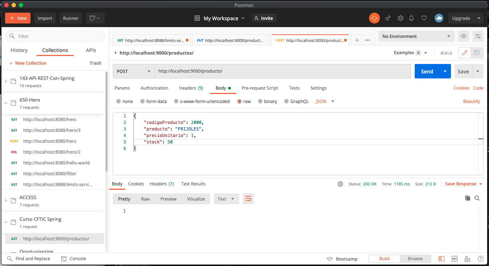
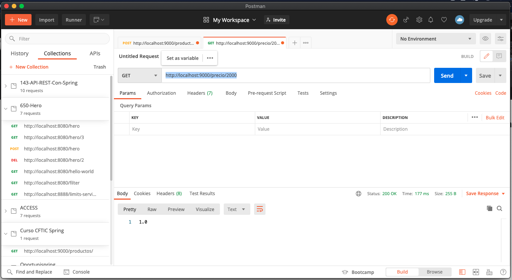
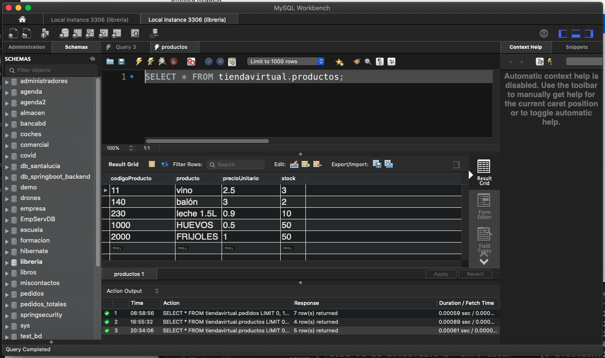
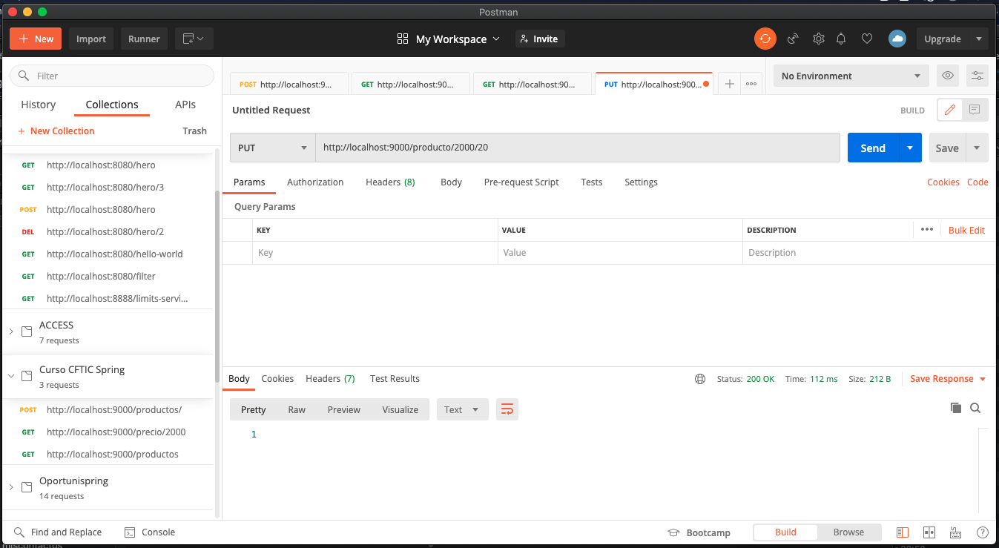


### :computer: `30_microservicio_pedidos_en_eureka`
#### MicroServicio encargado de Gestionar la Tabla Pedidos de la BD.

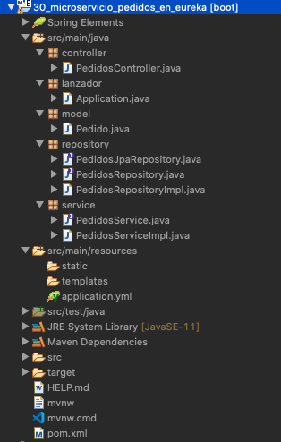


Este MicroServicio es muy similar al creado anteriormente, con el añadido de que este MicroServicio de Pedidos va a consumir al MicroServicio de Productos, por eso en este MicroServicio vamos a usar el RestTemplate ya que es un "Cliente" del MicroServicio de Productos.

Vamos a crear el proyecto `30_microservicio_pedidos_en_eureka` como un proyecto Spring Boot con las siguientes dependencias:

* Spring Web
* Spring Data JPA
* MySQL Driver.
* Eureka Discovery Client: Para que se segistre en Eureka.

#### Crear el Modelo

Creamos la Entidad `Pedido` que refleja la tabla `pedidos` de la BD.

`Pedido`

```java
package model;

import java.util.Date;

import javax.persistence.Entity;
import javax.persistence.Id;
import javax.persistence.Table;

@Entity
@Table(name="pedidos")
public class Pedido {
   @Id
   private int idPedido;
   private int codigoProducto;
   private int unidades;
   private double total;
   private Date fechaPedido;
   
   public Pedido() {
      super();
   }
	
   public Pedido(int idPedido, int codigoProducto, int unidades, double total, Date fechaPedido) {
      super();
      this.idPedido = idPedido;
      this.codigoProducto = codigoProducto;
      this.unidades = unidades;
      this.total = total;
      this.fechaPedido = fechaPedido;
   }
	
   public int getIdPedido() {
      return idPedido;
   }
   public void setIdPedido(int idPedido) {
      this.idPedido = idPedido;
   }
   public int getCodigoProducto() {
      return codigoProducto;
   }
   public void setCodigoProducto(int codigoProducto) {
      this.codigoProducto = codigoProducto;
   }
   public int getUnidades() {
      return unidades;
   }
   public void setUnidades(int unidades) {
      this.unidades = unidades;
   }
   public double getTotal() {
      return total;
   }
   public void setTotal(double total) {
      this.total = total;
   }
   public Date getFechaPedido() {
      return fechaPedido;
   }
   public void setFechaPedido(Date fechaPedido) {
      this.fechaPedido = fechaPedido;
   }
	
}
```

#### Crear el Repositorio

En el Repositorio vamos a comenzar creando la interface que `PedidosJpaRepository` que extiende a `JpaRepository`.

`PedidosJpaRepository`

```java
package repository;

import org.springframework.data.jpa.repository.JpaRepository;

import model.Pedido;

public interface PedidosJpaRepository extends JpaRepository<Pedido, Integer> {

}
```

Lo siguiente que vamos a hacer es crear la Interface y Clase que vamos a usar en la Capa de Servicio.

En la Interface vamos a colocar el Contrato de todos los métodos que vamos a usar en nuestro proyecto.

`PedidosRepository`

```java
package repository;

import java.util.List;

import model.Pedido;

public interface PedidosRepository {
   List<Pedido> findAll();
   void savePedido(Pedido prod);	
}
```

Con la Clase `PedidosRepositoryImpl` vamos a implementar la Interface `PedidosRepository` apoyandonos de la Interface `PedidosJpaRepository` que tendremos que inyectar.

`PedidosRepositoryImpl`

```java
package repository;

import java.util.List;

import org.springframework.beans.factory.annotation.Autowired;
import org.springframework.stereotype.Repository;

import model.Pedido;
@Repository
public class PedidosRepositoryImpl implements PedidosRepository {
   @Autowired
   PedidosJpaRepository repository;
	
   @Override
   public List<Pedido> findAll() {		
      return repository.findAll();
   }

   @Override
   public void savePedido(Pedido prod) {
      repository.save(prod);
   }
}
```

#### Crear el Servicio

Vamos a crear la interface y clase para el Servicio.

`PedidosService`

```java
package service;

import java.util.List;

import model.Pedido;

public interface PedidosService {
   List<Pedido> allPedidos();
   void savePedido(Pedido pedido);
}
```

`PedidosServiceImpl`

```java
package service;

import java.util.Date;
import java.util.List;

import org.springframework.beans.factory.annotation.Autowired;
import org.springframework.stereotype.Service;
import org.springframework.web.client.RestTemplate;

import model.Pedido;
import repository.PedidosRepository;
@Service
public class PedidosServiceImpl implements PedidosService {
   
   @Autowired
   PedidosRepository repository;
   
   @Autowired
   RestTemplate template;
   
   String url="http://servicio-productos";

   @Override
   public List<Pedido> allPedidos() {
      return repository.findAll();
   }
   
   //a este método le llega el pedido incompleto y tiene que rellenar el resto de datos (total)
   //invocando al servicio de productos
   @Override
   public void savePedido(Pedido pedido) {
      
      pedido.setFechaPedido(new Date());
      
      //obtiene el total del pedido
      pedido.setTotal(obtenerTotal(pedido));
      
      repository.savePedido(pedido);
      
      //actualizar stock de productos
      template.put(url+"/producto/{cod}/{unit}", null, pedido.getCodigoProducto(),pedido.getUnidades());	
   }
	
   //llama de nuevo al servicio de productos para obtener el precio
   //del producto elegido y calcular el total
   private double obtenerTotal(Pedido pedido) {
      String precio=template.getForObject(url+"/precio/{cod}", String.class,pedido.getCodigoProducto());
      double pUnitario= Double.parseDouble(precio);
      return pUnitario*pedido.getUnidades();	
   }
}
```
* En este servicio usamos el `RestTemplate` para poder consumir el MicroServicio de Productos, observese que la URL  que usamos (`http://servicio-productos`) ya no es la fisica, sino la virtual que definimos en las propiedades del MicroServicio de Productos y que es la que se registra en Eureka.
* En nuestro método `savePedido(...)` vamos a interactuar dos veces con el Servicio de Producto, una para recuperar el precio del Producto y poder calcular el Total del Pedido y otra para actualizar el Stock de productos.
* En el `template.put(` mandamos la URL, el BODY que en este caso es `null` por que no mandamos nada a través del Body, lo estamos mandando a través de la URL, que son los dos parámetros que vienen a continuación `pedido.getCodigoProducto(),pedido.getUnidades()` que corresponden a los valores indicados en la URL `url+"/producto/{cod}/{unit}"`.

#### Crear el Controlador

`ProductosController`

```java
package controller;

import java.util.List;

import org.springframework.beans.factory.annotation.Autowired;
import org.springframework.http.MediaType;
import org.springframework.web.bind.annotation.CrossOrigin;
import org.springframework.web.bind.annotation.GetMapping;
import org.springframework.web.bind.annotation.PostMapping;
import org.springframework.web.bind.annotation.RequestBody;
import org.springframework.web.bind.annotation.RestController;

import model.Pedido;
import service.PedidosService;

@CrossOrigin(origins = "*")
@RestController
public class PedidosController {

   @Autowired
   PedidosService service;
	
   @GetMapping(value="pedidos", produces=MediaType.APPLICATION_JSON_VALUE)
   public List<Pedido> pedidos(){
      return service.allPedidos();
   }
   
   @PostMapping(value="pedido",consumes=MediaType.APPLICATION_JSON_VALUE)
   public void actualizarProducto(@RequestBody Pedido pedido) {
      service.savePedido(pedido);
   }
}
```
* En nuestro método POST le llega el parámetro Pedido, pero solo con los valores código de producto y unidades ya que los demás valores son calculados y como ya vimos se rellenan en la capa de Servicio antes de salvar el Pedido en la BD.

#### Configuración en el Lanzador

`Application`

```java
package lanzador;

import org.springframework.boot.SpringApplication;
import org.springframework.boot.autoconfigure.SpringBootApplication;
import org.springframework.boot.autoconfigure.domain.EntityScan;
import org.springframework.cloud.client.loadbalancer.LoadBalanced;
import org.springframework.context.annotation.Bean;
import org.springframework.context.annotation.ComponentScan;
import org.springframework.data.jpa.repository.config.EnableJpaRepositories;
import org.springframework.web.client.RestTemplate;
@ComponentScan(basePackages = {"controller","service","repository"})
@EntityScan(basePackages= {"model"})
@EnableJpaRepositories(basePackages = {"repository"})
@SpringBootApplication
public class Application {

   public static void main(String[] args) {
      SpringApplication.run(Application.class, args);
   }
	
   @Bean
   @LoadBalanced
   public RestTemplate getTemplate() {
      return new RestTemplate();
   }

}
```
* En el lanzador por un lado añadimos el Bean `RestTemplate` anotado con `@Bean` ya que como va a ser un Cliente de otro servicio necesitamos intreractuar con el a través del objeto `RestTemplate`.
* Por otro lado debemos anotar el `RestTemplate` con `@LoadBalanced` para que se active RIBBON dado que vamos a acceder desde Pedidos a Productos a través de Eureka.

#### Configuración en el `application.yml`

`application.yml`

```txt
spring:
  application:
    name: servicio-pedidos
  datasource:
    driver-class-name: com.mysql.cj.jdbc.Driver
    url: jdbc:mysql://localhost:3306/tiendavirtual?serverTimezone=Europe/Madrid
    username: root
    password: 'root'   
  jpa:
    hibernate:
      naming.implicit-strategy: org.hibernate.boot.model.naming.ImplicitNamingStrategyLegacyJpaImpl
      naming.physical-strategy: org.hibernate.boot.model.naming.PhysicalNamingStrategyStandardImpl
eureka:
  client:
    serviceUrl:
      defaultZone: http://localhost:8761/eureka
server:
  port: 8000  
```
* Configuramos nombre del servicio, conexión a BD, propiedades Hibernate, dirección de Eureka y el Puerto.

#### Probar el MicroServicio

Vamos a arrancar nuestro Servidor Eureka y posteriormente vamos a arrancar nuestro MicroServicio de Gestión de Productos y posteriormente el MicroServicio de Gestión de Pedidos.

Lo primero que vamos a hacer es cargar es la URL http://localhost:8761/ para ver el Panel de Eureka.

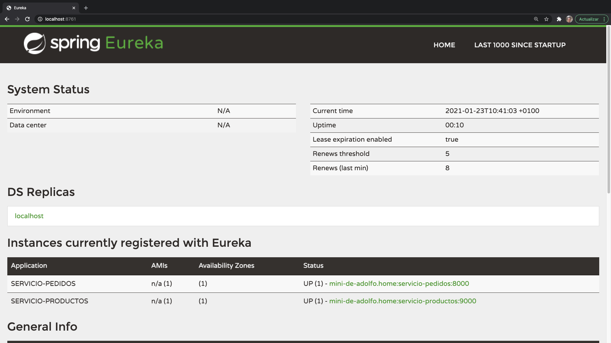

El MicroServicio de Gestión de Productos ya lo probamos en la sección anterior, ahora solo vamos a probar el MicroServicio de Gestión de Pedidos, el cual tiene dos URLs:

* http://localhost:8000/pedido

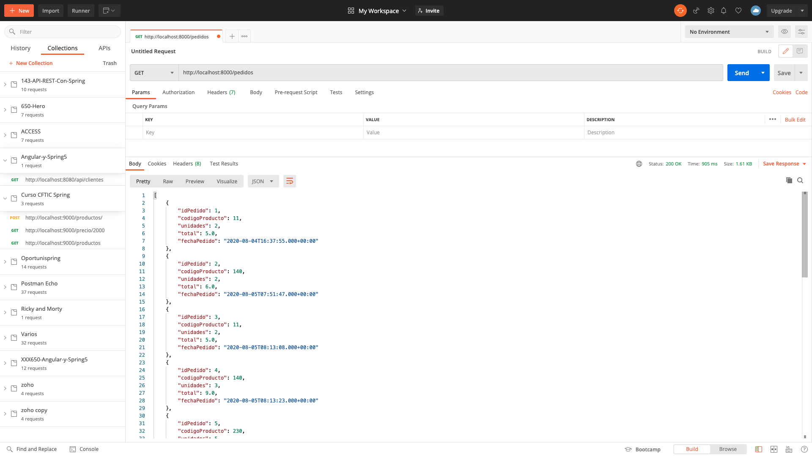
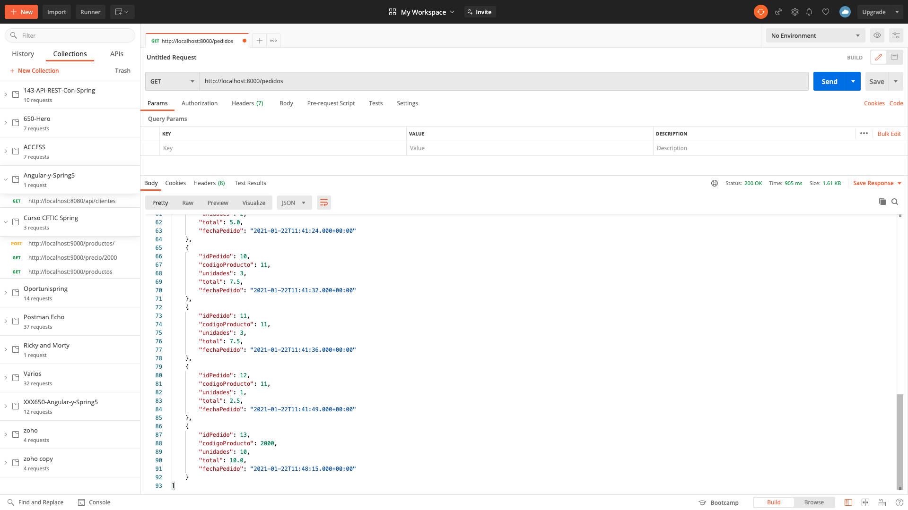

* http://localhost:8000/pedidos


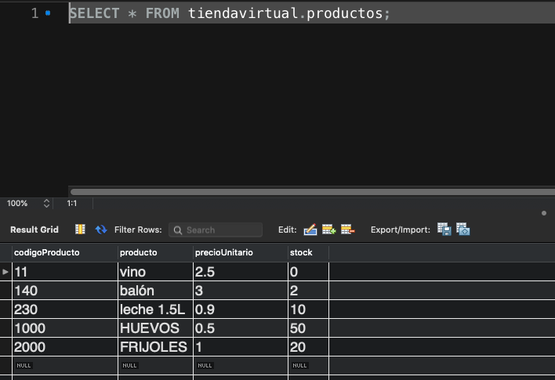

Cuando realicemos un nuevo pedido los datos en la BD se deben actualizar creando un nuevo pedido y actualizando el Stock.

Lanzamos la petición http://localhost:8000/pedido en el Body mandamos los dator requeridos del Pedido.

```js
{
   "codigoProducto": 2000,
   "unidades": 5
}
```

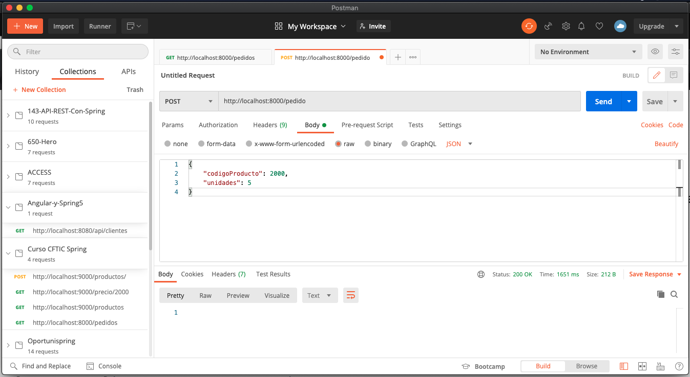

No ha habido excepciónes y nos retorna 200 que es una buena señal, vamos a comprobar si realizo los cambios en la BD.

Vemos que se ha creado un nuevo Pedido y se ha actualizado el Stock del Producto.

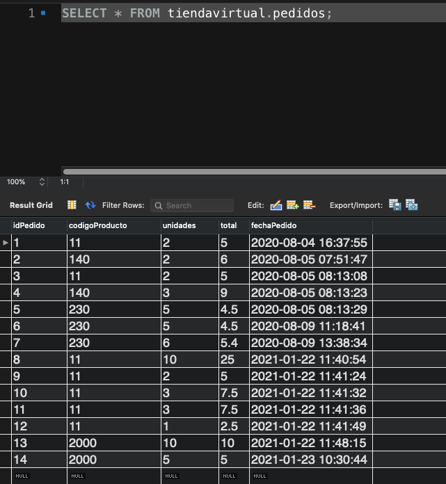
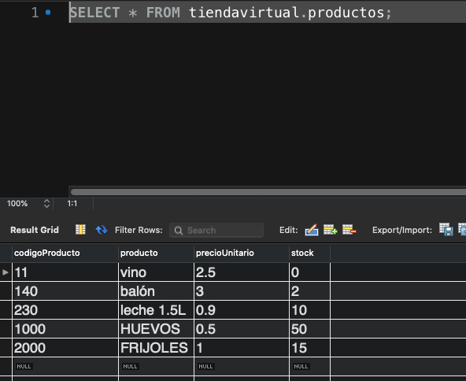

Como vemos el Servicio de Pedidos a accedido al Servicio de Productos a través de Eureka sin tener que conocer la dirección real de este, 


**NOTA**: Cuando existe algún fallo entre un MicroServicios se usa el PROTOCOLO SAGA.

### :computer: `31_cliente_front_pedidos`
#### FrontEnd de la Aplicación realizada con JS, (ServerLess)

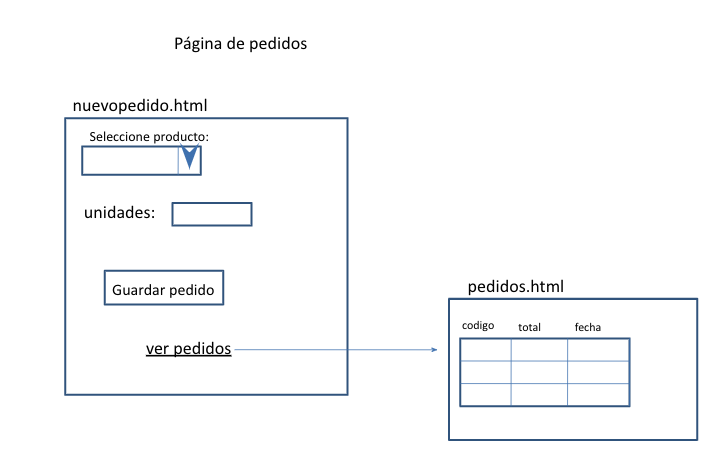


``
```java
```


``
```java
```


``
```java
```

``
```java
```


