# 20210121 Jueves

## :computer: `31_cliente_front_pedidos`
### FrontEnd de la Aplicación realizada con JS, (ServerLess)

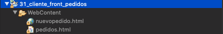


`nuevopedido.html`

```html
<!DOCTYPE html>
<html>
<head>
<meta charset="ISO-8859-1">
<script src="https://ajax.googleapis.com/ajax/libs/angularjs/1.6.9/angular.min.js"></script>
<title>Insert title here</title>
<!-- Latest compiled and minified CSS -->
<link rel="stylesheet" href="https://maxcdn.bootstrapcdn.com/bootstrap/3.4.0/css/bootstrap.min.css">

<!-- jQuery library -->
<script src="https://ajax.googleapis.com/ajax/libs/jquery/3.3.1/jquery.min.js"></script>

<!-- Latest compiled JavaScript -->
<script src="https://maxcdn.bootstrapcdn.com/bootstrap/3.4.0/js/bootstrap.min.js"></script> 
</head>
<body>
   <div ng-app="comunicacionApp" ng-controller="comunicacionController" class="container" ng-init="cargarProductos()">
      <h1>Pedidos</h1>
      <div class="row">	
         <div class="col-sm-6" style="border:solid 1px">
            <br/>
			
            <div class="form-group">
               <label>Producto</label>
               <select  ng-model="producto" class="form-control" style="width:80%">
                  <option ng-repeat="v in productos" value="{{v.codigoProducto}}">{{v.producto}} - {{v.precioUnitario}} - {{v.stock}}</option>	
               </select>
            </div>
		
            <div class="form-group">
               <label>Unidades</label>
               <input type="number" min="0" ng-model="unidades" class="form-control" style="width:80%"/>
            </div>
		
            <br/>
            <br/>
         </div>
         <div class="col-sm-6" style="border:solid 1px">
            <div ng-show="mostrarTabla" >
               <h3>Datos del pedido</h3>
               <hr>
               <h4>Producto: {{producto}}</h4>
               <h4>Unidades: {{unidades}}</h4>
            </div>
         </div>
      </div>
      <br/>
		
      <button ng-click="pedido()" type="button">Confirmar Pedido</button>
      <br/><br/><br/>
      <a href="pedidos.html">Ver Pedidos</a>
	
   </div>
   <script>
      var app=angular.module("comunicacionApp",[]);
      app.controller("comunicacionController",function($scope,$http){
         $scope.productos; //aquí se guardarán los productos obtenidos en la petición al servicio de productos
         $scope.producto; //aquí se guarda el código de producto seleccionado en la lista			
         $scope.unidades; //aquí se guarda las unidades introducidas en el campo unidades		
         $scope.mostrarTabla=true;			
			
         $scope.cargarProductos=function(){				
            let url = "http://localhost:9000/productos";	
            $http.get(url).then(function(res){
               $scope.productos=res.data;								
            });
         }
         $scope.pedido=function(){
            let url="http://localhost:8000/pedido";
            /*let ob=new Object();
            ob.codigoProducto=$scope.producto;
            ob.unidades=$scope.unidades;
            $http.post(url,ob);*/
            $http.post(url,{"codigoProducto":$scope.producto, "unidades":$scope.unidades});
            //.then(function(res){
            //	console.log(res.data);								
            //});
			
         };
      });	
   </script>
</body>
</html>
```
* Parte HTML
   * Cliente desarrollado con AngularJS.
   * Div principal con el nombre de la aplicación y el controler e invocamos a la función `cargarProductos()` para cargar todos los productos.
   * En el Select que muestra la lista de los Productos, recorremos lo todos los `productos` que ya se ha cargado gracias a invocar la función `cargarProductos()` y por cada uno de ellos mostramos una opción del Select.
   * Damos el nombre a la opción seleccionada con una propiedad de ambito con `ng-model="producto"` y almacenamos el value del option seleccinado, es decir `value="{{v.codigoProducto}}"` que estamos almacenando el código del producto en la propiedad de ambito `producto`
   * En el input de abajo vamos a almacenar otra propiedad de ambiente `unidades`
   * Con estas dos propiedad de ambiente ya podemos llamar a nuestra función `pedido()` que nos va a permitir invor al Alta de Pedidos, al pusar el botón.

* Parte JS
   * Tenemos la función `cargarProductos` la cual es la encargada de lanzar una petición GET a la URL `"http://localhost:9000/productos"`, los valores recuperados los guardamos en la propiedad de ambiente `productos`
    * Tenemos la función `pedido` la cual es la encargada de lanzar una petición POST a la URL `"http://localhost:8000/pedido"` con el documento JSON con los datos a enviar, el método `$http.post(` necesita como parámetros la URL y el JSON que va se va a mandar.
       * Podemos colocar directamente es JSON o crear un Objeto con los datos y mandar ese objeto, AngularJS se encarga de SERIALIZAR el Objeto a JSON.
    * Las URLs que pongamos en JS deben ser las URLs reales es decir `"http://localhost:9000/productos"` y `"http://localhost:8000/pedido"`.
   * Con JS no puedo usar las direcciones Eureka `"http://servicio-productos"` y `"http://servicio-pedidos"` esto es por que JS no es un Cliente Eureka como si que lo son los MicroServicios, JS no tiene acceso a Eureka, por eso es necesario usar las URLs reales.
   * La solución a este problema es usar Zuul.

`pedidos.html`

```html
<!DOCTYPE html>
<html>
<head>
<meta charset="ISO-8859-1">
<script src="https://ajax.googleapis.com/ajax/libs/angularjs/1.6.9/angular.min.js"></script>
<title>Insert title here</title>
<!-- Latest compiled and minified CSS -->
<link rel="stylesheet" href="https://maxcdn.bootstrapcdn.com/bootstrap/3.4.0/css/bootstrap.min.css">

<!-- jQuery library -->
<script src="https://ajax.googleapis.com/ajax/libs/jquery/3.3.1/jquery.min.js"></script>

<!-- Latest compiled JavaScript -->
<script src="https://maxcdn.bootstrapcdn.com/bootstrap/3.4.0/js/bootstrap.min.js"></script> 
</head>
<body>
   <div ng-app="comunicacionApp" ng-controller="comunicacionController" class="container">
      <h1>Pedidos</h1>
      <br/>
      <div >
         <table border="1" class="table table-striped table-bordered" ng-init="cargar()">
            <thead><tr><th>Numero de pedido</th><th>Producto</th><th>Total</th><th>Fecha pedido</th></tr></thead>
            <tbody>
               <tr ng-repeat="r in pedidos">
                  <td>{{r.idPedido}}</td>
                  <td>{{r.codigoProducto}}</td>
                  <td>{{r.total}}</td>
                  <td>{{r.fechaPedido}}</td>
               </tr>
            </tbody>
         </table>
      </div>
      <br/>
      <a href="nuevopedido.html">Nuevo pedido</a>
   </div>
   <script>
      var app=angular.module("comunicacionApp",[]);
      app.controller("comunicacionController",function($scope,$http){
         $scope.pedidos;	
         $scope.cargar=function(){				
            let url="http://localhost:8000/pedidos";		
            $http.get(url).then(function(res){
               $scope.pedidos=res.data;			
            });
         }		
      });
   </script>
</body>
</html>
```
* Contamos con la función `cargar` que invoca al servicio `http://localhost:8000/pedidos` con el método GET para que nos retorne la lista de los pedidos y los podamos pintar en la página.

### Probar la Aplicación

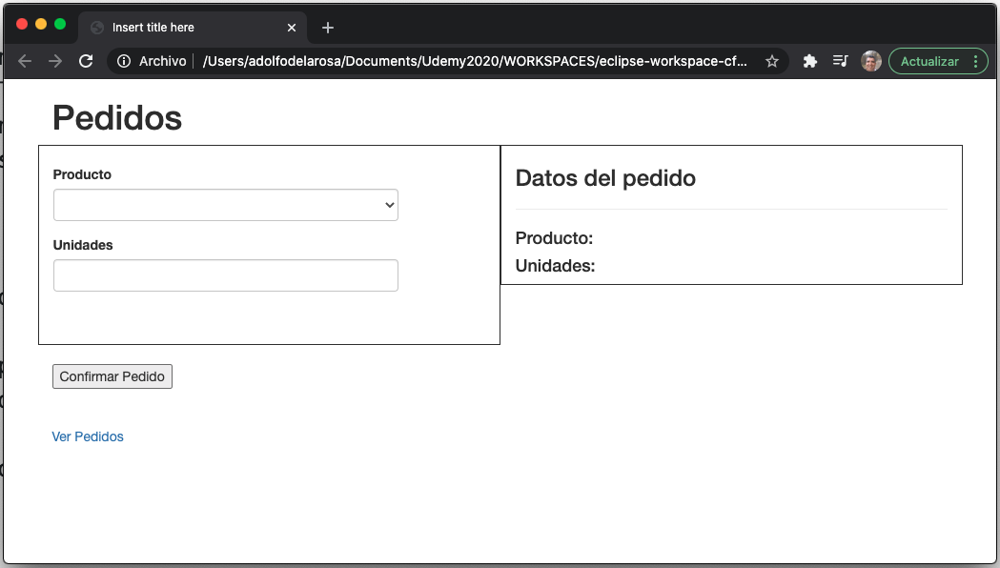
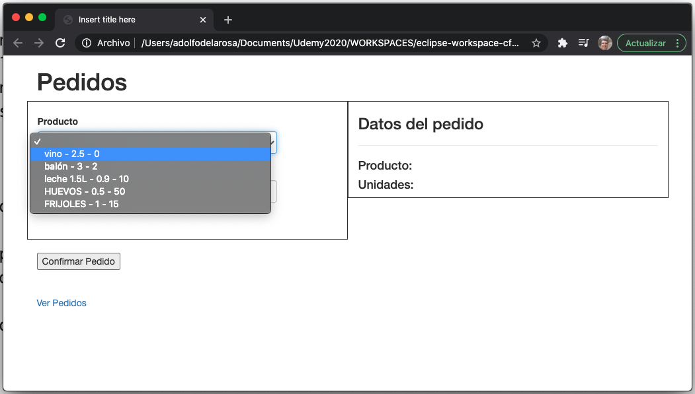
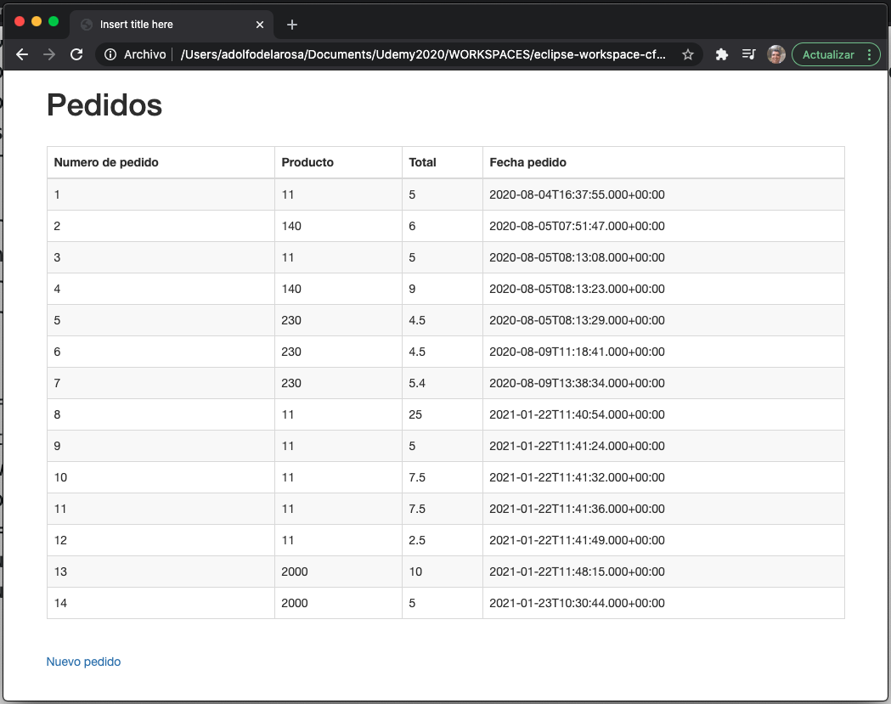
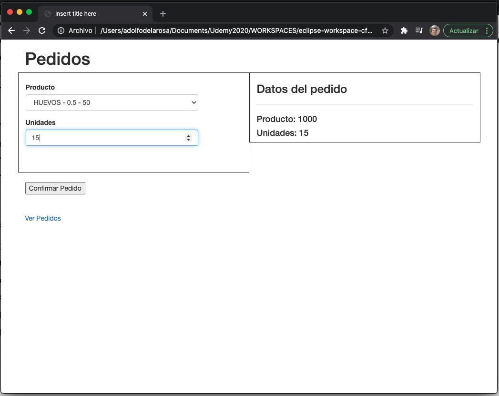
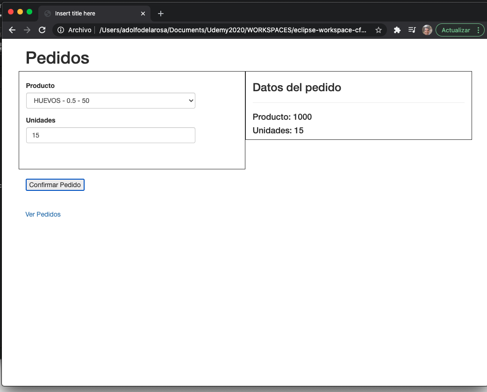
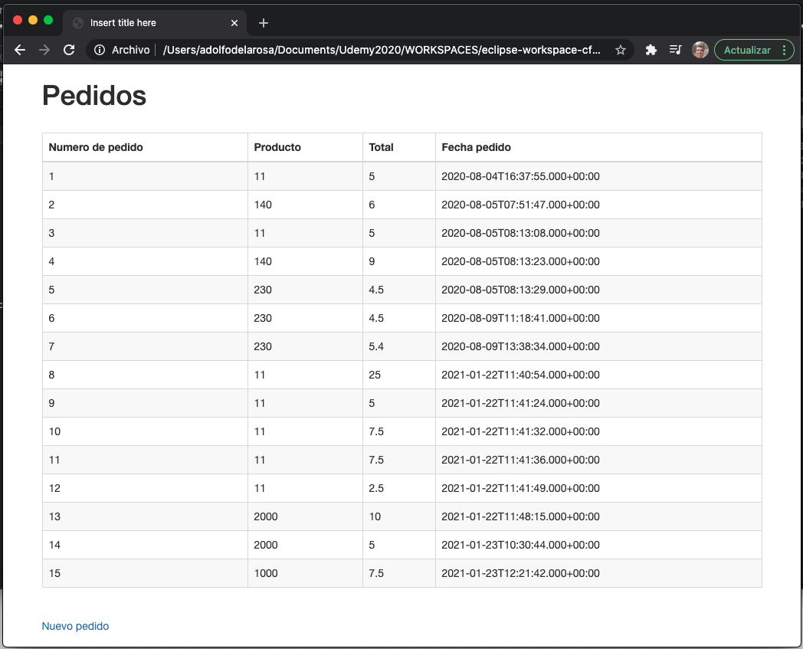
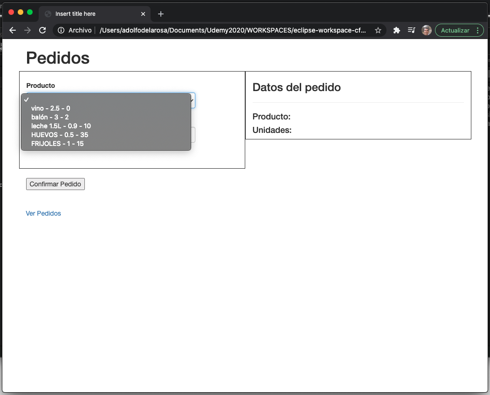

## Servidor Zuul


**NOTA:** En las ultimas versiones de Spring Cloud no da soporte para el, ha sido sustituido con Spring Gateway.


El servidor Zuul tiene como objetivo proporcionar un punto de acceso único a los Servicios, como vimos anteriormente en la aplicación JS teniamos dos direcciones fisicas de los dos servicios, esto se complica a medida que se tengan más peticiones a diferentes servicios, ya que cada uno tendrá su propia dirección, la idea es que exista una única dirección para todos, cada uno tendrá su URL pero el punto de entrada será el mismo es decir la misma IP y el mismo Puerto. Será Zuul Server el cual puede ser un Cliente Eureka, usando Eureka el que derive la llamada al MicroServicio necesario.

El Cliente ya no va a tener que conocer las direcciones reales de los servicios, el Zuul Server tampoco, por que Zuul Server utilizará Eureka,


¿Como creamos un Servidor Zuul?

Un Servidor Zuul es un MicroServicio más, debe tener las dependencias:

* Eureka Discovery Client
* Zuul

La de Spring Web no es necesaria.

Hay que añadir a la clase Lanzadora la anotación `@EnableZuulProxy`


* Todo cliente de Eureka tiene su `name`
* Se registra el puerto que por convensión suele ser 8090
* La configuración de Zuul, en la sección `zuul.routes` vamos a hacer el enrutado de peticiones, según van llegando desde los Clientes se les redirigira a los servicios correspondientes, es una propiedad de tipo Map clave-valor:
   * Nombre de enrutado de cada servicio
      * Path: Dirección que le va a llegar a Zuul
      * ServiceId: Servicio al que se tiene que redirigir (Nombre del servicio en Eureka)
* Normalmente el servidor de Zuul no se registra en Eureka por eso en la sección donde se define la dirección de Eureka falta la propiedad para indicar que no se registre, ya que no tiene sentido que se registre.

Como vemos Zuul no necesita saber la dirección Real de los MicroServicios ya que el accede a través de Eureka, no obstante existe la propriedad que aparece comentada `url` por si Zuul quisiera acceder directamente sin Eureka donde se pondría la dirección real.


Aquí vemos como el Cliente hace la entrada al Zuul Server por lo que el cliente JS solo necesita ya conocer la dirección del Zuul Server, que como la de Eureka no va a cambiar nunca, siempre va  a estar en el mismo sitio, luego ya en función de una subrirección Zuul Server determinará a que MicroServicio quiere acceder, pero el cliente JS no necesita saber las direcciones reales de esos MicroServicios, el Zuul Server por que para derivar las llamadas a uno u a otro utilizará las direcciones de Eureka, los nombres de aplicación que hemos definido dentro de Eureka. Con lo cual el problema que la aplicación Cliente JS tenia que conocer las direcciones reales de los MicroServicios desaparece gracias a Zuul.

> Eureka no redirigue llamadas a ningún sitio, simplemente contiene una tabla de consulta que los servicios consultan para ver donde esta el destinatario en cambio Zuul si que redirige llamadas a los servicios.

> Zuul es un Servidor de enrutado, transfiere peticiones y Eureka es un servidor de Consulta y de registro.

## :computer: `32_servidor_zuul`
### Creación del Servidor Zuul

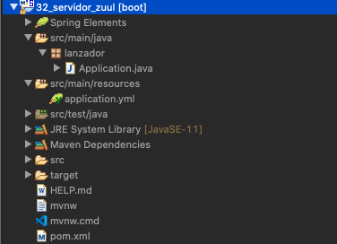

Vamos a crear el Servidor Zuul

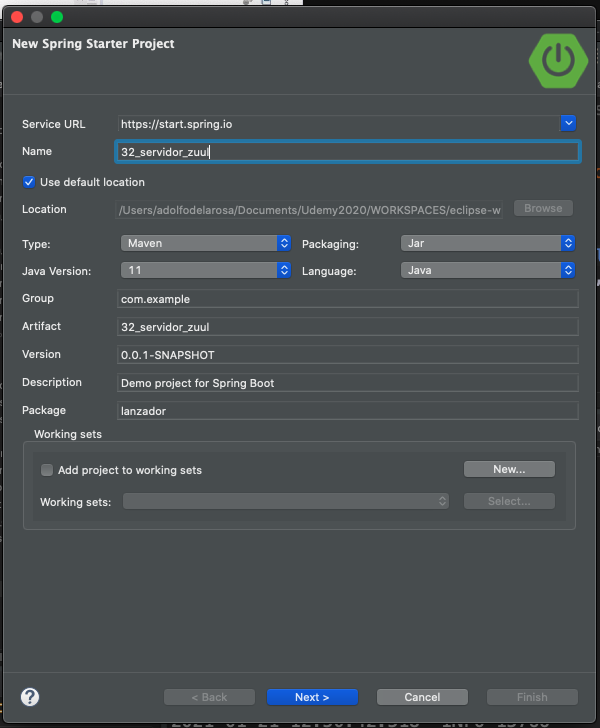

Cuidado con este paso que es muy importante, por que si tenemos la versión de Spring Boot 2.4.2 o cualquiera igual o mayor a 2.4 y buscamos la dependecia de Zuul no la vamos a poder seleccionar, por que como dijimos antes a partir de esta versión Spring Cloud ya no le da soporte. Tenemos que bajar a la 2.3.8 y ya podemos seleccionar Zuul y ademas seleccionamos el Cliente de Eureka.

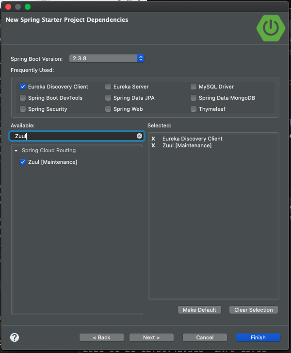

Lo siguiente es la configuración del Servidor Zuul ya que este MicroServicio no lleva código.

### Configuración en la Clase Lanzadora

`Application`

```java
package lanzador;

import org.springframework.boot.SpringApplication;
import org.springframework.boot.autoconfigure.SpringBootApplication;
import org.springframework.cloud.netflix.zuul.EnableZuulProxy;

@EnableZuulProxy
@SpringBootApplication
public class Application {

   public static void main(String[] args) {
      SpringApplication.run(Application.class, args);
   }

}
```
* Anotar la clase con `@EnableZuulProxy` para que este MicroServicio funcione como Servidor Zuul

### Configuración del `application.yml`

`application.yml`

```txt
spring:
  application:
    name: servidor-zuul
server:
  port: 8090
eureka:
  client:
    register-with-eureka: false
    serviceUrl:
      defaultZone: http://localhost:8761/eureka
zuul:
  routes:
    ruta-productos:
      path: /sproductos/**
      service-id: servicio-productos
    ruta-pedidos:
      path: /spedidos/**
      service-id: servicio-pedidos
```
* Damos un nombre al servicio
* Damos un puerto al servicio que por convención es 8090
* Indicamos la dirección de Eureka e indicamos `register-with-eureka: false` para no registrar Zuul en Eureka
* Indicamos las dos rutas de nuestros MicroServicios Productos y Pedidos, por un lado indicamos la `path` que van a usar los clientes para llamar a Zuul y por otro lado le indicamos hacia donde nos rediriga con `service-id` que es el identificador del MicroServicio dentro de Eureka.
   * `ruta-productos` es la clave que le hemos dado a nuestra primer ruta la cual debe contener dos subpropiedades:
      * `path: /sproductos/**`: Dirección que llega a Zuul y que debe ser mapeada al servicio de productos. El nombre que le estamos dando a esta ruta es `/sproductos`, pero si le mandamos además de la ruta algo más como algún parámetro debemos añadir una barra y asterisco `/sproductos/*` y si puede que mande más de una cosa deben colocarse dos astericos es decir  `/sproductos/**`. HAY QUE TENER CUIDADO POR QUE SI PONEMOS `/sproductos/*` ENTIEDE POR `*` LA DIRECCIÓN QUE VENGA A CONTINUACIÓN, PERO SI ADEMAS DE LA DIRECCIÓN VAN VARIABLES EN LA URL LAS IGNORA, POR LO QUE HAY QUE PONER DOS ASTERISCOS ES DECIR  `/sproductos/**`. `*` SOLO REPRESENTA UNA DIRECCIÓN ADICIONAL, `**`  REPRESENTA CUALQUIER NÚMERO DE DIRECCIONES QUE VENGAN ES DECIR CUALQUIER NÚMERO DE BARRAS `/sproductos/../../../`.
      * `service-id: servicio-productos`: Nombre del servicio en Eureka.
   * `ruta-pedidos`
      * `path: /spedidos/**`
      * `service-id: servicio-pedidos`      

**NOTA** Si un servicio tiene un context-path este de debería añadirse donde estan los astericos. El `service-id` solo represente IP + Puerto.

**NOTA** Podemos añadir un Context-Path a cualquier MicroServicio en el caso de Zuul sería agregando lo siguiene:

```txt
server:
  port: 8090
  servlet:
    context-path:
```

Listo ya tenemos nuestro Servidor Zuul.

Pero ahora necesitamos hacer una modificación en el Cliente JS que accedia directamente a la URL real de los MicroServicios, ahora vamos hacer que acceda a la dirección Zuul de cada MicroServicio por lo que nuestros HTMLs  quedan así:

`nuevopedido.html`

```html
<!DOCTYPE html>
<html>
<head>
<meta charset="ISO-8859-1">
<script src="https://ajax.googleapis.com/ajax/libs/angularjs/1.6.9/angular.min.js"></script>
<title>Insert title here</title>
<!-- Latest compiled and minified CSS -->
<link rel="stylesheet" href="https://maxcdn.bootstrapcdn.com/bootstrap/3.4.0/css/bootstrap.min.css">

<!-- jQuery library -->
<script src="https://ajax.googleapis.com/ajax/libs/jquery/3.3.1/jquery.min.js"></script>

<!-- Latest compiled JavaScript -->
<script src="https://maxcdn.bootstrapcdn.com/bootstrap/3.4.0/js/bootstrap.min.js"></script> 
</head>
<body>
   <div ng-app="comunicacionApp" ng-controller="comunicacionController" class="container" ng-init="cargarProductos()">
      <h1>Pedidos</h1>
      <div class="row">	
         <div class="col-sm-6" style="border:solid 1px">
            <br/>
			
            <div class="form-group">
               <label>Producto</label>
               <select  ng-model="producto" class="form-control" style="width:80%">
                  <option ng-repeat="v in productos" value="{{v.codigoProducto}}">{{v.producto}} - {{v.precioUnitario}} - {{v.stock}}</option>	
               </select>
            </div>
		
            <div class="form-group">
               <label>Unidades</label>
               <input type="number" min="0" ng-model="unidades" class="form-control" style="width:80%"/>
            </div>
		
            <br/>
            <br/>
         </div>
         <div class="col-sm-6" style="border:solid 1px">
            <div ng-show="mostrarTabla" >
               <h3>Datos del pedido</h3>
               <hr>
               <h4>Producto: {{producto}}</h4>
               <h4>Unidades: {{unidades}}</h4>
            </div>
         </div>
      </div>
      <br/>
		
      <button ng-click="pedido()" type="button">Confirmar Pedido</button>
      <br/><br/><br/>
      <a href="pedidos.html">Ver Pedidos</a>
	
   </div>
   <script>
      var app=angular.module("comunicacionApp",[]);
      app.controller("comunicacionController",function($scope,$http){
         $scope.productos; //aquí se guardarán los productos obtenidos en la petición al servicio de productos
         $scope.producto; //aquí se guarda el código de producto seleccionado en la lista			
         $scope.unidades; //aquí se guarda las unidades introducidas en el campo unidades		
         $scope.mostrarTabla=true;			
			
         $scope.cargarProductos=function(){
	   //let url = "http://localhost:8090/enrutador/sproductos/productos"; //En caso de haber metido un Context-Path
           let url = "http://localhost:8090/sproductos/productos"; 
	   //let url = "http://localhost:9000/productos";	
            $http.get(url).then(function(res){
               $scope.productos=res.data;								
            });
         }
         $scope.pedido=function(){
            let url="http://localhost:8090/spedidos/pedido";
	    //let url="http://localhost:8000/pedido";
            /*let ob=new Object();
            ob.codigoProducto=$scope.producto;
            ob.unidades=$scope.unidades;
            $http.post(url,ob);*/
            $http.post(url,{"codigoProducto":$scope.producto, "unidades":$scope.unidades});
            //.then(function(res){
            //	console.log(res.data);								
            //});
			
         };
      });	
   </script>
</body>
</html>
```

`pedidos.html`

```html
<!DOCTYPE html>
<html>
<head>
<meta charset="ISO-8859-1">
<script src="https://ajax.googleapis.com/ajax/libs/angularjs/1.6.9/angular.min.js"></script>
<title>Insert title here</title>
<!-- Latest compiled and minified CSS -->
<link rel="stylesheet" href="https://maxcdn.bootstrapcdn.com/bootstrap/3.4.0/css/bootstrap.min.css">

<!-- jQuery library -->
<script src="https://ajax.googleapis.com/ajax/libs/jquery/3.3.1/jquery.min.js"></script>

<!-- Latest compiled JavaScript -->
<script src="https://maxcdn.bootstrapcdn.com/bootstrap/3.4.0/js/bootstrap.min.js"></script> 
</head>
<body>
   <div ng-app="comunicacionApp" ng-controller="comunicacionController" class="container">
      <h1>Pedidos</h1>
      <br/>
      <div >
         <table border="1" class="table table-striped table-bordered" ng-init="cargar()">
            <thead><tr><th>Numero de pedido</th><th>Producto</th><th>Total</th><th>Fecha pedido</th></tr></thead>
            <tbody>
               <tr ng-repeat="r in pedidos">
                  <td>{{r.idPedido}}</td>
                  <td>{{r.codigoProducto}}</td>
                  <td>{{r.total}}</td>
                  <td>{{r.fechaPedido}}</td>
               </tr>
            </tbody>
         </table>
      </div>
      <br/>
      <a href="nuevopedido.html">Nuevo pedido</a>
   </div>
   <script>
      var app=angular.module("comunicacionApp",[]);
      app.controller("comunicacionController",function($scope,$http){
         $scope.pedidos;	
         $scope.cargar=function(){				
            let url="http://localhost:8090/spedidos/pedidos";
	    //let url="http://localhost:8000/pedidos";		
            $http.get(url).then(function(res){
               $scope.pedidos=res.data;			
            });
         }		
      });
   </script>
</body>
</html>
```

### Probar la Aplicación.

En nuestra aplicación tenemos por ahora 4 MicroServicios Servidor Eureka, MicroServicio de Productos, MicroServicio de Pedidos y Servidor Zuul y además tenemos la aplicación cliente JS, por lo que debemos tener un orden para arrancar los MicroServicios, el primero debe ser Eureka y los otros tres no importa mucho en el orden que se levanten así que vamos a arrancarlos como los mencionamos.

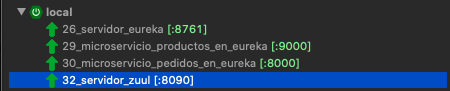

Arrancamos nuestro Cliente JS.

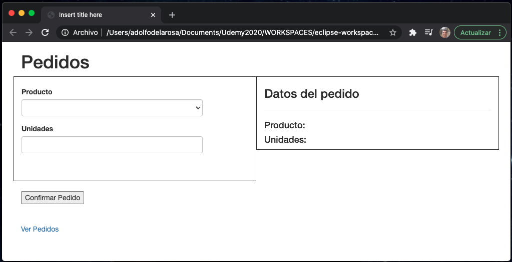
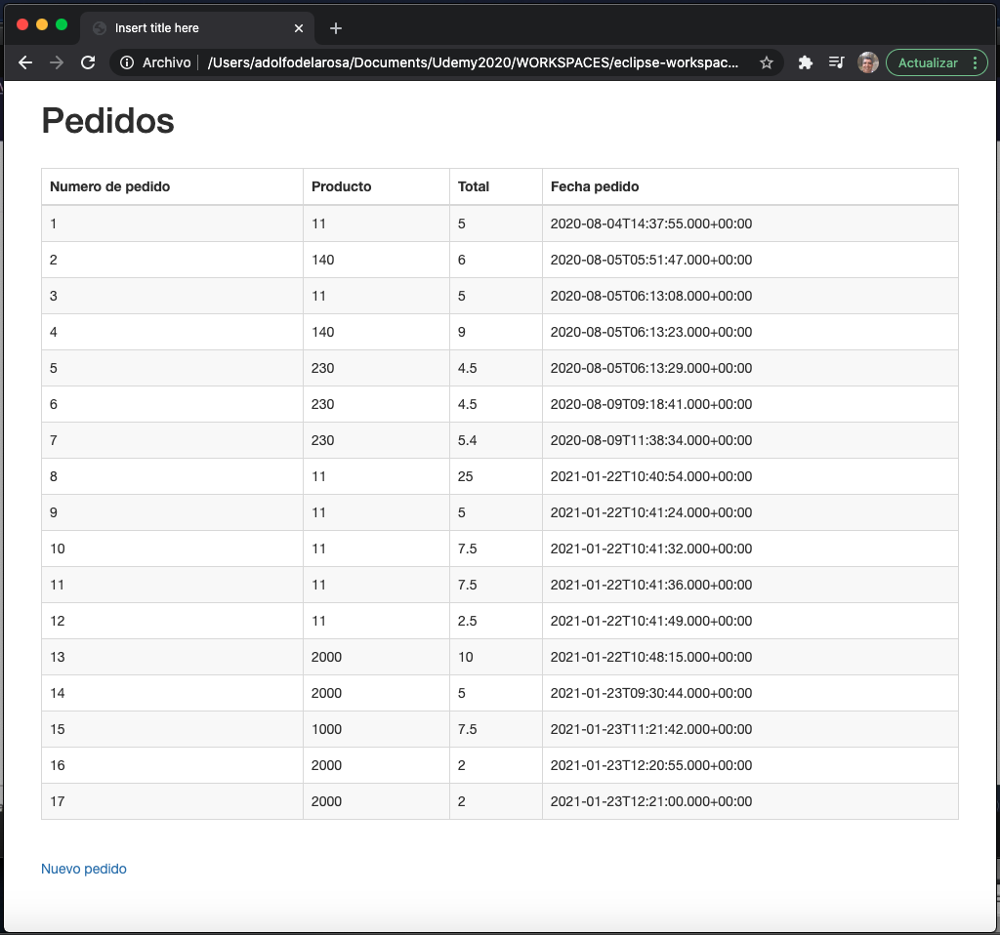
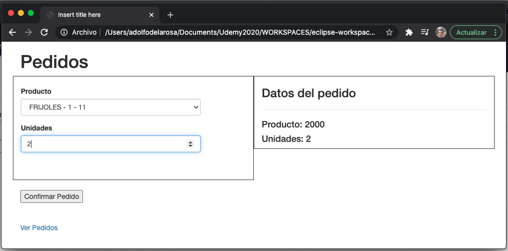
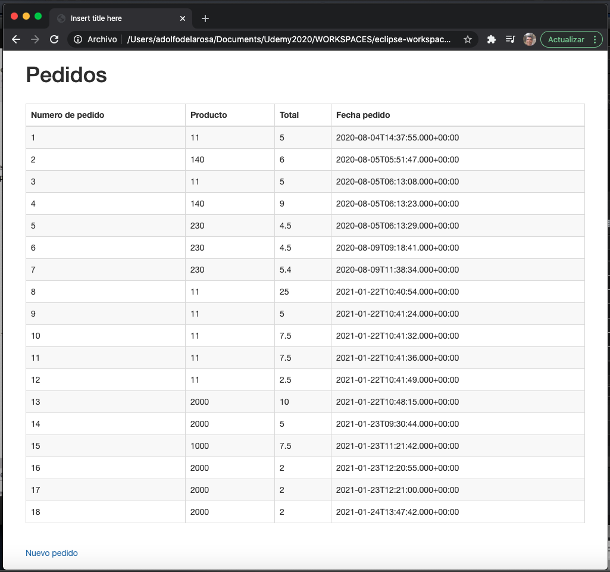

## :computer: `33_servidor_gateway`
### Creación del Servidor Gateway

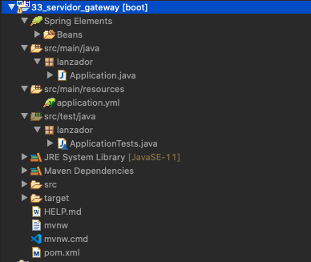

AQUIIII Video P2 21/01/21 1:33

``
```html
```


``
```html
```


``
```java
```


