# 20210122 Viernes

## Servidor de Configuración


El Servidor de Configuración tiene como misión centralizar toda la configuración de un conjunto de servicios que estan siendo utilizados por la aplicación. 

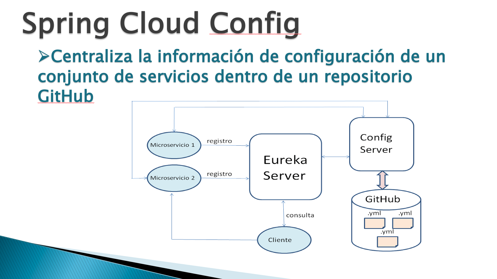

La problematica surgue cuando tenemos varios servicios y cada uno de ellos con su configuración propia, para canbiar la configuración hay que buscar servicio por servicio y cambiar lo que se requierá. Si por el contrario tenemos toda la configuración centralizada en un único lugar habitualmente un repositorio GitHub esto nos facilitaría la gestión de las configuraciones. Podríamos centralizar también la configuración de Eureka, Zuul o Gateway.

El papel del Servidor de Configuración va a ser comunicarse con los distintos MicroServicios para proporcionarles su configuración cuando la necesiten.

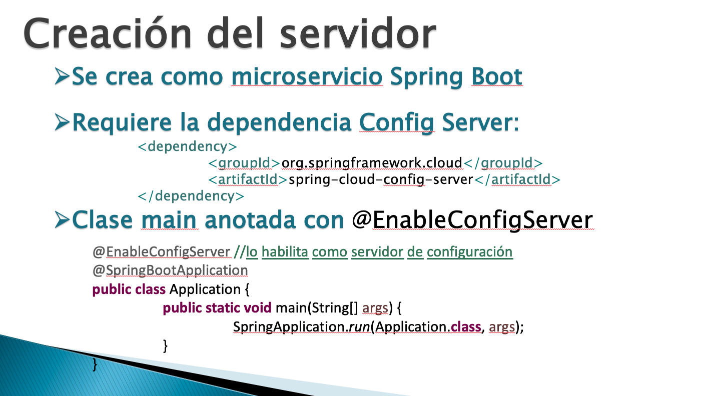

¿Qué hay que hacer para crear el Servidor de Configuración?

Hay que hacer una serie de pasos.

1. En primer lugar es crear un repositorio GitHub y en ese repositorio debemos subir todos los archivos YAL de los diferentes MicroServicios, los archivos deben mostrarse de una manera especial.

2. Crear el Servidor de Configuración el cual es un MicroServicio más, necesita la dependencia Config Server y a la clase Lanzadora se le añade la anotación `@EnableConfigServer` para habilitar este MicroServicio como Servidor de Configuración.

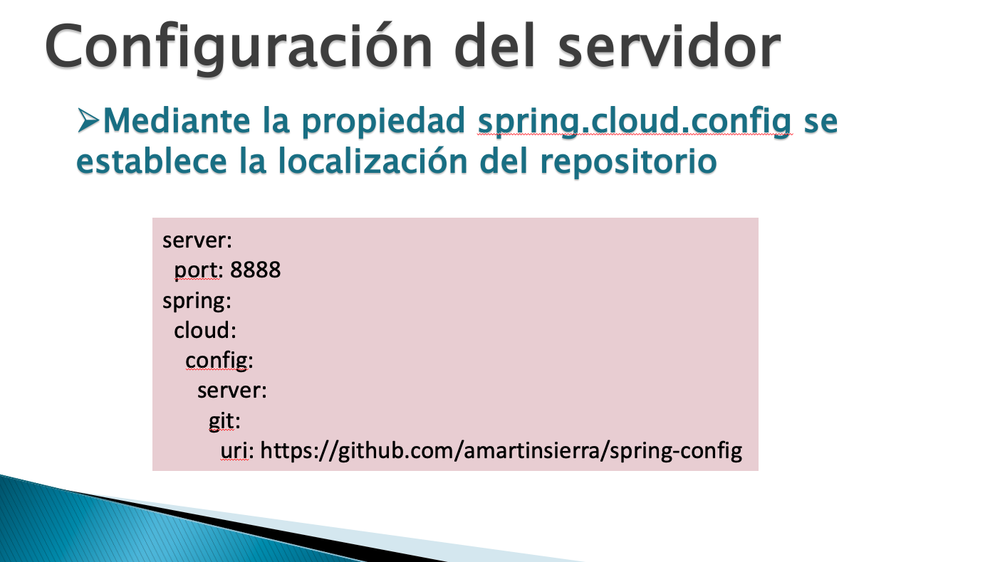

3. Configuración del Servidor con su archivo `application.yml` con su puerto que por convensión es 8888 y los datos de configuración de GitHub donde encontrará los archivo de configuración de los otros MicroServicios.

## :computer: `34_servidor_config`
### Servidor de Configuración

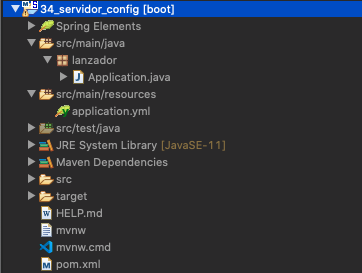

### Crear Repositorio Git Hub

Vamos a crear el repositorio `configuracion_servicios` en GitHub https://github.com/adolfodelarosades/configuracion_servicios este repositorio contiene los archivos YAL de nuestros MicroServicios. 

Vamos a incluir las configuraciones de Eureka, 

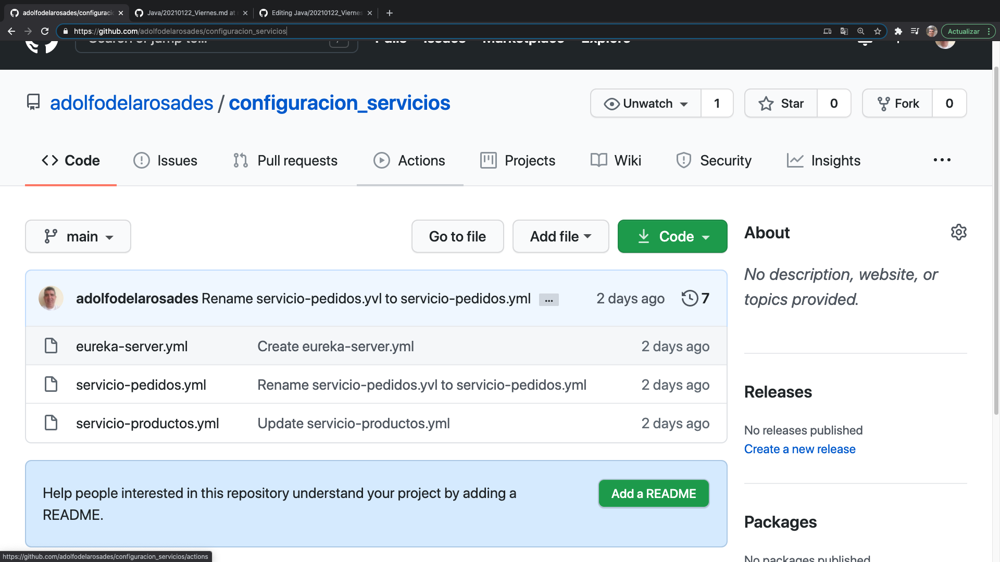
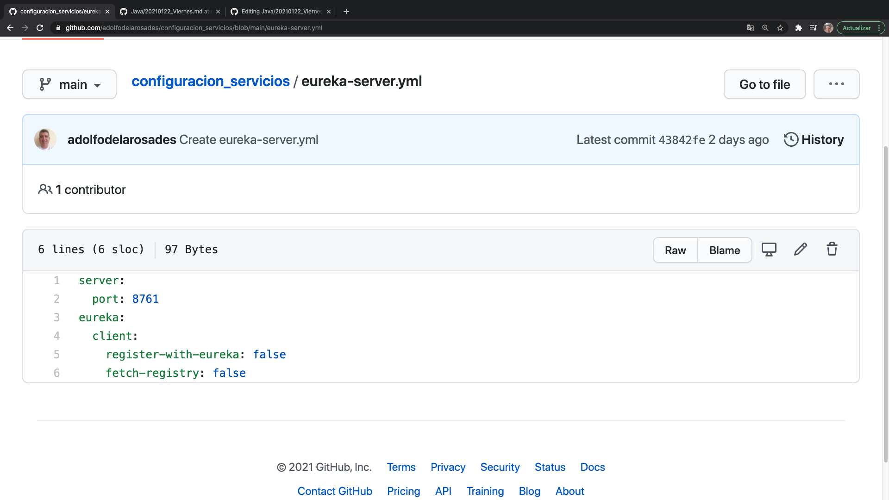
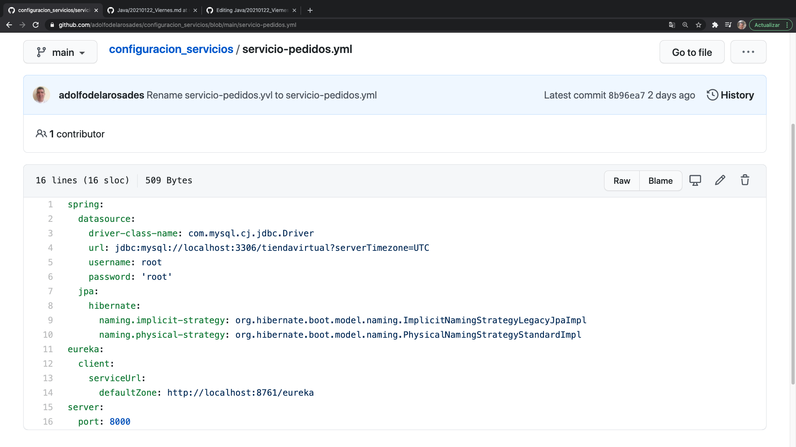


* Los nombres de los archivos de configuración deben ser el nombre del Servicio con extensión `.yml` es decir:

   * `eureka-server.yml`
   * `servicio-pedidos.yml`
   * `servicio-productos.yml`
   
   Es decir son los nombres que colocamos en la proiedad `spring.application.name`, ya no se pueden llamar `application.yml`
   
   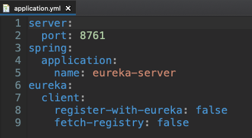
   
   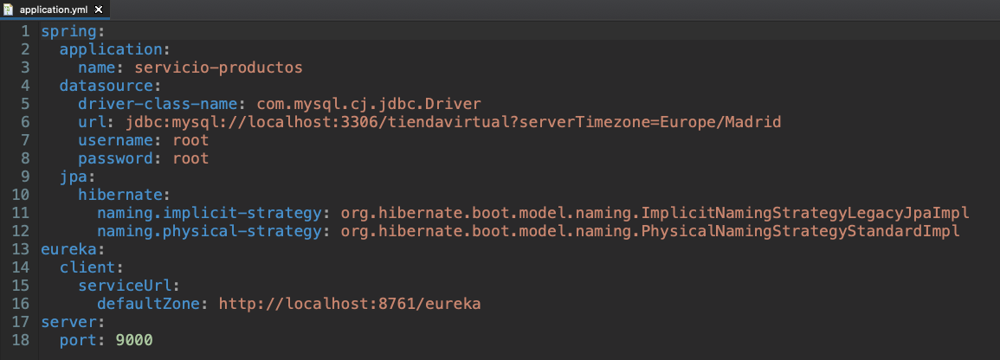
   
   
   
Observe como los archivos de configuración que colocamos en GitHub no llevan la propiedad `spring.application.name` por que los MicroServicios para poder consultar su configuración, ya debe saber su nombre previamente por lo tanto el nombre debe estar aquí.

Otra cosa que debemos tener en cuenta y lo podemos ver en el Repositorio GitHub


Es que nuestro repositorio tiene una rama principal llamada `Main` antes se llamaba `Master` GitHub ha cambiado el nombre de la Rama Principal y esto tiene impacto en nuestra configuración, ya veremos donde.
   
### Crear Servidor de Configuración

Una vez creado el Repositorio GitHub y los archivos de configuración vamos a crear el Servidor de Configuración.

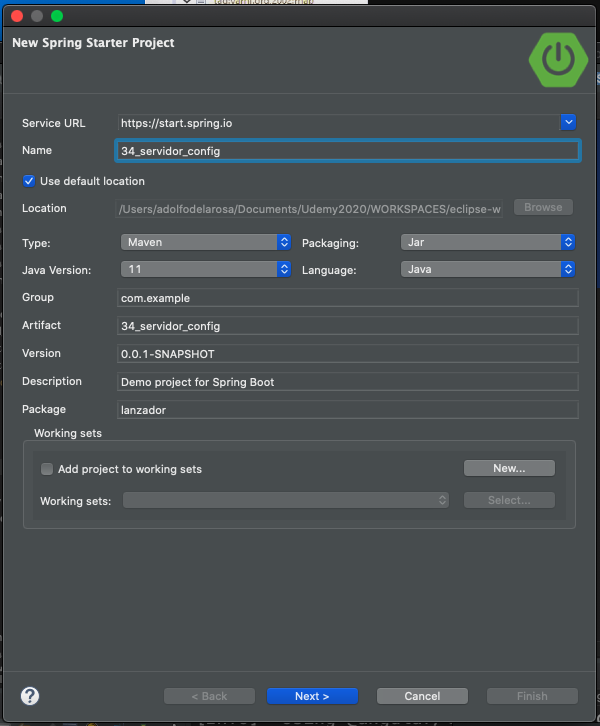


Solo tiene la dependencia de Config Server.

#### Configurando la Clase Lanzadora

`Application`

```java
package lanzador;

import org.springframework.boot.SpringApplication;
import org.springframework.boot.autoconfigure.SpringBootApplication;
import org.springframework.cloud.config.server.EnableConfigServer;

@EnableConfigServer
@SpringBootApplication
public class Application {

   public static void main(String[] args) {
      SpringApplication.run(Application.class, args);
   }

}
```
* Anotamos la clase con `@EnableConfigServer` para indicar que es un MicroServicio de Server de Configuración


#### Configurando archivo `application.yml`

Debemos colocar la configuración del Servidor de Configuración en su archivo `application.yml`, no sería lógico tener la configuración de este MicroServicio en GitHub.

`application.yml`
```txt
server:
  port: 8888
spring:
  cloud:
    config:
      server:
        git: 
          uri: https://github.com/adolfodelarosades/configuracion_servicios
        default-label: main  
```
* Configuramos Puerto
* Configuramos URI del servidor remoto GitHub
* Indicamos el nombre de la rama principal en GitHub, si la rama fuera `master` no sería necesario.

Con esto ya tenemos listo el Servidor de Configuración, ahora vamos a ver que debemos modificar en los MicroServicios por que si ya la configuración de los mismos esta ya en el Servidor de Configuración se debería de quitar su archivo `application.yml`.

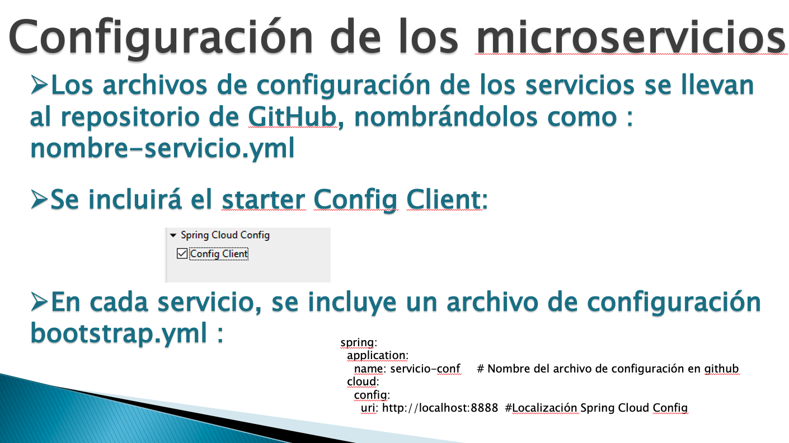
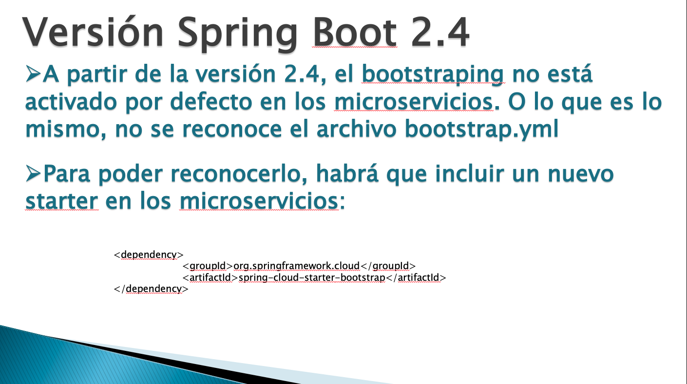


``
```java
```
