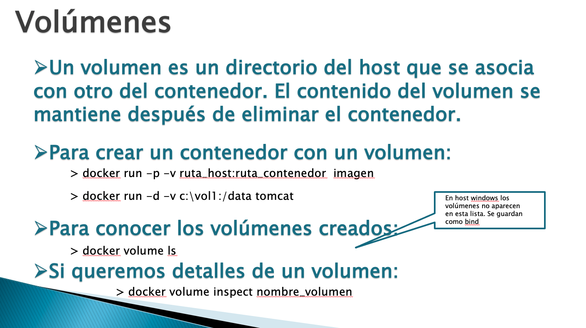
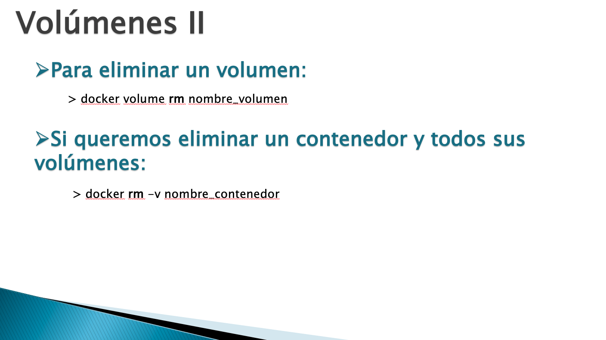

# 20210125 Lunes

# Docker

## Contenedores Docker


Pongamonos en situación, si nosotros como desarrolladores desarrollamos una aplicación y la tenemos que distribuir ya sea Servicio, MicroServicio, Aplicación Web, tendríamos que generar el JAR o WAR según corresponda, pero esto no es independiente para ejecutar ese JAR o WAR necesitaremos un Servidor de aplicaciones, BD, etc, el proceso que se tiene desde que se termina un desarrollo hasta que se pone en Producción requiere ua tarea que se llama ***el Despliegue*** que implica tener todas las consideraciones necesarias para que la aplicación pueda ejecutarse, JDK, Maquina Virtual, etc, es un proceso que alguien tiene que hacer, esto implica que debe haber unos requerimientos necesarios en la maquina destino, muchos problemas.  

El objetivo de los Contenedores es facilitar toda la tarea de distribución de una aplicación, es decir tu quieres distribuir una aplicación y esta necesita esto, esto y esto pues en vez de desplegar la aplicación sola es crear un contenedor,  en el contenedor va a estar almacenada la aplicación más todo el software que necesita para que funcione como la versión del JDK, Tomcat, BD, etc. Ya no se distribuye la aplicación, se distribuye el Contenedor, con lo cual cuando quieras instalar la aplicación en algún sitio lo único que hay que hacer es desplegar en ese sitio el contenedor, que es una instrucción de línea de comandos. Ese equipo destino no necesita tener nada, ya que en el contenedor va a estar todo lo necesario para que la aplicación funcione.

Una consideración que debemos tener en cuenta es que ***un contenedor esta pensado para incluir una aplicación solamente, un componente*** Cada conteneror con su aplicación así que si neccesito una BD esta ira en otro contenedor.

Antes esto se hacia con Maquinas Virtuales pero estas son muy pesadas por que llevan su propio S.O, en cambio los contenedores son muy ligeros, portables, sin S.O ya que tiran del S.O de la maquina.


Docker es el más popular en cuanto a contenedores.
Cada contenedor lleva su aplicacion puedo tener varios, hay componente por debajo que permite esta magia quue es **Docker Engine** por lo que en la maquina que quiera desplegar el contenedor necesita tener Docker Engine.


Los contenedores son ideales para desplegar los MicroServicios, pero los MicroServicios para funcionar necesitan JVM, JSE, JDK por lo que yo no puedo distribuir un MicroServicio a cualquier maquina ya que si yo lo desarrolle con una versión 11 y la maquina tiene una versión 7 o simplemente no tiene JDK puede haber conflictos, de lo contrario si meto ese MicroServicio con todo lo que necesita en el destinatario ***solo voy a necesitar tener el Docker Engine*** pero allí nadie tendra que instalar el JDK, ni nada de nada, si hablamos de una BD MySQL la puedo meter en un contenedor y me la puedo llevar a cualquier maquina que no tenga instalado MySQL, es bastante pontente y nos facilita la vida.


Cuando se trabaja con Docker tenemos los conceptos de 

* Imagen: Es como la clase
* Contenedor: Es como el objeto.

Para crear un Contenedor necesito una Imagen. La imagen determina todo lo que se contiene para que la aplicación funcione. Una vez que ya tengo la Imagen puedo crear diferentes contenedores con la misma instancia de un servicio.

Para usar docker puedo usar la Maquina Virtual de Ubunto o en el caso de la Mac me vale usar la consola.

## Instalación de Docker


```sh
mini-de-adolfo:~ adolfodelarosa$ docker -v
Docker version 20.10.0, build 7287ab3
mini-de-adolfo:~ adolfodelarosa$ 
```


Ver Imagenes Docker


Existen muchas imagenes ya existentes listas para usar sus contenedores. 

Si conocemos el nombre de una Imagen nos la podemos descargar con el Comando : `docker pull tomcat`:


Ahora ya tengo la image `tomcat` para crear el contenedor de `tomcat` lo hacemos con el comando `docker run tomcat`:


Como el terminal se queda ejecutando Tomcat necesito abrir otra terminal.


Ver Contenedores en Ejecución con  `docker ps -a`


Ver Contenedores en Ejecución con  `docker ps`


Podría pensarse que si cargamos la URL http://localhost:8080 veriamos algo.


Pero no puede acceder a la URL http://localhost:8080 y esto pasa por que Tomcat esta arrancado dentro del Contenedor y yo estoy tratando al contenedor desde fuera y no tenemos acceso, por eso nos marca ese error. Ya veremos como hacerlo.

Para detener un Contenedor necesitamos el Id de Contenedor y usamos el comando `docker stop identificador`


Ver Contenedores en Ejecución


El contenedor existe pero esta Exited.

Eliminar una Imagen `docker rmi imagen`


Eliminar un Contenedor `docker rm identificador-contenedor`


OJO Eliminar el Contenedor es como borrarlo de la Memoria, borrar la Imagen es borrar fisicamente toda la Imagen.

### Docker Hub

https://hub.docker.com/


## Gestión de Contenedores





## Creación de Imágenes Docker


## Docker Hub


