# 20200714_Martes

Existen dos formas de realizar la Multitarea.

* Extendiendo la clase `Thread`
* Implementando la interfaz `Runnable`

A continuación se va a ver un ejemplo de cada caso.


## :computer: Ejemplo de Multitarea `000-030_ejemplo_multitarea` - `Thread`

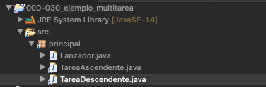

*`TareaAscendente`*

```java
package principal;

public class TareaAscendente extends Thread{

	@Override
	public void run() {
		for(int i=1; i<=100; i++) {
			System.out.println("ASC : " + i);
			try {
				Thread.sleep(100);
			} catch (InterruptedException e) {
				e.printStackTrace();
			}
		}
	}
}

```

*`TareaDescendente`*

```java
package principal;

public class TareaDescendente extends Thread{
	
	@Override
	public void run() {
		for(int i=100; i>=1; i--) {
			System.out.println("DESC : " + i);
			try {
				Thread.sleep(100);
			} catch (InterruptedException e) {
				e.printStackTrace();
			}
		}
	}
}
```

*`Lanzador`*

```java
package principal;

public class Lanzador {
	
	public static void main(String[] args) {
		
		//Primera forma tradicional
		/*
		Thread t1 = new TareaAscendente();
		Thread t2 = new TareaDescendente();
		
		//Lanzamos las tareas en ejecución concurrente
		t1.start();
		t2.start();
		*/
		
		//Segunda forma usando Polimorfismo.
		lanzador(new TareaAscendente());
		lanzador(new TareaDescendente());
		
		//Las tareas del main también se cuentan como otra tarea concurrencia
		for(int i=1; i<= 100; i++) {
			System.out.println("Tarea del Main " + i);
			try {
				Thread.sleep(100);
			} catch (InterruptedException e) {
				// TODO Auto-generated catch block
				e.printStackTrace();
			}
		}
	}
	
	private static void lanzador(Thread t) {
		t.start();
	}
}
```

### Ejecución de la Aplicación 

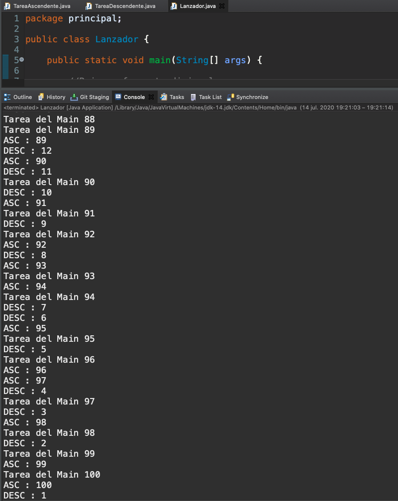

## :computer: Ejemplo de Multitarea `000-031_ejemplo_multitarea_runable` - `Runable`

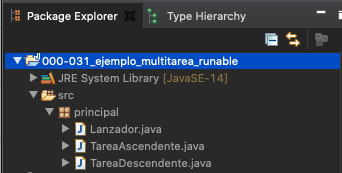

*`TareaAscendente`*

```java
package principal;

public class TareaAscendente implements Runnable{

	@Override
	public void run() {
		for(int i=1; i<=100; i++) {
			System.out.println("ASC : " + i);
			try {
				Thread.sleep(100);
			} catch (InterruptedException e) {
				e.printStackTrace();
			}
		}
	}
}
```

*`TareaDescendente`*

```java
package principal;

public class TareaDescendente implements Runnable{
	
	@Override
	public void run() {
		for(int i=100; i>=1; i--) {
			System.out.println("DESC : " + i);
			try {
				Thread.sleep(100);
			} catch (InterruptedException e) {
				e.printStackTrace();
			}
		}
	}
}
```

*`Lanzador`*

```java
package principal;

public class Lanzador {
	
	public static void main(String[] args) {
		
		//Primera forma tradicional
		/*
		Thread t1 = new TareaAscendente();
		Thread t2 = new TareaDescendente();
		
		//Lanzamos las tareas en ejecución concurrente
		t1.start();
		t2.start();
		*/
		
		//Segunda forma usando Polimorfismo.
		lanzador(new TareaAscendente());
		lanzador(new TareaDescendente());
		
		//Las tareas del main también se cuentan como otra tarea concurrencia
		for(int i=1; i<= 100; i++) {
			System.out.println("Tarea del Main " + i);
			try {
				Thread.sleep(100);
			} catch (InterruptedException e) {
				e.printStackTrace();
			}
		}
	}
	
	//Lanzo start() del Thread a partir del Runnable
	private static void lanzador(Runnable r) {
		new Thread(r).start();
	}
}
```

El lanzamiento de la interfaz no se puede hacer directamente se debe hacer a través de la clase `Thread` usando el `Runnable`, es decir `new Thread(r).start();`.

### Ejecución de la Aplicación 

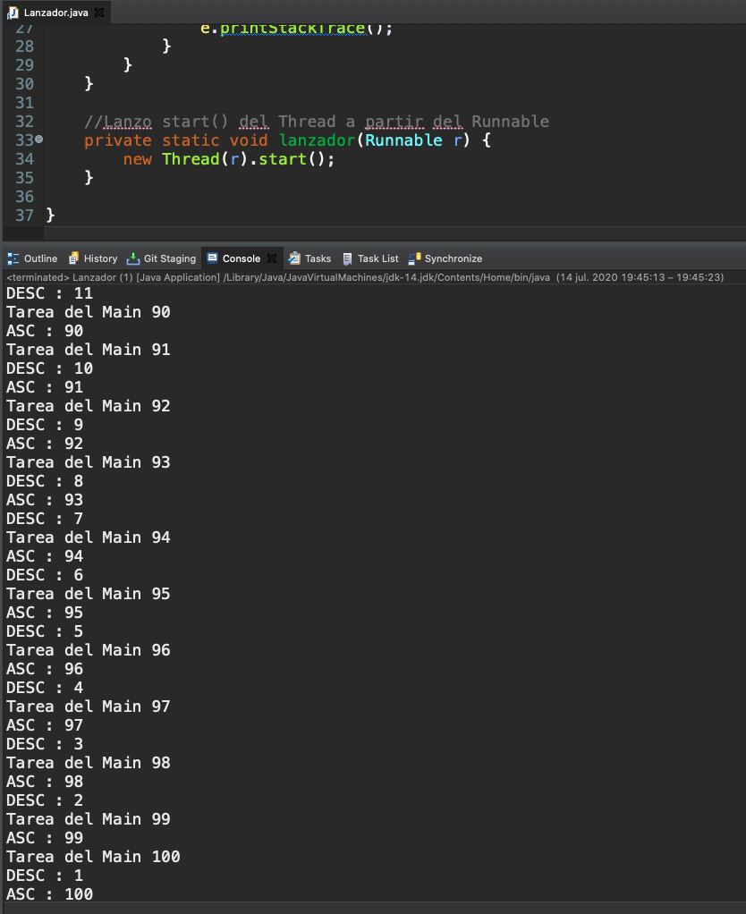

## :computer: Ejercicio de Concurrencia `000-032-01_ejercicio_tablas_multiplicar_concurrente` - `Runable`

Leer 5 números y que presente las tablas de múltiplicar de cada número concurrentemente.

Este ejercicio después de completarlo, se ha usado para demostrar que cuando varias tareas que se estan ejecutando concurrentemente y trabajan todas sobre un mismo recurso puede suceder que algunas tareas no se terminen y quede pausada mientras entra otra tarea y puede pasar lo mismo nuevamente. 

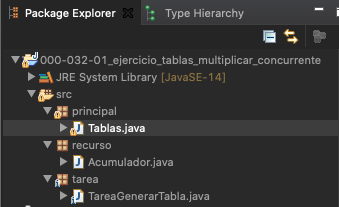

*`Acumulador`*

```java
package recurso;

public class Acumulador {
	
   private int valor;

   public int getValor() {
      return valor;
   }

   public void setValor(int valor) {
      this.valor = valor;
   }	
}
```

*``*

```java
package tarea;

import recurso.Acumulador;

public class TareaGenerarTabla implements Runnable{
	
   private int num;
   private Acumulador acumulador;
	
   public TareaGenerarTabla(int num, Acumulador acumulador) {
      super();
      this.num = num;
      this.acumulador = acumulador;
   }

   @Override
   public void run() {
      for(int i=1; i<=10; i++) {
	 System.out.println( num + " * " + i + " = " + (num * i));
	 int valor = acumulador.getValor();
	 valor +=num*i;
	 try {
	    Thread.sleep(100);
	 } catch (InterruptedException e) {
	    e.printStackTrace();
	 }
	 acumulador.setValor(valor);
      }
      System.out.println("VALOR ACTUAL DEL ACUMULADOR: " + acumulador.getValor());
   }
}
```

*`Tablas`*

```java
package principal;

import java.util.Scanner;

import recurso.Acumulador;
import tarea.TareaGenerarTabla;

public class Tablas {

   public static void main(String[] args) {

      final int totalNumeros = 2;
      int[] nums = new int[totalNumeros];
		
      Acumulador acumulador = new Acumulador();
			
      Scanner sc = new Scanner(System.in);

      for (int i = 0; i <= totalNumeros - 1; i++) {

         System.out.println("Inserta el número " + (i + 1) + ": ");
	 String numStr = sc.nextLine();

	 nums[i] = Integer.parseInt(numStr);
      }

      for (int n:nums) {
	 lanzador(new TareaGenerarTabla(n, acumulador));
      }	
   }

   // Lanzo start() del Thread a partir del Runnable
   private static void lanzador(Runnable r) {
      new Thread(r).start();
   }
}
```

### Ejecución de la Aplicación 

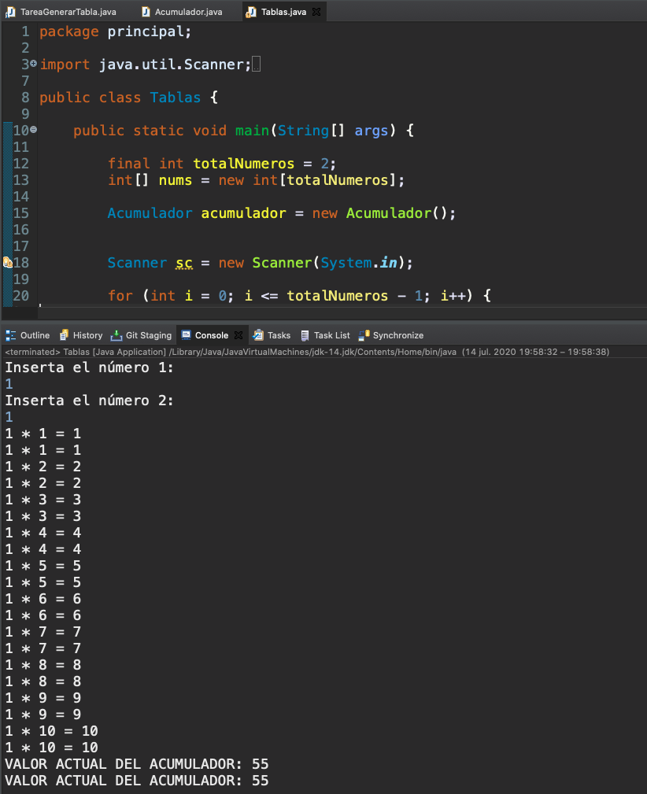

Si la aplicación se ejecutara de forma correcte el valor acumulado llegaría a 110 acumulando todos los resultados de la tamba de multiplicar de 1, pero solo llega hasta 55, es decir se realiza una tarea y esta es interrumpida por otra tarea antes de actualizar por eso el valor nollega al que debe.

## :computer: Ejercicio de Concurrencia-Syncronyze `000-032-02_ejercicio_tablas_multiplicar_concurrente_syncronyze` - `Syncronyze`

Para evitar el problema del ejercicio anterior debemos usar **Bloques Sincronizados** esto nos permite bloquear un bloque de instrucciónes hasta que la tarea que fue interrumpida lo termine.

También puedo bloquear un objeto directamente (Syncronize se pone en la clase Acumulador).

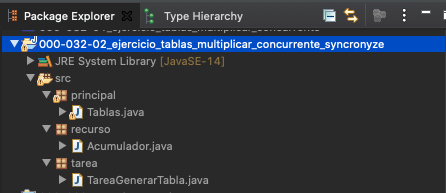

*`Acumulador`*

```java
package recurso;

public class Acumulador {
	
	private int valor;

	public int getValor() {
		return valor;
	}

	public void setValor(int valor) {
		this.valor = valor;
	}
}
```

*`TareaGenerarTabla`*

```java
package tarea;

import recurso.Acumulador;

public class TareaGenerarTabla implements Runnable {

	private int num;
	private Acumulador acumulador;

	public TareaGenerarTabla(int num, Acumulador acumulador) {
		super();
		this.num = num;
		this.acumulador = acumulador;
	}

	@Override
	public void run() {
		for (int i = 1; i <= 10; i++) {
			System.out.println(num + " * " + i + " = " + (num * i));

			synchronized (acumulador) {
				int valor = acumulador.getValor();
				valor += num * i;
				try {
					Thread.sleep(100);
				} catch (InterruptedException e) {
					// TODO Auto-generated catch block
					e.printStackTrace();
				}
				acumulador.setValor(valor);
			}
		}
		System.out.println("VALOR ACTUAL DEL ACUMULADOR: " + acumulador.getValor());
	}

}
```

*`Tablas`*

```java
package principal;

import java.util.Scanner;

import recurso.Acumulador;
import tarea.TareaGenerarTabla;

public class Tablas {

	public static void main(String[] args) {

		final int totalNumeros = 2;
		int[] nums = new int[totalNumeros];
		
		Acumulador acumulador = new Acumulador();
		
		
		Scanner sc = new Scanner(System.in);

		for (int i = 0; i <= totalNumeros - 1; i++) {

			System.out.println("Inserta el número " + (i + 1) + ": ");
			String numStr = sc.nextLine();

			nums[i] = Integer.parseInt(numStr);
		}

		for (int n:nums) {
			lanzador(new TareaGenerarTabla(n, acumulador));
		}
	}

	// Lanzo start() del Thread a partir del Runnable
	private static void lanzador(Runnable r) {
		new Thread(r).start();
	}

}
```

### Ejecución de la Aplicación 

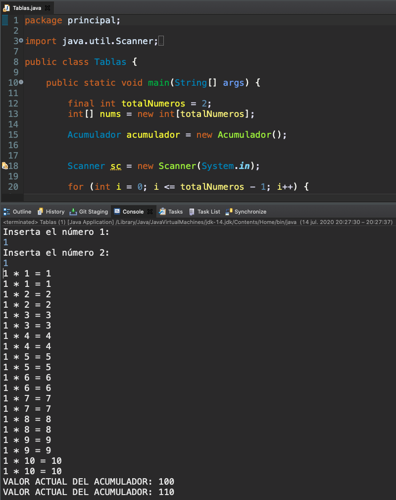

## Thread-Safe

Existen algunas clases que se dice que son Thread-Safe es decir que internamente implementan la sincronización por lo cual no tendríamos que preocuparla manualmente como lo hemos hecho en este caso, algunos ejemplos son:

* `Vector`

Los objetos de este tipo serán seguros para multitarea.

# Interfaces en Java 8

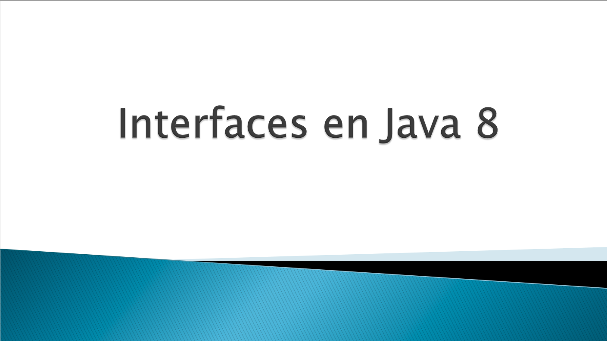

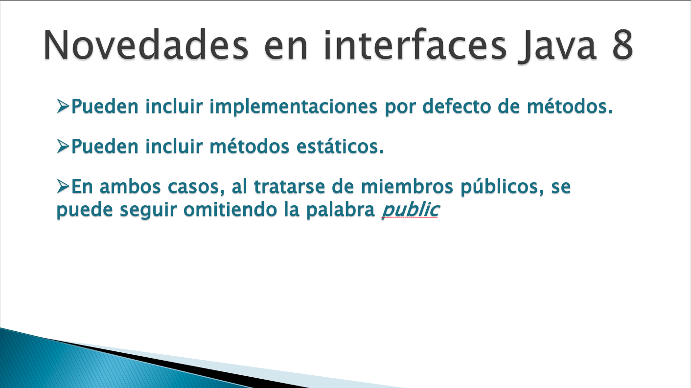

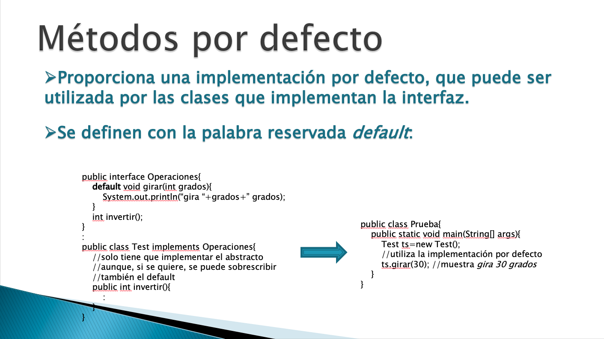

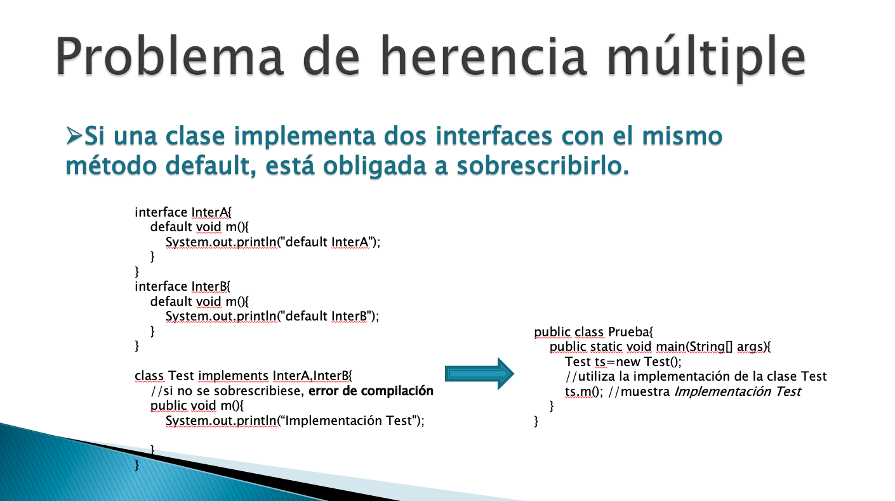

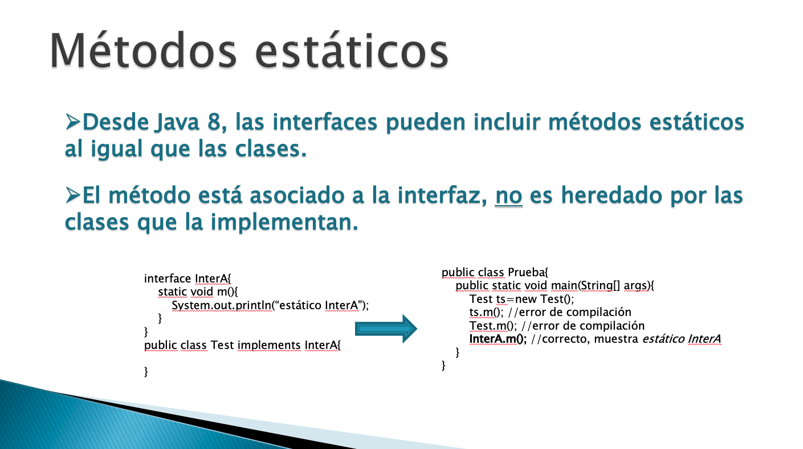

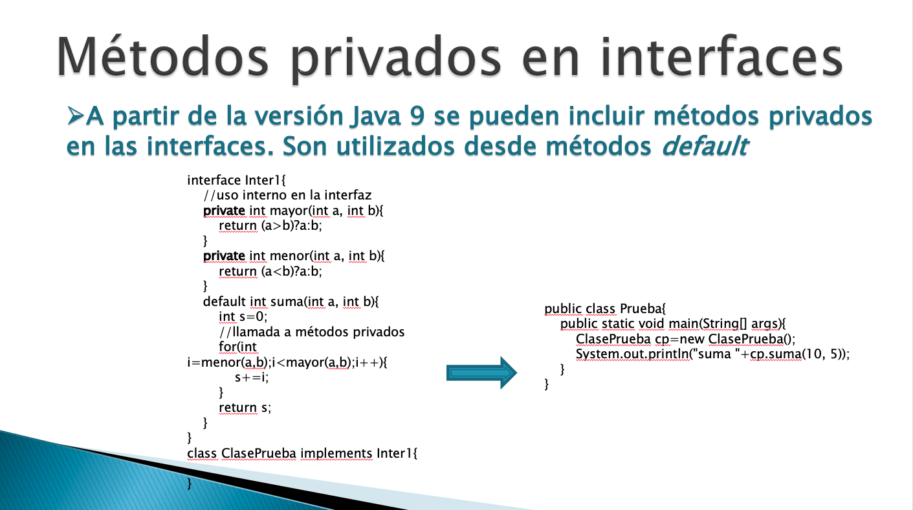

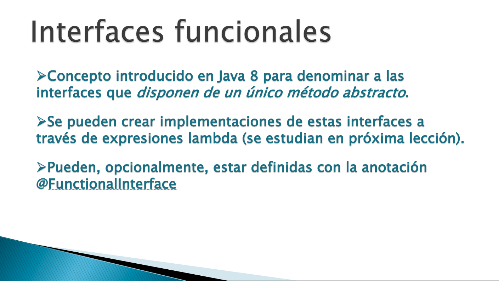

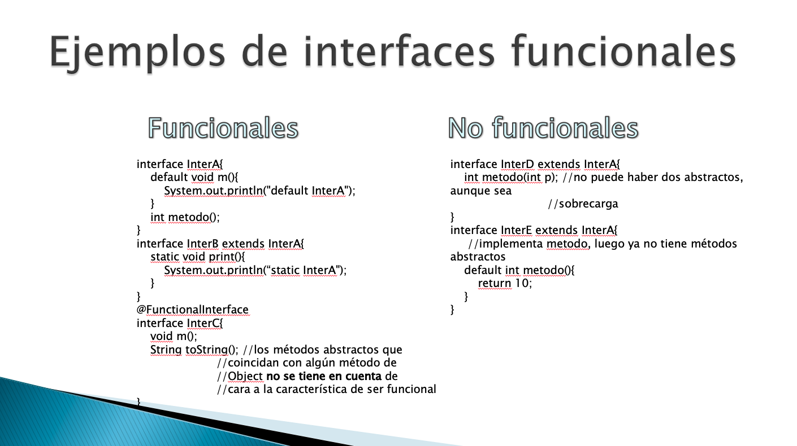


*``*

```java
```

*``*

```java
```

*``*

```java
```


*``*

```java
```

*``*

```java
```

*``*

```java
```


*``*

```java
```

*``*

```java
```

*``*

```java
```


*``*

```java
```

*``*

```java
```

*``*

```java
```


*``*

```java
```

*``*

```java
```

*``*

```java
```

