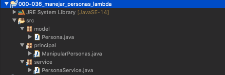
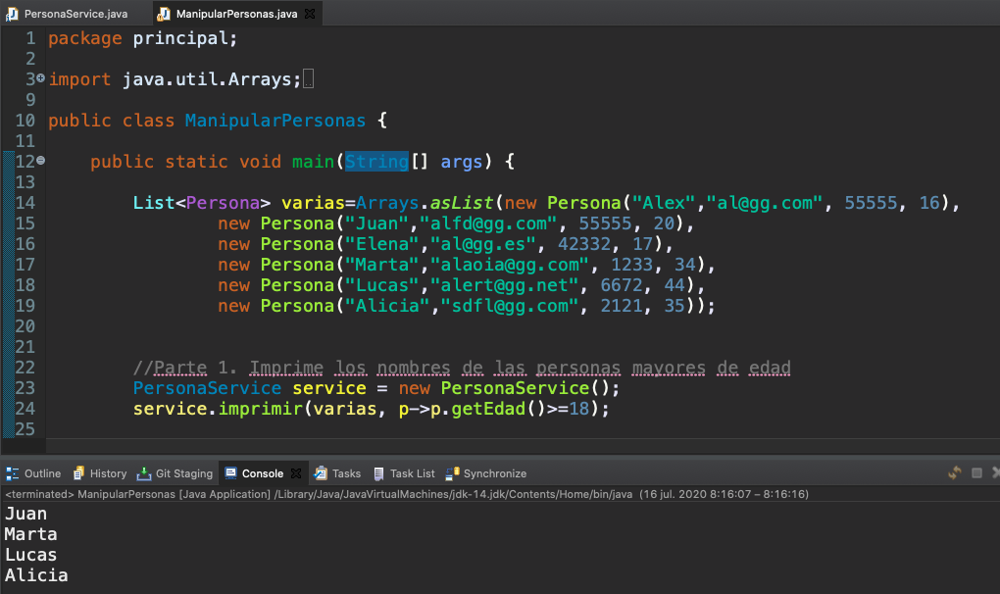
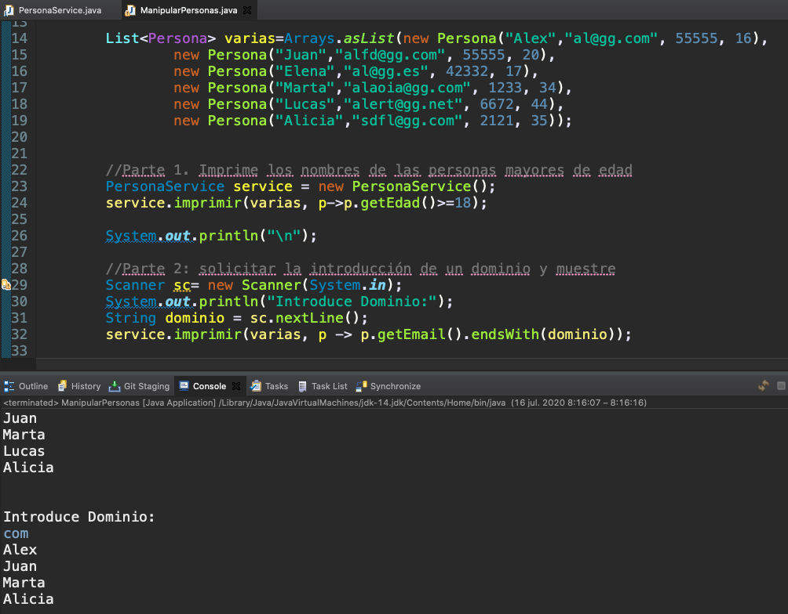
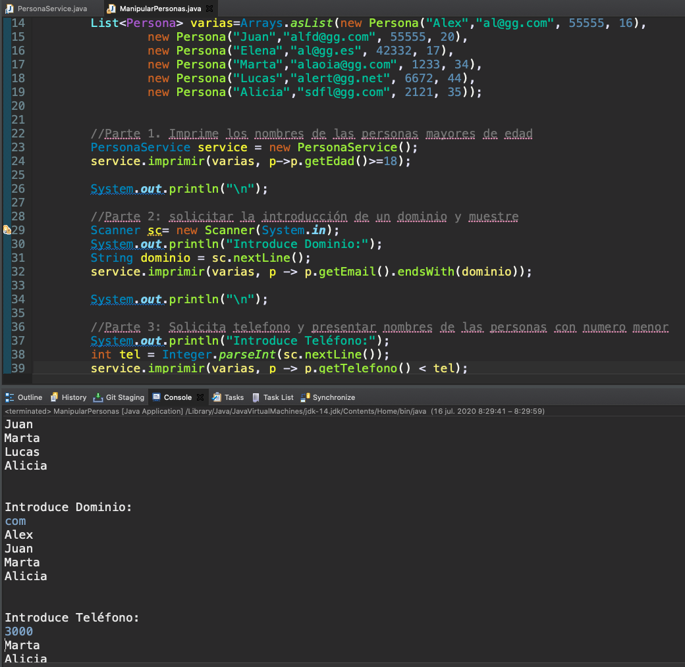
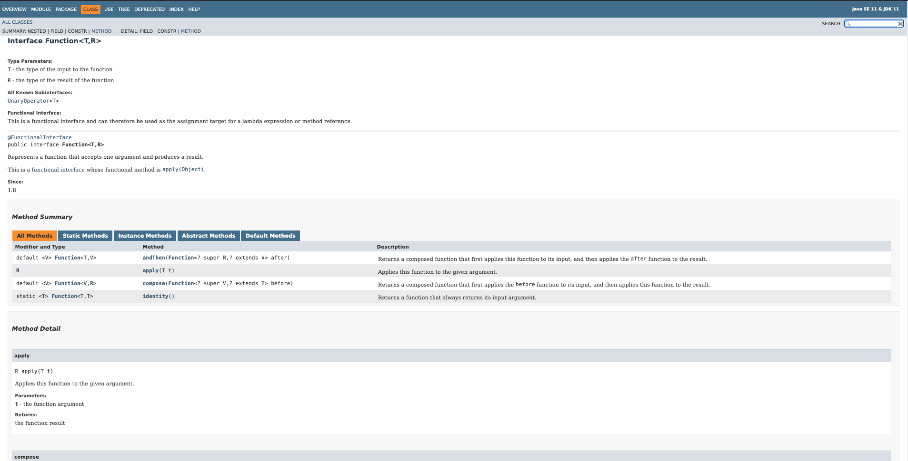
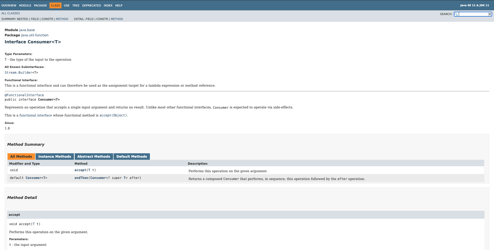

# 20200715 Miercoles

Vamos a seguir viendo ejemplos de las Interfaces Funcionales.

## :computer: Ejercicio de Interface Funcionales `000-036_manejar_personas_lambda` - `Predicate<T>`

Existen muchos programas que al implementar las Interfaces Funcionales por un lado reciben la Colección de objetos como primer parámetro y como un segundo la condición que servira para tratar esa colección.

### Interface `Predicate<T>`


Vamos a usar la Interface `Predicate<T>` para que dada una Lista de `Personas` nos devuelva las que son mayores de edad.



Lo primero de todo tenemos nuestra clase Modelo

*`Persona`*

```java
package model;

public class Persona {
	
	private String nombre;
	private String email;
	private int telefono;
	private int edad;
	
	public Persona(String nombre, String email, int telefono, int edad) {
		super();
		this.nombre = nombre;
		this.email = email;
		this.telefono = telefono;
		this.edad = edad;
	}
	public String getNombre() {
		return nombre;
	}
	public void setNombre(String nombre) {
		this.nombre = nombre;
	}
	public String getEmail() {
		return email;
	}
	public void setEmail(String email) {
		this.email = email;
	}
	public int getTelefono() {
		return telefono;
	}
	public void setTelefono(int telefono) {
		this.telefono = telefono;
	}
	public int getEdad() {
		return edad;
	}
	public void setEdad(int edad) {
		this.edad = edad;
	}
}
```

*`PersonaService`*

Notese que aquí el enfoque es diferente en ningún momento estoy creado una clase que implemente la Interface `Predicate<T>`, lo que estoy haciendo es crear una clase Service para agrupar todas las tareas que se van a realizar sobre `Persona`.

La Primera tarea es que me imprima el nombre de las personas que cumplan una condición, ¿qué condición? no importa con `Predicate<T>` se que tengo el método `test(persona)` para evaluar esta condición y si se que es verdadera imprimo el nombre, eso es todo.

```java
package service;

import java.util.List;
import java.util.function.Consumer;
import java.util.function.Function;
import java.util.function.Predicate;

import model.Persona;

public class PersonaService {
	
	
	//Imprima las personas que cumplan en la condición que se recibe como segudo parámetro
	public void imprimir(List<Persona> personas, Predicate<Persona> condicion) {
		
		for(Persona persona: personas) {
			if(condicion.test(persona)) {
				System.out.println(persona.getNombre());
			}
		}
	}
}  
```

Ahora vamos a la llamada de este método.

*`ManipularPersonas`*

```java
package principal;

import java.util.Arrays;
import java.util.List;
import java.util.Scanner;

import model.Persona;
import service.PersonaService;

public class ManipularPersonas {

   public static void main(String[] args) {
		
      List<Persona> varias=Arrays.asList(new Persona("Alex","al@gg.com", 55555, 16),
		new Persona("Juan","alfd@gg.com", 55555, 20),
		new Persona("Elena","al@gg.es", 42332, 17),
		new Persona("Marta","alaoia@gg.com", 1233, 34),
		new Persona("Lucas","alert@gg.net", 6672, 44),
		new Persona("Alicia","sdfl@gg.com", 2121, 35));
		
		
      //Parte 1. Imprime los nombres de las personas mayores de edad
      PersonaService service = new PersonaService();
      service.imprimir(varias, p->p.getEdad()>=18);
  }
}
```

Al llamar al método `imprimir` mandamos dos parámetros la lista de personas y como segundo parámetro mandamos la condición. 
Como al implementar el método `public void imprimir(List<Persona> personas, Predicate<Persona> condicion) {` indicamos que condición la condición es una 
Interface `Predicate<T>` hay que mandarle la implementación del método `test` de la Interface `Predicate<T>` que es lo que se usa en nuestro método `imprimir`

`if(condicion.test(persona)) {`

Como observamos `test` recibe como parametro una `Persona` y como ya sabemos `test` nos regrea un valor booleano. Por eso al hacer la implementación de la Interface `Predicate<T>` con expresiones lambada en eso debemos pensar para saber como implementarla en este caso el resultado es `p->p.getEdad()>=18` del lado de la derecha el parámetro que debe recir y del lado derecho una expresión booleana que nos devolvera el resultado.

**La Expresión Lambda es una implementación de la interfaz sin crear una clase. Lo que se crea es un Objeto de una clase Anonima que implementa la interfaz**.



Vamos a usar el mismo método `test` para una segunda condición, vamos a imprimir las personas que tengan un determinado dominio.

*`ManipularPersonas`*

```java
package principal;

import java.util.Arrays;
import java.util.List;
import java.util.Scanner;

import model.Persona;
import service.PersonaService;

public class ManipularPersonas {

   public static void main(String[] args) {
		
      List<Persona> varias=Arrays.asList(new Persona("Alex","al@gg.com", 55555, 16),
		new Persona("Juan","alfd@gg.com", 55555, 20),
		new Persona("Elena","al@gg.es", 42332, 17),
		new Persona("Marta","alaoia@gg.com", 1233, 34),
		new Persona("Lucas","alert@gg.net", 6672, 44),
		new Persona("Alicia","sdfl@gg.com", 2121, 35));
		
		
      //Parte 1. Imprime los nombres de las personas mayores de edad
      PersonaService service = new PersonaService();
      service.imprimir(varias, p->p.getEdad()>=18);
      
      //Parte 2: solicitar la introducción de un dominio y muestre
      Scanner sc= new Scanner(System.in);
      System.out.println("Introduce Dominio:");
      String dominio = sc.nextLine();
      service.imprimir(varias, p -> p.getEmail().endsWith(dominio));
      
  }
}
```

Simplemente llamamos al método `service.imprimir(varias, p -> p.getEmail().endsWith(dominio));` con una Lambda diferente, una que se adecue a la nueva condición.



Vamos a hacer una tercera variante de la condición, vamos a pedir el `Telefono` que es un `integer` y que muestre las personas con un número menor al introducido.

*`ManipularPersonas`*

```java
package principal;

import java.util.Arrays;
import java.util.List;
import java.util.Scanner;

import model.Persona;
import service.PersonaService;

public class ManipularPersonas {

   public static void main(String[] args) {
		
      List<Persona> varias=Arrays.asList(new Persona("Alex","al@gg.com", 55555, 16),
		new Persona("Juan","alfd@gg.com", 55555, 20),
		new Persona("Elena","al@gg.es", 42332, 17),
		new Persona("Marta","alaoia@gg.com", 1233, 34),
		new Persona("Lucas","alert@gg.net", 6672, 44),
		new Persona("Alicia","sdfl@gg.com", 2121, 35));
		
		
      //Parte 1. Imprime los nombres de las personas mayores de edad
      PersonaService service = new PersonaService();
      service.imprimir(varias, p->p.getEdad()>=18);
      
      //Parte 2: solicitar la introducción de un dominio y muestre
      Scanner sc= new Scanner(System.in);
      System.out.println("Introduce Dominio:");
      String dominio = sc.nextLine();
      service.imprimir(varias, p -> p.getEmail().endsWith(dominio));
      
      //Parte 3: Solicita telefono y presentar nombres de las personas con numero menor
      System.out.println("Introduce Teléfono:");
      int tel = Integer.parseInt(sc.nextLine());
      service.imprimir(varias, p -> p.getTelefono() < tel);
      
  }
}
```

Una nueva llamada al método `imprimir` con una condición diferente.



### Interface `Interface Function<T,R>`




La Interface `Interface Function<T,R>`

Su método abstracto es:

`R	apply (T t)	Applies this function to the given argument.`

### Interface `Consumer<T>`




Esta es una interfaz funcional y, por lo tanto, se puede utilizar como destino de asignación para una expresión lambda o referencia de método.

Su método abstracto es:

`void	accept (T t)	Recibe un dato y lo procesa no regresa nada`
.
Vamos a usa


*``*
```java
```
