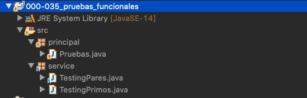
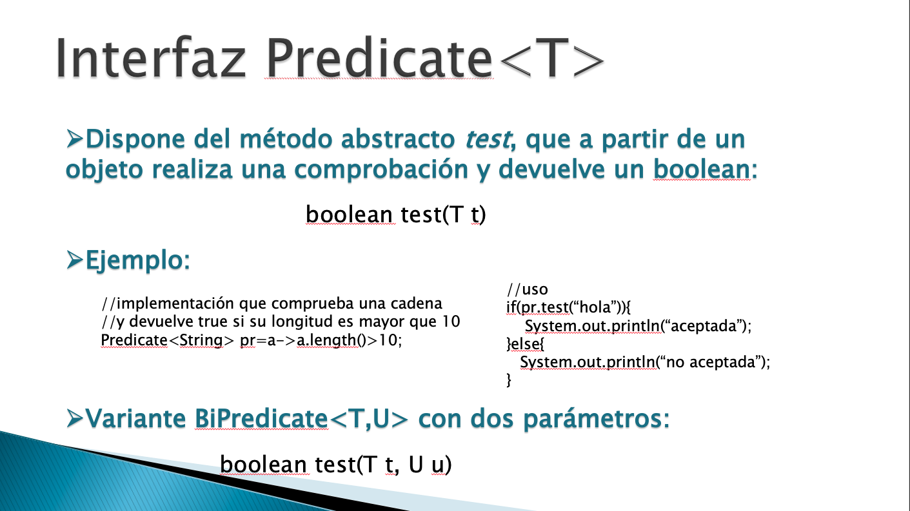
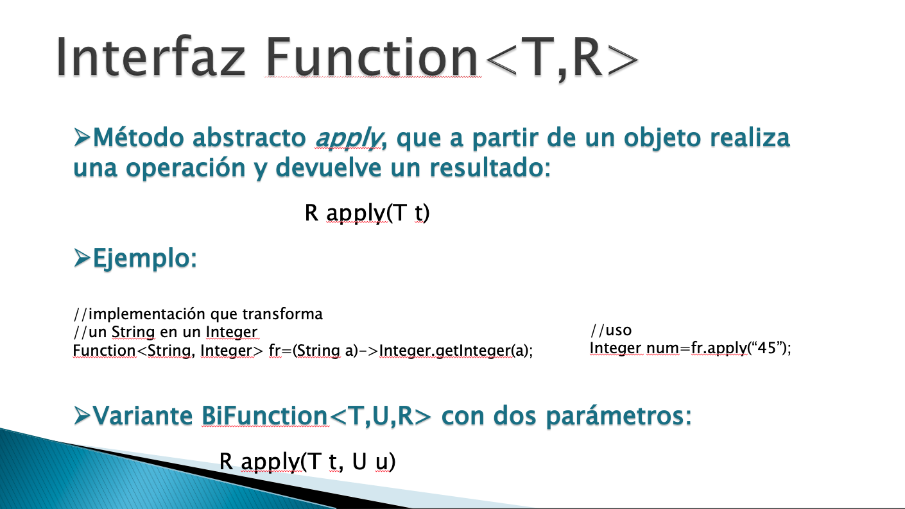
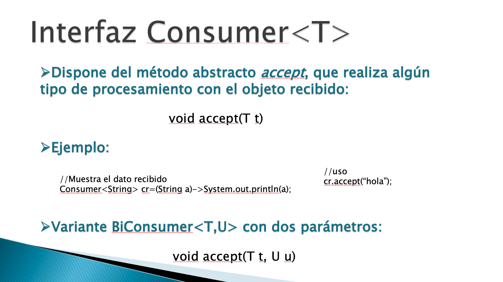
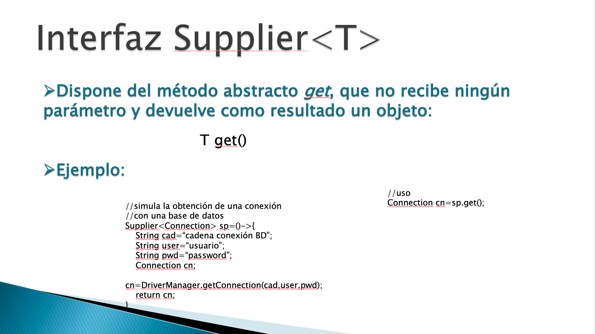
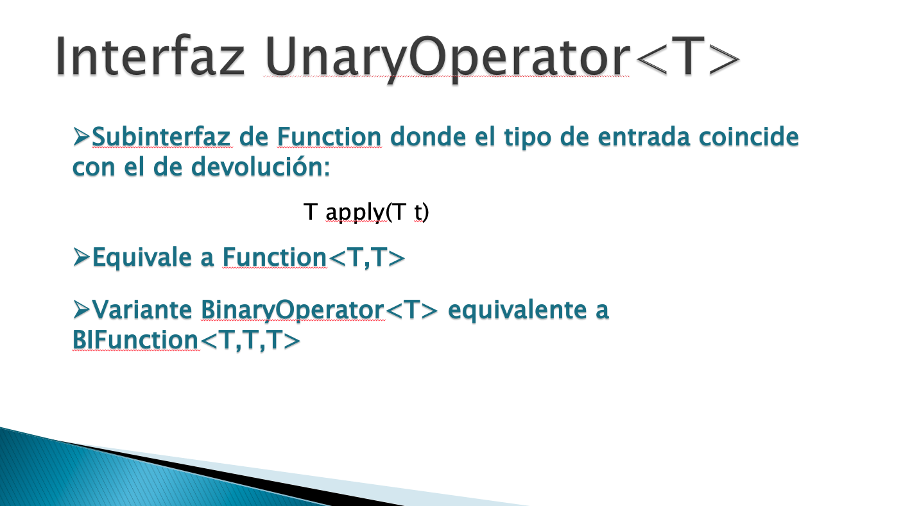
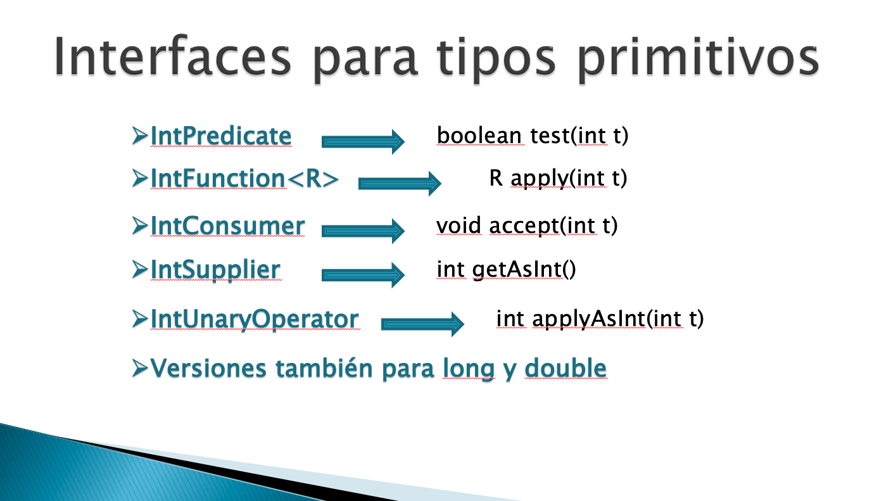
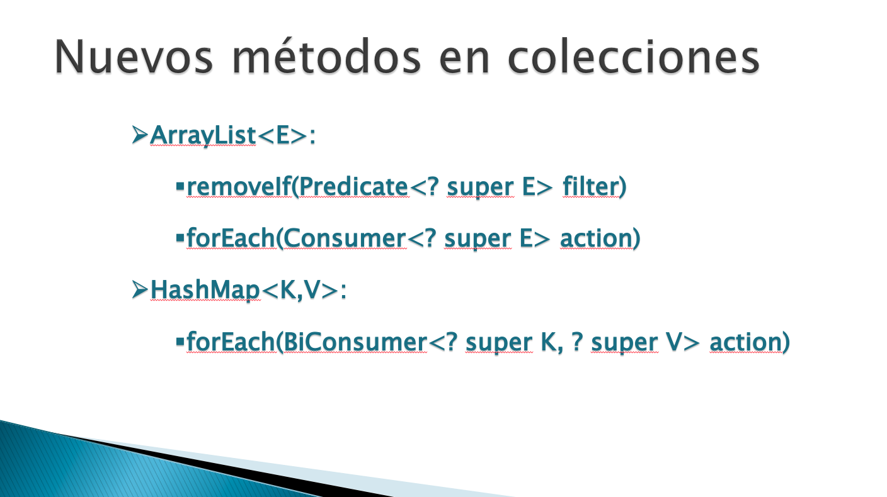

# 20200715 Miercoles

Vamos a seguir viendo ejemplos de las Interfaces Funcionales.

## :computer: Ejercicio de Interface Funcionales `000-036_manejar_personas_lambda` - `Predicate<T>`

Existen muchos programas que al implementar las Interfaces Funcionales por un lado reciben la Colección de objetos como primer parámetro y como un segundo la condición que servira para tratar esa colección.

