# Streams

[Interface Stream<T>](https://docs.oracle.com/en/java/javase/14/docs/api/java.base/java/util/stream/Stream.html)
	
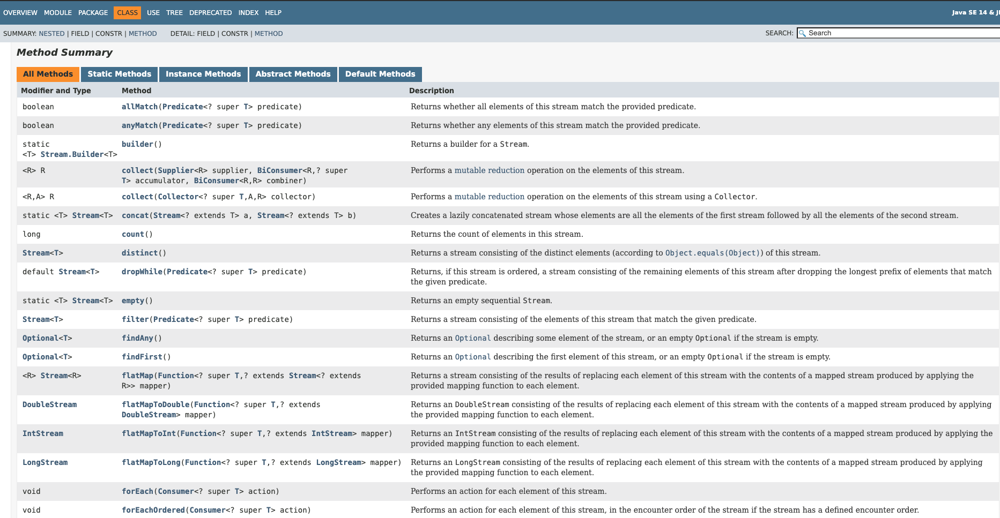

## Introduccion Streams


### Creación de un Stream

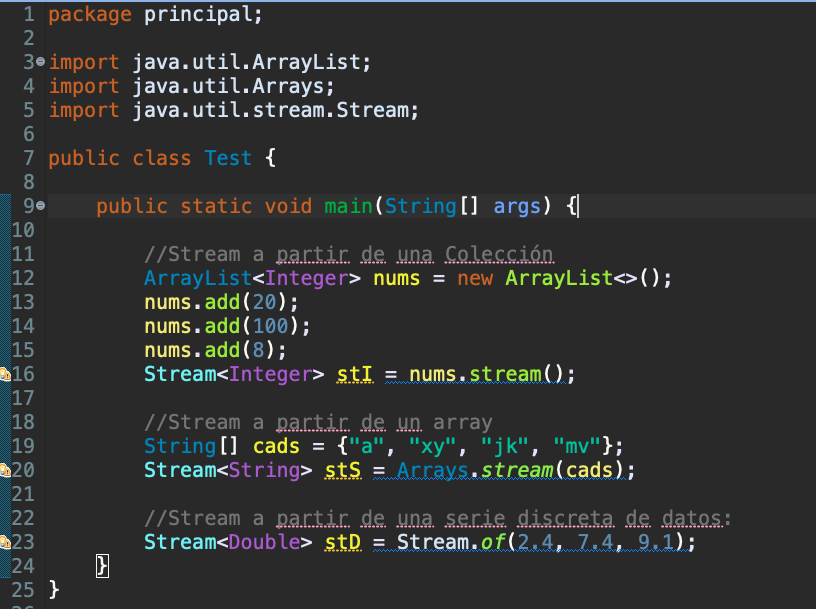

*`Test`*

```java
package principal;

import java.util.ArrayList;
import java.util.Arrays;
import java.util.stream.Stream;

public class Test {

   public static void main(String[] args) {
		
      //Stream a partir de una Colección
      ArrayList<Integer> nums = new ArrayList<>();
      nums.add(20);
      nums.add(100);
      nums.add(8);
      Stream<Integer> stI = nums.stream();
		
      //Stream a partir de un array
      String[] cads = {"a", "xy", "jk", "mv"};
      Stream<String> stS = Arrays.stream(cads);
		
      //Stream a partir de una serie discreta de datos:
      Stream<Double> stD = Stream.of(2.4, 7.4, 9.1);
   }
}
```


## Operaciones Finales Streams


### Método Final `count()`

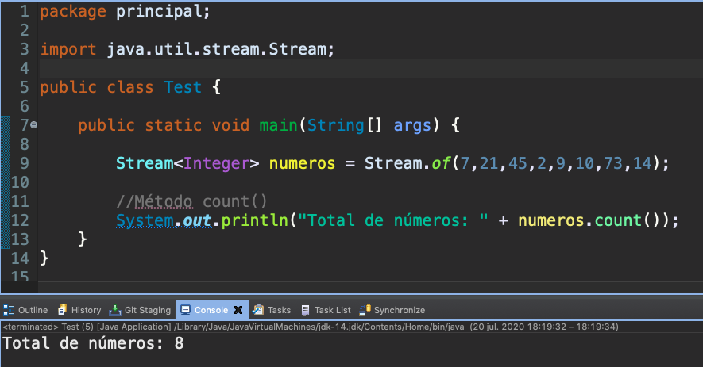

*`Test`*

```java
package principal;

import java.util.stream.Stream;

public class Test {

   public static void main(String[] args) {
		
      Stream<Integer> numeros = Stream.of(7,21,45,2,9,10,73,14);
		
      //Método Final count()
      System.out.println("Total de números: " + numeros.count());
   }
}
```
### Método Final `forEach()`

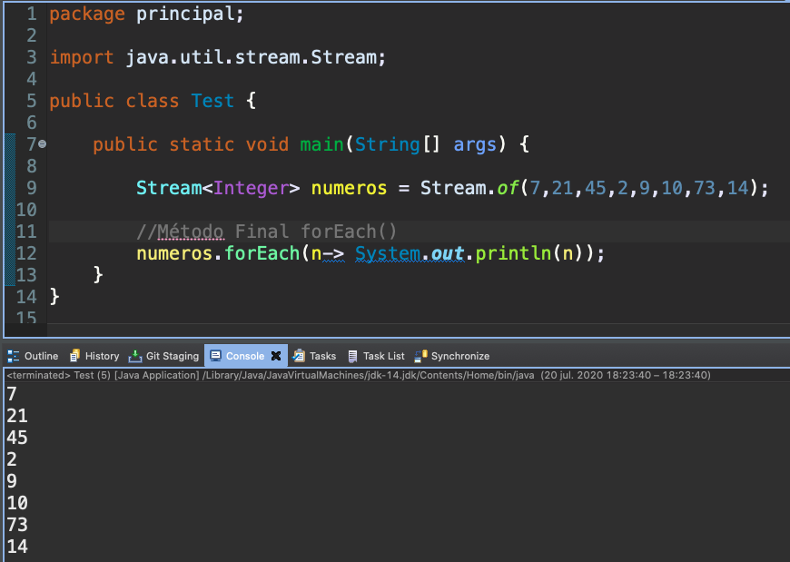

*`Test`*

```java
package principal;

import java.util.stream.Stream;

public class Test {

   public static void main(String[] args) {
		
      Stream<Integer> numeros = Stream.of(7,21,45,2,9,10,73,14);
		
      //Método Final forEach()
      numeros.forEach(n-> System.out.println(n));
   }
}
```

### Una vez que se consume el Stream ya no lo podemos volver a usar

El Stream ya ha sido operada o cerrada.**

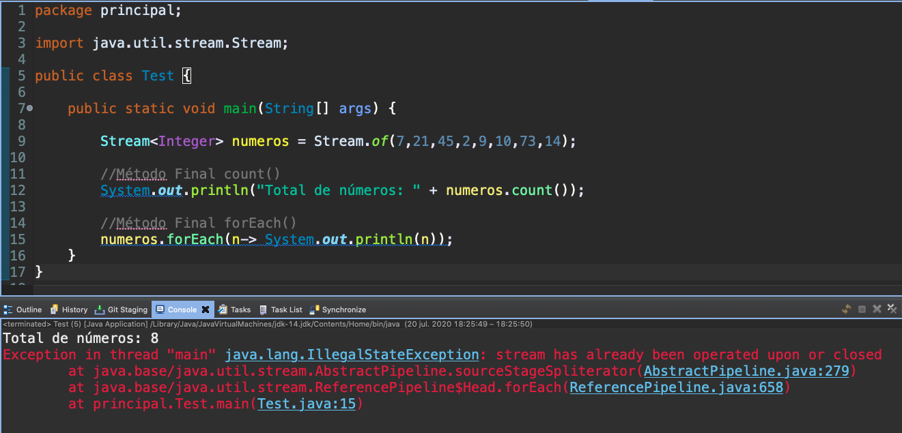

Si queremos volver a usar el Stream hay que volverlo a inicializar.

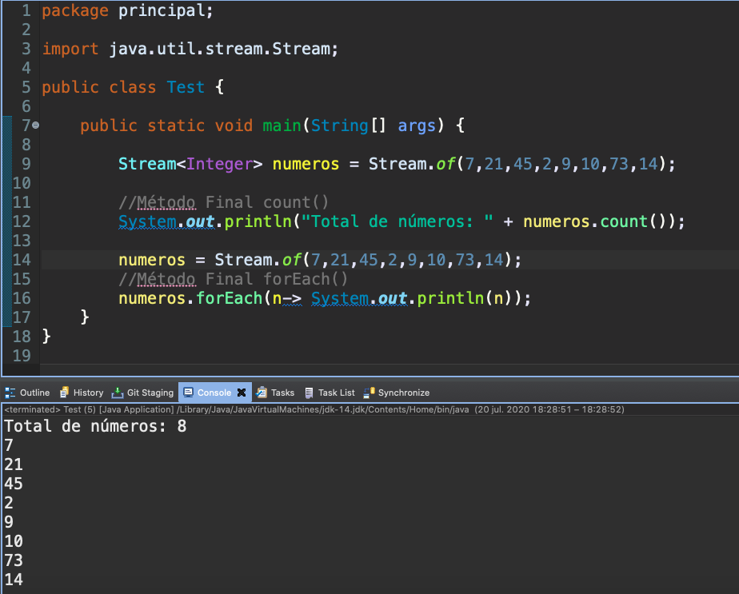

### Método Final `sum()`

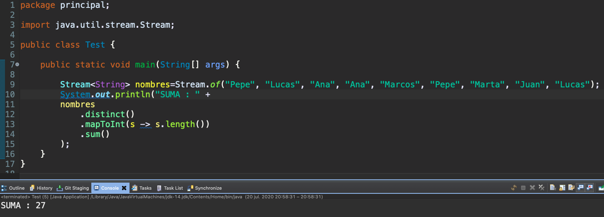

*`Test`*

```java
package principal;

import java.util.stream.Stream;

public class Test {

   public static void main(String[] args) {
		
      Stream<String> nombres=Stream.of("Pepe", "Lucas", "Ana", "Ana", "Marcos", "Pepe", "Marta", "Juan", "Lucas");
      System.out.println("SUMA : " +
      	nombres
	   .distinct()
	   .mapToInt(s -> s.length())
	   .sum()
      );
   }
}
```


## Operaciones Intermedias Streams


### Método Intermedio `distinct()`

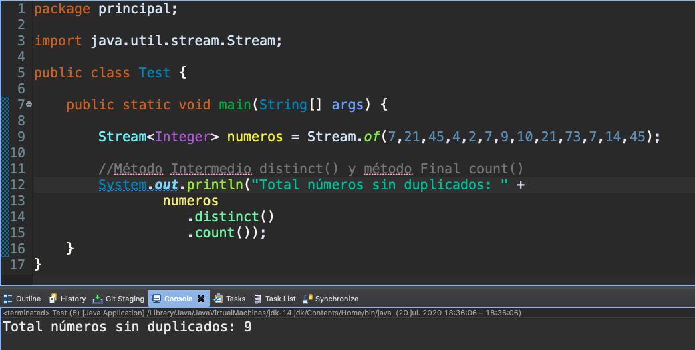

*`Test`*

```java
package principal;

import java.util.stream.Stream;

public class Test {

   public static void main(String[] args) {
		
      Stream<Integer> numeros = Stream.of(7,21,45,4,2,7,9,10,21,73,7,14,45);
		
      //Método Intermedio distinct() y método Final count()
      System.out.println("Total números sin duplicados: " +
		numeros
		   .distinct()
		   .count());
   }
}
```

### Método Intermedio `limit()`


*`Test`*

```java
package principal;

import java.util.stream.Stream;

public class Test {

   public static void main(String[] args) {
		
      Stream<Integer> numeros = Stream.of(7,21,45,4,2,7,9,10,21,73,7,14,45);
		
      //Método Intermedio limit() y método final .forEach()
      numeros
	  .limit(5)
	  .forEach(n-> System.out.println(n));
   }
}
```
### Combinando Varios Métodos

Podemos combianar usar varios métodos ya que un método intermedio nos devuelve otro Stream que puede ser usado por otros métodos ya sea intermedio o final como el siguiente ejemplo.

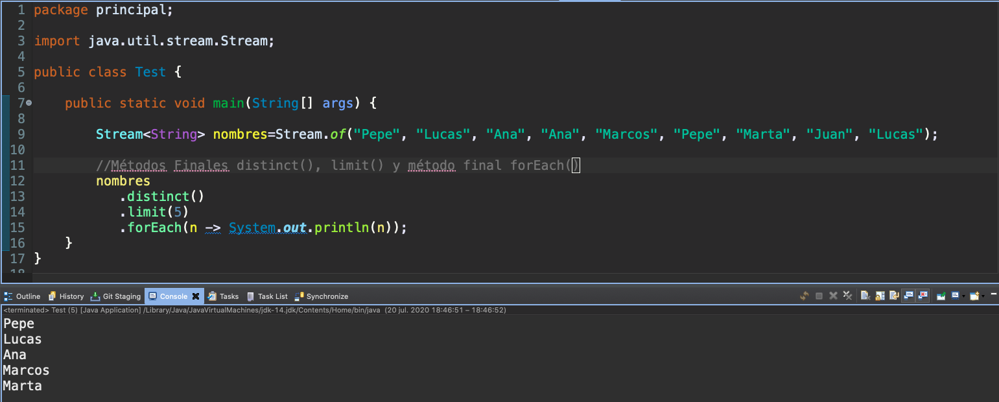

*`Test`*

```java
package principal;

import java.util.stream.Stream;

public class Test {

   public static void main(String[] args) {
		
      Stream<String> nombres=Stream.of("Pepe", "Lucas", "Ana", "Ana", "Marcos", "Pepe", "Marta", "Juan", "Lucas");
		
      //Métodos Finales distinct(), limit() y método final forEach()  
      nombres
	  .distinct()
	  .limit(5)
	  .forEach(n -> System.out.println(n));
   }
}
```


### Método Intermedio `filter()`

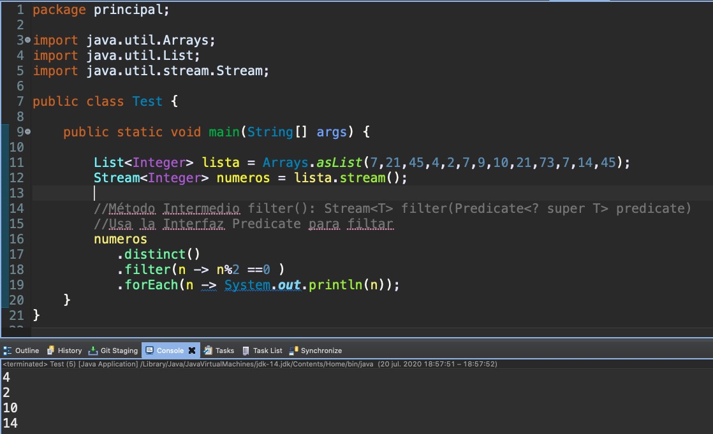

Con el método Intermedio `filter()` podemos filtrar el Stream usando un `Predicate` y nos retorna otro Stream filtrado.

*`Test`*

```java
package principal;

import java.util.stream.Stream;

public class Test {

   public static void main(String[] args) {
		
      List<Integer> lista = Arrays.asList(7,21,45,4,2,7,9,10,21,73,7,14,45);
      Stream<Integer> numeros = lista.stream();
		
      //Método Intermedio filter(): Stream<T>	filter(Predicate<? super T> predicate)
      //Usa la Interfaz Predicate para filtar
      numeros
	   .distinct()
	   .filter(n -> n%2 ==0 )
	   .forEach(n -> System.out.println(n));
   }
}
```

### Método Intermedio `sorted()`

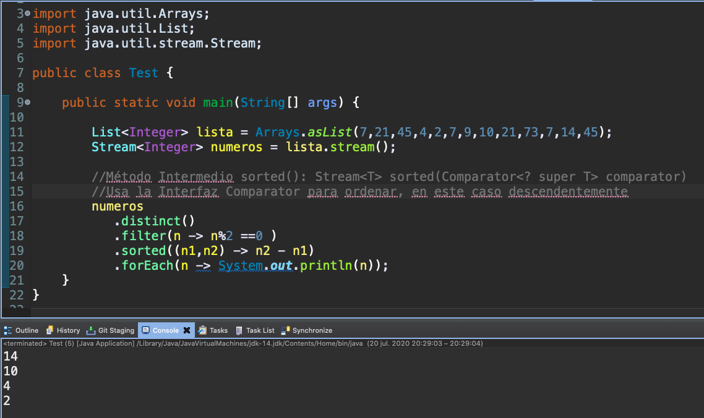

Con el método Intermedio `sorted()` podemos ordenar el Stream usando la Interface `Comparator<T>` y nos retorna otro Stream Ordenado.

[Interface Comparator<T>](https://docs.oracle.com/en/java/javase/14/docs/api/java.base/java/util/Comparator.html)


*`Test`*

```java
package principal;

import java.util.stream.Stream;

public class Test {

   public static void main(String[] args) {
		
      List<Integer> lista = Arrays.asList(7,21,45,4,2,7,9,10,21,73,7,14,45);
      Stream<Integer> numeros = lista.stream();
		
      //Método Intermedio sorted(): Stream<T>	sorted(Comparator<? super T> comparator)
      //Usa la Interfaz Comparator para ordenar, en este caso descendentemente
      numeros
	  .distinct()
	  .filter(n -> n%2 ==0 )
	  .sorted((n1,n2) -> n2 - n1)
	  .forEach(n -> System.out.println(n));
   }
}
```

### Método Intermedio `map()`

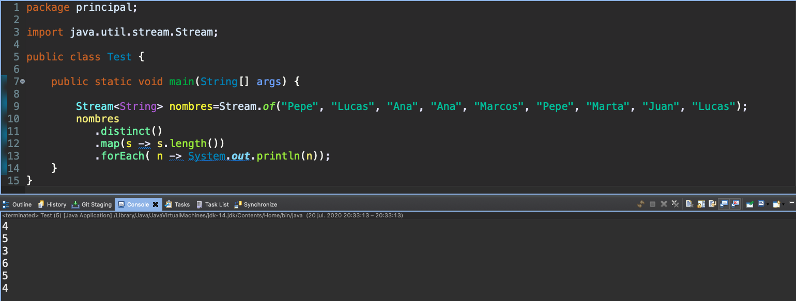

Con el método Intermedio `map()` podemos **transformar** el Stream `<R> Stream<R> map(Function<? super T, ? extends R> mapper)`  usando la Interface `Function` y nos retorna otro Stream Transformado.

[Interface Function<T, R>](https://docs.oracle.com/en/java/javase/14/docs/api/java.base/java/util/function/Function.html)

*`Test`*

```java
package principal;

import java.util.stream.Stream;

public class Test {

   public static void main(String[] args) {
		
      Stream<String> nombres=Stream.of("Pepe", "Lucas", "Ana", "Ana", "Marcos", "Pepe", "Marta", "Juan", "Lucas");
      nombres
	   .distinct()
	   .map(s -> s.length())
	   .forEach( n -> System.out.println(n));
   }
}
```


