# Streams

[Interface Stream<T>](https://docs.oracle.com/en/java/javase/14/docs/api/java.base/java/util/stream/Stream.html)
	


## Introduccion Streams


### Creación de un Stream


*`Test`*

```java
package principal;

import java.util.ArrayList;
import java.util.Arrays;
import java.util.stream.Stream;

public class Test {

   public static void main(String[] args) {
		
      //Stream a partir de una Colección
      ArrayList<Integer> nums = new ArrayList<>();
      nums.add(20);
      nums.add(100);
      nums.add(8);
      Stream<Integer> stI = nums.stream();
		
      //Stream a partir de un array
      String[] cads = {"a", "xy", "jk", "mv"};
      Stream<String> stS = Arrays.stream(cads);
		
      //Stream a partir de una serie discreta de datos:
      Stream<Double> stD = Stream.of(2.4, 7.4, 9.1);
   }
}
```


## Operaciones Finales Streams


### Método Final `count()`


*`Test`*

```java
package principal;

import java.util.stream.Stream;

public class Test {

   public static void main(String[] args) {
		
      Stream<Integer> numeros = Stream.of(7,21,45,2,9,10,73,14);
		
      //Método Final count()
      System.out.println("Total de números: " + numeros.count());
   }
}
```
### Método Final `forEach()`


*`Test`*

```java
package principal;

import java.util.stream.Stream;

public class Test {

   public static void main(String[] args) {
		
      Stream<Integer> numeros = Stream.of(7,21,45,2,9,10,73,14);
		
      //Método Final forEach()
      numeros.forEach(n-> System.out.println(n));
   }
}
```

### Una vez que se consume el Stream ya no lo podemos volver a usar

El Stream ya ha sido operada o cerrada.**


Si queremos volver a usar el Stream hay que volverlo a inicializar.


### Método Final `sum()`


*`Test`*

```java
package principal;

import java.util.stream.Stream;

public class Test {

   public static void main(String[] args) {
		
      Stream<String> nombres=Stream.of("Pepe", "Lucas", "Ana", "Ana", "Marcos", "Pepe", "Marta", "Juan", "Lucas");
      System.out.println("SUMA : " +
      	nombres
	   .distinct()
	   .mapToInt(s -> s.length())
	   .sum()
      );
   }
}
```


### Método Final `anyMatch`, `allMatch`, `noneMatch` Usan la Interface Predicate `(Predicate<? super T> predicate)`

Retornan un valor booleano :

`anyMatch`: Si algún elemento cumple la condión.
`allMatch`: Si todos los elementos cumple la condión.
`noneMatch`: Si ningún elemento cumple la condión.

Estos métodos son Corticircuitados, es decir al cumplirse la conción deja de seguir evaluando.

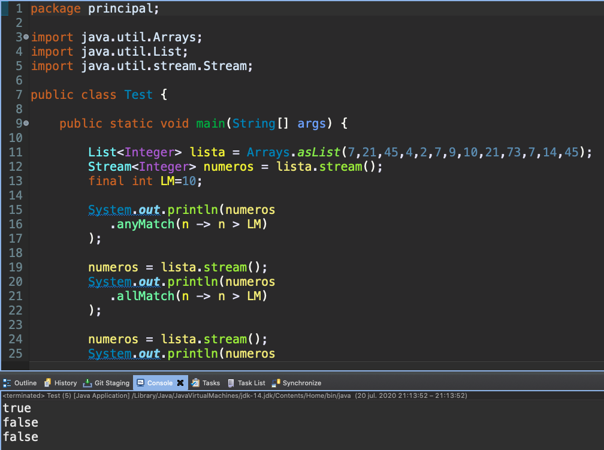

*`Test`*

```java
package principal;

import java.util.Arrays;
import java.util.List;
import java.util.stream.Stream;

public class Test {

   public static void main(String[] args) {
		
      List<Integer> lista = Arrays.asList(7,21,45,4,2,7,9,10,21,73,7,14,45);
      Stream<Integer> numeros = lista.stream();
      final int LM=10;
		
      System.out.println(numeros
	 .anyMatch(n -> n > LM)
      );
		
      numeros = lista.stream();
      System.out.println(numeros
	 .allMatch(n -> n > LM)
      );
		
      numeros = lista.stream();
      System.out.println(numeros
	 .noneMatch(n -> n > LM)
      );
   }
}
```

Demostración de la Corticircuitados, es decir al cumplirse la conción deja de seguir evaluando.

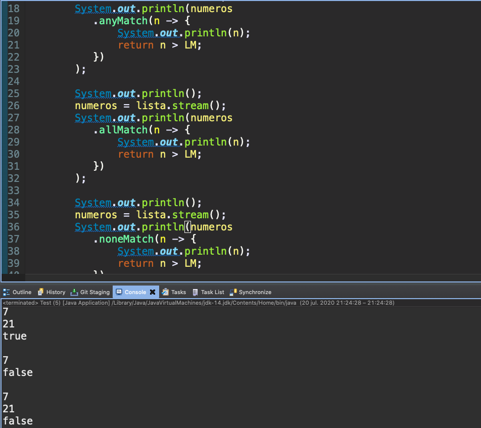

*`Test`*

```java
package principal;

import java.util.Arrays;
import java.util.List;
import java.util.stream.Stream;

public class Test {

	public static void main(String[] args) {
		
		List<Integer> lista = Arrays.asList(7,21,45,4,2,7,9,10,21,73,7,14,45);
		Stream<Integer> numeros = lista.stream();
		final int LM=10;
		
		//Como trabaja en Modo circuito solo imprime el 7 y 21 que cumple la condición
		System.out.println();
		numeros = lista.stream();
		System.out.println(numeros
		   .anyMatch(n -> {
			   System.out.println(n);
			   return n > LM;
		   })
		);
				
		System.out.println();
		numeros = lista.stream();
		System.out.println(numeros
		   .allMatch(n -> {
			   System.out.println(n);
			   return n > LM;
		   })
		);
				
		System.out.println();
		numeros = lista.stream();
		System.out.println(numeros
		   .noneMatch(n -> {
			   System.out.println(n);
			   return n > LM;
		   })
		);
	}
}
```

### Clase `Optional<T>`

[Class Optional<T>](https://docs.oracle.com/en/java/javase/14/docs/api/java.base/java/util/Optional.html)
	
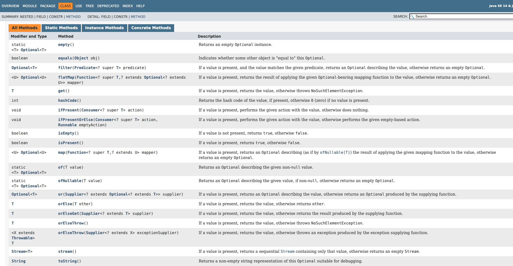	


La clase `Optional<T>` tiene varios métodos pero dos de los más usados son:

* `T	get()` 
* `T	orElse(T other)`


### Método Final `max` Usan la Interface Comparator y retorna un Optional `Optional<T>  max(Comparator<? super T> comparator)`

Esto métodos nos regresan un tipo del elemento del Stream.

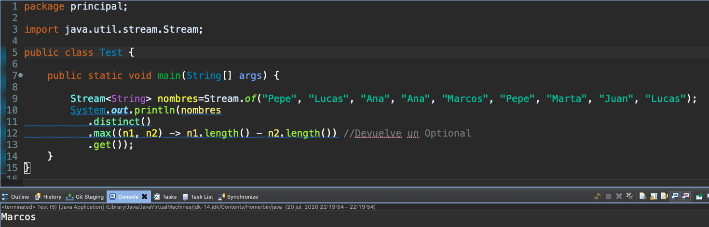

*`Test`*

```java
package principal;

import java.util.stream.Stream;

public class Test {

   public static void main(String[] args) {
		
      Stream<String> nombres=Stream.of("Pepe", "Lucas", "Ana", "Ana", "Marcos", "Pepe", "Marta", "Juan", "Lucas");
      System.out.println(nombres
	   .distinct()
	   .max((n1, n2) -> n1.length() - n2.length()) //Devuelve un Optional
	   .get());
      }
}
```


### Método Final `findFirst()` retorna un Optional `Optional<T>	findFirst()`

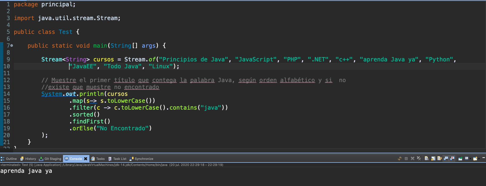

*`Test`*

```java
package principal;

import java.util.stream.Stream;

public class Test {

	public static void main(String[] args) {
		
		Stream<String> cursos = Stream.of("Principios de Java", "JavaScript", "PHP", ".NET", "c++", "aprenda Java ya",
		           "Python", "JavaEE", "Todo Java", "Linux");
		
		// Muestre el primer título que contega la palabra Java, según orden alfabético y si  no
		//existe que muestre no encontrado
		System.out.println(cursos
				.map(s-> s.toLowerCase())
				.filter(c -> c.toLowerCase().contains("java"))
				.sorted()
			    .findFirst()
			    .orElse("No Encontrado")
	    );
	}
}
```

### Método Final `collect()` retorna un :confuse: `<R, A> R	collect(Collector<? super T, A, R> collector)`

`collect()` como parametro impementa un `Collector` el cual no es una Interface Funcional, por lo cual no puedo usar expresiones lambada, ¿Pero entonces tengo que crear una implementación? Ya existe una clase que implementa esta interfaz, es la clase [Class Collectors](https://docs.oracle.com/en/java/javase/14/docs/api/java.base/java/util/stream/Collectors.html)  la cual tiene muchos métodos:

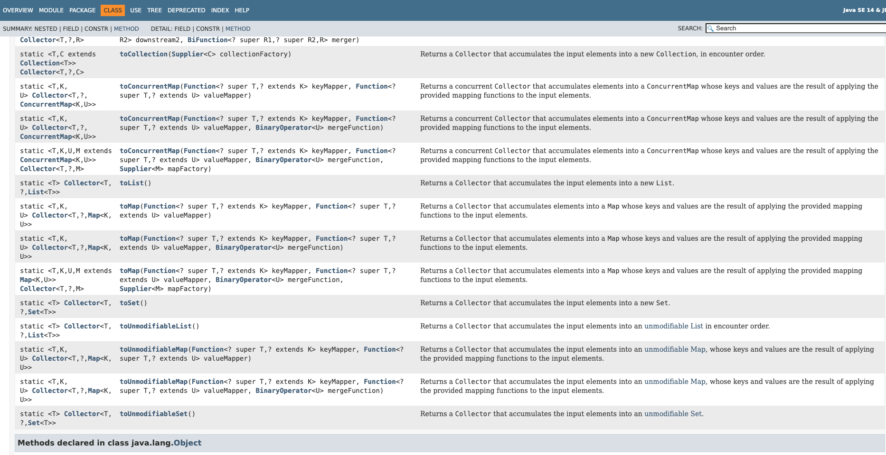

Pero algunos de los más importantes son:

* `toList()` Retorna una lista
* `toMap(...)` Retorna un Mapa
* `toSet()` Retorna un Set

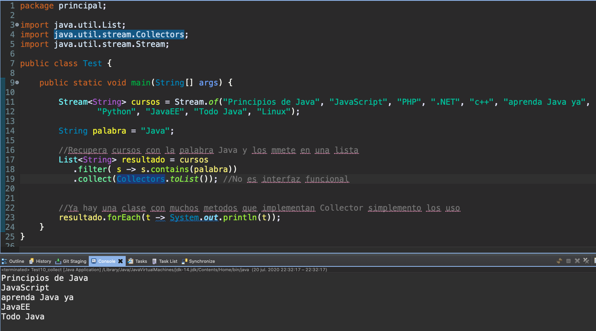

*`Test`*

```java
package principal;

import java.util.List;
import java.util.stream.Collectors;
import java.util.stream.Stream;

public class Test {

   public static void main(String[] args) {
		
      Stream<String> cursos = Stream.of("Principios de Java", "JavaScript", "PHP", ".NET", "c++", "aprenda Java ya", 
				"Python", "JavaEE", "Todo Java", "Linux");
		
      String palabra = "Java";
		
      //Recupera cursos con la palabra Java y los mmete en una lista
      List<String> resultado = cursos
	   .filter( s -> s.contains(palabra))
	   .collect(Collectors.toList()); //No es interfaz funcional
		
		
      //Ya hay una clase con muchos metodos que implementan Collector simplemento los uso
      resultado.forEach(t -> System.out.println(t));
   }
}
```


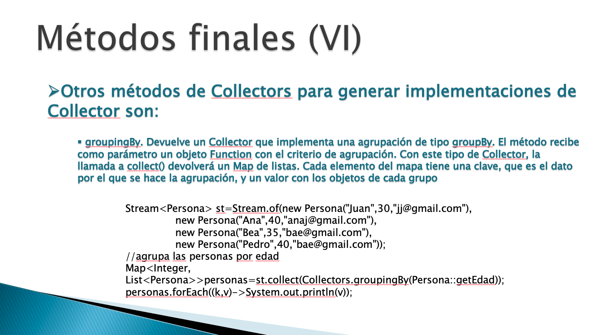

### Método Final `Collectors.groupingBy` retorna un `Map<String, List<Persona>>` y usa un Collector `static <T,K> Collector<T,?,Map<K,List<T>>>`

*`Persona`*

```java
package model;

public class Persona {
	
	private String nombre;
	private String email;
	private int edad;
	
	public Persona(String nombre, String email, int edad) {
		super();
		this.nombre = nombre;
		this.email = email;
		this.edad = edad;
	}
	
	public String getNombre() {
		return nombre;
	}
	public void setNombre(String nombre) {
		this.nombre = nombre;
	}
	public String getEmail() {
		return email;
	}
	public void setEmail(String email) {
		this.email = email;
	}
	public int getEdad() {
		return edad;
	}
	public void setEdad(int edad) {
		this.edad = edad;
	}
}
```

*`PersonasService`*

```java
package service;

import java.util.ArrayList;
import java.util.Comparator;
import java.util.List;
import java.util.Map;
import java.util.Set;
import java.util.stream.Collectors;

import model.Persona;

public class PersonasService {
	
	List<Persona> personas = new ArrayList<>();
	
	public PersonasService() {
		personas.add(new Persona("Alex","al@gg.com",20));				
		personas.add(new Persona("Juan","alfd@gg.com",29));
		personas.add(new Persona("Elena","al@gg.es",17));
		personas.add(new Persona("Marta","alaaoi@gg.com",34));
		personas.add(new Persona("Lucas","alert@gg.es",44));
		personas.add(new Persona("Alicia","sdfl@gg.com",35));
	}
	
	//Retornar un Map groupingBy
	public Map<String, List<Persona>> personasAgrupadasPorDominio(){
		return personas.stream()
				 .collect(Collectors.groupingBy(p -> p.getEmail().split("[.]")[1]));
		
	}	
}
```

*`PersonasService`*

```java
package principal;

import service.PersonasService;

public class TestFront {

	public static void main(String[] args) {
		PersonasService service = new PersonasService();
		
		System.out.println("Lista de Personas");
		service.obtenerPersonas().forEach(p-> System.out.println(p.getNombre() + " - " + p.getEmail() + " - " + p.getEmail()));
		
		System.out.println("\nLista de Personas Agrupadas por Doninio");
		
		service.personasAgrupadasPorDominio()
		   .forEach((k, V) -> {
			   System.out.println("\nDominio '" + k +  "' : ");
			   V.forEach(p-> System.out.println(p.getNombre() + " - " + p.getEmail() + " - " + p.getEmail()));
			   
		   });
	}
}
```


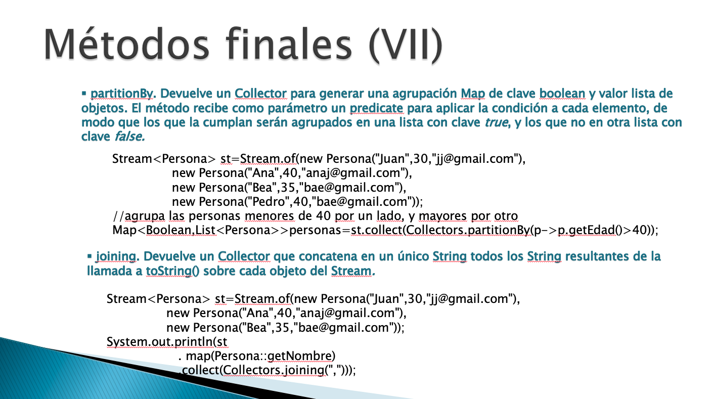

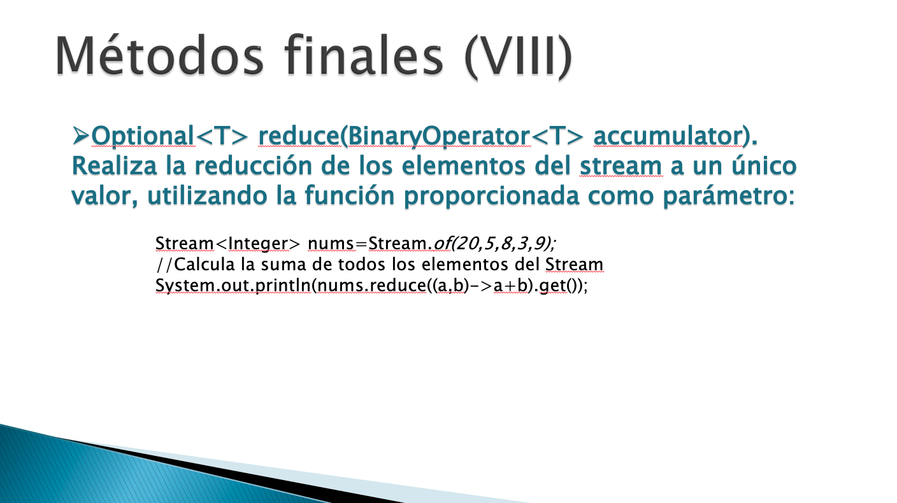

### Método Final `reduce()` retorna un Optional y usa un BinaryOperator `Optional<T>	reduce (BinaryOperator<T> accumulator)`

*`Test*

```java
package principal;

import java.util.stream.Stream;

public class Test {

   public static void main(String[] args) {
      Stream<Integer> numeros = Stream.of(1,2,3,4,5);
		
      System.out.println(
	numeros
	  .distinct()
	  .reduce((n1, n2) -> n1*n2)
	  .get()
	);
   }
}
```

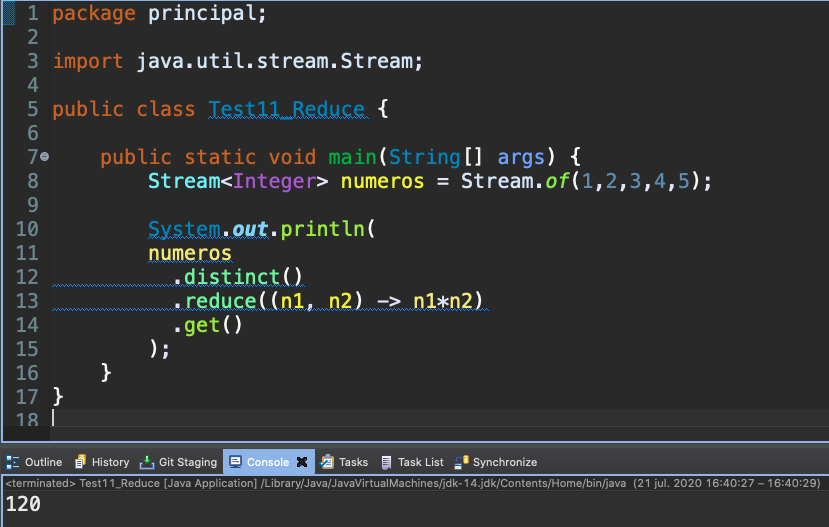

## Operaciones Intermedias Streams


### Método Intermedio `distinct()`


*`Test`*

```java
package principal;

import java.util.stream.Stream;

public class Test {

   public static void main(String[] args) {
		
      Stream<Integer> numeros = Stream.of(7,21,45,4,2,7,9,10,21,73,7,14,45);
		
      //Método Intermedio distinct() y método Final count()
      System.out.println("Total números sin duplicados: " +
		numeros
		   .distinct()
		   .count());
   }
}
```

### Método Intermedio `limit()`


*`Test`*

```java
package principal;

import java.util.stream.Stream;

public class Test {

   public static void main(String[] args) {
		
      Stream<Integer> numeros = Stream.of(7,21,45,4,2,7,9,10,21,73,7,14,45);
		
      //Método Intermedio limit() y método final .forEach()
      numeros
	  .limit(5)
	  .forEach(n-> System.out.println(n));
   }
}
```
### Combinando Varios Métodos

Podemos combianar usar varios métodos ya que un método intermedio nos devuelve otro Stream que puede ser usado por otros métodos ya sea intermedio o final como el siguiente ejemplo.


*`Test`*

```java
package principal;

import java.util.stream.Stream;

public class Test {

   public static void main(String[] args) {
		
      Stream<String> nombres=Stream.of("Pepe", "Lucas", "Ana", "Ana", "Marcos", "Pepe", "Marta", "Juan", "Lucas");
		
      //Métodos Finales distinct(), limit() y método final forEach()  
      nombres
	  .distinct()
	  .limit(5)
	  .forEach(n -> System.out.println(n));
   }
}
```


### Método Intermedio `filter()`


Con el método Intermedio `filter()` podemos filtrar el Stream usando un `Predicate` y nos retorna otro Stream filtrado.

*`Test`*

```java
package principal;

import java.util.stream.Stream;

public class Test {

   public static void main(String[] args) {
		
      List<Integer> lista = Arrays.asList(7,21,45,4,2,7,9,10,21,73,7,14,45);
      Stream<Integer> numeros = lista.stream();
		
      //Método Intermedio filter(): Stream<T>	filter(Predicate<? super T> predicate)
      //Usa la Interfaz Predicate para filtar
      numeros
	   .distinct()
	   .filter(n -> n%2 ==0 )
	   .forEach(n -> System.out.println(n));
   }
}
```

### Método Intermedio `sorted()`


Con el método Intermedio `sorted()` podemos ordenar el Stream usando la Interface `Comparator<T>` y nos retorna otro Stream Ordenado.

[Interface Comparator<T>](https://docs.oracle.com/en/java/javase/14/docs/api/java.base/java/util/Comparator.html)


*`Test`*

```java
package principal;

import java.util.stream.Stream;

public class Test {

   public static void main(String[] args) {
		
      List<Integer> lista = Arrays.asList(7,21,45,4,2,7,9,10,21,73,7,14,45);
      Stream<Integer> numeros = lista.stream();
		
      //Método Intermedio sorted(): Stream<T>	sorted(Comparator<? super T> comparator)
      //Usa la Interfaz Comparator para ordenar, en este caso descendentemente
      numeros
	  .distinct()
	  .filter(n -> n%2 ==0 )
	  .sorted((n1,n2) -> n2 - n1)
	  .forEach(n -> System.out.println(n));
   }
}
```

### Método Intermedio `map()`


Con el método Intermedio `map()` podemos **transformar** el Stream `<R> Stream<R> map(Function<? super T, ? extends R> mapper)`  usando la Interface `Function` y nos retorna otro Stream Transformado.

[Interface Function<T, R>](https://docs.oracle.com/en/java/javase/14/docs/api/java.base/java/util/function/Function.html)

*`Test`*

```java
package principal;

import java.util.stream.Stream;

public class Test {

   public static void main(String[] args) {
		
      Stream<String> nombres=Stream.of("Pepe", "Lucas", "Ana", "Ana", "Marcos", "Pepe", "Marta", "Juan", "Lucas");
      nombres
	   .distinct()
	   .map(s -> s.length())
	   .forEach( n -> System.out.println(n));
   }
}
```


### Método Final `mapToInt()` 

Retorna un Stream de Integers `IntStream mapToInt (ToIntFunction<? super T> mapper)`


*`Test`*

```java
package principal;

import java.util.stream.Stream;

public class Test {

   public static void main(String[] args) {
		
      Stream<String> nombres=Stream.of("Pepe", "Lucas", "Ana", "Ana", "Marcos", "Pepe", "Marta", "Juan", "Lucas");
      System.out.println("SUMA : " +
      	nombres
	   .distinct()
	   .mapToInt(s -> s.length())
	   .sum()
      );
   }
}
```

