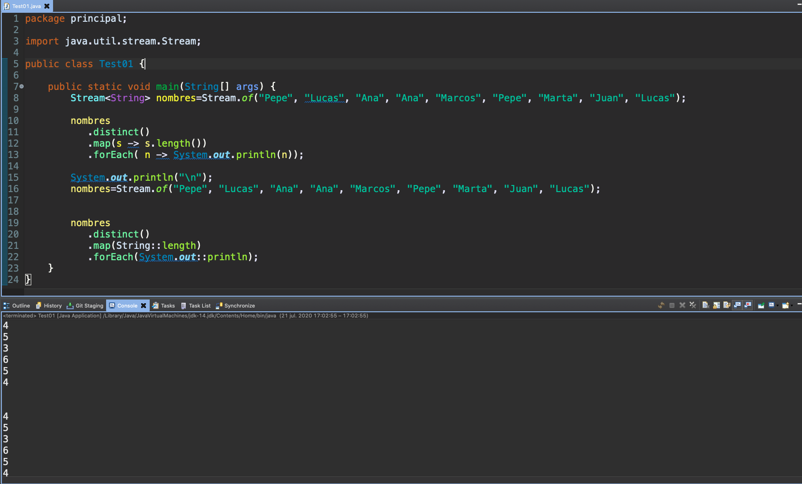
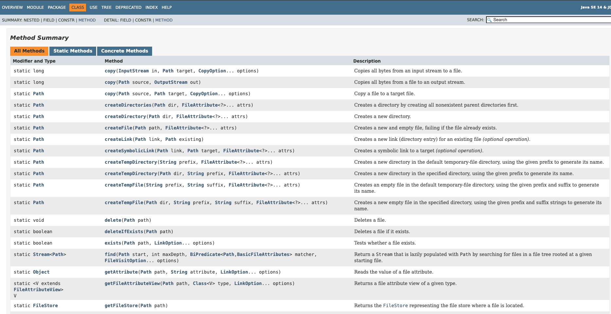
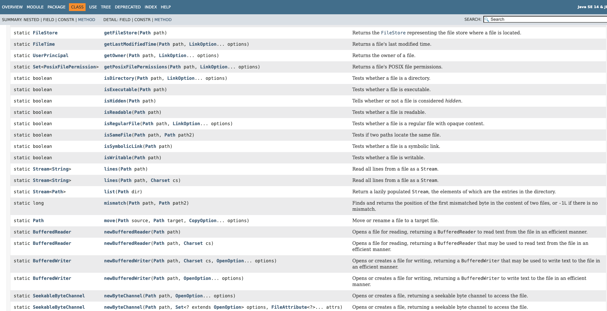
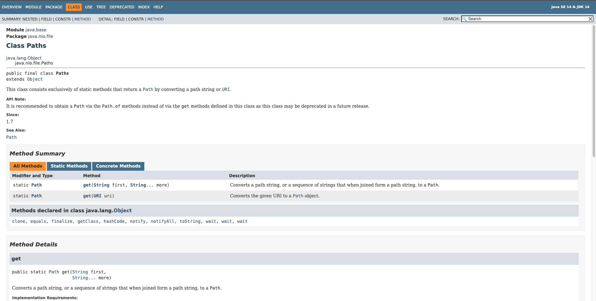

# 20200721 Martes

## Ejercicio Streams con Objetos Persona


*`Persona`*

```java
package model;

public class Persona {
	
	private String nombre;
	private String email;
	private int edad;
	
	public Persona(String nombre, String email, int edad) {
		super();
		this.nombre = nombre;
		this.email = email;
		this.edad = edad;
	}
	
	public String getNombre() {
		return nombre;
	}
	public void setNombre(String nombre) {
		this.nombre = nombre;
	}
	public String getEmail() {
		return email;
	}
	public void setEmail(String email) {
		this.email = email;
	}
	public int getEdad() {
		return edad;
	}
	public void setEdad(int edad) {
		this.edad = edad;
	}
}
```

*`PersonasService`*

```java
package service;

import java.util.ArrayList;
import java.util.Comparator;
import java.util.List;
import java.util.Map;
import java.util.Set;
import java.util.stream.Collectors;

import model.Persona;

public class PersonasService {
	
	List<Persona> personas = new ArrayList<>();
	
	public PersonasService() {
		personas.add(new Persona("Alex","al@gg.com",20));				
		personas.add(new Persona("Juan","alfd@gg.com",29));
		personas.add(new Persona("Elena","al@gg.es",17));
		personas.add(new Persona("Marta","alaaoi@gg.com",34));
		personas.add(new Persona("Lucas","alert@gg.es",44));
		personas.add(new Persona("Alicia","sdfl@gg.com",35));
	}
	
	//Retorna todas las Personas
	public List<Persona> obtenerPersonas() {
		return personas;
	}
	
	//Retorna Persona más joven
	public Persona obtenerMasJoven() {
		return personas.stream()
		         .min((p1, p2) -> p1.getEdad() - p2.getEdad())
		         .orElse(null);
	}
	
	//Retorna el  número de personas cuya edad es superior a la media
	public int superiorMedia() {
		double media = personas.stream()
				   .mapToDouble(p -> p.getEdad())
				   .average()
				   .orElse(0);
		
		return (int)personas
				.stream()
				.filter(p -> p.getEdad() > media)
				.count();
	}
	
	//Retorna List de Personas ordenadas por Edad
	public List<Persona> ordenadasPorEdad(){
		return personas.stream()
		         .sorted((p1, p2) -> p1.getEdad() - p2.getEdad())
		         .collect(Collectors.toList());
	}
	
	//Retorna List de Personas ordenadas por Nombre
	public List<Persona> ordenadasPorNombre(){
		return personas.stream()
		         .sorted((p1, p2) -> p1.getNombre().compareTo(p2.getNombre()))
		         .collect(Collectors.toList());
	}
	
	//Retorna List de Personas ordenadas por Nombre y Edad
        public List<Persona> ordenadasPorNombreYEdad(){
		Comparator<Persona> comp = (p1,p2) -> p1.getNombre().compareTo(p2.getNombre());
		return personas.stream()
		         .sorted(comp
				     .thenComparing((a1,a2)-> a1.getEdad() - a2.getEdad()))
		         .collect(Collectors.toList());
	}
	
    //Retorna List de Strings con los nombres de las personas
	public List<String> nombres(){
		return personas.stream()
				 .map(p -> p.getNombre())
				 .collect(Collectors.toList());
		
	}
	
	//Retorna List de Personas que tengan un dominio especificado
	public List<Persona> personasDominio(String dominio){
		return personas.stream()
				 .filter(p -> p.getEmail().endsWith(dominio))
				 .collect(Collectors.toList());
	}
	
	//Retornar un Set
	public Set<Persona> personasEdadSuperiorValor(int edad){
		return personas.stream()
				 .filter(p -> p.getEdad() > edad)
				 .collect(Collectors.toSet());
	}
	
	//Retornar un Map
	public Map<String, Persona> personasOrdenadasClaveEmail(){
		return personas.stream()
				 .collect(Collectors.toMap(p -> p.getEmail(), p->p));
	}
	
	//Retornar un Map groupingBy
	public Map<String, List<Persona>> personasAgrupadasPorDominio(){
		return personas.stream()
				 .collect(Collectors.groupingBy(p -> p.getEmail().split("[.]")[1]));
		
	}	
}
```

*`PersonasService`*

```java
package principal;

import service.PersonasService;

public class TestFront {

	public static void main(String[] args) {
		PersonasService service = new PersonasService();
		
		System.out.println("Lista de Personas");
		service.obtenerPersonas().forEach(p-> System.out.println(p.getNombre() + " - " + p.getEmail() + " - " + p.getEmail()));
		
		System.out.println("\nLista de Personas Agrupadas por Doninio");
		
		service.personasAgrupadasPorDominio()
		   .forEach((k, V) -> {
			   System.out.println("\nDominio '" + k +  "' : ");
			   V.forEach(p-> System.out.println(p.getNombre() + " - " + p.getEmail() + " - " + p.getEmail()));
			   
		   });
	}
}
```


### Observaciones cuando se trabaja con Objetos (Persona)

* `.distinct()`: Si se usa este método en la clase Objeto (Persona) se deben implementar los métodos `equals()` y `hashCode()` para establecer los criterios de igualdad o desigualdad que se deben tener en cuenta al usar el método `.distinct()`.
* `.sort()`: Cuando se trabaja con Clases Envoltorio el orden se hace bao el orden natural o se puede establecer otro orden según el `Comparator` que se implemente con la expresión Lambda dentro de `.sort()`, con los objetos hay siempre que indicar el  `Comparator` que servira de criterio ***o se puede implementar esta Intercace `Comparator` dentro de la clase***.

## Referencia a Métodos `::`

La *Referencia a Métodos* sustituye a las Expresiones Lambda, es decir es una alternativa a las expresiones Lambda.

Las expresiones Lambda muchas veces solo llama a un método, en estos casos estas expresiones Lambda pueden ser sustituidas por *Referencias a Métodos*.

**Una Referencia a Método no es una llamada a un método**, por lo cual no podemos pasar parámetros.

### Ejemplos de Referencia a Métodos

*`Test01`*
```java
package principal;

import java.util.stream.Stream;

public class Test01 {

   public static void main(String[] args) {
      Stream<String> nombres=Stream.of("Pepe", "Lucas", "Ana", "Ana", "Marcos", "Pepe", "Marta", "Juan", "Lucas");
		
      nombres
	   .distinct()
	   .map(s -> s.length())
	   .forEach( n -> System.out.println(n));
		
      System.out.println("\n");
      nombres=Stream.of("Pepe", "Lucas", "Ana", "Ana", "Marcos", "Pepe", "Marta", "Juan", "Lucas");
		
      nombres
	   .distinct()
	   .map(String::length)
	   .forEach(System.out::println);
	   
    }
}
```



# Java NIO


[Interface Path](https://docs.oracle.com/en/java/javase/14/docs/api/java.base/java/nio/file/Path.html)


[Class Files](https://docs.oracle.com/en/java/javase/14/docs/api/java.base/java/nio/file/Files.html)






[Class Paths](https://docs.oracle.com/en/java/javase/14/docs/api/java.base/java/nio/file/Paths.html)




### PedidosService usando NIO y Streams

*`PedidosService`*

```java
package service;

import java.io.IOException;
import java.nio.charset.Charset;
import java.nio.file.Files;
import java.nio.file.Path;
import java.nio.file.Paths;
import java.nio.file.StandardOpenOption;
import java.util.Collections;
import java.util.List;
import java.util.stream.Collectors;
import java.util.stream.Stream;

import model.Pedido;
import util.Utilidades;

public class PedidosService {
	
	private final String RUTA="pedidos.txt";
	private final String SEPARADOR="-";
	private Path path;
	
	public PedidosService() {
		path=Paths.get(RUTA);
		if(!Files.exists(path)) {
			try {
				Files.createFile(path);
			} catch (IOException e) {
				e.printStackTrace();
			}
		}
	}
	
	public boolean agregarPedido(Pedido pedido) {
		if(!existePedido(pedido)) {
			try{
				Files.writeString(path, 
						          Utilidades.construirCadena(pedido, SEPARADOR), 
						          Charset.forName("UTF-8"),
                                  StandardOpenOption.APPEND);
				return true;
			} catch(IOException e) {
				e.printStackTrace();
			}
		}
		return false;
	}
	
	private boolean existePedido(Pedido pedido) {
		try {
			return Files.lines(path)
				.anyMatch(p->Utilidades.construirPedido(p, SEPARADOR).equals(pedido));
		}
		catch(IOException ex) {
			ex.printStackTrace();
			return false;
		}
	}
	
	public Pedido procesarPedido() {
		List<Pedido> pedidos=pedidosPendientes();
		Pedido pedido=null ;
		if(pedidos.size()>0) {
			pedido=pedidos.remove(0);		
			volcarPedidos(pedidos);
		}
		return pedido;
	}
	
	//reconstruye el fichero con la nueva lista de pedidos
	private void volcarPedidos(List<Pedido> pedidos) {
		try {
			Files.write(
					path, 
					pedidos
						.stream()
						.map(p -> Utilidades.construirCadena(p, SEPARADOR))
						.collect(Collectors.toList()), 
					Charset.forName("UTF-8"),		
					StandardOpenOption.CREATE);
		} 
		catch(IOException e) {
			e.printStackTrace();
		}
	}

	public Pedido priorizarPedido(int numeroPedido) {
		Pedido pedido,aux;
		pedido=obtenerPedido(numeroPedido);
		//obtenemos la lista de peidos pedientes,
		//para operar en memoria
		List<Pedido> pedidos=pedidosPendientes();
		if(pedido!=null) {
			int pos=pedidos.indexOf(pedido);
			//se intercambia con el anterior, si no es el primero
			if(pos>0) {
				Collections.swap(pedidos, pos - 1, pos);
			}
		}
		volcarPedidos(pedidos);
		return pedido;
	}
	
	private Pedido obtenerPedido(int numeroPedido) {		
		try {
			return Files.lines(path)
					.map(s->Utilidades.construirPedido(s, SEPARADOR))
					.filter(p->p.getNumeroPedido()==numeroPedido)
					.findFirst()
					.orElse(null);
		}
		catch(IOException ex) {
			ex.printStackTrace();
			return null;
		}
	}
	
	public double facturacionPendiente() {
		try {
			return Files.lines(path)
					.mapToDouble(s->Utilidades.construirPedido(s, SEPARADOR).getPrecio())
					.sum();
		}
		catch(IOException ex) {
			ex.printStackTrace();
			return 0;
		}
		
	}
	
	//elimina todos los pedidos, cuyo nombre de producto
	//contenga ese texto
	public void eliminarPedidos(String producto) {
		List<Pedido> pedidos=pedidosPendientes();
		pedidos.removeIf(p->p.getProducto().contains(producto));
		volcarPedidos(pedidos);		
	}
	
	public List<Pedido> pedidosPendientes() {
		try(Stream<String> st=Files.lines(path)) {
			return st
					.map(s->Utilidades.construirPedido(s, SEPARADOR))
					.collect(Collectors.toList());
		}
		catch(IOException ex) {
			ex.printStackTrace();
			return null;
		}
	}
}
```
