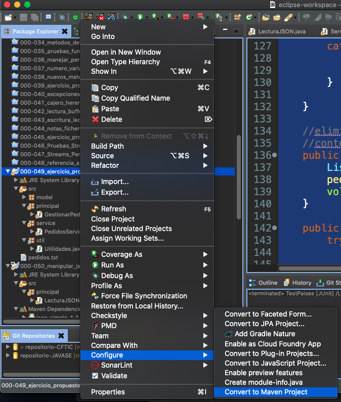
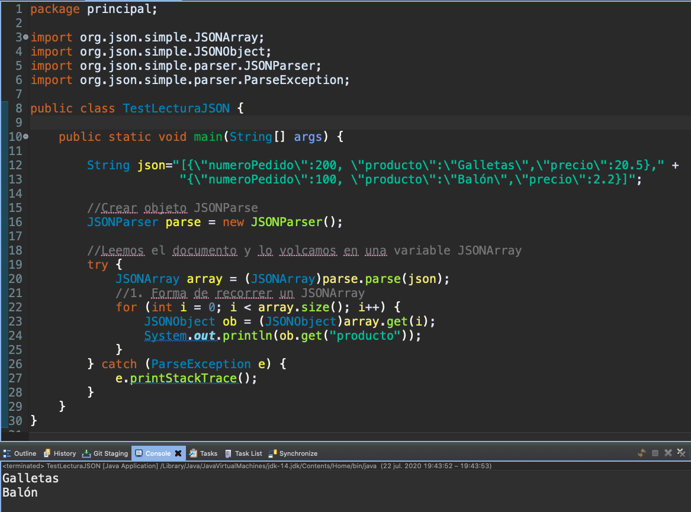
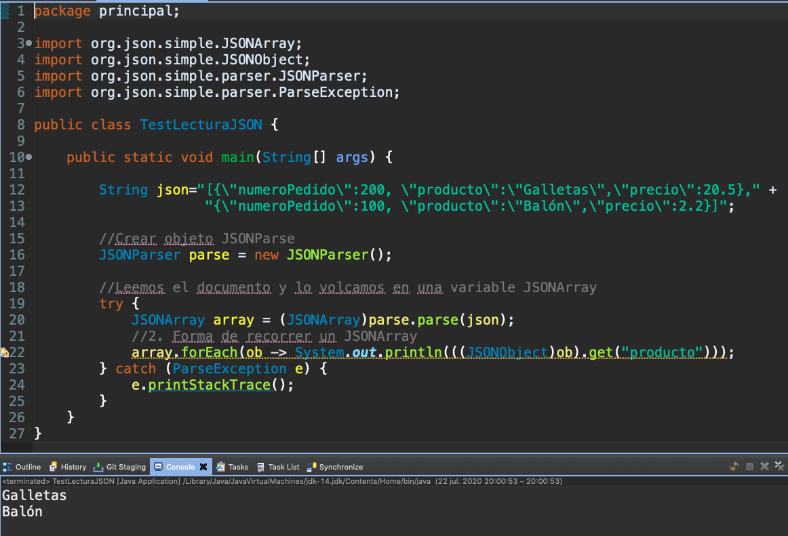
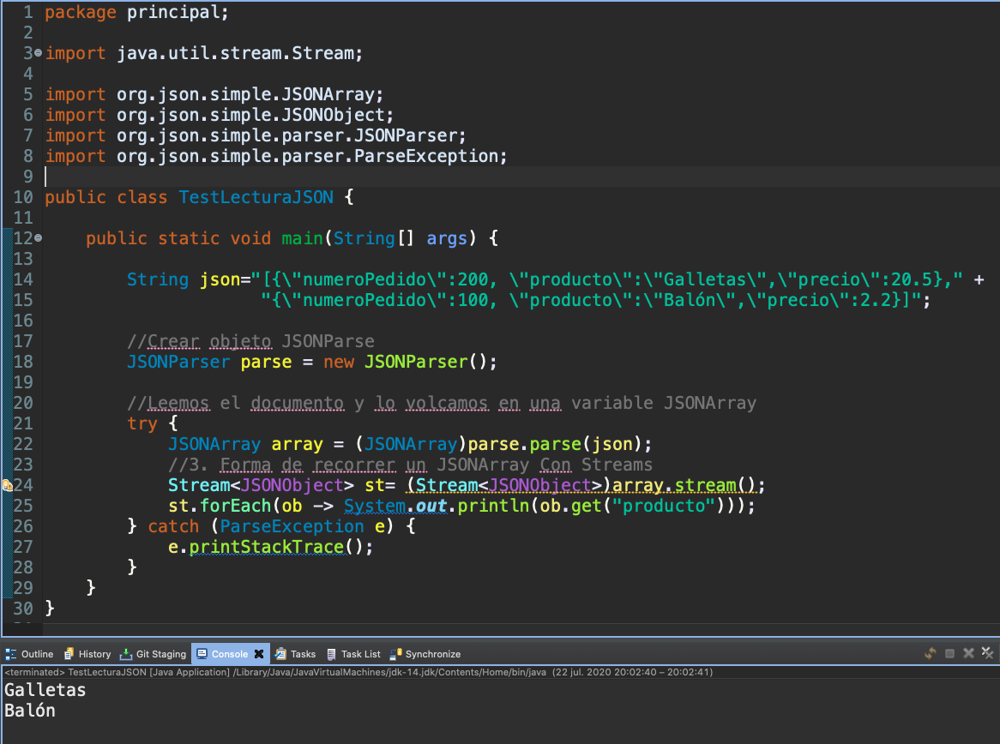
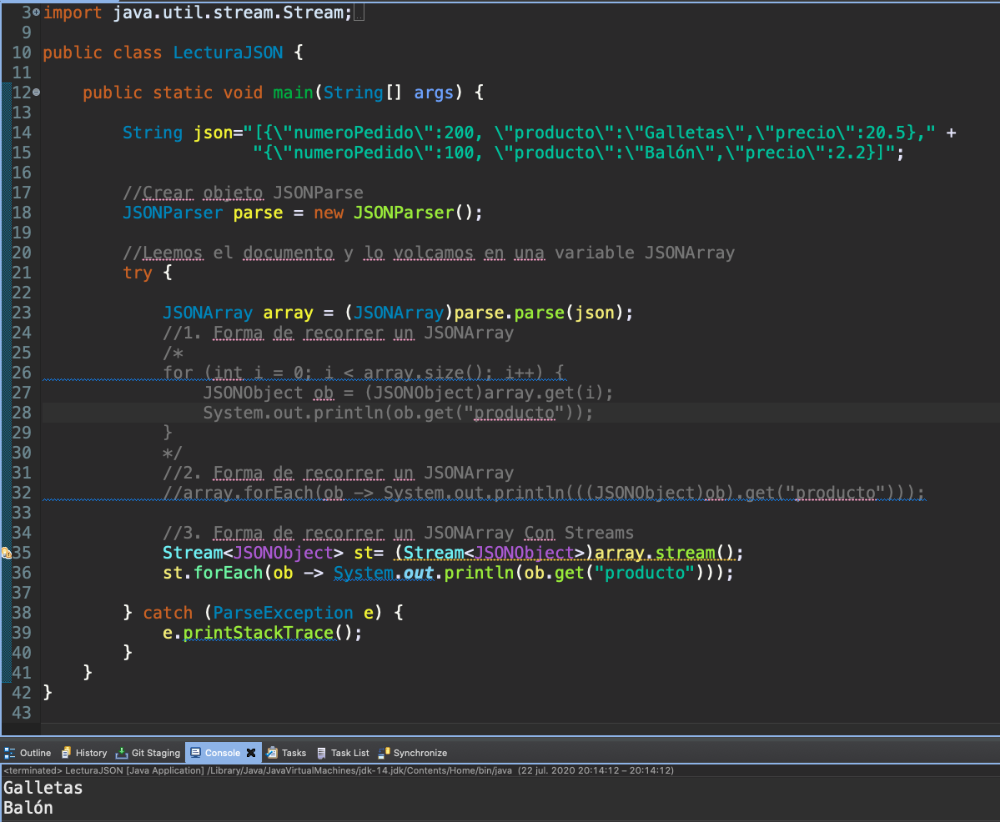

# 20200722 Miercoles

## MAVEN

[mvnrepository](https://mvnrepository.com/)

### Mavenizar un Proyecto

En Eclipse podemos *Mavenizar un Proyecto* poniendonos en la raíz del proyecto, botón derecho *Configuration-Convert to Maven Project*



## JSON

[JSON Simple](https://code.google.com/archive/p/json-simple/)

[Documentación No Oficial](https://javadoc.io/doc/com.googlecode.json-simple/json-simple/latest/index.html)

Dependencia:

```html
<!-- https://mvnrepository.com/artifact/com.googlecode.json-simple/json-simple -->
<dependency>
    <groupId>com.googlecode.json-simple</groupId>
    <artifactId>json-simple</artifactId>
    <version>1.1.1</version>
</dependency>
```

JSON Simple tiene tres clases principales:

* `JSONParse`: Parsear cadena en formato JSON a Objeto JSON
* `JSONArray`: Manipular Array
* `JSONObject`: Manipular Objeto

Limitación de JSON Simple

* Los valores enteros que se parsen, simpre se parsearan a `long` **NO a `int`**
* Los valores decimales que se parsen, simpre se parsearan a `double` **NO a `float`**

**Por lo que si se llega a hacer un parseo de este tipo tendremos un error de ejecución**. 

### :computer: `000-050_manipular_json`

*`TestLecturaJSON`*

```java
package principal;

import org.json.simple.JSONArray;
import org.json.simple.JSONObject;
import org.json.simple.parser.JSONParser;
import org.json.simple.parser.ParseException;

public class TestLecturaJSON {

   public static void main(String[] args) {
		
      String json="[{\"numeroPedido\":200, \"producto\":\"Galletas\",\"precio\":20.5}," + 
  	           "{\"numeroPedido\":100, \"producto\":\"Balón\",\"precio\":2.2}]";
		
      //Crear objeto JSONParse
      JSONParser parse = new JSONParser();
		
      //Leemos el documento y lo volcamos en una variable JSONArray
      try {
	 JSONArray array = (JSONArray)parse.parse(json);
	 //1. Forma de recorrer un JSONArray
	 for (int i = 0; i < array.size(); i++) {
	    JSONObject ob = (JSONObject)array.get(i);
	    System.out.println(ob.get("producto"));
	 }
      } catch (ParseException e) {
	 e.printStackTrace();
      }
   }
}
```



*`TestLecturaJSON`*

```java
package principal;

import org.json.simple.JSONArray;
import org.json.simple.JSONObject;
import org.json.simple.parser.JSONParser;
import org.json.simple.parser.ParseException;

public class TestLecturaJSON {

   public static void main(String[] args) {
		
      String json="[{\"numeroPedido\":200, \"producto\":\"Galletas\",\"precio\":20.5}," + 
	           "{\"numeroPedido\":100, \"producto\":\"Balón\",\"precio\":2.2}]";
		
      //Crear objeto JSONParse
      JSONParser parse = new JSONParser();
		
      //Leemos el documento y lo volcamos en una variable JSONArray
      try {
	 JSONArray array = (JSONArray)parse.parse(json);
	 //2. Forma de recorrer un JSONArray
	 array.forEach(ob -> System.out.println(((JSONObject)ob).get("producto")));
      } catch (ParseException e) {
	 e.printStackTrace();
      }
   }
}
```



*`TestLecturaJSON`*

```java
package principal;

import java.util.stream.Stream;

import org.json.simple.JSONArray;
import org.json.simple.JSONObject;
import org.json.simple.parser.JSONParser;
import org.json.simple.parser.ParseException;

public class TestLecturaJSON {

   public static void main(String[] args) {
		
      String json="[{\"numeroPedido\":200, \"producto\":\"Galletas\",\"precio\":20.5}," + 
	           "{\"numeroPedido\":100, \"producto\":\"Balón\",\"precio\":2.2}]";
		
      //Crear objeto JSONParse
      JSONParser parse = new JSONParser();
		
      //Leemos el documento y lo volcamos en una variable JSONArray
      try {
	  JSONArray array = (JSONArray)parse.parse(json);
	  //3. Forma de recorrer un JSONArray Con Streams
	  Stream<JSONObject> st= (Stream<JSONObject>)array.stream();
	  st.forEach(ob -> System.out.println(ob.get("producto")));
      } catch (ParseException e) {
	  e.printStackTrace();
      }
   }
}
```



Código completo.

*`LecturaJSON`*

```java
package principal;

import java.util.stream.Stream;

import org.json.simple.JSONArray;
import org.json.simple.JSONObject;
import org.json.simple.parser.JSONParser;
import org.json.simple.parser.ParseException;

public class LecturaJSON {

   public static void main(String[] args) {
		
      String json="[{\"numeroPedido\":200, \"producto\":\"Galletas\",\"precio\":20.5}," + 
	           "{\"numeroPedido\":100, \"producto\":\"Balón\",\"precio\":2.2}]";
		
      //Crear objeto JSONParse
      JSONParser parse = new JSONParser();
		
      //Leemos el documento y lo volcamos en una variable JSONArray
      try {
	 JSONArray array = (JSONArray)parse.parse(json);
	 //1. Forma de recorrer un JSONArray
	 /*
	 for (int i = 0; i < array.size(); i++) {
	    JSONObject ob = (JSONObject)array.get(i);
	    System.out.println(ob.get("producto"));
	 }
	 */
	 
	 //2. Forma de recorrer un JSONArray
	 //array.forEach(ob -> System.out.println(((JSONObject)ob).get("producto")));
			
	 //3. Forma de recorrer un JSONArray Con Streams
	 Stream<JSONObject> st= (Stream<JSONObject>)array.stream();
	 st.forEach(ob -> System.out.println(ob.get("producto")));
		
      } catch (ParseException e) {
	 e.printStackTrace();
      }
   }
}
```



### :computer: `000-051_info_paises`

**Modelo**

*`Pais`*

```java
package model;

public class Pais {
	
   private String nombre;
   private String capital;
   private long habitantes;
   private String continente;
	
   public Pais(String nombre, String capital, long habitantes, String continente) {
      this.nombre = nombre;
      this.capital = capital;
      this.habitantes = habitantes;
      this.continente = continente;
   }

   public String getNombre() {
      return nombre;
   }

   public void setNombre(String nombre) {
      this.nombre = nombre;
   }

   public String getCapital() {
      return capital;
   }

   public void setCapital(String capital) {
      this.capital = capital;
   }

   public long getHabitantes() {
      return habitantes;
   }

   public void setHabitantes(long habitantes) {
      this.habitantes = habitantes;
   }

   public String getContinente() {
      return continente;
   }

   public void setContinente(String continente) {
      this.continente = continente;
   }
}
```

*`ServicePaises`*

```java
package service;

import java.util.List;
import java.util.Map;
import java.util.stream.Collectors;
import java.util.stream.Stream;

import org.json.simple.JSONArray;
import org.json.simple.JSONObject;
import org.json.simple.parser.JSONParser;
import org.json.simple.parser.ParseException;

import model.Pais;

public class ServicePaises {
	String json;
	
	public ServicePaises() {
		json="[{\"country\":\"USA\",\"population\":249903450,\"capital\":\"washington\",\"temperature\":21.5,\"foundation\":1750,\"continent\":\"America\"},";
		json+="{\"country\":\"Canada\",\"population\":145290345,\"capital\":\"Ottawa\",\"temperature\":14.3,\"foundation\":1870,\"continent\":\"America\"},";
		json+="{\"country\":\"Spain\",\"population\":47345901,\"capital\":\"Madrid\",\"temperature\":24.7,\"foundation\":1520,\"continent\":\"Europe\"},";
		json+="{\"country\":\"Mexico\",\"population\":95000360,\"capital\":\"Mexico\",\"temperature\":26.2,\"foundation\":1880,\"continent\":\"America\"},";
		json+="{\"country\":\"Norway\",\"population\":31034000,\"capital\":\"Oslo\",\"temperature\":10.9,\"foundation\":1901,\"continent\":\"Europe\"},";
		json+="{\"country\":\"Germany\",\"population\":95456920,\"capital\":\"Berlin\",\"temperature\":18.0,\"foundation\":1830,\"continent\":\"Europe\"},";
		json+="{\"country\":\"Japan\",\"population\":110478934,\"capital\":\"Tokio\",\"temperature\":21.6,\"foundation\":1857,\"continent\":\"Asia\"},";
		json+="{\"country\":\"Russia\",\"population\":215678924,\"capital\":\"Moscow\",\"temperature\":11.3,\"foundation\":1802,\"continent\":\"Asia\"},";
		json+="{\"country\":\"France\",\"population\":76256702,\"capital\":\"Paris\",\"temperature\":19.4,\"foundation\":1670,\"continent\":\"Europe\"},";
		json+="{\"country\":\"United Kingdom\",\"population\":65023789,\"capital\":\"London\",\"temperature\":17.4,\"foundation\":1650,\"continent\":\"Europe\"}]";
	}
	
	private Stream<JSONObject> getStream(){
		JSONParser parser=new JSONParser();		
		JSONArray array;
		try {
			array = (JSONArray)parser.parse(json);
			return (Stream<JSONObject>)array.stream();
		} catch (ParseException e) {				
			e.printStackTrace();
			return Stream.empty();
		}	
	}
	
	private Pais convertirAPais(JSONObject s) {
		return new Pais((String)s.get("country"),(String)s.get("capital"),(long)s.get("population"),(String)s.get("continent"));
	}
	
	public int paisesMasHabitantesValor(long habitantes) {
		return (int)getStream()
			.filter(s->(long)s.get("population")>habitantes)
			.count();
	}
	
	public double temperaturaMediaPaises() {
		return getStream()
				.collect(Collectors.averagingDouble(s->(double)s.get("temperature")));
		
		/*return getStream()
				.mapToDouble(s->(double)s.get("temperature"))
				.average()
				.getAsDouble();*/
				
	}
	
	public boolean algunPaisCondicion(long habitantesMax, long yearMenor) {
		return getStream()
				.anyMatch(s->((long)s.get("population")<habitantesMax) && ((long)s.get("fundation")<yearMenor));
				
	}
	
	public Pais paisMasPoblado() {
		/*return getStream()
				.sorted((s1,s2)->(int)((long)s2.get("population")-(long)s1.get("population")))
				.map(s->new Pais((String)s.get("country"),(String)s.get("capital"),(long)s.get("population")))
				.findFirst()
				.get();*/
		return getStream()
				.map(s->convertirAPais(s))
				.max((p1,p2)->(int)(p1.getHabitantes()-p2.getHabitantes()))
				.orElse(null);
	}
	
	public List<Pais> paisesFundacionAnterior(long year){
		return getStream()
				.filter(s->(long)s.get("foundation")<year)
				.map(s->convertirAPais(s))
				.collect(Collectors.toList());
		
	}
	
	public String continenteConMasPaises() {
		Map<String,List<Pais>> agrupacion=paisesPorContinente();
		return agrupacion.keySet().stream() //stream con las claves
			.max((k1,k2)->agrupacion.get(k1).size()-agrupacion.get(k2).size())
			.get();
	}
	
	public String continenteConMasPoblacion() {
		Map<String,List<Pais>> agrupacion=paisesPorContinente();
		return agrupacion.keySet().stream() //stream con las claves
			.max((k1,k2)->(int)(agrupacion.get(k1).stream().mapToLong(p->p.getHabitantes()).sum()-
							    agrupacion.get(k2).stream().mapToLong(p->p.getHabitantes()).sum()))
			.get();
	}
	
	public Map<String,List<Pais>> paisesPorContinente(){
		return getStream()
				.map(s->convertirAPais(s))
				.collect(Collectors.groupingBy(p->p.getContinente()));
	}
}
```
