# 20200723 Jueves

## Fechas Tradicionales Java

### clase `Date`

[Class Date](https://docs.oracle.com/en/java/javase/14/docs/api/java.base/java/util/Date.html)

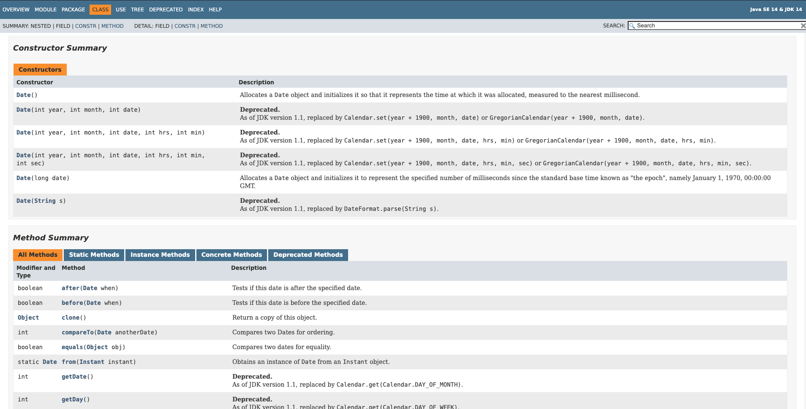

Existen muchos constructores y métodos **Deprecated** que es mejor no usar y la ayuda nos propone usar otras clases **replaced by...** .

Contructores.

* `Date()`
* `Date(long date)`

### :computer: `000-052_ejemplo_fechas`

Ejemplo de Contructores de Date.

*`Test`*

```java
package principal;

import java.util.Date;

public class Test {

	public static void main(String[] args) {
		
		Date fecha = new Date();
		System.out.println(fecha);
		System.out.println(fecha.getTime());
		
		System.out.println("\n");
		fecha = new Date(1595491446068L);
		System.out.println(fecha);

	}
}
```

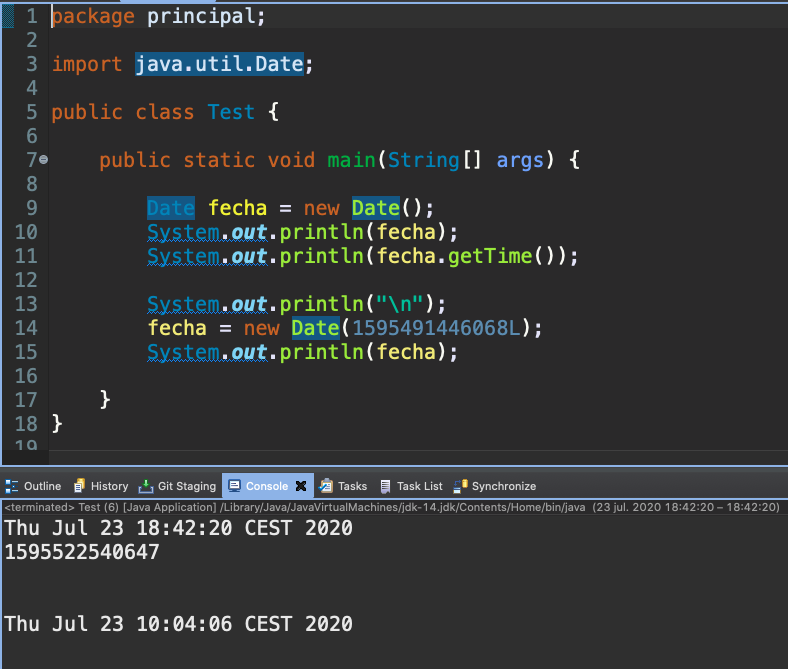

### Clase `Calendar`

[Class Calendar](https://docs.oracle.com/en/java/javase/14/docs/api/java.base/java/util/Calendar.html)

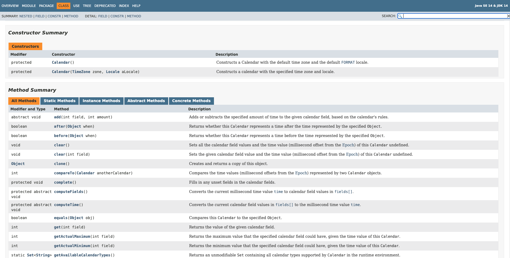

***La clase `Calendar` es una clase Abstracta, por lo que para crear una instancia u objeto de esta clase se usa el método `Calendar.getInstance()`***.

Ejemplo del método `get` de  `Calendar` y sus constantes.

*`Test`*

```java
package principal;

import java.util.Calendar;

public class Test {

	public static void main(String[] args) {

		// Calendar es una clase abstracta
		// Para instanciar un objeto de esa clase
		// Se usa un método de la clase para generarlo
		Calendar calendar = Calendar.getInstance();

		System.out.println("Año: " + calendar.get(Calendar.YEAR));
		System.out.println("Mes: " + (calendar.get(Calendar.MONTH) + 1));
		System.out.println("Día: " + calendar.get(Calendar.DAY_OF_MONTH));
		System.out.println("Hora: " + calendar.get(Calendar.HOUR_OF_DAY));
		System.out.println("Minutos: " + calendar.get(Calendar.MINUTE));
		System.out.println("Día de la Semana: " + calendar.get(Calendar.DAY_OF_WEEK));

	}
}
```

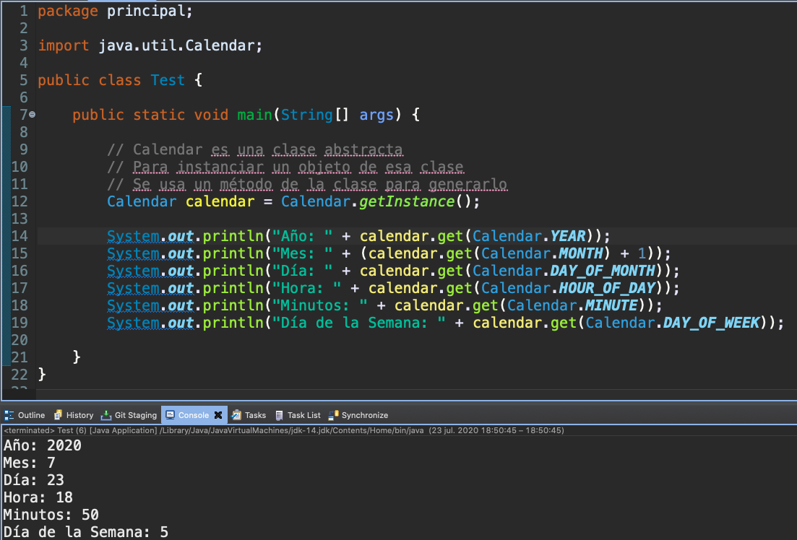

### Clase `DateFormat`

[Class DateFormat](https://docs.oracle.com/en/java/javase/14/docs/api/java.base/java/text/DateFormat.html)

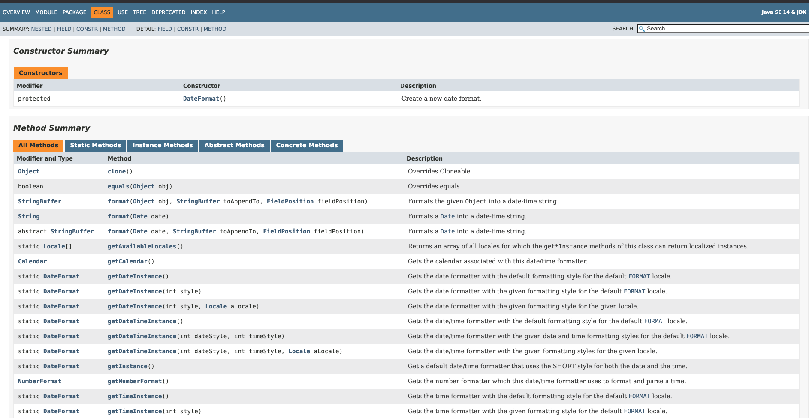

***La clase `DateFormat` es una clase Abstracta, por lo que para crear una instancia u objeto de esta clase se usa el método `DateFormat.getDateInstance()`***.

Ejemplo de `DateFormat` para dar formato a las fechas.

*`Test`*

```java
package principal;

import java.text.DateFormat;
import java.util.Date;
import java.util.Locale;

public class Test {

	public static void main(String[] args) {

		Date fecha = new Date();
		
        DateFormat df = DateFormat.getDateTimeInstance();
		System.out.println(df.format(fecha));
		
        df = DateFormat.getDateTimeInstance(DateFormat.FULL, DateFormat.LONG, new Locale("es"));
		System.out.println(df.format(fecha));
		
        df = DateFormat.getDateTimeInstance(DateFormat.SHORT, DateFormat.SHORT, new Locale("es"));
		System.out.println(df.format(fecha));
		
		df = DateFormat.getDateTimeInstance(DateFormat.FULL, DateFormat.LONG, new Locale("en"));
		System.out.println(df.format(fecha));
		
		df = DateFormat.getDateTimeInstance(DateFormat.SHORT, DateFormat.SHORT, new Locale("en"));
		System.out.println(df.format(fecha));

	}
}

```

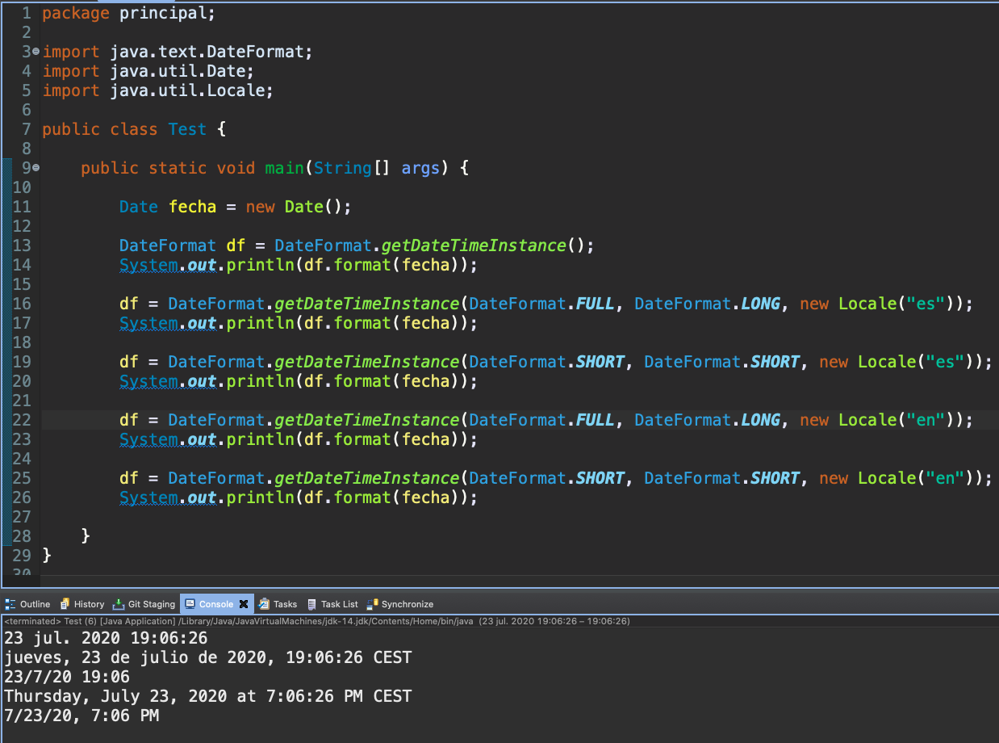

### Clase `SimpleDateFormat`

[Class SimpleDateFormat](https://docs.oracle.com/en/java/javase/14/docs/api/java.base/java/text/SimpleDateFormat.html)

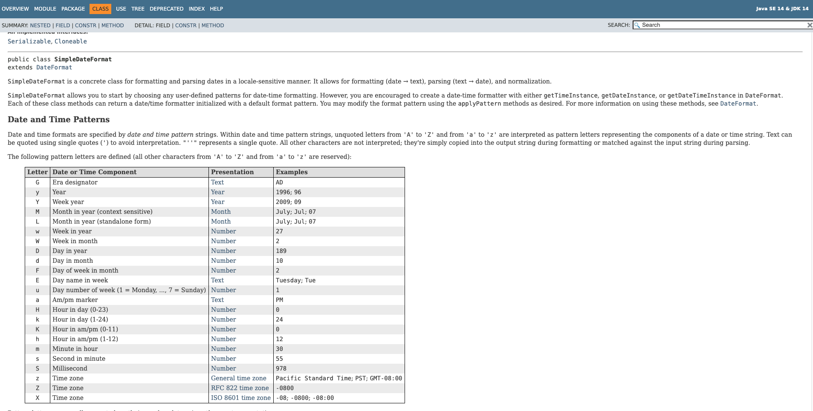

La clase `SimpleDateFormat` es una sub-clase de `DateFormat`, para personalizar formatos de fecha, en el constructor se le pasa el patrón personalizado.

Ejemplo de `SimpleDateFormat` para dar formato a las fechas.

*`Test`*

```java
package principal;

import java.text.SimpleDateFormat;
import java.util.Date;

public class Test {

	public static void main(String[] args) {

		Date fecha = new Date();
		
		SimpleDateFormat sdt = new SimpleDateFormat("yy-dd-MM ");
		System.out.println(sdt.format(fecha));
		
		sdt = new SimpleDateFormat("dd/MM/yyyy");
		System.out.println(sdt.format(fecha));
		
		sdt = new SimpleDateFormat("dd/MM/yyyy HH:MM");
		System.out.println(sdt.format(fecha));
		
		sdt = new SimpleDateFormat("EEE, MMM d, ''yy");
		System.out.println(sdt.format(fecha));

	}
}
```

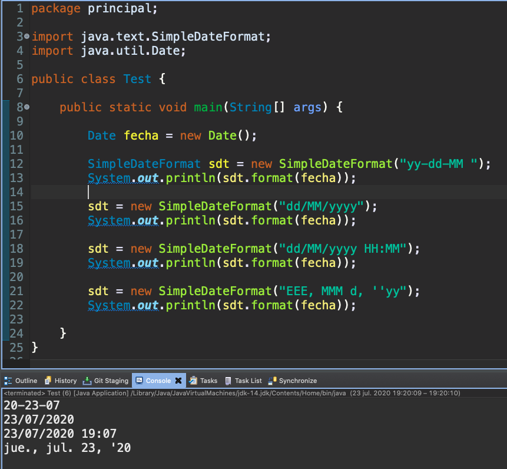

#### Método `parse` y Método `format`.

* `parse` Pasa de un `String` a `Date`
* `format` Pasa de `Date` a `String`

Ejemplo del Método `parse` y Método `format` 

*`Test`*

```java
package principal;

import java.text.ParseException;
import java.text.SimpleDateFormat;
import java.util.Date;

public class Test {

	public static void main(String[] args) {

		String miFecha = "25-12-2020";
		SimpleDateFormat sdf = new SimpleDateFormat("dd-MM-yyyy");
		
		//Parseador de fechas
		try {
			Date fecha = sdf.parse(miFecha);
			System.out.println("Fecha: " + fecha);
			System.out.println("Fecha: " + sdf.format(fecha));
		} catch (ParseException e) {
			e.printStackTrace();
		}		
	}
}
```

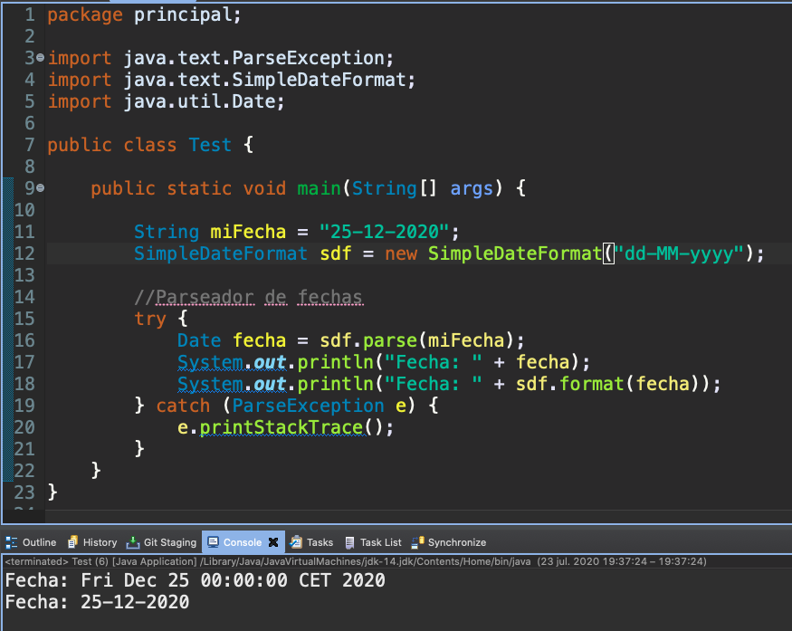

### :computer: `000-053_nueva_version_pedidos_con_fechas`

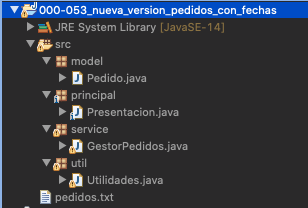

*`Pedido`*

```java
package model;

import java.util.Date;

public class Pedido {
	
	private String producto;
	private int unidades;
	private double precioUnitario;
	private String seccion;
	private Date fecha;
	
	public Pedido(String producto, int unidades, double precioUnitario, String seccion,Date fecha) {
		super();
		this.producto = producto;
		this.unidades = unidades;
		this.precioUnitario = precioUnitario;
		this.seccion = seccion;
		this.fecha=fecha;
	}
	
	public String getProducto() {
		return producto;
	}
	public void setProducto(String producto) {
		this.producto = producto;
	}
	public int getUnidades() {
		return unidades;
	}
	public void setUnidades(int unidades) {
		this.unidades = unidades;
	}
	public double getPrecioUnitario() {
		return precioUnitario;
	}
	public void setPrecioUnitario(double precioUnitario) {
		this.precioUnitario = precioUnitario;
	}
	public String getSeccion() {
		return seccion;
	}
	public void setSeccion(String seccion) {
		this.seccion = seccion;
	}
	public Date getFecha() {
		return fecha;
	}
	public void setFecha(Date fecha) {
		this.fecha = fecha;
	}
}
```

*`Utilidades`*

```java
package util;

import java.text.ParseException;
import java.text.SimpleDateFormat;
import java.util.Date;

import model.Pedido;

public class Utilidades {
	
	public static Pedido construirPedido(String cadena, String separador) {
		try {
			SimpleDateFormat sdt = new SimpleDateFormat("dd/MM/yyyy");
			String[] datos=cadena.split(separador);
			return new Pedido(datos[0],
					          Integer.parseInt(datos[1]),
					          Double.parseDouble(datos[2]),
					          datos[3],
					          sdt.parse(datos[4])
					         );
		} catch (NumberFormatException e) {
			e.printStackTrace();
			return null;
		} catch (ParseException e) {
			e.printStackTrace();
			return null;
		} catch (Exception e) {
			e.printStackTrace();
			return null;
		}
	}
	private String producto;
	private int unidades;
	private double precioUnitario;
	private String seccion;
	private Date fecha;
	
	public static String construirCadena(Pedido pedido,String separador) {
		SimpleDateFormat sdt = new SimpleDateFormat("dd/MM/yyyy");
		return pedido.getProducto() + separador 
			 + pedido.getUnidades() + separador 
			 + pedido.getPrecioUnitario() + separador 
			 + pedido.getSeccion() + separador
			 + sdt.format(pedido.getFecha());
	}
}
```

*`PedidosService`*

```java
package service;

import java.io.IOException;
import java.nio.charset.StandardCharsets;
import java.nio.file.Files;
import java.nio.file.Path;
import java.nio.file.Paths;
import java.nio.file.StandardOpenOption;
import java.util.Date;
import java.util.List;
import java.util.stream.Collectors;
import java.util.stream.Stream;

import model.Pedido;
import util.Utilidades;

public class PedidosService  {
	Path path;
	String dir="pedidos.txt";
	private final String SEPARADOR="-";
	
	public PedidosService() {
		path=Paths.get(dir);
		if(!Files.exists(path)) {
			try {
				Files.createFile(path);
			} catch (IOException e) {
				e.printStackTrace();
			}
		}
	}
	
	private Stream<Pedido> streamPedido(){
		try {
			return Files.lines(path, StandardCharsets.UTF_8)
					.map(l -> Utilidades.construirPedido(l, SEPARADOR));					
		}
		catch(IOException ex) {
			ex.printStackTrace();
			return Stream.empty();
		}
	}
	
	//Almacena el pedido recibido
	public void grabarPedido(Pedido pedido) {
		try{
			Files.writeString(path, 
					Utilidades.construirCadena(pedido, SEPARADOR)+System.lineSeparator(), 
					StandardCharsets.UTF_8,
					StandardOpenOption.APPEND);
		} catch(IOException e) {
			e.printStackTrace();
		}
	}

	//Media de ventas pedidos de esa seccion
	public double promedioSeccion(String seccion) {
		try {
			/* 1 Forma 
			return Files.lines(path, StandardCharsets.UTF_8)
					.map(l -> Utilidades.construirPedido(l, SEPARADOR))
					.filter(p -> p.getSeccion().equals(seccion))
					.mapToDouble(p -> p.getPrecioUnitario() * p.getUnidades())
					.average()
					.getAsDouble();
			*/
			//2. Forma usando Collectors
			return Files.lines(path, StandardCharsets.UTF_8)
					.map(l -> Utilidades.construirPedido(l, SEPARADOR))
					.filter(p -> p.getSeccion().equals(seccion))
					.collect(Collectors.averagingDouble(p -> p.getPrecioUnitario() * p.getUnidades()));
		}
		catch(IOException ex) {
			ex.printStackTrace();
			return 0;
		}
	}

	//Ventas totales de el producto indicado
	public double totalProducto(String producto) {
		/*
		return streamPedido()
				.filter(p -> p.getProducto().equals(producto))
				.mapToDouble(p -> p.getPrecioUnitario() * p.getUnidades())
				.sum();
		*/
		return streamPedido()
				.filter(p -> p.getProducto().equals(producto))
				.collect(Collectors.summingDouble(p -> p.getPrecioUnitario() * p.getUnidades()));
	}

	//Devuelve el pedido con venta superior
	public Pedido pedidoSuperior() {
		 //Aquí no me vale la resta por la perdida de decimales. Como regla si el resultado no es entero no usar resta
		 return streamPedido()
					.max((p1,p2) -> ( (p1.getPrecioUnitario() * p1.getUnidades()) < (p2.getPrecioUnitario() * p2.getUnidades())? -1:1 )) 
					.orElse(null);
	}

	//Devuelve lista de pedidos de una sección
	public List<Pedido> pedidosSeccion(String seccion) {
		return streamPedido()
					.filter(p -> p.getProducto().equals(seccion))
					.collect(Collectors.toList());
	}
	
	//Devuelve el pedido con fecha más reciente
	public Pedido pedidoMasReciente() {
		/*
		return streamPedido()			
					.max((p1, p2) -> (p1.getFecha().getTime() < p2.getFecha().getTime())?-1:1 )
					.orElse(null);*/
		return streamPedido()			
				.max( (p1, p2) -> p1.getFecha().compareTo(p2.getFecha()))
				.orElse(null);
	}
	
	//Devuelve lista de pedidos, posteriores a la fecha indicada
	public List<Pedido> pedidosPosterioresFecha(Date fecha) {
		return streamPedido()
				.filter(p-> p.getFecha().after(fecha))
				.collect(Collectors.toList());
	}
	
	//lista de nombres de sección, no repetidas
	public List<String> secciones() {
		return streamPedido()
				.map( p -> p.getSeccion())
				.distinct()
				.collect(Collectors.toList());	
	}
}
```

*`Presentacion`*

```java
package principal;

import java.text.ParseException;
import java.text.SimpleDateFormat;
import java.util.Date;

import model.Pedido;
import service.PedidosService;

public class Presentacion {

	public static void main(String[] args) throws ParseException {
		String[] fechas = {"11/08/2018", "16/09/2019", "01/01/2028", "25/04/2015","11/11/2020"};
		SimpleDateFormat sdf = new SimpleDateFormat("dd/MM/yyyy");
		PedidosService gestor = new PedidosService();
		
		gestor.grabarPedido(new Pedido("p1",2,2.5,"alimentación", sdf.parse(fechas[0])));
		gestor.grabarPedido(new Pedido("p2",5,3,"deportes", sdf.parse(fechas[1])));
		gestor.grabarPedido(new Pedido("p3",4,3.5,"alimentación", sdf.parse(fechas[2])));
		gestor.grabarPedido(new Pedido("p4",3,8,"deportes", sdf.parse(fechas[3])));
		gestor.grabarPedido(new Pedido("p5",2,6,"música", sdf.parse(fechas[4])));
		
		//Pedidos posteriores a fecha actual
		System.out.println("Pedidos posteriores a fecha actual");
		gestor.pedidosPosterioresFecha(new Date()).forEach(p-> System.out.println(p.getProducto()));
		
		//Pedido más actual
		System.out.println("Pedido más actual");
		System.out.println(gestor.pedidoMasReciente().getProducto());
		
		//Promedio sección alimentación
		System.out.println("Promedio sección alimentación");
		System.out.println(gestor.promedioSeccion("alimentación"));
	
	}
}
```

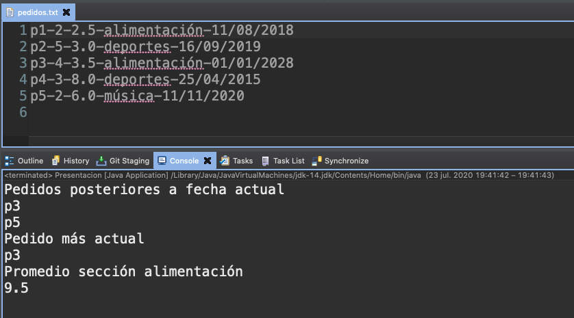
