# 20200727 Lunes

### Nota

Los Lambda no tienen un tipo, se determina en tiempo de ejecución. Cuando algo espera un object y le metemos un Lambda directamentge me puede marcar un error de compilación por un Lambda no tiene tipo.

## Nueva Multitarea


## `ExecutorService`

Vamos a realizar algunos ejemplos que muestren la forma Clásica de la Multitarea con la forma Nueva.

### :computer: `000-058-01_ejercicio_tablas_multiplicar_concurrente_Clasica`

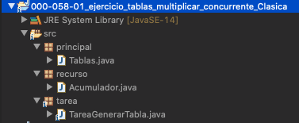

*`Acumulador`*

```java
package recurso;

public class Acumulador {
	
   private int valor;

   public int getValor() {
      return valor;
   }

   public void setValor(int valor) {
      this.valor = valor;
   }	
}
```

*`TareaGenerarTabla`*

```java
package tarea;

public class TareaGenerarTabla implements Runnable{
	
   private int num;
		
   public TareaGenerarTabla(int num) {
      super();
      this.num = num;	
   }

   @Override
   public void run() {
      for(int i=1; i<=10; i++) {
	 System.out.println( num + " * " + i + " = " + (num * i));
	 try {
	    Thread.sleep(100);
	 } catch (InterruptedException e) {
	    e.printStackTrace();
	 }
      }
   }
}
```

*`Tablas`*

```java
package principal;

import tarea.TareaGenerarTabla;

public class Tablas {

   public static void main(String[] args) {
      lanzador(new TareaGenerarTabla(5));
      lanzador(new TareaGenerarTabla(7));
      lanzador(new TareaGenerarTabla(3));
   }

   // Lanzo start() del Thread a partir del Runnable
   private static void lanzador(Runnable r) {
      new Thread(r).start();
   }
}
```

### :computer: `000-058-02_ejercicio_tablas_multiplicar_concurrente_moderno_con_ExecutorService`

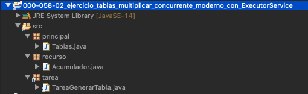

Las clases `Acumulador` y `TareaGenerarTabla` son exactamente iguales solo cambia `Tablas` donde en lugar de usar **`Thread`** usamos **`ExecutorService`** 

*`Tablas`*

```java
package principal;

import java.util.concurrent.ExecutorService;
import java.util.concurrent.Executors;

import tarea.TareaGenerarTabla;

public class Tablas {
   static ExecutorService executor = Executors.newCachedThreadPool(); // Multihilo
   //static ExecutorService executor = Executors.newSingleThreadExecutor(); //Un solo hilo
   //static ExecutorService executor = Executors.newFixedThreadPool(2); //Dos hilos
   public static void main(String[] args) {
      lanzador(new TareaGenerarTabla(5));
      lanzador(new TareaGenerarTabla(7));
      lanzador(new TareaGenerarTabla(3));
      executor.shutdown();
   }

   // Lanzo start() del Thread a partir del Runnable
   private static void lanzador(Runnable t) {
      executor.submit(t);
   }

}
```

Existen 3 Formas de usarlo:

* `Executors.newCachedThreadPool()`:  Multihilo.
* `Executors.newSingleThreadExecutor()`: Un solo hilo.
* `Executors.newFixedThreadPool(2)`: con un determinado número de hilos.

Vamos a ver la salida en cada caso.

Con `Executors.newCachedThreadPool()`:

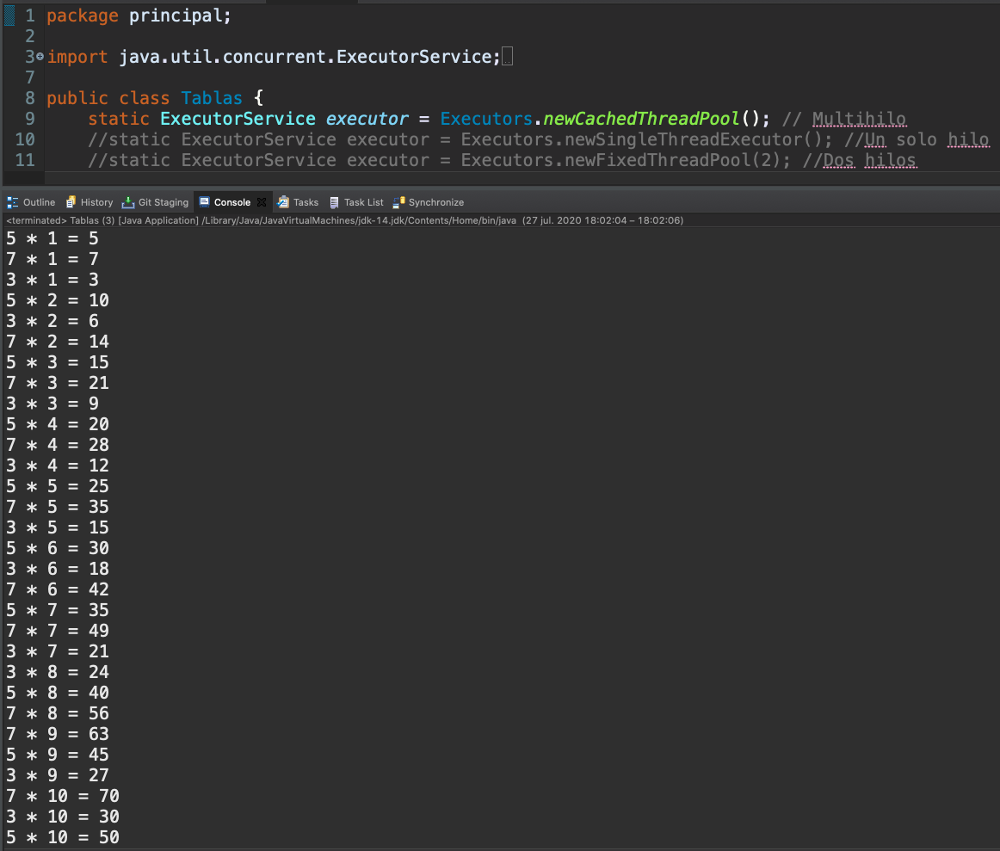

Con `Executors.newSingleThreadExecutor()`:

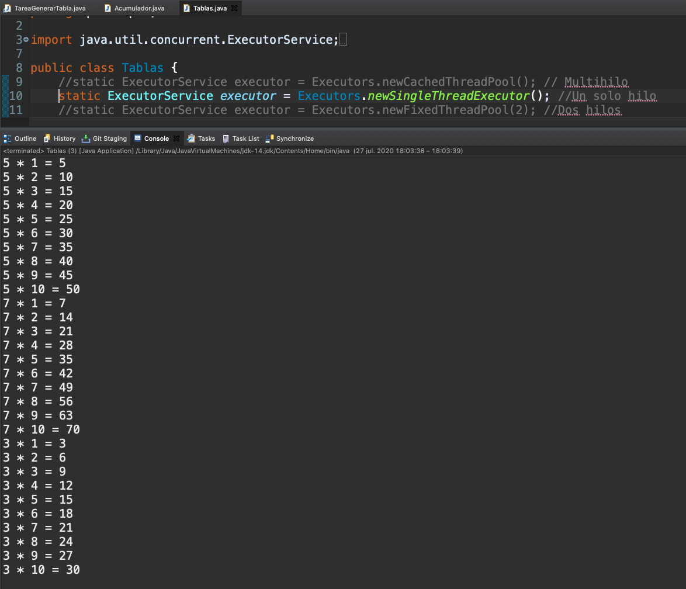

Con `Executors.newFixedThreadPool(2)`:

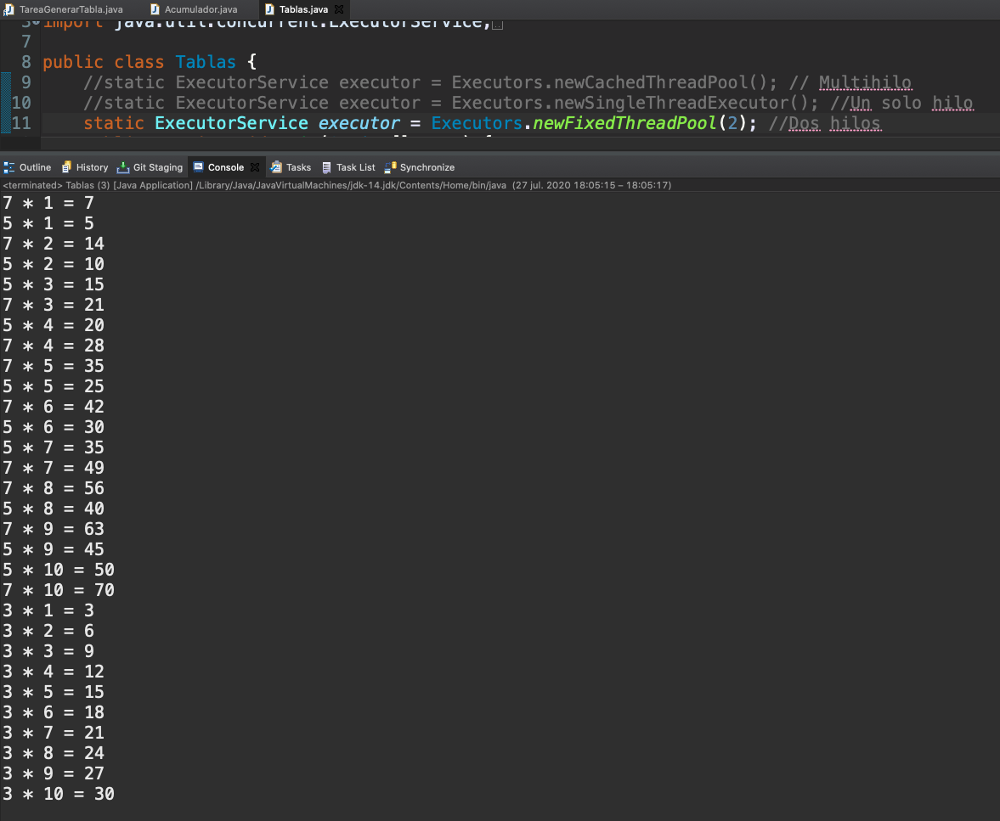

La instrucción `executor.shutdown();` es importante por que si no se pone el `ExecutorService` sigue activo por lo que el programa no termina, hay que ponerla para evitar esto.

## `Callable` y `Future`.

### :computer: `000-059_factoriales_multitarea_Callable_Future`

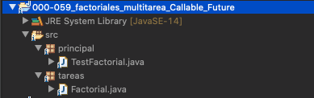

*`Factorial`*

```java
package tareas;

import java.util.concurrent.Callable;

public class Factorial implements Callable<Long>{
   
   private int n;
   public Factorial(int n) {
      this.n=n;
   }
	
   @Override
   public Long call() { //throws Exception { Puedo manejar internamente la exepción no como lo define la interfaz
      long aux=1;
      for (int i = 1; i <= n; i++) {
	 aux *=i;
	 try {
	    Thread.sleep(200);
	 } catch (InterruptedException e) {
	    e.printStackTrace();
	 }		
      }
      return aux;
   }

}
```

*`TestFactorial`*

```java
package principal;

import java.util.concurrent.ExecutionException;
import java.util.concurrent.ExecutorService;
import java.util.concurrent.Executors;
import java.util.concurrent.Future;

import tareas.Factorial;

public class TestFactorial {

   public static void main(String[] args) throws InterruptedException, ExecutionException  {
      ExecutorService exec = Executors.newCachedThreadPool();
      Future<Long> f= exec.submit(new Factorial(7));
      while(!f.isDone()) {
	 System.out.println("Haciendo cosas en el main");
	 try {
	    Thread.sleep(50);
	 } catch (InterruptedException e) {
	    e.printStackTrace();
	 }
      }
      System.out.println("El resultado del factorial es: " + f.get());
      exec.shutdown();
   }

}
```

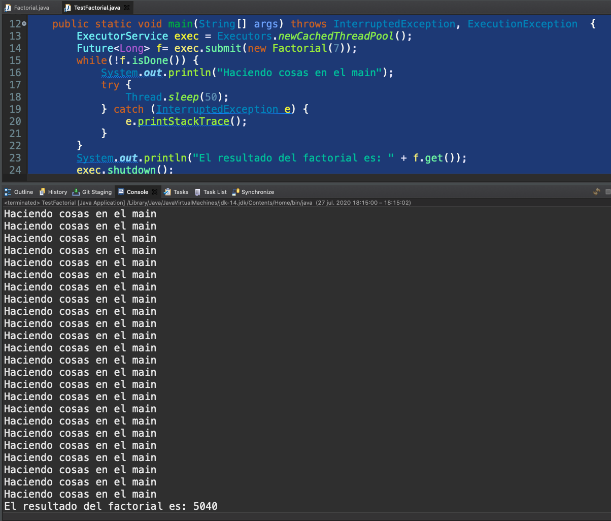

## Sincronización Vs `.lock()` y `.unlock()`

Vamos a comparar la forma anterior de la Sincronización con la forma nueva usando los métodos `.lock()` y `.unlock()`.


### :computer: `000-060-01_ejercicio_tablas_multiplicar_concurrente_syncronyze`

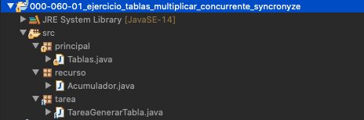

*`Acumulador`*

```java
package recurso;

public class Acumulador {
	
   private int valor;

   public int getValor() {
      return valor;
   }

   public void setValor(int valor) {
      this.valor = valor;
   }
}
```

*`TareaGenerarTabla`*

```java
package tarea;

import recurso.Acumulador;

public class TareaGenerarTabla implements Runnable {

   private int num;
   private Acumulador acumulador;

   public TareaGenerarTabla(int num, Acumulador acumulador) {
      super();
      this.num = num;
      this.acumulador = acumulador;
   }

   @Override
   public void run() {
      for (int i = 1; i <= 10; i++) {
	 System.out.println(num + " * " + i + " = " + (num * i));

	  synchronized (acumulador) {
	     int valor = acumulador.getValor();
	     valor += num * i;
	     try {
		Thread.sleep(100);
	     } catch (InterruptedException e) {
	        e.printStackTrace();
	     }
	     acumulador.setValor(valor);
	  }
       }
       System.out.println("VALOR ACTUAL DEL ACUMULADOR: " + acumulador.getValor());
   }
}
```

*`Tablas`*

```java
package principal;

import java.util.Scanner;

import recurso.Acumulador;
import tarea.TareaGenerarTabla;

public class Tablas {

   public static void main(String[] args) {

      final int totalNumeros = 2;
      int[] nums = new int[totalNumeros];
		
      Acumulador acumulador = new Acumulador();
			
      Scanner sc = new Scanner(System.in);

      for (int i = 0; i <= totalNumeros - 1; i++) {

	 System.out.println("Inserta el número " + (i + 1) + ": ");
	 String numStr = sc.nextLine();

	 nums[i] = Integer.parseInt(numStr);
      }

      for (int n:nums) {
	 lanzador(new TareaGenerarTabla(n, acumulador));
      }
   }

   // Lanzo start() del Thread a partir del Runnable
   private static void lanzador(Runnable r) {
      new Thread(r).start();
   }

}
```

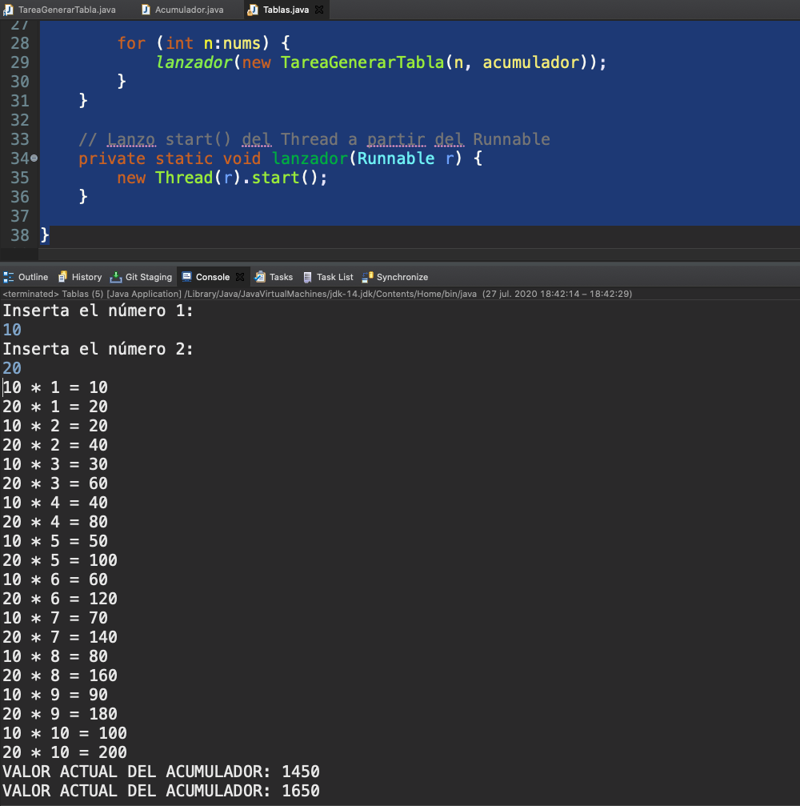


### :computer: `000-060-02_ejercicio_tablas_multiplicar_concurrente_syncronyze_con_lock`

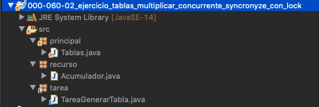

*`Acumulador`* (Exactamente igual al anterior)

```java
package recurso;

public class Acumulador {
	
   private int valor;

   public int getValor() {
      return valor;
   }

   public void setValor(int valor) {
      this.valor = valor;
   }
}
```

*`TareaGenerarTabla`*

```java
package tarea;

import java.util.concurrent.locks.Lock;
import java.util.concurrent.locks.ReentrantLock;

import recurso.Acumulador;

public class TareaGenerarTabla implements Runnable {

   private int num;
   private Acumulador acumulador;
   static Lock lc= new ReentrantLock();

   public TareaGenerarTabla(int num, Acumulador acumulador) {
      super();
      this.num = num;
      this.acumulador = acumulador;
   }

   @Override
   public void run() {
      for (int i = 1; i <= 10; i++) {
	 System.out.println(num + " * " + i + " = " + (num * i));

	 lc.lock();
	    int valor = acumulador.getValor();
	    valor += num * i;
	    try {
	       Thread.sleep(100);
	    } catch (InterruptedException e) {
	       e.printStackTrace();
	    }
	    acumulador.setValor(valor);
	    lc.unlock();
      }
      System.out.println("VALOR ACTUAL DEL ACUMULADOR: " + acumulador.getValor());
   }
}
```

*`Tablas`*

```java
package principal;

import java.util.Scanner;
import java.util.concurrent.ExecutorService;
import java.util.concurrent.Executors;

import recurso.Acumulador;
import tarea.TareaGenerarTabla;

public class Tablas {

   public static ExecutorService executor = Executors.newCachedThreadPool();

   public static void main(String[] args) {

      final int totalNumeros = 2;
      int[] nums = new int[totalNumeros];
		
      Acumulador acumulador = new Acumulador();
		
      Scanner sc = new Scanner(System.in);

      for (int i = 0; i <= totalNumeros - 1; i++) {
	 System.out.println("Inserta el número " + (i + 1) + ": ");
	 String numStr = sc.nextLine();

	 nums[i] = Integer.parseInt(numStr);
      }

      for (int n:nums) {
	 lanzador(new TareaGenerarTabla(n, acumulador));
      }
      executor.shutdown();
   }

   // Lanzo start() del Thread a partir del Runnable
   private static void lanzador(Runnable t) {
      executor.submit(t);
   }
   
}
```

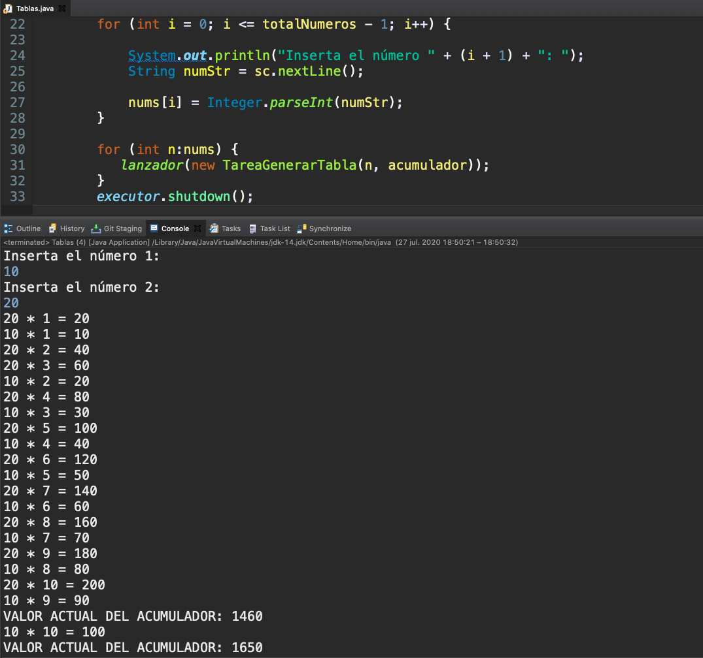

## Ejercicio

En esta nueva versión de manejo de Pedidos vamos a pensar que tenemos diferentes tiendas las cuales aportan un archivo con sus pedidos y debemos meter todos en un unico archivo donde se van metiendo los pedidos de cada tienda en una forma sincronizada, es decir los pedidios se insertan combinando las tiendas.

Partiendo del proyecto `000-049_ejercicio_propuestos_gestion_pedidos_ficheros_STREAMS`.

### :computer: `000-061-02_regristro_pedidos_profesor`

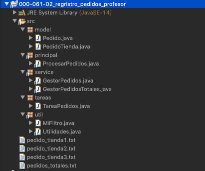

**Model**

*`Pedido`*

```java
package model;

import java.util.Date;

public class Pedido {
	
   private String producto;
   private int unidades;
   private double precioUnitario;
   private String seccion;
   private Date fecha;
	
   public Pedido(String producto, int unidades, double precioUnitario, String seccion,Date fecha) {
      super();
      this.producto = producto;
      this.unidades = unidades;
      this.precioUnitario = precioUnitario;
      this.seccion = seccion;
      this.fecha=fecha;
   }
	
   public String getProducto() {
      return producto;
   }
   public void setProducto(String producto) {
      this.producto = producto;
   }
   public int getUnidades() {
      return unidades;
   }
   public void setUnidades(int unidades) {
      this.unidades = unidades;
   }
   public double getPrecioUnitario() {
      return precioUnitario;
   }
   public void setPrecioUnitario(double precioUnitario) {
      this.precioUnitario = precioUnitario;
   }
   public String getSeccion() {
      return seccion;
   }
   public void setSeccion(String seccion) {
      this.seccion = seccion;
   }	
   public Date getFecha() {
      return fecha;
   }
   public void setFecha(Date fecha) {
      this.fecha = fecha;
   }
}
```

*`PedidoTienda`*

```java
package model;

import java.util.Date;

public class PedidoTienda extends Pedido {
	
   private String tienda;
	
   public PedidoTienda(String producto, int unidades, double precioUnitario, String seccion, Date fecha,
			String tienda) {
      super(producto, unidades, precioUnitario, seccion, fecha);
      this.tienda = tienda;
   }

   public String getTienda() {
      return tienda;
   }

   public void setTienda(String tienda) {
      this.tienda = tienda;
   }
}
```

**Util**

*`MiFiltro`*

```java
package util;

import java.util.function.Predicate;

import model.Pedido;

public class MiFiltro implements Predicate<Pedido>{
	
   private String seccion;
	
   public MiFiltro(String seccion) {
      this.seccion=seccion;
   }

   @Override
   public boolean test(Pedido p) {
      return p.getSeccion().equals(seccion);
   }
}
```

*`Utilidades`*

```java
package util;

import java.text.ParseException;
import java.text.SimpleDateFormat;
import java.time.Instant;
import java.time.LocalDate;
import java.time.ZoneId;
import java.util.Date;

import model.Pedido;
import model.PedidoTienda;

public class Utilidades {

   static SimpleDateFormat sdf=new SimpleDateFormat("dd/MM/yyyy");
	
   public static String pedidoToString(Pedido p) {
      return p.getProducto()+","+p.getUnidades()+","+p.getPrecioUnitario()+","+p.getSeccion()+","+sdf.format(p.getFecha());
   }
	
   public static String pedidoTiendaToString(PedidoTienda p) {
      return p.getTienda()+","+pedidoToString(p);
   }
	
   public static Pedido stringToPedido(String f) {
      String[] partes=f.split("[,]");
      try {
	 return new Pedido(partes[0],
	                   Integer.parseInt(partes[1]),
	                   Double.parseDouble(partes[2]),
	                   partes[3],
			   sdf.parse(partes[4]));
      } catch(ParseException ex) {
	 ex.printStackTrace();
	 return null;
      }
   }

   public static PedidoTienda stringToPedidoTienda(String f) {
      String[] partes=f.split("[,]");
      try {
	 return new PedidoTienda(partes[1],
		                 Integer.parseInt(partes[2]),
				 Double.parseDouble(partes[3]),
				 partes[4],
				 sdf.parse(partes[5]),
				 partes[0]);
      } catch(ParseException ex) {
	 ex.printStackTrace();
	 return null;
      }
   }
	
   public static Date convertirADate(LocalDate ld) {
      return Date.from(ld.atStartOfDay(ZoneId.systemDefault()) //ZoneDateTime
		       .toInstant());
   }
	
   public static LocalDate convertirALocalDate(Date f) {
      return Instant.ofEpochMilli(f.getTime()) //Instant
				  .atZone(ZoneId.systemDefault()) //ZoneDateTime
				  .toLocalDate();
   }
}
```

**Service**

*`GestorPedidos`*

```java
package service;

import java.io.IOException;
import java.nio.charset.StandardCharsets;
import java.nio.file.Files;
import java.nio.file.Path;
import java.nio.file.Paths;
import java.time.LocalDate;
import java.util.List;
import java.util.stream.Collectors;
import java.util.stream.Stream;

import model.Pedido;
import util.Utilidades;

public class GestorPedidos  {
   Path path;
   String RUTA;
   public GestorPedidos(String ruta) {
      this.RUTA=ruta;
      path=Paths.get(RUTA);
      if(!Files.exists(path)) {
	 try {
	    Files.createFile(path);
	 } catch (IOException e) {
	    e.printStackTrace();
	 }
      }
   }
	
   private Stream<Pedido> streamPedido(){
      try {
	 return Files.lines(path,StandardCharsets.UTF_8)
	             //.map(s->Utilidades.stringToPedido(s));
		     .map(Utilidades::stringToPedido);
      } catch (IOException e) {
	 e.printStackTrace();
	 return Stream.empty();
      }
   }
	
   //devuelve lista de pedidos, posteriores a la fecha indicada
   public List<Pedido> pedidosFechaActual() {
      return streamPedido()
	 .filter(p->p.getFecha().compareTo(Utilidades.convertirADate(LocalDate.now()))==0)
	 .collect(Collectors.toList());				
   }
```

*`GestorPedidosTotales`*

```java
package service;

import java.io.IOException;
import java.nio.charset.StandardCharsets;
import java.nio.file.Files;
import java.nio.file.Path;
import java.nio.file.Paths;
import java.nio.file.StandardOpenOption;
import java.util.List;

import model.PedidoTienda;
import util.Utilidades;

public class GestorPedidosTotales {
   Path path;
   //String RUTA="c:\\temp\\pedidos_totales.txt"; //Windows
   String RUTA ="/Users/adolfodelarosa/Documents/TEMP/pedidos_totales.txt"; //MAC
   //String RUTA="pedidos_totales.txt"; //Local
   public GestorPedidosTotales() {
      path=Paths.get(RUTA);
      if(!Files.exists(path)) {
	 try {
	    Files.createFile(path);
	 } catch (IOException e) {
	    e.printStackTrace();
	 }
      }
   }
   public void grabarPedidos(List<PedidoTienda> pedidos) {
      pedidos.forEach(p -> p.toString());
      pedidos.forEach(p->
	 {
	    try {		
		  Files.writeString(path, Utilidades.pedidoTiendaToString(p)+System.lineSeparator(), 
					StandardCharsets.UTF_8,
					StandardOpenOption.APPEND);
					
	    } catch (IOException e) {
	       e.printStackTrace();
	    }
      });
   } 
}
```

**Tareas**

*`TareaPedidos`*

```java
package tareas;

import java.util.List;
import java.util.concurrent.locks.Lock;
import java.util.concurrent.locks.ReentrantLock;
import java.util.stream.Collectors;

import model.Pedido;
import model.PedidoTienda;
import service.GestorPedidos;
import service.GestorPedidosTotales;

public class TareaPedidos implements Runnable{
	
   private String ruta;
   private String tienda;
   static Lock lc= new ReentrantLock();
	
   public TareaPedidos(String ruta, String tienda) {
      this.ruta = ruta;
      this.tienda = tienda;
   }
   
   @Override
   public void run() {

      GestorPedidos gp = new GestorPedidos(ruta);		
      GestorPedidosTotales gpt = new GestorPedidosTotales();	
		
      //Debemos recuperar los pedidos de la tienda
      //realizados en el día de hoy y transferirlos
      //al almacen de pedidos totales
		
      //Bloquear (SYNCRONIZAR)
      lc.lock();
         List<Pedido> pedidos = gp.pedidosFechaActual();
		
         gpt.grabarPedidos(pedidos.parallelStream()
		.map(p -> new PedidoTienda(p.getProducto(), 
					   p.getUnidades(), 
					   p.getPrecioUnitario(), 
					   p.getSeccion(), 
					   p.getFecha(),
					   tienda))
		.collect(Collectors.toList()));
      lc.unlock();
   }
}
```

**Principal**

*`ProcesarPedidos`*

```java
package principal;

import java.util.concurrent.ExecutorService;
import java.util.concurrent.Executors;
import java.util.concurrent.Future;

import tareas.TareaPedidos;

public class ProcesarPedidos {

   public static void main(String[] args) {
		
      ExecutorService exec = Executors.newCachedThreadPool();
      Future<?> f1 = exec.submit(new TareaPedidos("pedido_tienda1.txt", "tienda A"));
      Future<?> f2 = exec.submit(new TareaPedidos("pedido_tienda2.txt", "tienda B"));
      Future<?> f3 = exec.submit(new TareaPedidos("pedido_tienda3.txt", "tienda C"));
      while(!f1.isDone() || !f2.isDone() || !f3.isDone()) {
	 System.out.println("Procesando...");
      }
      System.out.println("Tareas Completadas");
		
      exec.shutdown();			
   }
}
```

**Archivos de Pedidos**

*`pedido_tienda1.txt`*

```txt
p1,2,1.5,muebles,10/05/2020
p2,5,4,deportes,27/07/2020
```

*`pedido_tienda2.txt`*

```txt
p1,2,1.5,muebles,10/05/2020
p3,5,4,deportes,27/07/2020
```

*`pedido_tienda3.txt`*

```txt
p1,2,1.5,muebles,10/05/2020
p4,5,4,deportes,27/07/2020
```

### Resultado de la Ejecución

*`pedidos_totales.txt`*

```txt
tienda B,p3,5,4.0,deportes,27/07/2020
tienda A,p2,5,4.0,deportes,27/07/2020
tienda C,p4,5,4.0,deportes,27/07/2020
```

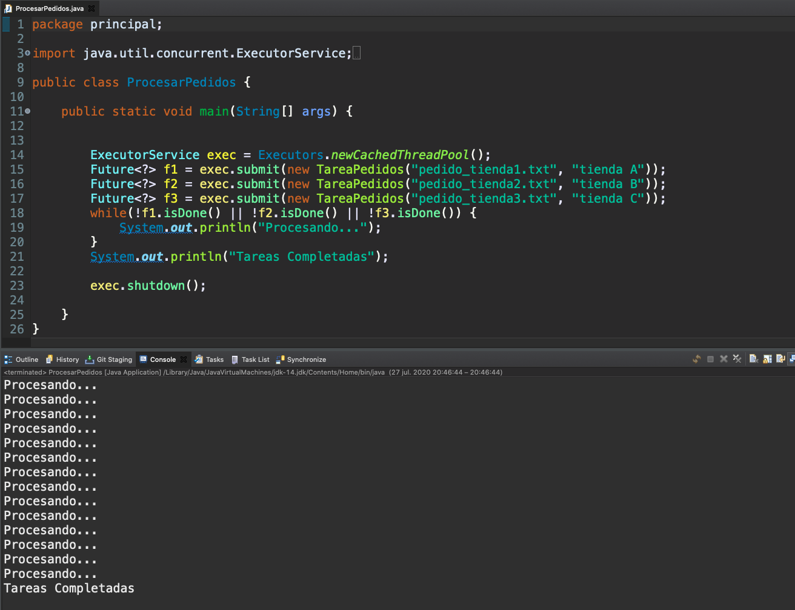

