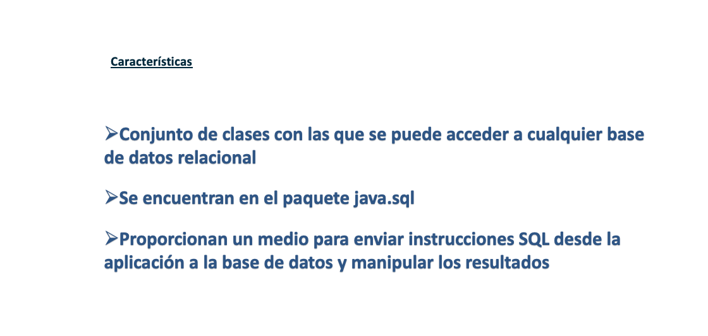
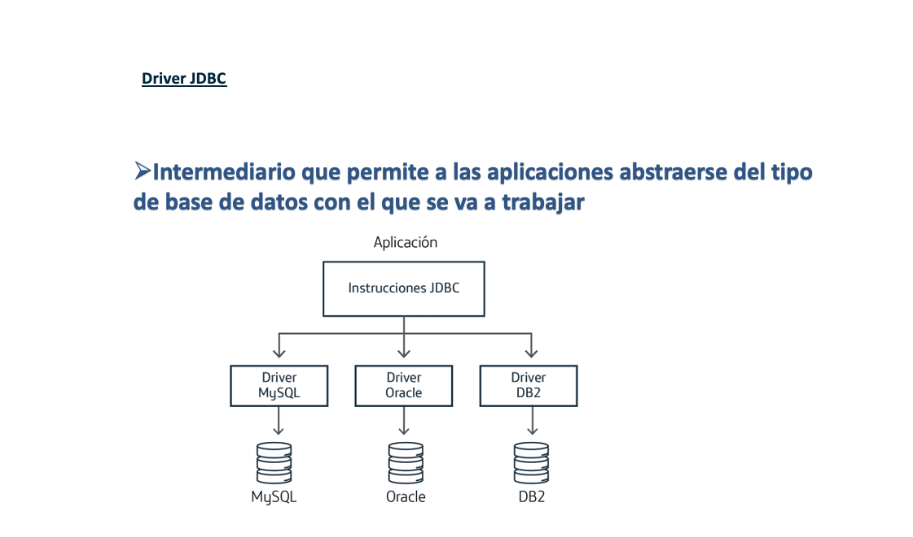
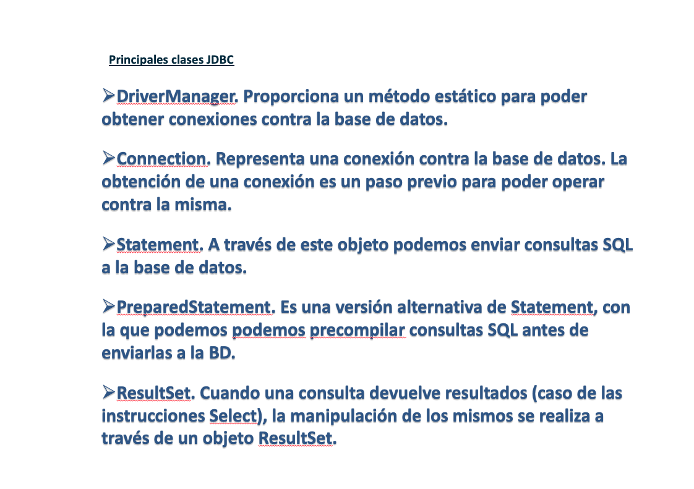
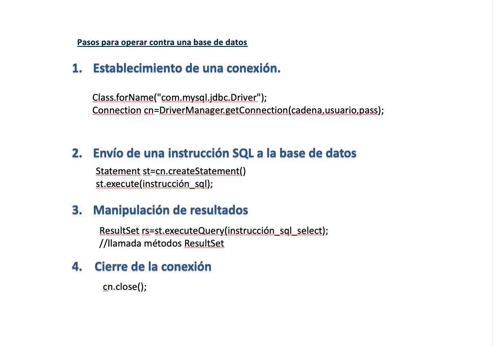
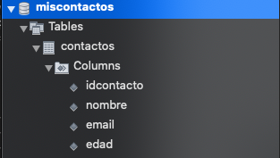
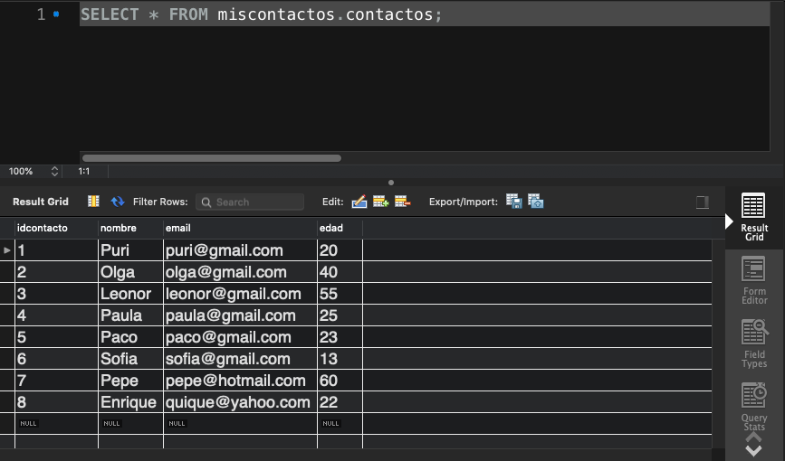
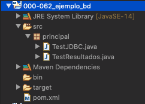
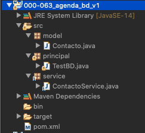
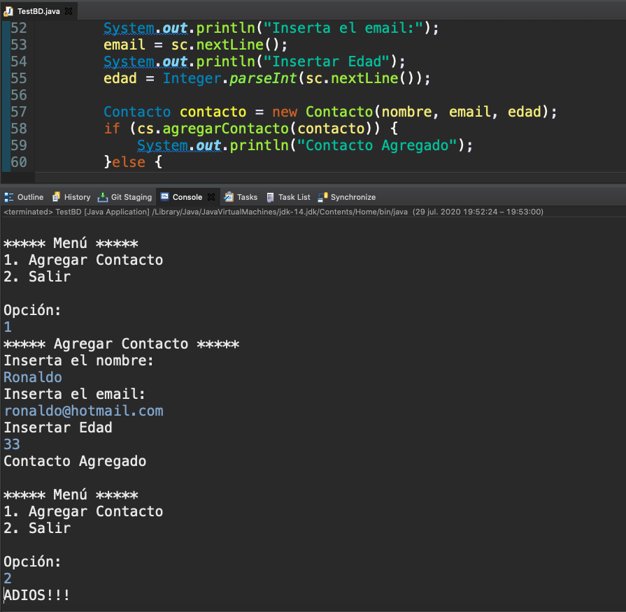
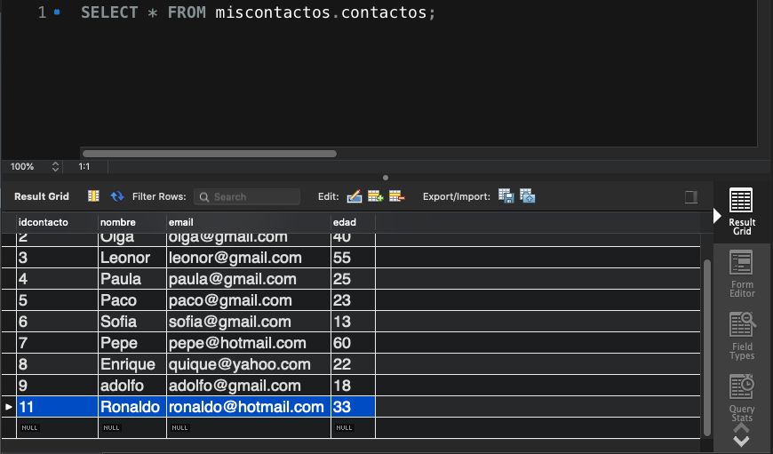

# 20200729 Miercoles

## Acceso a Base de Datos con JDBC










## Creación de Tabla en WorkBeanch






## Instrucciones SQL

Básicamente existen 4 instrucciones SQL que nos permiten crear lo que se le suele llamar el **CRUD**.

**C**reate: `Insert`
**R**ead: `Select`
**U**pdate: `Update`
**D**elete: `Delete`

### Instrucciones de Acción 

Son instrucciones que no devuelven resultados:

* `Insert`
* `Update`
* `Delete`

Usan la instrucción `execute` o `executeUpdate`.

### Instruccion de Consulta

Es una instrucción que devuelve registros:

* `Select`

Usan la instrucción `executeQuery`.

## Dependencia MySQL

Debemos meter la siguiente dependencia en muestro archivo `pom.xml`.

```html
<dependencies>
   <!-- https://mvnrepository.com/artifact/mysql/mysql-connector-java -->
   <dependency>
      <groupId>mysql</groupId>
      <artifactId>mysql-connector-java</artifactId>
      <version>8.0.19</version>
   </dependency>
</dependencies>
```

## `Statement` y `execute`

### :computer: `000-062_ejemplo_bd`



*`TestJDBC`*

```java
package principal;

import java.sql.Connection;
import java.sql.DriverManager;
import java.sql.SQLException;
import java.sql.Statement;

public class TestJDBC {
	
   static String driver = "com.mysql.cj.jdbc.Driver";
   static String cadenaConexion = "jdbc:mysql://localhost:3306/miscontactos?serverTimezone=UTC";
   static String user= "root";
   static String password= "root";
   static {
      //cargar del driver
      try {
         Class.forName(driver);
      } catch (ClassNotFoundException e) {
         e.printStackTrace();
      }
   }

   public static void main(String[] args) {
      //Conexión de la base de datos.
      try(Connection con = DriverManager.getConnection(cadenaConexion, user, password)) {
         //envío de instrucciones SQL
         String sql= "INSERT INTO contactos(nombre, email, edad) values('adolfo', 'adolfo@gmail.com', 18)";
         Statement st = con.createStatement();
         st.execute(sql);
	 System.out.println("Contacto Insertado")
      } catch (SQLException e) {
         e.printStackTrace();
      }
   }
}
```


## `Statement` y `ResultSet` 

### :computer: `000-062_ejemplo_bd`

*`TestResultados`*

```java
package principal;

import java.sql.Connection;
import java.sql.DriverManager;
import java.sql.ResultSet;
import java.sql.SQLException;
import java.sql.Statement;

public class TestResultados {

   static String driver = "com.mysql.cj.jdbc.Driver";
   static String cadenaConexion = "jdbc:mysql://localhost:3306/miscontactos?serverTimezone=UTC";
   static String user = "root";
   static String password = "root";
   static {
      // cargar del driver
      try {
	 Class.forName(driver);
      } catch (ClassNotFoundException e) {
	 e.printStackTrace();
      }
   }

   public static void main(String[] args) {

      // Conexión de la base de datos.
      try (Connection con = DriverManager.getConnection(cadenaConexion, user, password)) {
         // envío de instrucciones SQL
         String sql = "SELECT nombre, email, edad FROM contactos";
         Statement st = con.createStatement();
         ResultSet rs = st.executeQuery(sql);
         System.out.format("%-18s | %-20s | %s \n", "Nombre", "Email", "Edad");
         System.out.format("%-18s | %-20s | %-4s \n", "-".repeat(18), "-".repeat(20), "-".repeat(4));
         while(rs.next()) {
             System.out.format(new String(Character.toChars(0x1F600)) + " %-15s | %-20s | %d \n", rs.getString("nombre"), rs.getString("email"), rs.getInt("edad"));
	 }
      } catch (SQLException e) {
	 e.printStackTrace();
      }
   }
}
```


## `PreparedStatement` y `execute`

### :computer: `000-063_agenda_bd_v1`



*`Contacto`*

```java
package model;

public class Contacto {
	
   private int idContacto;
   private String nombre;
   private String email;
   private int edad;
	
   public Contacto(String nombre, String email, int edad) {
      super();
      this.nombre = nombre;
      this.email = email;
      this.edad = edad;
   }
	
   public Contacto(int idContacto, String nombre, String email, int edad) {
      super();
      this.idContacto = idContacto;
      this.nombre = nombre;
      this.email = email;
      this.edad = edad;
   }

   public int getIdContacto() {
      return idContacto;
   }

   public void setIdContacto(int idContacto) {
      this.idContacto = idContacto;
   }

   public String getNombre() {
      return nombre;
   }

   public void setNombre(String nombre) {
      this.nombre = nombre;
   }

   public String getEmail() {
      return email;
   }

   public void setEmail(String email) {
      this.email = email;
   }

   public int getEdad() {
      return edad;
   }

   public void setEdad(int edad) {
      this.edad = edad;
   }
}
```

*`ContactoService`*

```java
package service;

import java.sql.Connection;
import java.sql.DriverManager;
import java.sql.SQLException;
import java.sql.Statement;

import model.Contacto;

public class ContactoService {
	
   static String driver = "com.mysql.cj.jdbc.Driver";
   static String cadenaConexion = "jdbc:mysql://localhost:3306/miscontactos?serverTimezone=UTC";
   static String user= "root";
   static String password= "root";
   static {
      //cargar del driver
      try {
         Class.forName(driver);
      } catch (ClassNotFoundException e) {
         e.printStackTrace();
      }
   }
		
   public boolean agregarContacto(Contacto contacto) {
		
      //Conexión de la base de datos.
      try(Connection con = DriverManager.getConnection(cadenaConexion, user, password)) {
			
         // USANDO CONCATENACION
         //envío de instrucciones SQL
         /*
	 String sql = "INSERT INTO contactos(nombre, email, edad) values('" 
	          + contacto.getNombre() + "','" + contacto.getEmail() + "'," + contacto.getEdad() +")";
         Statement st = con.createStatement();
         st.execute(sql); //Regresa boolean pero no representa que lo inserto
         return true;
	 */		
			
         /* USANDO PreparedStatement*/
         String sql= "INSERT INTO contactos(nombre, email, edad) values(?,?,?)";
         PreparedStatement st = con.prepareStatement(sql);
         st.setString(1, contacto.getNombre());
         st.setString(2, contacto.getEmail());
         st.setInt(3, contacto.getEdad());
         st.execute();
         return true;			
      } catch (SQLException e) {
         e.printStackTrace();
      }
      return false;
   }
}
```

*`TestBD`*

```java
package principal;

import java.util.Scanner;

import model.Contacto;
import service.ContactoService;

public class TestBD {

   public static void main(String[] args) {
		
      Scanner sc = new Scanner(System.in);
      int opcion = 0;
      do {
         menu();
         System.out.println("\nOpción:");
         opcion = Integer.parseInt(sc.nextLine());
         switch (opcion) {
            case 1: {
               agregarContacto();
               break;
            }
            case 2: {
               System.out.println("ADIOS!!!");
	       break;
	    }
	    default:
	       System.out.println("Opción no valida");
	 }
      }while(opcion != 2);
   }
	
   private static void  menu() {
      System.out.println("\n***** Menú *****");
      System.out.println("1. Agregar Contacto");
      System.out.println("2. Salir");
   }
	
   private static void  agregarContacto() {
		
      String nombre;
      String email;
      int edad;
      Scanner sc = new Scanner(System.in);
      ContactoService cs = new ContactoService();
		
      System.out.println("***** Agregar Contacto *****");
      System.out.println("Inserta el nombre:");
      nombre = sc.nextLine();
      System.out.println("Inserta el email:");
      email = sc.nextLine();
      System.out.println("Insertar Edad");
      edad = Integer.parseInt(sc.nextLine());
		
      Contacto contacto = new Contacto(nombre, email, edad);
      if (cs.agregarContacto(contacto)) {
         System.out.println("Contacto Agregado");
      }else {
         System.out.println("Contacto No Agregado");
      }
   }
}
```




