# 20200730 Jueves

### :computer: `000-064_agenda_bd_v2`

Vamos a modificar el proyecto para meter los datos de conexión en un archivo JSON de configuración. 

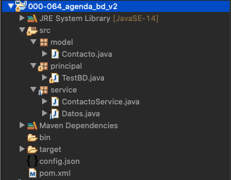

**Model**

*`Contacto`* (Igual)

```java
package model;

public class Contacto {
	
   private int idContacto;
   private String nombre;
   private String email;
   private int edad;
	
   public Contacto(String nombre, String email, int edad) {
      super();
      this.nombre = nombre;
      this.email = email;
      this.edad = edad;
   }
	
   public Contacto(int idContacto, String nombre, String email, int edad) {
      super();
      this.idContacto = idContacto;
      this.nombre = nombre;
      this.email = email;
      this.edad = edad;
   }

   public int getIdContacto() {
      return idContacto;
   }

   public void setIdContacto(int idContacto) {
      this.idContacto = idContacto;
   }

   public String getNombre() {
      return nombre;
   }

   public void setNombre(String nombre) {
      this.nombre = nombre;
   }

   public String getEmail() {
      return email;
   }

   public void setEmail(String email) {
      this.email = email;
   }

   public int getEdad() {
      return edad;
   }

   public void setEdad(int edad) {
      this.edad = edad;
   }
}
```

**Service**

*`Datos`* (**Cambio**)

```java
package service;

import java.io.FileNotFoundException;
import java.io.FileReader;
import java.sql.Connection;
import java.sql.DriverManager;
import java.sql.SQLException;

import com.google.gson.JsonIOException;
import com.google.gson.JsonObject;
import com.google.gson.JsonParser;
import com.google.gson.JsonSyntaxException;

public class Datos  {
   static String driver;
   static String cadenaConexion;
   static String user;
   static String password;
   static String FILE="config.json";
   static {
      //carga del driver
      try {
         cargarPropiedades();
         Class.forName(driver);
      } catch (ClassNotFoundException e) {
         e.printStackTrace();
      } catch (JsonIOException e) {
         e.printStackTrace();
		  } catch (JsonSyntaxException e) {
         e.printStackTrace();
      } catch (FileNotFoundException e) {
         e.printStackTrace();
		  }
   }
	
   public static Connection getConnection() throws SQLException {
      return DriverManager.getConnection(cadenaConexion, user, password);
   }

   private static void cargarPropiedades() throws JsonIOException, JsonSyntaxException, FileNotFoundException {
      JsonObject conn = JsonParser.parseReader(new FileReader(FILE)).getAsJsonObject();
      driver 		    = conn.get("driver").getAsString();
      cadenaConexion 	= conn.get("cadenaConexion").getAsString();
      user 		    = conn.get("user").getAsString();
      password 		= conn.get("password").getAsString();
   }
}
```

*`ContactoService`* (Igual)

```java
package service;

import java.sql.Connection;
import java.sql.PreparedStatement;
import java.sql.ResultSet;
import java.sql.SQLException;
import java.sql.Statement;
import java.util.ArrayList;
import java.util.List;

import model.Contacto;

public class ContactoService {
	
   public boolean agregarContacto(Contacto contacto) {
		
      //Conexión de la base de datos.
      try(Connection con = Datos.getConnection()) {
         		
         /* USANDO PreparedStatement*/
         String sql= "INSERT INTO contactos(nombre, email, edad) values(?,?,?)";
         PreparedStatement st = con.prepareStatement(sql);
         st.setString(1, contacto.getNombre());
         st.setString(2, contacto.getEmail());
         st.setInt(3, contacto.getEdad());
         st.execute();
         return true;
			
      } catch (SQLException e) {
         e.printStackTrace();
      }
      return false;
   }
	
   public static boolean borrarContacto(String email) {
      try(Connection con = Datos.getConnection()) {
    		
         String sql = "DELETE FROM contactos WHERE email = ?";
         PreparedStatement st = con.prepareStatement(sql);
         st.setString(1, email);
         //st.execute();
         //return true;
         return st.executeUpdate()>0;
		   
      } catch (SQLException e) {
         e.printStackTrace();
      }
      return false;
   }
    
   public Contacto buscarContacto(String email) {
    	
      try(Connection con = Datos.getConnection()) {
    	   
         String sql = "SELECT * FROM contactos WHERE email = ?";
         PreparedStatement pst = con.prepareStatement(sql);
         pst.setString(1, email);
         ResultSet rs = pst.executeQuery(); //Aquí no se le manda el sql por que ya esta en el pst
 		   
         if(rs.next()) {
            return new Contacto(rs.getString("nombre"),rs.getString("email"),rs.getInt("edad"));
         }
      } catch (SQLException e) {
         e.printStackTrace();
      }
      return null;
   }
    
   public List<Contacto> leerContactos() {
	   
      try(Connection con = Datos.getConnection()) {
         List<Contacto> lista = new ArrayList<>();
	   
         String sql = "SELECT * FROM contactos";
         Statement st = con.createStatement();
         ResultSet rs = st.executeQuery(sql);
		
         while(rs.next()) {
            lista.add(new Contacto(rs.getString("nombre"),rs.getString("email"),rs.getInt("edad")));
         }
         return lista;
      } catch (SQLException e) {
         e.printStackTrace();
      }
      return null;
   }
}
```

**Principal**

*`TestBD`* (Igual)

```java
package principal;

import java.util.List;
import java.util.Scanner;

import model.Contacto;
import service.ContactoService;

public class TestBD {

   public static void main(String[] args) {
		
      Scanner sc = new Scanner(System.in);
      int opcion = 0;
			
      do {
         menu();
         System.out.println("\nOpción:");
         opcion = Integer.parseInt(sc.nextLine());
         switch (opcion) {
            case 1: {
               agregarContacto();
	             break;
            }
            case 2: {
               eliminarContacto();
               break;
            }
            case 3: {
               buscarContacto();
               break;
            }
            case 4: {
               mostrarContactos();
               break;
            }
            case 5: {
               System.out.println("ADIOS!!!");
               break;
            }
            default:
               System.out.println("Opción no valida");
            }
         }while(opcion != 5);
      }
	
      private static void  menu() {
         System.out.println("\n***** Menú *****");
         System.out.println("1. Agregar Contacto");
         System.out.println("2. Eliminar Contacto");
         System.out.println("3. Buscar Contacto");
         System.out.println("4. Mostrar Contacto");
         System.out.println("5. Salir");
      }
	
      private static void  agregarContacto() {	
         String nombre;
         String email;
         int edad;
         Scanner sc = new Scanner(System.in);
         ContactoService cs = new ContactoService();
		
         System.out.println("***** Agregar Contacto *****");
         System.out.println("Inserta el nombre:");
         nombre = sc.nextLine();
         System.out.println("Inserta el email:");
         email = sc.nextLine();
         System.out.println("Insertar Edad");
         edad = Integer.parseInt(sc.nextLine());
		
         Contacto contacto = new Contacto(nombre, email, edad);
         if (cs.agregarContacto(contacto)) {
            System.out.println("Contacto Agregado");
         }else {
            System.out.println("No se agrego el Contacto");
         }
      }
	
      private static void  eliminarContacto() {
         String email;
         Scanner sc = new Scanner(System.in);
         ContactoService cs = new ContactoService();
         System.out.println("***** Agregar Contacto *****");
         System.out.println("Inserta email:");
         email = sc.nextLine();
		
         if(cs.borrarContacto(email)) {
            System.out.println("Contacto eliminado");
         }else {
            System.out.println("No se pudo eliminar el Contacto con email " + email);
         }	
      }
	
      private static void  buscarContacto() {
         String email;
         Scanner sc = new Scanner(System.in);
         ContactoService cs = new ContactoService();
         System.out.println("***** Buscar Contacto *****");
         System.out.println("Inserta email:");
         email = sc.nextLine();
		
         Contacto contacto = cs.buscarContacto(email);
		
         if(contacto != null) {
            System.out.println(contacto.getNombre() + " " + contacto.getEmail() + " " + contacto.getEdad());
         }else {
            System.out.println("No se pudo localizar el Contacto con email " + email);
         }	
      }

      private static void  mostrarContactos() {
         ContactoService cs = new ContactoService();
    	
         List<Contacto> contactos = cs.leerContactos();
    	
         System.out.println("***** Lista Contacto *****");
         contactos
            .forEach(contacto -> System.out.println(contacto.getNombre() + " " + contacto.getEmail() + " " + contacto.getEdad()));	
      }
   }
}
```

*`config.json`* (Nuevo)

```html
{
"driver":"com.mysql.cj.jdbc.Driver",
"cadenaConexion":"jdbc:mysql://localhost:3306/miscontactos?serverTimezone=UTC",
"user":"root",
"password":"root"
}
```

*`pom.xml`* (Nuevo)

```html
<project xmlns="http://maven.apache.org/POM/4.0.0"
	xmlns:xsi="http://www.w3.org/2001/XMLSchema-instance"
	xsi:schemaLocation="http://maven.apache.org/POM/4.0.0 https://maven.apache.org/xsd/maven-4.0.0.xsd">
   <modelVersion>4.0.0</modelVersion>
   <groupId>000-063_agenda_bd_v1</groupId>
   <artifactId>000-063_agenda_bd_v1</artifactId>
   <version>0.0.1-SNAPSHOT</version>
   <build>
      <sourceDirectory>src</sourceDirectory>
      <plugins>
	 <plugin>
	    <artifactId>maven-compiler-plugin</artifactId>
	    <version>3.8.1</version>
	    <configuration>
	       <release>14</release>
	    </configuration>
	 </plugin>
      </plugins>
   </build>
   <dependencies>
      <!-- https://mvnrepository.com/artifact/mysql/mysql-connector-java -->
      <dependency>
         <groupId>mysql</groupId>
	 <artifactId>mysql-connector-java</artifactId>
	 <version>8.0.19</version>
      </dependency>
      <dependency>
	 <groupId>com.google.code.gson</groupId>
	 <artifactId>gson</artifactId>
	 <version>2.8.6</version>
      </dependency>
   </dependencies>
</project>
```

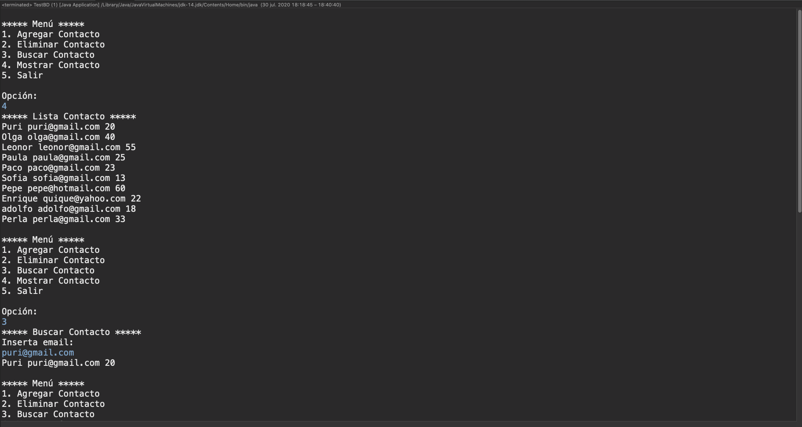

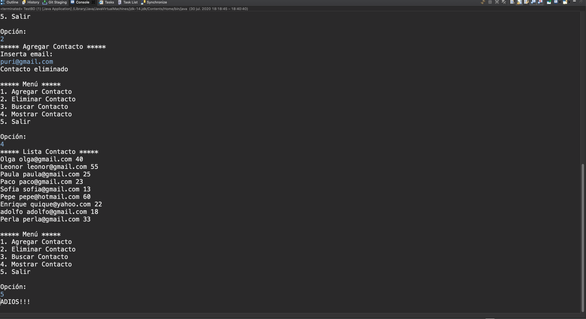

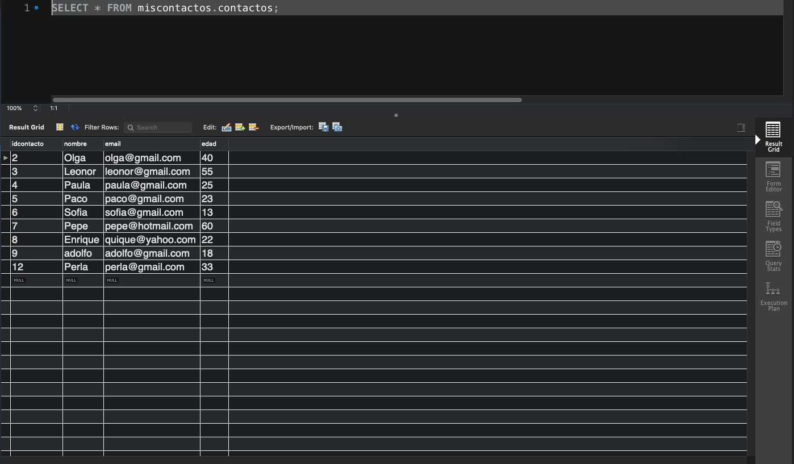

## Fechas en SQL

Cuando vamos a trabajar con bases de datos a través de JDBC, los campos de fecha se manejan a través de los tipos `Date` y `Timestamp` del paquete `java.sql`. Ambas son subclases de `java.util.Date`.


Mientras que `java.sql.Date` es utilizada solo para fechas, `Timestamp` se emplea para columnas de tipo fecha y hora.

En aplicaciones donde tenemos una clara separación entre capa de lógica de negocio y capa de presentación, es habitual tener que convertir fechas/horas de tipo `util.Date` a los tipos SQL y viceversa. Vamos a ver como realizar esta tarea.

### Conversión `sql.Date` y `sql.Timestamp` a `util.Date`

Dado que ambas son subclases de `util.Date`, convertir uno de estos objetos sql a un objeto `util.Date` es tan simple como realizar una operación de asignación. Por ejemplo, si `sqFecha` es una variable que contiene un objeto `java.sql.Date` con el valor de una columna de fecha, su conversión a un objeto `util.Date` será:

```java
java.util.Date utFecha=sqFecha;
```

### Conversión de un objeto `utilDate` a `sql.Date` y `sql.Timestamp`

Para realizar la conversión en sentido contrario, tendremos que recurrir a los constructores `sql.Date(long time)` y `sql.Timestamp(long time)`, que permiten crear objetos sql de fecha a partir del tiempo absoluto.

Como podemos obtener fácilmente el tiempo absoluto asociado a un objeto `java.util.Date` a partir de su método `getTime()`, la solución al problema resulta inmediata. Por ejemplo, fechaDato es una variable `java.util.Date` que contiene la fecha de un dato en esta formato, para convertirla a un tipo `sql.Timestamp` procederíamos:

```java
java.sql.Timestamp fechaFin=new java.sql.Timestamp(fechaDato.getTime());
```

### :computer: `000-065_formacion`

Vamos a trabajar con un proyecto donde trabajemos con una Base de Datos que involucran campos de fecha y su acceso desde Java para ver la conversión de fechas `sql.Date` y `sql.Timestamp` a `util.Date` para poder introducirla en la BD.

Hemos detectado problemas a la hora de conversión de fechas ya que se perdia algunas horas, por lo se ha cambiado el uso de `serverTimezone=UTC` a `serverTimezone=Europe/Madrid`.

También se maneja la recuperación de datos de dos tablas.

Y acceso a Store Procedures.

**Base de Datos**

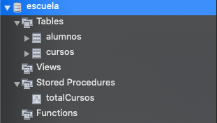


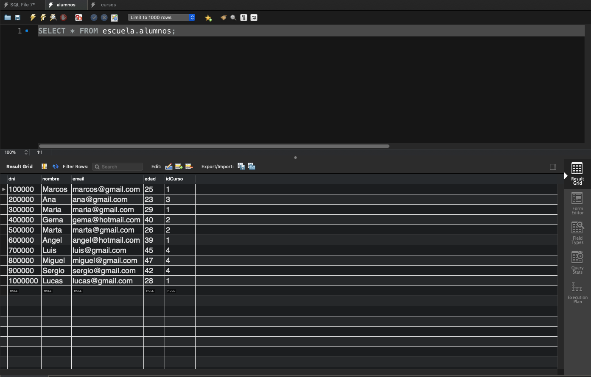

**Store Procedure**

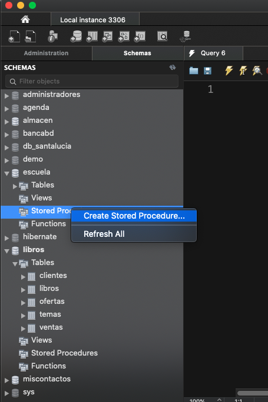

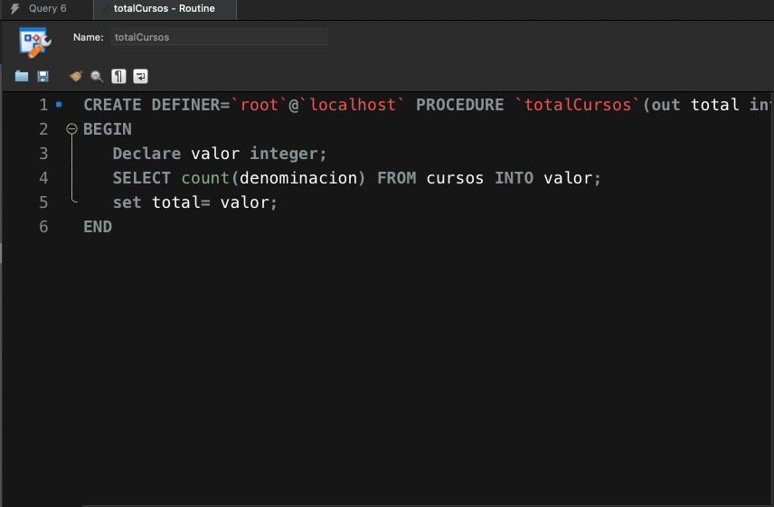

```sql
CREATE DEFINER=`root`@`localhost` PROCEDURE `totalCursos`(out total int)
BEGIN
   Declare valor integer;
   SELECT count(denominacion) FROM cursos INTO valor;
   set total= valor;
END
```

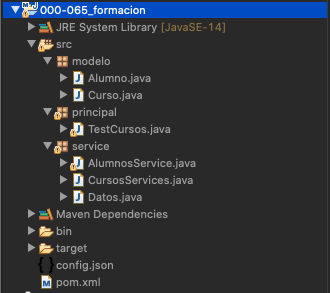

**Model**

*`Curso`* 

```java
package modelo;

import java.util.Date;

public class Curso {
	
   private int idCurso;
   private String denominacion;
   private int duracion;
   private Date fechaInicio;
	
   public Curso(int idCurso, String denominacion, int duracion, Date fechaInicio) {
      super();
      this.idCurso = idCurso;
      this.denominacion = denominacion;
      this.duracion = duracion;
      this.fechaInicio = fechaInicio;
   }

   public int getIdCurso() {
      return idCurso;
   }

   public void setIdCurso(int idCurso) {
      this.idCurso = idCurso;
   }

   public String getDenominacion() {
      return denominacion;
   }

   public void setDenominacion(String denominacion) {
      this.denominacion = denominacion;
   }

   public int getDuracion() {
      return duracion;
   }

   public void setDuracion(int duracion) {
      this.duracion = duracion;
   }

   public Date getFechaInicio() {
      return fechaInicio;
   }

   public void setFechaInicio(Date fechaInicio) {
      this.fechaInicio = fechaInicio;
   }
}
```

*`Alumno`* 

```java
package modelo;

public class Alumno {
	
   private String dni;
   private String nombre;
   private String email;
   private int edad;
   private int idCurso;
   
   public Alumno(String dni, String nombre, String email, int edad, int idCurso) {
      super();
      this.dni = dni;
      this.nombre = nombre;
      this.email = email;
      this.edad = edad;
      this.idCurso = idCurso;
   }

   public String getDni() {
      return dni;
   }
   public void setDni(String dni) {
      this.dni = dni;
   }
   public String getNombre() {
      return nombre;
   }
   public void setNombre(String nombre) {
      this.nombre = nombre;
   }
   public String getEmail() {
      return email;
   }
   public void setEmail(String email) {
      this.email = email;
   }
   public int getEdad() {
      return edad;
   }
   public void setEdad(int edad) {
      this.edad = edad;
   }
   public int getIdCurso() {
      return idCurso;
   }
   public void setIdCurso(int idCurso) {
      this.idCurso = idCurso;
   }
}
```

**Service**

*`Datos`* 

```java
package service;

import java.io.FileNotFoundException;
import java.io.FileReader;
import java.sql.Connection;
import java.sql.DriverManager;
import java.sql.SQLException;

import com.google.gson.JsonIOException;
import com.google.gson.JsonObject;
import com.google.gson.JsonParser;
import com.google.gson.JsonSyntaxException;

public class Datos  {
   static String driver;
   static String cadenaConexion;
   static String user;
   static String password;
   static String FILE="config.json";
   static {
      //carga del driver
      try {
         cargarPropiedades();
         Class.forName(driver);
      } catch (ClassNotFoundException e) {
         e.printStackTrace();
      } catch (JsonIOException e) {
         e.printStackTrace();
      } catch (JsonSyntaxException e) {
         e.printStackTrace();
      } catch (FileNotFoundException e) {
         e.printStackTrace();
      }
   }
	
   public static Connection getConnection() throws SQLException {
      return DriverManager.getConnection(cadenaConexion, user, password);
   }

   private static void cargarPropiedades() throws JsonIOException, JsonSyntaxException, FileNotFoundException {
      JsonObject conn = JsonParser.parseReader(new FileReader(FILE)).getAsJsonObject();
      driver 		    = conn.get("driver").getAsString();
      cadenaConexion 	= conn.get("cadenaConexion").getAsString();
      user 		    = conn.get("user").getAsString();
      password 		= conn.get("password").getAsString();
   }
}
```

*`CursosServices`* 

```java
package service;

import java.sql.CallableStatement;
import java.sql.Connection;
import java.sql.PreparedStatement;
import java.sql.ResultSet;
import java.sql.SQLException;
import java.sql.Statement;
import java.sql.Types;
import java.util.ArrayList;
import java.util.List;

import modelo.Curso;

public class CursosServices {

   public List<Curso> recuperarCursos() {
      try (Connection con = Datos.getConnection()) {
         List<Curso> cursos = new ArrayList<>();
         String sql = "SELECT * FROM cursos";
         Statement st = con.createStatement();
         ResultSet rs = st.executeQuery(sql);
         while (rs.next()) {
            cursos.add(new Curso(rs.getInt("idCurso"), 
	                         rs.getString("denominacion"), 
				 rs.getInt("duracion"),
				 rs.getDate("fechaInicio") // El cast es transparente de java.sql.Date a java.util.Date
			));
         }
         return cursos;
      } catch (SQLException ex) {
         ex.printStackTrace();
         return null;
      }
   }

   public boolean altaCurso(Curso curso) {

      // Conexión de la base de datos.
      try (Connection con = Datos.getConnection()) {
         System.out.println("FECHA : " + curso.getFechaInicio());
         System.out.println("FECHA : " + curso.getFechaInicio().getTime());
         System.out.println("FECHA : " + new java.util.Date(curso.getFechaInicio().getTime()));
		
	 /* USANDO PreparedStatement */
	 String sql = "INSERT INTO cursos(denominacion, duracion, fechaInicio) values(?,?,?)";
	 PreparedStatement st = con.prepareStatement(sql);
	 st.setString(1, curso.getDenominacion());
	 st.setInt(2, curso.getDuracion());
	 //st.setTimestamp(3,new java.sql.Timestamp(curso.getFechaInicio().getTime())); //Aquí va de util.Date a sql.Date
	 //FECHA : Sat Aug 01 00:00:00 CEST 2020
	 //com.mysql.cj.jdbc.ClientPreparedStatement: INSERT INTO cursos(denominacion, duracion, fechaInicio) values('XXX',10,'2020-07-31 22:00:00.0')
	 //https://stackoverflow.com/questions/930900/how-do-i-set-the-time-zone-of-mysql#:~:text=serverTimezone%3DUTC%20at%20the%20end.&text=Simply%20run%20this%20on%20your,will%20be%20your%20time%20zone.
	 //ERROR EN LA CONVERSION
	 st.setDate(3,new java.sql.Date(curso.getFechaInicio().getTime())); //Aquí va de util.Date a sql.Date
	 System.out.println(st.toString());
	 st.execute();		
	 return true;
      } catch (SQLException e) {
         e.printStackTrace();
      }
      return false;
   }
	
   public List<Curso> recuperarCursosEntreFechas(java.util.Date fechaInicio, java.util.Date fechaFin) {

      try (Connection con = Datos.getConnection()) {
         List<Curso> cursos = new ArrayList<>();
         String sql = "SELECT * FROM cursos WHERE fecha BETWEEN ? AND ? ";
         PreparedStatement pst = con.prepareStatement(sql);
         pst.setDate(1, new java.sql.Date(fechaInicio.getTime()));
         pst.setDate(2, new java.sql.Date(fechaFin.getTime()));
         ResultSet rs = pst.executeQuery(); //Aquí no se le manda el sql por que ya esta en el pst
	 		   
         while (rs.next()) {
            cursos.add(new Curso(rs.getInt("idCurso"), 
	                         rs.getString("denominacion"), 
				 rs.getInt("duracion"),
				 rs.getDate("fechaInicio") // El cast es transparente de java.sql.Date a java.util.Date
				));
         }
	 return cursos;
      } catch (SQLException ex) {
         ex.printStackTrace();
         return null;
      }
   }
	
   public int totalCursos() {
		
      try (Connection con = Datos.getConnection()) {
         CallableStatement cs = con.prepareCall("{call totalCursos(?)}");
         //Se registran los párametros de salida
         cs.registerOutParameter(1, Types.INTEGER);
         //Ejecutar
         cs.execute();
         return cs.getInt(1); //Recoge parametro de salida
      } catch (SQLException ex) {
         ex.printStackTrace();
         return 0;
      }
   }
}
```

*`AlumnosService`* 

```java
package service;

import java.sql.Connection;
import java.sql.PreparedStatement;
import java.sql.ResultSet;
import java.sql.SQLException;
import java.util.ArrayList;
import java.util.List;

import modelo.Alumno;

public class AlumnosService {
	
   public List<Alumno> recuperarAlumnosPorDenominacion(String denominacion) {

      try (Connection con = Datos.getConnection()) {
         List<Alumno> alumnos = new ArrayList<>();
	 String sql = "SELECT a.* " 
		    + "FROM alumnos a, cursos c  "
		    + "WHERE a.idCurso = c.idCurso "
		    + "AND c.denominacion = ? ";
			
	 PreparedStatement pst = con.prepareStatement(sql);
	 pst.setString(1, denominacion);
	 ResultSet rs = pst.executeQuery(); //Aquí no se le manda el sql por que ya esta en el pst
			
	 while (rs.next()) {
	    alumnos.add(new Alumno(rs.getString("dni"), 
		                   rs.getString("nombre"), 
				   rs.getString("email"), 
				   rs.getInt("edad"),
				   rs.getInt("idCurso")));
	 }
	 return alumnos;
      } catch (SQLException ex) {
	 ex.printStackTrace();
	 return null;
      }
   }
}
```

**Principal**

*`TestCursos`* 

```java
package principal;

import java.text.ParseException;
import java.text.SimpleDateFormat;
import java.util.List;
import java.util.Scanner;

import modelo.Alumno;
import modelo.Curso;
import service.AlumnosService;
import service.CursosServices;

public class TestCursos {

   public static void main(String[] args) {
		
      String denominacion;
      int duracion;
      String fechaStr;
		
      CursosServices cs = new CursosServices();
      SimpleDateFormat sdf = new SimpleDateFormat("dd/MM/yyyy");
		
      Scanner sc = new Scanner(System.in);
      System.out.println("***** Nuevo Curso *****");
      System.out.println("Introduce nombre curso: ");
      denominacion = sc.nextLine();
      System.out.println("Introduce duración curso: ");
      duracion = Integer.parseInt(sc.nextLine());
      System.out.println("Introduce fecha curso (dd/mm/yyyy): ");
      fechaStr = sc.nextLine();
		
      try {
         cs.altaCurso(new Curso(1,denominacion, duracion, sdf.parse(fechaStr)) );
      } catch (ParseException e) {
         e.printStackTrace();
      }
      System.out.println("***** Lista de Cursos *****");
      List<Curso> cursos = cs.recuperarCursos();
      cursos
      	  .forEach(c -> System.out.format("%-25s | %10s | %-20s\n", c.getDenominacion() , c.getDuracion() , c.getFechaInicio()));
	
      //Leer Store Procedure
      System.out.println("\nTotal de cursos registrados: \n" + cs.totalCursos());
	
      AlumnosService as = new AlumnosService();
		
      System.out.println("\nAlumnos del curso 'java': \n");
      List<Alumno> alumnos = as.recuperarAlumnosPorDenominacion("java");
      alumnos.forEach(a -> System.out.format("%-25s | %10s | %-20s\n", a.getNombre() , a.getEdad() , a.getEmail()));	
   }
}
```

**Archivos de Configuración**

*`config.json`* 

```java
{
"driver":"com.mysql.cj.jdbc.Driver",
"cadenaConexion":"jdbc:mysql://localhost:3306/escuela?serverTimezone=Europe/Madrid",
"user":"root",
"password":"root"
}
```

*`pom.xml`* (Nuevo)

```html
<project xmlns="http://maven.apache.org/POM/4.0.0"
	xmlns:xsi="http://www.w3.org/2001/XMLSchema-instance"
	xsi:schemaLocation="http://maven.apache.org/POM/4.0.0 https://maven.apache.org/xsd/maven-4.0.0.xsd">
   <modelVersion>4.0.0</modelVersion>
   <groupId>000-063_agenda_bd_v1</groupId>
   <artifactId>000-063_agenda_bd_v1</artifactId>
   <version>0.0.1-SNAPSHOT</version>
   <build>
      <sourceDirectory>src</sourceDirectory>
      <plugins>
	 <plugin>
	    <artifactId>maven-compiler-plugin</artifactId>
	    <version>3.8.1</version>
	    <configuration>
	       <release>14</release>
	    </configuration>
	 </plugin>
      </plugins>
   </build>
   <dependencies>
      <!-- https://mvnrepository.com/artifact/mysql/mysql-connector-java -->
      <dependency>
         <groupId>mysql</groupId>
	 <artifactId>mysql-connector-java</artifactId>
	 <version>8.0.19</version>
      </dependency>
      <dependency>
	 <groupId>com.google.code.gson</groupId>
	 <artifactId>gson</artifactId>
	 <version>2.8.6</version>
      </dependency>
   </dependencies>
</project>
```

### :computer: `000-066-_regristro_pedidos_a_bd`

En este proyecto vamos a tomar como base el proyecto `000-061-02_regristro_pedidos_profesor` en el cual vamos a modificar para que en lugar de generar un nuevo archivo con los pedidos de tres tiendas que los inserte a la BD.


Lo primero que tenemos que hacer es crear la Base de Datos de `pedidos`.

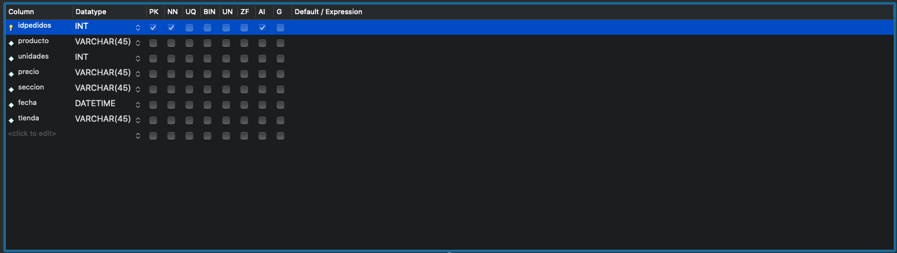

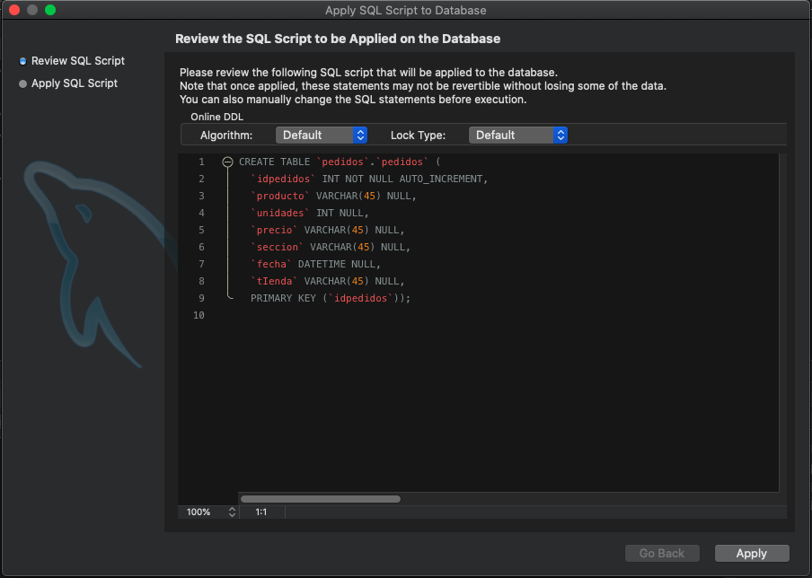


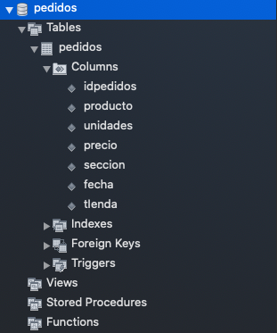


