# 20200731 Viernes

## Comunicacion entre Aplicaciones Java - SOCKETS

En esta lección vamos a ver el intercambio de datos entre aplicaciones Java.

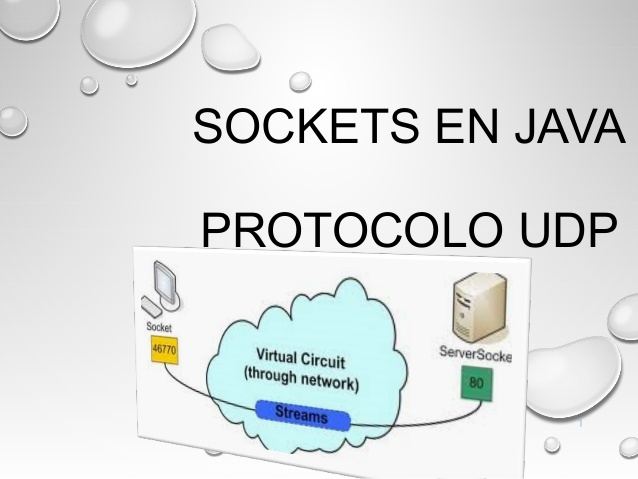

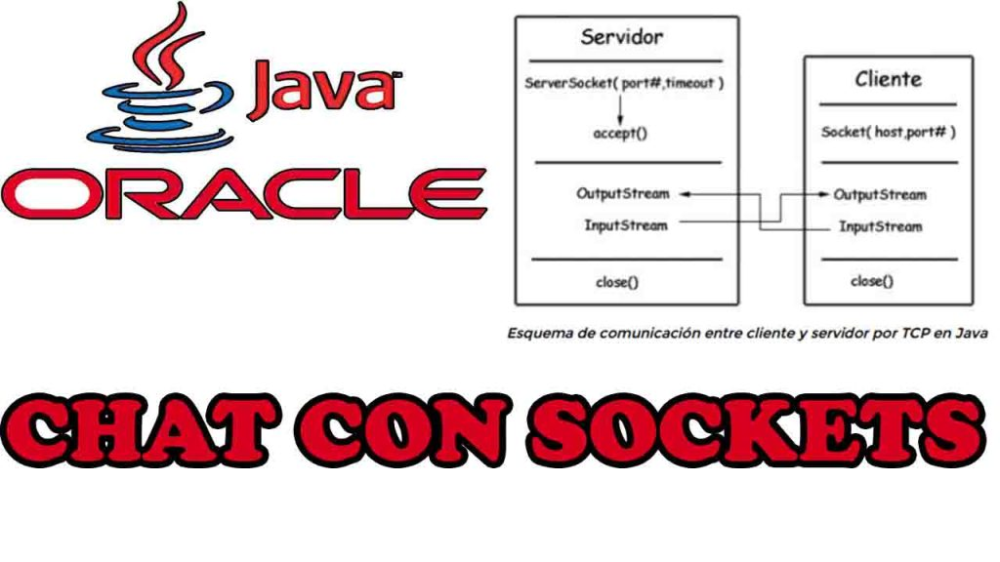

Aquí usamos el protocolo **TCP/IP**.

Para realizar este tipo de aplicaciones se siguen básicamente dos pasos:

1. Crear conexión entre las aplicaciones.
2. Intercambio de datos mediante operaciones I/O.

Para hacer estos dos pasos se usan dos paquetes.

* [java.net](https://docs.oracle.com/en/java/javase/14/docs/api/java.base/java/net/package-summary.html)
* [java.io](https://docs.oracle.com/en/java/javase/14/docs/api/java.base/java/io/package-summary.html)

Para realizar esta conexión usamos ***Sockets*** que permiten engancharme con objetos remotos.

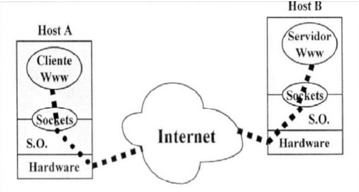

### Class `Socket`

[Class `Socket`](https://docs.oracle.com/en/java/javase/14/docs/api/java.base/java/net/Socket.html)

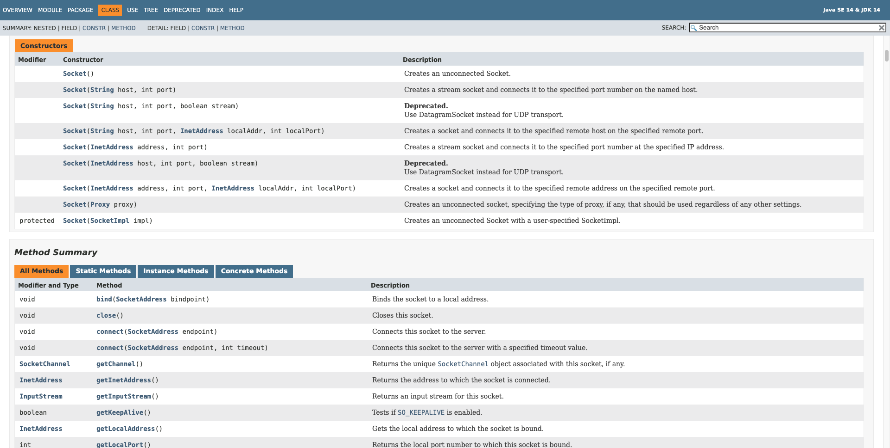

Tenemos el Constructor

`Socket(String host, int port)`
		
Crea un stream socket(socket de flujo) y lo conecta al host y número de puerto especificados.

Tenemos varios métodos en la clase `Socket`.

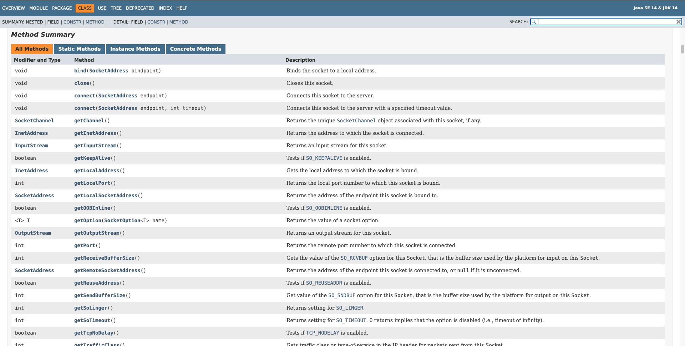

Siendo unos de los más utilizados:

* `InputStream	getInputStream()`
* `OutputStream	getOutputStream()`

Los Sockets están enfocados más a la misma aplicación, a una aplicación propietaria no tanto para un APIREST.

### :computer: `000-067_ejemplo_cliente_socket`

Esta es una aplicación muy sencilla donde creamos una aplicación cliente que trata de conectarse con la página `www.oracle.com` esperando la respuesta que nos mande.

*`Test`*

```java
package principal;

import java.io.BufferedReader;
import java.io.IOException;
import java.io.InputStream;
import java.io.InputStreamReader;
import java.net.Socket;
import java.net.UnknownHostException;

public class Test {

   public static void main(String[] args) {
      try {
         Socket sc= new Socket("www.oracle.com", 80);//80 Puerto Web
         InputStream is = sc.getInputStream();
         BufferedReader bf = new BufferedReader(new InputStreamReader(is));
			
         System.out.println("Conectando a Oracle...\n");
         String linea;
         while((linea=bf.readLine())!= null) {
            System.out.println(linea);
         }
         System.out.println("\nTermino Conección a Oracle");
         sc.close();
      } catch (UnknownHostException e) {
         e.printStackTrace();
      } catch (IOException e) {
         e.printStackTrace();
      }
   }
}
```

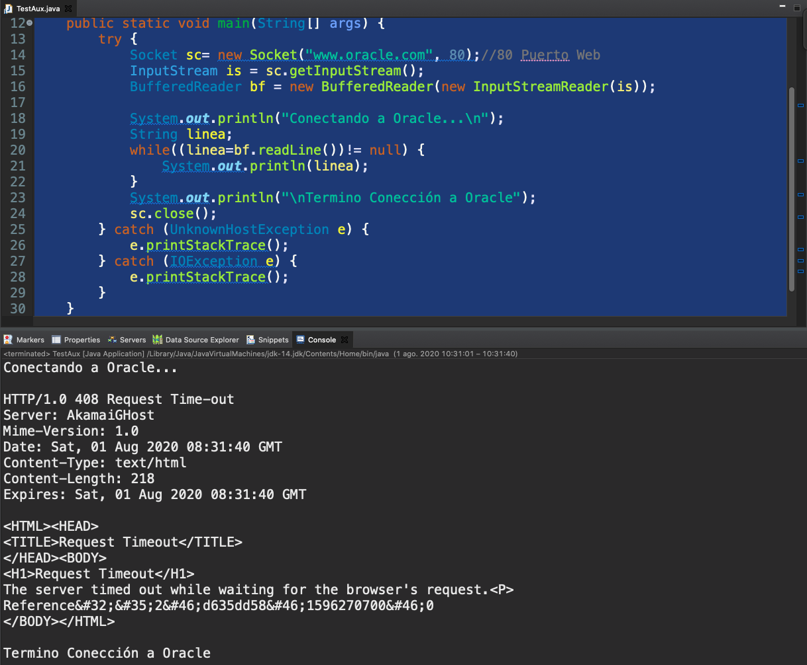

## Aplicación Servidor en Java

Clase [ServerSocket](https://docs.oracle.com/en/java/javase/14/docs/api/java.base/java/net/ServerSocket.html)

Constructores:

* `ServerSocket()` Crea un socket de servidor independiente.
* `ServerSocket(int port)` Crea un socket de servidor, vinculado al puerto especificado.
* `ServerSocket(int port, int backlog)` Crea un socket de servidor y lo vincula al número de puerto local especificado, con el retraso especificado.
* `ServerSocket(int port, int backlog, InetAddress bindAddr)` Cree un servidor con el puerto especificado, escuche el retraso y la dirección IP local para vincularse.
* `ServerSocket(SocketImpl impl)` Crea un socket de servidor con un SocketImpl especificado por el usuario.

Métodos:

* Socket `accept()` Escucha para que se establezca una conexión a este socket y la acepta.		

### REPASAR LAS SIGUIENTES CLASES

Usadas para pasar cadenas o para pasar objetos.

* [`PrintStream`](https://docs.oracle.com/en/java/javase/14/docs/api/java.base/java/io/PrintStream.html)
* [`BufferedReader`](https://docs.oracle.com/en/java/javase/14/docs/api/java.base/java/io/BufferedReader.html)
* [`InputStreamReader`](https://docs.oracle.com/en/java/javase/14/docs/api/java.base/java/io/InputStreamReader.html)
* [`[ObjectOutputStream`](https://docs.oracle.com/en/java/javase/14/docs/api/java.base/java/io/ObjectOutputStream.html)


### :computer: `000-068_ejemplo_comunicacion`


Aplicación que nos permite una interacción de un Cliente y el Servidor.
El cliente manda datos y el servidor los regresa.
Puedo enviar cadenas
Puedo enviar un objeto
Puedo enviar un objeto Persona
Serializar Persona.

**Esta es la aplicación final que ya manda objetos Persona, falta el paso previo donde se mandan cadenas, sería bueno hacer esta aplicación para ver las diferencias, hay pantallas capturadas para ver si se puede recrear el proyecto.**

*`Persona`*

```java
package model;

import java.io.Serializable;

public class Persona implements Serializable {

   private static final long serialVersionUID = 1L;
   private String nombre;
   private int edad;

   public Persona(String nombre, int edad) {
      super();
      this.nombre = nombre;
      this.edad = edad;
   }

   public String getNombre() {
      return nombre;
   }

   public void setNombre(String nombre) {
      this.nombre = nombre;
   }

   public int getEdad() {
      return edad;
   }

   public void setEdad(int edad) {
      this.edad = edad;
   }

}
```

*`ClienteSaludo`*

```java
package cliente;

import java.io.IOException;
import java.io.ObjectInputStream;
import java.io.PrintStream;
import java.net.Socket;

import model.Persona;

public class ClienteSaludo {

   public static void main(String[] args) {
      try (Socket sc = new Socket("localhost", 10000);) {

         PrintStream out = new PrintStream(sc.getOutputStream());
         out.println("profe");
         // BufferedReader bf = new BufferedReader(new
         // InputStreamReader(sc.getInputStream()));
         // Para leer Objetos
         ObjectInputStream ob = new ObjectInputStream(sc.getInputStream());
         Persona p = (Persona) ob.readObject();
         System.out.println("Soy " + p.getNombre() + " " + p.getEdad());

         // String dato = bf.readLine();
         // System.out.println("El servidor me envía: " + dato);

      } catch (IOException ex) {
         ex.printStackTrace();
      } catch (ClassNotFoundException e) {
         e.printStackTrace();
      }
   }
}
```

*`HiloAtencionCliente`*

```java
package servidor;

import java.io.BufferedReader;
import java.io.IOException;
import java.io.InputStreamReader;
import java.io.ObjectOutputStream;
import java.io.PrintStream;
import java.net.Socket;

import model.Persona;

public class HiloAtencionCliente implements Runnable {
	
   private Socket socket;
   public HiloAtencionCliente(Socket socket) {
      this.socket = socket;
   }

   @Override
   public void run() {
      try(ObjectOutputStream out= new ObjectOutputStream(socket.getOutputStream());
          BufferedReader bf = new BufferedReader(new InputStreamReader(socket.getInputStream()));){
         String nombre = bf.readLine();
	 Persona persona = new Persona (nombre, 30);
	 out.writeObject(persona);
	 //out.println("Saludo desde el servidor cliente " + nombre);
      }catch (IOException ex) {
         ex.printStackTrace();
      }finally {
         try {
            socket.close();
         }catch(IOException e) {
            e.printStackTrace();
         }
      }
   }
}
```

*`ServidorSaludo`*

```java
package servidor;

import java.io.IOException;
import java.net.ServerSocket;
import java.net.Socket;
import java.util.concurrent.ExecutorService;
import java.util.concurrent.Executors;

public class ServidorSaludo {

   public static void main(String[] args) {
      System.out.println("Esperando llamadas..."); 
      ExecutorService service = Executors.newCachedThreadPool();
      try(ServerSocket server = new ServerSocket(10000);){
	    	
         while(true) {
            Socket sc = server.accept();
            System.out.println("Llama recibida!");
            service.submit(new HiloAtencionCliente(sc));
         }
      }catch(IOException ex) {
         ex.printStackTrace();
      }
   }
}
```

Para ejecutar esta aplicación debemos realmente ejecutar dos aplicaciones es una, es decir por un lado ejecutamos el cliente y por otro lado ejecutamos el servidor. Si ejecutamos primero el cliente obtendremos el siguiente error.

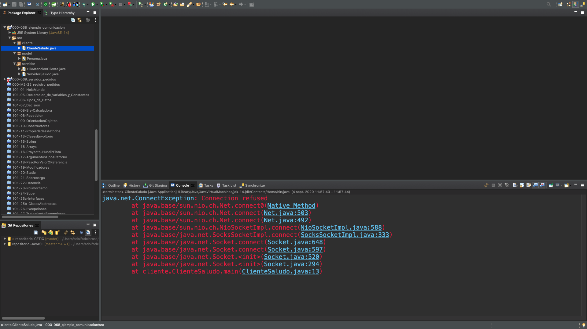

Ya que hace referencia el servidor, así que es necesario ejecutar el servidor primero.

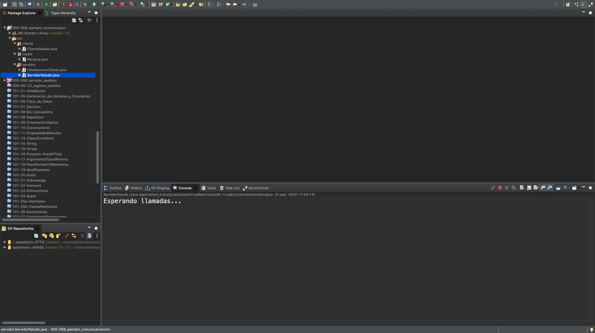

Y posteriormente el cliente.

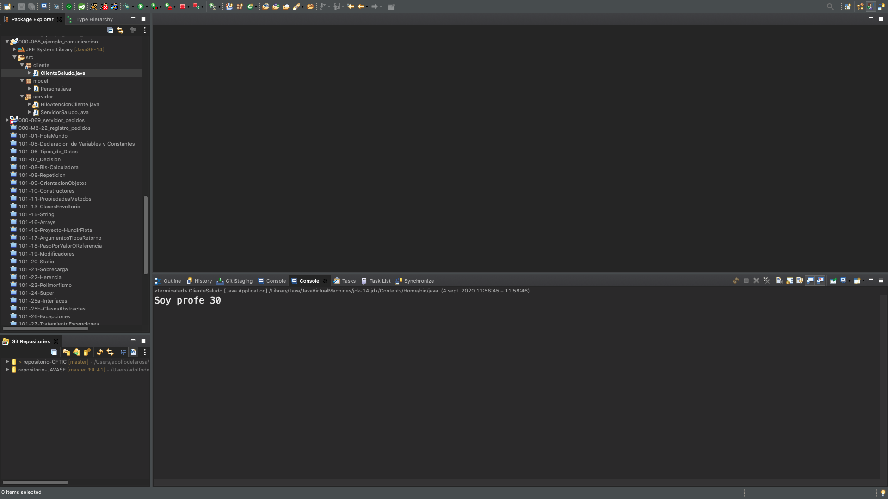

Observese que podemos tener abieras varias consolas y en cada una de ellas podemos ver la salida de los clientes y del servidor.

El cliente manda datos al servidor y el servidor los regresa. El cliente manda un nombre `profe` el servidor responde con un objeto Persona `Soy profe 30`.


### :computer: `000-069_servidor_pedidos` y `000-070_tienda_cliente`

En esta aplicación más compleja vamos a combinar varios elementos como Base de Datos, Sockets, etc. para crear una aplicación Cliente - Servidor donde vamos a tener varias tiendas que van a acceder al servidor y le van a solicitar los pedidos que hayan realizado solo se manda el nombre de la tienda para que los pueda recuperar en la BD.

Para empezar vamos a ver la estructura de la BD.

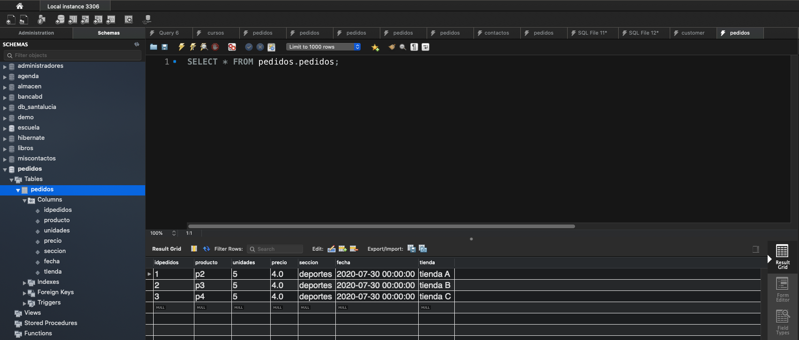

Vamos a tener dos proyectos diferentes uno para el Servidor y otro para el Cliente. Empecemos a ver la aplicación del Servidor.

### `000-069_servidor_pedidos`

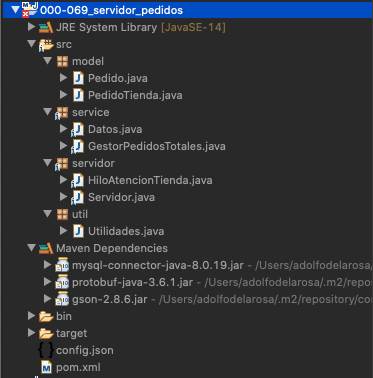

*Configuración*

*`pom.xml`*

```java
<project xmlns="http://maven.apache.org/POM/4.0.0"
	xmlns:xsi="http://www.w3.org/2001/XMLSchema-instance"
	xsi:schemaLocation="http://maven.apache.org/POM/4.0.0 https://maven.apache.org/xsd/maven-4.0.0.xsd">
	<modelVersion>4.0.0</modelVersion>
	<groupId>000-069_servidor_pedidos</groupId>
	<artifactId>000-069_servidor_pedidos</artifactId>
	<version>0.0.1-SNAPSHOT</version>
	<build>
		<sourceDirectory>src</sourceDirectory>
		<plugins>
			<plugin>
				<artifactId>maven-compiler-plugin</artifactId>
				<version>3.8.1</version>
				<configuration>
					<release>14</release>
				</configuration>
			</plugin>
		</plugins>
	</build>
	<dependencies>
		<!-- https://mvnrepository.com/artifact/mysql/mysql-connector-java -->
		<dependency>
			<groupId>mysql</groupId>
			<artifactId>mysql-connector-java</artifactId>
			<version>8.0.19</version>
		</dependency>
		<dependency>
			<groupId>com.google.code.gson</groupId>
			<artifactId>gson</artifactId>
			<version>2.8.6</version>
		</dependency>
	</dependencies>
</project>
```

*`config.json`*

```java
{
   "driver":"com.mysql.cj.jdbc.Driver",
   "cadenaConexion":"jdbc:mysql://localhost:3306/pedidos?serverTimezone=Europe/Madrid",
   "user":"root",
   "password":"root"
}
```

*Util*

*`Utilidades`*

```java
package util;

import java.text.SimpleDateFormat;
import java.util.Date;

public class Utilidades {
   public static String formatearFecha(Date fecha) {
      SimpleDateFormat sdf=new SimpleDateFormat("dd/MM/yyyy");
      return sdf.format(fecha);
   }
}
```

*Model*

*`Pedido`*

```java
package model;

import java.util.Date;

public class Pedido {

   private String producto;
   private int unidades;
   private double precio;
   private String seccion;
   private Date fecha;

   public Pedido(String producto, int unidades, double precioUnitario, String seccion, Date fecha) {
      super();
      this.producto = producto;
      this.unidades = unidades;
      this.precio = precioUnitario;
      this.seccion = seccion;
      this.fecha = fecha;
   }

   public String getProducto() {
      return producto;
   }

   public void setProducto(String producto) {
      this.producto = producto;
   }

   public int getUnidades() {
      return unidades;
   }

   public void setUnidades(int unidades) {
      this.unidades = unidades;
   }

   public double getPrecio() {
      return precio;
   }

   public void setPrecio(double precio) {
      this.precio = precio;
   }

   public String getSeccion() {
      return seccion;
   }

   public void setSeccion(String seccion) {
      this.seccion = seccion;
   }

   public Date getFecha() {
      return fecha;
   }

   public void setFecha(Date fecha) {
      this.fecha = fecha;
   }
}
```

*`PedidoTienda`*

```java
package model;

import java.util.Date;

public class PedidoTienda extends Pedido {
	
   private String tienda;

   public PedidoTienda(String producto, int unidades, double precio, String seccion, Date fecha, String tienda) {
      super(producto, unidades, precio, seccion, fecha);
      this.tienda = tienda;
   }

   public String getTienda() {
      return tienda;
   }

   public void setTienda(String tienda) {
      this.tienda = tienda;
   }
}
```

*Service*

*`Datos`*

```java
package service;

import java.io.FileNotFoundException;
import java.io.FileReader;
import java.sql.Connection;
import java.sql.DriverManager;
import java.sql.SQLException;

import com.google.gson.JsonIOException;
import com.google.gson.JsonObject;
import com.google.gson.JsonParser;
import com.google.gson.JsonSyntaxException;

public class Datos  {
   static String driver;
   static String cadenaConexion;
   static String user;
   static String password;
   static String FILE="config.json";
   static {
      //carga del driver
      try {
         cargarPropiedades();
         Class.forName(driver);
      } catch (ClassNotFoundException e) {
         e.printStackTrace();
      } catch (JsonIOException e) {	
         e.printStackTrace();
      } catch (JsonSyntaxException e) {
         e.printStackTrace();
      } catch (FileNotFoundException e) {
         e.printStackTrace();
      }
   }
	
   public static Connection getConnection() throws SQLException {
      return DriverManager.getConnection(cadenaConexion, user, password);
   }

   private static void cargarPropiedades() throws JsonIOException, JsonSyntaxException, FileNotFoundException {
      JsonObject conn = JsonParser.parseReader(new FileReader(FILE)).getAsJsonObject();
      driver 	      = conn.get("driver").getAsString();
      cadenaConexion  = conn.get("cadenaConexion").getAsString();
      user 	      = conn.get("user").getAsString();
      password 	      = conn.get("password").getAsString();
   }
   
}
```

*`GestorPedidosTotales`*

```java
package service;

import java.sql.Connection;
import java.sql.PreparedStatement;
import java.sql.ResultSet;
import java.sql.SQLException;
import java.util.ArrayList;
import java.util.List;

import model.PedidoTienda;

public class GestorPedidosTotales {
	
   public List<PedidoTienda> recuperarPedidos(String tienda) {
      List<PedidoTienda> pedidos=new ArrayList<PedidoTienda>();
      
      try (Connection con = Datos.getConnection()) {
			
         String sql = "SELECT * FROM pedidos WHERE tienda = ?";
			
	 PreparedStatement st = con.prepareStatement(sql);	
	 // El primer campo representa siempre la tienda
	 st.setString(1, tienda);
	 ResultSet rs=st.executeQuery();
	 		
	 while(rs.next()) {				
	    pedidos.add(new PedidoTienda(rs.getString("producto"),
					 rs.getInt("unidades"),
					 rs.getDouble("precio"),
					 rs.getString("seccion"),
					 rs.getDate("fecha"),
					 tienda
		       ));
	 }
	 
      } catch (SQLException e) {
         e.printStackTrace();
      }
      
      return pedidos;
      
   }
}
```

*Servidor*

*`HiloAtencionTienda`*

```java
package servidor;

import java.io.BufferedReader;
import java.io.IOException;
import java.io.InputStreamReader;
import java.io.PrintStream;
import java.net.Socket;
import java.util.List;

import model.PedidoTienda;
import service.GestorPedidosTotales;
import util.Utilidades;

public class HiloAtencionTienda implements Runnable {
	
   private Socket socket;
	
   public HiloAtencionTienda(Socket socket) {
      this.socket=socket;
   }
	
   @Override
   public void run() {
      try(PrintStream out=new PrintStream(socket.getOutputStream());
          BufferedReader bf=new BufferedReader(new InputStreamReader(socket.getInputStream()));) {
         // Leemos la información enviada por el cliente
         String tienda=bf.readLine();
         GestorPedidosTotales gestor=new GestorPedidosTotales();
         List<PedidoTienda> pedidos=gestor.recuperarPedidos(tienda);
         // Recorremos los pedidos y mandamos uno a uno como cadena
         // o generamos un json con los pedidos y lo mandamos como cadena
         StringBuilder totales=new StringBuilder();
         pedidos.forEach(p->
                           {
				totales.append(p.getProducto()+"|");
				totales.append(p.getUnidades()+"|");
				totales.append(p.getPrecio()+"|");
				totales.append(p.getSeccion()+"|");
				totales.append(Utilidades.formatearFecha(p.getFecha()));
				totales.append(System.lineSeparator());
                           });
         out.println(totales.toString());		
      }	catch(IOException ex) {
	 ex.printStackTrace();
      } finally {
         try {
            socket.close();
         } catch (IOException e) {
            e.printStackTrace();
         }
      }
   }
}
```

*`Servidor`*

```java
package servidor;

import java.io.IOException;
import java.net.ServerSocket;
import java.net.Socket;
import java.util.concurrent.ExecutorService;
import java.util.concurrent.Executors;

public class Servidor {

   public static void main(String[] args) {
      System.out.println("Esperando llamadas..."); 
      
      ExecutorService service = Executors.newCachedThreadPool();
      
      try(ServerSocket server = new ServerSocket(10000);){
      
         while(true) {
            Socket sc = server.accept();
            System.out.println("Llama recibida!");
            service.submit(new HiloAtencionTienda(sc));
         }
	 
      }catch(IOException ex) {
         ex.printStackTrace();
      }
   }
   
}
```

`000-070_tienda_cliente`

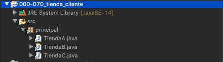

*`TiendaA`*

```java
package principal;

import java.io.BufferedReader;
import java.io.IOException;
import java.io.InputStreamReader;
import java.io.PrintStream;
import java.net.Socket;

public class TiendaA {

   public static void main(String[] args) {
		
      try(Socket sc=new Socket("localhost",10000);
         PrintStream out=new PrintStream(sc.getOutputStream());
         BufferedReader bf=new BufferedReader(new InputStreamReader(sc.getInputStream()));){
         System.out.println("Tienda A");
         out.println("tienda A");
         String linea;
         while((linea=bf.readLine())!=null) {
            System.out.println(linea);
         }			
      } catch(IOException ex) {
         ex.printStackTrace();
      }
		
   }
}
```


*`TiendaB`*

```java
package principal;

import java.io.BufferedReader;
import java.io.IOException;
import java.io.InputStreamReader;
import java.io.PrintStream;
import java.net.Socket;

public class TiendaB {

   public static void main(String[] args) {
		
      try(Socket sc=new Socket("localhost",10000);
         PrintStream out=new PrintStream(sc.getOutputStream());
         BufferedReader bf=new BufferedReader(new InputStreamReader(sc.getInputStream()));){
         System.out.println("Tienda B");
         out.println("tienda B");
         String linea;
         while((linea=bf.readLine())!=null) {
            System.out.println(linea);
         }			
      } catch(IOException ex) {
         ex.printStackTrace();
      }
		
   }
}
```

*`TiendaC`*

```java
package principal;

import java.io.BufferedReader;
import java.io.IOException;
import java.io.InputStreamReader;
import java.io.PrintStream;
import java.net.Socket;

public class TiendaC {

   public static void main(String[] args) {
		
      try(Socket sc=new Socket("localhost",10000);
         PrintStream out=new PrintStream(sc.getOutputStream());
         BufferedReader bf=new BufferedReader(new InputStreamReader(sc.getInputStream()));){
         System.out.println("Tienda C");
         out.println("tienda C");
         String linea;
         while((linea=bf.readLine())!=null) {
            System.out.println(linea);
         }			
      } catch(IOException ex) {
         ex.printStackTrace();
      }
		
   }
}
```


Para ejecutar la aplicación primero ejecutamos la aplicación del Servidor y posteriormente ejecutamos cualquiera de las clases de la aplicación del cliente, la salida que obtenemos es la siguiente:

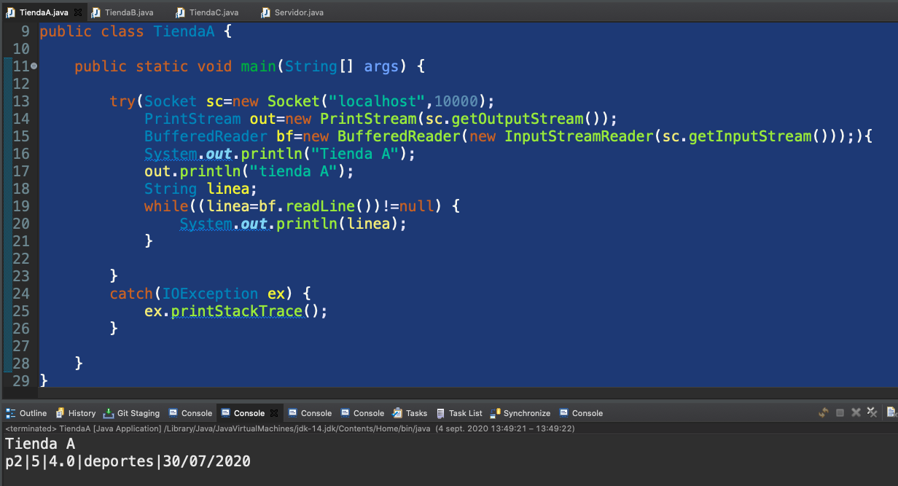

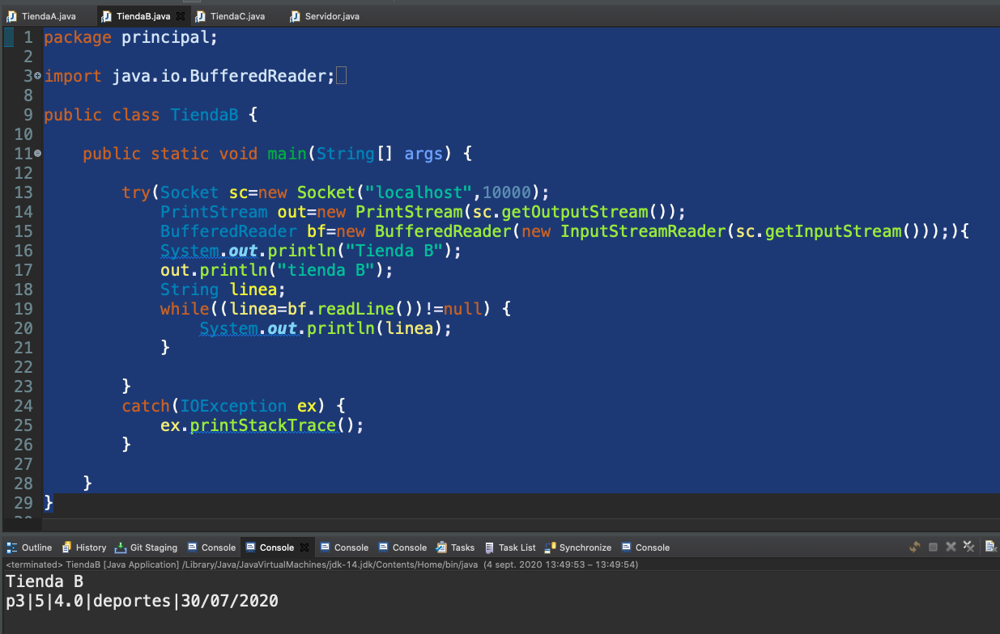

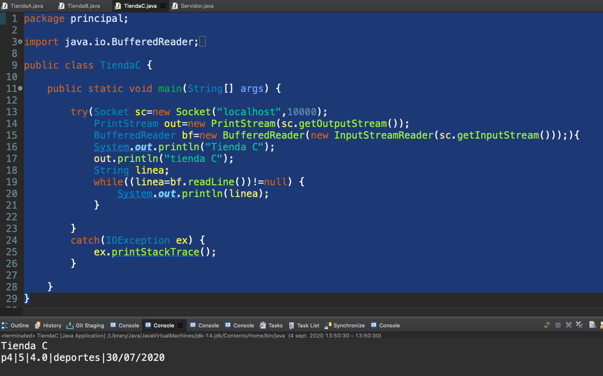

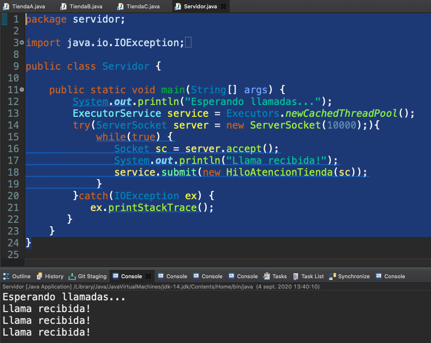

