# 4. Manipulación y tratamiento de datos 77m
   * 14 Conoce Java API Docs 9:57 
   * 15 Uso de la clase String 13:03 
   * 16 Manejo de Arrays 23:09 
   * Práctica: Creando el juego de hundir la flota 31:16 
   * Contenido adicional 4
   
# 14. Conoce Java API Docs 9:57 

[Conoce Java API Docs-1](pdfs/14_Conoce_JAVA_API_DOCS-1.pdf)

## Resumen Profesor

Conoce más Java y descubre la documentación de Java para ver todos los paquetes y clases que contiene Java.

## Transcripción


Comenzamos un nuevo capítulo sobre manipulación y tratamiento de datos y lo primero que vamos a hacer es conocer un poco más Java y es que habíamos dicho antes que Java aparte de un lenguaje de programación y una plataforma sobre la cual ejecutar nuestro programa, era una inmensa ingente cantidad de código puesta nuestra disposición para tratar un montón de situaciones ya conocidas.


Java pone a nuestra disposición un montón de clases, en particular Java SE incluyendo más de 4000 clases en su versión 8, la versión de Java SE, esas 4000 clases las podemos utilizar con total tranquilidad.


Esto requeriría un gran esfuerzo por nuestra parte el que nos sentáramos y estudiáramos para qué sirve cada una de esas cuatro mi clases, viéramos cuáles son los métodos de cada una de ellas, cuáles son sus atributos, si son públicos o son privados. 


No desesperemos porque Java pone también a nuestra disposición una documentación conocida como el API JAVA DOCS o se le llame directamente API. 

Cada versión de Java tiene publicada esta ayuda, este API JAVA DOCS, lo tiene publicado en la web, lo podemos consultar en particulares el de la versión 8 es:

https://docs.oracle.com/javase/8/docs/api/

A través de este enlace podemos visitar la web.


Lo primero que se nos presenta es una pantalla dividida en diferentes frames, en el que podemos ver una lista con todos y cada uno de los paquetes que nos ofrece Java que no son pocos, un listado de todas las clases, de las 4000 y pico que tiene independientemente del paquete en el que estén y una presentación en este caso más específica de los distintos paquetes que tiene y cuál es el cometido de cada uno de ellos. Por ejemplo el paquete `java.sql` probé el API necesario, de los métodos necesarios, de las clases necesarias, para acceder y procesar datos almacenados en un origen de datos normalmente una base de datos relacional, usando Java o por ejemplo la `java.nio` nos permite manejar contenedores de datos, buffers y una manera nueva de acceder a ficheros y otros orígenes de datos. 

El paquete `java.math` no ofreces clases matemáticas, si pinchamos en un paquete nos llevará directamente al contenido de ese paquete.


Dentro de él podemos ver el sumario de clases y de enumeraciones que no son más que un conjunto cerrado de valores, podemos encontrar una descripción del paquete donde nos hablará pues algo sobre las diferentes clases, si ya están dentro del paquete pincharamos en el nombre de una clase nos llevará a la información sobre esa clase. 

Si quería comentaros que podemos eliminar estos Frames de la izquierda si nos resultan incómodos, dándole a la versión de "NO FRAMES".


Dónde ya nos mostraría directamente solo la información del paquete Java.

Si quisieramos ver para qué sirve la clase `BigInteger` por ejemplo, ya nos da aquí una primera descripción donde nos dice que es una **clase inmutable** es decir, que cuando construyamos un objeto no va a poder ser modificado, si no lo que hace es que podemos tener otro, para guardar enteros de precisión arbitraria es decir enteros todo lo grande que nosotros queramos.


Si entramos en partícular en una clase concreta como es en el caso de `BigInteger` nos va a hablar de la clase, de la jerarquia de clases de las cuales hereda, interfaces que implementa, nos da una serie de documentación sobre la clase este apartado de documentación hay parte donde es más extenso y menos extenso, nos dice por ejemplo que un valor `BigInteger` puede estar sobre todo en este rango `1 to 2 a la  500000000 potencia` siempre que sea positivo es suficientemente grande y más adelante nos indica los atributos que tiene, los constructores y un resumen de los métodos, para cada uno de ellos incluso podríamos pulsar, la clase `BigInteger` en particular tiene una serie de campos, en este caso son un poco especiales porque son de su mismo tipo y no indican determinados valores concreto ONE, TEN, ZERO valores constantes `BigInteger`. Los distintos constructores a partir de un valor en una sucesión de byte a partir de una representación en una cadena de caracteres. Una cantidad de métodos que no podríamos recordar de memoria, ya no de una sola clase, si no más de una clase sería imposible que recordáramos todos los métodos, no hace falta porque los ponemos consultar aquí, si queremos saber en particular lo que hace un método, por ejemplo el método AND damos click en el y nos lleva a una descripción de el.


Donde nos diría la firma del método, es decir el tipo de dato de retorno, el modificador de acceso, el tipo de dato de retorno, el modificador de acceso, el nombre del método, los argumentos que reciben, para qué sirve, la identificación de los distintos parámetros, lo que devuelve el método. Ademas tenemos los diferentes métodos para poder verlos con una descripción totalmente exhaustiva de lo que realizan como por ejemplo el método `isProbablePrime` que devuelve un método que es probablemente un número primo con un grado de certeza explica como trabajar con este método. Existen otra serie de métodos.

Tenemos un montón de paquetes diferentes para usar por ejemplo hemos usado la clase `String` que se cargaba en el paquete `java.lang` el cual tiene varias clases entre ellas `String`.


Nos da una ayuda de como instanciar una clase, de cómo utilizarla, una explicación de algunas clases que tienen asociación con ella, los constructores, una serie de método, etc. 

Cómo podemos comprobar este sistema de ayuda se vuelve indispensable para nosotros, si queremos poco a poco ir aprendiendo toda la variedad de clases, de paquetes, que esta nos ofrece y los métodos que utiliza. 

Esta ayuda que tenemos aquí es la que Eclipse cuando dentro del IDE nos posicionamos sobre alguna clase Java, lo único que hace es consultar el API.

De esta manera iremos conociendo poco a poco todas las clases que ofrece Java y todas sus posibilidades.

# 15. Uso de la clase String 13:03 

[Uso de la clase String](pdfs/15_Uso_de_la_clase_String.pdf)

## Resumen Profesor

### 15.1 Creación de Strings

La forma más fácil de crear una cadena de caracteres es a partir de un literal con dobles comillas

```java
String saludo = "Hola Mundo";
```

Los literales de cadenas de caracteres son compilados por Java como un objeto `String`.

Como comprobaremos más adelante, Java ofrece un tipo de sucesión o colección de elementos de un tipo llamado array. Un array de caracteres también podría representar una cadena de caracteres, pero para nosotros será menos versátil.

**IMPORTANTE**: *La clase `String` es inmutable, es decir, que una vez creada, su valor no se puede modificar. Todas las operaciones que realicemos con objetos de este tipo darán como resultado un nuevo objeto, no la modificación del actual.*

### 15.2 Concatenación

Concatenar dos cadenas es poner una cadena a continuación de la otra. Lo podemos hacer de varias formas:

* operador `+`: es la forma más cómoda: `"Cadena " + "concatenada"`.

* método `.concat(...)`: otra forma de hacerlo: `"Mi nombre es ".concat("Pepe")`.

### 15.3 Longitud, mayúsculas y minúsculas

Podemos obtener el número de caracteres de un `String` mediante el método `.length()`.

```java
String saludo = "Hola Mundo!";
System.out.println(saludo.length()); //Debe imprimir 11
```

Podemos pasar toda la cadena a minúsculas con `toLowerCase()`, o a mayúsculas con `toUpperCase()`.

### 15.4 Creación de cadenas formateadas

En ocasiones, podemos querer crear una cadena de caracteres concatenando varios literales de cadena, con otra serie de valores. En estos casos, puede resultar tedioso hacerlo:

```java
  String nombre = "Pepe";
  String apellidos = "Pérez";
  String mensaje = "¿qué tal estás?";
  System.out.println("Hola, soy " + nombre + " " + apellidos + ", y quiero saludarte diciéndote " + mensaje);
```

Para casos así, podemos usar el método `format`, que nos permite utilizar *variables* dentro de la cadena de formato, que serán sustituidos por valores.

* `%s`: será sustituido por una cadena de caracteres.

* `%f`: será sustituido por un número decimal.
* ...

El ejemplo anterior quedaría:

```java
  String nombre = "Pepe";
  String apellidos = "Pérez";
  String mensaje = "¿qué tal estás?";
  String str = String.format("Hola, soy %s %s y quiero saludarte diciéndote %s", nombre, apellidos, mensaje);
  System.out.println(str);
}
```

### 15.5 Comparaciones de cadenas y fragmentos de cadenas

La clase `String` nos proporciona muchos métodos para comparar cadenas y fragmentos de cadenas:

* `endsWith`, para comparar si una cadena termina igual que un sufijo proporcionado.

* `startsWith`, para comparar si una cadena comienza igual que un prefijo proporcionado.

* `compareTo`, para comparar una cadena con otra. Devuelve 0 si son iguales, `< 0` si es menor, y `> 0` si es mayor (lexicográficamente hablando).

* `equalsIgnoreCase`, para comparar dos cadenas ignorando si están en mayúsculas o minúsculas.

* `matches`, para comparar si una cadena cumple con una expresión regular.

* `contains`, para comparar si una cadena está contenida en otra.

## Transcripción


En esta lección vamos a aprender a usar la clase `String`, una clase que ya hemos utilizado antes a través de literales encerrado entre comillas doble o de referencias que hemos creado a través de esas literales. Vamos a ver cómo trabajar con esa clase. 


Un literal encerrada entre comillas dobles genera para Java un `String` y podemos almacenar el valor de ese literal en una referencia de tipo `String`, **los `String` son inmutables** estó es muy importante que lo tengamos presente, toda operación que hagamos sobre un `String` no modifica ese `String`, es imposible modificarlo por qué son inmutables, sin embargo si intentamos modificarlo lo que va a suceder es que va a generarse un `String` nuevo con estas modificaciones hechas, es altamente eficiente y casi al final del curso aprenderemos a utilizar otras clases que nos permiten trabajar con cadenas que si somos conscientes de que van a ser modificadas muchas veces nos van a permitir el tratamiento de essas cadenas de una manera más eficiente. Ahora nosotros trabajaremos con `String` que va a darnos respuesta suficiente a lo que nosotros necesitamos por ahora.


Una operación muy habitual entre `String` es la concatenación de dos `String`. Concatenar es yuxtaponer, es decir colocar a continuación de de una cadena otra cadena, se puede hacer mediante el método `concat`  o también se puede hacerse con el operador `+` que suele ser la forma más habitual porque es muy cómoda, pero que sepamos que también tenemos el método `concat`.


También podemos querer saber la longitud de una cadena de caracteres, que no es más que el número de caracteres que lo conforman, a la hora de contar esos caracteres cuenta espacio en blanco, incluso si están al principio o al final de la cadena, tabuladores que también los podemos incluir, signos de puntuación, toda esa serie de caracteres que podríamos llamar raros, no son letras ni números también contarían, se puede hacer a través del método `length()`, el método `length()` para una instancia de `String` nos va a permitir conocer el número de caracteres que tiene. 


Una operación muy habitual que vamos a querer hacer con cadenas de caracteres es el pasarlo a mayúsculas o a minúsculas o también su formateo, vamos a poder verlo en los ejemplos que tenemos a continuación.

### :computer: `101-15-String`

*`EjemplosString`*

```java
package string;

public class EjemplosString {
   public static void main(String[] args) {

      // CONCATENAR
      String nombre = "Mi nombre es ".concat("Pepe");
      String nombre2 = "Mi nombre es " + "Pepe";
      System.out.println(nombre);
      System.out.println(nombre2);

      // MAYÚSCULAS-MINÚSCULAS
//    String cadena = "En un lugar de La Mancha";
//    System.out.println(cadena);
//    System.out.println(cadena.toLowerCase());
//    System.out.println(cadena.toUpperCase());
      // cadena.

      // STRING FORMAT

//    String nombre = "Pepe";
//    String apellidos = "Pérez";
//    String mensaje = "¿qué tal estás?";
//    System.out.println("Hola, soy " + nombre + " " + apellidos + ", y quiero saludarte diciéndote " + mensaje);

//    String nombre = "Pepe";
//    String apellidos = "Pérez";
//    String mensaje = "¿qué tal estás?";
//    //String str = String.format("Hola, soy %s %s y quiero saludarte diciéndote %s", nombre, apellidos, mensaje);
//    //System.out.println(str);
//    System.out.printf("Hola, soy %s %s y quiero saludarte diciéndote %s", nombre, apellidos, mensaje);

      // MÉTODOS DE COMPARACIÓN
//    String quijote = "En un lugar de La Mancha";
//
//    System.out.println(quijote.endsWith("La Mancha"));
//    System.out.println(quijote.startsWith("En un lugar"));
//    System.out.println(quijote.contains("lugar"));

   }
}
```

Vamos a hacer primero la concatenación de dos cadenas de caracteres, la concatenación como hemos visto la podemos hacer con el operador `+` o la podemos hacer con el método `concat` 

```java
// CONCATENAR
String nombre = "Mi nombre es ".concat("Pepe");
String nombre2 = "Mi nombre es " + "Pepe";
System.out.println(nombre);
System.out.println(nombre2);
```

`concat` nos permite concatenar la cadena `"Mi nombre es "` a esta otra `"Pepe"`, utilizo esta sintaxis para que la conozcamos y sepamos reconocer que un literal encerrado entre comillas doble implica una instancia de `String` tanto es así que este valor literal nos permite llamar a métodos en este caso a `concat` esto devolvería `Mi nombre es Pepe` almacenado en `nombre` de la misma manera que lo hacemos con `nombre2` con el operador `+`.

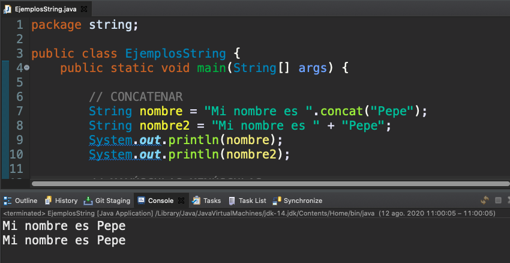

Para pasar a mayúscula y minúscula tenemos los métodos `toUpperCase()` y `toLowerCase()` que nos van a permitir transformar toda una cadena de caracteres en mayúscula y en minúscula.

```java
// MAYÚSCULAS-MINÚSCULAS
String cadena = "En un lugar de La Mancha";
System.out.println(cadena);
System.out.println(cadena.toLowerCase());
System.out.println(cadena.toUpperCase());
```

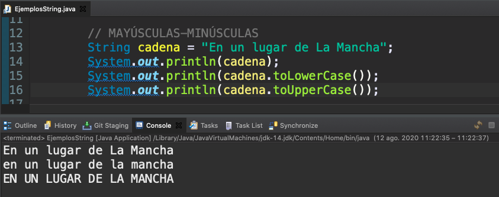

Si no nos acordamos muy bien de un método podemos usar la ayuda debemos escribir el nombre de una referencia un punto y no aparecerá a continuación todos los métodos que podríamos usar.

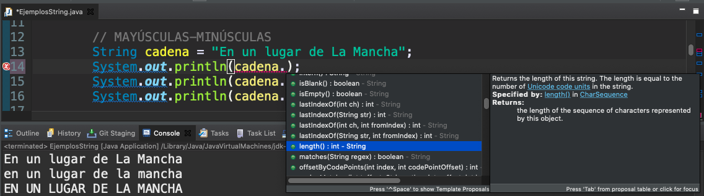


Vamos a hablar del formateo de cadenas de caracteres.


```java
// STRING FORMAT

String nombre = "Pepe";
String apellidos = "Pérez";
String mensaje = "¿qué tal estás?";
System.out.println("Hola, soy " + nombre + " " + apellidos + ", y quiero saludarte diciéndote " + mensaje);
```

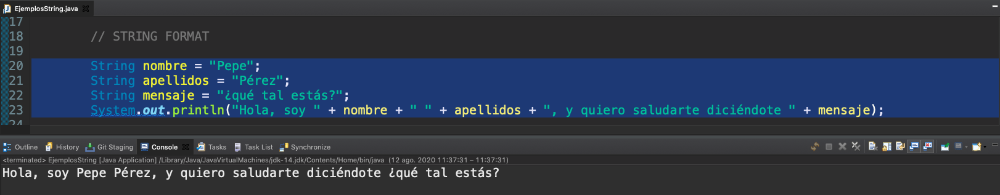

En este ejemplo usamos el operador `+` para concatenar las cadenas y realizar una especie de formato de salida, pero está cadena montada con concatenación se vuelve algo tediosa.

Hay un método en particular el método `format()` que nos va permitir construir cadenas de caracteres para las cuales vamos a utilizar una especie de plantilla y luego en esa plantilla vamos a definir el espacio que vamos a sustituir por determinados valores de variable o de literal por ejemplo, si quisiéramos hacer la cadena hola soy y meter ahí en medio un nombre y uno apellido y a continuación continuar con el literal y quiero saludarte diciéndote y a continuación meter un mensaje, la concatenación de esto sería un poco tedioso, podríamos crear mediante un solo golpe el literal, "hola soy y quiero saludarte diciéndote..." y dejar unos huecos especiales, los que posteriormente sustituir cada uno de esos huecos por un valor de una variable, esos huecos se definen a través de tanto por ciento y un carácter, son los conocidos como **especificadores de formato**, `%s` lo que indica que lo que se va a sustituir es una cadena de caracteres, podríamos utilizar otro como por ejemplo `%d` para números,  `%f` para números con decimales, `%n` nos añadirá un salto de línea, pero en particular ahora para los caracteres podríamos usar `%s`, cómo podemos comprobar el método `format()` además recibe después un número variable de argumentos para incrustar los valores de los huecos, esperara que nosotros le proporcionemos separado por coma esos valores.

```java
String nombre = "Pepe";
String apellidos = "Pérez";
String mensaje = "¿qué tal estás?";
String str = String.format("Hola, soy %s %s y quiero saludarte diciéndote %s", nombre, apellidos, mensaje);
System.out.println(str);
```

Aquí usamos el método `format` de la clase `String`, formamos primero el formato del `String` y despúes lo imprimimos.
 
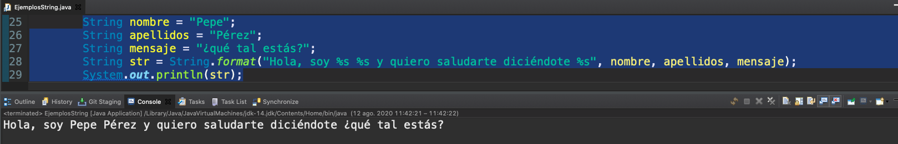

Lo anterior que haciamos en dos pasos lo podemos hacer en uno solo con el método `System.out.printf` que nos va a permitir directamente imprimir a la consola 8aun que no siempre es lo que queramos hacer por eso esta `String.format`).

```java
String nombre = "Pepe";
String apellidos = "Pérez";
String mensaje = "¿qué tal estás?";
//String str = String.format("Hola, soy %s %s y quiero saludarte diciéndote %s", nombre, apellidos, mensaje);
//System.out.println(str);
System.out.printf("Hola, soy %s %s y quiero saludarte diciéndote %s", nombre, apellidos, mensaje);
```

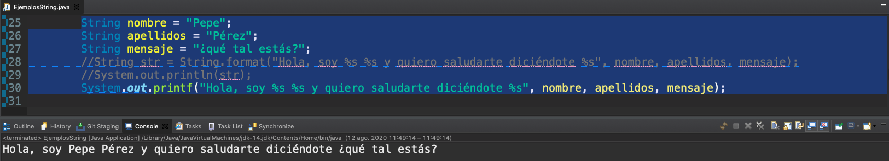


Otra de las operaciones que comúnmente se suele hacer con cadenas de caracteres es la comparación entre ella y vamos a comprobar como Java proverte múltiple métodos para comparar dos cadenas de caracteres.

Si hacedemos a la ayuda del API https://docs.oracle.com/javase/8/docs/api/java/lang/String.html 

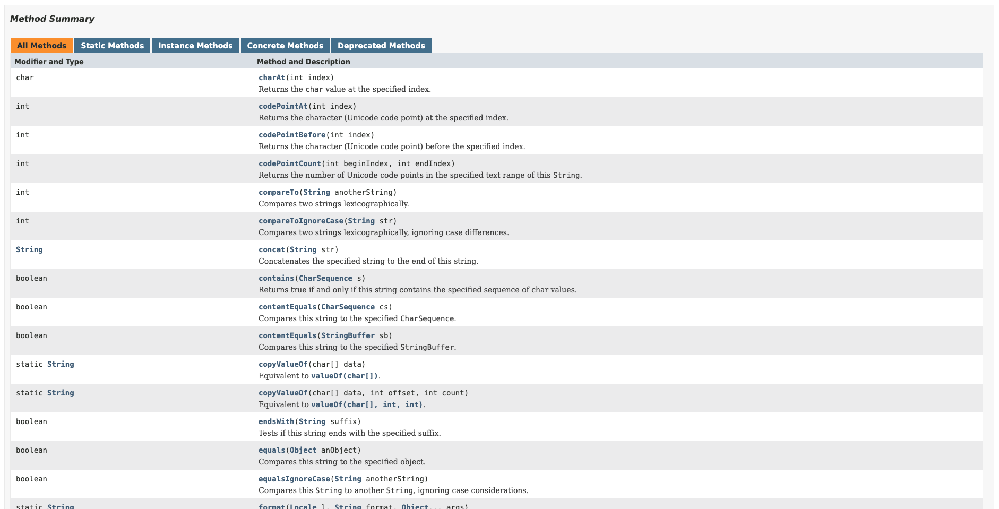

En `String` tenemos un montón de métodos de comparación, el más básico de todos es el método `compareTo(String anotherString)` que compara dos cadenas de caracteres mediante el orden *lexicografico*, este orden tan rimbombante no es más que el orden alfabético que conocemos. Podemos ver el contenido del método `compareTo(String anotherString)`.

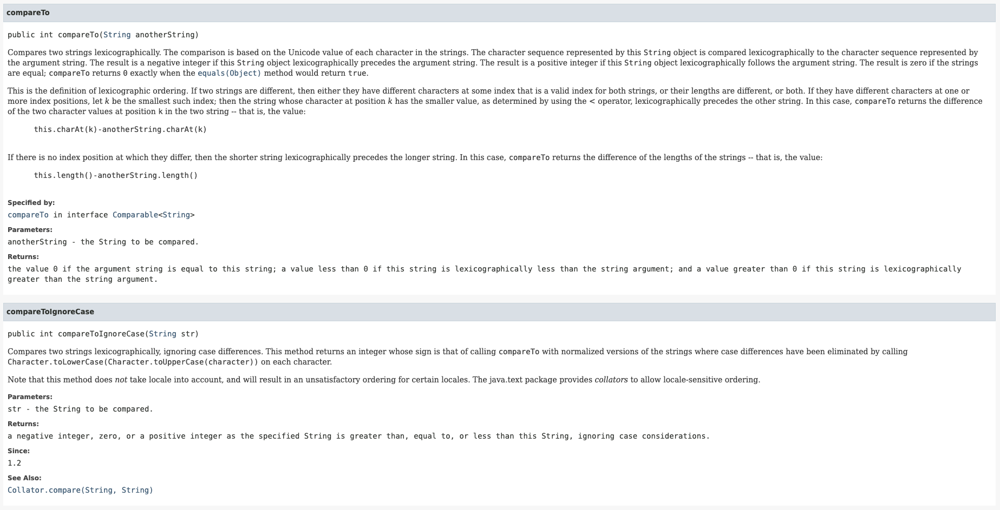

Lo que hace es que devuelve un valor menor que 0 si la cadena de la izquierda del operador es menor que la otra cadena, 0 si son iguales y mayor que 0 si es mayor. 

Tenemos también su método hermano `compareToIgnoreCase` que lo que hace es pasar las dos cadenas de caracteres a minúscula o mayúscula para hacer la comparación ignorando que hay mayúscula o minúscula y luego tenemos otra serie de métodos cómo poder comprobar si un fragmento de cadena está dentro de otra con `contains(CharSequence s)` si el contenido de una cadena es igual a otra `equals(Object anObject)` tenemos todos esos métodos, entre otros que ya digo que son interesantes, vamos a ver algunos ejemplos.

```java
// MÉTODOS DE COMPARACIÓN
String quijote = "En un lugar de La Mancha";

System.out.println(quijote.endsWith("La Mancha"));
System.out.println(quijote.startsWith("En un lugar"));
System.out.println(quijote.contains("lugar"));
```

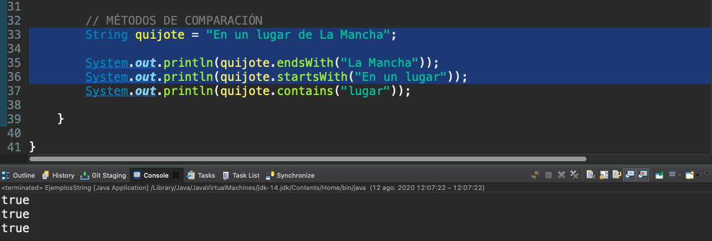

Como métodos más útiles podemos destacar estos tres `endsWith` nos va a devolver verdadero si la cadena de caracteres que le pasamos como argumento es el final de la cadena de caracteres sobre la que estamos llamando al método, análogamente tenemos `startsWith` que nos devolverá verdadero si la cadena de caracteres sobre la cual estamos llamando al método comienza con la que le proporcionamos como argumento y `contains` lo que hace es buscar en medio de la cadena de caracteres para indicar si contiene esa secuencia de caracteres.

Yo ánimo a que tratéis de ir conociendo poco a poco los métodos que tiene `String` que son muchos, imposible conocerlos todos de una vez, que si es necesario consultar la ayuda.

# 16. Manejo de Arrays 23:09 

[Manejo de Arrays](pdfs/16_Arrays.pdf)

## Resumen Profesor

### 16.1 Arrays

Un array es un contenedor de elementos de un mismo tipo, con un tamaño fijo que hay que conocer a la hora de crearlo. A la hora de recorrerlo, las posiciones comienzan a contar en cero.

### 16.2 Creación de un array

Usamos el operador `new`, y tenemos que conocer el tipo de dato y el tamaño:

```java
int[] unArray = new int[10];
```

### 16.3 Acceso de lectura y escritura

El operador `[ ]` nos permite acceder a las posiciones de un array, para leer su valor, o también para modificarlo.

Para asignar un valor, usaremos el operador corchete a la izquierda de una operación de asignación:

```java
unArray[1] = 100;
```

Para leer un valor, lo utilizaremos en operaciones como un `println`:

```java
System.out.println(unArray[1]);
```

### 16.4 Inicialización de un array

Tenemos varias formas de hacerlo:

1. Manualmente, asignando cada una de las posiciones

2. Manualmente, pero utilizando un bucle para iterar por las posiciones (simpre que la lógica del programa lo permita).

3. Atajo con la sintaxis `{ }`.

### 16.5 Reocorrido de un array

Todo array tiene una propiedad pública, `length`, que son permite consultar su número de elementos. Utilizándola, podemos usar un bucle para recorrer un array:

```java
for(int i = 0; i < unArray.length; i++) {
     System.out.println(unArray[i]);
}
```

También podemos utilizar un bucle for-each, que nos permite extraer elemento a elemento, sin necesidad de conocer a priori su longitud:

```java
for(int i : unArray) {
     System.out.println(i);
}
```

### 16.6 Arrays de objetos

No solamente podemos crear arrays de tipos primitivos, sino que también lo podemos hacer de instancias de alguna clase que hayamos definido previamente.

```java
Persona[] unArray = new Persona[10];
//...
unArray[1] = new Persona(…);
```

### 16.7 Arrays multidimensionales

Podemos crear arrays que tengan más de una dimensión. Tan solo tenemos que añadir otra pareja de corchetes.

```java
int[][] biArray = new int[10][20];
biArray[3][4] = 78;
```

Para recorrerlos necesitaremos *anidar* otro bucle for:

```java
for(int i = 0; i < biArray.length; i++) {
   for(int j = 0; i < biArray[0].length; j++) {
     System.out.println(unArray[i][j]);
   }
}
```

### 16.8 Manipulación de arrays

Java nos provee de una clase, `java.util.Arrays`, que posee una serie de métodos para realizar operaciones rápidas con arrays. Entre otros:

* `sort(...)`: nos permite ordenar los elementos de un arrays

* `copyOf(...)`: nos permite copiar rápidamente un array en otro

* `binarySearch(...)`: nos permite buscar un valor entre los elementos de un array. Previamente debe estar ordenado

Java 8 incorpora algunos métodos paralelos, que aprovechan mejor el rendimiento de arquitecturas con varios procesadores, para operar con arrays muy grandes, con estas operaciones, entre otras:

* `parallelSort(...)`

* `parallelSetAll(...)`

## Transcripción


Vamos a hablar de Array, creación y uso de array.


¿Qué es un array?  
 
Hasta ahora todos los tipos de datos que hemos conocido, todas las variables incluyan siempre, almacenar un valor concreto, en el caso de los entero un número entero, los números reales, dobles por ejemplo el valor de PI, en el caso de un carácter una letra suelta, una cadena palabras, mensajes, sin embargo hasta ahora no hemos podido almacenar un conjunto de valores de un tipo primitivo o estructurado de manera homogénea y junta, sino que lo hemos tenido que hacer a través de referencias sueltas, cuando lo hemos querido hacer, tener tres personas diferentes, hemos tenido que crear tres referencias distintas, sin embargo veremos como conforme vayamos construyendo programas cada vez más complejos, se nos hace necesario el tener un contenedor de elementos de un mismo tipo y en este caso array nos da respuesta a este problema, dándonos un contenedor que tendrá un tamaño fijo, cuya longitud se establece en el momento de crearlo y que nos permitirá albergar diferente elemento a cada posición del Array, se le llamarán **elementos** seran del mismo tipo. Como elemento primordial para conocer puede que suene a pamplina pero es importante que lo tengamos presente que **los arrays comienzan a contar en 0**, entonces un array que tenga longitud de 10, capacidad para 10 elementos, tendrá como índice de cada posición es decir el número asignado a cada posición para la primera posición cero para la segunda 1 para la tercera 2 y así sucesivamente, para la décima posición su índice será el nueve. Como vemos en la imagen elemento en el índice 8 es perfecta en la novena posición.


¿Cómo podemos crear un array?

Va a estar más ligado a la creación de un objeto que a la de la de un tipo de dato primitivo ya que tenemos que hacer uso de la palabra `new` debemos indicar primero el tipo de dato y el tamaño, pero para hacer explícito que estamos creando un array añadimos dos corchetes `[]` una apertura y cierre de corchete al tipo de datos, tenemos que tener presente que el tipo de dato del array, que estamos declarando a la izquierda del operador de asignación, tenemos que usarlo después para indicar el tamaño del array de izquierda a derecha. Después del tipo de datos los corchetes `[]` el nombre del array será como el nombre de cualquier otra variable, operador de asignación, operador de instanciacion y a continuación como decía volvemos a indicar el tipo de dato y entre corchetes lo que indicamos es el tamaño del array, como decía ese tamaño ese tamaño es fijo, se iniciala el array con ese tamaño y ese tamaño no se puede variar, no quiere decir que el array tenga adentro todos esos valores todavía, lo vamos a aprender como hacerlo.


Si queremos acceder a una determinada posición del array para asignarle un valor o para consultar el valor que tiene podemos usar el operador corchetes `[]`, están íntimamente ligados tanto en la creación, instanciación como acceso a los arrays es un operador de lectura y escritura. Si utilizamos los corchetes junto con el nombre del array y una posición a la izquierda de una operación de asignación, lo que estaremos es cambiando o estableciendo el valor de esa posición del array, del elemento que esté en esa posición.  Si por contra lo utilizamos por ejemplo de una operación de lectura o a la derecha de una operación de asignación lo que estamos haciendo es una lectura, una consulta de esa posición del array.


Para inicializar un array es decir para darle un valor inicial, podemos seguir una política parecida a la de la inicialización de cualquier variable, que es establecer un valor, que pasa que en este caso un array de 10 elementos requeriría de 10 sentencias de inicializacion una por cada posición, una por cada elemento que conforman el array. Podemos utilizar algún tipo de atajo mediante una sintaxis especial encerrada entre llaves o también mediante un bucle cuando la lógica del programa permita que nosotros lo utilicemos.

Veamos un ejemplo de declaración e inicialización de un array.

### :computer: `101-16-Arrays`

*`ManejoArrays01`*

```java
package arrays;

public class ManejoArrays01 {
   public static void main(String[] args) {

      // CREACIÓN E INICIALIZACIÓN ELEMENTO A ELEMENTO
      int[] unArray = new int[10];

      unArray[0] = 100;
      unArray[1] = 200;
      unArray[2] = 300;
      unArray[3] = 400;
      unArray[4] = 500;
      unArray[5] = 600;
      unArray[6] = 700;
      unArray[7] = 800;
      unArray[8] = 900;
      unArray[9] = 1000;

      // RECORRIDO DE TODOS LOS VALORES DE UN ARRAY
      for (int i = 0; i < unArray.length; i++) {
         System.out.println(unArray[i]);
      }

   }
}
```

Tenemos la creación de un array de 10 elementos


```java
int[] unArray = new int[10];
```

La inicialización de los elementos la hacemos elemento a elemento.

```java
unArray[0] = 100;
unArray[1] = 200;
unArray[2] = 300;
unArray[3] = 400;
unArray[4] = 500;
unArray[5] = 600;
unArray[6] = 700;
unArray[7] = 800;
unArray[8] = 900;
unArray[9] = 1000;
```

Esto es sumamente tedioso, tan solo imaginemos que hubiera 1000 elementos en el array.


Podríamos usar un bucle para inicializarlo o incluso para recorrerlo como vemos a continuación.

```java
// RECORRIDO DE TODOS LOS VALORES DE UN ARRAY
for (int i = 0; i < unArray.length; i++) {
   System.out.println(unArray[i]);
}
```

Si ejecutamos la aplicación tenemos la siguiente salida:

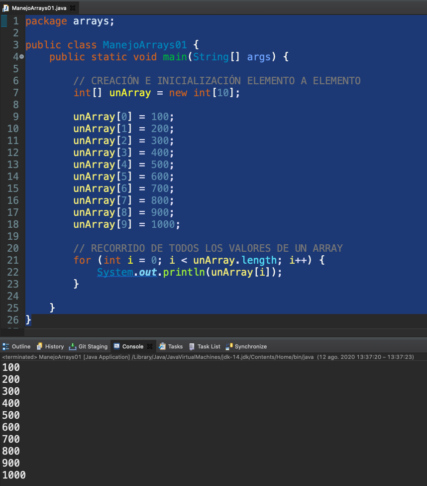

Aquí estamos utilizando el bucle para recorrer un array que es muy sencillo, usando un bucle de tipo for porque los arrays sin ser objetos como tales, es decir **no son instancias de clases como tales**, ya decía que iban a estar a caballo entre tipo de dato primitivo y objeto y es verdad que tienen una propiedad que podríamos decir que es pública porque podemos consultarla y qué es `length` y que nos dice el número de elementos que tiene ese array, usando un bucle for y la propiedad le rápidamente podríamos recorrer todo el array también tenemos la posibilidad de usar el bucle for y la propiedad `length` rapidamente podríamos recorrer todo el array.

También tenemos la posibilidad de usar *el bucle for mejorado* conocido como `foreach` en el que sin conocer el número de elementos del array, sin tener que consultar `length` podríamos ir sacando elemento a elemento del array, si un array es un array de enteros podríamos decir ve guardándome la variable entera y cada uno de los elementos del array y también recorrerlo de esta manera.

En el ejemplo anterior estamos inicializando los elementos y después los recorremos para poder consultarlos todos, cómo podemos comprobar esto nos imprimiría del 100 al 1000 a través del bucle porque está recorriendo todas y cada una de las posiciones de ese array.

### :computer: `101-16-Arrays`

Deciamos también que había otras maneras de inicializar un array, uno es el atajo de las llaves, si estamos declarando un array y conocemos a priori el conjunto de valores que lo van a conformar, son valores literales o incluso variables y no son muchos, lo podemos hacer mediante este formato, en lugar de usar el operador `new` y usar el tipo de dato y entre corchetes el tamaño, lo que haríamos sería indicar el tipo de array, entero, el nombre del array, igual y entre llaves una lista separada por comas de los valores, en este caso un array cuánto elemento tendrá, tendrá tanto elementos como elementos separados por coma hayamos declarado, tendría los mismos 10 elementos

En este caso hemos hecho un recorrido del array con el bucle for mejorado.

*`ManejoArrays02`*

```java
package arrays;

public class ManejoArrays02 {
   public static void main(String[] args) {

      // CREACIÓN E INICIALIZACIÓN CON EL ATAJO { }
      // En este caso, el tamaño lo determina la cantidad
      // de valores que inicializamos
      int[] unArray = { 100, 200, 300, 400, 500, 600, 700, 800, 900, 1000 };

      // RECORRIDO DE TODOS LOS VALORES DE UN ARRAY
      // CON EL BUCLE FOR MEJORADO
      for (int i : unArray) {
         System.out.println(i);
      }
   }
}
```

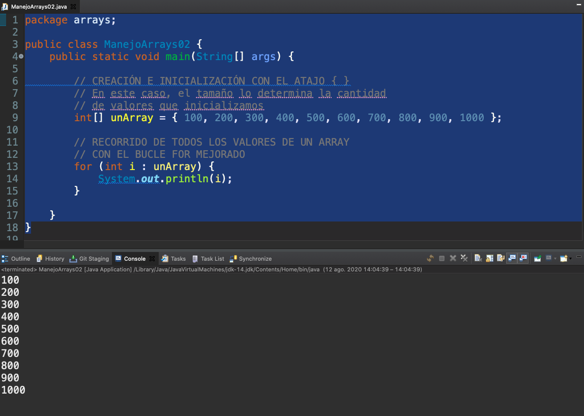


No tenemos porque crear solamente arrays de tipos de datos primitivos, lo podemos hacer también de objeto, cualquier tipo de clase, la sintaxis es identifica simplemente cambiando los tipos, en este caso si queremos hacer un array de Persona lo haríamos en lugar de con `int` con Personas y la sintaxis sería analoga. La inicialización requeriría lo mismo que la inicialización de cualquier referencia de tipo objeto en este caso Persona, para cada posición del array almacenaríamos una referencia a un objeto e instanciariamos el objeto mediante el operador `new`.

### :computer: `101-16-Arrays`

Vamos a trabajar con la clase persona que ya conocemos porque la hemos utilizado antes con sus setters, getters y toString.

*`Persona`*

```java
package arrays.objetos;

public class Persona {
	
   private String nombre;
   private String apellidos;
   private int edad;
   private int altura;
   private float peso;
	
   public Persona() {}
	
   public Persona(String nombre, String apellidos) {
      this.nombre = nombre;
      this.apellidos = apellidos;
   }

   public Persona(String nombre, String apellidos, int edad, int altura, float peso) {
      this.nombre = nombre;
      this.apellidos = apellidos;
      this.edad = edad;
      this.altura = altura;
      this.peso = peso;
   }

   public String getNombre() {
      return nombre;
   }

   public void setNombre(String nombre) {
      this.nombre = nombre;
   }

   public String getApellidos() {
      return apellidos;
   }

   public void setApellidos(String apellidos) {
      this.apellidos = apellidos;
   }

   public int getEdad() {
      return edad;
   }

   public void setEdad(int edad) {
      this.edad = edad;
   }

   public int getAltura() {
      return altura;
   }

   public void setAltura(int altura) {
      this.altura = altura;
   }

   public float getPeso() {
      return peso;
   }

   public void setPeso(float peso) {
      this.peso = peso;
   }

   @Override
   public String toString() {
      return "Persona [nombre=" + nombre + ", apellidos=" + apellidos + ", edad=" + edad + ", altura=" 
      		+ altura + ", peso=" + peso + "]";
   }
}
```

Vamos a hacer un ejemplo un poco más completa en el que tenga un array de nombres, un array de apellidos, es decir arrays de String, de cadena de caracteres y vamos a crear un array de 5 elementos de tipo Persona y lo que vamos a hacer es inicializar cada una de las posiciones de este array recogiendo un nombre y un apellido de forma aleatoria. Para ello hemos creado un método especial llamado `aleatorio(int tope)` y que nos devuelve un número aleatorio dándole un tope, este topes nos es necesario para que no nos devuelva un número muy grande que esté fuera de las posiciones de estos arrays.

Sobre métodos estáticos hablaremos más adelante, pero si decir que podemos utilizar este método dentro del método `main`.  Lo llamamos `aleatorio(int tope)` pasándole como tope la longitud del array de nombres nos devolverá un número entre 0 y 7 nos devolverá un número entre 0 y 7, lo mismo sucedería con los apellidos, con el número de apellidos que que son 6, de esta manera cómo podemos ver estamos accediendo a esta posición del array, en este caso aleatorio, estaríamos inicializando una `Persona` de nombre y apellido aleatorio, el bucle for mejorado nos permite recorrer el array de Persona y si la `Persona`, la clase `Persona` tiene el método `toString` implementado, podríamos inicializar 5 personas con el nombre y apellido aleatorio, tanto es así que si hacemos de nuevo una ejecución pues los nombres y los apellidos, la combinación de ellos con todas las ejecuciones que vayamos haciendo, van a ser diferentes, en algún caso aparecerán repetidos, en otro no, dependerá de como calculé Java esos números aleatorios.

*`ManejoArrays03`*

```java
package arrays.objetos;

import java.util.Random;

public class ManejoArrays03 {

   public static void main(String[] args) {

      // Estos dos arrays nos permitirán obtener valores aleatorios para inicializar
      // los datos
      String[] nombres = { "José", "Antonio", "Martín", "Luis", "María", "Leticia", "Luisa" };
      String[] apellidos = { "Pérez", "Gómez", "López", "García", "Muñoz", "Martínez" };

      // Creamos nuestro array de 5 elementos de tipo Persona
      Persona[] personas = new Persona[5];

      // Inicializamos los valores
      for (int i = 0; i < personas.length; i++) {
         // Obtenemos un nombre de una posición aleatoria
         String nombre = nombres[aleatorio(nombres.length)];
         // Obtenemos un apellido de una posición aleatoria
         String apellido = apellidos[aleatorio(apellidos.length)];
         // Los usamos para crear una nueva persona
         personas[i] = new Persona(nombre, apellido);
      }

      // Recorremos de nuevo el array, esta vez
      // para imprimir sus valores.
      for (Persona p : personas) {
         System.out.println(p);
      }

   }

   /*
    * ESTE MÉTODO DEVUELVE UN NÚMERO ALEATORIO ENTRE 0 y TOPE-1.
   */
   public static int aleatorio(int tope) {
      Random r = new Random();
      return r.nextInt(tope - 1);
   }

}
```

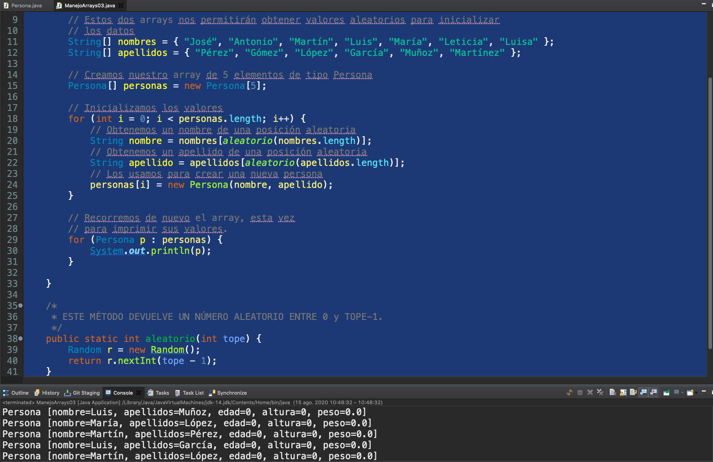


Esto con respecto al uso de array de objetos, también podemos crear arrays, tanto de tipos primitivos como de tipo básicos que sean multidimensionales, es decir que no solamente tengan una dimensión, podríamos crear por ejemplo una matriz, es decir un array bidimensional. El número de dimensiones va a venir aparejado a la cantidad de parejas de corchetes que vaya colocada a continuación del tipo, a la izquierda de la operación de asignación, para un array bidimensional utilizaríamos dos parejas de corchetes, si quisiéramos hacer un array que nos permitiera representar un cubo de Rubi necesitaríamos tres parejas de coche, aquí tenemos el ejemplo de la creación de un array bidimensional para acceder a cualquier posición, si suponemos una matriz bidimensional pues necesitaríamos la fila y la columna a la cual queremos acceder.


Para recorrer un array bidimensional requerimos de dos bucles, a cada cumple nueva dimensión requeririamos de un nuevo bucle en este caso como podemos comprobar tenemos que lo primero que tenemos que hacer es un bucle externo que nos va a ir recorriendo fila a fila la matriz bidimensional, la estructura es la misma que hemos visto antes y para cada iteración de ese buque, lo que hacemos es ejecutar otro bucle, que nos va a permitir interar desde 0 hasta el número de elementos, por ejemplo de la posición 0 suponemos que la matriz Array bidimensional es cuadrado es decir, cuadrado, rectangular es decir, que todas las filas tienen el mismo número de columnas, de esta manera para cada fila vamos recorriendo cada una de las celdas de las posiciones de los elementos de esa fila y podríamos imprimirlo así como tal.

### :computer: `101-16-Arrays`

Si queremos ver un ejemplo de array bidimensional, lo tendríamos aquí, que no tiene porqué ser cuadrado este tendría 10 filas y en cada fila 20 columnas, si quisiéramos volver a inicializarlo mediante este método aleatorio con un tope de 100, lo podríamos hacer de esta manera.

Lo recorremos como decíamos primero con su longitud, esto nos devuelve el número de filas y posteriormente aquí esto nos devolvería el tope, que sería el número de columnas aquí esto será 10 y esto 20 y por la posición I y J lo podríamos almacenar. 

```java
for (int i = 0; i < bidimensional.length; i++) {
   for (int j = 0; j < bidimensional[0].length; j++) {
      bidimensional[i][j] = aleatorio(TOPE);
   }
}
```

No recomiendo utilizar los nombres de variables X e Y para recorrer un array, porque pueden despistar los pueden orientará hacia un eje de coordenadas y realmente aquí el el tratamiento sería un poco diferente porque la primera posición que no da la fila estaría en vertical, lo cuál sería la I y la X estaría orientada a la columna que sería la horizontal y entonces puede llegar a despistar usar primero X y luego Y cuando realmente lo deberíamos estar haciendo al contrario es mejor usar I y J o simplemente las palabras fila y columna como referencia para para recorrer.

Haríamos el mismo bucle para pintar un array, este bucle es un clásico porque nos permitiría para cada fila, pintar los valores de cada una de las columnas en esa fila, 

```java
for (int i = 0; i < bidimensional.length; i++) {
   for (int j = 0; j < bidimensional[0].length; j++) {
      System.out.print(bidimensional[i][j] + "\t");
   }
   System.out.println("");
}
```

lo qué hacemos en lugar de `println` llamamos al método `print` que hace lo mismo pero no añade el salto de línea al final, pintariamos la posición y este carácter especial `\t`, este literal de cadena realmente un solo carácter, aunque lo hayamos puesto como un literal de cadena, lo que hace es añadir un tabulador, igual que si hubiéramos pulsado la tecla de tabulacion del teclado, por lo cual nos va a hacer una representación más o menos digna de esta matriz, cuando terminamos de pintar las columnas de esta fila y pintamos un `println` vacío que lo que nos añade es un salto de línea y pasamos a pintar la siguiente fila, de esta manera podríamos pintar la matriz de 10 filas y 20 columnas.

*`ManejoArrays04`*

```java
package arrays.bidimensionales;

import java.util.Random;

public class ManejoArrays04 {

   public static void main(String[] args) {
      // No tiene porqué ser cuadrado
      int[][] bidimensional = new int[10][20];
      final int TOPE = 100;

      for (int i = 0; i < bidimensional.length; i++) {
         for (int j = 0; j < bidimensional[0].length; j++) {
            bidimensional[i][j] = aleatorio(TOPE);
	 }
      }

      for (int i = 0; i < bidimensional.length; i++) {
         for (int j = 0; j < bidimensional[0].length; j++) {
            System.out.print(bidimensional[i][j] + "\t");
         }
         System.out.println("");
      }

   }

   /*
    * ESTE MÉTODO DEVUELVE UN NÚMERO ALEATORIO ENTRE 0 y TOPE-1.
   */
   public static int aleatorio(int tope) {
      Random r = new Random();
      return r.nextInt(tope - 1);
   }

}
```

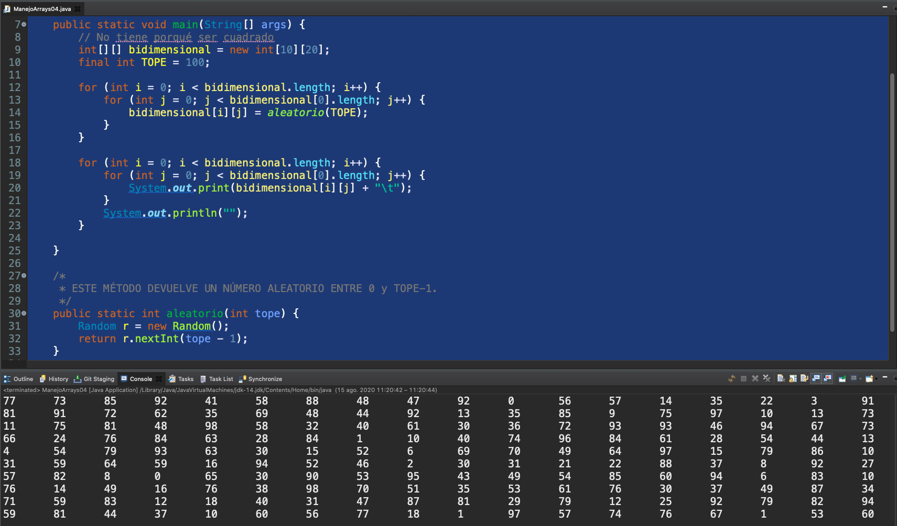


Nos queda por último una clase especial que es la clase `Arrays` en plural que está dentro del paquete `java.util` y poseen muchos, muchos métodos para realizar diversas operaciones con un array, operaciones de ordenación, operaciones de búsqueda, operaciones de copia, operaciones de transformación, de impresión por consola, un montón de operaciones podemos consultarla en:

https://docs.oracle.com/en/java/javase/14/docs/api/java.base/java/util/Arrays.html

Vemos que nos da un montón de métodos, la cantidad de método la verdad es que es bastante grande por destacar algunos de ellos podríamos buscar los métodos de ordenación `sort`.

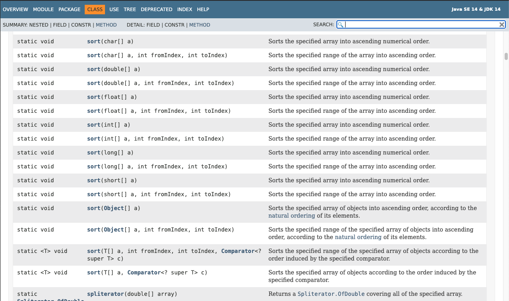

Nos va a permitir ordenar arrays de los distintos tipos de datos primitivos, por ejemplo un array de números entero lo podríamos ordenar, **este método va a ordenar el array que nosotros pasemos como argumento no devuelve un array ordenado sino que devuelve ese array** como digo la cantidad de métodos que tiene es inmensa, otro método por ejemplo cómodo es tu `toString()` que nos devuelve una representación como cadena de caracteres de un array y también tenemos un método para array que sean más grandes, que sería `deepToString (Object[] a)` este bueno si un array es más de una dimensión o lo de dentro fuera de otro tipo que no fuera primitivo seguiría profundizando hasta visualizar el valor y no referencias de objetos.

### :computer: `101-16-Arrays`

Vamos a generar un array de 100 posiciones aleatorias con número de cero a cien, lo podríamos imprimir con nuestro método creado un tanto artesanal.

```java
int[] array = new int[100];

for (int i = 0; i < array.length; i++) {
   array[i] = aleatorio(100);
}

printArray(array);
```

Podemos copiar el array que hemos creado antes en otro ampliando su longitud, si un array se nos queda pequeño en lugar de tener que crear un segundo array, recorrer el primero, asignar las variable, el método `copyOf` ya lo hace por nosotros.

```java
// Podemos crear otro array, copia del primero, ampliando su longitud
int[] otroArray = Arrays.copyOf(array, 200);
```

Podemos ordenar e imprimir el array ordenado.

```java
// Podemos ordenar los elementos de un array
Arrays.sort(otroArray);
System.out.println("");
System.out.println("Array ordenado");
printArray(otroArray);
```

Podríamos ya con el array ordenado realizar una búsqueda binaria, la búsqueda binaria es un algoritmo de búsqueda que requiere sobre una colección de elementos, que los elementos están ordenados para poder localizarla. Este método `binarySearch` nos permitiría buscar un número aleatorio si es que está dentro del array.

```java
// Posición de un número aleatorio, si es que está
int num = aleatorio(100);
int pos = Arrays.binarySearch(array, num);
System.out.println("");
if (pos >= 0)
   System.out.printf("El elemento " + num + " está contenido en el array, en la posición " + pos);
else
   System.out.println("El elemento " + num + " no está en el array");
```

Java 8 a agregado algunos métodos como por ejemplo la ordenación paralela de algunos array que sean muy grande, cuando hablamos de paralelo y secuencial queremos decir es que la ordenación secuencial de elementos los va haciendo 1 a 1, si utilizamos un tipo de operación en paralelo lo que va a hacer es  utilizar las características tanto físicas del procesador como lógica para ejecutar tareas en paralelo es decir que se van ejecutando a la vez para intentar sobre colecciones muy grande, sobre sobre array muy grande, hacerlo de una manera más rápida.

```java
// JAVA SE 8
// El método parallelsort realiza una ordenación más rápida para arrays
// muy largos
int[] arrayGrande = new int[123456];
// Este método sirve para inicializar un array con valores
// y usa una expresión lambda, que aprenderemos a crear
// en la última lección del curso
Arrays.parallelSetAll(arrayGrande, i -> aleatorio(12345));
Arrays.parallelSort(arrayGrande);
```

Fijarse en esta colección que tiene más de un millón de elemento utilizamos unos métodos especiales, quizá no sean los que más utilicéis al principio y una sintaxis especial que aprenderemos en alguna de la última lecciones de la expresión el Lambda para rellenar este array grande con un montón de números aleatorios de forma paralela y después ordenarlo de forma también paralela.

*`ManejoArrays05`*

```java
package arrays;

import java.util.Arrays;
import java.util.Random;

public class ManejoArrays05 {

   public static void main(String[] args) {
      int[] array = new int[100];

      for (int i = 0; i < array.length; i++) {
         array[i] = aleatorio(100);
      }

      printArray(array);

      // Podemos crear otro array, copia del primero, ampliando su longitud
      int[] otroArray = Arrays.copyOf(array, 200);

      // Podemos ordenar los elementos de un array
      Arrays.sort(otroArray);
      System.out.println("");
      System.out.println("Array ordenado");
      printArray(otroArray);

      // Posición de un número aleatorio, si es que está
      int num = aleatorio(100);
      int pos = Arrays.binarySearch(array, num);
      System.out.println("");
      if (pos >= 0)
         System.out.printf("El elemento " + num + " está contenido en el array, en la posición " + pos);
      else
         System.out.println("El elemento " + num + " no está en el array");

      // JAVA SE 8
      // El método parallelsort realiza una ordenación más rápida para arrays
      // muy largos
      int[] arrayGrande = new int[123456];
      // Este método sirve para inicializar un array con valores
      // y usa una expresión lambda, que aprenderemos a crear
      // en la última lección del curso
      Arrays.parallelSetAll(arrayGrande, i -> aleatorio(12345));
      Arrays.parallelSort(arrayGrande);
   }

   /*
    * ESTE MÉTODO DEVUELVE UN NÚMERO ALEATORIO ENTRE 0 y TOPE-1.
    */
   public static int aleatorio(int tope) {
      Random r = new Random();
      return r.nextInt(tope - 1);
   }

   /*
    * Este método imprime un array, indicando para cada elemento su valor y su
    * posición
    */
   public static void printArray(int[] array) {
      for (int i = 0; i < array.length; i++) {
         System.out.print(array[i] + "[" + i + "]  ");
         if (i > 0 && i % 10 == 0)
	    System.out.println("");
      }
      System.out.println("");
   }

}
```

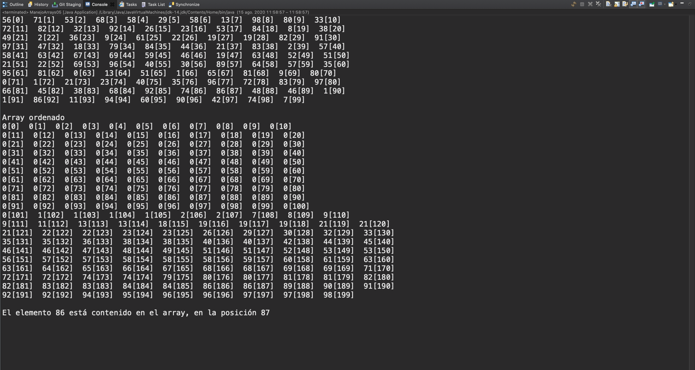

Se ha producido todas las operaciones y aquí tenemos la representación del array, el array ordenado, como habíamos hecho una copia de 100 elemento y lo hemos ordenado después los 100 primero elemento están inicializado a cero y por ejemplo elementos 9 no está, si intentamos buscar otro elemento elemento do tampoco 86 si esta. 

## Práctica: Creando el juego de hundir la flota 31:16 

[Práctica: Creando el juego de hundir la flota](pdfs/Hundir_la_flota.pdf)

## Resumen Profesor

En esta sesión práctica veremos como crear el juego de hundir la flota, tienes el código de ejemplo en el [repositorio de GitHub](https://github.com/OpenWebinarsNet/Curso-Java-desde-0/tree/master/16bis_HundirFlota).

## Transcripción


Vamos a intentar aplicar varias cosas de lo que hemos aprendido sobre todo sobre el manejo y recorrido de arrays, a la implementación de un pequeño podríamos llamar videojuego, de una pequeña versión del videojuego, el conocido como **Hundir la Flota**, va a ser una versión muy básica no podemos esperar ni grande grafico, porque no conocemos como usar graficos en Java y la lógica del juego la vamos a simplificar un poco para que no sea tan sumamente complicado, sobre todo en el recorrido de los arrays bidimensionales.


Hundir la flota es un juego de tablero para dos jugadores en el que se juega sobre un tablero de 10 posiciones, las posiciones se vienen indicando a través de una letra y un número, las letras de la A la J y los números del 1 al 10, cada jugador obviamente sin que lo conozca el contrario, colocan varios barco en posición horizontal o vertical, una serie de barco de diferente longitud y bueno comienza uno de los dos usuarios diciendo una serie de coordenadas por ejemplo B3 y el contrario tiene que decir si está supuesta bomba que ha lanzado a tocado en algún barco o cae en el agua.


Nuestra implementación que como ya digo va a ser una simplificación del juego, va a constar de la colocación de varios barcos entre ellos dos barcos de 5 casillas, de 3 de 3 casillas y cinco barcos de una casilla, es decir de ocupar 24 posiciones de las 100 en total. No vamos a detectar, ya digo esto requeriría de un poco más de complejidad, si un tiro en particular hunde por completo un barco, porque ya digo requeriría de una complejidad adicional, sino que lo que vamos a hacer es contabilizar unos puntos, un jugador va a partir con 24 puntos que son cada una de las posiciones que ocupan los distintos barcos que pone y vamos a ir restando los puntos sobre 24, cada vez que den una bomba de en un barco restaremos un punto y bueno perderá el jugador que se quede sin puntos. 


Adicionalmente vamos a imaginar que aunque como no podemos ver el mapa del oponente pero queremos ir recordando los tiros que hemos ido haciendo, vamos a ir registrando en una matriz adicional las bombas que lanzamos, para saber bueno dónde ir tirando, ir orientando, podemos simular que bueno que tenemos aparejado a nuestro mapa otro mapa al lado, no sé con un lápiz podemos ir marcando las distintas posiciones dónde hemos tirado una bomba.

Bueno pues veamos nuestro ejemplo, ya lo tenemos implementado de forma completa. Por simplificar y centrarnos únicamente en el uso de arrays y de alguna de las funciones que hemos visto anteriormente hemos hecho todo el código dentro de un fichero para que fuera un poco más largo, esto no quiere decir que sea ni buena ni mala práctica, de hecho hubiera sido quizás recomendable separar una serie de métodos a otra clase aparte, sin embargo lo hemos querido recoger en un solo fichero para que pudiéramos ver como una clase puede ir creciendo hasta tener como es nuestro caso unas 300 y algo mas líneas de código y no bueno pues como las que habíamos creado hasta otra hasta ahora que tenían como mucho unas 40 ó 50 líneas de código, sino que esto puede ir creciendo.

Vamos a ver a vista de pájaro todo el código que hemos implementado vamos a conocer algún elemento que aunque conoceremos en profundidad en lecciones posteriores lo vamos a utilizar desde ya, ejecutaremos el proyecto para ver cómo funciona y posteriormente iremos viendo con detenimiento el código.

Como podemos comprobar estamos usando algunas referencias de tipo final, en su momento dijimos que sirven para declarar constantes, de hecho el nombre de estas variables constantes ya nos da algún indicador donde vamos a utilizar algunos simbolos para las casillas de agua que no han sido tocadas, es decir donde ha caído una bomba, había agua y no ha tocado ningún barco, las casillas de agua y las casillas donde hemos tocado algún barco.

```java
//CONSTANTES, que nos sirven para representar algunos valores
final static char AGUA_NO_TOCADO = '.';
final static char AGUA = 'A';
final static char TOCADO = 'X';
```

También son variables de **tipo estático**, *podríamos decir simplemente que una variable de tipo estático dentro de una clase es una variable que no requiere de que tengamos una instancia de esa clase para poder utilizarla en este caso son constantes estáticas*, análogamente tenemos métodos estáticos lo venimos utilizando desde el inicio de este curso de Java el método `main` es estático y un método de tipo especial que no requiere que tengamos una instancia de la clase para utilizarlo, de hecho **todo aquello que marcamos como estático Eclipse nos lo suele poner en cursiva para indicarnos que es estático**. Como digo hemos resuelto este proyecto a base de algunas variables de tipo estático, sobre todo las constantes y alguna más y de una serie una sucesión de bastantes métodos estáticos también, aunque no hayamos visto con detenimiento qué significa eso de estático nos basta con saber que son parecidos al `main` el decir que no necesitamos instanciar la clase `HundirLaFlota` utilizar esos métodos.

Cómo podemos ver declaramos los distintos mapas que vamos a utilizar.

```java
//TAMAÑO DEL TABLERO
final static int TAMANIO = 10;

. . .

// Mapa del usuario y del ordenador
char[][] mapaUsuario = new char[TAMANIO][TAMANIO];
char[][] mapaOrdenador = new char[TAMANIO][TAMANIO];
		
// Este tercer mapa nos sirve para anotar y visualizar
// las tiradas que hacemos sobre el mapa del ordenador
char[][] mapaOrdenadorParaUsuario = new char[TAMANIO][TAMANIO];
```

Como mapas usaremos arrays bidimensionales de carácteres, donde guardaremos si es un barco, si es agua,  si lo hemos tocado o no, en lugar de implementar el juego para dos jugadores, para darle un poco más de vidilla, vamos a implementarlo para que juguemos contra el ordenador y le daremos un cierto grado de inteligencia al ordenador para que pueda ganar.

El mapa del usuario y del ordenador como decia es un array bidimensional de char, el tercer mapa nos servirá para almacenar o registrar dónde vamos tirando nosotros nuestras bombas, iniciamos cada usuario tanto el ordenador como nosotros con 24 puntos.

```java
// Puntos con los que comienzan las partidas		
int puntosUsuario = 24;
int puntosOrdenador = 24;
```

Una serie de variables booleanas que nos van a indicar sí el juego ha terminado, el juego no termina mientras los dos jugadores tengan barco a flote, en cuanto uno de los dos deja de tener barco a flote el juego termina.

```java
// Lleva el control del programa.
// Si no quedan barcos a flote del jugador o el ordenador, lo ponemos a true
boolean juegoTerminado = false;

// Indica si el tiro es correcto, para volver a realizar otro
boolean tiroCorrecto = false;
```

Para cada tiro indicaremos si es correcto o no o si no lo es, invitaremos al usuario a que vuelva tirar. Una tirada vendrá marcada por dos posiciones.

```java
//Posiciones de la tirada
int[] tiro = new int[2];
```

Para comenzar inicializaremos los mapas tanto del usuario, como del ordenador, así como el mapa de registro.

```java
// Inicializamos los mapas, colocando los barcos
inicializacion(mapaUsuario, mapaOrdenador);
// Inicializamos el mapa de registro a AGUA_NO_TOCADO
inicializaMapaRegistro(mapaOrdenadorParaUsuario);
```

El del usuario y el del ordenador se inicializan de una manera aleatoria, la veremos con tranquilidad después, simula el proceso de que el usuario fuera colocando los distintos barcos.

Y comenzamos con el bucle principal del juego que como podéis ver es bastante amplio.

```java
//Mientras queden barcos a flote
while (!juegoTerminado) {

. . .

} //FIN DE LA PARTIDA. Alguien ha ganado
```

Este bucle principal nos va a indicar que mientras no se termina el juego vamos a ir haciendo una tirada por parte del usuario y otra tirada por parte del ordenador, se comienza con el del usuario:

```java
//Comenzamos con la tirada del usuario
tiroCorrecto = false;
while (!tiroCorrecto) {
   //Solicitamos los datos por teclado.
   tiro = pedirCasilla();
   //Verificamos si el tiro es correcto o no
   if (tiro[0] != -1 && tiro[1] != -1) {
      //Puede ser INCORRECTO porque ya haya tirado
      //sobre esas coordenadas
      tiroCorrecto = evaluarTiro(mapaOrdenador, tiro);
      if (!tiroCorrecto)
         System.out.println("TIRO INCORRECTO");	
   } else {
      System.out.println("TIRO INCORRECTO");
   }
   //De no serlo, el jugador debe volver a tirar
				
}
```

A continuación se sigue con el del jugador:

```java
//Si no ha ganado el jugador, le toca a la máquina
if (!juegoTerminado) {
   
   System.out.printf("PUNTOS RESTANTES DEL ORDENADOR: %d\n\n", puntosOrdenador);
   System.out.println("TURNO DEL ORDENADOR");
   tiroCorrecto = false;
   //Seguimos los mismos parámetros de comprobación que en la tirada del usuario
   while (!tiroCorrecto) {
      tiro = generaDisparoAleatorio();
      tiroCorrecto = evaluarTiro(mapaUsuario, tiro);
   }
}
```

Tenemos que comprobar además de que el juego no ha terminado en la condicion del `While` lo tenemos que comprobar a mitad, porque si la tirada del jugador ha producido tal éxito que ya el barco que le quedaba al ordenador, le quedaba un punto y ya no le queda ninguno, pues en este punto si el juego hubiera terminado ya no tendríamos que dejar que el ordenador tirará ya el jugador habría ganado.

Vamos a ver después la lógica de cada tirada vamos restando los puntos y bueno y hemos terminado la partida decir si el juego ha terminado quiere decir que el ordenador o bien se ha quedado sin punto o hemos ido nosotros, si los puntos del ordenador llegarán a cero el vencedor habría sido el jugador en otro caso el vencedor ha sido el ordenador.

Debajo tenemos un montón de método estáticos que conoceremos mas adelante.

Vamos a ejecutar el programa y vamos a ver bien que hace.


### Código

*HundirLaFlota.java*

```java
/**
 * HUDIR LA FLOTA
 * 
 * Se trata de un juego clásico, en el que nos vamos a enfrentar al ordenador. Cada usuario dispone de un mapa
 * de 10x10 casillas, donde se colocarán barcos (dos de tamaño 5, tres de tamaño 3, y cinco de tamaño 1). 
 * Jugador y ordenador irán diciendo posiciones en el mapa, y el jugador opuesto tendrá que indicar si la "bomba"
 * ha caádo en el agua, o ha tocado algún barco.
 * 
 * Para simplificar el juego, en lugar de verificar si un barco completo se ha hundido, y cuantos barcos quedan a flote,
 * contabilizamos el número total de casillas correspondientes a un barco que no han sido "hundidas". Se parte con
 * 24 puntos (5+5+3+3+3+1+1+1+1+1) 
 * 
 * Este código está inspirado (aunque reescrito y simplificado) de un código original de Manuel Jesús Gallego Vela
 */
package hundirflota;

import java.util.Random;
import java.util.Scanner;

/**
 * @author 
 *
 */
public class HundirLaFlota {

	//CONSTANTES, que nos sirven para representar algunos valores
	final static char AGUA_NO_TOCADO = '.';
	final static char AGUA = 'A';
	final static char TOCADO = 'X';

	//TAMAÑO DEL TABLERO
	final static int TAMANIO = 10;
	
	private static Scanner sc;

	/**
	 * @param args
	 */
	public static void main(String[] args) {

		//La clase Scanner nos permite, junto con System.in, leer desde el teclado
		sc = new Scanner(System.in);
		
		// Mapa del usuario y del ordenador
		char[][] mapaUsuario = new char[TAMANIO][TAMANIO];
		char[][] mapaOrdenador = new char[TAMANIO][TAMANIO];
		
		// Este tercer mapa nos sirve para anotar y visualizar
		// las tiradas que hacemos sobre el mapa del ordenador
		char[][] mapaOrdenadorParaUsuario = new char[TAMANIO][TAMANIO];
		
		// Puntos con los que comienzan las partidas		
		int puntosUsuario = 24;
		int puntosOrdenador = 24;
		
		// Lleva el control del programa.
		// Si no quedan barcos a flote del jugador o el ordenador, lo ponemos a true
		boolean juegoTerminado = false;

		// Indica si el tiro es correcto, para volver a realizar otro
		boolean tiroCorrecto = false;

		//Posiciones de la tirada
		int[] tiro = new int[2];

		// Inicializamos los mapas, colocando los barcos
		inicializacion(mapaUsuario, mapaOrdenador);
		// Inicializamos el mapa de registro a AGUA_NO_TOCADO
		inicializaMapaRegistro(mapaOrdenadorParaUsuario);

		//Mientras queden barcos a flote
		while (!juegoTerminado) {

			// Al principio del turno, pintamos el mapa del usuario
			System.out.println("MAPA DEL USUARIO");
			imprimirMapa(mapaUsuario);
			
			System.out.printf("PUNTOS RESTANTES DEL JUGADOR: %d\n", puntosUsuario);
			System.out.println("TURNO DEL JUGADOR");
			
			//Comenzamos con la tirada del usuario
			tiroCorrecto = false;
			while (!tiroCorrecto) {
				//Solicitamos los datos por teclado.
				tiro = pedirCasilla();
				//Verificamos si el tiro es correcto o no
				if (tiro[0] != -1 && tiro[1] != -1) {
					//Puede ser INCORRECTO porque ya haya tirado
					//sobre esas coordenadas
					tiroCorrecto = evaluarTiro(mapaOrdenador, tiro);
					if (!tiroCorrecto)
						System.out.println("TIRO INCORRECTO");	
				} else {
					System.out.println("TIRO INCORRECTO");
				}
				//De no serlo, el jugador debe volver a tirar
				
			}
			
			//Actualizamos mapa del ordenador y los puntos
			int puntosOrdenadorAnterior = puntosOrdenador;
			puntosOrdenador = actualizarMapa(mapaOrdenador, tiro, puntosOrdenador);
			
			//Actualizamos nuestro mapa de registro y lo imprimimos.
			//Sabemos si la tirada ha sido AGUA O TOCADO si el número de puntos se ha decrementado.
			char tipoTiro = (puntosOrdenadorAnterior - puntosOrdenador) > 0 ? TOCADO : AGUA; 
			actualizarMapaRegistro(mapaOrdenadorParaUsuario,tiro, tipoTiro);
			System.out.println("\nREGISTRO DEL MAPA DEL ORDENADOR");
			imprimirMapa(mapaOrdenadorParaUsuario);
			
			//El juego termina si el número de puntos llega a 0
			juegoTerminado = (puntosOrdenador == 0);
			
			
			//Si no ha ganado el jugador, le toca a la máquina
			if (!juegoTerminado) {
				
				System.out.printf("PUNTOS RESTANTES DEL ORDENADOR: %d\n\n", puntosOrdenador);
				System.out.println("TURNO DEL ORDENADOR");
				tiroCorrecto = false;
				//Seguimos los mismos parámetros de comprobación que en la tirada del usuario
				while (!tiroCorrecto) {
					tiro = generaDisparoAleatorio();
					tiroCorrecto = evaluarTiro(mapaUsuario, tiro);
				}
			}
			//Actualizamos mapa
			puntosUsuario = actualizarMapa(mapaUsuario, tiro, puntosUsuario);
			//El juego termina si el número de puntos llega a 0			
			juegoTerminado = (puntosUsuario == 0);

		} //FIN DE LA PARTIDA. Alguien ha ganado
				
		if (puntosOrdenador == 0) {
			System.out.println("EL VENCEDOR HA SIDO EL JUGADOR");
		} else 
			System.out.println("EL VENCEDOR HA SIDO EL ORDENADOR");

		sc.close();
	}

	
	/*
	 * Método que sirve para que el ordenador pueda hacer un disparo
	 */
	private static int[] generaDisparoAleatorio() {		
		return new int[] {aleatorio(), aleatorio()};
	}


	/*
	 * Metodo que aglutina la inicialización de ambos mapas
	 */
	public static void inicializacion(char[][] m1, char[][] m2) {
		inicializaMapa(m1);
		inicializaMapa(m2);
	}
	
	/*
	 * Método que inicializa el mapa que mostramos al usuario
	 * con las tiradas que ha hecho sobre el mapa del ordenador.
	 */
	private static void inicializaMapaRegistro(char[][] mapa) {
		// Inicializamos el mapa entero a AGUA_NO_TOCADO
		for (int i = 0; i < TAMANIO; i++)
			for (int j = 0; j < TAMANIO; j++)
				mapa[i][j] = AGUA_NO_TOCADO;
		
	}

	/*
	 * Método que inicializa un mapa de juego, colocando
	 * los barcos sobre el mismo.
	 */
	private static void inicializaMapa(char[][] mapa) {

		// Inicializamos el mapa entero a AGUA_NO_TOCADO
		for (int i = 0; i < TAMANIO; i++)
			for (int j = 0; j < TAMANIO; j++)
				mapa[i][j] = AGUA_NO_TOCADO;

		// 2 portaaviones (5 casillas)
		// 3 buques (3 casillas)
		// 5 lanchas (1 casilla)
		int[] barcos = { 5, 5, 3, 3, 3, 1, 1, 1, 1, 1 };

		// Posible dirección de colocación del barco
		char[] direccion = { 'V', 'H' };

		// Para cada barco
		for (int b : barcos) {

			// Intentamos tantas veces sea necesarias para colocar el barco en el mapa.
			// Vamos de mayor tamaño a menor, para que sea menos
			// dificultoso encontrar un hueco
			boolean colocado = false;
			while (!colocado) {

				//Obtenemos una posición y dirección aleatorias
				int fila = aleatorio();
				int columna = aleatorio();
				char direcc = direccion[aleatorio() % 2];

				// ¿Cabe el barco en la posición indicada?
				if (direcc == 'V') {
					if (fila + b <= (TAMANIO - 1)) {
						// comprobamos que no hay otro barco que se solape
						boolean otro = false;
						for (int i = fila; (i <= fila + b) && !otro; i++) {
							if (mapa[i][columna] != AGUA_NO_TOCADO)
								otro = true;
						}
						// Si no hay otro barco, lo colocamos
						if (!otro) {
							for (int i = fila; i < fila + b; i++) {
								mapa[i][columna] = Integer.toString(b).charAt(0);
							}
							colocado = true;
						}
					}
				} else { // direcc == 'H'
					if (columna + b <= (TAMANIO - 1)) {
						// comprobamos que no hay otro barco que se solape
						boolean otro = false;
						for (int j = columna; (j <= columna + b) && !otro; j++) {
							if (mapa[fila][j] != AGUA_NO_TOCADO)
								otro = true;
						}
						// Si no hay otro barco, lo colocamos
						if (!otro) {
							for (int j = columna; j < columna + b; j++) {
								mapa[fila][j] = Integer.toString(b).charAt(0);
							}
							colocado = true;
						}
					}
				}

			}
		}

	}

	/*
	 * Método que nos devuelve un número aleatorio
	 */
	private static int aleatorio() {
		Random r = new Random(System.currentTimeMillis());
		return r.nextInt(TAMANIO);
	}

	/*
	 * Método que imprime un mapa, con una fila y columna de encabezados
	 */
	public static void imprimirMapa(char[][] mapa) {

		// Calculamos las letras según el tamaño
		char[] letras = new char[TAMANIO];
		for (int i = 0; i < TAMANIO; i++)
			letras[i] = (char) ('A' + i);

		// Imprimimos la fila de encabezado
		System.out.print("    ");
		for (int i = 0; i < TAMANIO; i++) {
			System.out.print("[" + i + "] ");
		}

		System.out.println("");
		// Imprimimos el resto de filas
		for (int i = 0; i < TAMANIO; i++) {
			System.out.print("[" + letras[i] + "]  ");
			for (int j = 0; j < TAMANIO; j++) {
				System.out.print(mapa[i][j] + "   ");
			}
			System.out.println("");
		}
	}

	/*
	 * Método mediante el cual el usuario introduce una casilla
	 */
	private static int[] pedirCasilla() {
		
		System.out.println("Introduzca la casilla (por ejemplo B4): ");
		String linea = sc.nextLine();
		//Pasamos la cadena a mayúsculas
		linea = linea.toUpperCase();
		int[] t;

		
		// Comprobamos que lo introducido por el usaurio es correcto mediante una expresión regular
		if (linea.matches("^[A-Z][0-9]*$")) {

			// Obtenemos la letra.
			// Suponemos que, como mucho, usaremos una letra del abecedario
			char letra = linea.charAt(0);
			// El número de fila es VALOR_NUMERICO(LETRA) - VALOR_NUMERICO(A).
			int fila = Character.getNumericValue(letra) - Character.getNumericValue('A');
			// Para la columna, tan solo tenemos que procesar el número
			int columna = Integer.parseInt(linea.substring(1, linea.length()));
			// Si las coordenadas están dentro del tamaño del tablero, las devolvemos
			if (fila >= 0 && fila < TAMANIO && columna >= 0 && columna <= TAMANIO) {
				t = new int[]{ fila, columna };
			} else //En otro caso, devolvemos -1, para que vuelva a solicitar el tiro
				t =  new int[] { -1, -1 };
		} else 
			t =  new int[] { -1, -1 };
		
		
		return t;

	}

	/*
	 * Método que nos permite evaluar si un tiro es CORRECTO (AGUA o TOCADO)
	 * o se trata de una casilla por la que ya hemos pasado antes.
	 */
	public static boolean evaluarTiro(char[][] mapa, int[] t) {
		int fila = t[0];
		int columna = t[1];
		return mapa[fila][columna] == AGUA_NO_TOCADO || (mapa[fila][columna] >= '1' && mapa[fila][columna] <= '5'); 
		
	}
	
	/*
	 * Método que actualiza el mapa, con un determinado tiro. 
	 * Devolvemos el número de puntos restantes.
	 */
	private static int actualizarMapa(char[][] mapa, int[] t, int puntos) {
		int fila = t[0];
		int columna = t[1];
		
		if (mapa[fila][columna] == AGUA_NO_TOCADO) {
			mapa[fila][columna] = AGUA;
			System.out.println("AGUA");
		} else {			
			mapa[fila][columna] = TOCADO;
			System.out.println("HAS ALCANZADO A ALGÚN BARCO");
			--puntos;
		}
		
		return puntos;
		
		
	}
	/*
	 * Método que actualiza el mapa de registro
	 */
	private static void actualizarMapaRegistro(char[][] mapa, int[] t, char valor) {
		int fila = t[0];
		int columna = t[1];

		mapa[fila][columna] = valor;
	}

}
```

**SALIDA:**

```sh
MAPA DEL USUARIO
    [0] [1] [2] [3] [4] [5] [6] [7] [8] [9] 
[A]  5   .   .   .   .   .   .   .   .   .   
[B]  5   5   5   5   5   5   .   .   .   .   
[C]  5   .   1   .   .   .   .   .   .   .   
[D]  5   .   .   3   3   3   .   1   .   .   
[E]  5   .   .   .   1   .   .   .   .   .   
[F]  .   .   .   .   .   3   3   3   .   .   
[G]  .   .   .   .   .   .   3   .   .   .   
[H]  .   .   1   .   .   .   3   1   .   .   
[I]  .   .   .   .   .   .   3   .   .   .   
[J]  .   .   .   .   .   .   .   .   .   .   
PUNTOS RESTANTES DEL JUGADOR: 24
TURNO DEL JUGADOR
Introduzca la casilla (por ejemplo B4): 
A1
AGUA

REGISTRO DEL MAPA DEL ORDENADOR
    [0] [1] [2] [3] [4] [5] [6] [7] [8] [9] 
[A]  .   A   .   .   .   .   .   .   .   .   
[B]  .   .   .   .   .   .   .   .   .   .   
[C]  .   .   .   .   .   .   .   .   .   .   
[D]  .   .   .   .   .   .   .   .   .   .   
[E]  .   .   .   .   .   .   .   .   .   .   
[F]  .   .   .   .   .   .   .   .   .   .   
[G]  .   .   .   .   .   .   .   .   .   .   
[H]  .   .   .   .   .   .   .   .   .   .   
[I]  .   .   .   .   .   .   .   .   .   .   
[J]  .   .   .   .   .   .   .   .   .   .   
PUNTOS RESTANTES DEL ORDENADOR: 24

TURNO DEL ORDENADOR
HAS ALCANZADO A ALGÚN BARCO
MAPA DEL USUARIO
    [0] [1] [2] [3] [4] [5] [6] [7] [8] [9] 
[A]  5   .   .   .   .   .   .   .   .   .   
[B]  5   5   5   5   5   5   .   .   .   .   
[C]  5   .   1   .   .   .   .   .   .   .   
[D]  5   .   .   X   3   3   .   1   .   .   
[E]  5   .   .   .   1   .   .   .   .   .   
[F]  .   .   .   .   .   3   3   3   .   .   
[G]  .   .   .   .   .   .   3   .   .   .   
[H]  .   .   1   .   .   .   3   1   .   .   
[I]  .   .   .   .   .   .   3   .   .   .   
[J]  .   .   .   .   .   .   .   .   .   .   
PUNTOS RESTANTES DEL JUGADOR: 23
TURNO DEL JUGADOR
Introduzca la casilla (por ejemplo B4): 
B7
AGUA

REGISTRO DEL MAPA DEL ORDENADOR
    [0] [1] [2] [3] [4] [5] [6] [7] [8] [9] 
[A]  .   A   .   .   .   .   .   .   .   .   
[B]  .   .   .   .   .   .   .   A   .   .   
[C]  .   .   .   .   .   .   .   .   .   .   
[D]  .   .   .   .   .   .   .   .   .   .   
[E]  .   .   .   .   .   .   .   .   .   .   
[F]  .   .   .   .   .   .   .   .   .   .   
[G]  .   .   .   .   .   .   .   .   .   .   
[H]  .   .   .   .   .   .   .   .   .   .   
[I]  .   .   .   .   .   .   .   .   .   .   
[J]  .   .   .   .   .   .   .   .   .   .   
PUNTOS RESTANTES DEL ORDENADOR: 24

TURNO DEL ORDENADOR
HAS ALCANZADO A ALGÚN BARCO
MAPA DEL USUARIO
    [0] [1] [2] [3] [4] [5] [6] [7] [8] [9] 
[A]  5   .   .   .   .   .   .   .   .   .   
[B]  5   5   5   5   5   5   .   .   .   .   
[C]  5   .   1   .   .   .   .   .   .   .   
[D]  5   .   .   X   3   3   .   1   .   .   
[E]  5   .   .   .   X   .   .   .   .   .   
[F]  .   .   .   .   .   3   3   3   .   .   
[G]  .   .   .   .   .   .   3   .   .   .   
[H]  .   .   1   .   .   .   3   1   .   .   
[I]  .   .   .   .   .   .   3   .   .   .   
[J]  .   .   .   .   .   .   .   .   .   .   
PUNTOS RESTANTES DEL JUGADOR: 22
TURNO DEL JUGADOR
Introduzca la casilla (por ejemplo B4): 
E3
AGUA

REGISTRO DEL MAPA DEL ORDENADOR
    [0] [1] [2] [3] [4] [5] [6] [7] [8] [9] 
[A]  .   A   .   .   .   .   .   .   .   .   
[B]  .   .   .   .   .   .   .   A   .   .   
[C]  .   .   .   .   .   .   .   .   .   .   
[D]  .   .   .   .   .   .   .   .   .   .   
[E]  .   .   .   A   .   .   .   .   .   .   
[F]  .   .   .   .   .   .   .   .   .   .   
[G]  .   .   .   .   .   .   .   .   .   .   
[H]  .   .   .   .   .   .   .   .   .   .   
[I]  .   .   .   .   .   .   .   .   .   .   
[J]  .   .   .   .   .   .   .   .   .   .   
PUNTOS RESTANTES DEL ORDENADOR: 24

TURNO DEL ORDENADOR
AGUA
MAPA DEL USUARIO
    [0] [1] [2] [3] [4] [5] [6] [7] [8] [9] 
[A]  5   .   .   .   .   .   .   .   .   .   
[B]  5   5   5   5   5   5   .   .   .   .   
[C]  5   .   1   .   .   .   .   .   .   .   
[D]  5   .   .   X   3   3   .   1   .   .   
[E]  5   .   .   .   X   .   .   .   .   .   
[F]  .   .   .   .   .   3   3   3   .   .   
[G]  .   .   .   .   .   .   3   .   .   .   
[H]  .   .   1   .   .   .   3   1   .   .   
[I]  .   .   .   .   .   .   3   .   A   .   
[J]  .   .   .   .   .   .   .   .   .   .   
PUNTOS RESTANTES DEL JUGADOR: 22
TURNO DEL JUGADOR
Introduzca la casilla (por ejemplo B4): 
H2
HAS ALCANZADO A ALGÚN BARCO

REGISTRO DEL MAPA DEL ORDENADOR
    [0] [1] [2] [3] [4] [5] [6] [7] [8] [9] 
[A]  .   A   .   .   .   .   .   .   .   .   
[B]  .   .   .   .   .   .   .   A   .   .   
[C]  .   .   .   .   .   .   .   .   .   .   
[D]  .   .   .   .   .   .   .   .   .   .   
[E]  .   .   .   A   .   .   .   .   .   .   
[F]  .   .   .   .   .   .   .   .   .   .   
[G]  .   .   .   .   .   .   .   .   .   .   
[H]  .   .   X   .   .   .   .   .   .   .   
[I]  .   .   .   .   .   .   .   .   .   .   
[J]  .   .   .   .   .   .   .   .   .   .   
PUNTOS RESTANTES DEL ORDENADOR: 23

TURNO DEL ORDENADOR
HAS ALCANZADO A ALGÚN BARCO
MAPA DEL USUARIO
    [0] [1] [2] [3] [4] [5] [6] [7] [8] [9] 
[A]  5   .   .   .   .   .   .   .   .   .   
[B]  5   5   5   5   5   5   .   .   .   .   
[C]  5   .   1   .   .   .   .   .   .   .   
[D]  5   .   .   X   3   3   .   1   .   .   
[E]  5   .   .   .   X   .   .   .   .   .   
[F]  .   .   .   .   .   3   3   3   .   .   
[G]  .   .   .   .   .   .   3   .   .   .   
[H]  .   .   1   .   .   .   3   X   .   .   
[I]  .   .   .   .   .   .   3   .   A   .   
[J]  .   .   .   .   .   .   .   .   .   .   
PUNTOS RESTANTES DEL JUGADOR: 21
TURNO DEL JUGADOR
Introduzca la casilla (por ejemplo B4): 
G2
HAS ALCANZADO A ALGÚN BARCO

REGISTRO DEL MAPA DEL ORDENADOR
    [0] [1] [2] [3] [4] [5] [6] [7] [8] [9] 
[A]  .   A   .   .   .   .   .   .   .   .   
[B]  .   .   .   .   .   .   .   A   .   .   
[C]  .   .   .   .   .   .   .   .   .   .   
[D]  .   .   .   .   .   .   .   .   .   .   
[E]  .   .   .   A   .   .   .   .   .   .   
[F]  .   .   .   .   .   .   .   .   .   .   
[G]  .   .   X   .   .   .   .   .   .   .   
[H]  .   .   X   .   .   .   .   .   .   .   
[I]  .   .   .   .   .   .   .   .   .   .   
[J]  .   .   .   .   .   .   .   .   .   .   
PUNTOS RESTANTES DEL ORDENADOR: 22

TURNO DEL ORDENADOR
HAS ALCANZADO A ALGÚN BARCO
MAPA DEL USUARIO
    [0] [1] [2] [3] [4] [5] [6] [7] [8] [9] 
[A]  5   .   .   .   .   .   .   .   .   .   
[B]  5   X   5   5   5   5   .   .   .   .   
[C]  5   .   1   .   .   .   .   .   .   .   
[D]  5   .   .   X   3   3   .   1   .   .   
[E]  5   .   .   .   X   .   .   .   .   .   
[F]  .   .   .   .   .   3   3   3   .   .   
[G]  .   .   .   .   .   .   3   .   .   .   
[H]  .   .   1   .   .   .   3   X   .   .   
[I]  .   .   .   .   .   .   3   .   A   .   
[J]  .   .   .   .   .   .   .   .   .   .   
PUNTOS RESTANTES DEL JUGADOR: 20
TURNO DEL JUGADOR
Introduzca la casilla (por ejemplo B4): 
F2
HAS ALCANZADO A ALGÚN BARCO

REGISTRO DEL MAPA DEL ORDENADOR
    [0] [1] [2] [3] [4] [5] [6] [7] [8] [9] 
[A]  .   A   .   .   .   .   .   .   .   .   
[B]  .   .   .   .   .   .   .   A   .   .   
[C]  .   .   .   .   .   .   .   .   .   .   
[D]  .   .   .   .   .   .   .   .   .   .   
[E]  .   .   .   A   .   .   .   .   .   .   
[F]  .   .   X   .   .   .   .   .   .   .   
[G]  .   .   X   .   .   .   .   .   .   .   
[H]  .   .   X   .   .   .   .   .   .   .   
[I]  .   .   .   .   .   .   .   .   .   .   
[J]  .   .   .   .   .   .   .   .   .   .   
PUNTOS RESTANTES DEL ORDENADOR: 21

TURNO DEL ORDENADOR
AGUA
MAPA DEL USUARIO
    [0] [1] [2] [3] [4] [5] [6] [7] [8] [9] 
[A]  5   .   .   .   .   .   .   .   .   .   
[B]  5   X   5   5   5   5   .   .   .   .   
[C]  5   .   1   .   .   .   .   .   .   .   
[D]  5   .   .   X   3   3   .   1   .   .   
[E]  5   .   .   .   X   .   .   .   .   .   
[F]  .   .   .   .   .   3   3   3   .   .   
[G]  .   .   .   .   .   .   3   .   .   .   
[H]  .   .   1   .   .   .   3   X   .   .   
[I]  .   .   .   .   .   .   3   .   A   .   
[J]  .   .   .   .   .   .   .   .   .   A   
PUNTOS RESTANTES DEL JUGADOR: 20
TURNO DEL JUGADOR
Introduzca la casilla (por ejemplo B4): 
E2
HAS ALCANZADO A ALGÚN BARCO

REGISTRO DEL MAPA DEL ORDENADOR
    [0] [1] [2] [3] [4] [5] [6] [7] [8] [9] 
[A]  .   A   .   .   .   .   .   .   .   .   
[B]  .   .   .   .   .   .   .   A   .   .   
[C]  .   .   .   .   .   .   .   .   .   .   
[D]  .   .   .   .   .   .   .   .   .   .   
[E]  .   .   X   A   .   .   .   .   .   .   
[F]  .   .   X   .   .   .   .   .   .   .   
[G]  .   .   X   .   .   .   .   .   .   .   
[H]  .   .   X   .   .   .   .   .   .   .   
[I]  .   .   .   .   .   .   .   .   .   .   
[J]  .   .   .   .   .   .   .   .   .   .   
PUNTOS RESTANTES DEL ORDENADOR: 20

TURNO DEL ORDENADOR
HAS ALCANZADO A ALGÚN BARCO
MAPA DEL USUARIO
    [0] [1] [2] [3] [4] [5] [6] [7] [8] [9] 
[A]  X   .   .   .   .   .   .   .   .   .   
[B]  5   X   5   5   5   5   .   .   .   .   
[C]  5   .   1   .   .   .   .   .   .   .   
[D]  5   .   .   X   3   3   .   1   .   .   
[E]  5   .   .   .   X   .   .   .   .   .   
[F]  .   .   .   .   .   3   3   3   .   .   
[G]  .   .   .   .   .   .   3   .   .   .   
[H]  .   .   1   .   .   .   3   X   .   .   
[I]  .   .   .   .   .   .   3   .   A   .   
[J]  .   .   .   .   .   .   .   .   .   A   
PUNTOS RESTANTES DEL JUGADOR: 19
TURNO DEL JUGADOR
Introduzca la casilla (por ejemplo B4): 
I2
HAS ALCANZADO A ALGÚN BARCO

REGISTRO DEL MAPA DEL ORDENADOR
    [0] [1] [2] [3] [4] [5] [6] [7] [8] [9] 
[A]  .   A   .   .   .   .   .   .   .   .   
[B]  .   .   .   .   .   .   .   A   .   .   
[C]  .   .   .   .   .   .   .   .   .   .   
[D]  .   .   .   .   .   .   .   .   .   .   
[E]  .   .   X   A   .   .   .   .   .   .   
[F]  .   .   X   .   .   .   .   .   .   .   
[G]  .   .   X   .   .   .   .   .   .   .   
[H]  .   .   X   .   .   .   .   .   .   .   
[I]  .   .   X   .   .   .   .   .   .   .   
[J]  .   .   .   .   .   .   .   .   .   .   
PUNTOS RESTANTES DEL ORDENADOR: 19

TURNO DEL ORDENADOR
HAS ALCANZADO A ALGÚN BARCO
MAPA DEL USUARIO
    [0] [1] [2] [3] [4] [5] [6] [7] [8] [9] 
[A]  X   .   .   .   .   .   .   .   .   .   
[B]  5   X   5   5   5   5   .   .   .   .   
[C]  5   .   1   .   .   .   .   .   .   .   
[D]  5   .   .   X   3   3   .   1   .   .   
[E]  5   .   .   .   X   .   .   .   .   .   
[F]  .   .   .   .   .   3   3   3   .   .   
[G]  .   .   .   .   .   .   3   .   .   .   
[H]  .   .   X   .   .   .   3   X   .   .   
[I]  .   .   .   .   .   .   3   .   A   .   
[J]  .   .   .   .   .   .   .   .   .   A   
PUNTOS RESTANTES DEL JUGADOR: 18
TURNO DEL JUGADOR
Introduzca la casilla (por ejemplo B4): 
J2
AGUA

REGISTRO DEL MAPA DEL ORDENADOR
    [0] [1] [2] [3] [4] [5] [6] [7] [8] [9] 
[A]  .   A   .   .   .   .   .   .   .   .   
[B]  .   .   .   .   .   .   .   A   .   .   
[C]  .   .   .   .   .   .   .   .   .   .   
[D]  .   .   .   .   .   .   .   .   .   .   
[E]  .   .   X   A   .   .   .   .   .   .   
[F]  .   .   X   .   .   .   .   .   .   .   
[G]  .   .   X   .   .   .   .   .   .   .   
[H]  .   .   X   .   .   .   .   .   .   .   
[I]  .   .   X   .   .   .   .   .   .   .   
[J]  .   .   A   .   .   .   .   .   .   .   
PUNTOS RESTANTES DEL ORDENADOR: 19

TURNO DEL ORDENADOR
AGUA
MAPA DEL USUARIO
    [0] [1] [2] [3] [4] [5] [6] [7] [8] [9] 
[A]  X   .   .   .   .   .   .   .   .   .   
[B]  5   X   5   5   5   5   .   .   .   .   
[C]  5   .   1   .   .   .   .   .   .   .   
[D]  5   .   .   X   3   3   .   1   .   .   
[E]  5   .   .   .   X   .   .   .   .   .   
[F]  .   .   .   .   .   3   3   3   .   .   
[G]  .   .   .   .   .   .   3   .   .   .   
[H]  .   .   X   .   .   .   3   X   .   .   
[I]  .   .   .   .   .   .   3   .   A   .   
[J]  .   .   A   .   .   .   .   .   .   A   
PUNTOS RESTANTES DEL JUGADOR: 18
TURNO DEL JUGADOR
Introduzca la casilla (por ejemplo B4): 
D2
AGUA

REGISTRO DEL MAPA DEL ORDENADOR
    [0] [1] [2] [3] [4] [5] [6] [7] [8] [9] 
[A]  .   A   .   .   .   .   .   .   .   .   
[B]  .   .   .   .   .   .   .   A   .   .   
[C]  .   .   .   .   .   .   .   .   .   .   
[D]  .   .   A   .   .   .   .   .   .   .   
[E]  .   .   X   A   .   .   .   .   .   .   
[F]  .   .   X   .   .   .   .   .   .   .   
[G]  .   .   X   .   .   .   .   .   .   .   
[H]  .   .   X   .   .   .   .   .   .   .   
[I]  .   .   X   .   .   .   .   .   .   .   
[J]  .   .   A   .   .   .   .   .   .   .   
PUNTOS RESTANTES DEL ORDENADOR: 19

TURNO DEL ORDENADOR
AGUA
MAPA DEL USUARIO
    [0] [1] [2] [3] [4] [5] [6] [7] [8] [9] 
[A]  X   .   .   A   .   .   .   .   .   .   
[B]  5   X   5   5   5   5   .   .   .   .   
[C]  5   .   1   .   .   .   .   .   .   .   
[D]  5   .   .   X   3   3   .   1   .   .   
[E]  5   .   .   .   X   .   .   .   .   .   
[F]  .   .   .   .   .   3   3   3   .   .   
[G]  .   .   .   .   .   .   3   .   .   .   
[H]  .   .   X   .   .   .   3   X   .   .   
[I]  .   .   .   .   .   .   3   .   A   .   
[J]  .   .   A   .   .   .   .   .   .   A   
PUNTOS RESTANTES DEL JUGADOR: 18
TURNO DEL JUGADOR
Introduzca la casilla (por ejemplo B4): 
```

Lo primero que hacemos como hemos dicho antes, inicializar unos valores e inicializar los mapas, de manera que bueno en nuestro mapa que como podéis ver hemos pintado de una manera un poco especial para que se sepa que las filas van por letra indicando cada letra de cada fila, que las columnas van con números indicando el número de cada columna, hemos inicializado nuestro mapa, el del ordenador también pero lo desconocemos y lo que tenemos que ir dándole ahora son las coordenadas de las diferentes casillas al ordenador, para que produzcamos una tirada y si da en el agua lo indique, si tiramos en un barco nos lo indique, y demos paso entonces a la tirada del ordenador.

En el ejemplo que hemos ejecutado vemos como en algunas tiradas hemos dado en el agua en otras en los barcos, nos muestra el REGISTRO DEL MAPA DEL ORDENADOR y también el MAPA DEL USUARIO, así que vamos viendo todo lo que va sucediendo.

Vayamos viendo detenidamente el código de este ejemplo de utilización de los arrays. 

Como podemos ver inicializamos el mapa del usuario del ordenador con un array de chat y el tamaño lo damos como el tablero de hundir la flota suele ser cuadrado y de 10.

```java
//TAMAÑO DEL TABLERO
final static int TAMANIO = 10;

. . .

// Mapa del usuario y del ordenador
char[][] mapaUsuario = new char[TAMANIO][TAMANIO];
char[][] mapaOrdenador = new char[TAMANIO][TAMANIO];
		
// Este tercer mapa nos sirve para anotar y visualizar
// las tiradas que hacemos sobre el mapa del ordenador
char[][] mapaOrdenadorParaUsuario = new char[TAMANIO][TAMANIO];
```

Podríamos cambiar el tamaño tan solo modificando el valor de la constante `TAMANIO` aunque ya digo usualmente el hundir la flota es de esa cantidad de castillas, tanto es así que lo utilizamos por aquí en varias ocasiones. Inicializamos los puntos del usuario, del ordenador 

```java
// Inicializamos los mapas, colocando los barcos
inicializacion(mapaUsuario, mapaOrdenador);
// Inicializamos el mapa de registro a AGUA_NO_TOCADO
inicializaMapaRegistro(mapaOrdenadorParaUsuario);
```

Vayamos a ver el método de inicializacion, como atajo, decir que si queremos no tener que buscar manualmente, incluso si está en otra clase, la utilización de un método, si pulsamos sobre el lo seleccionas, pero si pulsamos la tecla CTRL nos da la posibilidad de abrir la declaración o la implementación del método, si nos vamos a la implementación nos vendríamos directamente allí:


```java
/*
 * Metodo que aglutina la inicialización de ambos mapas
 */
public static void inicializacion(char[][] m1, char[][] m2) {
   inicializaMapa(m1);
   inicializaMapa(m2);
}
```

El método de `inicializacion` para los dos mapas, lo único que hace llamar a otro método estático, en este caso privado para que no se pueda llamar desde fuera, que lo que hace es inicializar un mapa da igual que sea el del usuario o el del ordenador porque la inicialización es la misma.


```java
/*
 * Método que inicializa un mapa de juego, colocando
 * los barcos sobre el mismo.
 */
private static void inicializaMapa(char[][] mapa) {

   // Inicializamos el mapa entero a AGUA_NO_TOCADO
   for (int i = 0; i < TAMANIO; i++)
      for (int j = 0; j < TAMANIO; j++)
         mapa[i][j] = AGUA_NO_TOCADO;

   // 2 portaaviones (5 casillas)
   // 3 buques (3 casillas)
   // 5 lanchas (1 casilla)
   int[] barcos = { 5, 5, 3, 3, 3, 1, 1, 1, 1, 1 };

   // Posible dirección de colocación del barco
   char[] direccion = { 'V', 'H' };

   // Para cada barco
   for (int b : barcos) {

      // Intentamos tantas veces sea necesarias para colocar el barco en el mapa.
      // Vamos de mayor tamaño a menor, para que sea menos
      // dificultoso encontrar un hueco
      boolean colocado = false;
      while (!colocado) {

         //Obtenemos una posición y dirección aleatorias
         int fila = aleatorio();
         int columna = aleatorio();
         char direcc = direccion[aleatorio() % 2];

         // ¿Cabe el barco en la posición indicada?
         if (direcc == 'V') {
            if (fila + b <= (TAMANIO - 1)) {
               // comprobamos que no hay otro barco que se solape
               boolean otro = false;
               for (int i = fila; (i <= fila + b) && !otro; i++) {
                  if (mapa[i][columna] != AGUA_NO_TOCADO)
                     otro = true;
	       }
               // Si no hay otro barco, lo colocamos
               if (!otro) {
                  for (int i = fila; i < fila + b; i++) {
                     mapa[i][columna] = Integer.toString(b).charAt(0);
		  }
		  colocado = true;
	       }
	    }
	 } else { // direcc == 'H'
	    if (columna + b <= (TAMANIO - 1)) {
	       // comprobamos que no hay otro barco que se solape
	       boolean otro = false;
	       for (int j = columna; (j <= columna + b) && !otro; j++) {
		  if (mapa[fila][j] != AGUA_NO_TOCADO)
	             otro = true;
	       }
	       // Si no hay otro barco, lo colocamos
	       if (!otro) {
		  for (int j = columna; j < columna + b; j++) {
		     mapa[fila][j] = Integer.toString(b).charAt(0);
		  }
		  colocado = true;
	       }
	    }
	 }
      }
   }
}
```

Lo que hacemos es colocarlo como `AGUA_NO_TOCADO` y después colocamos los distintos barcos, sabemos que tenemos dos portaaviones de cinco, tenemos tres buques de tres y tenemos cinco lanchas de una casilla. Guardamos los diferentes barcos en un array de enteros  que nos van a representar los barcos.

```java
// 2 portaaviones (5 casillas)
// 3 buques (3 casillas)
// 5 lanchas (1 casilla)
int[] barcos = { 5, 5, 3, 3, 3, 1, 1, 1, 1, 1 };
```

La dirección para colocar el barco puede ser en vertical, es decir las 5 las 3 o la una casilla ocupando todos una misma columna o en horizontal ocupando todo una misma fila.

```java
// Posible dirección de colocación del barco
char[] direccion = { 'V', 'H' };
```

Lo que vamos a hacer es un bucle bastante extenso en el que vamos a colocar cada uno de los barcos que tenemos en el array de barcos, por lo pronto lo que vamos a hacer es una estructura que no hemos conocido hasta ahora, que es un bucle dentro de otro, si lo hemos hecho para recorrer el array pero los dos bucles eran `for` en este caso sera un bucle `while` dentro de un bucle `for`.

```java
// Para cada barco
for (int b : barcos) {

   // Intentamos tantas veces sea necesarias para colocar el barco en el mapa.
   // Vamos de mayor tamaño a menor, para que sea menos
   // dificultoso encontrar un hueco
   boolean colocado = false;
   while (!colocado) {
       . . .
```

Por que, porque tenemos que asegurarnos que para cada barco `b`, el primero de 5 casillas tenemos que asegurarnos que lo vamos a colocar así que intentamos tantas veces como sea necesario colocar el barco en el mapa. Vamos del tamaño mayor a menor porque como este proceso lo vamos a hacer aleatoriamente será más fácil colocar primero los barcos grande y luego los barcos pequeños. Comenzamos suponiendo que el barco no está colocado y repetimos en tanto en cuanto el barco no esté colocado.

```java
//Obtenemos una posición y dirección aleatorias
int fila = aleatorio();
int columna = aleatorio();
char direcc = direccion[aleatorio() % 2];
```

Lo primero que hacemos es obtener una posición aleatoria, mediante el método `aleatorio()`, este método lo que va a hacer es devolvernos un número aleatorio de 0 a 9.

```java
/*
 * Método que nos devuelve un número aleatorio
 */
private static int aleatorio() {
   Random r = new Random(System.currentTimeMillis());
   return r.nextInt(TAMANIO);
}
```

Con lo cual lo primero que intentamos hacer para colocar el barco que es, buscamos una fila aleatoria, una columna aleatoria y una dirección aleatoria. Fijaos como obtenemos la dirección aleatoria, si las direcciones las tenemos en el array `direccion`, para obtener una dirección aleatoria vertical u horizontal lo que decimos, bueno pues vamos a sacar un número aleatorio entre 0 y 1 aprovechando el método aleatorio que ya teníamos, lo podemos hacer calculando el residuo o el resto de dividir entre entre dos, esto nos dara 0 o nos dara 1 por lo cual  obtendríamos una dirección.

Ahora nos tenemos que preguntar daba esa posición y esa dirección cabe el barco en la posición indicada.

```java
// ¿Cabe el barco en la posición indicada?
if (direcc == 'V') {
   if (fila + b <= (TAMANIO - 1)) {
   
      . . .
      
} else { // direcc == 'H'
   if (columna + b <= (TAMANIO - 1)) { 
   
   . . .
   
}   
```

Porque no sería lo mismo el colocar un barco en posición horizontal si la posición inicial es A9, porque por simplicidad como es natural vamos a colocar los barcos siempre de izquierda a derecha, el barco no cabría o si vamos a colocar la posición que no ha dado como aleatoria es la A7 y vamos a colocar un barco de 5 posiciones, uno de 3 si cabría, uno de cinco no. Pues sí queremos saber si cabe en vertical lo que tendremos que hacer es **la fila del barco más el tamaño del barco, en este caso hemos empezado en 5 es menor o igual que TAMANIO menos uno**, si lo vamos a colocar en posición vertical el barco tiene tres posiciones, si está es la fila si le sumamos el número de posiciones del barco, es mayor que TAMANIO menos 1, bueno pues si cabe lo que hacemos comprobar con un tercer bucle que el barco no solape otro.


```java
// comprobamos que no hay otro barco que se solape
boolean otro = false;
for (int i = fila; (i <= fila + b) && !otro; i++) {
   if (mapa[i][columna] != AGUA_NO_TOCADO)
      otro = true;
}
```

Es decir recorremos todas las posiciones que ocuparía el barco y vemos si todas son AGUA_NO_TOCADO, si todas son AGUA_NO_TOCADO `otro` se quedará con valor `false`. En otro caso entraremos dentro de del `if` `otro` valdrá `true` con lo cual tendríamos que entrar en este otro `if`.

```java
// Si no hay otro barco, lo colocamos
if (!otro) {
   for (int i = fila; i < fila + b; i++) {
      mapa[i][columna] = Integer.toString(b).charAt(0);
   }
   colocado = true;
}
```

no se cumpliría y volveríamos a intentar colocar el barco.

Fijaos que la condición de este bucle puede resultar un poco rara 

```java
for (int i = fila; (i <= fila + b) && !otro; i++) {
```

Quizá alguien lo hubiera hecho mejor con un bucle `while` aunque ha resultado así más cómoda, porque así recorremos todas las posiciones que vamos a necesitar empezando en `fila` hasta `fila` más el tamaño del barco, pero vamos a parar la ejecución del bucle si ya hemos encontrado que hay otro barco.

Como decía si no hay otro barco lo que hacemos el colocar el barco, de qué manera

```java
// Si no hay otro barco, lo colocamos
if (!otro) {
   for (int i = fila; i < fila + b; i++) {
      mapa[i][columna] = Integer.toString(b).charAt(0);
   }
   colocado = true;
}
```

Vamos escribiendo en las distintas posiciones del barco, el carácter asociado al barco, si es cinco pues vamos escribiendo los cinco necesarios para colocarte el barco y lo marcamos como `true`.

Si en lugar de dirección vertical fuera horizontal tenemos que hacer la operación análoga pero trasladarlo todo a la cuestión horizontal.


```java
} else { // direcc == 'H'
   if (columna + b <= (TAMANIO - 1)) {
      // comprobamos que no hay otro barco que se solape
      boolean otro = false;
      for (int j = columna; (j <= columna + b) && !otro; j++) {
         if (mapa[fila][j] != AGUA_NO_TOCADO)
            otro = true;
      }
      // Si no hay otro barco, lo colocamos
      if (!otro) {
         for (int j = columna; j < columna + b; j++) {
            mapa[fila][j] = Integer.toString(b).charAt(0);
         }
         colocado = true;
      }
   }
}
```

La columna más el tamaño del barco tiene que ser menor que TAMANIO - 1, revisamos que no hay otro barco que se solape, si no hay otro barco lo colocamos, cómo colocado segría `true` saldríamos de este bucle volveremos a intentar colocar otro barco de 5,5, luego de 3  hasta que termináramos de colocar todos y cada uno de los barcos. Esta operación de inicializacion del mapa se produce tanto con el mapa del ordenador, como el del usuario.

Una vez que hayamos hecho la inicialización del mapa del usuario y del ordenador, inicializamos el mapa de registro.


```java
/*
 * Método que inicializa el mapa que mostramos al usuario
 * con las tiradas que ha hecho sobr el mapa del ordenador.
 */
private static void inicializaMapaRegistro(char[][] mapa) {
   // Inicializamos el mapa entero a AGUA_NO_TOCADO
   for (int i = 0; i < TAMANIO; i++)
      for (int j = 0; j < TAMANIO; j++)
	 mapa[i][j] = AGUA_NO_TOCADO;	
}
```

Este es mucho más sencillo porque inicializamos toda la matriz a AGUA_NO_TOCADO, es decir a los puntitos y lo que hacemos es dejar ese mapa como tal, porque en el iremos apuntando las tiradas de bombas que hemos ido haciendo.

Bueno ya hemos inicializado los distintos mapas el juego acaba de comenzar, no ha terminado comenzamos el bucle.

```java
//Mientras queden barcos a flote
while (!juegoTerminado) {

   // Al principio del turno, pintamos el mapa del usuario
   System.out.println("MAPA DEL USUARIO");
   imprimirMapa(mapaUsuario);
			
   System.out.printf("PUNTOS RESTANTES DEL JUGADOR: %d\n", puntosUsuario);
   System.out.println("TURNO DEL JUGADOR");
   
   . . .
```			

Una tirada para el usuario otra para el ordenador, imprimimos el mapa del usuario para qué en la primera iteración nos va a mostras los barcos dónde está colocado, en las siguientes nos irá mostrando dónde han caído las bombas del ordenador, imprimimos los puntos restantes del jugador, indicamos que es nuestro turno y comenzamos a tirar el usuario.

```java
//Mientras queden barcos a flote
while (!juegoTerminado) {
   
   . . .
   
   //Comenzamos con la tirada del usuario
   tiroCorrecto = false;
   while (!tiroCorrecto) {
      //Solicitamos los datos por teclado.
      tiro = pedirCasilla();
      //Verificamos si el tiro es correcto o no
      if (tiro[0] != -1 && tiro[1] != -1) {
         //Puede ser INCORRECTO porque ya haya tirado
         //sobre esas coordenadas
         tiroCorrecto = evaluarTiro(mapaOrdenador, tiro);
         if (!tiroCorrecto)
            System.out.println("TIRO INCORRECTO");	
      } else {
         System.out.println("TIRO INCORRECTO");
      }
      //De no serlo, el jugador debe volver a tirar
				
   }
   
   . . .
```

Lo primero que suponemos es que el tiro no es correcto utilizamos la variable `tiroCorrecto` para entrar en este bucle `while` lo primero que hacemos para poder tirar es pedir una casilla, una posición por teclado, lo hacemos también en otro método, el método `pedirCasilla()`.

```java
/*
 * Método mediante el cual el usuario introduce una casilla
 */
private static int[] pedirCasilla() {
		
   System.out.println("Introduzca la casilla (por ejemplo B4): ");
   String linea = sc.nextLine();
   //Pasamos la cadena a mayúsculas
   linea = linea.toUpperCase();
   int[] t;
		
   // Comprobamos que lo introducido por el usaurio es correcto mediante una expresión regular
   if (linea.matches("^[A-Z][0-9]*$")) {

      // Obtenemos la letra.
      // Suponemos que, como mucho, usaremos una letra del abecedario
      char letra = linea.charAt(0);
      // El número de fila es VALOR_NUMERICO(LETRA) - VALOR_NUMERICO(A).
      int fila = Character.getNumericValue(letra) - Character.getNumericValue('A');
      // Para la columna, tan solo tenemos que procesar el número
      int columna = Integer.parseInt(linea.substring(1, linea.length()));
      // Si las coordenadas están dentro del tamaño del tablero, las devolvemos
      if (fila >= 0 && fila < TAMANIO && columna >= 0 && columna <= TAMANIO) {
         t = new int[]{ fila, columna };
      } else //En otro caso, devolvemos -1, para que vuelva a solicitar el tiro
         t =  new int[] { -1, -1 };
   } else 
      t =  new int[] { -1, -1 };
		
   return t;

}
```

Este método lo que va a hacer es solicitar una casilla, lo pide como una sola cadena de caracteres, lo que hacemos nosotros que si el usuario lo hubiera escrito en minúsculas la pasamos a mayúsculas y vamos a declarar un array que nos va a permitir realizar la tirada. 

Esta línea es lógica que no la comprendáis (expresión regular)

```java
if (linea.matches("^[A-Z][0-9]*$")) {
```

ni falta que hace pero basta con que yo diga que garantiza que lo que el usuario ha escrito es una letra y un número. La letra podríamos haberla marcado no de la A a la Z sino de la A hasta hasta la J y un número de 0 a 9, de esa manera nos aseguramos que el usuario no ha escrito otra cosa rara y si la hubiera escrito pues directamente lo que vamos a devolver es que es una posición que no se encuentra dentro del array para saber qué es un error. 

Si todo es correcto lo que hacemos es sacar del primer carácter la letra y después sacaríamos el valor de la fila sacando el valor numérico de las letras, cómo lo hacemos.

```java
// Obtenemos la letra.
// Suponemos que, como mucho, usaremos una letra del abecedario
char letra = linea.charAt(0);
// El número de fila es VALOR_NUMERICO(LETRA) - VALOR_NUMERICO(A).
int fila = Character.getNumericValue(letra) - Character.getNumericValue('A');
```

Bueno pues en Java como en otros lenguajes de programación es fácil transformar una variable de tipo chat a un valor numérico, todo esto viene por el tipo de codificación que se utilizaba anteriormente ASCII ahora UNICODE, lo que nos interesa simplemente saber es que la posición de la A va a ser nuestra posición de referencia, con lo cual a través de la clase envoltorio `Character` podemos tomar el valor numérico de una letra y nos bastaría con restar a ese valor numérico el valor numérico de A si la letra es A, el valor numérico de A menos el valor numérico de A dara 0, si es B la diferencia dara 1, C 2, D 3 y así sucesivamente.

Para la columna lo que hacemos es pasear el resto de lo que he introducido el usuario no suponemos que sea solo un carácter

```java
// Para la columna, tan solo tenemos que procesar el número
int columna = Integer.parseInt(linea.substring(1, linea.length()));
```

por asegurarnos que bueno con el tamaño de tablero que tenemos así debería ser, lo parseamos con el método `parseInt` de la clase `Integer` y usado el método `substring` que nos devuelve un fragmento de una cadena, pueden consultar como trabaja, nos devolvería el valor de esta columna.

Si se da que la fila está entre 0 y el TAMANIO y la columna entre 0 y el TAMANIO lo que hacemos es devolverlo.

```java
// Si las coordenadas están dentro del tamaño del tablero, las devolvemos
if (fila >= 0 && fila < TAMANIO && columna >= 0 && columna <= TAMANIO) {
   t = new int[]{ fila, columna };
} else //En otro caso, devolvemos -1, para que vuelva a solicitar el tiro
   t =  new int[] { -1, -1 };
```

Si hubiera metido el usuario una posición rara volvemos a devolver un array con las dos posiciones a -1 para que esto lo podamos comprobar.

Volvemos a donde solicitamos el tiro, habíamos pedido la el tiro, hacemos aquí la comprobación si alguna de las dos posiciones es -1 quiere decir que el tiro es incorrecto, con lo cual deberíamos pasar al `else` y el jugador debería volver a tirar.

```java
//Solicitamos los datos por teclado.
tiro = pedirCasilla();
//Verificamos si el tiro es correcto o no
if (tiro[0] != -1 && tiro[1] != -1) {
   //Puede ser INCORRECTO porque ya haya tirado
   //sobre esas coordenadas
   tiroCorrecto = evaluarTiro(mapaOrdenador, tiro);
   if (!tiroCorrecto)
      System.out.println("TIRO INCORRECTO");	
} else {
   System.out.println("TIRO INCORRECTO");
}
//De no serlo, el jugador debe volver a tirar
```

Si ninguna de las dos posiciones es -1 el tiro es correcto y lo que vamos a hacer es **evaluar el tiro**, cuando decimos que el tiro es correcto es que las coordenadas son correctas, ahora vamos a ver si el usuario ha tirado sobre otro sitio que ya tiro antes con el método `evaluarTiro`.

```java
/*
 * Método que nos permite evaluar si un tiro es CORRECTO (AGUA o TOCADO)
 * o se trata de una casilla por la que ya hemos pasado antes.
 */
public static boolean evaluarTiro(char[][] mapa, int[] t) {
   int fila = t[0];
   int columna = t[1];
   return mapa[fila][columna] == AGUA_NO_TOCADO || (mapa[fila][columna] >= '1' && mapa[fila][columna] <= '5'); 
}
```

Lo único que tenemos que hacer es comprobar que las coordenadas del tiro son AGUA_NO_TOCADO o un valor entre 1 y 5, en esos dos casos el tiro sería correcto. Fijarse en la estructura que utilizamos, **en lugar de hacer un `if` sobre una condición o mejor dicho el or de dos condiciones grandes y devolver en ese caso los valores `true` o `false` podemos utilizarlo directamente dentro del `return`.

```java
return mapa[fila][columna] == AGUA_NO_TOCADO || (mapa[fila][columna] >= '1' && mapa[fila][columna] <= '5'); 
```

Este método que devuelve un boolean nos va a permitir evaluar esta expresión `mapa[fila][columna] == AGUA_NO_TOCADO` junto con el OR de esta otra `(mapa[fila][columna] >= '1' && mapa[fila][columna] <= '5')`
si todo se evalua verdadero devuelve `true` si se evalua como falso devueve `false`.

Si el tiro fuera incorrecto, evaluado como incorrecto, imprimimos "TIRO INCORRECTO", si el tiro es correcto salimos del bucle y ya pasamos a procesar la tirada.


```java
//Actualizamos mapa del ordenador y los puntos
int puntosOrdenadorAnterior = puntosOrdenador;
puntosOrdenador = actualizarMapa(mapaOrdenador, tiro, puntosOrdenador);
			
//Actualizamos nuestro mapa de registro y lo imprimimos.
//Sabemos si la tirada ha sido AGUA O TOCADO si el número de puntos se ha decrementado.
char tipoTiro = (puntosOrdenadorAnterior - puntosOrdenador) > 0 ? TOCADO : AGUA; 
actualizarMapaRegistro(mapaOrdenadorParaUsuario,tiro, tipoTiro);
System.out.println("\nREGISTRO DEL MAPA DEL ORDENADOR");
imprimirMapa(mapaOrdenadorParaUsuario);
			
//El juego termina si el número de puntos llega a 0
juegoTerminado = (puntosOrdenador == 0);
```

Recogemos los puntos del ordenador y lo que hacemos es actualizar el mapa del ordenador con el tiro que acabamos de realizar y con el número de punto actual y si ese número de puntos se modifica los tendremos en `puntosOrdenador`.

El método `actualizarMapa` lo que va a hacer es 

```java
/*
 * Método que actualiza el mapa, con un determinado tiro. 
 * Devolvemos el número de puntos restantes.
 */
private static int actualizarMapa(char[][] mapa, int[] t, int puntos) {
   int fila = t[0];
   int columna = t[1];
		
   if (mapa[fila][columna] == AGUA_NO_TOCADO) {
      mapa[fila][columna] = AGUA;
      System.out.println("AGUA");
   } else {			
      mapa[fila][columna] = TOCADO;
      System.out.println("HAS ALCANZADO A ALGÚN BARCO");
      --puntos;
   }
  		
   return puntos;
		
}
```

Irse a las coordenadas que le hemos pasado, sobre el mapa que le hemos pasado y verificar si esa posición era AGUA_NO_TOCADO si era AGUA_NO_TOCADO quiere decir que es agua, almacenamos agua, el carácter de agua, imprimimos que la tirada no ha caído en un barco, en otro caso si el mapa no es AGUA_NO_TOCADO quiere decir que tiene el valor 1, 3 o 5, significaría que hemos tocado un barco, indicamos que el valor es tocado, lo representamos mediante una X, indicamos que hemos alcanzado algún barco y decrementamos el número de puntos, en este caso el número de punto del ordenador, retornamos ese número de puntos.

Cómo podemos saber si el tiro a sido bueno o malo, bueno pues lo podemos saber si el número de puntos antes de actualizar el mapa es el mismo que el número de puntos del mapa ahora o mejor dicho si su diferencia es mayor que 0.

```java
//Actualizamos nuestro mapa de registro y lo imprimimos.
//Sabemos si la tirada ha sido AGUA O TOCADO si el número de puntos se ha decrementado.
char tipoTiro = (puntosOrdenadorAnterior - puntosOrdenador) > 0 ? TOCADO : AGUA; 
actualizarMapaRegistro(mapaOrdenadorParaUsuario,tiro, tipoTiro);
System.out.println("\nREGISTRO DEL MAPA DEL ORDENADOR");
imprimirMapa(mapaOrdenadorParaUsuario);
```

si el número de tiro perdón sin número de punto anterior es menos el número de punto actuales es mayor que 0 y la diferencia cero quiere decir que hemos tocado en algún barco podríamos como tocado y no está agua como utilizamos en operador ternario este tipo de tiro lo utilizamos para actualizar el mapa del usuario el que llevamos de registro con los con las miradas sobre el mapa del ordenador si entramos aquí podemos ver cómo actualizamos las coordenadas de tiro en este mapa añadiendo o tocado o agua imprimimos este mapa y el juego termina y el número actual de puntos del ordenador fuese feo en otro caso como podemos comprobar esto es una expresión booleana y puntos igual igual a cero daría como Trueba terminado no entraríamos aquí y da como falsa continuamos entramos aquí la lógica de la tirada de un ordenador es parecida lo único que en lugar de solicitar al usuario al otro usuario una tirada generamos un disparo aleatorio yo lo único que hace utilizar la función aleatorio para dar unas coordenadas o otra sobre ese disparo aleatorio lo que hacemos es evaluar el tío para saber si es correcto o no es correcto y si el tiro no fuese correcto

Volvería a intentar un tiro correcto tantas veces como fuese necesario cuando el tiro es correcto que hacemos actualizamos el mapa del usuar vale pasando el número de punto del usuario el juego termina en este caso si el número de puntos del usuario hubiera llegado a cero vamos a volver a ejecutar para que veamos un poco más la lógica del juego como funciona posiciones verticales u horizontales pasaríamos a tirar comprobamos que aunque pasemos una posición en minúscula la va a saber evaluar podemos comprobar que no hemos tocado un barco hemos tocado ningún barco el ordenador tampoco ha tocado en ningún barco nuestro alcanzado algún barco del ordenador el alcanzado alguno mío en este caso ya digo iríamos rellenando esto de alguna manera a partir de las tiradas que le fuera montando Valerie barco hay un barco del ordenador que ha sido tocado el ordenador ha tocado uno mío etcétera etcétera vale iríamos continuando como es natural conforme vayamos teniendo más huecos del mapa completos la evaluación de los tiros se vuelve más las complejas sobre todo en el caso de la tirada del ordenador porque como lo genera aleatoriamente tiene que ir generando tiro aleatorio disparo aleatorio para para ir dando como no comprueba antes de generar los números aleatorios cuales puede generar pues puede ser que tarde un rato más y probáis la ejecución del programa con esto terminamos este ejemplo de hundir la flota y pasaremos a continuación a otro bloque donde trataremos algunos elementos más de orientación a objetos


## Contenido adicional 4   

[Conoce Java API Docs](pdfs/14_Conoce_JAVA_API_DOCS.pdf)

[Uso de la clase String](pdfs/15_Uso_de_la_clase_String.pdf)

[Manejo de Arrays](pdfs/16_Arrays.pdf)

[Práctica: Creando el juego de hundir la flota](pdfs/Hundir_la_flota.pdf)
