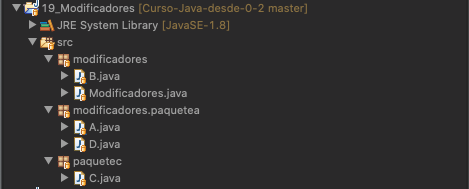

# 5. Revisitando clases y objetos 49m
   * Argumento de un método y tipos de retorno 13:36 
   * Paso de argumento por valor y referencia 8:18 
   * Modificadores de acceso 12:39 
   * Métodos estáticos y variables estáticas 8:19 
   * Sobrecarga de métodos y constructores 7:07 
   * Contenido adicional 5
   
## 17. Argumento de un método y tipos de retorno 13:36 

[Argumento de un método y tipos de retorno](pdfs/17_Argumentos_y_tipos_de_retorno.pdf)


### 17.1 Tipos de retorno


Un método puede volver al código desde donde se invocó de varias maneras:

1. Por completar la ejecución de todas las sentencias que conforman el método.
2. Por el uso de una sentencia `return`.
3. Por un comportamiento erróneo (lo aprenderemos más adelante).


#### 17.1.1 Métodos que no devuelven ningún valor

Si un método no devuelve ningún valor, el tipo de retorno será `void`. Si tratamos de devolver algún valor (con `return`) en un método marcado como `void`, obtendremos un error de compilación.

#### 17.1.2 Métodos que devuelven un tipo primitivo


Ya hemos comprobado que un método puede devolver un tipo primitivo, mediante la sentencia `return`. También puede devolver un array (multidimensional) de tipos primitivos.

```java
public class Rectangulo {

    //atributos y otros métodos
    public float getArea() {
      return base*altura;
    }

}
```

#### 17.1.3 Métodos que devuelven un objeto


Un método también puede tener un tipo de retorno una clase, y servirá para devolver una instancia del mismo. También puede devolver un array de objetos.

```java
public class Punto {

  float x;
  float y;

  //...

}

public class Rectangulo {

    //atributos y otros métodos
    public Punto[] getPuntos() {
      //return ....
    }

}
```

#### 17.1.4 Código

*ArgumentosTiposRetorno.java*

```java
package argumentos;

/**
 * @author 
 *
 */
public class ArgumentosTiposRetorno {

	/**
	 * @param args
	 */
	public static void main(String[] args) {
		imprimeMensajes("En un lugar", "de La Mancha");
		imprimeMensajes("de cuyo nombre", "no quiero acordarme", "no ha mucho tiempo");
		imprimeMensajes("...");
		imprimeMensajes();
	}
	
	public static void imprimeMensajes(String... mensajes) {
		
		for(String mensaje : mensajes) {
			System.out.print(mensaje + " ");
		}
		System.out.println("");
		
	}

}

SALIDA: 

En un lugar de La Mancha 
de cuyo nombre no quiero acordarme no ha mucho tiempo 
... 
```

*Punto.java*

```java
package argumentos;

public class Punto {
	
	float x, y;

	public Punto(float x, float y) {
		this.x = x;
		this.y = y;
	}

	public float getX() {
		return x;
	}

	public void setX(float x) {
		this.x = x;
	}

	public float getY() {
		return y;
	}

	public void setY(float y) {
		this.y = y;
	}

	@Override
	public String toString() {
		return "Punto [x=" + x + ", y=" + y + "]";
	}
}
```

*.java*

```java
package argumentos;

import java.util.Arrays;

/**
 * @author 
 *
 */
public class Rectangulo {
	
	private Punto[] puntos;
	
	public Rectangulo(Punto p1, Punto p2, Punto p3, Punto p4) {
		puntos = new Punto[]{p1, p2, p3, p4};
	}

	public Rectangulo(Punto[] puntos) {
		this.puntos = puntos;
	}

	public Punto[] getPuntos() {
		return puntos;
	}

	public void setPuntos(Punto[] puntos) {
		this.puntos = puntos;
	}

	@Override
	public String toString() {
		return "Rectangulo [puntos=" + Arrays.toString(puntos) + "]";
	}
}
```

### 17.2 Paso de argumentos


Un método puede recibir cuantos argumentos necesitemos para realizar una operación. Estos pueden ser:

* De un tipo primitivo
* Un array (multidimensional)
* De una clase definida por Java o por nosotros mismos.

```java
public Rectangulo rectanguloDePuntos(Punto[] esquinas) {
    //...cuerpo del método...
}
```

#### 17.2.1 Número *arbitrario* de argumentos


Desde hace algunas versiones, Java incluye la opción de usar *varargs* para indicar que un método recibirá un número arbitrario de argumentos de un tipo. Estos son útiles cuando no sabemos a priori la cantidad de argumentos que recibiremos.

Para usarlos usaremos la sintaxis de tres puntos seguidos (`...`), justo después del tipo de dato, y separados por un espacio del nombre del argumento.

```java
public Poligono poligonoDePuntos(Punto... esquinas) {
    int numeroLados = esquinas.length;
    double raizDelLado1, longitudLado1;
    raizDelLado1 = (corners[1].x - corners[0].x)
                     * (corners[1].x - corners[0].x)
                     + (corners[1].y - corners[0].y)
                     * (corners[1].y - corners[0].y);
    longitudLado1 = Math.sqrt(raizDelLado1);

    // continuación del cuerpo del método
}
```

Dentro del método, un *varargs* se trata igual que un array.

***¡IMPORTANTE!** Un método que reciba varios argumentos de diferentes tipos, y además, un varargs, debe incluir este como el último en orden de recepción. De otra forma, sería imposible identificar el número de argumentos recibidos mediante el varargs.*

## 18. Paso de argumento por valor y referencia 8:18 

[Paso de argumento por valor y referencia](pdfs/18_Paso_por_valor_y_referencia.pdf)

18_Paso_por_valor_y_referencia


### 18.1 Paso por valor y paso por referencia


* Paso por `valor`: cuando un método recibe unos argumentos por valor, realiza una copia de estos, y si modifica su contenido, dichas modificaciones no duran más allá del final de la ejecución del método.

* Paso por `referencia`: cuando un método recibe unos argumentos por referencia, **no** realiza una copia, sino que trabaja con los valores reales, por lo que si modifica sus valores, dichas modificaciones duran más allá del final de la ejecución del método.

En Java, **solamente existe el paso por valor**, si bien podemos matizar esto.

### 18.2 Paso de tipos de datos primitivos


Los argumentos de tipo primitivo, como `int` o `double`, siempre se pasan por valor. Por tanto, si modificamos, sus valores tras la ejecución del método no habrán cambiado.

```java
public class PasoPorValor {

    public static void main(String[] args) {

        int x = 3;

        //invocamos el argumento y le pasamos x
        pasoPorValor(x);

        //imprimimos x y vemos si el parámetro ha cambiado
        System.out.println("Después de invocar pasoPorValor, x = " + x);

    }

    // cambiamos el valor en el método
    public static void pasoPorValor(int p) {
        p = 10;
    }
}
```

La salida de la ejecución del programa será `Después de invocar pasoPorValor, x = 3`.

### 18.3 Paso de objetos


Si en lugar de tipos primitivos, pasamos objetos, estos también se pasan por valor. Es decir, que cuando termina la ejecución del método, la referencia seguirá apuntando al mismo objeto. **Sin embargo, el estado del método puede haberse visto modificado, y estos cambios si sobreviven al final del método`*`**.

```java
public void moveCircle(Circle circle, int deltaX, int deltaY) {
    // code to move origin of circle to x+deltaX, y+deltaY
    circle.setX(circle.getX() + deltaX);
    circle.setY(circle.getY() + deltaY);

    // code to assign a new reference to circle
    circle = new Circle(0, 0);
}

//...

moveCircle(myCircle, 23, 56)
```

Primero, modificamos los valores X e X del círculo, y posteriormente, asignamos la referencia a una nueva instancia. Si verificamos el objeto tras la ejecución del método, comprobaremos que la referencia *apunta* al objeto inicial, y sus valores sí se han visto modificados.

### 18.4 Código

*PasoPorValor.java*

```java
package valoryreferencia;

/**
 * @author 
 *
 */
public class PasoPorValor {

	/**
	 * @param args
	 */
	public static void main(String[] args) {

		int x = 3;
		System.out.println("Antes de invocar pasoPorValor, x = " + x);

		// invocamos el argumento y le pasamos x
		pasoPorValor(x);

		// imprimimos x y vemos si el parámetro ha cambiado
		System.out.println("Después de invocar pasoPorValor, x = " + x);

	}

	// cambiamos el valor en el método
	public static void pasoPorValor(int p) {
		p = 10;
		System.out.println("Cambiamos el valor en el método, x = " + p);
	}
}


SALIDA:

Antes de invocar pasoPorValor, x = 3
Cambiamos el valor en el método, x = 10
Después de invocar pasoPorValor, x = 3
```

*Circle.java*

```java
package valoryreferencia;

public class Circle {
	
	private int x;
	private int y;
	private int radius;
	
	public Circle(int x, int y) {
		super();
		this.x = x;
		this.y = y;
		this.radius = 1;
	}


	public Circle(int x, int y, int radius) {
		super();
		this.x = x;
		this.y = y;
		this.radius = radius;
	}


	public int getX() {
		return x;
	}


	public void setX(int x) {
		this.x = x;
	}


	public int getY() {
		return y;
	}


	public void setY(int y) {
		this.y = y;
	}


	public int getRadius() {
		return radius;
	}


	public void setRadius(int radius) {
		this.radius = radius;
	}


	@Override
	public String toString() {
		return "Circle [x=" + x + ", y=" + y + ", radius=" + radius + "]";
	}
}
```

*PasoPorReferencia.java*

```java
package valoryreferencia;

/**
 * @author 
 *
 */
public class PasoPorReferencia {

	/**
	 * @param args
	 */
	public static void main(String[] args) {
		Circle circle = new Circle(2,3);
		
		System.out.println(circle);
		
		moveCircle(circle, 23, 56);
		
		System.out.println(circle);

	}
	
	public static void moveCircle(Circle circle, int deltaX, int deltaY) {
	    // code to move origin of circle to x+deltaX, y+deltaY
	    circle.setX(circle.getX() + deltaX);
	    circle.setY(circle.getY() + deltaY);

	    // code to assign a new reference to circle
	    circle = new Circle(0, 0);
	}
}


SALIDA:

Circle [x=2, y=3, radius=1]
Circle [x=25, y=59, radius=1]
```

## 19. Modificadores de acceso 12:39 

[Modificadores de acceso](pdfs/19_Modificadores_de_acceso.pdf)


### 19.1 Modificadores de acceso


Modificador |	Clase |	Paquete	| Subclase | El mundo
------------|-------|---------|----------|---------
public | Sí | Sí | Sí | Sí
protected | Sí | Sí | Sí | No
Sin modificador | Sí | Sí | No | No
private | Sí | No |	No | No

### 19.2 Modificadores a nivel de Clase


Nuestras clases deberían ser `public` casi siempre. Solo en casos más avanzados veremos que podemos tener otros tipos de clases donde nos interesaría que no lo fueran.

### 19.3 Modificadores a nivel de métodos


Para métodos y atributos, intentemos siempre escoger la versión más restrictiva. Los métodos deberían ser siempre `public`, salvo que realicen operaciones auxiliares; en ese caso los podemos marcar como `private`. Los constructores deben ser `public`.

### 19.4 Modificadores a nivel de atributos.


Deben ser `private` salvo para constantes (que deben ser `public`). Los atributos no privados aumentan el acoplamiento del código y limitan la flexibilidad para cambiar código en el futuro.

### 19.5 Código




*B.java*

```java
package modificadores;

class B {
	
	String b;
	
	B() {
		b = "Hola desde B";
	}

	String getB() {
		return b;
	}

	void setB(String b) {
		this.b = b;
	}
	
	/*String aMasB(A a) {
		return a.getA() + b;  
	}*/
}
```

*Modificadores.java*

```java
/**
 * 
 */
package modificadores;

import paquetec.C;

/**
 * @author Openwebinars
 *
 */
public class Modificadores {

	/**
	 * @param args
	 */
	public static void main(String[] args) {
		
		//A a = new A();  //A no es accesible, aunque está en un subpaquete
		B b = new B();		
		System.out.println(b.b); //Esta opción no suele ser recomendable
		System.out.println(b.getB());
		
		C c = new C();
		//System.out.println(c.c); //Si intentamos acceder al atributo, error
		System.out.println(c.getC());
		
		

	}

}


SALIDA:

Hola desde B
Hola desde B
Hola desde C
```

*A.java*

```java
package modificadores.paquetea;

class A {
	
	String a;
	
	A() {
		a = "Hola desde A";
	}
	
	void setA(String a) {
		this.a = a;
	}
	
	String getA() { return this.a; }
}
```

*D.java*

```java
package modificadores.paquetea;

public class D {
	// Dentro del mismo paquete sí que podemos usar A
	A a;

}
```

*C.java*

```java
package paquetec;

public class C {
	
	private String c;
	
	public C() {
		c = "Hola desde C";
	}

	public String getC() {
		return c;
	}

	public void setC(String c) {
		this.c = c;
	}
}
```

## 20. Métodos estáticos y variables estáticas 8:19 

[Métodos estáticos y variables estáticas](pdfs/20_Métodos_y_variables_estáticas.pdf)


### 20.1 Atributos de objeto y de clase


Java nos permite crear cuantos objetos queramos de una misma clase. Estos objetos tienen una copia propia de los atributos. Sin embargo, en ocasiones, puede interesarnos tener un atributo común a todos los objetos. Estos son los atributos `static`.

Están asociados a la clase, y compartidos para todas las instancias. Pueden ser manipulados por cualquier objeto, o incluso sin crear una instancia de esa clase.


### 20.2 Métodos estáticos


Se rigen por los mismos principios de los atributos estáticos. Para invocar:

```java
Clase.metodoEstatico(...);
```

Para acceder a una variable estática, necesitamos hacerlo desde un método estático. También podemos crear métodos estáticos como métodos de operaciones auxiliares (recordemos todos los métodos de la clase `java.util.Arrays`).

### 20.3 Constantes


Se pueden definir como `static`.

```java
static final PI = 3.141592653589793;
```

### 20.4 Código

*Bicicleta.java*

```java
package bicicleta;

public class Bicicleta {
	
	private int numMarchas;
	private int diametroRueda;
	private int velocidad;
	private int id;
	
	
	//Variable estática
	//Compartida para todas las instancias.
	private static int numeroDeBiciletas = 0;
	
	public static int getNumeroDeBicicletas() {
		//No podemos usar this
		//return this.numeroDeBiciletas;
		return numeroDeBiciletas;
	}


	public Bicicleta(int numMarchas, int diametroRueda, int velocidad) {
		this.numMarchas = numMarchas;
		this.diametroRueda = diametroRueda;
		this.velocidad = velocidad;
		id = ++numeroDeBiciletas;
	}


	public int getNumMarchas() {
		return numMarchas;
	}


	public void setNumMarchas(int numMarchas) {
		this.numMarchas = numMarchas;
	}


	public int getDiametroRueda() {
		return diametroRueda;
	}


	public void setDiametroRueda(int diametroRueda) {
		this.diametroRueda = diametroRueda;
	}


	public int getVelocidad() {
		return velocidad;
	}


	public void setVelocidad(int velocidad) {
		this.velocidad = velocidad;
	}


	public int getId() {
		return id;
	}


	public void setId(int id) {
		this.id = id;
	}


	@Override
	public String toString() {
		return "Bicicleta [numMarchas=" + numMarchas + ", diametroRueda=" + diametroRueda + ", velocidad=" + velocidad
				+ ", id=" + id + "]";
	}
}
```

*Estaticos.java*

```java
package bicicleta;

/**
 * @author 
 *
 */
public class Estaticos {

	/**
	 * @param args
	 */
	public static void main(String[] args) {
		
		Bicicleta bici1 = new Bicicleta(21, 27, 0);
		Bicicleta bici2 = new Bicicleta(18, 24, 0);
		
		System.out.println(bici1);
		System.out.println(bici2);
		
		//bici1.getNumeroDeBicicletas();
		System.out.println(Bicicleta.getNumeroDeBicicletas());
	}
}


SALIDA:

Bicicleta [numMarchas=21, diametroRueda=27, velocidad=0, id=1]
Bicicleta [numMarchas=18, diametroRueda=24, velocidad=0, id=2]
2
```

## 21. Sobrecarga de métodos y constructores 7:07 

[Sobrecarga de métodos y constructores](pdfs/21_Sobrecarga_de_métodos_y_constructores.pdf)


### 21.1 Sobrecarga de métodos


Java permite que una clase tenga dos o más metodos con el mismo nombre, siempre que su firma (es decir, el número de atributos y/o su tipo) sea diferente:

```java
public class Artista {


    public void dibuja(String s) {
        System.out.println(s);
    }

    public void dibuja(int i) {
        System.out.println(i);
    }

    public void dibuja(double f) {
        System.out.println(f);
    }

    public void dibuja(int i, double f) {
        System.out.println(i);
        System.out.println(f);
    }

}
```

### 21.2 Sobrecarga de constructores


También permite tener varios constructores por clase, que siguen las mismas reglas que los métodos:

```java
public class Persona {

    private String nombre;
    private String apellidos;
    private int edad;
    private int altura;
    private float peso;


    public Persona() {
    }

    public Persona(String nombre, String apellidos) {
        this.nombre = nombre;
        this.apellidos = apellidos;
    }


    public Persona(String nombre, String apellidos, int edad) {
        this.nombre = nombre;
        this.apellidos = apellidos;
        this.edad = edad;
    }

    public Persona(String nombre, String apellidos, int edad, int altura, float peso) {
        this.nombre = nombre;
        this.apellidos = apellidos;
        this.edad = edad;
        this.altura = altura;
        this.peso = peso;
    }

  //...
}
```

### 21.3 Código

*Artista.java*

```java
package sobrecarga;

public class Artista {
	
	
	public void dibuja(String s) {
		System.out.println(s);
	}
	
	public void dibuja(int i) {
		System.out.println(i);
	}
	
	public void dibuja(double f) {
		System.out.println(f);
	}
	
	public void dibuja(int i, double f) {
		System.out.println(i);
		System.out.println(f);
	}
}
```

*Persona.java*

```java
package sobrecarga;

public class Persona {

	private String nombre;
	private String apellidos;
	private int edad;
	private int altura;
	private float peso;
	
	
	public Persona() {
	}
	
	public Persona(String nombre, String apellidos) {
		this.nombre = nombre;
		this.apellidos = apellidos;
	}
	

	public Persona(String nombre, String apellidos, int edad) {
//		this.nombre = nombre;
//		this.apellidos = apellidos;
		this(nombre, apellidos);
		this.edad = edad;
	}
	
	public Persona(String nombre, String apellidos, int edad, int altura, float peso) {
//		this.nombre = nombre;
//		this.apellidos = apellidos;
//		this.edad = edad;
		this(nombre, apellidos, edad);
		this.altura = altura;
		this.peso = peso;
	}

	public String getNombre() {
		return nombre;
	}
	public void setNombre(String nombre) {
		this.nombre = nombre;
	}
	public String getApellidos() {
		return apellidos;
	}
	public void setApellidos(String apellidos) {
		this.apellidos = apellidos;
	}
	public int getEdad() {
		return edad;
	}
	public void setEdad(int edad) {
		this.edad = edad;
	}
	public int getAltura() {
		return altura;
	}
	public void setAltura(int altura) {
		this.altura = altura;
	}
	public float getPeso() {
		return peso;
	}
	public void setPeso(float peso) {
		this.peso = peso;
	}
	
	@Override
	public String toString() {
		return "Persona [nombre=" + nombre + ", apellidos=" + apellidos + ", edad=" + edad + ", altura=" + altura
				+ ", peso=" + peso + "]";
	}
}
```

*Sobrecarga.java*

```java
/**
 * 
 */
package sobrecarga;

/**
 * @author Openwebinars
 *
 */
public class Sobrecarga {

	/**
	 * @param args
	 */
	public static void main(String[] args) {
		Artista artista = new Artista();
		
		artista.dibuja("Hola");
		artista.dibuja(7);
		artista.dibuja(7, 8.3f);
		
		
		Persona perso1 = new Persona();
		Persona perso2 = new Persona("Pepe", "Pérez");
		Persona perso3 = new Persona("Alejandro", "Ruiz", 33);
		Persona perso4 = new Persona("Miguel", "Gómez", 25, 180, 75f);
		
		System.out.println(perso1);
		System.out.println(perso2);
		System.out.println(perso3);
		System.out.println(perso4);	
	}
}


SALIDA:

Hola
7
7
8.300000190734863
Persona [nombre=null, apellidos=null, edad=0, altura=0, peso=0.0]
Persona [nombre=Pepe, apellidos=Pérez, edad=0, altura=0, peso=0.0]
Persona [nombre=Alejandro, apellidos=Ruiz, edad=33, altura=0, peso=0.0]
Persona [nombre=Miguel, apellidos=Gómez, edad=25, altura=180, peso=75.0]
```

## Contenido adicional 5   

[Argumento de un método y tipos de retorno](pdfs/17_Argumentos_y_tipos_de_retorno.pdf)

[Paso de argumento por valor y referencia](pdfs/18_Paso_por_valor_y_referencia.pdf)

[Modificadores de acceso](pdfs/19_Modificadores_de_acceso.pdf)

[Métodos estáticos y variables estáticas](pdfs/20_Métodos_y_variables_estáticas.pdf)

[Sobrecarga de métodos y constructores](pdfs/21_Sobrecarga_de_métodos_y_constructores.pdf)
