# 5. Revisitando clases y objetos 49m
   * 17 Argumento de un método y tipos de retorno 13:36 
   * 18 Paso de argumento por valor y referencia 8:18 
   * 19 Modificadores de acceso 12:39 
   * 20 Métodos estáticos y variables estáticas 8:19 
   * 21 Sobrecarga de métodos y constructores 7:07 
   * Contenido adicional 5
   
# 17. Argumento de un método y tipos de retorno 13:36 

[Argumento de un método y tipos de retorno](pdfs/17_Argumentos_y_tipos_de_retorno.pdf)

## Resumen del Profesor

### 17.1 Tipos de retorno

Un método puede volver al código desde donde se invocó de varias maneras:

1. Por completar la ejecución de todas las sentencias que conforman el método.
2. Por el uso de una sentencia `return`.
3. Por un comportamiento erróneo (lo aprenderemos más adelante).

#### 17.1.1 Métodos que no devuelven ningún valor

Si un método no devuelve ningún valor, el tipo de retorno será `void`. Si tratamos de devolver algún valor (con `return`) en un método marcado como `void`, obtendremos un error de compilación.

#### 17.1.2 Métodos que devuelven un tipo primitivo

Ya hemos comprobado que un método puede devolver un tipo primitivo, mediante la sentencia `return`. También puede devolver un array (multidimensional) de tipos primitivos.

```java
public class Rectangulo {

   //atributos y otros métodos
   public float getArea() {
      return base*altura;
   }

}
```

#### 17.1.3 Métodos que devuelven un objeto

Un método también puede tener un tipo de retorno una clase, y servirá para devolver una instancia del mismo. También puede devolver un array de objetos.

```java
public class Punto {

   float x;
   float y;

   //...

}

public class Rectangulo {

   //atributos y otros métodos
   public Punto[] getPuntos() {
      //return ....
   }

}
```

### 17.2 Paso de argumentos

Un método puede recibir cuantos argumentos necesitemos para realizar una operación. Estos pueden ser:

* De un tipo primitivo
* Un array (multidimensional)
* De una clase definida por Java o por nosotros mismos.

```java
public Rectangulo rectanguloDePuntos(Punto[] esquinas) {
    //...cuerpo del método...
}
```

#### 17.2.1 Número *arbitrario* de argumentos

Desde hace algunas versiones, Java incluye la opción de usar *varargs* para indicar que un método recibirá un número arbitrario de argumentos de un tipo. Estos son útiles cuando no sabemos a priori la cantidad de argumentos que recibiremos.

Para usarlos usaremos la sintaxis de tres puntos seguidos (`...`), justo después del tipo de dato, y separados por un espacio del nombre del argumento.

```java
public Poligono poligonoDePuntos(Punto... esquinas) {
   int numeroLados = esquinas.length;
   double raizDelLado1, longitudLado1;
   raizDelLado1 = (corners[1].x - corners[0].x)
                     * (corners[1].x - corners[0].x)
                     + (corners[1].y - corners[0].y)
                     * (corners[1].y - corners[0].y);
   longitudLado1 = Math.sqrt(raizDelLado1);

   // continuación del cuerpo del método
}
```

Dentro del método, un *varargs* se trata igual que un array.

***¡IMPORTANTE!** Un método que reciba varios argumentos de diferentes tipos, y además, un varargs, debe incluir este como el último en orden de recepción. De otra forma, sería imposible identificar el número de argumentos recibidos mediante el varargs.*

## Transcripción


Vamos a comenzar este nuevo capítulo en el que vamos a revisitar *Clases y Objetos* y vamos a comenzar con  el tipo de retorno de los métodos y los argumentos que pueden recibir.


Comencemos con los tipos de retorno.

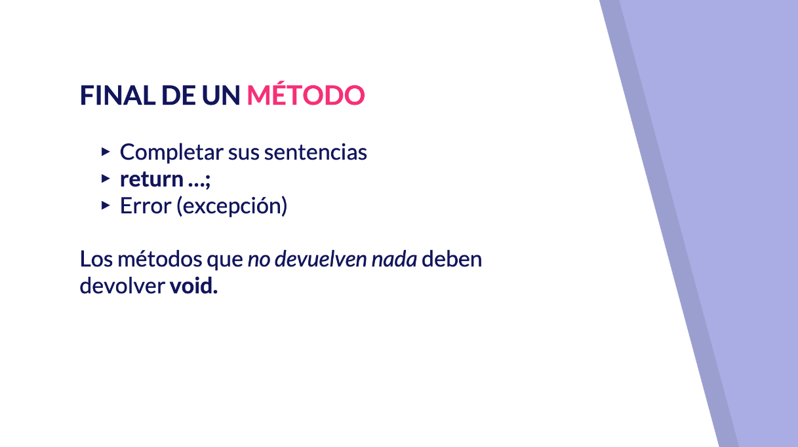

El tipo de retorno marca el tipo de valor que puede devolver un método cuando complete la ejecución de todas sus sentencias puede producir un determinado valor como resultado de esa operación, la manera de devolver un valor concreto es mediante la sentencia `return` y podría incluso devolver un error, cosa que veremos más adelante. 

Los métodos que no devuelven nada, que simplemente agrupan un grupo de sentencias  para realizar una serie de operaciones de manera conjunta, no es que no devuelvas nada sino que devuelven un valor vacío que Java se llama `void `. 

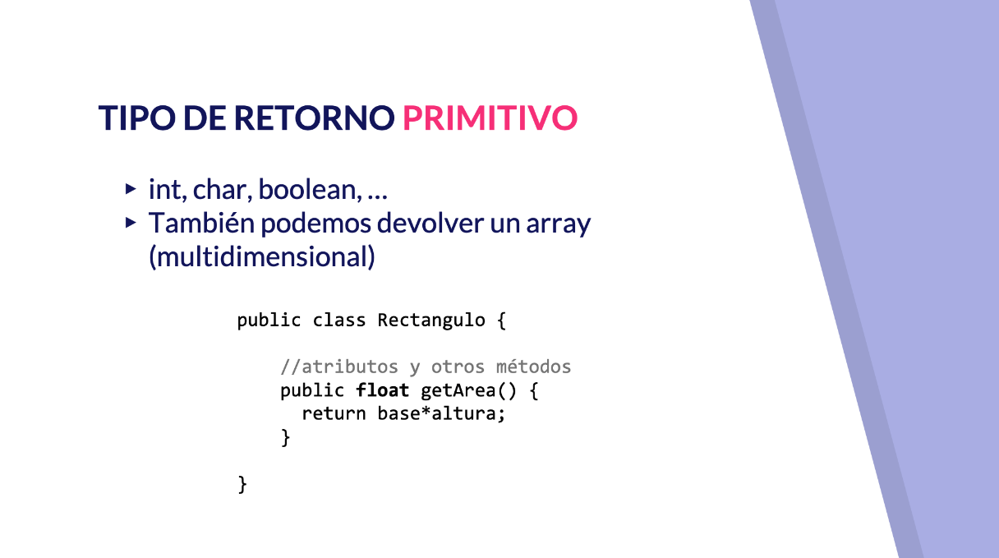

Hasta ahora hemos visto algunos métodos que devuelven tipos primitivos cuyo tipo de retorno era primitivo y también podemos tener métodos que devuelvan un array, incluso un array multidimensional, los métodos getters y setters de las clases que hemos visto hasta ahora en especial los getters hemos visto que devolvían tipos primitivos e incluso `Strings`.

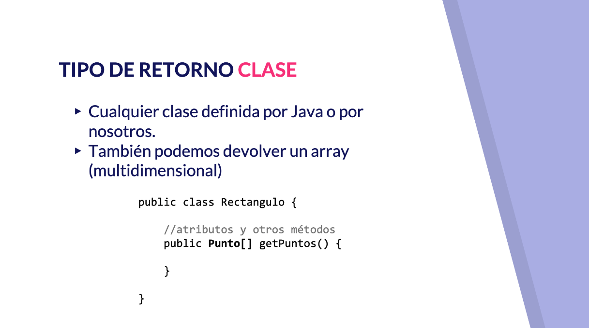

También podemos tener métodos que retornen instancias de una clase, tanto si la hemos definido nosotros, como si esta definida por Java, el uso de métodos que devuelven `String` como el método `toString()` ues uno de los que más hemos podido ver hasta ahora y aquí tenemos otro ejemplo, si un rectángulo viene definido por 4 puntos podríamos devolver todos los puntos de un rectángulo en un array de puntos.

Vamos a hacer una pequeña prueba sobre esto.

### :computer: `101-17-ArgumentosTiposRetorno`

Vamos a crear la clase `Punto`, un punto viene definido por sus coordenadas (x,y). Con Eclipse podemos generar el constructor con argumentos, los métodos getters y setters y el método `toString`.

*`Punto`*

```java
package argumentos;

public class Punto {
	
   float x, y;

   public Punto(float x, float y) {
      this.x = x;
      this.y = y;
   }

   public float getX() {
      return x;
   }

   public void setX(float x) {
      this.x = x;
   }

   public float getY() {
      return y;
   }

   public void setY(float y) {
      this.y = y;
   }

   @Override
   public String toString() {
      return "Punto [x=" + x + ", y=" + y + "]";
   }
}
```

Ya que hemos terminado la clase `Punto` podríamos indicar que un rectángulo viene delimitado por 4 puntos en una clase `Rectangulo`. O incluso existen múltiples manera de limitar un rectángulo, porque podríamos poner un punto que sería su esquina superior izquierda y una base y una altura, lo podríamos hacer con esas dos versiones.

Por ver que podemos devolver un array, una serie de instancias de una clase que hemos creado lo vamos a hacer de la manera del array de puntos. Podríamos crear un constructor manualmente lo pudiéramos inicializar así, esta sería una manera de reaprovechar las cuatro referencias de punto que recibimos como argumentos para poder crear el array de puntos. 

Vimos en su momento que teníamos la notación de paréntesis para agrupar valores, pero si nos damos cuenta esto nos produce error.

```java
puntos = {p1, p2, p3, p4};
```

y es que esto solamente puede ser cuando se declara una variable:

```java
Punto[] puntos2 = {p1, p2, p3, p4};
```

Pero sin embargo si podríamos hacerlo creandolo directamente así al vuelo:

```java
puntos = new Punto[]{p1, p2, p3, p4};
```

Podríamos crear el resto de cosas con Eclipse es decir el constructor, getters y setters, método `toString`, por lo que la clase completa queda así:


*`Rectangulo`*

```java
package argumentos;

import java.util.Arrays;

public class Rectangulo {
	
   private Punto[] puntos;
	
   public Rectangulo(Punto p1, Punto p2, Punto p3, Punto p4) {
      puntos = new Punto[]{p1, p2, p3, p4};
   }

   public Rectangulo(Punto[] puntos) {
      this.puntos = puntos;
   }

   public Punto[] getPuntos() {
      return puntos;
   }

   public void setPuntos(Punto[] puntos) {
      this.puntos = puntos;
   }

   @Override
   public String toString() {
      return "Rectangulo [puntos=" + Arrays.toString(puntos) + "]";
   }
}
```

Al generar los métodos getters podemos comprobar como el método `getPuntos()` va a devolver un array de puntos como tipo de retorno.

Cómo podemos ver en base al tipo de retorno en Java podemos devolver un valor vacío `void`, un un valor ya  sea primitivo, instancia de clase, array, etc., todo lo complejo que queramos, el método `getPuntos()` realmente va a devolver cuatro puntos, pero está devolviendo un solo valor de tipo array de punto, el tipo de retorno también podría ser una instancia en particular de una clase. Lo podemos observar con el método `toString()` lo que devuelve es una instancia de la clase `String`. Esto con respecto a los tipos de retorno.


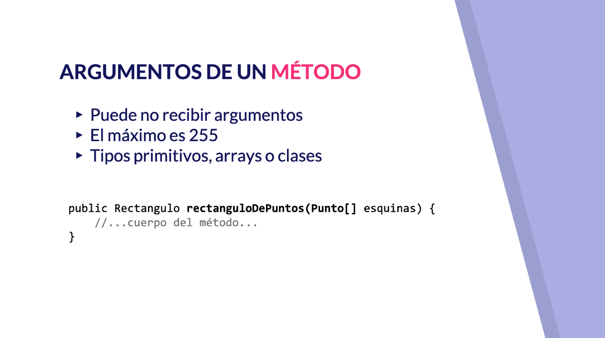

Pasemos a hablar ahora del paso de argumentos, es decir que un método puede recibir una serie de argumentos de entrada para para poder hacer alguna operaciones con ella y es que en muchas ocasiones un método de una clase no va a trabajar solamente con las propiedades internas de esa instancia de la clase, sino que va a recibir algún tipo de valor externo para complementar esos valores con los valores internos y realizar algún tipo de operación, puede ser una operación de inicializacion, cálculo, el seteo de un valor de cualquier tipo que nos pudiéramos imaginar. También hemos visto métodos que no reciben argumento un ejemplo claro era los método getters, solamente tenemos que indicar que se abre y cierra paréntesis y que no va a haber nada en medio.

El máximo número de argumentos que pueden recibir un método es de 255, yo no recomiendo que jamás llegar a esa cantidad de valores, porque seguramente entonces no estamos diseñando bien el método y podamos fraccionar eso en otros métodos que vayan trabajando de otra manera y el tipo de datos que se puede recibir en una clase son tipo primitivo, arrays, clase o cualquier combinación de ellos.

En la diapositiva tenemos un ejemplo de un método que crearía a partir de un array de puntos indicando, la esquina, crearía un rectángulo, está recibiendo un array de instancias de puntos.

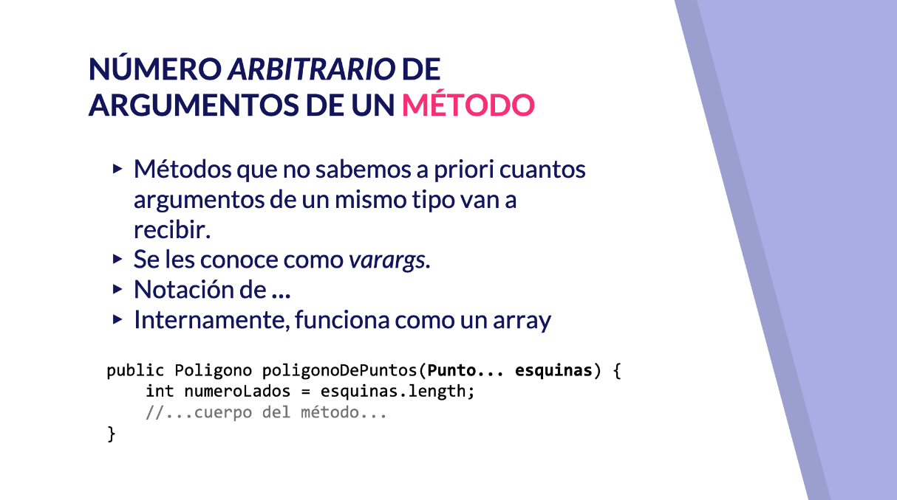

También existe desde hace varias versiones de Java la posibilidad de definir un método que va a recibir un **número arbitrario de argumentos** de un determinado tipo.

Podemos tener un método que a priori no sabemos cuántos argumentos de un mismo tipo va a recibir, puede que reciba ninguno, 1, 2, 3, etc., a este concepto de un número variable de argumentos se me llama **`varargs`**.
Se implementa con la notación de 3 puntos seguidos, cómo podemos ver en pantalla, podríamos tener en lugar de para la clase rectángulo, podemos intentar definir un polígono en base a una serie de puntos, pero los polígonos pueden ser de diferente número de lados, el número de lados vendría delimitado por la cantidad de puntos que nosotros pudiéramos marcar como esquinas, un rectángulo ya sabemos que tiene cuatro puntos que delimitan sus esquinas, un triángulo tres y a partir de ahí podríamos ir incrementando en función del número de esquinas, el número de lados que tendría ese polígono, *en lugar de crear un método para cada uno de los lados del polígono o en lugar de crear un método que recibe un array de de punto* nos podemos plantear el implementar un método que reciba un `varargs`, si bien es cierto que de manera interna un `varargs` va a funcionar dentro del método que se recibe como si fuera un array.

Vamos a ver un ejemplo que nos pueda mostrar esto del `varargs`.

Si quisiéramos tener un método que pudiera imprimir una serie de cadenas de caracteres por consola, independientemente del número de cadena de caracteres que recibiera que las imprimiera todas, lo podríamos hacer de esta manera:

```java
public static void imprimeMensajes(String... mensajes) {
   for (String mensaje : mensajes) {
      System.out.print(mensaje + " ");
   }
   System.out.println("");
}
```

Estamos recibiendo una serie de mensajes, pero en lugar de hacerlo en un `String` lo hacemos con un `varargs`, lo delimitados como tipo este `String... mensajes`, **es importante destacar que cuando un método incluye un número variable de argumentos tiene que ser el último argumento que reciba** de no ser así, no sabríamos diferenciar, si pusiéramos algo de este tipo.

```java
public static void imprimeMensajes(String... mensajes, String str) {
```

No sabría diferenciar bien diferenciar cuál es cuál, cuál pertenece al `varargs` y cual pertenece a otro, incluso con otro tipo de dato.

```java
public static void imprimeMensajes(String... mensajes, int str) {
```

Con lo cual si queremos recibir varios argumentos por separado y un `varargs`, el `varargs` tiene que ser el último.

```java
public static void imprimeMensajes(int str, String... mensajes) {
```

Si los pusiéramos al principio no tendríamos ningún tipo de inconveniente para poder recibirlo.

Como utilizar un método que está definido con `varargs` pues lo podemos hacer de esta manera.

```java
public static void main(String[] args) {
   imprimeMensajes("En un lugar", "de La Mancha");
   imprimeMensajes("de cuyo nombre", "no quiero acordarme", "no ha mucho tiempo");
   imprimeMensajes("...");
   imprimeMensajes();
}
```

Le podemos pasar tantas cadenas de caracteres como nosotros deseemos, primero estamos pasando dos, luego le estamos pasando tres, después le pasamos una y por último ninguna. A la hora de trabajar con él como hemos dicho este `varargs` se puede trabajar con él como si fuera un array, de hecho tiene su propiedad `length` y las propiedades que hemos tenido antes con los diferentes arrays y no le podríamos dar el tratamiento de un array.

### :computer: `101-17-ArgumentosTiposRetorno`

*`ArgumentosTiposRetorno`*

```java
public class ArgumentosTiposRetorno {
   
   public static void main(String[] args) {
      imprimeMensajes("En un lugar", "de La Mancha");
      imprimeMensajes("de cuyo nombre", "no quiero acordarme", "no ha mucho tiempo");
      imprimeMensajes("...");
      imprimeMensajes();
   }

   public static void imprimeMensajes(String... mensajes) {
      for (String mensaje : mensajes) {
         System.out.print(mensaje + " ");
      }
      System.out.println("");
   }
}
```

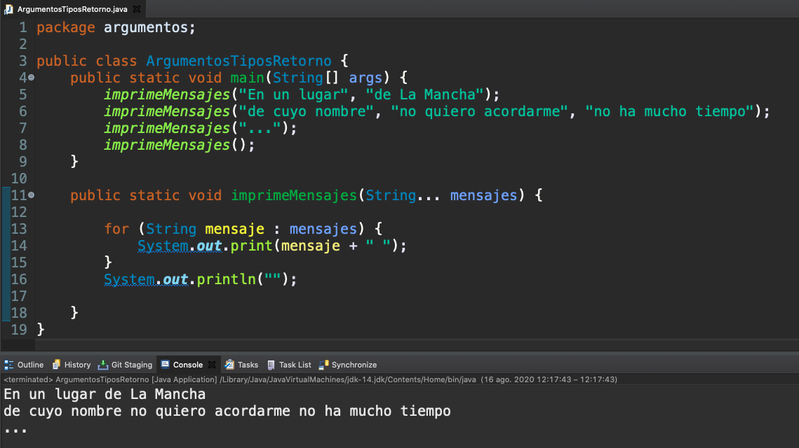


# 18. Paso de argumento por valor y referencia 8:18 

[Paso de argumento por valor y referencia](pdfs/18_Paso_por_valor_y_referencia.pdf)

## Resumen del Profesor

### 18.1 Paso por valor y paso por referencia

* Paso por `valor`: cuando un método recibe unos argumentos por valor, realiza una copia de estos, y si modifica su contenido, dichas modificaciones no duran más allá del final de la ejecución del método.

* Paso por `referencia`: cuando un método recibe unos argumentos por referencia, **no** realiza una copia, sino que trabaja con los valores reales, por lo que si modifica sus valores, dichas modificaciones duran más allá del final de la ejecución del método.

En Java, **solamente existe el paso por valor**, si bien podemos matizar esto.

### 18.2 Paso de tipos de datos primitivos

Los argumentos de tipo primitivo, como `int` o `double`, siempre se pasan por valor. Por tanto, si modificamos, sus valores tras la ejecución del método no habrán cambiado.

```java
public class PasoPorValor {

   public static void main(String[] args) {

      int x = 3;

      //invocamos el argumento y le pasamos x
      pasoPorValor(x);

      //imprimimos x y vemos si el parámetro ha cambiado
      System.out.println("Después de invocar pasoPorValor, x = " + x);

   }

   // cambiamos el valor en el método
   public static void pasoPorValor(int p) {
      p = 10;
   }
}
```

La salida de la ejecución del programa será `Después de invocar pasoPorValor, x = 3`.

### 18.3 Paso de objetos

Si en lugar de tipos primitivos, pasamos objetos, estos también se pasan por valor. Es decir, que cuando termina la ejecución del método, la referencia seguirá apuntando al mismo objeto. **Sin embargo, el estado del método puede haberse visto modificado, y estos cambios si sobreviven al final del método`*`**.

```java
public void moveCircle(Circle circle, int deltaX, int deltaY) {
   // code to move origin of circle to x+deltaX, y+deltaY
   circle.setX(circle.getX() + deltaX);
   circle.setY(circle.getY() + deltaY);

   // code to assign a new reference to circle
   circle = new Circle(0, 0);
}

//...

moveCircle(myCircle, 23, 56)
```

Primero, modificamos los valores X e X del círculo, y posteriormente, asignamos la referencia a una nueva instancia. Si verificamos el objeto tras la ejecución del método, comprobaremos que la referencia *apunta* al objeto inicial, y sus valores sí se han visto modificados.

## Transcripción

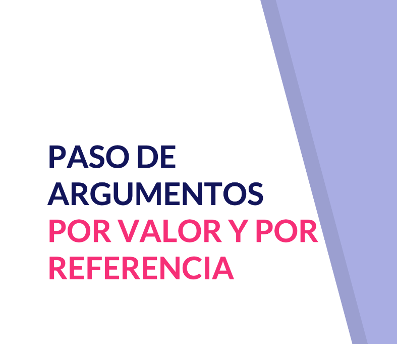

Vamos a hablar ahora en este curso de Java 8 del paso de argumentos por valor o por referencia.

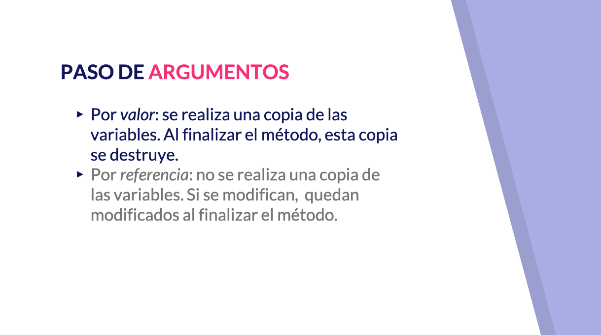

Vamos a diferenciar primero que significa **paso por valor** o **por referencia** como hemos visto en la lección anterior, los métodos pueden recibir una serie de argumentos, pueden recibir ninguno, uno o varios dependiendo de la operación que nosotros vayamos a realizar.

Hablamos de paso por valor cuando nosotros recibimos una serie de argumentos y Java realiza una copia de esas variables y al finalizar el método está copia se destruye, es decir nosotros le proporcionamos uno o varios valores, Java no van a modificar sus valores, Java copia esos valores y trabaja con ellos, se puede modificar está copia, se puede setear un nuevo valor, podemos incrementar o decrementar su valor, sin embargo cuándo termina la ejecución de este método esa copia se destruye. todo funciona mediante un marco de ejecución que se van anidando en una estructura de la memoria que se llama la PILA.

Basta con saber que cuando se hace un paso por valor se hace una copia de la variable y cuando termina el método esa copia se destruye.

Hablaríamos de paso por referencia cuando no se realiza una copia de las variables si no lo que estamos haciendo es modificar directamente la variable que hemos pasado y esos valores quedan modificados al finalizar el método.

En la diapositiva esta en color diferente porque el paso por referencia que si existe en otros lenguajes de programación por ejemplo aquellos que hayáis programada en C o en C++ que sabe que si es posible, **en Java el paso por referencia no existe** solamente existe el paso por valor.

Y porque ver los dos, bueno esta pregunta nos puede surgir, si tenemos que tener presente que **el paso de cualquier valor va a ser por valor pero vamos a diferenciar entre tipo primitivo y el paso de objetos**.


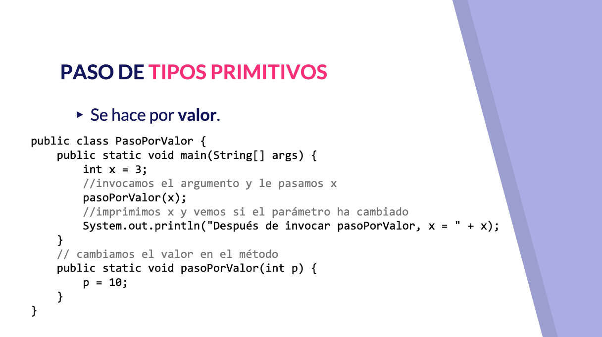

Como habíamos dicho los pasos de variables siempre se hacen por valor, qué sucede si hacemos el paso de tipos primitivos, bueno en este código de ejemplo que vamos a ejecutar ahora si tenemos una variable `x` que inicializamos con el valor 3, y si se la proporcionamos al método `pasoPorValor` podemos ver que el parámetro formal del método `pasoPorValor(int p)` lo hemos llamado `p` y bueno este método es lo que está haciendo es setear un nuevo valor a `p` como el paso se produce por valor, realmente cuando invocamos a este método este valor de `p` es una copia del valor de `x` con lo cual no es la misma variable, sino que lo que tiene es el mismo valor, cuando nosotros asignamos un valor de 10, cambia de manera efectiva el valor de `p`, pero no cambia el valor de `x`, con lo cual cuando termina la ejecución de de este método se destruye la variable `p` y `x` sigue valiendo 3, cómo vamos a poder comprobar ahora mismo.

### :computer: `101-18-PasoPorValorOReferencia`

*`PasoPorValor`*

```java
package valoryreferencia;

public class PasoPorValor {
   public static void main(String[] args) {

      int x = 3;

      // invocamos el argumento y le pasamos x
      pasoPorValor(x);

      // imprimimos x y vemos si el parámetro ha cambiado
      System.out.println("Después de invocar pasoPorValor, x = " + x);

   }

   // cambiamos el valor en el método
   public static void pasoPorValor(int p) {
      p = 10;
   }

}
```

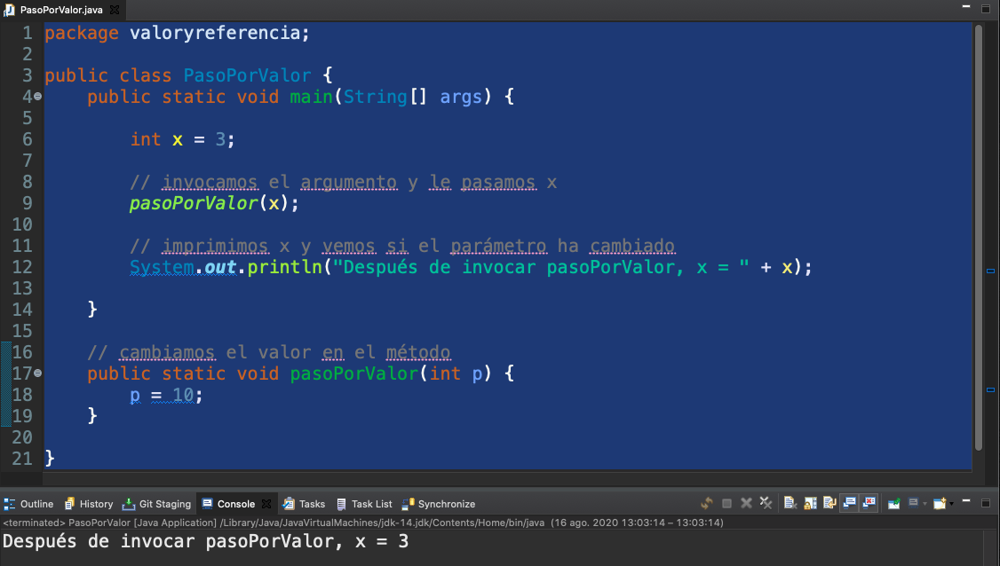

Podemos comprobar como el valor de `x` después de invocar al método `pasoPorValor` sigue valiendo 3, aunque nosotros lo hayamos setteado a 10 en el método `pasoPorValor` y es que como deciamos el paso de tipo primitivos se hace por valor.

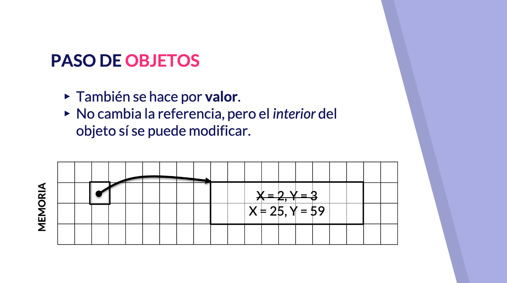

Qué pasa con los objetos, **el paso de objetos también se hace por valor**, pero aquí hay que tener en cuenta que es lo que nosotros estamos pasando, cuando nosotros pasamos un objeto a través de un método como argumento, lo que **estamos pasando es una referencia**, recordemos el concepto de referencia que era bueno una variable que nos permitía acceder al objeto que estaba en otras zonas de memoria, con lo cual mediante este paso por valor lo que no vamos a poder modificar dentro del método es esa referencia, es decir si cambiamos a qué objeto está apuntando esa referencia pues perderemos ese cambio cuando el método termine su ejecución, sin embargo si dentro del método modificamos algo del interior del objeto referenciado esos cambios si van a perdurar cuando nosotros terminemos la ejecución del método con lo cual aunque el paso también se ha por valor los objetos si pueden ser modificados dentro de los métodos. Repito lo que no podemos hacer es que esta referencia al terminar el método apuntara a otro objeto diferente del mismo tipo, va a seguir al mismo, pero el interior del objeto si se va a ver modificado si nosotros lo queremos.

### :computer: `101-18-PasoPorValorOReferencia`

Por ejemplo aquí tenemos la posibilidad de trabajar con una clase `Circulo` un `Circulo` viene delimitado por un punto del centro del círculo y por un radio, con varios constructores con sus métodos getters y sus métodos setters.

*`Circle`*

```java
package valoryreferencia;

public class Circle {
   private int x;
   private int y;
   private int radius;

   public Circle(int x, int y) {
      super();
      this.x = x;
      this.y = y;
      this.radius = 1;
   }

   public Circle(int x, int y, int radius) {
      super();
      this.x = x;
      this.y = y;
      this.radius = radius;
   }

   public int getX() {
      return x;
   }

   public void setX(int x) {
      this.x = x;
   }

   public int getY() {
      return y;
   }

   public void setY(int y) {
      this.y = y;
   }

   public int getRadius() {
      return radius;
   }

   public void setRadius(int radius) {
      this.radius = radius;
   }

   @Override
   public String toString() {
      return "Circle [x=" + x + ", y=" + y + ", radius=" + radius + "]";
   }
}
```

*`PasoPorReferencia`*

```java
package valoryreferencia;

public class PasoPorReferencia {
	
   public static void main(String[] args) {
      Circle circle = new Circle(2,3);	
      System.out.println(circle);
      moveCircle(circle, 23, 56);
      System.out.println(circle);
   }
	
   public static void moveCircle(Circle circle, int deltaX, int deltaY) {
      // code to move origin of circle to x+deltaX, y+deltaY
      circle.setX(circle.getX() + deltaX);
      circle.setY(circle.getY() + deltaY);

      // code to assign a new reference to circle
      circle = new Circle(0, 0);
   }
}
```

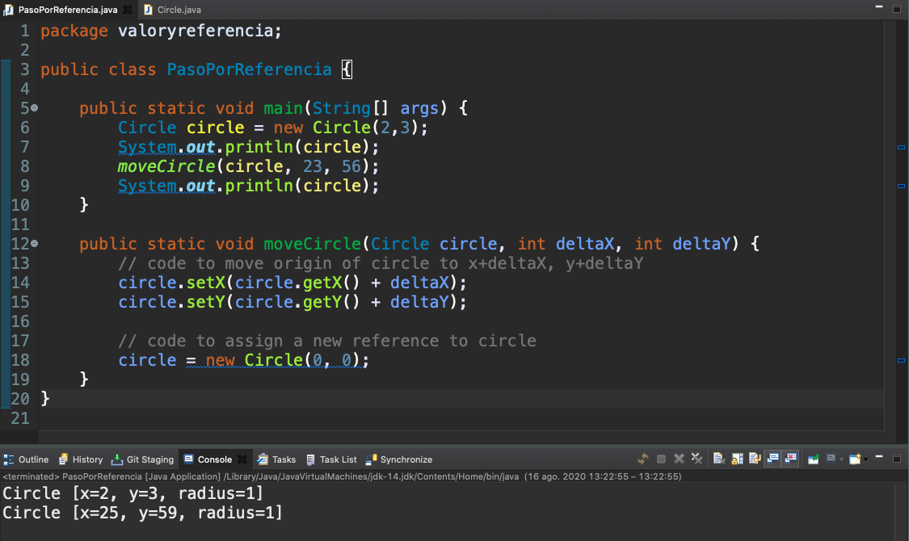

En el `PasoPorReferencia` nos podríamos hacer un círculo, en el punto (2,3), imprimir donde esta este círculo, si quisiéramos mover el círculo, estamos pasando la instancia del círculo a un método `moveCircle` junto con la cantidad que queremos mover dicho círculo y después lo imprimimos.

**El  método `moveCircle(Circle circle, int deltaX, int deltaY)` recibe la referencia `circle` que se pasa por valor, se hace una copia de la referencia, pero claro aquí lo que tendríamos son dos referencias apuntando a un mismo objeto, sin embargo si modificamos a través de esta segunda referencia el objeto y si se van a modificar los valores, de hecho aquí si le sumamos 23 a la `x` y 56 a `y` vamos a poder ver que aunque al final creemos una nueva referencia y la almacenemos en círculo, cuando imprimamos círculo, el valor no va a ser ni (0,0) ni siquiera va a ser el de (2,3) sino que el círculo se va haber modificado, cuando imprimimosla primera vez el círculo está en (2,3), al imprimirlo esta segunda vez hemos sumado 23 + 2 = 25 y 56 + 3 =59 sería del lugar donde hemos desplazado ese el círculo, de forma que podemos comprobar como utilizando está copia de la referencia, si podemos modificar el interior de un objeto y lo que no podríamos modificar es la referencia, que aunque hagamos una nueva asignación, esto se pierde cuando se termina y círculo afuera sigue apuntando a la misma referencia**.

# 19. Modificadores de acceso 12:39 

[Modificadores de acceso](pdfs/19_Modificadores_de_acceso.pdf)

## Resumen del Profesor

### 19.1 Modificadores de acceso

Modificador |	Clase |	Paquete	| Subclase | El mundo
------------|-------|---------|----------|---------
public | Sí | Sí | Sí | Sí
protected | Sí | Sí | Sí | No
Sin modificador | Sí | Sí | No | No
private | Sí | No |	No | No

### 19.2 Modificadores a nivel de Clase

Nuestras clases deberían ser `public` casi siempre. Solo en casos más avanzados veremos que podemos tener otros tipos de clases donde nos interesaría que no lo fueran.

### 19.3 Modificadores a nivel de métodos

Para métodos y atributos, intentemos siempre escoger la versión más restrictiva. Los métodos deberían ser siempre `public`, salvo que realicen operaciones auxiliares; en ese caso los podemos marcar como `private`. Los constructores deben ser `public`.

### 19.4 Modificadores a nivel de atributos.

Deben ser `private` salvo para constantes (que deben ser `public`). Los atributos no privados aumentan el acoplamiento del código y limitan la flexibilidad para cambiar código en el futuro.

## Transcripción


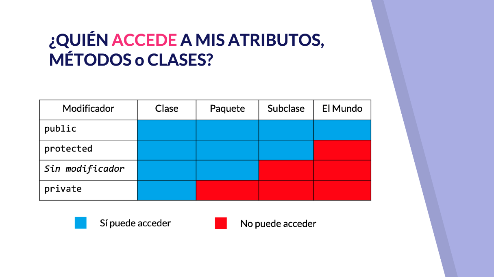

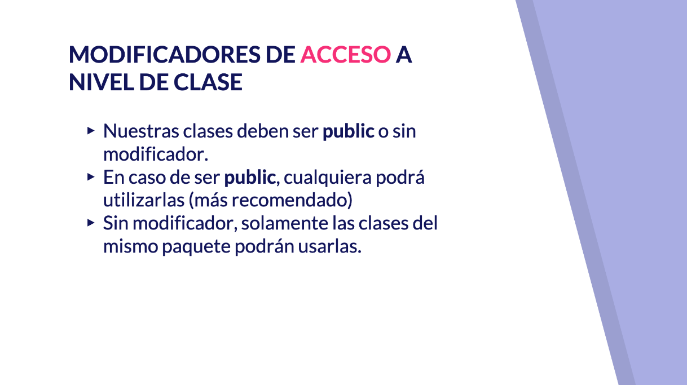


# 20. Métodos estáticos y variables estáticas 8:19 

[Métodos estáticos y variables estáticas](pdfs/20_Métodos_y_variables_estáticas.pdf)

## Resumen del Profesor

### 20.1 Atributos de objeto y de clase

Java nos permite crear cuantos objetos queramos de una misma clase. Estos objetos tienen una copia propia de los atributos. Sin embargo, en ocasiones, puede interesarnos tener un atributo común a todos los objetos. Estos son los atributos `static`.

Están asociados a la clase, y compartidos para todas las instancias. Pueden ser manipulados por cualquier objeto, o incluso sin crear una instancia de esa clase.

### 20.2 Métodos estáticos

Se rigen por los mismos principios de los atributos estáticos. Para invocar:

```java
Clase.metodoEstatico(...);
```

Para acceder a una variable estática, necesitamos hacerlo desde un método estático. También podemos crear métodos estáticos como métodos de operaciones auxiliares (recordemos todos los métodos de la clase `java.util.Arrays`).

### 20.3 Constantes

Se pueden definir como `static`.

```java
static final PI = 3.141592653589793;
```

## Transcripción


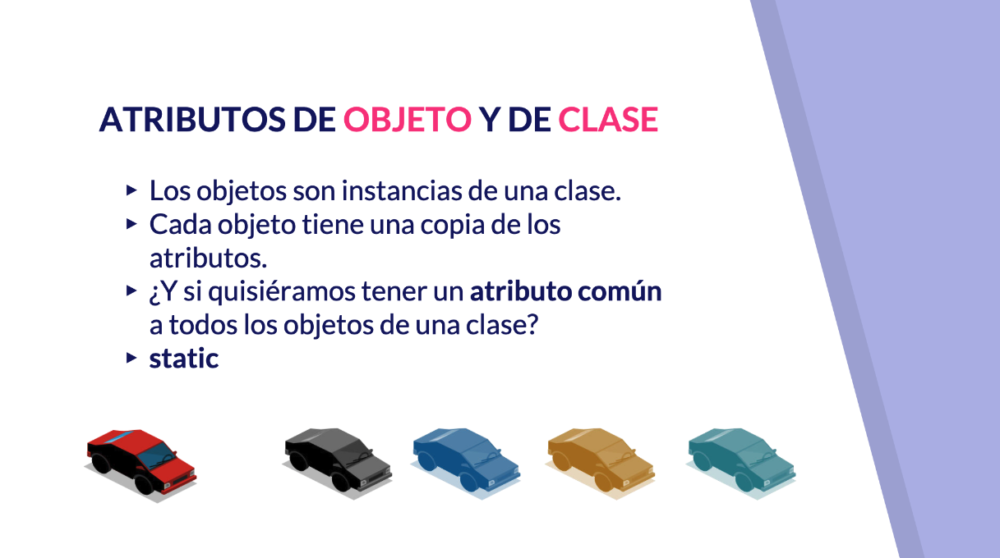

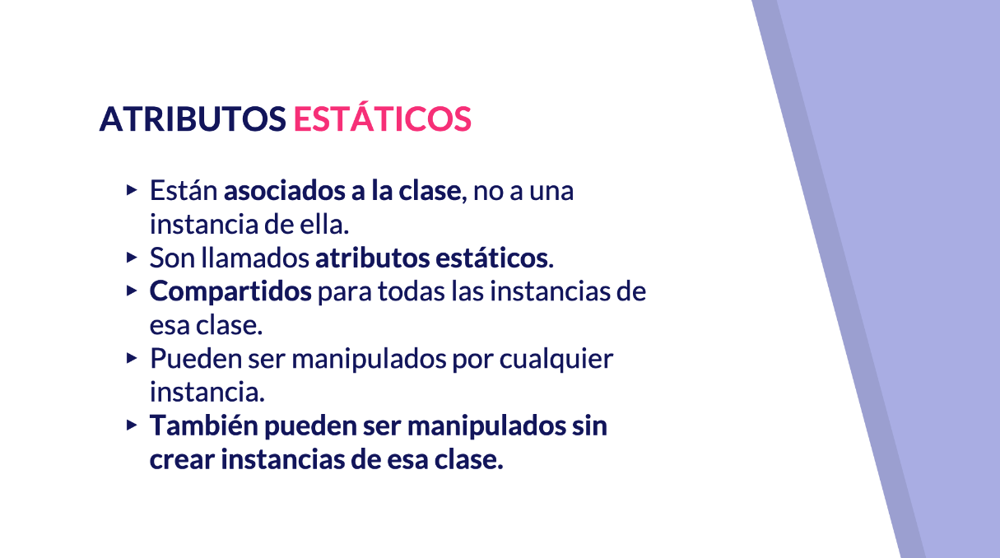

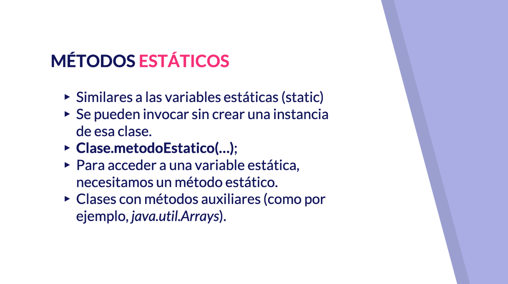

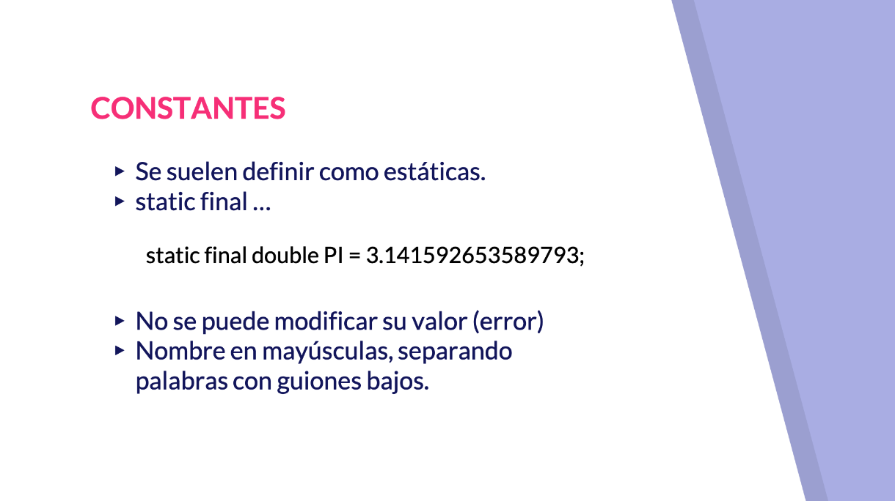

# 21. Sobrecarga de métodos y constructores 7:07 

[Sobrecarga de métodos y constructores](pdfs/21_Sobrecarga_de_métodos_y_constructores.pdf)

## Resumen del Profesor

### 21.1 Sobrecarga de métodos

Java permite que una clase tenga dos o más metodos con el mismo nombre, siempre que su firma (es decir, el número de atributos y/o su tipo) sea diferente:

```java
public class Artista {


    public void dibuja(String s) {
        System.out.println(s);
    }

    public void dibuja(int i) {
        System.out.println(i);
    }

    public void dibuja(double f) {
        System.out.println(f);
    }

    public void dibuja(int i, double f) {
        System.out.println(i);
        System.out.println(f);
    }

}
```

### 21.2 Sobrecarga de constructores

También permite tener varios constructores por clase, que siguen las mismas reglas que los métodos:

```java
public class Persona {

    private String nombre;
    private String apellidos;
    private int edad;
    private int altura;
    private float peso;


    public Persona() {
    }

    public Persona(String nombre, String apellidos) {
        this.nombre = nombre;
        this.apellidos = apellidos;
    }


    public Persona(String nombre, String apellidos, int edad) {
        this.nombre = nombre;
        this.apellidos = apellidos;
        this.edad = edad;
    }

    public Persona(String nombre, String apellidos, int edad, int altura, float peso) {
        this.nombre = nombre;
        this.apellidos = apellidos;
        this.edad = edad;
        this.altura = altura;
        this.peso = peso;
    }

  //...
}
```

## Transcripción


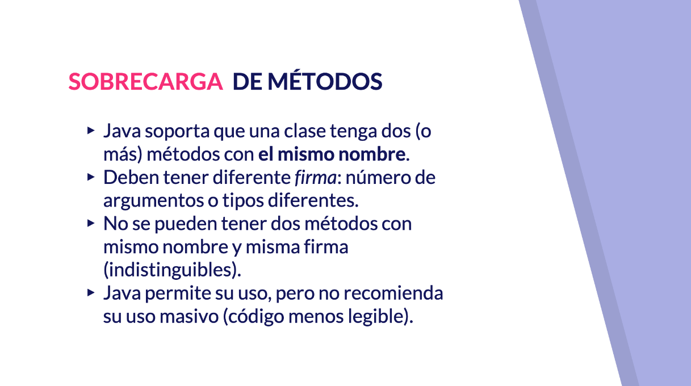

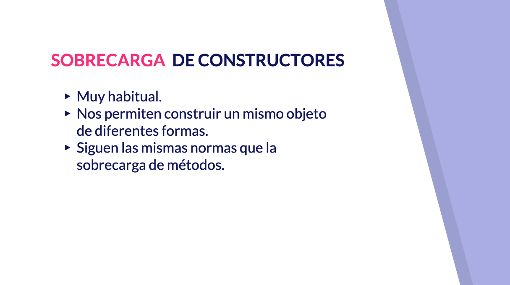

## Contenido adicional 5   

[Argumento de un método y tipos de retorno](pdfs/17_Argumentos_y_tipos_de_retorno.pdf)

[Paso de argumento por valor y referencia](pdfs/18_Paso_por_valor_y_referencia.pdf)

[Modificadores de acceso](pdfs/19_Modificadores_de_acceso.pdf)

[Métodos estáticos y variables estáticas](pdfs/20_Métodos_y_variables_estáticas.pdf)

[Sobrecarga de métodos y constructores](pdfs/21_Sobrecarga_de_métodos_y_constructores.pdf)
