# 6. Uso de herencia 64m
   * Qué es la herencia y los beneficios que aporta 15:52 
   * Polimorfismo 9:43 
   * Uso de super para acceder a un objeto y sus constructores 8:42 
   * Clases abstractas e interfaces I 20:52 
   * Clases abstractas e interfaces II 9:48 
   * Contenido adicional 5
   
# 22. Qué es la herencia y los beneficios que aporta 15:52 

[Herencia](pdfs/22_Herencia.pdf)

## Resumen del Profesor

### 22.1 Herencia

Es un mecanismo fundamental de la Programación Orientada a Objetos, que nos permite que una clase pueda extender el comportamiento o la funcionalidad de otra. De esta forma podemos formar una jerarquía de clases.

En Java, a diferencia de otros lenguajes, solo está permitida la **herencia simple**, de forma que cada clase tiene, como mucho, una clase base. Solo hay una clase especial, `Object`, que no tiene clase base. El resto de clases ya creadas, o por crear, tienen en esta el nivel más básico de su jerarquía (es decir, una clase que no heredia de nadie, realmente está heredando de `Object`).


La sintaxis para indicar que una clase hereda de otra es:

```java
public class Hija extends Padre {


}
```

Una clase que extiende a otra hereda sus atributos y sus métodos (no los constructores), y puede añadir métodos y atributos nuevos. La clase extendida podrá acceder a aquellos atributos/métodos de la clase base marcados como `public`, `protected` o por defecto.

`protected` está poco recomendado para los atributos, ya que en una jerarquía de herencia con varios niveles, una clase *tataranieta* de otra podría seguir accediendo a los atributos, sin poder predecir bien el control sobre ellos. Es más recomendable marcar los atributos como `private`, y acceder a ellos desde métodos `public`.

Si no queremos que nadie pueda heredar de nuestra clase, la marcamos como `final`:

```java
public final class ClaseFinal {

}
```

## Transcripción

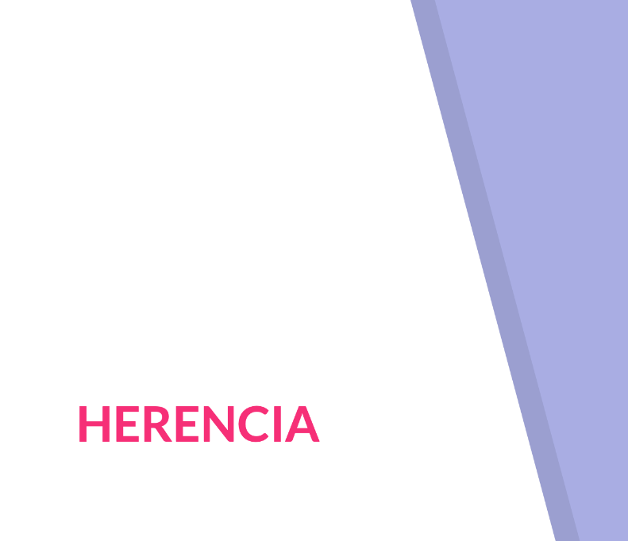

Vamos a comenzar un nuevo bloque en el que hablaremos sobre Herencia.

La **herencia** es un mecanismo no solo propio de Java sino de cualquier lenguaje orientado a objetos y es algo fundamental porque es un mecanismo que nos permite asociar unas clases con otra mediante relaciones de jerarquía, de relaciones que podríamos llamar de padre e hijo, de clase madre y clase hija. Se utilizan muchos conceptos para referirse a ella como ya digo clase padre, clase hija, superclase y subclase, los podré utilizar indistintamente.

Este mecanismo propio de la programación orientada a objetos viene marcado para que podamos ir modelando objetos que se basan en otros objetos y poder reutilizar parte de sus variables y parte de código **en principio en Java solamente podemos tener herencia de una clase**, es decir que una clase solamente podría heredar de otra, es decir podría tener solamente un padre, **la herencia múltiple** que si está presente en otros lenguajes de programación como C + + o como Python pues **no la tendríamos presente en Java** y es algo que casi que se agradece porque manejarle es bastante complejo y puede producir muchos quebraderos de cabeza. Por último decir que para que indiquemos que una clase hereda a otra o entiende otra clase existe la palabra reservada `extends`.

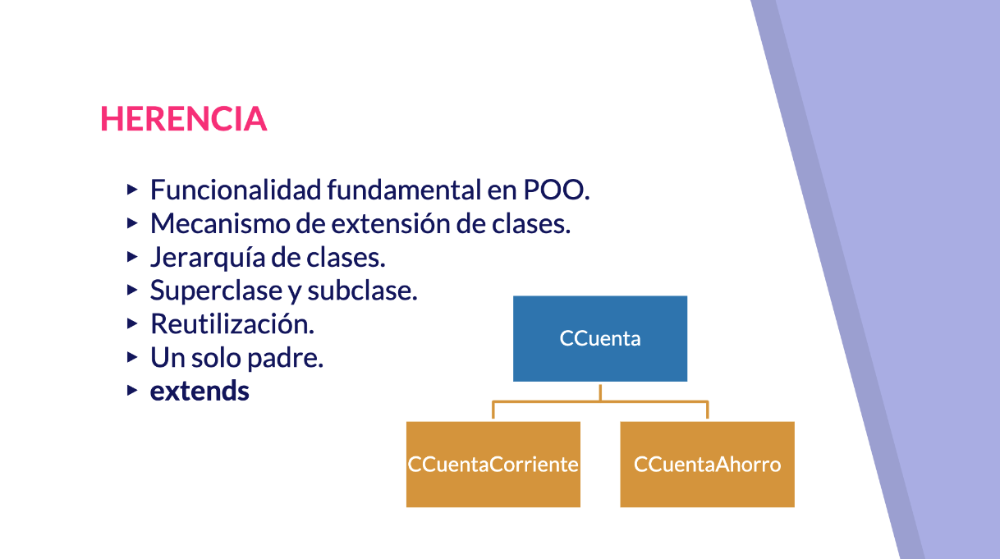

Por ejemplo si tuviéramos un sistema bancario podríamos plantearnos el trabajar con cuenta y dentro de las cuentas podríamos tener algunos tipos concretos de cuentas cómo serían las cuentas corrientes y las cuentas de ahorro, como podemos comprobar tanto cuenta corriente como Cuenta Ahorro tienen en común que tienen al mismo padre, la clase CCuenta sin embargo cada una de ellas solamente tiene un padre, una clase tiene siempre como mucho un solo padre y cualquier clase podría tener más de un hijo. De esta manera estamos extendiendo o bien las propiedades o bien las funcionalidades o tanto estructura como comportamiento de la clase CCuenta concretandolo en CCuentaCorriente o CCuentaAhorro.

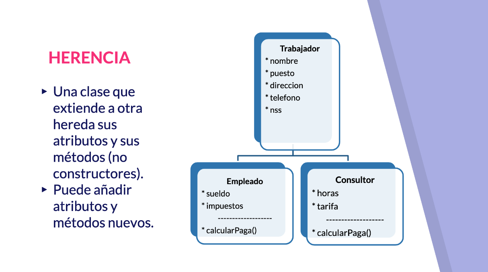

**Una clase que extiende a otra** hereda de ahi viene el nombre del mecanismo *herencia*, **hereda sus atributos y sus métodos, si bien lo que no hereda son sus constructores**, todos los atributos, todos los métodos, pero lo que no hace es heredar su sus constructores, además las clases heredadas, las clases que extienden a otra podrían añadir nuevos atributos y nuevos métodos si nos fijamos en este gráfico podríamos tener una clase `Trabajador` que tendría una serie de atributos por ejemplo el nombre, he puesto la dirección, el teléfono, el número de la seguridad social, bien esos atributos serían heredados por la clase `Empleado` que además añade otros atributos como sueldo, impuestos y que tiene también algún método cómo `calcularPaga()` paga, calcular el salario y otro clase diferente `Consultor` qué también hereda los atributos de `Trabajador` y tendría como atributos propios a `hora` y `tarifa` y también tendría el método `calcularPaga()` cómo podemos comprobar existe una asociación entre clase extendida y clase base de tipo **es un, is an** en inglés un `Consultor` es un `Trabajador` porque tiene todo lo de un `Trabajador` todas sus propiedades, todos sus atributos y un `Empleado` también es un `Trabajador`.

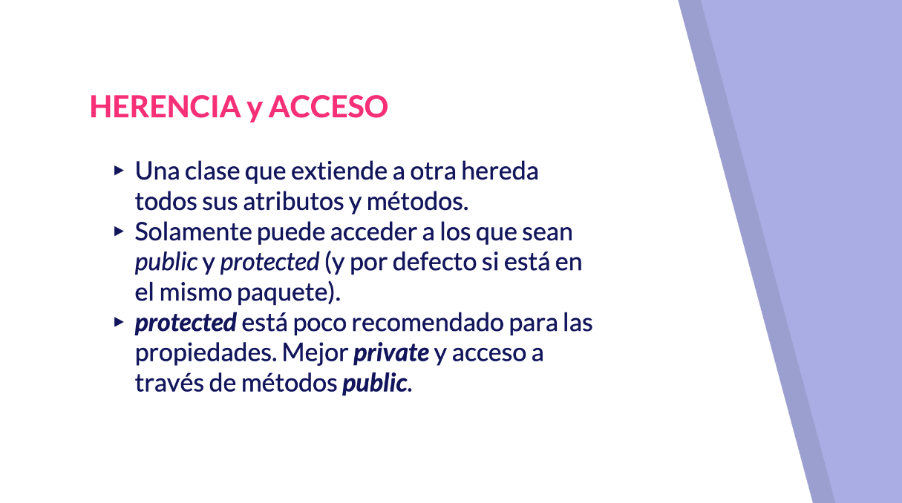

Cuando hacemos herencia de clase hemos dicho que que **una clase que extiende a otra heredad todos a sus atributos y todos sus métodos** si bien si pensamos en los modificadores de acceso y lo que hablamos en su momento, **una clase que heredé de otras solamente podría acceder a los atributos y métodos que fueran público o protegidos y por defecto si estuvieran en el mismo paquete**, pero sobre todo aquellos públicos y protegidos. Como ya adelantamos el uso de protected no está realmente muy recomendado, porque ya digo incluye también el acceso de las clases del mismo paquete, con lo cual Java nos recomienda incluso que de cara a los atributos a las propiedades que trabajemos con private y que ofrezcamos métodos públicos para que una clase que hereda de otra pudiera acceder a estos atributos. 

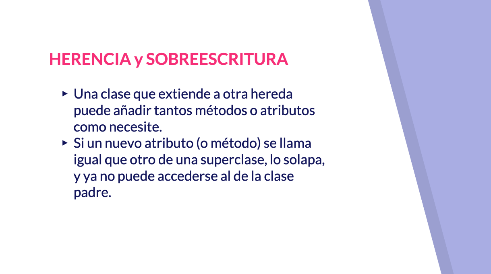

Antes de ver el ejemplo vamos a hablar de algún elemento más y podremos ver como una clase que extiende a otra hereda sus atributos y se le pueden añadir tantos métodos como atributos como desee, en particular podríamos añadir nuevos atributos, nuevos métodos que se llamarán igual que otros de la clase base y que solaparían a este de la clase base, es decir si una superclase tiene un atributo y una subclase crea un atributo dentro de su cuerpo que se llame igual solaparía al de la clase base y no podríamos acceder a él y lo mismo sucedería también con los métodos.

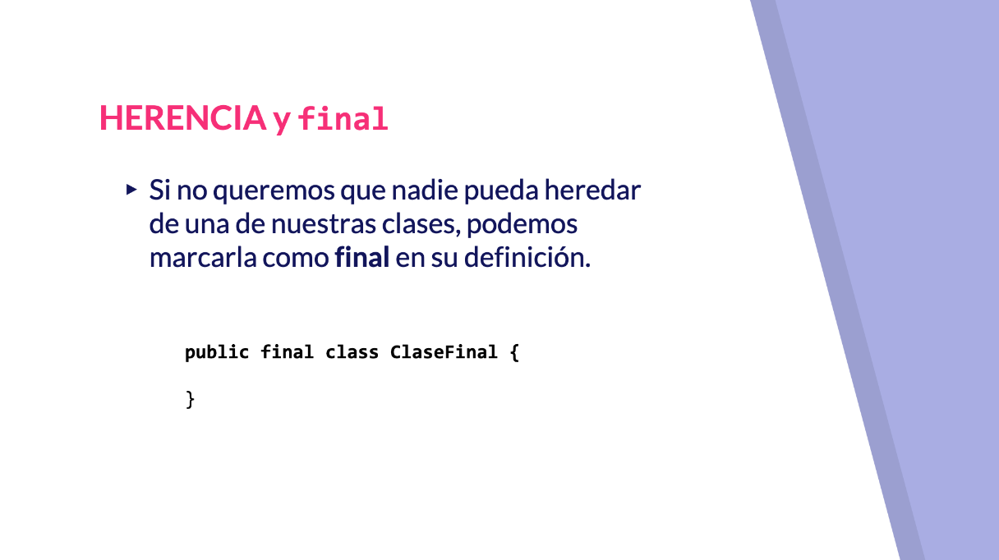

Y por último antes de ver el ejemplo si queremos que una clase no sea extendida, que nadie extienda de ella, podríamos marcarla en su definición como `final` ya hemos visto qué `final` servía para no poder modificar el  valor de algunas variables, transformándolas en constantes, de esta forma poniendo una clase como `final` indicaremos que esta clase se puede utilizar con total normalidad, pero que **no se podría heredar de ella**.

### :computer: `101-22-Herencia`

Veamos el ejemplo de los `Trabajador`, `Empleado` y `Consultor` y cómo podríamos heredar de cada una de ellas, bueno en el caso de `Trabajador` hemos visto que sería una clase que tendría un nombre, un puesto, dirección, teléfono y número de la seguridad social, son los atributos que van a modelar a un trabajador y van a decir que de qué está compuesto.

*`Trabajador`*

```java
package herencia;

public class Trabajador {
	
   private String nombre;
   private String puesto;
   private String direccion;
   private String telefono;
   private String nSS; //Número Seguridad Social
	
   public Trabajador(String nombre, String puesto, String direccion, String telefono, String nSS) {
      this.nombre = nombre;
      this.puesto = puesto;
      this.direccion = direccion;
      this.telefono = telefono;
      this.nSS = nSS;
   }

   public String getNombre() {
      return nombre;
   }

   public void setNombre(String nombre) {
      this.nombre = nombre;
   }

   public String getPuesto() {
      return puesto;
   }

   public void setPuesto(String puesto) {
      this.puesto = puesto;
   }

   public String getDireccion() {
      return direccion;
   }

   public void setDireccion(String direccion) {
      this.direccion = direccion;
   }

   public String getTelefono() {
      return telefono;
   }

   public void setTelefono(String telefono) {
      this.telefono = telefono;
   }

   public String getnSS() {
      return nSS;
   }

   public void setnSS(String nSS) {
      this.nSS = nSS;
   }

   @Override
   public String toString() {
      return "Trabajador [nombre=" + nombre + ", puesto=" + this.puesto + ", direccion=" 
            + direccion + ", telefono=" + telefono + ", nSS=" + nSS + "]";
   }
	
}
```

Estos atributos son los que van a ser heredados por ejemplo por la clase `Empleado` como podemos comprobar en esta línea indicamos a la hora de definir la clase que `Empleado` extiende a un `Trabajador` es decir `Empleado` hereda todos los atributos y todos los métodos de trabajador.

*`Empleado`*

```java
package herencia;

public class Empleado extends Trabajador {

   private double sueldo;
   private double impuestos;

   private final int PAGAS = 14;

   public Empleado(String nombre, String puesto, String direccion, String telefono, String nSS, 
                   double sueldo, double impuestos) {
      // Profundizamos en "super" en las próximas lecciones
      super(nombre, puesto, direccion, telefono, nSS);
      this.sueldo = sueldo;
      this.impuestos = impuestos;
   }

   public double getSueldo() {
      return sueldo;
   }

   public void setSueldo(double sueldo) {
      this.sueldo = sueldo;
   }

   public double getImpuestos() {
      return impuestos;
   }

   public void setImpuestos(double impuestos) {
      this.impuestos = impuestos;
   }

   public double calcularPaga() {
      return (sueldo - impuestos) / PAGAS;
   }

   @Override
   public String toString() {
      return "Empleado [sueldo=" + sueldo + ", impuestos=" + impuestos + ", getNombre()=" + getNombre()
         + ", getPuesto()=" + getPuesto() + ", getDireccion()=" + getDireccion() + ", getTelefono()="
         + getTelefono() + ", getnSS()=" + getnSS() + "]";
   }

}
```

Si recordamos en `Trabajador` tenemos todo indicado como privado a nivel de atributo y todos los métodos eran públicos como lo recomienda Java. Añadiendo a los atributos y métodos de `Trabajador` un `Empleado` tendrá un sueldo y unos impuestos y además añadimos una constante llamada PAGAS, en principio un trabajador de esta empresa tendrá 14 pagas. A la hora de construir un `Empleado` habíamos dicho aunque `Trabajador` tiene un constructor un `Empleado` no hereda los constructores del `Trabajador` y a la hora de hacer la creación de un `Empleado` tendríamos que diferenciar entre crear la parte propia de `Empleado` y la parte de `Empleado` que es heredada de `Trabajador`.

```java
   public Empleado(String nombre, String puesto, String direccion, String telefono, String nSS, 
                   double sueldo, double impuestos) {
      // Profundizamos en "super" en las próximas lecciones
      super(nombre, puesto, direccion, telefono, nSS);
      this.sueldo = sueldo;
      this.impuestos = impuestos;
   }
```


Profundizaremos en el uso de `super` en una lección posterior, ahora simplemente tenemos presente que a la hora de construir un `Empleado` tenemos que construirlo de esta manera primero la parte propia del `Trabajador` y luego la parte que es propia del `Empleado`. 

Tendríamos los metodos getter y setter de los atributos propios de un `Empleado` y vamos a calcular la paga del `Empleado` con el método que hace uso de varios atributos para calcular la paga de un `Empleado` que sería el sueldo total restándole los impuestos y dividiendo entre el número de pagas de esa manera tendríamos serie sueldo mensual de un trabajador de tipo `Empleado`.

```java
   public double calcularPaga() {
      return (sueldo - impuestos) / PAGAS;
   }
```

Si pasamos a ver ahora la clase `Consultor` tiene en común con la clase `Empleado` que un `Consultor` también extiende de un `Trabajador`, son clases con el mismo padre,  en este caso un `Consultor` que sería algo así como un trabajador externo a la compañía, podríamos plantearlo de esa manera, tendría una serie de horas que trabaja para nuestra empresa y la tarifa que tiene, a la hora de construir tiene en común que tiene que construir con súper la parte común a `Trabajador` y setteariamos los atributos propios y en este caso que habíamos dicho también que íbamos a implementar el método `calcularPaga()` la paga del `Consultor` sería simplemente la tarifa por horas multiplicada por el número de horas.

*`Consultor`*

```java
package herencia;

public class Consultor extends Trabajador {
	
   private int horas;
   private double tarifa;
		
   public Consultor(String nombre, String puesto, String direccion, String telefono, String nSS, int horas, double tarifa) {
      super(nombre, puesto, direccion, telefono, nSS);
      this.horas = horas;
      this.tarifa = tarifa;
   }

   public int getHoras() {
      return horas;
   }

   public void setHoras(int horas) {
      this.horas = horas;
   }

   public double getTarifa() {
      return tarifa;
   }

   public void setTarifa(double tarifa) {
      this.tarifa = tarifa;
   }
	
   public double calcularPaga() {
      return horas*tarifa;
   }

   @Override
   public String toString() {
      return "Consultor [horas=" + horas + ", tarifa=" + tarifa + ", getNombre()=" 
         + getNombre() + ", getPuesto()=" + getPuesto() + ", getDireccion()=" + getDireccion() 
	 + ", getTelefono()=" + getTelefono() + ", getnSS()=" + getnSS() + "]";
   }

}
```

A la hora de crear una serie de instancias de estas clases podríamos plantearnos en crear un `Trabajador` un `Empleado` y un `Consultor` e interaccionar un poco con ellos, recordemos que también hemos implementado los métodos `toString()` a través de la implementación automática que hace Eclipse, de la generación de código y vamos a poder consultar a cada uno de estos objetos.

*`Herencia`*

```java
package herencia;

public class Herencia {

   public static void main(String[] args) {
		
      Trabajador trabajador;
      Empleado empleado;
      Consultor consultor;
		
      trabajador = new Trabajador("Bill Gates", "Presidente", "Redmond", "", "");
      empleado = new Empleado("Larry Ellison", "Presidente", "Redwood", "", "", 100000.0, 1000.0);
      consultor = new Consultor("Steve Jobs", "Consultor Jefe", "Cupertino", "", "", 20, 1000.0);
		
      System.out.println(trabajador);
      System.out.println(empleado);
      System.out.println(empleado.calcularPaga());
      System.out.println(consultor);
      System.out.println(consultor.calcularPaga());

   }
}
```

`Trabajador` lo creamos con su constructor de nombre Bill Gates, es el presidente, su dirección está en Redmond, no vamos a guardar ni su número de teléfono, ni su número de seguridad social, esto lo creamos como cadena vacías, también lo podríamos crear como `null` o simplemente tener un constructor de `Trabajador` que recogiera menos argumento.

Vamos a crear también un `Empleado`, el empleado sería Larry Ellison, también es Presidente, en Redwood que es la sede dónde está Oracle, tiene un buen salario, pagando una cantidad de impuestos.

Y por último tendríamos un `Consultor` Steve Jobs sería el consultor jefe en Cupertino en este caso tendría una serie de horas que trabaja para nosotros y una tarifa por horas.

Si imprimos ahora el resultado de crear estos objetos `Trabajador` un `Empleado` un `Consultor` y el cálculo de pagas de cada uno de ellos tendríamos esto como resultado lo siguiente:

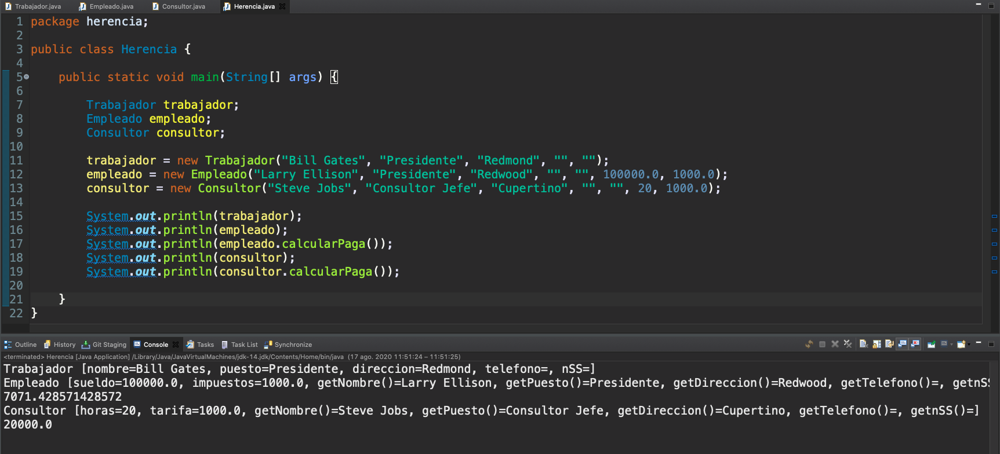

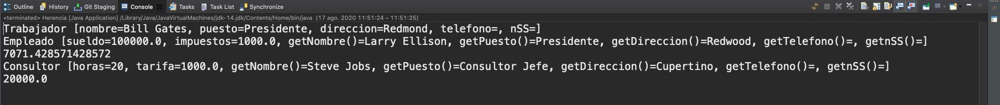

El trabajador Bill Gates con estos datos el empleado que es Larry Ellison tendría aparte de los atributos propios tendría también los atributos comunes de `Trabajador` de los cuatro puntos propio su salario mensual su paga mensual serie está de aquí y nuestro Consultor sitios también tendrían aquí teníamos más tributo tendría también un paga total sería el número de horas por el la tarifa sería la de 20.000 20.000 dólares o euros función de lo que estuviéramos expresando la cuantía.

Como podemos comprobar a la hora de generar el método `toString()` de `Trabajador` como es obvio tiene sus atributos. Cuando generamos el método `toString()` de `Empleado` podemos indicar que incluya los atributos propios podríamos desmarcarse la constante y también podríamos marcar que imprimiera o que utilizara los métodos heredados de manera que a la hora de definir un un empleado pues también pudiéramos conocer lo que haya heredado de la clase trabajador. 

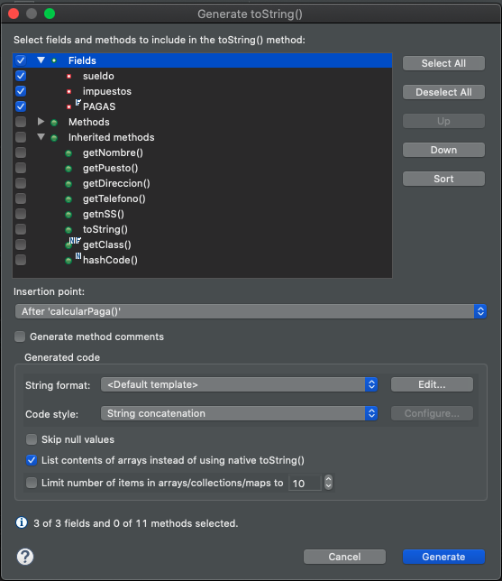

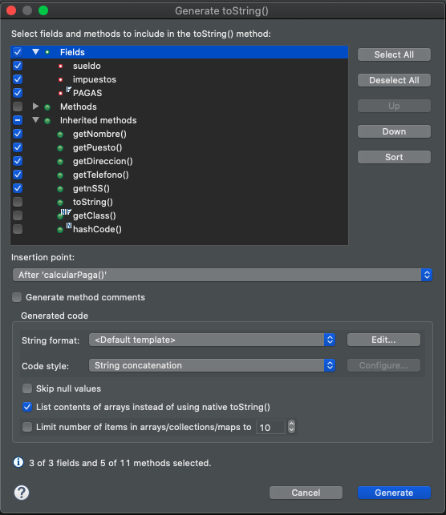

Como los atributos de trabajador eran privados, a la hora de generar lo genera pone primero los atributos propios y luego está llamando a los atributos de la clase trabajadora. 

### :computer: `101-22-Herencia`

Otro ejemplo que podemos ver es cuando declaramos una clase final.

*`ClaseFinal`*

```java
package herencia;

public final class ClaseFinal {
	
	

}
```

Esta clase final no la podemos usar para extender a partir de ella.

*`ClaseExtendida`*

```java
package herencia;

public class ClaseExtendida extends ClaseFinal {
}
```

Nos marcara el siguiente error 

```sh
The type ClaseExtendida cannot subclass the final class ClaseFinal
```


## 23. Polimorfismo 9:43 

[Polimorfismo](pdfs/23_Polimorfismo.pdf)

## Resumen del Profesor

### 23.1 Referencias y subclases

Una subclase puede ser accedida a través de una referencia de su superclase. Esto es muy útil si pensamos pasar parámetros a un método, para que sea más versátil.

```java
public static void saludar(Trabajador t) {
    System.out.println("Hola, " + t.getNombre());
}
```

### 23.2 Ocultación de métodos y polimorfismo

Ya hemos visto que una clase extendida puede *ocultar* métodos o atributos de la clase base, creando uno igual con el mismo nombre. ¿Qué sucede si tenemos un método ocultado, pero accedemos desde una referencia de la superclase?

```java
Trabajador empleado;
empleado = new Empleado("Larry Ellison", "Presidente", "Redwood", "", "", 100000.0, 1000.0);
empleado.calcularPaga();
```

La máquina virtual de java es capaz de detectar el tipo del objeto, siendo este quien tenga prioridad sobre el tipo de la referencia usada. A esto lo llamamos polimorfismo.


## Transcripción


Vamos a continuar hablando sobre herencia trabajando en particular el **concepto de Polimorfismo**.

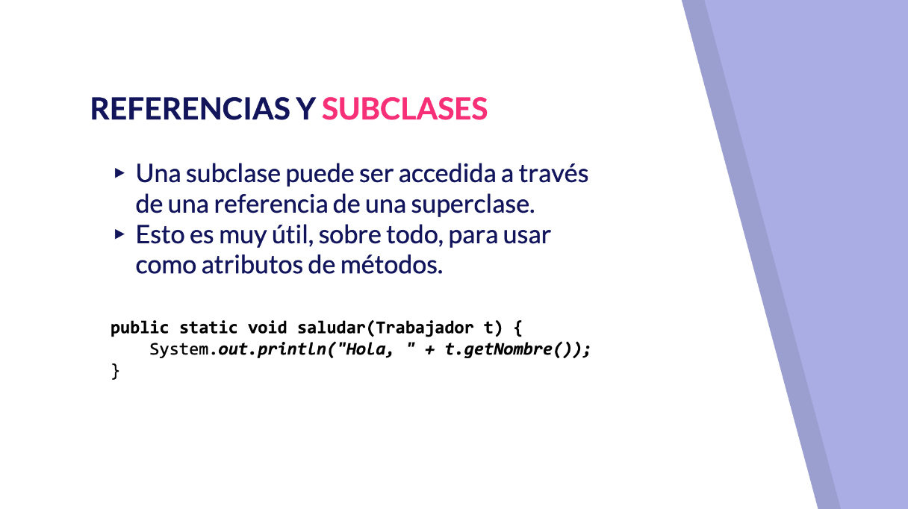

Lo primero que tenemos que tener presente a la hora de trabajar con herencias de clases es algo que quizá ha podido quedar muy sutil en la lección anterior, yo indicaba que cuando tenemos una herencia entre dos clases existe una relación de tipo **ES UN** es decir si teníamos que un `Consultor` era un `Trabajador` y un `Empleado` también era un `Trabajador` entre `Consultor` y `Trabajador` hay una referencia de tipo **ES UN** **esto que puede quedar solamente como algo anecdótico se plasma en la realidad en el hecho de que podemos utilizar referencias de una superclase para almacenar objetos o para referenciar objetos de un tipo de su clase en particular** por ejemplo podríamos utilizar referencias de `Trabajador` para hacer referencia a `Empleado` o para hacer referencia a `Consultor` además de para hacer referencia a `Trabajador`. 

**Esto es util por ejemplo si queremos tener un método que trabaje no solamente con la clase base, sino con las clases heredadas** por ejemplo el que tenemos en pantalla, si quisiéramos tener un método que saludara a cualquier trabajador podríamos recibir un `Trabajador` como argumento y como cualquier `Trabajador` tiene 
un método `getNombre()` ya sea el `Trabajador`, el `Empleado` o el `Consultor` o el empleado podríamos saludarlo directamente, quién dice saludar, podría utilizarlo en un sistema que sirviera para para fichar la entrada y la salida de un empleado en una empresa con la hora, podríamos utilizar una clase genérica aunque tuviéramos diferentes tipos de trabajadores implementados, esto va a ser algo muy potente ya digo sobre todo a la hora de poder trabajar con métodos, recibir argumento o devolver argumento el poder utilizar una superclase aunque la instancia final sea de alguna subclase.

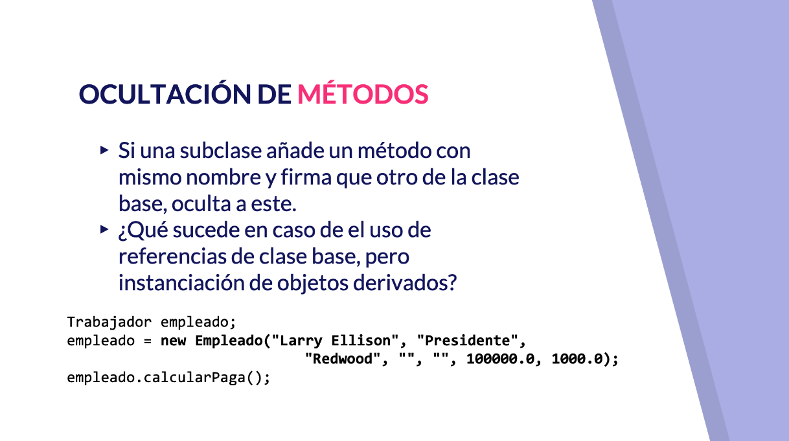

También hablamos del concepto de **Ocultación de Métodos** y es que si una determinada subclase añade un método que se llame igual, con el mismo nombre y que tenga la misma firma que otro de la clase base, lo "ocultara". Podríamos pensar que esto puede ser útil porque sirve para que una subclase matice algo en particular, por ejemplo de cálculo de la paga, lo matice en particular, empieza a darnos cierto quebradero de cabeza cuando trabajamos con referencia de tipo de la clase base como hablábamos antes, qué pasa si tenemos una referencia de tipo `Trabajador` para crear un `Empleado` y llamamos al método `calcularPaga()`.

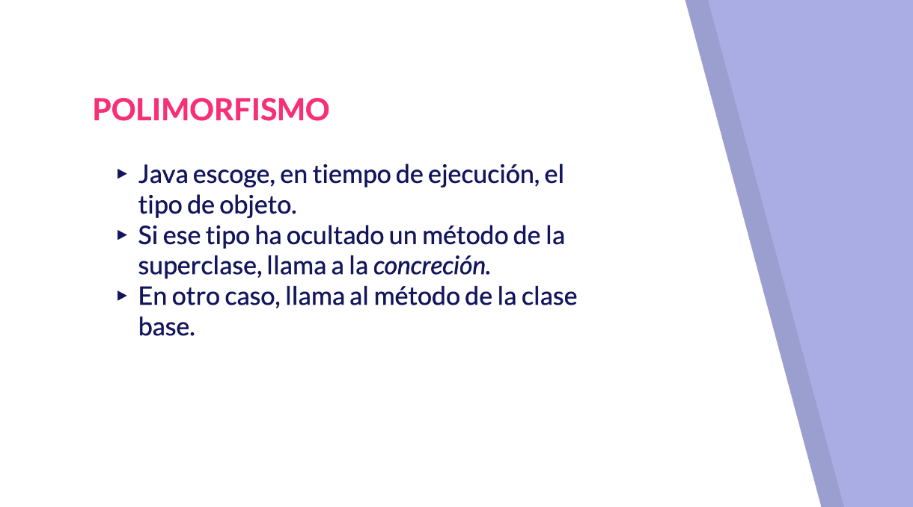

Aquí es donde cobra protagonismo el polimorfismo y es que **Java escoge en tiempo de ejecución el tipo de objeto**, con lo cual si la referencia es de tipo `Trabajador` pero la instancia de tipo `Empleado` va a llamar al método concreto de `Empleado` si es que ha ocultado el método de `Trabajador`, en otro caso si no hubiera ocultado ese método llamaría entonces al método de la clase base.

Veamos estos dos ejemplos de polimorfismo a la hora de poder recibirlo dentro de un objeto con referencia del mismo tipo y la llamada al método de `calcularPaga()`.

### :computer: `101-23-Polimorfismo`

Hemos modificado un poco el ejemplo anterior para tener que un `Trabajador` tiene un salario base, que viene marcado mediante una constante de tipo double, cualquier `Trabajador` tiene una pagaba base.


*`Trabajador`*

```java
package polimorfismo;

public class Trabajador {

   private String nombre;
   private String puesto;
   private String direccion;
   private String telefono;
   private String nSS; // Número Seguridad Social

   private static final double SALARIO_BASE = 30000.0;

   public Trabajador(String nombre, String puesto, String direccion, String telefono, String nSS) {
      this.nombre = nombre;
      this.puesto = puesto;
      this.direccion = direccion;
      this.telefono = telefono;
      this.nSS = nSS;
   }

   public String getNombre() {
      return nombre;
   }

   public void setNombre(String nombre) {
      this.nombre = nombre;
   }

   public String getPuesto() {
      return puesto;
   }

   public void setPuesto(String puesto) {
      this.puesto = puesto;
   }

   public String getDireccion() {
      return direccion;
   }

   public void setDireccion(String direccion) {
      this.direccion = direccion;
   }

   public String getTelefono() {
      return telefono;
   }

   public void setTelefono(String telefono) {
      this.telefono = telefono;
   }

   public String getnSS() {
      return nSS;
   }

   public void setnSS(String nSS) {
      this.nSS = nSS;
   }

   public double calcularPaga() {
      return SALARIO_BASE;
   }

   @Override
   public String toString() {
      return "Trabajador [nombre=" + nombre + ", Puesto=" + puesto + ", direccion=" 
                      + direccion + ", telefono=" + telefono + ", nSS=" + nSS + "]";
   }

}
```


*``*

```java
```

*``*

```java
```

*``*

```java
```

se va a ser el jefe en particular para los empleados seguimos teniendo el mismo sistema de antes vale que sería su sueldo menos menos los impuestos y para el coche entonces sería la hora por la tarifa no igual que antes sentiment hemos añadido el hecho de que de que un trabajador como tal también tuvieras han hecho con lo cual te empleada al implementar este método lo que está haciendo ocultar la implementación de trabajador y lo mismo sucede con consultor que está ocultando la indemnización de trabajador antes no nos daba ningún problema porque hemos creado una referencia para cada uno de los tipos el empleado lo hacemos el a través de una referencia Atlético empleado y el consultor a través de una referencia de tipo consultor uno justiciera mosquear lo de esta manera para poder lo que tenemos aquí para saludar a cualquier trabajador haría plantearnos qué sucede cuando vayamos a llamar al método de calcular paro pues vamos a ver lo primero vamos a ver cómo funciona esto de saludar a cualquier trabajador yate una referencia de tipo trabajador y bueno como hay una suficiente tipo que un trabajador es un empleado es un consultor o un trabajo aquí hemos creado a través de esta referencia vamos a llamar en este caso los métodos calcular paga para ver qué sucede no en lugar de saludar hiciéramos ahora en primero calcular la paga de cada uno lo podríamos hacer de esta manera no

Vamos a recibir una referencia de tipo trabajador y lo que haríamos sería el método print effect podríamos hacer la construcción de la cadena de una manera un poco más cómoda aquí nos va a servir para imprimir un número decimal que tendrá los decimales que tenga pero de los cuales nosotros vamos a imprimir solamente dos aplicando un redondeo si fuese necesario qué año nació el carácter de euro y si también como ya se empiezan a unir conceptos que hemos trabajado antes a la hora de recibir argumentos y aquí podríamos el nombre calcular VAT como no como estas referencias de tipo trabajador pero vamos a ver cómo hace el cálculo de la paga de cada uno de ellos vale y me faltaría trabajador recordemos que el trabajador se diferenciaba de empleado y consulto por tener un salario base fijo no Bill Gates era un trabajador el de la clase base pues tiene su salario base Larry Ellison que era un empleado pues tenía un método para calcularlo a raíz del sueldo que hemos proporcionado los impuestos y el número de paga y un consultor vimos que tenía otro que en función del número de horas que dedicaba y una tarifa por hora imprimía el perdón calcúlame entonces la la paga del consultor de esta manera no justificando la otra forma técnica como podemos comprobar aquí se ha producido este polimorfismo en tiempo de ejecución Java tipo concreto de trabajador de empleado o de consultor y ha llamado al método calcular paga de cada uno de espero que hayamos comprendido el concepto de polimorfismo y vamos a seguir trabajando con algunos conceptos también relacionados con el


# 24. Uso de super para acceder a un objeto y sus constructores 8:42 

[Uso de super para acceder a un objeto y sus constructores](pdfs/24_Super.pdf)

## Resumen del Profesor

### 24.1 Acceso a la superclase

Podemos acceder a los elementos de nuestra clase base a través de la palabra `super`. En particular, podemos acceder a los métodos, aunque estos hayan sido sobrescritos:

```java
// overrides printMethod in Superclass
public void printMethod() {
   super.printMethod();
   System.out.println("Printed in Subclass");
}
```

### 24.2 Constructores y `super`

Cuando construimos una instancia de una clase derivada, tenemos que construir también la parte correspondiente a su clase base. Por defecto, Java espera que hayamos incluido un constructor sin parámetros en la clase base, y él se encargará de todo.

También podemos invocar, explícitamente, al constructor:

```java
public Empleado(…) {
     super(nombre, puesto, direccion, telefono, nSS);
     this.sueldo = sueldo;
     this.impuestos = impuestos;
}
```

## Transcripción


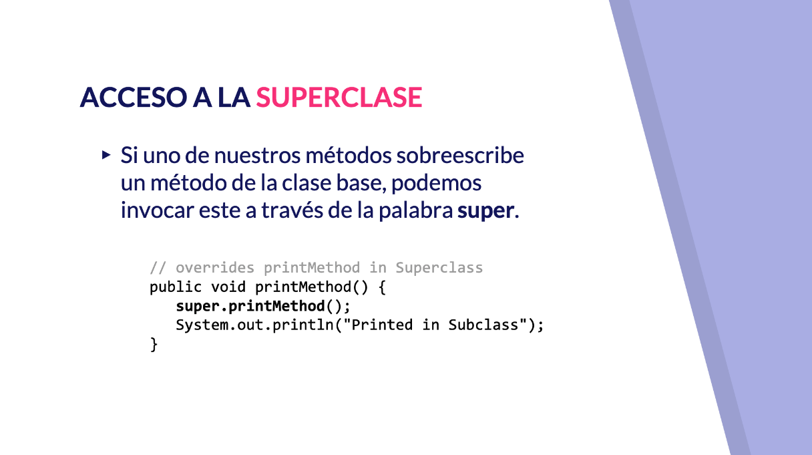

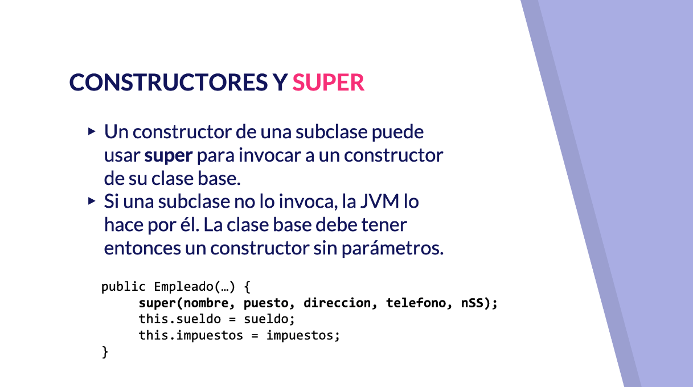


# 25. Clases abstractas e interfaces I 20:52 

[Clases abstractas e interfaces](pdfs/25_Interfaces_y_clases_abstractas.pdf)

## Resumen del Profesor

### 25.1 Interfaces

Una interfaz es un contrato de comportamiento que adquiere una clase, es decir, un conjunto de operaciones que se compromete a implementar. Hasta Java 7, las interfaces definían solamente la firma de estos métodos, pero con Java 8, también pueden incluir implementaciones por defecto.

#### 25.1.1 Definición


Las interfaces siguen las mismas normas de nomenclatura y modificadores de acceso que las clases:

```java
public interface GroupedInterface extends Interface1, Interface2  {
     // constant declarations
     // base of natural logarithms
     double E = 2.718282;
     // method signatures
     void doSomething (int i, double x);
     int doSomethingElse(String s);
}
```

Las interfaces también pueden heredar de otra. En este caso, sí que se permite la herencia múltiple.

#### 25.1.2 Implementación

Una clase puede implementar una o varias interfaces:

```java
public class RectanglePlus implements Relatable {
//...
    public int isLargerThan(Relatable other) {
        RectanglePlus otherRect = (RectanglePlus)other;
        if (this.getArea() < otherRect.getArea())
            return -1;
        else if (this.getArea() > otherRect.getArea())
            return 1;
        else
            return 0;               
    }
}
```

#### 25.1.3 Interfaces como tipos de referencias

Podemos utilizar una interfaz para almacenar una referencia a un objeto de una clase que implemente dicha interfaz:

```java
RectanglePlus rectangleOne = new RectanglePlus(10, 20);
Relatable rectangleTwo = new RectanglePlus(20, 10);
```

#### 25.1.4 Métodos por defecto y estáticos

Java 8 incluye la posibilidad de que las interfaces proporcionen el cuerpo de un método, siempre y cuando este esté marcado como `default` o `static`:

```java
public interface Interfaz {

     default public void metodoPorDefecto() {
          System.out.println("Este es uno de los nuevos métodos por defecto");
     }

}
```

Las clases que implementen esta interfaz no tienen porqué dar una nueva implementación si no la necesitan.


## Transcripción

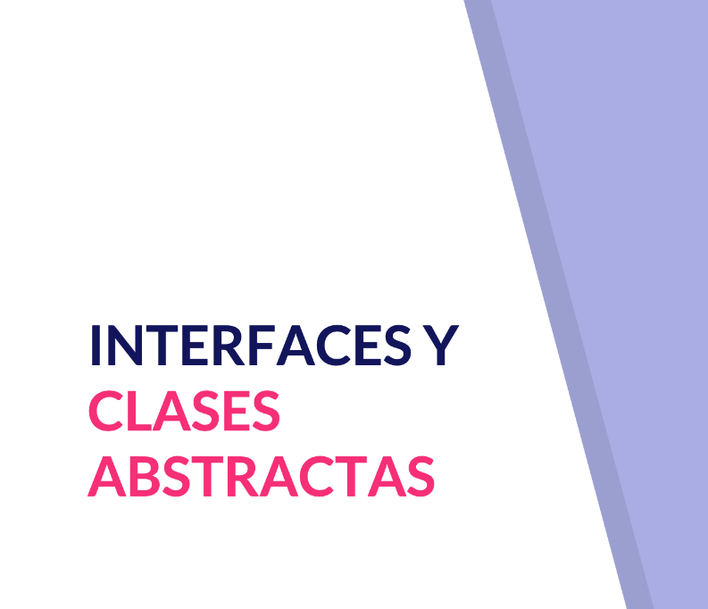


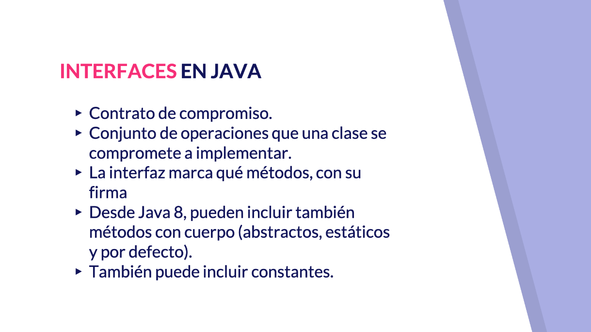

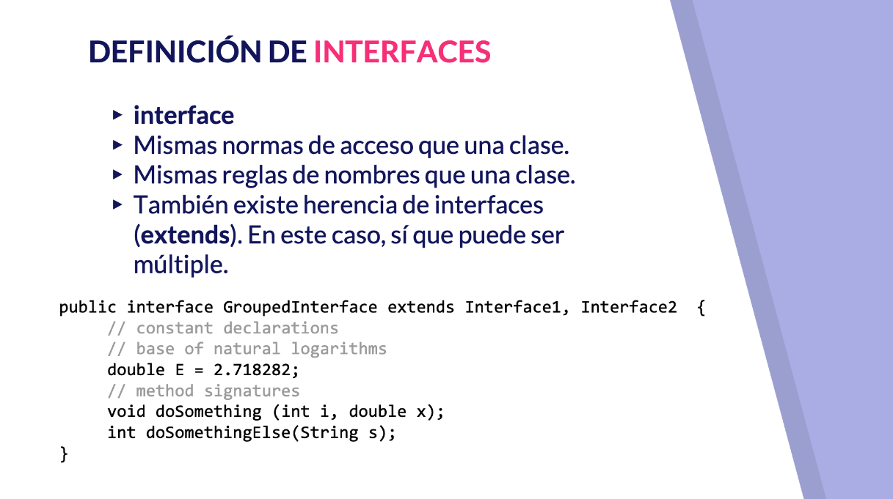

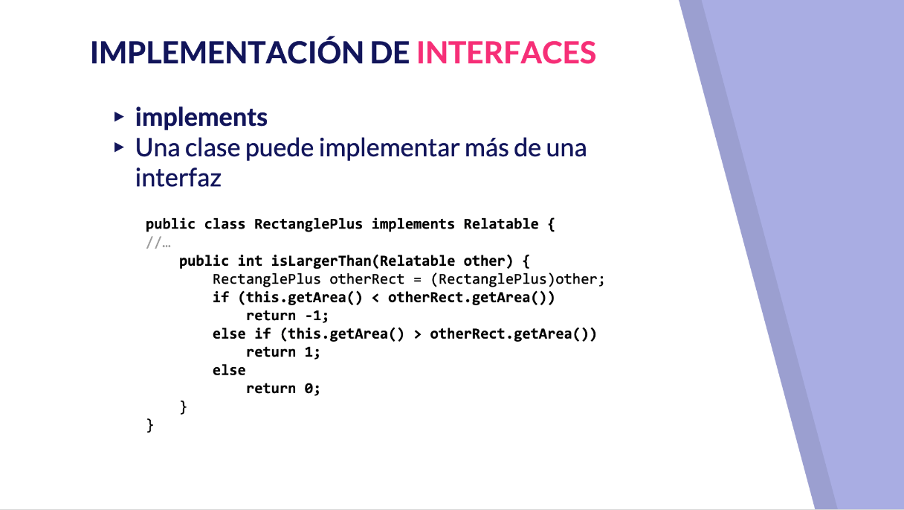

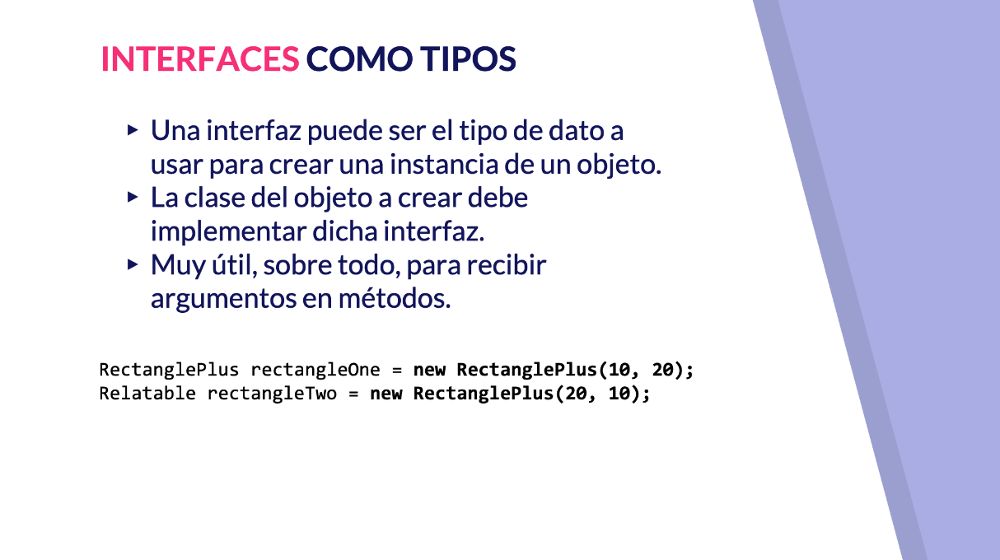

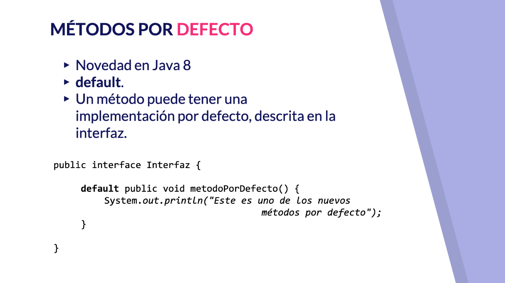

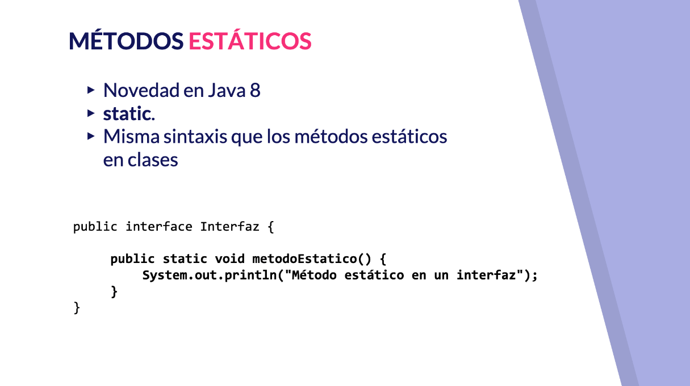

# 25. Clases abstractas e interfaces II 9:48 

[Clases abstractas e interfaces](pdfs/25_Interfaces_y_clases_abstractas.pdf)

## Resumen del Profesor

### 25.2 Clases abstractas

Son clases definidas como `abstract`. Tienen las siguientes características:

* **No se pueden instanciar**
* Pueden tener atributos y métodos con implementación.

```java
public abstract class AbstractaSencilla {

    public void saluda() {
        System.out.println("Hola mundo!!!");
    }

}
```

#### 25.2.1 Métodos `abstract`

Son métodos que están definidos en una clase `abstract`. Definen la firma del método, pero no su implementación. Las subclases de esta clase base deben aportar su implementación. Pueden convivir con métodos normales.

```java
public abstract class AbstractaConMetodos {

    public abstract void saludo(String s);

    public void saludar() {
        System.out.println("Hola mundo!!!");
    }
}
```

### 25.3 Clases abstractas vs Interfaces


¿Cuándo usar una u otra?

INTERFACES |	CLASES ABSTRACTAS
-----------|-------------------
Clases no relacionadas podrán implementar los métodos. | Compartir código con clases muy relacionadas.
Si se quiere indicar que existe un tipo de comportamiento, pero no sabemos quien lo implementa.	| Las clases derivadas usarán métodos protected o private.
Si necesitamos tener herencia múltiple.	| Queremos definir atributos que no sean estáticos o constantes.


## Transcripción

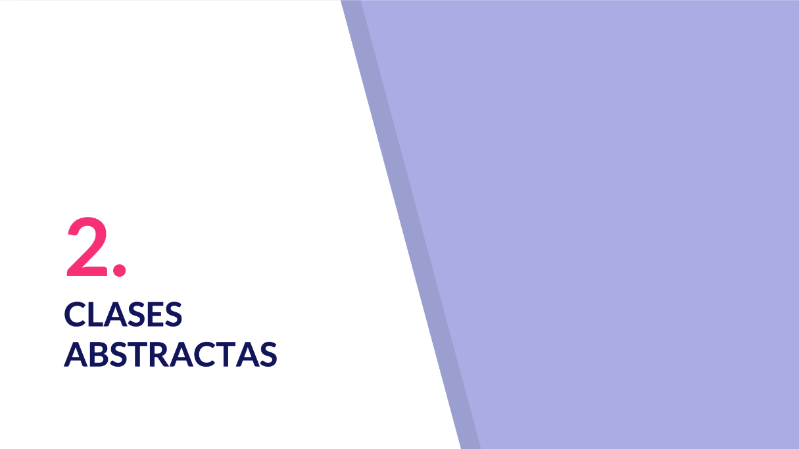

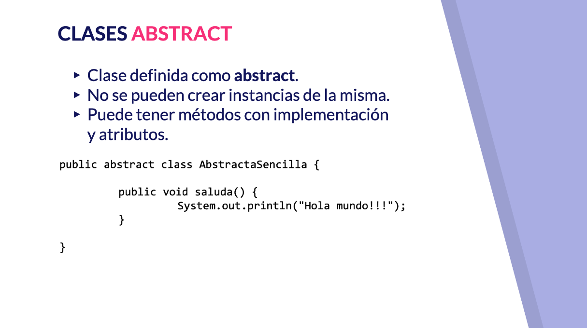

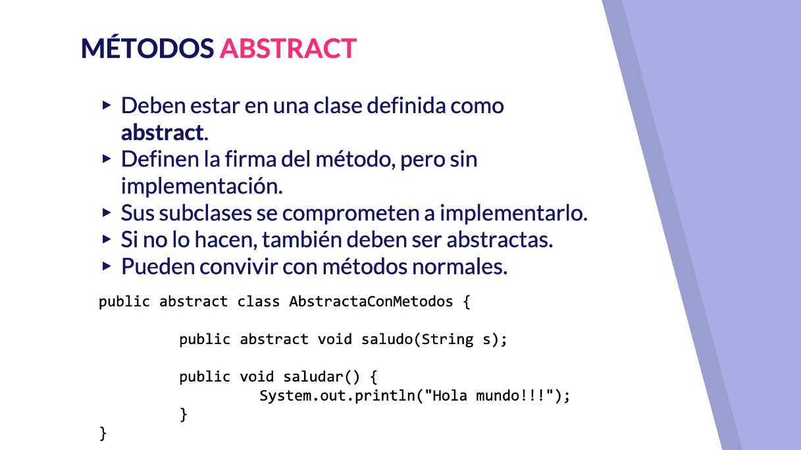

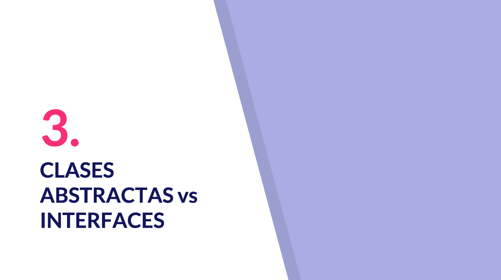

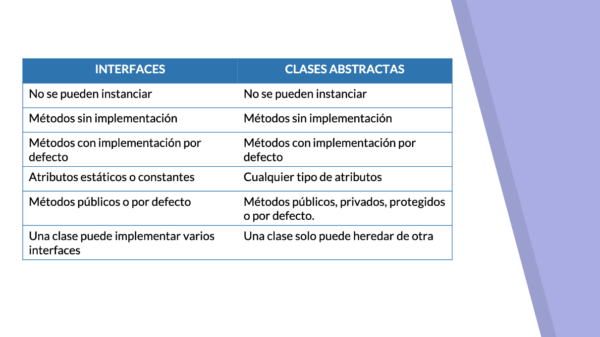

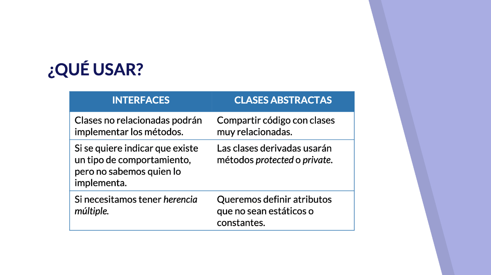


## Contenido adicional 4   

[Herencia](pdfs/22_Herencia.pdf)

[Polimorfismo](pdfs/23_Polimorfismo.pdf)

[Uso de super para acceder a un objeto y sus constructores](pdfs/24_Super.pdf)

[Clases abstractas e interfaces](pdfs/25_Interfaces_y_clases_abstractas.pdf)
