# 7. Manejo de excepciones 39m
   * 26 Excepciones y errores 9:28 
   * 27 Tratamiento de excepciones 13:36 
   * 28 Excepciones más comunes 4:49 
   * 29 Lanzamiento y propagación de excepciones 11:25 
   * Contenido adicional 4
   
# 26 Excepciones y errores 9:28

## Resumen del Profesor

[Excepciones y errores](pdfs/26_Excepciones_y_errores.pdf)


### 26.1 Excepciones

El término excepción es una abreviatura de *situación excepcional*. Se trata de una situación que altera la ejecución normal de un programa. Por ejemplo, en una calculadura, un usuario intenta realiza la división `2 / 0`. En ese momento, el sistema crea un objeto, que se llama *objeto de excepción* y lo pasa de una llamada de método a otra, buscando quien pueda hacerse cargo. Si no existe nadie, será la propia JVM quien lo haga.

El uso de excepciones tiene varias ventajas:

* Permiten separar el código de tratamiento de errores del código normal.
* Evitan que haya errores inadvertidos.
* Permiten la propagación de los errores.
* Permiten agrupar en un lugar común el tratamiento de errores.

### 26.2 Tipos de Excepciones

Podemos agrupar las excepciones en 3 grandes tipos:

* Excepciones comprobadas (*checked exceptions*): son aquellas excepciones que pueden surgir internamente en un programa, pero que al estar bien escrito, podemos tratar y de las que nos podremos recuperar.

* Errores (*errors*): situaciones externas que no son anticipables, y de las que puede que no podamos recuperarnos (por ejemplo, un error hardware). Son un tipo no comprobado (*unchecked*)

* Errores de ejecución (*Runtime errors*): son situaciones interas de la aplicación, de las que probablemente no podamos recuperarnos. Son un tipo no comprobado (*unchecked*).

## Trascripción


Hola a todos vamos a comenzar un nuevo bloque en el que hablaremos de excepcines.


Hasta ahora todo el código que hemos ido desarrollando hemos supuestoque iba a funcionar bien, como no iba a funcionar sí nosotros somos estupendos programadores, sino que toda situación que se iba a presentar era una situación normal o si queríamos tratar algún tipo de situación que no fuese la normal, recordar por ejemplo los diferentes ejemplos que hemos hecho que incluyan un menú, si la opción que introducía en el menú no estaba dentro del rango que nosotros teníamos definido, lo comprobamos a través de un pequeño `if` y podíamos decirle al usaurio, se ha equivocado usted, la opción que ha introducido no es válida, introduzca otra. 

Sin embargo es posible que se nos presenten situaciones excepcionales, muchas de las veces sucederá porque un valor introducido por el usuario no es correcto, otra es posible que sea porque los programadores que son humanos se hayan equivocado en la secuencia de operaciones o sentencias que van desarrollando, esa situación excepcional es posible que altere la ejecución normal de nuestro programa y bien al producirse esa situación excepcional el método dónde sucede crea un objeto especial que recoge de alguna manera información sobre esa situación excepcional, **llamado objeto de excepción** y que se lo pasa a alguien para que pueda tratarlo. 

Veremos además como si teníamos una serie de llamada a métodos que dentro habían llamado a otro método, el método dónde sucede el error, es posible que vaya pasando ese objeto de excepción a diferentes métodos que traten de encontrar alguno que sea capaz de de manejar la excepción.


Si existe quien pueda manejarlo, por ejemplo si uno de los métodos si tiene el mecanismo necesario para manejar esa excepción sera quien recoga ese objeto y le de el tratamiento que corresponda. Si no llegar a existir ese objeto sería la máquina virtual de Java la que le daría un tratamiento por defecto a cualquier excepción, ese tratamiento por defecto pasa por **imprimir lo que se conoce como la traza de la pila y finalizar la ejecución del programa**. La traza de la pila sería imprimir bueno pues el método actual en el que nos encontrábamos, imprimiendo alguna información sobre ese error y a raíz de ahí el método sobre el que habíamos llamado y habíamos llamado anteriormente etc. hasta llegar al método `main`, sería el tratamiento por defecto que haría la máquina virtual de Java, no sería casí que en ningún caso salvo que estemos comenzando el desarrollo de una pequeña aplicaciones y no queramos todavía darle el tratamiento a esta situación excepcional, pero casí que en ningún caso sería el más adecuado o que simplemente nos queremos centrar en algo didáctico y que no queramos darle tratamiento a esa excepción.


El uso de excepciones nos va a permitir separar el código de tratamiento de errores, del código normal, como decían en otras ocasiones anteriores el tratamiento del hecho de que un usuario introdujeron la opción de menú que no era correcta lo teníamos junto con el código del menú, del resto del programa, habrá situación en la que eso no sea adecuado, entonces podamos separar físicamente el código del tratamiento de error del código normal. También nos va a permitir el uso de excepciones el evitar que haya errores que puedan pasar inadvertidos, tanto para el programador, como si nuestro código lo utilizarán otros programadores. También va a permitir propagar errores, es decir que si un error sucede en una parte podamos propagarlo hasta el objeto que pueda tratarlo. Y también nos permite coecionar el código del tratamiento de errores para agruparlos en un lugar común. 


Java nos ofrece diferentes tipos de excepciones a través de varios interfaces y subinterfaces que podemos encontrar en la documentación. Estarán las excepciones de tipo **`Checked`** y **`Unchecked`** en particular podemos destacar los `Error`. 

Las excepciones de tipo `Checked` son aquellas que son recojidas y tratadas por programas que estan bien escritos, es decir que no haya sido un error del programador, los `Error` son situaciones externas a nuestra aplicación y es imposible anticiparnos a ellos, imaginemonos que estamos tratando de acceder a un fichero y el volumen, del disco duro en el que está ese fichero tiene algún tipo de error hardware, imposible de que podamos anticipar y los de tipo `Runtime` son situaciones internas a la aplicación, no son externa y de las cuales no nos vamos a poder recuperar.


El uso de un tipo u otro tipo vendrá marcado por alguna de las siguientes cuestiones, las de tipo `Checked` las usaremos cuando la excepción es la única manera de detectar el error y no queremos que pase inadvertido.

Las de tipo `Unchecked` las podremos usar cuándo podemos intentar mejorar el código para que no suceda ese error o la excepción sirve para detectar y corregir el uso indebido de la clase o errores internos antes los que poco podemos hacer.

### :computer: `101-26-Excepciones`

Vamos a ver alguna ejemplos de situaciones excepcionales algunas situaciones excepcionales, algunas situaciones excepcionales se podrían suceder, provocar errores en el momento de compilación o de ejecución ya nos provee de ella el propio Eclipse `The local variable name may not have been 
 initialized`.

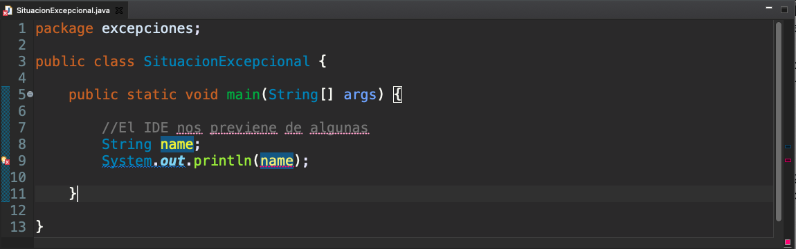

Por ejemplo si tratamos de trabajar con una variable que no esté inicializada, eso sería una instancia de una clase muy particular `String` pero al final una instancia de una clase y esta instancia no ha sido inicializada, el IDE de Eclipse nos previende de algunos errores, no podemos usar la clase `name` si no ha sido inicializada con absolutamente ningún tipo de valor. 

En otro caso podríamos tener por ejemplo una variable que inicializamos expresamente a una variable nula y tratamos de imprimir ese valor, podemos comprobar como imprime un valor nulo esto es correcto no hay error,  sin embargo si tratamos de acceder a un método de un objeto en particular de una instancia de `name` pero esa instancia no existe, es decir no referencia ninguna instancia, es valor nulo, Eclipse nos advierte con un warning `Null pointer access: The variable name can only be null at this 
 location` pero no marca error de compilación.

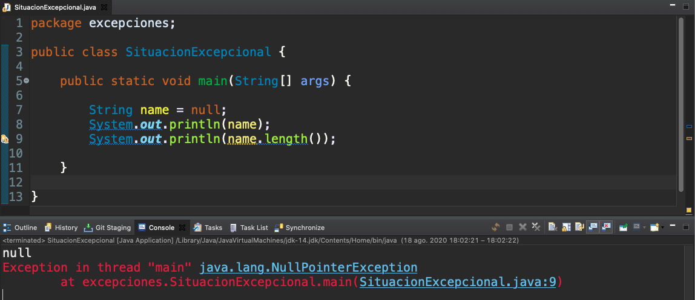

Pero al ejecutar tenemos una excepción del tipo `java.lang.NullPointerException`, estamos intentando acceder a un objeto a través de una referencia, pero esa referencia realmente no está apuntando, no esta referenciando a ningún objeto. El buen programador en este caso si podría plantearse el escribir código que permitirán manejar este error.

Otro tipo quizá sea menos posible manejar, supongamos que en este caso los valores los introduce usuario y tratamos de hacer la división de `a/b`, la división entera.

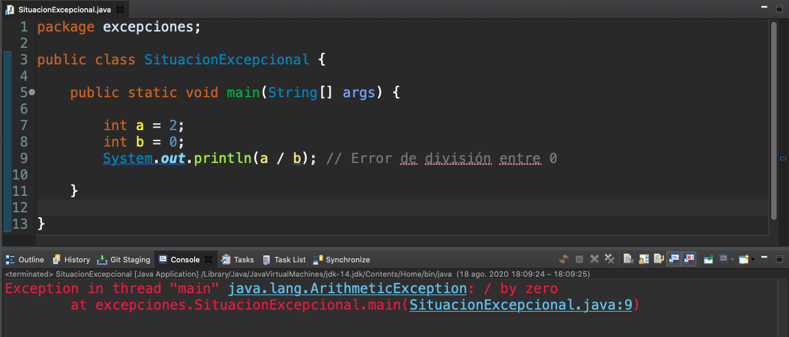

La división entre 0 no es posible, matemáticamente no es posible y entonces se nos produciría una excepción de tipo `java.lang.ArithmeticException`, no es posible hacer una división entre cero.

Estás excepciones serían mucho más complicado el poder controlarla, un ejemplo sencillo de una excepción que es muy complicado de controlar, porque si el usuario es el que introduce los valores "sería muy complicado poder anticiparlo".

*`SituacionExcepcional`*
 
```java
package excepciones;

public class SituacionExcepcional {
	
   public static void main(String[] args) {
		
      // El IDE nos previene de algunas
//    String name;
//    System.out.println(name);

//    String name = null;
//    System.out.println(name);
//    System.out.println(name.length());
//		
   
      //Otras no es posible controlarlas.
      int a = 2;
      int b = 0;
      System.out.println(a/b); //Error de división entre 0
		
   }

}
```

Java nos ofrece un mecanismo para el tratamiento de excepciones que vamos a trabajar en la siguiente lección.


# 27 Tratamiento de excepciones 13:36 

[Tratamiento de excepciones](pdfs/27_Tratamiento_de_excepciones.pdf)

## Resumen del Profesor

### 27.1 Tratamiento de excepciones

Se realiza utilizando la siguiente sintaxis:

```java
try {
   instrucciones;
} catch (Exception e) {
   instruccinoes;
} finally {
   instrucciones
}
```

`finally` no es obligatorio, y podemos incluir más de un bloque catch.

### 27.2 Bloque `try`

Debe envolver las sentencias que son susceptibles de provocar uno o varios tipos de excepción. Debemos agrupar las sentencias que vayan a tener un tratamiento idéntico de la situación excepcional.

```java
try {
   int a = 2;
   int b = 0;
   System.out.println(a/b); //Error de división entre 0            
} catch(ArithmeticException ex) {
   //ex.printStackTrace();
   System.err.println("Error: " + ex.getMessage());
}
```

### 27.3 Bloque `catch`

Sirven como manejadores de las situaciones excepcionales. Puede haber más de uno. Cada bloque puede manejar uno o más tipos de excepciones:

```java
try {
   for (int i = 0; i < 5; i++) {
      System.out.println(mensajes[i].toUpperCase());
   }
} catch (ArrayIndexOutOfBoundsException | NullPointerException ex) {
   System.err.println("Tratamiento común a las excepciones");
}
```
 
```java
try {
   for (int i = 0; i < 5; i++) {
      System.out.println(mensajes[i].toUpperCase());
   }
} catch (ArrayIndexOutOfBoundsException ex) {
   System.err.println("Tratamiento particular a las excepción ArrayIndex...");
} catch (NullPointerException ex) {
   System.err.println("Tratamiento particular a la excepción NullPointer...");
}
```

### 27.4 Bloque `finally`

Se ejecuta siempre, tanto si hemos terminado correctamente el bloque `try` como el bloque `catch`. Se suele utilizar como código que asegura el cierre de recursos abiertos (ficheros, bases de datos, ...).

## Transcripción


En la lección anterior hemos presentado las excepciones, esta lección vamos a ver cómo podemos darle tratamiento.


Java nos ofrece una sintaxis especial para poder dar tratamiento a instrucciones que van a poder provocar algún tipo de excepción y las vamos a poder recoger que es como hablábamos en la terminología utilizavamos antes, vamos a poder recoger esa excepsión y darle tratamiento y adicionalmente vamos a poder tener un bloque de código que será especial.

La estructura sería la que tenemos en pantalla encerrariamos dentro del bloque `try` el código propio de la aplicación, es decir el qué es susceptible de general alguna situación excepcional, a continuación tendríamos uno más bloques `catch` que sería el manejo de esa situación excepcional y por último y de manera optativa podríamos tener bloque `finally` donde tendríamos diferente instrucciones que se ejecutarían tanto si el bloque `try` ha finalizado correctamente como si ha sucedido algún tipo de excepción y le hemos dado tratamiento.


Como decíamos `finally` no es obligatorio puede haber más de un bloque `catch` tenemos que tener presente que los tipos excepción deben venir del más concretos al más genérico, porque si hay varios bloques `catch` y el primer `catch` es el de una clase de excepción muy genérica, por ejemplo la clase `Exception` directamente ese bloque va a recoger el tratamiento de esa excepción, sobre tipos de excepción hablaremos en lecciones siguientes, directamente recogería y si queríamos darle un tratamiento más concreto a una excepción por ejemplo de entrada salida con el teclado, con la pantalla o con ficheros pues escaparía, porque había recogido el tipo mas genérico antes. Tenemos que pensar que vamos trabajando primero con unos trámites que estén más concretos para posteriormente pasar a algunos más genérico, desde las última versiones de Java si no mal recuerdo desde la versión 7 tenemos un operador el de la barra vertical `|` que nos va a permitir recoger en un mismo `catch` dos tipos de excepción distintos si es que el tratamiento que queremos darle es el mismo, una cosa que sería bastante comoda.


Como decíamos el bloque `try` debía encerrar, debía envolver las sentencias que son susceptibles de provocar alguna situación excepcional, alguna excepción y deberíamos agrupar las sentencias que vayan a tener un tratamiento idénticos, no tenemos porque crear bloques `try` dentro por ejemplo de un mismo método, bloques `try` distintos para sentencias diferentes si se ejecutan de manera encadenada o secuencial y bueno van a tener el tratamiento común de un mismo tipo de error.


Con respecto a los bloques `catch` incidir en que puede haber más de uno, que nos permiten definir dentro de ese bloque `catch` lo que llamamos el manejador del error de la excepción y que cada bloque `catch` maneja al menos un tipo de excepción aunque puede manejar más de un tipo con el operador de barra vertical `|`.


El bloque `finally` se ejecuta siempre tanto si han terminado de ejecutarse todas las sentencias del bloque `try` como sí alguna de ellas ha provocado la situación excepcional y se ha pasado a manejar a través de un `catch`. En el `finally` se suele incluir código que nos asegura el cierre de recursos abiertos como ficheros o bases de datos para asegurarnos que se cierra tanto si hemos ejecutado bien la operación como si lo hemos ejecutado a través de una situación excepcional la finalización y ha habido algún problema.

### :computer: `101-27-TratamientoExcepciones`

Vamos a ver poco a poco el tratamiento de algunas situaciones excepcionales que hemos visto en el ejemplo anterior de las excepciones.

*`EjemploTratamientoExcepciones`*

```java
package excepciones;

public class EjemploTratamientoExcepciones {

   public static void main(String[] args) {
      int a = 2, b = 0;      
      System.out.println(a / b);
   }
   
}
```


Cómo podemos comprobar este tipo de error no va a ser de los que no nos podemos anticipar con lo cual Eclipse no nos sugiere que va a requerir del uso de un tratamiento excepcional, lo tendríamos que decir nosotros a 
través de un bloque `try-catch`.


*`EjemploTratamientoExcepciones`*

```java
package excepciones;

public class EjemploTratamientoExcepciones {

   public static void main(String[] args) {
      int a = 2, b = 0;      
      try {
         System.out.println(a / b);
      } catch (Exception ex) {
         ex.printStackTrace();
      }
   }
   
}
```

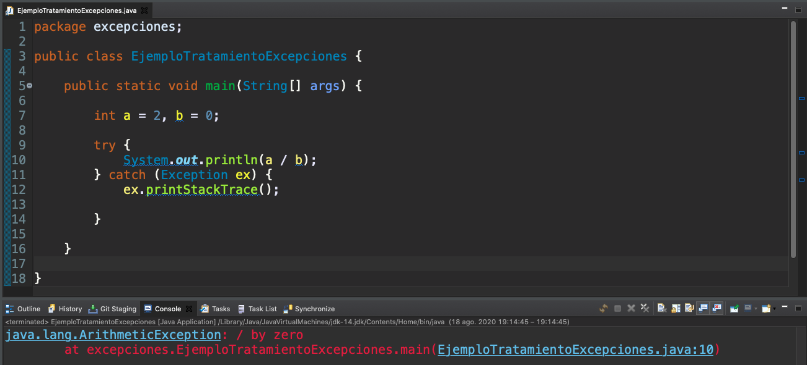

El objeto de tipo `Exception` nos provee de un método que digamos que es el comportamiento por defecto incluso cuando sucede una excepción, es decir darle este tratamiento en particular a esta excepción y no darle ninguno sería CASI igual, porque aquí lo que hacemos es **imprimir la traza de la pila**, como podemos comprobar nos esta imprimiendo el mismo mensaje que cuando no teniamos el bloque `try-catch`.

Sin embargo si que existe una diferencia substancial entre poner y no el bloque `try-catch`. Vamos a imprimir un mensaje después del bloque `try-catch`.

*`EjemploTratamientoExcepciones`*

```java
package excepciones;

public class EjemploTratamientoExcepciones {

   public static void main(String[] args) {
      int a = 2, b = 0;      
      try {
         System.out.println(a / b);
      } catch (Exception ex) {
         ex.printStackTrace();
      }
      System.out.println("La aplicación continua...");
   }
   
}
```


Cuando tenemos un bloque `try-catch` y se produce una excepción la aplicación no se para esta continua. Lo que no sucede si no tenemos el bloque `try-catch`.

*`EjemploTratamientoExcepciones`*

```java
package excepciones;

public class EjemploTratamientoExcepciones {

   public static void main(String[] args) {
      int a = 2, b = 0;      
      System.out.println(a / b);
      
      System.out.println("La aplicación continua...");
   }
   
}
```


Si no tratamos esta situación excepcional podemos ver como el segundo `println` no se imprime porque el tratamiento que hace la máquina virtual de Java como hemos dicho es imprimir la traza de la pila y terminar la ejecución del programa.

Finalmente para terminar con este ejemplo vamos a cambiar el mensaje que enviamos cuando sucede una excepción para no mandar el valor de la traza de la pila sino andar un mensaje personalizado.

*`EjemploTratamientoExcepciones`*

```java
package excepciones;

public class EjemploTratamientoExcepciones {

   public static void main(String[] args) {
      int a = 2, b = 0;      
      try {
         System.out.println(a / b);
      } catch (Exception ex) {
         //ex.printStackTrace();
	 System.out.println("Error de división entre cero");
      }
      System.out.println("La aplicación continua...");
   }
   
}
```

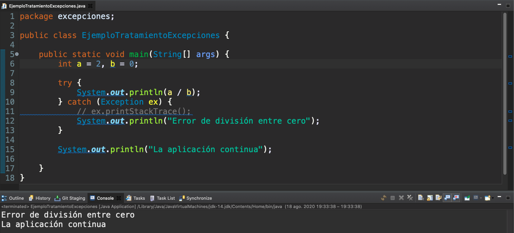

Algo parecido estamos haciendo aquí podemos comprobar como no tratamos con `Exception` directamente sino con una subclase suya `ArithmeticException` que se produce cuando hay algún tipo de error en una operación aritmética y como en lugar de imprimir la traza de la pila completa simplemene mandamos a imprimir el mensaje con el método `getMessage()` del objeto `ArithmeticException`, sin tener que parar definitivamente la ejecución del program.


*`TratamientoExcepciones01`*

```java
package excepciones;

public class EjemploTratamientoExcepciones {

   public static void main(String[] args) {
      try {
         int a = 2;
         int b = 0;
         System.out.println(a / b); // Error de división entre 0
      } catch (ArithmeticException ex) {
         // ex.printStackTrace();
         System.err.println("Error: " + ex.getMessage());
      }

      System.out.println("\nMensaje tras la división");
   }
   
}
```

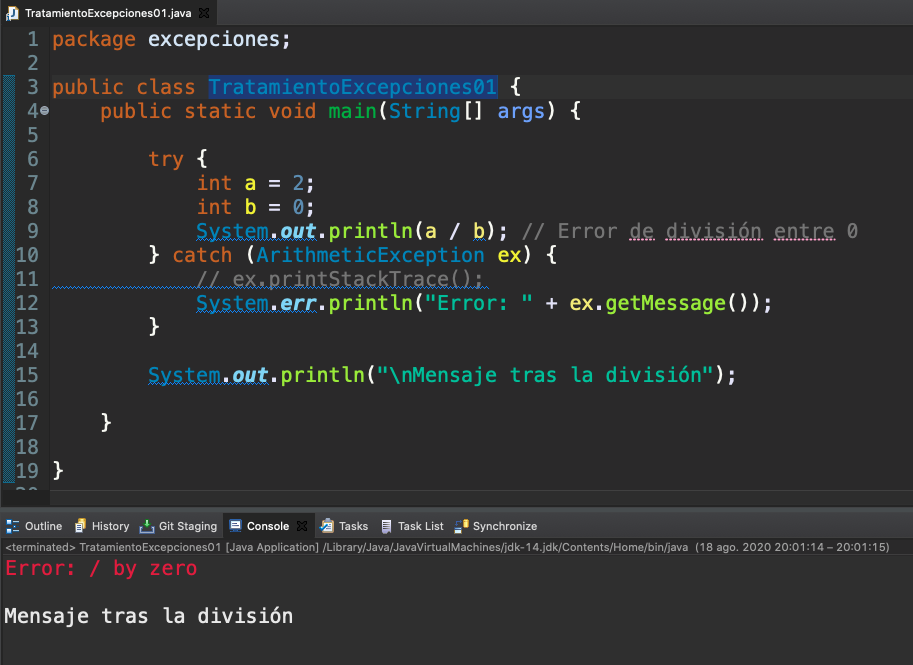


Podríamos incluso plantearnos el uso de algún bloque `finally` junto con el tratamiento de este tipo de excepción, si quisiéramos incluir el uso de una instrucción que fuera extrictamente necesaria independientemente de que si ocurre o no un error.  

*`TratamientoExcepciones02`*

```java
package excepciones;

public class TratamientoExcepciones02 {

   public static void main(String[] args) {
      try {
         int a = 2;
         int b = 1;
         System.out.println(a / b); // Error de división entre 0
      } catch (ArithmeticException ex) {
         // ex.printStackTrace();
         System.err.println("Error: " + ex.getMessage());
      } finally {
         System.out.println(
		"\nEstas instrucciones son muy importantes. Deben ejecutarse tanto si no ha habido excepciones, como si las ha habido");
      }

   }

}
```

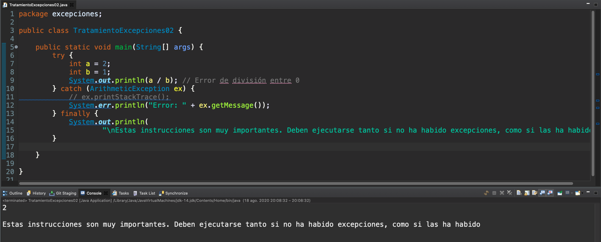

Por ejemplo en este caso la división se hace entre 2 y 1, la división se hace correctamente no sucede una excepción y el bloque `finally` se ejecuta.

Si cambiáramos el 1 por un 0.

*`TratamientoExcepciones02`*

```java
package excepciones;

public class TratamientoExcepciones02 {

   public static void main(String[] args) {
      try {
         int a = 2;
         int b = 0;
         System.out.println(a / b); // Error de división entre 0
      } catch (ArithmeticException ex) {
         // ex.printStackTrace();
         System.err.println("Error: " + ex.getMessage());
      } finally {
         System.out.println(
		"\nEstas instrucciones son muy importantes. Deben ejecutarse tanto si no ha habido excepciones, como si las ha habido");
      }

   }

}
```

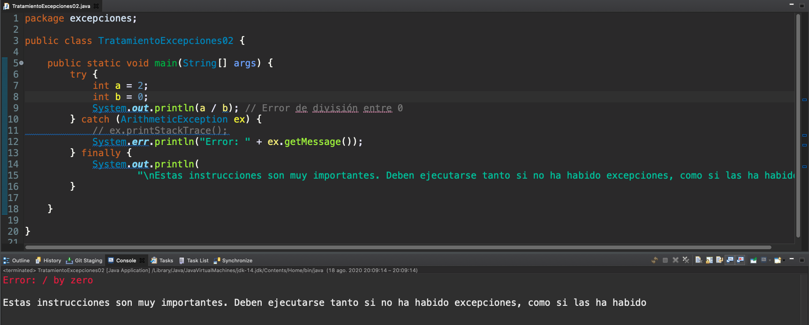

La división no se hace correctamente, ocurre un error, pero el bloque `finally` independientemente de que haya sucedido el `try` o el `catch` se va a ejecutar.

Podemos plantearnos el tratamiento de más de una excepción con bloques `catch` en los cuales como decíamos iríamos de excepción más concreta hacia una excepción más genérica. Aquí tendríamos dos posibles errores uno es el de divisiones entre cero y el otro es el del tipo `nullPointerException` en el que tratamos de llamar a un método a través de una referencia que no está apuntando a ningún objeto, que es una referencia nula.

*`TratamientoExcepciones03`*

```java
package excepciones;

public class TratamientoExcepciones03 {

   public static void main(String[] args) {

      try {
         int a = 2;
         int b = 1; //0;
         int resultado = a / b;
         String mensaje = null;
         System.out.println(mensaje.length()); // Error de división entre 0
      } catch (ArithmeticException ex) {
         // ex.printStackTrace();
         System.err.println("Error: " + ex.getMessage());
      } catch (Exception ex) {
         System.out.println("Se ha producido un error no esperado");
      }

   }

}
```


Podemos comprobar como se ha producido un error que no esperábamos, no esperábamos que el programador utilizara una referencia nula.

O en este caso si estuviéramos haciendo la división la ejecución de esta sentencia pararía en `int resultado = a / b;` porque esto produciría una excepción de tipo aritmético, las siguientes dos sentencias ya no se ejecutan, con lo cual se va a tratar en el bloque `catch (ArithmeticException ex)`.

*`TratamientoExcepciones03`*

```java
package excepciones;

public class TratamientoExcepciones03 {

   public static void main(String[] args) {

      try {
         int a = 2;
         int b = 0;
         int resultado = a / b;
         String mensaje = null;
         System.out.println(mensaje.length()); // Error de división entre 0
      } catch (ArithmeticException ex) {
         // ex.printStackTrace();
         System.err.println("Error: " + ex.getMessage());
      } catch (Exception ex) {
         System.out.println("Se ha producido un error no esperado");
      }

   }

}
```

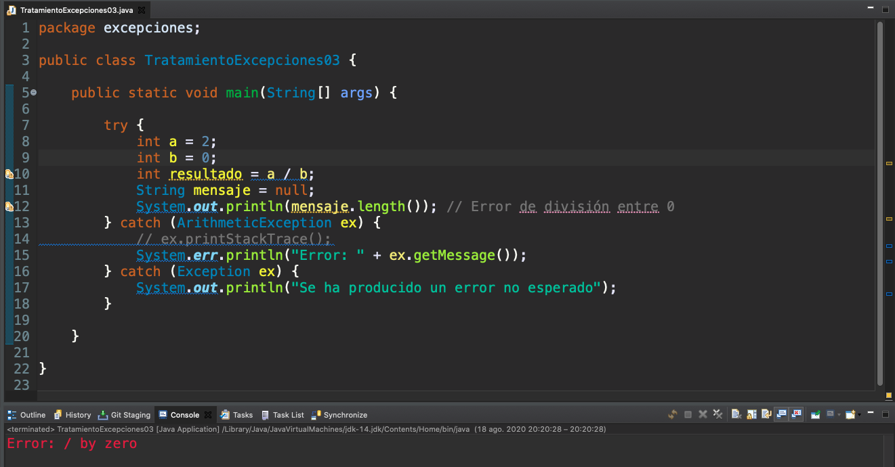

Nos podríamos plantear otro tipo de excepciones por ejemplo una que suele ser muy común para los programadores que trabajan con colecciones o con array es el tipo de excepción de tratar de recorrer una colección, en este caso un array de mensajes. Si lanzáramos así:

*`TratamientoExcepciones04`*

```java
package excepciones;

public class TratamientoExcepciones04 {

   public static void main(String[] args) {

      String[] mensajes = { "En un lugar", "de La Mancha", "de cuyo nombre", "no quiero acordarme" };
      //String[] mensajes = { "En un lugar", null, "de cuyo nombre", "no quiero acordarme", "no ha mucho tiempo vivía" };

      try {
         for (int i = 0; i < 5; i++) {
            System.out.println(mensajes[i].toUpperCase());
	 }
      } catch (ArrayIndexOutOfBoundsException | NullPointerException ex) {
         System.err.println("Tratamiento común a las excepciones");
      }

      System.out.println("Mensaje final");

   }
}
```

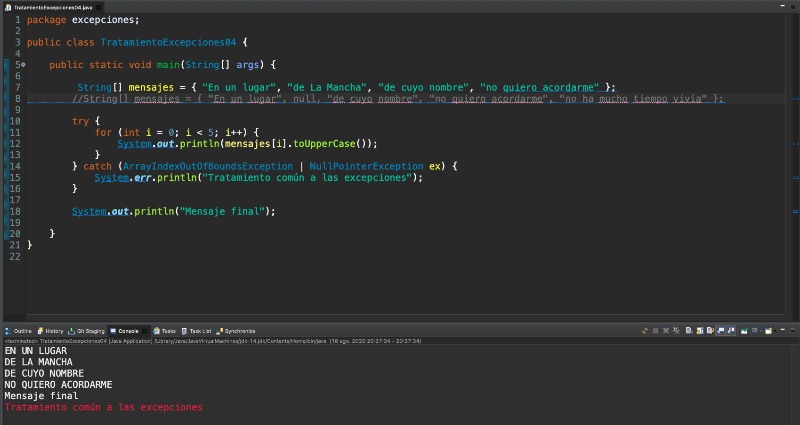


Podríamos comprobar como esto se imprime de una manera que  a priori parece correcta. Pero nos damos cuenta que el array de mensajes tiene cuatro posiciones y que estamos tratando de acceder a una quinta posición que no existe, este error se trataría mediante la excepción `ArrayIndexOutOfBoundsException` estamos intentando acceder a una posición que no existe a un índice de un array que está fuera de sus límites.

En este caso de abajo tenemos un error diferente, en este caso tenemos cinco posiciones dentro del array pero tenemos una posición que es una cadena nula, si tratamos de imprimir eso en mayúscula.

*`TratamientoExcepciones04`*

```java
package excepciones;

public class TratamientoExcepciones04 {

   public static void main(String[] args) {

      //String[] mensajes = { "En un lugar", "de La Mancha", "de cuyo nombre", "no quiero acordarme" };
      String[] mensajes = { "En un lugar", null, "de cuyo nombre", "no quiero acordarme", "no ha mucho tiempo vivía" };

      try {
         for (int i = 0; i < 5; i++) {
            System.out.println(mensajes[i].toUpperCase());
	 }
      } catch (ArrayIndexOutOfBoundsException | NullPointerException ex) {
         System.err.println("Tratamiento común a las excepciones");
      }

      System.out.println("Mensaje final");

   }
}
```

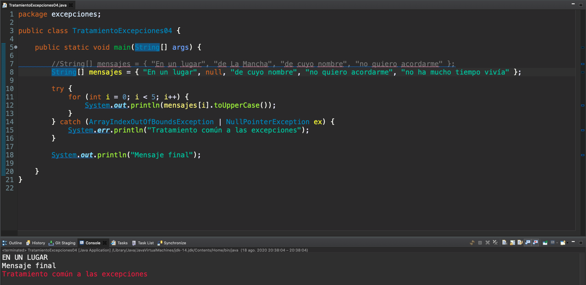

Pues nos damos cuenta como a la hora de imprimir la segunda cadena, al tratar de pasarlo a mayúsculas estamos llamando a un método sobre una referencia que es nula, con lo cual produce un `NullPointerException`, el uso de este operador de la barra vertical `|` la que está en la en la tecla del uno, nos permite darle un tratamiento común a estas dos excepciones a la primera o a la segunda. Podemos ver como el último mensaje tras darle un tratamiento a los errores lo imprime.

Fijaos como existe aparte de `System.out` existe `System.err` digamos que es una consola que es común a la de salida a la `out` pero que Eclipse lo único que va a hacer es imprimir los errores en en un color rojo. Esto viene heredado desde antiguo cuando los sistemas informáticos podían tener una consola de salida y una consola diferente un monitor diferente incluso para los posibles errores, incluso podríamos configurar la ejecución de nuestro proyecto para que los errores los que imprimimos por aquí los fuera redirigiendo hacia otro sitio por ejemplo hacia un fichero para tener una especie de sistema de Logs de registro o bitácora de errores.

Aquí tendríamos un tratamiento que sería digamos anterior a Java 7 el que no ofrece el de la barra vertical,  que bueno podemos comprobar que para tratar una excepción de tipo `ArrayIndexOutOfBoundsException` o `NullPointerException` con un tratamiento particular, si no le queremos dar el mismo tratamiento tendremos diferentes bloques `catch` uno para cada tipo de excepción, lo haríamos así.

*`TratamientoExcepciones04bis`*

```java
public class TratamientoExcepciones04bis {

   public static void main(String[] args) {

      String[] mensajes = { "En un lugar", "de La Mancha", "de cuyo nombre", "no quiero acordarme" };
      // String[] mensajes = { "En un lugar", null, "de cuyo nombre", "no quiero acordarme", "no ha mucho tiempo vivía" };

      try {
         for (int i = 0; i < 5; i++) {
	    System.out.println(mensajes[i].toUpperCase());
         }
      } catch (ArrayIndexOutOfBoundsException ex) {
         System.err.println("Tratamiento particular a las excepción ArrayIndex...");
      } catch (NullPointerException ex) {
         System.err.println("Tratamiento particular a la excepción NullPointer...");
      }

      System.out.println("Mensaje final");

   }

}
```

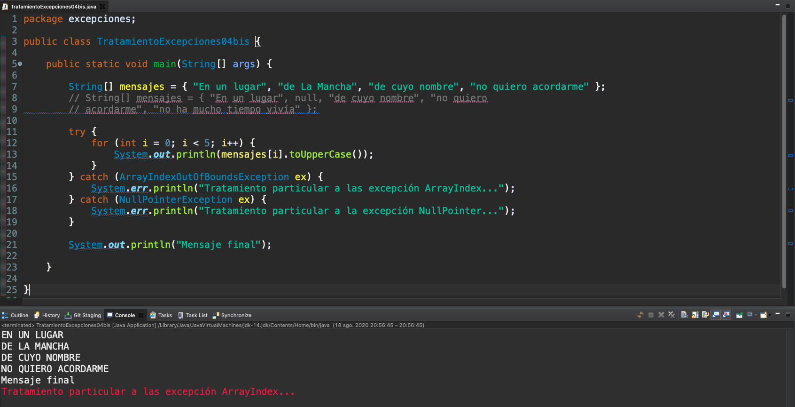

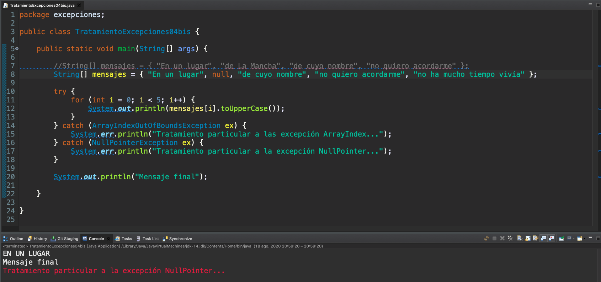


Con esto terminamos el tratamiento de excepciones vamos a pasar ahora a conocer alguna de las excepciones más comunes.

## 28. Excepciones más comunes 4:49 

[Excepciones más comunes](pdfs/28_Clases_de_excepción_más_comunes.pdf)

## Resumen del Profesor

CLASE DE EXCEPCIÓN | USO
-------------------|----
ArithmeticException |	Errores en operaciones aritméticas
ArraryIndexOutOfBoundsException |	Índice de array fuera de los límites
ClassCastException | Intento de convertir a una clase incorrecta
IllegalArgumentException | Argumento ilegal en la llamada a un método
IndexOutOfBoundsException | Índice fuera de colección
NegativeArraySizeException | Tamaño de array negativo
NullPointerException | Uso de referencia nula
NumberFormatException | Formato de número incorrecto
StringIndexOutOfBounds | Índice usado en String fuera de los límites


### Transcripción


Tras conocer cómo dar tratamiento a las excepciones vamos a pasar ahora a conocer algunas de las excepciones más comunes que no ofrece Java.

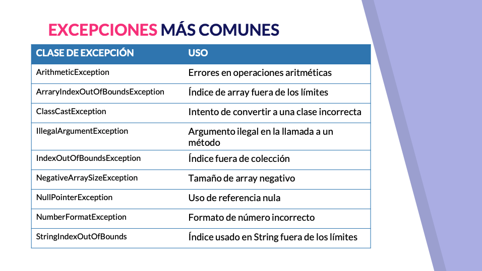

Java tiene varias decenas de clases para tratar situaciones excepcionales que pueden ser asociadas a diferentes tipos de operaciones, por ejemplo podemos tener la `ArithmeticException` que ya hemos conocido para errores en el uso de operaciones aritméticas, la de `ArraryIndexOutOfBoundsException` si estamos intentando utilizar un índice fuera de los límites de un array, la `ClassCastException` en la cual intentamos convertir una clase a través de un casting a un tipo que no es correcto, que no es compatible nos daría un error, la `IndexOutOfBoundsException` sería un índice pero fuera de una colección o de un array, si tratamos de crear un array de tamaño negativo nos daría una excepción de tipo `NegativeArraySizeException`, ya hemos visto que el uso de una referencia nula para llamar algún método provocó `NullPointerException`, si tratamos de formatear un número con un formato incorrecto nos darían `NumberFormatException`, si tratamos de acceder a un `String` que sabemos que una sucesión de caracteres utilizando alguna índice que está fuera de sus límites también nos daría un error `StringIndexOutOfBounds` y cómo estás podemos tener un montón de clases de excepciones.

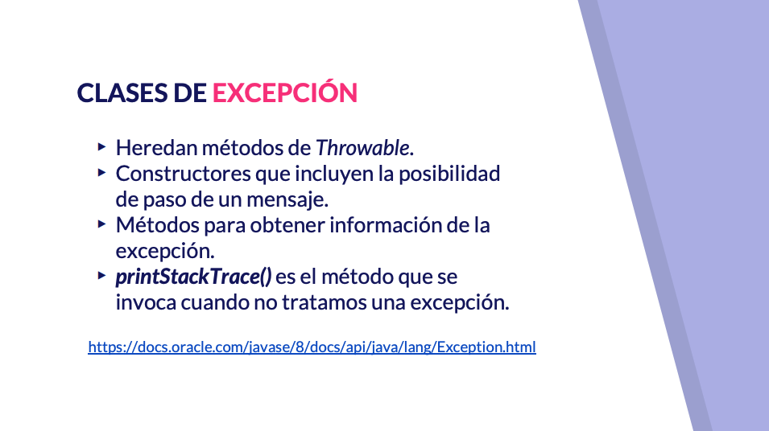

Todas estas clases de excepción heredan de **`Throwable`**, tienen también constructores que incluyen la posibilidad de que le pasamos nosotros un mensaje a la hora de construirlo, tienen una serie de métodos que no van a permitir obtener información sobre la excepción y suelen tener el método `printStackTrace()` que ya hemos conocido antes, que es el que se invoca cuando no le damos un tratamiento y que imprime la traza de la pila para posteriormente, cuando no le damos tratamientos detener la ejecución del programa.

Si pincháis en el enlace

https://docs.oracle.com/javase/8/docs/api/java/lang/Exception.html

nos viene directamente a la documentación al API Java Docs de la clase `Exception`.

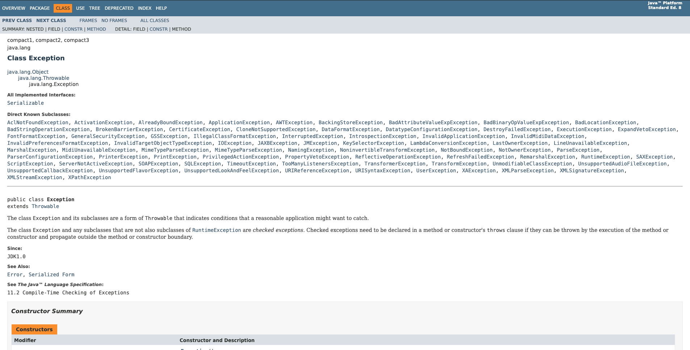

Y podemos comprobar como tenemos un montón de tipos diferentes posibles de excepciones, desde la clase `Exception` podemos tener excepciones de todo tipo para diferentes situaciones, por ejemplo si estuviéramos haciendo consulta SQL con una base de datos relacional si hubiera algún problema en esta consulta al procesar los resultados podríamos tener una una excepción del tipo `SQLException`, cuando se trabaja con ficheros e intentamos acceder a un tipo de fichero o con flujo podríamos tener excepciones del tipo `IOException`. 

Veíamos que había un tipo de excepciones especial las `RuntimeException`.

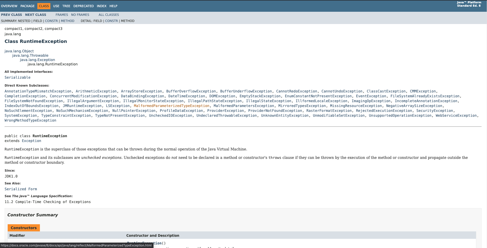

De las cuales también tenemos un montón de subtipos que podemos utilizar, por ejemplo error de tipo `DateTimeException`, haciendo `DataBindingException`, las excepciones aritmética `ArithmeticException` que ya hemos visto, la `NegativeArraySizeException`, operaciones de Entrada-Salida no chequeada `UncheckedIOException` un montón de excepciones diferentes que Java pone a nuestra disposición y que podemos utilizar de diferentes maneras. Estas excepciones no las vamos a conseguir conocer siempre de una vez, podremos comprobar como en determinadas ocasiones estamos escribiendo un programa que produce alguna excepción que nosotros no habíamos previsto, sobre todo las de tipo `RuntimeException` y que tenemos que elegir si darle un tratamiento o darle otro ya que en el algunos de los casos nos podremos anticipar sobre todo si vamos aprendiendo a ser prudentes y exigentes a la hora de programar o en otros casos pues no nos podremos anticipar, las de tipo `RuntimeException` es más complicado el poder anticiparnos a este tipo de excepciones, las que eran directamente de `Exception` será un poco más fácil que podamos anticipar.

Para finalizar el bloque de excepciones y su tratamiento vamos a ver como nosotros podríamos lanzar o relanzar una excepción que haya sucedido o bueno lanzar una nueva experiencia que nosotros queremos darle ese tratamiento.


## 29. Lanzamiento y propagación de excepciones 11:25 

[Lanzamiento y propagación de excepciones](pdfs/29_Lanzamiento_y_propagación_de_excepciones.pdf)

## Resumen del Profesor

### 29.1 Lanzamiento de excepciones

Cualquier código puede lanzar excepciones (hecho por java, por nosotros o de terceros). Si no vamos a tratar las excepciones en un método, tenemos que indicar que se relanzarán hacia arriba (`throws`).

#### 29.1.1 Uso de `throws`

Un método cuyo código puede producir excepciones puede capturarlas y tratarlas, o relanzarlas para que sea otro quien las trate. `throws` se escribe a continuación de la firma del método y antes de la apertura del cuerpo, y espera la excepción o excepciones (lista separada por comas) que se pueden lanzar.

```java
public static void writeList() throws IOException {

}
```

#### 29.1.2 Uso de `throw`

Nos permite lanzar una excepción en un momento determinado. También se puede usar en el bloque catch, para tratar una excepción, pero aun así relanzarla.

```java
public void sacarDinero(double cantidad) throws SaldoNegativoException {
   saldo -= cantidad;
   if (saldo < 0) {
      throw new SaldoNegativoException(saldo);
   }
}
```

### 29.2 Excepciones propias

Podemos crear nuestros propios tipos, extendiendo a `Exception`. Nos permiten manejar nuestras propias situaciones. Es buena práctica añadir el sufijo `...Exception`.

```java
public class SaldoNegativoException extends Exception {

   public SaldoNegativoException(double saldo) {
      super("La cuenta ha quedado en descubierto (" + Double.toString(saldo) + ")");
   }

}
```

## Transcripción


Vamos a cerrar el bloque de situaciones excepcionales, de tratamiento de excepciones con el lanzamiento y propagación de excepciones. 


Cualquier código hecho por Java de las miles de clases que Java ofrece implementado por nosotros o incluso si en una librería de terceros pueden lanzar excepciones, como ya hemos visto antes a las excepciones se les puede dar tratamiento e incluso hay algunas opciones que quizás no queramos darle tratamiento, si nosotros explícitamente no queremos darle tratamiento a una excepción, sobre todo a código que implementamos nosotros y queremos delegar ese tratamiento de la excepción hacia arriba, es decir en alguno de los métodos que nos ha invocado lo podemos hacer utilizando la palabra reservada **`throws`**.


**`throws`** nos permite que un método cuyo código pueda tener una situación excepcional no lo trate, no nos obliga a darle un tratamiento con `try catch` sino que lo relance hacia arriba, esto suele ser cuando nosotros estamos programando algún tipo de clase, ya hablaremos en el curso de Java para programadores Java de clases por ejemplo servicios, los servicios serían clases que implementarían la lógica de negocio de una aplicación, esos servicios se podrían utilizar para hacer una aplicación de escritorio, una aplicación web incluso otro tipo de aplicación un API REST, incluso podríamos plantearnos el hecho de que esá excepción no la traemos nosotros dentro del servicio sino que el mensaje que va a visualizarse al usuario se pueda propagar, de esa manera podríamos delegar en la clase que nos ha invocado el tratamiento de la excepción y el poder decir, continúa la ejecución de esta manera, visualizamos este mensaje porque si lo imprimimos directamente por consola estamos presuponiendo que estamos trabajando en una aplicación con consola, si nuestra aplicación fuera gráfica no sería igual, tendríamos que mostrar a lo mejor algún tipo de diálogo al usuario con ese mensaje de error. **`throws`** nos va a permitir relanzar una una excepción, en el caso por ejemplo de la diapositiva la firma que tenemos del método, sería un método que escribiría una lista presumiblemente en un fichero y qué puede que produzca algún tipo de excepción de tipo `IOException` de entrada salida input output o no y no queremos darle tratamiento en este método y queremos relanzar, es decir sería el método que llamará a `writeList()` el encargado de tratar esa excepción.


Aparejado al lanzamiento de excepciones propias de Java, nos podemos plantear el hecho de crear excepciones propias, esto nos puede servir para dar tratamiento a situaciones de error que no son propios de Java, no es un problema de acceso a un fichero, no es una operación aritmética de división entre 0, sino que son errores asociados a nuestra lógica de negocio, por lógica de negocio entendemos pues a lo más esencial y propio característico de nuestro sistema, si pensamos por ejemplo en un sistema bancario de cuentas corrientes y la posibilidad de hacer traspasos entre cuentas de nuestra entidad podríamos tener una excepción que nos indicará cuando una cuenta a la hora de hacer un traspaso o sacar dinero desde un cajero se queda con saldo negativo y podríamos crear una excepción de tipo `SaldoNegativoException`. Para crear una excepción propia lo que hacemos es extender de la clase `Exception` y eso nos permitiría tener nuestras propias clases. 

Como podemos comprobar es muy sencillo crear una excepción propia porque tan solo tendríamos que extender la clase `Exception` y aportar un constructor que tuviera o no parámetros en este caso nos interesaría tener un constructor con un parámetro que sería el `saldo` negativo y tan solo tendríamos que llamar al constructor de la clase base de `Exception` con `super` para modelar el mensaje de expresión que vamos a mostrar.


Por último aparejado al uso del lanzamiento de excepciones por parte de un método, podríamos indicar el lanzamiento explícito de una excepción, eso viene íntimamente relacionado sobre todo con las excepciones propias, si tenemos un método que va a permitirnos sacar una cantidad de dinero de un cajero para sacar dinero de una cuenta, podríamos tener la posibilidad de lanzar explícitamente una excepción, eso se hace a través de la palabra reservada `throw` sin `s` que nos va a permitir lanzar una nueva instancia de una excepción, lo podríamos hacer dentro de un bloque normal de código como es el caso en la diapositiva, sabiendo que el método `sacarDinero` relanza la excepción hacia quien lo este invocando o lo podríamos hacer también para encadenar un tratamiento parcial a una excepción pero aún así querer relanzarla con lo cual podríamos en un bloque `catch` recoger una excepción, darle un tratamiento, pero relanzarla para que el método que nos ha invocado la pudiera también tratar. 

### :computer: `101-29-Lanzamiento`

Vamos a ver algunos ejemplos, en este caso ejemplos sin y con `throws`.

*`EjemploConThrows`*

```java
package conthrows;

import java.io.FileWriter;
import java.io.IOException;
import java.io.PrintWriter;

public class EjemploConThrows {

   public static void main(String[] args) {
		
      try {
         writeList();
         System.out.println("Fichero escrito correctamente");
      } catch (IOException e) {
         System.out.println("Error al intentar abrir un fichero de texto");
      }
   }
	
   public static void writeList() throws IOException {
      PrintWriter out = new PrintWriter(new FileWriter("OutFile.txt"));
		
      for(int i = 0; i < 10; i++) {
         out.println("Mensaje nº " + i);
      }
		
      out.close();
   }

}
```

*`OutFile.txt`*

```txt
Mensaje nº 0
Mensaje nº 1
Mensaje nº 2
Mensaje nº 3
Mensaje nº 4
Mensaje nº 5
Mensaje nº 6
Mensaje nº 7
Mensaje nº 8
Mensaje nº 9
```

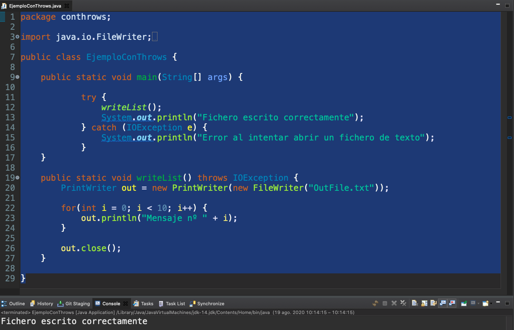

En este ejemplo nos podemos dar cuenta que en la clase `EjemploConThrows` en el método `writeList()` lanzamos la excepción `throws IOException`.

Esto es un código que lo de dentro como es natural no lo vamos a conocer, el tratamiento de ficheros cosa que nos queda fuera del ámbito de este curso, tratamos de escribir dentro de un fichero de texto una serie de mensajes, la operación de abrir un nuevo flujo hacia un fichero de caracteres va a producir potencialmente una excepción de tipo `IOException`.

```java

   public static void writeList() throws IOException {
      PrintWriter out = new PrintWriter(new FileWriter("OutFile.txt"));
		
      for(int i = 0; i < 10; i++) {
         out.println("Mensaje nº " + i);
      }
		
      out.close();
   }

```

Si eliminamos dicha excepción Eclipse nos marcará una serie de errores de compilación.

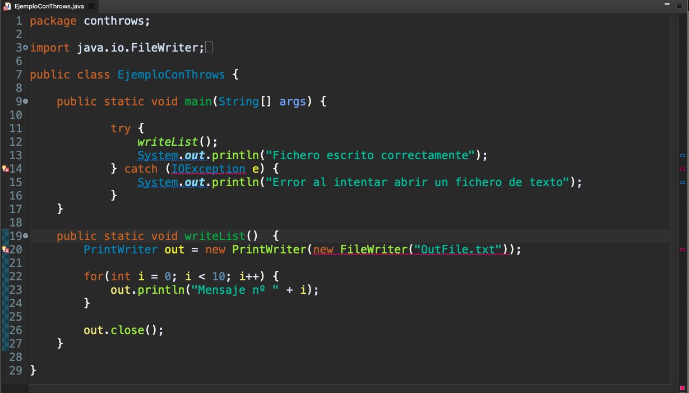

Ya Eclipse se anticipa al posible error de compilación que pudiéramos tener y entonces nos da la posibilidad de o bien englobar el código de estas sentencias dento de un bloque `try-catch` o  añadir `throws` a la declaración del método, que va a ser la opción que hagamos aquí, de esa manera ya no tendríamos que darle tratamiento a esta excepción si no que lo delegamos, relanzamos esta excepción hacia arriba, lo delegamos en el método que nos ha llamado, en este caso el método `main` que es el que se encarga de manejar la `IOException`.


```java

   public static void main(String[] args) {
		
      try {
         writeList();
         System.out.println("Fichero escrito correctamente");
      } catch (IOException e) {
         System.out.println("Error al intentar abrir un fichero de texto");
      }
   }

```

Si en este método no tuvieramos el bloque `try catch` es decir:

```java

   public static void main(String[] args) {
		
      
         writeList();
         System.out.println("Fichero escrito correctamente");
      
   }

```

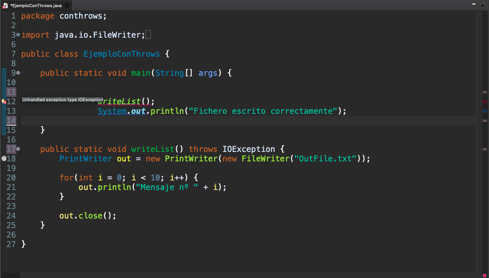

Veríamos como aquí ya nos está obligando de nuevo Eclipse a que o bien le demos tratamiento a la excepción o bien relancemos la excepción. en este caso como ya queremos manejar la excepción aquí implica meter el bloque `try catch`, incluso nos podemos apoyar de Eclipse para generar el bloque `try catch` para que envuelva más de una sentencia dentro del bloque.

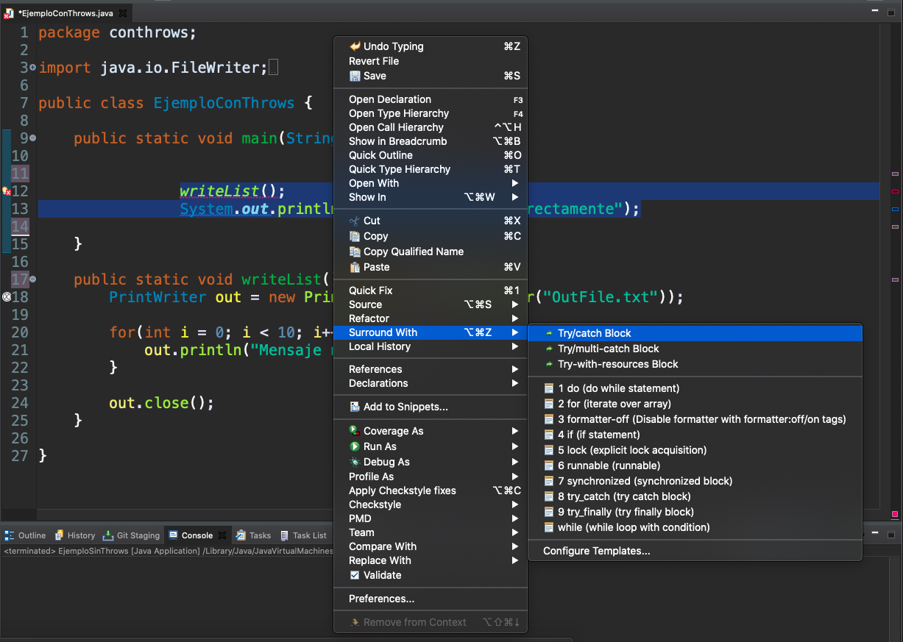

y ya nosotros podríamos darle al tratamiento que quisiéramos.

### :computer: `101-29-Lanzamiento`

En el ejemplo sin `Throws` que tenemos aquí abajo.

*`EjemploSinThrows`*

```java
package conthrows;

import java.io.FileWriter;
import java.io.IOException;
import java.io.PrintWriter;

public class EjemploSinThrows {

   public static void main(String[] args) {
      writeList();
      System.out.println("Fichero escrito correctamente");
   }

   public static void writeList() {
      PrintWriter out = null;
      try {
         out = new PrintWriter(new FileWriter("OutFile.txt"));

         for (int i = 0; i < 10; i++) {
            out.println("Mensaje nº " + i);
         }
      } catch (IOException ex) {
         System.err.println("Error al abrir o escribir en el fichero");
      } finally {
         out.close();
      }

   }

}
```

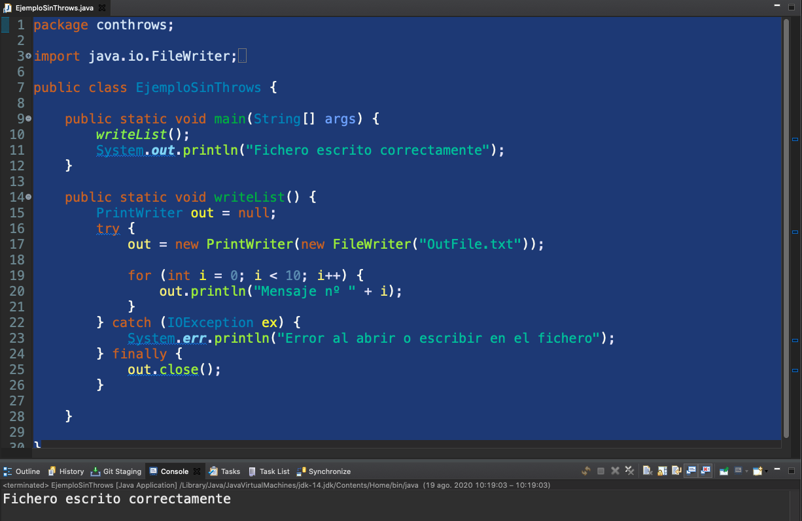

*`OutFile.txt`*

```txt
Mensaje nº 0
Mensaje nº 1
Mensaje nº 2
Mensaje nº 3
Mensaje nº 4
Mensaje nº 5
Mensaje nº 6
Mensaje nº 7
Mensaje nº 8
Mensaje nº 9
```

Tendríamos aquí que el tratamiento de la excepción lo tendríamos que dar dentro del propio método `writeList()`, en este caso tanto el método de apertura del fichero como el método de escritura del fichero podrían provocar que algún tipo de error de entrada salida `IOException` ocurriera y que capturara el bloque `catch` y por ilustrar también un bloque `finally` totalmente real, tendríamos aquí la posibilidad de cerrar una instancia de un fichero, de un flujo de salida, tanto algún error de escritura como si no sé produce.

En ambos ejemplos se produce el mismo fichero `OutFile.txt` por que ambos programas hacen exactamente lo mismo, como no hemos puesto ninguna ruta se crea dentro del mismo proyecto.


ejecutamos este ejemplo pero de esto como si juntamos este otro con con el con el código froze vale también tendríamos el mismo contenido porque ambos programa hacen esta por ilustrar también el ejemplo que decía muerte de un especial de tipo propio y el uso de froze podríamos tener una clase banco con una cuenta corriente para Luis Miguel cuenta corriente es una clase que tiene un string como propietario y un saldo y tendríamos la posibilidad de ingresar dinero y de sacar dinero a la hora de sacar dinero nos daríamos con que si el saldo que queda al sacar dinero en negativo se lanzaría una excepción proporcionando ese salto la infección que ya la hemos visto antes en propia entiende de excepción vale esto de aquí es un warning no es un error sino bueno una advertencia que no hace triste nos dice que como todas las estancias de excepción también están implementando una interfaz que se llama serializable deberíamos añadir algo no tenemos por que hacerlo le digo los warnings son mensajes de error pero no son aplicaciones bueno como hemos visto tendríamos que sobre escribir o implementar mejor dicho un método de concierto en este caso recibe un parámetro y llamar al constructor de excepción para que primera ese mensaje de error en este caso nuestra cuenta corriente empieza con un valor de Rosario de pie si queremos sacar 160 € e imprimir el saldo actual nos daremos de luces con qué se ha producido una excepción estamos en la cuenta quedado en descubierto con un con un saldo de menos 60 € y tendríamos que ponernos en contacto con nuestro banco con esto terminamos el bloque de tratamiento de excepciones y nos lanzamos de lleno al último bloque de nuestro


## Contenido adicional 4   

[Excepciones y errores](pdfs/26_Excepciones_y_errores.pdf)

[Tratamiento de excepciones](pdfs/27_Tratamiento_de_excepciones.pdf)

[Excepciones más comunes](pdfs/28_Clases_de_excepción_más_comunes.pdf)

[Lanzamiento y propagación de excepciones](pdfs/29_Lanzamiento_y_propagación_de_excepciones.pdf)
