# 7. Manejo de excepciones 39m
   * Excepciones y errores 9:28 
   * Tratamiento de excepciones 13:36 
   * Excepciones más comunes 4:49 
   * Lanzamiento y propagación de excepciones 11:25 
   * Contenido adicional 4
   
# 26 Excepciones y errores 9:28

## Resumen del Profesor

[Excepciones y errores](pdfs/26_Excepciones_y_errores.pdf)


### 26.1 Excepciones

El término excepción es una abreviatura de *situación excepcional*. Se trata de una situación que altera la ejecución normal de un programa. Por ejemplo, en una calculadura, un usuario intenta realiza la división `2 / 0`. En ese momento, el sistema crea un objeto, que se llama *objeto de excepción* y lo pasa de una llamada de método a otra, buscando quien pueda hacerse cargo. Si no existe nadie, será la propia JVM quien lo haga.

El uso de excepciones tiene varias ventajas:

* Permiten separar el código de tratamiento de errores del código normal.
* Evitan que haya errores inadvertidos.
* Permiten la propagación de los errores.
* Permiten agrupar en un lugar común el tratamiento de errores.

### 26.2 Tipos de Excepciones

Podemos agrupar las excepciones en 3 grandes tipos:

* Excepciones comprobadas (*checked exceptions*): son aquellas excepciones que pueden surgir internamente en un programa, pero que al estar bien escrito, podemos tratar y de las que nos podremos recuperar.

* Errores (*errors*): situaciones externas que no son anticipables, y de las que puede que no podamos recuperarnos (por ejemplo, un error hardware). Son un tipo no comprobado (*unchecked*)

* Errores de ejecución (*Runtime errors*): son situaciones interas de la aplicación, de las que probablemente no podamos recuperarnos. Son un tipo no comprobado (*unchecked*).

## Trascripción


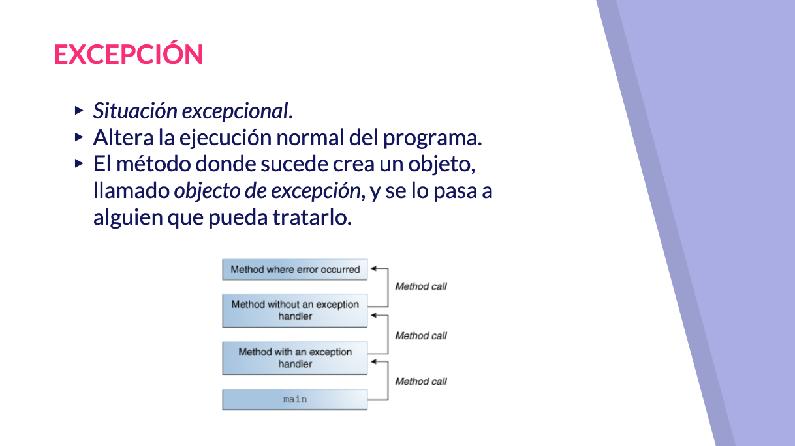

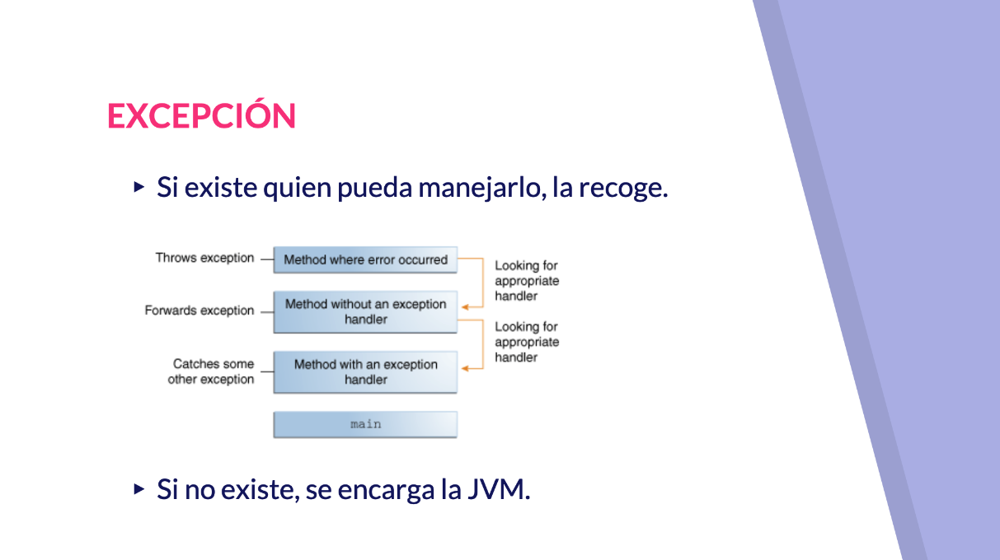

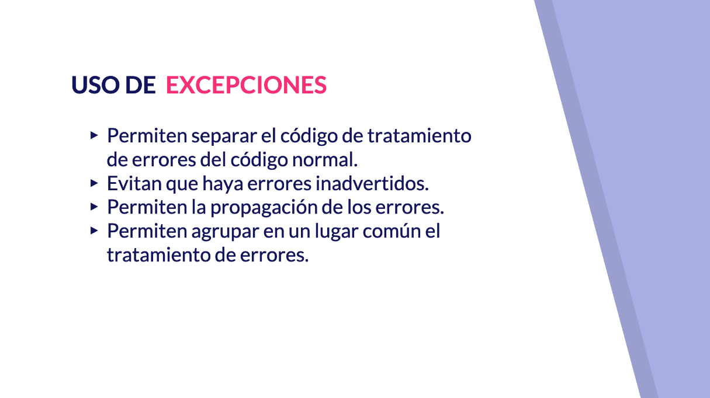

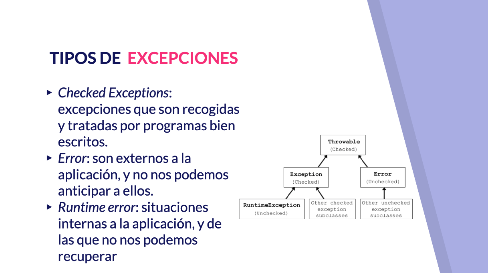

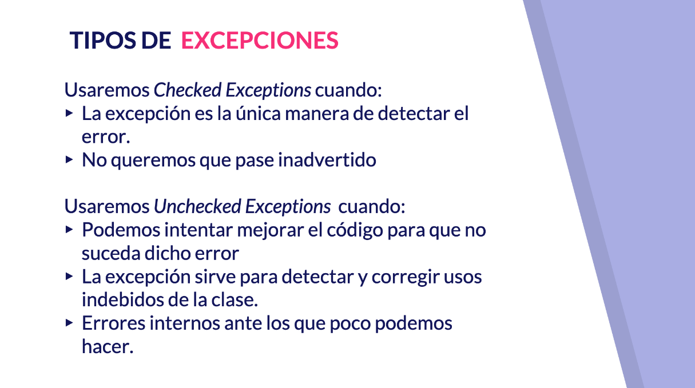

Hola a todos vamos a comenzar un nuevo bloque en el que hablaremos de excepción ahora todo el código que hemos ido desarrollando hemos supuesto pues que no solamente que iba a funcionar bien como no iba a funcionar así nosotros somos estupendos programables sino que bueno pues que toda situación que se iba a presentar era una situación normal o si queríamos tratar algún tipo de situación que no fuese la normal recordar por ejemplo los diferentes ejemplos que hemos hecho que incluyan un menú pues si la opción que introducía en el menú no estaba dentro del rango que nosotros teníamos definido lo comprobamos a través de un pequeño ahí y y podíamos decirle de equivocado usted la opción que introducido sin embargo es posible que se nos presenten situaciones excepcionales muchas de las veces sucederá porque un valor introducido por el usuario no es correcto otra es posible que sea porque los programadores que son humanos pues se hayan equivocado en la secuencia de operaciones de potencias que bancaria esta situación excepcional es posible que altere la ejecución de normal de nuestro programa al producirse esa situación excepcional el método dónde dónde sucede crea un objeto especial que recoge de alguna manera información sobre esa situación excepcional llamado objeto de ese objeto de excepción y que se lo pasa a alguien para que pueda tratar lo veremos además como si teníamos uno por una serie llamada a métodos que dentro habían llamado a otro método el método dónde sucede el error es posible que vaya pasando este objeto de excepción a diferentes métodos que traten de encontrar alguno que sea capaz de de manejar la excepción quien pueda manejarlo por ejemplo si uno de los métodos si tiene el mecanismo necesario para manejar esta excepción gratis recoges objeto del tratamiento que corresponda llegar a existir ese objeto sería la máquina virtual de Java la que le daría un tratamiento por defecto a cualquier excepción ese tratamiento por defecto pasa por imprimir lo que se conoce como la traza de la pila y finalizar la ejecución del programa la traza de la pila sería imprimir bueno pues el método actual en el que nos encontrábamos el finde alguna información sobre el perro y a raíz de ahí el método sobre el que habíamos llamado y habíamos llamado anteriormente etcétera etcétera hasta llegar al metro 2000 sería el tratamiento por defecto que haría la máquina virtual de Java no sería que esté así que en ningún en ningún caso salvo que estemos comenzando le el desarrollo de una pequeña aplicaciones no queramos todavía darle el tratamiento a esta situación excepcional espero que así que en ningún caso sería el más adecuado con sus respectivos nos queremos centrar en algo didáctico y que nos veamos allí tratamiento a esta excepción el uso de expresiones nos va a permitir separar el código de tratamiento de errores del código normal como decían en nuestra ocasiones anteriores el tratamiento del hecho de que un usuario introdujeron la opción de menú que no era correcta lo teníamos junto con el código del menú del resto del programa habrá situación en la que eso no sea de cuanto que podamos separar físicamente el código del tratamiento de error del código normal también nos va a permitir el uso de excepciones le evitar que haya errores que puedan pasar inadvertidos tanto para el programador como bueno si no se lo digo lo utilizarán otros programadores también va a permitir propagar errores en decir si un error se sucede sucede en una parte podamos propagarlo hasta el objeto que pueda tratarlo y también pues nos permite coge cenar el código de tratamiento de errores para agruparlos en un lugar común vale Java nos ofrece diferentes tipos de excepciones a través de varios interfaces y y su interfaz es que podemos encontrar Hola todo vamos a comenzar un nuevo bloquéame y que hablaremos especial

Por programas están bien escrito vale un error de del programador los errores son situaciones externas a nuestra aplicación y es imposible anticiparnos a ellos imaginemos no que bueno que estamos tratando de acceder a un fichero y el volumen el disco duro en el que está este Cicero tú tiene algún tipo de error hardware imposible de que podamos participar y los de tipo ruta en error perdón run time error de ejecución que son situaciones internas a la aplicación no son externa y de las cuales pues no nos vamos a poder recuperarlo el uso de un tipo u otro tipo vendrá marcado por alguna de las siguientes cuestiones las de tipo chequeado pues la usaremos cuando la excepción es la única manera de detectar el error y no queremos que pase inadvertido que veremos a partir de ahora con el Burguer la noche quedado pues la podremos usar cuándo podemos intentar mejorar el código para que no suceda ese error o la excepción sirve para detectar y corregir uso indebido de la clase vale o errores internos antes los que poco podemos hacer vamos a ver alguna ejemplo de situaciones excepcionales algunas situaciones excepcionales se podrían suceder provocar errores en el momento de compilación de distribución de ella el profe por ejemplo tratamos de trabajar con una variable que no esté inicializada eso sería una instancia de una clase muy particular trimper una instancia de una clase bueno y expectación no ha sido inicializada bueno pues no te vienes ya de aguja o podemos comprobar no podemos usar la clase me si no ha sido inicializada con absolutamente ningún tipo de valor no en otro caso podríamos tener por ejemplo inicializamos expresamente una variable anulo y tratamos de imprimir este va lo podemos comprobar como bueno imprimir un valor nulo sin LN para imprimir rulo bueno pues nosotras sin embargo si tratamos de acceder a un método de un objeto en particular de una instancia de Menem pero esa instancia resiste signo referencia ninguna instancia en valor nulo una excepción de tipo NULL pointer exception y recién estamos intentando acceder a una referencia perdona un objeto a través de una referencia pero esa referencia realmente no está apuntando en este referenciando a ningún objeto esto el buen programador en este caso y podría plantearse el escribir código que permitirán manejar este error otro tipo quizá sea menos posible marcar supongamos que en este caso bueno pues amor en este caso lo dejamos tarde estamos declarando la variable la estamos inicializando con valores literales pensemos en la calculadora que teníamos implementada y en la que bueno pues loca Lorenzo introducir usuario y tratamos de hacer la división de a entrever la división entera sería dividirlo entre 0 la división entre 0 no es posible vale ponte matemáticamente no es posible y entonces se nos produciría una excepción de tipo de tipo aritmético no es posible hacer una división entre cero está excepciones por sería mucho más complicado el poder controlar la excepción que es muy muy complicado de controlar porque si el usuario es que introduciendo los valores pues no sería no sería muy complicado poder anticipar Javan ofrece un mecanismo para el tratamiento de excepciones que vamos a trabajar en el siguiente


# 27 Tratamiento de excepciones 13:36 

[Tratamiento de excepciones](pdfs/27_Tratamiento_de_excepciones.pdf)

## Resumen del Profesor

### 27.1 Tratamiento de excepciones

Se realiza utilizando la siguiente sintaxis:

```java
try {
    instrucciones;
} catch (Exception e) {
    instruccinoes;
} finally {
    instrucciones
}
```

`finally` no es obligatorio, y podemos incluir más de un bloque catch.

### 27.2 Bloque `try`

Debe envolver las sentencias que son susceptibles de provocar uno o varios tipos de excepción. Debemos agrupar las sentencias que vayan a tener un tratamiento idéntico de la situación excepcional.

```java
    try {
            int a = 2;
            int b = 0;
            System.out.println(a/b); //Error de división entre 0            
        } catch(ArithmeticException ex) {
            //ex.printStackTrace();
            System.err.println("Error: " + ex.getMessage());
        }
```

### 27.3 Bloque `catch`

Sirven como manejadores de las situaciones excepcionales. Puede haber más de uno. Cada bloque puede manejar uno o más tipos de excepciones:

```java
        try {
            for (int i = 0; i < 5; i++) {
                System.out.println(mensajes[i].toUpperCase());
            }
        } catch (ArrayIndexOutOfBoundsException | NullPointerException ex) {
            System.err.println("Tratamiento común a las excepciones");
        }
 ```
 
 ```java
        try {
            for (int i = 0; i < 5; i++) {
                System.out.println(mensajes[i].toUpperCase());
            }
        } catch (ArrayIndexOutOfBoundsException ex) {
            System.err.println("Tratamiento particular a las excepción ArrayIndex...");
        } catch (NullPointerException ex) {
            System.err.println("Tratamiento particular a la excepción NullPointer...");
        }
```

### 27.4 Bloque `finally`

Se ejecuta siempre, tanto si hemos terminado correctamente el bloque `try` como el bloque `catch`. Se suele utilizar como código que asegura el cierre de recursos abiertos (ficheros, bases de datos, ...).

## Transcripción


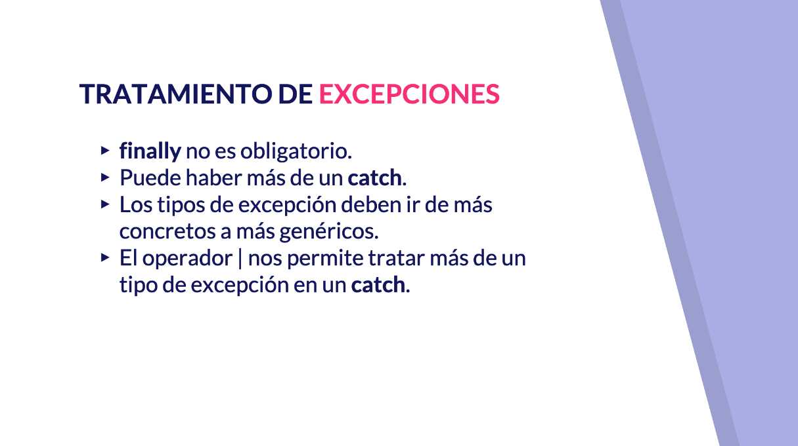

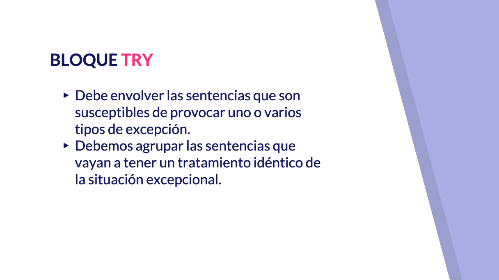

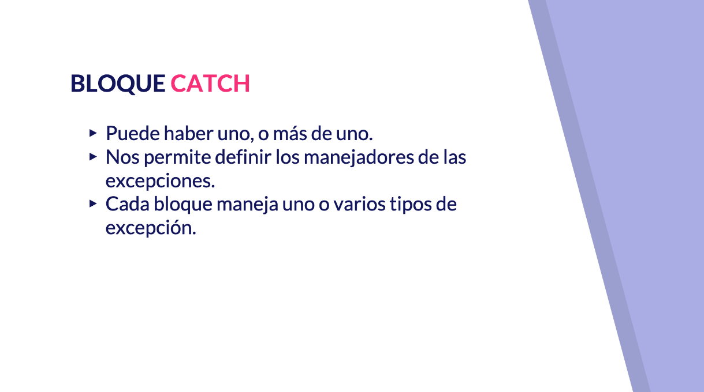


## 28. Excepciones más comunes 4:49 

[Excepciones más comunes](pdfs/28_Clases_de_excepción_más_comunes.pdf)

## Resumen del Profesor

CLASE DE EXCEPCIÓN | USO
-------------------|----
ArithmeticException |	Errores en operaciones aritméticas
ArraryIndexOutOfBoundsException |	Índice de array fuera de los límites
ClassCastException | Intento de convertir a una clase incorrecta
IllegalArgumentException | Argumento ilegal en la llamada a un método
IndexOutOfBoundsException | Índice fuera de colección
NegativeArraySizeException | Tamaño de array negativo
NullPointerException | Uso de referencia nula
NumberFormatException | Formato de número incorrecto
StringIndexOutOfBounds | Índice usado en String fuera de los límites

## 29. Lanzamiento y propagación de excepciones 11:25 

[Lanzamiento y propagación de excepciones](pdfs/29_Lanzamiento_y_propagación_de_excepciones.pdf)

## Resumen del Profesor

### 29.1 Lanzamiento de excepciones

Cualquier código puede lanzar excepciones (hecho por java, por nosotros o de terceros). Si no vamos a tratar las excepciones en un método, tenemos que indicar que se relanzarán hacia arriba (`throws`).

#### 29.1.1 Uso de `throws`

Un método cuyo código puede producir excepciones puede capturarlas y tratarlas, o relanzarlas para que sea otro quien las trate. `throws` se escribe a continuación de la firma del método y antes de la apertura del cuerpo, y espera la excepción o excepciones (lista separada por comas) que se pueden lanzar.

```java
public static void writeList() throws IOException {

}
```

#### 29.1.2 Uso de `throw`

Nos permite lanzar una excepción en un momento determinado. También se puede usar en el bloque catch, para tratar una excepción, pero aun así relanzarla.

```java
public void sacarDinero(double cantidad) throws SaldoNegativoException {
     saldo -= cantidad;
     if (saldo < 0) {
          throw new SaldoNegativoException(saldo);
     }
}
```

### 29.2 Excepciones propias

Podemos crear nuestros propios tipos, extendiendo a `Exception`. Nos permiten manejar nuestras propias situaciones. Es buena práctica añadir el sufijo `...Exception`.

```java
public class SaldoNegativoException extends Exception {

   public SaldoNegativoException(double saldo) {
      super("La cuenta ha quedado en descubierto (" + Double.toString(saldo) + ")");
   }

}
```

## Transcripción


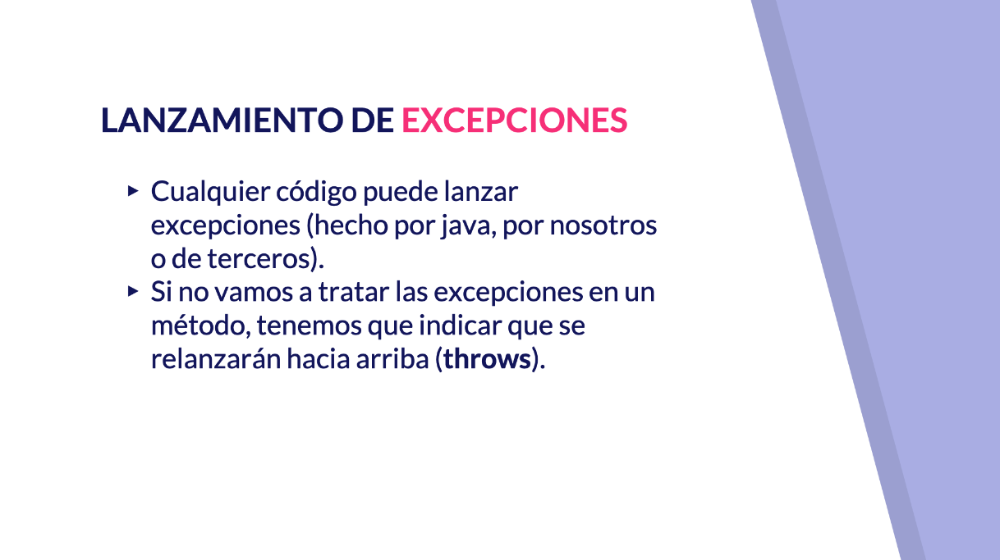

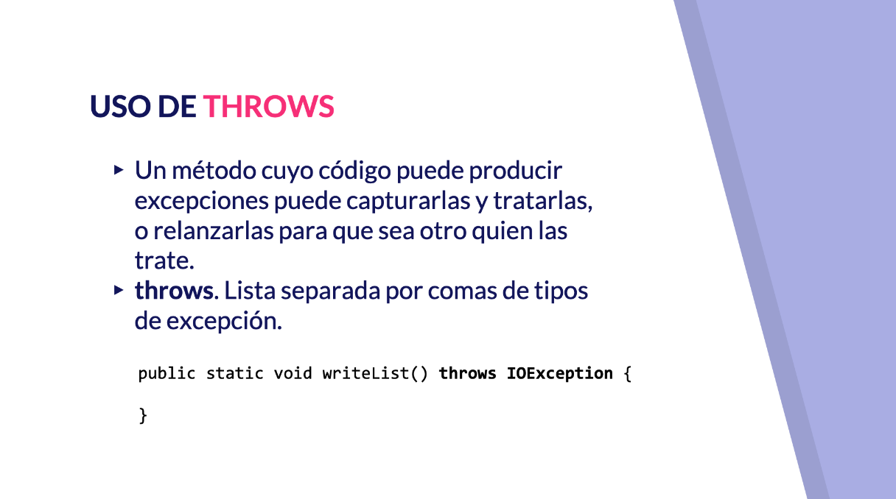

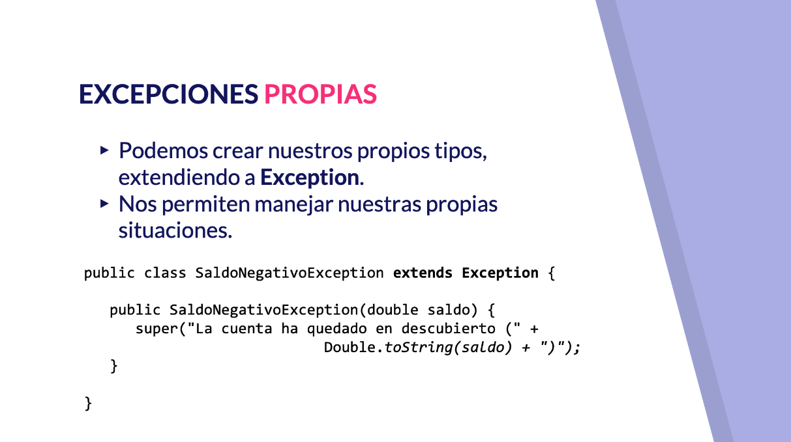

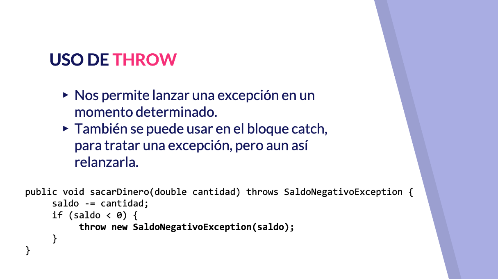


## Contenido adicional 4   

[Excepciones y errores](pdfs/26_Excepciones_y_errores.pdf)

[Tratamiento de excepciones](pdfs/27_Tratamiento_de_excepciones.pdf)

[Excepciones más comunes](pdfs/28_Clases_de_excepción_más_comunes.pdf)

[Lanzamiento y propagación de excepciones](pdfs/29_Lanzamiento_y_propagación_de_excepciones.pdf)
