# 8. Algunas clases del API de Java 82m

   * 30 Manipulación de datos con Stringbuilder 8:01 
   * 31 Manejo de fechas 17:31 
   * 32 Colecciones ArrayList 11:30 
   * 33 Introducción a las expresiones lambda 20:21 
   * 34 Práctica: Creando un gestor de aparcamiento de coches 25:16 
   * Contenido adicional 6
      
# 30. Manipulación de datos con Stringbuilder 8:01 

[Manipulación de datos con Stringbuilder](pdfs/30_StringBuilder.pdf)

## Resumen del Profesor

Conoce el tipo de cadena Stringbuilder en esta lección

## Transcripción


Vamos a comenzar el último bloque de este curso de Java desde cero en el que vamos a conocer algunas de las clases más utilizadas del API de Java de las clases que Java nos proporciona, así como una introducción a la gran novedad de Java 8 qué ha sido el uso de la expresión Lambda.

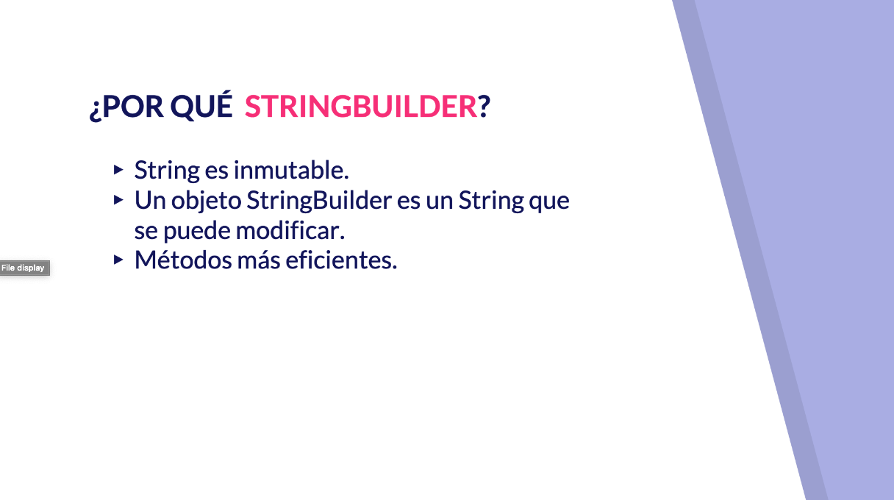

Comencemos en este caso con la manipulación de cadenas de caracteres de datos con la clase `StringBuilder`. `StringBuilder` surge a raíz de la cuestión de que la clase **`String` es una clase inmutable**, con inmutable queremos decir que **es una clase cuyo valor no se puede modificar**, una vez inicializado no se puede modificar su valor, esto ofrece sus ventajas pero también tienes sus inconvenientes y es que si nosotros queremos hacer operaciones sobre todo de concatenación de varias cadenas de caracteres o de sustitución parcial de algún fragmento de la cadena, nos encontramos con que cualquier operación de este tipo **producíra siempre una nueva cadena** por lo cual vamos a sobrecargando la memoria y las operaciones son francamente ineficientes.

**Un objeto de `StringBuilder`** nos va a permitir representar una cadena un `String` pero que si será modificable, que **será mutable** y por ende será más eficiente para cadenas que van a ser modificadas o que queremos darle otro tratamiento que no sea diferente a simplemente crearlas y utilizarlas tal cual.

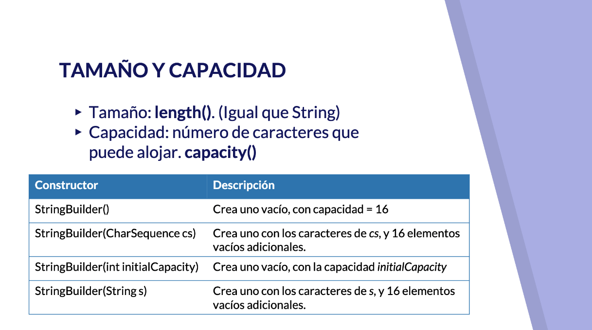

A la hora de construir una instancia de tipo `StringBuilder` tenemos que tener en cuenta los conceptos de **tamaño y capacidad**, el tamaño de un `StringBuilder` va a ser igual que el de un `String` es decir el número de caracteres que tenga, sin embargo **`StringBuilder` incorpora el concepto de capacidad** y es que podemos crear una instancia de `StringBuilder` que tenga un tamaño menor a la capacidad que tenga, es decir al cuál le quepan todavía más caracteres, pueda alojar un número de caracteres superior, de hecho cuando nosotros creamos una instancia de `StringBuilder` con su constructor sin parámetros, crea un `StringBuilder` vacío pero con una capacidad de 16 caracteres, es decir si invocaramos directamente a `length()` devolvería 0 pero el método `capacity()` devolvería 16. Tenemos otra serie de constructores en particular parece interesante el que permite construir un `StringBuilder` a partir de una instancia de `String` o el que nos permite indicar la capacidad inicial de un `StringBuilder` si es que prevemos que va a ser muy superior a los 16 caracteres. 


Aquí tenemos un pequeño gráfico que ilustra la diferencia entre tamaño y capacidad, si creamos un `StringBuilder` vacío y le añadimos una serie de caracteres para saludar, podemos comprobar como le hemos añadido una cadena con 9 caracteres que ocuparían desde el índice 0 hasta el 8, pero desde el índice 9 hasta el 15, es decir hasta completar la capacidad 16 estaría vacío, pero estaría disponible para que nosotros lo pudiéramos utilizar. 

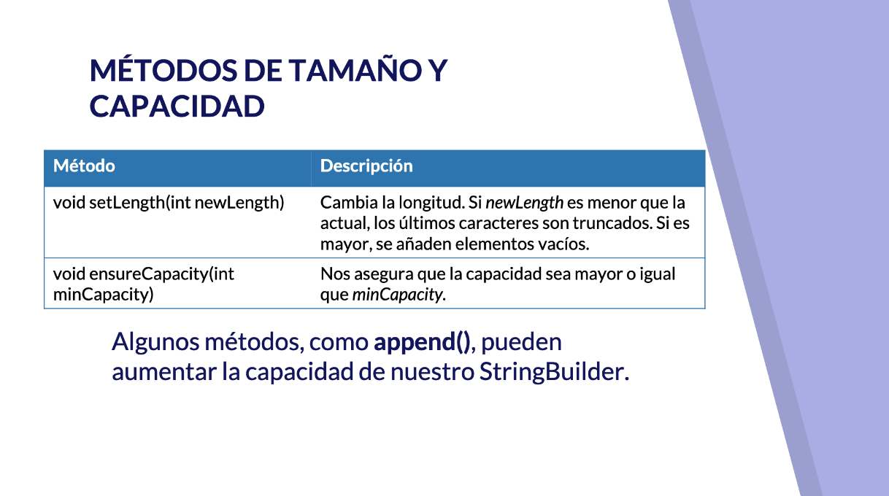

La clase `StringBuilder` tiene una serie de métodos que nos van a permitir manejar la longitud, nos va a permitir cambiar la longitud de un `StringBuilder`, si la nueva longitud es menor que la actual los caracteres que quedarían a la derecha de esa longitud son truncados, de decir que se perderían, si es mayor lo que se añadirían serían elementos vacíos y a diferencia de `setLength` lo que hace el método `ensureCapacity` es asegurar que la capacidad de este `StringBuilder` sea al menos la del `minCapacity` que le estamos pasando.

Algunos métodos como `append()` que acabamos de ver que lo que hace es agregar una serie de caracteres al final del `StringBuilder`, es decir a continuación del último carácter, pueden aumentar la capacidad de nuestros `StringBuilder` de manera transparente a nosotros. 

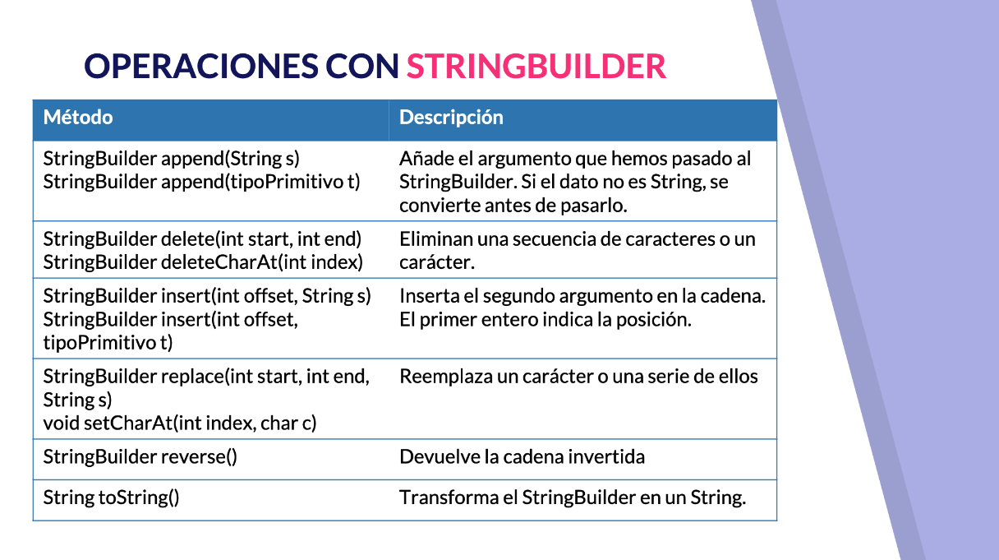

Antes de ver los ejemplos conozcamos algunos de las operaciones que podemos hacer con `StringBuilder`. Ya hemos visto que podemos usar el método `append()` que nos permite añadir a continuación del último carácter que tengamos una cadena de caracteres y también tiene sobreescrito el método `append()` para los diferentes tipos primitivos, si le pasamos un tipo de dato que no es primitivo lo que hace es transformarlo antes de pasarlo. 

Tenemos también el método `delete()` que elimina una secuencia de caracteres dentro del `StringBuilder`. 

Tenemos el método `insert()` que inserta el segundo argumento tanto si es de tipo `String` como de tipo primitivo en la cadena, `offset` es el primero lo que indica la posición a partir de la cual se va insertar.

El método `replace()` que lo que hace es reemplazar un carácter o una cadena de caracteres a partir de una posición o a partir de un inicio y un fin.

Y otros métodos bastante útiles como el método `reverse()` que nos devuelven la cadena pero dada la vuelta.

Por último decir que si necesitamos utilizar el método `StringBuilder` como si fuera una cadena de caracteres tenemos el método `toString()` que nos devolvería una instancia inmutable del contenido de ese `StringBuilder` que inicialmente es mutable.

### :computer: `101-30-StringBuilder`

Veamos algunos ejemplos, tendríamos la posibilidad de hacer una especie de conversor de palíndromos, un palíndromo en una frase que en principio se lee igual de izquierda a derecha o de derecha a izquierda obviando un poco los espacios, uno de los más clásicos es `dabale arroz a la zorra el Abad` si lo leyera de derecha izquierda ya digo obviando un poco los espacios en blanco, veríamos que se leería igual, que en el fondo son las mismas palabras, son como los números capicúa pero aplicado a la frase.

Tendríamos la posibilidad de darle un tratamiento con `String` ineficiente y con `StringBuilder` bastante más eficiente.

*`PalindromosString`*

```java
package usodestringbuilder;

public class PalindromosString {
   public static void main(String[] args) {

      String palindromo = "Dabale arroz a la zorra el abad";
      int longitud = palindromo.length();
      char[] tempCharArray = new char[longitud];
      char[] charArray = new char[longitud];

      // transformamos el string en un array de char
      for (int i = 0; i < longitud; i++) {
         tempCharArray[i] = palindromo.charAt(i);
      }

      // lo invertimos
      for (int j = 0; j < longitud; j++) {
         charArray[j] = tempCharArray[longitud - 1 - j];
      }

      String palindromoInvertido = new String(charArray);
      System.out.println(palindromoInvertido);

   }
}
```

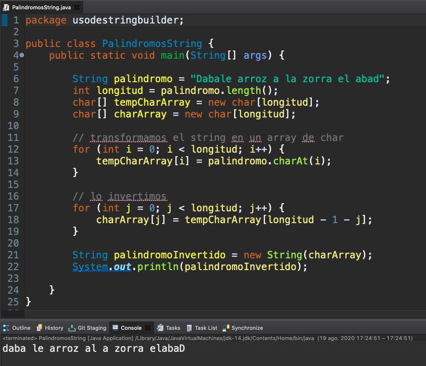

Tendríamos la frase, recuperamos su longitud, construiriamos una serie de arrays de Char para darle ese tratamiento, transformar el `String` en un array `char` que lo haríamos posición a posición, lo invertiríamos, crearíamos la nueva frases y podríamos comprobar si al darle la vuelta a la frase, lo comprobariamos manualmente no nos hemos parado a implementar la comprobación, si esto que tenemos aquí escrito se parece a esto que tenemos en la salida.

Esto que con una cadena de tipo `String` es muy ineficiente sería bastante más sencillo con el uso de la clase `StringBuilder` cómo podemos comprobar.

*`PalindromosStringBuilder`*

```java
package usodestringbuilder;

public class PalindromosStringBuilder {

   public static void main(String[] args) {

      String palindromo = "Dabale arroz a la zorra el abad";
      StringBuilder sb = new StringBuilder(palindromo);
      sb.reverse(); // lo invertimos
      System.out.println(sb); // llamada implícita a sb.toString().

   }
}
```

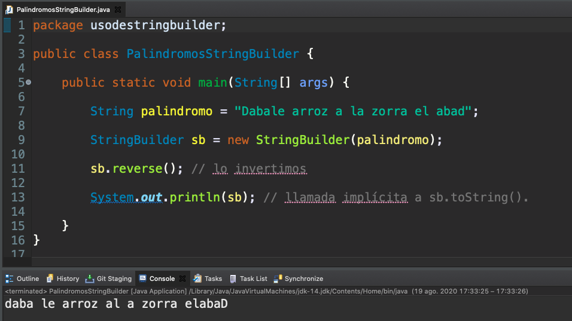

Podemos construir un `StringBuilder` a partir de un `String` tan solo tendríamos que darle la vuelta con el método `reverse()` y lo imprimimos, no teníamos que hacer toda esta sucesión de operaciones auxiliares.

Por lo cual os recomiendo que si vamos a trabajar con una cadena de caracteres que va a ser modificadas en el tiempo usemos siempre la clase `StringBuilder` a través de su método `append()`,  `reverse()`, `insert()` y si por contra vamos a crear una cadena de caracteres que no vaya a ser modificada nunca pues podemos usar la clase `String`


# 31. Manejo de fechas 17:31 

[Manejo de fechas](pdfs/31_Manejo_de_fechas.pdf)

## Resumen del Profesor

El API de fechas de Java 8 posee varias clases para manejarlas, pero la mayoría de ellas sigue esta convención sobre el nombre de los métodos que sirven para manejarlas.

Nombre | Tipo     | Uso
-------|----------|----
`of`   | estático |	Crear una instancia del objeto a partir de los datos de entrada
`from` | estático	| Convertir el parámetro de entrada en una instancia de la clase
`parse`| estático	| Procesar la cadena de entrada y construir una instancia
`format`| instancia |	Procesar los datos para producir una cadena de caracteres
`get`  | instancia | Devolver una parte del objeto
`is`   | instancia | Consultar el estado del objeto
`with` | instancia | Devolver una copia del objeto con uno o varios elementos modificados
`plus` | instancia | Devolver una copia del objeto con una cantidad de tiempo añadido
`minus`| instancia | Devolver una copia del objeto con una cantidad de tiempo sustraído
`to`   | instancia | Convertir el objeto en otro Tipo
`at`   | instancia | Combinar el objeto con otro objeto

## Transcripción


Vamos a continuar con el uso de alguna de las clases que no ofrece Java conociendo otra gran novedad de Java 8 que el manejo de fecha.

Hasta las versiones anteriores de Java el manejo de fecha en Java era horrible, por no decir alguna cosa peor, el tratamiento de fechas se hacía a través de una sola clase `Date` donde los métodos que a priori podrían parecer más interesantes estaban deprecados desde la versión 2 de Java aproximadamente, con lo cual para crear una fecha necesitas otra clase auxiliar que era una clase de tipo `Calendar` sobre todo en calendario gregoriano que es el que nosotros manejamos y bueno todo el tratamiento de fechas era horriblemente tedioso.

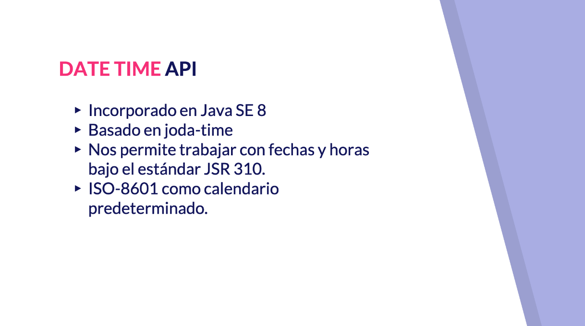

Java 8 se ha puesto las pilas en ese sentido y basándose en una librería llamada **joda-time** que ya existía desde hace tiempo, lo ha incorporado al estándar y lo ha definido mediante el documento JSR-310. Utilizando además con un calendario predeterminado que el que define la normativa ISO-8601.

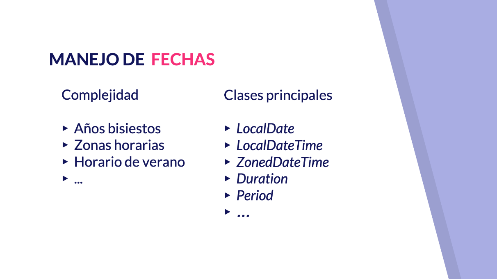

Es decir ahora para el manejo de fechas, Java nos ofrece un buen grueso de clases diferentes entre las que destacan `LocalDate` y `LocalDateTime` que serán clases que nos permitirán manejar fechas o fechas y horas pero dentro de nuestro ámbito horario.

También podremos crear una fecha o una fecha y hora que estará en una determinada zona que nosotros podremos manejar o incluso tendrá clases que nos permitirán manejar no instante concreto o fechas concretas o fecha y hora sino periodos de tiempo o periodo de duración. Además nos va a ayudar a manejar elementos complejos como no podíamos hacerlo antes como el uso del años bisiestos, la zona horaria, horario de verano, horarios de invierno, todo eso es capaz de manejarlo el nuevo API.

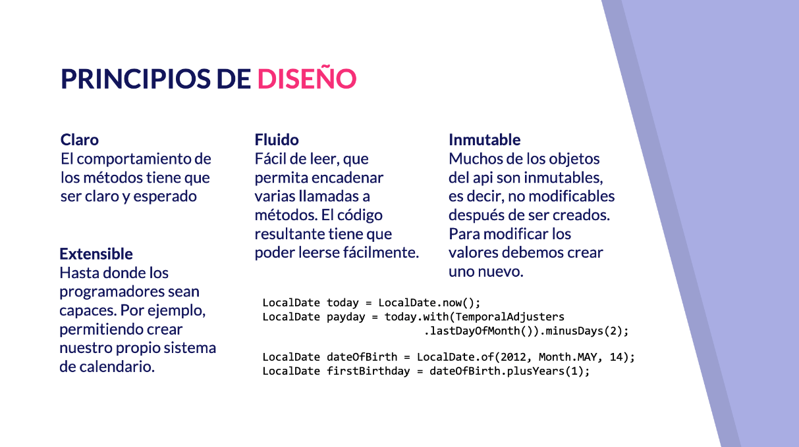

Se ha hecho siguiendo una serie de principios de diseño, que os presentamos por aquí el uso tenía que ser claro, es decir en el uso de los distintos métodos de la clases tiene que ser el esperado según su nombre, que fuese fluido, es decir que pudiéramos encadenar llamadas a métodos que nos hicieran un código legible y todo muy en el estilo de Java 8, que los objetos sean inmutables y que además fuese extensible, por ejemplo si nosotros tuviéramos que crear nuestro propio sistema de calendario lo pudiéramos hacer. 

En la diapositiva algún ejemplo de cómo crear una fecha, de cómo manejar una fecha para ajustarle un determinado día o para obtener una fecha no solo la de hoy sino a partir de una serie de cifras, añadirle, restarle cantidades etc.

Si accedemos a la documentación de Java DOC del paquete `java.time`.

https://docs.oracle.com/en/java/javase/14/docs/api/java.base/java/time/package-summary.html

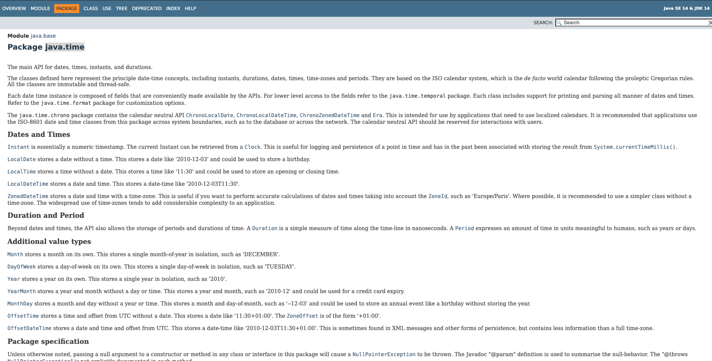


Podría encontrar todas y cada una de las clases que ofrece y encontrareis un montón de información súper concreta sobre cada una de las clases.

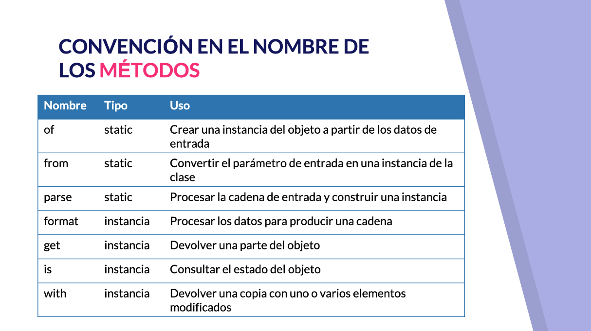

**Si les puedo decir a modo común que todas las clases siguen una serie de convención de métodos**, suelen tener el método `of` y el método `from` ambos estático y qué **el método `of` sirve para crear una instancia del objeto del tipo sobre el que estamos llamando a partir de una serie de datos entrada**, en la diapositiva pasada teníamos la manera de crear un objeto de tipo `LocalDate` a partir de un año, mes y día. 

Tenemos también la posibilidad de **convertir algo que no es** un `LocalDate` o un `LocalDateTime` o un `ZoneTime` en un objeto **a partir de ese parámetro de entrada** con el **método `from`**

El **método `parse`** nos permiten procesar una cadena de caracteres para obtener una instancia de esa clase.

El **método `format`** procesaría los datos de una cadena sobre la cual estamos llamando, para producir una cadena de caracteres, usualmente para visualizar una parte o todos los datos de esa fecha u hora.

El **método `get`**, el **método `is`**, el **método `with`**, que veremos que tiene bastante implementaciones nos permite devolver una parte de un objeto, consulta una parte de un objeto, el estado, si se cumpla una determinada propiedad, por ejemplo si un año es bisiesto o alguna fecha es posterior a otra, lo podríamos hacer mediante métodos `is` y el método `with` en donde devuelve una copia de un objeto ajustando algún tipo de parámetro, por ejemplo el día de cobro lo podríamos ubicar como dos días antes del último día del mes de la fecha actual, esto lo podemos hacer con el método `with` como lo muestra la diapositiva pasada.

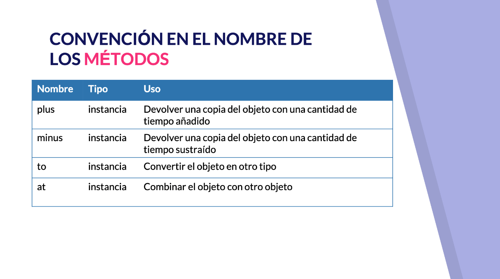

Algunos métodos más que nos vamos a encontrar, los **métodos `plus`** y **`minus`** que nos permiten añadir una unidad o restar una unidad en días, meses o años a una determinada fecha y los **métodos `to`** y **`at`**, el método `to` que nos permite **convertir un objeto en otro tipo** y el método `at` que **combina un objeto con otro objeto para producir otro**.

### :computer: `101-31-Fechas`

Vamos a ver una sucesión de ejemplo sencillo que tenéis aquí de la A a la O para poder ver elementos sencillos de tratamiento de fechas.

Por ejemplo si quisieramos obtener la fecha concreta de hoy día mes y año lo podríamos hacer con el método estático `now()` de la clase `LocalDate`, si imprimimos podemos ver cómo está tomando la fecha actual y después la esta imprimiendo sobre el formato de impresión, está imprimiendo en un formato estándar, veremos después como se puede modificar.

*`A_FechaHoy`*

```java
package fechas;

import java.time.LocalDate;

public class A_FechaHoy {
	
   public static void main(String[] args) {

      LocalDate hoy = LocalDate.now();
      System.out.println("La fecha actual es : " + hoy);

   }

}
```

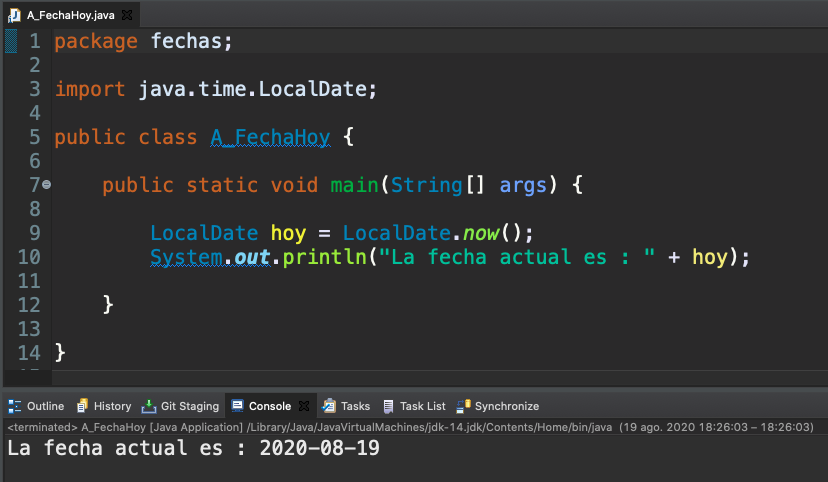

Si quisieamos obtener el día, el mes y el año de un `LocalDate` lo podríamos hacer a través de los diferentes **métodos `get`** que nos ofrecen, `getYear()` nos devuelve el año, `getMonthValue()` nos devuelve el mes y el día del mes lo podríamos obtener con el método `getDayOfMonth()`, usamos `printf` para formatear la salida.

*`B_DiaMesAnio`*

```java
package fechas;

import java.time.LocalDate;

public class B_DiaMesAnio {

   public static void main(String[] args) {
      LocalDate hoy = LocalDate.now();
      int year = hoy.getYear();
      int month = hoy.getMonthValue();
      int day = hoy.getDayOfMonth();
      System.out.printf("Año : %d Mes : %d Día : %d \t %n", year, month, day);

   }
}
```

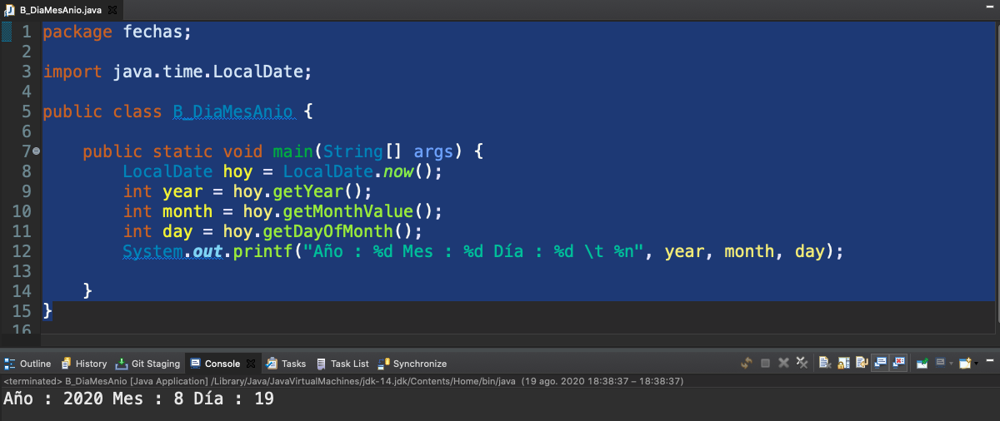

Si en lugar de usar la fecha de hoy queremos colocar la fecha de nacimiento lo podríamos hacer a través del método estático `of(1982, 9, 18)` con el año, mes y día podríamos obtener una instancia de `LocalDate` algo muy comodo ya digo, solamente este proceso con la fecha antes de Java 8 ya era tedioso utilizando `Date` utilizando `Calendar` terriblemente tedioso, esto es mucho más conciso y más concreto.


*`C_FechaConcreta`*

```java
package fechas;

import java.time.LocalDate;

public class C_FechaConcreta {

   public static void main(String[] args) {

      LocalDate nacimiento = LocalDate.of(1982, 9, 18);
      System.out.println("Tu fecha de nacimiento es : " + nacimiento);

   }
	
}
```

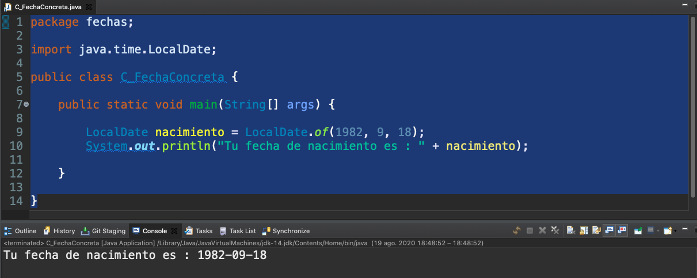

Podemos comparar y saber si dos fechas son iguales a través de este ejemplo si por ejemplo queremos obtener la fecha del 19 del 08 del 2020 y la fecha de hoy, las podríamos comparar si son la misma fecha mediante el método `equals` que nos permitiría saber si son o no son la misma fecha. 

*`D_FechasIguales`*

```java
package fechas;

import java.time.LocalDate;

public class D_FechasIguales {

   public static void main(String[] args) {
      LocalDate fecha = LocalDate.of(2020, 8, 19);
      LocalDate hoy = LocalDate.now();
      if (fecha.equals(hoy)) {
         System.out.printf("Hoy %s y la fecha %s son la misma fecha", hoy, fecha);
      } else {
         System.out.println("Las fechas no son iguales");
      }

   }

}
```

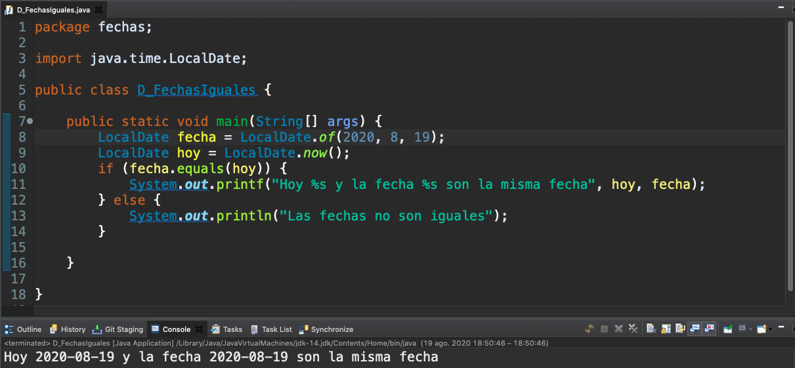

El manejo de otro tipo de fechas que son un poco peculiares, lo podemos plantear con los llamados eventos recurrentes y para ellos nos plantea `java.time` otra clase, por ejemplo nosotros cumplimos años el mismo día del mismo mes de todos los años ( a excepción de los nacidos el 29 de Febrero), pues tenemos una clase `MonthDay` que nos permite albergar una fecha sin año, nos permite guardar el día y mes de una fecha pero no el año y lo podríamos utilizar para almacenar eventos recurrentes como por ejemplo tenemos aquí el día del nacimiento, si alguien naciera por ejemplo en el día `11/11/2017` podríamos guardar su día y mes de nacimiento en un `MonthDay` llamado `diaNacimiento` o también tenemos un ejemplo de `MonthDay` con `from` que nos permite obtener un `MonthDay` a partir de un `LocalDate` procesa este `LocalDate` obtiene lo que quiere y lo construye. Despúes compara ambos `MonthDay` si estos fueran iguales nos felicitaría por que hoy será nuestro cumpleaños.

*`E_EventosRecurrentes`*

```java
package fechas;

import java.time.LocalDate;
import java.time.MonthDay;

public class E_EventosRecurrentes {

   public static void main(String[] args) {
      LocalDate nacimiento = LocalDate.of(2017, 11, 11);
      MonthDay diaNacimiento = MonthDay.of(nacimiento.getMonth(), nacimiento.getDayOfMonth());
      MonthDay diaMesHoy = MonthDay.from(LocalDate.now());
      if (diaMesHoy.equals(diaNacimiento)) {
         System.out.println("Muchas felicidades, porque es tu cumpleaños");
      } else {
         System.out.println("Lo siento, pero no es tu cumpleaños");
      }

   }
}
```

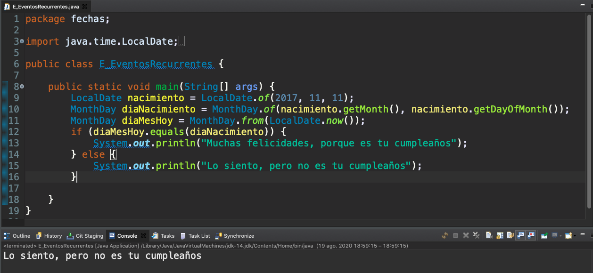


Para manejar la hora tenemos otra clase que es `LocalTime` que es análoga a la de `LocalDate` y nos permite conocer la hora actual, fijaos como nos permite conocer incluso hasta los nanosegundos, cosa que antes no podíamos manejar.

*`F_HoraActual`*

```java
package fechas;

import java.time.LocalTime;

public class F_HoraActual {
	
   public static void main(String[] args) {
      LocalTime time = LocalTime.now();
      System.out.println("La hora actual es : " + time);

   }

}
```

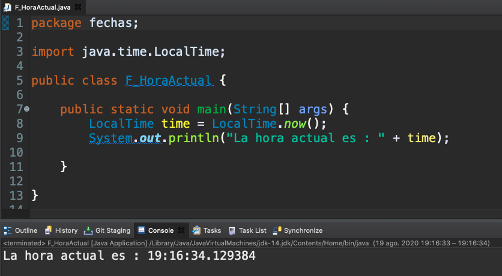

Si queremos añadir o disminuir una serie de días, horas, en este caso una hora determinada a un `LocalTime` le queremos añadir 2 horas, podríamos añadirlo a través de los métodos `plus`, podemos ver que tenemos varias implementaciones de `plus` y de `minus` para sumar o restar un número de horas determinado. En este ejemplo estamos añadiendo dos horas al hora actual.

*`G_AniadirHoras`*

```java
package fechas;

import java.time.LocalTime;

public class G_AniadirHoras {
	
   public static void main(String[] args) {
		
      LocalTime time = LocalTime.now();
      LocalTime newTime = time.plusHours(2); // añadiendo dos horas 
      System.out.println("Hora, después de 2 horas : " + newTime);

   }

}
```


Tenemos también un método generico `plus` y `minus` en el que le podemos indicar una cantidad y a partir de una enumeración de `ChronoUnit` le podemos indicar el tipo de unidad de tiempo que le estamos añadido, por ejemplo a una fecha si siquiera sumarle una semana, pues podríamos sumarselo con `plus` indicando 1 y en `ChronoUnit` podemos ver como tenemos diferentes unidades de tiempo centurias, días, decadas, medios días, horas, milenios.

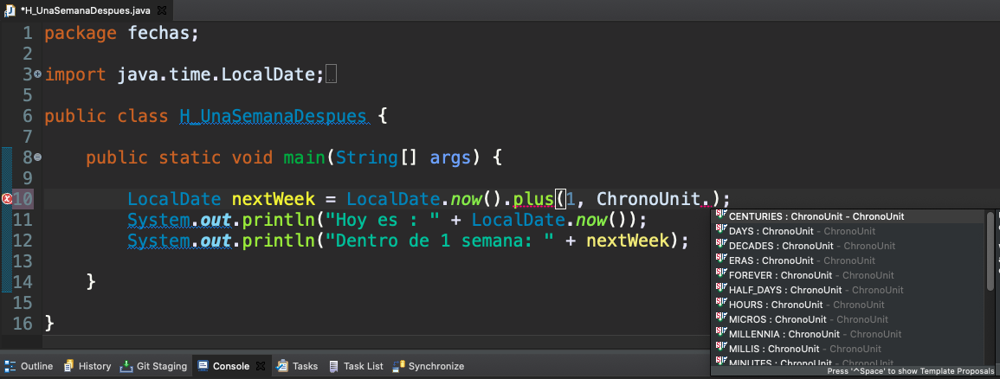

la verdad que está muy muy completo y podríamos ver la diferencia entre la fecha de hoy y la fecha de dentro de una semana. 


*`H_UnaSemanaDespues`*

```java
package fechas;

import java.time.LocalDate;
import java.time.temporal.ChronoUnit;

public class H_UnaSemanaDespues {
	
   public static void main(String[] args) {

      LocalDate nextWeek = LocalDate.now().plus(1, ChronoUnit.WEEKS);
      System.out.println("Hoy es : " + LocalDate.now());
      System.out.println("Dentro de 1 semana: " + nextWeek);

   }

}
```

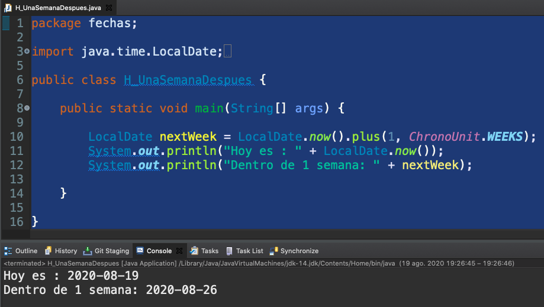

Podemos también sumar años o restar años a una determinada fecha con los métodos `plus` y `minus`.

*`I_FechaHaceUnAnio`*

```java
package fechas;

import java.time.LocalDate;
import java.time.temporal.ChronoUnit;

public class I_FechaHaceUnAnio {
	
   public static void main(String[] args) {

      LocalDate today = LocalDate.now();
      LocalDate previousYear = today.minus(1, ChronoUnit.YEARS);
      System.out.println("Fecha hace un año: " + previousYear);
      LocalDate nextYear = today.plus(1, ChronoUnit.YEARS);
      System.out.println("Fecha dentro de 1 año : " + nextYear);

   }

}
```

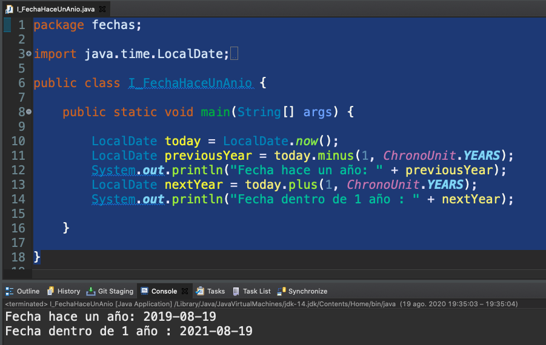

Para comparar fechas decíamos que teníamos algunos métodos y por ejemplo tenemos los método `isAfter` e `isBefore` que nos permiten indicar si una fecha es posterior o es anterior a otra.

*`J_CompararFechas`*

```java
package fechas;

import java.time.LocalDate;
import java.time.temporal.ChronoUnit;

public class J_CompararFechas {
	
   public static void main(String[] args) {
		
      LocalDate today = LocalDate.now();
      LocalDate otraFecha = LocalDate.of(2017, 12, 24);
      if (otraFecha.isAfter(today)) {
         System.out.println("La otra fecha es posterior a la de hoy");
      }
      LocalDate ayer = today.minus(1, ChronoUnit.DAYS);
      if (ayer.isBefore(today)) {
         System.out.println("Ayer es anterior a hoy");
      }

   }

}
```

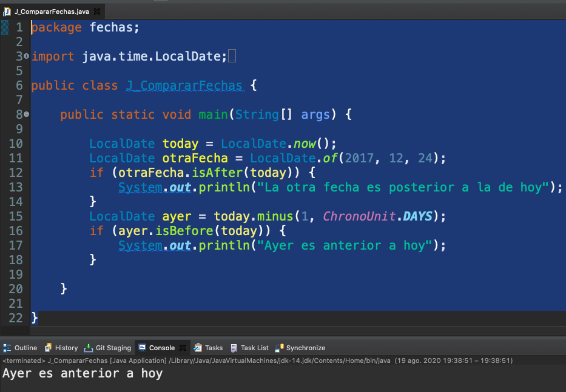

Para fechas fijas del mes del año como por ejemplo la caducidad de una tarjeta de crédito, no caducan nunca un determinado día del mes si no que si miran vuestra tarjeta de débito o crédito caduca en un mes y un año, pues lo podríamos hacer con la clase `YearMonth` que nos permitiría obtener un año y mes actual, aquí por ejemplo actual sería Afosto del 2020 y podemos también ver la longitud en días del mes actual con el método `lengthOfMonth()` y si quisieramos como decía antes usarlo por ejemplo para una tarjeta de crédito, podríamos decir su tarjeta caduca en febrero de 2022 creandolo con el con el método `of` de esta manera.

*`K_FechasFijas`*

```java
package fechas;

import java.time.Month;
import java.time.YearMonth;

public class K_FechasFijas {
	
   public static void main(String[] args) {
		
      YearMonth anioYMesActual = YearMonth.now();
      System.out.printf("Días en la clase MonthYear %s: %d%n", anioYMesActual, anioYMesActual.lengthOfMonth());
      YearMonth caducidadTarjetaCredito = YearMonth.of(2022, Month.FEBRUARY);
      System.out.printf("Su tarjeta de crédito caduca en %s ", caducidadTarjetaCredito);

   }

}
```

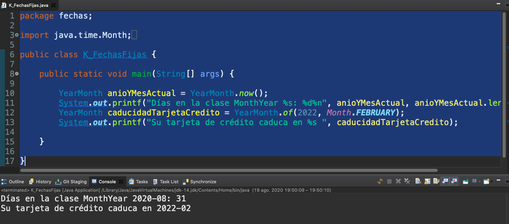

Un auténtico quebradero de cabeza que hay siempre en el manejo de fechas es el manejo de si una fecha pertenece a un año bisiesto, Java 8 nos elimina eso con el método `isLeapYear()` que nos devuelve verdadero si el año de la fecha es biciesto y falso si no lo es, particular el año 2020 es bisiesto. 

*`L_Bisiesto`*

```java
package fechas;

import java.time.LocalDate;

public class L_Bisiesto {
	
   public static void main(String[] args) {
		
      LocalDate today = LocalDate.now();
      if (today.isLeapYear()) {
         System.out.println("Este año es bisiesto");
      } else {
         System.out.println("Este año no es bisiesto");
      }

   }

}
```

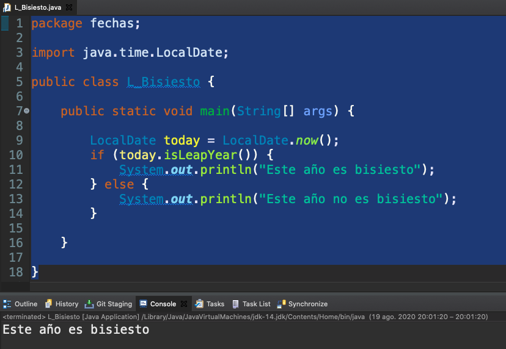

No solamente podemos manejar un momento concreto, sino que podemos querer modificar o manejar un periodo de tiempo, cómo saben Java 8 ya lleva algún tiempo liberado, en 2017 se libero una primera versión de Java 9, podríamos ver con la clase `Period` el periodo que hay entre la fecha de liberación de la primera versión de Java 8 y de la primera liberación de la versión de Java 9 y guardarlo en una instancia de periodo, cómo podéis comprobar no es un instante de tiempo sino que en el fondo lo que estamos almacenando es la diferencia entre dos fechas, lo podríamos ver y expresar está diferencia por ejemplo en una cantidad de meses, ha habido 42 meses de diferencia entre la liberación de Java 8 y de Java 9.

*`M_Periodo`*

```java
package fechas;

import java.time.LocalDate;
import java.time.Month;
import java.time.Period;

public class M_Periodo {
	
   public static void main(String[] args) {
      LocalDate java8Release = LocalDate.of(2014, Month.MARCH, 14);
      LocalDate java9Release = LocalDate.of(2017, Month.SEPTEMBER, 27);
      Period periodToNextJavaRelease = Period.between(java8Release, java9Release);
      System.out.println("Meses transcurridos entre la liberación de Java 8 y Java 9 : " + periodToNextJavaRelease.toTotalMonths());

   }

}
```

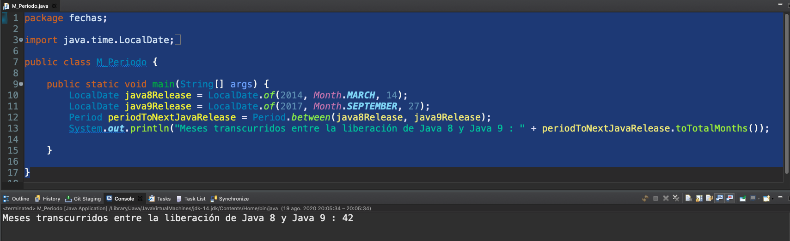

Para procesar fecha tenemos también la posibilidad de usar el método `parse` que es estático, lo que haría sería procesar una fecha que estaría en una cadena de caracteres para obtener en este caso por ejemplo un `LocalDate` la clase `DateTimeFormatter` nos proporciona una serie de constantes indicando el formato que tiene esa fecha, una de ellas el `BASIC_ISO_DATE` nos vendría la fecha con el año, el mes y el día sin ningún tipo de separación, tendríamos la posibilidad de crear un `DateTimeFormatter` a partir de un patrón utilizando una serie de caracteres `dd/MM/yyyy` en este caso las `dd` representan un día del mes, las `MM` mayúscula los meses del año y la `yyyy` el año expresado en cuatro cifras, esto se le llaman **máscara de formato**, la cantidad diferente de elementos que podemos usar en una máscara de formato lo podéis encontrar en la documentación, porque es bastante bastante extensa y os recomiendo que la leáis con detenimiento, aquí podríamos crear un formateador `formatter` y utilizarlo con la clase `parse` para traducir la cadena `viernes` en un `LocalDate`,  si se produjera algún tipo de situación excepcional lo podríamos manejar con la excepción `DateTimeParseException` que viene definida también dentro del API de `java.time` y bueno podríamos decir que esa fecha por ejemplo no sería parseable, en este caso sí que lo ha sido y por ejemplo si le añadiéramos otro cuatro en `String viernes = "18/04/20144";` pues nos daría una excepción esa fecha no sería parseable, no hemos llegado al año 20000.

*`N_ParseFormat`*

```java
package fechas;

import java.time.LocalDate;
import java.time.format.DateTimeFormatter;
import java.time.format.DateTimeParseException;

public class N_ParseFormat {
	
   public static void main(String[] args) {
      String diaDespuesDeHoy = "20171112";
      LocalDate formateada = LocalDate.parse(diaDespuesDeHoy, DateTimeFormatter.BASIC_ISO_DATE);
      System.out.printf("La fecha generada de un String %s es %s %n", diaDespuesDeHoy, formateada);

      String viernes = "18/04/2014";
      try {
         DateTimeFormatter formatter = DateTimeFormatter.ofPattern("dd/MM/yyyy");
         LocalDate holiday = LocalDate.parse(viernes, formatter);
         System.out.printf("Cadena formateada correctamente %s, la fecha es %s%n", viernes, holiday);
      } catch (DateTimeParseException ex) {
         System.out.printf("%s no es parseable!%n", viernes);
         ex.printStackTrace();
      }

   }

}
```

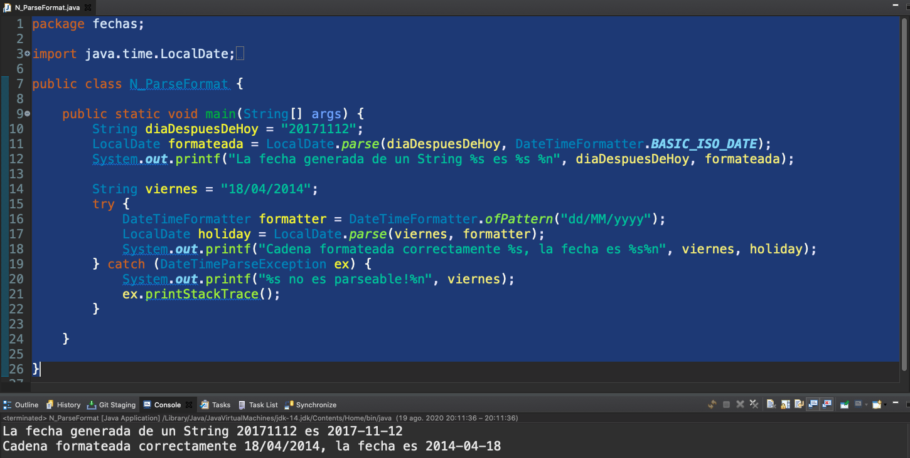


Como mecanismo análogo tenemos la posibilidad de formatear una fecha para obtener una cadena de caracteres que poder visualizar y aquí tendríamos la fecha y hora de hoy con la clase localdatetime vale profesora de manera que visualizamos el día del mes el mes con 3 caracteres el año con cuatro cifras la hora y 2 minutos vale y lo formateé haríamos utilizando un determinado formateado vale una instancia de venta en formato y no se pudiera procesar porque no hemos equivocado en la máscara de formato porque no se tiene que está información también nos daría una excepción de tipo venta con esto terminamos el vídeo referente a fecha ha sido una introducción hemos podido conocer a vista de pájaro muchos de los métodos que no ofrece os recomiendo que vayáis trabajando poco a poco con las diferentes clases jefe ese apasionante accidente tratamiento de fecha y de hora y que poco a poco también Vallés practicando con luces

*``*

```java
```

# 32. Colecciones ArrayList 11:30 

[Colecciones ArrayList](pdfs/32_Arraylist.pdf)

## Resumen del Profesor

### 32.1 Desventajas del uso de arrays

El uso de arrays nos aportan una serie de **desventajas**:

* Tenemos que conocer a priori el tamaño.
* El tamaño no se puede modificar una vez creado.
* Problemas para insertar objetos en posiciones intermedias.
* Los arrays no son realmente objetos (instancias de clases)

Java nos provee de una serie de colecciones con algunos beneficios:

* Menos esfuerzo de programación.
* Aumento de la calidad y velocidad.
* Interoperabilidad
* Curva de aprendizaje pequeña
* Reusabilidad

### 32.2 ArrayList

De todas las colecciones de Java es quizá la más usada de todas. Permite algunas operaciones típicas de las colecciones **secuenciales**:

* Acceso posicional
* Búsqueda
* Iteración
* Tomar un fragmento

Para conocer mejor los métodos, podemos acceder a la documentación del api:

https://docs.oracle.com/javase/8/docs/api/java/util/ArrayList.html

## Transcripción


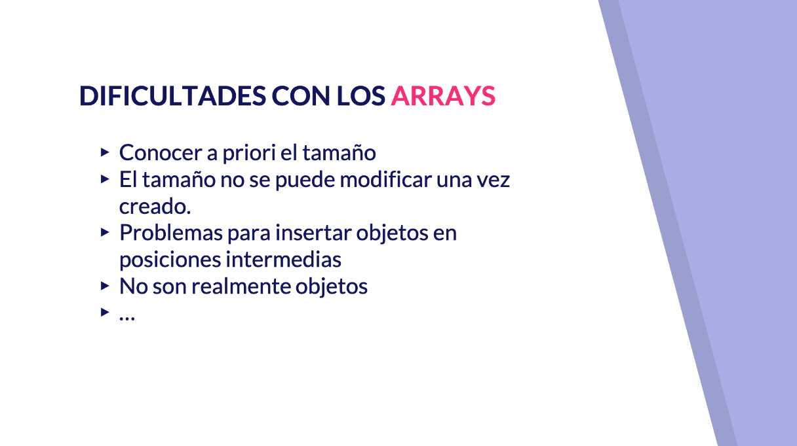

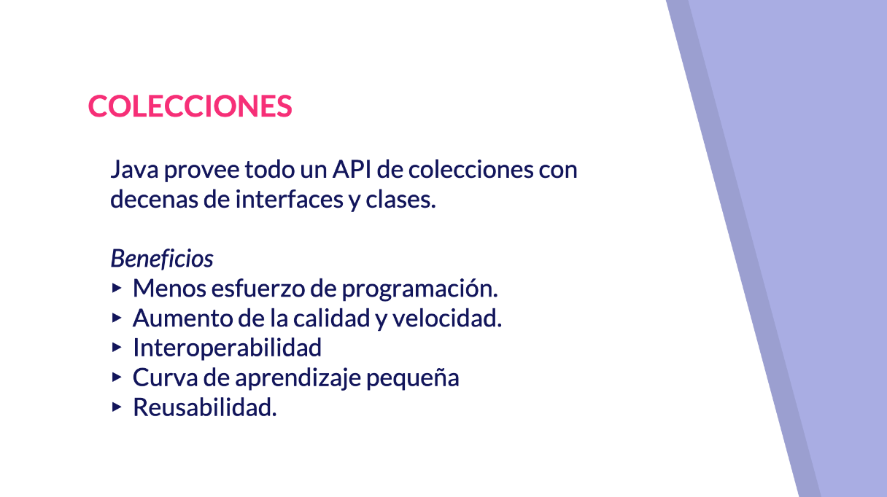

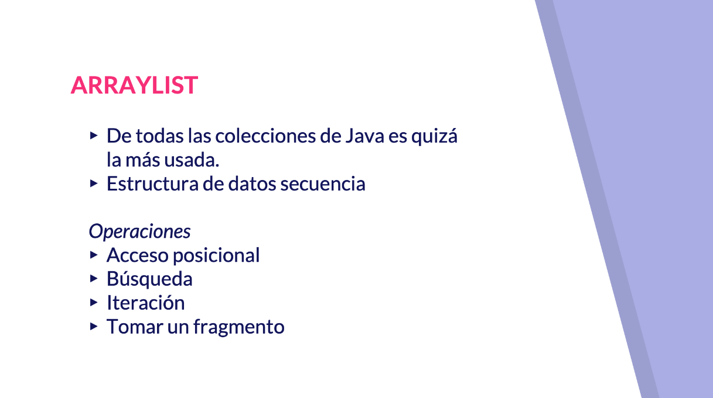

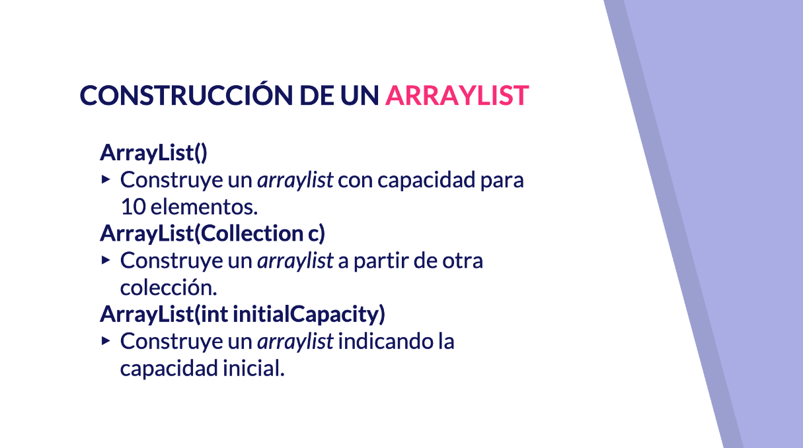

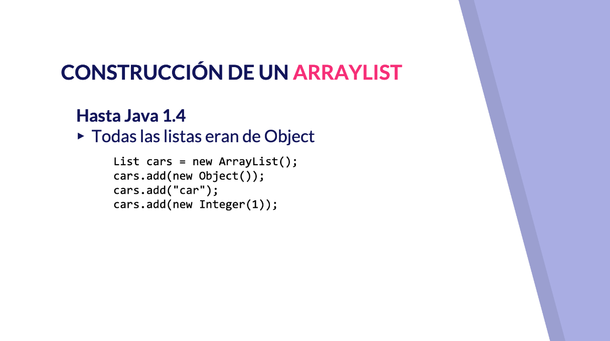


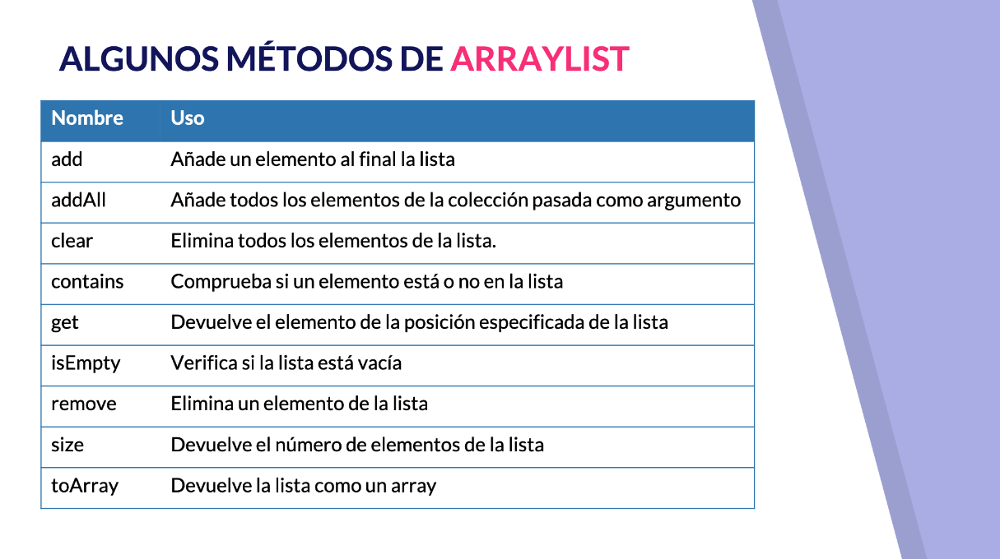

 no podíamos dejar pasar este curso de Java desde cero sin presentar alguna de las múltiples colecciones que estaba no la más utilizada de todas eh arrays y la motivación de tener una colección frente al uso de los ya conocidos arrays es que lo arreglo ofrece algunas ventajas pero también nos Skull tales la primera es que tenemos que conocer a priori que el tamaño del array es decir que lo tenemos que dar en el momento en el que lo vamos a distancia y si lo hacemos demasiado grande pues quizá estemos usando más memoria de la que se la que nosotros hiciera también el hecho de querer insertar objetos en posiciones intermedias se vuelve bastante bastante tedioso no por último decir que los array incluso aunque sean de objetos no son objetos y eso pues también puede ser una dificultad su tratamiento arrays Java nos ofrece toda una pide colecciones con decenas de interfaces y clases vale con una serie de beneficios muy claro lo primero es que para hacer lo mismo vamos a tener que programar menos porque muchas de las cosas que con los arrayanes manualmente caballo lo aprobado por nosotros además esos métodos están muy bien programado el testeado con lo cual aumenta la calidad del código y la velocidad de las operaciones el hecho de que tengamos una pic común que se utilice entre librerías de tercero y en la visita comunidad de desarrolladores aumenta la interoperabilidad de nuestro código si nosotros creamos nuestros propios tipo de conexión basado en una red sería nuestro y no sería interoperable con el código de otros programadores el uso de una colección es que son comunes a toda la comunidad de desarrolladores no hace posible que podamos trabajar con librerías de terceros las colecciones tienen una curva de aprendizaje pequeña son muy fáciles de aprender y son muy usadas quizá la colección más utilizada de toda la clase quizá más utilizada dejaba es arraibi es una estructura de datos en secuencia vale que nos permiten manejar una serie de elementos que se van al manejar almacenando de manera lineal y que nos permite una serie de operaciones básicas como haces oposicional qué prefieres podemos acceder a un índice concreto de una raíz nos permitirá buscar iterar es decir recorriendo un array de una determinada manera para que nos devuelvan los errores tomar un fragmento entre otra operación construir un ArrayList en muy sencillo nos ofrece una serie de construcciones el primero albañil constructor sin parámetros construiría una raíz con una capacidad inicial de 10 elementos podemos modificar el sofá con la llamada a una raíz indicando explícitamente su capacidad inicial y bueno existe una interfaz de mala conexión vale y podríamos construir un ArrayList a partir de otra de otra colección hasta la versión 14 dejaba todos los ArrayList todas las colecciones de tipolin eran de objetos esto ofrecían una ventaja frente a otros lenguajes de programación que no permitían esto y es que bueno podíamos crear ArrayList de cualquier objeto que nosotros quedará esto viene provocado porque bueno cualquier objeto de cava de una u otra manera era de una clase base primitiva qué es la clase o cierto entonces cualquier ArrayList era un ArrayList de hombre y como cualquier clase podía heredar León 10 pues podríamos almacenar cualquier tipo de objeto en un array sin embargo esto provocaba el que pudiéramos tener ArrayList que albergará instancias de diferentes tipos en un mismo en una misma colección y está en ocasiones podía ser positivo pero la gran mayoría de las veces no lo era porque si posteriormente nosotros queríamos tomar los objetos días de ahí adentro llamar a algún método específico podríamos tener errores de Castle cómo se soluciona a partir de Java 5 con el uso de genéricos lo que queráis conocer algo más sobre genérico os recomiendo que cuando termine y este curso de Java desde cero podáis hacer el curso de Java 8 para programadores Java los genéricos permiten parametrizar el tipo indicando que una determinada colección hacerte un tipo específico y ese tipo lo indicamos entre entre los ángulos de manera que podíamos quedar ArrayList string to ArrayList de otra clase porque Ana está de malas personas que nos permite

Lo invitamos entre entre los ángulos de manera que podíamos quedar ArrayList string to ArrayList de otras clases profesionales de malas personas curso de Java 8 para programadores Java los genéricos permiten parametrizar el tipo indicando que una determinada colección va a ser de un tipo específico y ese tipo lo indicamos entre entre los ángulos de manera que podíamos crear ArrayList string to ArrayList de otras clases profesionales además las personas el primer ArrayList podremos ver cómo al indicar que es de tipo String tenemos que llamar al constructor de tipo String a partir de Java 7 nos podemos ahorrar ese segundo tiempo porque entiende que si estamos creando un ArrayList para almacenarlo en una referencia pelistream el tipo que tiene que crear es una raíz live DC vale y antes de conocer algún ejemplo de uso de Raily por conocer alguno de los métodos tenemos los métodos Adolf que nos permiten añadir elementos al final de la lista haz añadiría un solo elemento a añade todos los elementos de otra colección el método Clear eliminaría todos los elementos de una lista contains nos va a permitir comprobar si un elemento está o no en una determinada lista nos permite devolver el elemento de una posición específica ese aspecto posicional y sentí nos verifica si una lista está vacía Remu elimina un elemento de la lista 6 nos devuelve el número de elementos de una lista y tú arrays nos devolvería a partir de una raíz un array con los elementos que tenía SS Reyes vamos a ver un ejemplo de uso de la clase ArrayList vale hemos definido como hemos reutilizado una estancia de persona que teníamos por ahí otra dar una definición de persona pero la hemos modificado para que guarde nombre apellido y teléfono podríamos utilizar la clase era ArrayList para hacer una pequeña aplicación que nos sirviera de agenda de contactos cómo podemos comprobar el método main tiene una manera muy parecida a la calculadora que hicimos un bucle do while dónde vamos a recoger una opción y vamos a mostrar un menú recoger la opción tiempo en ción de esta opción o hacer alguna de la operación listar todos los contactos de la agenda añadir un contacto a la agenda eliminar un contacto eliminarlos todo o salir del programa primero la aplicación de después de momento donde todo como se está usando el arrays inicialmente podríamos ver que la agenda no tiene contactos está vacía si queremos añadir un contacto lo haríamos introduciendo el nombre y ahora pasaremos a analizar todos los contactos veríamos que la agenda tiene la posición cero un contacto que en este caso sería sería yo podríamos eliminar este contacto pasando la posición del contacto y si ahora la lista mo es comprobar como la agenda se ha quedado vacía podríamos eliminar todo y salir no

Bueno vamos a ver cómo vamos a trabajar con un ArrayList en este caso como lo estamos haciendo todo en una sola clase a raíz del método mes creamos el ArrayList como estático esto no es para nada hubiera producción no te preocupes tranquila tendríamos una lista de personas al comenzar el método me inicializamos este ArrayList vale como siempre usamos la clase Scanner para poder leer de teclado y entramos en el bucle guay para hacer las distintas opciones si queremos vamos a empezar por el principio a añadir una persona nos podríamos ir al método de añadir y vemos cómo lo único que estamos haciendo llamar al método a de Raily para añadir una nueva instancia de personas que hemos creado con los valores que hemos recogido de teclado una vez que hayamos añadido una o más personas podríamos recorrer el array y paralizar su contenido lo tenemos aquí la manera de listar un array pues es múltiple no podríamos hacer mediante un bucle for mejorado bucle FOR EACH en este caso no escogido no hacerlo para poder indicar la posición de los distintos elementos en el array para poder utilizar esta posición para eliminar vale podemos comprobar como estamos dando trimestre para imprimir una persona que está en una determinada posición aquí recorremos el array desde la posición cero hasta su tamaño vale vamos tomando posición a posición imprimimos y vuelta a empezar antes de ello comprobamos mediante el método y Vicente y el ArrayList está vacío no y si no tiene agenda no perdón si no tiene contactos pues tenemos un mensaje de error y terminaríamos el mensaje el de eliminar una persona requiere que solicitemos la posición y siempre y cuando la posición sea correcta decir mayor que 0 y menor que el tamaño pues ejecutar y amo la eliminación como suele ser usual en los sistemas cuando vamos eliminar algún dato como una operación que no suele poder deshacerse requiere de una confirmación no tiene ese caso eliminaríamos el elemento que esté en esa posición por último si queremos eliminar los todos tan solo tendríamos que confirmar pero sería más fácil porque no queríamos sería invocar al método tío con este sencillo ejemplo hemos querido ilustrar el uso de la clase ArrayList como una de las colecciones más utilizadas en Java como una de las clases que estamos viendo en este blog


# 33. Introducción a las expresiones lambda 20:21 

[Introducción a las expresiones lambda](pdfs/33_ExpresionesLambda.pdf)

## Resumen del Profesor

### 33.1 Paradigma de programación funcional

A la hora de programar, existen más paradigmas (formas de entender la programación) que la orientación a objetos: imperativa, lógica, orientada a aspectos, ... Uno de ellos, que está muy de moda, es la **programación funcional**. Su origen está en un lenguaje matemático formal, y si lo tenemos que resumir en una frase, podríamos decir que en él, la salida de una función depende solo de los parámetros de entrada.

Los lenguajes funcionales son más expresivos (es decir, hacen más con menos código) y más elegantes. Este tipo de expresiones ya estaban presentes en muchos lenguajes de programación, y era algo que la comunidad demandaba a Java, que lo ha incluido en su versión Java SE 8.

### 33.2 Expresión lambda

Una expresión lamba no va a ser más que una función anónima, un método abstracto. Su sintaxis es sencilla:

```java
() -> expresión

(p1, p2, ...) -> expresión

(p1, p2, ...) -> { sentencia1; sentencia2; .....;}
```

Algunos ejemplos de expresiones lambda podrían ser:

```java
() -> new ArrayList<>()
(int a, int b) -> a+b
(a) -> {
  System.out.println(a);
  return true;
}
```

### 33.3 Interfaz funcional

Se trata de cualquier interfaz que tenga un solo método (además de métodos `default`, `static`, `equals`, ...). Están muy ligadas a las expresiones lambda ya que allá donde se espere una instancia de un objeto que implemente una interfaz funcional, podremos utilizar una expresión de este tipo.

### 33.4 Colecciones y el método forEach

En Java SE 8 las colecciones nos proveen de un método, `.forEach`, que acepta una instancia de un objeto que implementa una interfaz funcional, llamada `Consumer<T>`, que nos permitirá facilmente recorrer el bucle usando expresiones lambda.

```java
lista.forEach(System.out::println);
```

### 33.5 Acceso a métodos

El operador `::` nos permite abreviar más la sintaxis, de forma que podemos acceder a métodos directamente:

Por ejemplo:

```java
x -> System.out.println(x)
```

sería equivalente a

```java
System.out::println
```

### 33.6 API Stream

Se trata de una nueva funcionalidad, que nos permite trabajar con colecciones como si se trataran de flujos de datos. Esto nos dará gran versatilidad, junto con las expresiones lambda, para filtrar, transformar, ordenar, agrupar y presentar datos.


```java
List<Integer> lista = Arrays.asList(1,2,3,4,5,6,7,8,9,10);

lista
  .stream()
  .filter((x) -> x >= 5)
  .forEach(System.out::println);
```


## Transcripción


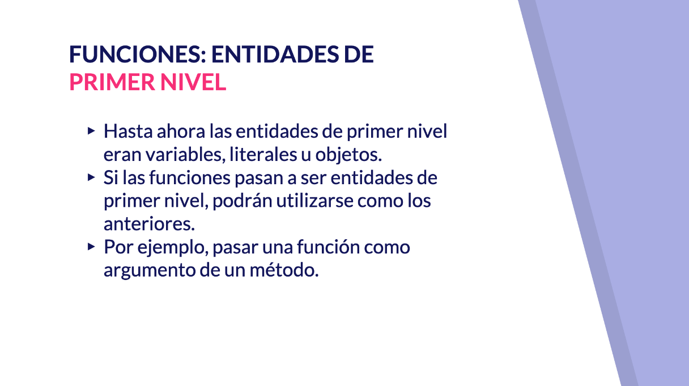

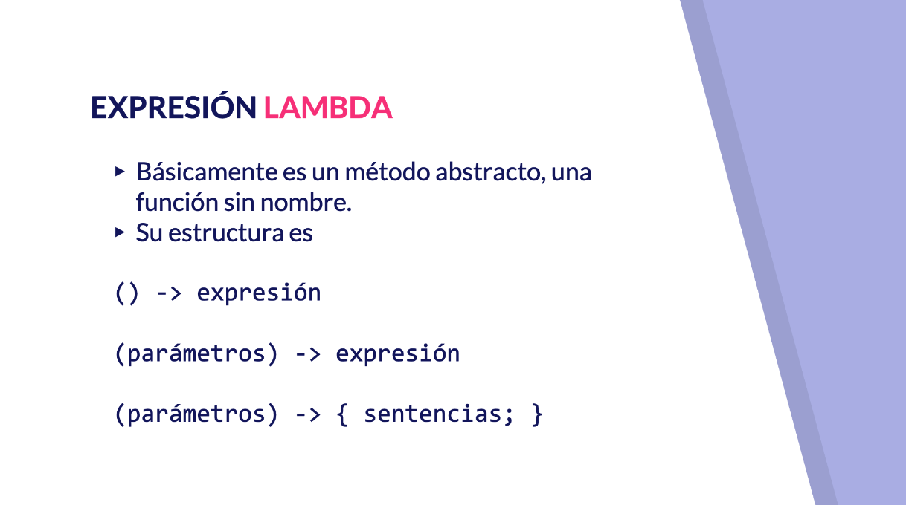

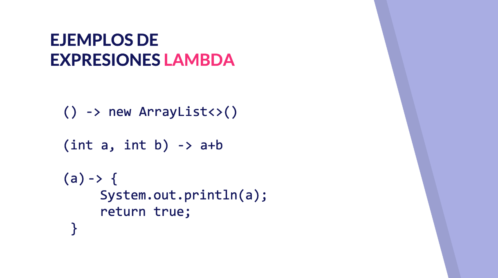

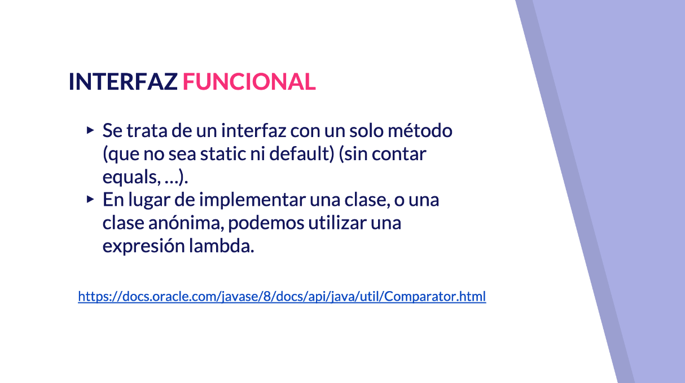


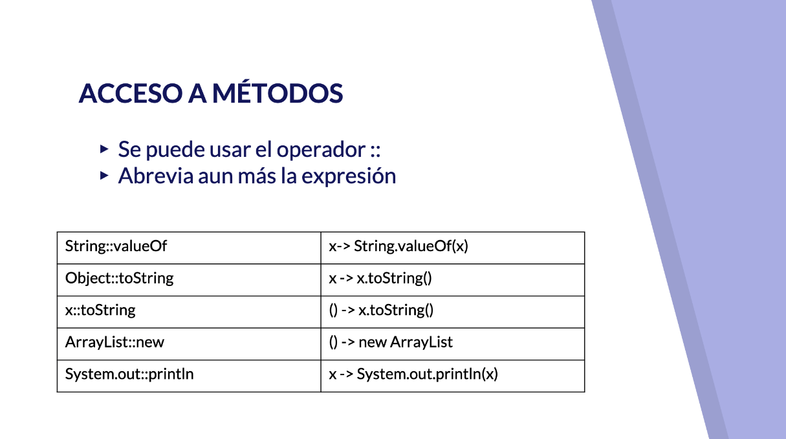


Hola a todos no podíamos concluir este curso de Java 8 sin presentar las expresiones lambda qué es la gran novedad junto a la piste que Java 8 nos ofrece para hablar de expresiones lambda tenemos que hablar primero de programación funcional la programación funcional el paradigma de programación funcional es diferente al de la programación imperativa y también diferencial de la programación orientada a objetos como tal y como lo conocemos no la programación funcional se baja en un lenguaje matemático formal llamado el cálculo lambda que se inventa en los años 30 y que con posterioridad vale se incorpora algunos lenguajes de programación Java lo toma ahora en su versión 8 este paradigma permite trabajar o centrarse en el uso de funciones y centrándose en la idea de que una función dependerá única y exclusivamente de sus parámetros de entrada para producir la salida no ventaja de uso de la programación funcional podemos darnos cuenta y eso nos daremos cuenta el ejemplo de que el código va a ser mucho más expresivos decir haremos más cosas con menos código y el código será mucho más elegante vale porque bueno la orientación al uso de métodos encadenado ahora que podemos tener un código muy elegante a la hora de hacer de hacer las mismas operaciones para las cuales antes hacíamos un montón de sentencias de código la programación funcional está presente en otros lenguajes de programación desde hace mucho tiempo vale sobre todo en algunos competidores de estaba desde de un tiempo acá como faltó pisar y bueno tarde si la dicha es buena para que Java lo haya incorporado ahora a posibilidad la programación funcional también se centra en la idea de convertir las funciones en entidades de primer nivel no hasta ahora la entidades de primer nivel es decir lo que podíamos pasar a través de como argumento de un método eran variables literales objetos y alguna combinación de ella array objeto es un tipo primitivo un literal concreto convertimos las funciones en entidades de primer nivel podríamos utilizar una función allá donde antes usábamos una variable con lo cual podríamos guardar una función de una variable o podríamos pasar una función como argumento de un metro vale con todo ello nos entramos ahora en la sintaxis para ver cómo podemos hacer expresiones lambda expression de andar no va a ser más que una especie de método abstracto es decir una función sin nombre cuya estructura puede ser alguna de las que tenemos aquí a continuación a la izquierda de la flecha tendremos los argumentos que recibiría la función los parámetros que recibía esta moción y a la derecha tendríamos el código que se ejecutaría como cuerpo de esa función solamente va a ser una expresión lo podríamos poner el tal cual sin; si va a ser un conjunto de sentencias no encerrar y amos en un bloque entrellaves separado cada sentencia por un público la primera nos permitiría crear cada sentencia por un público la primera nos permitiría crear un nuevo ArrayList la segunda devolvería porque hay implícito una sentencia ruiton a la derecha de la flecha recibiendo dos parámetros de tipo entero y en la tercera tendríamos que se recibiría un argumento a el tipo C inferir y a raíz del contexto donde esté la expresión Landa y dónde haríamos puestos sentencia en este caso imprimirlo por consola y devolver un valor un valor verdad de forma pareja a las expresiones lambda Java incorporado el concepto de interfaz funcional que no trabajamos en su momento cuando cuando vimos los interfaces que no que lo presentamos ahora una interfaz funcional Barcelona interfaz que tenga un solo metro y esto se matiza diciendo que era una interfaz con un solo método que no sea ni estático ni de FOL y en los cuales tampoco contemos los métodos propios de la clase hostia es decir podríamos tener una interfaz con un solo método abstracto y sería funcional o una interfaz con un método abstracto y 10 metros está disco de folk que seguiría siendo una interfaz funcional cuando trabajamos con interfaces funcionales lo normal es que utilicemos clase anónima el concepto de clase anónima también dejamos su presentación para para el curso de Java 8 para programadores Java pero simplemente decir que será una una clase que bueno no tenemos que crear en un fichero aparte si no te la podremos quedar en un punto concreto del código pues en lugar de implementar una clase de que una clase mejor dicho tienes esta interfaz funcional o incluso hagamos una clase anónima en el sitio que lo necesitemos podremos utilizar una expresión lambda un ejemplo de interfaz funcional en Java 8 es la interfaz barato vale está interfaz nos va a permitir el va a tener métodos para comparar dos dos objetos de un mismo tipo de un tipo T que le pasemos no teniendo además un montón de métodos estáticos para hacer comparaciones rápidas no vale también tiene un montón de métodos por defecto vale por internet acción por defecto sin embargo solamente tiene un método el método compare vale como método abstracto no con lo cual independientemente de igual que ya hemos dicho que tampoco cuenta con lo cual está interfaz sería una interfaz funcional para forzar que se compró cenar pues aunque eso nosotros ahora mismo no nos va a afectar la anotación@japón tiene internet pero ya digo que para nosotros la interfaz funcional nos basta con que sepamos que tiene solamente un método abstracto vale pues nosotros podríamos intentar utilizar una interfaz funcional y amigo implementando la clase a través de una clase anónima o mediante una expresión tendríamos varios ejemplos aquí si tuviéramos una lista de integer de enteros y que Ángela creamos a partir de un método estático de la clase arrays que devuelve como una lista una sucesión de elementos que le proporcionamos vale si quisiéramos ordenar la clase la interfaz list ArrayList que hemos estudiado antes incluye el método short pero el método son espera que nosotros le proporcione moment ancia de comparato pues bien nosotros nuestra primera manera de trabajar sería el que creáramos una clase llamada mayor a menor que nos permitirá definir el orden vale para ordenar los números el orden comparando dos números podríamos crear nuestra clase mayor a menor que implementará este interfaz más baratos de internet la primera galería porque yo

Primera manera de trabajar sería el que creáramos una clase de hada mayor a menor que nos permitirá definir el orden vale para ordenar los números el orden comparando dos números podríamos crear nuestra clase mayor a menor que implementará este interfaz baratos de internet bueno lo que vamos a hacer en lugar de dar el orden natural vamos a invertir el orden natural de forma que la clase integra ya tienes un método compare to y viéramos la documentación la clase integer veríamos que incrementa comparato vale y que ya nos permite comparar dos dos números indicando el orden natural de los números pues si nosotros lo que hacemos es devolver la inversa de lo que de lo que devuelve compare two lo que se mueve ordenarlos al revés pues aquí y ordenamos sentimos después que saliste de número tenemos cómo puedo conseguir una manera de imprimir los números ordenados al revés esta manera es válida no te pasa que el código ha sido bastante tedioso hemos tenido que crear un fichero aparte implementar la interfaz darle código cuando los meramente funcional de este código está aquí una segunda manera sería el uso de una clase anónima como decía antes las trabajaremos en profundidad aquellos que queráis hacer el curso de Java Java 8 para perdonar reventada la vamos a presentar aquí una clase anónima es una clase que creamos en un punto de nuestro código vale que la distanciamos y la declaramos a la vez vale la damos aquí estancias medias el operador mío pero además la estamos declarando a la venta con lo cual solamente la vamos a poder utilizar en este punto del código no ahorraría el uso de un nuevo fichero por una clase pues no hombre que no vamos a reutilizar nunca más y lo podríamos poner el código así si juntamos la funcionalidad es la misma que antes sin embargo no volvemos a centrar con que el neo yo de todo está única línea de código si tuviéramos la manera de decirle oye que el orden quiero que sea así sería muy sencilla la tercera manera sería a través de una expresión lambda y bueno Java perdón eclipse no ofrece la funcionalidad de que si pulsamos control 1 sobre 1 instancia anónima de una clase es capaz de convertirla en una expresión lanza directamente o como nosotros tenemos aquí vale esto lo vamos a dejar conforme estaba o como teníamos aquí abajo podríamos hacer nosotros manera a sort en lugar de proporcionarle una instancia de una clase que implementa una interfaz le proporcionamos una expresión Landa el uso de la expresión lambda aquí es posible porque la interfaz compare perdón comparato que funcionar si la interfaz tuvieras dos tres cuatro metros por incrementar posiblemente no supiera cuál escoger por eso las expresiones lambda tienen aparejada a las interfaces funcionales como podemos comprobar si nosotros le decimos aquí que sol que espero comparato le proporcionamos un comparato de la clase integral haría la misma operación pero en un código mucho más conciso por qué el uso de expresiones lambda nos permite inferir los tipos si la lista es un lifting pegué y el método sort espera un comparato del tipo de la lista no sería necesario que nosotros le indicaremos el tipo de los argumentos sino que es capaz es capaz de ingerirlo a través del concepto con lo cual el código sería aún más conciso todavía la expresión es Landa también nos han permitido junto con el uso de las colecciones el aprovechamiento de un nuevo llamado por y el bucle for que será un método de todas las colecciones recibe como parámetro un objeto que instancia otra interfaz funcional en particular la interfaz consumer tiene un solo método que lo que va a ir haciendo tomando los elementos de la colección y haciendo con él pues no que indique el cuerpo


Cuerpo de examen todo es perfecto para que nosotros lo podamos utilizar con expresiones lanza pero antes si nos vamos a centrarnos en mente en este nuevo operador que nos presentará la expresión es Landa y es que bueno podemos incluso abreviar mucho más algunas expresiones lambda de una manera por ejemplo si tenemos un determinado método nos podemos entrar en el último como sistem. Auto sprint LN qué bueno espera recibir un argumento para poder imprimirlo podemos utilizar la notación de los dos puntos vale de esta manera que tenemos aquí para decirle oye espera un argumento y está el momento me lo vas a proporcionar aquí de esta manera podremos usarla la referencia a los métodos para para hacerlo más rápido todavía podemos utilizarlo también para instanciar objeto para llamar a métodos de un objeto en particular para llamar a distintos métodos incluso indicando de qué clase vienen vale etcétera etcétera está referencia método también eh bastante potente aquí tenemos el uso de los bucles For y vamos a ver diferente formas de hacerlo la manera clásica de imprimir una serie de elementos digo clásica aunque ya era la más novedosa que teníamos era a través del bucle for mejorado en la cual bueno pues nosotros recorríamos hoy te la vamos a partir de esta colección uno a uno y lo íbamos teniendo y lo íbamos imprimiendo no el uso de for each nos va a permitir el utilizar expresiones lambda de manera que bueno podríamos decir que por qué espera un consumer la interfaz consumer nos va a permitir un método hacer que lo que aceptas son elemento y no devuelve nada bueno pues nosotros le daríamos el elemento cada elemento del array y con el tipo inferido lo podríamos imprimir y sería igual de funcionar podemos incluso utilizar la referencia a los métodos exactamente un método estático pero sea una referencia a método con 2 puntos vale esto es una abreviatura de estas personas Landa incluso en lugar de utilizar anda que tan solo mira una expresión vale podríamos utilizar una expresión anda que incluyera más de una sentencia para ir haciendo algo tipo de operaciones como por ejemplo incrementar el valor en uno antes de imprimirlo por consola cómo podemos comprobar esta manera de recorrer colección una raíz e bastante potente y como decíamos aparejado al uso de expresiones lambda Java 8


Lambda Java 8 nos ofrece la piel entre el API Stream es nuevo app que nos permite trabajar con una colección como si se tratara de un flujo de información con lo cual vamos a hacer a poder hacer punto con las expresiones lambda muy fácilmente operaciones de recorrido filtrado transformación ordenación agrupación y presentación de la información con un código muy conciso y fresador pocas líneas para lo que antes requeríamos muchas líneas de código a priori incluso recorrer vale hacerse una raíz lo vamos a poder hacer mediante lápiz os lo voy a presentar brevemente y queréis conocer el API stream en profundidad os recomiendo que cuando terminéis en el curso de Java 8 desde cero por ahí hacer el curso de Java 8 para programadores Java en este punto podemos utilizar el API stream a partir de el método trim que tiene bueno pues todas las conexiones podríamos transformar una lista en un gym cómo podemos comprobar si es una una interfaz que tenemos en Java vale que además es para metérsela también un stream de algo en nuestro caso sería un stream de número entero vale para poder trabajar con ella esto no estás internamente por nosotros pero si quisiéramos hacer algún tipo de operación intermedia como por ejemplo infiltrada no podríamos hacer con alguno de los métodos que tiene ese interfaz el método filter espera un predicado otra interfaz funcional en los permitiría a partir de un determinado valor hacer una comparación y por ejemplo podríamos filtrar para que solamente se quedarán después de este filtro los valores que fueran mayores iguales que 5 es imprimirlos por persona hiciéramos imprimir solo los mayores iguales que 5 pero ordenado inversamente podríamos utilizar otra operación intermedia de los Extreme qué es sorted y que nos permite ordenar un string pasándole un comparato podemos reutilizar una de las expresiones lambda del ejemplo anterior para ordenar los a la inversa no vamos a comentar este código que no emborrone de manera que como aquí no imprimiría los números de mayores que 5 pero lo haría de un determinado orden o en el orden inverso al orden natural por último podríamos ver cómo los streams los podemos utilizar también para agrupar todos los valores en un solo valor haciendo antes una transformación de los distintos valores lo que se conoce como un mapeo fijado que potente está operación en la que podríamos crear un string mapear el valor de integrar a un valor entero primitivo filtrar para que ese valor sea mayor o igual que 5 los que sean menores que 5 los descartar y amos y SUM haríamos todo eso para Lore reduciendo el string a un solo valor resultado que obtenemos aquí y que podríamos imprimir si sumamos los números 5 + 6 + 7 + 8 + 9 + 10 la operación no sería 45 si estaba en un código bastante bastante elegante conecta introducción a ala spring y expresiones lambda finalizamos el curso de Java 8 desde cero o agradezco la paciencia que habéis tenido viendo todos los vídeos y practicando con todos los ejemplo o animo a que pueda ir hacer todas las preguntas que necesitéis en los foros y os ánimo a que os lancéis al finalizarlo a hacer el curso de Java 8 para programadores


## Práctica: Creando un gestor de aparcamiento de coches 25:16 

[Proyecto_Final.pptx](otros/Proyecto_Final.pptx)

[Gráfico.xlsx](otros/Gráfico.xlsx)


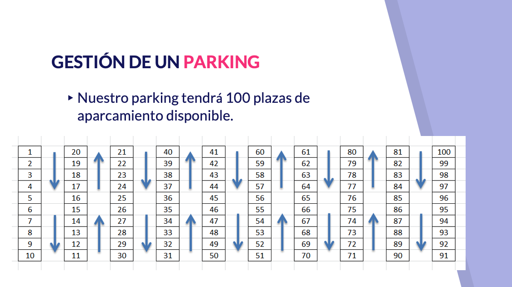

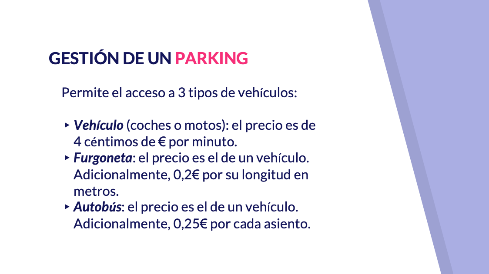


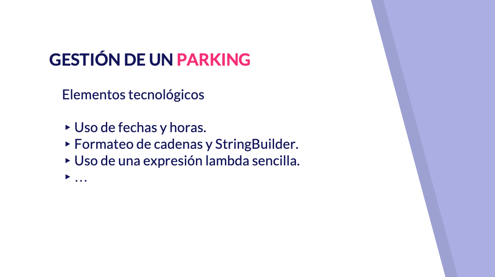

En esta sesión práctica veremos como crear un gestor de aparcamiento de coches, tienes el código de ejemplo en el [repositorio de GitHub](https://github.com/OpenWebinarsNet/Curso-Java-desde-0/tree/master/Final_Parking).

### Código

*dibujoParking.txt*

```sh
		//   1     20     21      .. .. .. .. .. ..  100 
		//   2  |  19     22  |   ..                  99
		//   3  ▼  18  ▲  23  ▼                       98
		//   4     17  |  24         ..               97
		//   5     16     25                          96
		//   6     15     25            ..            95
		//   7  |  14     27  |                       94
		//   8  ▼  13  ▲  28  ▼            ..         93
		//   9     12  |  29      ..          ..      92
		//  10     11     30      31 .. .. .. .. ..   91
```

*App.java*

```java
/**
 * APLICACIÓN QUE IMPLEMENTA LA GESTIÓN DE UN PARKING
 */
package parking;

import java.util.Scanner;

import parking.modelo.Autobus;
import parking.modelo.Furgoneta;
import parking.modelo.Parking;
import parking.modelo.Vehiculo;

/**
 * @author Openwebinars
 *
 */
public class App {

	static Parking parking;

	static Scanner sc;

	/**
	 * @param args
	 */
	public static void main(String[] args) {

		// Inicializamos las clases necesarias
		sc = new Scanner(System.in);
		// Ponemos en marcha el Parking.
		parking = new Parking();

		int opcion = 0;

		do {
			// Imprimimos el menú
			menu();
			System.out.print("Introduzca la opción seleccionada: ");
			opcion = Integer.parseInt(sc.nextLine());
			System.out.println("");
			switch (opcion) {
			case 1:
				registrarEntradaVehiculo();
				parking.imprimirEstadoParking();
				break;
			case 2:
				registrarSalidaVehiculo();
				parking.imprimirEstadoParking();
				break;
			case 3:
				if (parking.getPlazasDisponibles() > 0) {
					System.out.printf("Hay %d plazas disponibles %n", parking.getPlazasDisponibles());
				} else {
					System.out.println("El parking está COMPLETO");
				}
				break;
			case 4:
				parking.imprimirEstadoParking();
				break;
			case 5:
				System.out.printf("El saldo acumulado es de %.2f", parking.getSaldoAcumulado());
				break;
			case 6:
				parking.getVehiculos().forEach(System.out::println);
				break;
			default:
				System.out.println("Introduzca una opción correcta");
			}
			
		

		} while (opcion != 0);

		sc.close();
	}

	public static void menu() {

		System.out.println("BIENVENIDO AL PARKING CORONAVIRUS");
		System.out.println("==================================\n");
		System.out.println("0. Salir del programa");
		System.out.println("1. Registrar la entrada de un vehículo");
		System.out.println("2. Registrar la salida de un vehículo");
		System.out.println("3. Número de plazas disponibles");
		System.out.println("4. Imprimir estado del parking");
		System.out.println("5. Saldo acumulado del día");
		System.out.println("6. Imprimir la lista de vehiculos que hay en el parking");

	}

	public static void registrarEntradaVehiculo() {
		// Identificamos el tipo de vehículo
		int opcion = 0;
		do {
			System.out.println("1. Coche o moto");
			System.out.println("2. Furgoneta");
			System.out.println("3. Autobús");
			System.out.print("Introduzca el tipo de vehículo: ");

			opcion = Integer.parseInt(sc.nextLine());
		} while (opcion < 0 || opcion > 3);

		// Recogemos los datos propios de cualquier vehículo
		System.out.print("Introduzca la marca del vehículo: ");
		String marca = sc.nextLine();
		System.out.print("Introduzca la matrícula del vehículo: ");
		String matricula = sc.nextLine();

		Vehiculo v = null;

		// En función del tipo de vehículo, creamos una u otra referencia
		switch (opcion) {
		case 1:
			//Almacenamos los datos en mayúsculas
			v = new Vehiculo(matricula.toUpperCase(), marca.toUpperCase());
			break;
		case 2:
			// Si es una furgoneta, solicitamos la longitud
			System.out.print("Introduzca la longitud en metros de la furgoneta (puede incluir decimales): ");
			float longitud = Float.parseFloat(sc.nextLine());
			v = new Furgoneta(matricula, marca, longitud);
			break;
		case 3:
			// Si es un autobús, solicitamos el número de plazas
			System.out.print("Introduzca el número de plazas del autobús: ");
			int numPlazas = Integer.parseInt(sc.nextLine());
			v = new Autobus(matricula, marca, numPlazas);
		}

		// Registramos la entrada del vehículo
		parking.registrarEntradaVehiculo(v);
		System.out.println("");
	}
	
	public static void registrarSalidaVehiculo() {
		System.out.print("\nIntroduzca la matrícula del veh�culo: ");
		String matricula = sc.nextLine();
		// Para registrar la salida de un vehículo solamente
		// necesitamos su matrícula
		parking.registrarSalidaVehiculo(new Vehiculo(matricula.toUpperCase()));
	}

}
```

#### Modelo

*Vehiculo.java*

```java
/**
 * 
 */
package parking.modelo;

import java.time.LocalDateTime;

/**
 * @author Openwebinars
 *
 */
public class Vehiculo {
	
	// Dejamos las propiedades como protected de forma didáctica, aunque su uso no está muy recomendado
	// Sería más recomendable que fuera private, y acceder desde las clases hija mediante getters/setters
	protected String matricula;
	protected String marca;
	protected LocalDateTime fechaEntrada;
	protected int minutos;
	protected int numPlazaAparcamiento; 
	
	
	public Vehiculo() { }
	
	public Vehiculo(String matricula) {
		this.matricula = matricula;
	}
	
	public Vehiculo(String matricula, String marca) {
		this.matricula = matricula;
		this.marca = marca;
		
	}

	public String getMatricula() {
		return matricula;
	}

	public void setMatricula(String matricula) {
		this.matricula = matricula;
	}

	public String getMarca() {
		return marca;
	}

	public void setMarca(String marca) {
		this.marca = marca;
	}

	public LocalDateTime getFechaEntrada() {
		return fechaEntrada;
	}

	public void setFechaEntrada(LocalDateTime fechaEntrada) {
		this.fechaEntrada = fechaEntrada;
	}

	public int getMinutos() {
		return minutos;
	}

	public void setMinutos(int minutos) {
		this.minutos = minutos;
	}
	
	public int getNumPlazaAparcamiento() {
		return numPlazaAparcamiento;
	}

	public void setNumPlazaAparcamiento(int numPlazaAparcamiento) {
		this.numPlazaAparcamiento = numPlazaAparcamiento;
	}

	public float calcularImporte() {
		return Parking.PRECIO_BASE_POR_MINUTO * minutos;
	}
	

	@Override
	public int hashCode() {
		final int prime = 31;
		int result = 1;
		result = prime * result + ((fechaEntrada == null) ? 0 : fechaEntrada.hashCode());
		result = prime * result + ((marca == null) ? 0 : marca.hashCode());
		result = prime * result + ((matricula == null) ? 0 : matricula.hashCode());
		result = prime * result + minutos;
		return result;
	}

	// Modificamos la implementación por defecto del método equals para 
	// identificar que dos vehículos serán iguales si lo es su matrícula
	
	@Override
	public boolean equals(Object obj) {
		if (this == obj)
			return true;
		if (obj == null)
			return false;
//		if (getClass() != obj.getClass())
//			return false;
		Vehiculo other = (Vehiculo) obj;
		if (matricula == null) {
			if (other.matricula != null)
				return false;
		} else if (!matricula.equalsIgnoreCase(other.matricula))
			return false;
		return true;
	}

	@Override
	public String toString() {
		return "Vehiculo [matricula=" + matricula + ", marca=" + marca + ", fechaEntrada=" + fechaEntrada + ", minutos="
				+ minutos + "]";
	}
}
```

*Autobus.java*

```java
/**
 * 
 */
package parking.modelo;

/**
 * @author Openwebinars
 *
 */
public class Autobus extends Vehiculo {
	
	private int numPlazas;
	
	public Autobus() { }
	
	public Autobus(String matricula, String marca, int numPlazas) {
		super(matricula, marca);
		this.numPlazas = numPlazas;		
	}

	public int getNumPlazas() {
		return numPlazas;
	}

	public void setNumPlazas(int numPlazas) {
		this.numPlazas = numPlazas;
	}
	
	@Override
	public float calcularImporte() {		
		return super.calcularImporte() + (Parking.PRECIO_POR_ASIENTO * numPlazas);
	}

	@Override
	public String toString() {
		return "Autobus [numPlazas=" + numPlazas + ", matricula=" + matricula + ", marca=" + marca + ", fechaEntrada="
				+ fechaEntrada + ", minutos=" + minutos + "]";
	}
}
```

*Furgoneta.java*

```java
/**
 * 
 */
package parking.modelo;

/**
 * @author Openwebinars
 *
 */
public class Furgoneta extends Vehiculo {
	
	private float longitud;
	
	public Furgoneta() { }
	
	public Furgoneta(String matricula, String marca, float longitud) {
		super(matricula, marca);
		this.longitud = longitud;
	}

	public float getLongitud() {
		return longitud;
	}

	public void setLongitud(float longitud) {
		this.longitud = longitud;
	}
			
	@Override
	public float calcularImporte() {		
		return super.calcularImporte() + (Parking.PRECIO_POR_METRO * longitud);
	}


	@Override
	public String toString() {
		return "Furgoneta [longitud=" + longitud + ", matricula=" + matricula + ", marca=" + marca + ", fechaEntrada="
				+ fechaEntrada + ", minutos=" + minutos + "]";
	}
}
```

*PlazaAparcamiento.java*

```java
package parking.modelo;

public class PlazaAparcamiento {
	
	private int numero;
	private boolean libre;
	
	public PlazaAparcamiento() { }
	
	public PlazaAparcamiento(int numero) {
		this.numero = numero;
		// Por defecto, al crear una plaza está libre
		this.libre = true;
	}

	public int getNumero() {
		return numero;
	}

	public void setNumero(int numero) {
		this.numero = numero;
	}

	public boolean isLibre() {
		return libre;
	}

	public void setLibre(boolean libre) {
		this.libre = libre;
	}

	@Override
	public int hashCode() {
		final int prime = 31;
		int result = 1;
		result = prime * result + (libre ? 1231 : 1237);
		result = prime * result + numero;
		return result;
	}

	@Override
	public boolean equals(Object obj) {
		if (this == obj)
			return true;
		if (obj == null)
			return false;
		if (!(obj instanceof PlazaAparcamiento))
			return false;
		PlazaAparcamiento other = (PlazaAparcamiento) obj;
		if (libre != other.libre)
			return false;
		if (numero != other.numero)
			return false;
		return true;
	}

	@Override
	public String toString() {
		return "PlazaAparcamiento [numero=" + numero + ", libre=" + libre + "]";
	}
}
```

*Parking.java*

```java
/**
 * Clase que modela el Parking y su lógica de negocio.
 * 
 * IMPORTANTE: Para representar en algunos comentarios un mapa del parking, se ha modificado
 * la codificación de este fichero  UTF-8. Posiblemente, sea necesario que modifiques la misma
 * en eclipse para poder visualizarlo correctamente.
 */
package parking.modelo;

import java.time.LocalDateTime;
import java.time.format.DateTimeFormatter;
import java.time.format.FormatStyle;
import java.util.ArrayList;
import java.util.List;
import java.util.Random;

import parking.utils.Utils;

/**
 * @author Openwebinars
 *
 */
public class Parking {
	
	// Mantenemos una lista con los vehículos que hay dentro del parking
	private List<Vehiculo> vehiculos;
	
	// Además, necesitamos saber qué plazas están libres o cuales están ocupadas
	private PlazaAparcamiento[][] plazasAparcamiento;
	
	// El número de plazas disponibles, para poder visualizarlo en el cartel de la entrada
	// Si el número de plazas disponibles es 0, el parking está COMPLETO
	private int plazasDisponibles;
	
	// Almacenamos el importe total que hemos cobrado a lo largo de la sesión
	private float saldoAcumulado;
	
	// La carta de precios la establecemos estáticamente en constantes, si bien
	// sería positivo buscar otro sistema, como un fichero de properties.
	public static final float PRECIO_BASE_POR_MINUTO = 0.04f;
	public static final float PRECIO_POR_METRO = 0.2f;
	public static final float PRECIO_POR_ASIENTO = 0.25f;
	
	
	public Parking() {
		saldoAcumulado = 0.0f;
		plazasDisponibles = 100;
		vehiculos = new ArrayList<>();
		// nuestro parking es cuadrado, así que lo representamos en
		// un array bidimensional de 10x10
		plazasAparcamiento = new PlazaAparcamiento[10][10];
		int numPlaza = 0;
		for(int j = 0; j < 10; j++) {
			// Las columnas pares se recorren de arriba a abajo
			// y las impares de abajo a arriba
			if (j % 2 == 0)
				for(int i = 0; i < 10; i++)		
					plazasAparcamiento[i][j] = new PlazaAparcamiento(++numPlaza);
			else
				for(int i = 9; i >= 0; i--)
					plazasAparcamiento[i][j] = new PlazaAparcamiento(++numPlaza);
		}
		
		// Recorremos así el array para que quede de la siguiente forma
		// NOTA: Las flechas hacia abajo y arriba simulan el sentido de
		// los carriles por los que circularían los coches. 
		
		//   1     20     21      .. .. .. .. .. ..  100 
		//   2  |  19     22  |   ..                  99
		//   3  ▼  18  ▲  23  ▼                       98
		//   4     17  |  24         ..               97
		//   5     16     25                          96
		//   6     15     25            ..            95
		//   7  |  14     27  |                       94
		//   8  ▼  13  ▲  28  ▼            ..         93
		//   9     12  |  29      ..          ..      92
		//  10     11     30      31 .. .. .. .. ..   91
		
	}

	public int getPlazasDisponibles() {
		return plazasDisponibles;
	}

	public List<Vehiculo> getVehiculos() {
		return vehiculos;
	}

	public PlazaAparcamiento[][] getPlazasAparcamiento() {
		return plazasAparcamiento;
	}
			
	public float getSaldoAcumulado() {
		return saldoAcumulado;
	}

	/*
	 * Método que imprime, de forma conveniente, el mapa del parking, 
	 * indicando todas las plazas que hay y si están ocupadas o no.
	 */
	public void imprimirEstadoParking() {
		
		for(int i = 0; i < 10; i++) {
			for(int j = 0; j < 10; j++) {
				PlazaAparcamiento plaza = plazasAparcamiento[i][j]; 
				String strPlaza = String.format("%3s", Integer.toString(plaza.getNumero())) + " " + ((plaza.isLibre()) ? "L" : "O") + "  "; 
				System.out.print(strPlaza);
			}
			System.out.println();
		}
		System.out.println("");
		
	}

	/*
	 * Método que registra la entrada de un vehículo en el parking.
	 */
	public void registrarEntradaVehiculo(Vehiculo v) {
		
		if (plazasDisponibles > 0) {
			// Asignamos la fecha y hora de entrada
			v.setFechaEntrada(Utils.fechaYHoraAleatoriaAlrededorFechaYHoraActual());
			
			// Colocamos el coche en una plaza de aparcamiento
			// Simularemos que esto se produce de forma aleatoria
			Random r = new Random();
			boolean cocheAparcado;
			int i, j, numPlaza = 0;
			
			do {
				cocheAparcado = false;		
				i = r.nextInt(10);
				j = r.nextInt(10);
				
				if (plazasAparcamiento[i][j].isLibre()) {
					plazasAparcamiento[i][j].setLibre(false);
					cocheAparcado = true;
					numPlaza = plazasAparcamiento[i][j].getNumero();
				}
			} while (!cocheAparcado);
			
			// Añadimos el coche a la lista de coches que tenemos
			// dentro del parking, asignándole el número de plaza que ocupa
			v.setNumPlazaAparcamiento(numPlaza);		
			vehiculos.add(v);
			--plazasDisponibles;
		} else {
			System.out.println("EL PARKING ESTÁ COMPLETO\n");
		}
	}
	/*
	 * Método que registra la salida de un vehículo del parking
	 */
	public void registrarSalidaVehiculo(Vehiculo v) {
		
		if (!vehiculos.contains(v)) {
			System.out.println("ESTE VEHÍCULO NO ESTÁ EN EL PARKING");
			return;
		} else {
			// Rescatamos la instacia de vehículo que tenemos
			// almacenada, ya que es la que tiene registrada
			// la fecha y hora de entrada
			v = vehiculos.get(vehiculos.indexOf(v));
		}
		
		LocalDateTime salida = LocalDateTime.now();
		
		// Asignamos el número de minutos para calcular el importe
		v.setMinutos(Utils.minutosEntreDosFechas(v.getFechaEntrada(), salida));
		
		// Imprimimos el mensaje con el importe del pago
		StringBuilder ticket = new StringBuilder(String.format("TICKET DE SALIDA: %nMatrícula %s %nFecha y hora de llegada: %s "
				+ "%nFecha y hora de salida: %s %nMinutos de estancia: %d%n", 
				v.getMatricula(), 
				v.getFechaEntrada().format(DateTimeFormatter.ofLocalizedDateTime(FormatStyle.MEDIUM)),
				salida.format(DateTimeFormatter.ofLocalizedDateTime(FormatStyle.MEDIUM)), 
				v.getMinutos()));
		
		if (v instanceof Furgoneta) {
			Furgoneta furgo = (Furgoneta) v;
			ticket.append(String.format("Longitud de la furgoneta %.2f ", furgo.getLongitud()));
		} else if (v instanceof Autobus) {
			Autobus bus = (Autobus) v;
			ticket.append(String.format("Núm. de plazas del autobús: %d " , bus.getNumPlazas()));
		}
		
		ticket.append(String.format("%nImporte total de la estancia: %.2f€ %n%n", v.calcularImporte()));
		
		System.out.printf(ticket.toString());
		
		// Añadimos el importe al saldo acumulado
		saldoAcumulado += v.calcularImporte();
		
		// Identificamos la posición que tenía ocupada el coche para dejarla libre
		int[] coordenadas = Utils.posicionNumeroPlaza(v.getNumPlazaAparcamiento());
		plazasAparcamiento[coordenadas[0]][coordenadas[1]].setLibre(true);
		
		// Eliminamos el vehículo de la lista
		vehiculos.remove(v);
		
		++plazasDisponibles;
	}
}
```

#### Utils

*Utils.java*

```java
/**
 * Clase con métodos auxiliares
 */
package parking.utils;

import java.time.LocalDateTime;
import java.time.temporal.ChronoUnit;
import java.util.Random;

/**
 * @author Openwebinars
 *
 */
public class Utils {
	
	/*
	 * Este método nos devuelve una instancia de LocalDateTime aleatoria,
	 * anterior a la fecha y hora actual, pero no muy lejana (en el intervalo
	 * de entre 2 y 6 horas).
	 */
	public static LocalDateTime fechaYHoraAleatoriaAlrededorFechaYHoraActual() {
		Random r = new Random();
		return LocalDateTime.now().minusHours(r.nextInt(4) + 2).minusMinutes(r.nextInt(60)).minusSeconds(r.nextInt(60));		
	}
	
	/*
	 * Nos devuelve la duración en minutos entre dos fechas
	 */
	public static int minutosEntreDosFechas(LocalDateTime anterior, LocalDateTime posterior) {
		// Le sumamos un minuto a posterior, ya que al usar el método between, la fecha
		// más reciente es exclusiva.
		posterior = posterior.plusMinutes(1L);
		// Devolvemos la diferencia entre ambas fechas en minutos
		return (int) ChronoUnit.MINUTES.between(anterior, posterior); 
	}
	
	public static int[] posicionNumeroPlaza(int n) {
		
		int[] result;

		int unidades = n % 10;
		int decenas = n / 10;
		int fila, columna;

		// Este cálculo tenemos que hacerlo por la forma
		// en que hemos "dibujado" las plazas en el parking
		// Si n % 10 == 0 
		//    la decena es impar -> [9][decena-1]
		//    la decena es par -> [0][decena-1]
		// Si no
		//    Si la decena es par 
		//       [unidad-1][decena]
		//    Si no
		//       [10-unidad][decena]
		if (n % 10 == 0) {
			if (decenas % 10 == 1)
				fila = 9;
			else 
				fila = 0;
			columna = decenas - 1;
		} else {
			if (decenas % 2 == 0) 
				fila = unidades -1;
			else
				fila = 10 - unidades;
			columna = decenas;
		}
		
		// devolvemos las posiciones del resultado
		result = new int[]{fila, columna};
		
		return result;
	}
}
```

**SALIDA:**

```sh
BIENVENIDO AL PARKING CORONAVIRUS
==================================

0. Salir del programa
1. Registrar la entrada de un vehículo
2. Registrar la salida de un vehículo
3. Número de plazas disponibles
4. Imprimir estado del parking
5. Saldo acumulado del día
6. Imprimir la lista de vehiculos que hay en el parking
Introduzca la opción seleccionada: 1

1. Coche o moto
2. Furgoneta
3. Autobús
Introduzca el tipo de vehículo: 1
Introduzca la marca del vehículo: Ford
Introduzca la matrícula del vehículo: 123ABC

  1 L   20 L   21 O   40 L   41 L   60 L   61 L   80 L   81 L  100 L  
  2 L   19 L   22 L   39 L   42 L   59 L   62 L   79 L   82 L   99 L  
  3 L   18 L   23 L   38 L   43 L   58 L   63 L   78 L   83 L   98 L  
  4 L   17 L   24 L   37 L   44 L   57 L   64 L   77 L   84 L   97 L  
  5 L   16 L   25 L   36 L   45 L   56 L   65 L   76 L   85 L   96 L  
  6 L   15 L   26 L   35 L   46 L   55 L   66 L   75 L   86 L   95 L  
  7 L   14 L   27 L   34 L   47 L   54 L   67 L   74 L   87 L   94 L  
  8 L   13 L   28 L   33 L   48 L   53 L   68 L   73 L   88 L   93 L  
  9 L   12 L   29 L   32 L   49 L   52 L   69 L   72 L   89 L   92 L  
 10 L   11 L   30 L   31 L   50 L   51 L   70 L   71 L   90 L   91 L  

BIENVENIDO AL PARKING CORONAVIRUS
==================================

0. Salir del programa
1. Registrar la entrada de un vehículo
2. Registrar la salida de un vehículo
3. Número de plazas disponibles
4. Imprimir estado del parking
5. Saldo acumulado del día
6. Imprimir la lista de vehiculos que hay en el parking
Introduzca la opción seleccionada: 1

1. Coche o moto
2. Furgoneta
3. Autobús
Introduzca el tipo de vehículo: 2
Introduzca la marca del vehículo: PickUp Chevrolet
Introduzca la matrícula del vehículo: 898SDR
Introduzca la longitud en metros de la furgoneta (puede incluir decimales): 9

  1 L   20 L   21 O   40 L   41 L   60 L   61 L   80 L   81 L  100 L  
  2 L   19 L   22 L   39 L   42 L   59 L   62 L   79 L   82 L   99 L  
  3 L   18 L   23 L   38 L   43 L   58 L   63 L   78 L   83 L   98 L  
  4 L   17 L   24 L   37 L   44 L   57 L   64 L   77 L   84 L   97 L  
  5 L   16 L   25 L   36 L   45 L   56 L   65 L   76 L   85 L   96 L  
  6 L   15 L   26 L   35 L   46 L   55 L   66 L   75 L   86 L   95 L  
  7 L   14 L   27 L   34 L   47 L   54 L   67 L   74 L   87 L   94 L  
  8 L   13 L   28 L   33 L   48 L   53 L   68 L   73 L   88 L   93 L  
  9 L   12 L   29 L   32 L   49 L   52 L   69 L   72 L   89 L   92 L  
 10 L   11 L   30 L   31 L   50 L   51 O   70 L   71 L   90 L   91 L  

BIENVENIDO AL PARKING CORONAVIRUS
==================================

0. Salir del programa
1. Registrar la entrada de un vehículo
2. Registrar la salida de un vehículo
3. Número de plazas disponibles
4. Imprimir estado del parking
5. Saldo acumulado del día
6. Imprimir la lista de vehiculos que hay en el parking
Introduzca la opción seleccionada: 1

1. Coche o moto
2. Furgoneta
3. Autobús
Introduzca el tipo de vehículo: 3
Introduzca la marca del vehículo: Mercedes Benz
Introduzca la matrícula del vehículo: 333LPU
Introduzca el número de plazas del autobús: 52

  1 L   20 O   21 O   40 L   41 L   60 L   61 L   80 L   81 L  100 L  
  2 L   19 L   22 L   39 L   42 L   59 L   62 L   79 L   82 L   99 L  
  3 L   18 L   23 L   38 L   43 L   58 L   63 L   78 L   83 L   98 L  
  4 L   17 L   24 L   37 L   44 L   57 L   64 L   77 L   84 L   97 L  
  5 L   16 L   25 L   36 L   45 L   56 L   65 L   76 L   85 L   96 L  
  6 L   15 L   26 L   35 L   46 L   55 L   66 L   75 L   86 L   95 L  
  7 L   14 L   27 L   34 L   47 L   54 L   67 L   74 L   87 L   94 L  
  8 L   13 L   28 L   33 L   48 L   53 L   68 L   73 L   88 L   93 L  
  9 L   12 L   29 L   32 L   49 L   52 L   69 L   72 L   89 L   92 L  
 10 L   11 L   30 L   31 L   50 L   51 O   70 L   71 L   90 L   91 L  

BIENVENIDO AL PARKING CORONAVIRUS
==================================

0. Salir del programa
1. Registrar la entrada de un vehículo
2. Registrar la salida de un vehículo
3. Número de plazas disponibles
4. Imprimir estado del parking
5. Saldo acumulado del día
6. Imprimir la lista de vehiculos que hay en el parking
Introduzca la opción seleccionada: 3

Hay 97 plazas disponibles 
BIENVENIDO AL PARKING CORONAVIRUS
==================================

0. Salir del programa
1. Registrar la entrada de un vehículo
2. Registrar la salida de un vehículo
3. Número de plazas disponibles
4. Imprimir estado del parking
5. Saldo acumulado del día
6. Imprimir la lista de vehiculos que hay en el parking
Introduzca la opción seleccionada: 4

  1 L   20 O   21 O   40 L   41 L   60 L   61 L   80 L   81 L  100 L  
  2 L   19 L   22 L   39 L   42 L   59 L   62 L   79 L   82 L   99 L  
  3 L   18 L   23 L   38 L   43 L   58 L   63 L   78 L   83 L   98 L  
  4 L   17 L   24 L   37 L   44 L   57 L   64 L   77 L   84 L   97 L  
  5 L   16 L   25 L   36 L   45 L   56 L   65 L   76 L   85 L   96 L  
  6 L   15 L   26 L   35 L   46 L   55 L   66 L   75 L   86 L   95 L  
  7 L   14 L   27 L   34 L   47 L   54 L   67 L   74 L   87 L   94 L  
  8 L   13 L   28 L   33 L   48 L   53 L   68 L   73 L   88 L   93 L  
  9 L   12 L   29 L   32 L   49 L   52 L   69 L   72 L   89 L   92 L  
 10 L   11 L   30 L   31 L   50 L   51 O   70 L   71 L   90 L   91 L  

BIENVENIDO AL PARKING CORONAVIRUS
==================================

0. Salir del programa
1. Registrar la entrada de un vehículo
2. Registrar la salida de un vehículo
3. Número de plazas disponibles
4. Imprimir estado del parking
5. Saldo acumulado del día
6. Imprimir la lista de vehiculos que hay en el parking
Introduzca la opción seleccionada: 6

Vehiculo [matricula=123ABC, marca=FORD, fechaEntrada=2020-04-26T17:17:07.800, minutos=0]
Furgoneta [longitud=9.0, matricula=898SDR, marca=PickUp Chevrolet, fechaEntrada=2020-04-26T16:57:28.571, minutos=0]
Autobus [numPlazas=52, matricula=333LPU, marca=Mercedes Benz, fechaEntrada=2020-04-26T19:08:44.591, minutos=0]
BIENVENIDO AL PARKING CORONAVIRUS
==================================

0. Salir del programa
1. Registrar la entrada de un vehículo
2. Registrar la salida de un vehículo
3. Número de plazas disponibles
4. Imprimir estado del parking
5. Saldo acumulado del día
6. Imprimir la lista de vehiculos que hay en el parking
Introduzca la opción seleccionada: 2


Introduzca la matrícula del veh�culo: 333LPU
TICKET DE SALIDA: 
Matrícula 333LPU 
Fecha y hora de llegada: 26-abr-2020 19:08:44 
Fecha y hora de salida: 26-abr-2020 22:06:45 
Minutos de estancia: 179
Núm. de plazas del autobús: 52 
Importe total de la estancia: 20,16€ 

  1 L   20 L   21 O   40 L   41 L   60 L   61 L   80 L   81 L  100 L  
  2 L   19 L   22 L   39 L   42 L   59 L   62 L   79 L   82 L   99 L  
  3 L   18 L   23 L   38 L   43 L   58 L   63 L   78 L   83 L   98 L  
  4 L   17 L   24 L   37 L   44 L   57 L   64 L   77 L   84 L   97 L  
  5 L   16 L   25 L   36 L   45 L   56 L   65 L   76 L   85 L   96 L  
  6 L   15 L   26 L   35 L   46 L   55 L   66 L   75 L   86 L   95 L  
  7 L   14 L   27 L   34 L   47 L   54 L   67 L   74 L   87 L   94 L  
  8 L   13 L   28 L   33 L   48 L   53 L   68 L   73 L   88 L   93 L  
  9 L   12 L   29 L   32 L   49 L   52 L   69 L   72 L   89 L   92 L  
 10 L   11 L   30 L   31 L   50 L   51 O   70 L   71 L   90 L   91 L  

BIENVENIDO AL PARKING CORONAVIRUS
==================================

0. Salir del programa
1. Registrar la entrada de un vehículo
2. Registrar la salida de un vehículo
3. Número de plazas disponibles
4. Imprimir estado del parking
5. Saldo acumulado del día
6. Imprimir la lista de vehiculos que hay en el parking
Introduzca la opción seleccionada: 4

  1 L   20 L   21 O   40 L   41 L   60 L   61 L   80 L   81 L  100 L  
  2 L   19 L   22 L   39 L   42 L   59 L   62 L   79 L   82 L   99 L  
  3 L   18 L   23 L   38 L   43 L   58 L   63 L   78 L   83 L   98 L  
  4 L   17 L   24 L   37 L   44 L   57 L   64 L   77 L   84 L   97 L  
  5 L   16 L   25 L   36 L   45 L   56 L   65 L   76 L   85 L   96 L  
  6 L   15 L   26 L   35 L   46 L   55 L   66 L   75 L   86 L   95 L  
  7 L   14 L   27 L   34 L   47 L   54 L   67 L   74 L   87 L   94 L  
  8 L   13 L   28 L   33 L   48 L   53 L   68 L   73 L   88 L   93 L  
  9 L   12 L   29 L   32 L   49 L   52 L   69 L   72 L   89 L   92 L  
 10 L   11 L   30 L   31 L   50 L   51 O   70 L   71 L   90 L   91 L  

BIENVENIDO AL PARKING CORONAVIRUS
==================================

0. Salir del programa
1. Registrar la entrada de un vehículo
2. Registrar la salida de un vehículo
3. Número de plazas disponibles
4. Imprimir estado del parking
5. Saldo acumulado del día
6. Imprimir la lista de vehiculos que hay en el parking
Introduzca la opción seleccionada: 5

El saldo acumulado es de 20,16BIENVENIDO AL PARKING CORONAVIRUS
==================================

0. Salir del programa
1. Registrar la entrada de un vehículo
2. Registrar la salida de un vehículo
3. Número de plazas disponibles
4. Imprimir estado del parking
5. Saldo acumulado del día
6. Imprimir la lista de vehiculos que hay en el parking
Introduzca la opción seleccionada: 6

Vehiculo [matricula=123ABC, marca=FORD, fechaEntrada=2020-04-26T17:17:07.800, minutos=0]
Furgoneta [longitud=9.0, matricula=898SDR, marca=PickUp Chevrolet, fechaEntrada=2020-04-26T16:57:28.571, minutos=0]
BIENVENIDO AL PARKING CORONAVIRUS
==================================

0. Salir del programa
1. Registrar la entrada de un vehículo
2. Registrar la salida de un vehículo
3. Número de plazas disponibles
4. Imprimir estado del parking
5. Saldo acumulado del día
6. Imprimir la lista de vehiculos que hay en el parking
Introduzca la opción seleccionada: 2


Introduzca la matrícula del veh�culo: 123ABC
TICKET DE SALIDA: 
Matrícula 123ABC 
Fecha y hora de llegada: 26-abr-2020 17:17:07 
Fecha y hora de salida: 26-abr-2020 22:07:42 
Minutos de estancia: 291

Importe total de la estancia: 11,64€ 

  1 L   20 L   21 L   40 L   41 L   60 L   61 L   80 L   81 L  100 L  
  2 L   19 L   22 L   39 L   42 L   59 L   62 L   79 L   82 L   99 L  
  3 L   18 L   23 L   38 L   43 L   58 L   63 L   78 L   83 L   98 L  
  4 L   17 L   24 L   37 L   44 L   57 L   64 L   77 L   84 L   97 L  
  5 L   16 L   25 L   36 L   45 L   56 L   65 L   76 L   85 L   96 L  
  6 L   15 L   26 L   35 L   46 L   55 L   66 L   75 L   86 L   95 L  
  7 L   14 L   27 L   34 L   47 L   54 L   67 L   74 L   87 L   94 L  
  8 L   13 L   28 L   33 L   48 L   53 L   68 L   73 L   88 L   93 L  
  9 L   12 L   29 L   32 L   49 L   52 L   69 L   72 L   89 L   92 L  
 10 L   11 L   30 L   31 L   50 L   51 O   70 L   71 L   90 L   91 L  

BIENVENIDO AL PARKING CORONAVIRUS
==================================

0. Salir del programa
1. Registrar la entrada de un vehículo
2. Registrar la salida de un vehículo
3. Número de plazas disponibles
4. Imprimir estado del parking
5. Saldo acumulado del día
6. Imprimir la lista de vehiculos que hay en el parking
Introduzca la opción seleccionada: 6

Furgoneta [longitud=9.0, matricula=898SDR, marca=PickUp Chevrolet, fechaEntrada=2020-04-26T16:57:28.571, minutos=0]
BIENVENIDO AL PARKING CORONAVIRUS
==================================

0. Salir del programa
1. Registrar la entrada de un vehículo
2. Registrar la salida de un vehículo
3. Número de plazas disponibles
4. Imprimir estado del parking
5. Saldo acumulado del día
6. Imprimir la lista de vehiculos que hay en el parking
Introduzca la opción seleccionada: 2


Introduzca la matrícula del veh�culo: 898SDR
TICKET DE SALIDA: 
Matrícula 898SDR 
Fecha y hora de llegada: 26-abr-2020 16:57:28 
Fecha y hora de salida: 26-abr-2020 22:09:14 
Minutos de estancia: 312
Longitud de la furgoneta 9,00 
Importe total de la estancia: 14,28€ 

  1 L   20 L   21 L   40 L   41 L   60 L   61 L   80 L   81 L  100 L  
  2 L   19 L   22 L   39 L   42 L   59 L   62 L   79 L   82 L   99 L  
  3 L   18 L   23 L   38 L   43 L   58 L   63 L   78 L   83 L   98 L  
  4 L   17 L   24 L   37 L   44 L   57 L   64 L   77 L   84 L   97 L  
  5 L   16 L   25 L   36 L   45 L   56 L   65 L   76 L   85 L   96 L  
  6 L   15 L   26 L   35 L   46 L   55 L   66 L   75 L   86 L   95 L  
  7 L   14 L   27 L   34 L   47 L   54 L   67 L   74 L   87 L   94 L  
  8 L   13 L   28 L   33 L   48 L   53 L   68 L   73 L   88 L   93 L  
  9 L   12 L   29 L   32 L   49 L   52 L   69 L   72 L   89 L   92 L  
 10 L   11 L   30 L   31 L   50 L   51 L   70 L   71 L   90 L   91 L  

BIENVENIDO AL PARKING CORONAVIRUS
==================================

0. Salir del programa
1. Registrar la entrada de un vehículo
2. Registrar la salida de un vehículo
3. Número de plazas disponibles
4. Imprimir estado del parking
5. Saldo acumulado del día
6. Imprimir la lista de vehiculos que hay en el parking
Introduzca la opción seleccionada: 3

Hay 100 plazas disponibles 
BIENVENIDO AL PARKING CORONAVIRUS
==================================

0. Salir del programa
1. Registrar la entrada de un vehículo
2. Registrar la salida de un vehículo
3. Número de plazas disponibles
4. Imprimir estado del parking
5. Saldo acumulado del día
6. Imprimir la lista de vehiculos que hay en el parking
Introduzca la opción seleccionada: 5

El saldo acumulado es de 46,08BIENVENIDO AL PARKING CORONAVIRUS
==================================

0. Salir del programa
1. Registrar la entrada de un vehículo
2. Registrar la salida de un vehículo
3. Número de plazas disponibles
4. Imprimir estado del parking
5. Saldo acumulado del día
6. Imprimir la lista de vehiculos que hay en el parking
Introduzca la opción seleccionada: 0

Introduzca una opción correcta
```

### Transcripción.


Hola tonto vamos a concluir nuestro curso de programación Java 8 de tercera con un ejemplo final qué trata de aglutinar alguno de los conceptos que hemos venido trabajando lo largo de todo el curso y para ello vamos a implementar la gestión del parque nuestro parking gran parque de unas 100 plazas en el que bueno pues vamos a plantear la plaza de aparcamiento simulando que tienen que circular alternativamente pues la numeración de las plazas de parking empezando la primera columna desde arriba abajo la segunda de abajo arriba y así sucesivamente añadir algo de complejidad en la gestión de manera que bueno pues nos tocará incrementar vale parking permitirá el acceso a a tres tipos de vehículos vehículos normales concert Moto2 del precio del vehículo será de 4 sentimos o 4 centenas de euro por minuto añadiremos también dos clases que heredarán de vehículos furgoneta y autobús y que tendrán alguna modificación para que veamos cómo funciona el polimorfismo en el cálculo del importe que hay que pagar por la estación hasta que no la furgoneta pues además de pagar lo que paga un vehículo adicionalmente para ganar 20 sentimos porro por cada longitud por cada metro de longitud que tenga y los autobuses para grandes de 5 céntimo adicionales por cada centro vamos a trabajar bastante elementos tecnológicos de los que hemos trabajado a lo largo del curso cómo son la herencia y polimorfismo arrays bidimensionales openwebinars pues tendrá cierta lógica de negocio que también implementaremos como no podía ser de otra manera para gestionar el precio de la estancia de los vehículos que tendremos que manejar fecha y hora para imprimir el ticket por pantalla usaremos el formateo de cadena y la clase StringBuilder y también usaremos alguna especial Landa sencilla que hará que podamos evidenciar como se utilizan pero que no añada excesiva complejidad al uso de ejemplo bueno aquí tenemos el código dónde tenemos varias clase si os parece lo primero que hacemos ser ponerlo en ejecución vemos cómo funciona y después iremos visitando el código para ver los apartados marihuana al comenzar en la jornada el parking no tiene ningún coche dentro y bueno avería y comenzarían los vehículos a llegar este sería el menú con las distintas operaciones que tendríamos no se puede registrar la la entrada de un vehículo la salida pero el número de plazas que quedan disponibles imprimir el estado del parque vale imprimir el mapa del Estado indicando el número de plazas y las plazas están libro las que están ocupada y hemos acumulando el saldo del día para saber luego bueno pues la caja al final del día y si queremos saber los vehículos que tenemos dentro con sus características que hacen lo podremos estar vamos a registrar la entrada de algunos vehículos furgoneta exteriores tipo 2 de la marca Ford con matrícula nueva vale va medir 6 con 3 metros aquí cada vehículo que se injerta pues Seba dibujando en el parque hemos añadido cierto componente aleatorio aleatoria para añadir una una cierta simulación no de lo que sería que entre el vehículo se sitúe que el sensor detectaran dónde aparcado y si queremos ver la lista de vehículos que hay ahora mismo en el parking podíamos ver como tenemos nuestra furgoneta de la marca Ford de 6 con 3 metros de longitud también hemos añadido un elemento aleatorio a la fecha de entrada vale para qué bueno el cálculo del importe tenga elementos suficientes tenga minutos suficientes pues lo demuestras John en restarle una cantidad de tiempo aleatoria a la fecha de entrada de entre lo hice llorar más porque tenga cierta funcionalidad la ejemplificación de Freddy quisiéramos ahora pero el número de plazas disponible en principio tenemos 99 solo vehículo dentro y la operación más interesante que sería registrar la salida no sería solamente la matrícula del vehículo a ti todos podremos ver como como hemos añadido cierta lógica incluso hemos modificado el método igual la clase vehículo para que nos permita con solo poder detectar que el mismo que tenemos dentro y María bueno pues llegar al usuario a la máquina introdujera su ticket no estaría asociado a su vehículo de esta manera calcularía con el ticket de salida no imprimiría los datos del vehículo la matrícula suspense y hora de llegada tu fecha y hora de salida la diferencia de ambas empezado el minuto la longitud de la furgoneta y el importe total de la estancia no sumando los minutos por Supreme precio correspondiente y ahora consultar amor el número de plazas disponibles pues ya veremos y comprobamos el estado del parking que tenemos que estar completamente el código de las clases modelo a partir de ahí podremos ver la lógica de negocio

Clase que son fundamentales que son vehículo y parte vale y luego pues las demás que también vamos a necesitar vehículo es la base de la herencia de los tipos de vehículo que podemos manejar que modifiques un vehículo estoy en coche o moto furgoneta y autobuses y por ser la base de la herencia tiene los atributos que serían vale así como algunos constructores ya hemos intentado ilustrar el uso de protectores pero al igual que os decía en el en el vídeo correspondiente a la herencia o vuelvo a insistir ahora en la propia Oracle la que no recomienda demasiado el uso de protectores aquí lo hemos puesto los atributos conejo modificador de acceso por qué pudierais ver un ejemplo si os dais cuenta qué intentáis utilizar algún atributo de vehículos en clase que tienen el mismo paquete también tendrías eso porque el modificador Pro incluyo también las posibilidades de acceso del modificador sería bastante más recomendable en este ejemplo usaremos atributos privado y si necesitamos acceder a atributo en algún momento por lo que el correspondiente bueno ya digo tenemos aquí la clase vehículo me bueno quién es el método de calcular el importe vale justificaría los minutos por el precio base por minuto y mi amigo el método y lo que hemos hecho autogenerar lo con irse hemos modificado mucho código de relleno de borrado directamente y alguno lo he dejado comentado para para que podamos entender lo que estamos centro primero en la segunda parte para nosotros dos vehículos van a ser iguales en el programa del parking cuando es una tripulación de esa manera nos va a servir fácilmente para poder localizar el vehículo dentro de una colección cuando utilizamos métodos como Remus en la clase ArrayList of content dónde le pasamos un objeto para que compruebe si está dentro y el Ramón y además lo borré es lo que comparar con cada uno de los elementos del array en base al neto de impuestos para nosotros dos vehículos serán iguales en cuanto matrícula lo sé no puede haber en la calle dos vehículos que tengan la misma matrícula y siempre vale simplemente estamos tratando de modelar ese comportamiento así que esta parte lo que hace comprobar que un vehículo tiene matrícula que la matrícula no es nula y se la matrícula es igual vale a la del otro vehículo en lugar de que utilicé igual que sería con en tramitación por defecto bueno pues si el usuario ha introducido una matrícula minúscula A mayúscula para evitar esos problemas lo que hacemos es comparar con el método igual que tiene la clase String y qué bueno si la cadena echan en mayúscula o minúscula a la hora de hacer la compra de la primera parte lo que hacemos con la implementación que hace por defecto eclipse cuando general método igual vale sí bueno se cumple el operador igual igual devuelve tu nosotros seríamos tú porque son realmente la referencia referencia a un mismo objeto vale falso porque de dejarla activa la misma implementación


Sería falso y hemos comentado esta línea porque de dejarla activa necesitaríamos hacer la misma implementación de este método en las clases que dar afecto para que bueno fuera comparando tipo de clase vehículos con vehículos furgonetas furgonetas y autobuses para nosotros ahorramos la comprobación de clase vale porque porque no va a ser necesario de esa manera aunque utilicemos para comparar una instancia de vehículo con una pon una matrícula específica con una furgoneta o un autobús nos va esta parte médico en la maicena a partir de aquí para poder implementar el polimorfismo hemos customizado en los métodos el método calcular importe en furgoneta y en autobús de manera que el importe de la estancia de una furgoneta es el importe como vehículo más el precio por metro por la longitud en metro y en el caso del autobús el precio por asiento por el número de plaza añadido al importe base como como dijo hasta aquí en los tres tipos de vehículos que vamos a dejar la siguiente clase que importante en la clase parking que podríamos decir que es el núcleo de toda de toda la aplicación porque además tiene dentro la lógica de negocio de entrada de un vehículo en el parking y de salida de un vehículo despacio un parking váter por un lado el listado de vehículos que tiene dentro vale de manera que vamos a poder consultar qué vehículos son los que hay dentro a qué hora entraron su matrícula su marca etcétera también va a tener las plazas de aparcamiento para saber si están libres ocupada simulamos pues el hecho de que tuviéramos parking físico con unos sensores de presencia en cada una de las plazas que nos permitirán pues verificarse una determinada plaza está libre o estás ocupada no lo haremos mediante una un array bidimensional de la clase plaza aparcamiento que tenemos por aquí que sencilla vale que solamente tiene el número de plaza de aparcamiento de donante tendríamos también entero con el número de plazas disponibles para poder gestionarlo rápidamente el saldo acumulado dónde vamos a ir añadiendo no puedo conforme se registre la salida de los vehículos cuánto dinero hemos ido cobrando a lo largo de toda la sesión también tenemos aquí alguna constante definida como static final qué bueno dónde podemos definir el precio base por minuto el precio por metro 13 % habría mil maneras de implementar esta parte nombre de un fichero de perfil o algo similar o un fichero de configuración en algún formato conocido pero no teníamos tampoco si el ejemplo un poco más la lógica de inicio de un parque la tenemos por aquí cuando nosotros podremos decir empieza la jornada del parking el saldo acumulado se pone a cero no debe haber ningún vehículo dentro con lo cual tendríamos 100 plazas disponibles en la lista de vehículos que hay dentro estaría vacía mapa de plaza de aparcamiento comienza con todas las plazas libres y como podemos comprobar aquí empezamos ya a manejar la correspondiente valen las impares vale se fueran numerando de abajo arriba no según este este dibujo que tenemos para si tienes cuidado con si trabajáis en Windows en el cuidado con el tema de la codificación de fichero Windows utiliza una poco específica cuando trabajéis con Eclipse en Windows que no es f8hp 1252


He cambiado la codificación de fichero en particular Audi S8 para que lo pudiera soportar no para ver la codificación de un fichero tiene quizás tan solo tenéis que darle al botón derecho propiedades y podéis manejar la codificación de texto bueno inicializamos nuestro mapa y ya está el parking libre para poder esperar la entrada y salida de mí cómo sería el manejo de salud cita bueno pues no podíamos ir la clase hace para ir visto la el menú es muy sencillo Valeo bucle while hasta que introduzca la opción cero y para registrar la entrada de un vehículo una vez que lo hemos recogido recogeremos la marca la matrícula y lo que haríamos sería en función del tipo de vehículo vale y es uno dos o tres creamos una instancia de vehículo una furgoneta pediríamos el dato adicional de furgoneta longitud y crearía molestarte de furgoneta y si fuera un autobús pues tendríamos el dato auxiliar de de un autobús y crearemos la estación y entonces llamaríamos al método de registrar entrada de un vehículo tipo vehículo aunque dentro lleve un vehículo una furgoneta o un autobús vale nos vendríamos a la clase parking a registrar por lo pronto podemos registrar la entrada del vehículo es el número de plazas disponibles superior hacer en caso de que no fuese C pues indie queríamos un mensaje de que el parking está completo y que no puede entrar ningún a partir de ahí lo que teníamos que hacer es registrar la entrada la fecha de entrada señora de eBay como decía lo vamos a hacer añadiendo un poco de elemento aleatorio mediante este método de la clase footing vale que es lo que va a hacer para la fecha y hora actual nos va a devolver una aleatoria hacer posible la misma fecha vale pero anterior en un intervalo de entre de entre 2 y 6 horas aproximadamente de esta manera bueno pues vamos a tener elementos para después saber el número de minutos que he estado un vehículo esta semana lo que hacemos después también concierto elemento aleatorio es aparcar el coche en una plaza aleatoria siempre y cuando esa plaza está libre para ello pues tenemos está para tanto que lo intenta aparcar si hay plazas disponibles tendrá que localizar alguna lo que va haciendo intentar aparcar en una plaza relatoria y si no está libre lo vuelve a intentar y si la plaza estuviera libre pues la marca como ocupada indica que el coche está aparcado y lo que haces qué bueno pues toma este dato el número de Plaza de la plaza de la plaza de aparcamiento porque están bien lo vamos a guardar en el en el vehículo será el dato que nos ayude después a saber en qué plaza de aparcamiento está y a partir de ese número calcular la posición dentro del parque no añadimos el vehículo dentro de la lista de vehículos que tenemos dentro del parking y decretamos las plazas cuál es la lógica para que un vehículo salga voy aquí es donde os decía que monos la customización del método y cual nos ayuda y es que vamos a registrar la salida de un vehículo la intentamos pasar entre la matrícula en mayúscula mala vamos a registrar la salida del vehículo


Comprobar y para cada uno de estos elementos pues tendría el algunos métodos auxiliares que nos devuelven ese cálculo en la unidad que le hemos indicado por ejemplo si quisiéramos calcular la diferencia entre dos fechas en horas lo haríamos de esta manera como lo que nos interesa es la diferencia en minutos no tenemos porque bueno pues calcularlo en otra unidad y transformar nosotros eso a minutos no por ejemplo no tenemos por que calcularlo en día la diferencia o en horas y pasarlo a minutos sino que directamente lo podemos hacer revolviendo la diferencia en minutos pues así damos el número de minutos dentro del vehículo que el lugar donde lo queremos guardar y nos decidimos a maquetar el mensaje con el importe de salvación dónde vamos a usar streambuilder porque vamos con este informa vamos a ir montando cadena de caracteres String que vamos a ir a juntando al Piqué en primera instancia le asignamos la matrícula le indicamos la fecha de entrada para ellos lo hacemos usando un datetimeformatter vale de bueno de nuestra localización y con un tamaño medio vale imprimir el día el mes del año la hora y los minutos indicaremos también de la fecha de salida vale son elementos que suelen quedar normalmente registrado en un ticket de un parking y el número de minutos ahora bien si además comprobamos que la instancia de vehículo vale el vehículo que hemos tomado de nuestro arrays y que ya bueno pues si sabemos si es furgoneta pues autobuses un vehículo a seca y sabemos que nuestro vehículo una furgoneta lo que hacemos es añadirle la longitud y si es un autobús lo que hacemos es añadirles el número de plazas no para que sale identificada en el ticket calcular el importe aquí como podemos comprobar si el vehículo que ha tenido que pagar este usuario saltando como lado Liebherr haríamos la posición esto también lo hemos hecho mediante un método de utilidad que lo que hace que bueno realiza el cálculo necesario en función del número de plazas conforme hemos hecho la numeración para saber si cuáles son las coordenadas de la plaza no lo hace mediante un pequeño calculo que he comentado a ti que podéis echar un vistazo para clarificar cómo cómo se hace eso si tenéis alguna duda os recomiendo que pinta y el mapa sobre un folio para ver cómo cómo se ha conseguido hacerse este cálculo bueno este este cálculo no te volvería dos coordenadas la fila y la columna y bueno si en parking los tendríamos las coordenadas para poder liberar esta plaza de aparcamiento marcarla como libre eliminar el vehículo de la lista de vehículo e incrementar el número de plazas a manera pues es muy implementado la simulación de utilización de un parking no al que solamente me faltaría para que fuera realmente funcional elemento hardware y algunos sensores decir fue alguna barrera la máquina de impresión de ticket de lectura de ticket genial Unicode elementos que realmente serían necesarios todo lo demás que tuviéramos esas máquinas que subirán conectada a nuestra aplicación sábado este parking pues la verdad es que sería totalmente funcionar con este ejemplo terminamos el curso de Java 8 desde cero espero que hayáis disfrutado de él o ánimo a que intente y hacer ahora el coche en ario de autoevaluación y si queréis saber más sobre Java o ánimo también a que pueda ir y hacer el curso de cada 8 para programadores Java

## Contenido adicional 6   

[Manipulación de datos con Stringbuilder](pdfs/30_StringBuilder.pdf)

[Manejo de fechas](pdfs/31_Manejo_de_fechas.pdf)

[Colecciones ArrayList](pdfs/32_Arraylist.pdf)

[Introducción a las expresiones lambda](pdfs/33_ExpresionesLambda.pdf)

[Proyecto_Final.pptx](otros/Proyecto_Final.pptx)

[Gráfico.xlsx](otros/Gráfico.xlsx)
