# 1. Introducción al diseño de clases en Java 73m
   
   * 00 Presentación del profesor y curso 7:36 
   * 01 Implementación de la encapsulación 12:31 
   * 02 Implementación de herencia con modificadores de acceso y composición 9:55 
   * 03 Polimorfismo 10:37 
   * 04 Sobreescribir los métodos hashcode, equals y to string de la clase object 14:34 
   * 05 Uso del ámbito static para variables, métodos y clases 9:30 
   * 06 Clases singleton y clases de inmutables 9:09 
   * Contenido adicional 10
   
# 00 Presentación del profesor y curso 7:36

[Presentación](pdfs/Presentación.pdf)

## Resumen del Profesor

Conoce al profesor de Java desde 0, los requisitos y los objetivos del curso.

## Transcripción

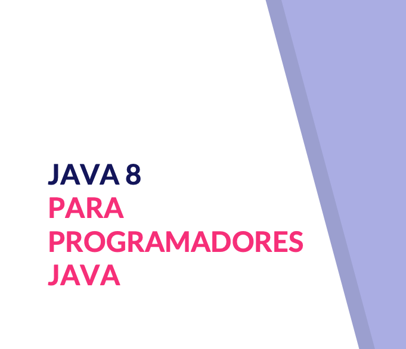
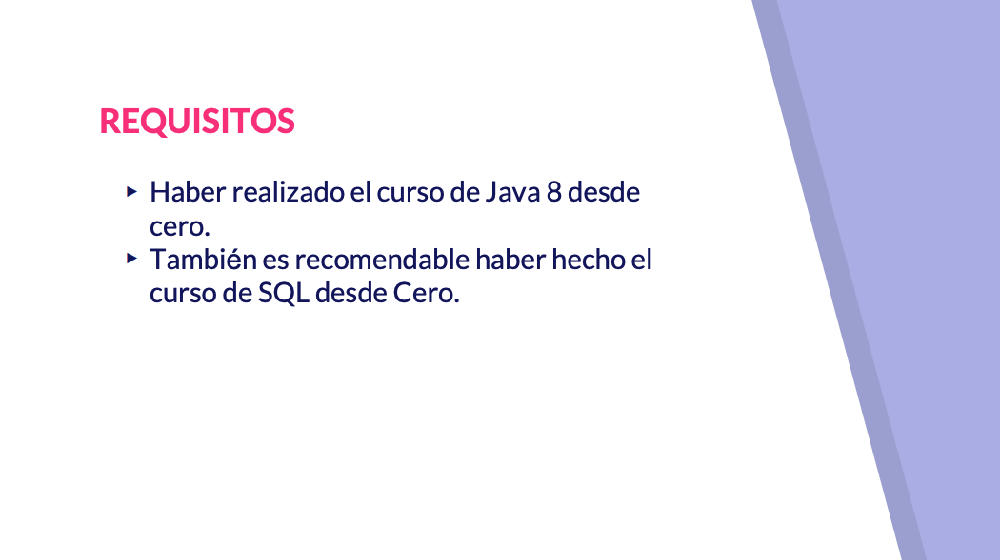
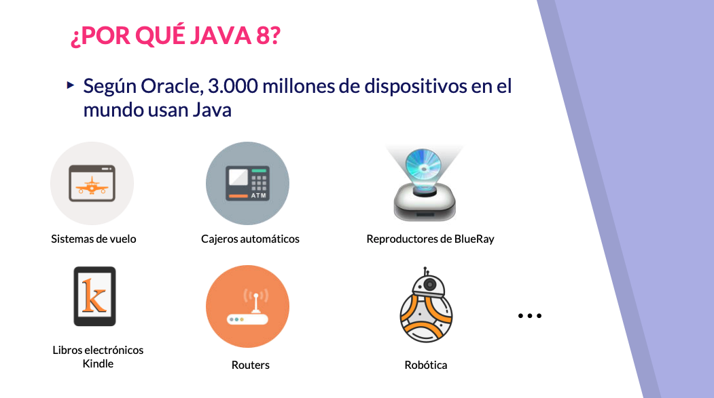

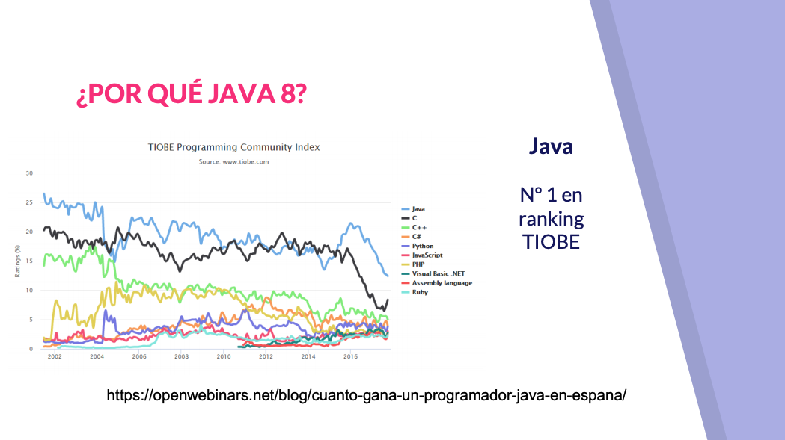
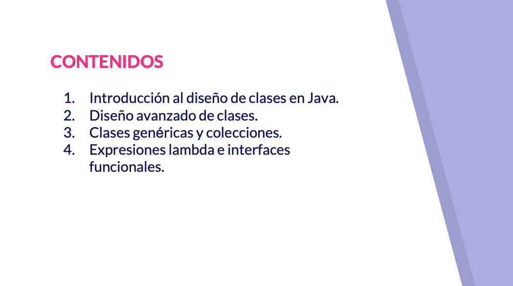
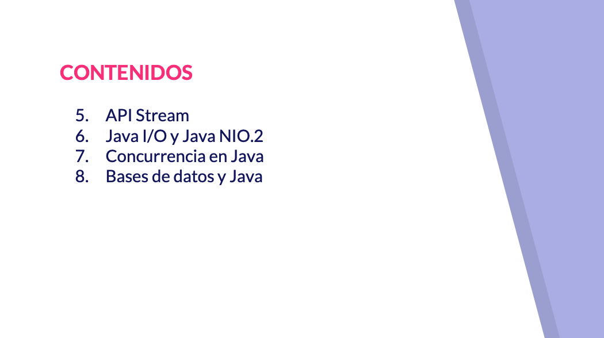
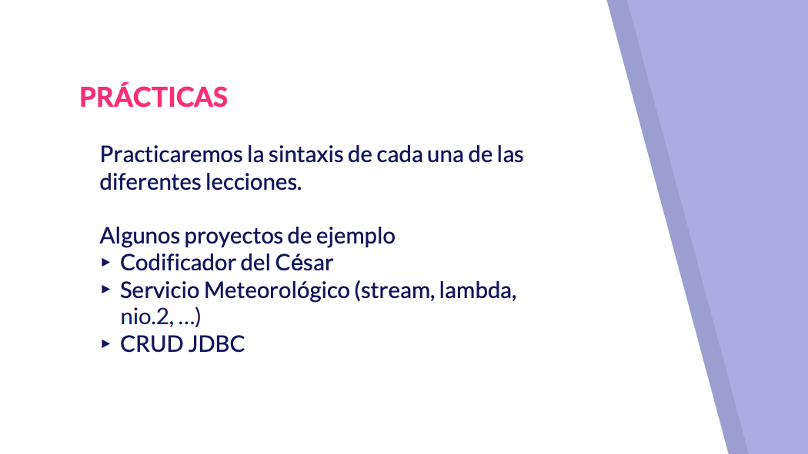

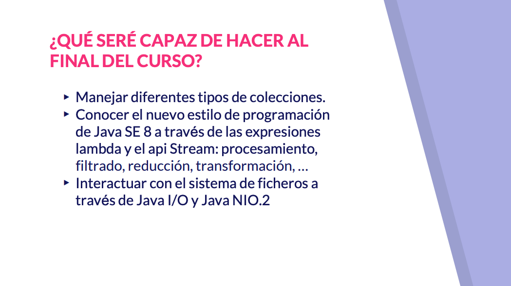
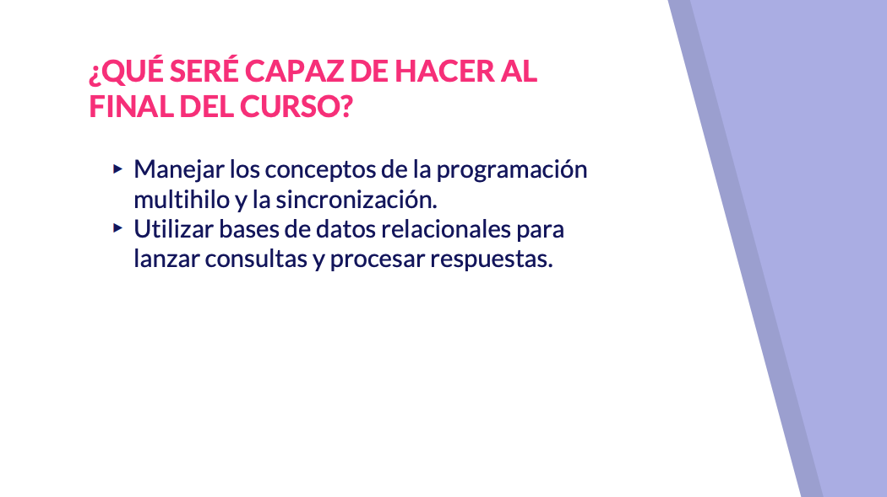


Hola todo y bienvenidos al curso de Java 8 para programadores Java me llamo luis Miguel López Magaña y soy profesor de FP de ciclos formativos de particular de desarrollo de aplicaciones multiplataforma desde hace 10 años además de th15 pues llevo trabajando con la tecnología Java desarrollando aplicaciones tanto para Java este cada vez spring Hibernate también proyectos de movilidad con Android y bueno quiero compartir con vosotros algunos elementos de este curso lo primero es comentaros es que como requisito es recomendable haber realizado el curso de Java 8 desde cero podéis probar a comenzar el curso si os sentís que tenéis buenos conocimientos suficientes para para poder prestaros pero si en algún momento vierais qué bueno alguno de los conceptos que se tratan en el curso de Java 8 desde cero pues vienes bien os recomiendo que lo hagáis para el último bloque de este curso en el que trabajaremos con con base de datos también sería recomendable es tener cierta garantía a la hora de trabajar con SQL y sí bueno si veis que es mejor para para vosotros poder hacer el curso que tenemos sobre SQL DC porque aprender a programar Java y en particular programación algo más avanzada que la inicial bueno según Oracle el dueño de la tecnología Java a día de hoy hay más de tres mil millones de dispositivos que utilizan Java y el número va en incremento no podemos encontrar en todo tipo de plataforma desde coche sistema recuerdos libro electrónico en robótica cajero router y como no pensar que además Java es la mejor manera de empezar a saber programación si lo que queremos es aprender a programar aplicaciones de movilidad en Android si consultamos alguno de los índices como el indice TIOBE sobre los lenguajes de programación más utilizados y más demandados en el mercado podemos ver cómo Java en lo último año siempre ha estado en el talkray de este ranking y como desde el año 2015 pues ha vuelto a incrementarse la demanda y la utilización de cava y a día de hoy sigue ganando ampliamente a al siguiente competidor que sería hacer os recomiendo también y el salario a la hora de trabajar es una condición que imponga y a la hora de aprender un lenguaje de programación que visitéis nuestro blog para saber cuánto gana un programador Java en España vamos a pasar ahora hablar de los contenidos del curso que está estructurado en 8 minutos comenzaremos haciendo un diseño de clase en Java donde podremos ver cómo hacer el encapsulamiento y dónde iremos avanzando en concepto de herencia polimorfismo donde hablaremos de clase final de clases inmutable del modificador static comenzaremos después perdón seguiremos después en un diseño de clases más avanzadas dónde sobretodo trabajaremos con clase interna clases anónimas clases locales pasaremos después en el tercer bloque a hablar de clase genérica y de colecciones en el cuarto bloque hablaremos de interfaces funcionales desprecia en el Landa y de algunos de los interfaces funcionales pesaba nos proveen que más se van a utilizar con lo que veremos en el quinto bloque que será en la piscina podríamos decir que el núcleo del curso ya que lo que va a entrenar después el resto de momento y es que el API stream en la gran novedad es dejada en el bloque sexto hablaremos de entrada salida con la los flujos de trabajo y las nuevas clases y métodos que nos aportan java.nio para hacer operaciones de entrada-salida rápidamente hablaremos en el séptimo bloques de concurrencia en Java y de programacion multihilo de problemas de sincronización y de colecciones concurrente y terminaremos nuestro curso trabajando con bases de datos relacionales hija va a través de JDBC Hola todo y bienvenidos al curso de cada 8 para programadores a dame llamo Luis Miguel López Magaña y soy profesor de FP de ciclo formativos de particular de de desarrollo de aplicaciones . Plataforma desde hace 10 años además de que hace 15 es ebook trabajando con la tecnología desarrollando aplicaciones para escribir también porque tú me dio

Algunos proyectos de ejemplos concretos como por ejemplo un codificador del CEJAS vale para ficheros de texto un servicio meteorológico que permitirá procesar información meteorológica este proyecto lo haremos en dos pasos vale y nos permitirá practicar sobre lápices trim expresiones lambda tratamiento de ficheros con Java nio2 y también haremos al final con Cruz completo sobre una tabla en una base de datos relacional y podremos insertar datos consultar datos actualizar datos y modificar datos cuando terminéis el curso cuáles van a ser los resultados del aprendizaje bueno pues seréis capaces por lo pronto de programar aplicaciones Java con total garantía de que se van a ejecutar en diferentes sistema operativo podréis manejar avanzados conceptos de programación orientada a objetos herencia polimorfismo también podréis diferenciar entre clases públicas clases internas locales o anónima además manejar e múltiples tipos de colecciones de lápiz de colecciones que se ofrece cava conoceré y el nuevo estilo de programación que ofrece Java 8 a través de expresiones lambda y el API string para trabajar con colecciones de elementos y poder hacer un operaciones de procesamiento filtrado reducción y transformación interactuar con el sistema de ficheros a través de los flujos de la Java io y de las clases paz y los métodos de la clase File de la Java nio2 también seréis capaces de realizar aplicaciones multihilo y manejar conceptos de programación concurrente y sincronización y seréis capaces de implementar aplicaciones que utilizan bases de datos relacionales para realizar conexiones lanzar consultas y procesar respuesta para finalizar cuando termine con este curso os ánimo a que podáis visitar otros en otros cursos que pueden complementar vuestros conocimientos el primero sería el de Java para su versión Enterprise Edition vale también el curso de Java server 6 los cursos de Spring Hibernate y JP a ti también nuestro curso de antes espero que disfrutéis del curso que luego estará a disposición en el foro para cualquier duda que tengáis un saludo y gracias

# 01 Implementación de la encapsulación 12:31 

[Implementación de la encapsulación](pdfs/01_Implementación_de_la_encapsulación.pdf)

## Resumen del Profesor

### 1.1 Encapsulación

Los objetos conocen solamente su estructura, no la de los demás. El trato entre objetos se realiza a través de los métodos. Normalmente, los atributos de un objeto se deben consultar o editar a través de métodos.

### 1.2 Buenas prácticas.

#### 1.2.1 Para clases

* La mayoría de las clases que se crean son públicas.
* Cada fichero .java tendrá solamente una clase pública, con el mismo nombre del fichero.

#### 1.2.2 Para atributos

* La mayoría de los atributos de una clase serán privados.
* Solamente algunas constantes, o casos muy particulares, tendrán otra modificador de acceso.

#### 1.2.3 Para métodos

* Si una clase tiene atributos, seguramente tenga métodos públicos.
* Los métodos privados son interesantes para cálculos auxiliares o parciales (solo se pueden invocar desde la propia clase).

### 1.3 Tipos de clases

Aunque Java tiene solamente una forma de crear clases, los patrones de diseño nos dicen que podemos encontrar diferentes tipos de clases según su cometido:

* Modelo: representan objetos o hechos de la naturaleza: un coche, un asiento contable, los datos meteorológicos de un día. Suelen tener atributos, getters y setters, equals, hashCode, toString, …

* Servicios: implementan la lógica de negocio. Suelen tener algunos atributos, pero sobre todo métodos públicos y privados.

* Auxiliares: sirven para realizar operaciones auxiliares de cálculo o transformación de datos. Mayoritariamente, sus métodos son estáticos.

* Main: son el punto de entrada de la aplicación. La mayoría de las ocasiones, solo tienen este método, y si tienen más, suelen ser estáticos.

* Test: clases orientadas a realizar pruebas de nuestra aplicación. En Java, suelen ser test unitarios con JUnit.

* ...

## Transcripción

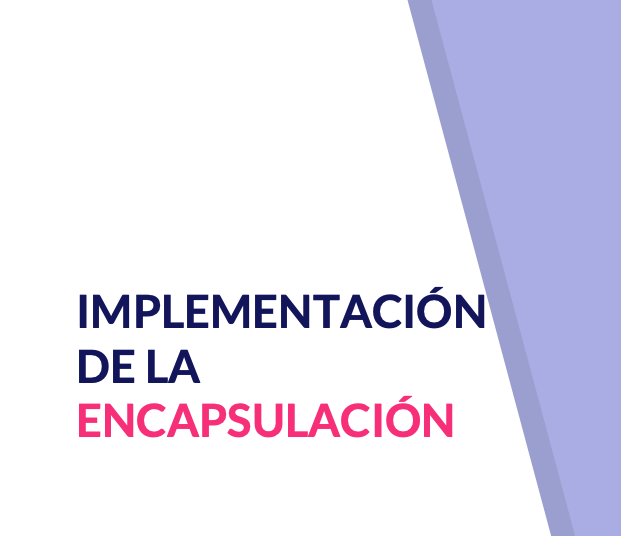
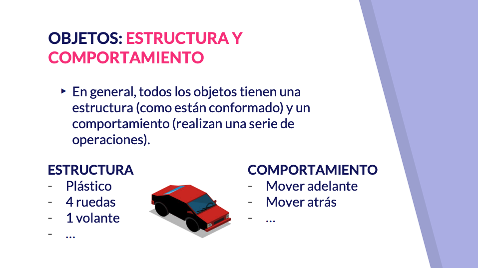

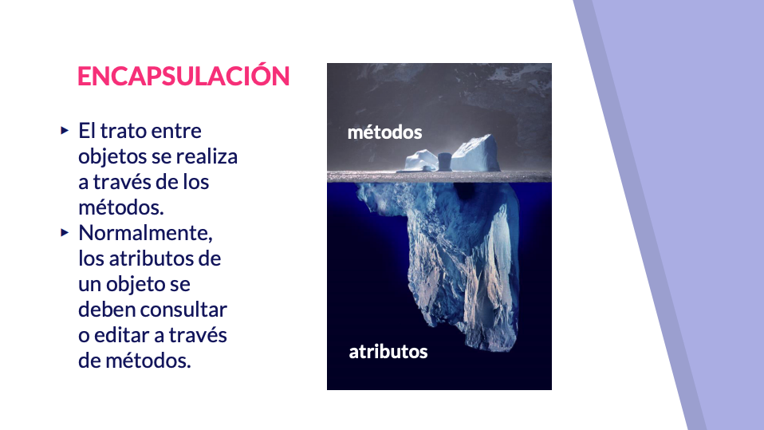
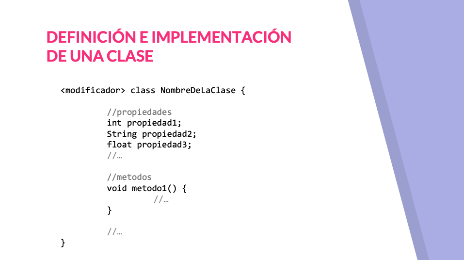
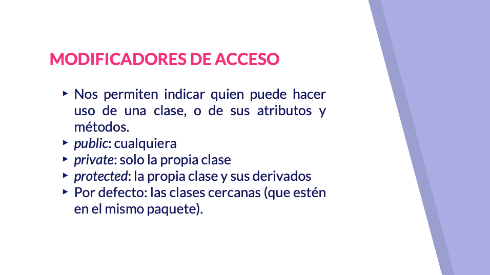
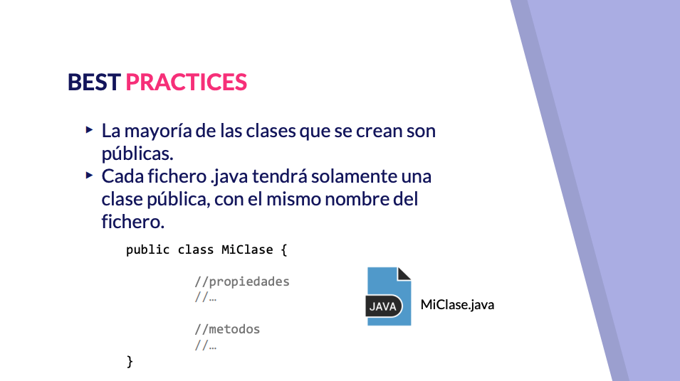
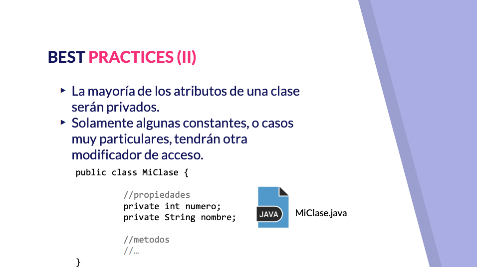
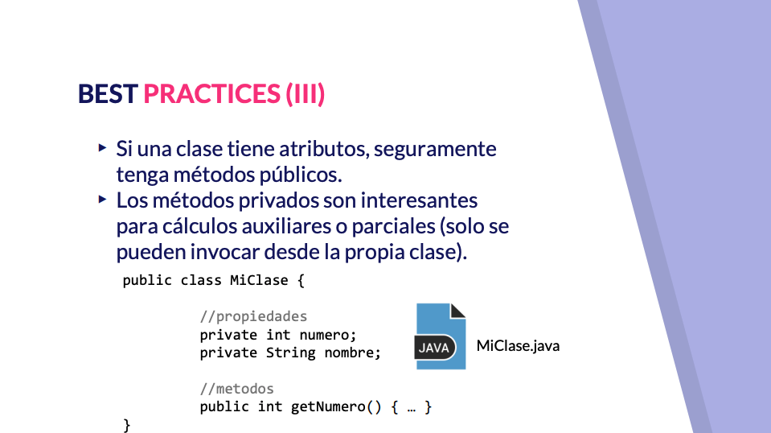
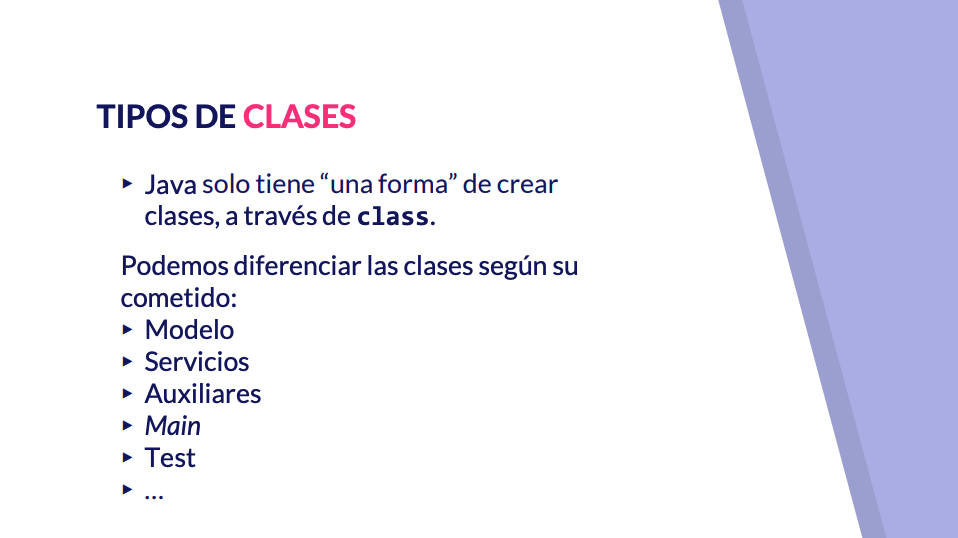
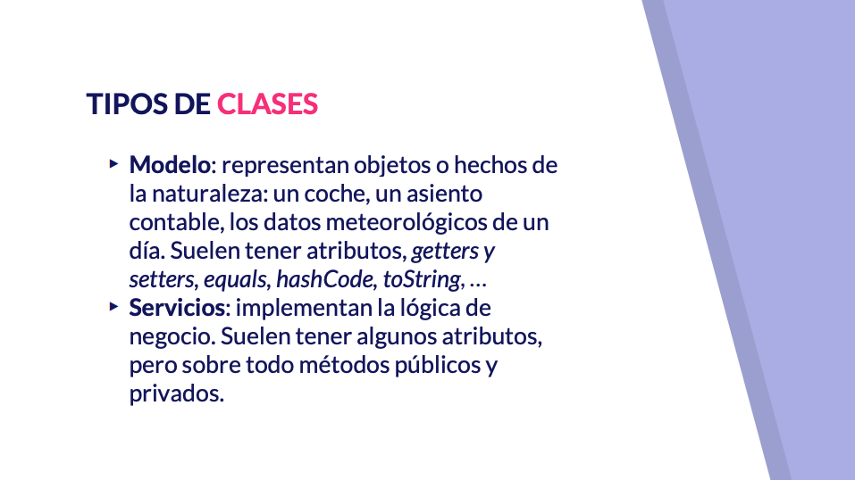
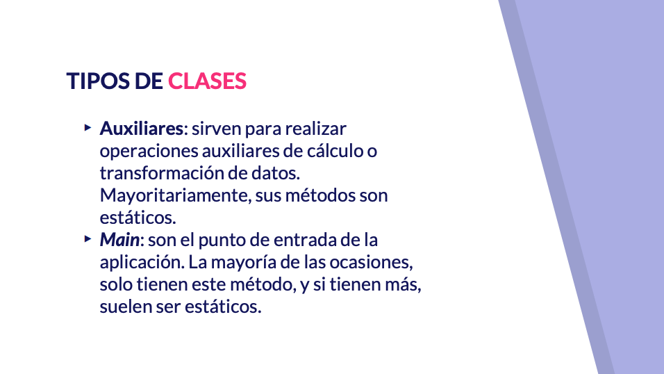
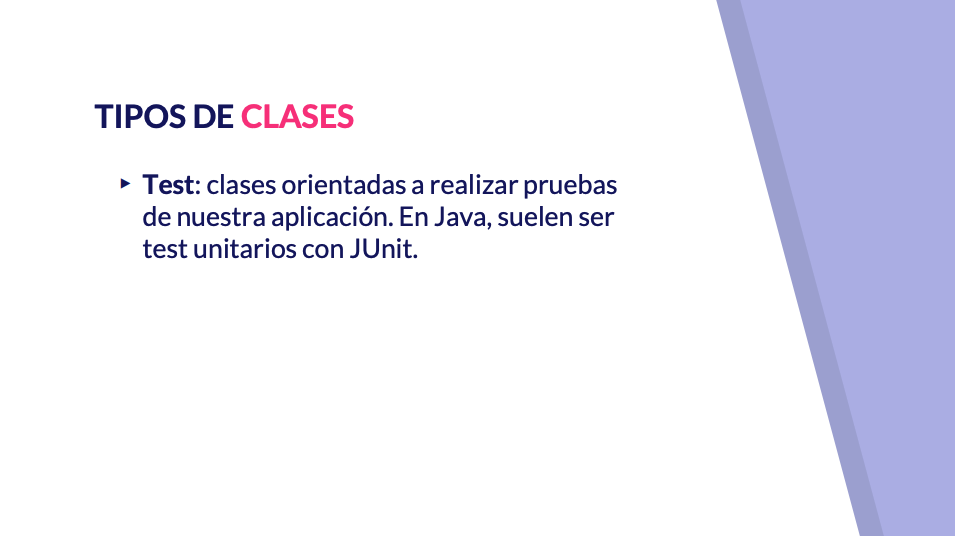

Hola a todos y bienvenidos a este primer vídeo del curso de Java 8 para programadores cada vamos a tratar de aprender a lo largo de este curso algunos elementos más avanzado de nuestro apreciado lenguaje de programación comenzamos en este primer capítulo que aglutinará algunos vídeos sobre el diseño de clase y es el primer vídeo versará sobre lo que hemos llamado la implementación de la encapsulación y dónde también veremos algunos tipos de clases que podemos crear en nada aquellos que vengáis de hacer el curso de Java 8 desde cero sabréis que un objeto está conformado por su estructura y su comportamiento esto es común para cualquier objeto para cualquier tipo de lenguaje de programación la estructura más después viene delimitada por las propiedades de ese objeto y el comportamiento pues por las funcionalidades que es capaz de hacer no aquí en pantalla tenemos un vehículo un coche que bueno siendo como este juguete estaría conformado por una estructura de plástico de material plástico 4 ruedas volante y bueno si un niño no cogía ese juguete sería capaz de moverlo adelante y hacia atrás entre otros posibles movimientos vale esto pues nos diría cómo funciona un objeto como como está caracterizado mejor dicho la encapsulación es un mecanismo mediante el cual los objetos conocen solamente su estructura y no la de los demás empecine un objeto es el quiere se conoce por dentro vale a modo de iceberg fuimos tratado de representarlo un objeto es el que se conoce por dentro y y bueno ofrece al exterior solamente una pequeña parte de lo que sería el objeto en si no dejando oculto una gran parte de el lo normal es que a la hora de implementar la encapsulación en Java el trato entre Egipto se realiza a través de métodos frente a que los atributos normalmente suelen quedar ocultos y no se puede acceder a ellos salvo desde el propio objeto vale con lo cual ETT otro objeto diferente quisiéramos consultar algún tipo de propiedad tendríamos que hacerlo siempre a través de un método de ese objeto vale para todo ello pues se le llama encapsulación y suele ser la manera más habitual de implementarla en Java para implementar una clase en Java bueno pues ya digo eso lo sabe muy bien lo que los que habéis hecho el curso de Java 8 desde cero pues tenemos una estructura que mediante la palabra reservada la con un modificador de acceso delante un nombre de la clase en notación uppercamelcase y encerrado entre llaves tendríamos una serie de propiedades y de metros ya sabéis que entre los diferentes modificadores de acceso tenemos la posibilidad de incluir que los elementos sean públicos es decir que cualquiera podría acceder a este elemento y hacía clase atributos método privado solamente la propia clase iba a utilizar en cualquier contexto sobre todo orientado a las propiedades no solamente la propia clase podría acceder a el protected la propia clase los elementos que tienen el mismo paquete y sus derivados podrían acceder a él y por defecto solamente podrían hacer lo que llamaríamos las clases cerca no las que estén en el mismo paquete aparte de la propiedad algunas buenas prácticas a la hora de crear clase en Java la hora de implementar la encapsulación sería el que la gran mayoría de las clases que nosotros vayamos a crear serán públicas vale cada fichero Java a diferencia de otros lenguajes de programación tendría solamente dentro una clase pública vale con el mismo nombre del chistes de hecho se intenta y hacerlo diferente y USA hay alguna y de como por ejemplo y pensé que estaremos nosotros a lo largo del curso pues se quejará en el sentido de que no está obligando set anticipando a posible error de compilación la unidad el fichero que contiene una clase pública tiene que llamarse tal cual se llama esa que hace pública vale por facilidad otra cosa será dentro del apartado que veremos en la partir del segundo capítulo vale el hecho de que una clase encierre dentro otra pero lo normal es que cada fichero incluye una clase pública otro lenguaje de programación múltiple hola a todos y bienvenidos a este primer vídeo de curso de Java 8 para programador casa vamos a tratar de aprender a lo largo de este curso algunos elementos más avanzado del nuestro apreciado lenguaje de programación por ejemplo Python puesto portal que tengamos múltiples clases un solo módulo otra segunda buena práctica es que la mayoría de los atributos de una clase casi siempre serán privados y solamente serán públicos algunas constantes vale o unos casos muy muy muy particular vale solamente sería en este caso atributos público lo normal es que los atributos de una clase en privado y se han expuesto al exterior a través de unos metros de especiales conocidos como que te lo sé pu2 método que nos ayuden a implementar la lógica de nuestra aplicación si tenemos atributo también deberíamos tener un método para poder interaccionar con ellos y los atributos un privado los métodos deberían ser públicos no los métodos privados son interesantes pero si queremos realizar algún tipo de cálculo auxiliar dentro de la clase separado el otro método pues en ese caso si son interesantes y todos los métodos de una clase fuera en privado y no podríamos interaccionar con ella de ninguna manera la gran mayoría de los métodos de las clases y bueno para diferenciar algunos tipos de clase nominalmente de picamos sintácticamente estaba solamente tiene un tipo de clase no una forma única de crear clase a través de la palabra reservada class no es la única manera que nosotros tenemos de deficiencia sin embargo en función del cometido que vayan a tener las clases conforme vayáis trabajando en diferentes proyectos o algún tipo de patrón de diseño diferentes tipos tener las clases conforme vayáis trabajando en diferentes proyectos o algún tipo de patrón de diseño o ir dando cuenta de que existen diferentes tipos de diferencial una clase que va a representar algún objeto hecho de la naturaleza por ejemplo coche un asiento contable unos datos meteo meteorológicos para un día en particular vale serían las clases que representarían el modelo de nuestro sistema suelen tener atributos privados métodos de tipo que utilicé este método equal to string vale y algún método más si me explicara a una clase concreta que normalmente suelen ser así suelen ser clase muy fácil de implementar porque tan solo con que nosotros definamos los atributos que la conforman sus propiedades pues rézale código que así que no podemos generar por escrito los servicios por contra suelen ser a clases que implementan la lógica de negocios decir lo propio de nuestro sistema si visitáis el curso de Java 8 desde cero en el ejemplo final es igual a implementar la gestión de un parking pues toda la lógica asociada a la gestión de un parking podría ir separadas en un servicio decir que se hace cuando un vehículo tiene que entrar dentro del parking o que é necesario para cobrarle a un cliente o a la hora de salir sería algo propio de un parque eso normalmente se suele intención estar en un servicio suele tener algunos atributos esos servicios pero sobre todo suelen tener menos mal que se han orientado a la ejecución de esa lógica de negocio los métodos perdón las clases auxiliares suelen ser clase que tienen métodos de cálculo de Transformers transformación de datos algunos métodos que eso que no utilidad para nuestra aplicación normalmente serán clases que tendrán métodos estáticos malas y los cuales podremos invocar en cualquier punto de nuestro cuerpo las clases de ti podríamos llamar Meifrén ser el punto de entrada una aplicación son las clases que tendrían que el método ven que es un método especial y qué sirve para comentarle vocación de de normalmente no suelen tener más método o si los tienen suelen ser método estático vale otras clases por ejemplo sería por decir otro tipo último las que acepte son clases especiales que están orientadas a realizar prueba de nuestra aplicación en Java por ejemplo tenemos los trinitarios religiosos pueden realizar con J y otro que conozco son otro tipo de clase con otros métodos específicos que servirían para para que nosotros pudiéramos realizar esos esas pruebas unitarias aquí tenemos algunos ejemplos de los tipos de clase que hemos ido mostrando antes no tendríamos una clase modelo como la clase persona que tendría pues sus atributos privado constructor en vacío con parámetros un metodo getter method of step count equal el metodo ToString como decía son clase las más sencillas de implementar porque con tan solo que nosotros definamos en sacarte aquí en el apartado de sol podemos generar lo que te dicen ser el método factor el método equal string los constructores y algunos métodos mal suelen ser muy tonto las clases servicio cómo es posible que tengan algunos atributos y que suelen tener métodos que sirven para hacer la gestión y la lógica de negocio de nuestro sistema que por ejemplo tendríamos un servicio que sería el que nos permitiría gestionar persona con un método para añadir persona una colección editar los datos de una persona vale y eliminar personas así como obtener todas las personas de esa conexión la utilidad como tenemos aquí serían auxiliares que posiblemente utilizaremos en más de un sitio de nuestra aplicación una de ellas podría ser una clase que nos permitirá verificar sin DNI tiene las letras correctas Valencia un DNI vale el algoritmo que nos muestra que lo he sacado de la wikipedia vale es muy sencillo de implementar ya ya viene implementando Estado para comprobar un array pues ayunar sucesión de letras que se almacenan en un array que tienen un orden específico y lo que se hace es coger los 8 primeros números se dividen entre 23 que el número de letra nos quedamos con el resto y buscamos la posición correspondiente a esta letra y esa es la letra del nene coches de

Pues lo tendríamos que es una clase que es posible que tenga otro método diferente al método menos siempre suele ser método estático aunque ya digo también es muy habitual encontrarnos una clase menos acceso a través de otras clases en brazos de nuestra aplicación así veremos cómo podríamos crear una persona y se adquiere el servicio ni abrirlo y listar todas las personas que tengan ahora mismo el servicio comprobando si su DNI es correcto o no lo es a la persona con su DNI incorrecto vale porque no quería el correspondiente a las letras en la letra al 12345678 bueno pues este vídeo de encapsulación vamos a seguir diseñando nuestras clases y en el siguiente vídeo hablaremos sobre el


# 02 Implementación de herencia con modificadores de acceso y composición 9:55 

[Herencia](pdfs/02_Herencia.pdf)

## Resumen del Profesor

### 2.1 Herencia de clases

Una clase que extiende a otra hereda sus atributos y sus métodos (no constructores). Puede añadir atributos y métodos nuevos. Se trata de una asociación *es-un*, ya que la clase Hija es-un(a) (sub)tipo de la clase Base. Por ejemplo un `Coche` es-un `Vehiculo`, o un `Leon` es-un `Animal`.

Si usamos `protected` en la clase base, tendremos acceso directo a los atributos. En otro caso, tendremos que acceder vía getters/setters. ¡OJO! Los constructores no se heredan aunque sean públicos.

```java
public class Base {

   private String nombre;
   protected String apellidos;

   //...
}

public class Hija extends Base {

   public void metodo() {
      //this.nombre = "Pepe";  //Imposible acceder. Nos da error
      this.setNombre("Pepe"); //Funciona perfectamente
      this.apellidos = "Perez";
   }

   //...
}
```

### 2.2 Herencia de interfaces

También podemos establecer relaciones jerárquicas entre interfaces. Nos regimos por las mismas reglas que en el caso de las clases.

### 2.3 Asociación de composición

Normalmente, cuando representamos la estructura de un sistema, está formado por muchas clases. En este caso, no solamente importan las clases en sí, sino las asociaciones. Una de ellas es la composición. En UML, se representan de una forma especial.

Diagrama de clases


Dentro de la clase Todo tendremos una referencia a la clase Parte. También es posible que la multiplicidad nos indique que debemos tener una colección (`Provincia` y `Municipio`). Normalmente hay dependencia de existencia entre la parte y el todo.


## Transcripción


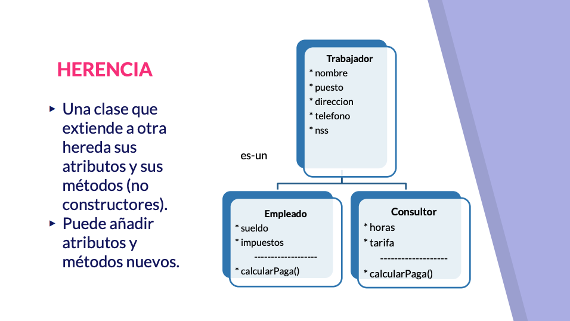
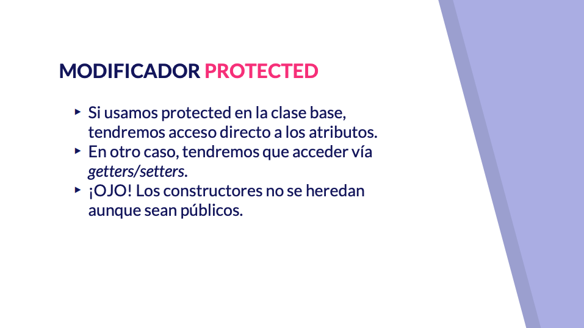

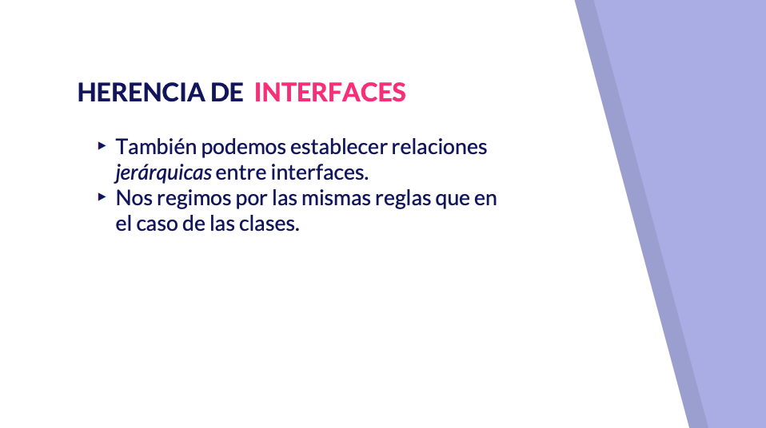

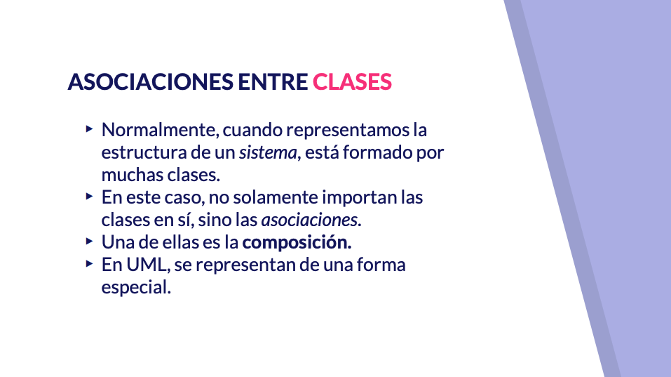
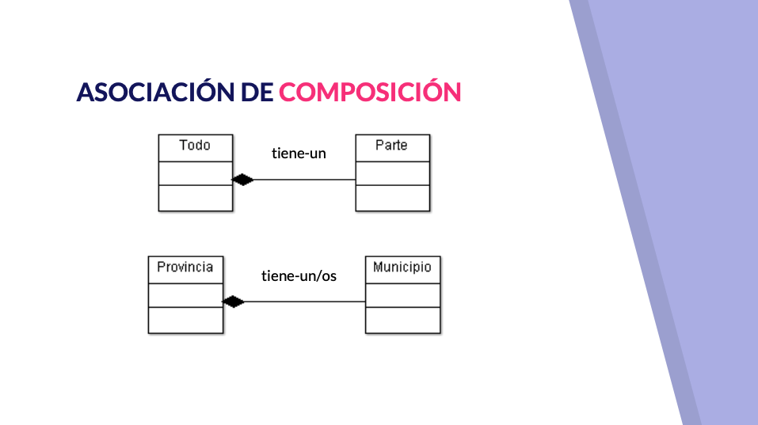
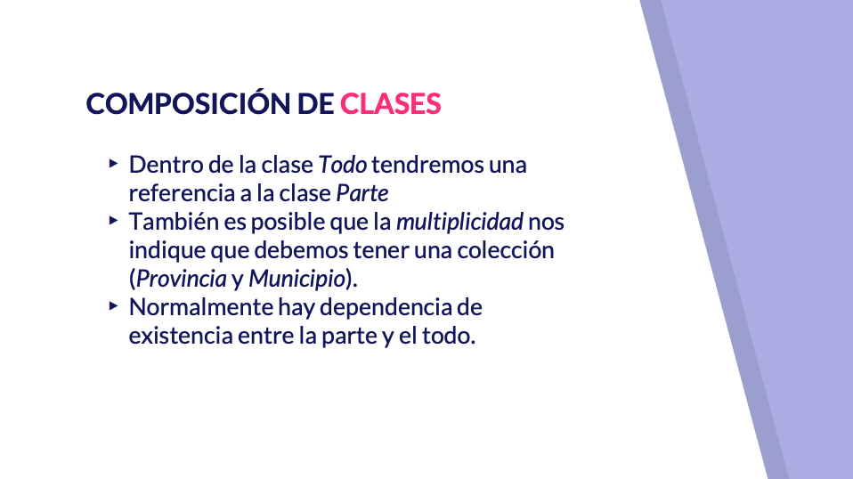

# 03 Polimorfismo 10:37 

[Polimorfismo](pdfs/03_Polimorfismo.pdf)

## Resumen del Profesor

### 3.1 Polimorfismo

Java nos permite crear instancias de objetos, pero que estos sean referenciados por alguna de sus clases *ancestro* o alguno de los interfaces que implementa:

```java
Rectangulo r = new Cuadrado();
```

También permite la ocultación o sobreescritura de métodos por parte de las clases derivadas.

¿Qué sucede en caso de el uso de referencias de clase base, pero instanciación de objetos derivados? Java escoge, en tiempo de ejecución, el tipo de objeto. Si ese tipo ha ocultado un método de la superclase, llama a la concreción. En otro caso, llama al método de la clase base.

```java
Cuadrado [lado=5.39897]
Area de un cuadrado
Perimetro de un cuadrado
Area de la figura: 10,797940 | Perímetro de la figura: 21,595881

Rectangulo [base=10.55045, altura=0.6183386]
Area de un rectángulo
Perímetro de un rectángulo
Area de la figura: 6,523750 | Perímetro de la figura: 22,337578
```

Esto también sucede cuando una clase implementa una interfaz que forma parte de una jerarquía de herencia:

```java
ClaseQueImplementaInterfaz c1 = new ClaseQueImplementaInterfaz();
c1.saludar("Hola Mundo");

Hija c2 = new ClaseQueImplementaInterfaz();
c2.saludar("Hola Mundo, otra vez");

Base c3 = new ClaseQueImplementaInterfaz();
c3.saludar("Hola Mundo, por tercera vez");
```

## Transcripción


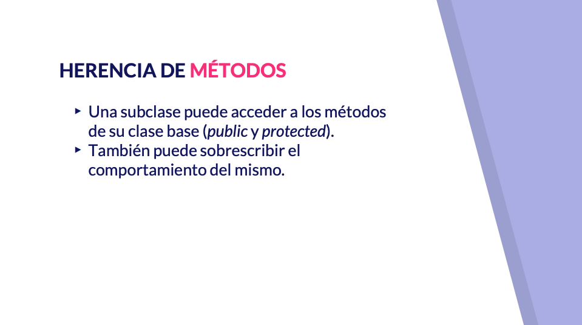
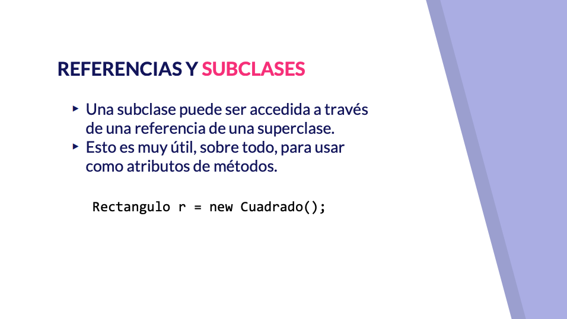
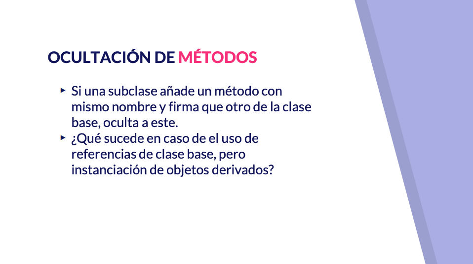
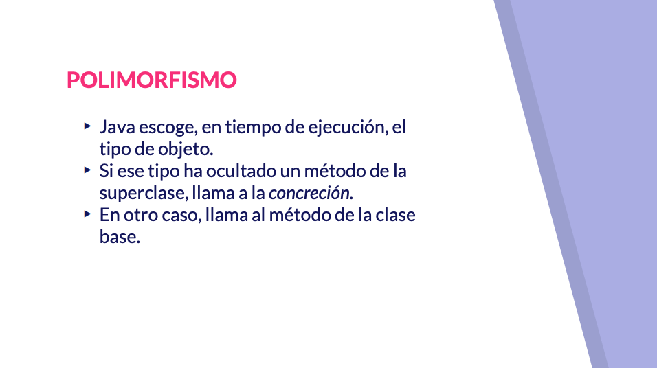
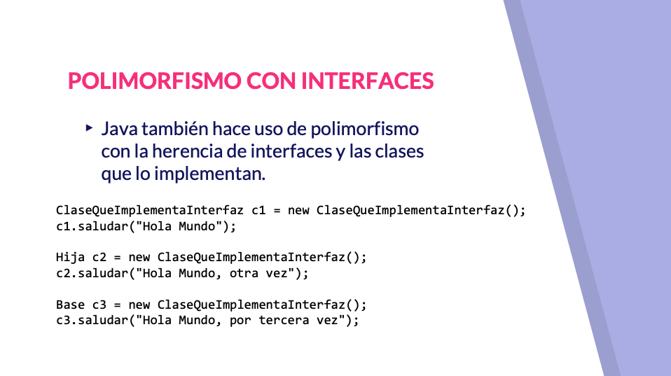

# 04 Sobreescribir los métodos hashcode, equals y to string de la clase object 14:34 

[Sobreescribir los métodos hashcode, equals y to string de la clase object](pdfs/04_Equals_hashCode_y_toString.pdf)

## Resumen del Profesor

### 4.1 Herencia de `Object`

Todo objeto, de forma directa o indirecta hereda de `Object`. Esta clase tiene una serie de métodos, entre los que destacan:

* `equals`: nos permite indicar cuando dos objetos son iguales

* `hashCode`: nos devuelve un número “único” asociado a una instancia de una clase

* `toString`: nos devuelve una reperesentación del objeto como una cadena de caracteres.

### 4.2 Sobrescritura de `equals`

Con tipos primitivos, hemos usado el operador ==. ¿Qué sucede con los objetos? Primero tenemos que definir cuando dos instancias de un objeto son iguales o diferentes.

El método `equals` nos permite devolver un boolean indicando si un objeto es igual a otro. Nuestro IDE lo autogenera, junto con `hashCode`. La representación actual es muy verbosa y no aprovecha las capacidades de Java 7. La actualización está en desarrollo.

### 4.3 Sobrescritura de `hashCode`

Devuelve un número asociado a la clase. Sirve como posición de memoria en hexadecimal. Por definición, si dos objetos son iguales (equals), su *hash code* también debe serlo. Si sobrescribimos el método equals, también tenemos que sobrescribir hashCode para que se cumpla esa propiedad.

### 4.4 Sobrescritura de toString

Devuelve una representación en `String` del objeto. Por defecto, devuelve el tipo (la clase) y su `hashCode`. Lo podemos sobrescribir para que represente los valores. Dos objetos iguales deben tener la misma representación.

## Transcripción

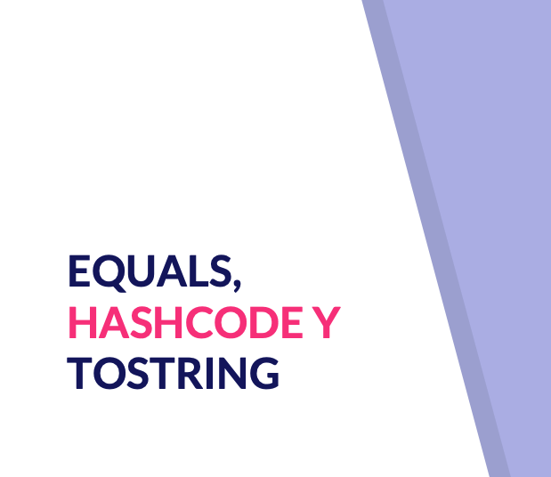
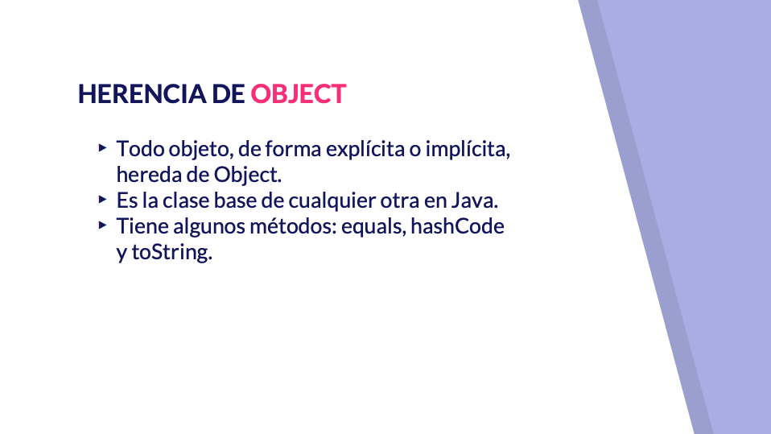
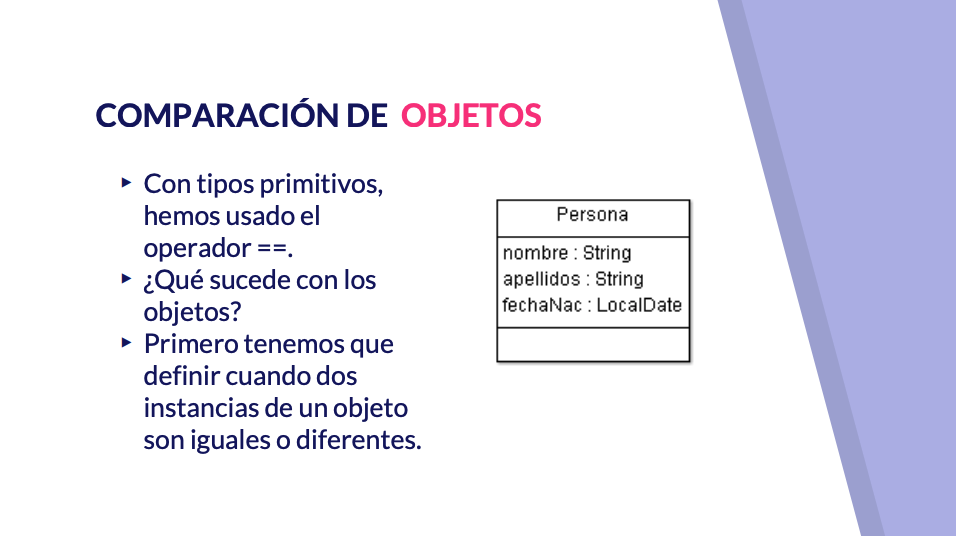
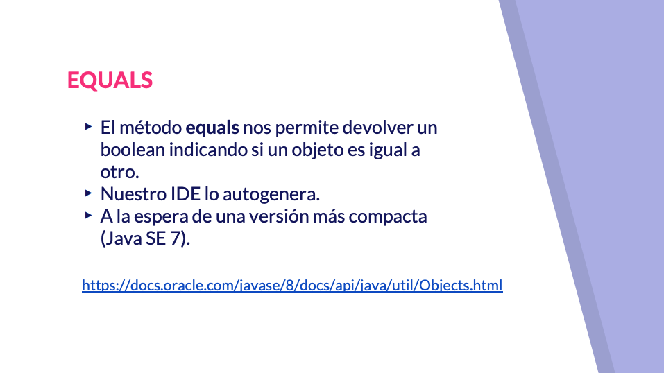
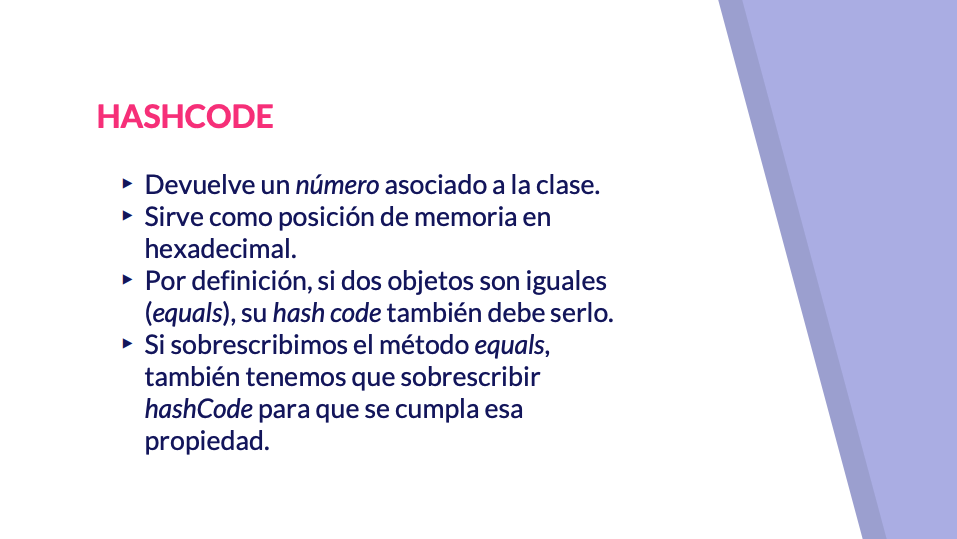
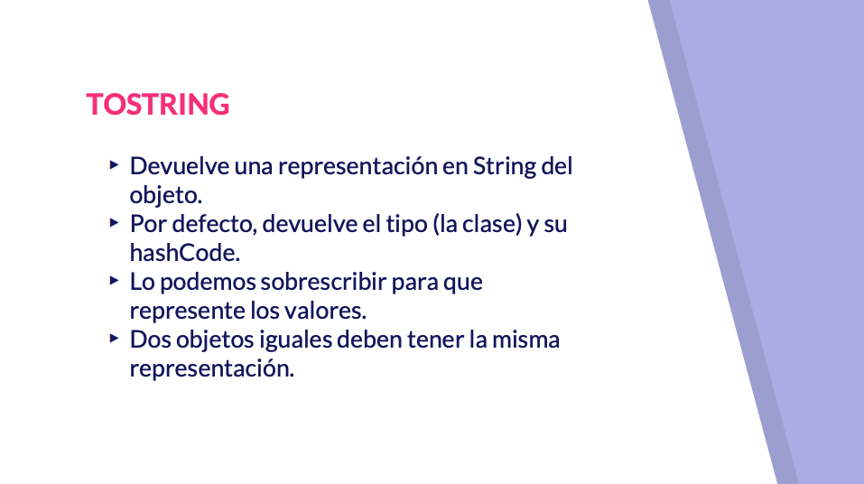

# 05 Uso del ámbito static para variables, métodos y clases 9:30 

[Uso del ámbito static para variables, métodos y clases](pdfs/05_Uso_de_static.pdf)

## Resumen del Profesor

### 5.1 Atributos de objeto y de clase

Java nos permite crear cuantos objetos queramos de una misma clase. Estos objetos tienen una copia propia de los atributos. Sin embargo, en ocasiones, puede interesarnos tener un atributo común a todos los objetos. Estos son los atributos `static`.

Están asociados a la clase, y compartidos para todas las instancias. Pueden ser manipulados por cualquier objeto, o incluso sin crear una instancia de esa clase.

### 5.2 Métodos estáticos

Se rigen por los mismos principios de los atributos estáticos. Para invocar:

```java
Clase.metodoEstatico(...);
```

Podemos acceder a una variable estática desde un contexto estático o no estático. También podemos crear métodos estáticos como métodos de operaciones auxiliares (recordemos todos los métodos de la clase `java.util.Arrays`).

### 5.3 Constantes

Se pueden definir como `static`.

```java
static final PI = 3.141592653589793;
```

### 5.4 Clases estáticas

Este tipo de clases solamente tienen sentido cuando trabajemos con clases internas (lo haremos en capítulos posteriores). Nos permiten, entre otras cosas, agrupar código, definiendo clases que tendrán solo sentido si están envueltas por otra.

Para crear una instancia de la clase interna, si esta es estática, no necesitamos una instancia de la clase externa:

```java
public class EjemploClaseStatic {

   /**
    * @param args
    */
   public static void main(String[] args) {

      Persona p = new Persona("Pepe");        
      System.out.println(p);

   }

   public static class Persona {
       //...
   }        

   public class OtroEjemplo {

      /**
       * @param args
       */
      public static void main(String[] args) {

         EjemploClaseStatic.Persona p = new EjemploClaseStatic.Persona("Pepe");        
         System.out.println(p);

      }
   }

}
```

## Transcripción


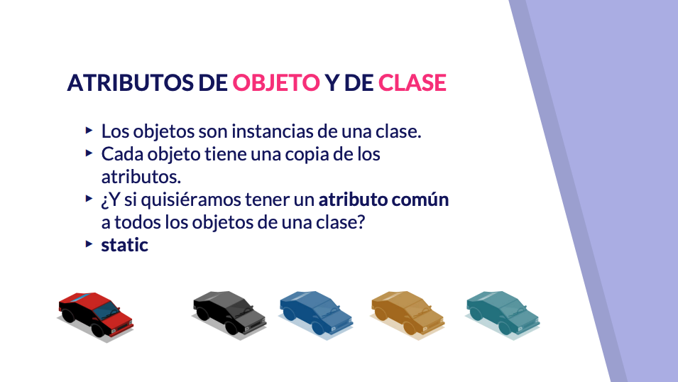
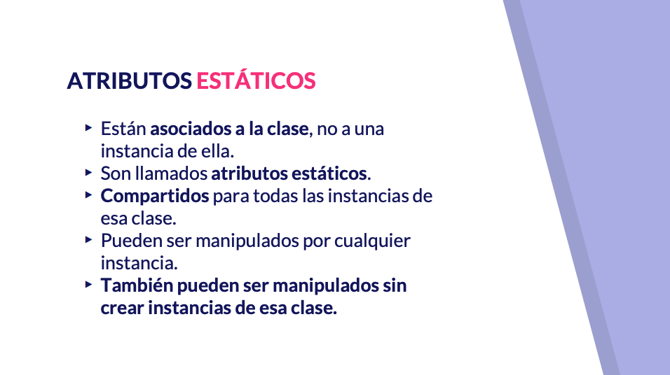
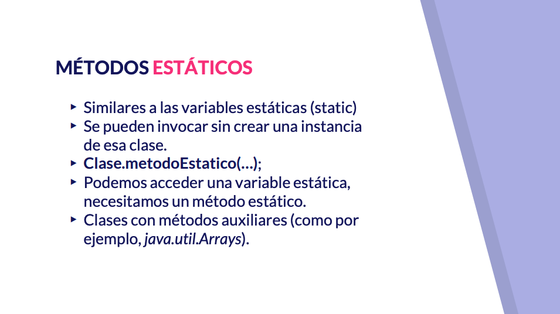
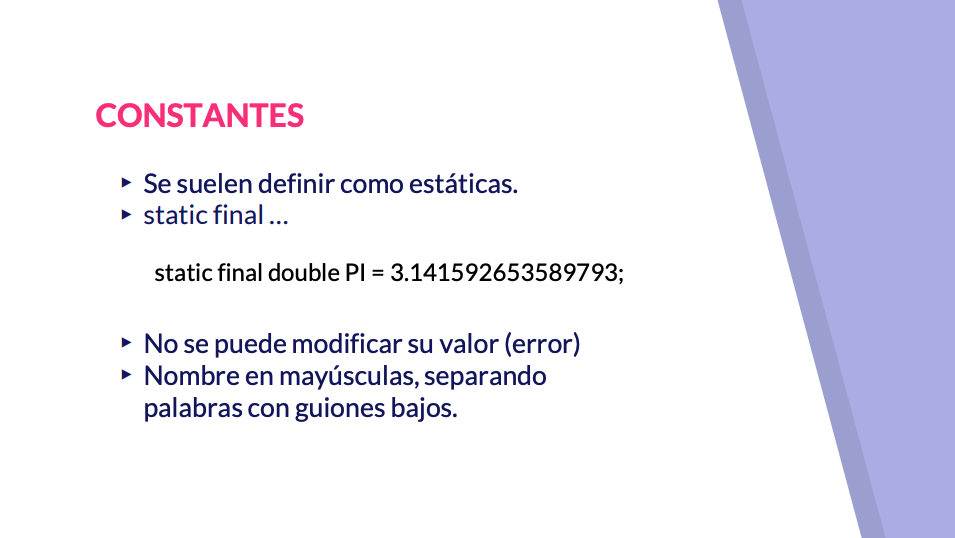
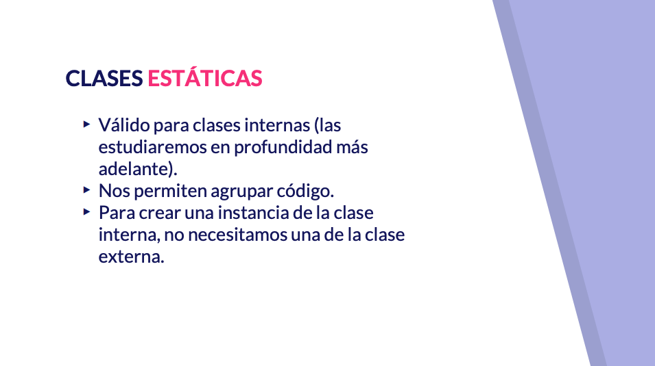

# 06 Clases singleton y clases de inmutables 9:09 

[Clases singleton y clases de inmutables](pdfs/06_Singleton_e_inmutables.pdf)


## Resumen del Profesor

### 6.1 Singleton

*Singleton* es uno de los patrones de diseño propuesto por *Gang of Four*(GOF), y sirve para poder tener una clase de la cual solamente querremos tener una instancia (manejadores, servicios, …).

Para implementarla, podemos seguir los siguientes pasos:

1. Definir un único constructor, como privado, para evitar instanciaciones innecesarias.
2. Obtener siempre la instancia a través de un método estático.

```java
public class MiServicioSingleton {

   //Una instancia del objeto que va a existir
   private static MiServicioSingleton instance = null;

   //Evitamos así la instanciación directa
   private MiServicioSingleton() {    }

   public static MiServicioSingleton getInstance() {
      if (instance == null)
         instance = new MiServicioSingleton();

         return instance;
   }


}
```

### 6.2 Objetos inmutables

Son objetos cuyo estado no puede ser modificado una vez se haya inicializado. No son constantes ya que estas se definen en tiempo de compilación, y los inmutables en tiempo de ejecución. Un ejemplo de clase inmutable que ya hemos utilizado es `String`.

Algunas recomendaciones para crear objetos inmutables:

1. Definir todas las propiedades como `final private`
2. No añadir métodos *setter*
3. Evitar que existiendan la clase, añadiendole el modificador `final a la definición.

## Transcripción

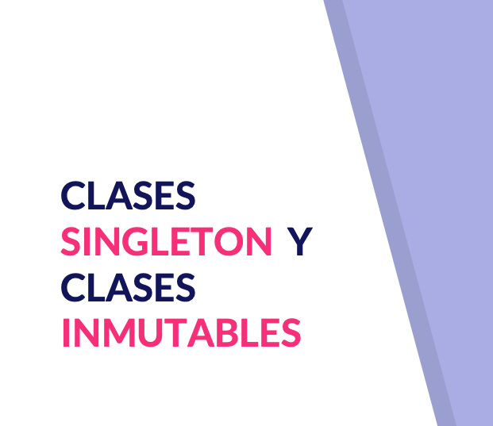

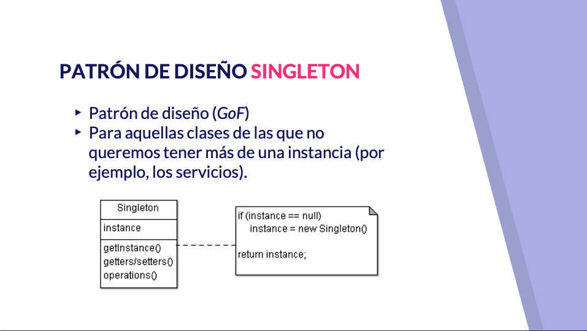

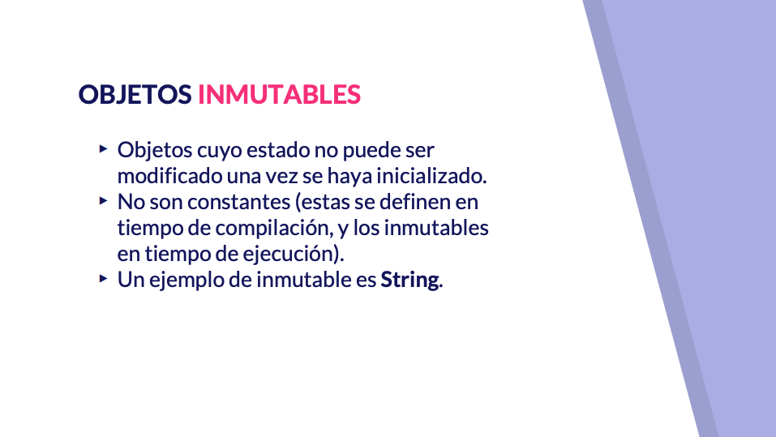
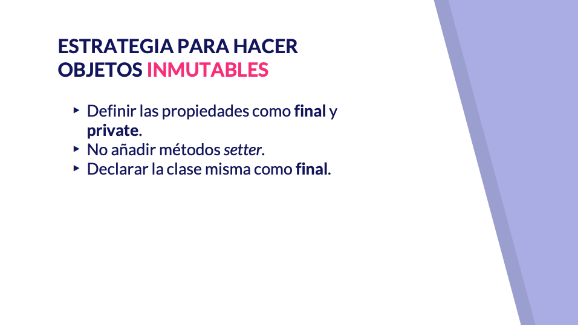

## Contenido adicional 10   

[Presentación](pdfs/Presentación.pdf)

[Implementación de la encapsulación](pdfs/01_Implementación_de_la_encapsulación.pdf)

[Herencia](pdfs/02_Herencia.pdf)

[Polimorfismo](pdfs/03_Polimorfismo.pdf)

[Sobreescribir los métodos hashcode, equals y to string de la clase object](pdfs/04_Equals_hashCode_y_toString.pdf)

[Uso del ámbito static para variables, métodos y clases](pdfs/05_Uso_de_static.pdf)

[Clases singleton y clases de inmutables](pdfs/06_Singleton_e_inmutables.pdf)
