# 2. Diseño avanzado de clases 43m

   * 07 Clases y métodos abstractos 9:13 
   * 08 Código que usa final 7:22 
   * 09 Clases internas, locales y anónimas 19:25 
   * 10 Uso de enumeraciones 7:18 
   * Contenido adicional  4
   
# 07 Clases y métodos abstractos 9:13 

[Clases y métodos abstractos](pdfs/07_Clases_y_métodos_abstractos.pdf)

## Resumen del Profesor

### 7.1 `Abstract`

Es una palabra reservada, que puede usarse a nivel de método o de clase. Sirve para indicar la obligación de implementar un método o de extender una clase completa.

### 7.2 A nivel de clase

Son clases que no se pueden instanciar. Puede tener métodos con implementación y atributos, y también métodos abstractos.

```java
public abstract class ObjectoGrafico implements Transformable {

   protected int x, y;

   public void moverA(int nuevaX, int nuevaY) {
      this.x = nuevaX;
      this.y = nuevaY;
   }

   abstract public void dibujar();

   abstract public void cambiarTamanio(int factorAumento);

}
```

### 7.3 A nivel de método

Los métodos definidos como `abstract` deben estar en una clase abstracta. Definen la firma del método, pero sin implementación. Sus subclases se comprometen a implementarlo. Si no lo hacen, también deben ser abstractas. Pueden convivir con métodos normales.

### 7.4 Clases abstractas que implementan interfaces

Una clase que implementa una interfaz tiene obligación de implementar todos sus métodos. Sin embargo, una clase `abstract` puede dejar métodos sin implementación, obligando a quienes la extiendan a hacerlo.

```java
public interface Transformable {

   public void rotar();
   public void voltearHorizontal();
   public void voltearVertical();
}

public abstract class ObjectoGrafico implements Transformable {

   protected int x, y;

   public void moverA(int nuevaX, int nuevaY) {
      this.x = nuevaX;
      this.y = nuevaY;
   }

   abstract public void dibujar();

   abstract public void cambiarTamanio(int factorAumento);

}
```

## Transcripción


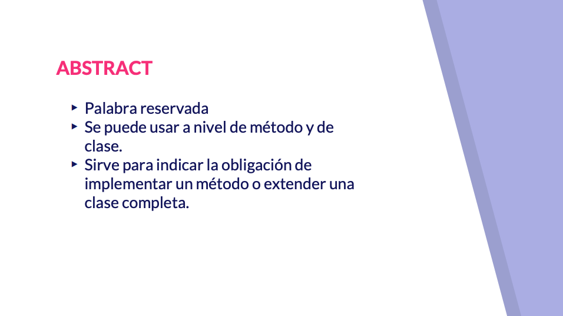
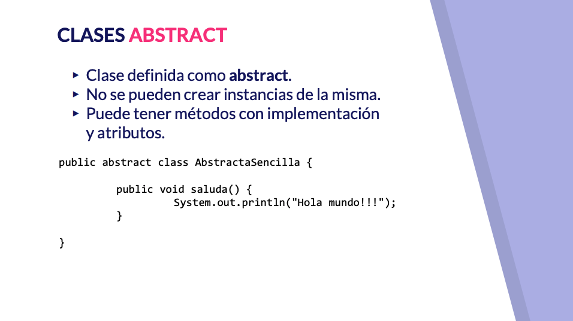
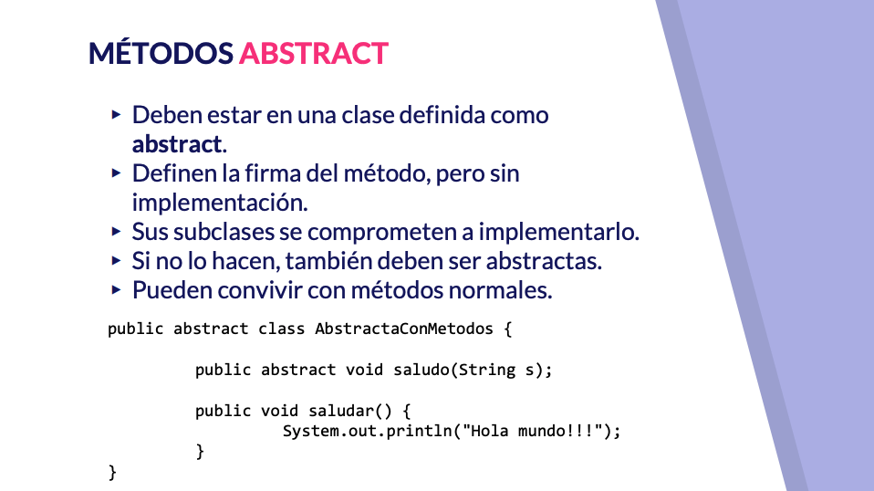
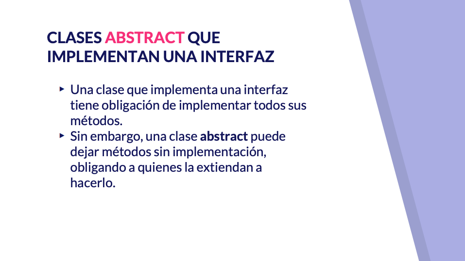

Hola todo vamos a comenzar el segundo bloque de este curso en el que haremos un diseño avanzado de clase y en este vídeo vamos a comenzar con clases y métodos abstractos hamster es una palabra reservada dejaba que podemos utilizar a nivel de método y a nivel de clase y sirve para indicarnos la obligación que tenemos de implementar un método o de tender una clase completa vamos a hablar primero de abstracta nivel de clase y después a nivel de metros a nivel de clase una clase abstracta es una clase que ya digo que utiliza la palabra reservada abstract en su definición como tenemos en el ejemplo de está transparente no iría siempre después de publi y antes de la palabra reservada class una clase abstracta tiene como característica principal que no se puede instancia es decir si tratamos de crear una instancia de esta clase veríamos como tendríamos un error en tiempo de compilación o bueno si utilizamos unidades como eclipse directamente nos va a dar nota indicar el error incluso antes de compra una clase abstracta sirve para tener dentro atributos y métodos con una implementación y también la posibilidad de tener otro tipo de métodos que vamos a ver a continuación qué son los métodos abstractos por ejemplo así tendríamos una clase abstracta sencilla una clase abstracta sirve bueno fue como base para ser extendida y terminar de matizar pero para aglutinar determinado elementos comunes en una jerarquía de herencia los métodos definidos como abstracto obligatoriamente estarán en una clase definida como Astra no podríamos tener un método abstracto en una clase que no fuera abstracta define la firma del método tal como se suele hacer en una interfaz pero no tiene ni planeta una clase que tienda a otra que tiene métodos abstractos se compromete a darle una implementación a esos negros en caso de no querer hacerlo lo que tenemos que hacer es definir esa clase extendida también como abstracta sería la única manera que tendríamos de no dar implementación a esos metros método abstracto y método podríamos llevar normales pueden convivir de la misma manera por ejemplo una clase abstracta que tiene métodos con implementación también tiene métodos abstractos por último por meter un elemento más dentro de la coctelera podemos hablar de clase abstract clase abstracta e implementa una interfaz como sabéis la interfaz a era contratos a los cuales nosotros nos comprometimos a la hora de darle implementación la manera de comprometernos es que nos métodos que se definen de forma abstracta la interfaz nosotros los tenemos que estar una clase que implementa una interfaz tiene la obligación de implementar todos objetos estudia no sabemos desde el curso de Java 8 desde cero sin embargo se nos puede dar el caso en particular con las clases abstractas de que una clase abstracta no de la implementación de algunos de los métodos de la interfaz que está implementando lo único que está haciendo es de legal en la clase que heredé de ella en dar implementación a esos momentos veamos algunos ejemplos por un lado tendríamos por aquí la clase objeto gráfico ballet que vendría de limitada en principio por X6 y bueno una serie de métodos con implementación vale en este caso lo verá y otro sin implementación cómo dibujar y cambiar tamaño decir un objeto gráfico como mínimo va a tener las coordenadas de un punto en el plano y bueno dependiendo de qué tipo de objeto gráfico sea para cambiar su tamaño tendríamos que hacer una u otra operación y para dibujarlos pues también sería diferente un ejemplo concreto de objeto gráfico podría hacer un círculo un círculo además del punto que indicaría el centro del círculo tendría un rabino bueno a la hora de construir lo tendríamos que tener en cuenta que bueno al extender de objeto gráfico tenemos que darle valor a estas propiedades en este caso la hemos definido por ilustrar un poco nos protected podríamos Hola todo va a comenzar el segundo bloque de curso en el queremos un diseño bajado de clase vamos a comenzar con que se inventó los atrasos traes una palabra reservado dejaba que podemos utilizar a nivel de metro y ya nivel de clan


Por ilustrar un poco como protected vale y podríamos Béjar la implementación de Movera abstracta o sobrescribir la en este caso la vamos a dejar abstracta perdón la de la clase abstracta decir ya venía a quién preguntar y solamente nos tenemos que obligar a darle cuerpo a estos dos métodos abstractos vale pues no son dibujar círculos sola vale y cambiar el tamaño con un momento único que cenaríamos sería aumentar con ese factor de aumento el radio de vale de manera que bueno nos damos cuenta en primera como primer paso que no podemos crear una instancia de un objeto gráfico puesto que está definido como abstracto ya no lo va indicando eclipse vale no podríamos crearlo de hecho si os dais cuenta eclipse nos va dando pequeñas pista y si miráis bien aquí en el vídeo quizá no lo aprecia y se va a acercar y en vuestro ordenador al ser una clase abstracta la añade ahí en la esquinita una para invitarlo vale por entrar un poco más podríamos dejar la en tentación de mover a atrás tanto Bretón , vamos a ver el ejemplo de un círculo que inicialmente se pone en el en las coordenadas 11 con un radio 7 le cambiamos el tamaño aumentándolo al doble lo movemos al punto 33 y lo volvemos a dibujar y podemos comprobar como sus radios sería 14 y estaría en el punto 13 y bueno podríamos ver cómo podemos dibujar vale un objeto desde perdón un círculo desde el objeto gráfico vale no podríamos hacer desde aquí sin dificultad no hay aquí se vuelven primer por segunda vez por otro lado tenemos la clase círculo que tiende a objeto gráfico vale pero ahora lo que hemos hecho ha sido añadida objeto gráfico la implementación de transformable vale transformable en una interfaz que nos va a permitir implementar métodos de transformación de un objeto gráfico como es rotarlo vale aquí bueno pues estaríamos implementación genérica derrotar en indicar el número de grado voltearlo horizontalmente o verticalmente cómo podemos comprobar objeto gráfico implementa transformable pero por el hecho de ser una clase abstracta no no está obligando a que le demos cuerpo a la implementación y puntualmente quitáramos de aquí esto veríamos como nos obligaría añadir los métodos no implementados de transformable sin embargo por el hecho de ser una clase abstracta permite que eso se delegue en la clase en este caso círculo que tiene de objeto gráfico y que podemos comprobar que bueno me podríamos dar aquí la implementación de hecho la implementación de la rotación del volteado horizontal o vertical de un círculo sería en Bastia porque bueno aunque un círculo se puede rotar y los rotamos un número de grado se va a quedar igual y lo mismo nos pasaría si hacemos un volteo horizontal o vertical del mismo es decir que se quedarían las figuras iguales pero si es un tenemos la obligación de a qué objeto gráfico implementa transformable de dar una implementación a a esta a estos métodos por el hecho de que es objeto gráfico no estaba obligado a darse lados implementará este internado con esto terminamos el capítulo de las clases abstractas vídeo de clase y método abstracto y nos lanzamos hacia el código que usa falta


# 08 Código que usa final 7:22 

[Código que usa final](pdfs/08_Código_que_usa_final.pdf)

## Resumen del Profesor

### 8.1 Modificador final

Se puede utilizar en diferentes contextos:

* Clases `final`
* Métodos `final`
* Variables `final`

En todos los casos, indica que de una u otra forma, el ámbito sobre el que aplica no podrá ser modificado.

### 8.2 Clases `final`

### 8.2 Clases final
Son clases que **no se pueden extender**. En una jerarquía de herencia, son el último *nodo*. Se pueden instanciar y tratar con normalidad.

### 8.3 Métodos `final`

Se definen en clases susceptibles de ser extendidas. Nos permiten indicar que un método no se va a poder sobrescribir. En la clase extendida habrá que usar, obligatoriamente, la implementación de la clase base.

### 8.4 Variables `final`
Basicamente indican que aquella variable a la que afectan no se puede modificar. Podemos diferenciar entre:

* Tipos primitivos: serán valores inmodificables, constantes. Suele usarse junto con `static`.

* Objetos: si declaramos una **referencia** como `final`, estamos diciendo que esa referencia no podrá asignarse a otro objeto. Sin embargo sí que podemos modificar el estado del objeto con sus propios métodos. Lo mismo sucedería en el caso de arrays.

## Transcripción


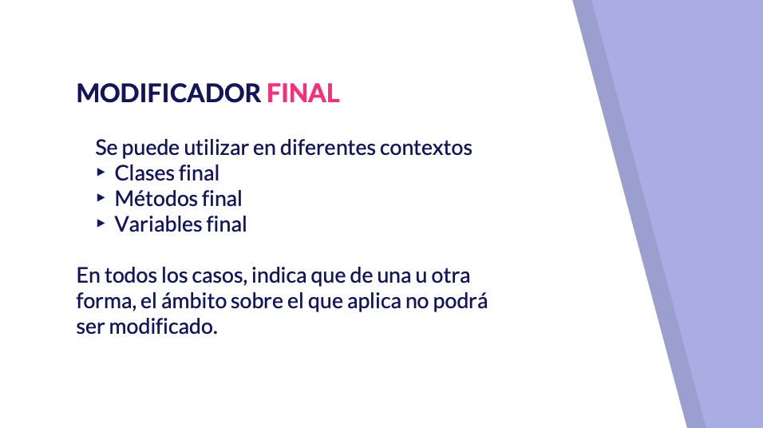
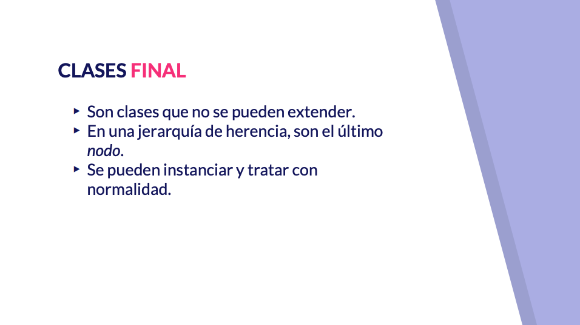
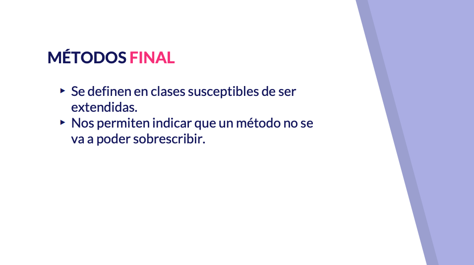
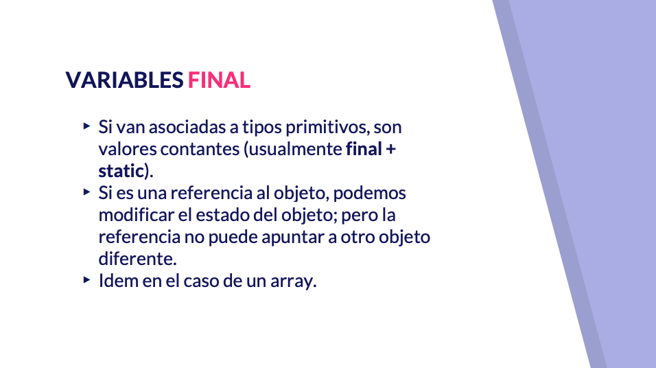

Vamos a continuar en este segundo bloque de diseño avanzado de clases hablando de código que utiliza faena que usar el modificador final se puede aplicar como ya hemos ido viendo en algunos contextos por ejemplo podemos utilizar contesta por ejemplo podemos utilizar a nivel de clase para definir clase find podemos usarlo en método o también podemos usarlo en variable en uno u otro contexto final indicará que el ámbito sobre el que se aplican no puede ser modificado o bien que no puede ser extendido por ejemplo las clases final dentro de un árbol de herencia serían las hojas del árbol es decir son el último nodo es decir clase que no pueden ser extendidas es decir son clases que se pueden instanciar tratar con normalidad pero de las cuales no podríamos extender lo hemos usado por ejemplo en el contexto de la creación de una clase mudanza encontra vamos a diferencia de clase no tratáramos de aplicar al contexto de método podríamos definir una clase normal que tuviera un método final son clases que pueden ser extendidas pero el método que tuviera el modificador final no podría ser sobre escrito vale no podemos darle otra implementación a este a este método si tenemos una clase que tiene una estructura que bueno podemos exponer pero algún apartado no queremos que se ha modificado lo podríamos hacer su modificación en la clase base a través de métodos final sí bueno de esa manera no permitiríamos que eso se modificará ver ninguna tarea variables final la hemos visto en diferentes contextos no para tipos primitivos mediante static final hemos decidido constante vale ya lo venimos haciendo en varios vídeos si se trata de una referencia a un objeto tengamos presente que lo que no podríamos modificar en la referencia vale si podríamos modificar el estado del objeto a través de sus métodos GET espero no podríamos asignar esa referencia otro objeto distinto lo mismo que pasa con los gestos pasaría en el caso de los arrays vamos a ver ejemplo de código que utiliza faena por ejemplo vale clases finales bueno pues podríamos ver cómo la clase rectángulo vale que es una te hace francamente normal vale la clase cuadrado vale la tenemos por aquí vamos como final qué quiere decir esta clase ya no va a poder ser encendida de hecho si tratamos de comentar este Código podríamos ver cómo se nos va a quejar Eclipse y nos va a decir que si queremos extender cuadrado deberíamos eliminar el modificador final de su definición en el caso de métodos final vale podríamos tener aquí otras teclas en otras plantaciones de cuadrado rectángulo vale 100 rectángulo definimos el método que está área y el perímetro como un método farmear vale en este caso por ejemplo solamente el método que tarea podríamos ver que la clase cuadrado extiende a un rectángulo podría cambiar la implementación incluso del método que el perímetro vale pero si quisiéramos modificar el método que tarea nos encontraríamos con que deberíamos eliminar el modificador del método correspondiente en rectángulos no no está permitiendo sería un error en tiempo de compilación a nivel de variable vale podríamos comprobar como tenemos aquí una clase persona que tiene constante de tipo char final vale static final suele ser lo más habitual como podríamos tener pues todo lo asociado a una persona su constructor sujete su setter el método to string y bueno y queremos implementar una referencia final podríamos ver le podemos cambiar el nombre de Pepe a José y el cambio se va a hacer lo que realmente no podríamos hacer sería modificar esta referencia vale asociando le otro objeto diferente tendríamos que quitar el modificador el modificador final con el caso de los arrays tendríamos algo parecido si creamos un array como final final podríamos modificar los elementos que conforman este Ray pero no podríamos asignarle al array otro array diferente vale si podemos asociar pedos por ejemplo otra referencia asignarle el valor de la referencia de peques final y al no ser esta referencia final pues si no podríamos hacer una nota objeto diferente y hacer las modificaciones correspondientes vale por último podemos ver también cómo podríamos usar final asociada objetos a la hora de definir los argumentos que recibe un método podríamos indicar que el método con parámetros final va a recibir una persona esa persona que reciba desde fuera no tiene porqué ser final pero cuando se reciba que hice referencia se transformara en final con lo cual nosotros no podríamos modificar la referencia asignándole otro valor vale si podríamos hacer las modificaciones oportuna del estado de ese objeto vale si imprimimos el resultado el programa veríamos cómo crear una persona le cambiamos el nombre a José vale aquí te ingreso con Pepe y aquí con José vale que creamos otra referencia que apunta el mismo objeto y imprimimos lo estamos imprimiendo y aquí estamos creando el otro objeto distinto en la referencia que al final y le está dando su valor sus valores correspondientes vale conecto terminaríamos el vídeo del código que usa final en el siguiente vídeo vamos a hablar de clase se crean dentro de otra


# 09 Clases internas, locales y anónimas 19:25 

[Clases internas, locales y anónimas](pdfs/09_Clases_internas_locales_y_anónimas.pdf)

## Resumen del Profesor

### 9.1 Clases dentro de otras clases

Java permite definir clases dentro de otras clases. A estas clases se le llaman anidadas. Pueden ser de dos tipos, estáticas o no estáticas. No se trata de composición de clases, sino anidamiento. En algunos casos, pueden acceder a los atributos de la clase que le envuelve.

Las razones para su uso son varias:

* Agrupamiento lógico de clases que se utilizan en un solo lugar. Por tanto hay mayor cohesión.
* Aumento de la encapsulación.
* Código más legible y fácil de mantener.

### 9.2 Clases internas

Se llaman así a las clases anidadas no estáticas. Solo pueden existir en el marco de una instancia de la clase externa. Pueden acceder a sus miembros (de la clase externa).

Si definimos una variable miembro en la clase interna, con el mismo nombre otra de la clase externa, la interna oculta a la externa. A esto se le llama *shadowing*

### 9.3 Clases locales

Son clases que se definen dentro de un bloque, normalmente el cuerpo de un método. Sirven para afinar aun más la cohesión del código.

### 9.4 Clases anónimas

Permiten definir e instanciar una clase a la vez. Son como clases locales sin nombre. Sirven para ser usadas una vez.

Las podemos definir a partir de otra clase o de una interfaz. Podemos crearlas en el cuerpo de un método, de una clase, o como argumento de un método.

## Transcripción


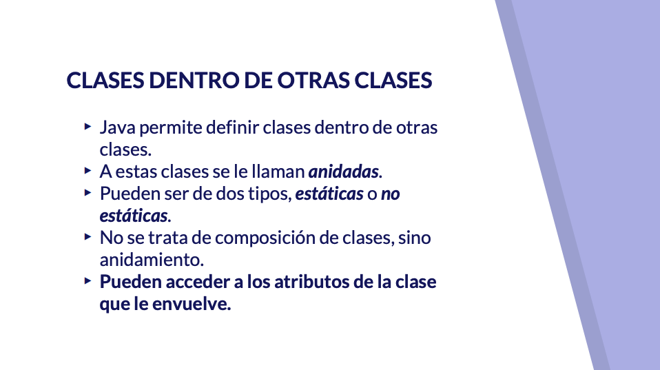
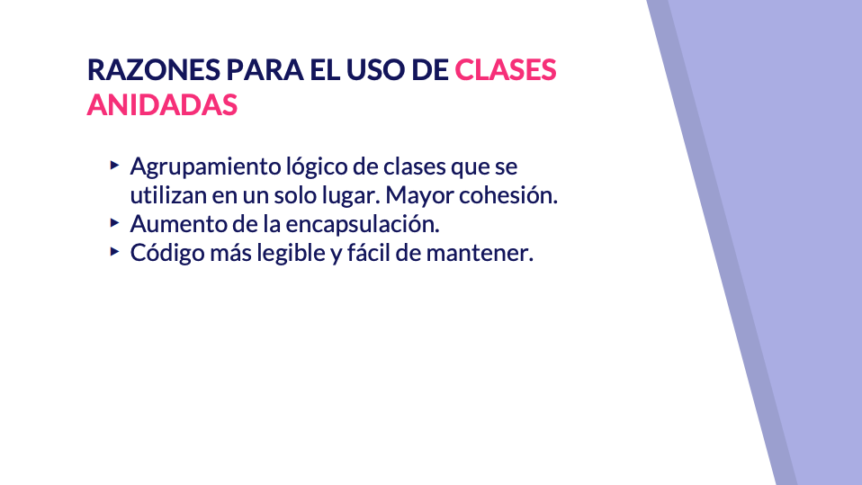

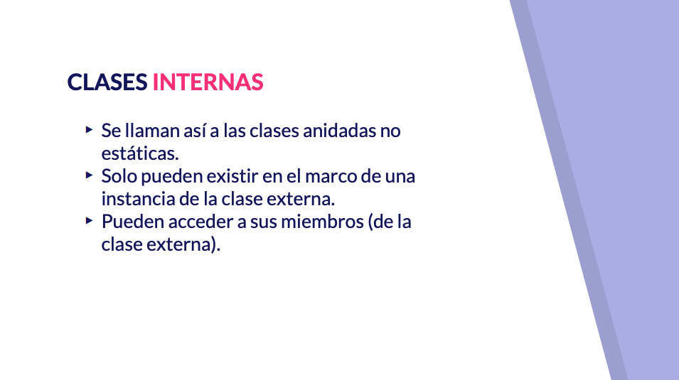
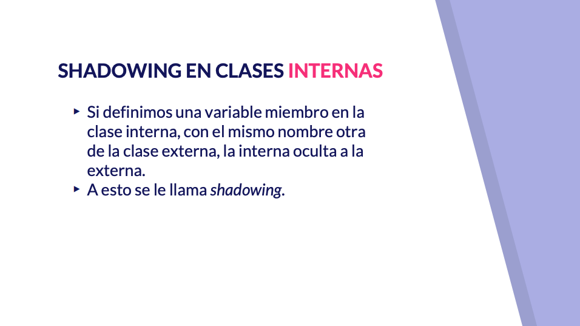

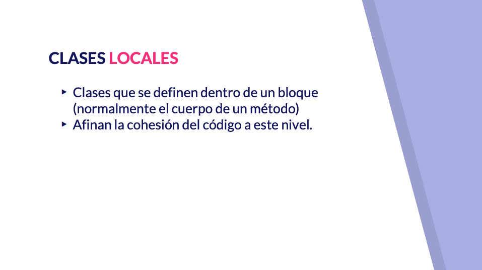

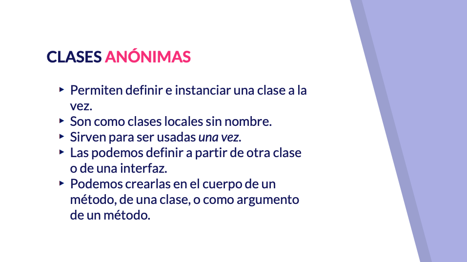

Hola a todos en este nuevo vídeo vamos a hablar de clases que se define dentro de otra clase vamos a llegar poco a poco de tipos más genéricos a tipos más concreto y vamos a diferencia cómo se utiliza cada una en un determinado contexto comencemos hablando de clase anidada de hecho ya las hemos utilizado en el ejemplo del código que utiliza static una clase que se define dentro de otra clase se llama una clase anidada puede ser estática o no estática no se trata de un tipo de asociación como la composición sino que se trata de una asociación entre clase llamada anidamiento es decir la clase anidada existe dentro de la clase que la envuelve una instancia de una clase ni nada podrá acceder a los atributos de la clase que les vuelve las razones para utilizar una clase anidada podrían ser varias por ejemplo podríamos seguir un principio de localidad para aumentar la encapsulación el código que está íntimamente relacionado en este caso pues el de la clase que está dentro de otra los situaríamos juntos también sería una razón de agrupamiento lógico es decir aumentar la cohesión y mejorar la legibilidad y el mantenimiento del código teniéndolo dentro de una sola pieza tenemos clases anidadas estática y como ya digo incluso la hemos visto en el ejemplo del Código estático y también las que no son anidadas el perdón las que no son estáticas y que serían clases internas la interna se llaman así por existir dentro del marco de la instancia de una clase externa y bueno por ser anidadas e internas pueden acceder a los miembros de la clase test tenemos una situación especial que se llama el sábado bueno que es similar a cuando sobre queríamos método pero en este caso sucede a nivel estructural nivel de atributos si definimos una clase externa que tiene dentro de una clase interna podríamos tener el caso en el que la clase externa tiene un atributo y dentro de la clase interna definimos otro atributo en este caso el atributo de la clase internal de Marce cual si lo utilizamos en algún método ocultaría atributo de la clase externas a ese comportamiento a eso ocultamiento del atributos desde la clase internacional externa se llama Shadow impale se crea como una sombra para el atributo de la clase externa formada por el atributo de la clase una clase que es interna pero a un método o a un bloque de código en particular a un método se llama clase local vale y nos ayudan al final la cuestión hasta este punto tenemos algún ejemplo de código a continuación y por último tenemos las clases anónimas las clases anónimas son clases que se definen es y se instancian a la vez son una especie de clase local sin nombre podremos ver cómo se pueden asignar a una referencia o incluso no asignada ninguna y utilizarla pues como argumento de un método o llamando directamente alguno de sus nietos podemos crearla a partir de una clase base de abstracto no o a partir de una interfaz vamos a ver algún código de ejemplo de cada uno de estos el primer tipo que sería el de nada podemos comprobar como podemos tener aquí una clase externa como decíamos en el primer vídeo una única clase pública en un fichero Java vale no podríamos tener alguna más pero siempre da que podemos tener dentro algunas que hace en particular esta clase anidada y otra mirada que sería está rico la diferencia entre ambas es que definimos una propiedad N queremos acceder a ella dentro como vemos una propiedad que no es esta queremos acceder a ella desde algo un método de la clase mirada lo podríamos hacerlo desde esta clase estática nos daríamos cuenta como tendríamos un fallo y es que la variable debería ser estática para hacerlo es decir una clase estática anidada dentro de otra clase externa solamente podría acceder a variable estática de la plaza externas por ejemplo nene que sería estática si podríamos acceder a ella desde aquí nos llamamos de media vamos a MC que podríamos el motivo lo vamos a ver en esta otra clase es que para crear la estática no necesitamos de una instancia de la clase externa sino que directamente podemos acceder a ella lo cual no nos asegura que tengamos una instancia de la clase externa con lo cual no podríamos acceder a métodos o atributos mejor dicho en este caso que fueran atributos de objeto tendría que ser atributo estático vale vamos a visitar está como estaba si queremos crear en el caso de la clase que está anidada y que no es estática decirte una clase interna si queremos crear una instancia tendríamos que hacerlo bien de la primera manera que tener una instancia con nombre referenciada a ti por el de externa y a partir de ahí instanciar o por otro lado tendríamos la clase la referencia perdón y dos que cree haríamos al vuelo directamente dentro de esta línea estamos echando un objeto de la clase externa centro de El un objeto de la clase interna anidada de hecho ahora vamos a comprobar como aquí si llamamos al método que tiene estoy aquí y accede al valor de la clase externa lo que estamos haciendo eh devolver el primer caso el valor vuelva los dos con respecto a las clases anidadas como decía un tipo concreto de las clases anidadas son las clases internas las clases internas sirven para definir una clase en el ejemplo que vamos a ver nosotros ahora una clase privada que tiene sentido su existencia tiene sentido solamente en el marco de la clase que la entiendo un ejemplo claro sería el concepto de interacción lo iteradores son elementos que bueno no son únicos y exclusivos dejaba y no que son pero son propios de la programación orientada a objeto vale ya se implementan en cualquier lenguaje de programación orientado a objetos en los cuales su función sería el permitirnos recorrer una secuencia de datos con una colección hasta ahora nosotros hemos trabajado con ArrayList y el recorrido con el bucle for mejorado no facilitan mucho el que podamos recorrer una estructura secuencial empezamos por el primero elementos y mujer el siguiente por el siguiente y así sucesivamente ahí el orden de recorrido está más que claro sin embargo podríamos intentar plantear otro orden como el ejemplo que vamos a ver qué vamos a crear una colección con un iterador que nos permite a tomar los elementos pares solamente los que se encuentren en una posición para pero lo iteradores cobran mucho más sentido incluso en otras estructuras que no son lineales por ejemplo si tuviéramos un árbol vale que un tipo de estructura es que puede tener varios recorridos podríamos tener diferentes iteradores dentro de nuestra clase e implementar al árbol de forma que podríamos recorrer los 10 niveles en preorden inorden postorden cosas propias de esa estructura de datos no por si tú brazo dependiendo de un grafo con menos sin orden pues podríamos ver la mejor manera de poder recorrer desde ese era todo ello mediante un un iterador el iterador es necesario que esté dentro de de la colección sobre la cual gaitera porque tiene que acceder para para subvención estación requiere del acceso de los elementos de la conexión con lo cual no podríamos hacerlo desde fuera si nos damos cuenta que tenemos la clase mi colección que va a ser implementada con un array de números enteros de 15 elementos que se inicializan bueno con unos valores por defecto en este caso de 0 a 14 y bueno si quisiéramos podríamos tener un iterador para imprimir los padres y me enterado suele tener dos pechos un método que nos indica si hay un nuevo elemento y que devuelve un booleano que nos va a permitir realizar el bucle y parar cuando lo ha llamado y otro método que nos devuelve el siguiente elemento que podemos tomar vale para ellos no pues ya hemos en esta clase iteradores iterador pares que destiñe una propiedad el siguiente elemento que inicialmente vale cero metodo hasnext que nos va a decir si hay más elementos en el array mediante esta comprobación entre siguiente baño y que tiene que nos devuelve el siguiente elemento de la gran y posiciona el puntero en dos elementos por delante para que lo hiciéramos elemento paz en elemento más vale y bueno si decimos de imprimirlo de elementos para que está colección podríamos comprobar como hemos pasado de la posición 0 a la posición 2 a la posición 4 a las 6 a las 8 a las 10 a las 12 a las 14 esto no quiere decir que sean los números pares que sean almacenados porque si aquí le sumaramos uno a cada número el resultado de ejecutar quería decir que está cediendo las posiciones imprimiendo las posiciones vale un ejemplo más concreto de una clase interna es una clase que es interna o un bloque de código método es decir una clase local podríamos plantear algunos ejemplos de clase local como por ejemplo el de una persona si tiene una serie de atributos de método clásica pero que añade un método que nos va a permitir validar el DNI de una persona buena en ocasiones vamos a utilizar como sinónimo de name is a sabiendas de que el DNI es una cifra de 8 dígitos y el anís es la misma cifra de 8 dígitos con una letra que se calcula mediante un algoritmo el algoritmo lo podéis encontrar en la Wikipedia y de hecho la implementación de la agenda del cálculo de la letra yo mismo lo he tomado de ahí por si alguno lo quería hacer por vuestra cuenta para hacer la validación del me lo vamos a hacer mediante el siguiente esquema recogemos el mío como un String que debería incluir la letra I para saber si es válido cogemos de esa cadena de caracteres tomamos lo 8 primero descargamos la letra construimos una instancia de una clase ni que va a ser local que va autogenerar la letra y compramos el NIF que nosotros teníamos inicialmente con letras con el NIF que acabamos de generar si fueran iguales quiere decir que el NIF es válido si fueran diferentes quiere decir que nuestro ninguno es válido porque el que más autogenerador lo hemos hecho siguiendo el alcoholismo que existe para calcular la letra del DNI como ya digo tendríamos una clase local a un método validar NIF qué bueno generaría un minusválido que tiene que ir las letras para hacer el cálculo del algoritmo que en el constructor genera a partir de un mes sin letra el NIF válido con letra y después un método que te que nos va a permitir que cuando nosotros instancia hemos aquí el mes a partir del número sin letra nos devuelva una instancia de mi que nos valga para comparar si el mix que nosotros hemos generado con esta cadena de caracteres que es la que recibíamos aquí son igual por ejemplo hacemos esta persona con el NIF 12345678 B y el resto de datos vamos a comprobar como no es válido porque no es la letra que le corresponde y si lo hacemos en otro caso con emperadores necesario que esté dentro de la colección sobre la cual la higuera porque tiene que hacer para para recomendación requiere de la sexo de pelo elementos de la colección con los brazos podríamos hacerlo desde el lunes y no damos cuenta que tenemos la clase y colección que va a ser en que me estaba con un array de número de enteros y te comento que se me salía

La letra del NIF no es más que un mecanismo de control nos quedarían por ver las clases anónimas vamos a ver dos ejemplos diferentes supongamos que tenemos una interfaz Hello World en este caso además es una interfaz local o mejor dicho interna definida en una clase también podemos definir interfaces que sean internas e incluso locales vale se pueden aplicar exactamente los mismos principios y esta clase tiene un método seis celo directamente tendría también el método me lo único que sería crear una instancia que ya es anónima vale de la clase hola mundo para llamar a su método Geno dentro de cemento 260 vamos a ver cómo usar una clase local aquí definimos la clase que implementa la interfaz el Hugo vale que fuerza sobre escribir estos dos métodos y que incluso bueno por decir a ti un valor de una propiedad tenemos una la infección de esta clase local y también tenemos dos tipos de clase las French writing es una clase anónima se llama clase nónima porque fijaos como la propia clase no tiene nombre en este caso solamente vamos a poder tener una instancia de ella almacenar en la referencia friends vete donde bueno lo que hacemos saludar a todo el mundo pero en francés por último tenemos una clase anónima que no se asigna ninguna referencia y que nos sirve para hacer el saludo en español esta clase al crearse como tal aquí en medio solamente va a tener utilidad se llamamos a algún método de ella porque sino esa referencia sería ilocalizable y no la podríamos utilizar besos y ejecutamos cómo se crea una instancia de una mundo anónima se llama 7260 que lo primero que hace aquí se definieron a clase está instanciado aquí también es anónima pero no la hemos llamado la primera que se llamen la de castellano que el primero que sale posteriormente en inglés y posteriormente en francés ejemplo de clase anónima sería pues allá donde necesitamos un orden de elementos supongamos que tenemos unos números guardados e ArrayList de numeros se casó de interés y bueno los queremos ordenar pero no por el orden natural sino que lo queremos ordenar en orden inverso de mayor a menor el método sort de la clase ArrayList espera una instancia de una interfaz que estudiaremos en próximos vídeos que es comparato comparato es una interfaz especial que solamente tiene un método abstracto que estos pero que recibe dos elementos de un tipo en este caso del tipo que le que le pasemos por qué dices para genérico y bueno hacerla nos permite hacer la comparación tiempo debe devolver 0 si son iguales menos 1 si el primero es menor que el segundo o más uno si el segundo es mayor que el primero menos 1 + 1 nosotros no aprovechamos de que a su vez la clase integer implemento trainer paz que también estuviéramos que es comparable que nos permite comparar dos números enteros y lo que hacemos es darle la vuelta al porvenir natural de los números íntegros vale con este valor menos aquí como podemos comprobar esto es una instancia anónima te sirve para pasársela a la llamada a un centro vale aquí podemos comprobar al recorrerlo números como ordenador para obtenerlo en orden y nos veremos también más adelante en el curso como las clases anónimas de este tipo están íntimamente relacionadas con la expresión es Landa tanto es así que podrán ser sustituidos por uno de ellos con eso terminamos lo el bloque de este capítulo en el que hemos hablado de clase que se definen dentro de otras clases y pasaríamos a ver el último vídeo de este bloque de diseño avanzado de clases para hablar de la enumeración


# 10 Uso de enumeraciones 7:18 

[Uso de enumeraciones](pdfs/10_Uso_de_enumeraciones.pdf)

## Resumen del Profesor

### 10.1 Tipos enumerados

Son un tipo de dato especial. Indica que una variable tendrá como valor uno de entre un conjunto cerrado, como por ejemplo Direccion (Norte, Sur, Este, Oeste).

```java
public enum Direccion {
   NORTE, SUR, ESTE, OESTE
}
```

En Java, los tipos enumerados son más potentes que en otros lenguajes. Para Java son un tipo de clase, que pueden incluir métodos y otros atributos. De hecho, el compilador añade métodos especiales (`values`), que incluso nos permite recorrer todas las instancias. Podemos pensar en que tenemos un conjunto cerrado de instancias de una clase.

## Transcripción


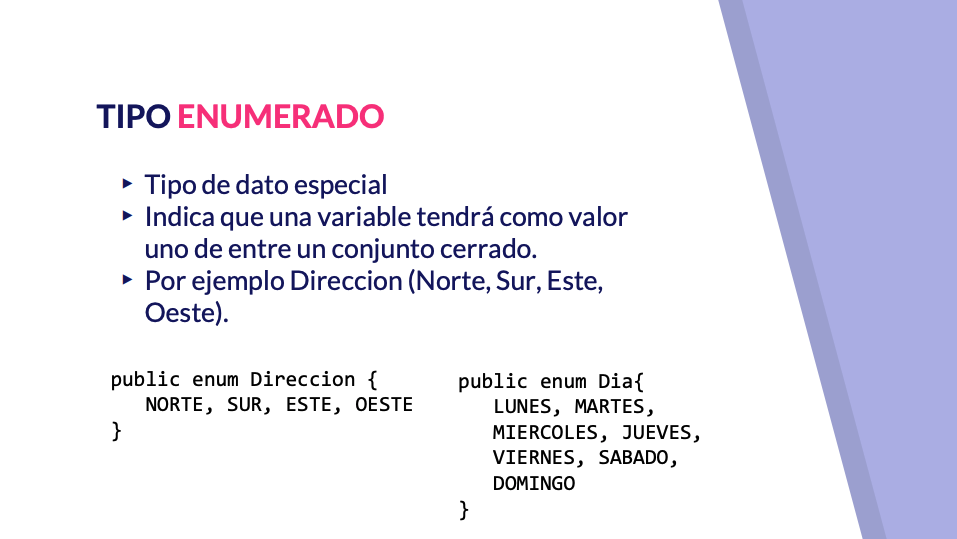
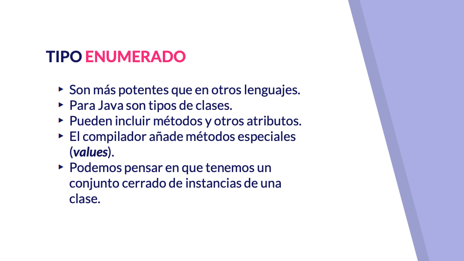

## Contenido adicional  4   

[Clases y métodos abstractos](pdfs/07_Clases_y_métodos_abstractos.pdf)

[Código que usa final](pdfs/08_Código_que_usa_final.pdf)

[Clases internas, locales y anónimas](pdfs/09_Clases_internas_locales_y_anónimas.pdf)

[Uso de enumeraciones](pdfs/10_Uso_de_enumeraciones.pdf)
