# 3. Clases genéricas y colecciones 37m
   * 11 Creación de una clase genérica 10:22 
   * 12 Creación y uso de list, set y map 18:19 
   * 13 Interfaces Comparable y Comparator 9:07 
   * Contenido adicional 3
   
# 11 Creación de una clase genérica 10:22 

[Creación de una clase genérica](pdfs/11_Creación_de_una_clase_genérica.pdf)

## Resumen del Profesor

### 11.1 Clases genéricas

Java permite desde sus orígenes usar clases genéricas, utilizando referencias de tipo `Object`. Sin embargo, estas pueden producir problemas en tiempo de ejecución.

```java
public class Box {
   private Object object;

   public void set(Object object) {
      this.object = object;
   }

   public Object get() {
      return object;
   }
}
```

Desde Java SE 5, podemos crear clases cuyo tipo se indica en tiempo de compilación

```java
public class Box<T> {
   private T object;

   public void set(T object) {
      this.object = object;
   }

   public T get() {
      return object;
   }
}
```

Podemos utilizar más de un tipo diferente a la vez:

```java
public class Par<T, S> {
   private T obj1;
   private S obj2;

   //Resto de la clase

}
```

### 11.1.1 Nomenclatura con los tipos

* E (element, elemento)
* K (key, clave)
* N (number, número)
* T (type, tipo)
* V (value, valor)
* S, U, V, … (2º, 3º, 4º, … tipo)

### 11.2 Instanciación y operador diamond

Hasta Java SE 6, para instanciar un objeto genérico, tenemos que indicar los tipos dos veces.

```java
Par<String, String> pareja2 = new Par<String, String>("Hola", "Mundo");
```

Desde Java SE 7, tenemos el operador `<>` diamond:

```java
Par<String, String> pareja2 = new Par<>("Hola", "Mundo");
```

### 11.3 Clases genéricas con tipos cerrados

Podemos acotar el tipo parametrizado, para que sea uno en particular o sus derivados:

```java
public class NumericBox<T extends Number> {

   private T object;

   //resto de la clase
}
```

Se puede indicar más de un tipo. Uno de ellos (y solo uno) se corresponderá con una clase; el resto deben ser interfaces. La clase a *extender* debe ser la primera de la lista:

```java
public class A {
   //resto de la clase
}

public interface B {
   //resto de la interfaz
}

public class StrangeBox <T extends A & B> {

   //resto de la clase
}
```

### 11.4 Genéricos con tipos comodín

Los tipos comodín nos permiten *relajar* el tipo concreto de una clase genérica a un subtipo. Son muy útiles en el caso de trabajar con colecciones (las trataremos en los próximos capitulos).

```java
public static double sumOfList(List<? extends Number> list) {
   double s = 0.0;
   for (Number n : list)
      s += n.doubleValue();
   return s;
}
```

## Transcripción


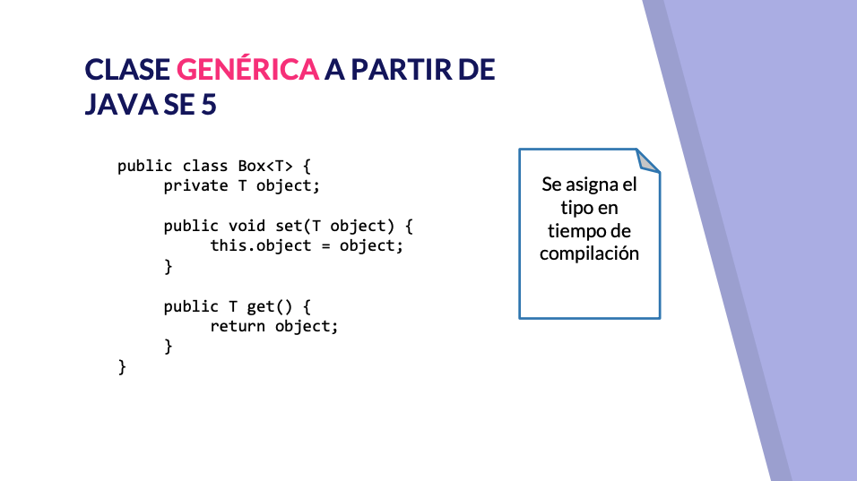


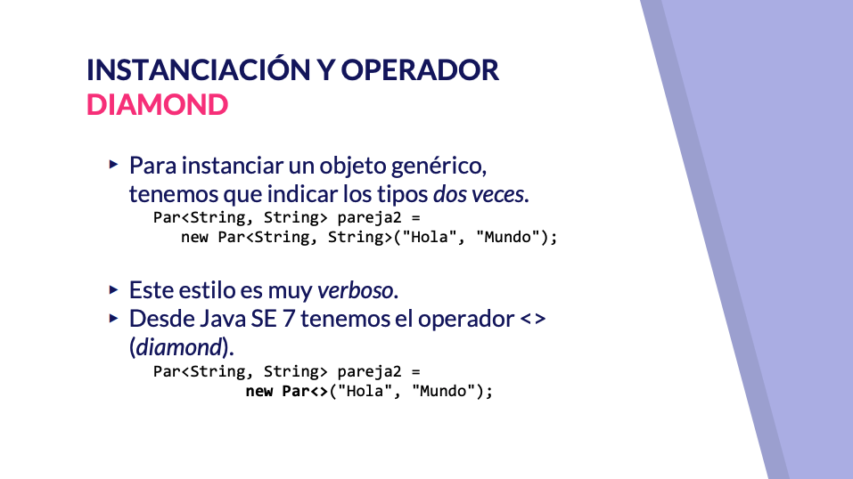


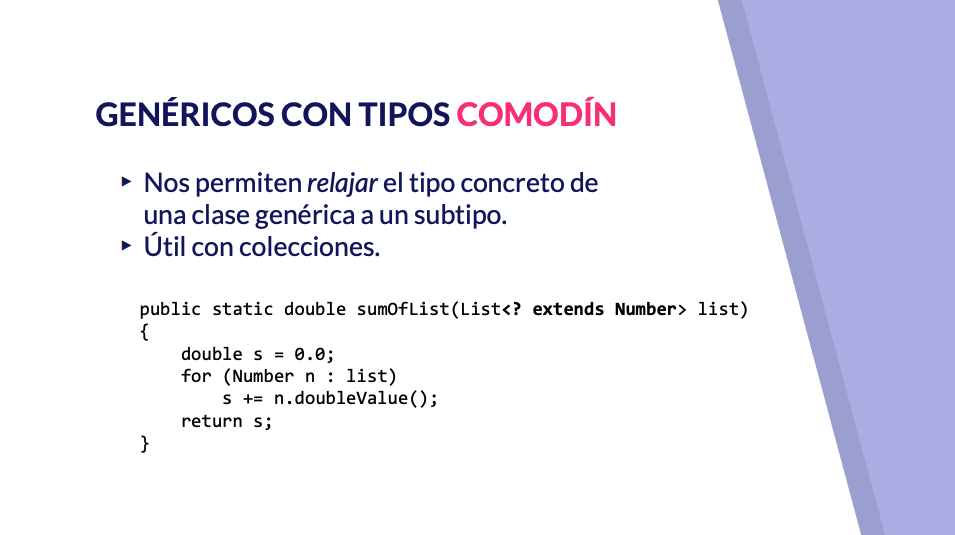


Hablaremos de clase genérica y de colecciones en particular en este vídeo vamos a hablar de clase genérica una clase genérica es una clase parametrizada sobre uno o más tipos de datos concretos Java desde el inicio nos ha permitido crear clase genérica utilizando referencias de tipo Object por ejemplo podríamos plantearnos crear un contenedor de elementos de cualquier tipo con el código que tenéis pantalla que tendría dentro de una referencia de embargo ese código es propenso a producir errores al no comprobar el tipo de dato concreto de lo que allí estamos almacenando y no obligaría a hacer continuo casting para sacar el tipo concreto que nosotros hemos almacenada a partir de la versión 5 de cava que nos permite el crear auténticas clase parametrizada de manera que nosotros podríamos con el operador de parametrización el postergar el indicar el tipo concreto vale al momento de la compilación de manera que diríamos bueno vamos a usar tipo genérico te que podrá ser string entregué o una clase propia que nosotros creemos no este código es nos garantiza frente a errores mucho más que el código anterior podríamos crear una clase parametrizada sobre todo tipo una clase genérica sobre dos tipos diferentes por ejemplo una clase que muchos programadores echan de menos en Java que no trae que es la que hace falta para poder guardar un par de valores de esta manera podríamos guardar un objeto de un tipo y otro objeto que otro a la hora de usar tipos parametrizados pues necesita una cierta conversión sobre el las letras que se utilizan si me llamo antes hemos utilizado tis10 porque cuando se define un tipo se suele utilizar primero te que hay que decir más de uno se utiliza este v w x y z sin embargo en el caso de otros tipo si se refiere a un elemento de una colección la letra E para el caso de los genéricos para clave valor suelo utilizar laca y la V en el caso de que sea tipo numérico Excel utilizar la N y bueno si suele haber cierta convención y pichea es un poco la documentación de excavador de todas las clases que nos ofrece Java poder comprobar cómo se sigue esta convención con lo cual es bueno es práctico que nosotros podamos pintar aparejado las clases genéricas que como vemos son bastante potente tenemos desde la versión 7 de Java Shell el operador Diamond el operador diamante para instanciar un objeto genérico tenemos que indicar los tipos de datos siempre dos veces uno en la referencia y otro en el constructor para que el constructor sepa que tipo tiene que utilizar a la hora de construir el objeto como es algo vergonzoso es decir sino el tener que escribirlo desde Java 7 podemos utilizar el operador Diamond de manera que solo tenemos que definir en la referencia los tipos de datos que vamos a utilizar sí sí bueno es una clase genérica para que reciben los tipos y ya le decimos en la en la referencia que ambos tipo va a hacer Stream no tenemos que volver indicarselo en la instanciación con la clase concreta podemos crear genérico con tipos de datos que no sean cualquiera como hemos hecho hasta ahora o podemos acotar lo poco en lo podríamos acotar a una clase concreta vale y a sus derivados por ejemplo con el código que tenemos en pantalla cerrar y amos esta clase no me equivoco vale de forma que solamente podría almacenar tipos que hereden a number es decir tipo numérico podríamos consultar toda esta jerarquía de herencia pero por ejemplo 15 es un tipo concreto de nacer no le informa que podríamos crear un genérico con un solo tipo de datos o también podemos indicar más de uno aquí tenemos que tener cuidado podríamos indicar con el Amper son más de uno pero solamente uno de ellos puede ser una clase los demás tienen que ser interfaces y además la clase tiene que ser de la sucesión que pongamos con empresas debería ser siempre el primero por ejemplo podríamos crear la clase trendbox que pudiera almacenar el tipo que hereden de Aude ver pero como ya os digo que la clase A debería ser la primera y única si tratamos de poner dos clases sería inviable vale sería un error en tiempo de compilación otra manera de hacerlo sería con tipos con botín es decir podríamos relajar un poco el tipo concreto de la clase genérica a un subtipo y lo haríamos de esta manera con un Wild Card no con este operador de interrogante de manera que bueno como sabemos que va a hacer cualquier tipo vale qué tienda de number podríamos utilizar la clase base number para trabajar con él y bueno hacer la operación es que fuesen de manera que lo que distanciamos hay dentro lo que pasáramos y dentro como como genérico podría ser cualquier tipo de perdón de nada veamos algún ejemplo de cada por ejemplo la interpretación de la clase path una referencia de objeto a la hora de estancia no podríamos crear un par de 20103 diamo y nosotros tratamos reasignar al valor primero de la pareja una cadena de caracteres ya nos va a dar una porque porque el tipo está definido cuando usábamos sociales a que no había error que valga porque se podía guardar cualquier cosa porque cualquier clase en última instancia radio7 forma implícita o explícita créame una segunda pareja stream pues también podíamos ver como títulos dos tipos podrían serlo vamos como daría igual el tipo internamente llama al presidente cada uno podríamos tener aquí en clase la clase a la interfaz vez ejemplos de hemos dicho antes de perdón Springboks vale en el que bueno podríamos indicar que este tipo vale de venerar de la clase A o B y no cambiamos de orden veríamos como notaría un falso porque no diría que la trastea no es un interfaz vale entonces no lo sé o también tenemos aquí la caja numérica como hemos visto antes con un tipo te concreto vale y ese tipo te concreto para definir aquí dentro bueno por el objeto que estamos almacenando en su tipo tal pues en el caso del ejemplo que tenemos aquí lo podríamos utilizar para almacenar un entero o vale no nos valdría por ejemplo para almacenar un string porque no es escribiendo en una clase que entienda hacen arte elementos de una lista vale con una lista entera y una lista de números reales vale podríamos utilizar el mismo método siempre y cuando sea un método que encienda the number no tendríamos que indicar el tipo T en este caso nos valdría o no podemos comprobar porque nosotros no podemos acceder a la implementación de lis para decir el tipo o dejar de cemento sino no podemos indicar aquí y el tipo se decide en tiempo de ejecución presente y cuándo es tienda de number no tendríamos ningún tipo de problema como podemos comprobar aquí pues se han hecho la suma de los elementos de la lista entera y también la suma de los elementos de la lista de números reales con ello terminamos con las clases genéricas y la mejor manera de utilizar y ver el uso de estas clases a través de las colecciones en el próximo vídeo de la tenemos de ver los tipos de colecciones más básicos que son lis décimas


# 12 Creación y uso de list, set y map 18:19 

[Creación y uso de list, set y map](pdfs/12_Creación_y_uso_de_List_Set_y_Map.pdf)

## Resumen del Profesor

### 12.1 API de colecciones

Desde Java SE 2 se ofrece el tratamiento de colecciones. Actualmente tiene

* Interfaces: tipos de datos
* Implementaciones: concreciones de los diferentes interfaces.
* Algoritmos: para realizar operaciones como ordenación, búsqueda, ...

Actualmente, todas las colecciones están definidas como genéricas.

### 12.2 Tipos de colecciones

Java propone diferentes tipos de colecciones, a través de varias interfaces. Nosotros trabajaremos en esta lección con 3:

* `List`: Se trata de una estructura lineal, con posibilidad de orden y de repetidos.
* `Set`: es una colección que no soporta duplicados, y con posibilidad de orden.
* `Map`: es una estructura de tipo clave, valor, con posibilidad de orden de los elementos (por la clave)

### 12.3 Intefaz `List`

Los elementos tienen siempre una posición, y permite duplicados. También permite búsqueda e iteraciones. Las implementaciones más conocidas son `ArrayList` y `LinkedList`. Si no sabemos cual escoger, utilizaremos siempre `ArrayList`.

Para construir una instacia, desde Java SE 7 podemos usar el operador *diamond*:

```java
List<String> cars = new ArrayList<>();
```

### 12.4 Interfaz `Set`

Se trata de una colección que no puede contener repetidos. Java propone tres implementaciones: `HashSet`, `TreeSet` y `LinkedHastSet`:

* `HashSet` es la más eficiente, pero no nos asegura nada sobre el orden.
* `TreeSet` utiliza un árbol Red-Black, y ordena según el valor.
* `LinkedHashSet` es un `HashSet` ordenado por orden de inserción.

### 12.5 Interfaz `Map`

No es un subtipo de `Collection` (`List` y `Set` sí que lo son). Cada elemento tiene estructura clave, valor. La clave sirve para acceder directamente al valor. Las implementaciones son `HashMap`, `TreeMap` y `LinkedHashMap`. Las consideraciones son análogas a Set.

## Transcripción


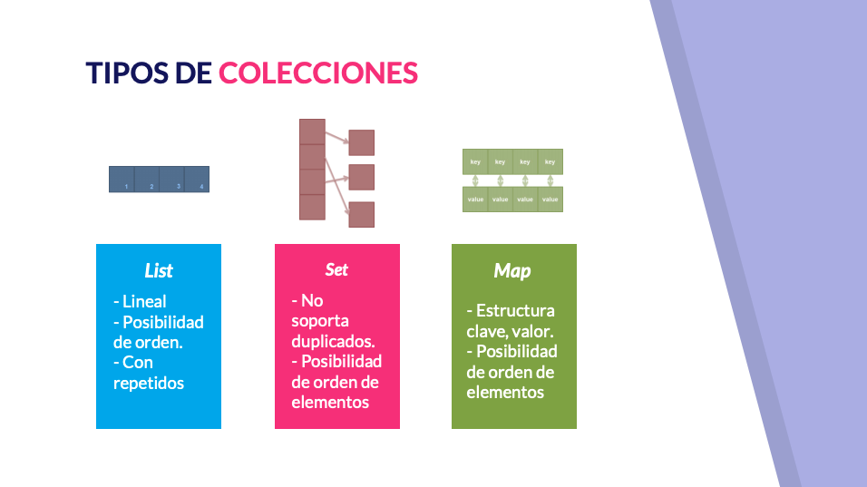
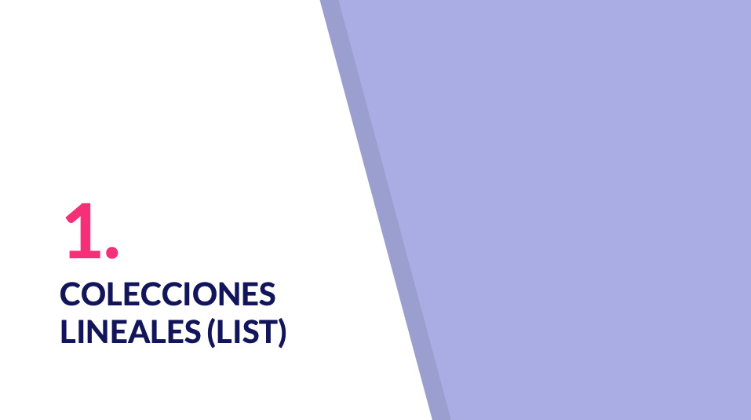

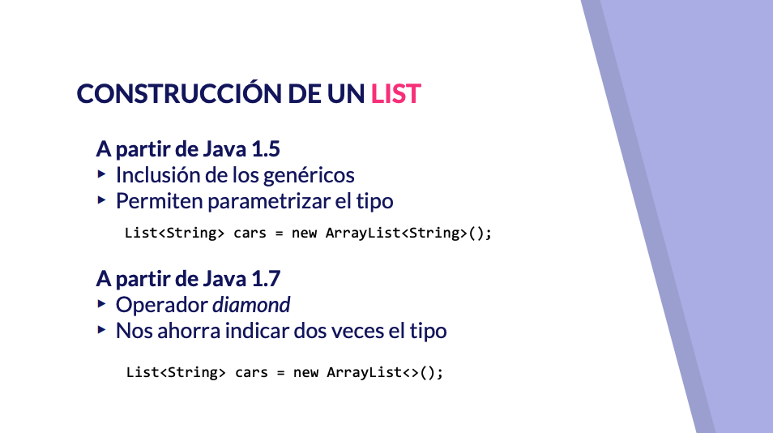


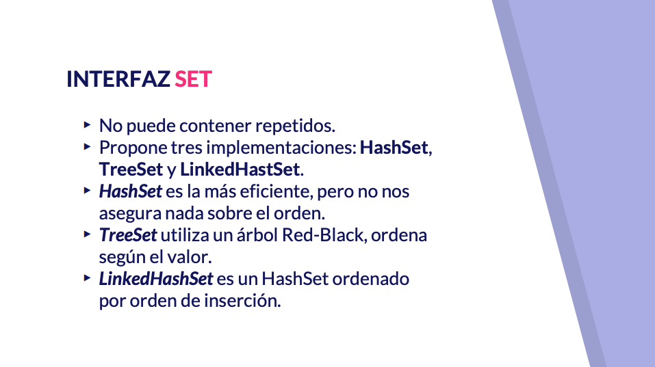
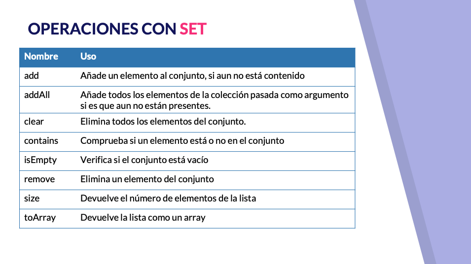


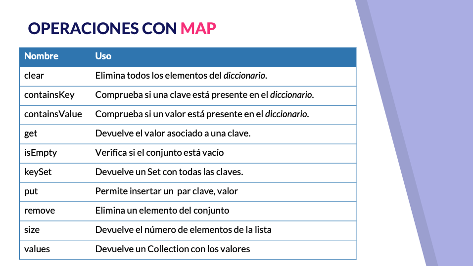

Vamos a continuar trabajando con las colecciones en Java y vamos a trabajar con los tipos de colección más clásicos que son las colecciones de tipo ni las colecciones de tipo C y las colecciones de tipo humano lo primero decir o que desde la versión 2 pescaba tenemos a nuestra disposición el tratamiento de colecciones una recolección actualmente este a pie muy rico y contiene mucho elemento bario interface que no delimitan los tipos de datos que vamos a manejar implementaciones de interfase en diferentes concreciones de cada uno de los tipos también algoritmo para realizar operaciones clásicas como ordenación y búsqueda y además todas las conexiones están definidas como genérica desde la versión 5 de Java es decir que tenemos que indicar el tipo tipo sobre el cual vamos a utilizarlo dibujar un poco un mapa sobre las colecciones tenemos un interfaz genérico que se llama collection vale y sobre el cual se definen otra serie de interfaces como son vale para conjuntos del cual tenemos también un subinterfaz que el sol tercer para conjuntos ordenador List para colecciones secuenciales y The Cure que son estructuras secuenciales pero por las que se trabaja de una manera un poco particular porque bueno un activo y de que usa una estructura sífilis no entonces quedarían también como como interfaz de tipo conexión y aparte tendríamos la interfaz como decía nosotros vamos a trabajar con alguna Tella en particular con link con ser y con más vale que tenéis aquí en pantalla una representación de una estructura lineal con posibilidad de orden y que tiene posibilidad de almacenar repetido frente Alice tenemos sed que no soporta duplicados y también tiene posibilidad de orden en los elementos por último postura frente a la anterior es una estructura de clave-valor y que también te tiene posibilidad de orden en los elementos comencemos con la interfaz list con las colecciones lineal en una colección de peepoleave que como queremos hay varias todos los elementos tienen posición y podremos hacer un acceso posicionarla exo-l además te permiten duplicado el perfil no hay una comprobación de si un elemento a la hora de insertarse ya está contenido No permite realizar búsqueda particular tenemos alguna implementación de la búsqueda de los elemento también tenemos los algoritmos que tenemos externos tenemos la posibilidad de hacer una búsqueda binaria a sabiendas de que ese tipo de búsqueda requiere que los elementos y estén ordenados y bueno las implementaciones más conocidas son ArrayList y LinkedList hay muchas más la podríamos consultar en la documentación aunque si no sabes cuando utiliza lo normal es usar ArrayList suele ser la la implementación más eficaz en la mayoría de los casos vale aunque también tenemos alguna otra como ya os digo cómo limpiar lista a la hora de instanciar un live como hemos visto podrías dar un perdón de un cualquier tipo de anís en particular un ArrayList con Java 5 y la inclusión de los genéricos podríamos parametrizar el tipo y de 3 CABA 7 como hemos visto antes en el vídeo anterior de genéricos podríamos utilizar el operador Diamond la operación es más usuales son list las tenemos aquí en pantalla a un lío le podemos añadir elementos se añadirían después del último elemento que estuviéramos ahora mismo también podríamos añadir toda una colección de elementos después del último elemento que tuviera ahora mismo cené podríamos vaciar la lista entera con Clear podríamos comprobar si un elemento está o no en la en la en la lista con content atracciones transformar esa lista en un array de de objeto o del tipo que le hayamos pasado con el método to array te amo un ejemplo de pelis en este ejemplo vamos a tener una clase modelo persona que viene de atrás vale de alguno de los ejemplos que hemos hecho y bueno si podríamos ver cómo podríamos crear un ArrayList de persona podríamos añadirle una serie de persona podríamos hacer un acceso posicional vale ArrayList vamos list en definitiva empieza a contar entero con lo cual se hace vemos a la posición 2 sería la tercera posición podríamos hacer un recorrido de la lista completa con el bucle for mejorado posteriormente podríamos añadir otro elemento vale que quedaría en la en la quinta posición podríamos añadir si estuviera vacío modificar un elemento en medio de la lista podríamos recorrer la lista completa de nuevo para ver lo que tiene incluso como hemos visto en el uso de clase anónimas podríamos ordenar una lista proporcionando un orden diferente vale o bueno de cimientos mejor dicho un orden porque persona no tiene orden y en este caso sería por orden de edad no por fecha de nacimiento de forma inversa podemos comprobar como de primera pues tenemos todos los todas las personas que hemos definido aquí vale cuatro primero accedido a esta primera persona vamos aquí un salto de línea primero hemos recibido posicionalmente a una persona hemos impreso registro luego hemos recorrido la rey completo vuelve a parecer otra vez a persona que estaba en la tercera posición como podemos comprobar ana estaba en la tercera posición hemos añadido un nuevo elemento al final vale julio hemos cambiado el elemento de la posición 2 por Alfonso García y en esta segunda impresión podemos ver cómo ha desaparecido Ana para sustituirse por Alfonso y julio se ha añadido al final de la lista vale y si lo ordenamos por fecha de nacimiento decir que primero ponemos al más joven y después ponemos al más viejo podríamos ver cómo se ha modificado el orden aquí no había un orden específico salvo el de creación y aquí ya hemos aplicado un orden sobre los elementos para tener primero al elemento más a la persona más joven y descendentemente así hacia hacia una edad mayor todas las operaciones que podemos hacer con Live si cambiamos la implementación concreta de lis a un LinkedIn vale importar la clase pero en términos de funcionalidad no habría diferencia ninguna todas las operaciones de las que hemos hablado vienen definidas en la interfaz por lo cual cualquier clase que se comprometa a implementar dice interfaz nos tiene que ofrecer esa operación es como decía si no tenemos una muy buena razón para usar lentes link podríamos usar ArrayList que para la mayoría de los casos es la implementación más eficientes que podemos tener continuar con cola con colecciones sin repetidos qué son los sets la interfase es una interfaz que nos permite definir colecciones que no hasta que no permiten elementos repetido esto viene del campo de las matemáticas y es que un conjunto en matemáticas por definición vale una colección de elementos que no puede tener repetido nos propone tres implementaciones Haze tristes y linked hash Set Hampstead es la más eficiente de todas en términos de eficiencia en la mejor pero no asegura nada con respecto al orden en el que vamos tenerlo elemento ya digo esto también vendría de la propia definición del un set en matemáticas no de un conjunto utiliza un árbol especial un árbol replat para almacenar los valores y lo ordena según el valor vale sería algo menos eficiente porque bueno mantener el orden en un árbol es una operación que conlleva un cóctel que bueno luego nos tenemos el beneficio a la hora de obtener todos los elementos que los tendríamos ordenador pero mantener un orden con inserción en de elemento intermedio pues siempre algo que computacionalmente requiere de un coche es un cassette que si nos garantiza que al menos vamos a tener este hámster por orden de inspección vale si queremos tener algún alguna garantía de obtener los elementos al menos en el orden en el que lo hemos insertado podríamos usar linked hash set veremos que tiene su uso por ejemplo cuando trabajemos con el API stream la operaciones que podemos realizar con un set son en principio las mismas que podríamos hacer con una colección de tipo list vale es decir añadir añadir un conjunto limpiar ver si se contiene verificar si está vacío eliminar el tamaño to array perdemos solamente el acceso posicionales perfil no podríamos tener un acceso totalmente posicional vamos a ver vale en este caso como podríamos tener un hámster de personas también vamos a ver qué pasa si tratamos de añadir un repetir y los vamos a imprimir todos cómo podemos comprobar hemos añadido a sé vale una serie de personas esta persona perdón esta última estaría repetida al añadirla podemos comprobar que no sucede nada es decir que no nos aparece dos veces a diferencia de como trabajamos con por muchas veces que añadiéramos no nos permitiría incluso también filtrar y a aquellos que estuvieran repetidos vale tenemos diferentes implementaciones que hablan en principio serían idénticos TreeSet nos obligaría a que lo que se reciba implemente comparable porque si no pues no vamos a poder tener este orden en el tríceps cómo podemos comprobar bueno lo que hace es que el genérico de triste debe ser una instancia de comparable y si no pues deberíamos tener cuidado de implementarlo como todavía no no hemos llegado al vídeo de comparable bueno pues lo dejamos como está utilizamos un linker hatched a diferencia del cassette Azteca este si no garantiza que el orden va a ser el orden de inserción y vemos la diferencia aquí y comprobamos que imprimen en orden de Pepe Juan Ana María aunque intentemos otra vez María María queda la última porque has extra por el repetido cuando estábamos haciendo no el primero es posible que no salga pues posible que no como no sino que lo hace en el orden que mejor le viene vale esto con respecto a lo sé que nos van no son muy válidos si queremos que cierran que no haya repetido vale además de preocupándonos totalmente de la gestión simplemente con añadir y que no lo encuentre ya lo tendría por último vamos a ver las colecciones de tipo clave valor a través de la interfaz más vale lo primero que tenemos que recordar que el link y se cierran un subtipo de la interfaz colección y más no lo es y que a diferencia de las otras dos colecciones donde guardaba los elementos del tipo aquí tenemos que indicarlo el tipo de la clave y el valor podemos pensar en un Mac como si pensáramos en un diccionario y hay algo que realmente se utiliza menos que lo utilizamos el digital pero si tenéis a mano algún diccionario en papel podríais ver cómo podéis localizar las palabras en base a la propia palabra que esté buscando y a continuación de la palabra tendríais la definición o definiciones de esta palabra tren árbol especial carbón relax para almacenar los valores no ordena según el valor vale sería algo menos eficiente porque bueno mantener el orden en un en un árbol de una operación que conlleva un coste qué bueno luego no tenemos el beneficio a la hora de obtener todos los elementos se lo sé mi amor ordenador a tener un bebé me terminó valor de la operación es son algo diferente está la PS por el mero hecho de tener una estructura de para criar seria igual vale no eliminaría todos los elementos del diccionario tendríamos los métodos contains que hizo usuarios que nos permitirían comprobar si la clave o el valor correspondiente mente están presentes en el diccionario el método que para un valor de Key dados no devuelve el valor asociado y sentí nos permite comprobar si el conjunto Gales está vacío sin diccionario excavación que nos devolvería un set repetido con todas las claves vale nos permite insertar un pan Remus eliminar un elemento y bueno 6 nos devuelve el número de elementos y varios nos devuelve una colección vale no un ser que no le eches un tipo genérico con leche por todos los valor vale vamos a ver un ejemplo de uso de un Mac vale en este caso HashMap vamos a almacenar pares vale intentando simular una agenda telefónica donde la clave sería el número de teléfono y la clave la persona y todavía tenéis a mano las páginas blancas las páginas amarillas podría entenderlo mejor a la hora de definir lo tenemos que indicar los dos tipos en este caso representamos el teléfono mediante un string y la persona sería el balón vale utilizando el operador Diamond cómo podemos comprobar si vamos insertando valores se van almacenando si decimos de insertar para una misma clave otro valor lo que hacemos es sustituirlo y es que no podemos tener dos claves que tengan el valor es diferente vale por lo cual si llamamos dos veces al método sobre la misma clave solamente nos quedaremos con el segundo palo si quisiéramos tener para una clave más de un valor deberíamos usar como tipo de valor una colección que nos permitiera soportaré queremos recorrer un map la forma de recorrer los más clásica es obtener todo el set de clave recorrer SC y para cada valor de la clave tomamos su valor no mediante el método que sería este que tenemos aquí de manera que aquí podríamos imprimir el número de teléfono de cada persona con los datos de la correspondiente persona como podemos comprobar como se trata de un set normal pues no podemos esperar que no aparezcan ordenados es su elemento si quisiéramos ordenar los tendríamos que bueno intentar aplicar el orden de alguna manera envase otra colección dando un orden explícito etcétera etcétera con esto terminamos este vídeo sobre colecciones en el siguiente vídeo que es el último del bloque de genérico y colecciones vamos a hablar sobre la interfaz comparable y compara tos y como nos van a servir en operaciones de estas que estábamos hablando ahora mismo como por ejemplo para ordenar el


# 13 Interfaces Comparable y Comparator 9:07 

[Interfaces Comparable y Comparator](pdfs/13_Interfaces_Comparable_y_Comparator.pdf)

## Resumen del Profesor

### 13.1 Introducción

Muchas operaciones entre objetos nos obligan a compararlos: buscar, ordenar, … Si bien los tipos primitivos y algunas clases ya implementan su orden (natural, lexicográfico), para nuestras clases (modelo) tenemos que especificar el orden con el que las vamos a tratar.

### 13.2 `Comparable`

`Comparable` es un interfaz propuesto por Java, y su definición es sencilla:

```java
public interface Compararable<T> {
     public int compareTo(T o);
}
```

Recibe un objeto del mismo tipo que la clase que lo implementa. El valor de retorno del método `compareTo` será:

* 0 si ambos objetos son iguales,
* un valor negativo si el objeto es menor,
* y uno positivo si es mayor.

**Nos sirve para indicar el orden principal de una clase.**

### 13.3 `Comparator`

`Comparator` también es un interfaz propuesto por Java, y su definición también es sencilla:

```java
public interface Comparator<T> {
     public int compare(T o1, T o2);
}
```

Recibe dos argumentos, y su valor de retorno es análogo al de comparable.

`Comparator` nos servirá para indicar un orden diferente al orden natural definido con `Comparable` (no es necesario haber definido un orden con `Comparable` para poder utilizar `Comparator`, aunque sí es recomendable).

## Transcripción

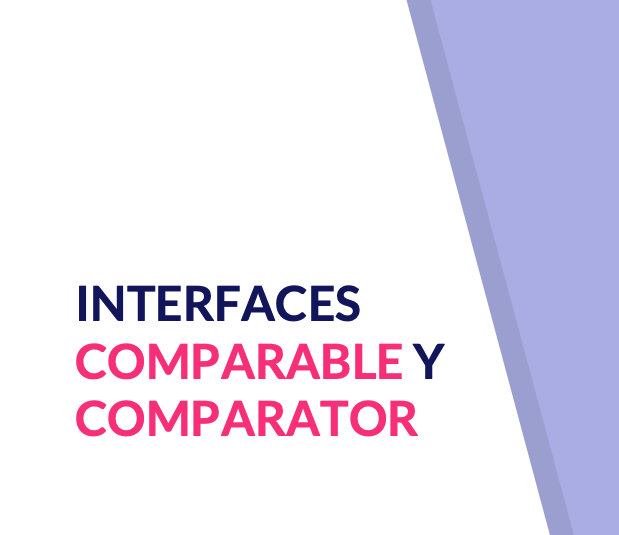


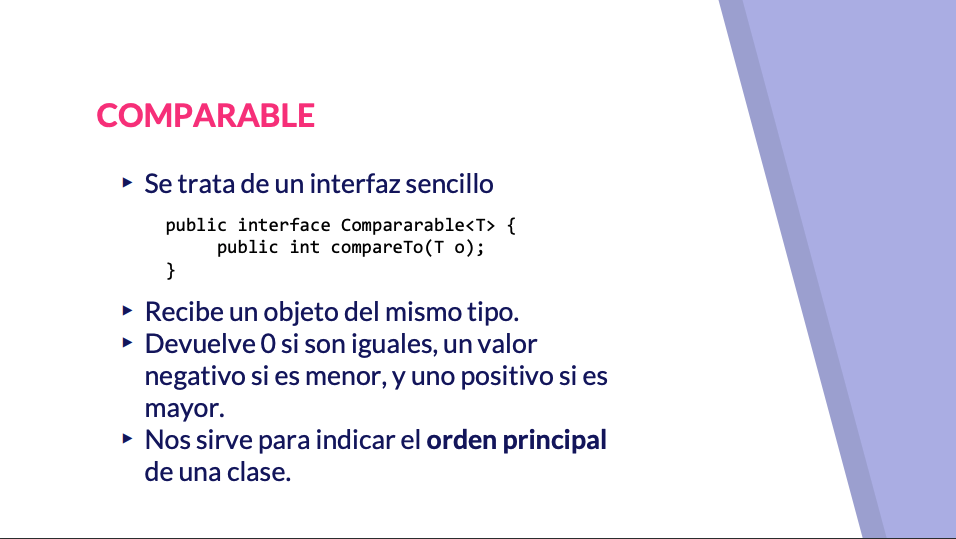
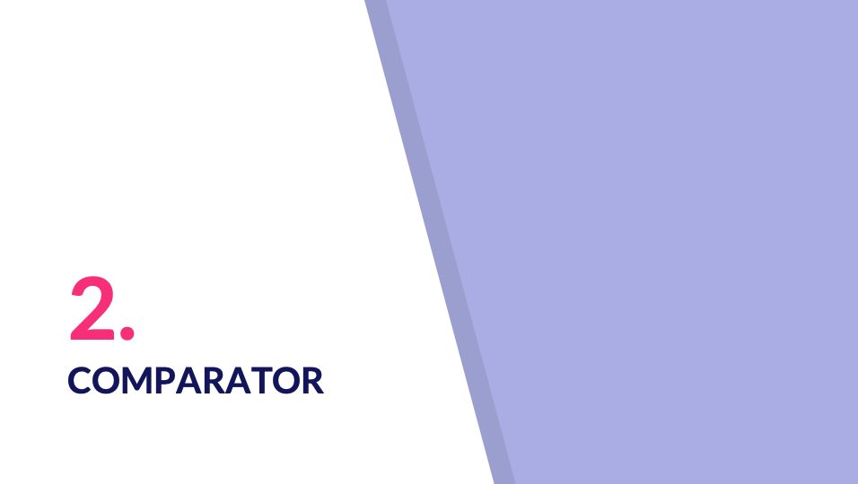


## Contenido adicional 3   

[Creación de una clase genérica](pdfs/11_Creación_de_una_clase_genérica.pdf)

[Creación y uso de list, set y map](pdfs/12_Creación_y_uso_de_List_Set_y_Map.pdf)

[Interfaces Comparable y Comparator](pdfs/13_Interfaces_Comparable_y_Comparator.pdf)
