# 4. Expresiones lambda e interfaces funcionales 21m

   * 14 Interfaces funcionales 8:01 
   * 15 Predicate, consumer, function y supplier 13:22 
   * Contenido adicional 2
   
# 14 Interfaces funcionales 8:01 

[Interfaces funcionales](pdfs/14_Interfaces_funcionales.pdf)

## Resumen del Profesor

### 14.1 Interfaces

Una interfaz es un *contrato* que compromete a la clase que lo implementa a dar cuerpo a una serie de métodos abstractos. Además, se pueden utilizar como referencias a la hora de crear objetos (que implementen esa interfaz, claro está):

```java
List<String> lista = new ArrayList<>();
```

Desde Java SE 8, las interfaces pueden incluir la implementación de algunos métodos, en particular, los métodos anotados con `default` y `static`.

```java
public interface Interfaz {

   public void metodo();

   default public void metodoPorDefecto() {
      System.out.println("Este es uno de los nuevos métodos por defecto");
   }

   public static void metodoEstatico() {
      System.out.println("Método estático en un interfaz");
   }

}
```

### 14.2 Interfaces funcionales

Una interfaz funcional será una interfaz que solamente tenga la definición de un método abstracto. Estrictamente hablando, puede tener varios métodos abstractos, siempre que todos menos uno sobrescriban a un método público de la clase `Object`. Además, pueden tener uno o varios métodos por defecto o estáticos.

Normalmente, son interfaces que implementamos mediante una clase anónima. Muchos de los interfaces que conocemos, como por ejemplo `Comparator`, son interfaces funcionales:

```java
Collections.sort(lista, new Comparator<String>() {

   //Ordenamos la cadena por su longitud
   @Override
   public int compare(String str1, String str2) {
      return str1.length()-str2.length();
   }

});
```

Java SE 8 incorpora también la anotación `@FunctionalInterface` que permite al compilador comprobar si una interfaz cumple con las características de ser funcional o no (Eclipse nos proporciona dicha funcionalidad *en directo*, a la par de escribir el código).

Las interfaces funcionales y las expresiones lambda están áltamente ligadas, de forma que allá donde se espere una instancia de una clase que implemente una interfaz funcional, podremos utilizar una expresión lambda.

```java
Collections.sort(lista, (str1, str2)-> str1.length()-str2.length());
```

## Transcripción

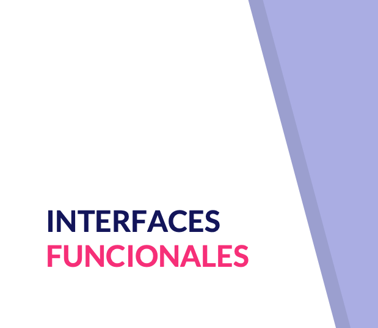
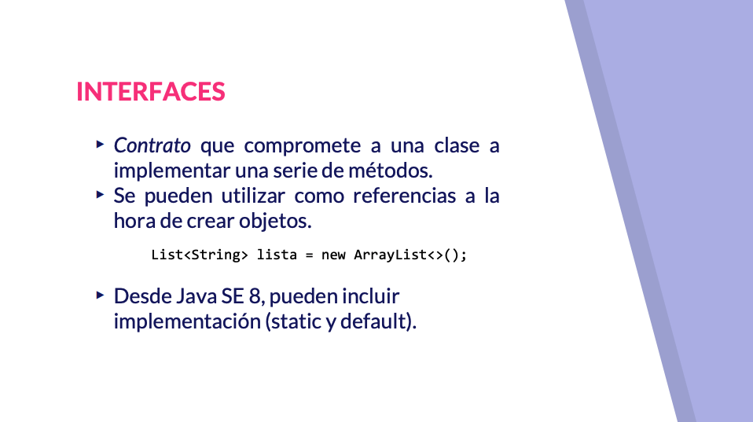
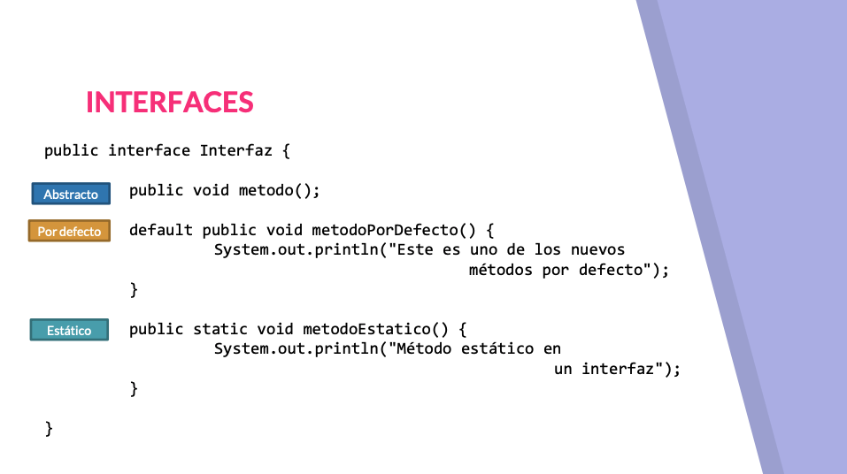
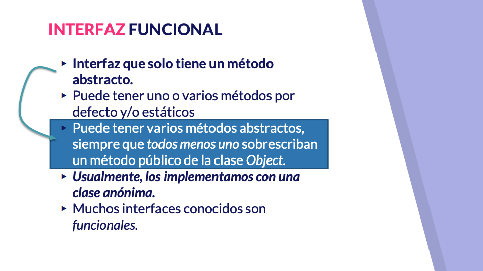
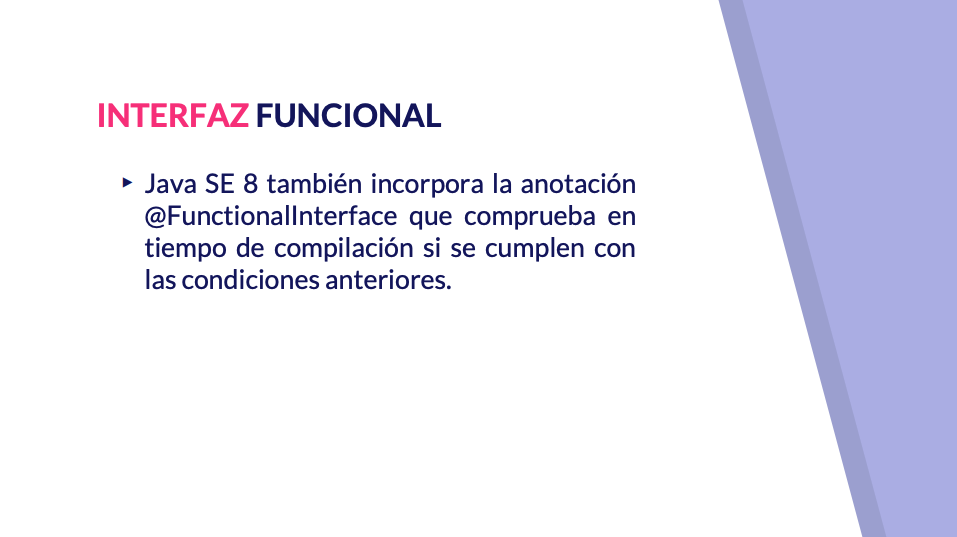
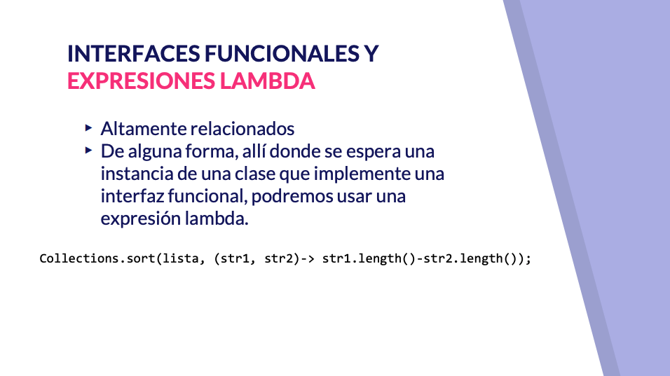

vamos a comenzar un bloque este va hola todo vamos a comenzar un bloque este va a ser más corto pero no servirá de introducción al siguiente en el que trataremos a la fiesta en este bloque vamos a hablar de interfaces funcionales y expresiones lambda y también veremos algunos ejemplos de interfaces funcionales que ya vienen definidas forjadas y que son muy útiles y ampliamente utilizadas en la piscina comencemos conociendo queso eso de los interfaces funcionales una interfaz en un contrato que compromete a la clase que lo implementa a implementar una serie de métodos además podríamos utilizar la interfaz como referencia a la hora de crear objetos de una clase que implemente la interfaz cómo complemento de aprendimos que desde la versión 8 de Java pueden incluir métodos que no sean solamente abstracto sino métodos con implementación de dos tipos diferentes métodos estáticos y métodos por defecto aquí tenemos un ejemplo de una interfaz que tiene un método abstracto decir que estamos obligado implementamos esta interfaz a darle cuerpo tenemos un método por defecto qué es un método que tiene implementación una implementación que dan por defecto que la clase que implementa interfaz no tiene obligación de sobreescribir aunque si lo sobreescribe pues tendrás que implementación propia y un método estático que se rige de la misma por la misma ley que los métodos estáticos de una clase fcil que podríamos llamar directamente con el nombre de la interfaz punto y el nombre del método es el método estático a este mes pues bien lo interfaces funcionales se definen como interfaces que tienen solo un método abstracto aunque pueden tener varios métodos por defecto o estático de hecho podemos matizar un poco más la definición diciendo que pueden tener varios métodos abstractos que en tanto en cuanto haya al menos perdón en tanto en cuanto todos menos uno no hay al menos alguna sino todos menos uno sobre escriba un método público de la clase hostia es decir que tengan un solo método abstracto definido por nosotros usualmente como no ha pasado en el capítulo anterior en el vídeo de comparable y comparato usualmente este tipo de interfaces lo implementamos con una clase anónima vale es decir una clase que sí bueno métodos sol recibía una en una instancia de este comparador pues lo que muchos ayudarle una instancia normal una una clase anónima que hemos distanciado y definido allí aparte de comparable y pon para todos muchos interfaces conocidos por nosotros o incluso de los que están por conocer en este curso se me ocurre por ejemplo 2 Brunéi GoLocalise porque en el apartado de la programación concurrente también son interfaces funcionales además Java 8 nos proporciona la notación functional interface que lo que hace simplemente es comprobar en tiempo de compilación si se cumplen las condiciones que hemos establecido es decir podemos tener interfaces funcionales que no tengan está notación y no dejarán de serlo pero la notación nos ayuda a comprobar que una interfaz tiene solamente un método abstracto propio nuestro que y no dejarán de serlo pero la notación nos ayuda a comprobar que una interfaz tiene solamente un método abstracto propio nuestro que cómo aprendimos en el curso de Java 8 desde cero está altamente relacionado de alguna forma podemos decir que allá donde se espere una instancia de una clase que implementa una interfaz funcional por ejemplo comparato podremos usar una expresión lambda como podemos tener aquí el ejemplo de la clase collections que tiene el método short que puede recibir una colección y además funkos baratos no pues podríamos dar este comparato mediante una expresión lanza veamos algún ejemplo a la hora de definir una interfaz funcional propia nuestra podemos comprobar como esta interfaz funcional puede tener método estático método por defecto métodos que estén presentes en la clase o qué como método abstracto solamente podría tener un método abstracto y ya digo que está notación meramente de comprobación nos ayudaría simplemente a que nosotros hubiéramos comprobar de esta manera que bueno se cumple con que el interfaz sea funcional como podéis comprobar ahora mismo nos dice que no lo es porque porque tenemos dos métodos abstractos tendríamos que eliminar uno de ellos parece esta manera si no aseguramos que sea una interfaz opcional aquí vamos a ver el uso de estas interfaces funcionales como por ejemplo comparato cómo podemos comprobar la podemos utilizar como como una clase anónima como ya hemos venido haciéndolo esto ordenaría una serie de cadenas de caracteres en función de su longitud o podríamos usarlo mediante expresiones lambda cómo aprendimos en en el curso de Java 8 de 3º podemos convertir mediante la combinación de teclas CONTROL 1 sobre 1 sobre una clase anónima podríamos convertirlo en la expresión lambda correspondiente como tenemos abajo vale lo dejaremos así para ilustrar al personal orden que no va a pasar nada ordenaría de menor longitud a mayor longitud vale y lo haríamos haciendo uso de una expresión lambda a través de una interfaz funcional otra expresión lambda que se basa en el uso de una interfaz funcional ya proporcionada por octava sería el método por y que se incluye dentro de las colecciones a partir de Java 8 vale y que lo que acepta es una instancia de una interfaz funcional que conoceremos en el siguiente vídeo y que consumer y que bueno pues podríamos proporcionarle el valor a través de una expresión lambda que además es de las mas concisas que se pueden crear a través de una referencia a objeto no está también la aprenderemos el vídeo sucesivo de esta manera podríamos recorrer toda la lista para imprimirla por consola correcto acabamos de presentar los interfaces funcionales en el próximo vídeo vamos a conocer los cuatro pilares en los que se basa el API stream que son los interfaces funcionales predicate consumer función y su clan

# 15 Predicate, consumer, function y supplier 13:22 

[Predicate, consumer, function y supplier](pdfs/15_Uso_de_interfaces_como_Predicate_Consumer_Function_y_Supplier.pdf)

## Resumen del Profesor

### 15.1 `Predicate<T>`

El método abstracto es:

```java
boolean test(T t);
```

Comprueba si se cumple o no una condición. Se utiliza mucho junto a expresiones lambada a la hora de filtrar:

```java
//...
    .filter((p) -> p.getEdad() >= 35l)
```

Se pueden componer predicados más complejos con sus métodos `and`, `or` y `negate`.

### 15.2 `Consumer<T>`
  
El método abstracto es:

```java
void accept(T t);
```

Sirve para consumir objetos. Uno de los ejemplos más claros es imprimir.

```java
//...
    .forEach(System.out::println)
```

Adicionalmente, tiene el método `andThen`, que permite componer consumidores, para encadenar una secuencia de operaciones.

### 15.3 `Function<T, R>`

El método abstracto es:

```java
R apply(T t);
```

Sirve para aplicar una transformación a un objeto. El ejemplo más claro es el mapeo de objetos en otros.

```java
//...
    .map((p) -> p.getNombre())
```

Adicionalmente, tiene otros métodos:

* `andThen`, que permite componer funciones.
* `compose`, que compone dos funciones, a la inversa de la anterior.
* `identity`, una función que siempre devuelve el argumento que recibe

### 15.4 `Supplier<T>`
  
El método abstracto es:

```java
T get();
```

Sirve para devolver un valor.

Tiene algunos interfaces *especializados* para tipos básicos:

* `IntSupplier`
* `LongSupplier`
* `DoubleSupplier`
* `BooleanSupplier`

## Transcripción

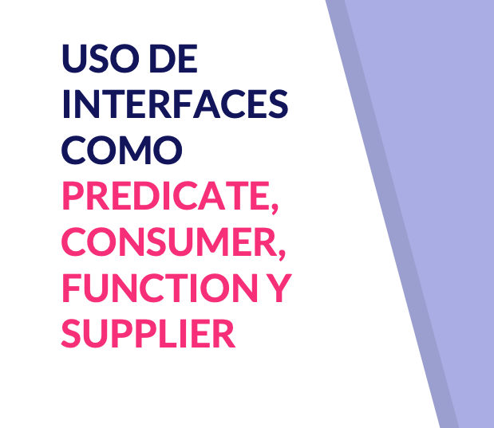
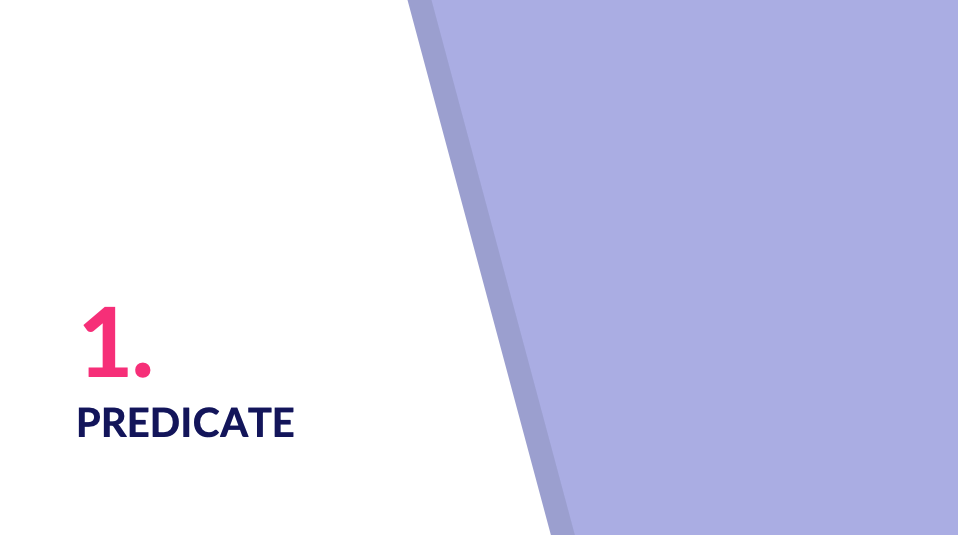
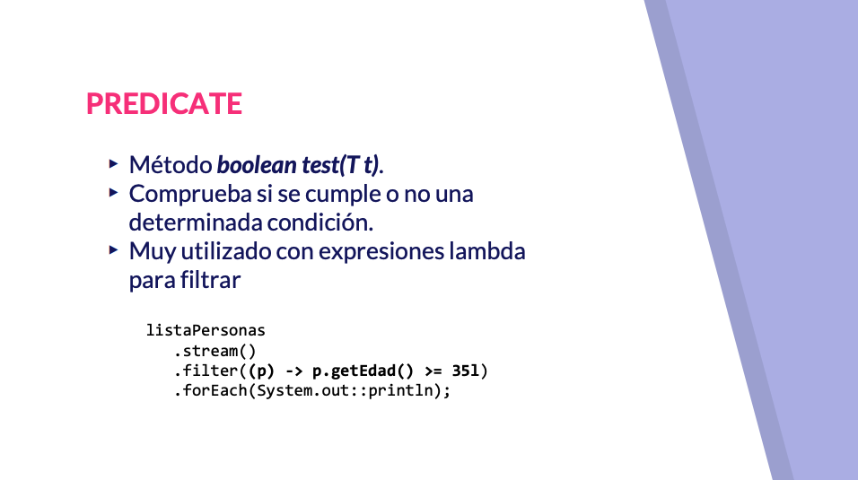

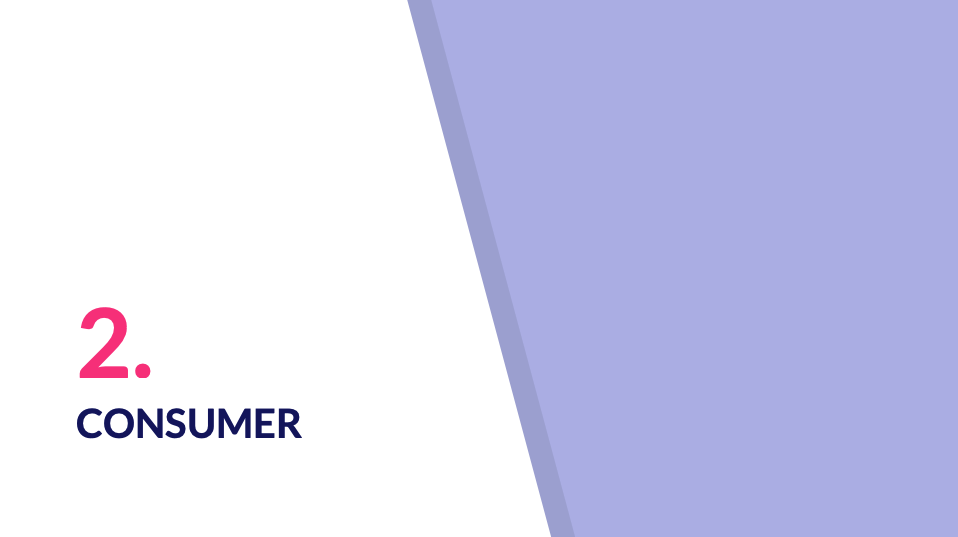
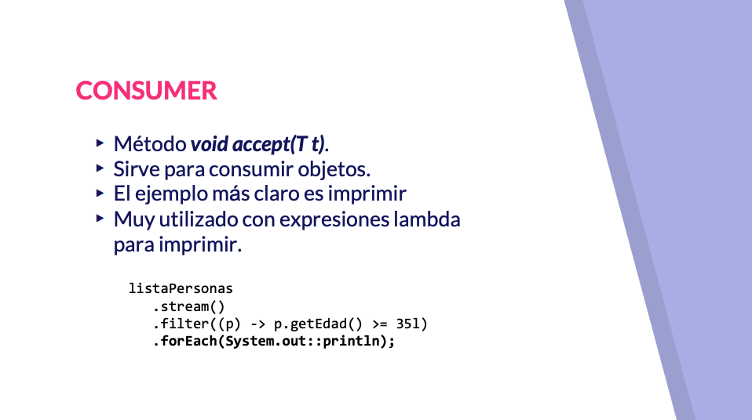
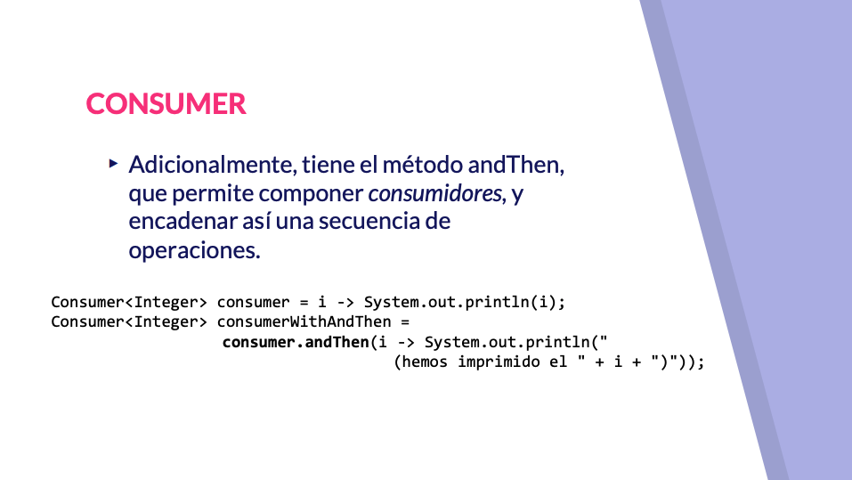
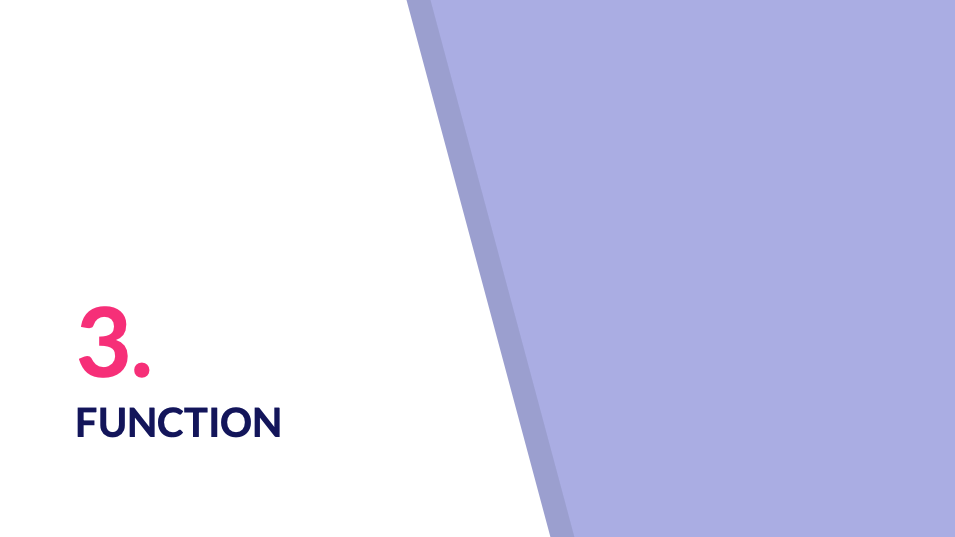
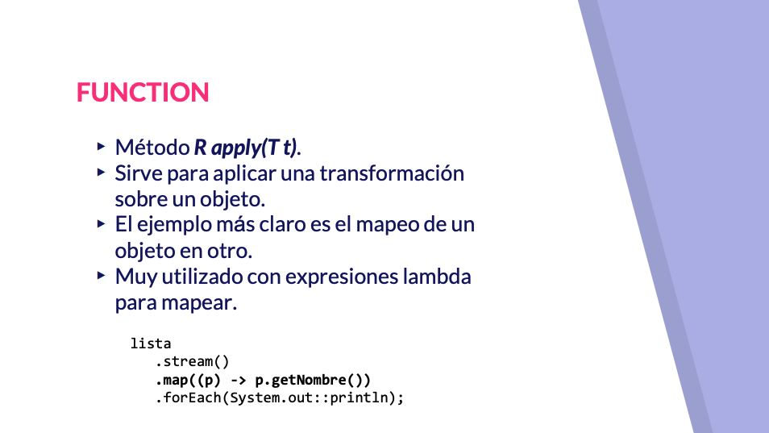
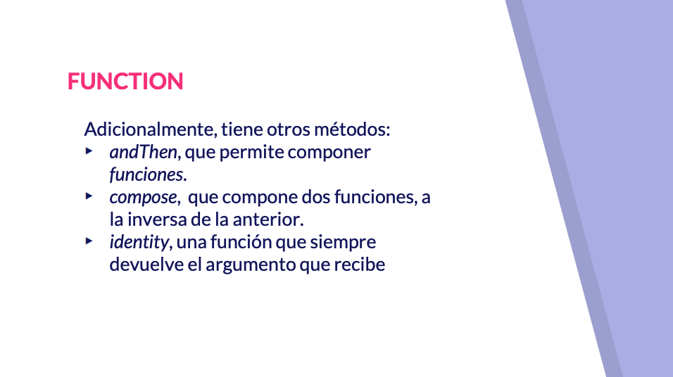
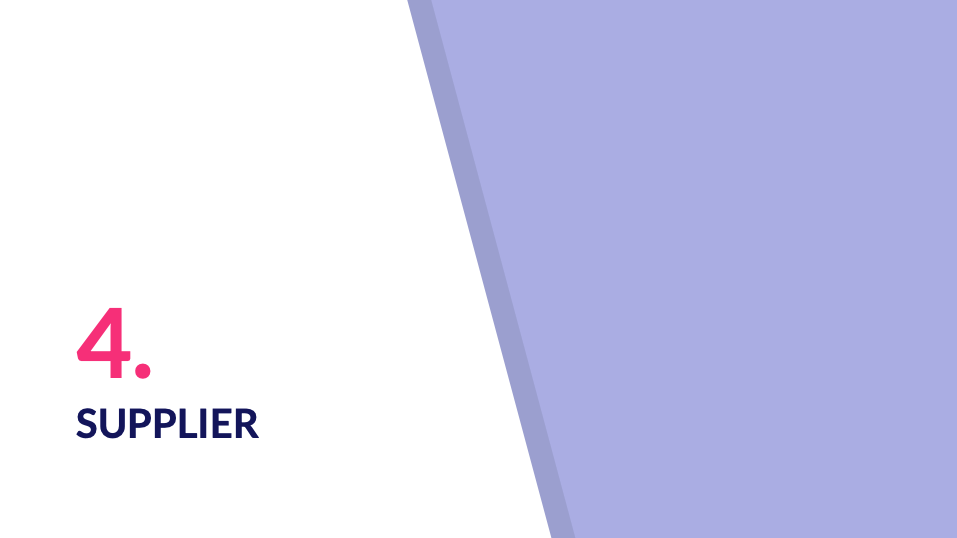
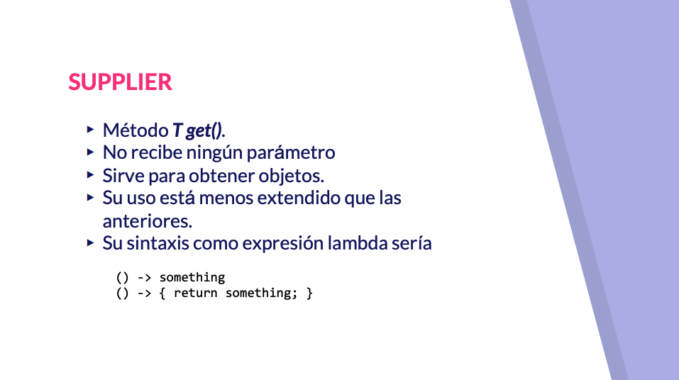
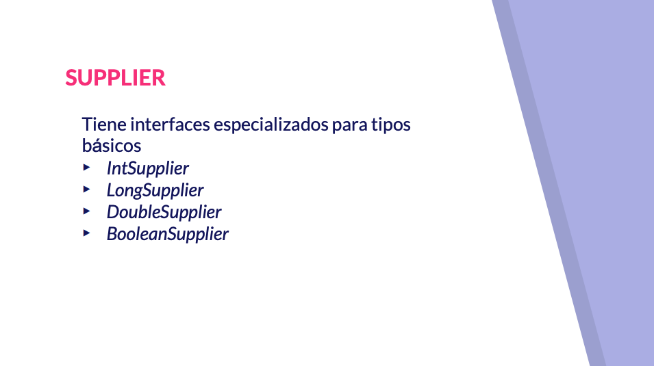

Concluir este bloque hablando de terminada interfaces funcionales que serán muy interesantes en el siguiente bloque el siguiente será bastante amplio y en el conocemos el apio este qué es la gran novedad que nos ofrece Java 8 porque además ha impregnado de alguna otra manera el resto de elementos recabados y también trata de cambiarnos un poco el chip en cómo programa para trabajar con ese será fundamental que conozcamos alguna de las cuatro interfaces que vamos a presentar ahora porque ya digo que estará muy muy muy utilizada mesa interfaces on predicado consumer función y su plan comencemos con la interfaz predicado predicado se trata de una interfaz funcional vale que tiene un método que Julián te que va a aceptar un palo y el método te lo que va a devolver un valor verdadero o falso y no solo en función de si se cumple o no una determinada condición tenemos que casa perfectamente con el uso de expresiones lambda y lo usaremos sobre todo para filtrar en el lápiz 3D hecho el método intermedio filter de tren para recibir un predicado y permitirá hacer las veces de vuelo de un colador que deje pasar a 1 elementos sí supongamos que tenemos una lista de persona podríamos filtrar las personas en función de si la edad es mayor o igual a 35 además este método abstracto nos proporciona otros métodos que bueno nos permiten construir predicados más complejos a partir de predicado sencillo por ejemplo podríamos hacer el olor de los predicados definido o edad o negaron predicado conocido vale que son las operaciones lógicas más virtual veamos un ejemplo qué es una clase normal podríamos crear una lista de persona y podríamos filtrar para que nos quedáramos solamente con las personas que tienen más de 35 años o 35 más menos 2 de esta manera podemos ver qué de todas las personas que hemos definido te animaría solamente tendría en 35 o más aquellos que bueno a día de hoy hubieran nacido en el año 1982 no entonces tendríamos que Juan y Ana que son los que han nacido anterior a esta fecha si pasarían el filtro María y Pepe que han nacido con posterioridad bueno normal podemos como decía con poner predicado más complejo utilizando a por Monkey esta manera el complejo sería el olor del predicado edad con nombre que filtrar y aquellos que tengan en su apellido la letra E podemos comprobar como ahora estoy en el filtro los cuatro porque tienes no tienen 35 años más y tienen una e en su apellido en lugar de Lord utilizamos una veríamos como entonces el resultado cambiaría este caso se tiene que cumplir las dos condiciones y solamente aparece en aquellos a quien ha dado la casualidad de que ambos dos contienen la letra E la letra dibujaramos que contuvieran otra otra letra la verdad es que son todas compartida no nos daría lugar podríamos poner otra condición dice pero bueno aquí podemos comprobar como sean compuestos los dos predicados no tal y como bueno si estuviéramos haciendo un mail con condiciones que tiene un método que recibe elementos de un tipo y que no retorna nada y que sirve para ir consumiendo los elementos que se le vayan proporcionando el ejemplo más normal que conocemos es el consumir elemento en el en un string y usarlo para por ejemplo imprimir vale esos valor se van consumiendo porque se van imprimiendo por consola es precisamente el tipo de objeto que espera el método foreach' bueno que hemos conocido también con las conexiones no y que esperaría o bien una instancia de una clase que implemente la interfaz funcional o la expresión Landa correspondientes como por ejemplo el primer N adicionalmente tenemos el método Andes que nos permitiría componer consumidores es decir podríamos realizar una operación consumiendo ese objeto y antes de descartarlo y no poder rescatarlo de nuevo pasárselo a otro consumidor que estaría compuesto podríamos encadenar cuántos consumidores desearán con Esther vale este caso por ejemplo vemos como tenemos un consumidor que va a imprimir un número y a continuación podríamos decir hemos impreso por ejemplo no tendríamos aquí podríamos consumir los números con un experto en Landa directamente tenemos aquí el método estática imprimir lista que espera una lista y espera un consumidor vale hija cómo estamos utilizando aquí el consumidor para aceptar cada uno de los de los números vale básicamente esto el recorrerlo y aceptarlo en función del tipo es lo que lo que haría el metrópolis por ejemplo de que hablábamos antes de los destinos de las conexiones aquí podríamos utilizarlo como como instancia aunque sea definida mediante una expresión lambda y aquí citados cómo podemos componer un consumidor con otro para que si lo utilizamos pues el tratamiento va a ser diferente si estaba en este el último cómo quitarlo bien lo que hace aplicar primero este consumidor que lo que hacía era imprimir un número con un espacio delante allí y después imprimir la expresión hemos imprimido el número que sea aplicar un salto de niña de manera que cuando llamamos esto vamos imprimiendo no no aquí podríamos componer lo podríamos ponerlo con otro consumidor mal respecto a la interfaz con su vamos a pasar a otra a la interfaz función que tiene un método abstracto que apply que recibe un elemento de un tipo y retorna un elemento de otro tipo diferente sobre todo para hacer transformaciones de objeto y el ejemplo más claro que vamos a tener en el API Stream es el mapeo de un objeto en otro y además muy usado mediante expresiones lambda tenemos que por ejemplo si quisiéramos listar los nombres de una persona siendo personas una clase podríamos iterar sobre septrin y mapear la persona obteniendo solamente su nombre vale ahí estamos proporcionando una expresión lambda para la interfaz funcional función vale para el método apply en particular que como vemos recibe un argumento de tipo persona y devuelve un argumento de tipo green que después de imprimir no ofrece a subir la interfaz funcional función otros métodos como andén que nos permite componer dos funciones dónde se aplicaría primero la primera y después la segunda compose hace lo mismo que anden pero lo aplica a la inversa y la función identity que también será bastante útil en algunos contextos que lo que hace es retornar la identidad es decir devuelve el argumento que recibe esto aunque parezca mentira tendrá su utilidad de dentro de la de las excepciones Landa valen algunos contesta veamos algún ejemplo vale que tiene todo lo habitual y podríamos crear una función que nos traduzca de persona nombre que recibe una persona y devuelva el nombre podríamos tener un método que nos transformara empleado el nombre como hemos visto antes que recorre a la lista y que fuera llamando al método apply vale de extracción función función y la operación de la transformación vamos a comentar este código de aquí comprobamos en lugar de imprimir nos contó screen las tres personas no imprimiría solamente los nombres todo esto que hemos entregado aquí para el final recorriendo de esta manera no podríamos resumir con dos expresiones lambda vale como podrían ser externo en la que tras formaríamos una persona en su nombre como podéis comprobar está extrayendo del contexto el tipo persona no hay que indicarlo explícitamente lo recogen principalmente o tendría la persona y aquí utilizaríamos un consumer para imprimirlo por consola y esto y comentamos igual por último nos queda en interpass playa que tiene un método que podríamos decir que es el antagonista de Consumer porque es un método llamado que no recibe ningún argumento pero que si devuelve un objeto vale sirve básicamente para obtener objetos Suso en principio está menos extendido que las anteriores pero veremos que también tiene tiene su su campo de actuación su sintaxis como expresión Landa sería algo como lo que tenemos aquí abajo pues ya veremos cuando trabajemos con la referencia al método el nombre de una clase llamando al operador mío vale tiene interfaz especializados para determinar los tipos básicos como un supplier me entero de lo de doble o de valores Boolean veamos algún ejemplo de playa supongamos que tenemos la clase vale que tiene bueno pues alguno me todo incluso también uno estático bueno como podemos comprobar aquí podemos crear un supplier para instanciar un objeto vale era una de las misiones más típicas con esto hacemos utilización de hacemos uso de la referencia a método podemos comprobar como el método get the supplier partir de método estático vale para obtenerlo y aquí lo veríamos con otras sintaxis de expresiones blanca no para obtener otro valor en este caso de una cadena de caracteres tendrá su campo de actuación que podremos ver con el API stream terminando con su player terminamos con este bloque a partir de ahora en el bloque siguiente nos lanzaremos de lleno a trabajar con él a pie entre o ánimo a que lo vayáis haciendo con paciencia va a ser uno de los bloques más largos del curso pero podremos conocer toda la potencia y riqueza de este nuevo API

## Contenido adicional 2   

[Interfaces funcionales](pdfs/14_Interfaces_funcionales.pdf)

[Predicate, consumer, function y supplier](pdfs/15_Uso_de_interfaces_como_Predicate_Consumer_Function_y_Supplier.pdf)
