# 5. Java Stream API 106m

   * 16 Introducción al API Stream 16:04 
   * 17 Métodos de búsqueda de datos 6:27 
   * 18 Métodos de datos, cálculo y ordenación 10:25 
   * 19 Uso de Map y flapMap 12:04 
   * 19 Uso de la clase Collector 19:28 
   * 20 Uso de streams y filtros 8:27 
   * 21 Referencias a métodos con stream 10:55 
   * Práctica: Todos los elementos del API stream trabajando conjuntamente 22:25 
   * Contenido adicional 7
   
# 16 Introducción al API Stream 16:04 

[Introducción al API Stream](pdfs/16_Introducción_al_API_Stream.pdf)

## Resumen del Profesor

### 16.1 Introducción

El API Stream es una de las grandes novedades de Java SE 8, junto con las expresiones lambda. Permite realizar operaciones de filtro/mapeo/reducción sobre colecciones de datos, de forma secuencial o paralela.

Un Stream es una secuencia de elementos que soporta operaciones para procesarlos

* Usando expresiones lambda

* Permitiendo el encadenamiento de operaciones (para producir así un código que se lee mucho mejor y es más conciso)

* De forma secuencial o paralela

En Java, los streams vienen definidos por el interfaz `java.util.stream.Stream<T>`.

### 16.2 Características de un Stream

* Las operaciones intermedias retornan un Stream (permitiendo así el encadenamiento de llamadas a métodos).
* Las operaciones intermedias se encolan, y son invocadas al invocar una operación terminal.
* Solo se puede recorrer una vez; si lo intentamos recorrer una segunda vez, provocará una excepción.
* Utiliza iteración interna en lugar de iteración externa; así nos centramos en qué hacer con los datos, no en como recorrerlos.

### 16.3 Algunos subtipos de streams

En el caso de que vayamos a utilizar un stream de tipos básicos (`int`, `long` y `double`), Java nos proporciona las interfaces `IntStream`, `LongStream` y `DoubleStream`.

### 16.4 Formas de obtener un stream

* `Stream.of(...)`: retorna un stream secuencial y ordenado de los parámetros que se le pasan.
* `Arrays.streams(T[] t)`: retorna un stream secuencial a partir del array proporcionado. Si el array es de tipo básico, se retorna un subtipo de `Stream`.
* `Stream.empty()`: retorna un stream vacío.
* `Stream.iterate(T, UnaryOperator<T>)`: devuelve un stream infinito, ordenado y secuencial. Lo hace a partir de un valor y de aplicar una función a ese valor. Se puede limitar el tamaño con `limit(long)`.
* `Collection.stream()` y `Collection.parallelStream()`: devuelve un stream (secuencial o paralelo) a partir de una colección.
* `Collection.generate`: retorna un stream infinito, secuencial y no ordenado a partir de una instancia de `Supplier` (o su correspondiente expresión lambda).

### 16.5 Operaciones intermedias

Son operaciones que devuelven un `Stream`, y por tanto, permiten encadenar llamadas a métodos. Sirven, entre otras funcionalidades, para filtrar y transformar los datos.

#### 16.5.1 Operaciones de filtrado

* `filter(Predicate<T>)`: nos permite filtrar usando una condición.
* `limit(n)`: nos permite obtener los n primeros elementos.
* `skip(m)`: nos permite *obviar* los m primeros elementos.

#### 16.5.2 Operaciones de mapeo

* `map(Function<T,R>)`: nos permite transformar los valores de un stream a través de una expresión lambda o una instancia de `Function`.
* `mapToInt(...)`, `mapToDouble(...)` y `mapToLong(...)` nos permite transformar a tipos básicos, obteniendo `IntStream`, `DoubleStream` o `LongStream`, respectivamente.

### 16.6 Operaciones terminales

Provocan que se ejecuten todas las operaciones intermedias. Las hay de varios tipos:

* Para consumir los elementos (por ejemplo, `forEach`)
* Para obtener datos de un stram (agregación)
* Para recolectar los elementos y transformarlos en otro objeto, como una colección.

## Transcripción

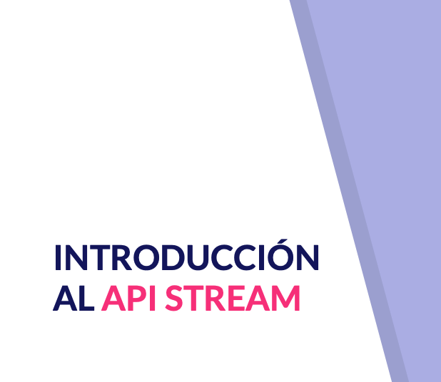
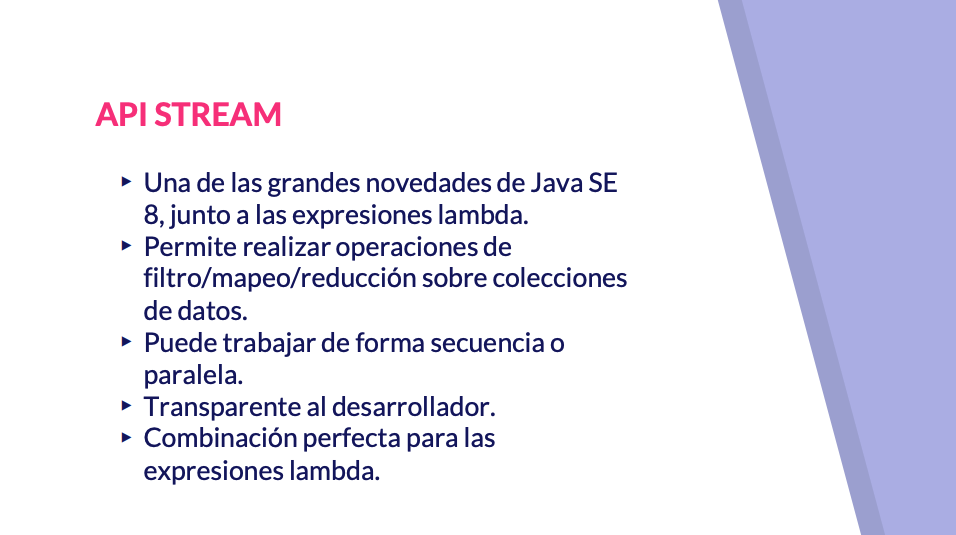
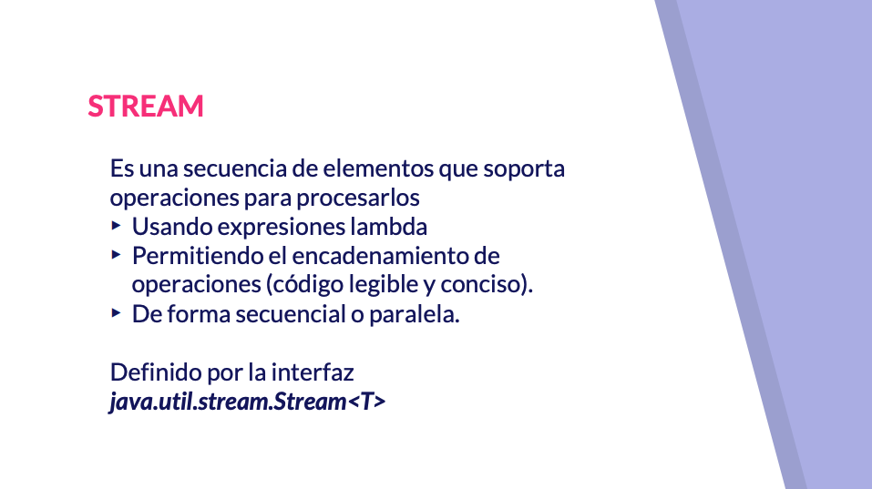
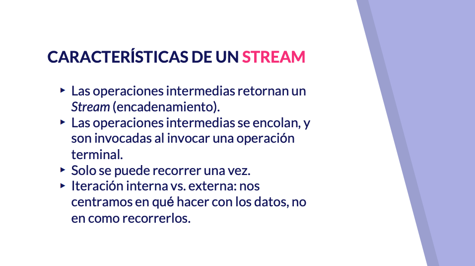

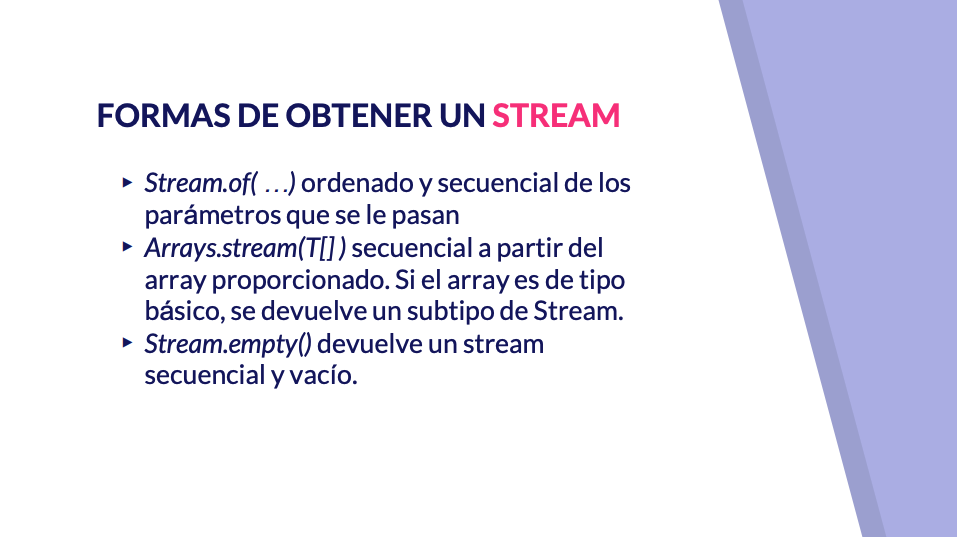
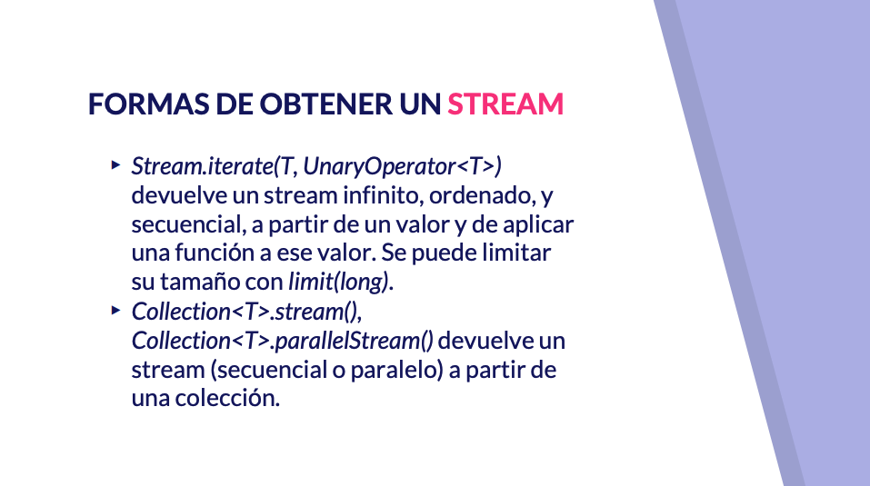
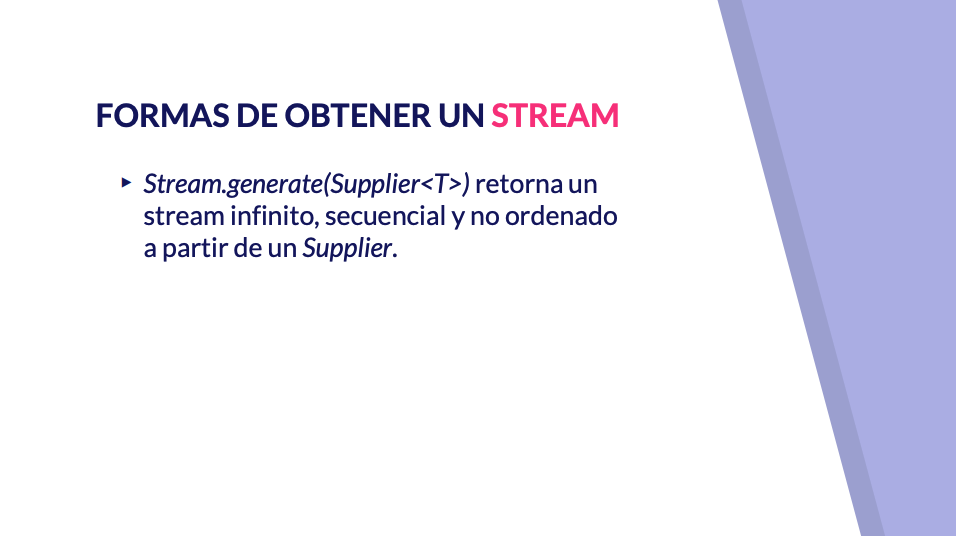
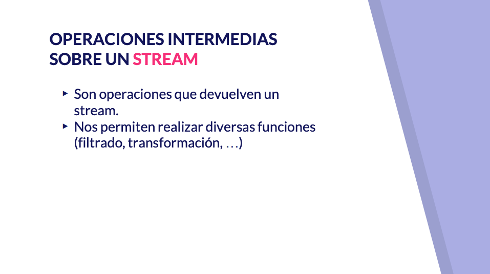
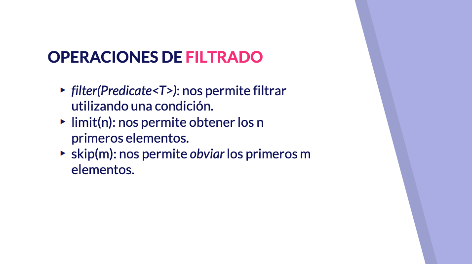

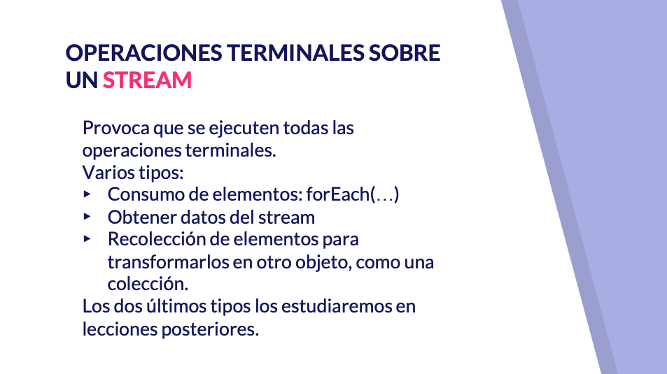

# 17 Métodos de búsqueda de datos 6:27 

[Métodos de búsqueda de datos](pdfs/17_Métodos_de_búsqueda_de_datos.pdf)

## Resumen del Profesor

### 17.1 Métodos de búsqueda

Son un tipo de operaciones terminales sobre un stream, que nos permiten:

* Identificar si hay elementos que cumplen una determinada condición

* Obtener (si el stream contiene alguno) determinados elementos en particular.

Algunos de los métodos de búsqueda son:

* `allMatch(Predicate<T>)`: verifica si todos los elementos de un stream satisfacen un predicado.
* `anyMatch(Predicate<T>)`: verifica si algún elemento de un stream satisface un predicado.
* `noneMatch(Predicate<T>)`: opuesto de `allMatch(...)`
* `findAny()`: devuelve en un `Optional<T>` un elemento (cualquiera) del stream. Recomendado en streams paralelos.
* `findFirst()` devuelve en un `Optional<T>` el primer elemento del stream. *NO RECOMENDADO* en streams paralelos.

## Transcripción

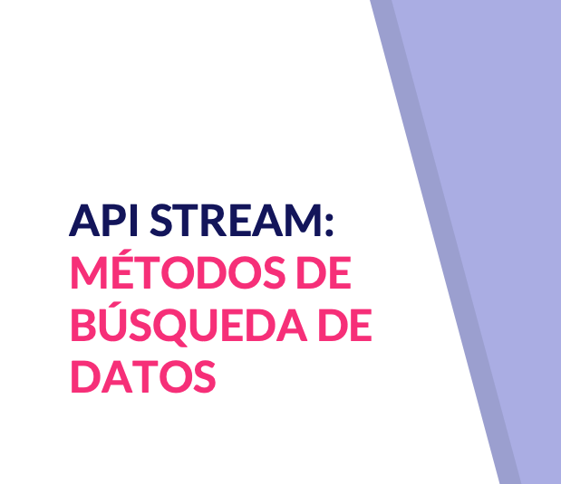
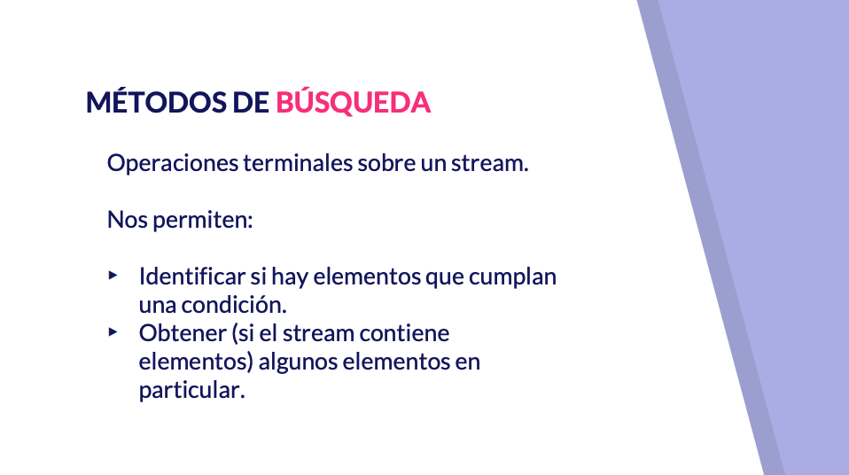
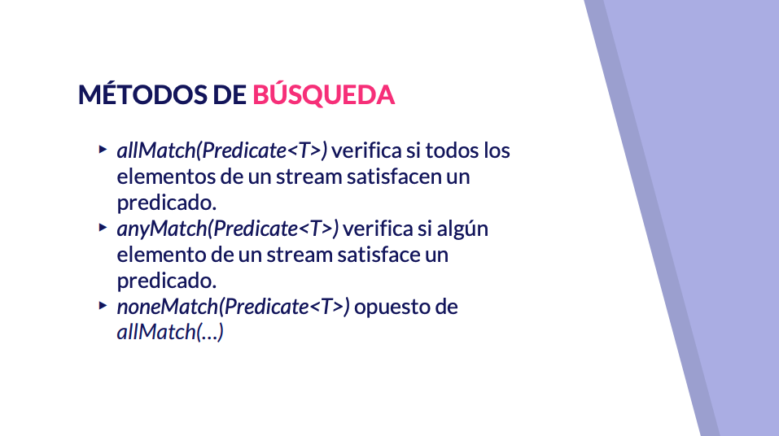
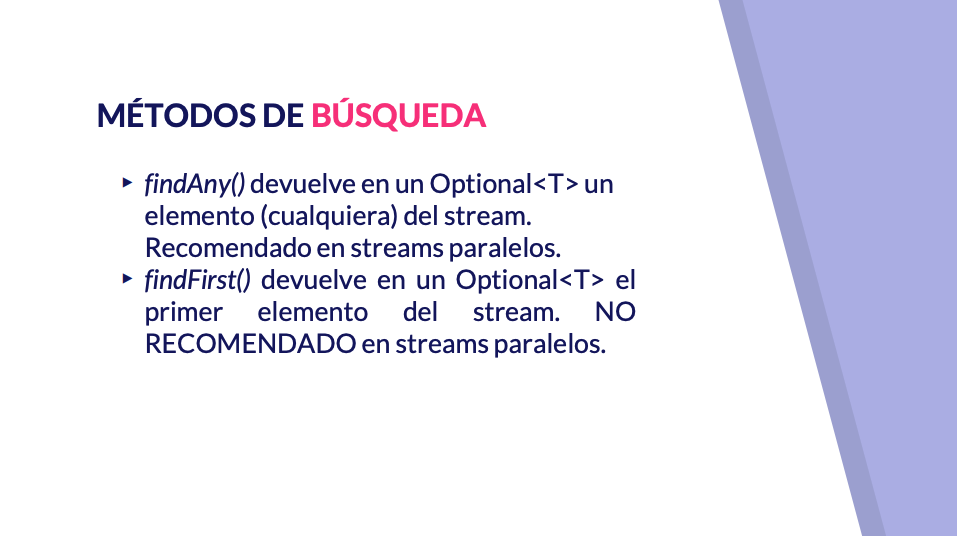

# 18 Métodos de datos, cálculo y ordenación 10:25 

[Métodos de datos, cálculo y ordenación](pdfs/18_Métodos_de_datos_cálculo_y_ordenación.pdf)

## Resumen del Profesor

### 18.1 Métodos de datos y cálculo

Los streams nos ofrecen varios tipos de métodos terminales para realizar operaciones y cálculos con los datos. Durante el curso trabajaremos con tres tipos:

* Reducción y resumen (en esta lección)
* Agrupamiento
* Particionamiento

### 18.2 Métodos de reducción

Son métodos que reducen el stream hasta dejarlo en un solo valor.

* `reduce(BinaryOperator<T>):Optional<T>` realiza la reducción del Stream usando una función asociativa. Devuevle un Optional
* `reduce(T, BinaryOperator<T>):T` realiza la reducción usando un valor inicial y una función asociativa. Se devuelve un valor como resultado.

### 18.3 Métodos de resumen

Son métodos que resumen todos los elementos de un stream en uno solo:

* `count`: devuelve el número de elementos del stream.
* `min(...), max(...)`: devuelven el máximo o mínimo (se puede utilizar un `Comparator` para modificar el orden natural).

### 18.4 Métodos de ordenación

Son operaciones intermedias, que devuelven un stream con sus elementos ordenados.

* `sorted()` el stream se ordena según el orden natural.
* `sorted(Comparator<T>)` el stream se ordena según el orden indicado por la instancia de `Comparator`.

## Transcripción

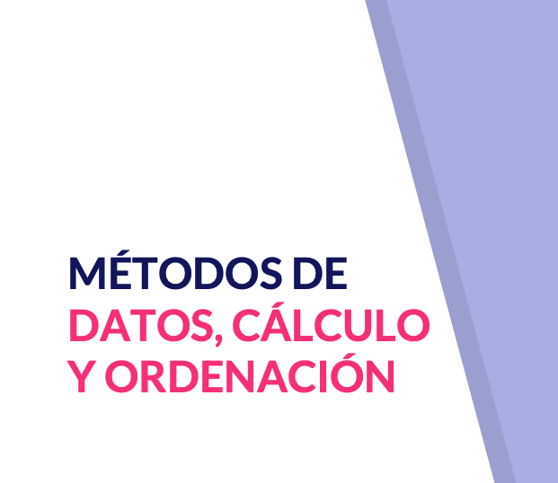
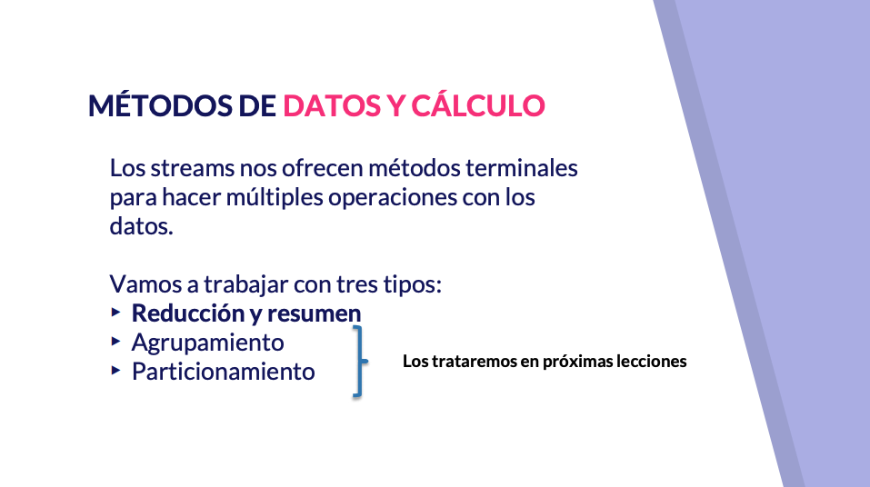


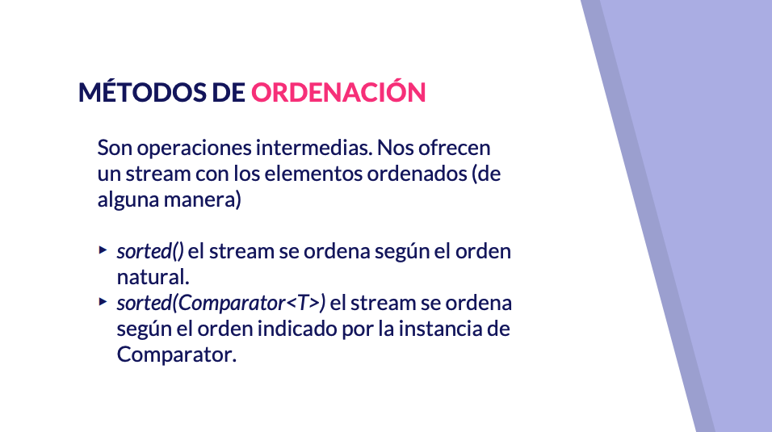

# 19 Uso de Map y flapMap 12:04 

[Uso de Map y flapMap](pdfs/19_Uso_de_map_flatMap_y_Collector.pdf)

## Resumen del Profesor

### 19.1 Uso de map

`map` es una de las operaciones intermedias más usadas, ya que permite la transformación de un objeto en otro, a través de un `Function<T, R>`. Se invoca sobre un `Stream<T>` y retorna un `Stream<R>`. Además, es muy habitual realizar transformaciones sucesivas.

```java
lista
   .stream()
   .map(Persona::getNombre)
   .map(String::toUpperCase)
   .forEach(System.out::println);
```

### 19.2 Uso de `flatMap`

Los streams sobre colecciones de un nivel permiten transformaciones a través de `map` pero, ¿qué sucede si tenemos una colección de dos niveles (o una dentro de objetos de otro tipo)?:

```java
public class Persona {

    private String nombre;
    private List<Viaje> viajes = new ArrayList<>();

  //resto de atributos y métodos
}
```

Para poder trabajar con la colección interna, necesitamos un método que nos unifique un `Stream<Stream<T>>` en un solo `Stream<T>`. Ese es el cometido de `flatMap`.

```java
lista
   .stream()
   .map((Persona p) -> p.getViajes())
   .flatMap(viajes -> viajes.stream())
   .map((Viaje v) -> v.getPais())
   .forEach(System.out::println);
```

También tenemos disponibles las versiones primitivas `flatMapToInt`, `flatMapToLong` y `flatMapToDouble`:

```java
Arrays
    .stream(numeros)
    .flatMapToInt(x -> Arrays.stream(x))
    .map(IntUnaryOperator.identity())
    .distinct()
    .forEach(System.out::println);
```

## Transcripción


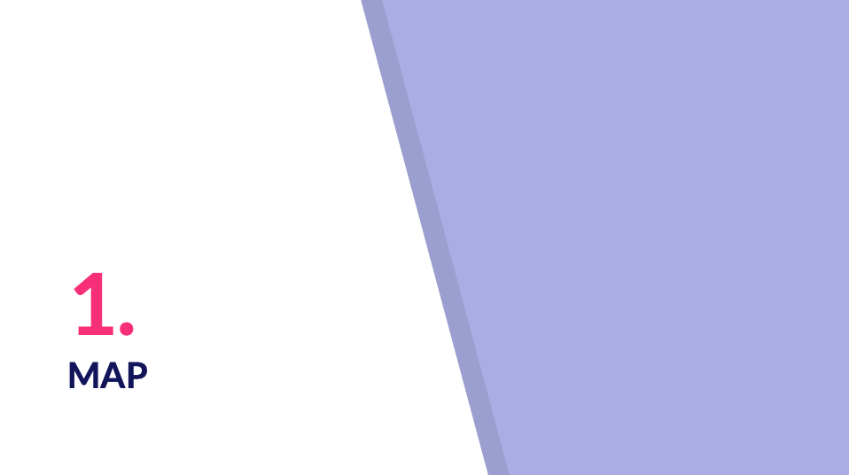
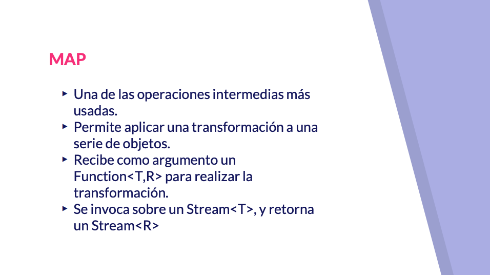
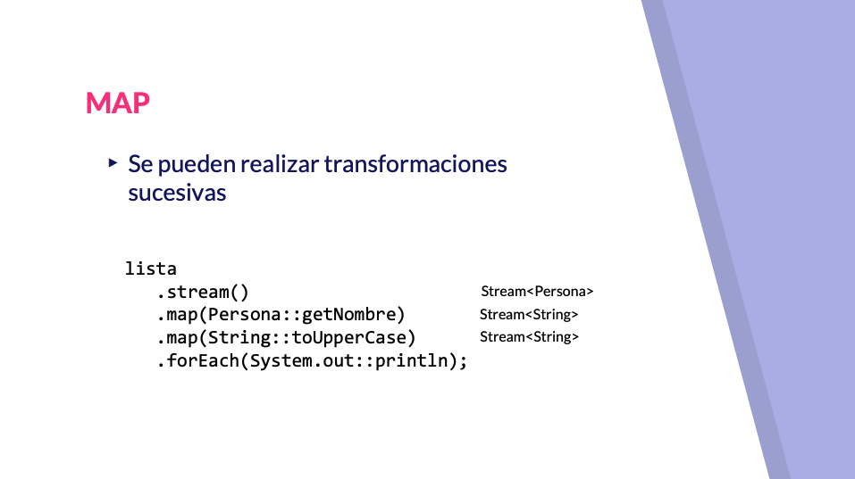

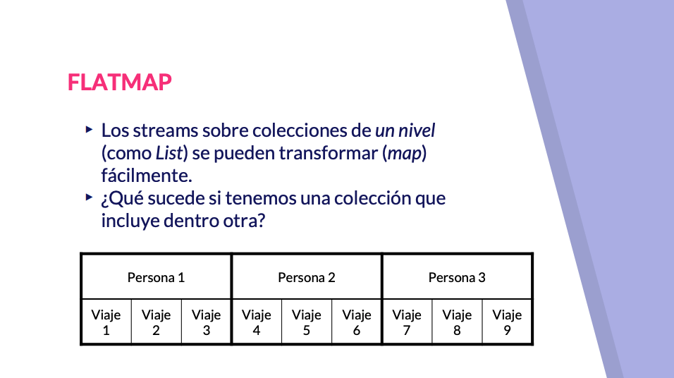
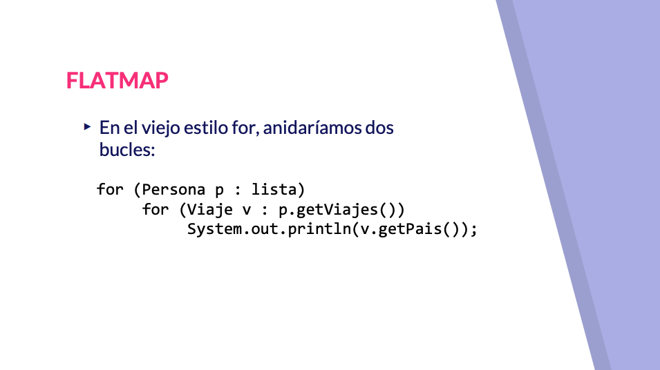

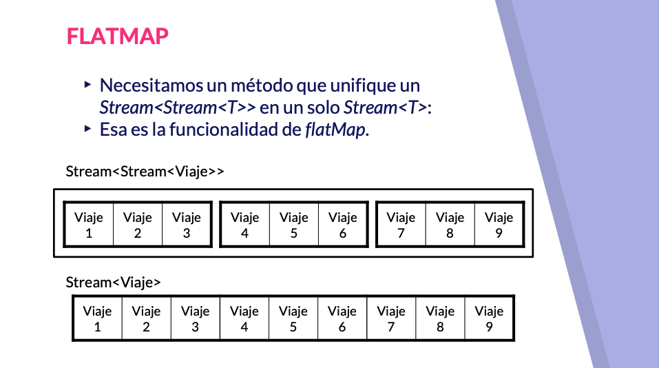
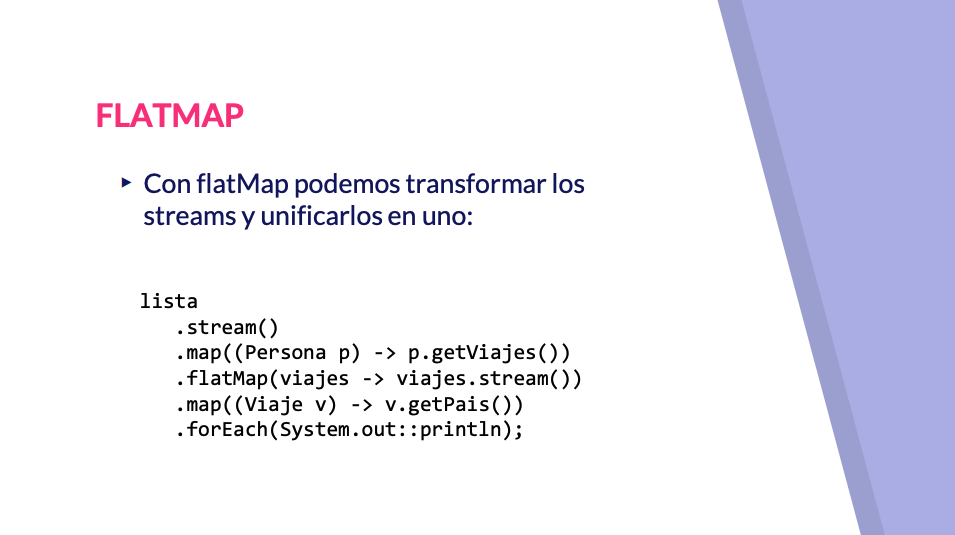
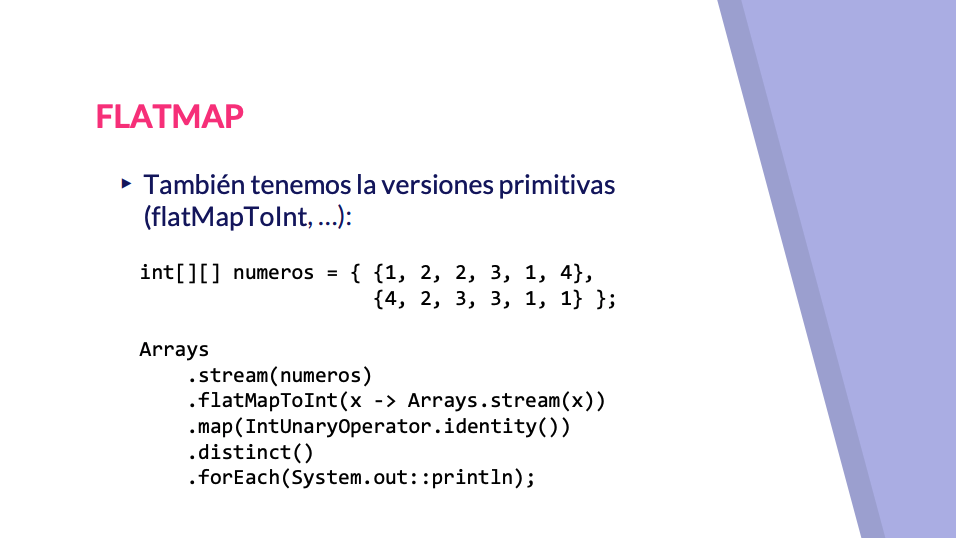

# 19 Uso de la clase Collector 19:28 

[Uso de la clase Collector](pdfs/19_Uso_de_map_flatMap_y_Collector.pdf)

## Resumen del Profesor

### 19.3 Collectors

Los *collectors* nos van a permitir, en una operación terminal, construir una collección *mutable*, el resultado de las operaciones sobre un *stream*.

### 19.3.1 Colectores “básicos”

Nos permiten operaciones que recolectan todos los valores en uno solo. Se solapan con alguans operacinoes finales ya estudiadas, pero están presentes porque se pueden combinar con otros colectores más potentes.

* `counting`: cuenta el número de elementos.
* `minBy(...)`, `maxBy(...)`: obtiene el mínimo o máximo según un comparador.
* `summingInt`, `summingLong`, `summingDouble`: la suma de los elementos (según el tipo).
* `averagingInt`, `averagingLong`, `averagingDouble`: la media (según el tipo).
* `summarizingInt`, `summarizingLong`, `summarizingDouble`: los valores anteriores, agrupados en un objeto (según el tipo).
* `joinning`: unión de los elementos en una cadena.

### 19.3.2 Colectores “grouping by”

Hacen una función similar a la cláusula GROUP BY de SQL, permitiendo agrupar los elementos de un stream por uno o varios valores. Retornan un `Map`.

```java
Map<String, List<Empleado>> porDepartamento =
   empleados
     .stream()
     .collect(groupingBy(Empleado::getDepartamento));
```

Se pueden usar en conjunción cno los colectores básicos, o con otro colector *grouping by*:

```java
Map<String, Long> porDepartamentoCantidad =
   empleados
      .stream()
      .collect(groupingBy(Empleado::getDepartamento, counting()));

Map<String, Map<Double, List<Empleado>>> porDepartamentoYSalario =
   empleados
     .stream()
     .collect(groupingBy(Empleado::getDepartamento, groupingBy(Empleado::getSalario)));
```

También tenemos los colectores *partitioning*, que nos agrupan los resultados dos conjuntos, según si cumplen una condición:

```java
Map<Boolean, List<Empleado>> salarioMayorOIgualque32000 =
   empleados
     .stream()
     .collect(partitioningBy(e -> e.getSalario() >= 32000));
```
  
### 19.3.3 Colectores “Collection”

Producen como resultado una colección: List, Set y Map.

```java
Set<Empleado> setEmpleados = empleados.stream().collect(Collectors.toSet());
List<Empleado> listEmpleados = empleados.stream().collect(Collectors.toList());
Map<String, Double> mapEmpleados = empleados.stream().distinct()
                .collect(Collectors.toMap(Empleado::getNombre, Empleado::getSalario));
```

## Transcripción


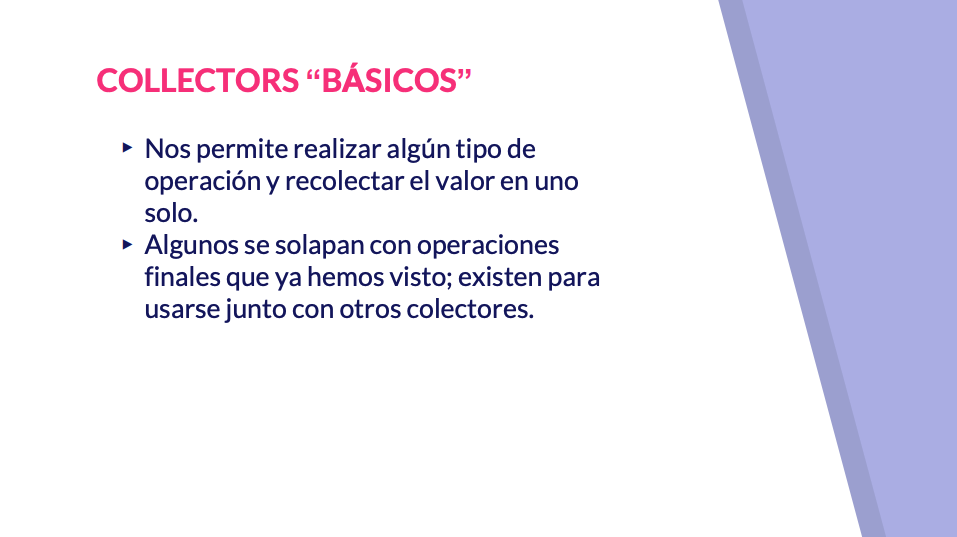

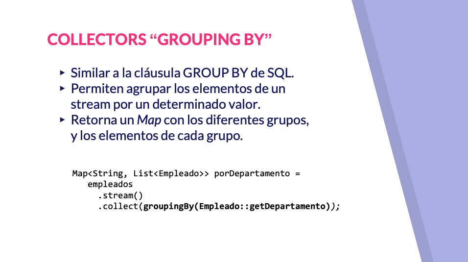
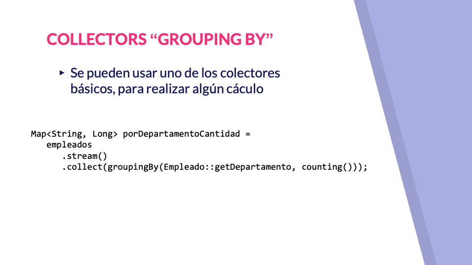
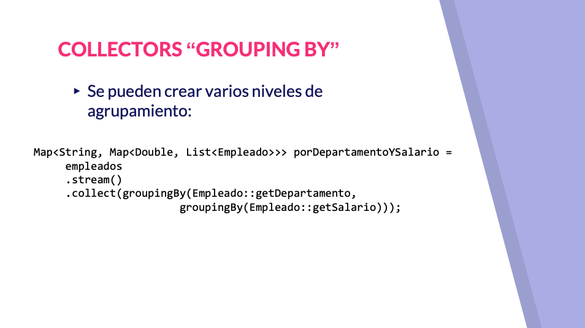

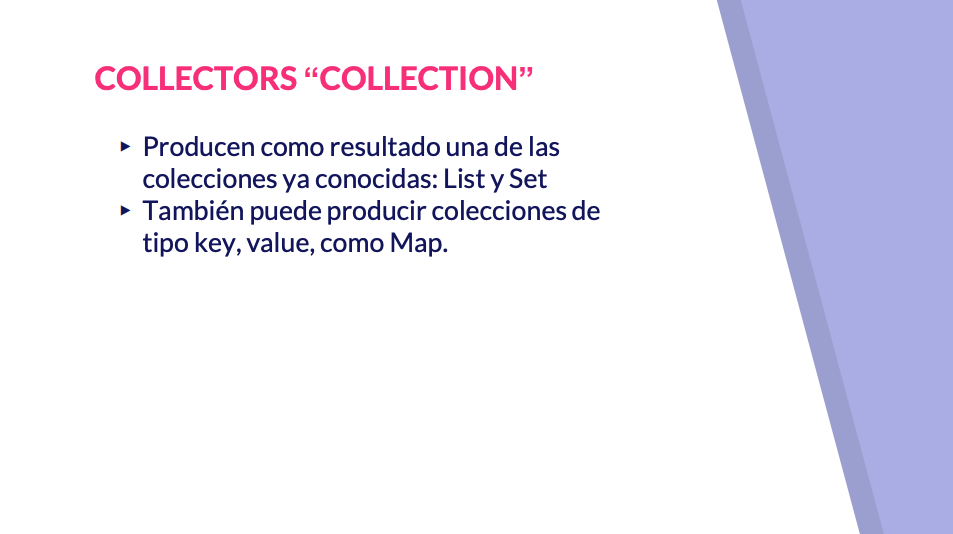

# 20 Uso de streams y filtros 8:27 

[Uso de streams y filtros](pdfs/20_Uso_de_streams_y_filtros.pdf)

## Resumen del Profesor

### 20.1 `streams` y `filtros`

`filter` es una operación intermedia, que nos permite *eliminar* del stream aquellos elementos que no cumplen con una determinada condición, marcada por un `Predicate<T>`.

```java
personas
      .stream()
      .filter(p -> p.getEdad() >= 18 && p.getEdad() <= 65)
      .forEach(persona -> System.out.printf("%s (%d años)%n", persona.getNombre(), persona.getEdad()));
```            
            
Es muy combinable con algunos métodos como `findAny` o `findFirst`:

```java
Persona p1 = personas
                   .stream()
                   .filter(p -> p.getNombre().equalsIgnoreCase("Andrés"))
                   .findAny()
                   .orElse(new Persona());
```

Y se puede usar también en streams sobre colecciones tipo `Map`.

```java
Map<Integer, Persona> personas = new HashMap<>();
//Inicialización
personas.entrySet()
            .stream()
            .filter(map -> map.getKey() >= 5)
            .collect(Collectors.toMap(p -> p.getKey(), p -> p.getValue()))
            .forEach((key, value) -> System.out.printf("%d: %s%n", key, value.getNombre()));
```

## Transcripción


# 21 Referencias a métodos con stream 10:55 

[Referencias a métodos con stream](pdfs/21_Referencias_a_métodos.pdf)

## Resumen del Profesor

### 21.1 Referencias a métodos

Las referencias a métodos son una forma de hacer nuestro código aun más conciso:

```java
public class Persona {
   //…
   public static int compararPorEdad(Persona a, Persona b) {
      return a.fechaNacimiento
                  .compareTo(b.fechaNacimiento);
   }
}

//...

List<Persona> personas = //...

// De menos a más "conciso"
personas.sort((Persona p1, Persona p2) -> {
   return p1.getFechaNacimiento()
      .compareTo(p2.getFechaNacimiento());
});

personas.sort((p1, p2) -> p1.getFechaNacimiento()
                                .compareTo(p2.getFechaNacimiento()));

personas.sort(Persona::compararPorEdad);
```

### 21.2 Tipos de referencias a métodos

* `Clase::metodoEstatico`: referencia a un método estático.
* `objeto::metodoInstancia`: referencia a un método de instancia de un objeto concreto.
* `Tipo::nombreMetodo`: referencia a un método de instancia de un objeto arbitrario de un tipo en particular.
* `Clase::new`: referencia a un constructor.

## Transcripción

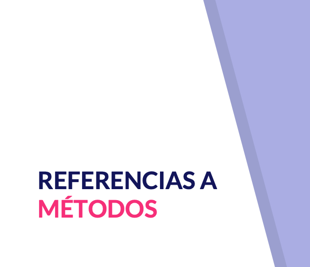

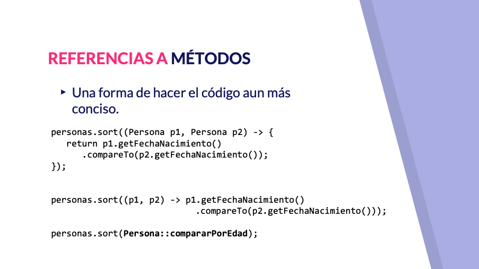
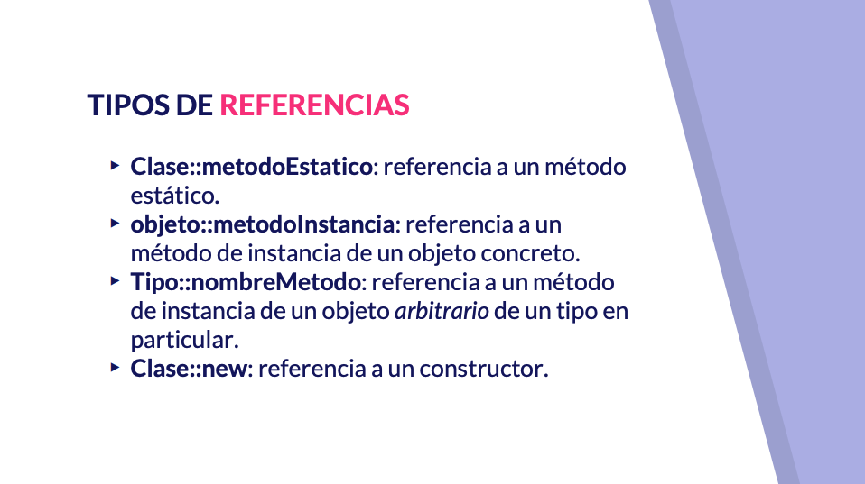


# Práctica: Todos los elementos del API stream trabajando conjuntamente 22:25 

Ponemos en práctica todo los elementos del API stream trabajando conjuntamente

## Transcripción

## Contenido adicional 7   

[Introducción al API Stream](pdfs/16_Introducción_al_API_Stream.pdf)

[Métodos de búsqueda de datos](pdfs/17_Métodos_de_búsqueda_de_datos.pdf)

[Métodos de datos, cálculo y ordenación](pdfs/18_Métodos_de_datos_cálculo_y_ordenación.pdf)

[Uso de Map y flapMap](pdfs/19_Uso_de_map_flatMap_y_Collector.pdf)

[Uso de la clase Collector](pdfs/19_Uso_de_map_flatMap_y_Collector.pdf)

[Uso de streams y filtros](pdfs/20_Uso_de_streams_y_filtros.pdf)

[Referencias a métodos con stream](pdfs/21_Referencias_a_métodos.pdf)

