# 6. Java I/O y NIO.2 105m

   * 23 Uso de flujos de salida 19:34 
   * 24 Uso de flujos de entrada 22:13 
   * 25 Trabajar con la clase file 7:09 
   * 26 Trabajar con la interfaz path 13:30 
   * 27 Utilizar métodos de la clase files 13:55 
   * 28 Uso de API Stream con NIO.2 9:07 
   * 29 Práctica de uso de Java NIO.2 19:51 
   * Contenido adicional 21

# 23 Uso de flujos de salida 19:34 

[Uso de flujos de salida ](pdfs/23_Uso_de_flujos_de_salida.pdf)

## Resumen del Profesor

### 23.1 Flujos

Son un canal de comunicación de las operaciones de entrada salida. Este esquema nos da independencia para poder trabajar igual tanto si estamos escribiendo en un fichero, como en consola, o si estamos leyendo de teclado, o de una conexión de red.

### 23.2 Tipos de Flujos

Dependiendo de su destino, tenemos:

* Flujos de entrada: sirven para introducir datos en la aplicación.
* Flujos de salida: sirven para sacar datos de la aplicación.

Dependiendo del contenido del flujo:

* Flujos de bytes: manejan datos en *crudo*.
* Flujos de caracteres: manejan caracteres o cadenas.

### 23.3 Flujos de salida

#### 23.3.1 Patrón básico de los flujos de salida

```
Abrir el flujo
Mientras hay datos que escribir
  Escribir datos en el flujo
Cerrar el flujo
```

#### 23.3.2 Flujos de salida de bytes

Algunas de las clases que podemos usar son:

* `OutputStream`: clase abstracta, padre de la mayoría de los flujos de bytes.
* `FileOutputStream`: flujo que permite escribir en un fichero, byte a byte.
* `BufferedOutputStream`: flujo que permite escribir grupos (buffers) de bytes.
* `ByteArrayOutputStream`: flujo que permite escribir en memoria, obteniendo lo escrito en un array de bytes.

#### 23.3.3 Flujos hacia otros flujos

Solo FileOutputStream tiene un constructor que acepta una ruta (entre otras opciones). El resto reciben en sus constructores un tipo de OutputStream. ¿Por qué? Porque podemos construir flujos que escriben en flujos (encadenados).

```java
BufferedOutputStream bos = new BufferedOutputStream(new FileOutputStream("fichero.dat"));
```

#### 23.3.4 Flujos de salida de caracteres

* `Writer`: clase abstracta, padre de la mayoría de los flujos de caracteres.
* `FileWriter`: flujo que permite escribir en un fichero, caracter a caracter.
* `BufferedWriter`: flujo que permite escribir líneas de texto.
* `StringWriter`: flujo que permite escribir en memoria, obteniendo lo escrito en un String
* `OutputStreamWriter`: flujo que permite transformar un OutputStream en un Writer.
* `PrintWriter`: flujo que permite escribir tipos básicos Java.


## Transcripción


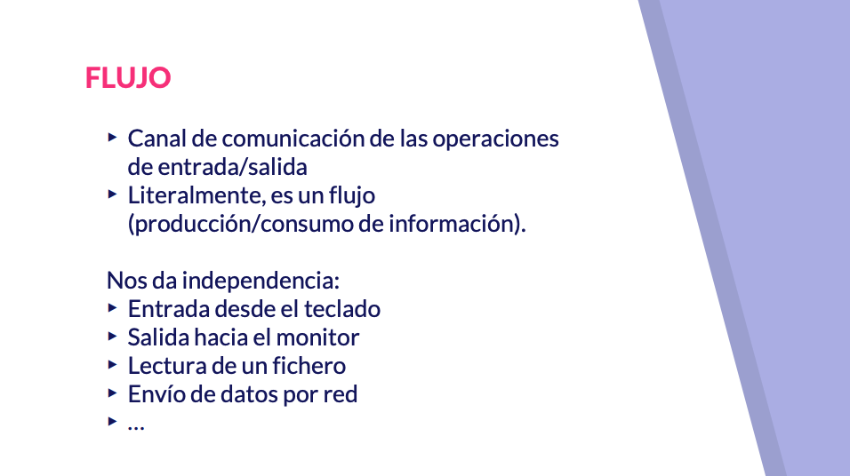
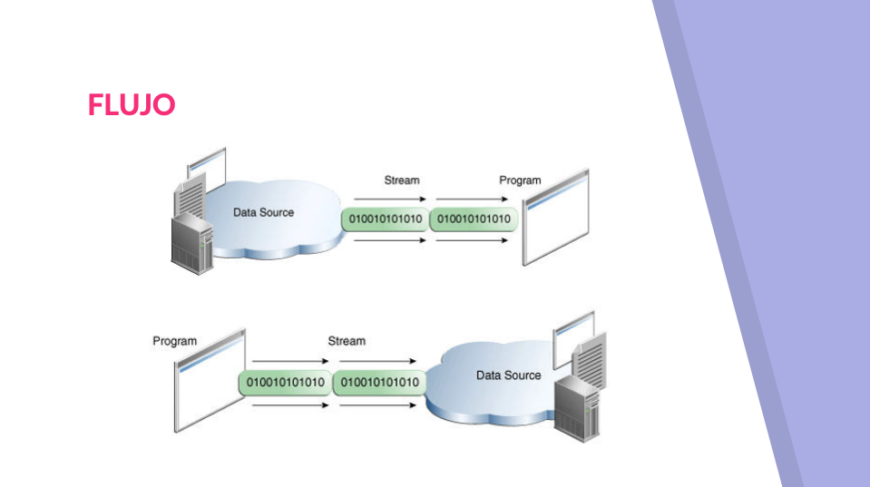
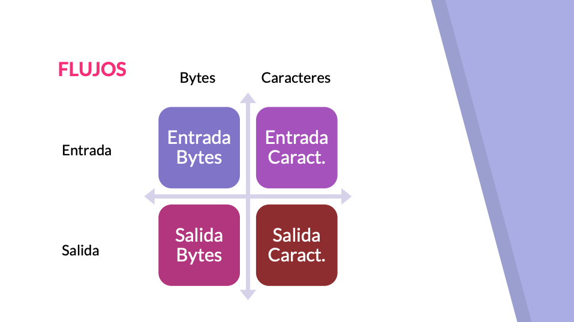
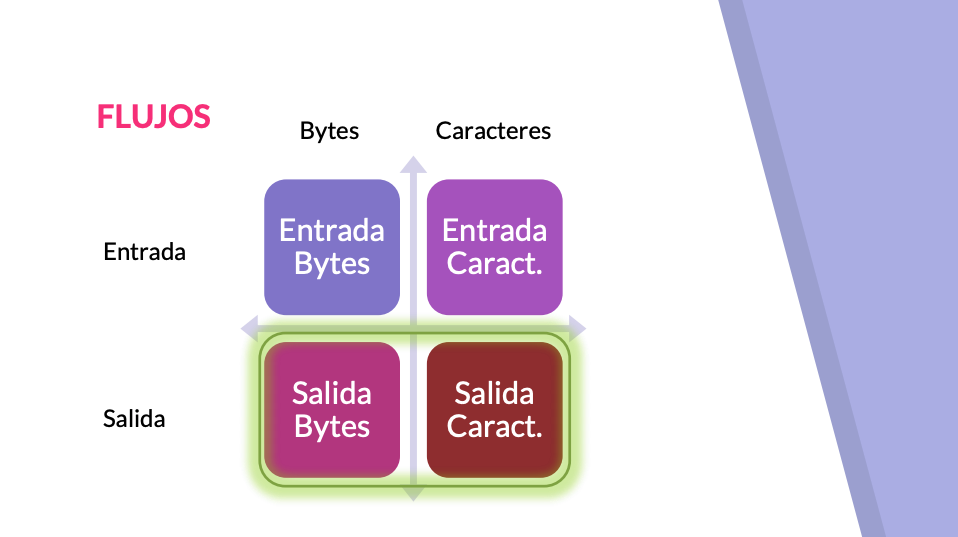
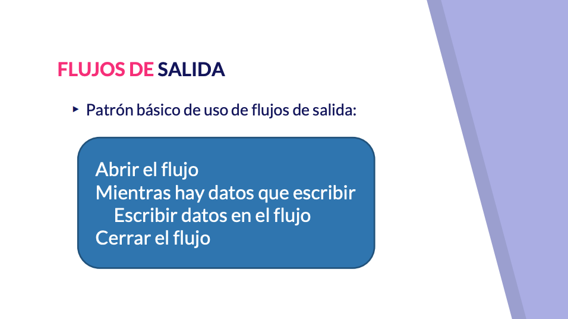
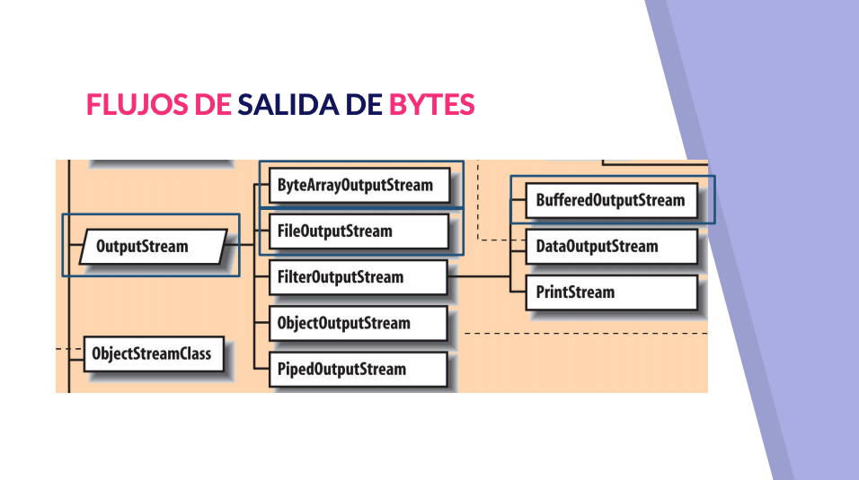
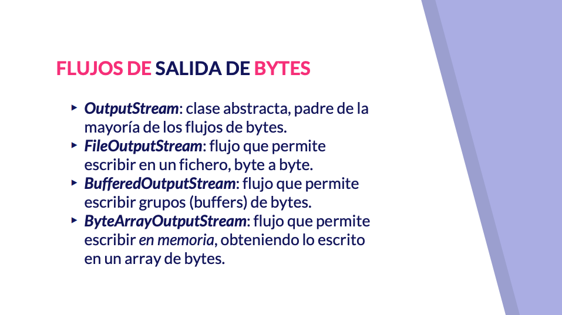
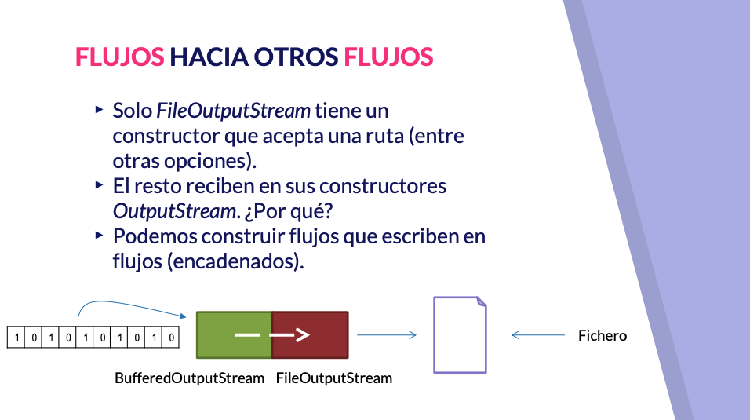
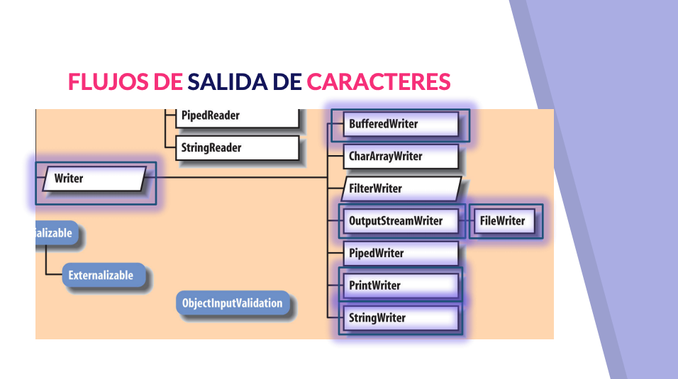
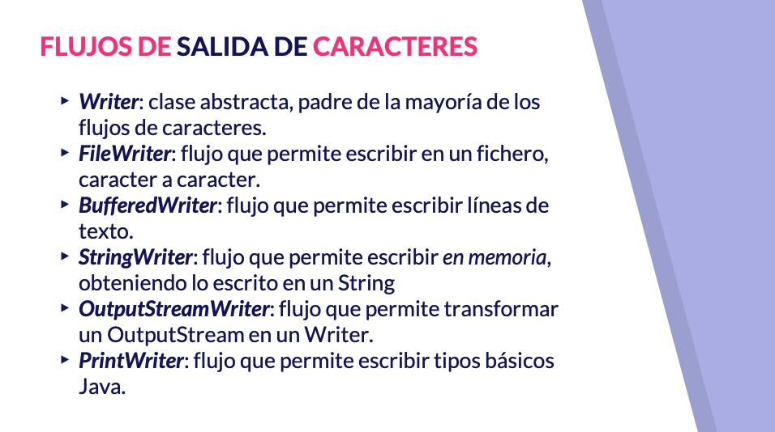

Vamos a comenzar con un nuevo bloque en el que podremos trabajar con flujos y sincero en este primer vídeo del nuevo bloque dejaba y hoy estaba nio2 vamos a trabajar con flujos de salida para poder comenzar tenemos que explicar el concepto de flujo en Java un flujo es una extracción de un canal de comunicación de una operación de entrada o de salida en el fondo no es más que una producción o un consumo de información entre dos extremos realizar está acción nos da independencia de bueno cuál es el origen o el destino de ese flujo de información con lo cual podríamos trabajar de la misma manera con la entrada del teclado con la salida hacia el monitor o una impresora la lectura de un fichero o el envío de datos por red ya digo notaría un esquema de trabajo como un chorro de bain desde un origen de datos que podría ser cualquiera un fichero servicio de red introducir por teclado vale por cualquier medio un chorro de banquete dirigían hacia nuestro programa y también lo podríamos ver como otro chorro de by qué bueno desde nuestro programa se dirige hacia otro destino como esté conectada vamos a trabajar con algunos tipos de flujo en particular flujos de entrada y de salida en este vídeo abundaremos sobre los flujos de salida pero vamos a diferenciarlos mediante este cuadrante porque trabajaremos con flujos de entrada y de salida y también diferenciaremos para los de entrada y los de salida de flujo que trabajan y nivel de byte en crudo y con los que específicamente trabajas con carácter este vídeo nos centraremos en los flujos de salida vestir que existe siempre un patrón básico de trabajo que consistirá en el siguiente algoritmo abriremos el flujo pero no operación muy importante porque sin abrir el flujo sin establecer la comunicación entre los dos puntos no podríamos trabajar con el una vez que nos aceleramos que ese flujo está abierto nos pondríamos a escribir datos mientras que haya gatos que escribir en una estructura de bucle y una vez que no nos quieren datos escribir cerraremos ofrece dentro del paraguas del paquete Java hijo mogollón de flujo sobre los cuales podemos trabajar en particular para los de salida de bite tenemos todas estas clases no vamos a conocerlas todas porque no merece la pena y nos centraremos en las que están resaltadas no en OutputStream to byte array of blood stream file OutputStream y Mapfre Street porque existen tantas que hace bueno porque cada una tiene su cometido en particular es una clase abstracta es decir una clase que no se puede instanciar pero que nos vale como padre de la mayoría de los flujos de eBay que tenemos a nuestra disposición PC Optimus Prime el flujo de bytes de salida más básico sería file output stream empiezo flujo que nos permite escribir vais a byte en un fichero otro truco que hemos comentado con lo sé bien que nos permite escribir grupo lote eBay vale para que seas más grande será bastante más eficiente obteniendo después todo lo que hemos escrito en memoria en ese flujo en un array de bytes podemos tener también la idea de plantearnos un flujo que escribe o se apoya en otro flujo y eso tiene un uso bastante completo hemos dicho por ejemplo que FileOutputStream es un truco que nos permite escribir en ficheros pero no es permite escribir paisa bike escribe en otro flujo de salida documentación de salida de tipo desde optiprim el flujo de bytes de salida más básico sería file OutputStream y eso flujo que nos permite escribir by Alive en un fichero tendríamos otro truco que hemos comentado como serían paz Pérez OutputStream qué es un flujo que nos permite escribir grupos es decir para hacer lotes de bite vale para ficheros que ser más grande será bastante más eficiente y otra que bueno que podré usar en determinados contextos sería byte array stream que sería un flujo que permitiría escribir en memoria obteniendo después todo lo que hemos escrito en memoria en este flujo en un array de bytes podemos tener también la idea de plantearnos un flujo que escribe o se apoya en otro flujo y eso tiene un uso bastante concreto hemos dicho por ejemplo que FileOutputStream es un flujo que nos permite escribir en ficheros pero no es permite escribir payday flujo que vive en otro flujo de salida de hecho si miramos en la documentación escribirán un flujo de salida de tipo OutputStream es decir cualquiera pero que nos permite escribir lotes de bite si conjugamos ambos y construimos un bafre put screen sobre un FileOutputStream obtendremos una estructura que nos permitirá trabajar con un flujo de salida que escribir a los de treball en un sistema de esa manera compuesta podríamos obtener el flujo que sea Poten antes de ver los flujos de salida desde caracteres veamos algún ejemplo de los flujos de salida de bar vale un primer ejemplo de nos va a permitir el que podamos escribir vais vale con el método write no va a permitir que escribamos en un sitio la estructura de escritura de bite en ocasiones puede resultar un poco llamativa y confuso vamos a tratar de clarificar bueno en primer lugar podemos comprobar como la estructura va a ser casi siempre la misma a no ser que queramos utilizar un tritón recursos que sería de toda la aplicación en este caso lo he querido dejar con una estructura de cerámica más clásica para que podamos evidenciar todas las operaciones que tenemos que realizar de hecho se trata de una estructura drive o multiplicar página por qué porque como decíamos el patrón básico de trabajo que vamos a tener para hacer la de el patrón de instanciar el flujo de abrir el canal de comunicación procesar los datos mientras lo haya escribir datos en el flujo y cerraron recogemos los posibles errores

Cualquiera pero que nos permite escribir lotes de byte si conjugamos ambos y construimos un bafre put stream sobre un FileOutputStream obtendremos una estructura que nos permitirá trabajar con un flujo de salida que escribir a los de eBay en un sitio vale de esa manera compuesta podríamos obtener el flujo que sea potente antes de ver los flujos de salida de caracteres veamos algún ejemplo de los flujos de salida nevar vale un primer ejemplo de Fairy stream nos va a permitir el que podamos escribir vais vale con el método write no va a permitir que escribas os vais en un sitio la estructura que viene el hada de TC de escritura de bite en ocasiones puede resultar un poco llamativa y confuso vale vamos a tratar de clarificar bueno en primer lugar podemos comprobar como la estructura va a ser casi siempre la misma a no ser que queramos utilizar un tripón recurso que sería de toda la aplicación en este caso lo he querido dejar con con una estructura de trike haz más clásica para que podamos evidenciar todas las operaciones que tenemos que realizar de hecho se trata de una estructura trae multiplicar porque porque como decíamos el patrón básico de trabajo que vamos a tener para hacer la de el patrón de instanciar el flujo de abrir el canal de comunicación procesar los datos mientras los escribir y cerrar todo lo hacemos procesar los datos mientras no haya escribir datos en el flujo mientras no vaya y cerrar el flujo todo ello lo hacemos en un bloque try recogemos los posibles errores lo que en varios bloques acá y en el finalice inexorablemente tanto si hemos finalizado el bloque a través del trail por lo hemos finalizado a través del caz en el bloque finally cerraría mosaico como podemos comprobar además el cierre del flujo puede provocar a subir otra excepción con lo cual tendríamos que tener un plus un bloque try catch dentro del bloque five esa estructura que va a hacer genérica nos permite que nosotros podamos trabajar con garantías con un flujo en particular para poder hacerlo de esa manera tendríamos que decir la referencia el flujo fuera o podéis comprobar al 0ut sprint una clase abstracta nos permite hacer referencia a cualquier rojo vale esto lo indicamos también aquí para que podamos reutilizar lo que ya sabemos de clase abstracta como clase que nos permite guardar referencia de cualquier subtipo de ella inicializado Anul de hecho si no lo inicializamos nos va eclipse se va a quejar centro del bloque try catch inicializar y amos el flujo mediante el constructor de FileOutputStream to be un nombre de fichero más que el nombre sería una ruta vale y no le indicamos más que el nombre del fichero bueno pues lo va a almacenar en el caso de trabajar con Eclipse en la raíz del proyecto que es el punto de partida y como decía la manera de trabajar con vais en este tipo de flujo para hacer un poco llamativa porque viene dada la fe Java incluso incluye el tipo byte no se puede utilizar pero a la hora de escribir lo que hace escribir los como enteros y solamente imprime la parte correspondiente os vais es decir lo que necesita el resto lo pinto de ver entero que tiene 4 byte nosotros tres países con los descartaría incluso si queremos utilizar este los más largos no lo va a tener en cuenta en este caso lo querías el imprimir y el número si queremos modificarlo para comprobar que que bueno que los números más grandes de 255 no imprime pues podríamos intentar imprimir 1000 vale para ver qué vamos a tener allí como resultado de todas maneras te va a escribir en binario vale ejecutamos este este Código en principio no sucede nada pero lo que sí ha sucedido que esto va a producir código vamos a eliminar esto vale vamos a volver a ejecutar aquí no aparece a la izquierda pero no aparece porque no hemos refrescado tendríamos que refrescar botón derecho reflex ya tenemos aquí primero.la está vale y si queremos acceder a él lo podríamos abrir con el editor de texto y ya digo lo que aparece es raro porque en el fondo esto está transformando a caracteres unos datos binarios que hay por debajo necesitaríamos un editor binario hexadecimal para poder verlo pero si podemos ver que aquí hay un patrón que se repite vale y es que como decía los números que se pueden almacenar son de 0 a 255 vale el resto de número trascienden lo que sería la cantidad de byte que realmente se están escribiendo vale si queréis saber algo más sobre la cantidad de baile en la documentación lo indica pero bueno los 24 bits más significativos de número que se le pasa son despreciados utilizando solamente lo 8 bit menos significativo ya digo el trabajar directamente con con un flujo así binario posiblemente no nos no no aporte nada sin embargo si quisiéramos trabajar con un bar friends que nos permitiría trabajar con los de Face promoción ya que no conocemos todavía los flujos de entrada vamos a suponer que hemos obtenido a partir de de algún medio una cantidad de bytes que vamos a almacenar en un vaper un vaper como decías un lote de by un array de tipo byte dejada me hace caso va a ser de 32k procesión una cantidad de bytes que vamos a almacenar en un vaper un vaper como decías un lote de by un array de tipo byte pesada me hace caso hacer de 32k lo único que va a hacer es rellenar un determinado array de byte un valor en particular aquí lo que vamos a hacer para todos e indicar el valor 1 mediante este método de la clase envoltorio vale vale simplemente por tenerlo relleno con algo que no sea basura como decíamos bajes pon footstream no se puede crear para un fichero directamente se crearía para otro flujo pero así tendríamos la estructura que necesitaría construir iríamos un Mapfre opus stream sobre un file OutputStream si lo podemos crear sobre un fichero en particular el resto de la estructura es muy similar como podemos comprobar aquí en este caso vamos a escribir solamente un no lo haríamos con un bucle lo haremos con un bucle cuando veamos la lectura y aprovecharemos para hacer una lectura y escritura podemos comprobar aquí como escribimos de una tacada 32KB en un fichero que se va a generar de Amador mapfre.es la salida en apariencia no produce nada pero aquí tendríamos el sincero para hacer punto como decía necesitaríamos un editor hexadecimal porque en principio no se ve nada pero realmente ahí si hay datos y si queremos comprobar que sean grabados los 32 32768 el tamaño del Barcelona de Ecuador va a depender de mucho elementos 32KB pueden que sean o no adecuados lo que si os digo es que un tamaño demasiado pequeño puede ser que no nos aporta ningún beneficio al igual que un tamaño muy grande de decenas de megas por ejemplo tampoco podía ser porque en el fondo la controladora del disco duro estaría fracción a 30 operaciones operaciones más pequeñas y cuando podríais intentar para un contexto en particular plantear bueno pues diferentes tamaños de va a ser que si permitía ajustar un poco la velocidad vale de ejecución y cuál es la mejor manera para para ficheros más grande o más pequeño para byte array vale aquí haríamos un ejemplo parecido pero ya digo esto serviría para que pudiéramos escribir en un determinado flujo que realmente está escribiendo en memoria que nos permite después obtenerlo de una sola vez vale los flujos que trabajan con memoria son útiles para poder leer un fichero completo y escribirlo en memoria para poder trabajar con él o la operación inversa a partir de algo que tenemos en memoria montar un pájaro por lo queremos también con los de lectura y después poder trabajar con él como si se tratara de un flujo aquellos que luego podéis hacer el curso de Android podréis ver como en el tratamiento de imágenes vale si tienes que hacerlo alguna vez te queréis transformar una imagen comprimirla o cambiarle el tipo de PNG a jpg y utilizan va a hacer perdón byte array de este tipo no de entrada esto con respecto al flujo binario habíamos comentado también que íbamos a tener flujos de carácter en particular podremos comprobar como existe una especie de eje de simetría entre los flujos de Valls y los flujos de caracteres de manera que vamos a tener clase similares por no decir idénticas pero en el contexto de trabajar con caracteres para un putstring su espejo en este caso con respecto al eje de simetría vamos a trabajar algunas más como para frescura Intersport StreamWriter FileWriter PrintWriter no la vamos a definir rápidamente writer es la clase abstracta padre de la mayoría de los trucos de caracteres para ir al igual que FileOutputStream nos va a permitir escribir en un fichero particular caracteres carácter a carácter Splitter para ser un flujo que nos permitirá escribir líneas completas en instancias de String en un fichero lo hará en un flujo y si queremos apoyarnos en un Gibraltar en oxígeno StreamWriter va a ser como el byte array y nos permitirá escribir como si fuera un flujo pero después obtener todo lo escrito eh en un stream PrintWriter master un flujo que nos va a permitir escribir en aportar métodos para escribir directamente los tipos de datos básicos de Java io stream writer va a ser un flujo que nos va a permitir transformar uno de tipo binario en uno de tipo de caracteres vale para funcionar como fuerte podemos ver aquí un ejemplo de writer en escribiríamos en una sola línea carácter a carácter vale escribiríamos todo lo que tenemos aquí pero está escrito en letra letra vale aquí pero hay si acepta al igual que en el caso de File OutputStream un entero pero aquí no representa un vals sino que representa un carácter médico todo esto es herencia de las tentac system sin embargo nosotros podemos trabajar con chat y que delegar Android para que haga el casting automático de echar ahí y lo imprimiría de manera correcta la estructura del flujo es la misma que hemos visto para los flujos eBay definimos el flujo fuera dentro del trae lo instancia mostra bajamos recogemos las operaciones de error correspondientes concat vale en ese caso lo concentramos todo en la clase de extensión que el padre de todas las demás para las operaciones de entrada salida y excepción por último si quisiéramos trabajar con podríamos intentar escribir todas las cadenas de caracteres de una lista vale mediante una estructura como está no cree haríamos un bajar exploiter sobre un FileWriter vale ejercicio Quijote txt recorrería mediante un bucle todos los datos que tenemos escribiríamos y bueno bajaré writer tiene un método para que podamos invocar explícitamente que queremos un salto de línea vale dentro de este fichero de forma que sí bueno fue imprimimos esto tendríamos un nuevo fichero quería quijote.txt tiene el que podemos comprobar como se han almacenado todas las líneas que nosotros tenemos definida en está lista ahora que conocemos los flujos de salida vamos a conocer con respecto ya digo también existe una especie de eje de simetría con respecto a los de salida los flujos de entrada en el siguiente vídeo

# 24 Uso de flujos de entrada 22:13 

[Uso de flujos de entrada](pdfs/24_Flujos_de_entrada.pdf)

## Resumen del Profesor

## 24.1 Patrón básico de los flujos de entrada

```
Abrir el flujo
Mientras hay datos que leer
  Leer datos del flujo
  Procesar los datos
Cerrar el flujo
```

## 24.2 Flujos de entrada de bytes

Algunas de las clases que podemos usar son:

* `InputStream`: clase abstracta, padre de la mayoría de los flujos de bytes.
* `FileInputStream`: flujo que permite leer de un fichero, byte a byte.
* `BufferedInputStream`: flujo que permite leer grupos (buffers) de bytes.
* `ByteArrayInputStream`: flujo que permite leer de memoria (de un array de bytes).

## 24.3 Flujos de entrada de caracteres

Algunas de las clases que podemos usar son:

* `Reader`: clase abstracta, padre de la mayoría de los flujos de caracteres.
* `FileReader`: flujo que permite leer de un fichero, caracter a caracter.
* `BufferedReader`: flujo que permite leer líneas de texto.
* `StringReader`: flujo que permite leer desde la memoria.
* `InputStreamReader`: flujo que permite transformar un InputStream en un Reader.

## Transcripción


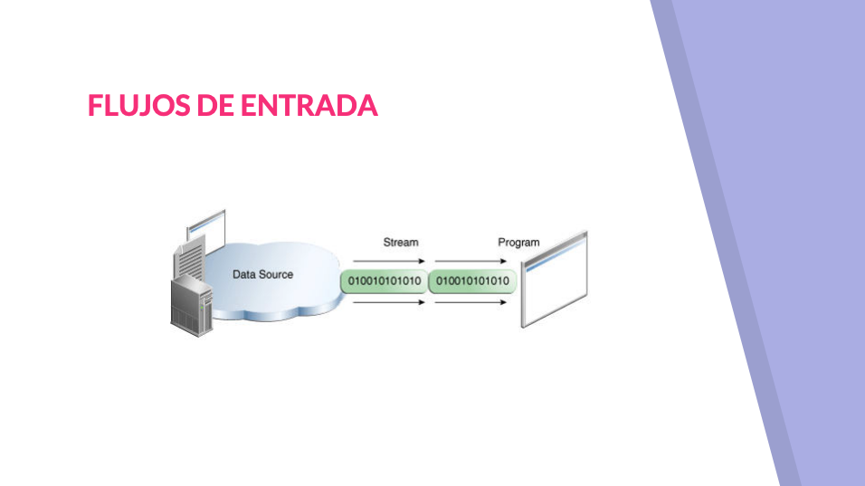
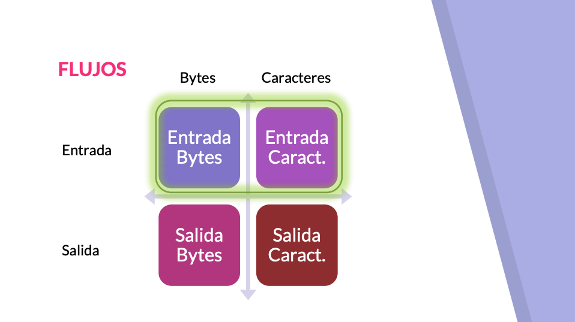
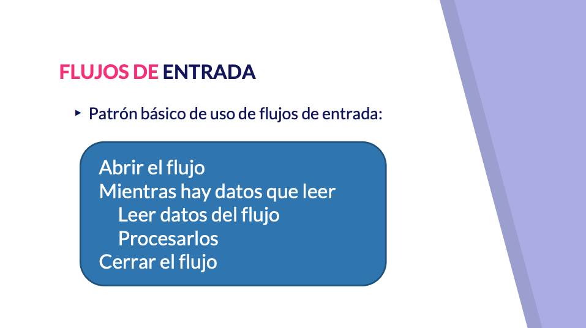
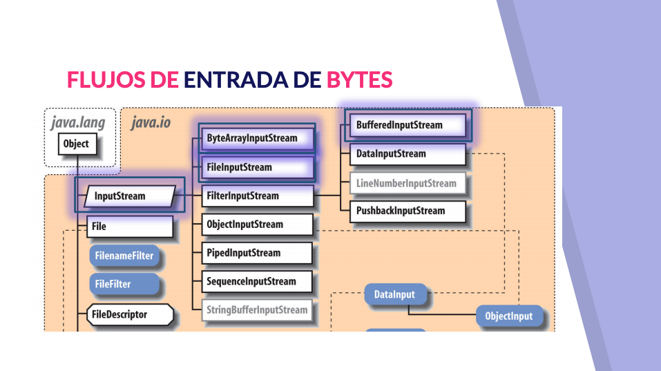
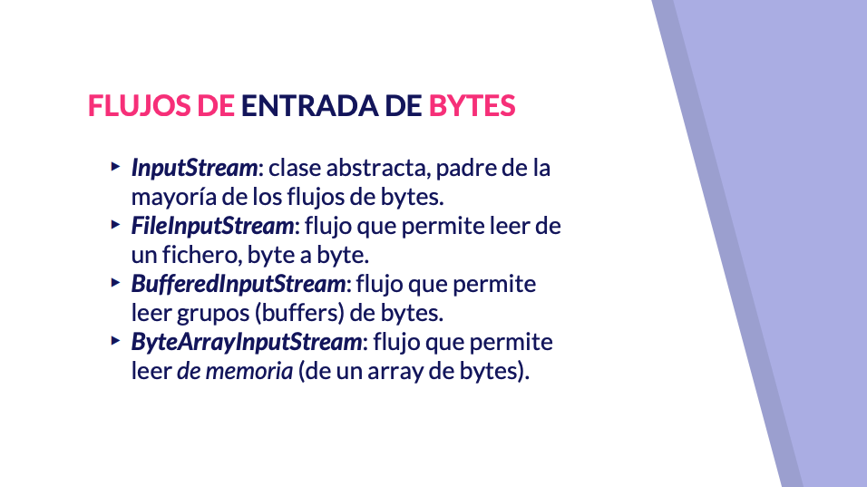
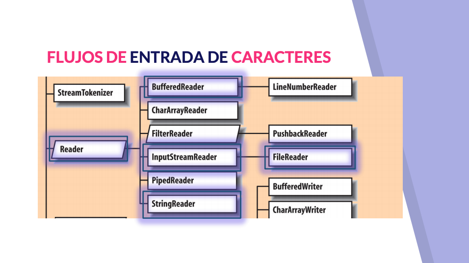
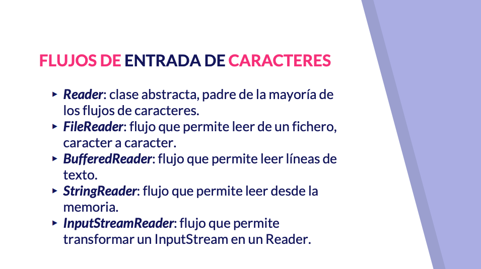

Vamos a continuar trabajando con los trucos en particular con los flujos de entrada en el que desde el programa recibiríamos ese chorro de bite vale o también de carácter es ese chorro de información pues para poder procesarlo y transformarlo anterior podríamos tener flujos de entrada t-bikes o flujos de entrada de caracteres para los flujos de entrada también vamos a poder definir un patrón básico de funcionamiento de los siguientes pasos en primer lugar habríamos influjo el canal de comunicación estructura de repetición en la cual mientras hay datos que leer del flujo lo leeríamos lo conoces haríamos seguiríamos leyendo datos mientras lo hubieran el flujo y cuando ya no quieres más datos en el flujo cerraremos el tiempo vamos a comprobar cómo podemos plantear un eje de simetría con respecto a los flujos de salida en particular con los flujos de entrada de bite tenemos con mucha clase que son su correspondencia dónde teníamos antes ouput stream tenemos ahora InputStream tenemos byte array to InputStream file InputStream y pajares industry es decir las clases que podríamos decir que hacen la operación análoga las de Sanidad pero con respecto a la entrada y byte array input stream permite leer de memoria desde un array de bytes para hacer el procedimiento correspondiente bajar Spider InputStreamReader StreamReader y five Rider el padre de todos los flujos de lectura de cárcel para el reader no permite leer carácter a carácter de un fichero va a hacer en Rider nos permite leer líneas completas de un flujo StringReader nos permite leer caracteres o cadenas de la memoria InputStreamReader nos permite transformar un flujo de entrada en ebay en un flujo de entrada de carácter vale de un InputStream a un río qué bueno van a utilizar flujo de entrada y en algún caso también flujo de salida para que podamos ver algún ejemplo más real no vamos a comenzar con un ejemplo de uso de File InputStream este va a ser muy sencillo en el que vamos a poder ver el fichero que generamos con nuestro primer flujo de salida con el primer file OutputStream en el escribíamos una serie de números enteros que realmente no eran número entero sino que eran pan tiene un método que nos va a devolver un número vale en este caso bullying y lo que va haciendo es cuando nosotros habremos el truco va a ir leyendo vais a vais y por cada estación el método Neira devolviendo el siguiente by pudiendo hacer una lectura secuencial cuándo llega el final de fichero para poder diferenciar qué bueno hemos llegado al final y no tenemos que ir el procesamiento el método read tal y como lo indica la documentación devolverá un valor menos 1 si detectamos que tenemos menos unas la lectura quiere decir que hemos llegado al final del fichero la estructura de lectura más habitual suele ser estaremos declaramos la variable donde vamos a almacenar lo que vayamos leyendo y lo recogemos de esta manera almacenando el valor en C pero a la vez hacemos la comprobación de que sea diferente a menos 1 mientras eso suceda mientras te de esta condición con otro diferente menos hubo podríamos procesar el valor que se lo tenemos que profesar de esa manera y seguir leyendo hasta que lleguemos al final del sitio el resto de estructura de try catch finally es idéntico al flujo tenemos por consola vale lo estamos imprimiendo como número en este caso los valores de 0 a 100 qué es lo que tenemos guardado en primera instancia en el fichero primero.la de 0 a 99 porque son 100 balones vamos a ver un ejemplo más complejo con el pub en vale creando una aplicación que puede simular a la herramientas copii poze pe de los operativos de Windows o de Lima y que nos va a permitir leer una imagen cualquier fichero binario un fichero PDF una aplicación cualquier tipo de fichero que nos pudiéramos imaginar y lo que va a hacer es crear una copia lo vamos a hacer muy pillo no podríamos haber hecho quizá que trabajará con los argumentos que recibe para que fuera operativo para cualquier tipo de fichero pero ya digo no queríamos enmarronar un poco el ejemplo con con la gestión del string Art Gallery de Zara que tenemos todos los argumentos necesarios y tal para no emborracharse el nefrona vamos a ver cómo lo que vamos a hacer es leer el fichero o no flujo de entrada eBay en ese caso con bajen y conforme lo vayamos leyendo por cada bafer sepáis que vayamos leyendo vamos a escribir lo de manera que en una misma operación podríamos ir leyendo escribiendo leyendo escribiendo leyendo escribiendo y cuando terminemos que radios los dos podríamos hacer de esta manera distancia haríamos una entrada InputStream y un output stream para la salida vamos a plantear el tamaño del buffer en 16 KB vamos a construirlo sobre un file InputStream de una imagen en particular vale que tenemos aquí dentro del proyecto para el fondo de las transparencias que venimos usando a lo largo 16 KB vamos a construirlo sobre un file InputStream de una imagen en particular vale que tenemos aquí dentro del proyecto para el mundo de las transparencias que venimos usando a lo largo del proyecto y vamos a tratar de hacer una copia de imagen en otro fichero JPG funciona de la siguiente manera el método Ruiz de Mapfre input stream recibe una serie de argumentos y produce un balón espera un base este va a hacer va a ser el que se va a rellenar con los datos que se le han desde el flujo de entrada además nos permite indicar una posición inicial vale un offset y una longitud es decir le indicamos que queremos leer envase almacenarlo desde la posición 0 y que esperamos leer una cantidad tan de caracteres precisamente estamos en la misma que el tamaño del va ser que no sea repetir esperamos leer 16 KB de información sin embargo el método read en algún momento le ha algún valor de mes es decir que existieron o llegar a tener 16 KB o no fuese su tamaño un múltiplo de 16 KB la última iteración no va a ser de 16 y no me va a ser de un tamaño menor lectura que haga para devolver un valor entero y este valor entero que devuelva será la cantidad de bytes que han hecho con lo cual aquí estamos como argumento derriba a hacer una expectativa de la cantidad de información que valer y cantidad de Vallter la realidad la cantidad de bytes que hay y si el fichero es grande supongamos que un fichero de un mega el Grande en la mayoría de las iteraciones sobre este bucle cantidad de by equivaldrá al valor de tan bueno habrá alguna interacción la última en la que no podría equivaler a ese tamaño porque ya digo que será salgo fuera múltiplo del tamaño del váter que tenemos análogamente para escribirlo utilizamos un flujo de calidad por ahí que acepta un pase vale un array de byte indicando que dé el queremos escribir desde la posición 0 y la cantidad de información que vamos a escribir intuitivamente podría ser tan qué es el tamaño del bajo pero con lo que hemos dicho antes o nos valdría para todas las operaciones menos la última con lo cual lo que hacemos en utilizar este datos que hemos recogido cantidad de bytes en la penúltima iteración esto ya ya os digo que sería menor que está pero es que habrá una nueva invocación a Ruiz que devolver a menos 1 al igual que pasaba con el ejemplo anterior esto nos indicará que ya no nos queda más información disponible y en el caso de que cantidad de baile sea menos uno quiere decir que hemos terminado de leer nuestro fitnes una vez que lo hemos terminado tendríamos que cerrar ambos flujos el de entrada y de salida con una estructura parecida este programa funciona le podríamos añadir que quisiéramos algún mensaje que nos dijera otro que se llame y más que copié y podemos ver como el filtro es totalmente correcto como decía si quisiéramos cambiar a estos nombres para que recogiera moza key string art s array de strings lo que hace recoger lo que nosotros le proporcionamos cuando ejecutamos la aplicación por por consola vale si nosotros quisiéramos desde consola escucharlo por ejemplo con Java menos car el nombre del SAR vale por ejemplo copyright podríamos terminar el programa gerencia de sistemas antiguos donde bueno se tenía una consola diferente para la salida y para los errores y bueno esto simplemente aquí en Eclipse nos lo va a imprimir en el mismo sitio pero los mensajes no para diferenciar en rojo bueno aquí lo que tendríamos que hacer ahora y recoger aquí dentro el argumento 0 y el argumento 1 no recogeremos el valor de Ark de 0 en el caso del flujo de salida que no estamos utilizando la consola como le podemos proporcionar lo comento bueno pues se hace mediante la configuración de cómo se va a ejecutar el programa por ejemplo si sobre este mismo fichero que ya es una clase con método main pulsamos botón derecho rana el configuraciones el proyecto ya tendrá creada aquí una configuración de ejecución y si accedemos desde aquí a argumentos no que nosotros pasamos aquí en las cadenas de caracteres que pasemos a tipos argumentos serán las que recoja como si lo estuviéramos escribiendo en la consola nuestros ficheros se llamaba openwebinars estaría recogiendo los parámetros desde la línea de argumento estaría creando otro fichero que se llama otro openwebinars y estaría haciendo la copia correcta trabajando con la línea de voz vamos a ver por último un ejemplo en el que vamos a trabajar con ficheros de caracteres y vamos a implementar una aplicación que también puede ser muy didáctica y que sería un codificador del CEJAS vale la codificación del Cepsa es un sistema de filtración malo que se le atribuye a Julio César y en el que los mensajes antes de ser enviados se codifica van trasladando Noel en un sistema alfabético en el que para cada letra existe otra correspondencia del abecedario es decir a la a se le va a cenar ahora otra letra a la vez otra letra a la fe a la vez y así sucesivamente en particular en la codificación César se le asigna a cada letra la que ocupa tres posiciones posteriores en la en el abecedario vale de manera que por ejemplo la ah pues se correspondería con la de la B con la E y así sucesivamente vale bueno de esa manera cuando se envía un mensaje quién lo leía no vamos si alguien interceptaba el mensaje no era capaz de leerlo y emisor y receptor tratándose de un algoritmo simétrico tenían que saber cuál era la clave para poder ver cifra vamos a ver cómo podríamos leer un fichero de texto vale un mensaje muy importante estudiando los cursos de openwebinars a Primera toda la tecnología necesaria para encontrar el mejor puesto de trabajo pero no queremos que esto se entere mucha gente no vamos a hacer mediante esta codificación lo primero que tendríamos que hacer leer el fichero después vamos a ir codificando y línea y transcodificar lo que vamos a hacer es ir almacenando en otro fichero etherial que enviaría para ello tendríamos una escritura definiríamos uno de las letras en cine un desplazamiento vamos a definir un bar friends reader-writer que nos van a permitir leer el fichero y guardar el sitio parque frente a la lectura de vais Ruiz line que trabaja con líneas completa devuelve siempre una cadena de caracteres la siguiente línea que ha leído desde el origen de datos en este caso un sincero y cuando ya no quedan más datos lo que haces devolver todo lo que hace la comprobación bastante más cómoda de manera que podríamos leer mediante estructura vamos almacenando en línea lo que acabamos de leer y comprobamos si cómo haríamos la codificación y la escritura en una oficina nuestra línea y para hacerlo vamos a crear un streambuilder de la longitud para que tenga la capacidad exacta que vamos a necesitar está codificación no va a generar ficheros de mayor tamaño sino que simplemente hace una correspondencia de cada letra con notas lo vamos a tratar de de hacer con las letras y lo que hacemos es recorrer la línea carácter a carácter comprobar los primeros letra si no lo es vamos a dejar el carácter tal cual este vale esto es una simplificación y si la letra si fuera un carácter lo que vamos a hacer es calcular su valor entero lo que hacemos es tomar como referencia el valor entero de la letra como origen y lo que hacemos es restar la diferencia de nuestro carácter sobre edad si nuestro carácter fuera la a a menos a notaría 0 vale como valor entero si fuera la vez notaría 1 la fe Notariado y así sucesivamente esa manera podemos añadirle a nuestro valor de la letra como entero en offset que hemos definido dime tendríamos que hacer en la operación de módulo 26 porque porque las últimas tres letras del abecedario tienen que ser correspondida con la a la B y la sé consecutivamente vale con lo cual si ese valor sumará 27 querría decir que módulo 26 y a uno y haremos la correspondencia con otra letra el resultado lo calculamos haciendo la operación inversa es decir hala a le sumamos ese desplazamiento que hemos tenido y lo convertimos en cara vale y ese carácter tanto si hemos hecho transformación de él como no lo apuntamos mediante el método aprender la clase gente a partir de este finde obtendríamos la la cadena de caracteres en string correspondiente qué es lo que necesita el método de apertura y te imprime una línea nueva que etcétera etcétera haciendo una codificación de este fichero para vosotros el intentar hacer el programa Espejo a este que sería capaz de descifrar lo ya veréis como con lo que estoy aprendiendo sois capaces de hacerlo ningún mensaje al igual que antes pero podríamos añadir y podemos comprobar como el mensaje ahora es ininteligible para nosotros en cine no podíamos ver mi amigo el romper este tipo de cifrado alfabético es muy sencillo como un análisis estadístico vale es meramente didáctico el que lo pudiéramos hacer pero hemos podido comprobar cómo podríamos leer fichero de caracteres procesarlo vale y producir fichero de caracteres en su lugar espero que hayáis podido aprender sobre flujos de entrada y flujo de salida vamos a seguir aprendiendo con el tratamiento de ficheros en el próximo vídeo en el que trabajaremos con la clase falta


# 25 Trabajar con la clase file 7:09 

[Trabajar con la clase file](pdfs/25_Trabajar_con_la_clase_File.pdf)

## Resumen del Profesor

### 25.1 Clase `File`

Esta clase fue fundamental para el manejo de ficheros y directorios hasta Java SE 6. A partir de Java SE 7 tenemos a nuestra disposición las clases y métodos de Java NIO.2, que estudiaremos en próximas lecciones.

### 25.2 Creación de un File

```java
File f = new File("./", "nuevo.txt");
f.createNewFile();
```

## Transcripción


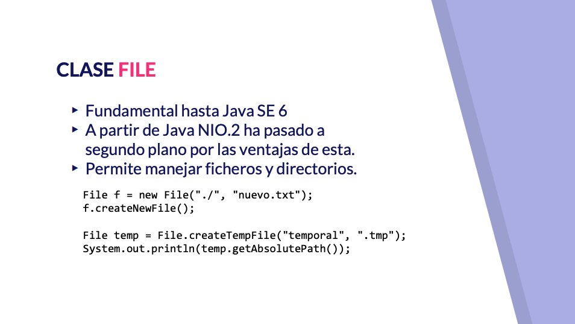
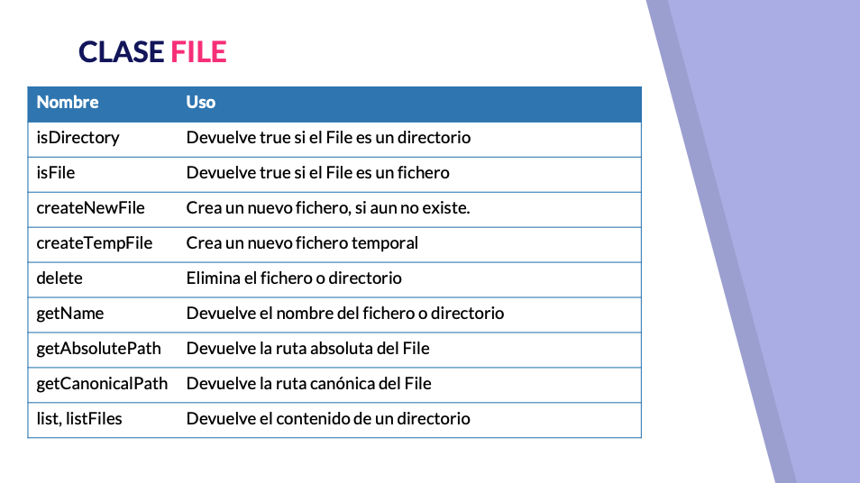

# 26 Trabajar con la interfaz path 13:30 

[Trabajar con la interfaz path](pdfs/26_Trabajar_con_la_interfaz_Path.pdf)

## Resumen del Profesor

### 26.1 Introducción

Un *path* o ruta es una forma de identificar (y acceder) un fichero o un directorio dentro del sistema de ficheros.

Decimos que una ruta es **absoluta** cuando contiene el elemento raíz y la lista de directorios completa para localizar el fichero. Por contrario, decimos que es **relativa** cuando necesita ser combinada para acceder al fichero o directorio.

### 26.2 Clase Path

Se introdujo en Java SE 7, como parate de Java NIO.2. Representa una ruta en el sistema de ficheros, y permite manejar diferentes sistemas de ficheros (Windows, Linux, Mac, …). Contiene el nombre del fichero, así coo la lista de directorios usada para construir la ruta.

## Transcripción


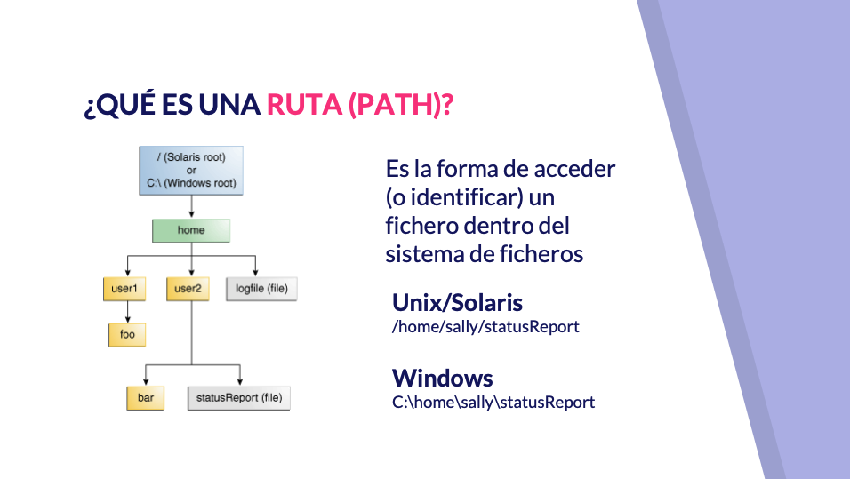
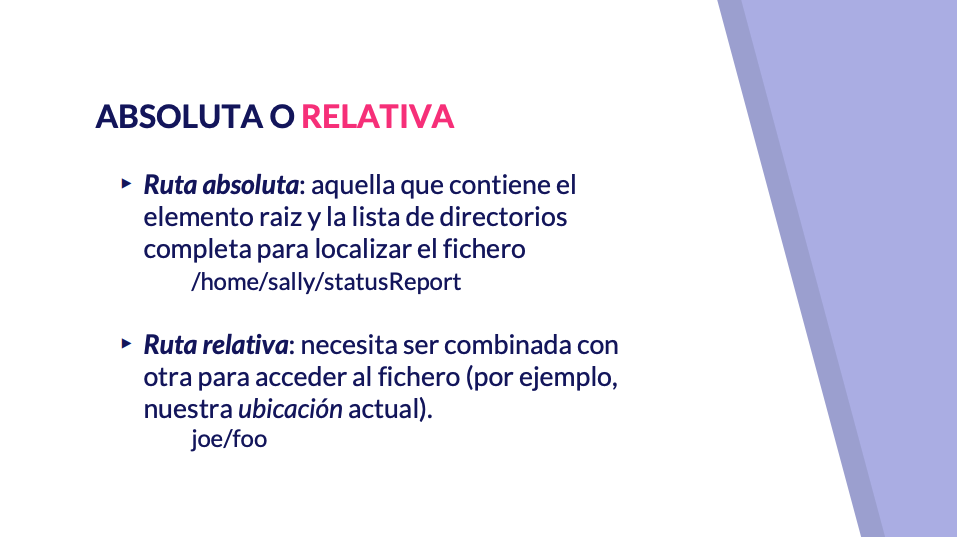
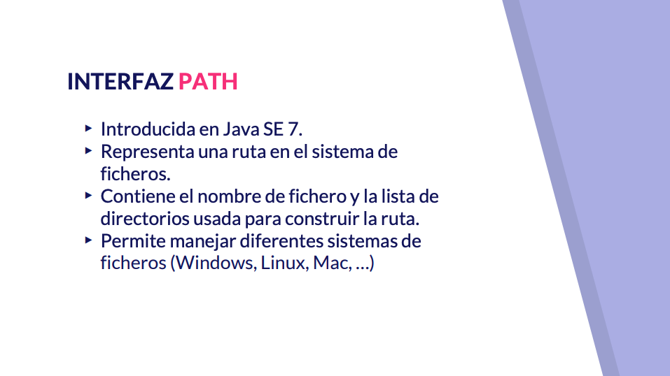
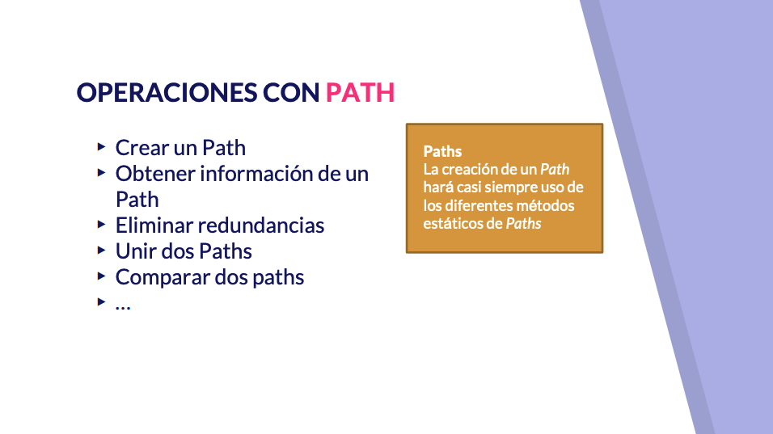

# 27 Utilizar métodos de la clase files 13:55 

[Utilizar métodos de la clase files](pdfs/27_Utilizar_los_métodos_de_la_clase_Files.pdf)

## Resumen del Profesor

En esta sección vemos la clase flies, que tiene decenas de métodos estáticos para hacer múltiples operaciones con ficheros y directorios.

## Transcripción


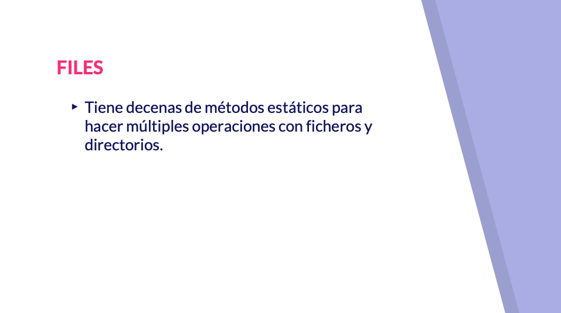
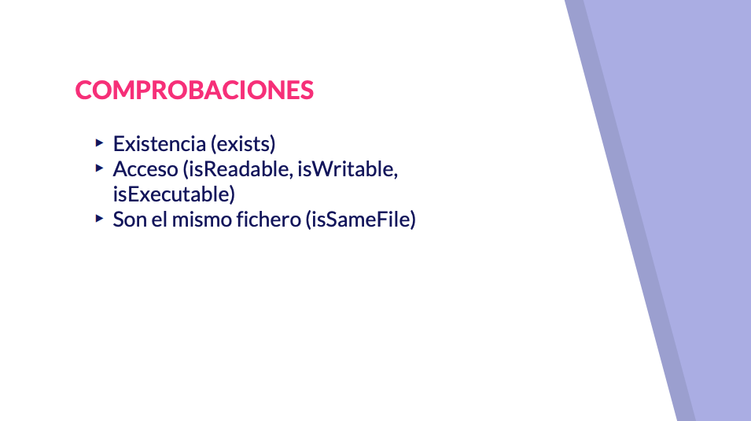
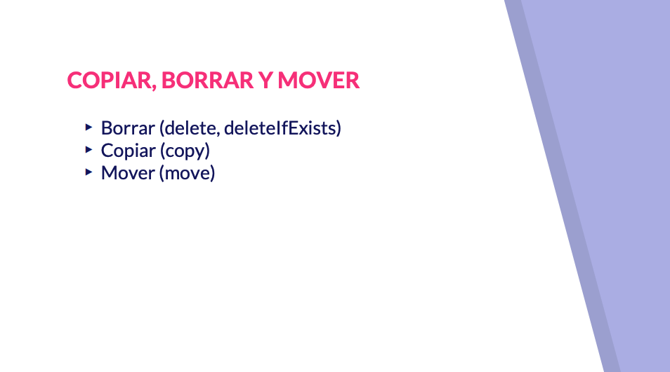
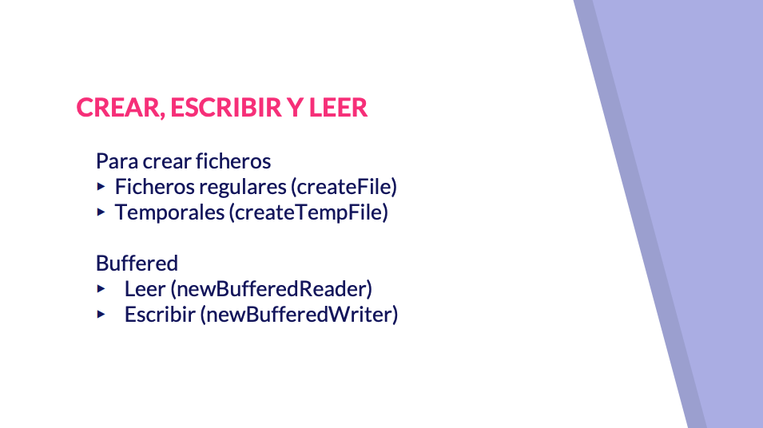
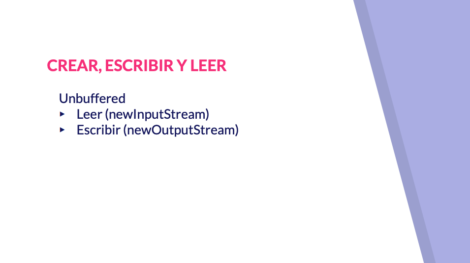
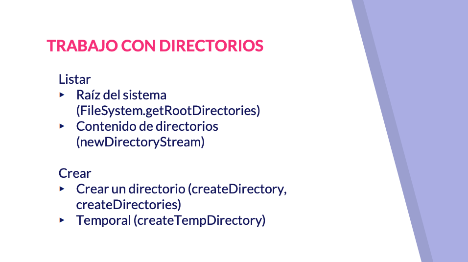


# 28 Uso de API Stream con NIO.2 9:07 

[Uso de API Stream con NIO.2](pdfs/28_Uso_del_API_Stream_con_NIO_2.pdf)

## Resumen del Profesor

En esta lección pondremos en práctica lo que acabamos de aprender de la API Stream con NIO.2

## Transcripción


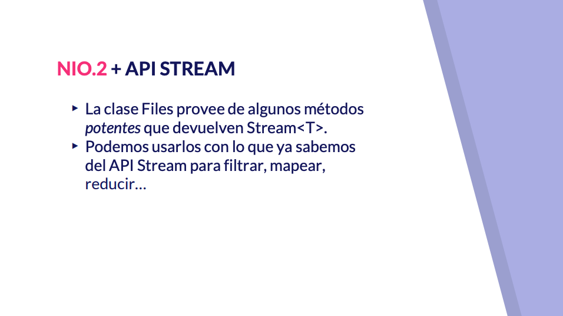
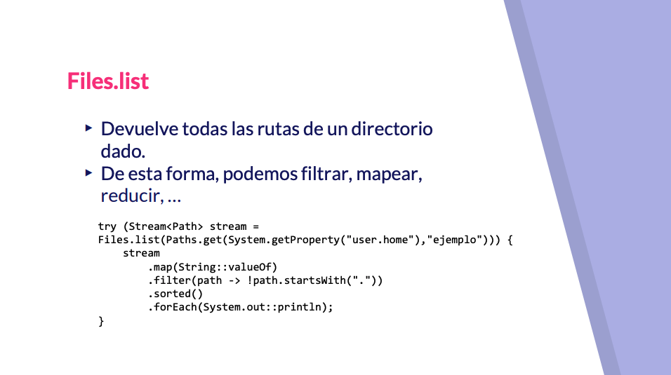
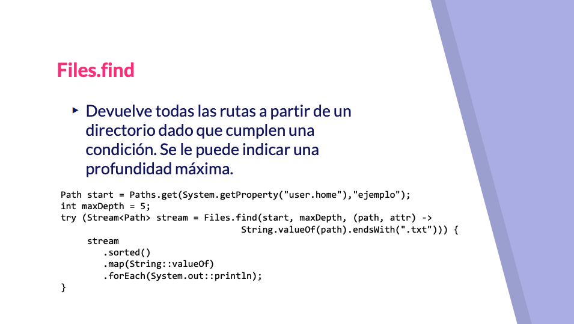
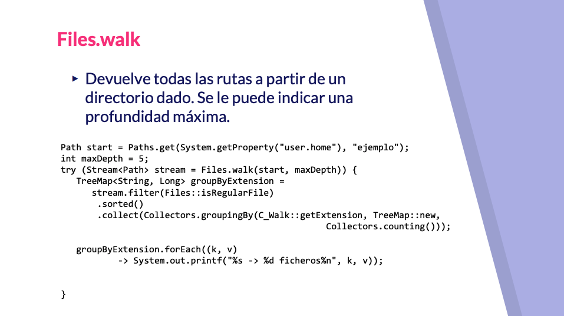
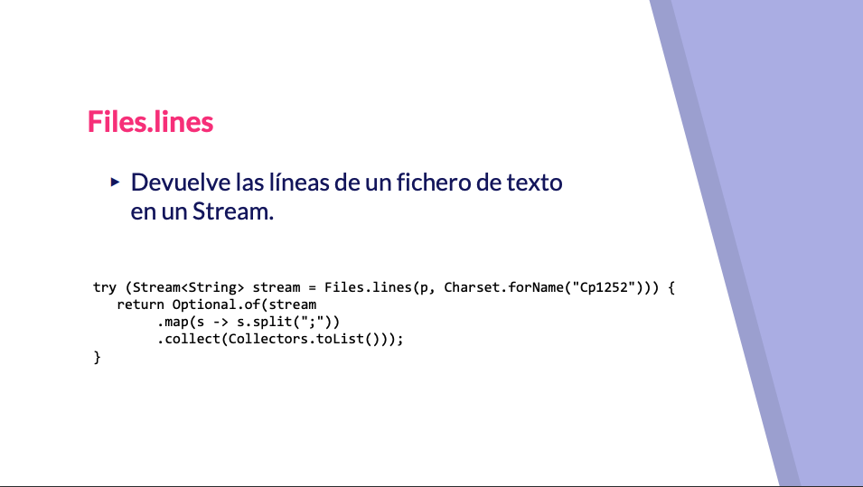

#  Práctica de uso de Java NIO.2 19:51 

## Resumen del Profesor

Práctica de uso de Java NIO.2

## Transcripción

## Contenido adicional 21   

[Uso de flujos de salida ](pdfs/23_Uso_de_flujos_de_salida.pdf)

[Uso de flujos de entrada](pdfs/24_Flujos_de_entrada.pdf)

[Trabajar con la clase file](pdfs/25_Trabajar_con_la_clase_File.pdf)

[Trabajar con la interfaz path](pdfs/26_Trabajar_con_la_interfaz_Path.pdf)

[Utilizar métodos de la clase files](pdfs/27_Utilizar_los_métodos_de_la_clase_Files.pdf)

[Uso de API Stream con NIO.2](pdfs/28_Uso_del_API_Stream_con_NIO_2.pdf)

[Aemet20171029.csv](prfs/Aemet20171029.csv)

[Aemet20171030.csv](prfs/Aemet20171030.csv)

[Aemet20171031.csv](prfs/Aemet20171031.csv)

[Aemet2017-10-28.xls](prfs/Aemet2017-10-28.xls)
 
[Aemet2017-10-29.xls](prfs/Aemet2017-10-29.xls)
 
[Aemet2017-10-30.xls](prfs/Aemet2017-10-30.xls)
 
[Aemet2017-10.rar](prfs/Aemet2017-10.rar)
 
