# 7. Concurrencia en Java 65m
   * 29 Programación concurrente 12:51 
   * 30 Programación concurrente 14:07 
   * 31 Runnable, Callable, y ExecutorService 15:16 
   * 32 Código sincronizado y uso de valores atómicos 12:49 
   * 33 Colecciones concurrentes 10:19 
   * Contenido adicional 5
   
# 29 Programación concurrente 12:51 

[Programación concurrente](pdfs/29_Programación_concurrente.pdf)

## Resumen del Profesor

Empezamos un nuevo bloque en el curso de Java 8 para desarrolladores Java profundizando sobre la programación recurrente. 

## Transcripción


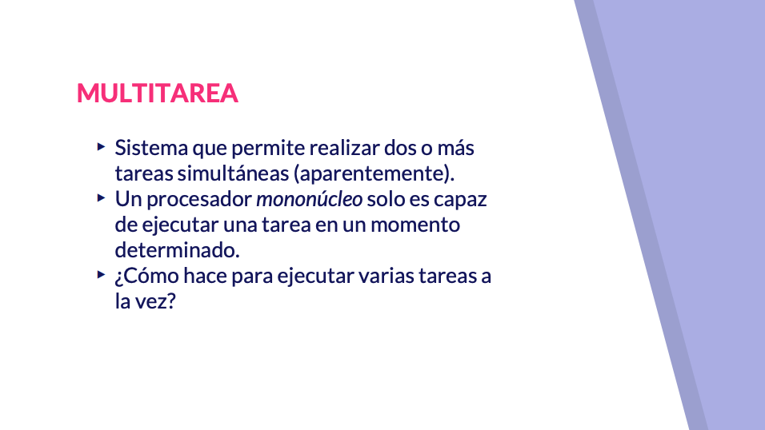
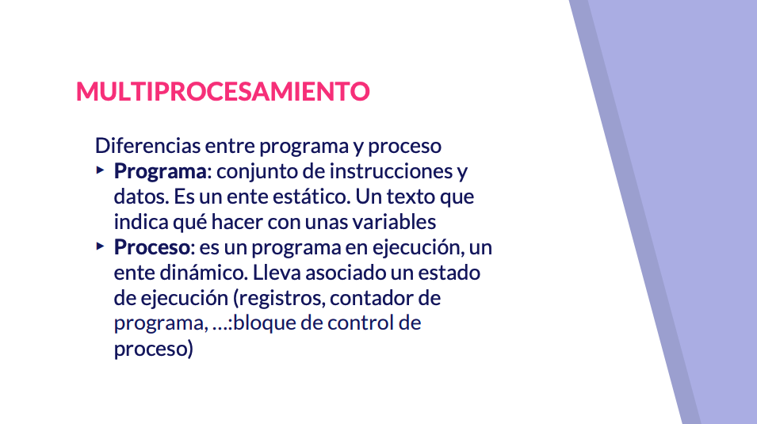
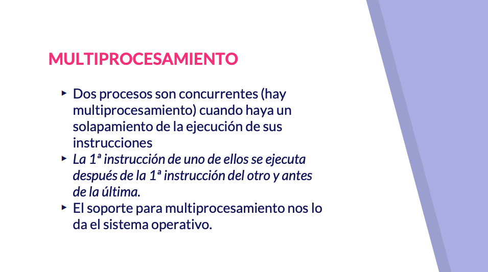
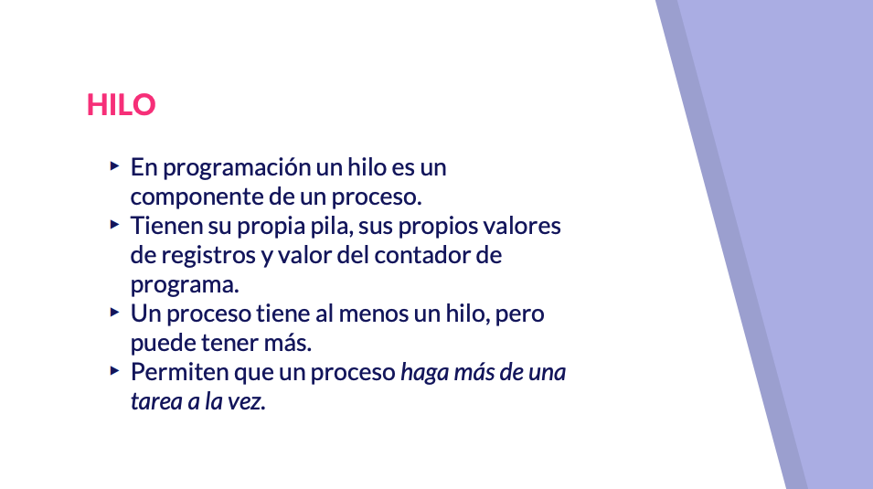

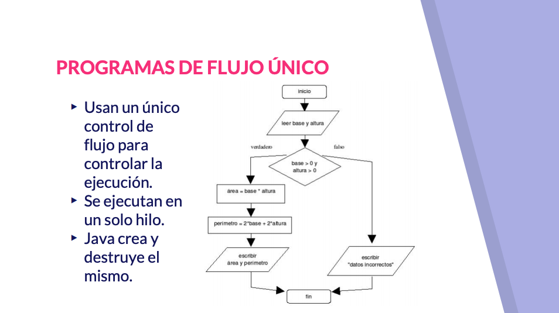
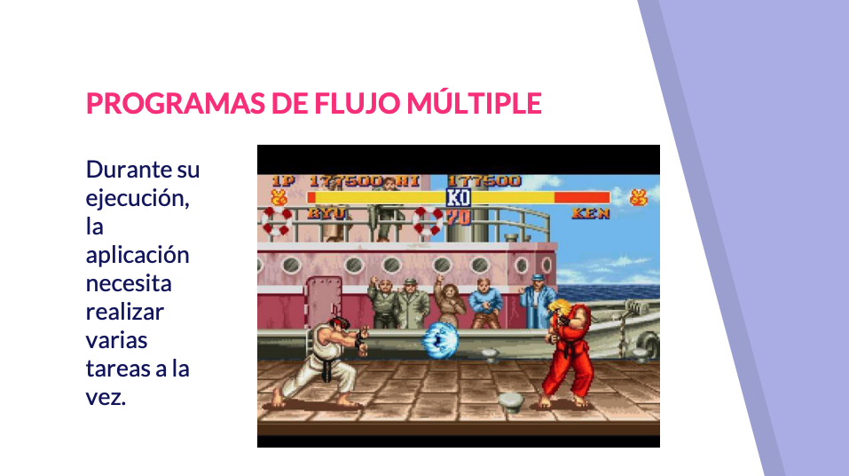

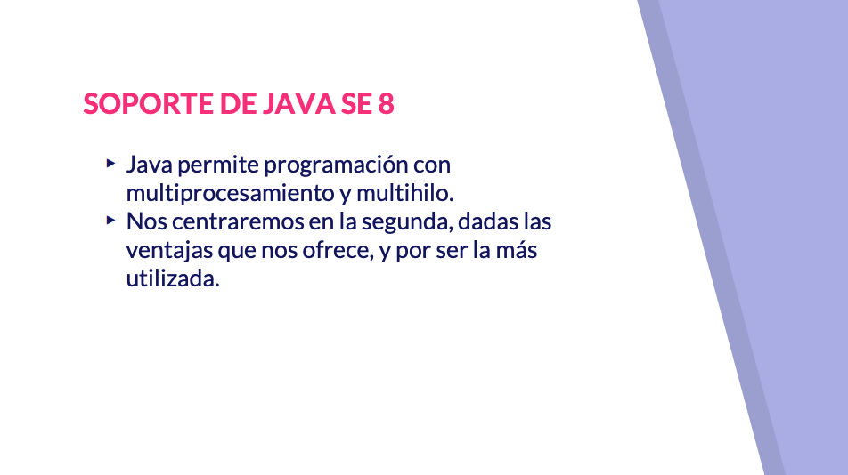

Hola Toño bloque sobre concurrencia en Java y vamos a presentar en este primer vídeo que es eso de la programación concurrente para después poder utilizar las clases concretas que cada no ofrece para poder ir primero de la multitarea sistema capaz de realizar dos tareas máquina algo más antigua de las que manejamos ahora en las que los procesadores tenían un solo núcleo lo normal es que ahora los procesadores que se suelen utilizar los ordenadores de sobremesa o portátil dispositivos móviles vale sin embargo un procesador mononucleo que tuviera solamente un núcleo solamente es capaz de ejecutar una tarea determinada a la vez cómo podríamos hacer entonces para ejecutar varias tareas porque alguno se preguntará guarda en mi antiguo ordenador con Windows 95 ya podía incluso navegar por Internet con skate o de usar Winamp para escuchar música y podía tener incluso el Bora abierto para hacer algún trabajo no bueno el multiprocesamiento que se realizaba normalmente mediante una técnica que se llama Time-Life permitir ejecución de cada uno de los programas haciendo los cambios de tiempo tan rápido podríamos pensar en milisegundos o incluso en nanosegundos haciendo esos cambios de contexto tan rápido que harían que aunque a la vez solamente se ejecute uno que en apariencia bueno pues el ordenador por ejemplo está ejecutando varias tareas a la vez a todo el mundo habrá pasado también que cuando un ordenador está haciendo demasiadas cosas a la vez una de las cosas que está haciendo requiere mucho esfuerzo pues parece que todo lo demás va lento no eso es porque bueno no se está haciendo el cambio de contexto a la velocidad adecuada o estamos sobrecarga tenemos que diferenciar entre lo que es un programa y proceso programa es un ente estático porque no es más que lo que nosotros vamos produciendo por ejemplo es decir un conjunto de instrucciones una serie de datos en el fondo no es más que texto que se procesan instrucciones al final de una máquina en particular que van indicando paso a paso que hacer con cada día frente al concepto de programa tenemos el concepto de proceso qué es un concepto dinámico y qué es un programa en ejecución una copia de ese programa en ejecución no es un componente monolítico no es un componente ético sino que está formado por llevaría aparejada además de la instrucciones del programa que está ejecutando una serie de información que tiene con estos registros de memoria la exclusión concreta apuntada mediante el contador de programa y otra serie información como fichero abierto etcétera etcétera todo eso lo llevaré un proceso cosa que no tiene un programa vale un proceso como como ente dinámico dos procesos como decía son concurrentes es decir tenemos multiprocesamiento cuando troceamos cada proceso en la piscina instrucciones que lo conforman y la primera instrucción de uno de ellos por ejemplo el proceso B se ejecuta después de la primera instrucción del otro proceso por ejemplo era y antes de la última en ese momento los dos procesos tenido una ejecución podríamos decir que solapada el soporte para que exista o no multiprocesamiento nos lo proporciona el sistema operativo a día de hoy la gran mayoría de los sistemas operativos que conocemos ofrecen multiprocesamiento no tendrían que ser sistema operativo muy específicos para determinadas máquinas o sistemas en tiempo real los que a lo mejor nos plantearían alguna duda pero cualquiera que podáis estar en vuestro PC es un sistema que permite multiprocesamiento aparejado el concepto de proceso aparece el concepto de hilo una y no es un componente de un proceso podríamos decir que es una especie de proceso en miniatura porque va a tener parte de información propia y otra parte que bueno pues será propia del proceso un hilo de ejecución tiene sentido solamente dentro de el marco de un proceso no puede existir como como un ente separado y tiene su propia pila sus propios valores de los registros y su propio valor del contador de programa cuando generemos en la mayoría de los sistemas operativos un proceso llevará aparejado dentro un hilo principal podríamos decir y unitario en la mayoría de los casos de ejecución y si queremos tener más de un hilo de ejecución separada del principal lo tendríamos que crear explícitamente los hilos van a permitir que un determinado proceso pueda realizar más de una tarea a la vez pero como ya os digo que dan siempre circunscrito dentro de un proceso la diferencia entre multiproceso y multihilo estriban en que como decíamos los procesos como puesta en ejecución de un programa completo solamente pesado y además a la hora de organizar la memoria los sistema operativo colocan los procesos en espacio de memoria diferente y el acceso desde un proceso a otro no es algo que sea trivial programaticamente hablando con lo cual si queremos hacer multiprocesamiento es decir establecer dos procesos que vayan haciendo cosas colaborativamente tendríamos por un lado dificultad en la comunicación y por otro lado una lentitud en lo que se conoce como el cambio de contexto es decir tendríamos que sacar del procesador todos los datos de un proceso para incorporarlos de otro proceso completamente frente a la multiproceso tenemos la posibilidad de usar multilind programa al ponerse en ejecución se convierte en un proceso que tenga varios hilos de ejecución independiente nos van a permitir tener componentes mucho más ligero porque como hemos dicho un hilo solamente tiene su propia pila contador de programa y registro de memoria un proceso en mucha más información programacion multihilo vamos a poder tener en el marco de un proceso varios hilos de ejecución cada uno con su información propia y la información compartida los cambios de contexto por ende será mucho más rápido y al compartir espacio de memoria no tendremos problema de comunicación la mayoría de los programas que habéis resuelto hasta ahora implementado hasta ahora son programas que tienen un flujo único por muy complejo que sea y por muchas líneas de código que tenga si pensáis en alguno de los ejemplos que hemos hecho hasta ahora por ejemplo en el ejemplo anterior en el que éramos capaces de leer varios ficheros de hacer el procesamiento de información en CSV de hacerlo mediante un string después de reducirlo mapear los filtrarlo recogerlo agruparlos todo ello se producía en un único flujo de ejecución si tenemos un solo flujo de ejecución no tenemos necesidad realmente detener con un solo hilo de ejecución nos bastaría tanto es así que la mayoría de los programas se ejecutan en un proceso con un solo hilo y ese hilo se encarga Java de poder crear no aquí tenéis la idea de lo que sería un programa de flujo único para bueno pues leer los datos de base y altura de por ejemplo un cuadrado perdón de un rectángulo y bueno cuál sería el flujo de ejecución del programa frente a los programas de flujo único tenemos los programas de flujo múltiple y son aquellos programas en los que durante la ejecución la puesta en marcha de esta aplicación necesita realizar varias tareas a la vez pensar por ejemplo en un videojuego no tiene que ser el último que haya salido al mercado pues pongo en pantalla una imagen de un vídeo de un videojuego que ya tiene su baño que el Street Fighter en este caso en la aplicación tiene que permitir por un lado jugar a un jugador en este caso río que está la izquierda por otro lado bueno tenía que permitir jugar a otro jugador o bien que jugar a la máquina y si recordamos cuando hemos jugado este juego nosotros nos podemos mover y mientras nosotros nos movíamos el jugador opuesto la máquina también podía coger además complementariamente la imagen de atrás no era una foto fija sino que era una imagen estática y en este caso por ejemplo el barco es jodida y los personajes que aparecían por detrás pues levanta las manos y tenían algunos movimientos como podemos comprobar si se trata de un programa que tienes diferentes flujos de ejecución que hay que intentar poder conjugar otro ejemplo y sea que nos quede más cercana nuestros desarrollo sería el de un de un servidor web o cualquier otro tipo de servidor que tiene que atender peticiones y qué bueno no las quiere atender de manera iterativa un servidor iterativo sería aquel que iría recibiendo unas peticiones y hasta que no terminará de atender una petición no tendría la siguiente os podéis imaginar que un servidor web a día de hoy funcionará así quería caótico no a día de hoy los servidores funcionan pudiendo atender múltiples peticiones diferente a la vez incluso bueno pues ya con arquitectura más complejas con balanceador de carga que tienes que cenar de cualquier forma o servidor Web a día de hoy sería capaz de atender al menos tres peticiones a la vez desde ordenador remoto diferente ejemplo de programa de flujo múltiple que necesitarán de programacion multihilo Java desde su primera persona y en particular en la versión 8 nos da soporte para hacer multiprocesamiento y multi los y bien nosotros nos de cantaremos por esta segunda parece que suele ser la que más se utilice menos digo que la programación multiproceso se utiliza solamente en contextos muy muy determinado sin embargo es mucho más fácil que nos encontremos en una situación que necesite de programacion multihilo conocer que la programación concurrente en el siguiente vídeo nos introduciremos en la clase que ofrece cava para moderar los hilos qué es la Clase C y como la podemos usar


# 30 Thread y su ciclo de vida 14:07 

[Thread y su ciclo de vida](pdfs/30_Hilos_y_su_ciclo_de_vida.pdf)

## Resumen del Profesor

### 30.1 Hilos con la clase `Thread`

Java tiene una clase, `Thread`, para poder crear y manejar hilos diferentes de ejecución al hilo principal.

Sus métodos básicos son:

* `public void run()`: contiene el código que queremos ejecutar en el hilo. **No se debe invocar nunca directamente**.
* `public void start()`: lanza la ejecución del hilo.

El resto de métodos los podemos consultar en la documentación del API.

https://docs.oracle.com/javase/8/docs/api/java/lang/Thread.html

### 30.2 Creación de un `Thread`

Una primera forma de crear un hilo es extendiendo la clase `Thread`, y aportando el cuerpo del método `run`:

```java
public class PrimoThread extends Thread {

   //propiedades y constructores

   @Override
   public void run() {
      long n = minimo;
      while(!testPrimalidad(n)) {
         System.out.printf("%d no es primo %n", n);
         ++n;
      }

      System.out.printf("El número primo es %d %n", n);
  }

  public static boolean testPrimalidad(long n) {
  
     //cuerpo del método
  }
}
```

Para ejecutarlo, tenemos que instanciar la clase, y usar el método `start`:

```java
PrimoThread pt = new PrimoThread(135);
pt.start();
```

### 30.3 Ciclo de vida de un `Thread`

Ciclo de Vida

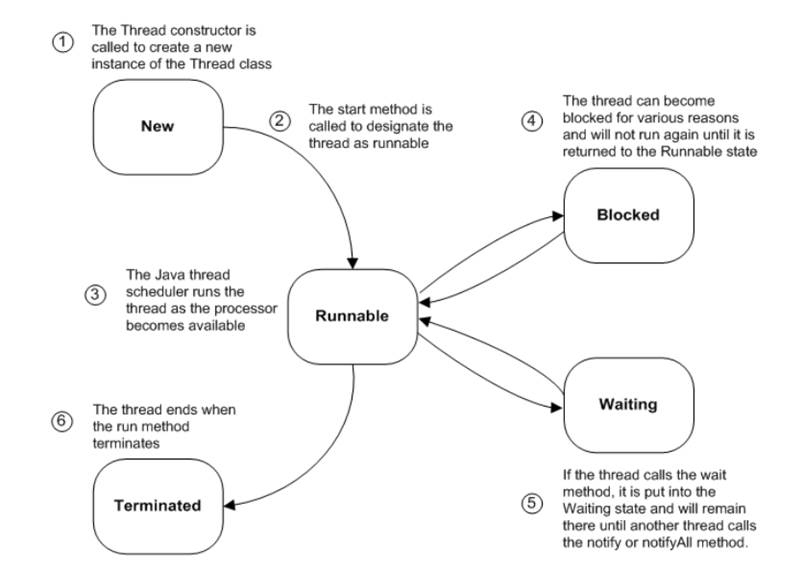

1. Se llama al constructor de `Thread` para crear el nuevo hilo.
2. Se llama al método `start` para designarlo como ejecutable
3. El planificador lo ejecuta en cuanto el procesador está disponible.
4. El hilo puede pasar a bloqueado por diferentes razones, y no vuelve hasta que pasa de nuevo a ejectuable.
5. Si se utiliza el método `wait`, se pone en estado de espera, y permanece ahí hasta que se ejecuta `notify` o `notifyAll`.
6. El hilo termina cuando finaliza la ejecución de su método `run`.

### 30.4 Pausar la ejecución de un `Thread`

Lo podemos hacer usando el método estático `sleep`. Recibe como argumento un número de *milisegundos*.

```java
Thread.sleep(1000);
```

## Transcripción


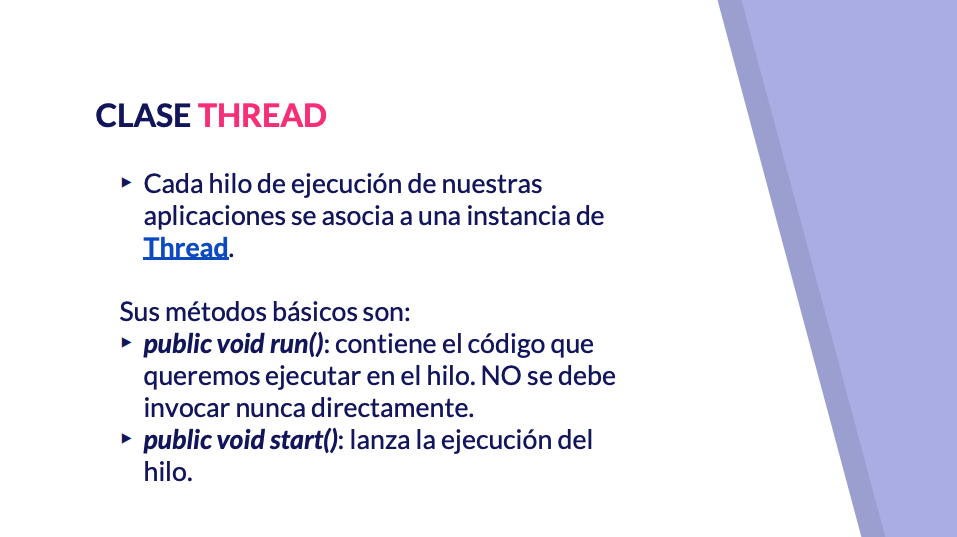
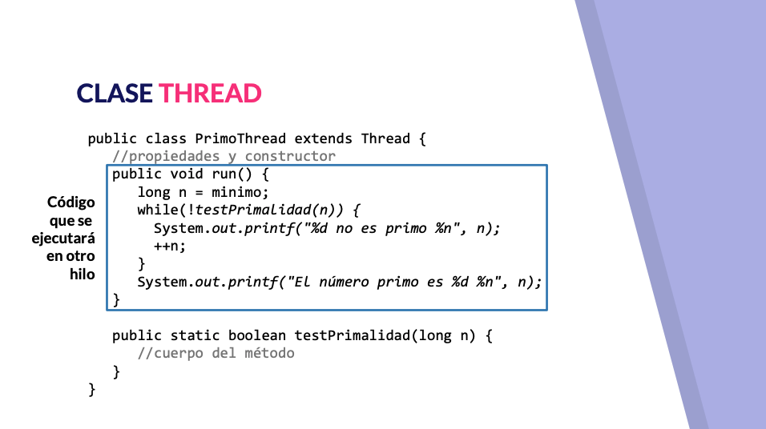
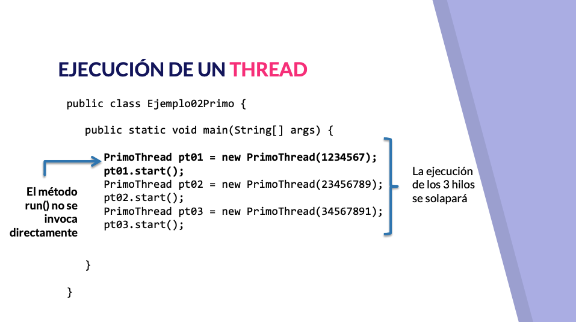
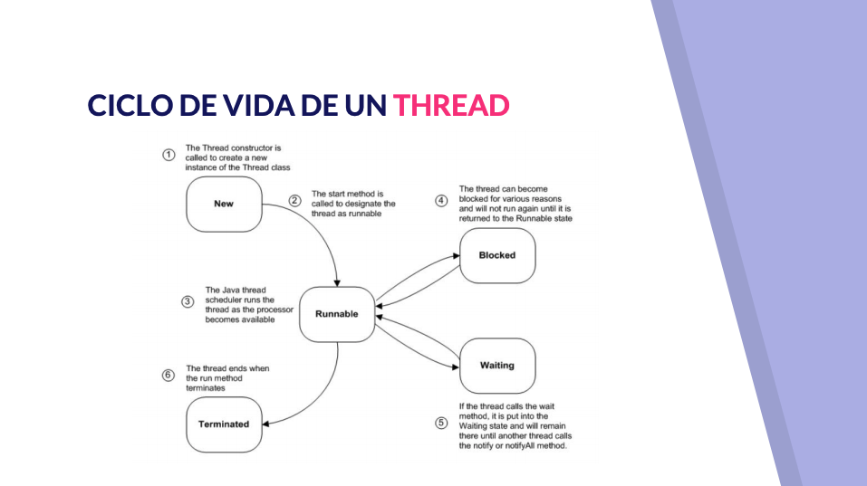
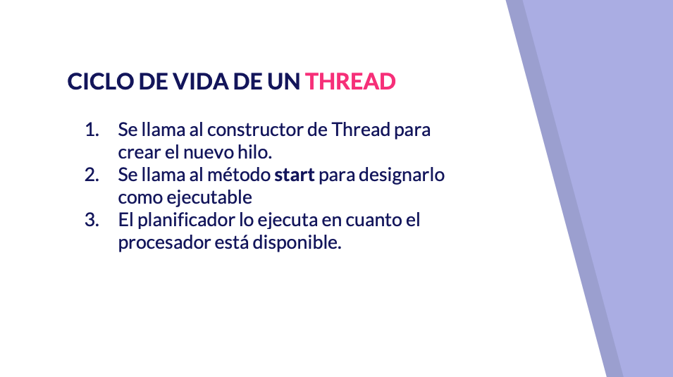
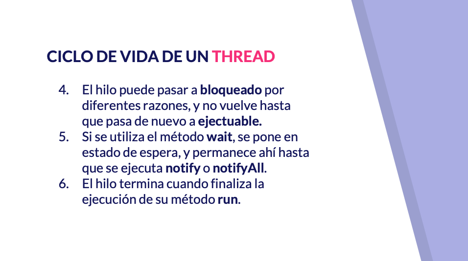


Vamos a continuar este bloque de programación concurrente trabajando con la Clase C en definitiva en Java y con su ciclo de vida la clase 3 va a representar la lógica de un hilo y la puerta entre 13 y lo en ejecución cada hilo de ejecución que quedamos en eso tendremos que asociar a una instancia de 33 tiene dos métodos básicos entre los que están el método run y el método está el método rojo que es un método que no se debe de invocar nunca de forma directa es el que contiene la secuencia de tareas que queremos realizar en segundo plano en otro hilo de ejecución que no sea el principal cuando queramos ejecutar el vino lo que tendríamos que hacer es invocar el método da vale que será el que bueno como veremos ahora después en su ciclo de vida el que pone en disposición de ser ejecutado ese hilo vale y lo prepara para su ejecución aquí tenéis la documentación de la clase que como yo digo está presente en Java desde sus primeras versiones y podéis comprobar como tiene una serie de constructores y métodos muchos de los cuales están deprecados vale tiene algunos métodos estáticos y otros métodos distancia pero como decía a nosotros nos va a interesar por ahora el método ROM vale que es el que vamos a tener que darle nosotros cuerpo y el método está no os recomiendo os recomiendo que le echéis un vistazo a lápiz para que podáis ver bueno pues algunos métodos que ya están de pescado y que presumiblemente estarían bien para manejar el ciclo de vida pero que no están nada recomendados con iniciales de ejemplo el mecanismo más básico que vamos a tener para poder implementar un Fred va a hacer crear una clase que cierra de esa manera podemos sobreescribir el metodo ron que sería el que tendría que bueno que de alguna manera identificar las tareas que vamos a ejecutar en segundo plano suponemos que queremos crear una clase que bueno que aplique test de primalidad y que imprima y un número determinado es primo o no lo podríamos hacer de esta manera no incluyendo dentro del cuerpo del metodologo la lógica de verificación de si un número es primo recoger ejemplo porque si bien para un número pequeño el identificarse el número 11 es primo o no os recuerdo que los números primos son aquellos que se lo tiene por divisores a 1 y así mismo con número relativamente grande se convierte en una tarea compleja que puede llevar mucho tiempo sin utilizamos algún tipo de algoritmo avanzado por eso suele ser el primer ejemplo que se pone a la hora de utilizar hilo de ejecución para no bloquear la ejecución de nuestro programa solo estaríamos en un hilo aparte cómo podemos ver extendemos la clase 3 sobreescribir el metodo ron y cuándo vamos a ponerlo en ejecución lo que haríamos sería instanciar nuestra clase que ha extendido a Flex y invocar al método tad os recuerdo de verdad encarecidamente que el método Ron no se invoca directamente aquí tenemos un ejemplo que veremos después en ejecución de cómo podríamos invocar tres hilos de ejecución diferentes para verificar si tres números son primos o no que se pondrían en ejecución en paralelo y cuya ejecución se puede solapar perfectamente la alcanzar los fresnos de ejecución independientes van a ir tomando y dejando el procesador según su ciclo de vida veamos en particular el ejemplo de la clase primo Fred que tiende a creer y que sobreescribe al método o recuerdo que para sobreescribir el metodo de una clase cuenta la clase fresno tiene el método run como acto con lo cual en el fondo no obliga que nosotros los hombres y vamos y no recordamos muy bien la sintaxis del método que tenemos que sobrevivir podríamos venir a soul o verdad y de estrés escoger y ya nos proporcionaría todo lo necesario para poder sobreescribir vale bueno pues en nuestra implementación que no es para nada eficiente lo que hacemos es que mientras el test de primalidad sobre el número no devuelve TRUE en decirnos dice que el número es primo vale vamos aumentando y aumentando y aumentando vale y aquí lo que vamos a hacer a la hora de qué hacer en es verificar si un número es primo aquí incrementaremos el número en cada iteración hasta quedemos con un número primo lo que hacemos es marcarle un número como mínimo para buscar un primo a partir de a partir de aquí tendríamos la sintaxis para crear una instancia de la clase primo ceed que nos busque un número primo mayor que 135 y mediante el la invocación está lo pondríamos en ejecución rápidamente 4 número que es primo si queremos comprobar queso realmente se está ejecutando en un hilo de ejecución separado la siguiente que tenemos en la línea 9s ejecutaría no después de que termine la ejecución de libro muy claro si no es sino que se basó la paz vale de hecho es posible que se te quite antes de que veamos la ejecución de ninguna línea del código del libro porque porque ya digo esto tiene que ponerlo en preparación dele tiene que conceder el acceso al procesador para que se ejecute posible que si el número es muy grande bueno pues de una atacada no le dé lugar a encontrar el número que sea primo y esta línea se ejecutará posiblemente bastante antes más adelante podremos hablar de que los problemas de condición de carrera y tal mirar cuenta en las diferentes ejecuciones que podemos hacer te imprime casi siempre antes aunque la línea este después de la ejecución del método rojo como yo digo esto sucede porque realmente vete se está ejecutando en un hilo separado al hilo al hilo principal que crea Java para para una clase que invocamos aquí en Pinto bueno de la manera como ya veis podríamos tener un solo hijo te queremos ver ejecuciones separadas podríamos hacer lo mismo con primos 30 con tres hilos de ejecución por separado vamos a ver cómo se van a solapar cómo ver la ejecución es de todos se han solapado y quisiéramos identificar de quién estamos haciendo la ejecución podríamos hacer lo siguiente podríamos añadir a quien mensaje indicando de alguna manera que no pertenece no localizarlo pero cómo se solapa la ejecución de un hecho casi de una vez porque son números muy pero aquí si tenemos un solapamiento tenemos 3 número en particular este directamente un número primo y estos dos no no y volvemos a imprimir bueno en ocasiones tendremos situaciones diferentes y todo como a ti te han ejecutado varias líneas de bueno el hilo de 12345678 se de tres cuatro cinco seis siete ocho nueve 1 después bueno intercalado una sí y otro no hasta que como podéis comprobar esto realmente son hilos de ejecución diferente que se van ejecutando por separado de manera que hemos tenido un solapamiento de las tres funciones tiene un ciclo de vida que sigue inexorablemente cuando nosotros hacíamos una clase que hereda de tren o la clase 3 misma pasaría a estar en estado nuevo pero todavía no haría nada solamente cuando invocamos aquí en el punto 2 el método start cuando el hilo pasa estar como candidato a ser ejecutado una vez que el hilo pasa a ser candidato a ser ejecutado es el programador de ejecución de Java el que le va dando paso no al microprocesador para que esté ejecutando durante la ejecución de este programa podemos volver a pasar a estado candidato para ser ejecutado o pasar por los estados de bloqueado por ejemplo si estamos ejecutando nos hemos conseguido consumir nuestro cuánto tiempo pasar hemos estado bloqueado si estamos esperando la lectura de un fichero pues también podríamos pasar a estado bloqueado hasta que se nos desbloquee y volvamos a pasar Estado también y lo veremos en uno de los vídeos de este bloque podemos hacer que un hilo de ejecución en base a espera que no es lo mismo que bloqueado la espera se suele llamar para hacer que un hilo de ejecución no continúen su ejecución porque no existe un contexto adecuado para ellos el problema clásico para ilustrar esta espera es el del productor consumidor en el que bueno vamos tomando elementos de una colección compartida y entonces y el consumidor consume todos los elementos antes de que el productor vuelve a introducir más tendríamos que poner a este consumidor en espera cuando notificado volverías tarde ejecutable terminaría su ejecución cuando termine de ejecutar el cuerpo de su método el uso de otros métodos de pecados como estos que no que tendremos que organizar que vayan a ejecutarse en hilo de ejecución independiente de forma que en algún punto es que así no queremos el hilo termina su ejecución para pasar a estado terminal vale bueno pues los diferentes pasos que tenéis aquí encerrada último deciros que podemos dormir la ejecución de un hilo en particular mediante el método estático sin link vale es un método estático que lo que va a hacer es pausar el hilo que actualmente se ejecutan de que recibe una cantidad de tiempo expresada en milisegundos en ocasiones puede servir este método pero sobre todo sirve de forma didáctica pues ya que conocemos como crear objetos que clases que tiendan a la clase 3 y instanciar objeto y ponerlo en ejecución vamos a conocer una interfaz que muy importante que hable que deje implementa la clase 3 y alguna otra que nos van a permitir y realizando cada vez programas concurrentes programas que utilizan programacion multihilo de de una manera más eficaz


# 31 Runnable, Callable, y ExecutorService 15:16 

[Runnable, Callable, y ExecutorService](pdfs/31_Runnable_Callable_y_ExecutorService.pdf)

## Resumen del Profesor

### 31.1 Runnable

Es un interfaz que nos permite crear tareas para ser ejecutadas en *hilos secundarios*. Si nuestra clase ya hereda de otra, no puede heredar a la vez de `Thread`. `Runnable` nos permite solventar esa dificultad. `Thread` tiene un constructor que recibe como argumento un *runnable*.

Podemos utilizar las clases anónimas o las expresiones lambda para crear código más conciso:

```java
//Este trozo de código puede ser muy común si
//el proceso de lanzamiento del hilo está dentro
//de un manejador de eventos, como el click de un
//botón.
new Thread(new Runnable() {
    @Override
    public void run() {
        System.out.println("Hello from Runnable+Thread!!");    
  }
}).start();

//Este código es como el anterior, pero aprovecha la potencia
//de las expresiones lambda.
new Thread(() -> System.out.print("Hello from Lambda Runnable+Thread")).start();
```

### 31.2 `Callable<V>` y `Future<V>`
  
`Runnable` no permite devolver ningún dato a otro hilo, salvo que utilicemos complejos mecanismos de sincronización programados por nosotros mismos. Para facilitar el trabajo, Java nos ofrece el interfaz `Callable<V>` que es, básicamente, un `Runnable` que devuelve un valor.

Para recoger el valor de un `Callable`, necesitamos un `Future`. Se trata de otra interfaz, que representa el resultado de una *computación* asíncrona. Nos permite operaciones como comprobar si la computación ha terminado, cancelarla, esperar a que termine, tomar el valor si ha terminado, … El método `get` nos permite obtener el valor de la ejecución de un `Callable`. Existen diversas formas de obtener un `Future` a partir de un `Callable`, pero siempre nos *invita* al uso de ejecutores.

### 31.3 Ejecutores y pools de hilos

Hasta ahora, el programador tenía que definir y lanzar los hilos de ejecución según su necesidad. Este esquema es válido para aplicaciones pequeñas. Para grandes aplicaciones, hay que separar la administración de los hilos del resto de la aplicación. Esto lo podemos realizar mediante ejecutores (*Executors*).

Java nos ofrece tres tipos de ejecutores (cada uno hereda del anterior)

* `Executor`: soporta el lanzamiento de nuevas tareas, bajo demanda.
* **`ExecutorService`**: **añade a la anterior características que permiten administrar el ciclo de vida**. Este será el más utilizado.
* `ScheduledExecutorService`: añade a la anterior la posibilidad de ejecutar tareas periódicas.

La mejor forma de crear un ejecutor, es utilizando los métodos de los que nos provee `Executors`, a través de un pool de hilos. Este no será más que un conjunto de *worker threads* que estarán siempre dispuestos a ejecutar tareas de tipo `Runnable` o `Callable`.

Los pools pueden ser de tres tipos:

* *Single*: Con un solo hilo de ejecución disponible. Si le pedimos (submit) más de una tarea a la vez, las pone en cola.

* *Fixed*: Indicamos, en el momento de su creación, el número de hilos. Si dispone de n hilos, y enviamos n+1 tareas, las pone en cola.

* *Cached*: Crea hilos conforme enviamos tareas. Reutiliza los hilos cuyas tareas han finalizado, para ejecutar tareas nuevas.

## Transcripción


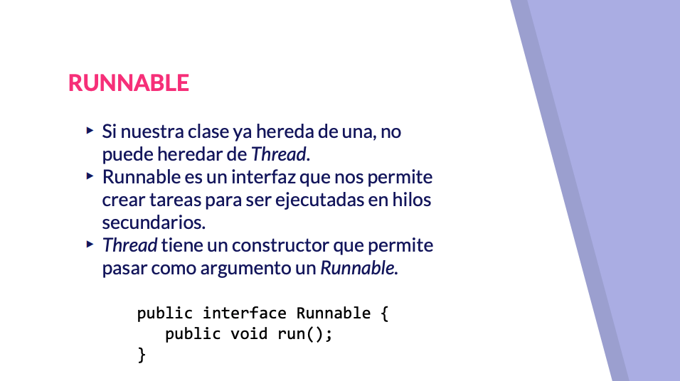
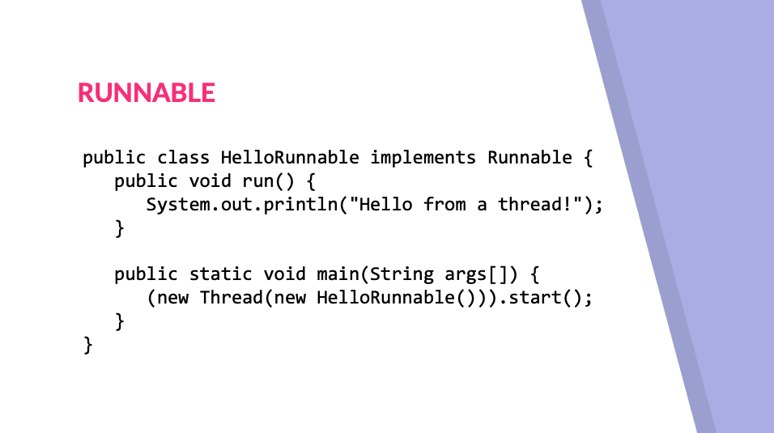

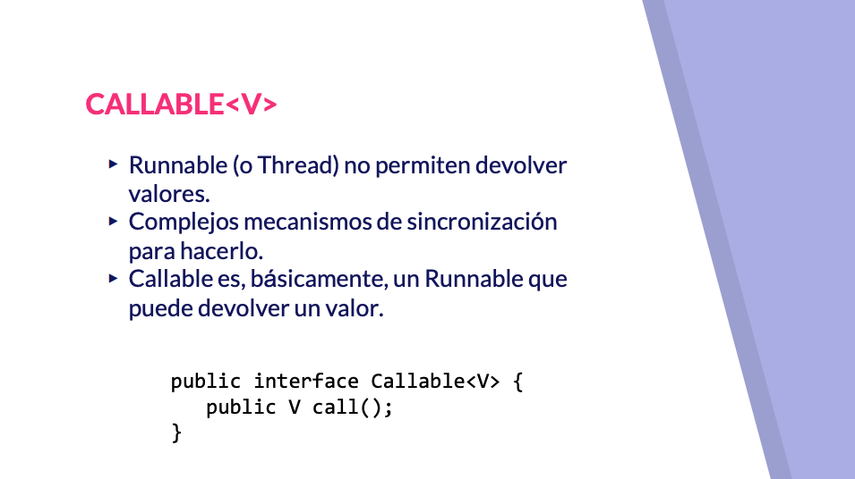
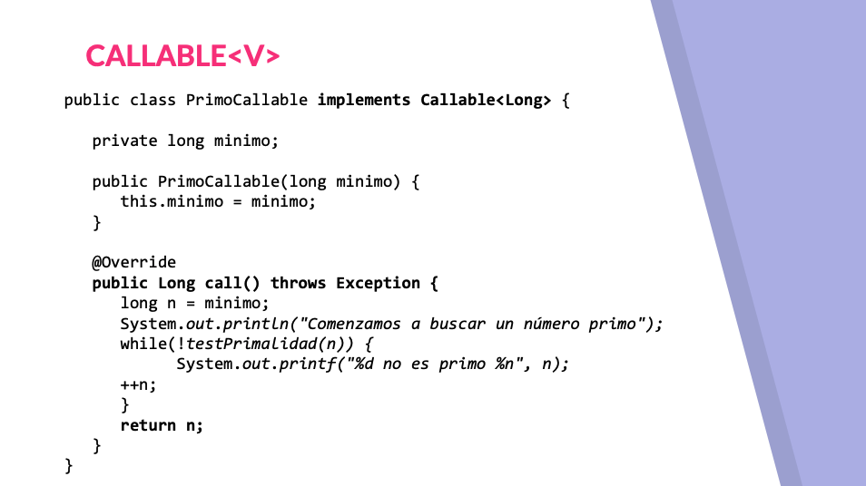
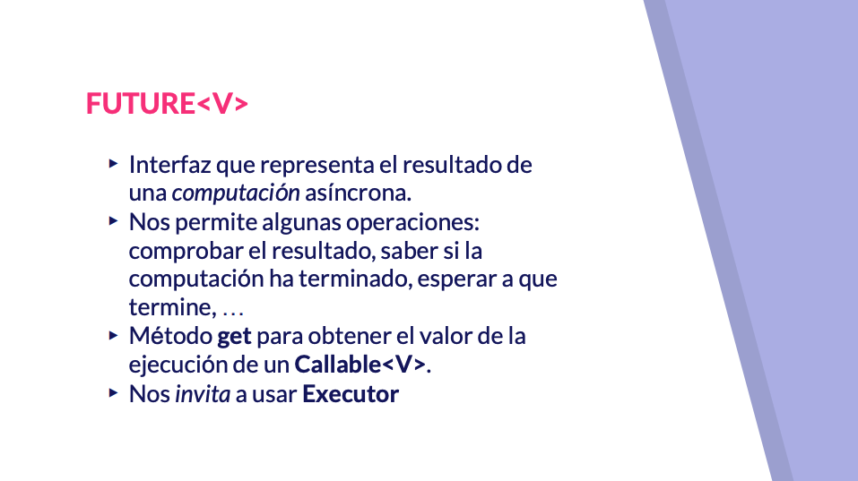


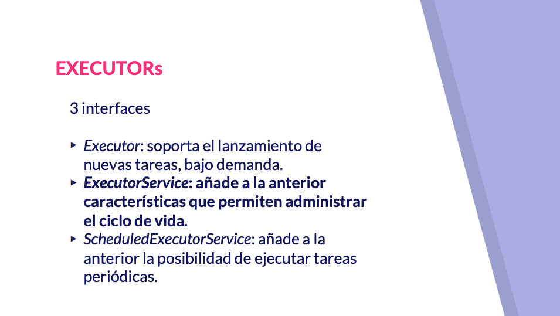
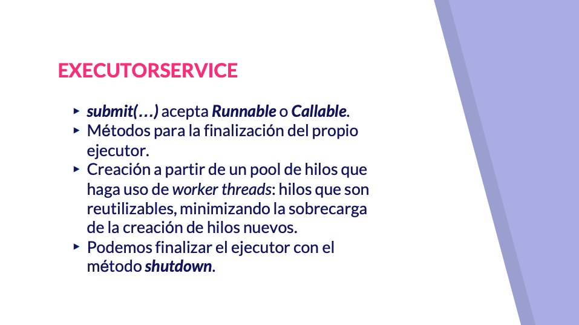
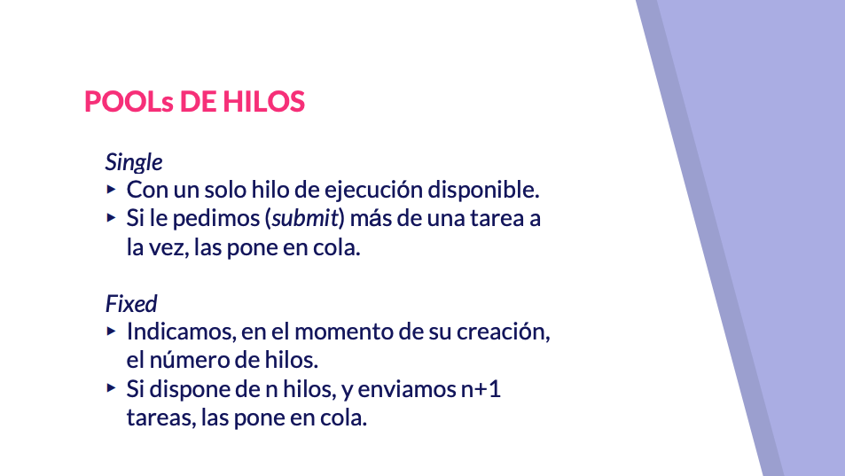
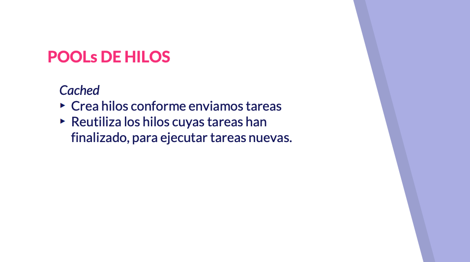
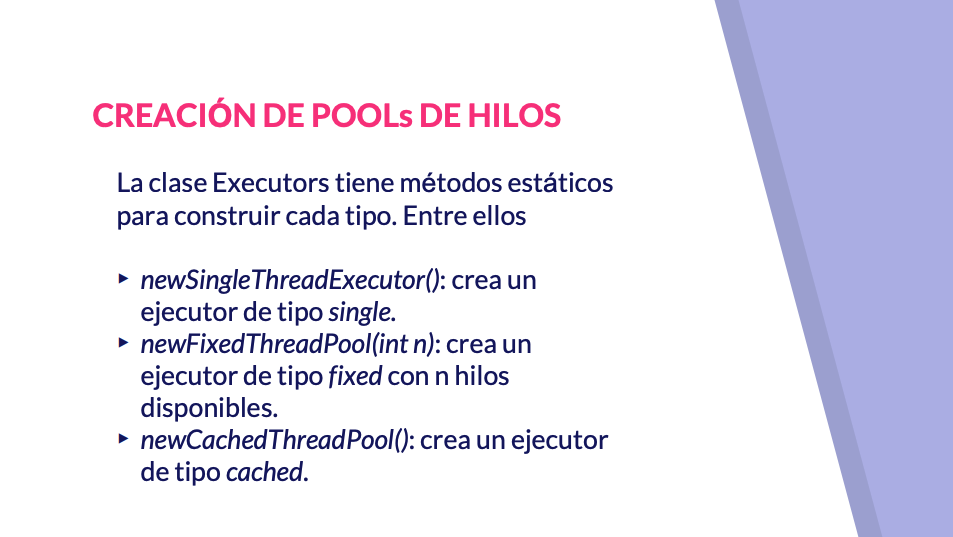

# 32 Código sincronizado y uso de valores atómicos 12:49 

[Código sincronizado y uso de valores atómicos](pdfs/32_Código_sincronizado_y_uso_de_valores_atómicos.pdf)

## Resumen del Profesor

### 32.1 Introducción

La extensión del texto de esta lección es algo más larga, intentando ofrecer un cierto soporte sobre la sincronización y sus causas. Java ofrece una serie de herramientas de sincronización; su buen uso depende de que el programador maneje conceptos sobre programación concurrente, algunos de los cuales escapan al alcance de este curso.

### 32.2 Interferencia entre hilos

Los hilos se comunican, principalmente, compartiendo el acceso a los atributos y los objetos a los que hacen referencia. Esta comunicación es extremadamente eficiente, pero hace posible dos tipos de errores: errores de interferencia entre hilos y errores de consistencia de memoria. La herramienta necesaria para evitar estos errores es la sincronización.

Supongamos la siguiente clase:

```java
class Counter {
   private int c = 0;

   public void increment() {
      c++;
   }

   public void decrement() {
      c--;
   }

   public int value() {
      return c;
   }
}
```

`Counter` está diseñada para que cada invocación de increment se sume 1 a c, y con cada invocación de decrement se reste 1 de c. Sin embargo, si un objeto contador es referenciado desde varios hilos, la interferencia entre los hilos puede hacer que esto no suceda como se esperaba.

La interferencia ocurre cuando dos operaciones, que se ejecuta en diferentes hilos, pero que actúa sobre los mismos datos, se intercalan. Esto sucede porque las dos operaciones consisten en múltiples pasos, y las secuencias de pasos se superponen.

No parece posible que las operaciones en las instancias de `Counter` se intercalen, ya que ambas operaciones en c son, simples sentencias individuales. Sin embargo, incluso las sentencias simples pueden traducirse en múltiples pasos por la máquina virtual. No vamos a examinar los pasos específicos que la máquina virtual realiza -es suficiente para saber que la única expresión de c++ se puede descomponer en tres pasos:

1. Recuperar el valor actual de c.
2. Incrementar el valor recuperado por 1.
3. Guardar el nuevo valor incrementado en c.

La expresión de c— se puede descomponer de la misma manera, excepto que el segundo paso es un decremento en lugar de un incremento. Supongamos que un hilo A invoca `increment` más o menos al mismo tiempo que un hilo B invoca decrement. Si el valor inicial de c es 0, sus acciones intercaladas pueden seguir esta secuencia:

1. Hilo A: Recuperar c.
2. Hilo B: Recuperar c.
3. Hilo A: Incremento de valor recuperado; resultado es 1.
4. Hilo B: Disminuir el valor recuperado; resultado es -1.
5. Hilo A: Almacena el resultado en c, c es ahora 1.
6. Hilo B: Almacena el resultado en c, c es ahora -1.

El resultado del hilo A se pierde, sobrescrito por el hilo B. Esta secuencia de ejecución es solamente una de las múltiples posibilidades. En otras circunstancias podría ser el resultado del hilo B el que se perdiera, o podría no haber ningún error en absoluto. Debido a que son impredecibles, los errores de interferencia entre hilos pueden ser difíciles de detectar y corregir.

### 32.3 Código `synchronized`

El lenguaje de programación Java proporciona dos métodos básicos sincronización: métodos sincronizados y declaraciones sincronizadas. Para que un método sincronizado, sólo tiene que añadir la palabra clave `synchronized` a su declaración:

```java
public class SyncCounter {
   private int c = 0;

   public synchronized void increment() {
      c++;
   }

   public synchronized void decrement() {
      c--;
   }

   public synchronized int value() {
      return c;
   }
}
```

Si `count` es una instancia de `SyncCounter`, el hacer estos métodos sincronizados tiene el efecto de que no es posible que dos invocaciones a métodos sincronizados sobre el mismo objeto se intercalen. Cuando un hilo está ejecutando un método sincronizado para un objeto, todos los demás hilos que invocan métodos sincronizados para el mismo objeto se bloquean (suspenden su ejecución), hasta que el primer hilo termina con el objeto.

### 32.4 Cerrojos y sincronización

La sincronización se construye alrededor de una entidad interna conocido como el cerrojo intrínseco o monitor de bloque. (La especificación de la API a menudo se refiere a esta entidad simplemente como un “monitor”).

Cada objeto tiene un cerrojo intrínseco asociado con él. Por convención, un hilo que tiene acceso exclusivo y constante a los campos de un objeto tiene que adquirir el cerrojo intrínseco del objeto antes de acceder a ellos, y luego liberarlo cuando termine con ellos. Un hilo se dice que es dueño del cerrojo intrínseco entre el tiempo que se haya adquirido el cerrojo y el que lo haya liberado. Mientras un hilo posee un cerrojo intrínseco, ningún otro hilo puede adquirir el mismo cerrojo. El otro hilo se bloquea cuando intenta adquirir el cerrojo.

### 32.5 Variables atómicas

El paquete `java.util.concurrent.atomic` define clases que soportan operaciones atómicas en variables simples. Todas las clases tienen los métodos `get` y `set`, que funcionan como lectores y escritores en variables volátiles.

Algunas de las clases más usuales son:

* `AtomicInteger`
* `AtomicLong`
* `AtomicBoolean`
* `LongAdder`
* `DoubleAdder`

## Transcripción


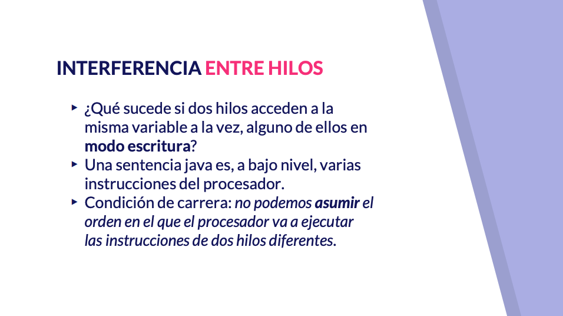
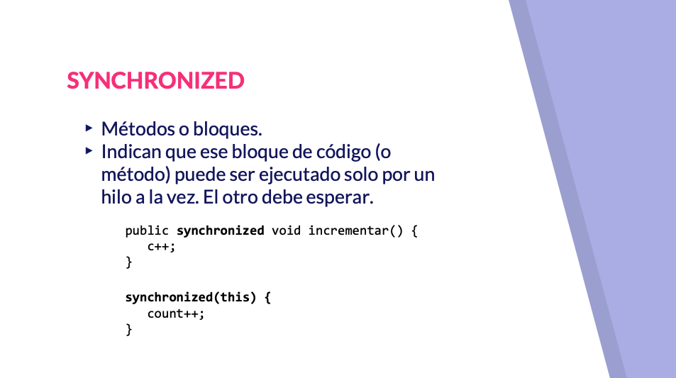
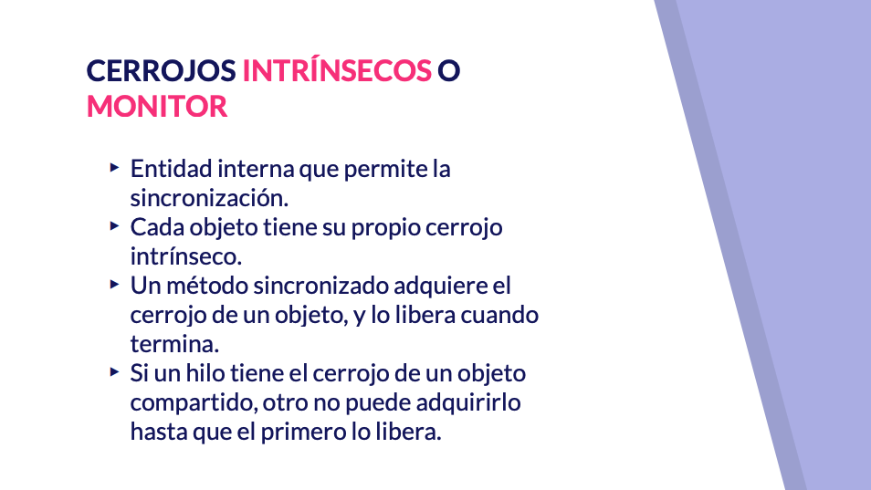


# 33 Colecciones concurrentes 10:19 

[Colecciones concurrentes](pdfs/33_Colecciones_concurrentes.pdf)

## Resumen del Profesor

### 33.1 Problemas en colecciones de acceso concurrente

Las colecciones no están exentas de problemas de concurrencia. Uno de los problemas más clásicos es el conocido como productor- consumidor, donde tenemos una colección compartida de tamaño finito, y varios hilos que producen datos y otros hilos que consumen datos. Dados los problemas de *condición de carrera*, podemos tener que los consumidores pueden correr más que los productores, y dejar la colección vacía, o que los productores vayan más rápido que los consumidores, y la colección se llene. Necesitamos un mecanismo de espera y notificación.

### 33.2 `wait` y `notify`

Son método de la clase `Object`, disponibles en cualquier clase Java que implementemos. Nos permiten poner en espera a un hilo, hasta que se cumpla una determinada condición. Posteriormente, podemos notificarle que ya puede continuar con su ejecución, ya que la condición bloqueante ha dejado de cumplirse. Por ejemplo: si la colección se llena, los productores deben esperar a que los consumidores tomen elementos, para poder seguir produciendo.

```java
public synchronized String take() {

   // Esperamos a que esté disponible
   while (empty) {
      try {
         wait();
      } catch (InterruptedException e) {}
   }
   // Modificamos el estado
   empty = true;
   // Notificamos al productor que el estado ha cambiado
   notifyAll();
   return message;
}

public synchronized void put(String message) {
   // Esperamos a que el mensaje haya sido leído
   while (!empty) {
      try {
         wait();
      } catch (InterruptedException e) {}
   }
   // Cambiamos el estado
   empty = false;
   // Almacenamos el mensaje
   this.message = message;

   // Notificamos al consumidor que el estado ha cambiado.
   notifyAll();
}
```

### 33.3 Colecciones concurrentes

Nos evitan reinventar la rueda, programando soluciones como la del productor–consumidor. Existen diferentes tipos, entre los que están:

* **`BlockingQueue`**: **estructura FIFO que bloquea si la cola se queda llena o vacía**.
* `ConcurrentMap`: Map con operaciones atómicas.
* `ConcurrentNavigableMap`: NaviagleMap con búsquedas aproximadas.

#### 33.3.1 `BlockingQueue`

Se trata de una estructura FIFO: first-in-first-out (primero en entrar, primero en salir). conocida en castellano como *cola*. Java nos ofrece diferentes implementaciones:

* `ArrayBlockingQueue`: debemos construirla con una capacidad inicial fija.
* `LinkedBlockingQueue`: su capacidad inicial es `Integer.MAX_VALUE` (el mayor valor entero que podemos almacenar en un `int`).
* `PriorityBlockingQueue`: permite ordenar los elementos según prioridad.
* ...

## Transcripción


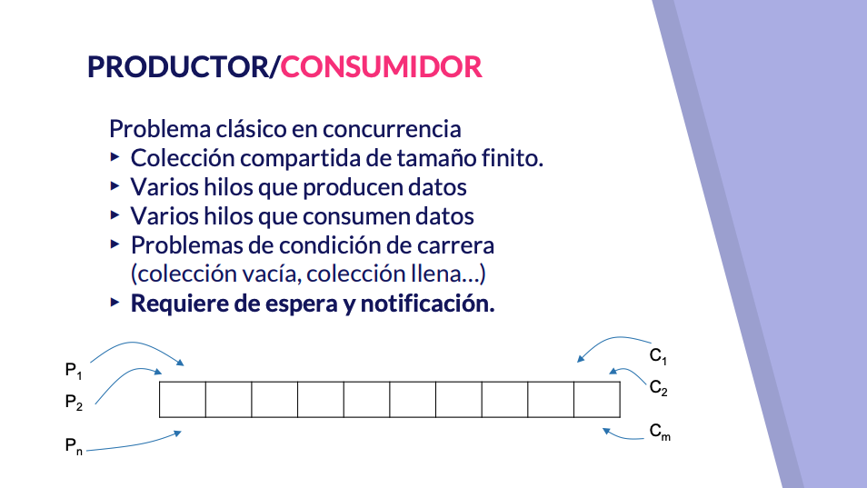


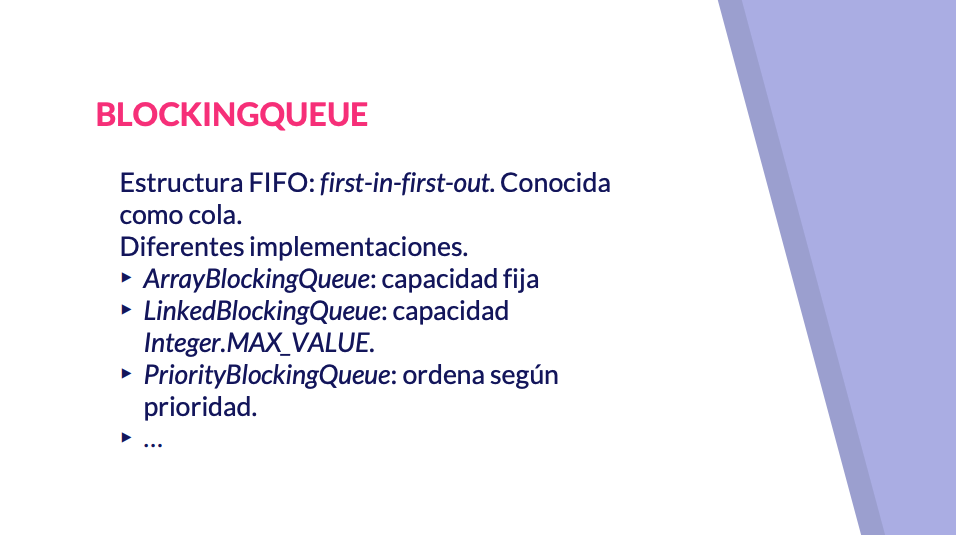

## Contenido adicional 5   

[Programación concurrente](pdfs/29_Programación_concurrente.pdf)

[Thread y su ciclo de vida](pdfs/30_Hilos_y_su_ciclo_de_vida.pdf)

[Runnable, Callable, y ExecutorService](pdfs/31_Runnable_Callable_y_ExecutorService.pdf)

[Código sincronizado y uso de valores atómicos](pdfs/32_Código_sincronizado_y_uso_de_valores_atómicos.pdf)

[Colecciones concurrentes](pdfs/33_Colecciones_concurrentes.pdf)


