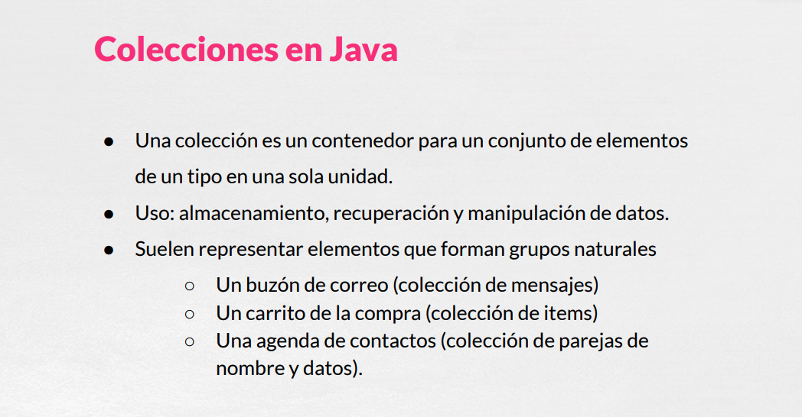
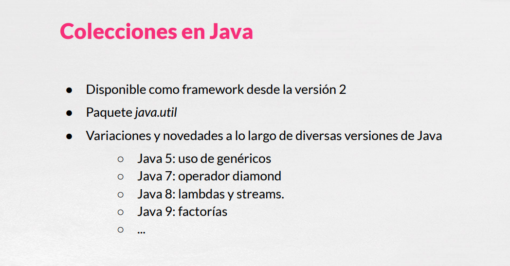
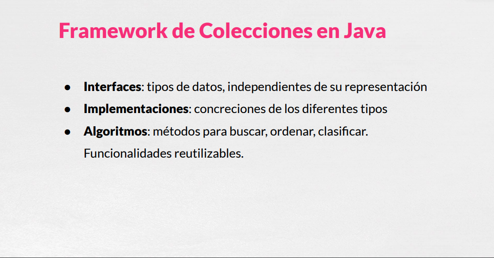
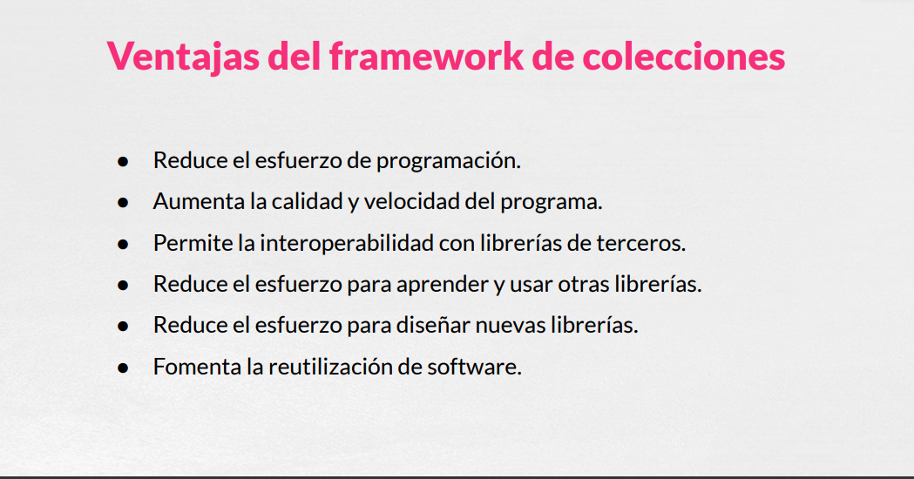

# 01 Introducción

Podemos decir que las colecciones en Java, que una **colección** es particular veremos que existen diferentes tipos, **es un contenedor de elemento de un solo tipo**, en el cual podemos recoger varios objetos que suelen ser todos del mismo tipo o al menos de un tipo podríamos llamar padre en común, porque no entraremos en profundidad en colecciones con herencia de elementos pero también se podría manejar. Por lo que vamos a entender como **Colección un conjunto de elementos de un tipo que se recogen en un solo objeto**, que se trata como una unidad.

El uso está claro es el poder almacenar, recuperar y manipular datos, instancias de otros objeto de una manera conjunta y normalmente suelen representar elementos que forman grupos naturales tanto en la realidad como el mundo software, por ejemplo:

* Un buzón de correo que fuese de correo electrónico pues podría ser una colección de mensaje.
* El carro de compra un carrito de compra en una aplicación web de cualquier supermercado o de Amazon podría ser una colección de items
* Una agenda de contactos por ejemplo de nuestro teléfono móvil pues podría ser una colección también de parejas con el nombre del contacto y los datos del mismo.

Como podemos vernos las colecciones también nos van a servir para tratar problemas del mundo real. 

En Java las colecciones estan disponibles desde la versión 2, es decir desde hace ya bastante tiempo, la versión 2 es de finales de los años 90s, recogida en el paquete *java.util*  y a lo largo de las diferentes versiones de Java han ido teniendo bastante variación, por ejemplo:

* Java 5: En la versión 5 fue en la primera que se incorporó la posibilidad de genéricos, no entraremos aquí en profundidad en el tratamiento de genéricos pero veremos como utilizar este tipo de colecciones.
*  Java 7: En Java 7 se incorporaba la posibilidad de usar el operador Diamond para que nuestro código fuera un poquito más compacto, lo usaremos por defecto.
* Java 8: En la versión 8 de Java el uso de **lambdas** y de los **streams** en conjunción con las colecciones le aporto bastante potencia y la posibilidad de hacer un código que fuese mucho más expresivo * Java 9: En la versión 9 de Java incorporaba los métodos factoría.
* Posteriores versiones han incluido también alguna que otra novedad más, quizás no tan fuertes, no con tanto peso específico, pero si alguna novedad más con respecto al uso de colección.

Veremos como el Framework de Colecciones de Java nos ofrece una serie de elementos, a saber unas **interfaces** es decir unos tipos de datos, unos contratos para algunas clases de implementación, que serán independientes de sus representaciones que nos garantizarán una serie de características, lo iremos conociendo, **implementaciones** para estas interfaces, cada una de ellas es una concreción de los diferentes tipos y nos aportará algo nuevo y fresco en cada uno de los casos y también una serie de **algoritmos** que son métodos en ocasiones comunes para un conjunto de colecciones para poder *buscar*, *ordenar*, *clasificar* objetos y que son reutilizables en muchos casos para diferentes tipos de interfaces o de implementaciones.

